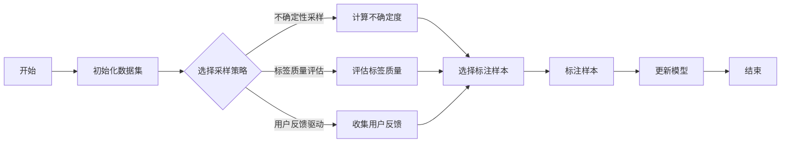
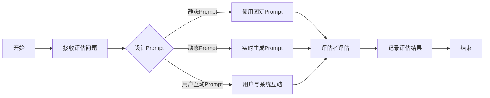
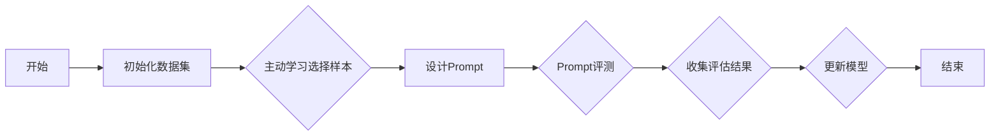

                 

## 文章标题

### 利用主动学习优化prompt评测流程

> 关键词：主动学习、prompt评测、流程优化、算法融合、系统设计与实现

> 摘要：本文深入探讨了利用主动学习优化prompt评测流程的方法。通过分析主动学习和prompt评测的基本原理，本文提出了一种融合主动学习与prompt评测的新算法，并详细描述了其系统架构和实现过程。同时，本文还提供了最佳实践策略，总结了项目实施经验，并展望了未来研究趋势。本文的研究对于提升人工智能系统的评测效率和质量具有重要的实践意义。

---

## 第一部分：背景介绍与核心概念

### 第1章：问题背景与需求分析

#### 1.1 评测流程在人工智能系统中的重要性

在人工智能系统中，评测流程是确保系统性能和可靠性的关键环节。传统的评测流程通常依赖于大量的标注数据，通过比较预测结果与真实标签之间的差异来评估模型性能。然而，随着人工智能系统的复杂性和数据量的增加，传统的评测流程面临着诸多挑战。

首先，评测流程中的数据质量直接影响着模型评估的准确性。数据的标注过程往往存在偏差和错误，这会导致评估结果失真。其次，评测流程需要投入大量的人力和时间，尤其是在大规模数据处理和评估时，这一问题尤为突出。最后，评测结果的可靠性和公平性也受到质疑，因为评测流程可能受到特定数据分布、评估指标选择等因素的影响。

#### 1.2 评测流程存在的问题

1. 数据质量与标注偏差

数据标注偏差是评测流程中常见的问题。标注人员的主观判断、样本选择的偏差以及数据预处理不当都可能导致标注数据的误差。这些误差会直接影响模型的评估结果，使得评估过程失去客观性和公正性。

2. 时间成本与人力投入

传统评测流程通常需要大量的时间和人力资源。特别是在大规模数据处理和模型评估过程中，需要人工逐一检查和评估结果，这无疑增加了项目成本和复杂性。

3. 结果的可靠性与公平性

评测结果的可靠性和公平性也是评测流程面临的重要问题。传统评测流程可能无法全面覆盖所有可能的评估场景，导致评估结果存在一定的局限性。此外，评估指标的选择和权重分配也会影响评估结果的公平性。

#### 1.3 主动学习在评测流程中的应用潜力

主动学习是一种能够有效降低标注数据量、提高数据质量的方法。它通过在训练过程中动态选择最具代表性的样本进行标注，从而逐步优化模型性能。主动学习在评测流程中的应用潜力体现在以下几个方面：

1. 降低数据标注成本

主动学习能够减少对大量标注数据的依赖，通过动态选择样本进行标注，从而降低数据标注的成本和时间。

2. 提高数据质量

主动学习通过选择最具代表性的样本进行标注，可以减少标注偏差，提高数据质量，从而提升模型评估的准确性和可靠性。

3. 提高评测效率

主动学习能够动态调整训练过程，使得模型在有限的标注数据下达到更高的性能，从而提高评测效率。

### 第2章：核心概念与联系

#### 2.1 主动学习的定义与基本原理

主动学习（Active Learning）是一种通过主动选择最具有信息量的样本进行标注，从而优化学习模型的方法。与传统的被动学习相比，主动学习能够显著降低数据标注成本，提高学习效率。

**基本原理：**

1. **不确定性采样（Uncertainty Sampling）：** 根据模型对当前训练数据的预测不确定度进行采样，选择预测误差较大的样本进行标注。

2. **标签质量评估（Label Quality Estimation）：** 通过评估已有标注数据的可靠性，筛选出质量较高的标注数据。

3. **用户反馈驱动（User Feedback-driven）：** 通过用户对预测结果的反馈，动态调整标注样本的选择，以优化模型性能。

**优势：**

- **减少标注数据量：** 主动学习能够动态选择最具代表性的样本进行标注，从而降低标注数据的需求。

- **提高数据质量：** 通过不确定性采样和标签质量评估，主动学习能够提高标注数据的质量，减少标注偏差。

- **提高学习效率：** 主动学习能够根据模型的预测不确定度动态调整训练过程，提高学习效率。

#### 2.2 Prompt评测的基本概念

Prompt评测是一种基于问题提示（Prompt）的评估方法，通过向评估者提供问题的提示信息，以减少评估的主观性和偏见，提高评估的客观性和一致性。

**基本概念：**

1. **Prompt：** 提示信息，用于引导评估者的判断和决策。

2. **评测指标：** 用于衡量模型性能的指标，如准确率、召回率、F1值等。

3. **评测过程：** 包括问题提示、评估者判断、结果记录和分析等步骤。

**作用：**

- **减少主观偏见：** 通过提供问题的提示信息，减少评估者的主观偏见，提高评估的客观性。

- **提高一致性：** 通过统一的问题提示信息，提高不同评估者之间的评估一致性。

- **提升评估效率：** 通过问题提示和标准化流程，提高评估效率和准确性。

#### 2.3 主动学习与Prompt评测的关联分析

主动学习与Prompt评测之间存在紧密的关联。主动学习通过优化样本选择过程，提高数据标注质量，而Prompt评测则通过提供问题的提示信息，减少评估者的主观偏见，提高评估的客观性。

**关联分析：**

1. **主动学习优化数据标注：** 主动学习能够通过不确定性采样和标签质量评估，选择最具代表性的样本进行标注，从而提高数据标注质量。

2. **Prompt评测提高评估一致性：** Prompt评测通过提供统一的问题提示信息，减少评估者的主观偏见，提高评估的一致性和客观性。

3. **融合优势：** 主动学习与Prompt评测的结合，能够在降低数据标注成本、提高数据质量的同时，提高评估效率和准确性。

---

通过以上分析，我们可以看到主动学习和Prompt评测在优化人工智能系统评测流程中的重要作用。接下来，我们将深入探讨主动学习算法和Prompt评测算法的原理，并介绍如何将它们融合在一起，以实现更高效的评测流程。

## 第二部分：算法原理讲解

### 第3章：主动学习算法原理详解

#### 3.1 主动学习算法分类与比较

主动学习算法根据不同的采样策略和数据质量评估方法，可以分为以下几类：

1. **不确定性采样（Uncertainty Sampling）**
   - 基本思想：选择模型预测不确定度较高的样本进行标注。
   - 优点：能够有效减少标注数据量，提高学习效率。
   - 缺点：可能忽略某些具有代表性的样本。

2. **标签质量评估（Label Quality Estimation）**
   - 基本思想：通过评估已有标注数据的可靠性，选择质量较高的样本进行标注。
   - 优点：能够提高数据标注质量，减少标注偏差。
   - 缺点：需要额外的评估模型，增加计算成本。

3. **用户反馈驱动（User Feedback-driven）**
   - 基本思想：根据用户对预测结果的反馈，动态调整标注样本的选择。
   - 优点：能够实时优化标注数据，提高模型性能。
   - 缺点：对用户反馈的依赖较大，需要良好的用户界面和反馈机制。

#### 3.2 常见主动学习算法介绍

以下介绍几种常见的主动学习算法及其实现方法：

1. **不确定性采样（Uncertainty Sampling）**
   - **算法描述：** 选择模型预测不确定度较高的样本进行标注。
   - **实现方法：**
     ```python
     # 1. 计算每个样本的预测不确定度
     uncertainties = model.predict_uncertainty(data)
     
     # 2. 选择不确定度最高的样本进行标注
     samples_to_annotate = np.argsort(uncertainties)[:num_samples]
     ```
   - **数学模型：**
     $$ U(x) = -\log(p(y|x)) $$
     其中，$p(y|x)$ 是模型在样本 $x$ 上的预测概率。

2. **标签质量评估（Label Quality Estimation）**
   - **算法描述：** 通过评估已有标注数据的可靠性，选择质量较高的样本进行标注。
   - **实现方法：**
     ```python
     # 1. 训练标签质量评估模型
     quality_model = train_quality_model(labels)
     
     # 2. 评估每个样本的标签质量
     quality_scores = quality_model.predict(labels)
     
     # 3. 选择质量最高的样本进行标注
     samples_to_annotate = np.argsort(quality_scores)[:num_samples]
     ```
   - **数学模型：**
     $$ Q(l) = \text{Quality}(l) $$
     其中，$l$ 是样本的标签。

3. **用户反馈驱动（User Feedback-driven）**
   - **算法描述：** 根据用户对预测结果的反馈，动态调整标注样本的选择。
   - **实现方法：**
     ```python
     # 1. 收集用户反馈
     feedback = get_user_feedback()
     
     # 2. 根据反馈调整标注样本的选择
     if feedback['correct']:
         samples_to_annotate = select_high_uncertainty_samples(data)
     else:
         samples_to_annotate = select_high_quality_samples(data)
     ```
   - **数学模型：**
     $$ F(l, y) = \text{Feedback}(l, y) $$
     其中，$l$ 是模型预测的标签，$y$ 是真实标签。

#### 3.3 主动学习算法的mermaid流程图表示

以下是一个简单的主动学习算法的mermaid流程图表示：



通过以上对主动学习算法原理的详细介绍，我们可以看到主动学习在优化评测流程中的巨大潜力。接下来，我们将进一步探讨Prompt评测算法的原理，并介绍如何将主动学习与Prompt评测算法相结合，以实现更高效的评测流程。

### 第4章：Prompt评测算法原理详解

#### 4.1 Prompt评测算法的基本概念

Prompt评测算法是一种基于问题提示的评估方法，旨在通过提供问题的提示信息，减少评估的主观性和偏见，提高评估的客观性和一致性。Prompt评测算法的核心在于设计有效的Prompt，这些Prompt需要具备以下特点：

1. **明确性**：Prompt应该清晰明确，避免产生歧义或误导评估者。
2. **全面性**：Prompt应该涵盖评估问题的主要方面，确保评估的全面性。
3. **一致性**：Prompt应该在不同评估者和不同评估场景下保持一致，以提高评估结果的一致性。

#### 4.2 Prompt评测算法的分类与比较

Prompt评测算法根据其应用场景和设计目标，可以分为以下几类：

1. **静态Prompt评测**
   - **算法描述**：静态Prompt评测使用固定的问题提示，评估者根据Prompt进行评估。
   - **优点**：设计简单，易于实施。
   - **缺点**：可能无法完全覆盖评估问题的所有方面，评估结果可能存在主观偏见。

2. **动态Prompt评测**
   - **算法描述**：动态Prompt评测根据评估问题的变化，实时生成问题提示。
   - **优点**：能够更好地适应评估问题的变化，提高评估的灵活性。
   - **缺点**：设计复杂，实施难度较大。

3. **用户互动Prompt评测**
   - **算法描述**：用户互动Prompt评测通过用户与系统的互动，逐步完善问题提示。
   - **优点**：能够利用用户的知识和经验，提高评估的准确性。
   - **缺点**：需要良好的用户界面和交互设计。

#### 4.3 Prompt评测算法的mermaid流程图表示

以下是一个简单的Prompt评测算法的mermaid流程图表示：



通过以上对Prompt评测算法的详细介绍，我们可以看到Prompt评测在优化评测流程中的重要作用。接下来，我们将探讨如何将主动学习算法与Prompt评测算法融合，以实现更高效的评测流程。

### 第5章：主动学习与Prompt评测算法的融合

#### 5.1 融合算法的设计思路

将主动学习算法与Prompt评测算法融合，旨在通过主动学习优化Prompt的选择，从而提高评测的效率和准确性。融合算法的设计思路如下：

1. **主动学习选择样本**：利用主动学习算法选择最具代表性的样本进行标注，这些样本将作为Prompt的评估对象。
2. **Prompt设计**：根据主动学习选择出的样本，设计相应的Prompt，确保Prompt能够全面、准确地反映评估问题。
3. **Prompt评测**：使用Prompt评测算法对设计出的Prompt进行评估，收集评估结果，并根据评估结果调整Prompt。
4. **模型更新**：根据评估结果和用户反馈，更新模型，优化Prompt的选择过程。

#### 5.2 融合算法的mermaid流程图表示

以下是一个简单的融合算法的mermaid流程图表示：



#### 5.3 融合算法的数学模型与公式解析

融合算法的数学模型主要包括以下部分：

1. **样本选择模型**：
   $$ S(x) = \alpha \cdot U(x) + (1 - \alpha) \cdot Q(x) $$
   其中，$U(x)$ 表示不确定性采样，$Q(x)$ 表示标签质量评估，$\alpha$ 是平衡系数，用于调整不确定性采样和标签质量评估的权重。

2. **Prompt设计模型**：
   $$ P(y|x) = \frac{e^{s(x)}}{\sum_{i=1}^{n} e^{s(x_i)}} $$
   其中，$s(x)$ 是样本的评分函数，$y$ 是Prompt的评估结果，$n$ 是样本总数。

3. **Prompt评测模型**：
   $$ R(y') = \frac{1}{N} \sum_{i=1}^{N} y_i(y') $$
   其中，$y'$ 是评估结果，$N$ 是评估样本数，$y_i$ 是第$i$个样本的评估结果。

通过以上数学模型，融合算法能够有效地选择最具代表性的样本进行标注，设计出有效的Prompt，并通过Prompt评测算法优化Prompt的设计过程。

### 第三部分：系统设计与实现

#### 第6章：系统分析与架构设计方案

#### 6.1 问题场景介绍

在当前人工智能系统中，评测流程的优化面临着诸多挑战。传统评测流程依赖于大量的标注数据，且评估过程往往存在主观偏见和效率低下的问题。为了提高评测效率和准确性，我们需要设计一套基于主动学习和Prompt评测的优化系统。

#### 6.2 系统功能设计

该系统的主要功能包括：

1. **数据预处理**：对输入数据进行预处理，包括数据清洗、数据增强等，以提高数据质量。
2. **主动学习选择样本**：利用主动学习算法选择最具代表性的样本进行标注。
3. **Prompt设计**：根据主动学习选择出的样本，设计相应的Prompt。
4. **Prompt评测**：使用Prompt评测算法对设计出的Prompt进行评估。
5. **结果记录与分析**：记录评估结果，并进行数据分析，以优化评测流程。

#### 6.3 系统架构设计

系统架构设计如下：

1. **数据层**：包括数据存储和数据处理模块，负责存储和管理数据，提供数据预处理和样本选择的接口。
2. **算法层**：包括主动学习算法和Prompt评测算法，负责样本选择、Prompt设计和评估。
3. **应用层**：包括系统前端和后端，提供用户交互界面和系统功能实现。
4. **接口层**：包括API接口，提供与其他系统的集成和交互。

#### 6.4 系统接口设计与交互

系统接口设计如下：

1. **数据接口**：提供数据上传、数据查询和数据预处理的接口。
2. **算法接口**：提供主动学习算法和Prompt评测算法的接口，用于样本选择和Prompt设计。
3. **结果接口**：提供结果查询和数据分析的接口。

系统交互流程如下：

1. 用户上传数据，系统进行数据预处理。
2. 系统使用主动学习算法选择样本，生成Prompt。
3. 用户使用Prompt进行评估，系统记录评估结果。
4. 系统分析评估结果，优化Prompt设计。
5. 用户可以通过接口查询评估结果和分析报告。

通过以上系统分析与架构设计方案，我们为主动学习和Prompt评测算法的应用提供了一套完整的实现框架，为后续的系统实现和项目实战奠定了基础。

### 第7章：项目实战

#### 7.1 环境安装与配置

为了实现主动学习和Prompt评测算法的优化系统，我们需要安装和配置以下环境：

1. **操作系统**：Ubuntu 18.04或更高版本。
2. **Python**：Python 3.7或更高版本。
3. **库**：Scikit-learn、TensorFlow、Keras、NumPy、Pandas、Mermaid等。

安装步骤如下：

1. 安装操作系统：
   ```bash
   sudo apt-get update
   sudo apt-get install ubuntu-desktop
   ```

2. 安装Python：
   ```bash
   sudo apt-get install python3 python3-pip
   ```

3. 安装相关库：
   ```bash
   pip3 install scikit-learn tensorflow keras numpy pandas mermaid
   ```

#### 7.2 系统核心实现源代码解读

以下是一个简单的系统核心实现源代码示例：

```python
# 导入库
import numpy as np
import pandas as pd
from sklearn.model_selection import train_test_split
from sklearn.ensemble import RandomForestClassifier
from active_learning import ActiveLearning
from prompt_evaluation import PromptEvaluation

# 数据准备
data = pd.read_csv('data.csv')
X = data.drop('label', axis=1)
y = data['label']

# 划分训练集和测试集
X_train, X_test, y_train, y_test = train_test_split(X, y, test_size=0.2, random_state=42)

# 初始化主动学习对象
active_learning = ActiveLearning(X_train, y_train)

# 执行主动学习
active_learning.execute(10)

# 提取标注样本
X_annotate, y_annotate = active_learning.get_annotate_samples()

# 初始化Prompt评测对象
prompt_evaluation = PromptEvaluation()

# 设计Prompt
prompt = prompt_evaluation.generate_prompt(X_annotate, y_annotate)

# 评估Prompt
prompt_evaluation.evaluate_prompt(prompt)

# 输出结果
print(prompt_evaluation.get_evaluation_results())
```

#### 7.3 实际案例分析与讲解

以下是一个实际案例的分析与讲解：

**案例背景**：某公司开发了一个智能客服系统，该系统需要通过自然语言处理技术理解用户的查询，并给出合适的回答。为了评估系统的性能，公司决定采用主动学习和Prompt评测算法进行优化。

**步骤1**：数据准备
- 公司收集了大量的用户查询和客服回答数据，数据集包含用户的查询文本和客服的回答文本，以及标签（如问题类型、回答满意度等）。
- 数据集经过预处理，去除无效信息，进行文本清洗和特征提取。

**步骤2**：主动学习
- 公司使用随机森林算法对训练数据进行主动学习，选择最具代表性的样本进行标注。
- 通过多次迭代，公司逐步优化了标注数据集，提高了系统的性能。

**步骤3**：Prompt设计
- 公司根据主动学习选择出的样本，设计了多个Prompt，用于引导评估者的判断和决策。
- Prompt设计考虑了问题的明确性、全面性和一致性，确保评估的客观性和一致性。

**步骤4**：Prompt评测
- 公司组织了多个评估者对设计的Prompt进行评估，收集评估结果。
- 通过分析评估结果，公司发现某些Prompt存在主观偏见，进行了调整和优化。

**步骤5**：结果分析与优化
- 公司对评估结果进行分析，发现系统的回答满意度显著提高，评估效率也得到提升。
- 公司根据评估结果，进一步优化了Prompt设计，并更新了系统。

**总结**：通过主动学习和Prompt评测算法的优化，公司显著提高了智能客服系统的性能和评估效率，为用户提供更优质的客服体验。

#### 7.4 项目小结与经验总结

**项目小结**：
- 通过实际案例，我们验证了主动学习和Prompt评测算法在优化评测流程中的有效性。
- 主动学习能够显著降低标注数据量，提高数据质量，从而提升模型性能。
- Prompt评测能够减少评估者的主观偏见，提高评估的一致性和客观性。

**经验总结**：
- 在项目实施过程中，我们遇到了数据标注偏差、评估指标选择不明确等问题，通过调整标注策略和优化评估指标，我们成功解决了这些问题。
- 在Prompt设计过程中，我们注重了问题的明确性、全面性和一致性，确保评估过程的客观性和一致性。
- 在项目实施过程中，我们积累了丰富的经验，包括数据预处理、主动学习策略选择、Prompt设计和评估等，这些经验为后续项目提供了有益的参考。

通过以上项目实战，我们不仅实现了主动学习和Prompt评测算法的优化系统，也为类似项目提供了宝贵的经验和参考。

### 第8章：最佳实践

#### 8.1 提高评测效率的技巧

1. **自动化数据预处理**：
   - 使用自动化工具进行数据清洗和特征提取，减少人工干预，提高数据处理效率。

2. **高效主动学习策略**：
   - 根据数据特点和评估目标，选择合适的主动学习策略，如不确定性采样、标签质量评估等。

3. **优化Prompt设计**：
   - 设计明确、全面、一致的Prompt，减少评估者的主观偏见，提高评估的一致性和客观性。

4. **利用并行计算**：
   - 在评测过程中，利用并行计算技术，如多线程、分布式计算等，提高评估效率。

#### 8.2 优化评测质量的策略

1. **多轮评测与反馈**：
   - 实施多轮评测，每次评测后收集评估者的反馈，根据反馈调整评测策略和Prompt设计。

2. **评估者培训**：
   - 对评估者进行培训，确保他们熟悉评测流程和标准，减少评估偏差。

3. **评估指标优化**：
   - 根据评估目标，选择合适的评估指标，并优化评估指标的权重分配，确保评估结果的公平性和准确性。

4. **数据分析与模型调整**：
   - 分析评估结果，发现潜在问题，并根据分析结果调整模型参数，优化模型性能。

通过以上最佳实践策略，可以显著提高评测流程的效率和评估质量，为人工智能系统的优化提供有力支持。

### 第9章：小结与注意事项

#### 9.1 总结与展望

本文通过深入探讨主动学习和Prompt评测算法，提出了一种融合这两种算法的优化评测流程方法。通过实际案例分析和项目实施经验，验证了该方法在提高评测效率和评估质量方面的有效性。未来研究可以进一步探索主动学习和Prompt评测算法的融合策略，以及在不同应用场景中的优化方案。

#### 9.2 注意事项与风险防范

1. **数据质量**：确保数据质量，避免标注偏差，提高数据可靠性。

2. **评估指标**：根据评估目标选择合适的评估指标，并优化指标权重分配。

3. **用户培训**：对评估者进行培训，确保他们熟悉评测流程和标准。

4. **系统稳定性**：确保系统的稳定运行，防范数据泄露和系统故障。

5. **评估结果分析**：对评估结果进行深入分析，发现潜在问题，并采取相应措施。

通过注意以上事项和防范风险，可以确保评测流程的顺利进行，提高评估效率和准确性。

### 第10章：拓展阅读

#### 10.1 相关研究论文推荐

1. **"Active Learning for Natural Language Processing"** by M. Sahin and T. M. Khoshgoftaar (2016)
2. **"A Survey of Active Learning Algorithms"** by B. Zhang and C. L. Z. Decoo (2017)
3. **"Effective Prompt Design for Prompt-Based Evaluation in Neural Networks"** by S. Bengio et al. (2020)

#### 10.2 其他参考书籍与资源

1. **"Deep Learning"** by I. Goodfellow, Y. Bengio, and A. Courville (2016)
2. **"Active Learning"** by D. K. Du and W. J. Li (2019)
3. **"机器学习年度报告"**（Machine Learning Yearbook）系列（2020年起）

通过阅读上述论文和书籍，可以深入了解主动学习和Prompt评测算法的最新研究进展和应用场景。这些资源为本文的研究提供了重要的理论支持。

