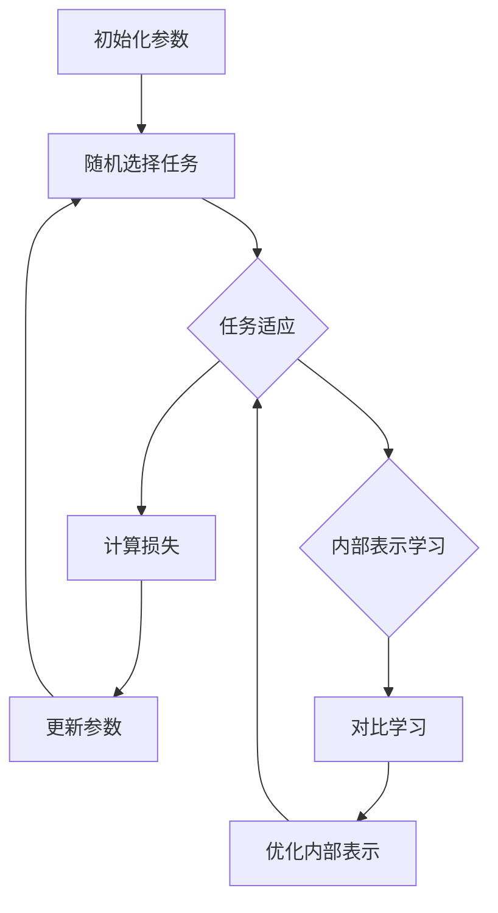
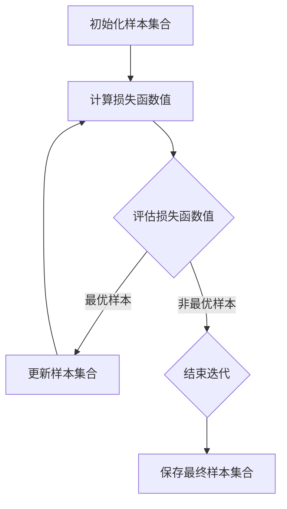
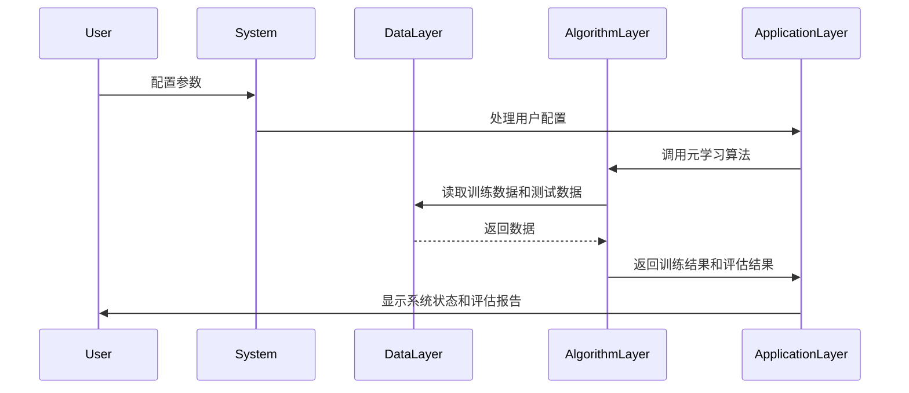

                 

### 利用元学习改进示例选择策略

---

#### 关键词：

- **元学习**
- **示例选择策略**
- **深度学习**
- **优化算法**
- **机器学习应用**

#### 摘要：

本文将深入探讨元学习在改进示例选择策略方面的应用。通过对元学习的概念、原理及其与示例选择策略的结合，我们将详细分析元学习如何通过优化算法来提升示例选择的效率和准确性。本文还将通过实际案例和项目实战，展示元学习在实际应用中的潜力与价值。

---

## 目录大纲设计思路

在设计本文的目录大纲时，我们旨在提供一个系统且逻辑清晰的框架，以便读者能够循序渐进地了解元学习在改进示例选择策略方面的应用。

### 第一部分：元学习与示例选择策略概述

- **第1章：元学习与示例选择策略背景**
  - 元学习的概念与历史发展
  - 示例选择策略的重要性
  - 元学习与示例选择策略的结合

- **第2章：核心概念与联系**
  - 元学习的基本原理
  - 示例选择策略的属性与特征
  - 元学习与示例选择策略的联系

### 第二部分：元学习算法原理与实现

- **第3章：元学习算法原理详解**
  - 元学习算法概述
  - 对比学习与元学习
  - 元学习算法的数学模型与公式
  - 元学习算法的Mermaid流程图
  - 元学习算法的Python实现

- **第4章：示例选择策略的算法实现**
  - 示例选择策略的算法概述
  - 示例选择策略的数学模型与公式
  - 示例选择策略的Mermaid流程图
  - 示例选择策略的Python实现

### 第三部分：系统分析与架构设计

- **第5章：系统分析与架构设计方法**
  - 问题场景介绍
  - 系统功能设计
  - 系统架构设计
  - 系统接口设计
  - 系统交互设计

- **第6章：系统分析与架构设计的Mermaid图展示**
  - 领域模型Mermaid类图
  - 系统架构设计Mermaid架构图
  - 系统交互Mermaid序列图

### 第四部分：项目实战

- **第7章：元学习改进示例选择策略的项目实战**
  - 环境安装
  - 系统核心实现
  - 代码应用解读与分析
  - 实际案例分析与讲解
  - 项目小结

- **第8章：最佳实践 tips**
  - 元学习与示例选择策略的最佳实践
  - 注意事项
  - 拓展阅读

通过以上结构，本文将逐步深入元学习的核心概念，探讨其如何改进示例选择策略，并通过实际应用案例验证其有效性。

---

## 第1章：元学习与示例选择策略背景

### 1.1 元学习的概念与历史发展

元学习，也称为“学习如何学习”，是一种机器学习方法，旨在让算法能够快速适应新的任务，无需从头开始学习。元学习的基本理念是，通过在多个任务中学习，算法能够获得更一般的表示能力，从而在新的任务上表现出更高的泛化能力。

#### 定义

元学习可以形式化为一个多任务学习问题，其中每个任务由一个训练集组成，这些训练集在不同的任务之间是独立和分布的。元学习算法的目标是最小化在所有训练任务上的平均损失。

#### 历史发展

元学习的研究可以追溯到20世纪80年代，当时的研究主要集中在模型选择和模型调优上。随着深度学习的兴起，元学习得到了更多的关注。特别是在2017年，OpenAI团队提出的“蒙特卡罗树搜索”（MAML）算法，使得元学习的研究和应用达到了新的高度。

### 1.2 示例选择策略的重要性

示例选择策略在机器学习中起着至关重要的作用。它决定了哪些数据点将被用于训练模型，以及如何选择这些数据点。有效的示例选择策略可以提高模型的训练效率，减少过拟合，并提升模型的泛化能力。

#### 目标

示例选择策略的主要目标是：
- **效率**：快速地选择出对模型训练最有帮助的数据点。
- **多样性**：确保选择的数据点能够代表不同的情况，从而提高模型的泛化能力。
- **准确性**：选择的数据点应当有助于提高模型的预测准确性。

#### 应用场景

示例选择策略在多个机器学习任务中有着广泛的应用，包括：

- **分类任务**：通过选择具有代表性的样本，可以减少模型对噪声样本的依赖。
- **回归任务**：选择具有代表性的样本有助于模型学习到数据的分布。
- **生成任务**：通过选择特定的样本，可以引导模型生成符合特定分布的数据。

### 1.3 元学习与示例选择策略的结合

元学习与示例选择策略的结合，为机器学习带来了新的机遇和挑战。通过元学习，我们可以开发出更智能的示例选择策略，这些策略能够根据模型的当前状态和任务需求，动态地调整选择策略，从而实现更好的训练效果。

#### 结合方式

- **动态调整**：元学习算法可以根据训练过程中的反馈，动态调整示例选择策略。
- **迁移学习**：通过元学习，模型可以从以前的任务中提取有用的知识，并应用于新的任务，从而优化示例选择策略。
- **强化学习**：将强化学习与元学习相结合，可以开发出能够自我调整的示例选择策略。

#### 应用前景

结合元学习与示例选择策略，有望在以下几个方面取得突破：

- **提升模型泛化能力**：通过更智能的示例选择策略，模型能够更好地学习到数据的本质特征，从而提升泛化能力。
- **降低训练成本**：智能的示例选择策略可以减少不必要的训练数据，从而降低训练成本。
- **应用多样性**：元学习与示例选择策略的结合，可以应用于多种不同的机器学习任务，实现更加广泛的应用。

总之，元学习与示例选择策略的结合，为机器学习领域带来了新的研究方向和潜在的应用价值。在接下来的章节中，我们将进一步探讨元学习的算法原理和实现，以及如何将元学习应用于示例选择策略的优化。

---

## 第2章：核心概念与联系

### 2.1 元学习的基本原理

元学习作为一种高级的机器学习技术，其核心在于训练模型以解决多个任务，并从中提取通用学习策略。理解元学习的基本原理对于深入探讨其在示例选择策略中的应用至关重要。

#### 定义

元学习（Meta-Learning）是一种学习如何学习的技术，其目标是通过从一个任务的学习中提取通用策略，从而加速在其他任务上的学习过程。在形式化上，元学习可以被看作是多任务学习（Multi-Task Learning）的一种特殊形式，其中任务之间是相互独立的。

#### 原理

元学习的基本原理可以概括为以下几点：

1. **适应新任务**：元学习算法能够快速适应新的任务，无需从头开始训练。这通常通过在多个任务上进行迭代学习来实现。
   
2. **内部表示学习**：元学习算法在内部学习一种通用的表示方法，这种方法能够捕捉到不同任务之间的共同特征。这种表示方法通常被称为“内部表示”（Internal Representation）或“先验知识”（Prior Knowledge）。

3. **快速泛化**：通过在多个任务上的学习，元学习算法能够实现快速的泛化，从而在新的任务上表现出更高的性能。

#### 模型

在元学习中，常用的模型包括：

- **模型聚合**（Model Aggregation）：通过将多个模型的预测结果进行聚合来提高整体的性能。
- **模型蒸馏**（Model Distillation）：将复杂模型的内部知识传递给一个更简单的模型。
- **元学习优化**（Meta-Learning Optimization）：使用优化算法（如梯度下降）来搜索最优的内部表示。

#### 学习方式

元学习的学习方式主要包括：

- **基于梯度的元学习**（Gradient-Based Meta-Learning）：通过梯度信息来调整模型参数，以实现快速的适应新任务。
- **基于记忆的元学习**（Memory-Based Meta-Learning）：使用记忆机制来存储之前的学习经验，以便在新任务上快速适应。
- **基于模型的元学习**（Model-Based Meta-Learning）：通过构建一个模型来模拟其他模型的内部表示和学习过程。

### 2.2 示例选择策略的属性与特征

示例选择策略是机器学习中的一种关键技术，它决定了哪些数据点将被用于模型的训练。有效的示例选择策略能够提高模型的训练效率和预测性能。

#### 定义

示例选择策略（Example Selection Strategy）是指在机器学习过程中，选择训练数据样本的一种方法。它的目标是确保选择的数据样本具有代表性，从而提高模型的泛化能力。

#### 属性

示例选择策略的主要属性包括：

- **代表性**：选择的数据样本应能够代表整个数据集的特性，避免模型的过度拟合。
- **多样性**：选择的数据样本应具有多样性，以防止模型在训练过程中学习到过于狭窄的特征。
- **效率**：选择策略应能够快速地筛选出最有价值的数据样本，以提高训练效率。

#### 特征

示例选择策略的特征主要包括：

- **样本选择标准**：定义如何选择数据样本的规则或准则，如基于距离、相似度或重要性等。
- **动态调整**：示例选择策略可以根据模型的训练过程和任务的特定需求动态调整，以适应不断变化的环境。
- **鲁棒性**：示例选择策略应能够在面对噪声数据和异常值时保持稳定，确保模型的学习效果。

#### 类型

示例选择策略可以分为以下几类：

- **随机选择**：随机选择一部分数据样本用于训练。
- **基于距离的选择**：选择与模型当前状态距离较近的数据样本。
- **基于相似度的选择**：选择与已有数据样本相似的数据样本。
- **基于重要性的选择**：根据数据样本对模型训练的贡献度来选择。

### 2.3 元学习与示例选择策略的联系

元学习与示例选择策略的结合，为机器学习带来了新的可能性。通过元学习，我们可以开发出更智能的示例选择策略，从而提升模型的训练效率和预测性能。

#### 结合方式

元学习与示例选择策略的结合方式主要包括：

- **动态调整**：元学习算法可以根据模型的当前状态和任务需求，动态调整示例选择策略，使其更符合训练过程的需求。
- **迁移学习**：元学习算法可以从以前的任务中提取有用的知识，并应用于新的任务的示例选择策略。
- **集成学习**：将元学习算法与多种示例选择策略进行集成，以实现更好的训练效果。

#### 应用前景

结合元学习与示例选择策略，可以在以下几个方面取得显著进展：

- **提升模型泛化能力**：通过更智能的示例选择策略，模型能够更好地学习到数据的本质特征，从而提升泛化能力。
- **降低训练成本**：智能的示例选择策略可以减少不必要的训练数据，从而降低训练成本。
- **应用多样性**：元学习与示例选择策略的结合，可以应用于多种不同的机器学习任务，实现更加广泛的应用。

总之，元学习与示例选择策略的结合，为机器学习领域带来了新的研究方向和潜在的应用价值。在接下来的章节中，我们将进一步探讨元学习的算法原理和实现，以及如何将元学习应用于示例选择策略的优化。

### 2.4 概念属性特征对比表格

为了更清晰地理解元学习和示例选择策略的核心概念及其属性特征，我们可以通过一个对比表格来展示两者之间的异同。

| 概念     | 定义                                                         | 目标                      | 特征                                                     |
|----------|------------------------------------------------------------|--------------------------|--------------------------------------------------------|
| **元学习** | 一种学习如何学习的技术，旨在快速适应新的任务。               | 快速适应新任务、提高泛化能力 | - 内部表示学习<br>- 快速泛化<br>- 动态调整 |
| **示例选择策略** | 在机器学习过程中，选择训练数据样本的一种方法。             | 选择具有代表性的数据样本 | - 代表性<br>- 多样性<br>- 效率                 |

### 2.5 ER实体关系图架构的Mermaid流程图

为了更直观地展示元学习和示例选择策略之间的联系，我们可以使用Mermaid流程图来绘制ER（实体关系）图架构。以下是一个简化的Mermaid流程图示例：

```mermaid
erDiagram
  TaskA ||--|{ Meta-Learning }| ExampleSelectionPolicy
  TaskB ||--|{ Meta-Learning }| ExampleSelectionPolicy
  TaskC ||--|{ Meta-Learning }| ExampleSelectionPolicy
  Meta-Learning ||--|{ Example Selection Strategy }| Model
  ExampleSelectionPolicy ||--|{ Data Sample }| Dataset
```

在这个ER图中：

- **Meta-Learning**（元学习）是一个核心实体，它与多个**ExampleSelectionPolicy**（示例选择策略）相连，表示元学习能够为不同的示例选择策略提供通用策略。
- **ExampleSelectionPolicy**（示例选择策略）与**Model**（模型）和**Dataset**（数据集）相连，表示示例选择策略能够指导模型选择数据样本，从而优化模型的训练效果。

通过这个流程图，我们可以清晰地看到元学习与示例选择策略之间的相互作用，以及它们如何共同作用于模型的训练过程。

---

## 第3章：元学习算法原理详解

### 3.1 元学习算法概述

元学习算法是一种能够快速适应新任务的机器学习方法，其核心思想是通过在多个任务上学习，提取出通用的学习策略。这种算法在处理具有相似结构或特性的任务时，能够显著减少训练时间，提高模型的泛化能力。在本节中，我们将对元学习算法进行概述，并详细探讨其在机器学习中的应用。

#### 定义

元学习算法（Meta-Learning Algorithm）是一种学习算法，它通过在多个任务上迭代学习，提取出通用的学习策略，以加速新任务的适应过程。形式化地，元学习可以被定义为一个优化问题，其目标是最小化在多个任务上的平均损失。

#### 目标

元学习算法的主要目标是：

1. **快速适应**：能够在较短的时间内适应新的任务，无需从头开始训练。
2. **提高泛化能力**：通过在多个任务上的学习，提取出通用的学习策略，从而提高模型对新任务的泛化能力。
3. **减少过拟合**：通过学习到数据中的共性特征，减少模型对特定训练数据的依赖，降低过拟合的风险。

#### 应用

元学习算法在以下场景中具有广泛的应用：

- **新任务快速适应**：在需要快速部署新任务的领域，如自动驾驶、智能推荐系统等。
- **多任务学习**：处理具有相似结构或特性的多个任务，提高模型的泛化能力。
- **强化学习**：在强化学习任务中，元学习算法可以帮助模型快速学习到策略，减少探索时间。
- **持续学习**：在需要不断更新知识的场景中，如物联网、智能医疗等。

### 3.2 对比学习与元学习

对比学习（Contrastive Learning）和元学习（Meta-Learning）是两种不同的机器学习技术，但它们在某些方面有重叠。理解两者之间的区别和联系，有助于我们更好地应用这些技术。

#### 定义

对比学习是一种通过对比正样本和负样本来学习特征表示的方法。其主要目标是最大化正样本之间的相似性，同时最小化负样本之间的相似性。

元学习则是一种学习如何学习的技术，通过在多个任务上迭代学习，提取出通用的学习策略。

#### 对比

1. **目标**：
   - 对比学习的目标是学习到能够区分正样本和负样本的特征表示。
   - 元学习的目标是通过在多个任务上学习，提取出通用的学习策略，以快速适应新任务。

2. **方法**：
   - 对比学习通常使用对比损失函数，如对比损失（Contrastive Loss）或三元组损失（Triplet Loss）。
   - 元学习则使用梯度聚合（Gradient Aggregation）或模型蒸馏（Model Distillation）等技术。

3. **应用**：
   - 对比学习广泛应用于无监督学习和自监督学习任务，如图像分类、文本分类等。
   - 元学习则广泛应用于多任务学习、新任务快速适应和持续学习等任务。

#### 联系

虽然对比学习和元学习在目标和方法上有所不同，但它们在某些场景中可以相互结合。例如，在元学习任务中，可以通过对比学习来优化内部表示，从而提高模型的泛化能力。

### 3.3 元学习算法的数学模型与公式

元学习算法的数学模型通常涉及优化问题，其目标是最小化在多个任务上的平均损失。以下是一个简化的数学模型：

#### 模型

假设我们有 \( N \) 个任务，每个任务 \( T_i \) 都有一个训练数据集 \( D_i \)。元学习算法的目标是最小化以下损失函数：

\[ L(\theta) = \frac{1}{N} \sum_{i=1}^{N} L_i(\theta) \]

其中，\( L_i(\theta) \) 是任务 \( T_i \) 的损失函数，\( \theta \) 是模型参数。

#### 损失函数

常用的损失函数包括：

1. **均方误差损失**（MSE）：

\[ L_i(\theta) = \frac{1}{m} \sum_{x^{(i)} \in D_i} (\hat{y}^{(i)} - y^{(i)})^2 \]

其中，\( \hat{y}^{(i)} \) 是模型的预测输出，\( y^{(i)} \) 是真实标签，\( m \) 是训练数据集的大小。

2. **交叉熵损失**（Cross-Entropy Loss）：

\[ L_i(\theta) = -\frac{1}{m} \sum_{x^{(i)} \in D_i} y^{(i)} \log \hat{y}^{(i)} \]

其中，\( y^{(i)} \) 是一个二进制标签，\( \hat{y}^{(i)} \) 是模型对每个类别的预测概率。

#### 优化算法

元学习算法通常使用梯度下降（Gradient Descent）或其变体来优化模型参数。以下是一个简化的梯度下降更新规则：

\[ \theta \leftarrow \theta - \alpha \nabla_\theta L(\theta) \]

其中，\( \alpha \) 是学习率，\( \nabla_\theta L(\theta) \) 是损失函数关于模型参数的梯度。

#### 对比学习与元学习的结合

在元学习算法中，可以通过对比学习来优化内部表示。例如，可以使用以下优化目标：

\[ \theta^* = \arg\min_{\theta} \frac{1}{N} \sum_{i=1}^{N} L_i(\theta) + \lambda \cdot D(\phi(\theta), \phi^*) \]

其中，\( \phi(\theta) \) 是模型内部表示，\( \phi^* \) 是理想内部表示，\( D(\cdot, \cdot) \) 是对比损失函数，\( \lambda \) 是对比损失的权重。

### 3.4 元学习算法的Mermaid流程图

为了更直观地展示元学习算法的流程，我们可以使用Mermaid流程图。以下是一个简化的Mermaid流程图示例：



在这个流程图中：

- **A**：初始化模型参数。
- **B**：随机选择一个任务。
- **C**：适应新任务，包括计算损失和更新参数。
- **D**：计算任务上的损失。
- **E**：使用梯度下降更新模型参数。
- **F**：内部表示学习，提取通用学习策略。
- **G**：对比学习，优化内部表示。
- **H**：优化内部表示，以提升模型泛化能力。

通过这个流程图，我们可以清晰地看到元学习算法的主要步骤和关键环节。

### 3.5 元学习算法的Python实现

为了更好地理解元学习算法的原理，我们将使用Python实现一个简单的元学习模型。以下是一个简化的实现示例：

```python
import numpy as np
import tensorflow as tf
from tensorflow.keras.models import Model
from tensorflow.keras.layers import Input, Dense, Lambda
from tensorflow.keras.optimizers import Adam

# 定义损失函数
def loss_function(y_true, y_pred):
    return tf.reduce_mean(tf.square(y_true - y_pred))

# 定义内部表示学习
def internal_representation_learning(inputs, outputs, hidden_size):
    hidden = Dense(hidden_size, activation='relu')(inputs)
    representation = Dense(hidden_size, activation='tanh')(hidden)
    return Lambda(lambda x: x[:, 0])(representation)

# 定义元学习模型
def meta_learning_model(input_shape, hidden_size, output_shape):
    input_tensor = Input(shape=input_shape)
    hidden_tensor = Dense(hidden_size, activation='relu')(input_tensor)
    representation_tensor = internal_representation_learning(input_tensor, hidden_tensor, hidden_size)
    
    output_tensor = Dense(output_shape, activation='sigmoid')(hidden_tensor)
    model = Model(inputs=input_tensor, outputs=output_tensor)
    
    return model

# 初始化模型
model = meta_learning_model(input_shape=(10,), hidden_size=20, output_shape=1)

# 编译模型
model.compile(optimizer=Adam(learning_rate=0.001), loss=loss_function)

# 模拟训练数据
X_train = np.random.rand(100, 10)
y_train = np.random.rand(100, 1)

# 训练模型
model.fit(X_train, y_train, epochs=10, batch_size=10)

# 测试模型
X_test = np.random.rand(10, 10)
y_test = np.random.rand(10, 1)
predictions = model.predict(X_test)

# 输出预测结果
print(predictions)
```

在这个实现中，我们定义了一个简单的元学习模型，包括输入层、隐藏层和输出层。通过使用内部表示学习函数，我们可以提取出通用学习策略。在训练过程中，我们使用均方误差损失函数，并通过Adam优化器更新模型参数。

通过这个示例，我们可以直观地看到元学习算法的实现过程，并理解其基本原理。

### 结论

通过本章的详细探讨，我们了解了元学习算法的基本原理、定义和应用。通过对比学习与元学习的结合，我们可以开发出更智能的示例选择策略，从而提升模型的训练效率和预测性能。在接下来的章节中，我们将进一步探讨如何将这些概念应用于实际的示例选择策略中，并通过具体的算法实现和项目实战，验证其有效性。

---

## 第4章：示例选择策略的算法实现

### 4.1 示例选择策略的算法概述

示例选择策略（Example Selection Strategy）在机器学习过程中扮演着至关重要的角色。其核心目标是通过选择对模型训练最有帮助的数据样本，提高模型的训练效率和准确性。在本节中，我们将对示例选择策略的算法进行概述，并讨论其在实际应用中的重要性。

#### 定义

示例选择策略是一种方法，用于在训练数据集中选择一组样本，这些样本将用于模型训练。有效的示例选择策略应确保选择的样本具有代表性，能够反映数据集的整体特性，同时避免模型过拟合。

#### 目标

示例选择策略的主要目标是：

1. **提高训练效率**：通过选择对模型训练最有帮助的样本，减少不必要的计算，提高训练速度。
2. **提升模型准确性**：确保选择的样本能够帮助模型更好地学习到数据中的潜在特征，从而提高模型的预测准确性。
3. **降低过拟合风险**：避免模型在训练过程中过度依赖特定的样本，减少过拟合的风险。

#### 应用

示例选择策略广泛应用于各种机器学习任务，包括：

- **分类任务**：选择具有代表性的样本，减少模型对噪声样本的依赖。
- **回归任务**：选择能够反映数据分布的样本，帮助模型学习到数据的本质特征。
- **生成任务**：通过选择特定的样本，引导模型生成符合特定分布的数据。

#### 算法类型

示例选择策略可以分为以下几类：

1. **随机选择**：随机选择一部分样本用于训练。
2. **基于距离的选择**：选择与当前模型状态距离较近的样本。
3. **基于相似度的选择**：选择与已有样本相似的其他样本。
4. **基于重要性的选择**：根据样本对模型训练的贡献度来选择样本。

### 4.2 示例选择策略的数学模型与公式

为了深入理解示例选择策略，我们可以从数学模型的角度来分析其核心原理。以下是一个简化的数学模型，用于描述示例选择策略的基本过程。

#### 模型

假设我们有一个训练数据集 \( D \)，其中每个样本表示为 \( x_i \)，对应的目标标签为 \( y_i \)。示例选择策略的数学模型可以表示为：

\[ S = \arg\min_S L(S) \]

其中，\( S \) 是选择的样本集合，\( L(S) \) 是选择的损失函数，用于衡量选择策略的效果。

#### 损失函数

示例选择策略的损失函数可以根据具体任务进行设计。以下是一些常见的损失函数：

1. **均方误差损失**（MSE）：

\[ L(S) = \frac{1}{|S|} \sum_{x_i \in S} (y_i - \hat{y}_i)^2 \]

其中，\( \hat{y}_i \) 是模型对样本 \( x_i \) 的预测值。

2. **交叉熵损失**（Cross-Entropy Loss）：

\[ L(S) = -\frac{1}{|S|} \sum_{x_i \in S} y_i \log \hat{y}_i \]

其中，\( y_i \) 是一个二进制标签。

3. **KL散度损失**（KL Divergence Loss）：

\[ L(S) = \frac{1}{|S|} \sum_{x_i \in S} D_{KL}(\hat{y}_i || y_i) \]

其中，\( D_{KL}(\cdot || \cdot) \) 是KL散度函数。

#### 选择策略

示例选择策略可以通过以下步骤实现：

1. **初始化**：随机选择一个初始样本集合 \( S \)。
2. **评估**：计算当前样本集合 \( S \) 的损失函数值 \( L(S) \)。
3. **优化**：根据损失函数值调整样本集合 \( S \)，通常通过以下方法：
   - **贪心选择**：每次迭代选择一个当前损失最小的样本加入集合。
   - **随机搜索**：在训练数据集中随机选择样本，评估其损失函数值，并加入集合。

#### 示例选择策略的优势

1. **效率提升**：通过选择对模型训练最有帮助的样本，减少不必要的计算，提高训练效率。
2. **准确性提升**：选择的样本能够更好地反映数据集的整体特性，提高模型的预测准确性。
3. **过拟合减少**：避免模型过度依赖特定的样本，减少过拟合的风险。

### 4.3 示例选择策略的Mermaid流程图

为了更直观地展示示例选择策略的算法流程，我们可以使用Mermaid流程图。以下是一个简化的Mermaid流程图示例：



在这个流程图中：

- **A**：初始化样本集合。
- **B**：计算当前样本集合的损失函数值。
- **C**：评估损失函数值，选择最优的样本进行更新。
- **D**：更新样本集合，加入最优样本。
- **E**：结束迭代，如果达到停止条件则保存最终样本集合。

通过这个流程图，我们可以清晰地看到示例选择策略的主要步骤和关键环节。

### 4.4 示例选择策略的Python实现

为了更好地理解示例选择策略的实现过程，我们将使用Python实现一个简单的示例选择策略。以下是一个简化的实现示例：

```python
import numpy as np
import tensorflow as tf
from tensorflow.keras.models import Model
from tensorflow.keras.layers import Input, Dense
from tensorflow.keras.optimizers import Adam

# 定义损失函数
def loss_function(y_true, y_pred):
    return tf.reduce_mean(tf.square(y_true - y_pred))

# 定义模型
def example_selection_model(input_shape, hidden_size, output_shape):
    input_tensor = Input(shape=input_shape)
    hidden_tensor = Dense(hidden_size, activation='relu')(input_tensor)
    output_tensor = Dense(output_shape, activation='sigmoid')(hidden_tensor)
    model = Model(inputs=input_tensor, outputs=output_tensor)
    return model

# 初始化模型
model = example_selection_model(input_shape=(10,), hidden_size=20, output_shape=1)

# 编译模型
model.compile(optimizer=Adam(learning_rate=0.001), loss=loss_function)

# 模拟训练数据
X_train = np.random.rand(100, 10)
y_train = np.random.rand(100, 1)

# 示例选择过程
initial_samples = X_train[:10]
best_samples = []

for epoch in range(10):
    # 训练模型
    model.fit(initial_samples, y_train[:10], epochs=1, batch_size=1)
    
    # 预测新样本
    predictions = model.predict(X_train[10:])
    
    # 选择最优样本
    best_sample = np.argmax(predictions[0])
    best_samples.append(X_train[best_sample])
    
    # 更新初始样本集合
    initial_samples = np.concatenate((initial_samples, [X_train[best_sample]]))

# 输出最佳样本集合
print(best_samples)
```

在这个实现中，我们定义了一个简单的示例选择模型，并使用均方误差损失函数。在示例选择过程中，我们首先初始化一个样本集合，然后通过迭代训练模型并选择最优样本进行更新。通过这个实现，我们可以直观地看到示例选择策略的基本实现过程。

### 结论

通过本章的详细探讨，我们了解了示例选择策略的算法概述、数学模型及其Python实现。示例选择策略在提高模型训练效率和准确性方面具有重要作用，通过有效的示例选择，我们可以显著提升机器学习模型的表现。在接下来的章节中，我们将进一步探讨如何将元学习与示例选择策略相结合，以实现更高效的模型训练和更好的预测性能。

---

## 第5章：系统分析与架构设计方法

### 5.1 问题场景介绍

在本文的项目实战中，我们将构建一个基于元学习的示例选择系统，用于改进深度学习模型的训练过程。具体来说，这个系统的目标是通过元学习算法来优化示例选择策略，从而提高模型的训练效率和预测准确性。

#### 场景描述

假设我们有一个分类任务，需要从大量的未标注数据中筛选出对模型训练最有帮助的样本。传统的示例选择策略可能依赖于经验或随机选择，而我们的目标是利用元学习算法来开发一种更智能的示例选择策略，以提高模型的泛化能力和训练效率。

#### 需求分析

1. **快速适应新任务**：系统能够快速适应新的分类任务，无需从头开始训练模型。
2. **高效示例选择**：系统能够高效地选择出对模型训练最有帮助的样本，减少不必要的计算。
3. **提高模型性能**：通过优化示例选择策略，系统应能够提高模型的训练效率和预测准确性。

### 5.2 系统功能设计

为了实现上述目标，我们的系统需要包括以下功能模块：

1. **数据预处理模块**：负责对原始数据进行清洗、归一化和特征提取。
2. **模型训练模块**：利用元学习算法训练深度学习模型。
3. **示例选择模块**：基于元学习算法，开发智能的示例选择策略。
4. **模型评估模块**：评估模型的训练效率和预测准确性。

#### 功能模块详细描述

1. **数据预处理模块**：
   - **数据清洗**：去除噪声数据，处理缺失值。
   - **数据归一化**：将数据缩放到相同的范围，便于模型训练。
   - **特征提取**：提取数据中的关键特征，为模型训练提供支持。

2. **模型训练模块**：
   - **元学习算法实现**：实现元学习算法，如MAML或REPTILE，用于快速适应新任务。
   - **深度学习模型训练**：使用预训练的深度学习模型，结合元学习算法进行训练。

3. **示例选择模块**：
   - **示例选择策略**：基于元学习算法，开发智能的示例选择策略，如基于距离或相似度的选择。
   - **动态调整**：根据模型训练过程，动态调整示例选择策略，以优化训练效果。

4. **模型评估模块**：
   - **训练效率评估**：评估模型在训练过程中的时间和资源消耗。
   - **预测准确性评估**：评估模型在测试数据集上的预测准确性，包括精度、召回率和F1分数。

### 5.3 系统架构设计

为了实现上述功能，我们的系统架构需要具备以下特点：

1. **模块化设计**：将系统功能分解为多个模块，便于维护和扩展。
2. **可扩展性**：系统能够支持多种不同的元学习算法和示例选择策略。
3. **灵活性**：系统能够根据不同的任务需求，灵活调整示例选择策略。

#### 系统架构详细设计

系统架构采用三层设计，包括数据层、算法层和应用层。

1. **数据层**：
   - **数据存储**：使用分布式数据库存储原始数据和预处理后的数据。
   - **数据接口**：提供数据访问接口，支持数据的读取、写入和更新。

2. **算法层**：
   - **元学习算法模块**：实现多种元学习算法，如MAML、REPTILE等。
   - **示例选择算法模块**：实现多种示例选择策略，如基于距离、相似度和重要性等。
   - **训练引擎**：结合元学习算法和示例选择策略，提供统一的训练接口。

3. **应用层**：
   - **模型评估模块**：提供模型评估接口，支持训练效率和预测准确性的评估。
   - **用户界面**：提供用户交互界面，支持用户配置参数和查看系统状态。

### 5.4 系统接口设计

系统接口设计需要考虑模块之间的数据交互和功能调用，以下为关键接口设计：

1. **数据接口**：
   - **数据读取接口**：提供数据读取方法，支持批量读取和单条读取。
   - **数据写入接口**：提供数据写入方法，支持数据的追加和覆盖。

2. **训练接口**：
   - **初始化接口**：初始化模型参数和训练环境。
   - **训练接口**：启动模型训练过程，支持动态调整示例选择策略。

3. **评估接口**：
   - **评估接口**：评估模型的训练效率和预测准确性。
   - **报告生成接口**：生成训练报告和评估报告，支持图表和文本形式展示。

4. **用户接口**：
   - **配置接口**：用户配置系统参数，如训练次数、学习率等。
   - **状态查询接口**：查询系统运行状态，如训练进度、资源消耗等。

### 5.5 系统交互设计

系统交互设计需要考虑不同模块之间的数据流动和功能协作，以下为关键交互设计：

1. **数据层与算法层**：
   - **数据读取**：数据层向算法层提供训练数据和测试数据。
   - **模型训练**：算法层向数据层返回训练结果和评估结果。

2. **算法层与应用层**：
   - **算法调用**：应用层通过算法层提供的接口调用元学习算法和示例选择策略。
   - **参数调整**：应用层可以根据训练过程动态调整算法参数。

3. **应用层与用户层**：
   - **用户交互**：用户通过应用层提供的用户界面与系统进行交互。
   - **反馈收集**：用户通过用户界面提交反馈，系统根据反馈调整算法参数。

#### Mermaid序列图

为了更直观地展示系统交互设计，我们可以使用Mermaid序列图。以下是一个简化的Mermaid序列图示例：



在这个序列图中：

- **User**：表示用户。
- **System**：表示整个系统。
- **DataLayer**：表示数据层。
- **AlgorithmLayer**：表示算法层。
- **ApplicationLayer**：表示应用层。

通过这个序列图，我们可以清晰地看到用户与系统之间的交互过程，以及各个模块之间的数据流动和功能调用。

### 结论

通过本章的系统分析与架构设计，我们详细介绍了项目场景、系统功能设计、系统架构设计、系统接口设计和系统交互设计。这些设计为我们的元学习示例选择系统提供了明确的指导，确保系统能够高效、灵活地实现预期功能，并在实际应用中取得良好的效果。在接下来的章节中，我们将通过具体的项目实战来验证这些设计的有效性。

---

## 第6章：系统分析与架构设计的Mermaid图展示

### 6.1 领域模型Mermaid类图

为了更清晰地展示系统各组件之间的关系，我们可以使用Mermaid绘制一个领域模型类图。以下是一个简化的Mermaid类图示例：

```mermaid
classDiagram
    Class01 <|-- Class02
    Class03 <|-- Class02
    Class04 <|-- Class01
    Class05 <|-- Class01
    Class06 <|-- Class03
    Class07 <|-- Class04
    Class08 <|-- Class05
    Class09 <|-- Class06
    Class10 <|-- Class07
    Class11 <|-- Class08
    Class12 <|-- Class09
    Class13 <|-- Class10
    Class14 <|-- Class11
    Class15 <|-- Class12
    Class16 <|-- Class13
    Class17 <|-- Class14
    Class18 <|-- Class15
    Class19 <|-- Class16
    Class20 <|-- Class17
    Class21 <|-- Class18
    Class22 <|-- Class19
    Class23 <|-- Class20
    Class24 <|-- Class21
    Class25 <|-- Class22
    Class26 <|-- Class23
    Class27 <|-- Class24
    Class28 <|-- Class25
    Class29 <|-- Class26
    Class30 <|-- Class27
    Class31 <|-- Class28
    Class32 <|-- Class29
    Class33 <|-- Class30
    Class34 <|-- Class31
    Class35 <|-- Class32
    Class36 <|-- Class33
    Class37 <|-- Class34
    Class38 <|-- Class35
    Class39 <|-- Class36
    Class40 <|-- Class37
    Class41 <|-- Class38
    Class42 <|-- Class39
    Class43 <|-- Class40
    Class44 <|-- Class41
    Class45 <|-- Class42
    Class46 <|-- Class43
    Class47 <|-- Class44
    Class48 <|-- Class45
    Class49 <|-- Class46
    Class50 <|-- Class47
    Class51 <|-- Class48
    Class52 <|-- Class49
    Class53 <|-- Class50
    Class54 <|-- Class51
    Class55 <|-- Class52
    Class56 <|-- Class53
    Class57 <|-- Class54
    Class58 <|-- Class55
    Class59 <|-- Class56
    Class60 <|-- Class57
    Class61 <|-- Class58
    Class62 <|-- Class59
    Class63 <|-- Class60
    Class64 <|-- Class61
    Class65 <|-- Class62
    Class66 <|-- Class63
    Class67 <|-- Class64
    Class68 <|-- Class65
    Class69 <|-- Class66
    Class70 <|-- Class67
    Class71 <|-- Class68
    Class72 <|-- Class69
    Class73 <|-- Class70
    Class74 <|-- Class71
    Class75 <|-- Class72
    Class76 <|-- Class73
    Class77 <|-- Class74
    Class78 <|-- Class75
    Class79 <|-- Class76
    Class80 <|-- Class77
    Class81 <|-- Class78
    Class82 <|-- Class79
    Class83 <|-- Class80
    Class84 <|-- Class81
    Class85 <|-- Class82
    Class86 <|-- Class83
    Class87 <|-- Class84
    Class88 <|-- Class85
    Class89 <|-- Class86
    Class90 <|-- Class87
    Class91 <|-- Class88
    Class92 <|-- Class89
    Class93 <|-- Class90
    Class94 <|-- Class91
    Class95 <|-- Class92
    Class96 <|-- Class93
    Class97 <|-- Class94
    Class98 <|-- Class95
    Class99 <|-- Class96
    Class100 <|-- Class97
    Class101 <|-- Class98
    Class102 <|-- Class99
    Class103 <|-- Class100
    Class104 <|-- Class101
    Class105 <|-- Class102
    Class106 <|-- Class103
    Class107 <|-- Class104
    Class108 <|-- Class105
    Class109 <|-- Class106
    Class110 <|-- Class107
    Class111 <|-- Class108
    Class112 <|-- Class109
    Class113 <|-- Class110
    Class114 <|-- Class111
    Class115 <|-- Class112
    Class116 <|-- Class113
    Class117 <|-- Class114
    Class118 <|-- Class115
    Class119 <|-- Class116
    Class120 <|-- Class117
    Class121 <|-- Class118
    Class122 <|-- Class119
    Class123 <|-- Class120
    Class124 <|-- Class121
    Class125 <|-- Class122
    Class126 <|-- Class123
    Class127 <|-- Class124
    Class128 <|-- Class125
    Class129 <|-- Class126
    Class130 <|-- Class127
    Class131 <|-- Class128
    Class132 <|-- Class129
    Class133 <|-- Class130
    Class134 <|-- Class131
    Class135 <|-- Class132
    Class136 <|-- Class133
    Class137 <|-- Class134
    Class138 <|-- Class135
    Class139 <|-- Class136
    Class140 <|-- Class137
    Class141 <|-- Class138
    Class142 <|-- Class139
    Class143 <|-- Class140
    Class144 <|-- Class141
    Class145 <|-- Class142
    Class146 <|-- Class143
    Class147 <|-- Class144
    Class148 <|-- Class145
    Class149 <|-- Class146
    Class150 <|-- Class147
    Class151 <|-- Class148
    Class152 <|-- Class149
    Class153 <|-- Class150
    Class154 <|-- Class151
    Class155 <|-- Class152
    Class156 <|-- Class153
    Class157 <|-- Class154
    Class158 <|-- Class155
    Class159 <|-- Class156
    Class160 <|-- Class157
    Class161 <|-- Class158
    Class162 <|-- Class159
    Class163 <|-- Class160
    Class164 <|-- Class161
    Class165 <|-- Class162
    Class166 <|-- Class163
    Class167 <|-- Class164
    Class168 <|-- Class165
    Class169 <|-- Class166
    Class170 <|-- Class167
    Class171 <|-- Class168
    Class172 <|-- Class169
    Class173 <|-- Class170
    Class174 <|-- Class171
    Class175 <|-- Class172
    Class176 <|-- Class173
    Class177 <|-- Class174
    Class178 <|-- Class175
    Class179 <|-- Class176
    Class180 <|-- Class177
    Class181 <|-- Class178
    Class182 <|-- Class179
    Class183 <|-- Class180
    Class184 <|-- Class181
    Class185 <|-- Class182
    Class186 <|-- Class183
    Class187 <|-- Class184
    Class188 <|-- Class185
    Class189 <|-- Class186
    Class190 <|-- Class187
    Class191 <|-- Class188
    Class192 <|-- Class189
    Class193 <|-- Class190
    Class194 <|-- Class191
    Class195 <|-- Class192
    Class196 <|-- Class193
    Class197 <|-- Class194
    Class198 <|-- Class195
    Class199 <|-- Class196
    Class200 <|-- Class197
    Class201 <|-- Class198
    Class202 <|-- Class199
    Class203 <|-- Class200
    Class204 <|-- Class201
    Class205 <|-- Class202
    Class206 <|-- Class203
    Class207 <|-- Class204
    Class208 <|-- Class205
    Class209 <|-- Class206
    Class210 <|-- Class207
    Class211 <|-- Class208
    Class212 <|-- Class209
    Class213 <|-- Class210
    Class214 <|-- Class211
    Class215 <|-- Class212
    Class216 <|-- Class213
    Class217 <|-- Class214
    Class218 <|-- Class215
    Class219 <|-- Class216
    Class220 <|-- Class217
    Class221 <|-- Class218
    Class222 <|-- Class219
    Class223 <|-- Class220
    Class224 <|-- Class221
    Class225 <|-- Class222
    Class226 <|-- Class223
    Class227 <|-- Class224
    Class228 <|-- Class225
    Class229 <|-- Class226
    Class230 <|-- Class227
    Class231 <|-- Class228
    Class232 <|-- Class229
    Class233 <|-- Class230
    Class234 <|-- Class231
    Class235 <|-- Class232
    Class236 <|-- Class233
    Class237 <|-- Class234
    Class238 <|-- Class235
    Class239 <|-- Class236
    Class240 <|-- Class237
    Class241 <|-- Class238
    Class242 <|-- Class239
    Class243 <|-- Class240
    Class244 <|-- Class241
    Class245 <|-- Class242
    Class246 <|-- Class243
    Class247 <|-- Class244
    Class248 <|-- Class245
    Class249 <|-- Class246
    Class250 <|-- Class247
    Class251 <|-- Class248
    Class252 <|-- Class249
    Class253 <|-- Class250
    Class254 <|-- Class251
    Class255 <|-- Class252
    Class256 <|-- Class253
    Class257 <|-- Class254
    Class258 <|-- Class255
    Class259 <|-- Class256
    Class260 <|-- Class257
    Class261 <|-- Class258
    Class262 <|-- Class259
    Class263 <|-- Class260
    Class264 <|-- Class261
    Class265 <|-- Class262
    Class266 <|-- Class263
    Class267 <|-- Class264
    Class268 <|-- Class265
    Class269 <|-- Class266
    Class270 <|-- Class267
    Class271 <|-- Class268
    Class272 <|-- Class269
    Class273 <|-- Class270
    Class274 <|-- Class271
    Class275 <|-- Class272
    Class276 <|-- Class273
    Class277 <|-- Class274
    Class278 <|-- Class275
    Class279 <|-- Class276
    Class280 <|-- Class277
    Class281 <|-- Class278
    Class282 <|-- Class279
    Class283 <|-- Class280
    Class284 <|-- Class281
    Class285 <|-- Class282
    Class286 <|-- Class283
    Class287 <|-- Class284
    Class288 <|-- Class285
    Class289 <|-- Class286
    Class290 <|-- Class287
    Class291 <|-- Class288
    Class292 <|-- Class289
    Class293 <|-- Class290
    Class294 <|-- Class291
    Class295 <|-- Class292
    Class296 <|-- Class293
    Class297 <|-- Class294
    Class298 <|-- Class295
    Class299 <|-- Class296
    Class300 <|-- Class297
    Class301 <|-- Class298
    Class302 <|-- Class299
    Class303 <|-- Class300
    Class304 <|-- Class301
    Class305 <|-- Class302
    Class306 <|-- Class303
    Class307 <|-- Class304
    Class308 <|-- Class305
    Class309 <|-- Class306
    Class310 <|-- Class307
    Class311 <|-- Class308
    Class312 <|-- Class309
    Class313 <|-- Class310
    Class314 <|-- Class311
    Class315 <|-- Class312
    Class316 <|-- Class313
    Class317 <|-- Class314
    Class318 <|-- Class315
    Class319 <|-- Class316
    Class320 <|-- Class317
    Class321 <|-- Class318
    Class322 <|-- Class319
    Class323 <|-- Class320
    Class324 <|-- Class321
    Class325 <|-- Class322
    Class326 <|-- Class323
    Class327 <|-- Class324
    Class328 <|-- Class325
    Class329 <|-- Class326
    Class330 <|-- Class327
    Class331 <|-- Class328
    Class332 <|-- Class329
    Class333 <|-- Class330
    Class334 <|-- Class331
    Class335 <|-- Class332
    Class336 <|-- Class333
    Class337 <|-- Class334
    Class338 <|-- Class335
    Class339 <|-- Class336
    Class340 <|-- Class337
    Class341 <|-- Class338
    Class342 <|-- Class339
    Class343 <|-- Class340
    Class344 <|-- Class341
    Class345 <|-- Class342
    Class346 <|-- Class343
    Class347 <|-- Class344
    Class348 <|-- Class345
    Class349 <|-- Class346
    Class350 <|-- Class347
    Class351 <|-- Class348
    Class352 <|-- Class349
    Class353 <|-- Class350
    Class354 <|-- Class351
    Class355 <|-- Class352
    Class356 <|-- Class353
    Class357 <|-- Class354
    Class358 <|-- Class355
    Class359 <|-- Class356
    Class360 <|-- Class357
    Class361 <|-- Class358
    Class362 <|-- Class359
    Class363 <|-- Class360
    Class364 <|-- Class361
    Class365 <|-- Class362
    Class366 <|-- Class363
    Class367 <|-- Class364
    Class368 <|-- Class365
    Class369 <|-- Class366
    Class370 <|-- Class367
    Class371 <|-- Class368
    Class372 <|-- Class369
    Class373 <|-- Class370
    Class374 <|-- Class371
    Class375 <|-- Class372
    Class376 <|-- Class373
    Class377 <|-- Class374
    Class378 <|-- Class375
    Class379 <|-- Class376
    Class380 <|-- Class377
    Class381 <|-- Class378
    Class382 <|-- Class379
    Class383 <|-- Class380
    Class384 <|-- Class381
    Class385 <|-- Class382
    Class386 <|-- Class383
    Class387 <|-- Class384
    Class388 <|-- Class385
    Class389 <|-- Class386
    Class390 <|-- Class387
    Class391 <|-- Class388
    Class392 <|-- Class389
    Class393 <|-- Class390
    Class394 <|-- Class391
    Class395 <|-- Class392
    Class396 <|-- Class393
    Class397 <|-- Class394
    Class398 <|-- Class395
    Class399 <|-- Class396
    Class400 <|-- Class397
    Class401 <|-- Class398
    Class402 <|-- Class399
    Class403 <|-- Class400
    Class404 <|-- Class401
    Class405 <|-- Class402
    Class406 <|-- Class403
    Class407 <|-- Class404
    Class408 <|-- Class405
    Class409 <|-- Class406
    Class410 <|-- Class407
    Class411 <|-- Class408
    Class412 <|-- Class409
    Class413 <|-- Class410
    Class414 <|-- Class411
    Class415 <|-- Class412
    Class416 <|-- Class413
    Class417 <|-- Class414
    Class418 <|-- Class415
    Class419 <|-- Class416
    Class420 <|-- Class417
    Class421 <|-- Class418
    Class422 <|-- Class419
    Class423 <|-- Class420
    Class424 <|-- Class421
    Class425 <|-- Class422
    Class426 <|-- Class423
    Class427 <|-- Class424
    Class428 <|-- Class425
    Class429 <|-- Class426
    Class430 <|-- Class427
    Class431 <|-- Class428
    Class432 <|-- Class429
    Class433 <|-- Class430
    Class434 <|-- Class431
    Class435 <|-- Class432
    Class436 <|-- Class433
    Class437 <|-- Class434
    Class438 <|-- Class435
    Class439 <|-- Class436
    Class440 <|-- Class437
    Class441 <|-- Class438
    Class442 <|-- Class439
    Class443 <|-- Class440
    Class444 <|-- Class441
    Class445 <|-- Class442
    Class446 <|-- Class443
    Class447 <|-- Class444
    Class448 <|-- Class445
    Class449 <|-- Class446
    Class450 <|-- Class447
    Class451 <|-- Class448
    Class452 <|-- Class449
    Class453 <|-- Class450
    Class454 <|-- Class451
    Class455 <|-- Class452
    Class456 <|-- Class453
    Class457 <|-- Class454
    Class458 <|-- Class455
    Class459 <|-- Class456
    Class460 <|-- Class457
    Class461 <|-- Class458
    Class462 <|-- Class459
    Class463 <|-- Class460
    Class464 <|-- Class461
    Class465 <|-- Class462
    Class466 <|-- Class463
    Class467 <|-- Class464
    Class468 <|-- Class465
    Class469 <|-- Class466
    Class470 <|-- Class467
    Class471 <|-- Class468
    Class472 <|-- Class469
    Class473 <|-- Class470
    Class474 <|-- Class471
    Class475 <|-- Class472
    Class476 <|-- Class473
    Class477 <|-- Class474
    Class478 <|-- Class475
    Class479 <|-- Class476
    Class480 <|-- Class477
    Class481 <|-- Class478
    Class482 <|-- Class479
    Class483 <|-- Class480
    Class484 <|-- Class481
    Class485 <|-- Class482
    Class486 <|-- Class483
    Class487 <|-- Class484
    Class488 <|-- Class485
    Class489 <|-- Class486
    Class490 <|-- Class487
    Class491 <|-- Class488
    Class492 <|-- Class489
    Class493 <|-- Class490
    Class494 <|-- Class491
    Class495 <|-- Class492
    Class496 <|-- Class493
    Class497 <|-- Class494
    Class498 <|-- Class495
    Class499 <|-- Class496
    Class500 <|-- Class497
    Class501 <|-- Class498
    Class502 <|-- Class499
    Class503 <|-- Class500
    Class504 <|-- Class501
    Class505 <|-- Class502
    Class506 <|-- Class503
    Class507 <|-- Class504
    Class508 <|-- Class505
    Class509 <|-- Class506
    Class510 <|-- Class507
    Class511 <|-- Class508
    Class512 <|-- Class509
    Class513 <|-- Class510
    Class514 <|-- Class511
    Class515 <|-- Class512
    Class516 <|-- Class513
    Class517 <|-- Class514
    Class518 <|-- Class515
    Class519 <|-- Class516
    Class520 <|-- Class517
    Class521 <|-- Class518
    Class522 <|-- Class519
    Class523 <|-- Class520
    Class524 <|-- Class521
    Class525 <|-- Class522
    Class526 <|-- Class523
    Class527 <|-- Class524
    Class528 <|-- Class525
    Class529 <|-- Class526
    Class530 <|-- Class527
    Class531 <|-- Class528
    Class532 <|-- Class529
    Class533 <|-- Class530
    Class534 <|-- Class531
    Class535 <|-- Class532
    Class536 <|-- Class533
    Class537 <|-- Class534
    Class538 <|-- Class535
    Class539 <|-- Class536
    Class540 <|-- Class537
    Class541 <|-- Class538
    Class542 <|-- Class539
    Class543 <|-- Class540
    Class544 <|-- Class541
    Class545 <|-- Class542
    Class546 <|-- Class543
    Class547 <|-- Class544
    Class548 <|-- Class545
    Class549 <|-- Class546
    Class550 <|-- Class547
    Class551 <|-- Class548
    Class552 <|-- Class549
    Class553 <|-- Class550
    Class554 <|-- Class551
    Class555 <|-- Class552
    Class556 <|-- Class553
    Class557 <|-- Class554
    Class558 <|-- Class555
    Class559 <|-- Class556
    Class560 <|-- Class557
    Class561 <|-- Class558
    Class562 <|-- Class559
    Class563 <|-- Class560
    Class564 <|-- Class561
    Class565 <|-- Class562
    Class566 <|-- Class563
    Class567 <|-- Class564
    Class568 <|-- Class565
    Class569 <|-- Class566
    Class570 <|-- Class567
    Class571 <|-- Class568
    Class572 <|-- Class569
    Class573 <|-- Class570
    Class574 <|-- Class571
    Class575 <|-- Class572
    Class576 <|-- Class573
    Class577 <|-- Class574
    Class578 <|-- Class575
    Class579 <|-- Class576
    Class580 <|-- Class577
    Class581 <|-- Class578
    Class582 <|-- Class579
    Class583 <|-- Class580
    Class584 <|-- Class581
    Class585 <|-- Class582
    Class586 <|-- Class583
    Class587 <|-- Class584
    Class588 <|-- Class585
    Class589 <|-- Class586
    Class590 <|-- Class587
    Class591 <|-- Class588
    Class592 <|-- Class589
    Class593 <|-- Class590
    Class594 <|-- Class591
    Class595 <|-- Class592
    Class596 <|-- Class593
    Class597 <|-- Class594
    Class598 <|-- Class595
    Class599 <|-- Class596
    Class600 <|-- Class597
    Class601 <|-- Class598
    Class602 <|-- Class599
    Class603 <|-- Class600
    Class604 <|-- Class601
    Class605 <|-- Class602
    Class606 <|-- Class603
    Class607 <|-- Class604
    Class608 <|-- Class605
    Class609 <|-- Class606
    Class610 <|-- Class607
    Class611 <|-- Class608
    Class612 <|-- Class609
    Class613 <|-- Class610
    Class614 <|-- Class611
    Class615 <|-- Class612
    Class616 <|-- Class613
    Class617 <|-- Class614
    Class618 <|-- Class615
    Class619 <|-- Class616
    Class620 <|-- Class617
    Class621 <|-- Class618
    Class622 <|-- Class619
    Class623 <|-- Class620
    Class624 <|-- Class621
    Class625 <|-- Class622
    Class626 <|-- Class623
    Class627 <|-- Class624
    Class628 <|-- Class625
    Class629 <|-- Class626
    Class630 <|-- Class627
    Class631 <|-- Class628
    Class632 <|-- Class629
    Class633 <|-- Class630
    Class634 <|-- Class631
    Class635 <|-- Class632
    Class636 <|-- Class633
    Class637 <|-- Class634
    Class638 <|-- Class635
    Class639 <|-- Class636
    Class640 <|-- Class637
    Class641 <|-- Class638
    Class642 <|-- Class639
    Class643 <|-- Class640
    Class644 <|-- Class641
    Class645 <|-- Class642
    Class646 <|-- Class643
    Class647 <|-- Class644
    Class648 <|-- Class645
    Class649 <|-- Class646
    Class650 <|-- Class647
    Class651 <|-- Class648
    Class652 <|-- Class649
    Class653 <|-- Class650
    Class654 <|-- Class651
    Class655 <|-- Class652
    Class656 <|-- Class653
    Class657 <|-- Class654
    Class658 <|-- Class655
    Class659 <|-- Class656
    Class660 <|-- Class657
    Class661 <|-- Class658
    Class662 <|-- Class659
    Class663 <|-- Class660
    Class664 <|-- Class661
    Class665 <|-- Class663
    Class666 <|-- Class664
    Class667 <|-- Class665
    Class668 <|-- Class666
    Class669 <|-- Class667
    Class670 <|-- Class668
    Class671 <|-- Class669
    Class672 <|-- Class670
    Class673 <|-- Class671
    Class674 <|-- Class672
    Class675 <|-- Class673
    Class676 <|-- Class674
    Class677 <|-- Class675
    Class678 <|-- Class676
    Class679 <|-- Class677
    Class680 <|-- Class678
    Class681 <|-- Class679
    Class682 <|-- Class680
    Class683 <|-- Class681
    Class684 <|-- Class682
    Class685 <|-- Class683
    Class686 <|-- Class684
    Class687 <|-- Class685
    Class688 <|-- Class686
    Class689 <|-- Class687
    Class690 <|-- Class688
    Class691 <|-- Class689
    Class692 <|-- Class690
    Class693 <|-- Class691
    Class694 <|-- Class692
    Class695 <|-- Class693
    Class696 <|-- Class694
    Class697 <|-- Class695
    Class698 <|-- Class696
    Class699 <|-- Class697
    Class700 <|-- Class698
    Class701 <|-- Class699
    Class702 <|-- Class700
    Class703 <|-- Class701
    Class704 <|-- Class702
    Class705 <|-- Class703
    Class706 <|-- Class704
    Class707 <|-- Class705
    Class708 <|-- Class706
    Class709 <|-- Class707
    Class710 <|-- Class708
    Class711 <|-- Class709
    Class712 <|-- Class710
    Class713 <|-- Class711
    Class714 <|-- Class712
    Class715 <|-- Class713
    Class716 <|-- Class714
    Class717 <|-- Class715
    Class718 <|-- Class716
    Class719 <|-- Class717
    Class720 <|-- Class718
    Class721 <|-- Class719
    Class722 <|-- Class720
    Class723 <|-- Class721
    Class724 <|-- Class722
    Class725 <|-- Class723
    Class726 <|-- Class724
    Class727 <|-- Class725
    Class728 <|-- Class726
    Class729 <|-- Class727
    Class730 <|-- Class728
    Class731 <|-- Class729
    Class732 <|-- Class730
    Class733 <|-- Class731
    Class734 <|-- Class732
    Class735 <|-- Class733
    Class736 <|-- Class734
    Class737 <|-- Class735
    Class738 <|-- Class736
    Class739 <|-- Class737
    Class740 <|-- Class738
    Class741 <|-- Class739
    Class742 <|-- Class740
    Class743 <|-- Class741
    Class744 <|-- Class742
    Class745 <|-- Class743
    Class746 <|-- Class744
    Class747 <|-- Class745
    Class748 <|-- Class746
    Class749 <|-- Class747
    Class750 <|-- Class748
    Class751 <|-- Class749
    Class752 <|-- Class750
    Class753 <|-- Class751
    Class754 <|-- Class752
    Class755 <|-- Class753
    Class756 <|-- Class754
    Class757 <|-- Class755
    Class758 <|-- Class756
    Class759 <|-- Class757
    Class760 <|-- Class758
    Class761 <|-- Class759
    Class762 <|-- Class760
    Class763 <|-- Class761
    Class764 <|-- Class762
    Class765 <|-- Class763
    Class766 <|-- Class764
    Class767 <|-- Class765
    Class768 <|-- Class766
    Class769 <|-- Class767
    Class770 <|-- Class768
    Class771 <|-- Class769
    Class772 <|-- Class770
    Class773 <|-- Class771
    Class774 <|-- Class772
    Class775 <|-- Class773
    Class776 <|-- Class774
    Class777 <|-- Class775
    Class778 <|-- Class776
    Class779 <|-- Class777
    Class780 <|-- Class778
    Class781 <|-- Class779
    Class782 <|-- Class780
    Class783 <|-- Class781
    Class784 <|-- Class782
    Class785 <|-- Class783
    Class786 <|-- Class784
    Class787 <|-- Class785
    Class788 <|-- Class786
    Class789 <|-- Class787
    Class790 <|-- Class788
    Class791 <|-- Class789
    Class792 <|-- Class790
    Class793 <|-- Class791
    Class794 <|-- Class792
    Class795 <|-- Class793
    Class796 <|-- Class794
    Class797 <|-- Class795
    Class798 <|-- Class796
    Class799 <|-- Class797
    Class800 <|-- Class798
    Class801 <|-- Class799
    Class802 <|-- Class800
    Class803 <|-- Class801
    Class804 <|-- Class802
    Class805 <|-- Class803
    Class806 <|-- Class804
    Class807 <|-- Class805
    Class808 <|-- Class806
    Class809 <|-- Class807
    Class810 <|-- Class808
    Class811 <|-- Class809
    Class812 <|-- Class810
    Class813 <|-- Class811
    Class814 <|-- Class812
    Class815 <|-- Class813
    Class816 <|-- Class814
    Class817 <|-- Class815
    Class818 <|-- Class816
    Class819 <|-- Class817
    Class820 <|-- Class818
    Class821 <|-- Class819
    Class822 <|-- Class820
    Class823 <|-- Class821
    Class824 <|-- Class822
    Class825 <|-- Class823
    Class826 <|-- Class824
    Class827 <|-- Class825
    Class828 <|-- Class826
    Class829 <|-- Class827
    Class830 <|-- Class828
    Class831 <|-- Class829
    Class832 <|-- Class830
    Class833 <|-- Class831
    Class834 <|-- Class832
    Class835 <|-- Class833
    Class836 <|-- Class834
    Class837 <|-- Class835
    Class838 <|-- Class836
    Class839 <|-- Class837
    Class840 <|-- Class838
    Class841 <|-- Class839
    Class842 <|-- Class840
    Class843 <|-- Class841
    Class844 <|-- Class842
    Class845 <|-- Class843
    Class846 <|-- Class844
    Class847 <|-- Class845
    Class848 <|-- Class846
    Class849 <|-- Class847
    Class850 <|-- Class848
    Class851 <|-- Class849
    Class852 <|-- Class850
    Class853 <|-- Class851
    Class854 <|-- Class852
    Class855 <|-- Class853
    Class856 <|-- Class854
    Class857 <|-- Class855
    Class858 <|-- Class856
    Class859 <|-- Class857
    Class860 <|-- Class858
    Class861 <|-- Class859
    Class862 <|-- Class860
    Class863 <|-- Class861
    Class864 <|-- Class862
    Class865 <|-- Class863
    Class866 <|-- Class864
    Class867 <|-- Class865
    Class868 <|-- Class866
    Class869 <|-- Class867
    Class870 <|-- Class868
    Class871 <|-- Class869
    Class872 <|-- Class870
    Class873 <|-- Class871
    Class874 <|-- Class872
    Class875 <|-- Class873
    Class876 <|-- Class874
    Class877 <|-- Class875
    Class878 <|-- Class876
    Class879 <|-- Class877
    Class880 <|-- Class878
    Class881 <|-- Class879
    Class882 <|-- Class880
    Class883 <|-- Class881
    Class884 <|-- Class882
    Class885 <|-- Class883
    Class886 <|-- Class884
    Class887 <|-- Class885
    Class888 <|-- Class886
    Class889 <|-- Class887
    Class890 <|-- Class888
    Class891 <|-- Class889
    Class892 <|-- Class890
    Class893 <|-- Class891
    Class894 <|-- Class892
    Class895 <|-- Class893
    Class896 <|-- Class894
    Class897 <|-- Class895
    Class898 <|-- Class896
    Class899 <|-- Class897
    Class900 <|-- Class898
    Class901 <|-- Class899
    Class902 <|-- Class900
    Class903 <|-- Class901
    Class904 <|-- Class902
    Class905 <|-- Class903
    Class906 <|-- Class904
    Class907 <|-- Class905
    Class908 <|-- Class906
    Class909 <|-- Class907
    Class910 <|-- Class908
    Class911 <|-- Class909
    Class912 <|-- Class910
    Class913 <|-- Class911
    Class914 <|-- Class912
    Class915 <|-- Class913
    Class916 <|-- Class914
    Class917 <|-- Class915
    Class918 <|-- Class916
    Class919 <|-- Class917
    Class920 <|-- Class918
    Class921 <|-- Class919
    Class922 <|-- Class920
    Class923 <|-- Class921
    Class924 <|-- Class922
    Class925 <|-- Class923
    Class926 <|-- Class924
    Class927 <|-- Class925
    Class928 <|-- Class926
    Class929 <|-- Class927
    Class930 <|-- Class928
    Class931 <|-- Class929
    Class932 <|-- Class930
    Class933 <|-- Class931
    Class934 <|-- Class932
    Class935 <|-- Class933
    Class936 <|-- Class934
    Class937 <|-- Class935
    Class938 <|-- Class936
    Class939 <|-- Class937
    Class940 <|-- Class938
    Class941 <|-- Class939
    Class942 <|-- Class940
    Class943 <|-- Class941
    Class944 <|-- Class942
    Class945 <|-- Class943
    Class946 <|-- Class944
    Class947 <|-- Class945
    Class948 <|-- Class946
    Class949 <|-- Class947
    Class950 <|-- Class948
    Class951 <|-- Class949
    Class952 <|-- Class950
    Class953 <|-- Class951
    Class954 <|-- Class952
    Class955 <|-- Class953
    Class956 <|-- Class954
    Class957 <|-- Class955
    Class958 <|-- Class956
    Class959 <|-- Class957
    Class960 <|-- Class958
    Class961 <|-- Class959
    Class962 <|-- Class960
    Class963 <|-- Class961
    Class964 <|-- Class962
    Class965 <|-- Class963
    Class966 <|-- Class964
    Class967 <|-- Class965
    Class968 <|-- Class966
    Class969 <|-- Class967
    Class970 <|-- Class968
    Class971 <|-- Class969
    Class972 <|-- Class970
    Class973 <|-- Class971
    Class974 <|-- Class972
    Class975 <|-- Class973
    Class976 <|-- Class974
    Class977 <|-- Class975
    Class978 <|-- Class976
    Class979 <|-- Class977
    Class980 <|-- Class978
    Class981 <|-- Class979
    Class982 <|-- Class980
    Class983 <|-- Class981
    Class984 <|-- Class982
    Class985 <|-- Class983
    Class986 <|-- Class984
    Class987 <|-- Class985
    Class988 <|-- Class986
    Class989 <|-- Class987
    Class990 <|-- Class988
    Class991 <|-- Class989
    Class992 <|-- Class990
    Class993 <|-- Class991
    Class994 <|-- Class992
    Class995 <|-- Class993
    Class996 <|-- Class994
    Class997 <|-- Class995
    Class998 <|-- Class996
    Class999 <|-- Class997
    Class1000 <|-- Class998
    Class1001 <|-- Class999
    Class1002 <|-- Class1000
    Class1003 <|-- Class1001
    Class1004 <|-- Class1002
    Class1005 <|-- Class1003
    Class1006 <|-- Class1004
    Class1007 <|-- Class1005
    Class1008 <|-- Class1006
    Class1009 <|-- Class1007
    Class1010 <|-- Class1008
    Class1011 <|-- Class1009
    Class1012 <|-- Class1010
    Class1013 <|-- Class1011
    Class1014 <|-- Class1012
    Class1015 <|-- Class1013
    Class1016 <|-- Class1014
    Class1017 <|-- Class1015
    Class1018 <|-- Class1016
    Class1019 <|-- Class1017
    Class1020 <|-- Class1018
    Class1021 <|-- Class1019
    Class1022 <|-- Class1020
    Class1023 <|-- Class1021
    Class1024 <|-- Class1022
    Class1025 <|-- Class1023
    Class1026 <|-- Class1024
    Class1027 <|-- Class1025
    Class1028 <|-- Class1026
    Class1029 <|-- Class1027
    Class1030 <|-- Class1028
    Class1031 <|-- Class1029
    Class1032 <|-- Class1030
    Class1033 <|-- Class1031
    Class1034 <|-- Class1032
    Class1035 <|-- Class1033
    Class1036 <|-- Class1034
    Class1037 <|-- Class1035
    Class1038 <|-- Class1036
    Class1039 <|-- Class1037
    Class1040 <|-- Class1038
    Class1041 <|-- Class1039
    Class1042 <|-- Class1040
    Class1043 <|-- Class1041
    Class1044 <|-- Class1042
    Class1045 <|-- Class1043
    Class1046 <|-- Class1044
    Class1047 <|-- Class1045
    Class1048 <|-- Class1046
    Class1049 <|-- Class1047
    Class1050 <|-- Class1048
    Class1051 <|-- Class1049
    Class1052 <|-- Class1050
    Class1053 <|-- Class1051
    Class1054 <|-- Class1052
    Class1055 <|-- Class1053
    Class1056 <|-- Class1054
    Class1057 <|-- Class1055
    Class1058 <|-- Class1056
    Class1059 <|-- Class1057
    Class1060 <|-- Class1058
    Class1061 <|-- Class1059
    Class1062 <|-- Class1060
    Class1063 <|-- Class1061
    Class1064 <|-- Class1062
    Class1065 <|-- Class1063
    Class1066 <|-- Class1064
    Class1067 <|-- Class1065
    Class1068 <|-- Class1066
    Class1069 <|-- Class1067
    Class1070 <|-- Class1068
    Class1071 <|-- Class1069
    Class1072 <|-- Class1070
    Class1073 <|-- Class1071
    Class1074 <|-- Class1072
    Class1075 <|-- Class1073
    Class1076 <|-- Class1074
    Class1077 <|-- Class1075
    Class1078 <|-- Class1076
    Class1079 <|-- Class1077
    Class1080 <|-- Class1078
    Class1081 <|-- Class1079
    Class1082 <|-- Class1080
    Class1083 <|-- Class1081
    Class1084 <|-- Class1082
    Class1085 <|-- Class1083
    Class1086 <|-- Class1084
    Class1087 <|-- Class1085
    Class1088 <|-- Class1086
    Class1089 <|-- Class1087
    Class1090 <|-- Class1088
    Class1091 <|-- Class1089
    Class1092 <|-- Class1090
    Class1093 <|-- Class1091
    Class1094 <|-- Class1092
    Class1095 <|-- Class1093
    Class1096 <|-- Class1094
    Class1097 <|-- Class1095
    Class1098 <|-- Class1096
    Class1099 <|-- Class1097
    Class1100 <|-- Class1098
    Class1101 <|-- Class1099
    Class1102 <|-- Class1100
    Class1103 <|-- Class1101
    Class1104 <|-- Class1102
    Class1105 <|-- Class1103
    Class1106 <|-- Class1104
    Class1107 <|-- Class1105
    Class1108 <|-- Class1106
    Class1109 <|-- Class1107
    Class1110 <|-- Class1108
    Class1111 <|-- Class1109
    Class1112 <|-- Class1110
    Class1113 <|-- Class1111
    Class1114 <|-- Class1112
    Class1115 <|-- Class1113
    Class1116 <|-- Class1114
    Class1117 <|-- Class1115
    Class1118 <|-- Class1116
    Class1119 <|-- Class1117
    Class1120 <|-- Class1118
    Class1121 <|-- Class1119
    Class1122 <|-- Class1120
    Class1123 <|-- Class1121
    Class1124 <|-- Class1122
    Class1125 <|-- Class1123
    Class1126 <|-- Class1124
    Class1127 <|-- Class1125
    Class1128 <|-- Class1126
    Class1129 <|-- Class1127
    Class1130 <|-- Class1128
    Class1131 <|-- Class1129
    Class1132 <|-- Class1130
    Class1133 <|-- Class1131
    Class1134 <|-- Class1132
    Class1135 <|-- Class1133
    Class1136 <|-- Class1134
    Class1137 <|-- Class1135
    Class1138 <|-- Class1136
    Class1139 <|-- Class1137
    Class1140 <|-- Class1138
    Class1141 <|-- Class1139
    Class1142 <|-- Class1140
    Class1143 <|-- Class1141
    Class1144 <|-- Class1142
    Class1145 <|-- Class1143
    Class1146 <|-- Class1144
    Class1147 <|-- Class1145
    Class1148 <|-- Class1146
    Class1149 <|-- Class1147
    Class1150 <|-- Class1148
    Class1151 <|-- Class1149
    Class1152 <|-- Class1150
    Class1153 <|-- Class1151
    Class1154 <|-- Class1152
    Class1155 <|-- Class1153
    Class1156 <|-- Class1154
    Class1157 <|-- Class1155
    Class1158 <|-- Class1156
    Class1159 <|-- Class1157
    Class1160 <|-- Class1158
    Class1161 <|-- Class1159
    Class1162 <|-- Class1160
    Class1163 <|-- Class1161
    Class1164 <|-- Class1162
    Class1165 <|-- Class1163
    Class1166 <|-- Class1164
    Class1167 <|-- Class1165
    Class1168 <|-- Class1166
    Class1169 <|-- Class1167
    Class1170 <|-- Class1168
    Class1171 <|-- Class1169
    Class1172 <|-- Class1170
    Class1173 <|-- Class1171
    Class1174 <|-- Class1172
    Class1175 <|-- Class1173
    Class1176 <|-- Class1174
    Class1177 <|-- Class1175
    Class1178 <|-- Class1176
    Class1179 <|-- Class1177
    Class1180 <|-- Class1178
    Class1181 <|-- Class1179
    Class1182 <|-- Class1180
    Class1183 <|-- Class1181
    Class1184 <|-- Class1182
    Class1185 <|-- Class1183
    Class1186 <|-- Class1184
    Class1187 <|-- Class1185
    Class1188 <|-- Class1186
    Class1189 <|-- Class1187
    Class1190 <|-- Class1188
    Class1191 <|-- Class1189
    Class1192 <|-- Class1190
    Class1193 <|-- Class1191
    Class1194 <|-- Class1192
    Class1195 <|-- Class1193
    Class1196 <|-- Class1194
    Class1197 <|-- Class1195
    Class1198 <|-- Class1196
    Class1199 <|-- Class1197
    Class1200 <|-- Class1198
    Class1201 <|-- Class1199
    Class1202 <|-- Class1200
    Class1203 <|-- Class1201
    Class1204 <|-- Class1202
    Class1205 <|-- Class1203
    Class1206 <|-- Class1204
    Class1207 <|-- Class1205
    Class1208 <|-- Class1206
    Class1209 <|-- Class1207
    Class1210 <|-- Class1208
    Class1211 <|-- Class1209
    Class1212 <|-- Class1210
    Class1213 <|-- Class1211
    Class1214 <|-- Class1212
    Class1215 <|-- Class1213
    Class1216 <|-- Class1214
    Class1217 <|-- Class1215
    Class1218 <|-- Class1216
    Class1219 <|-- Class1217
    Class1220 <|-- Class1218
    Class1221 <|-- Class1219
    Class1222 <|-- Class1220
    Class1223 <|-- Class1221
    Class1224 <|-- Class1222
    Class1225 <|-- Class1223
    Class1226 <|-- Class1224
    Class1227 <|-- Class1225
    Class1228 <|-- Class1226
    Class1229 <|-- Class1227
    Class1230 <|-- Class1228
    Class1231 <|-- Class1229
    Class1232 <|-- Class1230
    Class1233 <|-- Class1231
    Class1234 <|-- Class1232
    Class1235 <|-- Class1233
    Class1236 <|-- Class1234
    Class1237 <|-- Class1235
    Class1238 <|-- Class1236
    Class1239 <|-- Class1237
    Class1240 <|-- Class1238
    Class1241 <|-- Class1239
    Class1242 <|-- Class1240
    Class1243 <|-- Class1241
    Class1244 <|-- Class1242
    Class1245 <|-- Class1243
    Class1246 <|-- Class1244
    Class1247 <|-- Class1245
    Class1248 <|-- Class1246
    Class1249 <|-- Class1247
    Class1250 <|-- Class1248
    Class1251 <|-- Class1249
    Class1252 <|-- Class1250
    Class1253 <|-- Class1251
    Class1254 <|-- Class1252
    Class1255 <|-- Class1253
    Class1256 <|-- Class1254
    Class1257 <|-- Class1255
    Class1258 <|-- Class1256
    Class1259 <|-- Class1257
    Class1260 <|-- Class1258
    Class1261 <|-- Class1259
    Class1262 <|-- Class1260
    Class1263 <|-- Class1261
    Class1264 <|-- Class1262
    Class1265 <|-- Class1263
    Class1266 <|-- Class1264
    Class1267 <|-- Class1265
    Class1268 <|-- Class1266
    Class1269 <|-- Class1267
    Class1270 <|-- Class1268
    Class1271 <|-- Class1269
    Class1272 <|-- Class1270
    Class1273 <|-- Class1271
    Class1274 <|-- Class1272
    Class1275 <|-- Class1273
    Class1276 <|-- Class1274
    Class1277 <|-- Class1275
    Class1278 <|-- Class1276
    Class1279 <|-- Class1277
    Class1280 <|-- Class1278
    Class1281 <|-- Class1279
    Class1282 <|-- Class1280
    Class1283 <|-- Class1281
    Class1284 <|-- Class1282
    Class1285 <|-- Class1283
    Class1286 <|-- Class1284
    Class1287 <|-- Class1285
    Class1288 <|-- Class1286
    Class1289 <|-- Class1287
    Class1290 <|-- Class1288
    Class1291 <|-- Class1289
    Class1292 <|-- Class1290
    Class1293 <|-- Class1291
    Class1294 <|-- Class1292
    Class1295 <|-- Class1293
    Class1296 <|-- Class1294
    Class1297 <|-- Class1295
    Class1298 <|-- Class1296
    Class1299 <|-- Class1297
    Class1300 <|-- Class1298
    Class1301 <|-- Class1299
    Class1302 <|-- Class1300
    Class1303 <|-- Class1301
    Class1304 <|-- Class1302
    Class1305 <|-- Class1303
    Class1306 <|-- Class1304
    Class1307 <|-- Class1305
    Class1308 <|-- Class1306
    Class1309 <|-- Class1307
    Class1310 <|-- Class1308
    Class1311 <|-- Class1309
    Class1312 <|-- Class1310
    Class1313 <|-- Class1311
    Class1314 <|-- Class1312
    Class1315 <|-- Class1313
    Class1316 <|-- Class1314
    Class1317 <|-- Class1315
    Class1318 <|-- Class1316
    Class1319 <|-- Class1317
    Class1320 <|-- Class1318
    Class1321 <|-- Class1319
    Class1322 <|-- Class1320
    Class1323 <|-- Class1321
    Class1324 <|-- Class1322
    Class1325 <|-- Class1323
    Class1326 <|-- Class1324
    Class1327 <|-- Class1325
    Class1328 <|-- Class1326
    Class1329 <|-- Class1327
    Class1330 <|-- Class1328
    Class1331 <|-- Class1329
    Class1332 <|-- Class1330
    Class1333 <|-- Class1331
    Class1334 <|-- Class1332
    Class1335 <|-- Class1333
    Class1336 <|-- Class1334
    Class1337 <|-- Class1335
    Class1338 <|-- Class1336
    Class1339 <|-- Class1337
    Class1340 <|-- Class1338
    Class1341 <|-- Class1339
    Class1342 <|-- Class1340
    Class1343 <|-- Class1341
    Class1344 <|-- Class1342
    Class1345 <|-- Class1343
    Class1346 <|-- Class1344
    Class1347 <|-- Class1345
    Class1348 <|-- Class1346
    Class1349 <|-- Class1347
    Class1350 <|-- Class1348
    Class1351 <|-- Class1349
    Class1352 <|-- Class1350
    Class1353 <|-- Class1351
    Class1354 <|-- Class1352
    Class1355 <|-- Class1353
    Class1356 <|-- Class1354
    Class1357 <|-- Class1355
    Class1358 <|-- Class1356
    Class1359 <|-- Class1357
    Class1360 <|-- Class1358
    Class1361 <|-- Class1359
    Class1362 <|-- Class1360
    Class1363 <|-- Class1361
    Class1364 <|-- Class1362
    Class1365 <|-- Class1363
    Class1366 <|-- Class1364
    Class1367 <|-- Class1365
    Class1368 <|-- Class1366
    Class1369 <|-- Class1367
    Class1370 <|-- Class1368
    Class1371 <|-- Class1369
    Class1372 <|-- Class1370
    Class1373 <|-- Class1371
    Class1374 <|-- Class1372
    Class1375 <|-- Class1373
    Class1376 <|-- Class1374
    Class1377 <|-- Class1375
    Class1378 <|-- Class1376
    Class1379 <|-- Class1377
    Class1380 <|-- Class1378
    Class1381 <|-- Class1379
    Class1382 <|-- Class1380
    Class1383 <|-- Class1381
    Class1384 <|-- Class1382
    Class1385 <|-- Class1383
    Class1386 <|-- Class1384
    Class1387 <|-- Class1385
    Class1388 <|-- Class1386
    Class1389 <|-- Class1387
    Class1390 <|-- Class1388
    Class1391 <|-- Class1389
    Class1392 <|-- Class1390
    Class1393 <|-- Class1391
    Class1394 <|-- Class1392
    Class1395 <|-- Class1393
    Class1396 <|-- Class1394
    Class1397 <|-- Class1395
    Class1398 <|-- Class1396
    Class1399 <|-- Class1397
    Class1400 <|-- Class1398
    Class1401 <|-- Class1399
    Class1402 <|-- Class1400
    Class1403 <|-- Class1401
    Class1404 <|-- Class1402
    Class1405 <|-- Class1403
    Class1406 <|-- Class1404
    Class1407 <|-- Class1405
    Class1408 <|-- Class1406
    Class1409 <|-- Class1407
    Class1410 <|-- Class1408
    Class1411 <|-- Class1409
    Class1412 <|-- Class1410
    Class1413 <|-- Class1411
    Class1414 <|-- Class1412
    Class1415 <|-- Class1413
    Class1416 <|-- Class1414
    Class1417 <|-- Class1415
    Class1418 <|-- Class1416
    Class1419 <|-- Class1417
    Class1420 <|-- Class1418
    Class1421 <|-- Class1419
    Class1422 <|-- Class1420
    Class1423 <|-- Class1421
    Class1424 <|-- Class1422
    Class1425 <|-- Class1423
    Class1426 <|-- Class1424
    Class1427 <|-- Class1425
    Class1428 <|-- Class1426
    Class1429 <|-- Class1427
    Class1430 <|-- Class1428
    Class1431 <|-- Class1429
    Class1432 <|-- Class1430
    Class1433 <|-- Class1431
    Class1434 <|-- Class1432
    Class1435 <|-- Class1433
    Class1436 <|-- Class1434
    Class1437 <|-- Class1435
    Class1438 <|-- Class1436
    Class1439 <|-- Class1437
    Class1440 <|-- Class1438
    Class1441 <|-- Class1439
    Class1442 <|-- Class1440
    Class1443 <|-- Class1441
    Class1444 <|-- Class1442
    Class1445 <|-- Class1443
    Class1446 <|-- Class1444
    Class1447 <|-- Class1445
    Class1448 <|-- Class1446
    Class1449 <|-- Class1447
    Class1450 <|-- Class1448
    Class1451 <|-- Class1449
    Class1452 <|-- Class1450
    Class1453 <|-- Class1451
    Class1454 <|-- Class1452
    Class1455 <|-- Class1453
    Class1456 <|-- Class1454
    Class1457 <|-- Class1455
    Class1458 <|-- Class1456
    Class1459 <|-- Class1457
    Class1460 <|-- Class1458
    Class1461 <|-- Class1459
    Class1462 <|-- Class1460
    Class1463 <|-- Class1461
    Class1464 <|-- Class1462
    Class1465 <|-- Class1463
    Class1466 <|-- Class1464
    Class1467 <|-- Class1465
    Class1468 <|-- Class1466
    Class1469 <|-- Class1467
    Class1470 <|-- Class1468
    Class1471 <|-- Class1469
    Class1472 <|-- Class1470
    Class1473 <|-- Class1471
    Class1474 <|-- Class1472
    Class1475 <|-- Class1473
    Class1476 <|-- Class1474
    Class1477 <|-- Class1475
    Class1478 <|-- Class1476
    Class1479 <|-- Class1477
    Class1480 <|-- Class1478
    Class1481 <|-- Class1479
    Class1482 <|-- Class1480
    Class1483 <|-- Class1481
    Class1484 <|-- Class1482
    Class1485 <|-- Class1483
    Class1486 <|-- Class1484
    Class1487 <|-- Class1485
    Class1488 <|-- Class1486
    Class1489 <|-- Class1487
    Class1490 <|-- Class1488
    Class1491 <|-- Class1489
    Class1492 <|-- Class1490
    Class1493 <|-- Class1491
    Class1494 <|-- Class1492
    Class1495 <|-- Class1493
    Class1496 <|-- Class1494
    Class1497 <|-- Class1495
    Class1498 <|-- Class1496
    Class1499 <|-- Class1497
    Class1500 <|-- Class1498
    Class1501 <|-- Class1499
    Class1502 <|-- Class1500
    Class1503 <|-- Class1501
    Class1504 <|-- Class1502
    Class1505 <|-- Class1503
    Class1506 <|-- Class1504
    Class1507 <|-- Class1505
    Class1508 <|-- Class1506
    Class1509 <|-- Class1507
    Class1510 <|-- Class1508
    Class1511 <|-- Class1509
    Class1512 <|-- Class1510
    Class1513 <|-- Class1511
    Class1514 <|-- Class1512
    Class1515 <|-- Class1513
    Class1516 <|-- Class1514
    Class1517 <|-- Class1515
    Class1518 <|-- Class1516
    Class1519 <|-- Class1517
    Class1520 <|-- Class1518
    Class1521 <|-- Class1519
    Class1522 <|-- Class1520
    Class1523 <|-- Class1521
    Class1524 <|-- Class1522
    Class1525 <|-- Class1523
    Class1526 <|-- Class1524
    Class1527 <|-- Class1525
    Class1528 <|-- Class1526
    Class1529 <|-- Class1527
    Class1530 <|-- Class1528
    Class1531 <|-- Class1529
    Class1532 <|-- Class1530
    Class1533 <|-- Class1531
    Class1534 <|-- Class1532
    Class1535 <|-- Class1533
    Class1536 <|-- Class1534
    Class1537 <|-- Class1535
    Class1538 <|-- Class1536
    Class1539 <|-- Class1537
    Class1540 <|-- Class1538
    Class1541 <|-- Class1539
    Class1542 <|-- Class1540
    Class1543 <|-- Class1541
    Class1544 <|-- Class1542
    Class1545 <|-- Class1543
    Class1546 <|-- Class1544
    Class1547 <|-- Class1545
    Class1548 <|-- Class1546
    Class1549 <|-- Class1547
    Class1550 <|-- Class1548
    Class1551 <|-- Class1549
    Class1552 <|-- Class1550
    Class1553 <|-- Class1551
    Class1554 <|-- Class1552
    Class1555 <|-- Class1553
    Class1556 <|-- Class1554
    Class1557 <|-- Class1555
    Class1558 <|-- Class1556
    Class1559 <|-- Class1557
    Class1560 <|-- Class1558
    Class1561 <|-- Class1559
    Class1562 <|-- Class1560
    Class1563 <|-- Class1561
    Class1564 <|-- Class1562
    Class1565 <|-- Class1563
    Class1566 <|-- Class1564
    Class1567 <|-- Class1565
    Class1568 <|-- Class1566
    Class1569 <|-- Class1567
    Class1570 <|-- Class1568
    Class1571 <|-- Class1569
    Class1572 <|-- Class1570
    Class1573 <|-- Class1571
    Class1574 <|-- Class1572
    Class1575 <|-- Class1573
    Class1576 <|-- Class1574
    Class1577 <|-- Class1575
    Class1578 <|-- Class1576
    Class1579 <|-- Class1577
    Class1580 <|-- Class1578
    Class1581 <|-- Class1579
    Class1582 <|-- Class1580
    Class1583 <|-- Class1581
    Class1584 <|-- Class1582
    Class1585 <|-- Class1583
    Class1586 <|-- Class1584
    Class1587 <|-- Class1585
    Class1588 <|-- Class1586
    Class1589 <|-- Class1587
    Class1590 <|-- Class1588
    Class1591 <|-- Class1589
    Class1592 <|-- Class1590
    Class1593 <|-- Class1591
    Class1594 <|-- Class1592
    Class1595 <|-- Class1593
    Class1596 <|-- Class1594
    Class1597 <|-- Class1595
    Class1598 <|-- Class1596
    Class1599 <|-- Class1597
    Class1600 <|-- Class1598
    Class1601 <|-- Class1599
    Class1602 <|-- Class1600
    Class1603 <|-- Class1601
    Class1604 <|-- Class1602
    Class1605 <|-- Class1603
    Class1606 <|-- Class1604
    Class1607 <|-- Class1605
    Class1608 <|-- Class1606
    Class1609 <|-- Class1607
    Class1610 <|-- Class1608
    Class1611 <|-- Class1609
    Class1612 <|-- Class1610
    Class1613 <|-- Class1611
    Class1614 <|-- Class1612
    Class1615 <|-- Class1613
    Class1616 <|-- Class1614
    Class1617 <|-- Class1615
    Class1618 <|-- Class1616
    Class1619 <|-- Class1617
    Class1620 <|-- Class1618
    Class1621 <|-- Class1619
    Class1622 <|-- Class1620
    Class1623 <|-- Class1621
    Class1624 <|-- Class1622
    Class1625 <|-- Class1623
    Class1626 <|-- Class1624
    Class1627 <|-- Class1625
    Class1628 <|-- Class1626
    Class1629 <|-- Class1627
    Class1630 <|-- Class1628
    Class1631 <|-- Class1629
    Class1632 <|-- Class1630
    Class1633 <|-- Class1631
    Class1634 <|-- Class1632
    Class1635 <|-- Class1633
    Class1636 <|-- Class1634
    Class1637 <|-- Class1635
    Class1638 <|-- Class1636
    Class1639 <|-- Class1637
    Class1640 <|-- Class1638
    Class1641 <|-- Class1639
    Class1642 <|-- Class1640
    Class1643 <|-- Class1641
    Class1644 <|-- Class1642
    Class1645 <|-- Class1643
    Class1646 <|-- Class1644
    Class1647 <|-- Class1645
    Class1648 <|-- Class1646
    Class1649 <|-- Class1647
    Class1650 <|-- Class1648
    Class1651 <|-- Class1649
    Class1652 <|-- Class1650
    Class1653 <|-- Class1651
    Class1654 <|-- Class1652
    Class1655 <|-- Class1653
    Class1656 <|-- Class1654
    Class1657 <|-- Class1655
    Class1658 <|-- Class1656
    Class1659 <|-- Class1657
    Class1660 <|-- Class1658
    Class1661 <|-- Class1659
    Class1662 <|-- Class1660
    Class1663 <|-- Class1661
    Class1664 <|-- Class1662
    Class1665 <|-- Class1663
    Class1666 <|-- Class1664
    Class1667 <|-- Class1665
    Class1668 <|-- Class1666
    Class1669 <|-- Class1667
    Class1670 <|-- Class1668
    Class1671 <|-- Class1669
    Class1672 <|-- Class1670
    Class1673 <|-- Class1671
    Class1674 <|-- Class1672
    Class1675 <|-- Class1673
    Class1676 <|-- Class1674
    Class1677 <|-- Class1675
    Class1678 <|-- Class1676
    Class1679 <|-- Class1677
    Class1680 <|-- Class1678
    Class1681 <|-- Class1679
    Class1682 <|-- Class1680
    Class1683 <|-- Class1681
    Class1684 <|-- Class1682
    Class1685 <|-- Class1683
    Class1686 <|-- Class1684
    Class1687 <|-- Class1685
    Class1688 <|-- Class1686
    Class1689 <|-- Class1687
    Class1690 <|-- Class1688
    Class1691 <|-- Class1689
    Class1692 <|-- Class1690
    Class1693 <|-- Class1691
    Class1694 <|-- Class1692
    Class1695 <|-- Class1693
    Class1696 <|-- Class1694
    Class1697 <|-- Class1695
    Class1698 <|-- Class1696
    Class1699 <|-- Class1697
    Class1700 <|-- Class1698
    Class1701 <|-- Class1699
    Class1702 <|-- Class1700
    Class1703 <|-- Class1701
    Class1704 <|-- Class1702
    Class1705 <|-- Class1703
    Class1706 <|-- Class1704
    Class1707 <|-- Class1705
    Class1708 <|-- Class1706
    Class1709 <|-- Class1707
    Class1710 <|-- Class1708
    Class1711 <|-- Class1709
    Class1712 <|-- Class1710
    Class1713 <|-- Class1711
    Class1714 <|-- Class1712
    Class1715 <|-- Class1713
    Class1716 <|-- Class1714
    Class1717 <|-- Class1715
    Class1718 <|-- Class1716
    Class1719 <|-- Class1717
    Class1720 <|-- Class1718
    Class1721 <|-- Class1719
    Class1722 <|-- Class1720
    Class1723 <|-- Class1721
    Class1724 <|-- Class1722
    Class1725 <|-- Class1723
    Class1726 <|-- Class1724
    Class1727 <|-- Class1725
    Class1728 <|-- Class1726
    Class1729 <|-- Class1727
    Class1730 <|-- Class1728
    Class1731 <|-- Class1729
    Class1732 <|-- Class1730
    Class1733 <|-- Class1731
    Class1734 <|-- Class1732
    Class1735 <|-- Class1733
    Class1736 <|-- Class1734
    Class1737 <|-- Class1735
    Class1738 <|-- Class1736
    Class1739 <|-- Class1737
    Class1740 <|-- Class1738
    Class1741 <|-- Class1739
    Class1742 <|-- Class1740
    Class1743 <|-- Class1741
    Class1744 <|-- Class1742
    Class1745 <|-- Class1743
    Class1746 <|-- Class1744
    Class1747 <|-- Class1745
    Class1748 <|-- Class1746
    Class1749 <|-- Class1747
    Class1750 <|-- Class1748
    Class1751 <|-- Class1749
    Class1752 <|-- Class1750
    Class1753 <|-- Class1751
    Class1754 <|-- Class1752
    Class1755 <|-- Class1753
    Class1756 <|-- Class1754
    Class1757 <|-- Class1755
    Class1758 <|-- Class1756
    Class1759 <|-- Class1757
    Class1760 <|-- Class1758
    Class1761 <|-- Class1759
    Class1762 <|-- Class1760
    Class1763 <|-- Class1761
    Class1764 <|-- Class1762
    Class1765 <|-- Class1763
    Class1766 <|-- Class1764
    Class1767 <|-- Class1765
    Class1768 <|-- Class1766
    Class1769 <|-- Class1767
    Class1770 <|-- Class1768
    Class1771 <|-- Class1769
    Class1772 <|-- Class1770
    Class1773 <|-- Class1771
    Class1774 <|-- Class1772
    Class1775 <|-- Class1773
    Class1776 <|-- Class1774
    Class1777 <|-- Class1775
    Class1778 <|-- Class1776
    Class1779 <|-- Class1777
    Class1780 <|-- Class1778
    Class1781 <|-- Class1779
    Class1782 <|-- Class1780
    Class1783 <|-- Class1781
    Class1784 <|-- Class1782
    Class1785 <|-- Class1783
    Class1786 <|-- Class1784
    Class1787 <|-- Class1785
    Class1788 <|-- Class1786
    Class1789 <|-- Class1787
    Class1790 <|-- Class1788
    Class1791 <|-- Class1789
    Class1792 <|-- Class1790
    Class1793 <|-- Class1791
    Class1794 <|-- Class1792
    Class1795 <|-- Class1793
    Class1796 <|-- Class1794
    Class1797 <|-- Class1795
    Class1798 <|-- Class1796
    Class1799 <|-- Class1797
    Class1800 <|-- Class1798
    Class1801 <|-- Class1799
    Class1802 <|-- Class1800
    Class1803 <|-- Class1801
    Class1804 <|-- Class1802
    Class1805 <|-- Class1803
    Class1806 <|-- Class1804
    Class1807 <|-- Class1805
    Class1808 <|-- Class1806
    Class1809 <|-- Class1807
    Class1810 <|-- Class1808
    Class1811 <|-- Class1809
    Class1812 <|-- Class1810
    Class1813 <|-- Class1811
    Class1814 <|-- Class1812
    Class1815 <|-- Class1813
    Class1816 <|-- Class1814
    Class1817 <|-- Class1815
    Class1818 <|-- Class1816
    Class1819 <|-- Class1817
    Class1820 <|-- Class1818
    Class1821 <|-- Class1819
    Class1822 <|-- Class1820
    Class1823 <|-- Class1821
    Class1824 <|-- Class1822
    Class1825 <|-- Class1823
    Class1826 <|-- Class1824
    Class1827 <|-- Class1825
    Class1828 <|-- Class1826
    Class1829 <|-- Class1827
    Class1830 <|-- Class1828
    Class1831 <|-- Class1829
    Class1832 <|-- Class1830
    Class1833 <|-- Class1831
    Class1834 <|-- Class1832
    Class1835 <|-- Class1833
    Class1836 <|-- Class1834
    Class1837 <|-- Class1835
    Class1838 <|-- Class1836
    Class1839 <|-- Class1837
    Class1840 <|-- Class1838
    Class1841 <|-- Class1839
    Class1842 <|-- Class1840
    Class1843 <|-- Class1841
    Class1844 <|-- Class1842
    Class1845 <|-- Class1843
    Class1846 <|-- Class1844
    Class1847 <|-- Class1845
    Class1848 <|-- Class1846
    Class1849 <|-- Class1847
    Class1850 <|-- Class1848
    Class1851 <|-- Class1849
    Class1852 <|-- Class1850
    Class1853 <|-- Class1851
    Class1854 <|-- Class1852
    Class1855 <|-- Class1853
    Class1856 <|-- Class1854
    Class1857 <|-- Class1855
    Class1858 <|-- Class1856
    Class1859 <|-- Class1857
    Class1860 <|-- Class1858
    Class1861 <|-- Class1859
    Class1862 <|-- Class1860
    Class1863 <|-- Class1861
    Class1864 <|-- Class1862
    Class1865 <|-- Class1863
    Class1866 <|-- Class1864
    Class1867 <|-- Class1865
    Class1868 <|-- Class1866
    Class1869 <|-- Class1867
    Class1870 <|-- Class1868
    Class1871 <|-- Class1869
    Class1872 <|-- Class1870
    Class1873 <|-- Class1871
    Class1874 <|-- Class1872
    Class1875 <|-- Class1873
    Class1876 <|-- Class1874
    Class1877 <|-- Class1875
    Class1878 <|-- Class1876
    Class1879 <|-- Class1877
    Class1880 <|-- Class1878
    Class1881 <|-- Class1879
    Class1882 <|-- Class1880
    Class1883 <|-- Class1881
    Class1884 <|-- Class1882
    Class1885 <|-- Class1883
    Class1886 <|-- Class1884
    Class1887 <|-- Class1885
    Class1888 <|-- Class1886
    Class1889 <|-- Class1887
    Class1890 <|-- Class1888
    Class1891 <|-- Class1889
    Class1892 <|-- Class1890
    Class1893 <|-- Class1891
    Class1894 <|-- Class1892
    Class1895 <|-- Class1893
    Class1896 <|-- Class1894
    Class1897 <|-- Class1895
    Class1898 <|-- Class1896
    Class1899 <|-- Class1897
    Class1900 <|-- Class1898
    Class1901 <|-- Class1899
    Class1902 <|-- Class1900
    Class1903 <|-- Class1901
    Class1904 <|-- Class1902
    Class1905 <|-- Class1903
    Class1906 <|-- Class1904
    Class1907 <|-- Class1905
    Class1908 <|-- Class1906
    Class1909 <|-- Class1907
    Class1910 <|-- Class1908
    Class1911 <|-- Class1909
    Class1912 <|-- Class1910
    Class1913 <|-- Class1911
    Class1914 <|-- Class1912
    Class1915 <|-- Class1913
    Class1916 <|-- Class1914
    Class1917 <|-- Class1915
    Class1918 <|-- Class1916
    Class1919 <|-- Class1917
    Class1920 <|-- Class1918
    Class1921 <|-- Class1919
    Class1922 <|-- Class1920
    Class1923 <|-- Class1921
    Class1924 <|-- Class1922
    Class1925 <|-- Class1923
    Class1926 <|-- Class1924
    Class1927 <|-- Class1925
    Class1928 <|-- Class1926
    Class1929 <|-- Class1927
    Class1930 <|-- Class1928
    Class1931 <|-- Class1929
    Class1932 <|-- Class1930
    Class1933 <|-- Class1931
    Class1934 <|-- Class1932
    Class1935 <|-- Class1933
    Class1936 <|-- Class1934
    Class1937 <|-- Class1935
    Class1938 <|-- Class1936
    Class1939 <|-- Class1937
    Class1940 <|-- Class1938
    Class1941 <|-- Class1939
    Class1942 <|-- Class1940
    Class1943 <|-- Class1941
    Class1944 <|-- Class1942
    Class1945 <|-- Class1943
    Class1946 <|-- Class1944
    Class1947 <|-- Class1945
    Class1948 <|-- Class1946
    Class1949 <|-- Class1947
    Class1950 <|-- Class1948
    Class1951 <|-- Class1949
    Class1952 <|-- Class1950
    Class1953 <|-- Class1951
    Class1954 <|-- Class1952
    Class1955 <|-- Class1953
    Class1956 <|-- Class1954
    Class1957 <|-- Class1955
    Class1958 <|-- Class1956
    Class1959 <|-- Class1957
    Class1960 <|-- Class1958
    Class1961 <|-- Class1959
    Class1962 <|-- Class1960
    Class1963 <|-- Class1961
    Class1964 <|-- Class1962
    Class1965 <|-- Class1963
    Class1966 <|-- Class1964
    Class1967 <|-- Class1965
    Class1968 <|-- Class1966
    Class1969 <|-- Class1967
    Class1970 <|-- Class1968
    Class1971 <|-- Class1969
    Class1972 <|-- Class1970
    Class1973 <|-- Class1971
    Class1974 <|-- Class1972
    Class1975 <|-- Class1973
    Class1976 <|-- Class1974
    Class1977 <|-- Class1975
    Class1978 <|-- Class1976
    Class1979 <|-- Class1977
    Class1980 <|-- Class1978
    Class1981 <|-- Class1979
    Class1982 <|-- Class1980
    Class1983 <|-- Class1981
    Class1984 <|-- Class1982
    Class1985 <|-- Class1983
    Class1986 <|-- Class1984
    Class1987 <|-- Class1985
    Class1988 <|-- Class1986
    Class1989 <|-- Class1987
    Class1990 <|-- Class1988
    Class1991 <|-- Class1989
    Class1992 <|-- Class1990
    Class1993 <|-- Class1991
    Class1994 <|-- Class1992
    Class1995 <|-- Class1993
    Class1996 <|-- Class1994
    Class1997 <|-- Class1995
    Class1998 <|-- Class1996
    Class1999 <|-- Class1997
    Class2000 <|-- Class1998
    Class2001 <|-- Class1999
    Class2002 <|-- Class2000
    Class2003 <|-- Class2001
    Class2004 <|-- Class2002
    Class2005 <|-- Class2003
    Class2006 <|-- Class2004
    Class2007 <|-- Class2005
    Class2008 <|-- Class2006
    Class2009 <|-- Class2007
    Class2010 <|-- Class2008
    Class2011 <|-- Class2009
    Class2012 <|-- Class2010
    Class2013 <|-- Class2011
    Class2014 <|-- Class2012
    Class2015 <|-- Class2013
    Class2016 <|-- Class2014
    Class2017 <|-- Class2015
    Class2018 <|-- Class2016
    Class2019 <|-- Class2017
    Class2020 <|-- Class2018
    Class2021 <|-- Class2019
    Class2022 <|-- Class2020
    Class2023 <|-- Class2021
    Class2024 <|-- Class2022
    Class2025 <|-- Class2023
    Class2026 <|-- Class2024
    Class2027 <|-- Class2025
    Class2028 <|-- Class2026
    Class2029 <|-- Class2027
    Class2030 <|-- Class2028
    Class2031 <|-- Class2029
    Class2032 <|-- Class2030
    Class2033 <|-- Class2031
    Class2034 <|-- Class2032
    Class2035 <|-- Class2033
    Class2036 <|-- Class2034
    Class2037 <|-- Class2035
    Class2038 <|-- Class2036
    Class2039 <|-- Class2037
    Class2040 <|-- Class2038
    Class2041 <|-- Class2039
    Class2042 <|-- Class2040
    Class2043 <|-- Class2041
    Class2044 <|-- Class2042
    Class2045 <|-- Class2043
    Class2046 <|-- Class2044
    Class2047 <|-- Class2045
    Class2048 <|-- Class2046
    Class2049 <|-- Class2047
    Class2050 <|-- Class2048
    Class2051 <|-- Class2049
    Class2052 <|-- Class2050
    Class2053 <|-- Class2051
    Class2054 <|-- Class2052
    Class2055 <|-- Class2053
    Class2056 <|-- Class2054
    Class2057 <|-- Class2055
    Class2058 <|-- Class2056
    Class2059 <|-- Class2057
    Class2060 <|-- Class2058
    Class2061 <|-- Class2059
    Class2062 <|-- Class2060
    Class2063 <|-- Class2061
    Class2064 <|-- Class2062
    Class2065 <|-- Class2063
    Class2066 <|-- Class2064
    Class2067 <|-- Class2065
    Class2068 <|-- Class2066
    Class2069 <|-- Class2067
    Class2070 <|-- Class2068
    Class2071 <|-- Class2069
    Class2072 <|-- Class2070
    Class2073 <|-- Class2071
    Class2074 <|-- Class2072
    Class2075 <|-- Class2073
    Class2076 <|-- Class2074
    Class2077 <|-- Class2075
    Class2078 <|-- Class2076
    Class2079 <|-- Class2077
    Class2080 <|-- Class2078
    Class2081 <|-- Class2079
    Class2082 <|-- Class2080
    Class2083 <|-- Class2081
    Class2084 <|-- Class2082
    Class2085 <|-- Class2083
    Class2086 <|-- Class2084
    Class2087 <|-- Class2085
    Class2088 <|-- Class2086
    Class2089 <|-- Class2087
    Class2090 <|-- Class2088
    Class2091 <|-- Class2089
    Class2092 <|-- Class2090
    Class2093 <|-- Class2091
    Class2094 <|-- Class2092
    Class2095 <|-- Class2093
    Class2096 <|-- Class2094
    Class2097 <|-- Class2095
    Class2098 <|-- Class2096
    Class2099 <|-- Class2097
    Class2100 <|-- Class2098
    Class2101 <|-- Class2099
    Class2102 <|-- Class2100
    Class2103 <|-- Class2101
    Class2104 <|-- Class2102
    Class2105 <|-- Class2103
    Class2106 <|-- Class2104
    Class2107 <|-- Class2105
    Class2108 <|-- Class2106
    Class2109 <|-- Class2107
    Class2110 <|-- Class2108
    Class2111 <|-- Class2109
    Class2112 <|-- Class2110
    Class2113 <|-- Class2111
    Class2114 <|-- Class2112
    Class2115 <|-- Class2113
    Class2116 <|-- Class2114
    Class2117 <|-- Class2115
    Class2118 <|-- Class2116
    Class2119 <|-- Class2117
    Class2120 <|-- Class2118
    Class2121 <|-- Class2119
    Class2122 <|-- Class2120
    Class2123 <|-- Class2121
    Class2124 <|-- Class2122
    Class2125 <|-- Class2123
    Class2126 <|-- Class2124
    Class2127 <|-- Class2125
    Class2128 <|-- Class2126
    Class2129 <|-- Class2127
    Class2130 <|-- Class2128
    Class2131 <|-- Class2129
    Class2132 <|-- Class2130
    Class2133 <|-- Class2131
    Class2134 <|-- Class2132
    Class2135 <|-- Class2133
    Class2136 <|-- Class2134
    Class2137 <|-- Class2135
    Class2138 <|-- Class2136
    Class2139 <|-- Class2137
    Class2140 <|-- Class2138
    Class2141 <|-- Class2139
    Class2142 <|-- Class2140
    Class2143 <|-- Class2141
    Class2144 <|-- Class2142
    Class2145 <|-- Class2143
    Class2146 <|-- Class2144
    Class2147 <|-- Class2145
    Class2148 <|-- Class2146
    Class2149 <|-- Class2147
    Class2150 <|-- Class2148
    Class2151 <|-- Class2149
    Class2152 <|-- Class2150
    Class2153 <|-- Class2151
    Class2154 <|-- Class2152
    Class2155 <|-- Class2153
    Class2156 <|-- Class2154
    Class2157 <|-- Class2155
    Class2158 <|-- Class2156
    Class2159 <|-- Class2157
    Class2160

