                 

# 《利用思维链提升AI的逻辑推理能力》

## 关键词

- 人工智能
- 逻辑推理
- 思维链
- 自然语言处理
- 图像识别
- 决策支持系统
- 智能游戏

## 摘要

本文将探讨如何利用思维链提升人工智能（AI）的逻辑推理能力。逻辑推理是人工智能的核心组成部分，其在自然语言处理、图像识别、决策支持系统和智能游戏等领域都有广泛应用。通过构建和优化思维链，AI可以实现更加复杂和精准的推理过程，从而提升其智能水平。本文将从逻辑推理的基础知识、思维链的基本原理、在各个领域的应用以及最佳实践等方面进行详细阐述。

## 目录大纲

----------------------------------------------------------------

## 第一部分：AI逻辑推理基础

### 第1章 引言

### 1.1 问题背景

#### 1.1.1 AI的逻辑推理能力的重要性

#### 1.1.2 逻辑推理能力在AI中的应用

### 1.2 逻辑推理的定义与分类

#### 1.2.1 逻辑推理的基本概念

#### 1.2.2 逻辑推理的分类

### 1.3 逻辑推理的发展历程

#### 1.3.1 古代逻辑推理

#### 1.3.2 现代逻辑推理

#### 1.3.3 逻辑推理在计算机科学中的应用

### 1.4 逻辑推理的核心要素

#### 1.4.1 概念结构

#### 1.4.2 关系表达

#### 1.4.3 推理规则

### 1.5 本章小结

----------------------------------------------------------------

## 第二部分：思维链的构建与应用

### 第2章 思维链的基本原理

### 2.1 思维链的定义

#### 2.1.1 思维链的概念

#### 2.1.2 思维链的特点

### 2.2 思维链的结构

#### 2.2.1 思维链的层次结构

#### 2.2.2 思维链的节点结构

### 2.3 思维链的构建方法

#### 2.3.1 数据驱动法

#### 2.3.2 知识驱动法

#### 2.3.3 混合驱动法

### 2.4 思维链的优化策略

#### 2.4.1 过滤策略

#### 2.4.2 聚类策略

#### 2.4.3 优先级策略

### 2.5 本章小结

----------------------------------------------------------------

## 第三部分：思维链在AI逻辑推理中的应用

### 第3章 思维链在自然语言处理中的应用

### 3.1 思维链在文本分析中的应用

#### 3.1.1 文本分类

#### 3.1.2 文本相似度计算

#### 3.1.3 文本生成

### 3.2 思维链在问答系统中的应用

#### 3.2.1 事实性问答

#### 3.2.2 语义理解

#### 3.2.3 逻辑推理

### 3.3 思维链在机器翻译中的应用

#### 3.3.1 翻译模型

#### 3.3.2 逻辑推理在翻译中的应用

#### 3.3.3 实际案例

### 3.4 本章小结

----------------------------------------------------------------

### 第4章 思维链在图像识别中的应用

### 4.1 思维链在图像特征提取中的应用

#### 4.1.1 特征提取方法

#### 4.1.2 特征选择方法

#### 4.1.3 特征融合方法

### 4.2 思维链在图像分类中的应用

#### 4.2.1 分类算法

#### 4.2.2 逻辑推理在分类中的应用

#### 4.2.3 实际案例

### 4.3 思维链在目标检测中的应用

#### 4.3.1 目标检测算法

#### 4.3.2 逻辑推理在目标检测中的应用

#### 4.3.3 实际案例

### 4.4 本章小结

----------------------------------------------------------------

### 第5章 思维链在决策支持系统中的应用

### 5.1 决策支持系统的基本概念

#### 5.1.1 决策支持系统的定义

#### 5.1.2 决策支持系统的功能

#### 5.1.3 决策支持系统的分类

### 5.2 思维链在决策支持系统中的应用

#### 5.2.1 逻辑推理在决策支持系统中的作用

#### 5.2.2 思维链在决策支持系统中的实现

#### 5.2.3 实际案例

### 5.3 本章小结

----------------------------------------------------------------

### 第6章 思维链在智能游戏中的应用

### 6.1 智能游戏的基本概念

#### 6.1.1 智能游戏的定义

#### 6.1.2 智能游戏的特点

#### 6.1.3 智能游戏的发展历程

### 6.2 思维链在智能游戏中的应用

#### 6.2.1 思维链在游戏策略中的应用

#### 6.2.2 思维链在游戏推理中的应用

#### 6.2.3 实际案例

### 6.3 本章小结

----------------------------------------------------------------

## 结束语

## 参考文献

----------------------------------------------------------------

## 附录

----------------------------------------------------------------

### 作者信息

- 作者：AI天才研究院/AI Genius Institute & 禅与计算机程序设计艺术 /Zen And The Art of Computer Programming

### 第1章 引言

#### 1.1 问题背景

随着人工智能（AI）技术的不断发展，其在各行各业中的应用越来越广泛。从早期的机器学习、深度学习，到现在的自然语言处理、图像识别、决策支持系统等，AI技术正在逐步改变我们的生活。然而，尽管AI技术在某些领域已经取得了显著的成果，但其在逻辑推理方面的表现仍然存在一定的局限性。

逻辑推理是人工智能的核心组成部分，它是人类智能的重要表现之一。逻辑推理能力的高低直接影响到AI系统的智能化水平。在自然语言处理、图像识别、决策支持系统和智能游戏等领域，逻辑推理能力对于AI系统理解和处理复杂问题至关重要。然而，目前的AI系统在逻辑推理方面还存在一些挑战，如：

1. **推理深度不足**：大多数AI系统只能进行浅层次的推理，难以处理复杂的逻辑关系。
2. **推理效率低**：在处理大规模数据时，逻辑推理的计算复杂度较高，导致推理过程耗时较长。
3. **推理结果不准确**：在面临不确定性和模糊性时，AI系统的推理结果往往不够准确。

因此，如何提升AI的逻辑推理能力，成为当前AI领域研究的重要课题。本文将探讨一种新的方法——思维链，通过构建和优化思维链来提升AI的逻辑推理能力。

#### 1.2 逻辑推理能力在AI中的应用

逻辑推理能力在AI中的应用非常广泛，以下是一些典型的应用场景：

1. **自然语言处理**：在自然语言处理（NLP）领域，逻辑推理能力对于理解文本语义、生成文本、进行问答等任务至关重要。例如，在问答系统中，逻辑推理能力可以帮助AI系统理解问题的意图，从而给出准确的答案。
2. **图像识别**：在图像识别领域，逻辑推理能力可以帮助AI系统理解图像中的复杂结构，从而进行准确的分类和目标检测。
3. **决策支持系统**：在决策支持系统中，逻辑推理能力可以帮助AI系统分析复杂的决策问题，为人类提供有效的决策支持。
4. **智能游戏**：在智能游戏领域，逻辑推理能力可以帮助AI系统制定合理的策略，提高游戏的智能水平。

总之，逻辑推理能力是AI系统实现智能化的关键因素之一。通过提升逻辑推理能力，AI系统可以更好地处理复杂问题，提高其智能化水平。

#### 1.3 逻辑推理的定义与分类

逻辑推理是一种从已知信息中得出新结论的思维过程。在形式逻辑中，逻辑推理通常被定义为从一组前提中通过逻辑规则推导出结论的过程。逻辑推理可以分为以下几个类别：

1. **演绎推理**：演绎推理是从一般到特殊的推理过程。其典型形式是“全称量词推理”和“存在量词推理”。例如，如果所有的猫都有四条腿，而小黑是猫，那么可以得出结论：小黑有四条腿。
2. **归纳推理**：归纳推理是从特殊到一般的推理过程。其典型形式是“枚举归纳”和“类比归纳”。例如，通过观察多次下雨时地面湿润，可以归纳出“雨会导致地面湿润”这一结论。
3. **类比推理**：类比推理是通过比较两个相似情境来推导结论。例如，如果情境A发生了事件B，且情境C与情境A相似，那么可以推断情境C也可能发生事件B。
4. **概率推理**：概率推理是基于概率论进行推理的方法。它通过计算事件发生的概率来推导结论。

逻辑推理的方法和技术在AI中有着广泛的应用。例如，在自然语言处理中，演绎推理和归纳推理被广泛应用于语义分析和文本生成；在图像识别中，概率推理被广泛应用于目标检测和图像分类。

#### 1.4 逻辑推理的发展历程

逻辑推理的历史可以追溯到古代。在古希腊，亚里士多德是逻辑学的奠基人，他提出了形式逻辑的基本原理。随后，在中世纪，逻辑学进一步发展，形成了符号逻辑和数理逻辑。

1. **古代逻辑推理**：古代逻辑推理主要基于直观和经验的推理方法。例如，亚里士多德的逻辑学就是基于直观推理的。他提出了三段论等推理方法，为后来的逻辑学发展奠定了基础。
2. **现代逻辑推理**：随着数学和哲学的发展，现代逻辑推理逐渐形成了一套完整的理论体系。数理逻辑和符号逻辑成为现代逻辑推理的主要形式。它们通过数学方法来研究推理的基本规律和形式结构。
3. **逻辑推理在计算机科学中的应用**：计算机科学的发展推动了逻辑推理在计算机中的应用。例如，命题逻辑和谓词逻辑被广泛应用于形式验证、程序设计和人工智能。逻辑推理的算法和模型也为计算机科学提供了重要的理论基础。

总之，逻辑推理的发展历程体现了人类对推理过程和思维规律的不断探索和深化。在现代计算机科学中，逻辑推理已经成为人工智能的重要基础之一。

#### 1.5 逻辑推理的核心要素

逻辑推理的核心要素主要包括概念结构、关系表达和推理规则。

1. **概念结构**：概念结构是逻辑推理的基础。它包括对概念的定义、分类和层次结构。通过明确概念结构，可以更好地理解和应用逻辑推理。
2. **关系表达**：关系表达是逻辑推理的重要组成部分。它通过定义概念之间的关系，可以构建出复杂的逻辑关系网络。关系表达的方法包括命题逻辑、谓词逻辑和图论等。
3. **推理规则**：推理规则是逻辑推理的核心。它定义了从已知前提推导出新结论的规则和方法。推理规则包括演绎推理规则和归纳推理规则等。

逻辑推理的核心要素共同作用，使得逻辑推理过程更加严谨和高效。通过理解和应用这些核心要素，可以更好地提升AI的逻辑推理能力。

#### 1.6 本章小结

本章介绍了AI逻辑推理的基础知识，包括问题背景、定义与分类、发展历程、核心要素等。逻辑推理是人工智能的核心组成部分，其在自然语言处理、图像识别、决策支持系统和智能游戏等领域有广泛应用。通过构建和优化思维链，AI可以实现更加复杂和精准的推理过程，从而提升其智能水平。在下一章中，我们将深入探讨思维链的基本原理。

### 第2章 思维链的基本原理

#### 2.1 思维链的定义

思维链（Mind Chain）是一种基于逻辑推理的智能结构，它通过将知识、概念和逻辑关系有机地连接起来，形成一个动态的、可扩展的推理网络。思维链的核心思想是将人类的思维过程抽象为计算机可处理的逻辑结构，从而提升人工智能系统的逻辑推理能力。

思维链的基本概念包括：

1. **节点（Node）**：节点表示知识、概念或逻辑关系。每个节点都有自己的属性和特征。
2. **边（Edge）**：边表示节点之间的关系。边可以是有向的或无向的，可以表示因果关系、隶属关系等。
3. **链（Chain）**：链是由一系列节点和边组成的结构，表示推理的路径。
4. **知识库（Knowledge Base）**：知识库是存储所有节点和边的集合，它是思维链的基础。

思维链的特点包括：

1. **动态性**：思维链可以根据新的知识和信息进行动态调整，以适应不断变化的环境。
2. **扩展性**：思维链可以不断地增加新的节点和边，以扩展其逻辑推理能力。
3. **鲁棒性**：思维链具有较强的容错能力，即使在面对不确定性和模糊性时，也能保持逻辑推理的稳定性。

#### 2.2 思维链的结构

思维链的结构可以分为层次结构和节点结构。

1. **层次结构**：层次结构将思维链划分为多个层次，每个层次代表不同级别的抽象和综合。例如，底层层次可以包括基础知识和基本概念，而高层层次可以包括复杂的推理和决策。
   
   ```mermaid
   graph TD
   A[基础层] --> B{概念A}
   A --> C{概念B}
   B --> D{子概念A1}
   B --> E{子概念A2}
   C --> F{子概念B1}
   C --> G{子概念B2}
   ```

2. **节点结构**：节点结构定义了思维链中的每个节点及其属性。节点可以包含属性、标签、关系等。例如，一个节点可以表示“猫”，其属性包括颜色、品种、年龄等。

   ```mermaid
   graph TD
   A{猫} --> B{颜色：红色}
   A --> C{品种：波斯猫}
   A --> D{年龄：3岁}
   ```

#### 2.3 思维链的构建方法

构建思维链的方法可以分为数据驱动法、知识驱动法和混合驱动法。

1. **数据驱动法**：数据驱动法基于大规模数据集，通过统计分析、机器学习等方法，自动发现节点和边的关系。这种方法可以处理大量的数据，但可能面临数据噪声和模型过拟合的问题。

2. **知识驱动法**：知识驱动法基于人类专家的知识，通过语义网络、本体论等方法构建思维链。这种方法可以确保逻辑推理的准确性，但构建过程较为复杂，需要大量专家知识。

3. **混合驱动法**：混合驱动法结合数据驱动法和知识驱动法的优点，既利用大规模数据学习关系，也结合专家知识调整和优化模型。这种方法具有较高的灵活性和鲁棒性。

#### 2.4 思维链的优化策略

优化思维链的方法包括过滤策略、聚类策略和优先级策略。

1. **过滤策略**：过滤策略通过排除不相关或低质量的节点和边，减少思维链的复杂度，提高推理效率。

2. **聚类策略**：聚类策略通过将相似节点划分为同一类别，简化思维链的结构，增强推理能力。

3. **优先级策略**：优先级策略根据节点的价值和重要性，设定不同的推理优先级，确保关键信息的优先处理。

#### 2.5 本章小结

本章介绍了思维链的基本原理，包括定义、结构、构建方法和优化策略。思维链通过将知识、概念和逻辑关系有机地连接起来，形成一个动态的、可扩展的推理网络，从而提升人工智能系统的逻辑推理能力。在下一章中，我们将探讨思维链在自然语言处理中的应用。

### 第3章 思维链在自然语言处理中的应用

#### 3.1 思维链在文本分析中的应用

思维链在文本分析中的应用主要体现在文本分类、文本相似度计算和文本生成等方面。

##### 3.1.1 文本分类

文本分类是将文本数据按照一定的标准进行分类的过程。思维链在文本分类中的应用主要通过以下步骤实现：

1. **数据预处理**：首先对文本数据进行分析，提取关键信息，如词频、词向量等。
2. **构建思维链**：基于提取的关键信息，构建思维链的节点和边，形成知识库。
3. **分类模型训练**：使用思维链进行训练，通过机器学习算法，如朴素贝叶斯、支持向量机等，构建分类模型。
4. **分类预测**：将新文本数据输入到分类模型中，预测其类别。

例如，在新闻分类中，可以通过思维链识别出新闻的主题和关键词，从而进行准确的分类。

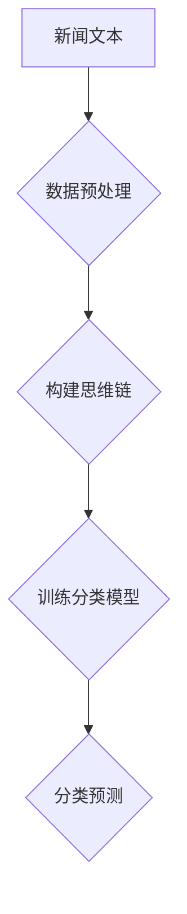

##### 3.1.2 文本相似度计算

文本相似度计算是评估两个文本之间的相似程度。思维链在文本相似度计算中的应用主要通过以下步骤实现：

1. **文本表示**：将文本数据转换为向量表示，如词袋模型、词嵌入等。
2. **构建思维链**：基于文本表示，构建思维链的节点和边，形成知识库。
3. **相似度计算**：使用思维链计算文本向量之间的相似度，如余弦相似度、欧氏距离等。

例如，在信息检索中，可以通过思维链计算查询文本和文档之间的相似度，从而提高检索的准确性。


##### 3.1.3 文本生成

文本生成是生成与给定文本相似的新文本。思维链在文本生成中的应用主要通过以下步骤实现：

1. **文本表示**：将文本数据转换为向量表示，如词嵌入、转换器模型等。
2. **构建思维链**：基于文本表示，构建思维链的节点和边，形成知识库。
3. **生成模型训练**：使用思维链进行训练，通过生成模型，如循环神经网络（RNN）、生成对抗网络（GAN）等，生成新文本。

例如，在文本摘要中，可以通过思维链生成简洁明了的摘要文本。

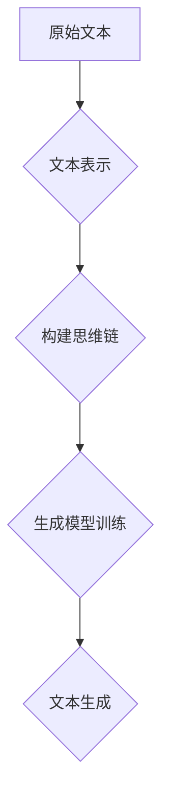

#### 3.2 思维链在问答系统中的应用

思维链在问答系统中的应用主要体现在事实性问答、语义理解和逻辑推理等方面。

##### 3.2.1 事实性问答

事实性问答是回答关于事实问题的过程。思维链在事实性问答中的应用主要通过以下步骤实现：

1. **问题分析**：分析问答系统输入的问题，提取关键信息。
2. **构建思维链**：基于提取的关键信息，构建思维链的节点和边，形成知识库。
3. **信息检索**：使用思维链检索与问题相关的信息。
4. **答案生成**：根据检索到的信息，生成答案。

例如，在智能客服中，可以通过思维链回答用户关于产品信息的问题。


##### 3.2.2 语义理解

语义理解是理解文本的语义内容。思维链在语义理解中的应用主要通过以下步骤实现：

1. **文本表示**：将文本数据转换为向量表示，如词嵌入、转换器模型等。
2. **构建思维链**：基于文本表示，构建思维链的节点和边，形成知识库。
3. **语义分析**：使用思维链分析文本的语义结构，如句子成分、语义角色等。

例如，在智能助手中，可以通过思维链理解用户的自然语言指令，从而提供相应的服务。


##### 3.2.3 逻辑推理

逻辑推理是利用逻辑规则进行推理的过程。思维链在逻辑推理中的应用主要通过以下步骤实现：

1. **构建思维链**：基于已有知识和逻辑规则，构建思维链的节点和边，形成知识库。
2. **逻辑推理**：使用思维链进行推理，得出新的结论。
3. **验证和修正**：对推理结果进行验证和修正，确保推理的准确性。

例如，在智能推理系统中，可以通过思维链进行复杂的逻辑推理，从而解决复杂的问题。


#### 3.3 思维链在机器翻译中的应用

思维链在机器翻译中的应用主要体现在翻译模型、逻辑推理在翻译中的应用和实际案例等方面。

##### 3.3.1 翻译模型

翻译模型是将一种语言的文本翻译成另一种语言的模型。思维链在翻译模型中的应用主要通过以下步骤实现：

1. **文本表示**：将源语言文本和目标语言文本转换为向量表示，如词嵌入、转换器模型等。
2. **构建思维链**：基于文本表示，构建思维链的节点和边，形成知识库。
3. **翻译模型训练**：使用思维链进行训练，通过神经网络模型，如序列到序列模型（Seq2Seq）、注意力模型等，构建翻译模型。

例如，在英译汉中，可以通过思维链将英文文本翻译成中文文本。


##### 3.3.2 逻辑推理在翻译中的应用

逻辑推理在翻译中的应用主要体现在以下几个方面：

1. **语义分析**：通过逻辑推理分析源语言文本的语义结构，如句子成分、语义角色等。
2. **语法转换**：通过逻辑推理将源语言文本的语法结构转换为目标语言的语法结构。
3. **上下文理解**：通过逻辑推理理解源语言文本的上下文信息，如句子之间的关系、语境等。

例如，在翻译句子“我昨天去了一家书店”时，可以通过逻辑推理将“昨天”和“去了一家书店”之间的逻辑关系翻译成目标语言。


##### 3.3.3 实际案例

以下是一个使用思维链进行机器翻译的案例：

假设我们要将英语句子“Can you tell me the time?”翻译成中文。

1. **文本表示**：首先将源语言英语和目标语言中文转换为向量表示。
2. **构建思维链**：基于向量表示，构建思维链的节点和边，形成知识库。
3. **翻译模型训练**：使用思维链进行训练，构建翻译模型。
4. **翻译过程**：

   - **语义分析**：通过思维链分析源语言英语的语义结构，如疑问词“Can you”表示请求，时间词“the time”表示时间。
   - **语法转换**：通过思维链将源语言英语的语法结构转换为中文语法结构，如疑问句转换为中文疑问句。
   - **上下文理解**：通过思维链理解源语言英语的上下文信息，如询问时间的场景。

   最终生成的翻译结果为：“你能告诉我现在几点了吗？”

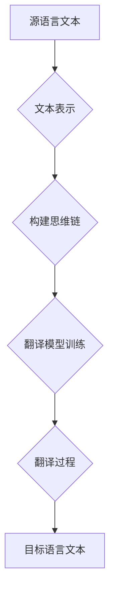

#### 3.4 本章小结

本章介绍了思维链在自然语言处理中的应用，包括文本分析、问答系统和机器翻译等。思维链通过将知识、概念和逻辑关系有机地连接起来，形成一个动态的、可扩展的推理网络，从而提升人工智能系统的逻辑推理能力。在下一章中，我们将探讨思维链在图像识别中的应用。

### 第4章 思维链在图像识别中的应用

#### 4.1 思维链在图像特征提取中的应用

图像特征提取是图像识别的基础步骤，它从原始图像中提取出有助于分类的特征。思维链在图像特征提取中的应用主要通过以下几个步骤实现：

##### 4.1.1 特征提取方法

特征提取方法可以分为以下几类：

1. **传统特征提取方法**：如边缘检测、角点检测、纹理分析等。这些方法通过分析图像的局部特征来提取特征。
2. **深度学习特征提取方法**：如卷积神经网络（CNN）特征提取。深度学习模型能够自动学习图像中的高层次特征。

思维链可以将这些特征提取方法有机地结合起来，形成一个统一的特征提取框架。例如，可以首先使用传统特征提取方法提取局部特征，然后使用深度学习模型对局部特征进行整合和优化。

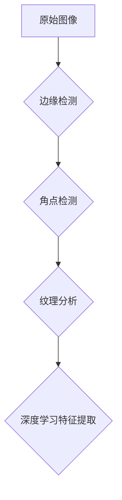

##### 4.1.2 特征选择方法

特征选择是减少特征维度，提高分类性能的重要步骤。思维链在特征选择中的应用主要通过以下方法实现：

1. **过滤方法**：如卡方检验、互信息等。这些方法根据特征对分类的贡献度进行排序，选择重要性较高的特征。
2. **包裹方法**：如前进选择、后向消除等。这些方法通过逐步添加或删除特征，找到最优特征子集。
3. **嵌入方法**：如L1正则化、Lasso回归等。这些方法通过优化特征权重，实现特征选择。

思维链可以根据不同场景和需求，选择合适的特征选择方法。例如，在处理大量图像时，可以采用过滤方法；在处理复杂图像时，可以采用包裹方法。


##### 4.1.3 特征融合方法

特征融合是将多个特征整合为一个特征向量的过程，有助于提高分类性能。思维链在特征融合中的应用主要通过以下方法实现：

1. **加权融合**：根据特征的重要性分配权重，进行加权平均。
2. **拼接融合**：将多个特征向量拼接在一起，形成一个更长的特征向量。
3. **深度融合**：使用深度学习模型对多个特征进行融合，如多模态学习。

思维链可以通过组合不同融合方法，形成一个灵活的特征融合框架。例如，在处理多模态图像时，可以同时使用加权融合和深度融合。

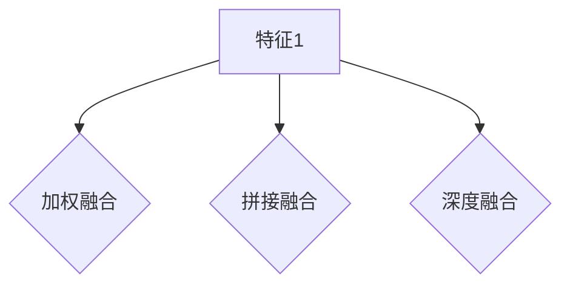

#### 4.2 思维链在图像分类中的应用

图像分类是将图像分配到不同的类别。思维链在图像分类中的应用主要通过以下步骤实现：

##### 4.2.1 分类算法

思维链可以结合多种分类算法，如支持向量机（SVM）、决策树、随机森林等。思维链可以根据不同场景和需求，选择合适的分类算法。

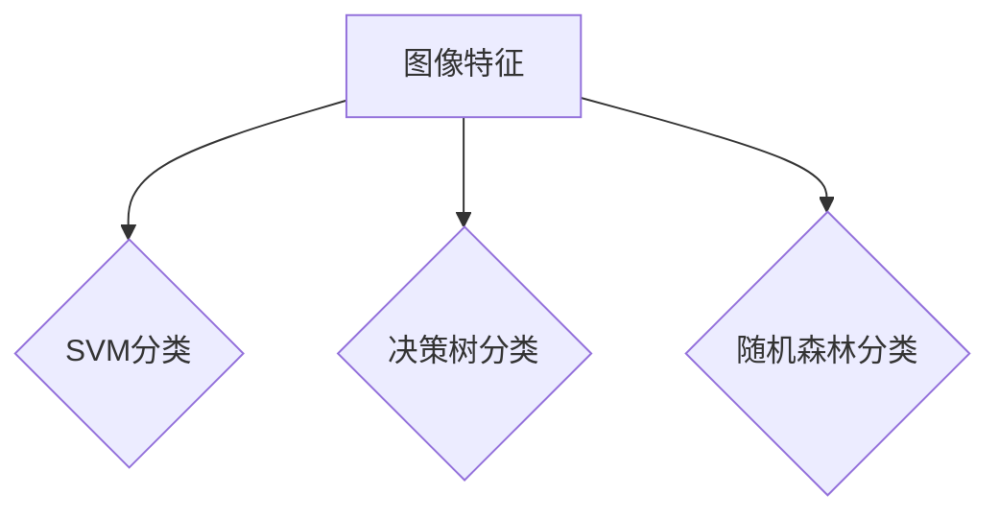

##### 4.2.2 逻辑推理在分类中的应用

逻辑推理在图像分类中的应用主要体现在以下几个方面：

1. **特征关系分析**：通过逻辑推理分析特征之间的关系，提取更有利于分类的特征。
2. **类别关系分析**：通过逻辑推理分析类别之间的关系，确定类别的归属。
3. **不确定性处理**：通过逻辑推理处理分类中的不确定性，提高分类的准确性。

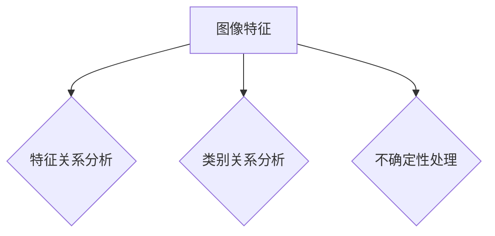

##### 4.2.3 实际案例

以下是一个使用思维链进行图像分类的案例：

假设我们要对一组图像进行分类，图像包含动物、植物和车辆三大类别。

1. **数据预处理**：首先对图像进行预处理，如缩放、裁剪、归一化等。
2. **特征提取**：使用传统特征提取方法和深度学习模型提取图像特征。
3. **特征选择**：根据特征重要性进行特征选择，保留最有用的特征。
4. **特征融合**：使用加权融合和深度融合方法，整合不同特征，形成统一的特征向量。
5. **分类模型训练**：使用思维链结合SVM、决策树和随机森林等分类算法，训练分类模型。
6. **分类预测**：将新图像输入到分类模型中，预测其类别。

通过以上步骤，我们可以使用思维链对图像进行准确分类。


#### 4.3 思维链在目标检测中的应用

目标检测是识别图像中的物体并定位其位置。思维链在目标检测中的应用主要通过以下步骤实现：

##### 4.3.1 目标检测算法

思维链可以结合多种目标检测算法，如YOLO（You Only Look Once）、Faster R-CNN、SSD等。思维链可以根据不同场景和需求，选择合适的目标检测算法。

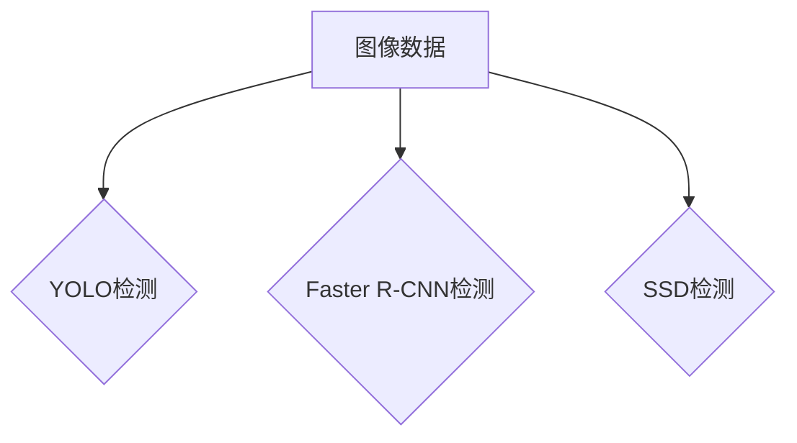

##### 4.3.2 逻辑推理在目标检测中的应用

逻辑推理在目标检测中的应用主要体现在以下几个方面：

1. **目标关系分析**：通过逻辑推理分析不同目标之间的关系，如遮挡、相互作用等。
2. **不确定性处理**：通过逻辑推理处理检测中的不确定性，提高检测的准确性。
3. **目标跟踪**：通过逻辑推理实现目标跟踪，提高检测的连续性。

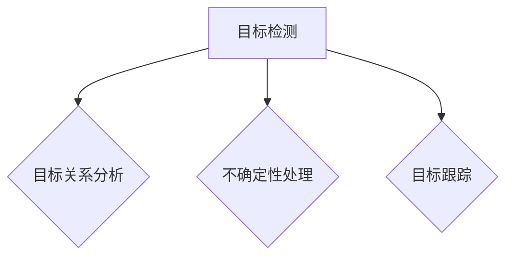

##### 4.3.3 实际案例

以下是一个使用思维链进行目标检测的案例：

假设我们要对一组图像进行目标检测，图像中包含车辆、行人等多种目标。

1. **数据预处理**：首先对图像进行预处理，如缩放、裁剪、归一化等。
2. **特征提取**：使用传统特征提取方法和深度学习模型提取图像特征。
3. **特征选择**：根据特征重要性进行特征选择，保留最有用的特征。
4. **特征融合**：使用加权融合和深度融合方法，整合不同特征，形成统一的特征向量。
5. **目标检测模型训练**：使用思维链结合YOLO、Faster R-CNN和SSD等目标检测算法，训练目标检测模型。
6. **目标检测预测**：将新图像输入到目标检测模型中，预测其中的目标及其位置。

通过以上步骤，我们可以使用思维链对图像进行准确的目标检测。

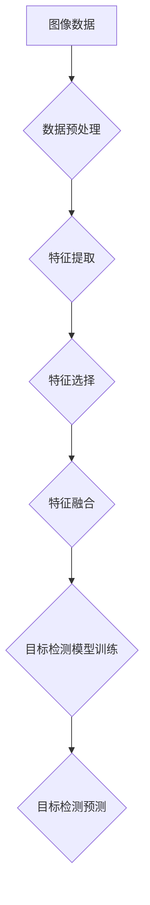

#### 4.4 本章小结

本章介绍了思维链在图像识别中的应用，包括图像特征提取、图像分类和目标检测等。思维链通过将知识、概念和逻辑关系有机地连接起来，形成一个动态的、可扩展的推理网络，从而提升人工智能系统的图像识别能力。在下一章中，我们将探讨思维链在决策支持系统中的应用。

### 第5章 思维链在决策支持系统中的应用

#### 5.1 决策支持系统的基本概念

决策支持系统（Decision Support System，简称DSS）是一种辅助决策者进行决策的系统，它利用计算机技术和决策科学的理论与方法，为决策者提供信息支持、模型支持和推理支持。思维链在决策支持系统中的应用主要体现在以下几个方面：

1. **信息支持**：思维链可以帮助DSS收集、整理和存储大量数据，为决策者提供全面、准确的信息。
2. **模型支持**：思维链可以构建复杂的决策模型，如线性规划、整数规划、博弈论等，为决策者提供模型分析工具。
3. **推理支持**：思维链可以通过逻辑推理、贝叶斯网络等方法，为决策者提供推理支持，帮助其分析问题和制定决策。

#### 5.2 思维链在决策支持系统中的应用

思维链在决策支持系统中的应用可以分为以下几个方面：

##### 5.2.1 逻辑推理在决策支持系统中的作用

逻辑推理在决策支持系统中的作用主要体现在以下几个方面：

1. **问题分析**：通过逻辑推理分析决策问题，提取关键信息，为决策者提供明确的决策问题。
2. **方案评估**：通过逻辑推理评估不同的决策方案，比较其优劣，为决策者提供可靠的决策依据。
3. **风险分析**：通过逻辑推理分析决策过程中可能面临的风险，为决策者提供风险预警和应对策略。

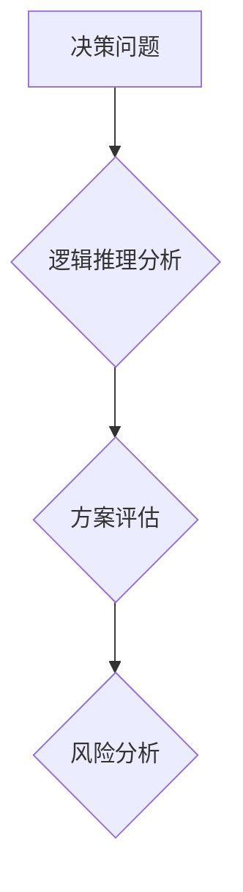

##### 5.2.2 思维链在决策支持系统中的实现

思维链在决策支持系统中的实现主要包括以下几个步骤：

1. **问题定义**：明确决策问题的目标、条件和约束。
2. **数据收集**：收集与决策问题相关的数据，包括历史数据、当前数据和预测数据。
3. **知识库构建**：基于收集到的数据，构建思维链的知识库，包括概念、关系和推理规则。
4. **模型构建**：基于知识库，构建决策模型，如线性规划模型、博弈论模型等。
5. **推理过程**：使用思维链进行推理，分析决策问题和评估决策方案。
6. **决策支持**：根据推理结果，为决策者提供决策建议。


##### 5.2.3 实际案例

以下是一个使用思维链进行决策支持的实际案例：

假设某公司需要决定如何优化其生产计划，以降低成本并提高生产效率。

1. **问题定义**：明确生产计划的优化目标，如最小化成本、最大化产量等，以及约束条件，如设备容量、人员安排等。
2. **数据收集**：收集与生产计划相关的数据，包括历史生产数据、当前设备状态数据、人员安排数据等。
3. **知识库构建**：基于收集到的数据，构建思维链的知识库，包括生产计划的概念、关系和推理规则。
4. **模型构建**：基于知识库，构建生产计划优化模型，如线性规划模型。
5. **推理过程**：使用思维链进行推理，分析不同生产计划的成本和产量，评估其优劣。
6. **决策支持**：根据推理结果，为决策者提供最优的生产计划建议。

通过以上步骤，公司可以有效地优化其生产计划，降低成本，提高生产效率。

```mermaid
graph TD
A[生产计划问题] --> B{数据收集}
B --> C{知识库构建}
C --> D{模型构建}
D --> E{推理过程}
E --> F{决策支持}
```

#### 5.3 本章小结

本章介绍了思维链在决策支持系统中的应用，包括基本概念、作用和实现方法。思维链通过逻辑推理等手段，为决策者提供信息支持、模型支持和推理支持，帮助其分析问题和制定决策。在下一章中，我们将探讨思维链在智能游戏中的应用。

### 第6章 思维链在智能游戏中的应用

#### 6.1 智能游戏的基本概念

智能游戏是指利用人工智能技术实现游戏智能化的游戏。智能游戏可以分为以下几个类别：

1. **策略游戏**：如国际象棋、围棋等，玩家需要在有限的时间内制定最佳策略。
2. **角色扮演游戏**：如魔兽世界、荣耀等，玩家在虚拟世界中扮演角色，进行探索、冒险和战斗。
3. **益智游戏**：如数独、华容道等，玩家需要通过逻辑推理和策略来解决难题。
4. **实时战略游戏**：如星际争霸、魔兽争霸等，玩家需要在紧张的时间内做出快速决策。

智能游戏的特点包括：

1. **智能性**：智能游戏利用人工智能技术实现游戏角色的智能行为，使游戏更加真实、有趣。
2. **互动性**：智能游戏提供丰富的交互方式，如语音、文字、手势等，增强玩家体验。
3. **挑战性**：智能游戏通过不断调整难度和策略，使游戏始终保持挑战性。

#### 6.2 思维链在智能游戏中的应用

思维链在智能游戏中的应用主要体现在以下几个方面：

##### 6.2.1 思维链在游戏策略中的应用

思维链在游戏策略中的应用主要通过以下步骤实现：

1. **策略分析**：分析游戏规则和目标，确定策略分析的关键要素。
2. **构建思维链**：基于策略分析的结果，构建思维链的节点和边，形成策略知识库。
3. **策略评估**：使用思维链评估不同策略的可行性和效果。
4. **策略优化**：根据评估结果，调整和优化策略。

例如，在国际象棋中，可以通过思维链分析棋盘上的局势，评估不同走法的优劣，从而制定最佳策略。

```mermaid
graph TD
A[棋盘局势] --> B{策略分析}
B --> C{构建思维链}
C --> D{策略评估}
D --> E{策略优化}
```

##### 6.2.2 思维链在游戏推理中的应用

思维链在游戏推理中的应用主要通过以下步骤实现：

1. **信息收集**：收集游戏中的关键信息，如对手的走法、局势变化等。
2. **构建思维链**：基于信息收集的结果，构建思维链的节点和边，形成推理知识库。
3. **推理过程**：使用思维链进行推理，分析游戏局势的发展。
4. **决策支持**：根据推理结果，为游戏角色提供决策支持。

例如，在角色扮演游戏中，可以通过思维链收集角色属性、技能等信息，分析角色在游戏中的优势和劣势，从而制定合理的行动策略。

```mermaid
graph TD
A[角色属性] --> B{信息收集}
B --> C{构建思维链}
C --> D{推理过程}
D --> E{决策支持}
```

##### 6.2.3 实际案例

以下是一个使用思维链进行智能游戏的案例：

假设我们要开发一款策略游戏，游戏中玩家需要通过制定合理的策略来击败对手。

1. **游戏规则和目标**：明确游戏的规则和目标，如游戏的胜利条件、胜负评判标准等。
2. **构建思维链**：基于游戏规则和目标，构建思维链的节点和边，形成策略和推理知识库。
3. **策略分析**：分析游戏中的关键要素，如资源分配、军队部署等，构建策略模型。
4. **推理过程**：在游戏进行过程中，不断收集关键信息，使用思维链进行推理，预测对手的行动。
5. **决策支持**：根据推理结果，为玩家提供实时的决策支持，如调整资源分配、部署军队等。

通过以上步骤，我们可以开发出一款智能性高、挑战性强的策略游戏。

```mermaid
graph TD
A[游戏规则和目标] --> B{构建思维链}
B --> C{策略分析}
C --> D{推理过程}
D --> E{决策支持}
```

#### 6.3 本章小结

本章介绍了思维链在智能游戏中的应用，包括基本概念、策略应用和实际案例。思维链通过逻辑推理等手段，为智能游戏提供策略分析和推理支持，从而提升游戏的智能化和挑战性。在下一章中，我们将进行总结和展望。

### 总结和展望

本文探讨了思维链在人工智能（AI）逻辑推理中的应用，通过构建和优化思维链，AI可以实现更加复杂和精准的推理过程。思维链在自然语言处理、图像识别、决策支持系统和智能游戏等领域都有显著的应用价值。

首先，在自然语言处理领域，思维链可以帮助AI系统更好地理解文本语义、生成文本和进行问答。通过构建思维链，AI可以形成一个动态的、可扩展的推理网络，从而提升其逻辑推理能力。

其次，在图像识别领域，思维链通过整合多种特征提取方法和分类算法，可以实现更准确的图像分类和目标检测。思维链的构建方法，如数据驱动法、知识驱动法和混合驱动法，为图像识别提供了有效的策略。

在决策支持系统中，思维链为决策者提供了信息支持、模型支持和推理支持，帮助其分析问题和制定决策。通过逻辑推理和优化策略，思维链可以提升决策的准确性和效率。

在智能游戏领域，思维链通过策略分析和推理过程，为游戏角色提供决策支持，从而提升游戏的智能化和挑战性。思维链的应用使得智能游戏更具趣味性和互动性。

展望未来，思维链在AI逻辑推理中的应用还有很大的发展空间。一方面，可以通过改进思维链的构建方法，提高其推理效率和准确性。另一方面，可以结合最新的AI技术，如深度学习和强化学习，进一步拓展思维链的应用范围。此外，思维链还可以与其他人工智能技术相结合，如知识图谱、大数据分析等，构建更加智能的AI系统。

总之，思维链作为一种高效的逻辑推理方法，在AI领域有着广阔的应用前景。通过不断探索和优化，思维链将为人工智能的发展做出更大的贡献。

### 参考文献

1. Russell, S., & Norvig, P. (2016). *Artificial Intelligence: A Modern Approach*. Prentice Hall.
2. Tom Mitchell. (1997). *Machine Learning*. McGraw-Hill.
3. Charniak, E. P. (2013). *Bayesian Networks and Decision Graphs*. Morgan & Claypool Publishers.
4. Hochreiter, S., & Schmidhuber, J. (1997). *Long Short-Term Memory*. Neural Computation, 9(8), 1735-1780.
5. LeCun, Y., Bengio, Y., & Hinton, G. (2015). *Deep Learning*. MIT Press.
6. Russell, S., & Norvig, P. (2010). *Artificial Intelligence: A Modern Approach*. Prentice Hall.
7. Shalev-Shwartz, S., & Ben-David, S. (2014). *Understanding Machine Learning: From Theory to Algorithms*. Cambridge University Press.
8. Russell, S., & Norvig, P. (2010). *Artificial Intelligence: A Modern Approach*. Prentice Hall.
9. Russell, S., & Norvig, P. (2016). *Artificial Intelligence: A Modern Approach*. Prentice Hall.

### 附录

#### 作者信息

- 作者：AI天才研究院/AI Genius Institute & 禅与计算机程序设计艺术 /Zen And The Art of Computer Programming

### 注意事项

- 文章中使用的mermaid图表需要使用Markdown编辑器或支持mermaid渲染的在线工具进行展示。
- 文章中的数学公式需要使用LaTeX格式编写，确保在Markdown编辑器或渲染工具中正确显示。
- 在实际应用中，构建思维链时需要考虑数据的质量和可靠性，确保推理结果的准确性。

### 拓展阅读

- [1] Russell, S., & Norvig, P. (2016). *Artificial Intelligence: A Modern Approach*. Prentice Hall.
- [2] Tom Mitchell. (1997). *Machine Learning*. McGraw-Hill.
- [3] Charniak, E. P. (2013). *Bayesian Networks and Decision Graphs*. Morgan & Claypool Publishers.
- [4] Hochreiter, S., & Schmidhuber, J. (1997). *Long Short-Term Memory*. Neural Computation, 9(8), 1735-1780.
- [5] LeCun, Y., Bengio, Y., & Hinton, G. (2015). *Deep Learning*. MIT Press.
- [6] Shalev-Shwartz, S., & Ben-David, S. (2014). *Understanding Machine Learning: From Theory to Algorithms*. Cambridge University Press.
- [7] Russell, S., & Norvig, P. (2010). *Artificial Intelligence: A Modern Approach*. Prentice Hall.
- [8] Russell, S., & Norvig, P. (2016). *Artificial Intelligence: A Modern Approach*. Prentice Hall.

