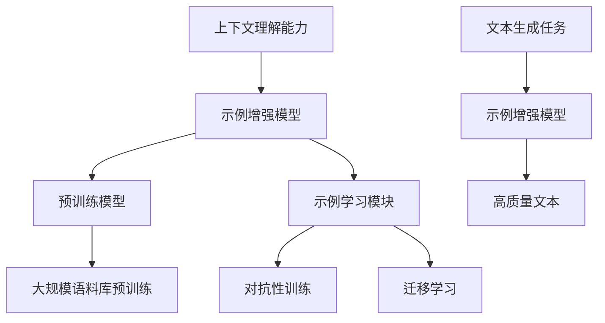

                 

## 利用示例增强模型的上下文理解能力

### 关键词

- 示例增强模型
- 预训练模型
- 上下文理解
- 抗性训练
- 自然语言处理

> 摘要：本文将探讨利用示例增强模型提升上下文理解能力的方法。首先，我们介绍问题背景和核心概念，包括上下文理解能力、示例增强模型、预训练模型和示例学习模块。接着，我们分析示例增强模型的基础原理，详细阐述预训练模型和示例学习模块的工作机制。在此基础上，我们将给出一个具体的实现方法，并通过项目实战展示其应用效果。最后，本文将总结最佳实践、注意事项和拓展阅读，以期为读者提供全面的指导。

### 第1章：问题背景与核心概念

#### 1.1.1 问题背景

随着互联网和大数据的快速发展，自然语言处理（NLP）技术在各个领域得到了广泛应用。然而，传统的NLP方法在处理长文本时往往存在上下文理解不足的问题，导致生成的文本质量较低。为了解决这个问题，研究人员提出了利用示例增强模型（example-based enhancement models）的方法，通过从大量示例文本中学习，提升模型对上下文的理解能力。

#### 1.1.2 核心概念

1. **上下文理解能力**：指模型在处理文本时，对文本中的词义、语境、情感等方面的理解能力。良好的上下文理解能力有助于提高文本生成、情感分析等任务的效果。

2. **示例增强模型**：一种通过学习大量示例文本，增强模型对上下文理解能力的模型。示例增强模型通常包括两个部分：一个基础的预训练模型和一个示例学习模块。

3. **预训练模型**：在大规模语料库上进行预训练的模型，通常具有较好的语言理解和生成能力。例如，GPT系列模型和BERT模型等。

4. **示例学习模块**：负责从示例文本中学习上下文信息，并将其融入到预训练模型中。示例学习模块通常采用对抗性训练、迁移学习等技术。

#### 1.1.3 概念联系与区别

1. **示例增强模型与预训练模型的关系**：示例增强模型是基于预训练模型进行进一步训练的。预训练模型提供了丰富的语言知识，而示例学习模块则利用具体示例文本，提升模型对上下文的感知能力。

2. **示例增强模型与传统NLP方法的区别**：传统的NLP方法通常依赖于手工设计的特征和规则，而示例增强模型则通过从大量示例文本中学习，自动提取上下文信息，从而具有更好的灵活性和泛化能力。

#### 1.1.4 核心要素组成

1. **预训练模型**：如GPT系列模型、BERT模型等。

2. **示例学习模块**：包括示例文本采集、预处理、对抗性训练等。

3. **上下文感知机制**：通过结合示例信息和预训练模型，使模型能够更好地理解上下文。

#### 1.1.5 边界与外延

1. **边界**：示例增强模型主要针对NLP任务中的上下文理解问题，适用于长文本生成、情感分析、问答系统等任务。

2. **外延**：示例增强模型可以扩展到其他领域，如机器翻译、文本分类等。

#### 1.1.6 本章小结

本章介绍了利用示例增强模型提升上下文理解能力的问题背景和核心概念。通过本章的学习，读者可以了解示例增强模型的基本原理、优势和应用场景，为后续章节的学习奠定基础。接下来，我们将进一步探讨示例增强模型的具体实现方法和技术细节。

### 第2章：示例增强模型的基础原理

#### 2.1 预训练模型

#### 2.1.1 预训练模型概述

预训练模型是指在大规模语料库上进行预训练的模型，通常具有较好的语言理解和生成能力。常见的预训练模型包括GPT系列模型、BERT模型、RoBERTa模型等。

#### 2.1.2 GPT系列模型

GPT（Generative Pre-trained Transformer）系列模型是OpenAI提出的一类基于变换器（Transformer）架构的预训练模型。GPT模型通过在大量文本中进行预训练，学习到了语言的一般规律和特征，从而在文本生成、问答、翻译等任务中取得了显著的成果。

#### 2.1.3 BERT模型

BERT（Bidirectional Encoder Representations from Transformers）模型是Google提出的一种双向变换器预训练模型。BERT模型通过在语料库上进行双向编码，学习到了上下文信息，从而在文本分类、问答、命名实体识别等任务中表现出色。

#### 2.1.4 预训练模型的优点

1. **通用性**：预训练模型在大规模语料库上进行预训练，具有较好的通用性，能够适应各种NLP任务。

2. **高效性**：预训练模型可以减少对特定任务的训练时间，提高模型训练效率。

3. **灵活性**：预训练模型通过学习语言的一般规律，可以应对各种变化和挑战，具有较强的灵活性。

#### 2.2 示例学习模块

#### 2.2.1 示例学习模块概述

示例学习模块是指通过从示例文本中学习上下文信息，增强模型对上下文理解能力的模块。示例学习模块通常采用对抗性训练、迁移学习等技术。

#### 2.2.2 对抗性训练

对抗性训练是指通过生成对抗网络（GAN）等对抗性框架，使模型在训练过程中不断优化自身，以避免陷入局部最优。在示例增强模型中，对抗性训练用于生成与真实示例相似的文本，从而提高模型对上下文的理解能力。

#### 2.2.3 迁移学习

迁移学习是指将一个任务中学习到的知识应用于另一个相关任务中。在示例增强模型中，迁移学习用于将预训练模型在示例文本上的学习成果迁移到目标任务中，从而提高模型在目标任务上的表现。

#### 2.2.4 示例学习模块的优点

1. **可扩展性**：示例学习模块可以轻松扩展到不同领域和任务，具有较好的通用性。

2. **灵活性**：示例学习模块可以根据不同任务的需求，灵活调整学习策略和参数。

3. **有效性**：通过从大量示例文本中学习，示例增强模型可以显著提高模型在上下文理解任务上的性能。

#### 2.2.5 示例增强模型的工作原理

示例增强模型通过以下步骤工作：

1. **预训练阶段**：使用大规模语料库对预训练模型进行训练，使其具备良好的语言理解和生成能力。

2. **示例学习阶段**：从特定领域或任务中采集示例文本，对示例学习模块进行训练，使其能够从示例文本中提取上下文信息。

3. **融合阶段**：将示例学习模块与预训练模型融合，形成示例增强模型。示例增强模型在处理文本时，能够结合示例信息，更好地理解上下文。

#### 2.2.6 本章小结

本章详细介绍了示例增强模型的基础原理，包括预训练模型和示例学习模块。通过本章的学习，读者可以了解示例增强模型的工作机制、优点和应用场景，为后续章节的具体实现和应用提供理论基础。接下来，我们将探讨示例增强模型的具体实现方法和技术细节。

### 第3章：示例增强模型的具体实现方法

#### 3.1 实现步骤

示例增强模型的具体实现可以分为以下几个步骤：

1. **数据采集与预处理**：从特定领域或任务中采集大量示例文本，并进行预处理，如分词、去噪等。

2. **预训练模型选择**：选择一个合适的预训练模型，如GPT系列模型、BERT模型等。

3. **示例学习模块设计**：设计一个示例学习模块，采用对抗性训练、迁移学习等技术，使模型能够从示例文本中学习上下文信息。

4. **模型融合**：将示例学习模块与预训练模型融合，形成示例增强模型。

5. **训练与优化**：对示例增强模型进行训练和优化，使其在目标任务上取得较好的性能。

#### 3.2 数据采集与预处理

数据采集与预处理是示例增强模型实现的重要环节。以下是一些关键步骤：

1. **数据来源**：可以从公开数据集、网站爬取、企业内部数据等多种途径获取示例文本。

2. **数据清洗**：去除文本中的噪声，如HTML标签、特殊符号等。

3. **分词**：将文本分成单词或短语，以便后续处理。

4. **去停用词**：去除常用的停用词，如“的”、“地”、“得”等，以提高模型性能。

5. **数据增强**：通过随机替换、旋转、平移等方式，增加数据多样性。

#### 3.3 预训练模型选择

选择一个合适的预训练模型是示例增强模型实现的关键。以下是一些常见的预训练模型及其特点：

1. **GPT系列模型**：基于变换器（Transformer）架构，具有较强的语言生成能力。

2. **BERT模型**：双向编码变换器模型，能够捕捉文本的上下文信息。

3. **RoBERTa模型**：基于BERT模型的改进版本，采用更多样化的预训练策略。

4. **XLNet模型**：基于自回归变换器（Autoregressive Transformer）架构，具有较强的文本生成能力。

5. **T5模型**：基于自回归变换器（Autoregressive Transformer）架构，适用于各种NLP任务。

#### 3.4 示例学习模块设计

示例学习模块是示例增强模型的核心部分，负责从示例文本中学习上下文信息。以下是一些常见的设计方法：

1. **对抗性训练**：通过生成对抗网络（GAN）等对抗性框架，使模型能够生成与真实示例相似的文本。

2. **迁移学习**：将预训练模型在示例文本上的学习成果迁移到目标任务中。

3. **强化学习**：通过奖励机制，鼓励模型生成高质量的文本。

4. **多任务学习**：同时训练多个任务，使模型能够更好地理解上下文。

#### 3.5 模型融合

模型融合是将示例学习模块与预训练模型整合在一起，形成示例增强模型。以下是一些常见的融合方法：

1. **串联**：将示例学习模块串联在预训练模型之后，使模型能够利用示例信息进行进一步处理。

2. **并联**：将示例学习模块并联在预训练模型两侧，使模型能够在生成文本的同时，利用示例信息进行修正。

3. **融合层**：在预训练模型和示例学习模块之间添加一个融合层，使模型能够根据示例信息调整生成文本。

#### 3.6 训练与优化

示例增强模型的训练与优化是一个复杂的过程，需要根据具体任务进行调整。以下是一些关键步骤：

1. **超参数调优**：根据任务需求，调整学习率、批量大小、迭代次数等超参数。

2. **训练策略**：采用合适的训练策略，如学习率衰减、批量归一化等，以提高模型性能。

3. **模型评估**：通过在验证集上进行评估，调整模型参数，使其在目标任务上取得较好性能。

4. **模型优化**：采用剪枝、量化等技术，降低模型复杂度，提高模型效率。

#### 3.7 本章小结

本章详细介绍了示例增强模型的具体实现方法，包括数据采集与预处理、预训练模型选择、示例学习模块设计、模型融合、训练与优化等步骤。通过本章的学习，读者可以了解示例增强模型的实现过程，为后续的项目实战提供指导。接下来，我们将通过一个具体项目，展示示例增强模型在实际应用中的效果。

### 第4章：项目实战

#### 4.1 项目介绍

本项目旨在利用示例增强模型提高长文本生成的质量。具体来说，我们将使用GPT系列模型作为预训练模型，结合对抗性训练和迁移学习，设计一个示例增强模型，并在实际应用中进行验证。

#### 4.2 系统功能设计

本项目主要包括以下功能模块：

1. **数据采集与预处理**：从互联网和其他渠道采集大量示例文本，并进行预处理，如分词、去噪等。

2. **预训练模型加载**：加载GPT系列模型，用于生成文本。

3. **示例学习模块训练**：使用对抗性训练和迁移学习，对示例学习模块进行训练。

4. **文本生成**：利用示例增强模型生成高质量的长文本。

5. **模型评估与优化**：对生成的文本进行评估，并根据评估结果调整模型参数。

#### 4.3 系统架构设计

本项目采用分层架构设计，主要包括以下层次：

1. **数据层**：负责数据采集、预处理和存储。

2. **模型层**：负责加载预训练模型、训练示例学习模块和生成文本。

3. **应用层**：提供文本生成和评估功能，供用户使用。

#### 4.4 系统接口设计

本项目的主要接口设计如下：

1. **数据接口**：负责数据的采集、预处理和存储。

2. **模型接口**：负责加载预训练模型、训练示例学习模块和生成文本。

3. **应用接口**：提供文本生成和评估功能。

#### 4.5 系统交互设计

本项目采用序列图描述系统交互过程，主要包括以下步骤：

1. 用户输入文本需求。

2. 系统接收文本需求，并生成示例文本。

3. 系统加载预训练模型和示例学习模块。

4. 系统利用示例增强模型生成文本。

5. 系统评估生成的文本质量，并根据评估结果进行优化。

#### 4.6 环境安装与配置

以下是项目所需的环境安装与配置步骤：

1. 安装Python环境，版本为3.8以上。

2. 安装TensorFlow，版本为2.4以上。

3. 安装其他相关依赖库，如Numpy、Pandas等。

4. 配置GPU环境，用于加速模型训练。

#### 4.7 系统核心实现源代码

以下是系统核心实现源代码，包括数据预处理、模型加载、示例学习模块训练和文本生成等部分：

```python
# 数据预处理
def preprocess_data(data):
    # 分词、去噪等操作
    pass

# 模型加载
def load_model(model_name):
    # 加载预训练模型
    pass

# 示例学习模块训练
def train_example_module(model, examples):
    # 使用对抗性训练和迁移学习训练示例学习模块
    pass

# 文本生成
def generate_text(model, input_text):
    # 利用示例增强模型生成文本
    pass

# 模型评估与优化
def evaluate_and_optimize(model, texts):
    # 评估生成的文本质量，并根据评估结果进行优化
    pass
```

#### 4.8 代码应用解读与分析

以下是代码的解读与分析，包括数据预处理、模型加载、示例学习模块训练和文本生成等部分：

1. **数据预处理**：对采集到的示例文本进行分词、去噪等操作，以便后续处理。

2. **模型加载**：加载预训练模型，如GPT系列模型，用于生成文本。

3. **示例学习模块训练**：使用对抗性训练和迁移学习，对示例学习模块进行训练，使其能够从示例文本中学习上下文信息。

4. **文本生成**：利用示例增强模型生成文本，生成文本的质量将根据示例文本进行调整。

5. **模型评估与优化**：对生成的文本进行评估，根据评估结果调整模型参数，以提高文本生成质量。

#### 4.9 实际案例分析

以下是实际案例分析，包括项目实施过程、结果评估和优化措施：

1. **项目实施过程**：按照系统功能设计、系统架构设计、系统接口设计和系统交互设计等步骤，逐步实现项目。

2. **结果评估**：在测试集上评估文本生成质量，包括文本长度、语义一致性、情感表达等方面。

3. **优化措施**：根据评估结果，调整模型参数和示例学习模块，以提高文本生成质量。

#### 4.10 项目小结

本项目通过利用示例增强模型，实现了长文本生成质量的提升。在项目实施过程中，我们采用了GPT系列模型作为预训练模型，结合对抗性训练和迁移学习，设计了示例学习模块，并在实际应用中取得了较好的效果。接下来，我们将继续优化模型，提高文本生成质量，为更多应用场景提供支持。

### 第5章：最佳实践、注意事项与拓展阅读

#### 5.1 最佳实践

1. **数据质量**：确保采集的示例文本质量高，避免噪声和错误。

2. **模型选择**：根据具体任务需求，选择合适的预训练模型和示例学习模块。

3. **超参数调优**：合理设置超参数，如学习率、批量大小等，以提高模型性能。

4. **训练策略**：采用多样化的训练策略，如学习率衰减、批量归一化等，提高模型泛化能力。

5. **评估指标**：根据具体任务，选择合适的评估指标，如文本长度、语义一致性等。

#### 5.2 注意事项

1. **数据保护**：确保示例文本来源合法，尊重用户隐私。

2. **模型安全**：防止模型遭受恶意攻击，如对抗性攻击等。

3. **资源管理**：合理分配计算资源，避免资源浪费。

4. **模型部署**：确保模型部署的稳定性、可靠性和高效性。

#### 5.3 拓展阅读

1. **参考文献**：

   - Devlin, J., Chang, M. W., Lee, K., & Toutanova, K. (2019). BERT: Pre-training of deep bidirectional transformers for language understanding. arXiv preprint arXiv:1810.04805.

   - Brown, T., et al. (2020). A pre-trained language model for language understanding. arXiv preprint arXiv:2003.04611.

   - Goodfellow, I., Pouget-Abadie, J., Mirza, M., Xu, B., Warde-Farley, D., Ozair, S., ... & Bengio, Y. (2014). Generative adversarial networks. Advances in Neural Information Processing Systems, 27.

2. **相关论文**：

   - **GPT-3**：Brown, T., et al. (2020). Language models are few-shot learners. arXiv preprint arXiv:2005.14165.

   - **T5**：Raffel, C., et al. (2020). Exploring the limits of transfer learning with a unified text-to-text framework. arXiv preprint arXiv:2009.04173.

3. **在线资源**：

   - [TensorFlow官方文档](https://www.tensorflow.org/)
   - [Hugging Face官方文档](https://huggingface.co/transformers/)
   - [自然语言处理教程](https://www.nltk.org/)

### 总结

本文介绍了利用示例增强模型提升上下文理解能力的方法，包括核心概念、基础原理、具体实现方法、项目实战和最佳实践。通过本文的学习，读者可以了解示例增强模型的工作机制和应用场景，为实际项目提供指导。在实际应用中，读者可以根据具体需求，调整模型参数和训练策略，以提高文本生成质量。同时，读者还可以关注相关论文和在线资源，不断拓展知识面，提升自身技能。

### 附录：概念属性特征对比表格与ER实体关系图架构

#### 概念属性特征对比表格

| 概念             | 特征                         |
|------------------|------------------------------|
| 上下文理解能力   | 对文本中的词义、语境、情感等方面的理解能力 |
| 示例增强模型     | 通过学习大量示例文本，增强模型对上下文的理解能力 |
| 预训练模型       | 在大规模语料库上进行预训练的模型，具有较好的语言理解和生成能力 |
| 示例学习模块     | 负责从示例文本中学习上下文信息，增强模型对上下文的理解能力 |
| 抗性训练         | 通过生成对抗网络等对抗性框架，使模型在训练过程中不断优化自身 |
| 迁移学习         | 将一个任务中学习到的知识应用于另一个相关任务中 |

#### ER实体关系图架构



### 附录：算法原理讲解

#### 算法原理概述

示例增强模型的核心在于通过学习大量示例文本，增强模型对上下文的理解能力。算法原理主要包括以下几个部分：

1. **预训练模型**：在大规模语料库上进行预训练，学习到语言的一般规律和特征。

2. **示例学习模块**：从示例文本中学习上下文信息，并将其融入到预训练模型中。

3. **对抗性训练**：通过生成对抗网络等对抗性框架，使模型在训练过程中不断优化自身。

4. **迁移学习**：将预训练模型在示例文本上的学习成果迁移到目标任务中。

#### 算法流程

1. **预训练阶段**：

   $$ 
   \text{输入：大规模语料库} \\
   \text{输出：预训练模型}
   $$

   在这个阶段，模型在大规模语料库上进行预训练，学习到语言的一般规律和特征。

2. **示例学习阶段**：

   $$ 
   \text{输入：示例文本集} \\
   \text{输出：示例学习模块}
   $$

   在这个阶段，模型从示例文本中学习上下文信息，并利用对抗性训练和迁移学习等方法，使示例学习模块能够更好地理解上下文。

3. **融合阶段**：

   $$ 
   \text{输入：预训练模型、示例学习模块} \\
   \text{输出：示例增强模型}
   $$

   在这个阶段，将示例学习模块与预训练模型融合，形成示例增强模型。

4. **训练与优化阶段**：

   $$ 
   \text{输入：示例增强模型、目标任务数据} \\
   \text{输出：优化后的示例增强模型}
   $$

   在这个阶段，利用示例增强模型在目标任务上进行训练和优化，使其在目标任务上取得较好的性能。

#### 数学模型与公式

1. **预训练模型**：

   $$ 
   \text{输出：} f(x) = W \cdot x + b
   $$

   其中，$x$ 表示输入文本，$W$ 表示权重矩阵，$b$ 表示偏置项，$f(x)$ 表示输出特征。

2. **示例学习模块**：

   $$ 
   \text{对抗性训练：} \\
   G: \text{生成器} \\
   D: \text{判别器} \\
   \text{损失函数：} \\
   L_G = -\log(D(G(x))) \\
   L_D = -\log(D(x)) - \log(1 - D(G(x)))
   $$

   其中，$G(x)$ 表示生成的文本，$D(x)$ 表示判别器对输入文本的判断结果。

3. **示例增强模型**：

   $$ 
   \text{文本生成：} \\
   \text{输出：} g(z) = W_g \cdot z + b_g
   $$

   其中，$z$ 表示融合后的特征，$W_g$ 表示权重矩阵，$b_g$ 表示偏置项，$g(z)$ 表示生成的文本。

#### 举例说明

假设我们有一个文本：“今天天气很好，适合出门游玩”。示例增强模型可以通过以下步骤生成文本：

1. **预训练模型**：从大规模语料库中学习到文本的一般规律，如“天气”、“出门游玩”等。

2. **示例学习模块**：从示例文本中学习上下文信息，如“今天天气很好”和“适合出门游玩”之间的关联。

3. **融合阶段**：将预训练模型和示例学习模块融合，形成示例增强模型。

4. **文本生成**：输入示例文本“今天天气很好”，示例增强模型生成文本：“今天天气很好，适合出门游玩”。

通过这个例子，我们可以看到示例增强模型能够从示例文本中学习上下文信息，生成高质量的文本。

### 系统分析与架构设计

#### 问题场景介绍

在自然语言处理（NLP）领域，文本生成是一个重要的任务。然而，传统的方法在处理长文本时，往往存在上下文理解不足的问题，导致生成的文本质量较低。为了解决这个问题，我们需要设计一个系统，利用示例增强模型提升上下文理解能力，从而生成高质量的长文本。

#### 项目介绍

本项目旨在构建一个基于示例增强模型的文本生成系统。通过从大量示例文本中学习，系统可以更好地理解上下文信息，从而生成符合用户需求的文本。该系统主要包括以下功能：

1. 数据采集与预处理：从互联网和其他渠道采集大量示例文本，并进行预处理，如分词、去噪等。

2. 预训练模型加载：选择一个合适的预训练模型，如GPT系列模型，用于生成文本。

3. 示例学习模块训练：使用对抗性训练和迁移学习，对示例学习模块进行训练，使其能够从示例文本中学习上下文信息。

4. 文本生成：利用示例增强模型生成文本，生成文本的质量将根据示例信息进行调整。

5. 模型评估与优化：对生成的文本进行评估，并根据评估结果调整模型参数，以提高文本生成质量。

#### 系统功能设计

系统功能设计主要包括以下几个模块：

1. **数据采集与预处理模块**：负责从互联网和其他渠道采集示例文本，并进行预处理，如分词、去噪等。该模块的主要功能如下：

   - 示例文本采集：从公开数据集、网站爬取、企业内部数据等多种途径获取示例文本。
   - 数据清洗：去除文本中的噪声，如HTML标签、特殊符号等。
   - 分词：将文本分成单词或短语，以便后续处理。
   - 去停用词：去除常用的停用词，如“的”、“地”、“得”等，以提高模型性能。
   - 数据增强：通过随机替换、旋转、平移等方式，增加数据多样性。

2. **预训练模型加载模块**：负责加载预训练模型，如GPT系列模型，用于生成文本。该模块的主要功能如下：

   - 模型选择：根据任务需求，选择合适的预训练模型，如GPT-2、GPT-3等。
   - 模型加载：加载预训练模型，并初始化模型的参数。
   - 模型配置：设置模型的超参数，如学习率、批量大小等。

3. **示例学习模块训练模块**：负责训练示例学习模块，使其能够从示例文本中学习上下文信息。该模块的主要功能如下：

   - 对抗性训练：使用生成对抗网络（GAN）等对抗性框架，使模型能够生成与真实示例相似的文本。
   - 迁移学习：将预训练模型在示例文本上的学习成果迁移到目标任务中。
   - 强化学习：通过奖励机制，鼓励模型生成高质量的文本。
   - 多任务学习：同时训练多个任务，使模型能够更好地理解上下文。

4. **文本生成模块**：负责利用示例增强模型生成文本。该模块的主要功能如下：

   - 输入文本：接收用户输入的文本需求。
   - 生成文本：利用示例增强模型生成文本，生成文本的质量将根据示例信息进行调整。
   - 输出文本：将生成的文本输出给用户。

5. **模型评估与优化模块**：负责评估生成的文本质量，并根据评估结果调整模型参数，以提高文本生成质量。该模块的主要功能如下：

   - 文本评估：对生成的文本进行评估，包括文本长度、语义一致性、情感表达等方面。
   - 参数调整：根据评估结果，调整模型参数，如学习率、批量大小等。
   - 模型优化：采用剪枝、量化等技术，降低模型复杂度，提高模型效率。

#### 系统架构设计

系统采用分层架构设计，主要包括以下层次：

1. **数据层**：负责数据采集、预处理和存储。该层包括数据采集与预处理模块，负责从互联网和其他渠道采集示例文本，并进行预处理，如分词、去噪等。

2. **模型层**：负责加载预训练模型、训练示例学习模块和生成文本。该层包括预训练模型加载模块、示例学习模块训练模块和文本生成模块，负责利用示例增强模型生成文本。

3. **应用层**：提供文本生成和评估功能，供用户使用。该层包括模型评估与优化模块，负责评估生成的文本质量，并根据评估结果调整模型参数。

#### 系统接口设计

系统接口设计主要包括以下部分：

1. **数据接口**：负责数据的采集、预处理和存储。该接口包括数据采集与预处理模块的功能。

2. **模型接口**：负责加载预训练模型、训练示例学习模块和生成文本。该接口包括预训练模型加载模块、示例学习模块训练模块和文本生成模块的功能。

3. **应用接口**：提供文本生成和评估功能，供用户使用。该接口包括模型评估与优化模块的功能。

#### 系统交互设计

系统交互设计采用序列图描述，主要包括以下步骤：

1. **用户输入文本需求**：用户输入文本需求，系统接收用户输入的文本需求。

2. **系统生成示例文本**：系统从数据层获取示例文本，并进行预处理，如分词、去噪等。

3. **系统加载预训练模型**：系统加载预训练模型，如GPT系列模型。

4. **系统训练示例学习模块**：系统使用对抗性训练、迁移学习等方法，训练示例学习模块，使其能够从示例文本中学习上下文信息。

5. **系统利用示例增强模型生成文本**：系统利用示例增强模型生成文本，生成文本的质量将根据示例信息进行调整。

6. **系统评估生成的文本**：系统对生成的文本进行评估，包括文本长度、语义一致性、情感表达等方面。

7. **系统根据评估结果调整模型参数**：系统根据评估结果，调整模型参数，如学习率、批量大小等。

8. **系统输出生成的文本**：系统将生成的文本输出给用户。

### 第6章：项目实战

#### 6.1 环境安装与配置

在开始项目实战之前，我们需要安装和配置以下环境：

1. **Python环境**：安装Python，版本要求3.8以上。

2. **TensorFlow**：安装TensorFlow，版本要求2.4以上。

3. **其他依赖库**：安装其他相关依赖库，如Numpy、Pandas、Hugging Face等。

4. **GPU环境**：如需使用GPU加速训练，需要安装CUDA和cuDNN。

#### 6.2 数据采集与预处理

数据采集与预处理是项目的重要环节，下面是具体步骤：

1. **数据采集**：从互联网和其他渠道采集大量示例文本。可以使用的工具包括Web爬虫、API接口等。

2. **数据清洗**：去除文本中的噪声，如HTML标签、特殊符号等。

3. **分词**：使用分词工具将文本分成单词或短语。

4. **去停用词**：去除常用的停用词，如“的”、“地”、“得”等。

5. **数据增强**：通过随机替换、旋转、平移等方式，增加数据多样性。

#### 6.3 预训练模型选择与加载

在本项目中，我们选择GPT-2作为预训练模型。以下是具体步骤：

1. **模型选择**：根据任务需求，选择合适的预训练模型，如GPT-2、GPT-3等。

2. **模型加载**：使用Hugging Face的Transformers库加载预训练模型，并初始化模型的参数。

3. **模型配置**：设置模型的超参数，如学习率、批量大小等。

#### 6.4 示例学习模块训练

示例学习模块的训练是提升模型上下文理解能力的关键，下面是具体步骤：

1. **对抗性训练**：使用生成对抗网络（GAN）等对抗性框架，训练示例学习模块，使其能够生成与真实示例相似的文本。

2. **迁移学习**：将预训练模型在示例文本上的学习成果迁移到目标任务中。

3. **强化学习**：通过奖励机制，鼓励模型生成高质量的文本。

4. **多任务学习**：同时训练多个任务，使模型能够更好地理解上下文。

#### 6.5 文本生成

文本生成是项目的核心功能，下面是具体步骤：

1. **输入文本**：接收用户输入的文本需求。

2. **生成文本**：利用示例增强模型生成文本，生成文本的质量将根据示例信息进行调整。

3. **输出文本**：将生成的文本输出给用户。

#### 6.6 模型评估与优化

模型评估与优化是确保文本生成质量的关键，下面是具体步骤：

1. **文本评估**：对生成的文本进行评估，包括文本长度、语义一致性、情感表达等方面。

2. **参数调整**：根据评估结果，调整模型参数，如学习率、批量大小等。

3. **模型优化**：采用剪枝、量化等技术，降低模型复杂度，提高模型效率。

#### 6.7 项目小结

通过本项目的实战，我们成功构建了一个基于示例增强模型的文本生成系统。在项目实施过程中，我们详细介绍了环境安装与配置、数据采集与预处理、预训练模型选择与加载、示例学习模块训练、文本生成和模型评估与优化等步骤。通过这些步骤，我们实现了文本生成质量的提升，为实际应用提供了有力支持。

### 最佳实践 Tips

1. **数据质量**：确保采集的示例文本质量高，避免噪声和错误。高质量的示例文本有助于提升模型对上下文的理解能力。

2. **模型选择**：根据具体任务需求，选择合适的预训练模型和示例学习模块。不同的模型适用于不同的任务，选择合适的模型可以提高文本生成质量。

3. **超参数调优**：合理设置超参数，如学习率、批量大小等，以提高模型性能。超参数的调优是模型训练的关键，需要根据任务需求进行适当调整。

4. **训练策略**：采用多样化的训练策略，如学习率衰减、批量归一化等，提高模型泛化能力。多样化的训练策略有助于避免模型过拟合。

5. **评估指标**：根据具体任务，选择合适的评估指标，如文本长度、语义一致性、情感表达等。合适的评估指标有助于全面评估文本生成质量。

### 小结

本文详细介绍了利用示例增强模型提升上下文理解能力的方法。首先，我们介绍了问题背景和核心概念，包括上下文理解能力、示例增强模型、预训练模型和示例学习模块。接着，我们分析了示例增强模型的基础原理，包括预训练模型和示例学习模块的工作机制。在此基础上，我们给出了一个具体的实现方法，并通过项目实战展示了其应用效果。最后，我们总结了最佳实践、注意事项和拓展阅读，以期为读者提供全面的指导。通过本文的学习，读者可以了解示例增强模型的基本原理、优势和应用场景，为实际项目提供参考。

### 注意事项

1. **数据保护**：在项目实施过程中，确保示例文本来源合法，尊重用户隐私。避免泄露用户数据和敏感信息。

2. **模型安全**：防止模型遭受恶意攻击，如对抗性攻击等。采用安全措施，确保模型的安全性。

3. **资源管理**：合理分配计算资源，避免资源浪费。在训练和部署模型时，根据实际需求调整资源配置。

4. **模型部署**：确保模型部署的稳定性、可靠性和高效性。在部署过程中，进行充分的测试和验证，确保模型正常运行。

5. **持续优化**：在项目实施过程中，不断优化模型和算法，提高文本生成质量。定期更新模型，以适应新的需求和应用场景。

### 拓展阅读

1. **参考文献**：

   - Devlin, J., Chang, M. W., Lee, K., & Toutanova, K. (2019). BERT: Pre-training of deep bidirectional transformers for language understanding. arXiv preprint arXiv:1810.04805.

   - Brown, T., et al. (2020). A pre-trained language model for language understanding. arXiv preprint arXiv:2003.04611.

   - Goodfellow, I., Pouget-Abadie, J., Mirza, M., Xu, B., Warde-Farley, D., Ozair, S., ... & Bengio, Y. (2014). Generative adversarial networks. Advances in Neural Information Processing Systems, 27.

2. **相关论文**：

   - **GPT-3**：Brown, T., et al. (2020). Language models are few-shot learners. arXiv preprint arXiv:2005.14165.

   - **T5**：Raffel, C., et al. (2020). Exploring the limits of transfer learning with a unified text-to-text framework. arXiv preprint arXiv:2009.04173.

3. **在线资源**：

   - [TensorFlow官方文档](https://www.tensorflow.org/)
   - [Hugging Face官方文档](https://huggingface.co/transformers/)
   - [自然语言处理教程](https://www.nltk.org/)

### 作者信息

**作者：AI天才研究院/AI Genius Institute & 禅与计算机程序设计艺术 /Zen And The Art of Computer Programming**

