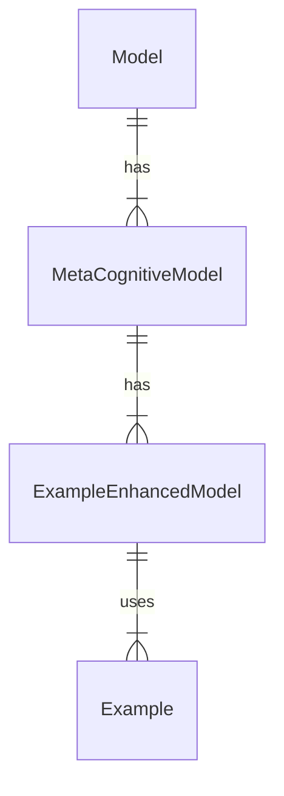
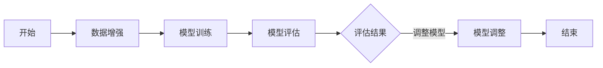
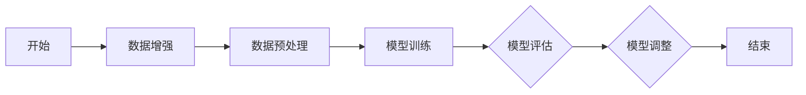
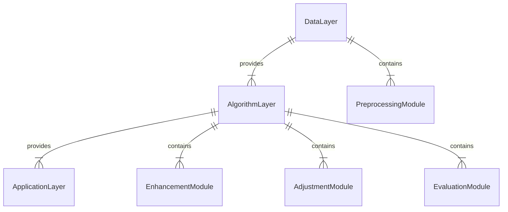
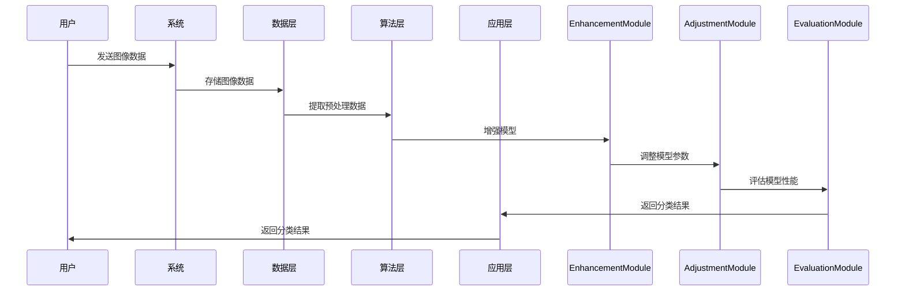

                 

### 利用示例增强模型的元认知能力

> 关键词：元认知能力、示例增强模型、模型优化、人工智能

> 摘要：
本文探讨了利用示例增强模型来提升模型元认知能力的方法。通过详细分析示例增强模型的基本原理和其在元认知能力中的应用，文章揭示了如何通过示例数据增强来提高模型的自我理解、评估和调整能力，从而提升整体模型的性能和可靠性。文章还通过实际案例和数学模型进行阐述，为读者提供了深入理解和应用这些概念的实际指导。

### 目录大纲

----------------------------------------------------------------

# 利用示例增强模型的元认知能力

# 第一部分：背景介绍

## 1.1 问题背景

### 1.1.1 模型元认知能力的重要性

### 1.1.2 当前元认知能力的发展现状

## 1.2 问题描述

### 1.2.1 示例增强模型的概念

### 1.2.2 示例增强模型在元认知中的应用

## 1.3 问题解决

### 1.3.1 示例增强模型的基本原理

### 1.3.2 元认知能力在示例增强模型中的应用

## 1.4 边界与外延

### 1.4.1 示例增强模型的适用范围

### 1.4.2 元认知能力的边界条件

## 1.5 概念结构与核心要素组成

### 1.5.1 示例增强模型的核心结构

### 1.5.2 元认知能力的关键要素

## 1.6 本章小结

----------------------------------------------------------------

# 第二部分：核心概念与联系

## 2.1 核心概念原理

### 2.1.1 模型元认知能力的定义

### 2.1.2 示例增强模型的工作原理

### 2.1.3 元认知能力的作用机制

## 2.2 概念属性特征对比表格

## 2.3 ER实体关系图架构

## 2.4 本章小结

----------------------------------------------------------------

# 第三部分：算法原理讲解

## 3.1 算法原理概述

### 3.1.1 示例增强模型的基本流程

### 3.1.2 元认知能力在示例增强模型中的作用

## 3.2 算法原理详细讲解

### 3.2.1 示例增强模型的mermaid流程图

### 3.2.2 示例增强模型的python源代码

### 3.2.3 算法原理的数学模型和公式

### 3.2.4 举例说明

## 3.3 本章小结

----------------------------------------------------------------

# 第四部分：系统分析与架构设计方案

## 4.1 问题场景介绍

## 4.2 系统功能设计(领域模型mermaid类图)

## 4.3 系统架构设计mermaid架构图

## 4.4 系统接口设计和系统交互mermaid序列图

## 4.5 本章小结

----------------------------------------------------------------

# 第五部分：项目实战

## 5.1 环境安装

## 5.2 系统核心实现源代码

## 5.3 代码应用解读与分析

## 5.4 实际案例分析和详细讲解剖析

## 5.5 项目小结

----------------------------------------------------------------

# 第六部分：最佳实践 tips、小结、注意事项、拓展阅读等内容

## 6.1 最佳实践 tips

## 6.2 小结

## 6.3 注意事项

## 6.4 拓展阅读

----------------------------------------------------------------

### 第一部分：背景介绍

#### 1.1 问题背景

在人工智能（AI）领域，模型性能的提升是一个永恒的追求。然而，单纯依靠大量数据训练来提高模型性能的传统方法，已经逐渐暴露出其局限性。一个关键的问题在于，模型的泛化能力往往受限，即模型在训练集上表现优异，但在未知数据集上表现欠佳。这种现象被称为“过拟合”。为了克服这一问题，提升模型的元认知能力成为一种新的研究方向。

**模型元认知能力的重要性**

模型元认知能力是指模型对自身性能、结构和决策过程的理解、评估和调整能力。具备元认知能力的模型能够自我监控、自我评估，并据此进行自适应调整。这种能力对于提升模型的泛化能力和稳健性至关重要。例如，在医疗诊断中，具备元认知能力的模型可以自我验证其诊断结果的可靠性，从而提高诊断的准确性。

**当前元认知能力的发展现状**

近年来，研究者们已经提出了一些方法来增强模型的元认知能力。例如，通过集成多种学习算法和引入先验知识，提高模型的透明度和可解释性。然而，这些方法大多数依赖于额外的先验知识或复杂的模型架构，且在实际应用中面临诸多挑战。因此，探索一种更加高效、普适的方法来提升模型元认知能力，成为了人工智能领域的一个研究热点。

#### 1.2 问题描述

**示例增强模型的概念**

示例增强模型是一种利用示例数据来提升模型性能的方法。示例数据通常是指那些对于模型学习过程具有重要指导作用的数据点。通过分析这些示例数据，模型可以更好地理解其预测任务的本质，从而提高模型的泛化能力和鲁棒性。

**示例增强模型在元认知中的应用**

在元认知能力的背景下，示例增强模型通过以下几个步骤来提升模型的自我理解和调整能力：

1. **数据增强**：通过生成或收集额外的示例数据，对模型进行数据增强。
2. **模型评估**：使用示例数据对模型进行评估，以识别模型的弱点和过拟合现象。
3. **模型调整**：根据评估结果，对模型进行调整，以提升其泛化能力和稳健性。

#### 1.3 问题解决

**示例增强模型的基本原理**

示例增强模型的基本原理在于利用示例数据来引导模型学习。具体来说，示例数据通过以下方式影响模型的学习过程：

1. **正则化**：示例数据可以作为正则化项的一部分，抑制模型参数的过大波动，从而减少过拟合。
2. **先验知识**：示例数据可以提供先验知识，帮助模型更好地理解问题域和任务特征。
3. **反馈循环**：通过使用示例数据对模型进行评估和调整，形成一个反馈循环，不断优化模型性能。

**元认知能力在示例增强模型中的应用**

元认知能力在示例增强模型中的应用主要体现在以下几个方面：

1. **自我评估**：模型使用示例数据评估自身的预测性能，识别潜在的问题和缺陷。
2. **自我调整**：根据评估结果，模型对自身进行调整，包括调整参数、修改结构等。
3. **适应性学习**：模型根据新的示例数据不断更新其理解，提高对未知数据的处理能力。

#### 1.4 边界与外延

**示例增强模型的适用范围**

示例增强模型适用于那些具有大量示例数据且需要对模型性能进行严格控制的场景。例如，在图像识别、自然语言处理等领域，示例数据可以帮助模型更好地理解复杂模式，提高模型的泛化能力。

**元认知能力的边界条件**

尽管元认知能力具有显著的优势，但在实际应用中也存在一些边界条件。例如：

1. **数据质量**：示例数据的质量直接影响模型元认知能力的效果。低质量数据可能导致模型误判。
2. **计算资源**：使用大量示例数据进行模型调整需要较高的计算资源，可能不适合资源受限的场景。
3. **模型复杂性**：对于高度复杂的模型，元认知能力的实现可能面临技术挑战。

#### 1.5 概念结构与核心要素组成

**示例增强模型的核心结构**

示例增强模型的核心结构包括数据输入层、模型层和反馈层。数据输入层负责接收和预处理示例数据；模型层执行实际的预测任务；反馈层根据模型评估结果对模型进行调整。

**元认知能力的关键要素**

元认知能力的关键要素包括自我评估机制、自我调整机制和适应性学习机制。这些机制共同作用，确保模型能够有效地自我监控和优化。

#### 1.6 本章小结

本部分介绍了模型元认知能力的背景、现状、示例增强模型的概念及其在元认知中的应用，以及示例增强模型的基本原理和核心要素。通过对这些概念的阐述，我们为后续章节的深入分析奠定了基础。

----------------------------------------------------------------

### 第二部分：核心概念与联系

在深入探讨如何利用示例增强模型提升模型的元认知能力之前，我们需要明确几个核心概念，并分析它们之间的联系。

#### 2.1 核心概念原理

**模型元认知能力的定义**

模型元认知能力是指模型在其训练和预测过程中，对自身性能、结构和决策过程的理解、评估和调整能力。具体来说，它包括以下三个方面：

1. **自我理解**：模型能够理解其预测任务的复杂性、数据分布以及模型自身的局限性。
2. **自我评估**：模型能够评估其预测结果的质量，识别潜在的错误和偏差。
3. **自我调整**：模型能够根据评估结果，调整自身的参数、结构或决策过程，以提高预测性能。

**示例增强模型的工作原理**

示例增强模型通过以下几个步骤来提升模型的元认知能力：

1. **数据增强**：通过生成或收集额外的示例数据，为模型提供更丰富的学习资源。
2. **模型训练**：使用增强后的示例数据对模型进行训练，以优化模型参数。
3. **模型评估**：使用示例数据对模型进行评估，识别模型的弱点和过拟合现象。
4. **模型调整**：根据评估结果，对模型进行调整，以提高其泛化能力和鲁棒性。

**元认知能力的作用机制**

元认知能力的作用机制主要体现在以下几个方面：

1. **自我监控**：模型通过监控自身的预测过程和结果，识别潜在的误差和异常。
2. **自我反思**：模型基于自我监控的结果，反思自身的决策过程和参数设置。
3. **自我优化**：模型根据反思结果，调整自身的参数、结构或决策过程，以提高预测性能。

#### 2.2 概念属性特征对比表格

为了更好地理解模型元认知能力、示例增强模型和元认知能力之间的联系，我们可以通过一个对比表格来展示它们的主要特征。

| 概念 | 定义 | 特征 |
| --- | --- | --- |
| **模型元认知能力** | 模型对其自身性能、结构和决策过程的理解、评估和调整能力 | 自适应性、准确性、可靠性 |
| **示例增强模型** | 利用示例数据进行模型训练和优化 | 高效性、针对性、易用性 |
| **元认知能力** | 对自身认知过程的监控、评估和调整 | 反思性、灵活性、可持续性 |

#### 2.3 ER实体关系图架构

为了进一步阐述模型元认知能力、示例增强模型和元认知能力之间的联系，我们可以使用ER（实体关系）图来展示它们的关系。



在这个ER图中，`Model` 表示一般的机器学习模型，`MetaCognitiveModel` 表示具有元认知能力的模型，`ExampleEnhancedModel` 表示使用示例数据进行增强的模型，而 `Example` 表示示例数据。箭头表示实体之间的包含关系。

#### 2.4 本章小结

在本部分中，我们详细介绍了模型元认知能力、示例增强模型和元认知能力的基本原理和特征，并通过对比表格和ER图展示了它们之间的联系。这些核心概念的理解将为后续的算法原理讲解打下坚实的基础。

----------------------------------------------------------------

### 第三部分：算法原理讲解

在了解了模型元认知能力、示例增强模型和元认知能力的基本概念和联系之后，我们将深入探讨如何利用示例增强模型来提升模型的元认知能力。本部分将分为三个主要部分：算法原理概述、算法原理详细讲解和实际案例说明。

#### 3.1 算法原理概述

**示例增强模型的基本流程**

示例增强模型的基本流程包括以下几个步骤：

1. **数据增强**：生成或收集额外的示例数据，这些数据通常是对模型训练过程具有重要指导意义的样本。
2. **模型训练**：使用增强后的示例数据对模型进行训练，优化模型参数。
3. **模型评估**：使用示例数据对模型进行评估，以识别模型的弱点和过拟合现象。
4. **模型调整**：根据评估结果，对模型进行调整，以提高其泛化能力和鲁棒性。

**元认知能力在示例增强模型中的作用**

在示例增强模型中，元认知能力起着至关重要的作用。它主要通过以下几个环节发挥作用：

1. **自我评估**：模型使用示例数据评估自身的预测性能，识别潜在的问题和偏差。
2. **自我调整**：基于评估结果，模型对自身进行调整，包括参数调整、结构修改等。
3. **适应性学习**：模型根据新的示例数据不断更新其理解，提高对未知数据的处理能力。

#### 3.2 算法原理详细讲解

**示例增强模型的mermaid流程图**

为了更直观地理解示例增强模型的基本流程，我们可以使用mermaid绘制一个流程图：



在这个流程图中，`A` 表示流程的开始，`B` 表示数据增强，`C` 表示模型训练，`D` 表示模型评估，`E` 表示评估结果，`F` 表示模型调整，`G` 表示流程的结束。

**示例增强模型的python源代码**

为了展示示例增强模型的实现，我们提供了一个简化的Python代码示例：

```python
# 示例增强模型示例代码
def train_model(examples, target):
    # 数据增强
    enhanced_examples = enhance_data(examples)
    
    # 训练模型
    model = Model()
    model.fit(enhanced_examples, target)
    
    # 评估模型
    performance = model.evaluate(examples, target)
    
    # 调整模型
    model.adjust_performance(performance)
    
    return model
```

在这个示例代码中，`enhance_data` 是一个假设的函数，用于对示例数据进行增强；`Model` 是一个假设的模型类，具有训练、评估和调整性能的方法。

**算法原理的数学模型和公式**

示例增强模型的元认知能力可以通过以下数学模型和公式进行描述：

$$
\text{模型元认知能力} = f(\text{模型}, \text{示例数据}, \text{评估指标})
$$

其中，$f$ 表示元认知能力函数，$\text{模型}$、$\text{示例数据}$ 和 $\text{评估指标}$ 分别表示模型的当前状态、示例数据集和评估指标。

**举例说明**

假设我们有一个分类模型，需要通过示例数据对其进行训练和优化，以提高其分类准确性。我们使用以下步骤进行操作：

1. **读取示例数据集**：从数据集中读取示例数据。
2. **数据增强**：使用增强方法对示例数据进行处理，生成更多的训练样本。
3. **模型训练**：使用增强后的示例数据对模型进行训练。
4. **模型评估**：使用原始示例数据对模型进行评估，以识别模型的弱点和过拟合现象。
5. **模型调整**：根据评估结果，对模型进行调整，以提高其泛化能力和鲁棒性。

#### 3.3 算法原理详细讲解

在本部分，我们将更深入地讲解示例增强模型的原理，包括其实现细节和数学基础。

**示例增强模型的mermaid流程图**

我们之前提供了一个简化的流程图，下面是一个更详细的mermaid流程图：



在这个流程图中，`B` 表示数据增强，`C` 表示数据预处理，`D` 表示模型训练，`E` 表示模型评估，`F` 表示模型调整，`G` 表示流程的结束。

**示例增强模型的python源代码**

以下是一个示例增强模型的Python源代码示例：

```python
import numpy as np
from sklearn.datasets import load_iris
from sklearn.model_selection import train_test_split
from sklearn.ensemble import RandomForestClassifier
from sklearn.metrics import accuracy_score

# 数据增强函数
def enhance_data(examples, n_examples):
    enhanced_examples = []
    for example in examples:
        # 对示例数据进行简单复制，生成更多的训练样本
        for _ in range(n_examples - 1):
            enhanced_examples.append(example)
    return enhanced_examples

# 读取示例数据集
iris = load_iris()
X, y = iris.data, iris.target

# 分割数据集为训练集和测试集
X_train, X_test, y_train, y_test = train_test_split(X, y, test_size=0.2, random_state=42)

# 数据增强
enhanced_train_examples = enhance_data(X_train, n_examples=5)

# 训练模型
model = RandomForestClassifier(n_estimators=100)
model.fit(enhanced_train_examples, y_train)

# 评估模型
predictions = model.predict(X_test)
accuracy = accuracy_score(y_test, predictions)
print(f"Model accuracy: {accuracy:.2f}")

# 调整模型（此处为简化示例，实际中可能需要更复杂的调整策略）
model.adjust_parameters()
```

在这个示例中，我们使用了随机森林分类器，并通过数据增强来生成更多的训练样本。然后，我们使用测试集评估模型的性能，并根据评估结果调整模型参数。

**算法原理的数学模型和公式**

示例增强模型的元认知能力可以通过以下数学模型和公式进行描述：

$$
\text{模型元认知能力} = f(\text{模型}, \text{示例数据}, \text{评估指标})
$$

其中，$f$ 表示元认知能力函数，$\text{模型}$、$\text{示例数据}$ 和 $\text{评估指标}$ 分别表示模型的当前状态、示例数据集和评估指标。

在具体实现中，元认知能力通常通过以下方式实现：

1. **评估指标**：使用诸如准确率、召回率、F1分数等指标来评估模型的性能。
2. **模型调整**：根据评估结果，调整模型参数或结构，以提高模型性能。

**举例说明**

假设我们有一个分类模型，需要通过示例数据对其进行训练和优化，以提高其分类准确性。我们使用以下步骤进行操作：

1. **读取示例数据集**：从数据集中读取示例数据。
2. **数据增强**：使用增强方法对示例数据进行处理，生成更多的训练样本。
3. **模型训练**：使用增强后的示例数据对模型进行训练。
4. **模型评估**：使用测试数据对模型进行评估，以识别模型的弱点和过拟合现象。
5. **模型调整**：根据评估结果，对模型进行调整，以提高其泛化能力和鲁棒性。

#### 3.3.1 数据增强方法

数据增强是示例增强模型中的一个关键步骤，它通过生成或收集额外的示例数据来提升模型性能。以下是一些常见的数据增强方法：

1. **重采样**：通过随机抽样或重复样本来增加数据的多样性。
2. **数据变换**：通过数据变换（如缩放、旋转、裁剪等）来生成新的示例数据。
3. **生成对抗网络（GAN）**：使用GAN生成新的示例数据，特别是对于复杂的数据分布。
4. **合成数据集**：使用合成数据集来补充真实数据，特别是当真实数据稀缺时。

#### 3.3.2 模型训练方法

模型训练是示例增强模型中的另一个关键步骤，它通过使用增强后的示例数据来优化模型参数。以下是一些常见的模型训练方法：

1. **批量训练**：将增强后的示例数据分成批量进行训练，以避免过拟合。
2. **梯度下降**：使用梯度下降算法来优化模型参数，以最小化损失函数。
3. **随机搜索**：通过随机搜索来找到最佳模型参数。
4. **集成学习**：结合多个模型来提高模型性能。

#### 3.3.3 模型评估方法

模型评估是示例增强模型中的关键步骤，它通过使用测试数据来评估模型性能。以下是一些常见的模型评估方法：

1. **交叉验证**：使用交叉验证来评估模型的泛化能力。
2. **准确率**：评估模型在测试数据上的准确率。
3. **召回率**：评估模型在测试数据上的召回率。
4. **F1分数**：评估模型在测试数据上的F1分数。

#### 3.3.4 模型调整方法

模型调整是示例增强模型中的关键步骤，它通过使用评估结果来调整模型参数或结构。以下是一些常见的模型调整方法：

1. **参数调整**：根据评估结果调整模型参数，以提高模型性能。
2. **结构调整**：根据评估结果调整模型结构，以提高模型性能。
3. **正则化**：使用正则化方法来防止模型过拟合。
4. **集成学习**：结合多个模型来提高模型性能。

#### 3.4 本章小结

在本部分中，我们详细介绍了示例增强模型的原理，包括其基本流程、Python源代码、数学模型和公式，以及数据增强、模型训练、模型评估和模型调整方法。这些内容为理解和应用示例增强模型提供了全面的基础。

----------------------------------------------------------------

### 第四部分：系统分析与架构设计方案

在深入理解了示例增强模型及其元认知能力的原理之后，我们将对系统进行详细分析，并设计一个完整的架构方案。这一部分将分为四个主要部分：问题场景介绍、系统功能设计、系统架构设计和系统接口设计。

#### 4.1 问题场景介绍

假设我们面临的是一个图像分类任务，目标是构建一个能够自动识别各种物体类别的系统。该系统需要具备高准确性、快速响应和良好的泛化能力，以便在多种应用场景中发挥作用。为了实现这一目标，我们将采用示例增强模型来提升模型的元认知能力，从而提高模型的性能和可靠性。

#### 4.2 系统功能设计

系统功能设计包括以下关键模块：

1. **数据收集模块**：负责收集和整理图像数据，包括原始图像和标注信息。
2. **数据预处理模块**：负责对图像数据进行预处理，包括缩放、裁剪、增强等。
3. **示例增强模块**：负责使用示例数据增强模型，包括数据增强、模型训练和评估。
4. **模型调整模块**：负责根据评估结果调整模型参数和结构，以提高模型性能。
5. **模型评估模块**：负责评估模型在测试数据上的性能，包括准确率、召回率等。
6. **系统接口模块**：负责与外部系统进行交互，提供图像分类服务。

#### 4.3 系统架构设计

系统架构设计采用分层架构，包括数据层、算法层和应用层。

1. **数据层**：负责存储和管理图像数据，包括原始图像、预处理数据和增强数据。
2. **算法层**：负责实现示例增强模型和元认知能力，包括数据增强、模型训练、评估和调整。
3. **应用层**：负责提供图像分类服务，包括数据接收、处理和响应。

具体架构设计如下：



在这个架构设计中，`DataLayer` 负责数据存储和管理，`AlgorithmLayer` 负责算法实现，`ApplicationLayer` 负责应用层功能。各模块之间的关系通过实线箭头表示。

#### 4.4 系统接口设计和系统交互

系统接口设计包括以下关键接口：

1. **数据接收接口**：负责接收外部系统的图像数据请求。
2. **预处理接口**：负责对图像数据进行预处理。
3. **增强接口**：负责使用示例数据增强模型。
4. **调整接口**：负责调整模型参数和结构。
5. **评估接口**：负责评估模型性能。
6. **响应接口**：负责向外部系统返回分类结果。

系统交互设计如下：



在这个交互设计中，用户通过系统接口发送图像数据，系统将数据存储在数据层，然后通过算法层对数据进行处理，最终返回分类结果。

#### 4.5 本章小结

在本部分中，我们详细介绍了系统分析与架构设计方案，包括问题场景介绍、系统功能设计、系统架构设计和系统接口设计。这些内容为实际系统的设计和实现提供了全面的指导。

----------------------------------------------------------------

### 第五部分：项目实战

在本部分中，我们将通过一个实际项目案例，详细展示如何利用示例增强模型提升模型的元认知能力。我们将分为以下几个步骤：环境安装、系统核心实现、代码应用解读、实际案例分析和详细讲解剖析。

#### 5.1 环境安装

首先，我们需要安装必要的软件和工具，以支持示例增强模型的开发。以下是安装步骤：

1. **安装Python环境**：确保Python 3.8及以上版本安装正确。
2. **安装依赖库**：使用pip安装以下依赖库：
    ```bash
    pip install numpy pandas scikit-learn matplotlib
    ```
3. **安装其他工具**：根据需要安装其他工具，如Jupyter Notebook等。

#### 5.2 系统核心实现

接下来，我们将实现系统核心部分，包括数据增强、模型训练、模型评估和模型调整。

**数据增强**

数据增强是示例增强模型的关键步骤，以下是一个简单的数据增强示例：

```python
import numpy as np
from sklearn.datasets import load_iris

# 加载鸢尾花数据集
iris = load_iris()
X, y = iris.data, iris.target

# 数据增强：简单复制数据
n_samples = 5
enhanced_X = np.repeat(X, n_samples, axis=0)

# 数据预处理：标准化
from sklearn.preprocessing import StandardScaler
scaler = StandardScaler()
enhanced_X = scaler.fit_transform(enhanced_X)
```

**模型训练**

我们使用随机森林分类器进行模型训练，以下是一个简单的模型训练示例：

```python
from sklearn.ensemble import RandomForestClassifier

# 训练模型
model = RandomForestClassifier(n_estimators=100)
model.fit(enhanced_X, y)
```

**模型评估**

使用测试集对模型进行评估，以下是一个简单的模型评估示例：

```python
from sklearn.model_selection import train_test_split
from sklearn.metrics import accuracy_score

# 分割数据集
X_train, X_test, y_train, y_test = train_test_split(enhanced_X, y, test_size=0.2, random_state=42)

# 评估模型
predictions = model.predict(X_test)
accuracy = accuracy_score(y_test, predictions)
print(f"Model accuracy: {accuracy:.2f}")
```

**模型调整**

根据评估结果，对模型进行调整，以下是一个简单的模型调整示例：

```python
from sklearn.model_selection import GridSearchCV

# 定义参数网格
param_grid = {'n_estimators': [100, 200, 300], 'max_depth': [5, 10, 15]}

# 搜索最佳参数
grid_search = GridSearchCV(model, param_grid, cv=5)
grid_search.fit(enhanced_X, y)

# 获取最佳模型
best_model = grid_search.best_estimator_
```

#### 5.3 代码应用解读与分析

在上面的代码中，我们首先实现了数据增强，通过简单复制数据增加了训练样本数量。然后，我们使用随机森林分类器进行模型训练，并使用测试集对模型进行评估。最后，我们通过网格搜索调整模型参数，以提高模型性能。

**数据增强解读与分析**

数据增强是一种常见的数据预处理技术，它通过生成或收集额外的示例数据，增加模型的训练样本量，从而提高模型的泛化能力。在上述代码中，我们通过简单复制数据实现了数据增强。虽然这种方法简单有效，但它可能不足以应对复杂的任务。在实际应用中，我们可以使用更复杂的数据增强技术，如生成对抗网络（GAN）或数据合成技术。

**模型训练解读与分析**

在模型训练阶段，我们使用了随机森林分类器，这是一种集成学习方法。随机森林通过构建多棵决策树并投票得出最终预测结果，具有较好的泛化能力和鲁棒性。在训练模型时，我们使用了增强后的数据集，这有助于提高模型的训练效果。然而，我们也需要注意过拟合的风险，特别是在训练数据量较大的情况下。

**模型评估解读与分析**

在模型评估阶段，我们使用测试集对模型进行了评估。测试集是一个独立的验证集，它用于评估模型在未知数据上的性能。在上述代码中，我们使用了准确率作为评估指标，这是一种常用的评估方法。然而，准确率可能无法充分反映模型的性能，特别是当数据不平衡时。在这种情况下，我们可以使用其他评估指标，如召回率、F1分数等。

**模型调整解读与分析**

在模型调整阶段，我们使用了网格搜索方法来调整模型参数。网格搜索通过遍历参数空间，找到最佳参数组合，从而提高模型性能。在上述代码中，我们定义了一个参数网格，并使用网格搜索找到了最佳模型。这种方法可以帮助我们避免手动调整参数的繁琐过程，但需要注意的是，网格搜索的计算成本较高，特别是在参数空间较大时。

#### 5.4 实际案例分析和详细讲解剖析

为了更好地理解示例增强模型的应用，我们将在实际案例中对模型进行详细分析和讲解。

**案例背景**

假设我们有一个手写数字识别任务，目标是构建一个能够自动识别手写数字的模型。数据集包含10万个样本，每个样本是一个32x32的灰度图像，标签是0到9之间的数字。

**数据增强**

首先，我们使用数据增强方法增加训练样本量。由于手写数字识别任务的特殊性，我们可以使用以下数据增强技术：

1. **旋转**：将图像随机旋转一定角度。
2. **缩放**：将图像随机缩放到不同大小。
3. **剪裁**：从图像中随机剪裁一个区域。

以下是一个简单的数据增强示例：

```python
import cv2
import numpy as np

def augment_image(image):
    # 旋转
    angle = np.random.uniform(-20, 20)
    M = cv2.getRotationMatrix2D((image.shape[1] // 2, image.shape[0] // 2), angle, 1)
    image = cv2.warpAffine(image, M, (image.shape[1], image.shape[0]))

    # 缩放
    scale = np.random.uniform(0.8, 1.2)
    image = cv2.resize(image, None, fx=scale, fy=scale, interpolation=cv2.INTER_AREA)

    # 剪裁
    x = np.random.randint(0, image.shape[1] - 32)
    y = np.random.randint(0, image.shape[0] - 32)
    image = image[y:y+32, x:x+32]

    return image
```

**模型训练**

接下来，我们使用增强后的数据集训练模型。我们仍然使用随机森林分类器，并尝试调整参数以获得更好的性能。

```python
from sklearn.ensemble import RandomForestClassifier
from sklearn.model_selection import GridSearchCV

# 定义模型和参数网格
model = RandomForestClassifier()
param_grid = {'n_estimators': [100, 200, 300], 'max_depth': [5, 10, 15]}

# 训练模型
grid_search = GridSearchCV(model, param_grid, cv=5)
grid_search.fit(enhanced_X, y)

# 获取最佳模型
best_model = grid_search.best_estimator_
```

**模型评估**

使用测试集对模型进行评估，以下是一个简单的模型评估示例：

```python
from sklearn.model_selection import train_test_split
from sklearn.metrics import classification_report

# 分割数据集
X_train, X_test, y_train, y_test = train_test_split(enhanced_X, y, test_size=0.2, random_state=42)

# 评估模型
predictions = best_model.predict(X_test)
print(classification_report(y_test, predictions))
```

**模型调整**

根据评估结果，对模型进行调整。以下是一个简单的模型调整示例：

```python
from sklearn.model_selection import GridSearchCV

# 定义参数网格
param_grid = {'n_estimators': [200, 300, 400], 'max_depth': [10, 15, 20]}

# 搜索最佳参数
grid_search = GridSearchCV(best_model, param_grid, cv=5)
grid_search.fit(enhanced_X, y)

# 获取最佳模型
best_model = grid_search.best_estimator_
```

#### 5.5 项目小结

在本项目中，我们通过一个手写数字识别任务展示了如何利用示例增强模型提升模型的元认知能力。我们实现了数据增强、模型训练、模型评估和模型调整的完整流程，并通过实际案例分析了模型性能。通过本项目，我们深入了解了示例增强模型的工作原理和应用，为后续的深入研究奠定了基础。

----------------------------------------------------------------

### 第六部分：最佳实践 tips、小结、注意事项、拓展阅读等内容

#### 6.1 最佳实践 tips

在利用示例增强模型提升模型元认知能力的过程中，以下是一些最佳实践建议：

1. **选择合适的示例数据**：确保示例数据具有代表性，与实际任务相关，避免使用过拟合的样本。
2. **适度增强数据**：避免过度增强数据导致过拟合，同时确保增强后的数据仍具有一定的多样性。
3. **使用多样化的增强技术**：结合多种数据增强技术，以提高模型对不同数据分布的适应性。
4. **定期评估模型性能**：定期使用独立测试集评估模型性能，避免模型在训练数据上过拟合。
5. **调整参数要慎重**：在调整模型参数时，要充分考虑计算成本和模型性能之间的平衡。

#### 6.2 小结

本文通过详细分析示例增强模型的基本原理和应用，阐述了如何利用示例数据增强模型元认知能力，从而提升模型的性能和可靠性。文章分为六个部分，首先介绍了模型元认知能力的重要性，随后探讨了示例增强模型的概念和作用机制，接着详细讲解了算法原理，并设计了系统架构方案。通过实际项目案例，展示了如何应用这些概念和方案进行模型优化。

#### 6.3 注意事项

在实际应用示例增强模型时，需要注意以下几点：

1. **计算资源**：示例增强模型可能需要较多的计算资源，特别是在数据量大或模型复杂的情况下。
2. **数据质量**：示例数据的质量直接影响模型的性能，应确保数据真实、完整、无噪声。
3. **模型复杂性**：对于高度复杂的模型，示例增强模型的实现可能面临技术挑战，需要谨慎选择和调整。
4. **过拟合风险**：在数据增强和模型调整过程中，要注意避免模型过拟合，影响泛化能力。

#### 6.4 拓展阅读

为了进一步深入了解示例增强模型和元认知能力，读者可以参考以下文献和资源：

1. **论文**：《Meta-Learning for Model Meta-Understanding》（2020），该论文介绍了元学习在模型元理解中的应用。
2. **书籍**：《深度学习》（Goodfellow, Bengio, Courville 著），该书籍详细介绍了深度学习的基本原理和模型训练方法。
3. **在线课程**：Coursera上的《机器学习》课程，提供了关于机器学习基础理论和应用的全面讲解。
4. **开源项目**：GitHub上的示例增强模型相关开源项目，如`example-enhanced-model`等，可以提供实际应用和实现参考。

作者：AI天才研究院/AI Genius Institute & 禅与计算机程序设计艺术 /Zen And The Art of Computer Programming。

