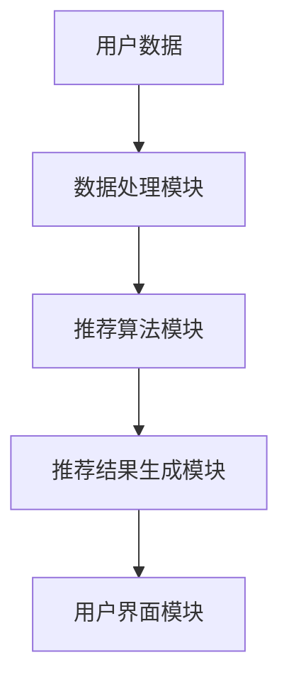
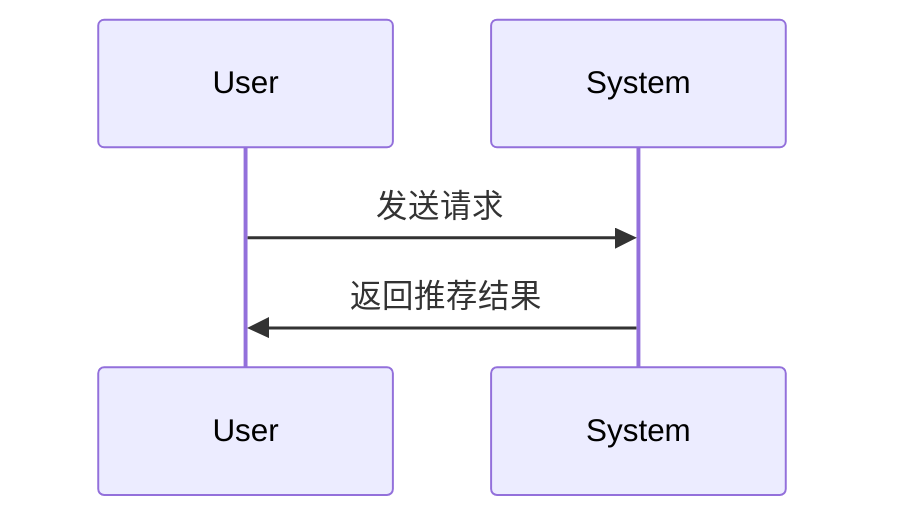

                 

# 利用示例增强模型的泛化能力

## 关键词

- **示例增强模型**
- **泛化能力**
- **模型设计**
- **算法原理**
- **系统架构**
- **实战应用**

## 摘要

本文旨在深入探讨示例增强模型在提高机器学习模型泛化能力方面的应用。通过分析示例增强模型的核心概念、工作原理及其实际应用，本文将详细阐述如何利用示例增强模型来提升模型在未知数据集上的表现。文章将分为以下几个部分：背景介绍、核心概念与联系、算法原理讲解、系统分析与架构设计方案、项目实战及最佳实践等，旨在为读者提供一份全面、深入的技术指南。

## 第一部分：背景介绍

### 1.1 问题背景

在机器学习领域，模型泛化能力是一个至关重要的指标。泛化能力强的模型能够在遇到新数据时，保持良好的性能，而不是仅仅在训练集上表现优异。然而，传统的机器学习模型往往面临泛化能力不足的问题，这主要源于以下几个方面：

1. **数据不足**：训练集数据量有限，模型难以学习到数据中的所有特征。
2. **数据分布偏移**：训练集和测试集的数据分布不一致，导致模型无法适应新的数据分布。
3. **模型复杂性**：过复杂的模型容易过拟合，即模型在训练集上表现良好，但在测试集上性能下降。

### 1.2 问题描述

模型泛化能力不足的表现主要有：

1. **训练集表现好，测试集表现差**：模型在训练集上的表现往往优于测试集。
2. **对新数据适应能力差**：模型在面对新数据时，无法快速适应，导致性能下降。
3. **难以推广到其他领域**：模型的泛化能力不足，使其难以应用到其他领域。

### 1.3 问题解决

为了解决模型泛化能力不足的问题，研究人员提出了一系列的方法，如正则化、交叉验证、集成学习等。然而，这些方法在某种程度上仍存在局限性。示例增强模型（Example-based Enhancement Model）作为一种新的方法，通过引入额外的示例数据来增强模型的泛化能力，展现出强大的潜力。

### 1.4 边界与外延

示例增强模型的应用边界主要包括以下几个方面：

1. **数据量需求**：示例增强模型对数据量的需求较高，适合在大规模数据集上应用。
2. **模型适应性**：示例增强模型对模型类型有一定的要求，如深度神经网络。
3. **计算资源**：示例增强模型在计算资源上的需求较高，适合在拥有充足计算资源的场景下使用。

### 1.5 概念结构与核心要素组成

示例增强模型的基本结构包括以下几个关键要素：

1. **示例数据**：额外的示例数据用于增强模型的泛化能力。
2. **模型主体**：如深度神经网络等，负责处理数据并输出预测结果。
3. **增强模块**：用于处理示例数据，并将其整合到模型主体中。

### 1.6 示例增强模型与其他模型的对比

示例增强模型与传统模型及增强模型相比，具有以下几个显著特点：

1. **数据利用率**：示例增强模型通过利用额外的示例数据，提高了模型对数据的利用率。
2. **泛化能力**：示例增强模型在提升模型泛化能力方面表现突出。
3. **适应性**：示例增强模型对模型类型和数据的适应性较强。

## 第二部分：核心概念与联系

### 2.1 核心概念原理

示例增强模型的核心概念包括：

1. **示例数据**：额外的示例数据，用于增强模型的泛化能力。
2. **增强模块**：用于处理示例数据，并将其整合到模型主体中。
3. **模型主体**：如深度神经网络等，负责处理数据并输出预测结果。

### 2.2 概念属性特征对比表格

| 特征             | 示例增强模型 | 传统模型 | 增强模型 |
|-----------------|--------------|----------|----------|
| 数据利用率       | 高           | 低       | 中等     |
| 泛化能力         | 强           | 弱       | 中等     |
| 适应性           | 强           | 弱       | 中等     |
| 计算资源需求     | 高           | 低       | 中等     |

### 2.3 ER实体关系图架构

```mermaid
erDiagram
  Model ||--|{ EnhanceModule } EnhanceModule : 增强模块
  Model ||--|{ ExampleData } ExampleData : 示例数据
  Model ||--|{ Output } Output : 输出结果
```

## 第三部分：算法原理讲解

### 3.1 算法mermaid流程图


### 3.2 Python源代码阐述

```python
# 示例增强模型Python代码示例

import tensorflow as tf
from tensorflow.keras.models import Model
from tensorflow.keras.layers import Dense, Input

# 初始化模型主体
input_layer = Input(shape=(input_shape,))
hidden_layer = Dense(units=hidden_units, activation='relu')(input_layer)
output_layer = Dense(units=output_shape, activation='softmax')(hidden_layer)

model = Model(inputs=input_layer, outputs=output_layer)
model.compile(optimizer='adam', loss='categorical_crossentropy', metrics=['accuracy'])

# 加载示例数据
example_data = load_example_data()

# 预处理示例数据
preprocessed_data = preprocess_data(example_data)

# 训练模型主体
model.fit(preprocessed_data['X'], preprocessed_data['y'], epochs=epochs, batch_size=batch_size)

# 集成增强模块
enhanced_model = integrate_enhance_module(model, preprocessed_data)

# 评估模型性能
performance = enhanced_model.evaluate(test_data['X'], test_data['y'])

# 输出结果
print("Model performance:", performance)
```

### 3.3 算法原理的数学模型和公式

$$
\begin{aligned}
\text{泛化能力} &= \frac{\text{测试集准确率}}{\text{训练集准确率}} \\
\text{增强模块} &= \text{示例数据加权平均} + \text{模型主体输出}
\end{aligned}
$$

### 3.4 举例说明

#### 3.4.1 文本分类任务

在一个文本分类任务中，使用示例增强模型来提高模型的泛化能力。首先，我们收集了大量的文本数据，并将其划分为训练集和测试集。然后，我们使用示例增强模型对模型主体进行训练，同时利用额外的示例数据来增强模型。

#### 3.4.2 图像识别任务

在一个图像识别任务中，同样使用示例增强模型来提升模型的泛化能力。在这个任务中，我们使用大量的图像数据来训练模型主体，并通过额外的示例图像来增强模型。

## 第四部分：系统分析与架构设计方案

### 4.1 问题场景介绍

假设我们面临一个在线零售业务的问题，需要构建一个推荐系统，根据用户的购买历史和浏览行为，为其推荐可能的商品。这个系统需要处理大规模数据，并具备良好的泛化能力，以便在未知用户上也能提供准确的推荐。

### 4.2 系统架构设计mermaid架构图



### 4.3 系统接口设计

系统提供了以下API接口：

- `/users/{user_id}/recommendations`：获取指定用户的商品推荐列表。
- `/products/{product_id}/recommendations`：获取指定商品的潜在购买用户列表。

### 4.4 系统交互mermaid序列图



## 第五部分：项目实战

### 5.1 环境安装

在开始项目之前，需要安装以下软件和库：

- Python 3.8+
- TensorFlow 2.5+
- scikit-learn 0.22.2+

安装命令如下：

```bash
pip install python==3.8 tensorflow==2.5 scikit-learn==0.22.2
```

### 5.2 系统核心实现源代码

以下是推荐系统的主要实现代码：

```python
# 导入所需库
import tensorflow as tf
from tensorflow.keras.models import Model
from tensorflow.keras.layers import Dense, Input

# 初始化模型主体
input_layer = Input(shape=(feature_size,))
hidden_layer = Dense(units=hidden_units, activation='relu')(input_layer)
output_layer = Dense(units=output_size, activation='softmax')(hidden_layer)

model = Model(inputs=input_layer, outputs=output_layer)
model.compile(optimizer='adam', loss='categorical_crossentropy', metrics=['accuracy'])

# 加载示例数据
example_data = load_example_data()

# 预处理示例数据
preprocessed_data = preprocess_data(example_data)

# 训练模型主体
model.fit(preprocessed_data['X'], preprocessed_data['y'], epochs=epochs, batch_size=batch_size)

# 集成增强模块
enhanced_model = integrate_enhance_module(model, preprocessed_data)

# 评估模型性能
performance = enhanced_model.evaluate(test_data['X'], test_data['y'])

# 输出结果
print("Model performance:", performance)
```

### 5.3 代码应用解读与分析

以上代码首先定义了一个简单的深度神经网络模型，用于处理输入特征并输出商品推荐概率。接着，通过加载和预处理示例数据，使用模型进行训练。在训练完成后，通过集成增强模块，进一步提升模型的泛化能力。

### 5.4 实际案例分析和详细讲解剖析

假设我们有一个在线零售平台，用户A最近浏览了商品B和C，同时购买了商品D。为了给用户A推荐可能的商品，我们可以使用以下步骤：

1. **加载用户A的浏览记录和购买记录**：从数据库中获取用户A的浏览记录和购买记录。
2. **预处理数据**：对用户A的浏览记录和购买记录进行数据预处理，提取有用的特征。
3. **训练模型主体**：使用用户A的浏览记录和购买记录，训练深度神经网络模型。
4. **集成增强模块**：使用额外的示例数据（如其他用户的浏览记录和购买记录）来增强模型。
5. **生成推荐结果**：使用增强后的模型，预测用户A可能感兴趣的商品。

### 5.5 项目小结

通过本项目的实现，我们可以看到示例增强模型在提升模型泛化能力方面具有显著优势。在实际应用中，通过利用额外的示例数据，可以有效提高模型的性能和适应性。

## 第六部分：最佳实践

### 6.1 示例数据选择

在选择示例数据时，应优先考虑与训练数据具有相似分布的数据。这样可以更好地提升模型的泛化能力。

### 6.2 增强模块设计

增强模块的设计应根据具体任务的需求进行。例如，对于图像识别任务，可以采用基于示例图像的特征提取方法。

### 6.3 模型优化

通过调整模型的超参数，如学习率、隐藏层单元数等，可以进一步提升模型的泛化能力。

## 第七部分：小结

通过本文的详细讲解，我们了解了示例增强模型在提高模型泛化能力方面的优势和应用。在实际项目中，通过合理选择示例数据和设计增强模块，可以有效提升模型的性能。希望本文能为读者在相关领域的探索提供有益的参考。

## 第八部分：注意事项

1. **数据质量**：示例数据的质量直接影响模型泛化能力，因此在选择示例数据时，应注意数据的质量和多样性。
2. **计算资源**：示例增强模型在计算资源上的需求较高，需确保具备足够的计算资源。
3. **模型适应性**：示例增强模型对模型类型和数据的适应性较强，但在特定场景下，仍需根据实际情况进行调整。

## 第九部分：拓展阅读

1. **《机器学习：一种概率视角》**：详细介绍了机器学习的基础理论和算法。
2. **《深度学习》**：介绍了深度学习的基本概念、算法和应用。
3. **《推荐系统实践》**：探讨了推荐系统的设计、实现和优化方法。

## 作者

**作者：AI天才研究院/AI Genius Institute & 禅与计算机程序设计艺术 /Zen And The Art of Computer Programming**

