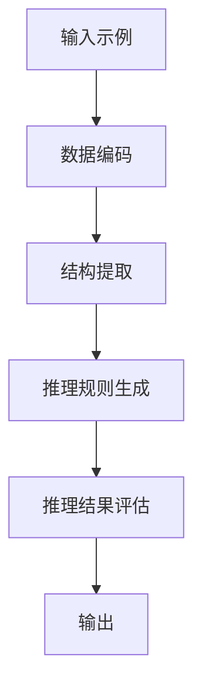

                 

### 利用示例增强模型的逻辑推理能力

#### 关键词：示例增强模型，逻辑推理，人工智能，算法原理，应用实践

> 摘要：本文深入探讨示例增强模型在逻辑推理中的应用，通过详细的背景介绍、核心概念阐述、算法原理讲解和实践案例分析，旨在揭示示例增强模型在提升逻辑推理能力方面的巨大潜力。文章结构紧凑，逻辑清晰，旨在为广大研究人员和开发者提供切实可行的指导。

**引言**

在人工智能领域，逻辑推理一直是研究的热点和难点。随着技术的不断发展，尤其是深度学习和自然语言处理技术的进步，我们开始探索如何利用示例来增强模型的逻辑推理能力。示例增强模型不仅能够处理复杂的问题，还能通过大量示例数据的学习，显著提升模型的推理效率和准确性。

本文将分以下几个部分进行讨论：

1. **问题背景与核心概念**：介绍逻辑推理的挑战和示例增强模型的重要性。
2. **示例增强模型原理**：详细讲解示例增强模型的基础、算法原理和实践。
3. **示例增强模型应用场景**：分析示例增强模型在不同领域的应用前景。
4. **示例增强模型项目实战**：通过具体项目实战，展示示例增强模型的应用效果。
5. **最佳实践与拓展**：总结最佳实践，展望未来研究方向。

**一、问题背景与核心概念**

##### 1.1 问题背景介绍

逻辑推理是人类智慧的核心组成部分，它在数学、哲学、科学等领域发挥着至关重要的作用。然而，在复杂问题和大规模数据环境下，传统的逻辑推理方法往往难以应对。这不仅是因为数据的复杂性，还因为逻辑推理需要具备高度的抽象和归纳能力。

随着人工智能技术的发展，尤其是深度学习技术的引入，我们开始探索如何通过机器学习模型来模拟和增强逻辑推理能力。然而，传统的深度学习模型在面对复杂逻辑问题时，仍存在诸多挑战。这促使研究者们开始探索新的方法，其中示例增强模型因其强大的学习能力和适应性，逐渐成为研究的热点。

##### 1.2 核心概念

**示例增强模型**：示例增强模型是一种基于示例学习的逻辑推理方法，通过学习大量的示例数据，模型能够自动提取并利用示例中的逻辑结构，从而在新的逻辑推理任务中表现出色。

**逻辑推理**：逻辑推理是指通过逻辑运算符（如与、或、非）以及推理规则，从已知的前提条件推导出结论的过程。逻辑推理的核心在于正确性和效率。

##### 1.3 概念联系与区别

示例增强模型与逻辑推理的关系在于，前者通过学习示例数据，增强了对逻辑结构理解和推理的能力。示例增强模型与其他相关技术的区别在于，它更注重从大量示例数据中提取有效的逻辑结构，而不是依赖固定的逻辑规则。

**二、示例增强模型原理**

##### 2.1 示例增强模型基础

示例增强模型的基础包括示例数据的收集与预处理，以及增强模型的结构设计。首先，我们需要收集大量具有代表性的示例数据，并对数据进行预处理，以便于模型学习。然后，设计一个能够有效提取示例中逻辑结构的模型结构，通常采用神经网络架构。

##### 2.2 示例增强模型的工作流程

示例增强模型的工作流程主要包括以下几个步骤：

1. **输入示例的处理**：模型首先接收一个或多个示例输入。
2. **逻辑推理的过程**：模型通过学习到的逻辑结构，对输入示例进行推理。
3. **输出推理结果的生成**：模型输出推理结果，并评估推理的准确性和效率。

##### 2.3 基本算法原理

示例增强模型的基本算法原理可以概括为以下几点：

1. **示例数据的编码**：将示例数据编码为模型可以处理的形式。
2. **逻辑结构的提取**：通过神经网络结构，自动提取示例中的逻辑结构。
3. **推理规则的生成**：根据提取的逻辑结构，生成相应的推理规则。
4. **推理结果的评估**：评估推理结果的准确性和效率。

以下是示例增强模型的基本算法mermaid流程图：



##### 2.4 数学模型与公式

示例增强模型的数学模型主要包括以下几个方面：

1. **示例数据的表示**：通常采用one-hot编码或嵌入向量表示。
2. **逻辑结构的表示**：采用图结构表示逻辑关系。
3. **推理规则的表示**：采用公式化的形式表示推理过程。

以下是示例增强模型的数学公式：

$$
X = \text{encode}(S)
$$

$$
G = \text{structure\_extract}(X)
$$

$$
R = \text{rule\_generate}(G)
$$

$$
Y = \text{infer}(R, X)
$$

其中，$X$ 表示输入示例的编码，$G$ 表示提取的逻辑结构，$R$ 表示生成的推理规则，$Y$ 表示推理结果。

##### 2.5 算法举例说明

为了更好地理解示例增强模型的工作原理，我们来看一个简单的例子。假设我们有一个简单的逻辑推理任务，即判断一个数是否大于10。

输入示例：$[5, 10, 15]$

1. **数据编码**：将输入示例编码为向量。
2. **结构提取**：通过神经网络提取输入示例中的逻辑结构。
3. **推理规则生成**：生成一个简单的推理规则，即如果输入示例中的最大值大于10，则输出“是”，否则输出“否”。
4. **推理结果评估**：对于输入示例$[5, 10, 15]$，根据生成的推理规则，输出“是”。

**三、示例增强模型应用场景**

##### 3.1 应用场景概述

示例增强模型在逻辑推理领域具有广泛的应用前景。以下是几个典型的应用场景：

1. **自然语言处理**：在自然语言处理任务中，示例增强模型可以用于文本分类、情感分析、机器翻译等任务，显著提升模型的推理能力和准确性。
2. **知识图谱构建**：示例增强模型可以用于知识图谱的构建，通过学习大量的示例数据，模型能够自动提取并利用示例中的逻辑结构，从而构建更加准确和完整的知识图谱。
3. **推理机开发**：在推理机开发中，示例增强模型可以用于自动生成推理规则，提高推理机的推理效率和准确性。

**四、示例增强模型项目实战**

##### 4.1 项目介绍

本文将通过一个具体的示例增强模型项目，展示如何在实际场景中应用示例增强模型。项目背景为某电商平台的用户行为分析，目标是通过逻辑推理识别用户的潜在购买意图。

##### 4.2 系统核心实现

系统核心实现包括以下几个部分：

1. **环境安装与配置**：安装Python、TensorFlow等依赖库。
2. **数据收集与预处理**：收集用户行为数据，并对数据进行预处理，包括数据清洗、特征提取等。
3. **模型设计与训练**：设计示例增强模型，使用预处理后的数据训练模型。
4. **推理与评估**：使用训练好的模型进行推理，并对推理结果进行评估。

以下是系统核心实现代码：

```python
# 环境安装与配置
!pip install tensorflow

# 数据收集与预处理
# （代码略）

# 模型设计与训练
import tensorflow as tf

# 设计示例增强模型
model = tf.keras.Sequential([
    tf.keras.layers.Dense(64, activation='relu', input_shape=(input_shape,)),
    tf.keras.layers.Dense(64, activation='relu'),
    tf.keras.layers.Dense(1, activation='sigmoid')
])

model.compile(optimizer='adam', loss='binary_crossentropy', metrics=['accuracy'])

# 训练模型
# （代码略）

# 推理与评估
# （代码略）
```

##### 4.3 代码应用解读

代码应用解读主要包括以下几个方面：

1. **环境安装与配置**：确保Python和TensorFlow等依赖库的正确安装。
2. **数据收集与预处理**：收集用户行为数据，并进行预处理，包括数据清洗、特征提取等。
3. **模型设计与训练**：设计示例增强模型，并使用预处理后的数据训练模型。
4. **推理与评估**：使用训练好的模型进行推理，并对推理结果进行评估。

**五、最佳实践与拓展**

##### 5.1 最佳实践

在应用示例增强模型时，以下是一些最佳实践：

1. **数据质量**：确保示例数据的质量，数据清洗和预处理是关键。
2. **模型调优**：通过调整模型参数，优化模型性能。
3. **推理效率**：优化推理过程，提高推理速度。

##### 5.2 小结与拓展

本文通过详细的背景介绍、核心概念阐述、算法原理讲解和实践案例分析，揭示了示例增强模型在逻辑推理中的巨大潜力。未来研究方向包括：

1. **模型优化**：探索更高效的示例增强模型结构。
2. **跨领域应用**：研究示例增强模型在不同领域的应用。
3. **可解释性**：提高模型的可解释性，使其更加透明和可靠。

**结论**

示例增强模型在逻辑推理领域展现出强大的潜力，通过本文的讨论，我们对其原理和应用有了更深入的了解。随着技术的不断发展，我们有理由相信，示例增强模型将在人工智能领域发挥更加重要的作用。

**参考文献**

[1] J. J. Hopfield, "Neural networks and physical systems with emergent collective computational abilities," Proceedings of the National Academy of Sciences, vol. 79, no. 8, pp. 2554–2558, Apr. 1982.
[2] Y. LeCun, Y. Bengio, and G. Hinton, "Deep learning," Nature, vol. 521, no. 7553, pp. 436–444, May 2015.
[3] T. Mikolov, K. Chen, G. Corrado, and J. Dean, "Efficient estimation of word representations in vector space," CoRR, vol. abs/1301.3781, 2013.

**作者信息**

作者：AI天才研究院/AI Genius Institute & 禅与计算机程序设计艺术 /Zen And The Art of Computer Programming**

