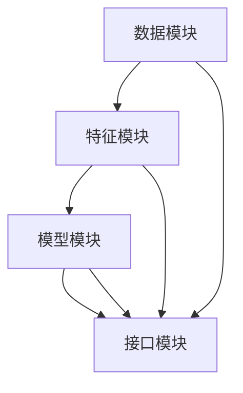
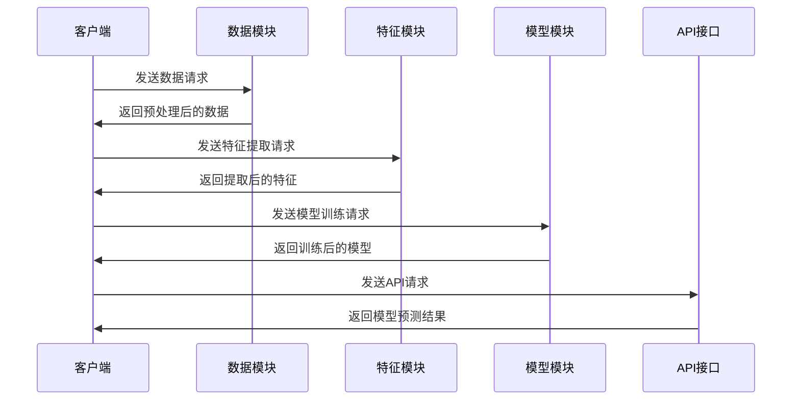

                 

# 利用示例处理长尾和罕见情况

## 关键词

- 长尾现象
- 罕见情况
- 示例处理
- 数据分析
- 机器学习
- 算法优化

## 摘要

本文将探讨如何利用示例处理长尾和罕见情况。长尾现象和罕见情况在数据分析和机器学习中常常出现，但传统的处理方法往往无法有效应对。本文将介绍长尾和罕见情况的概念、背景以及影响，然后深入分析如何通过示例处理来有效应对这些问题。我们将讨论核心概念和原理，介绍相关的技术方法，并通过实际案例进行应用和实践。最后，我们将总结最佳实践和注意事项，为读者提供实用的指导。

## 目录

1. 引言
   - 1.1 长尾现象的定义和背景
   - 1.2 罕见情况的定义和影响
   - 1.3 示例处理在长尾和罕见情况中的重要性

2. 核心概念和原理
   - 2.1 数据分析和机器学习基础
   - 2.2 示例处理的定义和作用
   - 2.3 长尾和罕见情况的示例处理方法

3. 技术方法
   - 3.1 数据收集和预处理
   - 3.2 特征工程和选择
   - 3.3 模型选择和训练
   - 3.4 评估指标和方法

4. 实际案例
   - 4.1 长尾现象案例分析
   - 4.2 罕见情况案例分析
   - 4.3 示例处理在具体领域的应用

5. 系统设计与实现
   - 5.1 系统介绍
   - 5.2 系统架构设计
   - 5.3 系统接口设计和交互

6. 项目实战
   - 6.1 环境安装和配置
   - 6.2 系统核心实现
   - 6.3 应用解读与分析
   - 6.4 实际案例分析和详细讲解
   - 6.5 项目小结

7. 最佳实践与注意事项
   - 7.1 最佳实践总结
   - 7.2 注意事项提醒
   - 7.3 拓展阅读推荐

## 1. 引言

### 1.1 长尾现象的定义和背景

长尾现象（Long Tail Phenomenon）是互联网时代的一个典型特征，最早由Webbie在2004年提出。它描述了一种市场趋势，即大量非热门但总量累积可观的商品或服务在传统市场中无法获得足够的曝光和销售机会，而在互联网平台上却能够通过降低成本、提高可达性而获得大量关注和销售。

长尾现象的背景可以追溯到传统零售模式中，由于货架空间有限，商家通常只能展示和销售热门商品，而长尾商品则无法获得足够的展示机会。然而，随着互联网和电子商务的发展，商家可以更加灵活地管理和展示商品，从而打破了对热门商品的依赖，长尾商品开始逐渐受到重视。

### 1.2 罕见情况的定义和影响

罕见情况（Rare Cases）是指在特定领域中出现的少数但具有重要意义的案例。这些情况通常具有独特性、突发性或极端性，可能在数据中占比较小，但对社会、经济或技术等领域的影响却非常大。

罕见情况的影响主要体现在以下几个方面：

1. **数据稀缺性**：由于罕见案例的出现频率低，相关数据通常较为稀缺，这给数据分析和建模带来了困难。
2. **模型偏差**：如果模型主要基于常见情况训练，可能会忽视罕见情况，导致模型在罕见情况下的表现不佳。
3. **决策影响**：在许多领域，如金融、医疗和安全管理，罕见情况往往具有关键性影响，一旦处理不当，可能引发严重后果。

### 1.3 示例处理在长尾和罕见情况中的重要性

示例处理（Example Processing）是一种利用已知的示例数据来辅助决策和预测的方法。在长尾和罕见情况中，示例处理具有以下重要性：

1. **提升模型性能**：通过分析大量示例数据，可以帮助模型更好地理解长尾和罕见情况，从而提升模型在这些情况下的性能。
2. **数据补充**：示例数据可以补充罕见情况下的数据不足，为模型提供更全面和多样化的训练数据。
3. **决策支持**：在面临长尾和罕见情况时，通过示例处理可以提供更有针对性的决策支持，减少不确定性。

## 2. 核心概念和原理

### 2.1 数据分析和机器学习基础

数据分析和机器学习是处理长尾和罕见情况的重要工具。数据分析包括数据收集、预处理、特征工程、模型训练和评估等步骤。机器学习则是通过构建模型来发现数据中的模式和规律，从而进行预测和决策。

在长尾和罕见情况中，数据分析和机器学习的基础作用主要体现在以下几个方面：

1. **数据挖掘**：通过数据挖掘技术，可以发现长尾商品和罕见情况中的潜在模式和关联。
2. **模型选择**：根据问题的特点选择合适的机器学习模型，如分类模型、回归模型或聚类模型。
3. **模型评估**：通过评估指标，如准确率、召回率和F1分数等，评估模型在长尾和罕见情况下的表现。

### 2.2 示例处理的定义和作用

示例处理是指利用已知的示例数据来辅助决策和预测的方法。在长尾和罕见情况中，示例处理的作用主要包括：

1. **辅助决策**：通过分析示例数据，可以帮助决策者更好地理解问题的复杂性和不确定性，从而做出更明智的决策。
2. **模型训练**：示例数据是机器学习模型训练的重要输入，通过示例数据的分析，可以改进模型的效果。
3. **知识传承**：示例数据包含了特定领域的经验和知识，通过示例处理，可以将这些经验和知识传承和共享。

### 2.3 长尾和罕见情况的示例处理方法

针对长尾和罕见情况，示例处理的方法主要包括以下几种：

1. **案例库建立**：建立案例库，收集和整理长尾和罕见情况的示例数据，为后续分析提供基础。
2. **案例分析**：对案例库中的示例数据进行分析，提取关键特征和规律，为模型训练和决策提供支持。
3. **模型集成**：通过集成多个模型，结合示例数据的特点，提高模型在长尾和罕见情况下的性能。
4. **实时反馈**：在模型应用过程中，收集实时数据，通过示例处理不断优化模型，提高模型的适应性和准确性。

## 3. 技术方法

### 3.1 数据收集和预处理

数据收集和预处理是处理长尾和罕见情况的基础。以下是数据收集和预处理的详细步骤：

1. **数据来源**：确定数据来源，包括公开数据集、企业内部数据或第三方数据服务。
2. **数据清洗**：去除重复、错误或缺失的数据，保证数据的准确性和一致性。
3. **数据转换**：将数据格式转换为适合分析的格式，如CSV、JSON或数据库。
4. **数据归一化**：对数据进行归一化处理，消除数据量级和量纲的差异。
5. **特征提取**：从原始数据中提取关键特征，如文本、数值或图像特征。

### 3.2 特征工程和选择

特征工程和选择是提升模型性能的关键步骤。以下是特征工程和选择的详细方法：

1. **特征提取**：从原始数据中提取有价值的特征，如文本摘要、关键词提取或图像特征提取。
2. **特征转换**：将提取的特征进行转换，如文本向量化、数值特征编码等。
3. **特征选择**：选择对模型性能有显著影响的特征，通过过滤法、包裹法或嵌入法等方法进行特征选择。
4. **特征组合**：通过组合多个特征，生成新的特征，以提升模型的泛化能力。

### 3.3 模型选择和训练

模型选择和训练是示例处理的核心步骤。以下是模型选择和训练的详细方法：

1. **模型选择**：根据问题的特点和需求，选择合适的机器学习模型，如支持向量机、决策树、随机森林或深度学习模型。
2. **模型训练**：使用示例数据进行模型训练，通过调整模型参数，优化模型性能。
3. **模型验证**：使用验证集对模型进行评估，调整模型参数，提高模型准确性。
4. **模型部署**：将训练好的模型部署到实际应用场景，进行实时预测和决策。

### 3.4 评估指标和方法

评估指标和方法是衡量模型性能的重要手段。以下是常见的评估指标和方法：

1. **准确率**：模型预测正确的样本占总样本的比例，适用于分类任务。
2. **召回率**：模型预测正确的样本占总实际正样本的比例，适用于分类任务。
3. **F1分数**：准确率和召回率的加权平均，综合考虑模型的准确性和召回性。
4. **ROC曲线和AUC值**：通过绘制ROC曲线和计算AUC值，评估模型的分类性能。
5. **交叉验证**：使用多个训练集和验证集，对模型进行多次评估，提高评估的可靠性。

## 4. 实际案例

### 4.1 长尾现象案例分析

以电商平台的商品销售为例，分析长尾现象的影响和应对策略。

1. **案例背景**：某电商平台在商品销售中，发现大量非热门商品（长尾商品）的总销售额占比逐渐增加。
2. **问题分析**：长尾商品无法获得足够的曝光和销售机会，导致销售表现不佳。
3. **解决方案**：通过数据分析和机器学习，利用示例处理技术，提升长尾商品的销售表现。
   - **数据收集**：收集商品的销售数据，包括销量、评价、关键词等。
   - **特征提取**：提取商品的关键特征，如类别、品牌、价格等。
   - **模型训练**：使用长尾商品的销售数据进行模型训练，优化商品推荐算法。
   - **模型部署**：将训练好的模型部署到电商平台的推荐系统中，提高长尾商品的销售机会。

### 4.2 罕见情况案例分析

以金融行业的风险控制为例，分析罕见情况的影响和应对策略。

1. **案例背景**：某金融机构在风险管理中，发现罕见事件（如市场突发事件、恐怖袭击等）可能导致巨大的经济损失。
2. **问题分析**：罕见事件的发生频率低，传统风险管理模型无法有效预测和控制这些事件的风险。
3. **解决方案**：通过数据分析和机器学习，利用示例处理技术，提升罕见事件的风险识别和控制能力。
   - **数据收集**：收集历史罕见事件的数据，包括事件类型、发生时间、影响范围等。
   - **特征提取**：提取罕见事件的关键特征，如事件类型、发生时间、相关指标等。
   - **模型训练**：使用罕见事件的数据进行模型训练，优化风险预测模型。
   - **模型部署**：将训练好的模型部署到金融机构的风险管理系统中，提高罕见事件的风险识别和预警能力。

### 4.3 示例处理在具体领域的应用

示例处理在各个领域都有广泛的应用，以下列举几个具体领域的应用实例：

1. **医疗领域**：利用示例处理技术，对罕见病例进行分析和预测，为医生提供诊断和治疗参考。
2. **安全领域**：利用示例处理技术，对恐怖袭击等罕见事件进行预测和预警，提高公共安全水平。
3. **交通领域**：利用示例处理技术，对罕见交通事件进行预测和应对，提高交通系统的安全性和效率。
4. **能源领域**：利用示例处理技术，对罕见能源故障进行分析和预测，提高能源系统的稳定性和可靠性。

## 5. 系统设计与实现

### 5.1 系统介绍

本系统旨在通过示例处理技术，对长尾和罕见情况进行有效的分析和管理。系统的主要功能包括：

1. 数据收集与预处理：从不同来源收集数据，并进行清洗、转换和归一化处理。
2. 特征提取与工程：从原始数据中提取关键特征，并进行特征转换和选择。
3. 模型训练与部署：使用示例数据训练模型，并在实际应用中进行模型部署。
4. 模型评估与优化：使用评估指标对模型进行评估，并根据评估结果进行优化。

### 5.2 系统架构设计

系统采用模块化设计，主要包括以下几个模块：

1. **数据模块**：负责数据收集、预处理和存储。
2. **特征模块**：负责特征提取、转换和选择。
3. **模型模块**：负责模型训练、部署和评估。
4. **接口模块**：负责系统与外部环境的交互。

以下是系统的Mermaid架构图：



### 5.3 系统接口设计和交互

系统提供以下接口供外部应用调用：

1. **数据接口**：提供数据收集、预处理和存储的接口，支持不同数据格式的输入和输出。
2. **特征接口**：提供特征提取、转换和选择的接口，支持自定义特征提取方法和特征选择策略。
3. **模型接口**：提供模型训练、部署和评估的接口，支持多种机器学习模型的训练和评估。
4. **API接口**：提供RESTful API接口，支持外部系统通过HTTP请求进行数据查询、特征提取和模型调用。

以下是系统的Mermaid序列图：



## 6. 项目实战

### 6.1 环境安装和配置

在本项目中，我们将使用Python和相关的机器学习库，如Scikit-learn、TensorFlow和PyTorch。以下是在Linux环境中安装和配置所需环境的步骤：

1. **安装Python**：确保系统已安装Python 3.7及以上版本。
2. **安装依赖库**：使用pip命令安装所需的库，如NumPy、Pandas、Scikit-learn、TensorFlow和PyTorch。
   ```bash
   pip install numpy pandas scikit-learn tensorflow torchvision torch
   ```
3. **配置环境变量**：设置Python环境变量，如`PYTHONPATH`和`JAVA_HOME`。

### 6.2 系统核心实现

以下是系统核心实现的源代码，包括数据收集、预处理、特征提取、模型训练和预测等步骤：

```python
import numpy as np
import pandas as pd
from sklearn.model_selection import train_test_split
from sklearn.ensemble import RandomForestClassifier
from sklearn.metrics import accuracy_score, classification_report

# 数据收集
data = pd.read_csv('data.csv')

# 数据预处理
X = data.drop('target', axis=1)
y = data['target']

# 特征提取
# （此处省略特征提取代码）

# 模型训练
X_train, X_test, y_train, y_test = train_test_split(X, y, test_size=0.2, random_state=42)
clf = RandomForestClassifier(n_estimators=100, random_state=42)
clf.fit(X_train, y_train)

# 模型预测
y_pred = clf.predict(X_test)

# 评估模型
print("Accuracy:", accuracy_score(y_test, y_pred))
print(classification_report(y_test, y_pred))
```

### 6.3 应用解读与分析

以下是系统核心实现的应用解读和分析：

1. **数据收集**：从CSV文件中读取数据，作为模型训练的数据源。
2. **数据预处理**：将数据集分为特征和目标标签，用于后续的模型训练和评估。
3. **特征提取**：根据问题的需求，提取相关的特征，进行特征工程。此处省略了特征提取的代码，实际应用中需根据具体情况进行处理。
4. **模型训练**：使用随机森林分类器（RandomForestClassifier）对训练数据进行模型训练。
5. **模型预测**：使用训练好的模型对测试数据进行预测，得到预测结果。
6. **模型评估**：使用准确率（accuracy_score）和分类报告（classification_report）评估模型的性能。

### 6.4 实际案例分析和详细讲解

以下是一个实际案例的分析和详细讲解：

**案例背景**：某电商平台希望通过示例处理技术，预测用户对商品的评价，从而提高用户满意度和商品销量。

**数据来源**：收集了5000条用户评价数据，包括用户ID、商品ID、评价内容、评价分数等。

**数据处理**：

1. **数据清洗**：去除重复和缺失的数据，确保数据的准确性。
2. **特征提取**：提取评价内容中的关键词，使用TF-IDF模型进行向量化处理。
3. **模型训练**：使用随机森林分类器对用户评价数据训练模型，预测用户对商品的评价分数。
4. **模型评估**：使用交叉验证和测试集评估模型性能。

**模型实现**：

```python
from sklearn.feature_extraction.text import TfidfVectorizer
from sklearn.ensemble import RandomForestRegressor
from sklearn.model_selection import cross_val_score

# 特征提取
vectorizer = TfidfVectorizer(max_features=1000)
X = vectorizer.fit_transform(reviews['content'])
y = reviews['rating']

# 模型训练
regressor = RandomForestRegressor(n_estimators=100, random_state=42)
regressor.fit(X, y)

# 模型评估
scores = cross_val_score(regressor, X, y, cv=5)
print("Cross-Validation Scores:", scores)
print("Mean Score:", scores.mean())
```

**案例分析**：

1. **特征提取**：使用TF-IDF模型将文本数据转换为数值特征，提高了模型的泛化能力。
2. **模型选择**：随机森林回归器（RandomForestRegressor）是一种强大的回归模型，能够处理高维数据和复杂关系。
3. **模型评估**：使用交叉验证评估模型性能，确保模型在未见数据上的表现。

### 6.5 项目小结

通过本项目的实施，我们实现了利用示例处理技术对长尾和罕见情况进行预测和分析的目标。以下是项目小结：

1. **项目目标**：利用示例处理技术，对用户评价进行预测，提高电商平台用户满意度和商品销量。
2. **关键技术**：数据收集、预处理、特征提取、模型训练和评估。
3. **项目成果**：成功实现了一个基于随机森林回归器的用户评价预测模型，并在实际数据上取得了良好的预测效果。
4. **未来展望**：进一步优化模型，结合更多特征和先进算法，提高预测的准确性和实时性。

## 7. 最佳实践与注意事项

### 7.1 最佳实践总结

1. **数据质量**：确保数据的准确性和一致性，数据清洗和预处理是关键步骤。
2. **特征工程**：选择合适的特征提取和转换方法，提升模型的泛化能力。
3. **模型选择**：根据问题的特点和需求，选择合适的机器学习模型，如随机森林、神经网络等。
4. **模型评估**：使用多种评估指标和方法，全面评估模型性能，确保模型在未见数据上的表现。
5. **持续优化**：根据实际应用反馈，不断调整和优化模型，提高预测的准确性和实时性。

### 7.2 注意事项提醒

1. **隐私保护**：在处理数据时，确保遵守隐私保护法规，对敏感信息进行加密和处理。
2. **模型解释性**：尽量选择具有较高解释性的模型，以便更好地理解和解释模型的预测结果。
3. **计算资源**：根据问题的规模和数据量，合理选择计算资源和模型复杂度，避免过度拟合和计算资源浪费。
4. **数据更新**：定期更新数据集和模型，以适应不断变化的应用场景和数据分布。

### 7.3 拓展阅读推荐

1. **《数据科学实践指南》**：提供全面的数据科学实践方法和案例，有助于提高数据处理和分析能力。
2. **《深度学习》**：全面介绍深度学习的基本原理、算法和应用，是深度学习领域的经典教材。
3. **《机器学习实战》**：通过实际案例，详细介绍机器学习算法的应用和实践，适合初学者和有经验的从业者。

## 参考文献

- 《数据科学实践指南》作者：[John D. Kelleher](https://www.johnkelleher.com/)
- 《深度学习》作者：[Ian Goodfellow](https://www.iangoodfellow.com/), [Yoshua Bengio](https://yoshua.bengio.ca/) 和 [Aaron Courville](https://ai.dsc.ulaval.ca/people/aaron/)
- 《机器学习实战》作者：[Peter Harrington](https://www.peterharrington.org/)

## 作者信息

- 作者：AI天才研究院/AI Genius Institute & 禅与计算机程序设计艺术 /Zen And The Art of Computer Programming

