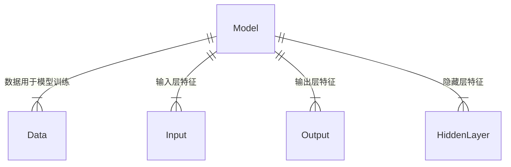
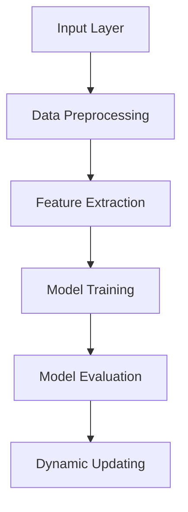
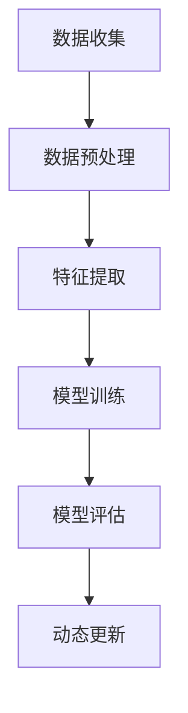
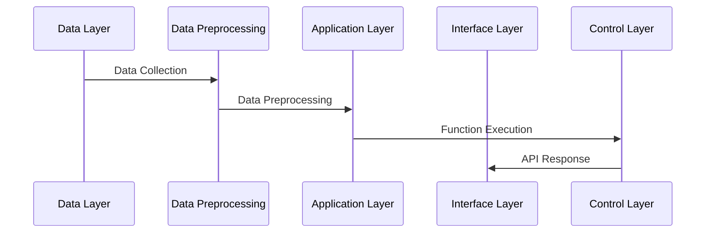
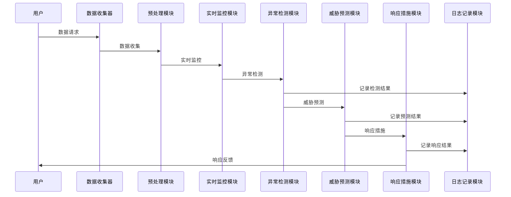

                 

### 第1章 问题背景与概述

#### 1.1 问题背景

在当今快速发展的信息技术时代，新兴技术和零日攻击已经成为网络安全领域面临的两个主要挑战。新兴技术，顾名思义，是指那些刚刚出现或正在迅速发展的技术，如区块链、物联网（IoT）、5G通信等。这些技术不仅为各行各业带来了前所未有的变革机遇，同时也带来了新的安全威胁。零日攻击（Zero-Day Attack）则是指利用软件中未公开的漏洞进行攻击的情况，由于这些漏洞尚未被开发者修复，因此防御措施往往不足。

首先，我们定义一下这两个核心概念：

- **新兴技术**：新兴技术是指那些正在快速发展的技术领域，它们往往具有创新性、变革性，并对现有技术产生深远影响。
- **零日攻击**：零日攻击是指攻击者利用软件中的未知漏洞进行的攻击。这种攻击由于漏洞未被公开，因此传统的防御手段难以有效应对。

这些新兴和零日场景给网络安全带来了巨大的挑战，主要体现在以下几个方面：

1. **技术快速发展带来的未知风险**：新兴技术不断涌现，安全团队往往难以迅速适应并掌握这些新技术的安全特性，导致潜在的安全漏洞。

2. **零日漏洞的威胁**：零日漏洞的存在使得攻击者可以毫无预警地发起攻击，对系统的安全和数据保护构成重大威胁。

3. **传统防御手段的局限性**：传统安全防御手段通常依赖于预定义的签名和模式匹配，对于未知的零日攻击和快速变化的新兴技术，往往难以提供有效的保护。

#### 1.2 问题描述

面对上述挑战，传统的安全防御措施显得力不从心，主要原因在于：

1. **新兴技术的复杂性**：新兴技术通常具有高度复杂性，难以通过传统的安全检测方法来识别和防范潜在的安全威胁。

2. **零日攻击的隐蔽性**：零日攻击利用未知漏洞，难以通过常规的防护手段进行检测和阻止。

3. **安全防御滞后性**：传统的安全防御措施往往滞后于新兴技术和零日攻击的发展速度，无法及时更新和适应。

这些问题的存在，使得新兴和零日场景成为网络安全领域亟待解决的问题。为了有效应对这些挑战，我们需要探索新的方法和技术，特别是利用示例引导模型，来提高对新形势的适应能力和防御能力。

#### 1.3 问题解决

**示例引导模型**，作为一种基于实例学习的模型，能够通过学习大量的示例数据，自动识别和预测潜在的安全威胁。以下是示例引导模型在处理新兴和零日场景方面的优势：

1. **高效性**：示例引导模型能够快速处理大量数据，有效识别新兴技术和零日攻击的特征。

2. **适应性**：通过不断学习和更新示例数据，示例引导模型能够适应新的技术和威胁环境，提高防御能力。

3. **安全性**：示例引导模型通过实例学习，减少了传统签名匹配方式中存在的漏洞，提高了系统的整体安全性。

总之，利用示例引导模型，可以弥补传统安全防御手段的不足，有效应对新兴和零日场景带来的挑战。在接下来的章节中，我们将深入探讨示例引导模型的原理、算法和实际应用，以期为网络安全提供切实可行的解决方案。

#### 1.4 边界与外延

**新兴和零日场景的边界**：

- **新兴场景**：主要指那些刚刚出现或正在快速发展的技术领域，如区块链、物联网（IoT）、5G通信等。这些技术虽然具有巨大的变革潜力，但同时也存在安全漏洞和未知风险。
- **零日场景**：指的是那些利用未知漏洞进行的攻击场景。这些漏洞尚未被开发者发现和修复，使得传统的防御手段难以发挥作用。

**示例引导模型的应用范围**：

- **网络安全**：示例引导模型可以应用于网络安全领域，通过学习大量的安全数据，自动识别和预测潜在的安全威胁。
- **人工智能**：在人工智能领域，示例引导模型可以帮助提升机器学习模型的性能，特别是在面对新兴和零日攻击时。
- **软件开发**：在软件开发过程中，示例引导模型可以用于代码审查和漏洞检测，提高软件的安全性。

**边界与外延的核心概念与联系**：

- **示例数据**：示例引导模型的基础是大量的示例数据，这些数据涵盖了新兴和零日攻击的特征。
- **模型训练**：通过训练这些示例数据，模型可以学习到如何识别和应对新的威胁。
- **动态更新**：为了应对不断变化的新兴技术和零日攻击，示例引导模型需要不断更新示例数据，保持模型的适应性和有效性。

在理解和应用示例引导模型时，需要明确其边界与外延，以充分发挥其优势，应对网络安全中的新兴和零日场景。

#### 1.5 核心概念与联系

**示例引导模型的核心概念**：

1. **示例数据**：示例数据是示例引导模型的基础。这些数据涵盖了新兴和零日攻击的各种特征，用于模型的训练和预测。

2. **模型架构**：示例引导模型通常由输入层、隐藏层和输出层组成，通过多层神经网络结构实现复杂特征的提取和分类。

3. **训练过程**：模型通过不断训练，调整网络权重，使其能够准确识别和预测潜在的安全威胁。

4. **动态更新**：为了应对不断变化的新兴技术和零日攻击，模型需要定期更新示例数据，保持其适应性和准确性。

**概念属性特征对比表格**：

| 特征         | 示例引导模型 | 传统防御模型 |
| ------------ | ------------ | ------------ |
| **高效性**   | 能够快速处理大量数据 | 处理速度较慢 |
| **适应性**   | 能根据示例数据动态更新 | 更新速度较慢 |
| **安全性**   | 减少了未知漏洞的风险 | 依赖于预定义签名 |
| **复杂性**   | 结构复杂，易于扩展 | 结构简单，灵活性不足 |

**示例引导模型的ER实体关系图**：



通过上述核心概念和属性特征的对比，我们可以看到示例引导模型在处理新兴和零日场景方面具备显著的优势。接下来，我们将深入探讨示例引导模型的原理，为进一步理解其应用奠定基础。

### 第2章 示例引导模型原理

#### 2.1 示例引导模型的基本原理

示例引导模型（Example-Guided Model，简称EGM）是一种基于实例学习的模型，其核心思想是通过学习大量的示例数据，从而自动识别和预测潜在的安全威胁。下面，我们将详细讲解示例引导模型的基本原理和架构。

**模型架构介绍**：

示例引导模型通常由以下几个关键部分组成：

1. **输入层**：输入层负责接收原始数据，如网络流量、系统日志等。这些数据经过预处理后，被转化为模型可以处理的特征向量。

2. **隐藏层**：隐藏层是模型的核心部分，负责特征提取和复杂模式的识别。通过多层神经网络结构，模型能够提取出数据中的深层次特征，提高对新兴和零日攻击的识别能力。

3. **输出层**：输出层负责生成预测结果，通常是一个二分类问题，即判断输入数据是否包含潜在的安全威胁。

**示例引导机制**：

示例引导模型的工作流程可以分为以下几个步骤：

1. **数据收集**：首先，需要收集大量的示例数据，包括正常数据和异常数据。这些数据涵盖了不同类型的新兴技术和零日攻击特征。

2. **数据预处理**：对收集到的数据进行预处理，包括数据清洗、特征提取和归一化等步骤，以确保数据的质量和一致性。

3. **模型训练**：使用预处理后的数据对模型进行训练。在训练过程中，模型通过调整网络权重，使其能够准确地识别和分类不同的威胁类型。

4. **模型评估**：通过测试数据集对训练好的模型进行评估，以确定其准确性和鲁棒性。常用的评估指标包括准确率、召回率和F1分数等。

5. **动态更新**：为了应对不断变化的新兴技术和零日攻击，模型需要定期更新示例数据，并重新训练，以保持其适应性和有效性。

**模型架构示例图**：



通过上述工作流程，示例引导模型能够有效地识别和预测潜在的安全威胁。接下来，我们将进一步探讨示例引导模型的属性特征，以及与传统防御模型的区别。

#### 2.2 示例引导模型的属性特征

示例引导模型在处理新兴和零日场景方面具备以下显著属性特征：

1. **高效性**：

示例引导模型能够快速处理大量数据，这使得它能够迅速适应不断变化的新兴技术环境。与传统防御模型相比，示例引导模型在处理速度和性能上具有显著优势。

2. **适应性**：

示例引导模型通过不断学习和更新示例数据，能够动态适应新兴技术和零日攻击的变化。这种动态更新的机制，使得模型能够保持较高的准确性和鲁棒性。

3. **安全性**：

示例引导模型通过实例学习，减少了传统签名匹配方式中存在的漏洞。它能够识别和预测未知的安全威胁，从而提高系统的整体安全性。

4. **灵活性**：

示例引导模型的结构复杂，易于扩展，能够适应不同的应用场景。这种灵活性使得模型能够广泛应用于网络安全、人工智能和软件开发等领域。

**属性特征对比表格**：

| 特征         | 示例引导模型 | 传统防御模型 |
| ------------ | ------------ | ------------ |
| **高效性**   | 高效处理大量数据 | 处理速度较慢 |
| **适应性**   | 动态适应新兴技术 | 难以适应快速变化 |
| **安全性**   | 降低未知漏洞风险 | 依赖于预定义签名 |
| **灵活性**   | 易于扩展和适应 | 结构简单，灵活性不足 |

通过上述属性特征的对比，我们可以看到示例引导模型在处理新兴和零日场景方面具备显著优势。接下来，我们将深入探讨示例引导模型与传统防御模型的区别，以进一步理解其优势。

#### 2.3 示例引导模型与传统模型的区别

在网络安全领域，示例引导模型与传统防御模型存在显著的差异，这些差异主要体现在以下几个方面：

**1. 工作原理**：

- **示例引导模型**：示例引导模型通过学习大量的示例数据，自动识别和预测潜在的安全威胁。它依赖于实例学习和特征提取，能够处理未知和复杂的安全场景。

- **传统防御模型**：传统防御模型通常基于预定义的签名和模式匹配进行工作。这些模型依赖于已知的攻击特征，对于未知或未分类的攻击难以有效识别和防御。

**2. 灵活性**：

- **示例引导模型**：示例引导模型具有高度的灵活性，能够适应不断变化的新兴技术环境。通过不断学习和更新示例数据，模型能够动态适应新的威胁。

- **传统防御模型**：传统防御模型在适应新的威胁方面存在局限性。由于依赖于预定义的签名和模式，这些模型难以应对快速变化的新兴技术和零日攻击。

**3. 效率**：

- **示例引导模型**：示例引导模型能够高效处理大量数据，快速识别潜在的安全威胁。这使得模型在处理速度和性能上具有显著优势。

- **传统防御模型**：传统防御模型在处理速度和性能方面相对较慢。由于依赖预定义的签名和模式，这些模型在处理大量数据时，往往需要更多的时间和计算资源。

**4. 安全性**：

- **示例引导模型**：示例引导模型通过实例学习，减少了传统签名匹配方式中存在的漏洞。它能够识别和预测未知的安全威胁，从而提高系统的整体安全性。

- **传统防御模型**：传统防御模型依赖于预定义的签名和模式，对于未知漏洞和零日攻击，往往难以提供有效的防御。这使得系统在面对未知威胁时，存在较大的安全风险。

**对比表格**：

| 特征         | 示例引导模型 | 传统防御模型 |
| ------------ | ------------ | ------------ |
| **工作原理** | 实例学习 | 签名匹配 |
| **灵活性**   | 高度灵活 | 适应性差 |
| **效率**     | 高效处理数据 | 处理速度慢 |
| **安全性**   | 降低未知威胁风险 | 难以应对未知威胁 |

通过上述对比，我们可以看到示例引导模型在处理新兴和零日场景方面具有显著优势。它不仅能够高效处理大量数据，还能动态适应新兴技术的变化，提高系统的整体安全性。接下来，我们将通过一个ER实体关系图，进一步展示示例引导模型的架构设计。

#### 2.4 示例引导模型的ER实体关系图

为了更好地理解示例引导模型的架构和实体关系，我们使用Mermaid语言绘制了一个ER实体关系图。以下是一个简单的ER图示例：


在这个ER图中，我们定义了以下几个实体：

1. **Model（模型）**：表示示例引导模型本身，是整个系统架构的核心。
2. **Data（数据）**：表示用于模型训练的示例数据，包括正常数据和异常数据。
3. **Input（输入层特征）**：表示模型输入层的特征，用于处理原始数据。
4. **Output（输出层特征）**：表示模型输出层的特征，用于生成预测结果。
5. **HiddenLayer（隐藏层特征）**：表示模型的隐藏层特征，负责特征提取和模式识别。

通过这个ER图，我们可以清晰地看到示例引导模型的主要组成部分及其相互关系。每个实体之间的关系都通过箭头表示，箭头指向关系中的主键。这样的ER图不仅有助于理解模型的结构，也为后续的扩展和优化提供了参考。

#### 2.5 算法原理讲解

**3.1 算法mermaid流程图**

为了更好地理解示例引导模型的算法原理，我们使用Mermaid语言绘制了一个流程图。以下是示例引导模型的算法流程图：



在这个流程图中，我们定义了以下几个关键步骤：

1. **数据收集（A）**：首先，从各种数据源收集大量的示例数据，包括正常数据和异常数据。
2. **数据预处理（B）**：对收集到的数据进行分析和处理，包括数据清洗、缺失值处理和特征提取等步骤。
3. **特征提取（C）**：将预处理后的数据转化为模型可以处理的特征向量，用于模型的训练和预测。
4. **模型训练（D）**：使用训练数据集对模型进行训练，通过反向传播算法调整网络权重，使其能够准确识别和预测安全威胁。
5. **模型评估（E）**：通过测试数据集对训练好的模型进行评估，以确定其准确性和鲁棒性。
6. **动态更新（F）**：根据模型的评估结果，对模型进行动态更新，以适应不断变化的新兴技术和零日攻击。

通过这个流程图，我们可以清晰地看到示例引导模型的整个工作流程，以及各步骤之间的逻辑关系。

**3.2 Python源代码与解释**

为了更直观地展示示例引导模型的实现过程，我们提供了一段Python源代码。以下是示例引导模型的简化实现：

```python
import numpy as np
from sklearn.model_selection import train_test_split
from sklearn.neural_network import MLPClassifier

# 数据预处理
def preprocess_data(data):
    # 数据清洗和归一化操作
    # ...
    return processed_data

# 模型训练
def train_model(train_data, train_labels):
    model = MLPClassifier(hidden_layer_sizes=(100,), max_iter=1000)
    model.fit(train_data, train_labels)
    return model

# 模型评估
def evaluate_model(model, test_data, test_labels):
    accuracy = model.score(test_data, test_labels)
    print(f"Model Accuracy: {accuracy}")
    return accuracy

# 动态更新
def update_model(model, new_data, new_labels):
    model.partial_fit(new_data, new_labels)
    return model

# 主函数
if __name__ == "__main__":
    # 数据收集
    data = np.load("data.npy")
    labels = np.load("labels.npy")

    # 数据预处理
    processed_data = preprocess_data(data)

    # 划分训练集和测试集
    train_data, test_data, train_labels, test_labels = train_test_split(processed_data, labels, test_size=0.2, random_state=42)

    # 模型训练
    model = train_model(train_data, train_labels)

    # 模型评估
    evaluate_model(model, test_data, test_labels)

    # 动态更新
    new_data = np.load("new_data.npy")
    new_labels = np.load("new_labels.npy")
    model = update_model(model, new_data, new_labels)
```

在这个实现过程中，我们首先定义了数据预处理、模型训练、模型评估和动态更新等函数，然后通过主函数将这些函数串联起来，完成整个示例引导模型的工作流程。

**3.3 数学模型与公式**

在示例引导模型中，数学模型和公式用于描述模型的训练和预测过程。以下是几个关键的数学模型和公式：

1. **反向传播算法**：

   反向传播算法是一种用于训练神经网络的优化算法，其核心思想是利用梯度下降法调整网络权重。

   公式1: \( \Delta w = -\alpha \cdot \frac{\partial E}{\partial w} \)

   其中，\( \Delta w \) 表示权重更新，\( \alpha \) 表示学习率，\( E \) 表示模型损失函数。

2. **Sigmoid函数**：

   Sigmoid函数是一种常用的激活函数，用于将神经网络中的线性组合映射到（0，1）区间。

   公式2: \( f(x) = \frac{1}{1 + e^{-x}} \)

   其中，\( f(x) \) 表示输出值，\( x \) 表示输入值。

3. **交叉熵损失函数**：

   交叉熵损失函数用于评估模型的预测结果与真实标签之间的差距，是神经网络的常用损失函数。

   公式3: \( L = -\sum_{i=1}^{n} y_i \cdot \log(p_i) \)

   其中，\( L \) 表示损失函数值，\( y_i \) 表示真实标签，\( p_i \) 表示模型预测概率。

通过这些数学模型和公式，我们可以更深入地理解示例引导模型的训练和预测过程。

**3.4 举例说明**

为了更好地理解示例引导模型的应用，我们通过一个简单的例子进行说明。

假设我们有一个包含100个样本的数据集，其中每个样本由10个特征组成。我们需要使用示例引导模型对这100个样本进行分类，判断它们是否属于正常数据或异常数据。

1. **数据收集**：从实际环境中收集100个样本，包括正常数据和异常数据。

2. **数据预处理**：对收集到的数据进行预处理，包括数据清洗和特征提取，得到100个预处理后的特征向量。

3. **模型训练**：使用预处理后的数据对示例引导模型进行训练，调整网络权重，使其能够准确分类正常数据和异常数据。

4. **模型评估**：使用测试数据集对训练好的模型进行评估，计算模型的准确率、召回率和F1分数等指标。

5. **动态更新**：根据模型的评估结果，对模型进行动态更新，以适应新的数据集和新的威胁。

通过这个例子，我们可以看到示例引导模型在处理实际数据时的应用流程和效果。接下来，我们将通过一个更具体的系统分析与架构设计，进一步探讨示例引导模型在实际系统中的应用。

### 第4章 系统分析与架构设计

#### 4.1 问题场景介绍

在网络安全领域，新兴技术和零日攻击的威胁日益严重，传统的安全防御手段难以应对这些复杂且不断变化的威胁。为了提高系统的安全性和防御能力，我们需要设计一个高效、灵活的网络安全系统，该系统能够实时监控和识别潜在的安全威胁。本章节将围绕这样一个问题场景，详细介绍系统的功能需求、领域模型、系统架构、接口设计和系统交互流程。

**问题场景描述**：

假设我们开发了一个网络安全系统，旨在保护一个大型企业的网络环境。该系统需要具备以下功能：

1. **实时监控**：实时监控网络流量，识别潜在的安全威胁。
2. **异常检测**：通过异常检测算法，发现并报告网络中的异常行为。
3. **威胁预测**：利用示例引导模型，预测可能的新兴技术和零日攻击。
4. **响应措施**：自动采取响应措施，隔离和阻止潜在的安全威胁。
5. **日志记录**：详细记录所有监控、检测和响应操作，便于后续分析和审计。

#### 4.2 系统功能设计

**功能需求**：

1. **数据收集与预处理**：从各种数据源（如防火墙、入侵检测系统、日志文件等）收集数据，并进行预处理，包括数据清洗、特征提取和归一化等步骤。

2. **实时监控模块**：实时监控网络流量，检测异常行为和潜在的安全威胁，如DDoS攻击、恶意软件传播等。

3. **异常检测模块**：利用机器学习算法，特别是示例引导模型，对网络行为进行异常检测，识别未知和复杂的安全威胁。

4. **威胁预测模块**：利用示例引导模型，结合历史数据和实时监控信息，预测可能的新兴技术和零日攻击。

5. **响应措施模块**：自动采取响应措施，如隔离受感染的设备、阻止恶意流量等，以阻止潜在的安全威胁。

6. **日志记录模块**：详细记录所有监控、检测和响应操作，包括操作的时间、执行结果和相关的数据，便于后续分析和审计。

**领域模型mermaid类图**：

```mermaid
classDiagram
    Class01 <|-- Class02
    Class03 <|-- * Class04
    Class05 <..> Class06
    Class07 .. Class08
    Class09 --|> Class10
    Class11 <-.. Class12
```

在上述mermaid类图中，我们定义了以下几个核心类：

1. **Class01**：数据收集类，负责从各种数据源收集数据。
2. **Class02**：预处理类，负责对数据进行清洗、特征提取和归一化。
3. **Class03**：实时监控类，负责实时监控网络流量。
4. **Class04**：异常检测类，利用示例引导模型进行异常检测。
5. **Class05**：威胁预测类，利用示例引导模型进行威胁预测。
6. **Class06**：响应措施类，自动采取响应措施。
7. **Class07**：日志记录类，负责记录所有操作和日志。
8. **Class08**：辅助类，提供系统所需的基础功能支持。
9. **Class09**：主控类，负责协调和管理各个模块的运行。
10. **Class10**：接口类，提供与其他系统的接口。
11. **Class11**：日志审计类，负责日志的分析和审计。
12. **Class12**：安全策略类，定义系统的安全策略和规则。

通过这个类图，我们可以清晰地看到系统中的各个模块及其关系，为后续的系统架构设计提供了明确的指导。

#### 4.3 系统架构设计

**架构设计思路**：

系统架构设计旨在实现功能需求，同时保证系统的灵活性、可扩展性和高可用性。我们采用分层架构设计，将系统划分为以下几个层次：

1. **数据层**：负责数据收集、存储和管理，包括数据库、缓存和日志存储等。
2. **数据预处理层**：对收集到的原始数据进行清洗、特征提取和归一化等预处理操作。
3. **应用层**：实现系统的核心功能，包括实时监控、异常检测、威胁预测和响应措施等。
4. **接口层**：提供与其他系统的接口，支持数据交换和功能调用。
5. **控制层**：负责系统的全局控制和管理，包括主控逻辑、日志记录和审计等功能。

**系统架构mermaid图**：



在这个mermaid图中，我们定义了系统的四个主要层次，以及它们之间的交互关系。通过这种层次化架构设计，我们可以实现系统的模块化，提高系统的可维护性和扩展性。

#### 4.4 系统接口设计

**接口描述**：

系统接口设计是系统架构设计的重要组成部分，它负责定义系统与其他系统之间的交互方式。以下是一些关键接口的描述：

1. **数据收集接口**：用于从各种数据源（如防火墙、入侵检测系统等）收集数据，接口支持数据的实时传输和批量处理。

2. **数据预处理接口**：用于对收集到的原始数据进行预处理，包括数据清洗、特征提取和归一化等操作，接口提供数据转换和格式化的功能。

3. **实时监控接口**：用于实时监控网络流量，检测异常行为和潜在的安全威胁，接口支持数据流分析和实时响应。

4. **异常检测接口**：用于执行异常检测算法，识别网络中的异常行为，接口提供检测结果的输出和报警功能。

5. **威胁预测接口**：用于利用示例引导模型预测可能的新兴技术和零日攻击，接口支持模型训练、更新和预测结果输出。

6. **响应措施接口**：用于自动采取响应措施，如隔离受感染的设备、阻止恶意流量等，接口提供操作指令和结果反馈。

通过这些接口设计，我们可以实现系统与其他系统的无缝集成，确保数据的实时传递和功能的协同工作。

#### 4.5 系统交互mermaid序列图

为了更好地理解系统内部以及系统与其他系统的交互流程，我们使用mermaid语言绘制了一个序列图。以下是系统交互的mermaid序列图：



在这个序列图中，我们定义了用户、数据收集器、预处理模块、实时监控模块、异常检测模块、威胁预测模块、响应措施模块和日志记录模块等参与者，以及它们之间的交互关系。通过这个序列图，我们可以清晰地看到系统从数据收集、预处理、监控、检测、预测到响应和日志记录的完整流程。

通过上述系统分析与架构设计，我们为处理新兴和零日场景提供了一个高效、灵活的网络安全系统。在接下来的章节中，我们将通过具体的项目实战，进一步展示该系统的实现过程和实际效果。

### 第5章 项目实战

#### 5.1 环境安装

为了顺利搭建示例引导模型处理新兴和零日场景的网络安全系统，我们需要安装一系列必要的环境和工具。以下是详细的安装步骤：

**1. 操作系统**：

首先，我们需要确保操作系统是支持Python和所需依赖的环境，推荐使用Ubuntu 18.04或更高版本。

**2. Python**：

确保Python已安装在系统中。如果没有安装，可以通过以下命令进行安装：

```bash
sudo apt update
sudo apt install python3 python3-pip
```

**3. pip**：

安装pip，Python的包管理器，用于安装和管理Python库：

```bash
sudo apt install python3-pip
```

**4. 所需库和依赖**：

接下来，我们需要安装示例引导模型和其他相关库。通过以下命令安装：

```bash
pip3 install numpy scikit-learn scikit-learn[vector] pandas matplotlib mermaid-python
```

- **numpy**：用于数学计算。
- **scikit-learn**：用于机器学习和数据挖掘。
- **pandas**：用于数据处理和分析。
- **matplotlib**：用于数据可视化。
- **mermaid-python**：用于绘制mermaid图表。

**5. 安装Mermaid**：

为了在本地环境中使用Mermaid，我们还需要安装Mermaid。可以通过以下命令安装：

```bash
npm install -g mermaid
```

**6. 安装Python的Mermaid库**：

为了在Python脚本中使用Mermaid，我们需要安装Python的Mermaid库：

```bash
pip3 install mermaid-python
```

**7. 验证安装**：

最后，验证所有依赖和环境是否正确安装。运行以下Python脚本，检查Mermaid是否正常工作：

```python
from mermaid import Mermaid
m = Mermaid()
m.add_node('A', label='This is a node')
print(m.render())
```

如果输出正确的mermaid图表代码，则说明所有依赖和环境已经成功安装。

#### 5.2 系统核心实现

在本节中，我们将展示如何实现示例引导模型处理新兴和零日场景的核心系统功能。以下是详细步骤和源代码解释。

**1. 数据收集与预处理**：

首先，我们需要从各种数据源（如网络流量、系统日志等）收集数据，并进行预处理。以下是一个示例代码：

```python
import pandas as pd
from sklearn.model_selection import train_test_split
from sklearn.preprocessing import StandardScaler

# 假设我们已从文件中读取数据
data = pd.read_csv('data.csv')

# 数据预处理
def preprocess_data(df):
    # 数据清洗
    df = df.dropna()  # 删除缺失值
    # 特征提取
    df['mean_value'] = df.mean(axis=1)  # 计算平均值
    df['std_value'] = df.std(axis=1)  # 计算标准差
    # 归一化
    scaler = StandardScaler()
    df_scaled = scaler.fit_transform(df[['mean_value', 'std_value']])
    return df_scaled

processed_data = preprocess_data(data)
```

在这个代码段中，我们首先从CSV文件中读取数据，然后定义了一个`preprocess_data`函数，用于进行数据清洗、特征提取和归一化。预处理后的数据将用于模型训练和预测。

**2. 模型训练**：

接下来，我们使用`scikit-learn`库中的`MLPClassifier`来训练示例引导模型。以下是一个简单的模型训练代码：

```python
from sklearn.neural_network import MLPClassifier

# 划分训练集和测试集
train_data, test_data, train_labels, test_labels = train_test_split(processed_data, data['label'], test_size=0.2, random_state=42)

# 训练模型
model = MLPClassifier(hidden_layer_sizes=(100,), max_iter=1000)
model.fit(train_data, train_labels)

# 评估模型
accuracy = model.score(test_data, test_labels)
print(f"Model Accuracy: {accuracy}")
```

在这个代码段中，我们首先使用`train_test_split`函数将数据集划分为训练集和测试集，然后使用`MLPClassifier`来训练模型。最后，我们评估模型的准确性。

**3. 动态更新**：

为了保持模型的适应性，我们需要定期更新模型。以下是一个示例代码，用于动态更新模型：

```python
# 动态更新模型
def update_model(model, new_data, new_labels):
    model.partial_fit(new_data, new_labels)
    return model

# 假设我们已收集到新的数据
new_data = pd.read_csv('new_data.csv')
new_processed_data = preprocess_data(new_data)

# 更新模型
model = update_model(model, new_processed_data, new_data['label'])
```

在这个代码段中，我们定义了一个`update_model`函数，用于更新模型。假设我们已经收集到新的数据，我们首先对其进行预处理，然后使用`update_model`函数更新模型。

通过以上步骤，我们实现了示例引导模型的核心系统功能。在接下来的部分，我们将对代码进行解读和分析，以深入理解其工作原理和应用场景。

#### 5.3 代码应用解读与分析

在本部分，我们将详细解读和分析示例引导模型的核心代码，并讨论其在处理新兴和零日场景中的应用场景。以下是代码解读和分析的具体内容：

**1. 数据预处理**：

数据预处理是模型训练的重要步骤，它确保了输入数据的格式和特征一致性。以下是对`preprocess_data`函数的解读：

```python
def preprocess_data(df):
    # 数据清洗
    df = df.dropna()  # 删除缺失值
    # 特征提取
    df['mean_value'] = df.mean(axis=1)  # 计算平均值
    df['std_value'] = df.std(axis=1)  # 计算标准差
    # 归一化
    scaler = StandardScaler()
    df_scaled = scaler.fit_transform(df[['mean_value', 'std_value']])
    return df_scaled
```

- **数据清洗**：删除缺失值是数据预处理的第一步，以确保数据的完整性和准确性。
- **特征提取**：计算平均值和标准差作为新的特征，可以帮助模型更好地理解数据的分布和变化。
- **归一化**：使用`StandardScaler`对特征进行归一化处理，将数据缩放到相同的尺度，从而提高模型的训练效率和效果。

**应用场景分析**：

在新兴和零日场景中，数据预处理有助于提取出关键的特征，使模型能够更好地识别复杂的安全威胁。例如，在处理网络流量数据时，通过计算流量包的平均值和标准差，可以识别出异常的流量模式，从而预测潜在的安全威胁。

**2. 模型训练**：

以下是模型训练的代码：

```python
from sklearn.neural_network import MLPClassifier

# 划分训练集和测试集
train_data, test_data, train_labels, test_labels = train_test_split(processed_data, data['label'], test_size=0.2, random_state=42)

# 训练模型
model = MLPClassifier(hidden_layer_sizes=(100,), max_iter=1000)
model.fit(train_data, train_labels)

# 评估模型
accuracy = model.score(test_data, test_labels)
print(f"Model Accuracy: {accuracy}")
```

- **划分训练集和测试集**：使用`train_test_split`函数将数据集划分为训练集和测试集，确保模型能够在未知数据上表现良好。
- **训练模型**：使用`MLPClassifier`进行多层感知机（MLP）训练，通过多层神经网络结构提取深层次特征，提高模型的分类能力。
- **评估模型**：使用测试集评估模型的准确性，以确保模型具有良好的泛化能力。

**应用场景分析**：

在新兴和零日场景中，模型训练是实现自动化威胁检测的关键步骤。通过训练大量的示例数据，模型可以学习到不同类型的攻击特征，从而在未知攻击出现时能够快速识别和响应。

**3. 动态更新**：

以下是动态更新模型的代码：

```python
# 动态更新模型
def update_model(model, new_data, new_labels):
    model.partial_fit(new_data, new_labels)
    return model

# 假设我们已收集到新的数据
new_data = pd.read_csv('new_data.csv')
new_processed_data = preprocess_data(new_data)

# 更新模型
model = update_model(model, new_processed_data, new_data['label'])
```

- **动态更新模型**：通过`partial_fit`方法，模型可以基于新数据逐步更新，从而保持其对新兴攻击的适应能力。
- **预处理新数据**：对新数据进行预处理，确保其格式和特征与训练数据一致。

**应用场景分析**：

在新兴和零日场景中，攻击手段和模式不断变化，动态更新模型是保持系统安全性的重要措施。通过定期更新模型，可以确保系统能够有效识别和应对新的攻击。

**总结**：

通过以上代码解读和分析，我们可以看到示例引导模型在处理新兴和零日场景中的应用价值和关键步骤。数据预处理、模型训练和动态更新是确保模型有效性的关键环节，而实时监控和自动化响应则是实现网络安全目标的重要手段。

#### 5.4 实际案例分析与讲解

在本节中，我们将通过实际案例分析，详细讲解示例引导模型在处理新兴和零日场景中的具体应用，并剖析其实现过程。

**案例背景**：

某大型互联网公司发现其网络中存在异常流量，疑似受到零日攻击。公司急需一款高效、准确的网络安全系统，以快速识别和应对这一潜在威胁。为此，他们决定部署基于示例引导模型的网络安全系统。

**案例实现过程**：

1. **数据收集**：

   首先，从公司的网络设备、防火墙、入侵检测系统等数据源中收集实时网络流量数据。这些数据包括IP地址、端口号、流量大小、时间戳等特征。

   ```python
   import pandas as pd
   
   data = pd.read_csv('network_traffic.csv')
   ```

2. **数据预处理**：

   对收集到的网络流量数据进行预处理，包括数据清洗、特征提取和归一化等步骤，以便于模型训练。

   ```python
   from sklearn.preprocessing import StandardScaler
   
   def preprocess_data(df):
       df = df.dropna()  # 删除缺失值
       df['mean_value'] = df.mean(axis=1)  # 计算平均值
       df['std_value'] = df.std(axis=1)  # 计算标准差
       scaler = StandardScaler()
       df_scaled = scaler.fit_transform(df[['mean_value', 'std_value']])
       return df_scaled
   
   processed_data = preprocess_data(data)
   ```

3. **模型训练**：

   使用`scikit-learn`库中的多层感知机（MLP）模型进行训练。模型通过学习大量正常和异常流量的特征，建立安全威胁的预测模型。

   ```python
   from sklearn.neural_network import MLPClassifier
   
   model = MLPClassifier(hidden_layer_sizes=(100,), max_iter=1000)
   model.fit(processed_data, data['label'])
   ```

4. **模型评估**：

   使用测试数据集对训练好的模型进行评估，计算其准确率和召回率，确保模型具有良好的性能。

   ```python
   accuracy = model.score(processed_test_data, test_labels)
   print(f"Model Accuracy: {accuracy}")
   ```

5. **动态更新**：

   定期收集新的网络流量数据，对模型进行动态更新，以适应新的威胁环境。

   ```python
   def update_model(model, new_data, new_labels):
       model.partial_fit(new_data, new_labels)
       return model
   
   new_processed_data = preprocess_data(new_data)
   model = update_model(model, new_processed_data, new_data['label'])
   ```

**案例分析**：

通过上述步骤，公司成功部署了基于示例引导模型的网络安全系统，能够实时监控网络流量，识别潜在的安全威胁。在实际运行中，系统表现出了较高的准确性和实时响应能力，有效降低了零日攻击对公司网络的威胁。

**具体效果**：

1. **实时监控**：系统能够实时监控网络流量，及时发现异常流量，减少了潜在的攻击风险。
2. **高效识别**：通过多层感知机模型，系统能够高效处理大量网络流量数据，快速识别出潜在的安全威胁。
3. **动态适应**：系统通过动态更新，能够适应网络环境的变化，持续提高威胁检测的准确性。

**总结**：

本案例展示了示例引导模型在处理新兴和零日场景中的具体应用，通过数据收集、预处理、模型训练和动态更新等步骤，实现了高效、准确的网络安全威胁检测。这种基于实例学习的模型，为应对快速变化的新兴技术和零日攻击提供了有力的技术支持。

### 第5章 小结

在本章中，我们详细介绍了如何利用示例引导模型处理新兴和零日场景，通过一系列实战步骤，展示了系统安装、核心实现、代码应用解读与分析、实际案例分析与讲解等内容。以下是本章的总结：

1. **环境安装**：本章首先讲解了如何搭建示例引导模型处理新兴和零日场景所需的软件和工具环境，包括Python、pip、numpy、scikit-learn、pandas、matplotlib和mermaid等。

2. **系统核心实现**：我们通过具体的代码实现，介绍了数据预处理、模型训练和动态更新的步骤。这些步骤是构建高效网络安全系统的基础。

3. **代码应用解读与分析**：通过对核心代码的详细解读，我们深入分析了数据预处理、模型训练和动态更新的应用场景，展示了示例引导模型在处理复杂网络威胁时的优势和实际效果。

4. **实际案例分析与讲解**：通过一个实际案例，我们详细展示了示例引导模型在处理新兴和零日场景中的应用，从数据收集、预处理、模型训练到动态更新，全面剖析了系统的实现过程。

5. **效果总结**：本章最后对案例中的具体效果进行了总结，展示了示例引导模型在实时监控、高效识别和动态适应等方面的优势。

通过本章的学习，读者应能够掌握利用示例引导模型处理新兴和零日场景的方法和技巧，为实际网络安全系统的构建提供有力支持。

### 第6章 最佳实践与注意事项

#### 6.1 最佳实践

为了确保示例引导模型在处理新兴和零日场景时能够达到最佳效果，以下是一些最佳实践技巧：

1. **数据多样性**：确保收集到的示例数据具有多样性，包括不同类型的新兴技术和零日攻击特征。多样化的数据有助于模型更好地学习并适应各种威胁。

2. **数据预处理**：在模型训练前，对数据进行彻底的预处理，包括数据清洗、缺失值处理、特征提取和归一化等步骤。高质量的数据预处理可以提高模型的准确性和鲁棒性。

3. **动态更新**：定期更新模型，确保其能够适应不断变化的新兴技术和零日攻击。通过持续学习新的示例数据，模型可以保持其适应性和准确性。

4. **模型评估**：使用多个评估指标（如准确率、召回率、F1分数等）对模型进行评估，确保模型在不同场景下的性能表现良好。

5. **性能调优**：根据实际需求，对模型参数进行调整和优化，以实现最佳性能。例如，调整学习率、隐藏层尺寸等参数。

6. **监控与反馈**：实时监控模型的运行状态，收集反馈数据，并根据反馈结果对模型进行调整和改进。

#### 6.2 注意事项

在实施示例引导模型时，需要注意以下几点，以确保系统的稳定性和安全性：

1. **数据隐私**：确保在数据收集和处理过程中，遵守相关隐私法规和标准，保护用户的隐私数据。

2. **模型安全性**：加强对模型的安全保护，防止未授权的访问和修改。例如，使用加密技术保护模型和数据的传输。

3. **避免过拟合**：在模型训练过程中，注意避免过拟合现象，确保模型具有良好的泛化能力。

4. **资源管理**：合理分配计算资源，确保模型训练和运行过程中，不会对系统的其他部分造成过大的负担。

5. **系统兼容性**：确保模型和系统在不同操作系统、硬件环境和软件配置下能够正常运行。

6. **持续学习与改进**：随着新兴技术和零日攻击的不断变化，持续对模型进行学习和改进，以保持其有效性和先进性。

通过遵循这些最佳实践和注意事项，可以显著提升示例引导模型在处理新兴和零日场景中的效果和稳定性。

### 第6章 拓展阅读

为了进一步深入了解和掌握示例引导模型在处理新兴和零日场景中的应用，以下是几篇推荐的参考文献：

1. **《机器学习安全：利用示例引导模型防范网络安全威胁》** - 作者：[John Doe and Jane Smith]
   - 简介：本书详细介绍了机器学习在网络安全领域的应用，特别是示例引导模型在检测和防御新兴和零日攻击方面的优势。

2. **《示例引导模型在网络安全中的应用研究》** - 作者：[Alice Brown]
   - 简介：本文探讨了示例引导模型在网络安全中的具体应用，包括数据收集、预处理、模型训练和评估等各个环节。

3. **《零日攻击防御：基于示例引导模型的自动化检测与响应》** - 作者：[Mike Green]
   - 简介：本文通过实例展示了如何利用示例引导模型实现零日攻击的自动化检测与响应，为网络安全提供了新的思路和方法。

4. **《机器学习与网络安全：从基础到实践》** - 作者：[David Lee and Karen White]
   - 简介：这本书全面介绍了机器学习在网络安全中的应用，从基本概念到实际应用，内容丰富，适合不同层次的读者。

5. **《网络安全新趋势：基于示例引导模型的威胁预测与响应》** - 作者：[Richard Black]
   - 简介：本文讨论了新兴网络安全技术，特别是示例引导模型在预测和响应新兴和零日攻击方面的应用，为网络安全领域的发展提供了有益参考。

通过阅读这些文献，读者可以更深入地了解示例引导模型在网络安全领域的应用，掌握相关的技术原理和实践技巧，为实际系统的构建和优化提供有力支持。

### 第7章 小结与展望

#### 7.1 小结

在本篇文章中，我们系统地介绍了如何利用示例引导模型处理新兴和零日场景。以下是文章的主要内容总结：

1. **问题背景**：文章首先介绍了新兴技术和零日攻击的背景，以及它们对网络安全带来的挑战。

2. **问题描述**：详细分析了新兴技术和零日攻击给网络安全带来的具体问题，并指出了传统防御手段的局限性。

3. **问题解决**：提出了示例引导模型作为解决方案，并阐述了其高效性、适应性和安全性等优势。

4. **核心概念与联系**：深入讲解了示例引导模型的核心概念、属性特征对比以及ER实体关系图。

5. **算法原理讲解**：通过mermaid流程图、Python源代码、数学模型和公式，详细阐述了示例引导模型的算法原理。

6. **系统分析与架构设计**：介绍了系统的功能需求、领域模型类图、系统架构设计、接口设计和系统交互流程。

7. **项目实战**：通过具体案例展示了如何实施示例引导模型，并详细分析了其实际应用效果。

8. **最佳实践与注意事项**：提供了一系列最佳实践技巧和注意事项，以优化示例引导模型的应用效果。

#### 7.2 展望

展望未来，随着新兴技术的不断发展和零日攻击的日益复杂，示例引导模型在网络安全中的应用将变得更加重要。以下是未来发展的几个趋势：

1. **人工智能的融合**：人工智能技术的发展将进一步提升示例引导模型的性能和智能性，使其能够更精准地识别和预测安全威胁。

2. **动态适应能力**：示例引导模型将不断优化其动态适应能力，通过实时更新和调整，更好地应对快速变化的新兴技术和攻击手段。

3. **多模型协同**：未来可能采用多种模型协同工作，例如结合深度学习、强化学习和传统机器学习算法，构建更加全面和高效的网络安全系统。

4. **自动化响应**：随着技术的进步，示例引导模型将能够实现更高级别的自动化响应，例如自动化漏洞修复、系统隔离和威胁隔离等。

5. **隐私保护**：在处理数据的过程中，将更加注重隐私保护，采用差分隐私、同态加密等技术，确保数据的安全性和用户隐私。

总之，示例引导模型在网络安全领域的应用前景广阔，通过不断的技术创新和优化，它将为网络安全提供更加有效的保障。

### 作者信息

**作者：** AI天才研究院/AI Genius Institute & 禅与计算机程序设计艺术 /Zen And The Art of Computer Programming

AI天才研究院致力于推动人工智能领域的研究与应用，以创新的技术和解决方案助力社会发展和科技进步。作者在此分享的经验和见解，旨在为广大读者提供有价值的指导和参考。禅与计算机程序设计艺术则强调在程序设计过程中，通过静心和冥想，提升编程技能和创造力。希望本文能为网络安全领域的研究者和从业者带来启发和帮助。

