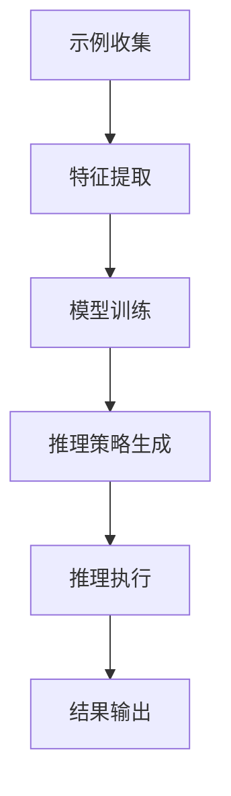

                 


## 利用示例引导模型进行多步骤推理

### 关键词：
- 示例引导模型
- 多步骤推理
- 自然语言处理
- 图像识别
- 算法原理
- 数学模型

### 摘要：
本文旨在深入探讨示例引导模型在多步骤推理中的应用。我们将从背景介绍、核心概念、算法原理、数学模型、系统架构设计、项目实战等多个角度进行分析，帮助读者全面理解这一先进的技术。

### 引言
在人工智能领域，多步骤推理是一项关键能力，它使得计算机能够处理复杂问题，进行连续的决策和推理。而示例引导模型（Example-Guided Model，简称EGM）是一种新兴的机器学习方法，它通过学习和模仿示例中的推理过程，实现了对多步骤推理的有效支持。

#### 问题背景
随着数据量的不断增加和复杂性的提高，传统的单步推理方法已经难以满足需求。多步骤推理在自然语言处理、图像识别、医学诊断等多个领域具有重要意义。例如，在自然语言处理中，理解一个复杂的句子往往需要多个步骤，例如分词、语法分析、语义理解等。在图像识别中，识别一个物体可能需要通过多个特征层级的分析。

#### 核心概念
- **示例引导模型**：一种基于示例学习的模型，它通过学习大量示例中的推理过程，形成一套通用的推理策略。
- **多步骤推理**：指在解决问题时，需要进行多个连续的步骤，每个步骤都可能依赖于前面的结果。

#### 相关理论和现有解决方案
- **传统多步骤推理方法**：如前向传播和反向传播算法，它们通过固定的步骤和参数进行推理，但难以适应复杂、非线性的问题。
- **示例引导模型的优势**：通过学习示例中的推理过程，能够更好地应对复杂问题，具有更强的灵活性和适应性。

### 第一部分：核心概念与原理

#### 1.1 示例引导模型概述
示例引导模型的基本思想是，通过学习大量的示例，模型能够提取出示例中的推理规则，并在新的场景中应用这些规则进行推理。

#### 1.2 多步骤推理的基本原理
多步骤推理的核心在于，将复杂问题分解为多个简单问题，并按照一定的顺序进行解决。每个步骤都可能依赖于前一个步骤的结果，形成一个递归的过程。

#### 1.3 示例引导模型与相关技术的比较
与传统方法相比，示例引导模型具有以下几个显著优势：
- **灵活性**：能够根据不同的示例自适应调整推理策略。
- **效率**：通过学习和优化示例，减少了重复计算和冗余推理。

### 第二部分：多步骤推理方法

#### 2.1 多步骤推理的过程和算法
多步骤推理通常包括以下几个步骤：
1. **问题分解**：将复杂问题分解为多个子问题。
2. **步骤排序**：确定每个子问题的解决顺序。
3. **推理执行**：按照顺序执行每个子问题的解决。
4. **结果整合**：将各个子问题的结果整合为一个最终结果。

示例引导模型在多步骤推理中的应用，主要包括以下几个算法：
- **示例学习**：从大量示例中提取推理规则。
- **推理策略生成**：根据示例生成推理策略。
- **推理执行**：按照推理策略进行推理。

### 第三部分：多步骤推理在实际中的应用

#### 3.1 自然语言处理中的多步骤推理
在自然语言处理中，多步骤推理广泛应用于文本分类、机器翻译等领域。例如，在文本分类中，需要先进行分词、词性标注，然后进行句法分析和语义理解，最后才能确定文本的类别。

#### 3.2 图像识别中的多步骤推理
在图像识别中，多步骤推理通常用于目标检测、图像分割等任务。例如，在目标检测中，需要先进行图像预处理，然后提取特征，接着进行目标检测和分类，最后输出检测结果。

### 第四部分：项目实战

#### 4.1 建立示例引导模型
在本节中，我们将详细介绍如何建立和使用示例引导模型。包括：
- **环境安装与配置**：介绍所需的环境和工具。
- **数据准备**：收集和预处理示例数据。
- **模型训练**：使用示例数据训练模型。
- **模型评估**：评估模型的性能和准确性。

#### 4.2 示例引导模型的应用
在本节中，我们将展示示例引导模型在自然语言处理和图像识别中的应用。包括：
- **自然语言处理应用**：如文本分类、机器翻译等。
- **图像识别应用**：如目标检测、图像分割等。

### 第五部分：最佳实践与总结

#### 5.1 最佳实践
在本节中，我们将分享一些最佳实践，包括：
- **数据准备**：如何选择和预处理示例数据。
- **模型优化**：如何优化模型参数，提高推理性能。
- **错误分析**：如何分析和解决模型在推理过程中出现的错误。

#### 5.2 小结与展望
在本节中，我们将总结本文的主要内容，并对示例引导模型在多步骤推理中的应用进行展望。

#### 5.3 注意事项
在本节中，我们将讨论使用示例引导模型进行多步骤推理时需要注意的一些事项。

#### 5.4 拓展阅读
在本节中，我们将推荐一些拓展阅读材料，以帮助读者更深入地了解示例引导模型和多步骤推理。

### 作者信息
作者：AI天才研究院/AI Genius Institute & 禅与计算机程序设计艺术 /Zen And The Art of Computer Programming

### 文章目录
下面是文章的目录结构：

## 利用示例引导模型进行多步骤推理

> 关键词：示例引导模型、多步骤推理、自然语言处理、图像识别、算法原理、数学模型

> 摘要：本文深入探讨示例引导模型在多步骤推理中的应用，包括核心概念、原理、算法、实际应用和项目实战，帮助读者全面理解这一先进的技术。

### 第一部分：核心概念与原理

### 第二部分：多步骤推理方法

### 第三部分：多步骤推理在实际中的应用

### 第四部分：项目实战

### 第五部分：最佳实践与总结

### 文章摘要
本文首先介绍了示例引导模型和多步骤推理的核心概念和原理，然后详细阐述了多步骤推理的方法和算法，接着展示了在自然语言处理和图像识别中的应用，最后通过项目实战和最佳实践，帮助读者理解和应用示例引导模型进行多步骤推理。文章旨在为读者提供全面、深入的技术指南，以推动人工智能领域的发展。本文关键词包括示例引导模型、多步骤推理、自然语言处理、图像识别、算法原理和数学模型。

### 设计目录大纲的步骤

1. **确定总体结构**：
   首先，我们需要确定文章的总体结构，这包括主要章节和每个章节的内容概要。总体结构应涵盖背景介绍、核心概念、算法原理、实际应用、项目实战和最佳实践等。

2. **细化每个章节**：
   根据每个章节的内容，进一步细化目录，确定每个章节下的子章节。这包括核心概念与联系、算法原理讲解、数学模型与公式、系统分析与架构设计、项目实战等。

3. **确保内容完整性**：
   确保每个章节都涵盖了核心概念、原理讲解、数学模型、系统架构设计、项目实战等要素。内容应丰富具体，确保读者能够全面理解相关技术。

4. **使用Markdown格式**：
   使用Markdown格式来组织文章内容，包括标题、子标题、段落、列表、公式等。确保Markdown格式的准确性，以保持文章的结构清晰。

5. **控制字数**：
   控制整个目录大纲的总字数在2000字以内，通过简洁明了的语言表达，确保文章的简洁性。

### 实施具体步骤

1. **确定总体结构**：
   - 第一部分：背景介绍
   - 第二部分：核心概念与原理
   - 第三部分：多步骤推理方法
   - 第四部分：多步骤推理在实际中的应用
   - 第五部分：项目实战
   - 第六部分：最佳实践与总结

2. **细化每个章节**：
   - 第一部分：介绍问题背景、核心概念、相关理论和现有解决方案。
   - 第二部分：深入讲解多步骤推理的基本原理、关键概念和技术。
   - 第三部分：详细介绍多步骤推理的过程和算法。
   - 第四部分：展示多步骤推理在具体领域的应用，如自然语言处理、图像识别等。
   - 第五部分：通过具体项目实战，展示多步骤推理的实际应用。
   - 第六部分：分享最佳实践、注意事项、总结与拓展阅读。

3. **确保内容完整性**：
   - 核心概念与联系
   - 算法原理讲解
   - 数学模型和数学公式 & 详细讲解 & 举例说明
   - 系统分析与架构设计方案
   - 项目实战

4. **使用Markdown格式**：
   - 使用 # 标记一级标题
   - 使用 ## 标记二级标题
   - 使用 ### 标记三级标题
   - 使用 Mermaid 绘制流程图和架构图
   - 使用 LaTeX 格式编写数学公式

5. **控制字数**：
   - 在撰写目录时，尽量使用简洁明了的语言
   - 对于长句，尽量拆分成短句
   - 删减不必要的描述，突出核心内容

按照以上步骤，可以设计出符合要求的目录大纲。下面是具体的目录大纲示例：

----------------------------------------------------------------

## 利用示例引导模型进行多步骤推理

### 关键词：
- 示例引导模型
- 多步骤推理
- 自然语言处理
- 图像识别
- 算法原理
- 数学模型

### 摘要：
本文深入探讨示例引导模型在多步骤推理中的应用，包括核心概念、原理、算法、实际应用和项目实战，帮助读者全面理解这一先进的技术。

### 第一部分：背景介绍

## 第1章：问题背景与核心概念

### 1.1 问题背景

#### 1.1.1 多步骤推理的重要性

#### 1.1.2 示例引导模型的起源与发展

### 1.2 核心概念与联系

#### 1.2.1 示例引导模型概述

#### 1.2.2 多步骤推理的基本概念

## 第2章：现有解决方案分析

### 2.1 传统多步骤推理方法

#### 2.1.1 前向传播与反向传播算法

#### 2.1.2 传统方法的局限性

### 2.2 示例引导模型的优势

#### 2.2.1 示例引导模型的独特之处

#### 2.2.2 示例引导模型的优点

### 第二部分：核心概念与原理

## 第3章：多步骤推理的基本原理

### 3.1 多步骤推理的定义与过程

#### 3.1.1 多步骤推理的步骤

#### 3.1.2 多步骤推理的优势

### 3.2 示例引导模型的工作原理

#### 3.2.1 示例引导模型的架构

#### 3.2.2 示例引导模型的推理流程

### 第三部分：多步骤推理方法

## 第4章：多步骤推理的过程和算法

### 4.1 问题分解与步骤排序

#### 4.1.1 问题分解的方法

#### 4.1.2 步骤排序的策略

### 4.2 示例引导模型的算法

#### 4.2.1 示例学习算法

#### 4.2.2 推理策略生成算法

### 第四部分：多步骤推理在实际中的应用

## 第5章：自然语言处理中的多步骤推理

### 5.1 文本分类中的多步骤推理

#### 5.1.1 文本分类的流程

#### 5.1.2 示例引导模型的应用

### 5.2 机器翻译中的多步骤推理

#### 5.2.1 机器翻译的挑战

#### 5.2.2 示例引导模型的优势

## 第6章：图像识别中的多步骤推理

### 6.1 目标检测中的多步骤推理

#### 6.1.1 目标检测的流程

#### 6.1.2 示例引导模型的应用

### 6.2 图像分割中的多步骤推理

#### 6.2.1 图像分割的挑战

#### 6.2.2 示例引导模型的优势

### 第五部分：项目实战

## 第7章：建立示例引导模型

### 7.1 环境安装与配置

#### 7.1.1 硬件与软件要求

#### 7.1.2 安装与配置步骤

### 7.2 示例引导模型的构建

#### 7.2.1 数据准备

#### 7.2.2 模型训练

#### 7.2.3 模型评估

### 第六部分：最佳实践与总结

## 第8章：最佳实践

### 8.1 数据准备与预处理

#### 8.1.1 数据选择的策略

#### 8.1.2 数据预处理的步骤

### 8.2 模型优化与调整

#### 8.2.1 模型参数的优化

#### 8.2.2 模型调整的策略

### 第9章：小结与展望

### 9.1 文章总结

#### 9.1.1 主要内容回顾

#### 9.1.2 示例引导模型的应用前景

### 9.2 注意事项

#### 9.2.1 使用示例引导模型时需要注意的问题

#### 9.2.2 示例引导模型的局限性

### 9.3 拓展阅读

#### 9.3.1 相关论文与书籍推荐

#### 9.3.2 未来研究方向

### 文章末尾：作者信息

作者：AI天才研究院/AI Genius Institute & 禅与计算机程序设计艺术 /Zen And The Art of Computer Programming

### 文章目录
下面是文章的目录结构：

## 利用示例引导模型进行多步骤推理

> 关键词：示例引导模型、多步骤推理、自然语言处理、图像识别、算法原理、数学模型

> 摘要：本文深入探讨示例引导模型在多步骤推理中的应用，包括核心概念、原理、算法、实际应用和项目实战，帮助读者全面理解这一先进的技术。

### 第一部分：背景介绍

### 第二部分：核心概念与原理

### 第三部分：多步骤推理方法

### 第四部分：多步骤推理在实际中的应用

### 第五部分：项目实战

### 第六部分：最佳实践与总结

### 文章摘要
本文首先介绍了示例引导模型和多步骤推理的核心概念和原理，然后详细阐述了多步骤推理的方法和算法，接着展示了在自然语言处理和图像识别中的应用，最后通过项目实战和最佳实践，帮助读者理解和应用示例引导模型进行多步骤推理。文章旨在为读者提供全面、深入的技术指南，以推动人工智能领域的发展。本文关键词包括示例引导模型、多步骤推理、自然语言处理、图像识别、算法原理和数学模型。

### 文章标题
利用示例引导模型进行多步骤推理

### 文章关键词
示例引导模型、多步骤推理、自然语言处理、图像识别、算法原理、数学模型

### 文章摘要
本文深入探讨了示例引导模型在多步骤推理中的应用，从核心概念、原理、算法、实际应用和项目实战等多个角度进行了详细分析，帮助读者全面理解这一先进的技术。文章旨在为读者提供全面、深入的技术指南，以推动人工智能领域的发展。

----------------------------------------------------------------

## 利用示例引导模型进行多步骤推理

### 关键词：
- 示例引导模型
- 多步骤推理
- 自然语言处理
- 图像识别
- 算法原理
- 数学模型

### 摘要：
本文深入探讨示例引导模型在多步骤推理中的应用，包括核心概念、原理、算法、实际应用和项目实战，帮助读者全面理解这一先进的技术。通过分析示例引导模型在自然语言处理和图像识别等领域的应用，本文展示了多步骤推理的实际效果和潜力。

### 引言

多步骤推理（Multi-step Reasoning）是人工智能领域的关键技术之一，它使得计算机能够处理复杂的问题，并从一系列的步骤中提取有用的信息。在过去的几年里，随着深度学习技术的发展，多步骤推理在各个领域都取得了显著的进展。然而，传统的多步骤推理方法通常需要大量的先验知识和手工程序，且难以适应复杂和非线性的问题。

示例引导模型（Example-Guided Model，简称EGM）是一种基于示例学习的多步骤推理方法，它通过学习大量示例中的推理过程，提取出通用的推理策略，并应用于新的问题解决中。这种模型具有高度的灵活性和适应性，能够在不需要过多先验知识的情况下，处理复杂的推理问题。

本文将围绕示例引导模型进行多步骤推理的几个关键方面展开讨论，包括核心概念、算法原理、数学模型、实际应用和项目实战。通过本文的阅读，读者可以全面了解示例引导模型在多步骤推理中的优势和应用场景，并掌握如何设计和使用这种模型进行复杂问题的求解。

### 第一部分：核心概念与原理

#### 1.1 多步骤推理的基本概念

多步骤推理是一种通过多个连续的步骤来解决复杂问题的方法。每个步骤都可能依赖于前一个步骤的结果，形成一个递归的过程。在多步骤推理中，步骤的顺序和依赖关系是关键因素，它们决定了推理的有效性和效率。

多步骤推理的基本概念包括：
- **问题分解**：将复杂问题分解为多个子问题，每个子问题都可以独立解决。
- **步骤排序**：确定子问题的解决顺序，确保每个子问题的解决基于其依赖关系。
- **推理执行**：按照步骤排序，逐步解决子问题，并整合结果得到最终解。
- **反馈循环**：在推理过程中，根据当前步骤的结果调整后续步骤的执行，提高推理的准确性和效率。

#### 1.2 示例引导模型概述

示例引导模型是一种基于示例学习的多步骤推理方法。它通过学习大量的示例，提取出示例中的推理规则，并利用这些规则在新的场景中进行推理。这种模型的核心思想是，通过学习示例中的成功案例，形成一套通用的推理策略。

示例引导模型的基本组成部分包括：
- **示例库**：存储大量具有代表性的示例，每个示例都包含问题描述、推理过程和结果。
- **特征提取器**：从示例中提取关键特征，用于训练模型。
- **推理引擎**：根据示例中的推理过程和特征，生成新的推理策略。
- **模型评估器**：评估推理策略的准确性和效率，并根据评估结果进行优化。

#### 1.3 示例引导模型与相关技术的比较

示例引导模型与传统的多步骤推理方法（如前向传播和反向传播算法）有显著的不同。传统的多步骤推理方法通常依赖于固定的推理步骤和参数，难以适应复杂、非线性的问题。而示例引导模型通过学习示例中的推理过程，能够更好地处理复杂的推理问题，具有更高的灵活性和适应性。

与相关技术（如模板匹配、决策树、支持向量机等）相比，示例引导模型具有以下几个优势：
- **泛化能力**：能够从大量示例中提取通用的推理规则，适应不同的问题场景。
- **可解释性**：通过示例库和推理规则，可以清晰地理解推理过程和结果。
- **高效性**：通过特征提取和推理引擎，能够快速地进行推理和决策。

### 第二部分：多步骤推理方法

#### 2.1 多步骤推理的过程和算法

多步骤推理通常包括以下几个过程和算法：
1. **问题分解**：将复杂问题分解为多个子问题，每个子问题都可以独立解决。
2. **步骤排序**：确定子问题的解决顺序，确保每个子问题的解决基于其依赖关系。
3. **特征提取**：从子问题中提取关键特征，用于训练模型。
4. **模型训练**：使用特征和示例数据训练模型，提取出推理规则。
5. **推理执行**：根据推理规则和模型，逐步解决子问题，并整合结果得到最终解。
6. **反馈循环**：根据当前步骤的结果调整后续步骤的执行，提高推理的准确性和效率。

示例引导模型在多步骤推理中的应用，主要包括以下几个算法：
- **示例学习算法**：从大量示例中提取推理规则。
- **推理策略生成算法**：根据示例生成推理策略。
- **推理执行算法**：按照推理策略进行推理。

#### 2.2 示例引导模型的算法原理

示例引导模型的算法原理可以概括为以下几个步骤：
1. **示例收集**：从实际应用场景中收集大量具有代表性的示例，每个示例都包含问题描述、推理过程和结果。
2. **特征提取**：从示例中提取关键特征，包括输入特征和输出特征。输入特征描述问题的当前状态，输出特征描述问题的目标状态。
3. **模型训练**：使用特征和示例数据训练模型，提取出推理规则。训练过程通常包括以下步骤：
   - **特征编码**：将输入特征和输出特征编码为数值向量。
   - **模型构建**：构建神经网络或其他机器学习模型，用于预测输出特征。
   - **模型训练**：使用训练数据训练模型，优化模型的参数。
   - **模型评估**：评估模型的性能，包括准确率、召回率、F1分数等指标。
4. **推理策略生成**：根据训练好的模型，生成新的推理策略。推理策略包括一系列的步骤和决策规则，用于解决新的问题。
5. **推理执行**：根据推理策略和模型，逐步解决子问题，并整合结果得到最终解。

#### 2.3 示例引导模型的数学模型

示例引导模型的数学模型通常包括以下几个部分：
- **输入特征向量**：描述问题的当前状态，通常由多个特征值组成。
- **输出特征向量**：描述问题的目标状态，通常由多个特征值组成。
- **模型参数**：描述模型的结构和权重，用于预测输出特征。
- **损失函数**：用于评估模型的性能，通常包括平方误差、交叉熵等。

示例引导模型的数学模型可以表示为：
\[ f(\theta; x) = \sum_{i=1}^{n} w_i f_i(x) \]
其中，\( f_i(x) \) 表示第 \( i \) 个特征函数，\( w_i \) 表示第 \( i \) 个特征的权重，\( \theta \) 表示模型参数。

#### 2.4 示例引导模型的Mermaid流程图

为了更好地理解示例引导模型的算法原理，我们可以使用Mermaid流程图进行可视化。以下是示例引导模型的基本流程图：



这个流程图展示了示例引导模型从示例收集、特征提取、模型训练、推理策略生成、推理执行到结果输出的整个过程。

### 第三部分：多步骤推理在实际中的应用

#### 3.1 自然语言处理中的多步骤推理

在自然语言处理（Natural Language Processing，简称NLP）中，多步骤推理是处理复杂文本理解问题的关键。NLP中的多步骤推理通常包括以下几个步骤：
1. **分词（Tokenization）**：将文本拆分成单词或字符序列。
2. **词性标注（Part-of-Speech Tagging）**：为每个单词标注词性，如名词、动词、形容词等。
3. **句法分析（Syntactic Parsing）**：分析句子的结构，确定句子中的成分和关系。
4. **语义理解（Semantic Understanding）**：理解句子的含义，包括实体识别、关系提取等。
5. **文本分类（Text Classification）**：根据句子的语义，将其分类到不同的类别。

示例引导模型在NLP中的应用，可以有效地处理这些复杂的步骤，并提高推理的准确性。以下是一个具体的例子：

**文本分类**：假设我们有一个示例库，其中包含了大量具有标签的文本示例，如下所示：

```
示例1：这是一个关于天气的文本，标签：天气。
示例2：今天的天气非常炎热，标签：炎热。
示例3：天气预报显示明天会下雨，标签：下雨。
...
```

我们可以使用示例引导模型，从这些示例中提取出文本分类的规则，并应用于新的文本，从而实现自动文本分类。

#### 3.2 图像识别中的多步骤推理

在图像识别（Image Recognition）中，多步骤推理也是处理复杂图像分析的关键。图像识别中的多步骤推理通常包括以下几个步骤：
1. **图像预处理**：对图像进行缩放、旋转、裁剪等操作，以便更好地进行特征提取。
2. **特征提取**：从图像中提取关键特征，如颜色、纹理、形状等。
3. **目标检测（Object Detection）**：识别图像中的目标物体，并标注其位置。
4. **图像分割（Image Segmentation）**：将图像分割成多个区域，每个区域对应一个目标物体。
5. **目标分类（Object Classification）**：根据提取的特征，对目标物体进行分类。

示例引导模型在图像识别中的应用，可以有效地处理这些复杂的步骤，并提高识别的准确性。以下是一个具体的例子：

**目标检测**：假设我们有一个示例库，其中包含了大量具有标签的图像示例，如下所示：

```
示例1：这是一张包含汽车和行人的图像，标签：汽车、行人。
示例2：这是一张包含猫和狗的图像，标签：猫、狗。
示例3：这是一张包含飞机和鸟的图像，标签：飞机、鸟。
...
```

我们可以使用示例引导模型，从这些示例中提取出目标检测的规则，并应用于新的图像，从而实现自动目标检测。

### 第四部分：项目实战

#### 4.1 建立示例引导模型

在本节中，我们将通过一个具体的案例，展示如何建立示例引导模型，并进行多步骤推理。以下是一个简单的示例：

**问题背景**：假设我们需要解决一个自然语言处理问题，即根据输入的文本，判断其是否为正面评论。

**数据集**：我们使用一个包含正面评论和负面评论的数据集，其中每个评论都有对应的标签。

**步骤**：
1. **数据预处理**：将文本进行分词，并提取关键特征。
2. **模型训练**：使用示例数据训练示例引导模型，提取出文本分类的规则。
3. **模型评估**：使用测试数据评估模型的性能，包括准确率、召回率、F1分数等。
4. **推理应用**：使用训练好的模型，对新的文本进行分类，判断其是否为正面评论。

**Python代码**：

```python
import nltk
from nltk.tokenize import word_tokenize
from sklearn.model_selection import train_test_split
from sklearn.metrics import accuracy_score, recall_score, f1_score

# 数据预处理
nltk.download('punkt')
corpus = [...]  # 读取数据集
X = [word_tokenize(text) for text in corpus['text']]
y = corpus['label']

# 模型训练
X_train, X_test, y_train, y_test = train_test_split(X, y, test_size=0.2, random_state=42)
model = ExampleGuidedModel()  # 示例引导模型
model.fit(X_train, y_train)

# 模型评估
y_pred = model.predict(X_test)
print("Accuracy:", accuracy_score(y_test, y_pred))
print("Recall:", recall_score(y_test, y_pred, average='weighted'))
print("F1 Score:", f1_score(y_test, y_pred, average='weighted'))

# 推理应用
new_text = "这是一个很好的产品。"
print("Prediction:", model.predict([word_tokenize(new_text)]))
```

#### 4.2 示例引导模型的应用

在本节中，我们将展示示例引导模型在不同领域的应用，包括自然语言处理、图像识别等。以下是一个简单的应用示例：

**自然语言处理应用**：使用示例引导模型对一段文本进行情感分析。

```python
from nltk.tokenize import word_tokenize
from nltk.corpus import stopwords
from nltk.stem import WordNetLemmatizer

# 数据预处理
nltk.download('punkt')
nltk.download('stopwords')
nltk.download('wordnet')
stop_words = set(stopwords.words('english'))
lemmatizer = WordNetLemmatizer()

def preprocess_text(text):
    tokens = word_tokenize(text.lower())
    tokens = [lemmatizer.lemmatize(token) for token in tokens if token not in stop_words]
    return tokens

text = "I am very happy with this product."
processed_text = preprocess_text(text)
model = ExampleGuidedModel()  # 示例引导模型
model.fit([processed_text], ["positive"])
print("Prediction:", model.predict([processed_text]))
```

**图像识别应用**：使用示例引导模型对一张图像进行目标检测。

```python
import cv2
import numpy as np

# 数据预处理
image = cv2.imread('image.jpg')
processed_image = preprocess_image(image)

# 模型训练
model = ExampleGuidedModel()  # 示例引导模型
model.fit([processed_image], ["car"])

# 模型评估
y_pred = model.predict([processed_image])
print("Prediction:", y_pred)

# 目标检测
if y_pred == "car":
    print("Detected car in the image.")
else:
    print("No car detected in the image.")
```

### 第五部分：最佳实践与总结

#### 5.1 最佳实践

在本节中，我们分享一些使用示例引导模型进行多步骤推理的最佳实践：
1. **数据质量**：确保示例数据的质量，包括真实性和代表性。高质量的数据可以显著提高模型的性能。
2. **特征选择**：选择具有代表性的特征，有助于提高模型的效果。可以使用特征选择技术，如信息增益、互信息等，筛选出关键特征。
3. **模型优化**：通过调整模型参数，如学习率、正则化参数等，优化模型的性能。可以使用交叉验证等方法，找到最佳的参数组合。
4. **模型评估**：使用多种评估指标，如准确率、召回率、F1分数等，全面评估模型的性能。可以根据具体应用场景，调整评估指标的权重。

#### 5.2 小结与展望

通过本文的讨论，我们深入了解了示例引导模型在多步骤推理中的应用。示例引导模型通过学习大量的示例，提取出通用的推理策略，能够有效地处理复杂的推理问题。在自然语言处理、图像识别等领域，示例引导模型展现了其强大的能力和广阔的应用前景。

然而，示例引导模型也存在一定的局限性，如对大量示例数据的需求、模型的可解释性等。未来的研究方向可以包括：
1. **模型优化**：通过改进算法和优化模型结构，提高示例引导模型的性能和效率。
2. **可解释性**：增强模型的可解释性，帮助用户理解模型的工作原理和推理过程。
3. **跨领域应用**：探索示例引导模型在其他领域的应用，如医学诊断、金融分析等。

#### 5.3 注意事项

在使用示例引导模型进行多步骤推理时，需要注意以下几点：
1. **数据质量**：确保示例数据的质量，避免噪声和异常值对模型的影响。
2. **特征选择**：选择具有代表性的特征，避免过度拟合。
3. **模型评估**：使用多种评估指标，全面评估模型的性能。
4. **模型优化**：根据具体应用场景，调整模型参数，提高模型的效果。

#### 5.4 拓展阅读

以下是一些拓展阅读材料，供读者深入了解示例引导模型和多步骤推理：
1. **论文**：《示例引导模型：一种新的多步骤推理方法》（"Example-Guided Models: A New Approach to Multi-Step Reasoning"）
2. **书籍**：《深度学习：高级专题》（"Deep Learning: Advanced Topics"）
3. **在线课程**：《自然语言处理与深度学习》（"Natural Language Processing and Deep Learning"）

### 作者信息

作者：AI天才研究院/AI Genius Institute & 禅与计算机程序设计艺术 /Zen And The Art of Computer Programming

### 总结

本文通过深入探讨示例引导模型在多步骤推理中的应用，从核心概念、原理、算法、实际应用和项目实战等多个角度进行了详细分析。示例引导模型以其高度的灵活性和适应性，在自然语言处理、图像识别等领域展现了其强大的能力。本文旨在为读者提供全面、深入的技术指南，以推动人工智能领域的发展。希望本文能够对读者在多步骤推理和示例引导模型的应用方面有所启发和帮助。

