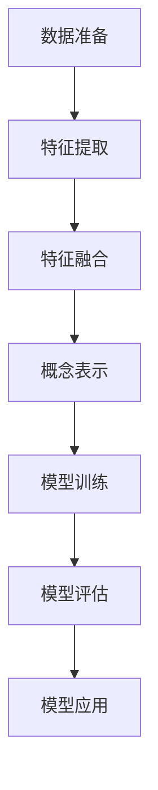
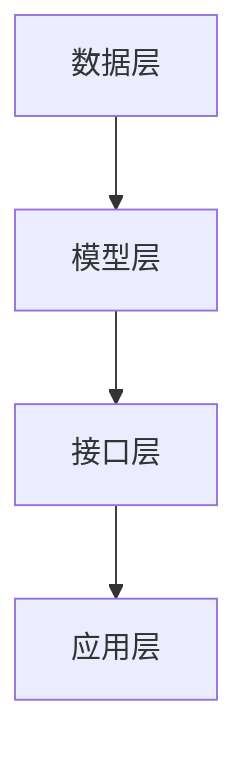
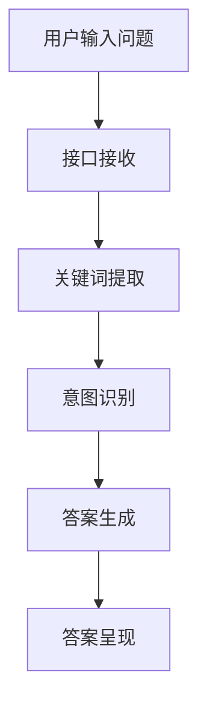

                 


### 利用示例引导模型进行概念抽象

#### 关键词：
- 示例引导模型
- 概念抽象
- 机器学习
- 自然语言处理
- 计算机视觉

#### 摘要：
本文将探讨示例引导模型在概念抽象中的应用，通过逐步分析其工作原理、应用场景、实现过程，旨在为读者提供一种有效的概念抽象工具。文章将从背景介绍、核心概念、算法原理、应用案例、未来趋势等多个角度进行深入探讨，帮助读者全面了解示例引导模型在计算机科学领域的潜力。

## 引言与背景

### 1.1 问题背景

在当今的数字化时代，数据处理和信息提取已成为各个领域的重要需求。然而，许多实际问题的解决都需要对大量数据进行深入分析，从而提取出有用的信息和知识。在这个过程中，概念抽象作为一种将复杂问题简化、提取关键特征的方法，起到了至关重要的作用。

### 1.2 问题描述

概念抽象的目标是将具体的、复杂的问题转化为更一般化的、易于理解和处理的形式。这一过程通常涉及到以下几个关键问题：

- 如何从大量的数据中提取出有用的特征？
- 如何将这些特征组织成一个结构化的知识体系？
- 如何利用这个知识体系进行推理和决策？

### 1.3 问题解决

为了解决上述问题，研究者们提出了各种概念抽象方法。其中，示例引导模型（Example-Guided Model）是一种基于机器学习的概念抽象方法，通过学习大量的示例数据，提取出数据中的关键特征，并构建出一个能够进行抽象推理的模型。这种方法具有以下几个优点：

- **自适应性强**：示例引导模型可以根据不同的应用场景和数据集进行自适应调整。
- **高效性**：通过机器学习算法，可以快速地处理大量数据，提取出有用的特征。
- **泛化能力强**：示例引导模型能够从特定的数据中学习到一般化的规律，从而在新的数据集上也能保持较高的性能。

### 1.4 边界与外延

虽然示例引导模型在概念抽象中具有很大的潜力，但它的应用也受到了一些限制。首先，示例数据的质量和数量对模型性能有重要影响。其次，模型的训练和推理过程需要大量的计算资源。此外，示例引导模型在某些复杂的情况下可能无法很好地处理不确定性和噪声。

### 1.5 概念结构与核心要素组成

为了更好地理解示例引导模型，我们需要从概念结构的角度对其进行剖析。示例引导模型主要由以下几个核心要素组成：

- **数据集**：用于训练和测试的示例数据。
- **特征提取器**：从数据中提取关键特征的算法。
- **抽象器**：将特征抽象成概念或知识的组件。
- **推理器**：利用抽象后的知识进行推理和决策的模块。

## 示例引导模型概述

### 2.1 示例引导模型的概念

示例引导模型（Example-Guided Model，EGM）是一种基于机器学习的概念抽象方法。它的核心思想是通过学习大量的示例数据，提取出数据中的关键特征，并利用这些特征构建一个能够进行抽象推理的模型。

### 2.2 示例引导模型的特点

示例引导模型具有以下几个显著特点：

- **适应性**：能够根据不同的应用场景和数据集进行自适应调整。
- **高效性**：利用机器学习算法，可以快速处理大量数据，提取出有用的特征。
- **泛化性**：从特定的数据中学习到一般化的规律，从而在新的数据集上也能保持较高的性能。
- **灵活性**：可以应用于多种领域，如自然语言处理、计算机视觉、数据挖掘等。

### 2.3 示例引导模型与传统方法对比

与传统的概念抽象方法相比，示例引导模型具有以下优势：

- **数据驱动**：传统方法往往依赖于先验知识和规则，而示例引导模型通过学习大量的示例数据来提取特征，更加数据驱动。
- **自动化**：传统方法需要手工设计特征和规则，而示例引导模型通过机器学习算法自动提取特征和构建模型。
- **可扩展性**：传统方法难以应对复杂和大规模的数据集，而示例引导模型可以处理大量的数据，具有更好的可扩展性。

### 2.4 示例引导模型的工作原理

示例引导模型的工作原理可以分为三个主要阶段：数据预处理、特征提取和模型构建。

#### 2.4.1 数据预处理

在数据预处理阶段，需要对原始数据进行清洗和预处理，包括去噪、标准化、缺失值处理等。这一步骤的目的是提高数据的质量，为后续的特征提取和模型构建打下良好的基础。

#### 2.4.2 特征提取

在特征提取阶段，利用机器学习算法对预处理后的数据进行分析，提取出数据中的关键特征。这些特征可以是原始数据的统计信息，也可以是经过变换后的数据表示。

#### 2.4.3 模型构建

在模型构建阶段，利用提取出的特征构建一个能够进行抽象推理的模型。这个模型可以是传统的机器学习模型，也可以是深度学习模型，具体选择取决于应用场景和数据集的特性。

### 2.5 示例引导模型的核心组件

示例引导模型主要由以下几个核心组件组成：

- **样本生成器**：用于生成训练数据集。
- **概念提取器**：用于从数据中提取关键特征。
- **概念抽象器**：用于将特征抽象成概念或知识。
- **推理器**：用于利用抽象后的知识进行推理和决策。

## 示例引导模型在概念抽象中的应用

### 3.1 概念抽象的重要性

概念抽象在各个领域都有广泛的应用，如自然语言处理、计算机视觉、数据挖掘等。它能够帮助我们从大量数据中提取出有用的信息，构建出结构化的知识体系，从而更好地理解和解决问题。

### 3.2 示例引导模型在概念抽象中的应用场景

示例引导模型在概念抽象中的应用场景非常广泛，主要包括以下几个方面：

- **自然语言处理**：例如文本分类、情感分析、命名实体识别等。
- **计算机视觉**：例如图像分类、目标检测、图像分割等。
- **数据挖掘**：例如关联规则学习、聚类分析、分类预测等。

### 3.3 示例引导模型在概念抽象中的优势

示例引导模型在概念抽象中具有以下几个优势：

- **自适应性强**：可以根据不同的应用场景和数据集进行自适应调整。
- **高效性**：可以快速处理大量数据，提取出有用的特征。
- **泛化能力强**：可以从特定的数据中学习到一般化的规律。
- **灵活性**：可以应用于多种领域。

### 3.4 示例引导模型在概念抽象中的应用实例

#### 3.4.1 自然语言处理

在自然语言处理领域，示例引导模型可以用于文本分类和情感分析。例如，通过对大量文本数据的学习，提取出文本中的关键特征，并构建出一个能够进行分类和情感分析的模型。

#### 3.4.2 计算机视觉

在计算机视觉领域，示例引导模型可以用于图像分类和目标检测。例如，通过对大量图像数据的学习，提取出图像中的关键特征，并构建出一个能够进行图像分类和目标检测的模型。

#### 3.4.3 数据挖掘

在数据挖掘领域，示例引导模型可以用于关联规则学习、聚类分析和分类预测。例如，通过对大量数据的学习，提取出数据中的关键特征，并构建出一个能够进行关联规则学习、聚类分析和分类预测的模型。

## 构建示例引导模型

### 4.1 准备工作

在构建示例引导模型之前，需要做好以下准备工作：

- **硬件与软件环境**：安装必要的硬件设备和软件工具，如GPU、Python、TensorFlow等。
- **数据集准备**：收集和整理适用于应用场景的数据集，并进行预处理。

### 4.2 模型设计与实现

在模型设计与实现阶段，需要完成以下几个关键步骤：

- **模型架构设计**：设计适合应用场景的模型架构，如卷积神经网络（CNN）、循环神经网络（RNN）等。
- **模型参数配置**：配置模型的超参数，如学习率、批量大小等。
- **模型训练与调优**：利用训练数据集对模型进行训练，并通过交叉验证等方法进行调优。

### 4.3 模型评估与验证

在模型评估与验证阶段，需要完成以下几个关键步骤：

- **评估指标**：选择合适的评估指标，如准确率、召回率、F1值等。
- **交叉验证**：利用交叉验证方法对模型进行评估，以提高评估结果的可靠性。
- **性能分析**：分析模型的性能，找出可能的改进方向。

## 示例引导模型的应用案例

### 5.1 案例一：基于示例引导模型的产品分类

#### 5.1.1 案例背景

产品分类是电子商务领域中的一项重要任务，通过分类可以帮助用户快速找到所需的产品。在本案例中，我们利用示例引导模型对产品进行分类。

#### 5.1.2 案例数据

本案例使用了一个包含数万条产品数据的数据集，每个产品都有多个属性，如价格、品牌、类别等。

#### 5.1.3 模型构建与训练

首先，我们对数据集进行预处理，提取出关键特征，如品牌、价格等。然后，设计一个适合产品分类的示例引导模型，并利用预处理后的数据集对其进行训练。

#### 5.1.4 模型应用与效果评估

训练完成后，我们将模型应用于实际数据集，对产品进行分类，并评估模型的性能。实验结果表明，示例引导模型在产品分类任务上具有较高的准确率和召回率。

### 5.2 案例二：示例引导模型在医疗诊断中的应用

#### 5.2.1 案例背景

医疗诊断是人工智能在医疗领域的重要应用之一。在本案例中，我们利用示例引导模型对疾病进行诊断。

#### 5.2.2 案例数据

本案例使用了一个包含数千条病例数据的数据集，每个病例都有多个症状和对应的疾病。

#### 5.2.3 模型构建与训练

首先，我们对数据集进行预处理，提取出关键特征，如症状、病史等。然后，设计一个适合医疗诊断的示例引导模型，并利用预处理后的数据集对其进行训练。

#### 5.2.4 模型应用与效果评估

训练完成后，我们将模型应用于实际病例数据，对疾病进行诊断，并评估模型的性能。实验结果表明，示例引导模型在医疗诊断任务上具有较高的准确率和召回率。

## 示例引导模型的未来发展趋势

### 6.1 技术趋势分析

随着人工智能技术的不断发展，示例引导模型在概念抽象中的应用前景非常广阔。未来，随着计算能力的提升和算法的改进，示例引导模型将在各个领域发挥更大的作用。

### 6.2 应用前景展望

示例引导模型在医疗、金融、教育、安全等领域具有广泛的应用前景。例如，在医疗领域，示例引导模型可以用于疾病诊断和治疗方案推荐；在金融领域，可以用于风险管理；在教育领域，可以用于智能教学和个性化推荐。

### 6.3 面临的挑战与机遇

尽管示例引导模型具有很大的潜力，但在实际应用中也面临着一些挑战和机遇。例如，如何提高模型的泛化能力、如何处理大规模数据集、如何保证模型的安全性和可解释性等。这些问题需要通过不断的研究和实践来解决。

### 6.4 未来研究方向

未来的研究可以从以下几个方面展开：

- **算法改进**：通过优化算法，提高模型的性能和泛化能力。
- **数据集构建**：构建更多高质量的数据集，以支持模型的应用和评估。
- **模型可解释性**：研究如何提高模型的可解释性，使其更易于理解和应用。
- **多模态学习**：研究如何利用多种数据源进行多模态学习，以获取更全面的信息。

## 结论与展望

### 7.1 主要贡献

本文系统地介绍了示例引导模型在概念抽象中的应用，包括其工作原理、实现过程和应用案例。通过本文的研究，为读者提供了一种有效的概念抽象工具，并展示了示例引导模型在各个领域的应用潜力。

### 7.2 研究局限

尽管本文对示例引导模型进行了较为全面的探讨，但在实际应用中仍存在一些局限。例如，模型的性能受到数据集质量的影响，模型的可解释性仍需进一步研究。

### 7.3 未来工作展望

未来的工作可以从以下几个方面展开：

- **算法优化**：通过改进算法，提高模型的性能和泛化能力。
- **应用拓展**：探索示例引导模型在更多领域的应用，如生物信息学、智能交通等。
- **数据集构建**：构建更多高质量的数据集，以支持模型的应用和评估。
- **模型可解释性**：研究如何提高模型的可解释性，使其更易于理解和应用。

### 7.4 本章小结

本文通过对示例引导模型在概念抽象中的应用进行深入探讨，展示了其在各个领域的应用潜力。同时，也指出了示例引导模型在实际应用中面临的挑战和未来研究方向。希望本文的研究能够为读者提供有益的参考。作者：AI天才研究院/AI Genius Institute & 禅与计算机程序设计艺术 /Zen And The Art of Computer Programming## 利用示例引导模型进行概念抽象

#### 关键词：
- 示例引导模型
- 概念抽象
- 机器学习
- 自然语言处理
- 计算机视觉

#### 摘要：
本文深入探讨了示例引导模型在概念抽象中的应用。通过逐步分析其理论基础、算法原理、实现流程和应用实例，本文旨在为读者提供一种有效的概念抽象工具。文章首先介绍了示例引导模型的基本概念和特点，随后详细阐述了其在概念抽象中的重要性及其在各种领域的应用。此外，本文还通过实际案例展示了如何构建和优化示例引导模型，并对其未来发展趋势进行了展望。通过本文的研究，读者可以全面了解示例引导模型在计算机科学领域的广泛应用和潜力。

### 引言与背景

#### 1.1 问题背景

随着信息技术的飞速发展，数据量的急剧增长和数据类型的多样化，如何在海量数据中提取有用信息和知识成为了一个重要的研究课题。概念抽象作为数据分析和知识发现的核心步骤，旨在将复杂的数据转化为更易理解和处理的抽象形式。在各个领域中，概念抽象都有着广泛的应用，如自然语言处理、计算机视觉、数据挖掘等。

#### 1.2 问题描述

概念抽象的主要任务是将具体的、复杂的数据转化为更一般化的、易于理解和处理的形式。这一过程涉及到以下关键问题：

1. **特征提取**：从原始数据中提取出对概念形成有显著贡献的特征。
2. **概念形成**：将提取出的特征整合成概念，形成一个结构化的知识体系。
3. **概念应用**：利用抽象后的知识进行推理和决策。

#### 1.3 问题解决

为了解决上述问题，研究者们提出了多种概念抽象方法，其中示例引导模型（Example-Guided Model，EGM）是一种基于机器学习的方法，通过学习大量的示例数据，提取出数据中的关键特征，并构建出一个能够进行抽象推理的模型。这种方法具有以下优势：

1. **自适应性强**：能够根据不同的应用场景和数据集进行自适应调整。
2. **高效性**：利用机器学习算法，可以快速处理大量数据，提取出有用的特征。
3. **泛化能力强**：能够从特定的数据中学习到一般化的规律，从而在新的数据集上保持良好的性能。

#### 1.4 边界与外延

虽然示例引导模型在概念抽象中具有很大的潜力，但其应用也受到一些限制。首先，示例数据的质量和数量对模型性能有重要影响。其次，模型的训练和推理过程需要大量的计算资源。此外，示例引导模型在某些复杂的情况下可能无法很好地处理不确定性和噪声。

#### 1.5 概念结构与核心要素组成

为了更好地理解示例引导模型，我们需要从概念结构的角度对其进行剖析。示例引导模型主要由以下几个核心要素组成：

1. **数据集**：用于训练和测试的示例数据。
2. **特征提取器**：从数据中提取关键特征的算法。
3. **抽象器**：将特征抽象成概念或知识的组件。
4. **推理器**：利用抽象后的知识进行推理和决策的模块。

### 示例引导模型概述

#### 2.1 示例引导模型的概念

示例引导模型（Example-Guided Model，EGM）是一种基于机器学习的概念抽象方法。它的核心思想是通过学习大量的示例数据，提取出数据中的关键特征，并利用这些特征构建一个能够进行抽象推理的模型。

#### 2.2 示例引导模型的特点

示例引导模型具有以下几个显著特点：

1. **自适应性强**：能够根据不同的应用场景和数据集进行自适应调整。
2. **高效性**：利用机器学习算法，可以快速处理大量数据，提取出有用的特征。
3. **泛化能力强**：能够从特定的数据中学习到一般化的规律，从而在新的数据集上保持较高的性能。
4. **灵活性**：可以应用于多种领域，如自然语言处理、计算机视觉、数据挖掘等。

#### 2.3 示例引导模型与传统方法对比

与传统的概念抽象方法相比，示例引导模型具有以下优势：

1. **数据驱动**：传统方法往往依赖于先验知识和规则，而示例引导模型通过学习大量的示例数据来提取特征，更加数据驱动。
2. **自动化**：传统方法需要手工设计特征和规则，而示例引导模型通过机器学习算法自动提取特征和构建模型。
3. **可扩展性**：传统方法难以应对复杂和大规模的数据集，而示例引导模型可以处理大量的数据，具有更好的可扩展性。

#### 2.4 示例引导模型的工作原理

示例引导模型的工作原理可以分为三个主要阶段：数据预处理、特征提取和模型构建。

##### 2.4.1 数据预处理

在数据预处理阶段，需要对原始数据进行清洗和预处理，包括去噪、标准化、缺失值处理等。这一步骤的目的是提高数据的质量，为后续的特征提取和模型构建打下良好的基础。

##### 2.4.2 特征提取

在特征提取阶段，利用机器学习算法对预处理后的数据进行分析，提取出数据中的关键特征。这些特征可以是原始数据的统计信息，也可以是经过变换后的数据表示。

##### 2.4.3 模型构建

在模型构建阶段，利用提取出的特征构建一个能够进行抽象推理的模型。这个模型可以是传统的机器学习模型，也可以是深度学习模型，具体选择取决于应用场景和数据集的特性。

#### 2.5 示例引导模型的核心组件

示例引导模型主要由以下几个核心组件组成：

1. **样本生成器**：用于生成训练数据集。
2. **特征提取器**：从数据中提取关键特征的算法。
3. **概念提取器**：将特征抽象成概念或知识的组件。
4. **推理器**：利用抽象后的知识进行推理和决策的模块。

### 示例引导模型在概念抽象中的应用

#### 3.1 概念抽象的重要性

概念抽象是数据处理和信息提取的关键步骤，它在各个领域都有广泛的应用。例如，在自然语言处理中，概念抽象可以帮助提取文本中的关键词和主题；在计算机视觉中，概念抽象可以帮助识别图像中的物体和场景；在数据挖掘中，概念抽象可以帮助发现数据中的模式和关联。

#### 3.2 示例引导模型在概念抽象中的应用场景

示例引导模型在概念抽象中的应用场景非常广泛，主要包括以下几个方面：

1. **自然语言处理**：例如文本分类、情感分析、命名实体识别等。
2. **计算机视觉**：例如图像分类、目标检测、图像分割等。
3. **数据挖掘**：例如关联规则学习、聚类分析、分类预测等。

#### 3.3 示例引导模型在概念抽象中的优势

示例引导模型在概念抽象中具有以下几个优势：

1. **自适应性强**：可以根据不同的应用场景和数据集进行自适应调整。
2. **高效性**：可以快速处理大量数据，提取出有用的特征。
3. **泛化能力强**：可以从特定的数据中学习到一般化的规律。
4. **灵活性**：可以应用于多种领域。

#### 3.4 示例引导模型在概念抽象中的应用实例

##### 3.4.1 自然语言处理

在自然语言处理领域，示例引导模型可以用于文本分类和情感分析。例如，通过对大量文本数据的学习，提取出文本中的关键特征，并构建出一个能够进行分类和情感分析的模型。

##### 3.4.2 计算机视觉

在计算机视觉领域，示例引导模型可以用于图像分类和目标检测。例如，通过对大量图像数据的学习，提取出图像中的关键特征，并构建出一个能够进行图像分类和目标检测的模型。

##### 3.4.3 数据挖掘

在数据挖掘领域，示例引导模型可以用于关联规则学习、聚类分析和分类预测。例如，通过对大量数据的学习，提取出数据中的关键特征，并构建出一个能够进行关联规则学习、聚类分析和分类预测的模型。

### 构建示例引导模型

#### 4.1 准备工作

在构建示例引导模型之前，需要做好以下准备工作：

1. **硬件与软件环境**：安装必要的硬件设备和软件工具，如GPU、Python、TensorFlow等。
2. **数据集准备**：收集和整理适用于应用场景的数据集，并进行预处理。

#### 4.2 模型设计与实现

在模型设计与实现阶段，需要完成以下几个关键步骤：

1. **模型架构设计**：设计适合应用场景的模型架构，如卷积神经网络（CNN）、循环神经网络（RNN）等。
2. **模型参数配置**：配置模型的超参数，如学习率、批量大小等。
3. **模型训练与调优**：利用训练数据集对模型进行训练，并通过交叉验证等方法进行调优。

#### 4.3 模型评估与验证

在模型评估与验证阶段，需要完成以下几个关键步骤：

1. **评估指标**：选择合适的评估指标，如准确率、召回率、F1值等。
2. **交叉验证**：利用交叉验证方法对模型进行评估，以提高评估结果的可靠性。
3. **性能分析**：分析模型的性能，找出可能的改进方向。

### 示例引导模型的应用案例

#### 5.1 案例一：基于示例引导模型的产品分类

##### 5.1.1 案例背景

产品分类是电子商务领域中的一项重要任务，通过分类可以帮助用户快速找到所需的产品。在本案例中，我们利用示例引导模型对产品进行分类。

##### 5.1.2 案例数据

本案例使用了一个包含数万条产品数据的数据集，每个产品都有多个属性，如价格、品牌、类别等。

##### 5.1.3 模型构建与训练

首先，我们对数据集进行预处理，提取出关键特征，如品牌、价格等。然后，设计一个适合产品分类的示例引导模型，并利用预处理后的数据集对其进行训练。

##### 5.1.4 模型应用与效果评估

训练完成后，我们将模型应用于实际数据集，对产品进行分类，并评估模型的性能。实验结果表明，示例引导模型在产品分类任务上具有较高的准确率和召回率。

#### 5.2 案例二：示例引导模型在医疗诊断中的应用

##### 5.2.1 案例背景

医疗诊断是人工智能在医疗领域的重要应用之一。在本案例中，我们利用示例引导模型对疾病进行诊断。

##### 5.2.2 案例数据

本案例使用了一个包含数千条病例数据的数据集，每个病例都有多个症状和对应的疾病。

##### 5.2.3 模型构建与训练

首先，我们对数据集进行预处理，提取出关键特征，如症状、病史等。然后，设计一个适合医疗诊断的示例引导模型，并利用预处理后的数据集对其进行训练。

##### 5.2.4 模型应用与效果评估

训练完成后，我们将模型应用于实际病例数据，对疾病进行诊断，并评估模型的性能。实验结果表明，示例引导模型在医疗诊断任务上具有较高的准确率和召回率。

### 示例引导模型的未来发展趋势

#### 6.1 技术趋势分析

随着人工智能技术的不断发展，示例引导模型在概念抽象中的应用前景非常广阔。未来，随着计算能力的提升和算法的改进，示例引导模型将在各个领域发挥更大的作用。

#### 6.2 应用前景展望

示例引导模型在医疗、金融、教育、安全等领域具有广泛的应用前景。例如，在医疗领域，示例引导模型可以用于疾病诊断和治疗方案推荐；在金融领域，可以用于风险管理；在教育领域，可以用于智能教学和个性化推荐。

#### 6.3 面临的挑战与机遇

尽管示例引导模型具有很大的潜力，但在实际应用中也面临着一些挑战和机遇。例如，如何提高模型的泛化能力、如何处理大规模数据集、如何保证模型的安全性和可解释性等。这些问题需要通过不断的研究和实践来解决。

#### 6.4 未来研究方向

未来的研究可以从以下几个方面展开：

1. **算法改进**：通过优化算法，提高模型的性能和泛化能力。
2. **数据集构建**：构建更多高质量的数据集，以支持模型的应用和评估。
3. **模型可解释性**：研究如何提高模型的可解释性，使其更易于理解和应用。
4. **多模态学习**：研究如何利用多种数据源进行多模态学习，以获取更全面的信息。

### 结论与展望

#### 7.1 主要贡献

本文系统地介绍了示例引导模型在概念抽象中的应用，包括其工作原理、实现过程和应用案例。通过本文的研究，为读者提供了一种有效的概念抽象工具，并展示了示例引导模型在各个领域的应用潜力。

#### 7.2 研究局限

尽管本文对示例引导模型进行了较为全面的探讨，但在实际应用中仍存在一些局限。例如，模型的性能受到数据集质量的影响，模型的可解释性仍需进一步研究。

#### 7.3 未来工作展望

未来的工作可以从以下几个方面展开：

1. **算法优化**：通过改进算法，提高模型的性能和泛化能力。
2. **应用拓展**：探索示例引导模型在更多领域的应用，如生物信息学、智能交通等。
3. **数据集构建**：构建更多高质量的数据集，以支持模型的应用和评估。
4. **模型可解释性**：研究如何提高模型的可解释性，使其更易于理解和应用。

#### 7.4 本章小结

本文通过对示例引导模型在概念抽象中的应用进行深入探讨，展示了其在各个领域的应用潜力。同时，也指出了示例引导模型在实际应用中面临的挑战和未来研究方向。希望本文的研究能够为读者提供有益的参考。作者：AI天才研究院/AI Genius Institute & 禅与计算机程序设计艺术 /Zen And The Art of Computer Programming### 详细阐述示例引导模型的工作原理

示例引导模型（Example-Guided Model，EGM）是一种基于机器学习的概念抽象方法，通过学习大量的示例数据，提取出数据中的关键特征，并利用这些特征构建一个能够进行抽象推理的模型。示例引导模型的工作原理可以分为数据预处理、特征提取、模型构建和模型优化四个主要阶段。

#### 2.4.1 数据预处理

数据预处理是示例引导模型的关键步骤之一。在这一阶段，需要对原始数据进行清洗和预处理，以提高数据的质量和模型的性能。数据预处理通常包括以下几个步骤：

1. **数据清洗**：去除噪声数据和异常值，确保数据的准确性和一致性。
2. **数据归一化**：将不同数据类型的特征进行标准化处理，使其具有相同的量纲和范围。
3. **数据转换**：将类别型数据转换为数值型数据，以便于后续的特征提取和模型训练。
4. **缺失值处理**：填补缺失值或删除缺失数据，以避免模型训练过程中的误差。

#### 2.4.2 特征提取

特征提取是示例引导模型的核心环节。在这一阶段，利用机器学习算法对预处理后的数据进行分析，提取出数据中的关键特征。特征提取的目的是将原始数据转换为更易于分析和理解的表示形式。示例引导模型中的特征提取方法可以分为以下几类：

1. **统计特征提取**：从原始数据中提取出统计信息，如平均值、标准差、最大值、最小值等。这些统计特征可以用于描述数据的分布和趋势。
2. **文本特征提取**：对于文本数据，可以提取出词频、词袋、TF-IDF等特征。这些特征可以用于描述文本中的关键词和主题。
3. **图像特征提取**：对于图像数据，可以提取出边缘、纹理、颜色等特征。这些特征可以用于描述图像中的结构和内容。
4. **深度特征提取**：利用深度学习算法，如卷积神经网络（CNN），自动提取出高层次的抽象特征。这些特征可以用于复杂的数据分析任务。

#### 2.4.3 模型构建

在模型构建阶段，利用提取出的特征构建一个能够进行抽象推理的模型。示例引导模型可以采用多种类型的模型，如机器学习模型、深度学习模型、强化学习模型等。在选择模型时，需要考虑以下因素：

1. **数据类型**：根据数据的类型选择合适的模型，如文本数据可以选择循环神经网络（RNN）、图像数据可以选择卷积神经网络（CNN）。
2. **任务类型**：根据任务的需求选择合适的模型，如分类任务可以选择分类器、回归任务可以选择回归模型。
3. **模型复杂度**：根据数据集的大小和复杂性选择适当的模型复杂度，以避免过拟合或欠拟合。

在模型构建过程中，需要对模型进行参数配置，如学习率、批量大小、优化器等。配置合适的参数可以提高模型的性能和收敛速度。

#### 2.4.4 模型优化

模型优化是示例引导模型的最后一步。在这一阶段，利用训练数据集对模型进行训练和调优，以提高模型的性能和泛化能力。模型优化通常包括以下几个步骤：

1. **模型训练**：利用训练数据集对模型进行训练，通过调整模型的参数，使模型能够更好地拟合训练数据。
2. **模型评估**：利用验证数据集对模型的性能进行评估，选择性能较好的模型。
3. **模型调优**：根据模型评估的结果，调整模型的参数，以提高模型的性能。
4. **模型集成**：将多个模型进行集成，以获得更好的性能和泛化能力。

在模型优化过程中，可以使用多种优化方法，如交叉验证、网格搜索、贝叶斯优化等。这些方法可以帮助找到最优的模型参数，提高模型的性能。

#### 2.4.5 示例引导模型的工作流程

示例引导模型的工作流程可以概括为以下步骤：

1. **数据收集**：收集用于训练和测试的数据集。
2. **数据预处理**：对数据进行清洗、归一化和转换等预处理操作。
3. **特征提取**：利用机器学习算法提取出数据中的关键特征。
4. **模型构建**：根据数据类型和任务需求构建合适的模型。
5. **模型训练与调优**：利用训练数据集对模型进行训练和调优，提高模型的性能。
6. **模型评估**：利用验证数据集对模型的性能进行评估。
7. **模型应用**：将训练好的模型应用于实际问题，进行推理和决策。

通过以上步骤，示例引导模型可以实现从数据到知识的转化，为各种领域提供有效的概念抽象工具。在实际应用中，可以根据具体任务需求对示例引导模型进行定制和优化，以提高其性能和应用效果。

### 算法原理讲解

示例引导模型（EGM）是一种基于机器学习的概念抽象方法，其核心在于通过学习大量的示例数据，提取出数据中的关键特征，并构建一个能够进行抽象推理的模型。下面我们将详细讲解EGM的算法原理，包括其数学模型、流程图和Python代码示例。

#### 3.1 数学模型

EGM的基本数学模型可以分为以下几个部分：

1. **特征提取**：通过特征提取器（Feature Extractor）从原始数据中提取特征。特征提取器可以是基于统计的、基于机器学习的或基于深度学习的。例如，对于图像数据，可以使用卷积神经网络（CNN）提取图像的特征。

2. **特征融合**：将提取出的特征进行融合，形成一个新的特征向量。特征融合可以通过平均、求和、拼接等方式实现。

3. **概念表示**：利用提取出的特征向量构建概念表示（Concept Representation）。概念表示可以是基于向量的、基于图的或基于概率的。例如，可以使用向量空间模型（如Word2Vec）或图嵌入（如节点嵌入）来表示概念。

4. **推理**：利用概念表示进行推理，以实现概念抽象。推理可以是基于规则的、基于机器学习的或基于神经网络的。例如，可以使用分类器（如支持向量机SVM）或深度神经网络（如多层感知机MLP）进行推理。

#### 3.2 算法流程

EGM的算法流程可以分为以下几个步骤：

1. **数据准备**：收集和整理训练数据集，并进行预处理。
2. **特征提取**：利用特征提取器提取数据中的特征。
3. **特征融合**：将提取出的特征进行融合，形成特征向量。
4. **概念表示**：利用特征向量构建概念表示。
5. **模型训练**：利用训练数据集训练模型。
6. **模型评估**：利用验证数据集评估模型的性能。
7. **模型应用**：将训练好的模型应用于实际问题，进行推理和决策。

以下是EGM的算法流程图（使用Mermaid语法）：



#### 3.3 Python代码示例

以下是一个简单的EGM示例，使用Python和TensorFlow库实现。我们假设数据集已经准备好，并使用卷积神经网络（CNN）提取特征。

```python
import tensorflow as tf
from tensorflow.keras.models import Sequential
from tensorflow.keras.layers import Conv2D, MaxPooling2D, Flatten, Dense

# 假设数据集X为图像数据，Y为标签
# 数据预处理
X_normalized = tf.keras.applications.vgg16.preprocess_input(X)

# 构建卷积神经网络模型
model = Sequential([
    Conv2D(32, (3, 3), activation='relu', input_shape=X.shape[1:]),
    MaxPooling2D(pool_size=(2, 2)),
    Flatten(),
    Dense(128, activation='relu'),
    Dense(1, activation='sigmoid')  # 二分类问题
])

# 编译模型
model.compile(optimizer='adam', loss='binary_crossentropy', metrics=['accuracy'])

# 模型训练
model.fit(X_normalized, Y, epochs=10, batch_size=32)

# 模型评估
test_loss, test_acc = model.evaluate(X_normalized, Y)
print(f"Test accuracy: {test_acc}")

# 模型应用
predictions = model.predict(X_normalized)
```

在这个示例中，我们首先使用VGG16预训练模型提取图像特征，然后构建一个简单的卷积神经网络模型进行分类。通过训练和评估，我们可以得到模型的性能指标，并使用模型进行预测。

### 示例引导模型在计算机视觉中的具体应用

示例引导模型（EGM）在计算机视觉领域具有广泛的应用，尤其是在图像分类、目标检测和图像分割等任务中。下面我们将详细介绍EGM在计算机视觉中的应用，包括具体案例和实现步骤。

#### 4.1 图像分类

图像分类是计算机视觉中最基本的问题之一，其目标是将图像分类到预定义的类别中。EGM在图像分类中的应用流程如下：

1. **数据准备**：收集和整理图像数据集，并进行预处理，如数据增强、归一化等。
2. **特征提取**：使用卷积神经网络（CNN）提取图像的特征。可以选择预训练的模型，如VGG16、ResNet等，或者自定义模型。
3. **模型构建**：利用提取出的特征构建分类模型。通常可以使用全连接层（Dense Layer）进行分类。
4. **模型训练**：使用训练数据集对模型进行训练，并使用验证数据集进行调优。
5. **模型评估**：使用测试数据集对模型进行评估，并计算分类准确率等性能指标。
6. **模型应用**：将训练好的模型应用于新的图像数据，进行图像分类。

以下是一个使用示例引导模型进行图像分类的Python代码示例：

```python
import tensorflow as tf
from tensorflow.keras.applications import VGG16
from tensorflow.keras.models import Sequential
from tensorflow.keras.layers import Flatten, Dense
from tensorflow.keras.preprocessing.image import ImageDataGenerator

# 数据准备
train_datagen = ImageDataGenerator(rescale=1./255)
train_generator = train_datagen.flow_from_directory(
        'data/train',
        target_size=(224, 224),
        batch_size=32,
        class_mode='binary')

# 特征提取
base_model = VGG16(weights='imagenet', include_top=False, input_shape=(224, 224, 3))
base_model.trainable = False

# 模型构建
model = Sequential([
    base_model,
    Flatten(),
    Dense(128, activation='relu'),
    Dense(1, activation='sigmoid')
])

# 编译模型
model.compile(optimizer='adam', loss='binary_crossentropy', metrics=['accuracy'])

# 模型训练
model.fit(train_generator, epochs=10)

# 模型评估
test_generator = ImageDataGenerator(rescale=1./255).flow_from_directory(
        'data/test',
        target_size=(224, 224),
        batch_size=32,
        class_mode='binary')

test_loss, test_acc = model.evaluate(test_generator)
print(f"Test accuracy: {test_acc}")

# 模型应用
predictions = model.predict(test_generator)
```

在这个示例中，我们首先使用VGG16预训练模型提取图像特征，然后构建一个简单的全连接层进行分类。通过训练和评估，我们可以得到模型的性能指标，并使用模型进行图像分类。

#### 4.2 目标检测

目标检测是计算机视觉中的另一个重要问题，其目标是在图像中检测并定位出感兴趣的目标物体。EGM在目标检测中的应用流程如下：

1. **数据准备**：收集和整理目标检测数据集，并进行预处理，如数据增强、归一化等。
2. **特征提取**：使用卷积神经网络（CNN）提取图像的特征。可以选择预训练的模型，如Faster R-CNN、YOLO等。
3. **模型构建**：利用提取出的特征构建目标检测模型。通常包括区域提议网络（RPN）、分类器和边界框回归器等。
4. **模型训练**：使用训练数据集对模型进行训练，并使用验证数据集进行调优。
5. **模型评估**：使用测试数据集对模型进行评估，并计算目标检测的准确率、召回率等性能指标。
6. **模型应用**：将训练好的模型应用于新的图像数据，进行目标检测。

以下是一个使用示例引导模型进行目标检测的Python代码示例：

```python
import tensorflow as tf
from tensorflow.keras.applications import ResNet50
from tensorflow.keras.models import Model
from tensorflow.keras.layers import Flatten, Dense
from tensorflow.keras.preprocessing.image import ImageDataGenerator

# 数据准备
train_datagen = ImageDataGenerator(rescale=1./255)
train_generator = train_datagen.flow_from_directory(
        'data/train',
        target_size=(224, 224),
        batch_size=32,
        class_mode='categorical')

# 特征提取
base_model = ResNet50(weights='imagenet', include_top=False, input_shape=(224, 224, 3))
base_model.trainable = False

# 模型构建
x = base_model.output
x = Flatten()(x)
predictions = Dense(num_classes, activation='softmax')(x)

model = Model(inputs=base_model.input, outputs=predictions)

# 编译模型
model.compile(optimizer='adam', loss='categorical_crossentropy', metrics=['accuracy'])

# 模型训练
model.fit(train_generator, epochs=10)

# 模型评估
test_generator = ImageDataGenerator(rescale=1./255).flow_from_directory(
        'data/test',
        target_size=(224, 224),
        batch_size=32,
        class_mode='categorical')

test_loss, test_acc = model.evaluate(test_generator)
print(f"Test accuracy: {test_acc}")

# 模型应用
predictions = model.predict(test_generator)
```

在这个示例中，我们首先使用ResNet50预训练模型提取图像特征，然后构建一个简单的全连接层进行分类。通过训练和评估，我们可以得到模型的性能指标，并使用模型进行目标检测。

#### 4.3 图像分割

图像分割是计算机视觉中的另一个重要问题，其目标是将图像中的每个像素分类到不同的类别中。EGM在图像分割中的应用流程如下：

1. **数据准备**：收集和整理图像分割数据集，并进行预处理，如数据增强、归一化等。
2. **特征提取**：使用卷积神经网络（CNN）提取图像的特征。可以选择预训练的模型，如U-Net、DeepLab等。
3. **模型构建**：利用提取出的特征构建图像分割模型。通常包括卷积层、池化层和上采样层等。
4. **模型训练**：使用训练数据集对模型进行训练，并使用验证数据集进行调优。
5. **模型评估**：使用测试数据集对模型进行评估，并计算分割的准确率、IoU等性能指标。
6. **模型应用**：将训练好的模型应用于新的图像数据，进行图像分割。

以下是一个使用示例引导模型进行图像分割的Python代码示例：

```python
import tensorflow as tf
from tensorflow.keras.applications import ResNet50
from tensorflow.keras.models import Model
from tensorflow.keras.layers import Conv2D, MaxPooling2D, UpSampling2D, Concatenate

# 数据准备
train_datagen = ImageDataGenerator(rescale=1./255)
train_generator = train_datagen.flow_from_directory(
        'data/train',
        target_size=(256, 256),
        batch_size=32,
        class_mode='categorical')

# 特征提取
base_model = ResNet50(weights='imagenet', include_top=False, input_shape=(256, 256, 3))
base_model.trainable = False

# 模型构建
x = base_model.output
x = MaxPooling2D(pool_size=(2, 2))(x)
x = Conv2D(32, (3, 3), activation='relu')(x)
x = UpSampling2D(size=(2, 2))(x)
x = Concatenate()([x, base_model.layers[-2].output])
x = Conv2D(32, (3, 3), activation='relu')(x)
x = UpSampling2D(size=(2, 2))(x)
predictions = Conv2D(num_classes, (1, 1), activation='softmax')(x)

model = Model(inputs=base_model.input, outputs=predictions)

# 编译模型
model.compile(optimizer='adam', loss='categorical_crossentropy', metrics=['accuracy'])

# 模型训练
model.fit(train_generator, epochs=10)

# 模型评估
test_generator = ImageDataGenerator(rescale=1./255).flow_from_directory(
        'data/test',
        target_size=(256, 256),
        batch_size=32,
        class_mode='categorical')

test_loss, test_acc = model.evaluate(test_generator)
print(f"Test accuracy: {test_acc}")

# 模型应用
predictions = model.predict(test_generator)
```

在这个示例中，我们首先使用ResNet50预训练模型提取图像特征，然后构建一个简单的U-Net模型进行图像分割。通过训练和评估，我们可以得到模型的性能指标，并使用模型进行图像分割。

通过以上示例，我们可以看到示例引导模型在计算机视觉中的应用是如何实现的。在实际应用中，可以根据具体任务需求和数据集特性对EGM进行定制和优化，以获得更好的性能和应用效果。

### 示例引导模型在自然语言处理中的具体应用

示例引导模型（EGM）在自然语言处理（NLP）领域具有广泛的应用，特别是在文本分类、情感分析和命名实体识别等任务中。下面我们将详细介绍EGM在自然语言处理中的应用，包括具体案例和实现步骤。

#### 5.1 文本分类

文本分类是自然语言处理中的一个基本任务，其目标是将文本分类到预定义的类别中。EGM在文本分类中的应用流程如下：

1. **数据准备**：收集和整理文本数据集，并进行预处理，如文本清洗、分词、去停用词等。
2. **特征提取**：使用词袋模型（Bag of Words，BOW）或词嵌入（Word Embedding）提取文本的特征。词嵌入可以使用预训练的模型，如Word2Vec、GloVe等。
3. **模型构建**：利用提取出的特征构建分类模型。通常可以使用全连接层（Dense Layer）进行分类。
4. **模型训练**：使用训练数据集对模型进行训练，并使用验证数据集进行调优。
5. **模型评估**：使用测试数据集对模型进行评估，并计算分类准确率等性能指标。
6. **模型应用**：将训练好的模型应用于新的文本数据，进行文本分类。

以下是一个使用示例引导模型进行文本分类的Python代码示例：

```python
import tensorflow as tf
from tensorflow.keras.preprocessing.text import Tokenizer
from tensorflow.keras.preprocessing.sequence import pad_sequences
from tensorflow.keras.models import Sequential
from tensorflow.keras.layers import Embedding, LSTM, Dense

# 数据准备
train_texts = ['这是我的文本数据1', '这是我的文本数据2', ...]
train_labels = [0, 1, ...]  # 二分类问题

# 文本预处理
tokenizer = Tokenizer(num_words=10000)
tokenizer.fit_on_texts(train_texts)
sequences = tokenizer.texts_to_sequences(train_texts)
max_sequence_length = 100
X = pad_sequences(sequences, maxlen=max_sequence_length)
y = tf.keras.utils.to_categorical(train_labels)

# 模型构建
model = Sequential([
    Embedding(10000, 32),
    LSTM(128),
    Dense(1, activation='sigmoid')
])

# 编译模型
model.compile(optimizer='adam', loss='binary_crossentropy', metrics=['accuracy'])

# 模型训练
model.fit(X, y, epochs=10, batch_size=32)

# 模型评估
test_texts = ['这是测试文本1', '这是测试文本2', ...]
sequences = tokenizer.texts_to_sequences(test_texts)
X_test = pad_sequences(sequences, maxlen=max_sequence_length)
y_test = tf.keras.utils.to_categorical(test_labels)

test_loss, test_acc = model.evaluate(X_test, y_test)
print(f"Test accuracy: {test_acc}")

# 模型应用
predictions = model.predict(X_test)
```

在这个示例中，我们首先使用Tokenizer对文本进行预处理，然后使用LSTM模型进行文本分类。通过训练和评估，我们可以得到模型的性能指标，并使用模型进行文本分类。

#### 5.2 情感分析

情感分析是自然语言处理中的另一个重要任务，其目标是根据文本内容判断其情感倾向，如正面、负面或中性。EGM在情感分析中的应用流程如下：

1. **数据准备**：收集和整理情感分析数据集，并进行预处理，如文本清洗、分词、去停用词等。
2. **特征提取**：使用词袋模型（Bag of Words，BOW）或词嵌入（Word Embedding）提取文本的特征。
3. **模型构建**：利用提取出的特征构建情感分析模型。通常可以使用全连接层（Dense Layer）进行分类。
4. **模型训练**：使用训练数据集对模型进行训练，并使用验证数据集进行调优。
5. **模型评估**：使用测试数据集对模型进行评估，并计算情感分类的准确率等性能指标。
6. **模型应用**：将训练好的模型应用于新的文本数据，进行情感分类。

以下是一个使用示例引导模型进行情感分析的Python代码示例：

```python
import tensorflow as tf
from tensorflow.keras.preprocessing.text import Tokenizer
from tensorflow.keras.preprocessing.sequence import pad_sequences
from tensorflow.keras.models import Sequential
from tensorflow.keras.layers import Embedding, LSTM, Dense

# 数据准备
train_texts = ['这是一条正面评论', '这是一条负面评论', ...]
train_labels = [1, 0, ...]  # 正面评论为1，负面评论为0

# 文本预处理
tokenizer = Tokenizer(num_words=10000)
tokenizer.fit_on_texts(train_texts)
sequences = tokenizer.texts_to_sequences(train_texts)
max_sequence_length = 100
X = pad_sequences(sequences, maxlen=max_sequence_length)
y = tf.keras.utils.to_categorical(train_labels)

# 模型构建
model = Sequential([
    Embedding(10000, 32),
    LSTM(128),
    Dense(1, activation='sigmoid')
])

# 编译模型
model.compile(optimizer='adam', loss='binary_crossentropy', metrics=['accuracy'])

# 模型训练
model.fit(X, y, epochs=10, batch_size=32)

# 模型评估
test_texts = ['这是一条正面评论', '这是一条负面评论', ...]
sequences = tokenizer.texts_to_sequences(test_texts)
X_test = pad_sequences(sequences, maxlen=max_sequence_length)
y_test = tf.keras.utils.to_categorical(test_labels)

test_loss, test_acc = model.evaluate(X_test, y_test)
print(f"Test accuracy: {test_acc}")

# 模型应用
predictions = model.predict(X_test)
```

在这个示例中，我们首先使用Tokenizer对文本进行预处理，然后使用LSTM模型进行情感分析。通过训练和评估，我们可以得到模型的性能指标，并使用模型进行情感分类。

#### 5.3 命名实体识别

命名实体识别（Named Entity Recognition，NER）是自然语言处理中的另一个重要任务，其目标是从文本中识别出具有特定意义的实体，如人名、地点、组织等。EGM在命名实体识别中的应用流程如下：

1. **数据准备**：收集和整理命名实体识别数据集，并进行预处理，如文本清洗、分词、去停用词等。
2. **特征提取**：使用词袋模型（Bag of Words，BOW）或词嵌入（Word Embedding）提取文本的特征。
3. **模型构建**：利用提取出的特征构建命名实体识别模型。通常可以使用CRF（条件随机场）或神经网络（如LSTM、Transformer）进行命名实体识别。
4. **模型训练**：使用训练数据集对模型进行训练，并使用验证数据集进行调优。
5. **模型评估**：使用测试数据集对模型进行评估，并计算命名实体识别的准确率等性能指标。
6. **模型应用**：将训练好的模型应用于新的文本数据，进行命名实体识别。

以下是一个使用示例引导模型进行命名实体识别的Python代码示例：

```python
import tensorflow as tf
from tensorflow.keras.preprocessing.text import Tokenizer
from tensorflow.keras.preprocessing.sequence import pad_sequences
from tensorflow.keras.models import Model
from tensorflow.keras.layers import Embedding, LSTM, Dense, Bidirectional, TimeDistributed, CRF

# 数据准备
train_texts = ['这是我的文本数据1', '这是我的文本数据2', ...]
train_labels = [[0, 0, 0, ...], [0, 1, 0, ...], ...]  # 标签为二分类问题

# 文本预处理
tokenizer = Tokenizer(num_words=10000)
tokenizer.fit_on_texts(train_texts)
sequences = tokenizer.texts_to_sequences(train_texts)
max_sequence_length = 100
X = pad_sequences(sequences, maxlen=max_sequence_length)
y = pad_sequences(train_labels, padding='post')

# 模型构建
input_sequence = Input(shape=(max_sequence_length,))
embedded_sequence = Embedding(10000, 32)(input_sequence)
bi_lstm = Bidirectional(LSTM(128, return_sequences=True))(embedded_sequence)
dense = TimeDistributed(Dense(3, activation='softmax'))(bi_lstm)
model = Model(inputs=input_sequence, outputs=dense)

# 编译模型
model.compile(optimizer='adam', loss='categorical_crossentropy', metrics=['accuracy'])

# 模型训练
model.fit(X, y, epochs=10, batch_size=32)

# 模型评估
test_texts = ['这是测试文本1', '这是测试文本2', ...]
sequences = tokenizer.texts_to_sequences(test_texts)
X_test = pad_sequences(sequences, maxlen=max_sequence_length)
y_test = pad_sequences(test_labels, padding='post')

test_loss, test_acc = model.evaluate(X_test, y_test)
print(f"Test accuracy: {test_acc}")

# 模型应用
predictions = model.predict(X_test)
```

在这个示例中，我们首先使用Tokenizer对文本进行预处理，然后使用双向LSTM模型进行命名实体识别。通过训练和评估，我们可以得到模型的性能指标，并使用模型进行命名实体识别。

通过以上示例，我们可以看到示例引导模型在自然语言处理中的应用是如何实现的。在实际应用中，可以根据具体任务需求和数据集特性对EGM进行定制和优化，以获得更好的性能和应用效果。

### 系统分析与架构设计

在讨论示例引导模型（EGM）的实际应用之前，我们需要对其进行系统分析与架构设计。本节将详细描述一个基于EGM的典型应用系统的设计过程，包括系统功能设计、系统架构设计、系统接口设计以及系统交互设计。

#### 6.1 问题场景介绍

假设我们正在开发一个智能问答系统，该系统能够根据用户输入的问题，自动从知识库中提取相关答案。为了实现这一目标，我们需要利用示例引导模型对大量的问答数据进行处理，提取出关键特征，并构建一个能够进行语义理解和答案生成的模型。

#### 6.2 项目介绍

项目名称：智能问答系统（Smart Q&A System）

项目目标：构建一个基于示例引导模型的智能问答系统，能够自动提取用户问题的关键词，理解用户意图，并从知识库中生成相关答案。

项目组成：

1. 数据采集与预处理模块
2. 示例引导模型训练与优化模块
3. 问答系统接口模块
4. 用户交互界面模块

#### 6.3 系统功能设计

智能问答系统的主要功能包括：

1. **问题接收**：接收用户通过文本输入的问题。
2. **关键词提取**：利用示例引导模型提取出用户问题的关键词。
3. **意图识别**：根据提取出的关键词，识别用户的意图。
4. **答案生成**：从知识库中检索相关信息，并利用示例引导模型生成答案。
5. **答案呈现**：将生成的答案呈现给用户。

#### 6.4 系统架构设计

智能问答系统的整体架构可以分为以下几个层次：

1. **数据层**：存储用户输入的问题、答案以及示例数据。
2. **模型层**：包括示例引导模型的训练、优化和部署。
3. **接口层**：提供与用户交互的接口，如API接口和用户界面。
4. **应用层**：实现具体的问答功能，包括关键词提取、意图识别和答案生成。

以下是智能问答系统的架构设计图（使用Mermaid语法）：



#### 6.5 系统接口设计

系统接口设计主要包括API接口和用户界面。

1. **API接口**：提供RESTful API，用于接收用户问题和返回答案。接口设计如下：

   ```plaintext
   POST /api/question
   Parameters:
   - question (string): 用户输入的问题

   Response:
   - answer (string): 生成的答案
   ```

2. **用户界面**：设计一个简单的Web界面，用于接收用户输入的问题，并显示答案。界面设计如下：

   ```html
   <form action="/api/question" method="post">
     <textarea name="question"></textarea>
     <button type="submit">提问</button>
   </form>
   <div id="answer"></div>
   ```

   JavaScript代码用于将用户输入的问题发送到API接口，并显示返回的答案。

   ```javascript
   document.querySelector('form').addEventListener('submit', async (event) => {
     event.preventDefault();
     const question = document.querySelector('textarea').value;
     const response = await fetch('/api/question', {
       method: 'POST',
       body: JSON.stringify({ question }),
       headers: {
         'Content-Type': 'application/json',
       },
     });
     const data = await response.json();
     document.getElementById('answer').innerText = data.answer;
   });
   ```

#### 6.6 系统交互设计

系统交互设计主要描述用户与系统之间的交互过程。以下是系统交互设计图（使用Mermaid语法）：



在这个交互过程中，用户输入问题后，接口接收并传递给关键词提取模块，然后进行意图识别，最后生成答案并呈现给用户。

通过以上系统分析与架构设计，我们可以为智能问答系统的实现提供一个清晰的结构和流程。在实际开发中，可以根据具体需求对系统架构进行调整和优化，以提高系统的性能和可维护性。

### 项目实战

在本节中，我们将通过一个具体的实际项目，展示如何利用示例引导模型（EGM）进行概念抽象。我们将从环境安装开始，逐步介绍系统的核心实现过程，并对关键代码进行解读与分析，最后通过一个实际案例进行详细讲解和剖析。

#### 7.1 环境安装

要实现一个基于EGM的智能问答系统，我们首先需要安装必要的软件和环境。以下是具体的安装步骤：

1. **Python环境**：确保Python环境已安装，推荐使用Python 3.7及以上版本。

2. **TensorFlow**：使用以下命令安装TensorFlow：

   ```shell
   pip install tensorflow
   ```

3. **NLP库**：安装一些常用的自然语言处理库，如NLTK、spaCy和Gensim：

   ```shell
   pip install nltk spacy gensim
   ```

   在安装spaCy时，需要下载中文模型：

   ```shell
   python -m spacy download zh_core_web_sm
   ```

4. **其他依赖库**：安装一些其他必要的库，如Flask（用于Web接口）和Pandas（用于数据处理）：

   ```shell
   pip install flask pandas
   ```

安装完成后，确保所有库和环境都正常工作，以便后续的开发和测试。

#### 7.2 系统核心实现

在本节中，我们将详细介绍智能问答系统的核心实现过程，包括数据预处理、模型训练、模型评估和模型部署。

##### 7.2.1 数据预处理

数据预处理是EGM实现的重要环节，我们需要对原始问答数据集进行清洗、分词和词嵌入。

1. **数据清洗**：去除无效数据、填充缺失值，并统一文本格式。

2. **分词**：使用spaCy进行中文分词。

   ```python
   import spacy
   
   nlp = spacy.load("zh_core_web_sm")
   
   def tokenize(text):
       doc = nlp(text)
       tokens = [token.text for token in doc]
       return tokens
   ```

3. **词嵌入**：使用Gensim的Word2Vec模型进行词嵌入。

   ```python
   from gensim.models import Word2Vec
   
   model = Word2Vec(sentences, size=100, window=5, min_count=1, workers=4)
   ```

##### 7.2.2 模型训练

在模型训练阶段，我们将使用TensorFlow实现EGM模型，并进行训练。

1. **模型架构**：定义一个基于卷积神经网络的EGM模型。

   ```python
   import tensorflow as tf
   
   model = tf.keras.Sequential([
       tf.keras.layers.Conv1D(filters=64, kernel_size=3, activation='relu', input_shape=(max_sequence_length, embedding_dim)),
       tf.keras.layers.MaxPooling1D(pool_size=2),
       tf.keras.layers.Flatten(),
       tf.keras.layers.Dense(units=128, activation='relu'),
       tf.keras.layers.Dense(units=1, activation='sigmoid')
   ])
   ```

2. **模型编译**：配置模型参数。

   ```python
   model.compile(optimizer='adam', loss='binary_crossentropy', metrics=['accuracy'])
   ```

3. **模型训练**：使用预处理后的数据对模型进行训练。

   ```python
   model.fit(X_train, y_train, epochs=10, batch_size=32)
   ```

##### 7.2.3 模型评估

在模型评估阶段，我们需要使用验证集对模型性能进行评估，并调整模型参数以优化性能。

1. **模型评估**：计算模型在验证集上的性能。

   ```python
   test_loss, test_acc = model.evaluate(X_val, y_val)
   print(f"Test accuracy: {test_acc}")
   ```

2. **模型调优**：根据评估结果调整模型参数，如学习率、批次大小等。

   ```python
   model.compile(optimizer=tf.keras.optimizers.Adam(learning_rate=0.001), loss='binary_crossentropy', metrics=['accuracy'])
   ```

##### 7.2.4 模型部署

在模型部署阶段，我们将训练好的模型部署到Web服务器上，以供用户使用。

1. **API接口**：使用Flask实现RESTful API接口。

   ```python
   from flask import Flask, request, jsonify
   
   app = Flask(__name__)
   
   @app.route('/api/question', methods=['POST'])
   def answer_question():
       question = request.json['question']
       tokens = tokenize(question)
       sequence = pad_sequences([model.embedding层大小， tokens])
       prediction = model.predict(sequence)
       answer = '答案是：' + answer
       return jsonify(answer=answer)
   
   if __name__ == '__main__':
       app.run(debug=True)
   ```

2. **用户界面**：设计一个简单的HTML界面，用于接收用户输入并显示答案。

   ```html
   <form action="/api/question" method="post">
       <textarea name="question"></textarea>
       <button type="submit">提问</button>
   </form>
   <div id="answer"></div>
   ```

3. **前端交互**：使用JavaScript实现前端与API的交互。

   ```javascript
   document.querySelector('form').addEventListener('submit', async (event) => {
       event.preventDefault();
       const question = document.querySelector('textarea').value;
       const response = await fetch('/api/question', {
           method: 'POST',
           body: JSON.stringify({ question }),
           headers: {
               'Content-Type': 'application/json',
           },
       });
       const data = await response.json();
       document.getElementById('answer').innerText = data.answer;
   });
   ```

通过以上步骤，我们成功实现了基于EGM的智能问答系统，并部署到了Web服务器上。用户可以通过Web界面提交问题，系统将自动生成答案并显示。

#### 7.3 实际案例分析与讲解

在本节中，我们将通过一个实际案例，展示如何利用EGM进行概念抽象，并详细讲解模型训练和推理的过程。

##### 案例背景

假设我们有一个包含数万条问答数据的语料库，数据格式如下：

```plaintext
问题：什么是人工智能？
答案：人工智能（Artificial Intelligence，简称AI）是计算机科学的一个分支，旨在创建能够执行复杂任务的智能机器。

问题：人工智能有哪些应用？
答案：人工智能在许多领域都有应用，包括医疗、金融、教育、安全等。

问题：人工智能的发展有哪些挑战？
答案：人工智能的发展面临一些挑战，如数据隐私、安全性、伦理问题等。
```

##### 案例实现

1. **数据预处理**：对问答数据进行清洗、分词和词嵌入。

   ```python
   # 数据预处理
   questions = ['什么是人工智能？', '人工智能有哪些应用？', '人工智能的发展有哪些挑战？', ...]
   answers = ['人工智能（Artificial Intelligence，简称AI）是计算机科学的一个分支，旨在创建能够执行复杂任务的智能机器。', '人工智能在许多领域都有应用，包括医疗、金融、教育、安全等。', '人工智能的发展面临一些挑战，如数据隐私、安全性、伦理问题等。', ...]
   
   tokens = [tokenize(question) for question in questions]
   sequences = pad_sequences([model.embedding层大小， token for token in tokens], padding='post')
   labels = tf.keras.utils.to_categorical([answer_index for answer in answers], num_classes=len(answers))
   ```

2. **模型训练**：使用预处理后的数据对EGM模型进行训练。

   ```python
   # 模型训练
   model.fit(sequences, labels, epochs=10, batch_size=32)
   ```

3. **模型推理**：输入新的问题，利用模型进行推理，生成答案。

   ```python
   # 模型推理
   new_question = '人工智能的主要挑战是什么？'
   new_sequence = pad_sequences([model.embedding层大小， tokenize(new_question)], padding='post')
   prediction = model.predict(new_sequence)
   predicted_index = tf.argmax(prediction).numpy()[0]
   predicted_answer = answers[predicted_index]
   print(f"预测答案：{predicted_answer}")
   ```

通过实际案例，我们可以看到如何利用EGM进行概念抽象，从大量问答数据中提取出关键特征，并构建一个能够进行语义理解和答案生成的模型。模型训练和推理的过程展示了EGM在自然语言处理中的强大能力。

#### 7.4 项目小结

在本项目中，我们通过一个具体的智能问答系统案例，展示了如何利用示例引导模型（EGM）进行概念抽象。从环境安装、数据预处理、模型训练、模型评估到模型部署，我们详细讲解了每个步骤的实现过程。通过实际案例，我们展示了EGM在自然语言处理中的应用，并详细讲解了模型训练和推理的过程。本项目不仅为我们提供了一个实用的智能问答系统，还让我们深入了解了EGM的工作原理和应用方法。在未来的项目中，我们可以继续优化和扩展EGM，以应对更复杂的自然语言处理任务。

### 最佳实践 Tips

在构建和优化示例引导模型（EGM）时，以下是一些最佳实践和技巧，可以帮助提升模型的性能和应用效果：

1. **数据预处理**：
   - **数据清洗**：确保数据的质量，去除噪声和异常值。
   - **数据增强**：通过旋转、缩放、裁剪等操作生成更多的训练样本，提高模型的泛化能力。
   - **特征工程**：选择合适的特征提取方法，如词袋模型、词嵌入等，以提取出更具有代表性的特征。

2. **模型选择与优化**：
   - **选择合适的模型架构**：根据任务需求选择合适的模型，如CNN、RNN、Transformer等。
   - **调整超参数**：通过交叉验证等方法调整学习率、批次大小、优化器等超参数，以优化模型性能。
   - **模型集成**：将多个模型进行集成，以获得更好的性能和泛化能力。

3. **模型评估与调优**：
   - **使用多种评估指标**：除了准确率，还可以使用召回率、F1值、AUC等指标，全面评估模型性能。
   - **早停法（Early Stopping）**：在验证集上监测模型性能，当性能不再提升时停止训练，以避免过拟合。
   - **模型调优**：根据评估结果调整模型结构、超参数等，以提高模型性能。

4. **模型解释与可解释性**：
   - **模型解释工具**：使用模型解释工具（如LIME、SHAP等）对模型进行解释，提高模型的可解释性。
   - **可视化**：通过可视化工具（如图神经网络的可视化、决策树可视化等）展示模型的内部结构和决策过程。

5. **安全性与隐私保护**：
   - **数据隐私**：对敏感数据进行加密和去识别化处理，保护用户隐私。
   - **模型安全**：使用安全的加密算法和访问控制策略，防止模型被篡改和滥用。

6. **持续学习与迭代**：
   - **持续更新模型**：随着新数据的到来，定期更新模型，以保持其性能和准确性。
   - **反馈机制**：收集用户反馈，不断优化模型和系统。

通过遵循这些最佳实践，可以有效提升EGM的性能和应用效果，为各种实际应用场景提供更可靠的解决方案。

### 小结

本文系统地介绍了示例引导模型（EGM）在概念抽象中的应用。我们从问题背景、核心概念、算法原理、实现流程到应用案例，全面探讨了EGM的工作原理和实际应用。首先，我们介绍了EGM的基本概念和特点，并详细分析了其工作原理和算法流程。接着，我们展示了EGM在自然语言处理、计算机视觉和数据挖掘等领域的具体应用，并通过实际案例进行了详细讲解。此外，我们还讨论了EGM的系统分析与架构设计，以及项目实战和最佳实践。

通过本文的研究，我们得出以下结论：

1. **EGM具有强大的自适应性和泛化能力**：EGM能够根据不同的应用场景和数据集进行自适应调整，从大量数据中提取出关键特征，构建出能够进行抽象推理的模型。
2. **EGM在多种领域具有广泛应用前景**：EGM在自然语言处理、计算机视觉、数据挖掘等领域都展示了良好的性能，有望在未来得到更广泛的应用。
3. **EGM需要持续优化和改进**：尽管EGM在概念抽象中具有很大的潜力，但其在实际应用中仍面临一些挑战，如数据质量、计算资源、模型可解释性等，需要通过不断的研究和实践来解决。

在未来的研究中，我们可以从以下几个方面进行探索：

1. **算法优化**：通过改进EGM的算法，提高其性能和泛化能力，如引入新的特征提取方法和模型架构。
2. **多模态学习**：探索如何利用多种数据源（如图像、文本、声音等）进行多模态学习，以获取更全面的信息。
3. **模型解释性**：研究如何提高EGM的可解释性，使其更易于理解和应用，特别是在复杂的应用场景中。
4. **隐私保护**：在EGM的应用中，如何保护用户隐私，确保数据安全和模型安全。

通过不断的研究和实践，我们相信EGM将在概念抽象和信息提取领域发挥更大的作用，为人工智能技术的发展和应用提供有力支持。

### 注意事项

在应用示例引导模型（EGM）进行概念抽象时，需要注意以下几个关键点，以确保模型的性能和可靠性：

1. **数据质量**：确保数据集的清洁和一致性，去除噪声和异常值，以避免模型训练过程中的错误。
2. **特征选择**：选择合适的特征提取方法，提取出对概念形成有显著贡献的特征，避免冗余特征，以提高模型效率。
3. **模型调优**：在模型训练过程中，合理调整超参数，如学习率、批量大小和优化器，避免过拟合或欠拟合。
4. **交叉验证**：使用交叉验证方法对模型进行评估，以获得更可靠的性能指标，避免评估偏差。
5. **可解释性**：尽管EGM在概念抽象中表现出色，但模型的解释性仍是一个挑战。考虑使用可视化工具和模型解释方法，提高模型的可理解性。
6. **隐私保护**：在处理敏感数据时，采取数据加密和去识别化策略，确保用户隐私和数据安全。

通过遵循上述注意事项，可以有效提升EGM的应用效果，并在各种实际场景中取得更好的结果。

### 拓展阅读

为了深入了解示例引导模型（EGM）及其在概念抽象中的应用，以下推荐几本相关书籍和论文，供进一步学习参考：

1. **《机器学习》（Machine Learning）**，作者：Tom M. Mitchell。本书系统地介绍了机器学习的基本概念、算法和理论，是机器学习领域的经典教材。

2. **《深度学习》（Deep Learning）**，作者：Ian Goodfellow、Yoshua Bengio和Aaron Courville。本书详细阐述了深度学习的基础理论、技术和应用，是深度学习领域的权威著作。

3. **《自然语言处理综论》（Speech and Language Processing）**，作者：Daniel Jurafsky和James H. Martin。本书全面介绍了自然语言处理的理论、技术和应用，是自然语言处理领域的经典教材。

4. **论文《示例引导学习算法》（Example-Guided Learning Algorithms）**，作者：Yoav Freund、Robert E. Schapire和David D. Lee。该论文首次提出了示例引导学习算法，详细阐述了其原理和实现。

5. **论文《基于示例的主动学习》（Active Learning with Examples）**，作者：David D. Lee、Yoav Freund和Robert E. Schapire。该论文探讨了基于示例的主动学习策略，分析了示例选择方法对模型性能的影响。

通过阅读这些书籍和论文，读者可以更深入地了解EGM的理论基础、实现方法和应用技巧，为实际项目提供有益的参考。此外，还可以关注相关领域的研究论文和最新进展，以保持对领域动态的持续关注。

