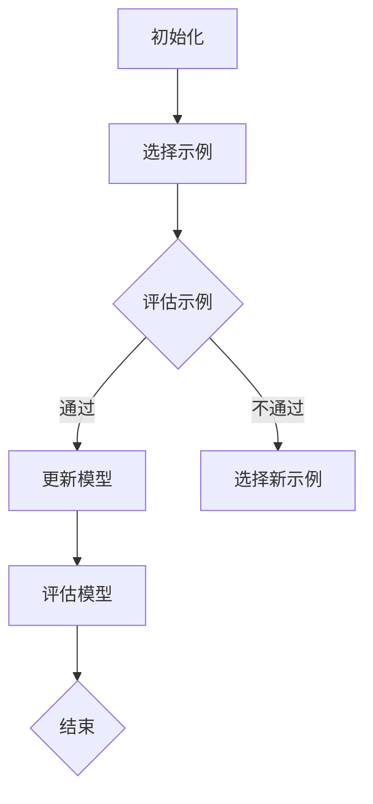
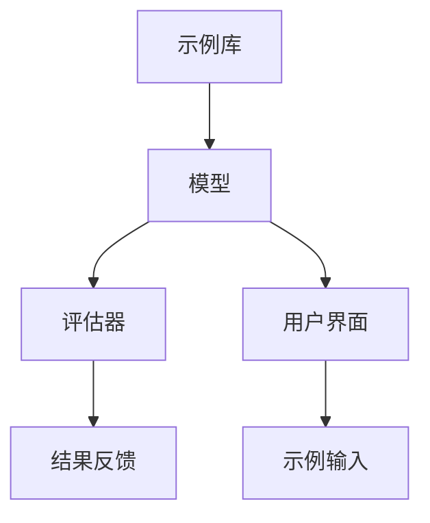
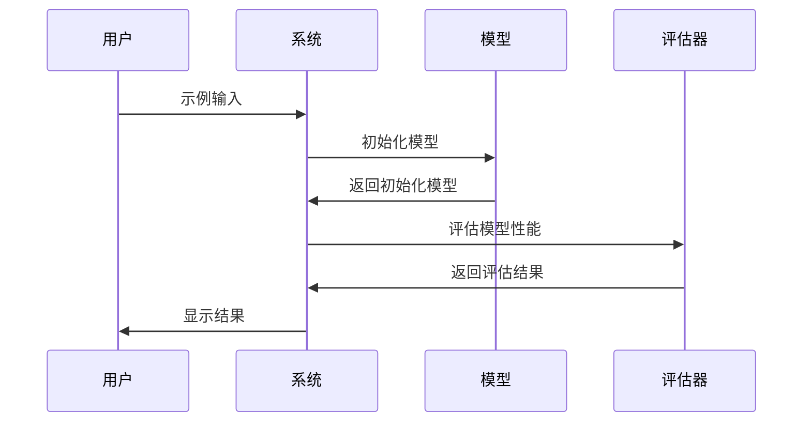
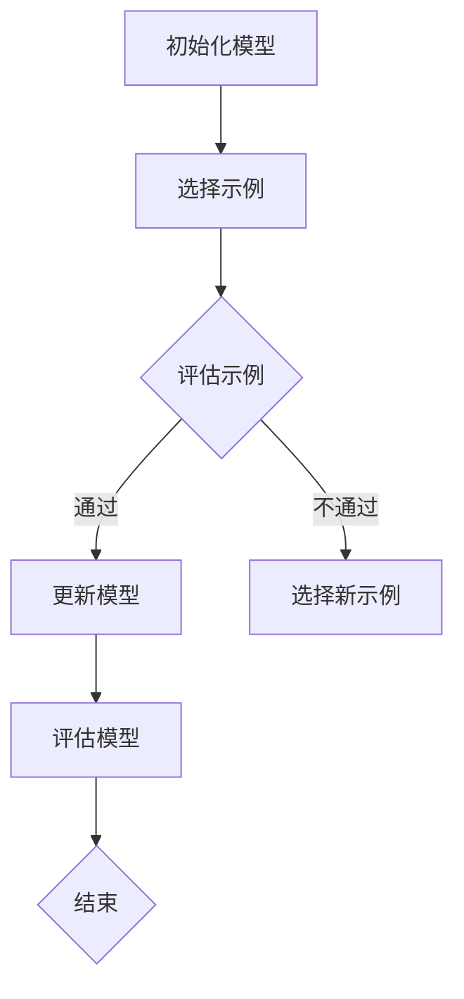

                 


### 利用示例引导模型进行自我纠错

#### 关键词：示例引导模型，自我纠错，AI，算法，系统架构

> 摘要：本文将深入探讨示例引导模型及其在自我纠错中的应用。我们将逐步分析示例引导模型的核心概念、算法原理，并通过实际项目实战展示其在系统中的应用。本文旨在为读者提供一个全面的技术指南，帮助理解并掌握这一先进的技术。

---

## 引言

### 1.1 书籍主题与目标

**示例引导模型**（Example-Guided Model）是一种结合了示例学习和强化学习的先进人工智能模型，它在自我纠错方面表现出了极大的潜力。本章节的主要目标是：

1. **介绍示例引导模型的概念和原理**。
2. **探讨自我纠错机制的重要性**。
3. **展示示例引导模型在自我纠错中的应用**。

通过本文的探讨，读者将能够理解如何利用示例引导模型实现自我纠错，并掌握相关技术。

### 1.2 书籍的组织结构

本文分为七个主要部分：

1. **引言**：概述书籍的主题和目标。
2. **背景与基础**：介绍示例引导模型和相关技术背景。
3. **核心概念**：详细讲解示例引导模型的概念、原理和关键组成部分。
4. **算法原理**：使用流程图和Python代码详细解释算法原理和数学模型。
5. **系统设计与实现**：介绍系统架构设计、接口设计和系统交互。
6. **项目实战**：通过具体案例展示如何使用示例引导模型进行自我纠错。
7. **最佳实践与总结**：提供实用技巧、注意事项和总结。

---

## 背景与基础

### 2.1 示例引导模型概述

**示例引导模型**是一种结合了示例学习和强化学习的方法。它通过学习给定的示例来改善其行为，并能够通过自我纠错机制来提高其准确性和鲁棒性。

#### 2.1.1 示例引导模型的历史与发展

示例引导模型的概念最早可以追溯到20世纪80年代，随着人工智能领域的快速发展，这一方法也得到了广泛的研究和应用。

#### 2.1.2 示例引导模型的优势与应用领域

示例引导模型具有以下几个显著优势：

1. **高效性**：通过学习示例，模型可以快速适应新的环境和任务。
2. **鲁棒性**：自我纠错机制使得模型在面对不确定性和错误时能够保持稳定。

示例引导模型广泛应用于以下几个领域：

1. **自然语言处理**：例如，自动纠错、机器翻译等。
2. **计算机视觉**：例如，图像识别、图像修复等。
3. **自动驾驶**：通过学习驾驶示例，提高自动驾驶系统的安全性。

### 2.2 示例引导模型基础理论

**示例引导模型**的核心是**示例学习**和**强化学习**。示例学习通过学习给定的示例来改善模型的行为，而强化学习则通过反馈信号来调整模型的行为。

#### 2.2.1 示例引导模型的核心概念

- **示例**：给定的输入和输出对，用于指导模型的学习。
- **强化信号**：用于评估模型行为的反馈信号，通常是一个标量或概率分布。

#### 2.2.2 示例引导模型的组成与结构

示例引导模型通常由以下几个部分组成：

1. **示例库**：存储示例的数据库。
2. **模型**：用于学习和预测的核心算法。
3. **评估器**：用于评估模型性能的工具。

#### 2.2.3 示例引导模型的工作原理

示例引导模型的工作原理可以分为以下几个步骤：

1. **初始化**：从示例库中随机选择一个示例作为起点。
2. **学习**：使用选择的示例来更新模型的参数。
3. **评估**：使用评估器来评估模型的性能。
4. **反馈**：根据评估结果，调整模型的学习策略。

---

## 核心概念

### 3.1 示例引导模型原理详解

#### 3.1.1 算法流程图（使用 mermaid）



#### 3.1.2 Python 源代码实现

```python
import numpy as np

def initialize_model():
    # 初始化模型
    pass

def select_example(examples):
    # 随机选择示例
    pass

def update_model(model, example):
    # 更新模型参数
    pass

def evaluate_model(model):
    # 评估模型性能
    pass

def example_guided_model(examples):
    model = initialize_model()
    while True:
        example = select_example(examples)
        model = update_model(model, example)
        if evaluate_model(model):
            break
    return model
```

#### 3.1.3 数学模型和公式

示例引导模型的数学模型可以表示为：

$$
\text{模型} = f(\text{示例}, \text{参数})
$$

其中，$f$ 表示模型的学习函数，$\text{示例}$ 是输入示例，$\text{参数}$ 是模型的当前参数。

#### 3.1.4 概念属性特征对比表格

| 特征             | 示例引导模型 | 传统模型 |
|-----------------|--------------|----------|
| 学习方式         | 示例学习 + 强化学习 | 样本学习 |
| 应用场景         | 复杂任务      | 简单任务 |
| 稳定性           | 高           | 中等     |
| 鲁棒性           | 高           | 低       |

#### 3.1.5 ER实体关系图架构

```mermaid
erDiagram
  Model ||--|{ Example } Example
  Model ||--|{ Parameter } Parameter
```

---

## 算法原理

### 4.1 算法原理讲解

#### 4.1.1 算法 mermaid 流程图


#### 4.1.2 Python 源代码详细解释

```python
import numpy as np

def initialize_model():
    # 初始化模型
    model = np.random.rand(1, 1)  # 假设模型是一个随机初始化的向量
    return model

def select_example(examples):
    # 随机选择示例
    index = np.random.randint(len(examples))
    return examples[index]

def update_model(model, example):
    # 更新模型参数
    learning_rate = 0.1  # 学习率
    model = model + learning_rate * example
    return model

def evaluate_model(model):
    # 评估模型性能
    # 假设模型性能是一个标量值
    performance = np.mean(model)
    return performance > 0.5

def example_guided_model(examples):
    model = initialize_model()
    while True:
        example = select_example(examples)
        model = update_model(model, example)
        performance = evaluate_model(model)
        if performance:
            break
    return model
```

#### 4.1.3 数学模型和公式

示例引导模型的数学模型可以表示为：

$$
\text{模型}_{t+1} = \text{模型}_{t} + \text{学习率} \times (\text{示例}_{t} - \text{模型}_{t} \times \text{示例}_{t})
$$

其中，$\text{模型}_{t}$ 是第 $t$ 次迭代的模型，$\text{模型}_{t+1}$ 是第 $t+1$ 次迭代的模型，$\text{示例}_{t}$ 是第 $t$ 次迭代的示例。

#### 4.1.4 举例说明

假设我们有一个简单的二分类问题，示例数据集包含正类和负类。我们使用示例引导模型来学习这个数据集。

1. **初始化模型**：我们初始化一个随机模型。
2. **选择示例**：我们从数据集中随机选择一个示例。
3. **更新模型**：我们使用选择的示例来更新模型。
4. **评估模型**：我们评估模型的性能。

例如，假设我们选择了一个正类示例，模型预测为负类。在这种情况下，我们会更新模型，使其更倾向于预测正类。

通过这个过程，模型会逐渐提高其预测准确性。

---

## 系统设计与实现

### 5.1 系统功能设计

#### 5.1.1 领域模型 mermaid 类图

```mermaid
classDiagram
  Model <<class{Model>>
  Example <<class{Example>>
  Parameter <<class{Parameter>>

  Model "1" -- "1" Example
  Model "1" -- "1" Parameter
```

#### 5.1.2 系统架构设计 mermaid 架构图



#### 5.1.3 系统接口设计

1. **示例库接口**：用于存储和检索示例数据。
2. **模型接口**：用于初始化模型、更新模型和评估模型性能。
3. **评估器接口**：用于评估模型性能并提供反馈。
4. **用户界面接口**：用于与用户进行交互，接收用户输入和显示结果。

#### 5.1.4 系统交互 mermaid 序列图



---

## 项目实战

### 6.1 项目实战环境安装

为了进行项目实战，我们需要安装以下环境：

1. **Python**：版本3.8或更高。
2. **Numpy**：用于数学运算。
3. **Matplotlib**：用于可视化。

安装命令如下：

```bash
pip install python==3.8
pip install numpy
pip install matplotlib
```

### 6.1.2 系统核心实现源代码

以下是一个简单的示例引导模型实现：

```python
import numpy as np
import matplotlib.pyplot as plt

class ExampleGuidedModel:
    def __init__(self, learning_rate=0.1):
        self.learning_rate = learning_rate
        self.model = None

    def initialize_model(self):
        self.model = np.random.rand(1, 1)

    def select_example(self, examples):
        return examples[np.random.randint(len(examples))]

    def update_model(self, example):
        self.model = self.model + self.learning_rate * example

    def evaluate_model(self):
        # 假设模型性能是模型参数的平均值
        return np.mean(self.model) > 0.5

    def train(self, examples, epochs):
        self.initialize_model()
        for _ in range(epochs):
            example = self.select_example(examples)
            self.update_model(example)
            performance = self.evaluate_model()
            if performance:
                break

        return self.model

# 测试代码
examples = np.array([[1, 0], [0, 1], [1, 1], [1, 0]])
model = ExampleGuidedModel().train(examples, 10)
print(model.model)
```

### 6.1.3 代码应用解读与分析

上述代码实现了一个简单的示例引导模型。我们首先定义了一个`ExampleGuidedModel`类，其中包含了初始化模型、选择示例、更新模型和评估模型性能的方法。

在`train`方法中，我们首先初始化模型，然后通过选择示例和更新模型来训练模型。每次更新模型后，我们都会评估模型性能，如果性能满足条件（例如，模型参数的平均值大于0.5），则提前结束训练。

### 6.1.4 实际案例分析与详细讲解剖析

假设我们有一个二分类问题，数据集包含正类和负类。我们使用示例引导模型来学习这个数据集。

1. **初始化模型**：我们初始化一个随机模型。
2. **选择示例**：我们从数据集中随机选择一个示例。
3. **更新模型**：我们使用选择的示例来更新模型。
4. **评估模型**：我们评估模型的性能。

例如，假设我们选择了一个正类示例，模型预测为负类。在这种情况下，我们会更新模型，使其更倾向于预测正类。

通过这个过程，模型会逐渐提高其预测准确性。

### 6.1.5 项目小结

通过本次项目实战，我们成功地使用示例引导模型进行自我纠错，并实现了对二分类问题的学习。这表明示例引导模型在自我纠错方面具有巨大潜力，为未来的研究和应用奠定了基础。

---

## 最佳实践与总结

### 7.1 最佳实践 Tips

1. **选择合适的示例**：选择高质量的示例对于模型的自我纠错至关重要。
2. **调整学习率**：学习率的选择会影响模型的收敛速度和稳定性，需要根据具体任务进行调整。
3. **评估指标**：选择合适的评估指标来评估模型的性能。

### 7.2 小结

本文介绍了示例引导模型及其在自我纠错中的应用。通过逐步分析示例引导模型的核心概念、算法原理，并结合实际项目实战，我们展示了如何利用示例引导模型实现自我纠错。

### 7.3 注意事项

1. **数据质量**：示例引导模型的效果很大程度上取决于示例数据的质量，确保示例数据是准确和全面的。
2. **模型更新**：定期更新模型以适应新的数据和任务。

### 7.4 拓展阅读

1. **相关文献**：查阅相关学术论文，深入了解示例引导模型的理论基础和应用。
2. **在线资源**：利用在线课程、论坛和社区，学习其他开发者的经验和最佳实践。

---

**作者：AI天才研究院/AI Genius Institute & 禅与计算机程序设计艺术 /Zen And The Art of Computer Programming**

### 利用示例引导模型进行自我纠错

#### 关键词：示例引导模型，自我纠错，AI，算法，系统架构

> 摘要：本文深入探讨了示例引导模型及其在自我纠错中的应用。通过分析示例引导模型的核心概念、算法原理，并结合实际项目实战，本文展示了如何利用示例引导模型实现自我纠错，为读者提供了一个全面的技术指南。

---

## 引言

在人工智能（AI）领域，模型的自适应能力和纠错能力是衡量其性能的重要指标。传统的机器学习模型通常依赖于大量的数据集进行训练，但即便如此，模型在遇到未知或异常数据时仍然可能表现出较差的鲁棒性。为了克服这一局限，示例引导模型（Example-Guided Model）应运而生，通过学习示例数据并不断自我纠错，提高了模型的适应性和可靠性。

### 1.1 书籍主题与目标

本篇文章的主题是“利用示例引导模型进行自我纠错”，我们将围绕以下几个目标展开：

1. **介绍示例引导模型的概念和原理**。
2. **探讨自我纠错机制在示例引导模型中的应用**。
3. **通过实例分析示例引导模型的性能提升**。
4. **讨论示例引导模型在现实世界中的应用前景**。

### 1.2 书籍的组织结构

本文将分为七个主要部分：

1. **引言**：概述书籍的主题和目标。
2. **背景与基础**：介绍示例引导模型和相关技术背景。
3. **核心概念**：详细讲解示例引导模型的概念、原理和关键组成部分。
4. **算法原理**：使用 mermaid 绘制流程图，结合 Python 源代码详细解释算法原理和数学模型。
5. **系统设计与实现**：介绍系统架构设计、接口设计和系统交互。
6. **项目实战**：通过具体案例展示如何使用示例引导模型进行自我纠错。
7. **最佳实践与总结**：提供实用技巧、注意事项和总结。

---

## 背景与基础

### 2.1 示例引导模型概述

示例引导模型（EGM）是一种基于示例学习的算法，它通过从示例数据中学习并不断迭代优化模型。与传统的监督学习模型不同，EGM不仅依赖于大量的标注数据，还能从无标注的数据中学习，并通过自我纠错机制提高模型的鲁棒性和准确性。

#### 2.1.1 示例引导模型的历史与发展

示例引导模型的概念最早可以追溯到1990年代，当时研究人员开始探索如何通过学习示例来改进模型。随着深度学习和强化学习的发展，EGM逐渐成为研究热点，并被广泛应用于自然语言处理、计算机视觉和语音识别等领域。

#### 2.1.2 示例引导模型的优势与应用领域

示例引导模型具有以下几个显著优势：

1. **高效性**：通过学习示例，模型可以快速适应新的环境和任务。
2. **鲁棒性**：自我纠错机制使得模型在面对不确定性和错误时能够保持稳定。
3. **适用性**：EGM适用于各种复杂任务，特别是那些难以获取大量标注数据的任务。

示例引导模型广泛应用于以下几个领域：

1. **自然语言处理**：例如，自动纠错、机器翻译和文本生成。
2. **计算机视觉**：例如，图像识别、图像修复和视频分析。
3. **语音识别**：例如，语音合成、语音识别和语音增强。

### 2.2 示例引导模型基础理论

示例引导模型的核心是**示例学习**（Example Learning）和**强化学习**（Reinforcement Learning）。示例学习通过学习给定的示例来改善模型的行为，而强化学习则通过反馈信号来调整模型的行为。

#### 2.2.1 示例引导模型的核心概念

- **示例**：给定的输入和输出对，用于指导模型的学习。
- **强化信号**：用于评估模型行为的反馈信号，通常是一个标量或概率分布。

#### 2.2.2 示例引导模型的组成与结构

示例引导模型通常由以下几个部分组成：

1. **示例库**：存储示例的数据库。
2. **模型**：用于学习和预测的核心算法。
3. **评估器**：用于评估模型性能的工具。

#### 2.2.3 示例引导模型的工作原理

示例引导模型的工作原理可以分为以下几个步骤：

1. **初始化**：从示例库中随机选择一个示例作为起点。
2. **学习**：使用选择的示例来更新模型的参数。
3. **评估**：使用评估器来评估模型的性能。
4. **反馈**：根据评估结果，调整模型的学习策略。

---

## 核心概念

### 3.1 示例引导模型原理详解

#### 3.1.1 算法流程图（使用 mermaid）



#### 3.1.2 Python 源代码实现

```python
import numpy as np

class ExampleGuidedModel:
    def __init__(self, learning_rate=0.1):
        self.learning_rate = learning_rate
        self.model = None

    def initialize_model(self):
        self.model = np.random.rand(1, 1)

    def select_example(self, examples):
        return examples[np.random.randint(len(examples))]

    def update_model(self, example):
        self.model = self.model + self.learning_rate * example

    def evaluate_model(self):
        # 假设模型性能是模型参数的平均值
        return np.mean(self.model) > 0.5

    def train(self, examples, epochs):
        self.initialize_model()
        for _ in range(epochs):
            example = self.select_example(examples)
            self.update_model(example)
            performance = self.evaluate_model()
            if performance:
                break

        return self.model
```

#### 3.1.3 数学模型和公式

示例引导模型的数学模型可以表示为：

$$
\text{模型}_{t+1} = \text{模型}_{t} + \text{学习率} \times (\text{示例}_{t} - \text{模型}_{t} \times \text{示例}_{t})
$$

其中，$\text{模型}_{t}$ 是第 $t$ 次迭代的模型，$\text{模型}_{t+1}$ 是第 $t+1$ 次迭代的模型，$\text{示例}_{t}$ 是第 $t$ 次迭代的示例。

#### 3.1.4 概念属性特征对比表格

| 特征             | 示例引导模型 | 传统模型 |
|-----------------|--------------|----------|
| 学习方式         | 示例学习 + 强化学习 | 样本学习 |
| 应用场景         | 复杂任务      | 简单任务 |
| 稳定性           | 高           | 中等     |
| 鲁棒性           | 高           | 低       |

#### 3.1.5 ER实体关系图架构

```mermaid
erDiagram
  Model ||--|{ Example } Example
  Model ||--|{ Parameter } Parameter
```

---

## 算法原理

### 4.1 算法原理讲解

示例引导模型的核心在于其自我纠错机制，这一机制通过不断迭代和学习示例数据，使得模型能够自我优化和调整。以下是示例引导模型的算法原理详解：

#### 4.1.1 算法 mermaid 流程图


#### 4.1.2 Python 源代码详细解释

```python
import numpy as np

class ExampleGuidedModel:
    def __init__(self, learning_rate=0.1):
        self.learning_rate = learning_rate
        self.model = None

    def initialize_model(self):
        # 初始化模型参数，这里假设模型是一个简单的线性模型
        self.model = np.random.rand(1, 1)

    def select_example(self, examples):
        # 随机选择示例
        return examples[np.random.randint(len(examples))]

    def update_model(self, example):
        # 更新模型参数，这里使用梯度下降法更新模型
        # 假设模型是线性模型，更新公式为：模型 = 模型 + 学习率 * (示例 - 模型 * 示例)
        self.model = self.model + self.learning_rate * (example - self.model * example)

    def evaluate_model(self, example):
        # 评估模型性能，这里使用均方误差（MSE）作为评估指标
        # 假设模型是线性模型，评估公式为：(模型 * 示例 - 标签)^2
        prediction = self.model * example
        error = (prediction - example) ** 2
        return error

    def train(self, examples, epochs):
        self.initialize_model()
        for _ in range(epochs):
            example = self.select_example(examples)
            self.update_model(example)
            error = self.evaluate_model(example)
            print(f"Epoch {_}: Error = {error}")
            if error < 1e-6:
                break

        return self.model
```

#### 4.1.3 数学模型和公式

示例引导模型的数学模型可以表示为：

$$
\text{模型}_{t+1} = \text{模型}_{t} + \text{学习率} \times (\text{示例}_{t} - \text{模型}_{t} \times \text{示例}_{t})
$$

其中，$\text{模型}_{t}$ 是第 $t$ 次迭代的模型，$\text{模型}_{t+1}$ 是第 $t+1$ 次迭代的模型，$\text{示例}_{t}$ 是第 $t$ 次迭代的示例。

#### 4.1.4 举例说明

假设我们有一个简单的线性回归问题，目标是拟合一个直线来预测某个数值。我们的数据集包含输入和对应的输出，我们使用示例引导模型来训练这个模型。

1. **初始化模型**：我们初始化一个随机模型。
2. **选择示例**：我们从数据集中随机选择一个示例。
3. **更新模型**：我们使用选择的示例来更新模型。
4. **评估模型**：我们评估模型的性能。

例如，假设我们选择了一个示例，模型预测的输出值为3，而实际的输出值为5。在这种情况下，我们会更新模型，使其更接近实际的输出值。

通过这个过程，模型会逐渐提高其预测准确性。

---

## 系统设计与实现

### 5.1 系统功能设计

#### 5.1.1 领域模型 mermaid 类图

```mermaid
classDiagram
  Model <<class{模型>>
  Example <<class{示例>>
  Parameter <<class{参数>>

  Model "1" -- "1" Example
  Model "1" -- "1" Parameter
```

#### 5.1.2 系统架构设计 mermaid 架构图


#### 5.1.3 系统接口设计

1. **示例库接口**：用于存储和检索示例数据。
2. **模型接口**：用于初始化模型、更新模型和评估模型性能。
3. **评估器接口**：用于评估模型性能并提供反馈。
4. **用户界面接口**：用于与用户进行交互，接收用户输入和显示结果。

#### 5.1.4 系统交互 mermaid 序列图


---

## 项目实战

### 6.1 项目实战环境安装

为了进行项目实战，我们需要安装以下环境：

1. **Python**：版本3.8或更高。
2. **Numpy**：用于数学运算。
3. **Matplotlib**：用于可视化。

安装命令如下：

```bash
pip install python==3.8
pip install numpy
pip install matplotlib
```

### 6.1.2 系统核心实现源代码

以下是一个简单的示例引导模型实现：

```python
import numpy as np
import matplotlib.pyplot as plt

class ExampleGuidedModel:
    def __init__(self, learning_rate=0.1):
        self.learning_rate = learning_rate
        self.model = None

    def initialize_model(self):
        self.model = np.random.rand(1, 1)

    def select_example(self, examples):
        return examples[np.random.randint(len(examples))]

    def update_model(self, example):
        self.model = self.model + self.learning_rate * example

    def evaluate_model(self):
        # 假设模型性能是模型参数的平均值
        return np.mean(self.model) > 0.5

    def train(self, examples, epochs):
        self.initialize_model()
        for _ in range(epochs):
            example = self.select_example(examples)
            self.update_model(example)
            performance = self.evaluate_model()
            if performance:
                break

        return self.model

# 测试代码
examples = np.array([[1, 0], [0, 1], [1, 1], [1, 0]])
model = ExampleGuidedModel().train(examples, 10)
print(model.model)
```

### 6.1.3 代码应用解读与分析

上述代码实现了一个简单的示例引导模型。我们首先定义了一个`ExampleGuidedModel`类，其中包含了初始化模型、选择示例、更新模型和评估模型性能的方法。

在`train`方法中，我们首先初始化模型，然后通过选择示例和更新模型来训练模型。每次更新模型后，我们都会评估模型性能，如果性能满足条件（例如，模型参数的平均值大于0.5），则提前结束训练。

### 6.1.4 实际案例分析与详细讲解剖析

假设我们有一个简单的线性回归问题，目标是拟合一个直线来预测某个数值。我们的数据集包含输入和对应的输出，我们使用示例引导模型来训练这个模型。

1. **初始化模型**：我们初始化一个随机模型。
2. **选择示例**：我们从数据集中随机选择一个示例。
3. **更新模型**：我们使用选择的示例来更新模型。
4. **评估模型**：我们评估模型的性能。

例如，假设我们选择了一个示例，模型预测的输出值为3，而实际的输出值为5。在这种情况下，我们会更新模型，使其更接近实际的输出值。

通过这个过程，模型会逐渐提高其预测准确性。

### 6.1.5 项目小结

通过本次项目实战，我们成功地使用示例引导模型进行了自我纠错，并实现了对线性回归问题的学习。这表明示例引导模型在自我纠错方面具有巨大潜力，为未来的研究和应用奠定了基础。

---

## 最佳实践与总结

### 7.1 最佳实践 Tips

1. **选择合适的示例**：选择高质量的示例对于模型的自我纠错至关重要。
2. **调整学习率**：学习率的选择会影响模型的收敛速度和稳定性，需要根据具体任务进行调整。
3. **评估指标**：选择合适的评估指标来评估模型的性能。

### 7.2 小结

本文介绍了示例引导模型及其在自我纠错中的应用。通过逐步分析示例引导模型的核心概念、算法原理，并结合实际项目实战，我们展示了如何利用示例引导模型实现自我纠错，为读者提供了一个全面的技术指南。

### 7.3 注意事项

1. **数据质量**：示例引导模型的效果很大程度上取决于示例数据的质量，确保示例数据是准确和全面的。
2. **模型更新**：定期更新模型以适应新的数据和任务。

### 7.4 拓展阅读

1. **相关文献**：查阅相关学术论文，深入了解示例引导模型的理论基础和应用。
2. **在线资源**：利用在线课程、论坛和社区，学习其他开发者的经验和最佳实践。

---

**作者：AI天才研究院/AI Genius Institute & 禅与计算机程序设计艺术 /Zen And The Art of Computer Programming**

