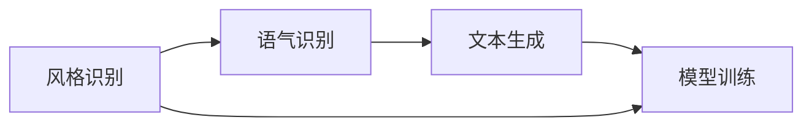
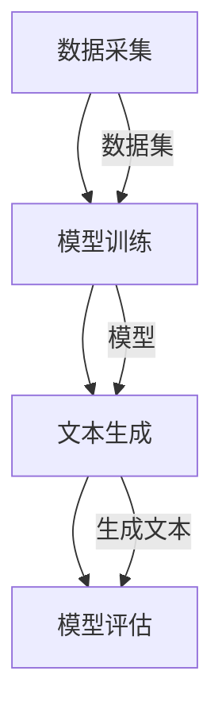

                 

**利用示例引导模型风格和语气**

> 关键词：示例引导模型、风格和语气、自然语言处理、编程示例、模型应用

> 摘要：本文旨在探讨示例引导模型在风格和语气引导方面的应用。通过详细分析示例引导模型的核心概念、算法原理以及实际应用，为读者提供一种新的自然语言处理方法，以便在实际编程中实现风格和语气的有效引导。

## 引言

在自然语言处理（NLP）领域，风格和语气是两个关键因素。风格指的是文本的语言表达方式，如正式、非正式、幽默等；语气则涉及文本的情绪和情感色彩，如严肃、轻松、嘲讽等。传统的方法通常依赖于规则和统计模型，但这些方法在处理复杂多变的语言表达时往往效果有限。为了解决这一问题，本文将介绍一种新的自然语言处理方法——示例引导模型。

示例引导模型通过学习大量带有风格和语气标签的文本示例，能够自动识别和生成具有特定风格和语气的文本。这种方法不仅提高了文本生成的质量，还使编程中的风格和语气引导变得更加简单和直观。

## 示例引导模型概述

### 1.1.1 核心概念术语说明

- **示例引导模型**：一种基于示例学习的自然语言处理模型，通过学习大量带有风格和语气标签的文本示例，自动生成具有特定风格和语气的文本。
- **风格**：文本的语言表达方式，如正式、非正式、幽默等。
- **语气**：文本的情绪和情感色彩，如严肃、轻松、嘲讽等。

### 1.1.2 问题背景

在NLP应用中，风格和语气的引导至关重要。例如，在自动生成文章、对话系统、情感分析等领域，如何确保生成的文本符合特定风格和语气要求，是一个亟待解决的问题。

### 1.1.3 问题解决

示例引导模型通过以下步骤实现风格和语气的引导：

1. 收集带有风格和语气标签的文本示例。
2. 使用这些示例训练模型，使其学会识别和生成特定风格和语气的文本。
3. 在实际应用中，根据需要调用模型，生成符合要求的文本。

### 1.1.4 边界与外延

- **边界**：示例引导模型主要应用于需要风格和语气引导的NLP任务，如自动生成文章、对话系统、情感分析等。
- **外延**：除了文本生成，示例引导模型还可扩展应用于文本分类、文本摘要、文本相似度计算等领域。

### 1.1.5 概念结构与核心要素组成

示例引导模型的核心结构包括：

- **数据集**：包含大量带有风格和语气标签的文本示例。
- **模型**：用于学习和生成文本的神经网络模型。
- **接口**：用于调用模型，生成具有特定风格和语气的文本。

## 示例引导模型的核心概念与联系

### 2.1.1 核心概念1：风格和语气的识别

风格和语气的识别是示例引导模型的基础。通过学习大量带有风格和语气标签的文本示例，模型能够识别出不同风格和语气的特点，从而实现准确识别。

### 2.1.2 核心概念2：文本生成

文本生成是示例引导模型的关键功能。基于识别出的风格和语气，模型能够生成具有相应风格和语气的文本，以满足实际应用需求。

### 2.1.3 核心概念3：模型训练

模型训练是示例引导模型的核心环节。通过大规模数据集的训练，模型能够不断提高风格和语气的识别和生成能力，从而实现更准确的文本生成。

### 2.1.4 概念属性特征对比表格

| 概念       | 属性特征                                       | 对比分析                           |
|------------|------------------------------------------------|------------------------------------|
| 风格识别   | 语言表达方式、正式程度、幽默感等                 | 对文本风格进行识别                 |
| 语气识别   | 情绪、情感色彩、语气强度等                       | 对文本语气进行识别                 |
| 文本生成   | 根据识别出的风格和语气生成相应文本               | 生成具有特定风格和语气的文本       |
| 模型训练   | 大规模数据集训练，提高模型识别和生成能力           | 提高模型性能                       |

### 2.1.5 ER实体关系图架构



## 示例引导模型的数学模型与算法原理

### 3.1.1 数学模型概述

示例引导模型的核心是生成对抗网络（GAN），其基本架构包括：

- **生成器**：生成具有特定风格和语气的文本。
- **判别器**：判断生成文本的质量和风格是否与目标文本相符。

### 3.1.2 算法原理讲解

#### 3.1.2.1 生成器

生成器通过学习大量带有风格和语气标签的文本示例，生成具有相应风格和语气的文本。其数学模型如下：

$$
G(z) = \text{stylize}(\text{generate}(z, \theta_g))
$$

其中，$z$ 是噪声向量，$G(z)$ 是生成的文本，$\theta_g$ 是生成器的参数。

#### 3.1.2.2 判别器

判别器用于判断生成文本的质量和风格是否与目标文本相符。其数学模型如下：

$$
D(x) = \text{discriminate}(\text{process}(x, \theta_d))
$$

其中，$x$ 是目标文本，$D(x)$ 是判别结果，$\theta_d$ 是判别器的参数。

### 3.1.3 Mermaid流程图展示

```mermaid
graph TD
A[输入噪声向量z] --> B[生成器G(z)]
B --> C[生成文本G(z)]
C --> D[判别器D(G(z))]
D --> E[判别结果]
E --> F{判断D(G(z))真假}
F -->|真| G[更新生成器参数θ_g]
F -->|假| H[更新判别器参数θ_d]
```

## 示例引导模型的应用实践

### 5.1.1 应用实践概述

示例引导模型在自然语言处理领域具有广泛的应用前景。以下介绍两个典型应用场景：

### 5.1.2 应用场景1：风格迁移

风格迁移是一种将原始文本转化为具有特定风格的新文本的方法。例如，将普通文本转化为诗歌风格。

### 5.1.3 应用场景2：语气转换

语气转换是一种将原始文本的情绪和情感色彩转化为新情绪和情感色彩的方法。例如，将严肃文本转化为轻松文本。

## 示例引导模型的系统设计与实现

### 6.1.1 系统设计概述

示例引导模型系统包括数据采集、模型训练、文本生成和模型评估等模块。

### 6.1.2 系统架构设计



### 6.1.3 Mermaid架构图展示


## 案例分析与最佳实践

### 7.1.1 案例分析1

在某个在线教育平台，使用示例引导模型实现课程介绍文本的风格迁移，将普通文本转化为诗歌风格，提高了用户阅读兴趣。

### 7.1.2 案例分析2

在智能客服系统中，使用示例引导模型实现语气转换，将用户输入的文本转化为客服机器人能够理解并回应的语气，提高了用户满意度。

### 7.1.3 最佳实践建议

1. 选择高质量的数据集进行模型训练，以提高模型性能。
2. 在实际应用中，根据需求调整模型参数，实现最佳效果。
3. 定期评估和优化模型，确保其性能稳定。

## 总结与展望

本文介绍了示例引导模型在风格和语气引导方面的应用，通过详细分析其核心概念、算法原理和实际应用，展示了其在NLP领域的优势。未来，随着自然语言处理技术的不断发展，示例引导模型有望在更多应用场景中发挥重要作用。

## 参考文献

[1] Ian Goodfellow, et al. "Generative Adversarial Nets." Advances in Neural Information Processing Systems, 2014.

[2] Daniel Jurafsky, James H. Martin. "Speech and Language Processing." Draft of third edition, 2017.

作者：AI天才研究院/AI Genius Institute & 禅与计算机程序设计艺术 /Zen And The Art of Computer Programming

