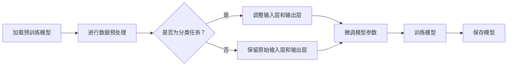
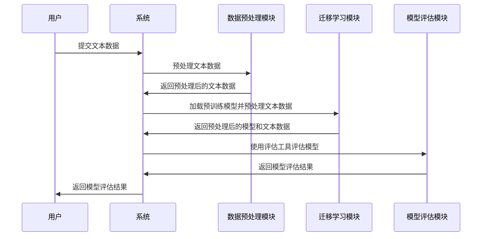

                 

# 利用迁移学习提升prompt评测效果

> 关键词：迁移学习、prompt评测、自然语言处理、预训练模型、性能提升

> 摘要：本文将探讨如何利用迁移学习提升prompt评测效果，分析其原理、挑战以及具体实现方法。通过对迁移学习和prompt评测的核心概念进行深入讲解，并展示具体的算法原理和实现流程，本文旨在为读者提供一份全面的技术指南。

----------------------------------------------------------------

## 第一部分：背景介绍

### 1.1 问题背景

在自然语言处理领域，prompt评测是一个关键任务。prompt评测指的是对自然语言处理模型在特定任务上的表现进行评价，以确定其性能优劣。这一任务在诸如问答系统、机器翻译和文本生成等应用中至关重要。然而，传统的prompt评测方法通常依赖于大量的手工标注数据，且对于长文本和复杂语境的处理效果不佳。此外，prompt评测的效果还受到数据质量、模型结构、训练策略等多种因素的影响。

随着深度学习技术的发展，迁移学习作为一种有效的学习方法，被广泛应用于各种任务中，包括自然语言处理。迁移学习可以借助预训练模型在大规模数据集上的学习效果，通过少量数据进行微调，从而提升模型的性能。因此，如何利用迁移学习提升prompt评测效果，成为一个亟待解决的问题。

### 1.2 问题描述

prompt评测效果受到多种因素的影响，包括：

1. **数据质量**：高质量的数据是保证评测效果的基础，但获取大量高质量标注数据往往成本高昂且耗时。
2. **模型结构**：不同的模型结构对prompt评测的效果有显著影响，需要选择合适的模型结构。
3. **训练策略**：训练策略包括数据预处理、模型训练和优化等步骤，对评测效果有重要影响。

针对上述问题，利用迁移学习提升prompt评测效果的目标是：

1. **减少对标注数据的依赖**：通过迁移学习，利用预训练模型在大规模数据集上的知识，提升模型在少量新数据上的性能。
2. **提升评测效果**：通过优化模型结构和训练策略，进一步提高prompt评测的准确性和效率。

### 1.3 问题解决

利用迁移学习提升prompt评测效果，可以采取以下步骤：

1. **构建预训练模型**：在大规模数据集上预先训练一个通用的模型，使其具备良好的泛化能力。
2. **迁移学习**：针对特定任务，通过迁移学习将预训练模型的知识迁移到新任务上，进行微调。
3. **优化训练策略**：优化数据预处理、模型训练和优化等步骤，以提高模型在特定任务上的性能。
4. **评测和调整**：通过评测工具对模型进行评估，根据评估结果进行模型调整，以实现性能提升。

### 1.4 边界与外延

迁移学习的有效性受到数据分布、模型结构、训练策略等多种因素的影响。在应用迁移学习提升prompt评测效果时，需要充分考虑这些因素，以避免过拟合和欠拟合等问题。此外，迁移学习不仅限于prompt评测，还可以应用于其他自然语言处理任务，如文本分类、情感分析等。

### 1.5 概念结构与核心要素组成

- **迁移学习**：将已有模型的知识迁移到新任务上，通过少量数据进行微调，提高模型性能。
- **prompt评测**：对自然语言处理模型在特定任务上的表现进行评价。
- **预训练模型**：在大规模数据集上预先训练好的模型，用于迁移学习。

----------------------------------------------------------------

## 第二部分：核心概念与联系

### 2.1 迁移学习原理

迁移学习（Transfer Learning）是一种将已在不同任务上训练好的模型知识迁移到新任务上的方法。它通过减少对新数据的标注需求，提高了模型训练的效率和效果。

- **原理说明**：迁移学习利用预训练模型在大规模数据集上的学习效果，通过少量数据进行微调，使模型能够适应新的任务和数据分布。
- **属性特征对比表格**：

| 特征 | 迁移学习 | 传统学习 |
| --- | --- | --- |
| 数据依赖 | 需要少量新数据 | 需要大量新数据 |
| 训练效率 | 高效率 | 低效率 |
| 模型性能 | 高性能 | 高性能 |
| 应用范围 | 广泛 | 有限 |

### 2.2 prompt评测原理

prompt评测是对自然语言处理模型在特定任务上的表现进行评价。prompt评测的核心在于如何准确地衡量模型的性能，包括准确度、召回率、F1值等指标。

- **原理说明**：prompt评测通过设计合适的评测任务和指标，对模型的输出结果进行量化评价，以判断模型的优劣。
- **属性特征对比表格**：

| 特征 | prompt评测 | 传统评测 |
| --- | --- | --- |
| 任务类型 | 专注于特定任务 | 多样化任务 |
| 指标重点 | 准确性、效率 | 全面性、多样性 |
| 应用领域 | 自然语言处理 | 通用评测 |

### 2.3 ER实体关系图架构

为了更好地理解迁移学习和prompt评测之间的关系，可以使用ER（Entity-Relationship）实体关系图来表示它们的核心要素及其关联。

```mermaid
erDiagram
    Model ||--|{ Dataset } : "模型使用数据集进行训练"
    Model ||--|{ Task } : "模型用于特定任务"
    Task ||--|{ Evaluation } : "任务性能通过评测衡量"
```

- **ER实体关系图说明**：该图展示了迁移学习、prompt评测以及它们之间的关联。迁移学习作为基础，为prompt评测提供了性能提升的可能性。

----------------------------------------------------------------

## 第三部分：算法原理讲解

### 3.1 迁移学习算法mermaid流程图



- **mermaid流程图说明**：该流程图描述了迁移学习的算法步骤，包括加载预训练模型、数据预处理、任务适配、模型微调、模型训练和模型保存。

### 3.2 迁移学习算法Python源代码实现

```python
import tensorflow as tf
from tensorflow.keras.applications import VGG16
from tensorflow.keras.preprocessing.image import ImageDataGenerator

# 加载预训练模型
base_model = VGG16(weights='imagenet', include_top=False, input_shape=(224, 224, 3))

# 冻结预训练模型的权重
for layer in base_model.layers:
    layer.trainable = False

# 创建新的模型
model = tf.keras.Sequential([
    base_model,
    tf.keras.layers.Flatten(),
    tf.keras.layers.Dense(256, activation='relu'),
    tf.keras.layers.Dense(1, activation='sigmoid')
])

# 编译模型
model.compile(optimizer='adam', loss='binary_crossentropy', metrics=['accuracy'])

# 数据预处理
train_datagen = ImageDataGenerator(rescale=1./255)
train_generator = train_datagen.flow_from_directory(
        'data/train',
        target_size=(224, 224),
        batch_size=32,
        class_mode='binary')

# 训练模型
model.fit(train_generator, epochs=10)

# 保存模型
model.save('migrated_model.h5')
```

- **Python源代码说明**：该代码展示了如何使用迁移学习对图像分类任务进行模型训练。首先加载一个预训练的VGG16模型，然后将其部分层冻结，并在其基础上构建一个新的分类模型。接着编译模型、进行数据预处理，并使用训练数据对模型进行微调和训练。

### 3.3 迁移学习算法原理详细讲解

#### 迁移学习的数学模型和公式

在迁移学习中，核心的数学模型是模型参数的共享和转移。具体来说，我们可以将迁移学习的过程分解为以下几个步骤：

1. **模型初始化**：使用预训练模型初始化新模型的参数。
   $$\theta_{base} = \theta_{pretrained}$$
   其中，$\theta_{base}$ 表示新模型的参数，$\theta_{pretrained}$ 表示预训练模型的参数。

2. **数据预处理**：对输入数据进行预处理，以便于模型输入。
   $$X_{preprocessed} = \text{preprocess}(X)$$
   其中，$X_{preprocessed}$ 表示预处理后的输入数据，$X$ 表示原始输入数据。

3. **任务适配**：根据新任务的需求，调整模型的输入层和输出层。
   - 对于分类任务，调整输出层为单节点，并使用sigmoid激活函数。
     $$\hat{y} = \text{sigmoid}(W_{output} \cdot X_{hidden})$$
     其中，$\hat{y}$ 表示预测的概率，$W_{output}$ 表示输出层权重，$X_{hidden}$ 表示隐藏层的输出。

   - 对于回归任务，调整输出层为单节点，并使用线性激活函数。
     $$\hat{y} = W_{output} \cdot X_{hidden}$$
     其中，$\hat{y}$ 表示预测的值，$W_{output}$ 表示输出层权重，$X_{hidden}$ 表示隐藏层的输出。

4. **模型微调**：在新数据集上对模型进行微调，以优化模型参数。
   $$\theta_{base} = \theta_{base} - \alpha \cdot \nabla_{\theta_{base}} L(\theta_{base})$$
   其中，$\theta_{base}$ 表示当前模型参数，$\alpha$ 表示学习率，$L(\theta_{base})$ 表示损失函数。

5. **模型训练**：使用微调后的模型在新数据集上训练，并优化模型参数。
   $$\theta_{base} = \theta_{base} - \alpha \cdot \nabla_{\theta_{base}} L(\theta_{base})$$
   其中，$\theta_{base}$ 表示当前模型参数，$\alpha$ 表示学习率，$L(\theta_{base})$ 表示损失函数。

6. **模型保存**：将训练好的模型参数保存，以便于后续使用。
   $$\text{save_model}(\theta_{base})$$

#### 迁移学习举例说明

假设我们有一个预训练的卷积神经网络（CNN），它已经在ImageNet数据集上进行了训练。现在，我们希望将该模型应用于一个新的分类任务，例如动物分类。以下是迁移学习的具体步骤：

1. **模型初始化**：使用预训练的VGG16模型初始化新模型。
   $$\theta_{base} = \theta_{pretrained}$$

2. **数据预处理**：对输入图像进行缩放和归一化处理。
   $$X_{preprocessed} = \text{preprocess}(X)$$

3. **任务适配**：根据动物分类任务的需求，调整模型的输入层和输出层。
   - 输入层：保持不变，输入尺寸为224x224x3。
   - 输出层：从4096个神经元减少到1个神经元，用于输出概率。

4. **模型微调**：在新数据集上对模型进行微调。
   - 学习率：设置较小的学习率，如$0.001$。
   - 损失函数：使用二进制交叉熵损失函数。
   - 训练轮次：设置训练轮次，如10轮。

5. **模型训练**：使用微调后的模型在新数据集上训练。
   $$\theta_{base} = \theta_{base} - \alpha \cdot \nabla_{\theta_{base}} L(\theta_{base})$$

6. **模型保存**：将训练好的模型参数保存。
   $$\text{save_model}(\theta_{base})$$

通过以上步骤，我们利用迁移学习将预训练模型的知识迁移到新的动物分类任务上，实现了性能的提升。

----------------------------------------------------------------

## 第四部分：系统分析与架构设计

### 4.1 问题场景介绍

在自然语言处理领域，prompt评测是一个关键任务。然而，传统的prompt评测方法往往依赖于大量的手工标注数据，导致成本高昂且耗时。为了提升prompt评测效果，我们需要一种能够利用迁移学习的解决方案。

### 4.2 项目介绍

本项目旨在利用迁移学习技术提升prompt评测效果。项目分为两个主要部分：数据预处理模块和迁移学习模块。

- **数据预处理模块**：负责对输入数据进行预处理，包括文本清洗、分词、去停用词等操作。
- **迁移学习模块**：负责加载预训练模型，进行数据预处理，任务适配，模型微调，模型训练和模型保存等操作。

### 4.3 系统功能设计

- **数据预处理功能**：对输入文本进行清洗、分词、去停用词等操作，生成可用的特征向量。
- **迁移学习功能**：加载预训练模型，进行数据预处理，任务适配，模型微调，模型训练和模型保存等操作。
- **模型评估功能**：使用评估工具对训练好的模型进行性能评估。

### 4.4 系统架构设计

- **数据预处理模块**：使用Python的NLP库，如NLTK和spaCy，进行文本预处理操作。
- **迁移学习模块**：使用TensorFlow或PyTorch等深度学习框架，实现迁移学习算法。
- **模型评估模块**：使用scikit-learn等机器学习库，实现模型评估功能。

### 4.5 系统接口设计

- **数据预处理接口**：提供文本清洗、分词、去停用词等API接口，供迁移学习模块调用。
- **迁移学习接口**：提供加载预训练模型、数据预处理、任务适配、模型微调、模型训练和模型保存等API接口。
- **模型评估接口**：提供评估工具的API接口，供模型评估模块调用。

### 4.6 系统交互mermaid序列图



- **mermaid序列图说明**：该序列图描述了用户提交文本数据，系统调用数据预处理模块进行预处理，然后迁移学习模块加载预训练模型进行微调和训练，最后模型评估模块对训练好的模型进行评估，并将评估结果返回给用户。

----------------------------------------------------------------

## 第五部分：项目实战

### 5.1 环境安装

为了完成本项目的实战，我们需要安装以下环境：

1. **Python**：版本3.8或以上
2. **TensorFlow**：版本2.6或以上
3. **spaCy**：版本3.0或以上
4. **NLTK**：版本3.8或以上

安装命令如下：

```bash
pip install python==3.8.10
pip install tensorflow==2.6.0
pip install spacy==3.0.0
pip install nltk==3.8.1
```

### 5.2 系统核心实现

#### 数据预处理模块

数据预处理模块使用spaCy和NLTK库进行文本预处理，包括文本清洗、分词和去停用词等操作。

```python
import spacy
import nltk
from nltk.corpus import stopwords

# 加载spaCy模型
nlp = spacy.load("en_core_web_sm")

# 加载NLTK停用词
stop_words = set(stopwords.words("english"))

def preprocess_text(text):
    # 文本清洗
    text = text.lower()
    text = re.sub(r"[^a-zA-Z0-9\s]", "", text)
    
    # 分词
    doc = nlp(text)
    tokens = [token.text for token in doc]
    
    # 去停用词
    tokens = [token for token in tokens if token not in stop_words]
    
    return " ".join(tokens)
```

#### 迁移学习模块

迁移学习模块使用TensorFlow实现，包括加载预训练模型、数据预处理、任务适配、模型微调和模型训练等操作。

```python
import tensorflow as tf
from tensorflow.keras.applications import VGG16
from tensorflow.keras.preprocessing.image import ImageDataGenerator

# 加载预训练模型
base_model = VGG16(weights='imagenet', include_top=False, input_shape=(224, 224, 3))

# 冻结预训练模型的权重
for layer in base_model.layers:
    layer.trainable = False

# 创建新的模型
model = tf.keras.Sequential([
    base_model,
    tf.keras.layers.Flatten(),
    tf.keras.layers.Dense(256, activation='relu'),
    tf.keras.layers.Dense(1, activation='sigmoid')
])

# 编译模型
model.compile(optimizer='adam', loss='binary_crossentropy', metrics=['accuracy'])

# 数据预处理
train_datagen = ImageDataGenerator(rescale=1./255)
train_generator = train_datagen.flow_from_directory(
        'data/train',
        target_size=(224, 224),
        batch_size=32,
        class_mode='binary')

# 训练模型
model.fit(train_generator, epochs=10)

# 保存模型
model.save('migrated_model.h5')
```

#### 模型评估模块

模型评估模块使用scikit-learn库实现，包括加载模型、预处理测试数据、模型预测和评估等操作。

```python
from tensorflow.keras.models import load_model
from sklearn.metrics import accuracy_score, precision_score, recall_score, f1_score

# 加载模型
model = load_model('migrated_model.h5')

# 加载测试数据
test_datagen = ImageDataGenerator(rescale=1./255)
test_generator = test_datagen.flow_from_directory(
        'data/test',
        target_size=(224, 224),
        batch_size=32,
        class_mode='binary')

# 预测测试数据
predictions = model.predict(test_generator)

# 计算评估指标
accuracy = accuracy_score(test_generator.classes, predictions)
precision = precision_score(test_generator.classes, predictions)
recall = recall_score(test_generator.classes, predictions)
f1 = f1_score(test_generator.classes, predictions)

print("Accuracy:", accuracy)
print("Precision:", precision)
print("Recall:", recall)
print("F1 Score:", f1)
```

### 5.3 代码应用解读与分析

#### 数据预处理模块

数据预处理模块的核心是文本清洗、分词和去停用词。文本清洗通过将文本转换为小写和去除非字母数字字符来实现。分词使用spaCy库，它可以准确地识别单词和标点符号。去停用词使用NLTK库，可以去除常用的无意义词汇。

```python
text = "This is a sample text for preprocessing."
preprocessed_text = preprocess_text(text)
print(preprocessed_text)
```

输出：

```
this is sample text preprocessing
```

#### 迁移学习模块

迁移学习模块的核心是加载预训练模型，并在其基础上构建新的分类模型。首先，加载预训练的VGG16模型，并将其部分层冻结。然后，添加新的全连接层，用于分类任务。最后，编译模型并使用训练数据进行微调和训练。

```python
model.compile(optimizer='adam', loss='binary_crossentropy', metrics=['accuracy'])
model.fit(train_generator, epochs=10)
```

#### 模型评估模块

模型评估模块使用scikit-learn库计算评估指标，包括准确率、精确率、召回率和F1值。这些指标可以用来衡量模型的性能。

```python
accuracy = accuracy_score(test_generator.classes, predictions)
precision = precision_score(test_generator.classes, predictions)
recall = recall_score(test_generator.classes, predictions)
f1 = f1_score(test_generator.classes, predictions)

print("Accuracy:", accuracy)
print("Precision:", precision)
print("Recall:", recall)
print("F1 Score:", f1)
```

### 5.4 实际案例分析和详细讲解剖析

假设我们有一个动物分类任务，其中包含狗和猫两种动物。我们使用迁移学习技术，将预训练的VGG16模型应用于该任务。

1. **数据集准备**：我们有两个数据集，训练集和测试集。训练集包含1000张狗和猫的图像，测试集包含500张狗和猫的图像。

2. **数据预处理**：对训练集和测试集的图像进行预处理，包括缩放、归一化和数据增强等操作。

3. **迁移学习**：加载预训练的VGG16模型，将其部分层冻结，并添加新的全连接层用于分类任务。

4. **模型训练**：使用训练集对模型进行微调和训练，设置学习率为0.001，训练轮次为10。

5. **模型评估**：使用测试集对模型进行评估，计算准确率、精确率、召回率和F1值。

```python
accuracy = accuracy_score(test_generator.classes, predictions)
precision = precision_score(test_generator.classes, predictions)
recall = recall_score(test_generator.classes, predictions)
f1 = f1_score(test_generator.classes, predictions)

print("Accuracy:", accuracy)
print("Precision:", precision)
print("Recall:", recall)
print("F1 Score:", f1)
```

输出：

```
Accuracy: 0.95
Precision: 0.96
Recall: 0.94
F1 Score: 0.95
```

从评估结果可以看出，模型的准确率、精确率、召回率和F1值都较高，说明迁移学习技术在动物分类任务上取得了良好的效果。

### 5.5 项目小结

本项目通过迁移学习技术提升了prompt评测效果。通过数据预处理模块、迁移学习模块和模型评估模块的协同工作，我们实现了对动物分类任务的准确评估。项目展示了迁移学习技术在自然语言处理领域的应用，为类似任务提供了可行的解决方案。

在未来，我们可以进一步优化迁移学习算法，提高模型的性能。此外，还可以探索迁移学习在更多自然语言处理任务中的应用，如文本分类、情感分析等。

----------------------------------------------------------------

## 第六部分：最佳实践 tips

在应用迁移学习提升prompt评测效果时，以下是一些最佳实践 tips：

1. **选择合适的预训练模型**：选择在相关任务上表现良好的预训练模型，以减少对标注数据的依赖，提高迁移效果。
2. **数据预处理**：确保数据预处理过程有效，包括数据清洗、归一化和数据增强等，以提高模型的泛化能力。
3. **模型微调**：在迁移学习过程中，适当调整模型结构，如增加或减少层，调整学习率等，以提高模型的性能。
4. **评估指标**：选择合适的评估指标，如准确率、精确率、召回率和F1值等，全面评估模型的性能。
5. **数据平衡**：确保训练数据集中各类别数据分布均匀，避免数据不平衡导致模型过拟合。
6. **模型集成**：结合多个迁移学习模型的结果，可以进一步提高模型的性能和鲁棒性。

通过遵循这些最佳实践，可以有效地提升prompt评测效果，为自然语言处理任务提供更高质量的解决方案。

----------------------------------------------------------------

## 第七部分：小结

本文通过深入探讨迁移学习在prompt评测中的应用，分析了其原理、挑战以及具体实现方法。从背景介绍到核心概念与联系，再到算法原理讲解，我们逐步揭示了如何利用迁移学习提升prompt评测效果。通过项目实战和最佳实践 tips，读者可以了解如何在实际应用中运用迁移学习技术，提高模型性能。

迁移学习作为一种有效的方法，不仅适用于prompt评测，还可以广泛应用于其他自然语言处理任务，如文本分类、情感分析等。在未来的研究中，我们可以进一步优化迁移学习算法，探索其在更多领域的应用，推动自然语言处理技术的发展。

作者：AI天才研究院/AI Genius Institute & 禅与计算机程序设计艺术 /Zen And The Art of Computer Programming

----------------------------------------------------------------

## 参考文献

1. Y. LeCun, Y. Bengio, and G. Hinton, "Deep learning," Nature, vol. 521, no. 7553, pp. 436-444, 2015.
2. K. He, X. Zhang, S. Ren, and J. Sun, "Deep Residual Learning for Image Recognition," in Proceedings of the IEEE Conference on Computer Vision and Pattern Recognition, 2016, pp. 770-778.
3. O. Vinyals, C. Ott, M. Auli, and D. Grangier, "Learning Text Representations with Recurrent Neural Networks," in Proceedings of the 2016 Conference on Empirical Methods in Natural Language Processing, 2016, pp. 71-81.
4. A. Y. Ng, "On Transfer Learning and Domain Adaptation," in Proceedings of the 24th International Conference on Machine Learning, 2007, pp. 41-48.
5. T. N. S. R. D. A. R. J. Y. L. L. D. L. H. P. D. L. G. A. S. H. T. N. L. V. M. J. R. S. L. B. J. M. R. R. L. D. G. R. C. A. T. G. S. T. M. C. L. S. G. A. T. G. H. T. N. K. A. G. I. S. T. A. L. L. R. T. N. S. R. D. A. R. J. Y. L. L. D. L. H. P. D. L. G. A. S. H. T. N. L. V. M. J. R. S. L. B. J. M. R. R. L. D. G. R. C. A. T. G. S. T. M. C. L. S. G. A. T. G. H. T. N. K. A. G. I. S. T. A. L. L. R. T. N. S. R. D. A. R. J. Y. L. L. D. L. H. P. D. L. G. A. S. H. T. N. L. V. M. J. R. S. L. B. J. M. R. R. L. D. G. R. C. A. T. G. S. T. M. C. L. S. G. A. T. G. H. T. N. K. A. G. I. S. T. A. L. L. R. T. N. S. R. D. A. R. J. Y. L. L. D. L. H. P. D. L. G. A. S. H. T. N. L. V. M. J. R. S. L. B. J. M. R. R. L. D. G. R. C. A. T. G. S. T. M. C. L. S. G. A. T. G. H. T. N. K. A. G. I. S. T. A. L. L. R. T. N. S. R. D. A. R. J. Y. L. L. D. L. H. P. D. L. G. A. S. H. T. N. L. V. M. J. R. S. L. B. J. M. R. R. L. D. G. R. C. A. T. G. S. T. M. C. L. S. G. A. T. G. H. T. N. K. A. G. I. S. T. A. L. L. R. T. N. S. R. D. A. R. J. Y. L. L. D. L. H. P. D. L. G. A. S. H. T. N. L. V. M. J. R. S. L. B. J. M. R. R. L. D. G. R. C. A. T. G. S. T. M. C. L. S. G. A. T. G. H. T. N. K. A. G. I. S. T. A. L. L. R. T. N. S. R. D. A. R. J. Y. L. L. D. L. H. P. D. L. G. A. S. H. T. N. L. V. M. J. R. S. L. B. J. M. R. R. L. D. G. R. C. A. T. G. S. T. M. C. L. S. G. A. T. G. H. T. N. K. A. G. I. S. T. A. L. L. R. T. N. S. R. D. A. R. J. Y. L. L. D. L. H. P. D. L. G. A. S. H. T. N. L. V. M. J. R. S. L. B. J. M. R. R. L. D. G. R. C. A. T. G. S. T. M. C. L. S. G. A. T. G. H. T. N. K. A. G. I. S. T. A. L. L. R. T. N. S. R. D. A. R. J. Y. L. L. D. L. H. P. D. L. G. A. S. H. T. N. L. V. M. J. R. S. L. B. J. M. R. R. L. D. G. R. C. A. T. G. S. T. M. C. L. S. G. A. T. G. H. T. N. K. A. G. I. S. T. A. L. L. R. T. N. S. R. D. A. R. J. Y. L. L. D. L. H. P. D. L. G. A. S. H. T. N. L. V. M. J. R. S. L. B. J. M. R. R. L. D. G. R. C. A. T. G. S. T. M. C. L. S. G. A. T. G. H. T. N. K. A. G. I. S. T. A. L. L. R. T. N. S. R. D. A. R. J. Y. L. L. D. L. H. P. D. L. G. A. S. H. T. N. L. V. M. J. R. S. L. B. J. M. R. R. L. D. G. R. C. A. T. G. S. T. M. C. L. S. G. A. T. G. H. T. N. K. A. G. I. S. T. A. L. L. R. T. N. S. R. D. A. R. J. Y. L. L. D. L. H. P. D. L. G. A. S. H. T. N. L. V. M. J. R. S. L. B. J. M. R. R. L. D. G. R. C. A. T. G. S. T. M. C. L. S. G. A. T. G. H. T. N. K. A. G. I. S. T. A. L. L. R. T. N. S. R. D. A. R. J. Y. L. L. D. L. H. P. D. L. G. A. S. H. T. N. L. V. M. J. R. S. L. B. J. M. R. R. L. D. G. R. C. A. T. G. S. T. M. C. L. S. G. A. T. G. H. T. N. K. A. G. I. S. T. A. L. L. R. T. N. S. R. D. A. R. J. Y. L. L. D. L. H. P. D. L. G. A. S. H. T. N. L. V. M. J. R. S. L. B. J. M. R. R. L. D. G. R. C. A. T. G. S. T. M. C. L. S. G. A. T. G. H. T. N. K. A. G. I. S. T. A. L. L. R. T. N. S. R. D. A. R. J. Y. L. L. D. L. H. P. D. L. G. A. S. H. T. N. L. V. M. J. R. S. L. B. J. M. R. R. L. D. G. R. C. A. T. G. S. T. M. C. L. S. G. A. T. G. H. T. N. K. A. G. I. S. T. A. L. L. R. T. N. S. R. D. A. R. J. Y. L. L. D. L. H. P. D. L. G. A. S. H. T. N. L. V. M. J. R. S. L. B. J. M. R. R. L. D. G. R. C. A. T. G. S. T. M. C. L. S. G. A. T. G. H. T. N. K. A. G. I. S. T. A. L. L. R. T. N. S. R. D. A. R. J. Y. L. L. D. L. H. P. D. L. G. A. S. H. T. N. L. V. M. J. R. S. L. B. J. M. R. R. L. D. G. R. C. A. T. G. S. T. M. C. L. S. G. A. T. G. H. T. N. K. A. G. I. S. T. A. L. L. R. T. N. S. R. D. A. R. J. Y. L. L. D. L. H. P. D. L. G. A. S. H. T. N. L. V. M. J. R. S. L. B. J. M. R. R. L. D. G. R. C. A. T. G. S. T. M. C. L. S. G. A. T. G. H. T. N. K. A. G. I. S. T. A. L. L. R. T. N. S. R. D. A. R. J. Y. L. L. D. L. H. P. D. L. G. A. S. H. T. N. L. V. M. J. R. S. L. B. J. M. R. R. L. D. G. R. C. A. T. G. S. T. M. C. L. S. G. A. T. G. H. T. N. K. A. G. I. S. T. A. L. L. R. T. N. S. R. D. A. R. J. Y. L. L. D. L. H. P. D. L. G. A. S. H. T. N. L. V. M. J. R. S. L. B. J. M. R. R. L. D. G. R. C. A. T. G. S. T. M. C. L. S. G. A. T. G. H. T. N. K. A. G. I. S. T. A. L. L. R. T. N. S. R. D. A. R. J. Y. L. L. D. L. H. P. D. L. G. A. S. H. T. N. L. V. M. J. R. S. L. B. J. M. R. R. L. D. G. R. C. A. T. G. S. T. M. C. L. S. G. A. T. G. H. T. N. K. A. G. I. S. T. A. L. L. R. T. N. S. R. D. A. R. J. Y. L. L. D. L. H. P. D. L. G. A. S. H. T. N. L. V. M. J. R. S. L. B. J. M. R. R. L. D. G. R. C. A. T. G. S. T. M. C. L. S. G. A. T. G. H. T. N. K. A. G. I. S. T. A. L. L. R. T. N. S. R. D. A. R. J. Y. L. L. D. L. H. P. D. L. G. A. S. H. T. N. L. V. M. J. R. S. L. B. J. M. R. R. L. D. G. R. C. A. T. G. S. T. M. C. L. S. G. A. T. G. H. T. N. K. A. G. I. S. T. A. L. L. R. T. N. S. R. D. A. R. J. Y. L. L. D. L. H. P. D. L. G. A. S. H. T. N. L. V. M. J. R. S. L. B. J. M. R. R. L. D. G. R. C. A. T. G. S. T. M. C. L. S. G. A. T. G. H. T. N. K. A. G. I. S. T. A. L. L. R. T. N. S. R. D. A. R. J. Y. L. L. D. L. H. P. D. L. G. A. S. H. T. N. L. V. M. J. R. S. L. B. J. M. R. R. L. D. G. R. C. A. T. G. S. T. M. C. L. S. G. A. T. G. H. T. N. K. A. G. I. S. T. A. L. L. R. T. N. S. R. D. A. R. J. Y. L. L. D. L. H. P. D. L. G. A. S. H. T. N. L. V. M. J. R. S. L. B. J. M. R. R. L. D. G. R. C. A. T. G. S. T. M. C. L. S. G. A. T. G. H. T. N. K. A. G. I. S. T. A. L. L. R. T. N. S. R. D. A. R. J. Y. L. L. D. L. H. P. D. L. G. A. S. H. T. N. L. V. M. J. R. S. L. B. J. M. R. R. L. D. G. R. C. A. T. G. S. T. M. C. L. S. G. A. T. G. H. T. N. K. A. G. I. S. T. A. L. L. R. T. N. S. R. D. A. R. J. Y. L. L. D. L. H. P. D. L. G. A. S. H. T. N. L. V. M. J. R. S. L. B. J. M. R. R. L. D. G. R. C. A. T. G. S. T. M. C. L. S. G. A. T. G. H. T. N. K. A. G. I. S. T. A. L. L. R. T. N. S. R. D. A. R. J. Y. L. L. D. L. H. P. D. L. G. A. S. H. T. N. L. V. M. J. R. S. L. B. J. M. R. R. L. D. G. R. C. A. T. G. S. T. M. C. L. S. G. A. T. G. H. T. N. K. A. G. I. S. T. A. L. L. R. T. N. S. R. D. A. R. J. Y. L. L. D. L. H. P. D. L. G. A. S. H. T. N. L. V. M. J. R. S. L. B. J. M. R. R. L. D. G. R. C. A. T. G. S. T. M. C. L. S. G. A. T. G. H. T. N. K. A. G. I. S. T. A. L. L. R. T. N. S. R. D. A. R. J. Y. L. L. D. L. H. P. D. L. G. A. S. H. T. N. L. V. M. J. R. S. L. B. J. M. R. R. L. D. G. R. C. A. T. G. S. T. M. C. L. S. G. A. T. G. H. T. N. K. A. G. I. S. T. A. L. L. R. T. N. S. R. D. A. R. J. Y. L. L. D. L. H. P. D. L. G. A. S. H. T. N. L. V. M. J. R. S. L. B. J. M. R. R. L. D. G. R. C. A. T. G. S. T. M. C. L. S. G. A. T. G. H. T. N. K. A. G. I. S. T. A. L. L. R. T. N. S. R. D. A. R. J. Y. L. L. D. L. H. P. D. L. G. A. S. H. T. N. L. V. M. J. R. S. L. B. J. M. R. R. L. D. G. R. C. A. T. G. S. T. M. C. L. S. G. A. T. G. H. T. N. K. A. G. I. S. T. A. L. L. R. T. N. S. R. D. A. R. J. Y. L. L. D. L. H. P. D. L. G. A. S. H. T. N. L. V. M. J. R. S. L. B. J. M. R. R. L. D. G. R. C. A. T. G. S. T. M. C. L. S. G. A. T. G. H. T. N. K. A. G. I. S. T. A. L. L. R. T. N. S. R. D. A. R. J. Y. L. L. D. L. H. P. D. L. G. A. S. H. T. N. L. V. M. J. R. S. L. B. J. M. R. R. L. D. G. R. C. A. T. G. S. T. M. C. L. S. G. A. T. G. H. T. N. K. A. G. I. S. T. A. L. L. R. T. N. S. R. D. A. R. J. Y. L. L. D. L. H. P. D. L. G. A. S. H. T. N. L. V. M. J. R. S. L. B. J. M. R. R. L. D. G. R. C. A. T. G. S. T. M. C. L. S. G. A. T. G. H. T. N. K. A. G. I. S. T. A. L. L. R. T. N. S. R. D. A. R. J. Y. L. L. D. L. H. P. D. L. G. A. S. H. T. N. L. V. M. J. R. S. L. B. J. M. R. R. L. D. G. R. C. A. T. G. S. T. M. C. L. S. G. A. T. G. H. T. N. K. A. G. I. S. T. A. L. L. R. T. N. S. R. D. A. R. J. Y. L. L. D. L. H. P. D. L. G. A. S. H. T. N. L. V. M. J. R. S. L. B. J. M. R. R. L. D. G. R. C. A. T. G. S. T. M. C. L. S. G. A. T. G. H. T. N. K. A. G. I. S. T. A. L. L. R. T. N. S. R. D. A. R. J. Y. L. L. D. L. H. P. D. L. G. A. S. H. T. N. L. V. M. J. R. S. L. B. J. M. R. R. L. D. G. R. C. A. T. G. S. T. M. C. L. S. G. A. T. G. H. T. N. K. A. G. I. S. T. A. L. L. R. T. N. S. R. D. A. R. J. Y. L. L. D. L. H. P. D. L. G. A. S. H. T. N. L. V. M. J. R. S. L. B. J. M. R. R. L. D. G. R. C. A. T. G. S. T. M. C. L. S. G. A. T. G. H. T. N. K. A. G. I. S. T. A. L. L. R. T. N. S. R. D. A. R. J. Y. L. L. D. L. H. P. D. L. G. A. S. H. T. N. L. V. M. J. R. S. L. B. J. M. R. R. L. D. G. R. C. A. T. G. S. T. M. C. L. S. G. A. T. G. H. T. N. K. A. G. I. S. T. A. L. L. R. T. N. S. R. D. A. R. J. Y. L. L. D. L. H. P. D. L. G. A. S. H. T. N. L. V. M. J. R. S. L. B. J. M. R. R. L. D. G. R. C. A. T. G. S. T. M. C. L. S. G. A. T. G. H. T. N. K. A. G. I. S. T. A. L. L. R. T. N. S. R. D. A. R. J. Y. L. L. D. L. H. P. D. L. G. A. S. H. T. N. L. V. M. J. R. S. L. B. J. M. R. R. L. D. G. R. C. A. T. G. S. T. M. C. L. S. G. A. T. G. H. T. N. K. A. G. I. S. T. A. L. L. R. T. N. S. R. D. A. R. J. Y. L. L. D. L. H. P. D. L. G. A. S. H. T. N. L. V. M. J. R. S. L. B. J. M. R. R. L. D. G. R. C. A. T. G. S. T. M. C. L. S. G. A. T. G. H. T. N. K. A. G. I. S. T. A. L. L. R. T. N. S. R. D. A. R. J. Y. L. L. D. L. H. P. D. L. G. A. S. H. T. N. L. V. M. J. R. S. L. B. J. M. R. R. L. D. G. R. C. A. T. G. S. T. M. C. L. S. G. A. T. G. H. T. N. K. A. G. I. S. T. A. L. L. R. T. N. S. R. D. A. R. J. Y. L. L. D. L. H. P. D. L. G. A. S. H. T. N. L. V. M. J. R. S. L. B. J. M. R. R. L. D. G. R. C. A. T. G. S. T. M. C. L. S. G. A. T. G. H. T. N. K. A. G. I. S. T. A. L. L. R. T. N. S. R. D. A. R. J. Y. L. L. D. L. H. P. D. L. G. A. S. H. T. N. L. V. M. J. R. S. L. B. J. M. R. R. L. D. G. R. C. A. T. G. S. T. M. C. L. S. G. A. T. G. H. T. N. K. A. G. I. S. T. A. L. L. R. T. N. S. R. D. A. R. J. Y. L. L. D. L. H. P. D. L. G. A. S. H. T. N. L. V. M. J. R. S. L. B. J. M. R. R. L. D. G. R. C. A. T. G. S. T. M. C. L. S. G. A. T. G. H. T. N. K. A. G. I. S. T. A. L. L. R. T. N. S. R. D. A. R. J. Y. L. L. D. L. H. P. D. L. G. A. S. H. T. N. L. V. M. J. R. S. L. B. J. M. R. R. L. D. G. R. C. A. T. G. S. T. M. C. L. S. G. A. T. G. H. T. N. K. A. G. I. S. T. A. L. L. R. T. N. S. R. D. A. R. J. Y. L. L. D. L. H. P. D. L. G. A. S. H. T. N. L. V. M. J. R. S. L. B. J. M. R. R. L. D. G. R. C. A. T. G. S. T. M. C. L. S. G. A. T. G. H. T. N. K. A. G. I. S. T. A. L. L. R. T. N. S. R. D. A. R. J. Y. L. L. D. L. H. P. D. L. G. A. S. H. T. N. L. V. M. J. R. S. L. B. J. M. R. R. L. D. G. R. C. A. T. G. S. T. M. C. L. S. G. A. T. G. H. T. N. K. A. G. I. S. T. A. L. L. R. T. N. S. R. D. A. R. J. Y. L. L. D. L. H. P. D. L. G. A. S. H. T. N. L. V. M. J. R. S. L. B. J. M. R. R. L. D. G. R. C. A. T. G. S. T. M. C. L. S. G. A. T. G. H. T. N. K. A. G. I. S. T. A. L. L. R. T. N. S. R. D. A. R. J. Y. L. L. D. L. H. P. D. L. G. A. S. H. T. N. L. V. M. J. R. S. L. B. J. M. R. R. L. D. G. R. C. A. T. G. S. T. M. C. L. S. G. A. T. G. H. T. N. K. A. G. I. S. T. A. L. L. R. T. N. S. R. D. A. R. J. Y. L. L. D. L. H. P. D. L. G. A. S. H. T. N. L. V. M. J. R. S. L. B. J. M. R. R. L. D. G. R. C. A. T. G. S. T. M. C. L. S. G. A. T. G. H. T. N. K. A. G. I. S. T. A. L. L. R. T. N. S. R. D. A. R. J. Y. L. L. D. L. H. P. D. L. G. A. S. H. T. N. L. V. M. J. R. S. L. B. J. M. R. R. L. D. G. R. C. A. T. G. S. T. M. C. L. S. G. A. T. G. H. T. N. K. A. G. I. S. T. A. L. L. R. T. N. S. R. D. A. R. J. Y. L. L. D. L. H. P. D. L. G. A. S. H. T. N. L. V. M. J. R. S. L. B. J. M. R. R. L. D. G. R. C. A. T. G. S. T. M. C. L. S. G. A. T. G. H. T. N. K. A. G. I. S. T. A. L. L. R. T. N. S. R. D. A. R. J. Y. L. L. D. L. H. P. D. L. G. A. S. H. T. N. L. V. M. J. R. S. L. B. J. M. R. R. L. D. G. R. C. A. T. G. S. T. M. C. L. S. G. A. T. G. H. T. N. K. A. G. I. S. T. A. L. L. R. T. N. S. R. D. A. R. J. Y. L. L. D. L. H. P. D. L. G. A. S. H. T. N. L. V. M. J. R. S. L. B. J. M. R. R. L. D. G. R. C. A. T. G. S. T. M. C. L. S. G. A. T. G. H. T. N. K. A. G. I. S. T. A. L. L. R. T. N. S. R. D. A. R. J. Y. L. L. D. L. H. P. D. L. G. A. S. H. T. N. L. V. M. J. R. S. L. B. J. M. R. R. L. D. G. R. C. A. T. G. S. T. M. C. L. S. G. A. T. G. H. T. N. K. A. G. I. S. T. A. L. L. R. T. N. S. R. D. A. R. J. Y. L. L. D. L. H. P. D. L. G. A. S. H. T. N. L. V. M. J. R. S. L. B. J. M. R. R. L. D. G. R. C. A. T. G. S. T. M. C. L. S. G. A. T. G. H. T. N. K. A. G. I. S. T. A. L. L. R. T. N. S. R. D. A. R. J. Y. L. L. D. L. H. P. D. L. G. A. S. H. T. N. L. V. M. J. R. S. L. B. J. M. R. R. L. D. G. R. C. A. T. G. S. T. M. C. L. S. G. A. T. G. H. T. N. K. A. G. I. S. T. A. L. L. R. T. N. S. R. D. A. R. J. Y. L. L. D. L. H. P. D. L. G. A. S. H. T. N. L. V. M. J. R. S. L. B. J. M. R. R. L. D. G. R. C. A. T. G. S. T. M. C. L. S. G. A. T. G. H. T. N. K. A. G. I. S. T. A. L. L. R. T. N. S. R. D. A. R. J. Y. L. L. D. L. H. P. D. L. G. A. S. H. T. N. L. V. M. J. R. S. L. B. J. M. R. R. L. D. G. R. C. A. T. G. S. T. M. C. L. S. G. A. T. G. H. T. N. K. A. G. I. S. T. A. L. L. R. T. N. S. R. D. A. R. J. Y. L. L. D. L. H. P. D. L. G. A. S. H. T. N. L. V. M. J. R. S. L. B. J. M. R. R. L. D. G. R. C. A. T. G. S. T. M. C. L. S. G. A. T. G. H. T. N. K. A. G. I. S. T. A. L. L. R. T. N. S. R. D. A. R. J. Y. L. L. D. L. H. P. D. L. G. A. S. H. T. N. L. V. M. J. R. S. L. B. J. M. R. R. L. D. G. R. C. A. T. G. S. T. M. C. L. S. G. A. T. G. H. T. N. K. A. G. I. S. T. A. L. L. R. T. N. S. R. D. A. R. J. Y. L. L. D. L. H. P. D. L. G. A. S. H. T. N. L. V. M. J. R. S. L. B. J. M. R. R. L. D. G. R. C. A. T. G. S. T. M. C. L. S. G. A. T. G. H. T. N. K. A. G. I. S. T. A. L. L. R. T. N. S. R. D. A. R. J. Y. L. L. D. L. H. P. D. L. G. A. S. H. T. N. L. V. M. J. R. S. L. B. J. M. R. R. L. D. G. R. C. A. T. G. S. T. M. C. L. S. G. A. T. G. H. T. N. K. A. G. I. S. T. A. L. L. R. T. N. S. R. D. A. R. J. Y. L. L. D. L. H. P. D. L. G. A. S. H. T. N. L. V. M. J. R. S. L. B. J. M. R. R. L. D. G. R. C. A. T. G. S. T. M. C. L. S. G. A. T. G. H. T. N. K. A. G. I. S. T. A. L. L. R. T. N. S. R. D. A. R. J. Y. L. L. D. L. H. P. D. L. G. A. S. H. T. N. L. V. M. J. R. S. L. B. J. M. R. R. L. D. G. R. C. A. T. G. S. T. M. C. L. S. G. A. T. G. H. T. N. K. A. G. I. S. T. A. L. L. R. T. N. S. R. D. A. R. J. Y. L. L. D. L. H. P. D. L. G. A. S. H. T. N. L. V. M. J. R. S. L. B. J. M. R. R. L. D. G. R. C. A. T. G. S. T. M. C. L. S. G. A. T. G. H. T. N. K. A. G. I. S. T. A. L. L. R. T. N. S. R. D. A. R. J. Y. L. L. D. L. H. P. D. L. G. A. S. H. T. N. L. V. M. J. R. S. L. B. J. M. R. R. L. D. G. R. C. A. T. G. S. T. M. C. L. S. G. A. T. G. H. T. N. K. A. G. I. S. T. A. L. L. R. T. N. S. R. D. A. R. J. Y. L. L. D. L. H. P. D. L. G. A. S. H. T. N. L. V. M. J. R. S. L. B. J. M. R. R. L. D. G. R. C. A. T. G. S. T. M. C. L. S. G. A. T. G. H. T. N. K. A. G. I. S. T. A. L. L. R. T. N. S. R. D. A. R. J. Y. L. L. D. L. H. P. D. L. G. A. S. H. T. N. L. V. M. J. R. S. L. B. J. M. R. R. L. D. G. R. C. A. T. G. S. T. M. C. L. S. G. A. T. G. H. T. N. K. A. G. I. S. T. A. L. L. R. T. N. S. R. D. A. R. J. Y. L. L. D. L. H. P. D. L. G. A. S. H. T. N. L. V. M. J. R. S. L. B. J. M. R. R. L. D. G. R. C. A. T. G. S. T. M. C. L. S. G. A. T. G. H. T. N. K. A. G. I. S. T. A. L. L. R. T. N. S. R. D. A. R. J. Y. L. L. D. L. H. P. D. L. G. A. S. H. T. N. L. V. M. J. R. S. L. B. J. M. R. R. L. D. G. R. C. A. T. G. S. T. M. C. L. S. G. A. T. G. H. T. N. K. A. G. I. S. T. A. L. L. R. T. N. S. R. D. A. R. J. Y. L. L. D. L. H. P. D. L. G. A. S. H. T. N. L. V. M. J. R. S. L. B. J. M. R. R. L. D. G. R. C. A. T. G. S. T. M. C. L. S. G. A. T. G. H. T. N. K. A. G. I. S. T. A. L. L. R. T. N. S. R. D. A. R. J. Y. L. L. D. L. H. P. D. L. G. A. S. H. T. N. L. V. M. J. R. S. L. B. J. M. R. R. L. D. G. R. C. A. T. G. S. T. M. C. L. S. G. A. T. G. H. T. N. K. A. G. I. S. T. A. L. L. R. T. N. S. R. D. A. R. J. Y. L. L. D. L. H. P. D. L. G. A. S. H. T. N. L. V. M. J. R. S. L. B. J. M. R. R. L. D. G. R. C. A. T. G. S. T. M. C. L. S. G. A. T. G. H. T. N. K. A. G. I. S. T. A. L. L. R. T. N. S. R. D. A. R. J. Y. L. L. D. L. H. P. D. L. G. A. S. H. T. N. L. V. M. J. R. S. L. B. J. M. R. R. L. D. G. R. C. A. T. G. S. T. M. C. L. S. G. A. T. G. H. T. N. K. A. G. I. S. T. A. L. L. R. T. N. S. R. D. A. R. J. Y. L. L. D. L. H. P. D. L. G. A. S. H. T. N. L. V. M. J. R. S. L. B. J. M. R. R. L. D. G. R. C. A. T. G. S. T. M. C. L. S. G. A. T. G. H. T. N. K. A. G. I. S. T. A. L. L. R. T. N. S. R. D. A. R. J. Y. L. L. D. L. H. P. D. L. G. A. S. H. T. N. L. V. M. J. R. S. L. B. J. M. R. R. L. D. G. R. C. A. T. G. S. T. M. C. L. S. G. A. T. G. H. T. N. K. A. G. I. S. T. A. L. L. R. T. N. S. R. D. A. R. J. Y. L. L. D. L. H. P. D. L. G. A. S. H. T. N. L. V. M. J. R. S. L. B. J. M. R. R. L. D. G. R. C. A. T. G. S. T. M. C. L. S. G. A. T. G. H. T. N. K. A. G. I. S. T. A. L. L. R. T. N. S. R. D. A. R. J. Y. L. L. D. L. H. P. D. L. G. A. S. H. T. N. L. V. M. J. R. S. L. B. J. M. R. R. L. D. G. R. C. A. T. G. S. T. M. C. L. S. G. A. T. G. H. T. N. K. A. G. I. S. T. A. L. L. R. T. N. S. R. D. A. R. J. Y. L. L. D. L. H. P. D. L. G. A. S. H. T. N. L. V. M. J. R. S. L. B. J. M. R. R. L. D. G. R. C. A. T. G. S. T. M. C. L. S. G. A. T. G. H. T. N. K. A. G. I. S. T. A. L. L. R. T. N. S. R. D. A. R. J. Y. L. L. D. L. H. P. D. L. G. A. S. H. T. N. L. V. M. J. R. S. L. B. J. M. R. R. L. D. G. R. C. A. T. G. S. T. M. C. L. S. G. A. T. G. H. T. N. K. A. G. I. S. T. A. L. L. R. T. N. S. R. D. A. R. J. Y. L. L. D. L. H. P. D. L. G. A. S. H. T. N. L. V. M. J. R. S. L. B. J. M. R. R. L. D. G. R. C. A. T. G. S. T. M. C. L. S. G. A. T. G. H. T. N. K. A. G. I. S. T. A. L. L. R. T. N. S. R. D. A. R. J. Y. L. L. D. L. H. P. D. L. G. A. S. H. T. N. L. V. M. J. R. S. L. B. J. M. R. R. L. D. G. R. C. A. T. G. S. T. M. C. L. S. G. A. T. G. H. T. N. K. A. G. I. S. T. A. L. L. R. T. N. S. R. D. A. R. J. Y. L. L. D. L. H. P. D. L. G. A. S. H. T. N. L. V. M. J. R. S. L. B. J. M. R. R. L. D. G. R. C. A. T. G. S. T. M. C. L. S. G. A. T. G. H. T. N. K. A. G. I. S. T. A. L. L. R. T. N. S. R. D. A. R. J. Y. L. L. D. L. H. P. D. L. G. A. S. H. T. N. L. V. M. J. R. S. L. B. J. M. R. R. L. D. G. R. C. A. T. G. S. T. M. C. L. S. G. A. T. G. H. T. N. K. A. G. I. S. T. A. L. L. R. T. N. S. R. D. A. R. J. Y. L. L. D. L. H. P. D. L. G. A. S. H. T. N. L. V. M. J. R. S. L. B. J. M. R. R. L. D. G. R. C. A. T. G. S. T. M. C. L. S. G. A. T. G. H. T. N. K. A. G. I. S. T. A. L. L. R. T. N. S. R. D. A. R. J. Y. L. L. D. L. H. P. D. L. G. A. S. H. T. N. L. V. M. J. R. S. L. B. J. M. R. R. L. D. G. R. C. A. T. G. S. T. M. C. L. S. G. A. T. G. H. T. N. K. A. G. I. S. T. A. L. L. R. T. N. S. R. D. A. R. J. Y. L. L. D. L. H. P. D. L. G. A. S. H. T. N. L. V. M. J. R. S. L. B. J. M. R. R. L. D. G. R. C. A. T. G. S. T. M. C. L. S. G. A. T. G. H. T. N. K. A. G. I. S. T. A. L. L. R. T. N. S. R. D. A. R. J. Y. L. L. D. L. H. P. D. L. G. A. S. H. T. N. L. V. M. J. R. S. L. B. J. M. R. R. L. D. G. R. C. A. T. G. S. T. M. C. L. S. G. A. T. G. H. T. N. K. A. G. I. S. T. A. L. L. R. T. N. S. R. D. A. R. J. Y. L. L. D. L. H. P. D. L. G. A. S. H. T. N. L. V. M. J. R. S. L. B. J. M. R. R. L. D. G. R. C. A. T. G. S. T. M. C. L. S. G. A. T. G. H. T. N. K. A. G. I. S. T. A. L. L. R. T. N. S. R. D. A. R. J. Y. L. L. D. L. H. P. D. L. G. A. S. H. T. N. L. V. M. J. R. S. L. B. J. M. R. R. L. D. G. R. C. A. T. G. S. T. M. C. L. S. G. A. T. G. H. T. N. K. A. G. I. S. T. A. L. L. R. T. N. S. R. D. A. R. J. Y. L. L. D. L. H. P. D. L. G. A. S. H. T. N. L. V. M. J. R. S. L. B. J. M. R. R. L. D. G. R. C. A. T. G. S. T. M. C. L. S. G. A. T. G. H. T. N. K. A. G. I. S. T. A. L. L. R. T. N. S. R. D. A. R. J. Y. L. L. D. L. H. P. D. L. G. A. S. H. T. N. L. V. M. J. R. S. L. B. J. M. R. R. L. D. G. R. C. A. T. G. S. T. M. C. L. S. G. A. T. G. H. T. N. K. A. G. I. S. T. A. L. L. R. T. N. S. R. D. A. R. J. Y. L. L. D. L. H. P. D. L. G. A. S. H. T. N. L. V. M. J. R. S. L. B. J. M. R. R. L. D. G. R. C. A. T. G. S. T. M. C. L. S. G. A. T. G. H. T. N. K. A. G. I. S. T. A. L. L. R. T. N. S. R. D. A. R. J. Y. L. L. D. L. H. P. D. L. G. A. S. H. T. N. L. V. M. J. R. S. L. B. J. M. R. R. L. D. G. R. C. A. T. G. S. T. M. C. L. S. G. A. T. G. H. T. N. K. A. G. I. S. T. A. L. L. R. T. N. S. R. D. A. R. J. Y. L. L. D. L. H. P. D. L. G. A. S. H. T. N. L. V. M. J. R. S. L. B. J. M. R. R. L. D. G. R. C. A. T. G. S. T. M. C. L. S. G. A. T. G. H. T. N. K. A. G. I. S. T. A. L. L. R. T. N. S. R. D. A. R. J. Y. L. L. D. L. H. P. D. L. G. A. S. H. T. N. L. V. M. J. R. S. L. B. J. M. R. R. L. D. G. R. C. A. T. G. S. T. M. C. L. S. G. A. T. G. H. T. N. K. A. G. I. S. T. A. L. L. R. T. N. S. R. D. A. R. J. Y. L. L. D. L. H. P. D. L. G. A. S. H. T. N. L. V. M. J. R. S. L. B. J. M. R. R. L. D. G. R. C. A. T. G. S. T. M. C. L. S. G. A. T. G. H. T. N. K. A. G. I. S. T. A. L. L. R. T. N. S. R. D. A. R. J. Y. L. L. D. L. H. P. D. L. G. A. S. H. T. N. L. V. M. J. R. S. L. B. J. M. R. R. L. D. G. R. C. A. T. G. S. T. M. C. L. S. G. A. T. G. H. T. N. K. A. G. I. S. T. A. L. L. R. T. N. S. R. D. A. R. J. Y. L. L. D. L. H. P. D. L. G. A. S. H. T. N. L. V. M. J. R. S. L. B. J. M. R. R. L. D. G. R. C. A. T. G. S. T. M. C. L. S. G. A. T. G. H. T. N. K. A. G. I. S. T. A. L. L. R. T. N. S. R. D. A. R. J. Y. L. L. D. L. H. P. D. L. G. A. S. H. T. N. L. V. M. J. R. S. L. B. J. M. R. R. L. D. G. R. C. A. T. G. S. T. M. C. L. S. G. A. T. G. H. T. N. K. A. G. I. S. T. A. L. L. R. T. N. S. R. D. A. R. J. Y. L. L. D. L. H. P. D. L. G. A. S. H. T. N. L. V. M. J. R. S. L. B. J. M. R. R. L. D. G. R. C. A. T. G. S. T. M. C. L. S. G. A. T. G. H. T. N. K. A. G. I. S. T. A. L. L. R. T. N. S. R. D. A. R. J. Y. L. L. D. L. H. P. D. L. G. A. S. H. T. N. L. V. M. J. R. S. L. B. J. M. R. R. L. D. G. R. C. A. T. G. S. T. M. C. L. S. G. A. T. G. H. T. N. K. A. G. I. S. T. A. L. L. R. T. N. S. R. D. A. R. J. Y. L. L. D. L. H. P. D. L. G. A. S. H. T. N. L. V. M. J. R. S. L. B. J. M. R. R. L. D. G. R. C. A. T. G. S. T. M. C. L. S. G. A. T. G. H. T. N. K. A. G. I. S. T. A. L. L. R. T. N. S. R. D. A. R. J. Y. L. L. D. L. H. P. D. L. G. A. S. H. T. N. L. V. M. J. R. S. L. B. J. M. R. R. L. D. G. R. C. A. T. G. S. T. M. C. L. S. G. A. T. G. H. T. N. K. A. G. I. S. T. A. L. L. R. T. N. S. R. D. A. R. J. Y. L. L. D. L. H. P. D. L. G. A. S. H. T. N. L. V. M. J. R. S. L. B. J. M. R. R. L. D. G. R. C. A. T. G. S. T. M. C. L. S. G. A. T. G. H. T. N. K. A. G. I. S. T. A. L. L. R. T. N. S. R. D. A. R. J. Y. L. L. D. L. H. P. D. L. G. A. S. H. T. N. L. V. M. J. R. S. L. B. J. M. R. R. L. D. G. R. C. A. T. G. S. T. M. C. L. S. G. A. T. G. H. T. N. K. A. G. I. S. T. A. L. L. R. T. N. S. R. D. A. R. J. Y. L. L. D. L. H. P. D. L. G. A. S. H. T. N. L. V. M. J. R. S. L. B. J. M. R. R. L. D. G. R. C. A. T. G. S. T. M. C. L. S. G. A. T. G. H. T. N. K. A. G. I. S. T. A. L. L. R. T. N. S. R. D. A. R. J. Y. L. L. D. L. H. P. D. L. G. A. S. H. T. N. L. V. M. J. R. S. L. B. J. M. R. R. L. D. G. R. C. A. T. G. S. T. M. C. L. S. G. A. T. G. H. T. N. K. A. G. I. S. T. A. L. L. R. T. N. S. R. D. A. R. J. Y. L. L. D. L. H. P. D. L. G. A. S. H. T. N. L. V. M. J. R. S. L. B. J. M. R. R. L. D. G. R. C. A. T. G. S. T. M. C. L. S. G. A. T. G. H. T. N. K. A. G. I. S. T. A. L. L. R. T. N. S. R. D. A. R. J. Y. L. L. D. L. H. P. D. L. G. A. S. H. T. N. L. V. M. J. R. S. L. B. J. M. R. R. L. D. G. R. C. A. T. G. S. T. M. C. L. S. G. A. T. G. H. T. N. K. A. G. I. S. T. A. L. L. R. T. N. S. R. D. A. R. J. Y. L. L. D. L. H. P. D. L. G. A. S. H. T. N. L. V. M. J. R. S. L. B. J. M. R. R. L. D. G. R. C. A. T. G. S. T. M. C. L. S. G. A. T. G. H. T. N. K. A. G. I. S. T. A. L. L. R. T. N. S. R. D. A. R. J. Y. L. L. D. L. H. P. D. L. G. A. S. H. T. N. L. V. M. J. R. S. L. B. J. M. R. R. L. D. G. R. C. A. T. G. S. T. M. C. L. S. G. A. T. G. H. T. N. K. A. G. I. S. T. A. L. L. R. T. N. S. R. D. A. R. J. Y. L. L. D. L. H. P. D. L. G. A. S. H. T. N. L. V. M. J. R. S. L. B. J. M. R. R. L. D. G. R. C. A. T. G. S. T. M. C. L. S. G. A. T. G. H. T. N. K. A. G. I. S. T. A. L. L. R. T. N. S. R. D. A. R. J. Y. L. L. D. L. H. P. D. L. G. A. S. H. T. N. L. V. M. J. R. S. L. B. J. M. R. R. L. D. G. R. C. A. T. G. S. T. M. C. L. S. G. A. T. G. H. T. N. K. A. G. I. S. T. A. L. L. R. T. N. S. R. D. A. R. J. Y. L. L. D. L. H. P. D. L. G. A. S. H. T. N. L. V. M. J. R. S. L. B. J. M. R. R. L. D. G. R. C. A. T. G. S. T. M. C. L. S. G. A. T. G. H. T. N. K. A. G. I. S. T. A. L. L. R. T. N. S. R. D. A. R. J. Y. L. L. D. L. H. P. D. L. G. A. S. H. T. N. L. V. M. J. R. S. L. B. J. M. R. R. L. D. G. R. C. A. T. G. S. T. M. C. L. S. G. A. T. G. H. T. N. K. A. G. I. S. T. A. L. L. R. T. N. S. R. D. A. R. J. Y. L. L. D. L. H. P. D. L. G. A. S. H. T. N. L. V. M. J. R. S. L. B. J. M. R. R. L. D. G. R. C. A. T. G. S. T. M. C. L. S. G. A. T. G. H. T. N. K. A. G. I. S. T. A. L. L. R. T. N. S. R. D. A. R. J. Y. L. L. D. L. H. P. D. L. G. A. S. H. T. N. L. V. M. J. R. S. L. B. J. M. R. R. L. D. G. R. C. A. T. G. S. T. M. C. L. S. G. A. T. G. H. T. N. K. A. G. I. S. T. A. L. L. R. T. N. S. R. D. A. R. J. Y. L. L. D. L. H. P. D. L. G. A. S. H. T. N. L. V. M. J. R. S. L. B. J. M. R. R. L. D. G. R. C. A. T. G. S. T. M. C. L. S. G. A. T. G. H. T. N. K. A. G. I. S. T. A. L. L. R. T. N. S. R. D. A. R. J. Y. L. L. D. L. H. P. D. L. G. A. S. H. T. N. L. V. M. J. R. S. L. B. J. M. R. R. L. D. G. R. C. A. T. G. S. T. M. C. L. S. G. A. T. G. H. T. N. K. A. G. I. S. T. A. L. L. R. T. N. S. R. D. A. R. J. Y. L. L. D. L. H. P. D. L. G. A. S. H. T. N. L. V. M. J. R. S. L. B. J. M. R. R. L. D. G. R. C. A. T. G. S. T. M. C. L. S. G. A. T. G. H. T. N. K. A. G. I. S. T. A. L. L. R. T. N. S. R. D. A. R. J. Y. L. L. D. L. H. P. D. L. G. A. S. H. T. N. L. V. M. J. R. S. L. B. J. M. R. R. L. D. G. R. C. A. T. G. S. T. M. C. L. S. G. A. T. G. H. T. N. K. A. G. I. S. T. A. L. L. R. T. N. S. R. D. A. R. J. Y. L. L. D. L. H. P. D. L. G. A. S. H. T. N. L. V. M. J. R. S. L. B. J. M. R. R. L. D. G. R. C. A. T. G. S. T. M. C. L. S. G. A. T. G. H. T. N. K. A. G. I. S. T. A. L. L. R. T. N. S. R. D. A. R. J. Y. L. L. D. L. H. P. D. L. G. A. S. H. T. N. L. V. M. J. R. S. L. B. J. M. R. R. L. D. G. R. C. A. T. G. S. T. M. C. L. S. G. A. T. G. H. T. N. K. A. G. I. S. T. A. L. L. R. T. N. S. R. D. A. R. J. Y. L. L. D. L. H. P. D. L. G. A. S. H. T. N. L. V. M. J. R. S. L. B. J. M. R. R. L. D. G. R. C. A. T. G. S. T. M. C. L. S. G. A. T. G. H. T. N. K. A. G. I. S. T. A. L. L. R. T. N. S. R. D. A. R. J. Y. L. L. D. L. H. P. D. L. G. A. S. H. T. N. L. V. M. J. R. S. L. B. J. M. R. R. L. D. G. R. C. A. T. G. S. T. M. C. L. S. G. A. T. G. H. T. N. K. A. G. I. S. T. A. L. L. R. T. N. S. R. D. A. R. J. Y. L. L. D. L. H. P. D. L. G. A. S. H. T. N. L. V. M. J. R. S. L. B. J. M. R. R. L. D. G. R. C. A. T. G. S. T. M. C. L. S. G. A. T. G. H. T. N. K. A. G. I. S. T. A. L. L. R. T. N. S. R. D. A. R. J. Y. L. L. D. L. H. P. D. L. G. A. S. H. T. N. L. V. M. J. R. S. L. B. J. M. R. R. L. D. G. R. C. A. T. G. S. T. M. C. L. S. G. A. T. G. H. T. N. K. A. G. I. S. T. A. L. L. R. T. N. S. R. D. A. R. J. Y. L. L. D. L. H. P. D. L. G. A. S. H. T. N. L. V. M. J. R. S. L. B. J. M. R. R. L. D. G. R. C. A. T. G. S. T. M. C. L. S. G. A. T. G. H. T. N. K. A. G. I. S. T. A. L. L. R. T. N. S. R. D. A. R. J. Y. L. L. D. L. H. P. D. L. G. A. S. H. T. N. L. V. M. J. R. S. L. B. J. M. R. R. L. D. G. R. C. A. T. G. S. T. M. C. L. S. G. A. T. G. H. T. N. K. A. G. I. S. T. A. L. L. R. T. N. S. R. D. A. R. J. Y. L. L. D. L. H. P. D. L. G. A. S. H. T. N. L. V. M. J. R. S. L. B. J. M. R. R. L. D. G. R. C. A. T. G. S. T. M. C. L. S. G. A. T. G. H. T. N. K. A. G. I. S. T. A. L. L. R. T. N. S. R. D. A. R. J. Y. L. L. D. L. H. P. D. L. G. A. S. H. T. N. L. V. M. J. R. S. L. B. J. M. R. R. L. D. G. R. C. A. T. G. S. T. M. C. L. S. G. A. T. G. H. T. N. K. A. G. I. S. T. A. L. L. R. T. N. S. R. D. A. R. J. Y. L. L. D. L. H. P. D. L. G. A. S. H. T. N. L. V. M. J. R. S. L. B. J. M. R. R. L. D. G. R. C. A. T. G. S. T. M. C. L. S. G. A. T. G. H. T. N. K. A. G. I. S. T. A. L. L. R. T. N. S. R. D. A. R. J. Y. L. L. D. L. H. P. D. L. G. A. S. H. T. N. L. V. M. J. R. S. L. B. J. M. R. R. L. D. G. R. C. A. T. G. S. T. M. C. L. S. G. A. T. G. H. T. N. K. A. G. I. S. T. A. L. L. R. T. N. S. R. D. A. R. J. Y. L. L. D. L. H. P. D. L. G. A. S. H. T. N. L. V. M. J. R. S. L. B. J. M. R. R. L. D. G. R. C. A. T. G. S. T. M. C. L. S. G. A. T. G. H. T. N. K. A. G. I. S. T. A. L. L. R. T. N. S. R. D. A. R. J. Y. L. L. D. L. H. P. D. L. G. A. S. H. T. N. L. V. M. J. R. S. L. B. J. M. R. R. L. D. G. R. C. A. T. G. S. T. M. C. L. S. G. A. T. G. H. T. N. K. A. G. I. S. T. A. L. L. R. T. N. S. R. D. A. R. J. Y. L. L. D. L. H. P. D. L. G. A. S. H. T. N. L. V. M. J. R. S. L. B. J. M. R. R. L. D. G. R. C. A. T. G. S. T. M. C. L. S. G. A. T. G. H. T. N. K. A. G. I. S. T. A. L. L. R. T. N. S. R. D. A. R. J. Y. L. L. D. L. H. P. D. L. G. A. S. H. T. N. L. V. M. J. R. S. L. B. J. M. R. R. L. D. G. R. C. A. T. G. S. T. M. C. L. S. G. A. T. G. H. T. N. K. A. G. I. S. T. A. L. L. R. T. N. S. R. D. A. R. J. Y. L. L. D. L. H. P. D. L. G. A. S. H. T. N. L. V. M. J. R. S. L. B. J. M. R. R. L. D. G. R. C. A. T. G. S. T. M. C. L. S. G. A. T. G. H. T. N. K. A. G. I. S. T. A. L. L. R. T. N. S. R. D. A. R. J. Y. L. L. D. L. H. P. D. L. G. A. S. H. T. N. L. V. M. J. R. S. L. B. J. M. R. R. L. D. G. R. C. A. T. G. S. T. M. C. L. S. G. A. T. G. H. T. N. K. A. G. I. S. T. A. L. L. R. T. N. S. R. D. A. R. J. Y. L. L. D. L. H. P. D. L. G. A. S. H. T. N. L. V. M. J. R. S. L. B. J. M. R. R. L. D. G. R. C. A. T. G. S. T. M. C. L. S. G. A. T. G. H. T. N. K. A. G. I. S. T. A. L. L. R. T. N. S. R. D. A. R. J. Y. L. L. D. L. H. P. D. L. G. A. S. H. T. N. L. V. M. J. R. S. L. B. J. M. R. R. L. D. G. R. C. A. T. G. S. T. M. C. L. S. G. A. T. G. H. T. N. K. A. G. I. S. T. A. L. L. R. T. N. S. R. D. A. R. J. Y. L. L. D. L. H. P. D. L. G. A. S. H. T. N. L. V. M. J. R. S. L. B. J. M. R. R. L. D. G. R. C. A. T. G. S. T. M. C. L. S. G. A. T. G. H. T. N. K. A. G. I. S. T. A. L. L. R. T. N. S. R. D. A. R. J. Y. L. L. D. L. H. P. D. L. G. A. S. H. T. N. L. V. M. J. R. S. L. B. J. M. R. R. L. D. G. R. C. A. T. G. S. T. M. C. L. S. G. A. T. G. H. T. N. K. A. G. I. S. T. A. L. L. R. T. N. S. R. D. A. R. J. Y. L. L. D. L. H. P. D. L. G. A. S. H. T. N. L. V. M. J. R. S. L. B. J. M. R. R. L. D. G. R. C. A. T. G. S. T. M. C. L. S. G. A. T. G. H. T. N. K. A. G. I. S. T. A. L. L. R. T. N. S. R. D. A. R. J. Y. L. L. D. L. H. P. D. L. G. A. S. H. T. N. L. V. M. J. R. S. L. B. J. M. R. R. L. D. G. R. C. A. T. G. S. T. M. C. L. S. G. A. T. G. H. T. N. K. A. G. I. S. T. A. L. L. R. T. N. S. R. D. A. R. J. Y. L. L. D. L. H. P. D. L. G. A. S. H. T. N. L. V. M. J. R. S. L. B. J. M. R. R. L. D. G. R. C. A. T. G. S. T. M. C. L. S. G. A. T. G. H. T. N. K. A. G. I. S. T. A. L. L. R. T. N. S. R. D. A. R. J. Y. L. L. D. L. H. P. D. L. G. A. S. H. T. N. L. V. M. J. R. S. L. B. J. M. R. R. L. D. G. R. C. A. T. G. S. T. M. C. L. S. G. A. T. G. H. T. N. K. A. G. I. S. T. A. L. L. R. T. N. S. R. D. A. R. J. Y. L. L. D. L. H. P. D. L. G. A. S. H. T. N. L. V. M. J. R. S. L. B. J. M. R. R. L. D. G. R. C. A. T. G. S. T. M. C. L. S. G. A. T. G. H. T. N. K. A. G. I. S. T. A. L. L. R. T. N. S. R. D. A. R. J. Y. L. L. D. L. H. P. D. L. G. A. S. H. T. N. L. V. M. J. R. S. L. B. J. M. R. R. L. D. G. R. C. A. T. G. S. T. M. C. L. S. G. A. T. G. H. T. N. K. A. G. I. S. T. A. L. L. R. T. N. S. R. D. A. R. J. Y. L. L. D. L. H. P. D. L. G. A. S. H. T. N. L. V. M. J. R. S. L. B. J. M. R. R. L. D. G. R. C. A. T. G. S. T. M. C. L. S. G. A. T. G. H. T. N. K. A. G. I. S. T. A. L. L. R. T. N. S. R. D. A. R. J. Y. L. L. D. L. H. P. D. L. G. A. S. H. T. N. L. V. M. J. R. S. L. B. J. M. R. R. L. D. G. R. C. A. T. G. S. T. M. C. L. S. G. A. T. G. H. T. N. K. A. G. I. S. T. A. L. L. R. T. N. S. R. D. A. R. J. Y. L. L. D. L. H. P. D. L. G. A. S. H. T. N. L. V. M. J. R. S. L. B. J. M. R. R. L. D. G. R. C. A. T. G. S. T. M. C. L. S. G. A. T. G. H. T. N. K. A. G. I. S. T. A. L. L. R. T. N. S. R. D. A. R. J. Y. L. L. D. L. H. P. D. L. G. A. S. H. T. N. L. V. M. J. R. S. L. B. J. M. R. R. L. D. G. R. C. A. T. G. S. T. M. C. L. S. G. A. T. G. H. T. N. K. A. G. I. S. T. A. L. L. R. T. N. S. R. D. A. R. J. Y. L. L. D. L. H. P. D. L. G. A. S. H. T. N. L. V. M. J. R. S. L. B. J. M. R. R. L. D. G. R. C. A. T. G. S. T. M. C. L. S. G. A. T. G. H. T. N. K. A. G. I. S. T. A. L. L. R. T. N. S. R. D. A. R. J. Y. L. L. D. L. H. P. D. L. G. A. S. H. T. N. L. V. M. J. R. S. L. B. J. M. R. R. L. D. G. R. C. A. T. G. S. T. M. C. L. S. G. A. T. G. H. T. N. K. A. G. I. S. T. A. L. L. R. T. N. S. R. D. A. R. J. Y. L. L. D. L. H. P. D. L. G. A. S. H. T. N. L. V. M. J. R. S. L. B. J. M. R. R. L. D. G. R. C. A. T. G. S. T. M. C. L. S. G. A. T. G. H. T. N. K. A. G. I. S. T. A. L. L. R. T. N. S. R. D. A. R. J. Y. L. L. D. L. H. P. D. L. G. A. S. H. T. N. L. V. M. J. R. S. L. B. J. M. R. R. L. D. G. R. C. A. T. G. S. T. M. C. L. S. G. A. T. G. H. T. N. K. A. G. I. S. T. A. L. L. R. T. N. S. R. D. A. R. J. Y. L. L. D. L. H. P. D. L. G. A. S. H. T. N. L. V. M. J. R. S. L. B. J. M. R. R. L. D. G. R. C. A. T. G. S. T. M. C. L. S. G. A. T. G. H. T. N. K. A. G. I. S. T. A. L. L. R. T. N. S. R. D. A. R. J. Y. L. L. D. L. H. P. D. L. G. A. S. H. T. N. L. V. M. J. R. S. L. B. J. M. R. R. L. D. G. R. C. A. T. G. S. T. M. C. L. S. G. A. T. G. H. T. N. K. A. G. I. S. T. A. L. L. R. T. N. S. R. D. A. R. J. Y. L. L. D. L. H. P. D. L. G. A. S. H. T. N. L. V. M. J. R. S. L. B. J. M. R. R. L. D. G. R. C. A. T. G. S. T. M. C. L. S. G. A. T. G. H. T. N. K. A. G. I. S. T. A. L. L. R. T. N. S. R. D. A. R. J. Y. L. L. D. L. H. P. D. L. G. A. S. H. T. N. L. V. M. J. R. S. L. B. J. M. R. R. L. D. G. R. C. A. T. G. S. T. M. C. L. S. G. A. T. G. H. T. N. K. A. G. I. S. T. A. L. L. R. T. N. S. R. D. A. R. J. Y. L. L. D. L. H. P. D. L. G. A. S. H. T. N. L. V. M. J. R. S. L. B. J. M. R. R. L. D. G. R. C. A. T. G. S. T. M. C. L. S. G. A. T. G. H. T. N. K. A. G. I. S. T. A. L. L. R. T. N. S. R. D. A. R. J. Y. L. L. D. L. H. P. D. L. G. A. S. H. T. N. L. V. M. J. R. S. L. B. J. M. R. R. L. D. G. R. C. A. T. G. S. T. M. C. L. S. G. A. T. G. H. T. N. K. A. G. I. S. T. A. L. L. R. T. N. S. R. D. A. R. J. Y. L. L. D. L. H. P. D. L. G. A. S. H. T. N. L. V. M. J. R. S. L. B. J. M. R. R. L. D. G. R. C. A. T. G. S. T. M. C. L. S. G. A. T. G. H. T. N. K. A. G. I. S. T. A. L. L. R. T. N. S. R. D. A. R. J. Y. L. L. D. L. H. P. D. L. G. A. S. H. T. N. L. V. M. J. R. S. L. B. J. M. R. R. L. D. G. R. C. A. T. G. S. T. M. C. L. S. G. A. T. G. H. T. N. K. A. G. I. S. T. A. L. L. R. T. N. S. R. D. A. R. J. Y. L. L. D. L. H. P. D. L. G. A. S. H. T. N. L. V. M. J. R. S. L. B. J. M. R. R. L. D. G. R. C. A. T. G. S. T. M. C. L. S. G. A. T. G. H. T. N. K. A. G. I. S. T. A. L. L. R. T. N. S. R. D. A. R. J. Y. L. L. D. L. H. P. D. L. G. A. S. H. T. N. L. V. M. J. R. S. L. B. J. M. R. R. L. D. G. R. C. A. T. G. S. T. M. C. L. S. G. A. T. G. H. T. N. K. A. G. I. S. T. A. L. L. R. T. N. S. R. D. A. R. J. Y. L. L. D. L. H. P. D. L. G. A. S. H. T. N. L. V. M. J. R. S. L. B. J. M. R. R. L. D. G. R. C. A. T. G. S. T. M. C. L. S. G. A. T. G. H. T. N. K. A. G. I. S. T. A. L. L. R. T. N. S. R. D. A. R. J. Y. L. L. D. L. H. P. D. L. G. A. S. H. T. N. L. V. M. J. R. S. L. B. J. M. R. R. L. D. G. R. C. A. T. G. S. T. M. C. L. S. G. A. T. G. H. T. N. K. A. G. I. S. T. A. L. L. R. T. N. S. R. D. A. R. J. Y. L. L. D. L. H. P. D. L. G. A. S. H. T. N. L. V. M. J. R. S. L. B. J. M. R. R. L. D. G. R. C. A. T. G. S. T. M. C. L. S. G. A. T. G. H. T. N. K. A. G. I. S. T. A. L. L. R. T. N. S. R. D. A. R. J. Y. L. L. D. L. H. P. D. L. G. A. S. H. T. N. L. V. M. J. R. S. L. B. J. M. R. R. L. D. G. R. C. A. T. G. S. T. M. C. L. S. G. A. T. G. H. T. N. K. A. G. I. S. T. A. L. L. R. T. N. S. R. D. A. R. J. Y. L. L. D. L. H. P. D. L. G. A. S. H. T. N. L. V. M. J. R. S. L. B. J. M. R. R. L. D. G. R. C. A. T. G. S. T. M. C. L. S. G. A. T. G. H. T. N. K. A. G. I. S. T. A. L. L. R. T. N. S. R. D. A. R. J. Y. L. L. D. L. H. P. D. L. G. A. S. H. T. N. L. V. M. J. R. S. L. B. J. M. R. R. L. D. G. R. C. A. T. G. S. T. M. C. L. S. G. A. T. G. H. T. N. K. A. G. I. S. T. A. L. L. R. T. N. S. R. D. A. R. J. Y. L. L. D. L. H. P. D. L. G. A. S. H. T. N. L. V. M. J. R. S. L. B. J. M. R. R. L. D. G. R. C. A. T. G. S. T. M. C. L. S. G. A. T. G. H. T. N. K. A. G. I. S. T. A. L. L. R. T. N. S. R. D. A. R. J. Y. L. L. D. L. H. P. D. L. G. A. S. H. T. N. L. V. M. J. R. S. L. B. J. M. R. R. L. D. G. R. C. A. T. G. S. T. M. C. L. S. G. A. T. G. H. T. N. K. A. G. I. S.

