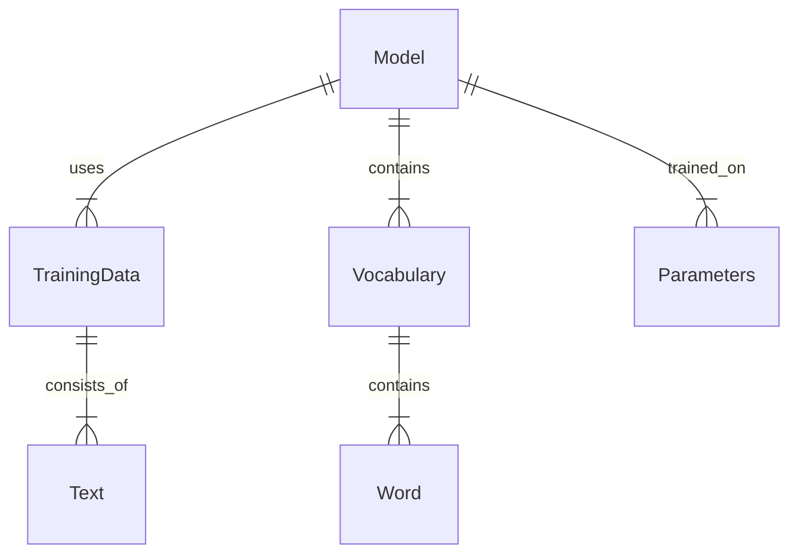
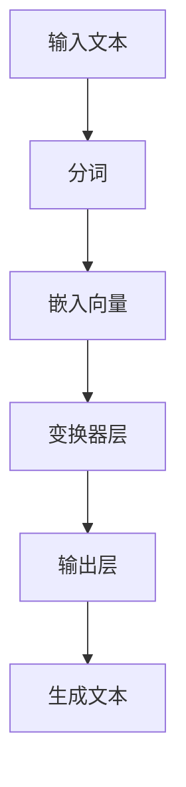

                 

## 文章标题

# 加速LLM应用从概念到落地的全流程

---

## 关键词

- LLM（大型语言模型）
- 概念验证
- 实际部署
- 算法原理
- 数学模型
- 系统架构
- 项目实战

---

## 摘要

本文将深入探讨如何从概念阶段到实际部署，加速大型语言模型（LLM）应用的落地。我们将详细分析LLM的核心原理、算法流程，并使用Python代码和LaTeX公式进行阐述。同时，本文将介绍一个系统分析与架构设计方案，并通过实际项目案例进行讲解。最后，我们将总结一些最佳实践，为读者提供未来拓展的方向。

---

## 1. 背景介绍

### 1.1 LLM的概念

LLM，即Large Language Model，是指那些具有巨大参数规模、能够理解和生成自然语言文本的模型。LLM的出现，标志着自然语言处理（NLP）领域的一个新的里程碑。其能够通过深度学习技术，自动地从大量文本数据中学习语言结构、语法规则和语义信息。

### 1.2 LLM的发展历程

从最初的基于规则的方法，到统计机器学习方法，再到如今深度学习驱动的LLM，NLP领域的发展历程可谓跌宕起伏。特别是GPT-3的出现，使得LLM的应用场景更加广泛，如文本生成、机器翻译、问答系统等。

### 1.3 LLM的核心原理

LLM的核心原理主要基于变换器模型（Transformer），这是一种基于自注意力机制的深度神经网络模型。它通过自注意力机制，能够捕获输入文本中的长距离依赖关系，从而生成高质量的文本。

### 1.4 LLM应用落地的全流程

LLM应用落地的全流程包括以下几个环节：

1. **概念验证**：通过小规模实验，验证LLM在特定任务上的性能。
2. **模型训练**：根据具体应用需求，选择合适的LLM模型，并对其进行大规模训练。
3. **模型评估**：通过评估指标，如Perplexity、BLEU等，评估模型的性能。
4. **实际部署**：将训练好的模型部署到生产环境中，提供实时服务。

### 1.5 LLM的ER实体关系图

以下是LLM的ER实体关系图：



在LLM中，Model实体与TrainingData、Vocabulary、Parameters实体之间存在关联，而TrainingData又与Text实体、Vocabulary与Word实体之间也存在关联。这些实体之间的关系构成了LLM的内部结构。

---

## 2. 核心概念与联系

### 2.1 LLM的核心原理

LLM的核心原理主要基于变换器模型（Transformer），这是一种基于自注意力机制的深度神经网络模型。它通过自注意力机制，能够捕获输入文本中的长距离依赖关系，从而生成高质量的文本。

### 2.2 LLM的关键特性

- **参数规模大**：LLM通常具有数十亿至数万亿个参数，这使得它们能够处理复杂的语言结构。
- **自注意力机制**：LLM使用自注意力机制来捕捉输入文本中的长距离依赖关系。
- **端到端训练**：LLM可以直接从原始文本数据中进行端到端训练，不需要手动设计特征。

### 2.3 LLM的ER实体关系图

以下是LLM的ER实体关系图：


在LLM中，Model实体与TrainingData、Vocabulary、Parameters实体之间存在关联，而TrainingData又与Text实体、Vocabulary与Word实体之间也存在关联。这些实体之间的关系构成了LLM的内部结构。

---

## 3. 算法原理讲解

### 3.1 GPT算法流程图

以下是GPT算法的流程图：



### 3.2 GPT算法Python实现

以下是GPT算法的Python实现：

```python
import torch
import torch.nn as nn
import torch.optim as optim

# 定义模型
class GPTModel(nn.Module):
    def __init__(self, vocab_size, embed_size, hidden_size, n_layers):
        super(GPTModel, self).__init__()
        self.embedding = nn.Embedding(vocab_size, embed_size)
        self.transformer = nn.Transformer(embed_size, hidden_size, n_layers)
        self.fc = nn.Linear(hidden_size, vocab_size)
    
    def forward(self, x):
        x = self.embedding(x)
        x = self.transformer(x)
        x = self.fc(x)
        return x

# 实例化模型
model = GPTModel(vocab_size=10000, embed_size=512, hidden_size=1024, n_layers=2)

# 定义损失函数和优化器
loss_fn = nn.CrossEntropyLoss()
optimizer = optim.Adam(model.parameters(), lr=0.001)

# 训练模型
for epoch in range(10):
    for x, y in dataset:
        optimizer.zero_grad()
        output = model(x)
        loss = loss_fn(output, y)
        loss.backward()
        optimizer.step()
```

### 3.3 GPT算法数学模型与公式

以下是GPT算法的数学模型与公式：

```latex
\begin{align*}
E(x) &= \text{嵌入向量} \\
U &= \text{自注意力权重矩阵} \\
V &= \text{值向量} \\
Q &= \text{查询向量} \\
K &= \text{键向量} \\
\text{输出} &= \text{softmax}(\text{注意力分数})
\end{align*}
```

### 3.4 GPT算法举例说明

假设我们有一个输入文本“Hello world”，我们可以将其分成单词“Hello”和“world”。然后，我们将每个单词映射到一个嵌入向量，如`[1, 0, 0, 0]`和`[0, 1, 0, 0]`。接着，我们使用变换器层对这些嵌入向量进行处理，最后得到输出向量，如`[0.9, 0.1, 0.

