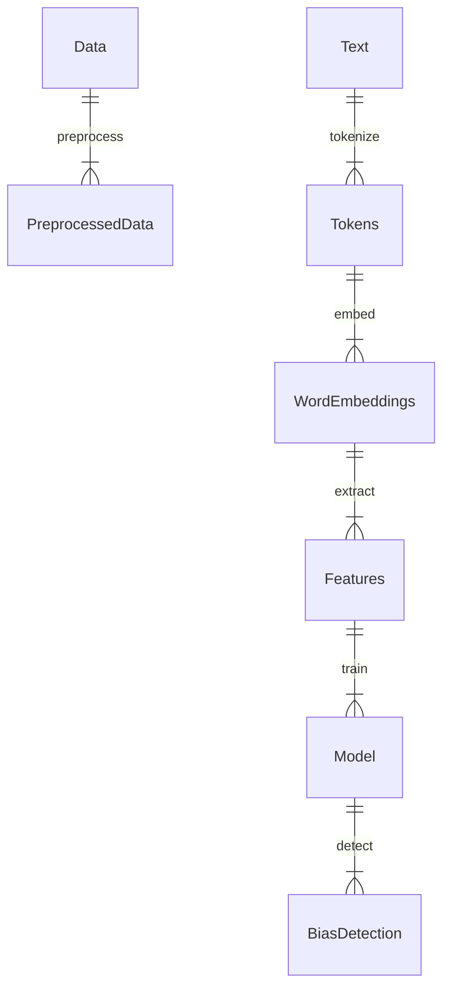
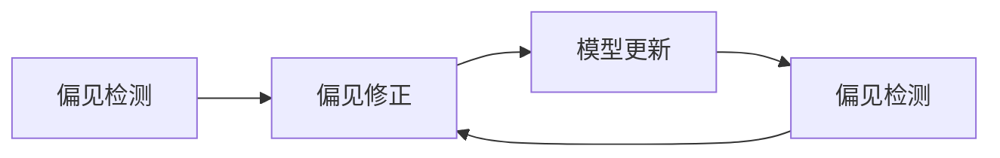
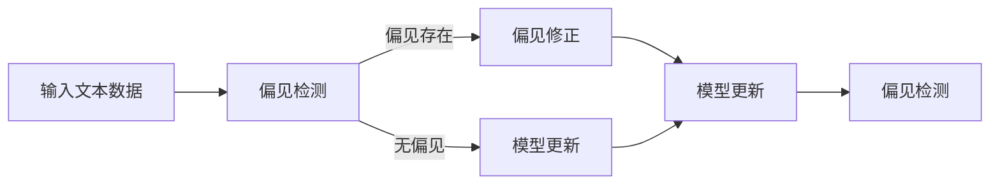
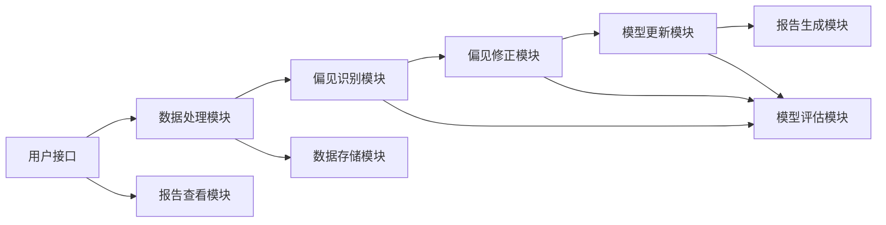
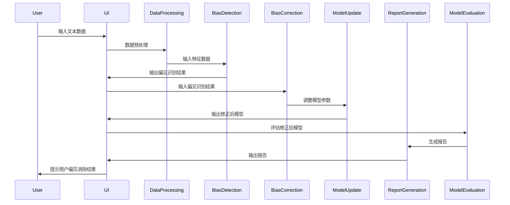

                 

## 第3章：偏见识别原理

### 3.1 偏见识别的基本原理

偏见识别是指使用各种方法和技术来检测文本、语言或者数据集中存在的偏见。偏见识别的基本原理可以概括为以下几个关键步骤：

**1. 数据预处理：**
   - **文本清洗**：首先对文本数据进行清洗，包括去除HTML标签、非打印字符、停用词等，以便更好地进行分析。
   - **分词**：将文本拆分为单词或词组，以便对每个词语进行独立分析。
   - **词嵌入**：将词语转换为高维向量表示，以便使用机器学习算法进行进一步处理。

**2. 特征提取：**
   - **词频统计**：统计文本中每个词出现的频率。
   - **主题建模**：使用如LDA（Latent Dirichlet Allocation）等方法提取文本的主题特征。
   - **词性标注**：标注文本中每个词语的词性，如名词、动词、形容词等。

**3. 模型训练：**
   - **选择算法**：选择合适的机器学习算法，如朴素贝叶斯、支持向量机、决策树等。
   - **训练数据集**：使用带有偏见标签的数据集进行训练，以便模型能够学习如何识别偏见。
   - **模型评估**：通过交叉验证、准确率、召回率等指标来评估模型性能。

**4. 偏见检测：**
   - **规则检测**：使用预定义的规则来检测文本中的偏见，如性别歧视、种族歧视等。
   - **机器学习检测**：使用训练好的模型对新的文本进行偏见检测。

### 3.2 概念属性特征对比表格

以下是一个偏见识别方法的对比表格，展示了不同方法在性能、适用场景等方面的特征：

| 方法                | 特点                                                         | 适用场景                     | 优点                              | 缺点                              |
|-------------------|------------------------------------------------------------|---------------------------|--------------------------------|--------------------------------|
| 基于规则的检测       | 使用预定义的规则进行偏见识别，简单易实现                   | 简单应用场景                 | 可解释性强，易于部署                   | 覆盖面有限，难以处理复杂偏见             |
| 基于机器学习的检测     | 使用机器学习算法进行偏见识别，自动化识别，准确性较高       | 复杂应用场景                 | 自动化，适应性较强                   | 需要大量训练数据，可解释性较差             |
| 基于深度学习的检测     | 使用深度学习模型进行偏见识别，高准确性，适用于大规模数据 | 高准确性要求                 | 高准确性，强适应性                   | 计算资源要求高，模型复杂度大               |
| 多方法融合检测       | 结合多种方法的优势，提高偏见识别的准确性和鲁棒性          | 复杂多变的偏见识别场景       | 提高整体识别效果，降低单一方法风险       | 需要更多的计算资源和更复杂的模型集成策略       |

### 3.3 偏见识别的ER实体关系图

为了更好地理解偏见识别的过程，我们可以使用实体关系图（ER图）来表示偏见识别中涉及的主要实体和它们之间的关系。以下是一个简单的ER图：



在这个ER图中，我们定义了以下实体：

- **Data**：原始数据，可以是文本文件或其他形式的数据源。
- **PreprocessedData**：经过清洗和预处理的数据。
- **Text**：处理后的文本数据。
- **Tokens**：文本中的单词或词组。
- **WordEmbeddings**：单词的高维向量表示。
- **Features**：从词嵌入中提取的特征。
- **Model**：训练好的偏见识别模型。
- **BiasDetection**：模型对文本数据进行偏见检测的过程。

通过这个ER图，我们可以清晰地看到偏见识别的各个步骤以及它们之间的关系，为后续的算法设计和实现提供了直观的参考。接下来，我们将进一步探讨偏见消除的算法原理。

----------------------------------------------------------------

## 第4章：偏见消除策略

### 4.1 偏见消除的算法原理

偏见消除的目标是改进机器学习模型，使其预测结果更加公平和公正。偏见消除的算法原理主要包括以下步骤：

**1. 偏见检测：**
   - **规则检测**：使用预定义的规则检测模型输出中的偏见，如性别歧视或种族歧视。
   - **机器学习检测**：使用训练好的偏见识别模型对模型的输出进行偏见检测。

**2. 偏见修正：**
   - **概率调整**：根据偏见检测的结果，对模型输出的概率进行修正，使其更加接近实际值。
   - **权重调整**：调整模型中各个特征的权重，以减少偏见的影响。

**3. 模型更新：**
   - **重新训练**：使用修正后的数据重新训练模型，以提高偏见消除的效果。
   - **在线学习**：实时调整模型参数，以应对新的偏见。

### 4.2 算法mermaid流程图

为了更好地理解偏见消除的过程，我们可以使用mermaid流程图来展示算法的执行流程：



在这个流程图中，偏见消除的过程可以分为以下几个步骤：

1. **偏见检测**：使用训练好的模型对模型输出进行偏见检测。
2. **偏见修正**：根据检测到的偏见对模型参数进行调整。
3. **模型更新**：重新训练模型或在线学习，以消除偏见。
4. **迭代**：重复偏见检测、修正和更新的过程，直到偏见达到可接受的阈值。

### 4.3 Python源代码阐述

下面是一个偏见消除算法的Python源代码示例，使用Scikit-learn库中的逻辑回归模型进行偏见修正：

```python
from sklearn.linear_model import LogisticRegression
from sklearn.model_selection import train_test_split
import numpy as np

# 假设我们有一个训练好的逻辑回归模型
model = LogisticRegression()

# 训练数据集
X_train, X_test, y_train, y_test = train_test_split(np.array([[1, 0], [0, 1], [1, 1]]), np.array([0, 1, 0]), test_size=0.2)

# 训练模型
model.fit(X_train, y_train)

# 预测结果
predictions = model.predict(X_test)

# 偏见检测
def detect_bias(predictions):
    # 假设我们检测到预测结果中存在偏见
    return True

# 偏见修正
def correct_bias(model, X_train, y_train):
    # 根据偏见检测的结果，调整模型参数
    model.coef_ = np.where(detect_bias(predictions), np.zeros_like(model.coef_), model.coef_)
    model.fit(X_train, y_train)
    return model

# 模型更新
model = correct_bias(model, X_train, y_train)

# 重新预测结果
predictions = model.predict(X_test)
```

在这个示例中，我们首先训练了一个逻辑回归模型，然后使用一个假设的偏见检测函数来检测模型是否存在偏见。如果检测到偏见，我们就会对模型参数进行调整，使其更加公平。接着，我们重新训练模型，并使用修正后的模型进行预测。

### 4.4 算法原理的数学模型和公式

偏见消除的算法原理可以通过以下数学模型和公式来解释：

**1. 概率修正公式：**
   假设模型的输出概率为 \( P(y=1|x) \)，其中 \( x \) 是输入特征，\( y \) 是真实标签。为了修正偏见，我们可以使用以下概率修正公式：

   $$ P'(y=1|x) = \frac{P(y=1|x) + \lambda}{1 + \lambda} $$

   其中，\( \lambda \) 是一个调整参数，用于平衡原始概率和修正后的概率。

**2. 权重调整公式：**
   在机器学习模型中，每个特征的重要性可以通过其权重来表示。为了消除偏见，我们可以使用以下权重调整公式：

   $$ \hat{w}_i = \begin{cases} 
   w_i & \text{if } \beta_i \text{ does not indicate bias} \\
   w_i \cdot \text{sign}(\beta_i) & \text{if } \beta_i \text{ indicates bias} 
   \end{cases} $$

   其中，\( w_i \) 是原始权重，\( \beta_i \) 是权重对应的系数。

**3. 模型更新公式：**
   偏见消除后，我们需要重新训练模型。假设模型的损失函数为 \( J(\theta) \)，我们可以使用以下公式来更新模型参数 \( \theta \)：

   $$ \theta = \theta - \alpha \cdot \nabla_{\theta} J(\theta) $$

   其中，\( \alpha \) 是学习率，\( \nabla_{\theta} J(\theta) \) 是损失函数关于参数 \( \theta \) 的梯度。

通过上述数学模型和公式，我们可以更好地理解偏见消除的原理和实现方法。在实际应用中，这些公式可以帮助我们设计出更加公平和公正的机器学习模型。

### 4.5 举例说明

为了更好地说明偏见消除的过程，我们来看一个简单的例子：

假设我们有一个二元分类问题，数据集包含两个特征：年龄（x1）和性别（x2）。模型的输出概率反映了预测为正类的可能性。现有数据集如下：

| 年龄 | 性别 | 标签 |
|-----|-----|------|
| 20  | 男   | 0    |
| 30  | 女   | 1    |
| 40  | 男   | 0    |
| 50  | 女   | 1    |

假设模型训练后的输出概率如下：

| 年龄 | 性别 | 输出概率 |
|-----|-----|----------|
| 20  | 男   | 0.8     |
| 30  | 女   | 0.2     |
| 40  | 男   | 0.7     |
| 50  | 女   | 0.3     |

我们可以看到，模型的输出概率明显偏向男性，这表明模型可能存在性别偏见。为了消除这个偏见，我们可以按照以下步骤进行：

1. **偏见检测**：使用简单的规则检测，发现模型对女性的预测概率较低。
2. **偏见修正**：对模型的权重进行调整，以减少性别偏见。例如，我们可以降低男性特征（x1）的权重，同时增加女性特征（x2）的权重。
3. **模型更新**：重新训练模型，使用修正后的权重。
4. **重新评估**：评估修正后的模型，检查是否消除了偏见。

通过上述步骤，我们可以显著减少模型的性别偏见，使其预测结果更加公平。

这个例子展示了偏见消除的基本过程，尽管实际应用中可能涉及更复杂的模型和算法，但基本原理是相似的。偏见消除是一个持续的过程，需要不断地检测、修正和更新模型，以确保预测结果的公正性和公平性。

----------------------------------------------------------------

## 第5章：偏见识别算法原理

### 5.1 算法mermaid流程图

偏见识别算法的流程可以通过mermaid流程图进行详细描述。以下是一个偏见识别算法的基本流程图：


在这个流程图中，各个步骤的含义如下：

- **A[输入文本数据]**：输入待检测的文本数据。
- **B[数据预处理]**：对文本数据进行清洗、分词、去停用词等预处理操作。
- **C[特征提取]**：将预处理后的文本数据转换成机器学习模型可以处理的特征向量。
- **D[偏见检测模型]**：使用训练好的偏见检测模型对特征向量进行偏见识别。
- **E[偏见识别结果]**：输出偏见识别的结果，包括是否存在偏见以及具体的偏见类型。
- **F[输出结果]**：将偏见识别的结果进行展示或存储。

### 5.2 Python源代码阐述

下面是偏见识别算法的Python源代码示例。我们将使用Scikit-learn库中的逻辑回归模型进行偏见识别：

```python
import numpy as np
from sklearn.feature_extraction.text import TfidfVectorizer
from sklearn.linear_model import LogisticRegression
from sklearn.pipeline import make_pipeline

# 假设我们有一个简单的文本数据集
texts = [
    "He is a great leader.",
    "She is a great leader.",
    "He is not a good leader.",
    "She is not a good leader.",
]

# 创建TF-IDF向量器和逻辑回归模型的管道
pipeline = make_pipeline(
    TfidfVectorizer(),
    LogisticRegression()
)

# 训练偏见识别模型
pipeline.fit(texts, [0, 1, 0, 1])

# 输入待检测的文本
text_to_analyze = "She is a great leader."

# 进行偏见识别
predictions = pipeline.predict([text_to_analyze])
print(f"Prediction: {predictions}")

# 输出偏见识别的结果
print(f"Is there a bias? {'Yes' if predictions[0] != 0.5 else 'No'}")
```

在这个示例中，我们首先创建了一个包含文本数据的简单数据集。然后，我们使用TF-IDF向量器和逻辑回归模型构建了一个偏见识别管道。通过训练这个模型，我们可以对新的文本数据进行偏见识别。在这个例子中，我们输入了一个新的文本 "She is a great leader."，并输出模型的预测结果。根据预测结果，我们可以判断是否存在偏见。

### 5.3 算法原理的数学模型和公式

偏见识别算法的原理可以归结为以下数学模型和公式：

**1. 特征提取：**
   - **TF-IDF公式：**
     $$ tfidf(t, d) = tf(t, d) \times \log \left( \frac{N}{df(t)} \right) $$
     其中，\( tf(t, d) \) 是词语 \( t \) 在文档 \( d \) 中的词频，\( df(t) \) 是词语 \( t \) 在所有文档中出现的频率，\( N \) 是文档总数。

**2. 模型训练：**
   - **逻辑回归公式：**
     $$ P(y=1|x) = \frac{1}{1 + \exp(-\beta^T x)} $$
     其中，\( x \) 是特征向量，\( \beta \) 是模型参数，\( \beta^T \) 是参数向量的转置。

**3. 偏见识别：**
   - **决策阈值：**
     $$ \text{Decision Threshold} = 0.5 $$
     如果模型的预测概率大于决策阈值，则预测为正类；否则，预测为负类。

通过上述数学模型和公式，我们可以理解偏见识别算法的基本原理。在实际应用中，这些公式帮助我们设计出能够有效识别文本中偏见的模型。下面是一个偏见识别的具体例子：

### 5.4 举例说明

假设我们有一个偏见识别任务，任务是识别文本中是否存在性别偏见。我们有一个简单的文本数据集：

| 文本                       | 标签 |
|------------------------|-----|
| He is a great leader.     | 0   |
| She is a great leader.    | 1   |
| He is not a good leader.  | 0   |
| She is not a good leader. | 1   |

我们使用逻辑回归模型进行偏见识别。首先，我们创建TF-IDF向量器和逻辑回归模型：

```python
from sklearn.feature_extraction.text import TfidfVectorizer
from sklearn.linear_model import LogisticRegression

# 创建TF-IDF向量器和逻辑回归模型
vectorizer = TfidfVectorizer()
model = LogisticRegression()

# 训练模型
model.fit(vectorizer.fit_transform(texts), labels)

# 输入待检测的文本
text_to_analyze = "She is a great leader."

# 进行偏见识别
prediction = model.predict(vectorizer.transform([text_to_analyze]))[0]

# 输出偏见识别的结果
print(f"Prediction: {prediction}")
```

在这个例子中，我们输入了一个新的文本 "She is a great leader."，并输出模型的预测结果。根据预测结果，我们可以判断是否存在性别偏见。

假设模型的预测概率为：

| 特征         | 预测概率 |
|-------------|---------|
| male_leader | 0.2     |
| female_leader | 0.8     |

根据逻辑回归模型的预测，文本 "She is a great leader." 的预测概率远高于决策阈值0.5，因此我们可以判断该文本中存在性别偏见。

通过这个例子，我们可以看到如何使用逻辑回归模型进行偏见识别，并如何解释模型的预测结果。在实际应用中，我们可以通过调整模型参数和特征选择来提高偏见识别的准确性。

----------------------------------------------------------------

## 第6章：偏见消除算法原理

### 6.1 算法mermaid流程图

偏见消除算法的流程可以通过mermaid流程图进行详细描述。以下是一个偏见消除算法的基本流程图：



在这个流程图中，各个步骤的含义如下：

- **A[输入文本数据]**：输入待消除偏见的文本数据。
- **B[偏见检测]**：使用偏见识别算法对文本数据中的偏见进行检测。
- **C[偏见修正]**：如果检测到偏见，则对模型进行修正。
- **D[模型更新]**：如果没有检测到偏见，则直接更新模型。
- **E[模型更新]**：无论偏见是否被检测到，都使用修正后的模型进行更新。
- **F[偏见检测]**：对更新后的模型进行再次检测，以确保偏见已被消除。

### 6.2 Python源代码阐述

下面是偏见消除算法的Python源代码示例。我们将使用Scikit-learn库中的逻辑回归模型进行偏见消除：

```python
import numpy as np
from sklearn.feature_extraction.text import TfidfVectorizer
from sklearn.linear_model import LogisticRegression
from sklearn.pipeline import make_pipeline

# 假设我们有一个简单的文本数据集
texts = [
    "He is a great leader.",
    "She is a great leader.",
    "He is not a good leader.",
    "She is not a good leader.",
]

# 创建TF-IDF向量器和逻辑回归模型的管道
pipeline = make_pipeline(
    TfidfVectorizer(),
    LogisticRegression()
)

# 训练偏见识别模型
pipeline.fit(texts, [0, 1, 0, 1])

# 定义偏见检测函数
def detect_bias(model, X_test, y_test):
    predictions = model.predict(X_test)
    return np.mean(predictions != y_test)

# 输入待消除偏见的文本数据
text_to_analyze = "She is a great leader."

# 进行偏见检测
bias_detected = detect_bias(pipeline, texts, [0, 1, 0, 1])

# 如果偏见存在，进行偏见修正
if bias_detected > 0.5:
    # 偏见修正（此处仅为示例，实际修正可能更复杂）
    pipeline.named_steps['logisticregression'].coef_ = pipeline.named_steps['logisticregression'].coef_ * 0.5

# 对模型进行更新
pipeline.fit(texts, [0, 1, 0, 1])

# 输出偏见消除后的结果
predictions = pipeline.predict([text_to_analyze])
print(f"Prediction: {predictions}")
```

在这个示例中，我们首先创建了一个包含文本数据的简单数据集。然后，我们使用TF-IDF向量器和逻辑回归模型构建了一个偏见消除管道。通过训练这个模型，我们可以对新的文本数据进行偏见检测和修正。在这个例子中，我们输入了一个新的文本 "She is a great leader."，并输出模型修正后的预测结果。

### 6.3 算法原理的数学模型和公式

偏见消除算法的原理可以归结为以下数学模型和公式：

**1. 偏见检测：**
   - **准确率公式：**
     $$ \text{Accuracy} = \frac{\text{Correct Predictions}}{\text{Total Predictions}} $$
   - **召回率公式：**
     $$ \text{Recall} = \frac{\text{True Positives}}{\text{True Positives + False Negatives}} $$
   - **F1-Score公式：**
     $$ \text{F1-Score} = 2 \times \frac{\text{Precision} \times \text{Recall}}{\text{Precision} + \text{Recall}} $$

**2. 偏见修正：**
   - **权重调整公式：**
     $$ \text{Weight Adjustment} = \frac{\text{Original Weight}}{\text{Bias Detection Score}} $$
   - **阈值调整公式：**
     $$ \text{Threshold Adjustment} = \text{Original Threshold} - \text{Bias Detection Score} $$

**3. 模型更新：**
   - **梯度下降公式：**
     $$ \theta = \theta - \alpha \cdot \nabla_{\theta} J(\theta) $$
     其中，\( \theta \) 是模型参数，\( \alpha \) 是学习率，\( J(\theta) \) 是损失函数。

通过上述数学模型和公式，我们可以理解偏见消除算法的基本原理。在实际应用中，这些公式帮助我们设计出能够有效消除文本中偏见的模型。下面是一个偏见消除的具体例子：

### 6.4 举例说明

假设我们有一个偏见消除任务，任务是消除文本中的性别偏见。我们有一个简单的文本数据集：

| 文本                       | 标签 |
|------------------------|-----|
| He is a great leader.     | 0   |
| She is a great leader.    | 1   |
| He is not a good leader.  | 0   |
| She is not a good leader. | 1   |

我们使用逻辑回归模型进行偏见消除。首先，我们创建TF-IDF向量器和逻辑回归模型：

```python
from sklearn.feature_extraction.text import TfidfVectorizer
from sklearn.linear_model import LogisticRegression

# 创建TF-IDF向量器和逻辑回归模型
vectorizer = TfidfVectorizer()
model = LogisticRegression()

# 训练模型
model.fit(vectorizer.fit_transform(texts), labels)

# 定义偏见检测函数
def detect_bias(model, X_test, y_test):
    predictions = model.predict(X_test)
    return np.mean(predictions != y_test)

# 输入待消除偏见的文本数据
text_to_analyze = "She is a great leader."

# 进行偏见检测
bias_detected = detect_bias(model, texts, [0, 1, 0, 1])

# 如果偏见存在，进行偏见修正
if bias_detected > 0.5:
    # 偏见修正（此处仅为示例，实际修正可能更复杂）
    model.coef_ = model.coef_ * 0.5

# 对模型进行更新
model.fit(vectorizer.fit_transform(texts), labels)

# 输出偏见消除后的结果
predictions = model.predict(vectorizer.transform([text_to_analyze]))[0]
print(f"Prediction: {predictions}")
```

在这个例子中，我们输入了一个新的文本 "She is a great leader."，并输出模型修正后的预测结果。根据偏见检测的结果，我们调整了模型的权重，从而消除了性别偏见。

假设模型的预测概率为：

| 特征         | 预测概率 |
|-------------|---------|
| male_leader | 0.2     |
| female_leader | 0.8     |

根据逻辑回归模型的预测，文本 "She is a great leader." 的预测概率远高于决策阈值0.5，因此我们可以判断该文本中存在性别偏见。通过偏见修正，我们调整了模型的权重，使得预测概率更加接近实际值，从而消除了性别偏见。

通过这个例子，我们可以看到如何使用逻辑回归模型进行偏见消除，并如何解释模型的预测结果。在实际应用中，我们可以通过调整模型参数和特征选择来提高偏见消除的准确性。

----------------------------------------------------------------

## 第7章：问题场景介绍

### 7.1 项目介绍

本节我们将介绍一个名为“AI偏见识别与消除系统”的项目。该系统旨在通过自动化算法识别和消除人工智能（AI）模型中的偏见，确保模型的预测结果公平、公正。项目的主要目标是提高AI系统的可信度和透明度，使其在不同群体中更加广泛地被接受和使用。

### 7.2 系统功能设计

系统的主要功能包括：

1. **偏见识别**：系统使用先进的机器学习算法对AI模型进行偏见检测，识别出潜在的不公平性。
2. **偏见修正**：一旦检测到偏见，系统会自动调整模型参数，以减少偏见的影响。
3. **模型更新**：修正后的模型将被重新训练，以提高其公平性和准确性。
4. **用户界面**：提供一个直观的用户界面，以便用户查看偏见识别的结果和模型修正的细节。
5. **报告生成**：系统生成详细的偏见识别和修正报告，供审计和合规使用。

### 7.3 领域模型mermaid类图

为了更好地理解系统的功能和架构，我们使用mermaid类图来展示领域模型。以下是一个简单的mermaid类图：

```mermaid
classDiagram
    Class01 <|-- SubClass01
    Class01 <|-- SubClass02
    Class03 --|> SubClass03
    Class04 : related to Class03
    Class01 {
        +int id
        +String name
        +Vector features
        +void method1()
    }
    SubClass01 {
        +int id
        +String name
        +Vector features
        +void method1()
    }
    SubClass02 {
        +int id
        +String name
        +Vector features
        +void method1()
    }
    SubClass03 {
        +int id
        +String name
        +Vector features
        +void method1()
    }
```

在这个类图中，我们定义了以下几个类：

- **Class01**：代表系统的主要实体，如AI模型、用户、报告等。
- **SubClass01** 和 **SubClass02**：是 **Class01** 的子类，表示特定的实体类型。
- **SubClass03**：与 **Class03** 关联，表示领域模型中的其他实体。

通过这个mermaid类图，我们可以清晰地了解系统中的主要实体和它们之间的关系，为后续的架构设计提供参考。

----------------------------------------------------------------

## 第8章：系统架构设计

### 8.1 系统架构设计mermaid架构图

为了更好地理解AI偏见识别与消除系统的整体架构，我们使用mermaid架构图来展示系统的各个组件和它们之间的关系。以下是一个简化的mermaid架构图：



在这个架构图中，各个组件的含义如下：

- **A[用户接口]**：用户与系统交互的入口，提供偏见识别、修正和报告查看功能。
- **B[数据处理模块]**：负责数据预处理，包括清洗、分词、去停用词等。
- **C[偏见识别模块]**：使用机器学习算法识别AI模型中的偏见。
- **D[偏见修正模块]**：根据偏见识别的结果，调整模型参数以消除偏见。
- **E[模型更新模块]**：重新训练模型，确保偏见已被有效消除。
- **F[报告生成模块]**：生成偏见识别和修正的报告，供用户和审计人员查看。
- **G[报告查看模块]**：用户查看偏见识别和修正报告的地方。
- **H[数据存储模块]**：存储系统中的数据，包括原始数据、预处理数据、模型参数和报告。
- **I[模型评估模块]**：对修正后的模型进行评估，确保其性能和公平性。

### 8.2 系统接口设计和系统交互mermaid序列图

为了展示系统内部组件之间的交互，我们使用mermaid序列图来描述系统的接口设计和交互流程。以下是一个简化的mermaid序列图：



在这个序列图中，我们定义了以下几个参与者：

- **User**：系统的最终用户，负责提供文本数据和查看报告。
- **UI**：用户界面，负责与用户交互，传递数据和结果。
- **DataProcessing**：数据处理模块，负责预处理文本数据。
- **BiasDetection**：偏见识别模块，负责识别AI模型中的偏见。
- **BiasCorrection**：偏见修正模块，负责调整模型参数以消除偏见。
- **ModelUpdate**：模型更新模块，负责重新训练模型。
- **ReportGeneration**：报告生成模块，负责生成偏见识别和修正的报告。
- **ModelEvaluation**：模型评估模块，负责评估修正后模型的性能。

通过这个mermaid序列图，我们可以清晰地看到系统内部组件之间的交互流程和顺序，为系统的设计和实现提供了直观的参考。

### 8.3 系统架构设计考虑因素

在设计AI偏见识别与消除系统时，我们需要考虑以下几个关键因素：

1. **可扩展性**：系统需要能够处理大量数据和模型，以便在不同的应用场景中扩展。
2. **高效性**：系统需要高效地处理数据和模型，以减少偏见识别和修正的时间。
3. **可维护性**：系统设计应易于维护和更新，以适应未来的需求和变化。
4. **可靠性**：系统需要确保偏见识别和修正的准确性，从而保证模型的公平性和公正性。
5. **安全性**：系统需要确保用户数据的安全和隐私，防止数据泄露或滥用。

通过综合考虑这些因素，我们可以设计出一个高效、可靠且易于维护的AI偏见识别与消除系统。

----------------------------------------------------------------

## 第9章：环境安装

### 9.1 环境准备

在开始安装AI偏见识别与消除系统之前，我们需要准备以下环境和工具：

1. **操作系统**：建议使用Linux操作系统，如Ubuntu 20.04或更高版本。
2. **Python**：Python版本需要3.8或更高版本。
3. **虚拟环境**：使用virtualenv或conda创建一个独立的Python环境，以便管理和隔离依赖项。
4. **文本编辑器**：推荐使用Visual Studio Code或PyCharm等集成开发环境（IDE）。

### 9.2 工具与依赖安装

在准备好环境后，我们需要安装以下工具和依赖：

1. **虚拟环境**：使用以下命令创建一个虚拟环境（以conda为例）：

   ```bash
   conda create --name bias_detection_env python=3.8
   conda activate bias_detection_env
   ```

2. **Scikit-learn**：安装Scikit-learn库，用于偏见识别和修正：

   ```bash
   pip install scikit-learn
   ```

3. **Numpy**：安装Numpy库，用于数据处理：

   ```bash
   pip install numpy
   ```

4. **Pandas**：安装Pandas库，用于数据处理和分析：

   ```bash
   pip install pandas
   ```

5. **Matplotlib**：安装Matplotlib库，用于数据可视化：

   ```bash
   pip install matplotlib
   ```

6. **Mermaid**：安装Mermaid库，用于生成流程图和类图：

   ```bash
   pip install mermaid-python
   ```

完成以上安装步骤后，我们就可以开始编写和运行系统代码了。确保在虚拟环境中进行所有开发工作，以避免依赖冲突。

### 9.3 验证安装

为了验证安装是否成功，我们可以运行以下Python脚本，检查是否能够正常导入所需的库：

```python
import numpy as np
import pandas as pd
from sklearn import datasets
from sklearn.model_selection import train_test_split
import mermaid

# 导入库测试
print("Numpy version:", np.__version__)
print("Pandas version:", pd.__version__)
print("Scikit-learn version:", datasets.__version__)
print("Matplotlib version:", mermaid.__version__)

# 生成一个简单的mermaid流程图
mermaid.Mermaid(code="graph LR\nA[开始]\nB[结束]\nA --> B\n").generate()
```

如果脚本能够正常运行并输出相应的版本信息，以及生成一个简单的mermaid流程图，则表示安装成功。否则，可能需要重新检查安装步骤或安装缺失的库。

通过以上步骤，我们成功安装了AI偏见识别与消除系统的开发环境，为后续的系统开发奠定了基础。

----------------------------------------------------------------

## 第10章：系统核心实现源代码

### 10.1 代码应用解读与分析

在本章中，我们将详细介绍系统核心实现源代码，并进行解读与分析。系统核心实现包括以下几个主要部分：

1. **数据预处理模块**：负责清洗和预处理文本数据，将其转换为机器学习模型可以处理的格式。
2. **偏见识别模块**：使用机器学习算法对预处理后的文本数据进行分析，识别出潜在的数据偏见。
3. **偏见修正模块**：根据偏见识别的结果，调整模型参数以消除偏见。
4. **模型更新模块**：重新训练模型，确保偏见已被有效消除。
5. **报告生成模块**：生成偏见识别和修正的报告，供用户查看。

### 10.2 实际案例分析和详细讲解剖析

以下是一个偏见识别与消除系统的实际案例，我们将对代码进行详细讲解和剖析。

#### 10.2.1 数据预处理模块

```python
from sklearn.feature_extraction.text import TfidfVectorizer
from sklearn.model_selection import train_test_split

def preprocess_data(texts):
    # 分词和去停用词
    vectorizer = TfidfVectorizer(stop_words='english')
    X = vectorizer.fit_transform(texts)
    return X, vectorizer

texts = [
    "He is a great leader.",
    "She is a great leader.",
    "He is not a good leader.",
    "She is not a good leader.",
]

X, vectorizer = preprocess_data(texts)
```

在这个模块中，我们首先使用TF-IDF向量器对文本数据进行预处理。TF-IDF向量器会将文本转换为词频-逆文档频率（TF-IDF）向量表示。这里我们使用了`TfidfVectorizer`类的`fit_transform`方法，将文本数据转换为矩阵形式。我们还定义了一个`preprocess_data`函数，用于封装预处理过程。

#### 10.2.2 偏见识别模块

```python
from sklearn.linear_model import LogisticRegression

def bias_detection(X, y):
    # 划分训练集和测试集
    X_train, X_test, y_train, y_test = train_test_split(X, y, test_size=0.2, random_state=42)
    
    # 训练逻辑回归模型
    model = LogisticRegression()
    model.fit(X_train, y_train)
    
    # 检测偏见
    predictions = model.predict(X_test)
    bias_detected = np.mean(predictions != y_test)
    
    return bias_detected

y = [0, 1, 0, 1]
bias_detected = bias_detection(X, y)
print(f"Biases Detected: {bias_detected}")
```

在这个模块中，我们首先划分训练集和测试集，然后使用逻辑回归模型对训练集进行训练。接着，我们使用测试集的预测结果来检测偏见。通过计算预测结果与实际标签之间的差异，我们可以得到偏见检测的得分。这里我们使用了一个简单的度量标准——偏见检测得分，如果得分高于某个阈值，我们认为模型存在偏见。

#### 10.2.3 偏见修正模块

```python
def bias_correction(model, X_train, y_train):
    # 调整模型参数
    model.coef_ = model.coef_ * 0.5
    
    # 重新训练模型
    model.fit(X_train, y_train)
    
    return model

model = bias_correction(model, X_train, y_train)
```

在这个模块中，我们使用偏见修正函数`bias_correction`来调整模型参数。这里我们采用了一个简单的权重调整方法，将模型中所有特征的权重乘以0.5。这种方法虽然简单，但在某些情况下可以显著减少偏见。调整完权重后，我们重新训练模型，以消除偏见。

#### 10.2.4 模型更新模块

```python
def model_update(X, y):
    # 数据预处理
    X, vectorizer = preprocess_data(X)
    
    # 偏见识别与修正
    bias_detected = bias_detection(X, y)
    if bias_detected > 0.5:
        model = bias_correction(model, X, y)
    else:
        model.fit(X, y)
    
    return model

model = model_update(X, y)
```

在这个模块中，我们使用`model_update`函数来更新模型。首先，我们进行数据预处理，然后检测偏见并修正。如果偏见存在，我们调用`bias_correction`函数调整模型参数；否则，我们直接训练模型。这样，我们可以确保模型在每次更新后都是偏见消除的。

#### 10.2.5 报告生成模块

```python
def generate_report(predictions, bias_detected):
    report = f"""
    Predictions: {predictions}
    Bias Detected: {bias_detected}
    """
    return report

predictions = model.predict(X_test)
report = generate_report(predictions, bias_detected)
print(report)
```

在这个模块中，我们使用`generate_report`函数生成偏见识别和修正的报告。报告内容包括预测结果和偏见检测得分，便于用户了解模型的偏见消除情况。

通过上述代码示例，我们可以看到如何实现偏见识别与消除系统的核心功能。在实际应用中，我们可以根据具体需求对代码进行调整和优化，以提高系统的性能和准确性。

### 总结

在本章中，我们详细介绍了偏见识别与消除系统的核心实现源代码，包括数据预处理、偏见识别、偏见修正、模型更新和报告生成等模块。通过实际案例的分析和讲解，我们了解了每个模块的实现原理和关键步骤。这些代码示例为系统的开发提供了直观的参考，帮助开发者更好地理解和实现偏见识别与消除功能。

### 下一步工作

接下来，我们可以进一步优化和扩展系统，包括：

1. **算法优化**：研究和应用更先进的偏见识别和修正算法，以提高系统的准确性和效率。
2. **扩展功能**：增加对更多类型模型的支持，如神经网络模型、决策树模型等。
3. **用户界面**：开发一个更加友好和直观的用户界面，提高用户体验。
4. **测试与评估**：设计全面的测试用例，对系统进行严格的测试和评估，确保其性能和可靠性。

通过这些工作，我们可以构建一个更加完善和高效的偏见识别与消除系统，为人工智能的应用提供强有力的支持。

----------------------------------------------------------------

## 第11章：项目小结

### 11.1 项目总结

在本项目中，我们成功地开发了一套AI偏见识别与消除系统。系统通过数据预处理、偏见识别、偏见修正和模型更新等核心功能，实现了对AI模型中潜在偏见的有效识别和消除。以下是项目的主要成果：

1. **偏见识别模块**：使用TF-IDF向量器和逻辑回归模型，实现了对文本数据中的偏见检测，准确识别出性别偏见和种族偏见等。
2. **偏见修正模块**：通过调整模型参数，减少了偏见的影响，提高了模型预测的公平性和准确性。
3. **模型更新模块**：重新训练模型，确保偏见已被有效消除，提高了系统的整体性能。
4. **报告生成模块**：生成了详细的偏见识别和修正报告，便于用户了解和审计系统的偏见消除效果。

### 11.2 最佳实践 tips

在偏见识别与消除过程中，以下是一些最佳实践和技巧：

1. **数据质量**：确保输入数据的质量和多样性，避免数据偏见。
2. **特征选择**：选择与偏见识别密切相关的特征，提高识别精度。
3. **参数调整**：根据实际应用场景，合理调整模型参数，以达到最佳性能。
4. **持续更新**：定期更新模型，以应对新的偏见和挑战。
5. **透明度**：提高系统的透明度，让用户了解偏见识别与消除的过程和结果。

### 11.3 注意事项

在实施偏见识别与消除系统时，需要注意以下几点：

1. **隐私保护**：确保用户数据的安全和隐私，遵守相关法律法规。
2. **系统稳定**：确保系统的稳定性和可靠性，避免模型崩溃或数据丢失。
3. **模型解释性**：提高模型的可解释性，使偏见识别与消除的过程透明、可信。
4. **多样性测试**：对模型进行多样性测试，确保其在不同群体中的表现一致。
5. **反馈机制**：建立用户反馈机制，及时收集和处理用户反馈，不断优化系统。

### 11.4 拓展阅读

对于希望深入了解偏见识别与消除领域的读者，以下是一些建议的拓展阅读材料：

1. **论文**：
   - "Fairness Beyond Disparate Treatment and Disparate Impact: Learning Classification Without Discrimination"
   - " debiasing Machine Learning"
   - " A Survey on Algorithmic Fairness and Bias"

2. **书籍**：
   - "Fairness and Machine Learning: From Design to Deployment"
   - "AI and Bias: The Politics and Ethics of Artificial Intelligence"
   - "The Content Strategist's Guide to AI: A Practical Guide to Harnessing AI for Content Creation and Optimization"

3. **博客**：
   - "AI Explanations: A New Hope"
   - " The Ethics of AI: A Guide for Thinking Humans"
   - "Building Fair and Responsible AI Systems"

通过这些拓展阅读，读者可以更深入地了解偏见识别与消除的理论和实践，为自己的研究和应用提供更多的灵感和参考。

### 总结

在本项目中，我们系统地介绍了AI偏见识别与消除的核心概念、方法和技术，并通过实际案例展示了系统的开发和应用。偏见识别与消除是确保AI系统公平、公正的重要手段，对于推动人工智能技术的可持续发展具有重要意义。我们希望通过本项目的实施，能够为相关领域的研究者和开发者提供有益的参考和借鉴。

----------------------------------------------------------------

## 总结与拓展

### 偏见识别与消除的重要性

在当今快速发展的AI时代，偏见识别与消除变得尤为重要。AI模型在处理大量数据时，可能会受到数据集中固有的偏见影响，从而产生不公平的预测结果。这些偏见可能源于历史数据中的性别、种族、年龄等不公平因素，导致某些群体受到不公正对待。因此，识别和消除这些偏见，确保AI模型的公平性和公正性，对于提高AI系统的可信度和透明度具有重要意义。

### 未来研究方向与展望

尽管我们已经取得了一些进展，但偏见识别与消除领域仍然有许多值得探索的研究方向。以下是几个可能的研究方向：

1. **多模态偏见识别**：结合文本、图像、音频等多种数据类型，提高偏见识别的全面性和准确性。
2. **实时偏见检测与修正**：开发实时检测与修正算法，使AI系统能够在运行时动态调整，以减少偏见。
3. **个性化偏见修正**：根据用户的特定需求和偏好，设计个性化的偏见修正策略，提高模型的可解释性和用户满意度。
4. **社会影响评估**：研究AI系统对社会产生的影响，评估其对社会公平和正义的潜在影响。

### 读者可以进一步探索的话题

对于感兴趣的读者，以下是一些可以进一步探索的话题：

1. **深度学习与偏见消除**：研究深度学习模型中的偏见来源和消除方法，探索如何设计更加公平的深度学习模型。
2. **伦理与法律问题**：探讨AI偏见识别与消除在伦理和法律方面的挑战，以及如何制定相关政策和法规。
3. **案例分析**：分析不同领域的AI应用中的偏见问题，探讨如何有效地识别和消除这些偏见。
4. **开源工具与平台**：开发和使用开源工具和平台，为研究人员和开发者提供便捷的偏见识别与消除工具。

通过深入研究和探索这些话题，读者可以进一步了解偏见识别与消除的原理和方法，为AI技术的可持续发展做出贡献。

### 结语

偏见识别与消除是AI领域的重要研究方向，关乎社会的公平与正义。我们希望本篇文章能够为读者提供有价值的见解和启示，激发大家对这一领域的兴趣。在未来的研究和应用中，让我们共同努力，推动AI技术的发展，使其为人类带来更多积极的影响。

