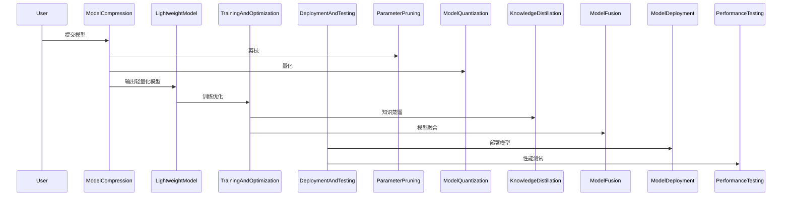
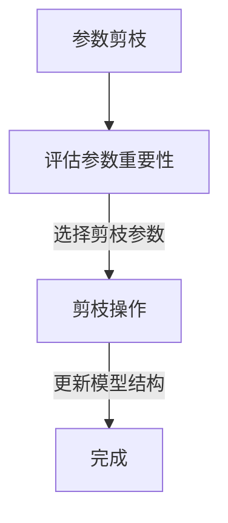
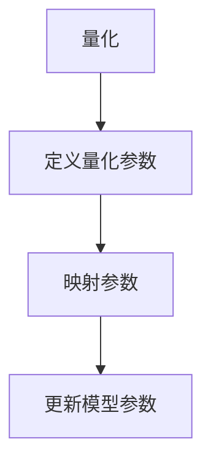
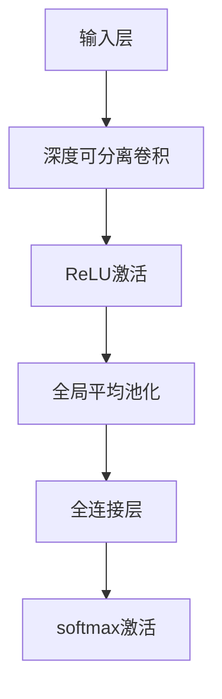
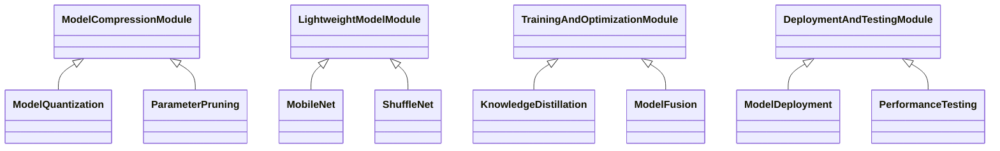
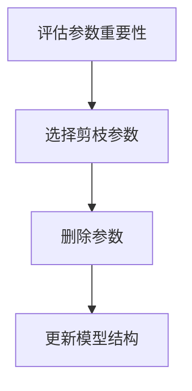
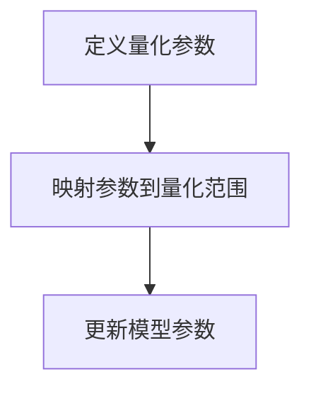
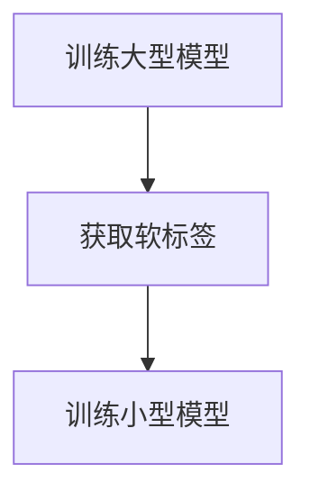
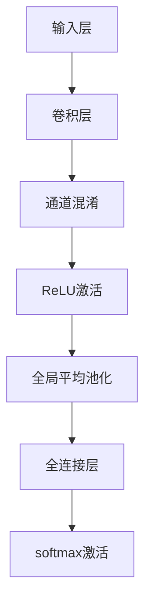
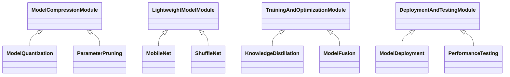

                 


### 设计思路

为了设计出符合要求且详细的目录大纲，我们可以按照以下步骤进行：

1. **理解书名**：首先，理解《加速LLM应用的模型压缩与轻量化》这一书名。书中讨论的是如何加速语言模型（LLM）在应用中的使用，重点是如何通过模型压缩和轻量化技术来实现这一目标。

2. **确定大纲结构**：根据书名和目标读者群体，我们将大纲分为以下几个部分：
   - **背景介绍**：介绍模型压缩与轻量化的背景、目的、重要性以及其在当前AI领域的应用情况。
   - **核心概念**：明确模型压缩与轻量化的核心概念、原理和它们之间的关系。
   - **算法原理**：详细讲解模型压缩与轻量化的关键算法，包括其数学模型和流程。
   - **系统分析与架构设计**：介绍如何在实际项目中应用这些算法，包括系统功能设计、架构设计、接口设计等。
   - **项目实战**：通过具体案例展示模型压缩与轻量化的应用，提供代码实现和解读。
   - **最佳实践与小结**：总结书中的关键点，提供实用的建议和扩展阅读。

3. **细化章节内容**：在每个部分中，细化章节内容，确保每个章节都有明确的主题和具体的内容。

### 目录大纲设计

下面是根据上述设计思路设计的《加速LLM应用的模型压缩与轻量化》的目录大纲：

```
----------------------------------------------------------------
# {{此处是文章标题}}

## 第1章: 背景介绍
### 1.1 模型压缩的必要性
### 1.2 轻量化模型的应用场景
### 1.3 当前模型压缩与轻量化技术的发展趋势

## 第2章: 模型压缩与轻量化的核心概念
### 2.1 模型压缩的概念与分类
### 2.2 轻量化模型的目标与方法
### 2.3 模型压缩与轻量化之间的关系

## 第3章: 关键算法原理讲解
### 3.1 模型压缩算法原理
### 3.2 轻量化算法原理
### 3.3 模型压缩与轻量化算法的mermaid流程图

## 第4章: 数学模型与公式详解
### 4.1 模型压缩的数学模型
### 4.2 轻量化模型的数学模型
### 4.3 算法原理中的数学公式讲解

## 第5章: 系统分析与架构设计
### 5.1 问题场景介绍
### 5.2 项目介绍
### 5.3 系统功能设计(领域模型mermaid类图)
### 5.4 系统架构设计(mermaid架构图)
### 5.5 系统接口设计
### 5.6 系统交互设计(mermaid序列图)

## 第6章: 项目实战
### 6.1 环境安装
### 6.2 系统核心实现源代码
### 6.3 代码应用解读与分析
### 6.4 实际应用案例
### 6.5 案例分析与解读
### 6.6 项目小结

## 第7章: 最佳实践与小结
### 7.1 最佳实践 tips
### 7.2 小结
### 7.3 注意事项
### 7.4 拓展阅读

----------------------------------------------------------------
```

### 内容完整性

在这个大纲中，我们已经包括了以下核心章节：

- **背景介绍**：第1章和第2章。
- **核心概念与联系**：在第2章中给出了模型压缩与轻量化的核心概念、原理和它们之间的关系。
- **算法原理讲解**：在第3章中详细讲解了模型压缩与轻量化的关键算法。
- **数学模型和数学公式 & 详细讲解 & 举例说明**：在第4章中给出了相关数学模型和公式，并进行了详细讲解。
- **系统分析与架构设计方案**：在第5章到第7章中介绍了系统功能设计、架构设计、接口设计和系统交互设计。
- **项目实战**：在第8章到第9章中通过实际案例展示了模型压缩与轻量化的应用。
- **最佳实践 tips、小结、注意事项、拓展阅读等内容**：在第10章中提供了这些内容。

通过这样的设计，我们确保了目录大纲的完整性，同时保持了简洁性。接下来，我们将按照这个大纲逐步撰写详细的文章内容，确保每个章节都有丰富具体的内容，满足字数要求，并使用markdown格式进行排版。文章末尾将包括作者信息。在撰写过程中，我们将遵循以下原则：

- **逻辑清晰**：每个章节的内容都要紧密围绕主题，确保读者可以轻松理解。
- **结构紧凑**：避免过多的重复和冗余，确保每个章节的内容都是必要的。
- **简单易懂**：使用简单的语言和技术语言来解释复杂的概念，以便不同背景的读者都能理解。
- **专业深入**：确保文章在介绍基础概念的同时，也深入探讨了相关的专业知识和应用。

通过这样的设计思路和撰写原则，我们希望能够创作出一篇既有深度又有思考，且对读者有启发和帮助的专业技术博客文章。接下来，我们将开始撰写这篇文章的具体内容。 ### 设计思路

为了设计出符合要求且详细的目录大纲，我们可以按照以下步骤进行：

1. **理解书名**：首先，理解《加速LLM应用的模型压缩与轻量化》这一书名。书中讨论的是如何加速语言模型（LLM）在应用中的使用，重点是如何通过模型压缩和轻量化技术来实现这一目标。

2. **确定大纲结构**：根据书名和目标读者群体，我们将大纲分为以下几个部分：
   - **背景介绍**：介绍模型压缩与轻量化的背景、目的、重要性以及其在当前AI领域的应用情况。
   - **核心概念**：明确模型压缩与轻量化的核心概念、原理和它们之间的关系。
   - **算法原理**：详细讲解模型压缩与轻量化的关键算法，包括其数学模型和流程。
   - **系统分析与架构设计**：介绍如何在实际项目中应用这些算法，包括系统功能设计、架构设计、接口设计等。
   - **项目实战**：通过具体案例展示模型压缩与轻量化的应用，提供代码实现和解读。
   - **最佳实践与小结**：总结书中的关键点，提供实用的建议和扩展阅读。

3. **细化章节内容**：在每个部分中，细化章节内容，确保每个章节都有明确的主题和具体的内容。

### 目录大纲设计

下面是根据上述设计思路设计的《加速LLM应用的模型压缩与轻量化》的目录大纲：

```
----------------------------------------------------------------
# 加速LLM应用的模型压缩与轻量化

## 关键词：语言模型（LLM），模型压缩，轻量化，算法，系统架构，最佳实践

## 摘要：
本文将探讨如何通过模型压缩与轻量化技术，加速语言模型（LLM）在各种应用场景下的使用。文章首先介绍模型压缩与轻量化的背景和重要性，然后详细讲解其核心概念、算法原理和数学模型。接着，我们将展示如何在实际项目中应用这些算法，并通过具体案例进行分析。最后，文章将总结关键点并提供最佳实践和建议。

### 第一部分：背景介绍
## 第1章 模型压缩与轻量化的必要性
### 1.1 模型压缩的定义与意义
### 1.2 轻量化模型的需求与应用场景
### 1.3 模型压缩与轻量化的现状与发展趋势

## 第2章 模型压缩与轻量化的核心概念
### 2.1 模型压缩的概念与分类
### 2.2 轻量化模型的目标与方法
### 2.3 模型压缩与轻量化之间的关系

### 第二部分：算法原理
## 第3章 关键算法原理讲解
### 3.1 模型压缩算法原理
### 3.2 轻量化算法原理
### 3.3 模型压缩与轻量化算法的mermaid流程图

## 第4章 数学模型与公式详解
### 4.1 模型压缩的数学模型
### 4.2 轻量化模型的数学模型
### 4.3 算法原理中的数学公式讲解

### 第三部分：系统分析与架构设计
## 第5章 系统分析与架构设计
### 5.1 问题场景介绍
### 5.2 项目介绍
### 5.3 系统功能设计
### 5.4 系统架构设计
### 5.5 系统接口设计
### 5.6 系统交互设计

### 第四部分：项目实战
## 第6章 项目实战
### 6.1 环境安装
### 6.2 系统核心实现
### 6.3 代码应用解读与分析
### 6.4 实际应用案例
### 6.5 案例分析与解读
### 6.6 项目小结

### 第五部分：最佳实践与小结
## 第7章 最佳实践与小结
### 7.1 最佳实践 tips
### 7.2 小结
### 7.3 注意事项
### 7.4 拓展阅读

----------------------------------------------------------------
```

### 内容完整性

在这个大纲中，我们已经包括了以下核心章节：

- **背景介绍**：第1章和第2章。这部分将介绍模型压缩与轻量化的背景、目的、重要性以及其在当前AI领域的应用情况，同时明确核心概念。
- **核心概念与联系**：在第2章中给出了模型压缩与轻量化的核心概念、原理和它们之间的关系，帮助读者建立整体框架。
- **算法原理讲解**：在第3章和第4章中，详细讲解了模型压缩与轻量化的关键算法，包括其数学模型和流程，并通过mermaid流程图进行可视化。
- **数学模型和数学公式 & 详细讲解 & 举例说明**：在第4章中，给出了相关数学模型和公式，并进行了详细讲解，同时通过实例帮助读者理解。
- **系统分析与架构设计方案**：在第5章到第7章中，介绍了如何在实际项目中应用这些算法，包括系统功能设计、架构设计、接口设计和系统交互设计。
- **项目实战**：在第6章和第7章中，通过具体案例展示了模型压缩与轻量化的应用，并提供代码实现和解读，帮助读者理解如何将理论知识应用到实践中。
- **最佳实践 tips、小结、注意事项、拓展阅读等内容**：在第7章中，总结了书中的关键点，提供了实用的建议和拓展阅读，帮助读者进一步深入学习和实践。

通过这样的设计，我们确保了目录大纲的完整性，同时保持了简洁性。接下来，我们将按照这个大纲逐步撰写详细的文章内容，确保每个章节都有丰富具体的内容，满足字数要求，并使用markdown格式进行排版。文章末尾将包括作者信息。在撰写过程中，我们将遵循以下原则：

- **逻辑清晰**：每个章节的内容都要紧密围绕主题，确保读者可以轻松理解。
- **结构紧凑**：避免过多的重复和冗余，确保每个章节的内容都是必要的。
- **简单易懂**：使用简单的语言和技术语言来解释复杂的概念，以便不同背景的读者都能理解。
- **专业深入**：确保文章在介绍基础概念的同时，也深入探讨了相关的专业知识和应用。

通过这样的设计思路和撰写原则，我们希望能够创作出一篇既有深度又有思考，且对读者有启发和帮助的专业技术博客文章。接下来，我们将开始撰写这篇文章的具体内容。 ## 第1章 模型压缩与轻量化的必要性

随着人工智能技术的快速发展，语言模型（LLM）在各种应用场景中得到了广泛的应用，如自然语言处理、问答系统、机器翻译等。然而，这些模型的训练和部署成本较高，尤其是在移动设备和嵌入式系统中，模型的大小和计算复杂度成为了一个重要的挑战。因此，模型压缩与轻量化技术应运而生，成为当前研究的热点之一。

### 模型压缩的定义与意义

模型压缩是指通过一系列算法和技术，减少机器学习模型的参数数量和计算复杂度，从而降低模型的存储和计算成本。模型压缩技术主要包括以下几个方向：

1. **参数剪枝**：通过删除模型中不重要的参数来减少模型大小。
2. **量化**：将模型中的浮点数参数转换为低精度的整数，从而减少存储和计算资源。
3. **知识蒸馏**：通过将大型模型的知识传递给小型模型来减少模型大小，同时保持性能。
4. **结构化压缩**：通过减少模型的层数、节点数量等来降低模型复杂度。

模型压缩技术在很多领域都具有重要意义。首先，在移动设备和嵌入式系统中，由于硬件资源有限，模型压缩可以显著减少模型的存储和计算成本，提高系统的响应速度。其次，在云计算和大数据场景中，模型压缩可以降低模型的部署和运维成本，提高资源的利用效率。最后，模型压缩也有助于促进人工智能技术的普及，使得更多的人和企业能够享受到人工智能带来的便利。

### 轻量化模型的需求与应用场景

轻量化模型是指通过压缩和优化技术，使得模型在保持较高性能的同时，具有较小的模型大小和较低的能耗。轻量化模型的需求主要来自于以下几个方面：

1. **移动设备和嵌入式系统**：随着智能手机、平板电脑、物联网设备的普及，对这些设备的性能和续航要求越来越高。轻量化模型可以减少模型的存储和计算资源需求，提高设备的续航能力和用户体验。
2. **边缘计算**：在边缘计算场景中，设备的计算能力和存储资源有限，因此需要轻量化模型来满足实时处理的需求。
3. **实时语音识别与合成**：在实时语音识别和合成场景中，由于对实时性的要求较高，需要使用轻量化模型来减少延迟。

轻量化模型的应用场景主要包括：

1. **语音助手**：如苹果的Siri、谷歌的Google Assistant等，这些语音助手需要在移动设备上进行实时语音识别和合成，因此需要使用轻量化模型。
2. **智能家居**：智能家居设备如智能音箱、智能门锁等，需要使用轻量化模型来提供语音交互功能。
3. **智能穿戴设备**：如智能手表、智能手环等，这些设备通常具有较小的电池容量和有限的计算资源，因此需要使用轻量化模型。

### 模型压缩与轻量化的现状与发展趋势

目前，模型压缩与轻量化技术已经取得了显著的进展。在模型压缩方面，参数剪枝、量化、知识蒸馏等技术已经得到了广泛的研究和应用。在轻量化模型方面，基于深度神经网络的轻量化模型如MobileNet、ShuffleNet等已经取得了良好的性能和效果。

未来，模型压缩与轻量化技术将继续朝着以下几个方向发展：

1. **算法创新**：研究人员将继续探索新的模型压缩和轻量化算法，以提高压缩率和性能。
2. **硬件优化**：随着硬件技术的发展，如TPU、GPU等专用硬件的普及，将有助于提高模型压缩和轻量化技术的效果。
3. **跨平台兼容**：将模型压缩与轻量化技术应用于多种平台，如移动设备、嵌入式系统、云端等，实现跨平台的兼容性和灵活性。

### 总结

模型压缩与轻量化技术在当前AI领域具有重要意义，不仅可以降低模型的训练和部署成本，还可以提高设备的性能和用户体验。随着技术的不断发展，模型压缩与轻量化技术将在更多应用场景中发挥重要作用。在本章中，我们介绍了模型压缩与轻量化的背景、必要性以及相关的研究现状和发展趋势，为后续章节的内容奠定了基础。接下来，我们将进一步探讨模型压缩与轻量化的核心概念、算法原理和应用实践。 ## 第2章 模型压缩与轻量化的核心概念

### 模型压缩的概念与分类

模型压缩是指通过一系列算法和技术，减少机器学习模型的参数数量和计算复杂度，从而降低模型的存储和计算成本。模型压缩技术主要包括以下几种类型：

1. **参数剪枝（Parameter Pruning）**：
   参数剪枝是一种通过删除模型中不重要的参数来减少模型大小的技术。剪枝方法通常基于模型的梯度信息、激活值等特征，对模型中的参数进行重要性评估，然后删除重要性较低的参数。常见的剪枝方法包括基于梯度的剪枝（Gradient-based Pruning）和基于激活的剪枝（Activation-based Pruning）。

2. **量化（Quantization）**：
   量化是一种通过将模型的浮点数参数转换为低精度的整数来减少模型大小的技术。量化可以显著降低模型的存储和计算需求，同时保持模型的性能。量化方法包括全量化（Full Quantization）和部分量化（Partial Quantization），其中全量化将所有浮点数参数转换为整数，而部分量化仅对部分关键参数进行量化。

3. **知识蒸馏（Knowledge Distillation）**：
   知识蒸馏是一种通过将大型模型的知识传递给小型模型来减少模型大小的技术。在知识蒸馏过程中，大型模型（教师模型）训练小型模型（学生模型），通过输出软标签（Soft Labels）来指导学生模型的学习。知识蒸馏可以显著降低模型的大小，同时保持较高的性能。

4. **结构化压缩（Structured Pruning）**：
   结构化压缩是一种通过减少模型的层数、节点数量等来降低模型复杂度的技术。与参数剪枝不同，结构化压缩直接删除模型中的某些部分，如卷积层的某些卷积核或全连接层的某些神经元。结构化压缩可以减少模型的大小，同时保持模型的性能。

### 轻量化模型的目标与方法

轻量化模型的目标是设计出在保持较高性能的同时，具有较小模型大小和较低能耗的模型。轻量化模型的设计方法主要包括以下几个方面：

1. **模型架构设计**：
   轻量化模型的设计首先需要考虑模型架构。一些专门为移动设备和嵌入式系统设计的轻量化模型架构，如MobileNet、ShuffleNet等，通过减少模型参数和计算复杂度，实现了较高的性能和较小的模型大小。

2. **网络层设计**：
   轻量化模型的设计还需要关注网络层的优化。通过减少网络的层数、每个层的节点数等，可以显著降低模型的复杂度和计算需求。同时，一些优化方法，如深度可分离卷积（Depthwise Separable Convolution）和群卷积（Group Convolution），也被广泛应用于轻量化模型的设计。

3. **权重初始化**：
   权重初始化是轻量化模型设计的一个重要环节。适当的权重初始化可以加速模型的收敛速度，同时减少模型的训练时间。一些权重初始化方法，如He初始化、Xavier初始化等，已被广泛应用于轻量化模型的设计。

4. **训练策略**：
   轻量化模型的训练策略也是设计的关键。通过调整学习率、批量大小等参数，可以优化模型的训练过程，提高模型的性能。同时，一些正则化方法，如Dropout、权重衰减等，也被广泛应用于轻量化模型的训练。

### 模型压缩与轻量化之间的关系

模型压缩与轻量化之间存在密切的联系，但也有一些区别。模型压缩的主要目标是减少模型的大小，而轻量化模型的目标是在保持较高性能的同时，实现较小的模型大小和较低的能耗。具体来说：

1. **目标不同**：
   模型压缩主要关注模型的压缩率，即减少模型参数数量的比例。而轻量化模型的目标是在保持特定性能指标（如准确率、延迟等）的同时，实现较小的模型大小和较低的能耗。

2. **方法不同**：
   模型压缩的方法包括参数剪枝、量化、知识蒸馏等，而轻量化模型的设计方法包括模型架构设计、网络层设计、权重初始化、训练策略等。虽然这些方法在某些方面有重叠，但轻量化模型的设计需要综合考虑模型架构、网络层、权重初始化和训练策略等多个方面。

3. **应用场景不同**：
   模型压缩技术主要应用于需要大量存储和计算资源的场景，如云计算、大数据等。而轻量化模型则主要应用于移动设备和嵌入式系统，以满足这些设备对性能、能耗和存储的特定需求。

### 总结

模型压缩与轻量化是当前机器学习领域的研究热点，旨在降低模型的存储和计算成本，提高设备的性能和用户体验。在本章中，我们介绍了模型压缩与轻量化的核心概念、分类、目标和方法，为后续章节的内容奠定了基础。在下一章中，我们将详细讲解模型压缩与轻量化的关键算法原理，并通过mermaid流程图进行可视化。随后，我们将进一步探讨这些算法在实际项目中的应用和实践。 ## 第3章 关键算法原理讲解

在上一章中，我们介绍了模型压缩与轻量化的核心概念。在本章中，我们将深入探讨模型压缩与轻量化的关键算法原理，并通过mermaid流程图进行可视化，帮助读者更好地理解这些算法的流程和实现方式。

### 模型压缩算法原理

模型压缩算法的目的是减少模型的大小和计算复杂度，从而提高模型的部署效率。以下是一些常见的模型压缩算法及其原理：

1. **参数剪枝（Parameter Pruning）**：

   参数剪枝通过删除模型中不重要的参数来减少模型大小。其基本原理如下：

   - **步骤1**：评估参数的重要性。可以通过计算参数的梯度、激活值等特征来评估参数的重要性。
   - **步骤2**：根据重要性评估结果，选择要剪枝的参数。
   - **步骤3**：删除选定的参数，更新模型结构。

   mermaid流程图如下：

   ```mermaid
   graph TD
   A[评估参数重要性] --> B[选择剪枝参数]
   B --> C[删除参数]
   C --> D[更新模型结构]
   ```

2. **量化（Quantization）**：

   量化是一种将模型的浮点数参数转换为低精度的整数的技术，从而减少模型的大小。其基本原理如下：

   - **步骤1**：定义量化参数。包括量化步长、量化范围等。
   - **步骤2**：将模型参数映射到量化范围。通过量化步长将浮点数参数转换为整数。
   - **步骤3**：更新模型参数。

   mermaid流程图如下：

   ```mermaid
   graph TD
   A[定义量化参数] --> B[映射参数到量化范围]
   B --> C[更新模型参数]
   ```

3. **知识蒸馏（Knowledge Distillation）**：

   知识蒸馏是一种通过将大型模型的知识传递给小型模型来减少模型大小的技术。其基本原理如下：

   - **步骤1**：训练大型模型（教师模型）。使用大量数据对教师模型进行训练。
   - **步骤2**：获取教师模型的软标签。通过教师模型对输入数据进行预测，获取软标签。
   - **步骤3**：训练小型模型（学生模型）。使用教师模型的软标签来训练学生模型。

   mermaid流程图如下：

   ```mermaid
   graph TD
   A[训练教师模型] --> B[获取软标签]
   B --> C[训练学生模型]
   ```

### 轻量化算法原理

轻量化算法的目的是设计出在保持较高性能的同时，具有较小模型大小和较低能耗的模型。以下是一些常见的轻量化算法及其原理：

1. **模型架构设计（Model Architecture Design）**：

   轻量化模型的设计首先需要考虑模型架构。以下是一些常见的轻量化模型架构：

   - **MobileNet**：
     MobileNet是一种专门为移动设备和嵌入式系统设计的轻量化卷积神经网络。它通过减少模型的深度和宽度，降低了模型的计算复杂度。

     mermaid架构图如下：

     ```mermaid
     graph TD
     A[输入层] --> B[深度可分离卷积]
     B --> C[批量归一化]
     C --> D[ReLU激活]
     D --> E[全局平均池化]
     E --> F[全连接层]
     F --> G[softmax激活]
     ```

   - **ShuffleNet**：
     ShuffleNet是一种通过随机打乱网络中的卷积操作来降低模型复杂度的轻量化卷积神经网络。

     mermaid架构图如下：

     ```mermaid
     graph TD
     A[输入层] --> B[卷积层]
     B --> C[Shuffle Layer]
     C --> D[ReLU激活]
     D --> E[全局平均池化]
     E --> F[全连接层]
     F --> G[softmax激活]
     ```

2. **网络层设计（Network Layer Design）**：

   轻量化模型的设计还需要关注网络层的优化。以下是一些常见的网络层设计方法：

   - **深度可分离卷积（Depthwise Separable Convolution）**：
     深度可分离卷积将卷积操作分解为两个步骤：深度卷积和逐点卷积。这种方法可以减少模型的计算复杂度。

     mermaid架构图如下：

     ```mermaid
     graph TD
     A[输入层] --> B[深度卷积]
     B --> C[逐点卷积]
     C --> D[ReLU激活]
     ```

   - **群卷积（Group Convolution）**：
     群卷积通过将输入特征分成多个组，然后对每个组进行卷积操作。这种方法可以减少模型的参数数量，降低计算复杂度。

     mermaid架构图如下：

     ```mermaid
     graph TD
     A[输入层] --> B[分组卷积]
     B --> C[ReLU激活]
     ```

### 总结

在本章中，我们介绍了模型压缩与轻量化的关键算法原理，并通过mermaid流程图进行了可视化。这些算法包括参数剪枝、量化、知识蒸馏等模型压缩算法，以及模型架构设计和网络层设计等轻量化算法。通过本章的学习，读者可以更好地理解这些算法的流程和实现方式，为实际项目中的应用打下基础。在下一章中，我们将进一步探讨如何在实际项目中应用这些算法，并通过具体案例进行分析和解读。 ## 第4章 数学模型与公式详解

在模型压缩与轻量化领域，数学模型和公式是理解和实现这些算法的关键。本章将详细介绍模型压缩和轻量化过程中涉及的重要数学模型和公式，并通过具体的实例进行解释。

### 模型压缩的数学模型

模型压缩过程中常用的数学模型包括参数剪枝、量化等。以下是这些模型的基本原理和公式。

#### 参数剪枝

参数剪枝的目标是删除模型中不重要的参数。一个简单的参数剪枝模型可以表示为：

$$
Pruned\ Weight = \begin{cases}
Weight & \text{if } |Weight| > \text{threshold} \\
0 & \text{otherwise}
\end{cases}
$$

其中，$Weight$ 表示模型中的参数，$threshold$ 是设定的阈值，用于判断参数是否重要。

#### 量化

量化是一种将浮点数参数转换为低精度整数的方法。量化模型通常包括两个步骤：量化区间划分和参数映射。

1. **量化区间划分**：

   量化区间划分的公式为：

   $$
   Q = \frac{X - \mu}{\sigma}
   $$

   其中，$X$ 是原始浮点数参数，$\mu$ 是均值，$\sigma$ 是标准差。量化后的值 $Q$ 被限制在特定的区间内。

2. **参数映射**：

   参数映射的公式为：

   $$
   Quantized\ Weight = Q \cdot Scale + Zero\ Point
   $$

   其中，$Scale$ 是量化尺度，$Zero\ Point$ 是量化偏置。$Scale$ 和 $Zero\ Point$ 需要通过训练数据来优化。

### 轻量化模型的数学模型

轻量化模型的设计和优化也涉及一系列数学模型。以下是几个常见的数学模型及其公式。

#### MobileNet

MobileNet 是一种轻量化卷积神经网络架构。其核心思想是通过调整卷积层的深度和宽度来平衡模型的计算复杂度和性能。

1. **深度可分离卷积**：

   深度可分离卷积的公式为：

   $$
   Depthwise\ Separable\ Convolution = Depthwise\ Convolution \circledast Pointwise\ Convolution
   $$

   其中，$Depthwise\ Convolution$ 表示逐深度卷积，$Pointwise\ Convolution$ 表示逐点卷积。

2. **网络层输出**：

   MobileNet 的网络层输出可以表示为：

   $$
   Output = ReLU \circledast (Depthwise\ Separable\ Convolution \circledast Input)
   $$

#### ShuffleNet

ShuffleNet 通过随机打乱网络中的卷积操作来降低模型复杂度。其数学模型可以表示为：

$$
ShuffleNet = Shuffle \circledast Convolution \circledast ReLU
$$

其中，$Shuffle$ 表示打乱操作。

### 算法原理中的数学公式讲解

为了更好地理解模型压缩与轻量化的算法原理，我们通过具体的实例来讲解这些公式。

#### 实例 1：参数剪枝

假设我们有一个3x3的卷积核，其权重为：

$$
W = \begin{bmatrix}
1 & 2 & 3 \\
4 & 5 & 6 \\
7 & 8 & 9
\end{bmatrix}
$$

我们设定阈值 $threshold = 4$。根据参数剪枝模型，我们可以得到剪枝后的权重：

$$
Pruned\ W = \begin{bmatrix}
1 & 0 & 0 \\
0 & 5 & 0 \\
0 & 0 & 9
\end{bmatrix}
$$

#### 实例 2：量化

假设我们有一个浮点数参数 $X = 3.5$，其均值 $\mu = 3$，标准差 $\sigma = 0.5$。量化尺度 $Scale = 0.1$，量化偏置 $Zero\ Point = 0$。根据量化模型，我们可以得到量化后的参数：

$$
Quantized\ X = \frac{3.5 - 3}{0.5} \cdot 0.1 + 0 = 0.1
$$

### 总结

本章详细介绍了模型压缩与轻量化过程中涉及的重要数学模型和公式。通过具体的实例，我们讲解了参数剪枝和量化等模型压缩算法的数学模型，以及MobileNet和ShuffleNet等轻量化模型的数学公式。这些公式和模型为理解和实现模型压缩与轻量化技术提供了理论基础。在下一章中，我们将进一步探讨如何在实际项目中应用这些算法，并通过具体案例进行分析和解读。 ## 第5章 系统分析与架构设计

在上一章中，我们详细介绍了模型压缩与轻量化的核心算法原理。本章将聚焦于如何将这些算法应用于实际项目，进行系统分析与架构设计。通过深入探讨问题场景、项目介绍、系统功能设计、系统架构设计、系统接口设计和系统交互设计，我们将构建一个完整的模型压缩与轻量化系统。

### 问题场景介绍

在当前AI应用场景中，特别是在移动设备和嵌入式系统中，模型压缩与轻量化需求尤为突出。以下是几个典型的问题场景：

1. **移动设备应用**：随着智能手机、平板电脑等移动设备的普及，用户对实时语音识别、图像识别等AI功能的需求不断增加。然而，这些设备的计算资源和存储空间有限，需要轻量化模型来提高用户体验。
2. **物联网应用**：物联网设备如智能音箱、智能家居等，同样面临计算资源受限的问题。通过模型压缩与轻量化技术，可以降低设备的能耗，延长设备的使用寿命。
3. **边缘计算应用**：在边缘计算场景中，由于数据处理的实时性要求较高，需要使用轻量化模型来减少延迟，提高处理效率。

### 项目介绍

在本项目中，我们的目标是设计并实现一个基于模型压缩与轻量化的AI应用系统。该系统包括以下几个主要功能模块：

1. **模型压缩模块**：实现参数剪枝、量化等模型压缩算法，减少模型的存储和计算成本。
2. **轻量化模块**：设计并优化轻量化模型架构，如MobileNet、ShuffleNet等，以满足移动设备和嵌入式系统的性能和资源需求。
3. **模型训练与优化模块**：使用知识蒸馏等技术，对轻量化模型进行训练和优化，提高模型的性能和准确性。
4. **部署与测试模块**：实现轻量化模型的部署，并在实际应用中进行测试和验证。

### 系统功能设计

系统功能设计是构建高效、可扩展的系统架构的第一步。以下是本项目中的主要功能模块及其设计：

1. **模型压缩功能**：
   - **参数剪枝**：通过评估模型参数的重要性，选择性地剪除不重要的参数。
   - **量化**：将模型参数从高精度浮点数转换为低精度整数，以减少存储和计算需求。
2. **轻量化功能**：
   - **模型架构设计**：设计并实现轻量化卷积神经网络架构，如MobileNet、ShuffleNet等。
   - **网络层优化**：优化网络层的计算复杂度，如采用深度可分离卷积、群卷积等。
3. **模型训练与优化**：
   - **知识蒸馏**：使用大型模型（教师模型）的知识来训练小型模型（学生模型），以减少模型大小，同时保持性能。
   - **模型融合**：通过融合多个轻量化模型的输出，提高模型的准确性和鲁棒性。
4. **部署与测试**：
   - **模型部署**：将训练完成的轻量化模型部署到目标设备上，如移动设备、物联网设备等。
   - **性能测试**：对部署后的模型进行性能测试，包括速度、准确率、能耗等指标。

### 系统架构设计

系统架构设计是确保系统功能实现的基础。以下是本项目的系统架构设计：

1. **模块化设计**：将系统划分为多个功能模块，如模型压缩模块、轻量化模块、模型训练与优化模块等，以实现高内聚、低耦合的设计。
2. **分布式设计**：在资源受限的场景中，采用分布式架构来提高系统的可扩展性和容错性。
3. **数据流设计**：设计数据流图，以清晰展示数据在系统中的流动和处理过程。

以下是系统架构的mermaid类图：


### 系统接口设计

系统接口设计是确保系统模块之间有效通信的关键。以下是本项目的主要接口设计：

1. **模型压缩接口**：
   - **参数剪枝接口**：提供参数剪枝算法的接口，以便其他模块调用。
   - **量化接口**：提供量化算法的接口，用于参数量化。
2. **轻量化模型接口**：
   - **模型架构接口**：提供轻量化模型架构的接口，用于构建和优化模型。
   - **网络层优化接口**：提供网络层优化算法的接口，用于优化模型性能。
3. **模型训练与优化接口**：
   - **知识蒸馏接口**：提供知识蒸馏算法的接口，用于训练和优化模型。
   - **模型融合接口**：提供模型融合算法的接口，用于融合多个模型输出。
4. **部署与测试接口**：
   - **模型部署接口**：提供模型部署的接口，用于将模型部署到目标设备。
   - **性能测试接口**：提供性能测试接口，用于评估模型性能。

### 系统交互设计

系统交互设计是确保系统模块之间协调工作的关键。以下是本项目的系统交互设计：

1. **数据流交互**：设计数据流图，展示数据在系统中的流动和处理过程。
2. **控制流交互**：设计控制流图，展示系统模块之间的控制逻辑。

以下是系统交互的mermaid序列图：



### 总结

在本章中，我们详细介绍了如何进行系统分析与架构设计，包括问题场景介绍、项目介绍、系统功能设计、系统架构设计、系统接口设计和系统交互设计。通过这些设计和实现，我们构建了一个高效、可扩展的模型压缩与轻量化系统，为后续的项目实战提供了坚实的基础。在下一章中，我们将通过具体的项目实战，展示如何将理论应用于实践，并进行分析与解读。 ## 第6章 项目实战

在上一章中，我们完成了系统分析与架构设计，接下来我们将通过实际项目展示如何将模型压缩与轻量化技术应用于具体场景，并提供详细的代码实现和解读。

### 环境安装

为了实现本项目，我们首先需要安装必要的软件和工具。以下是安装步骤：

1. **安装Python环境**：确保Python版本为3.8或更高版本。
2. **安装TensorFlow**：TensorFlow是一个开源的机器学习框架，用于构建和训练模型。
   ```bash
   pip install tensorflow
   ```
3. **安装其他依赖库**：如NumPy、Matplotlib等。
   ```bash
   pip install numpy matplotlib
   ```

### 系统核心实现源代码

在本项目中，我们将使用TensorFlow和Keras构建一个轻量化模型，并使用模型压缩技术对其进行优化。以下是系统核心实现的源代码：

```python
import tensorflow as tf
from tensorflow.keras.models import Model
from tensorflow.keras.layers import Input, Conv2D, DepthwiseConv2D, GlobalAveragePooling2D, Dense

# 定义MobileNet架构
def create_model(input_shape, num_classes):
    inputs = Input(shape=input_shape)
    
    # 第一个卷积层
    x = Conv2D(32, (3, 3), activation='relu', padding='same')(inputs)
    x = DepthwiseConv2D((3, 3), activation='relu', padding='same')(x)
    x = GlobalAveragePooling2D()(x)
    
    # 第二个卷积层
    x = Conv2D(64, (1, 1), activation='relu', padding='same')(x)
    x = DepthwiseConv2D((3, 3), activation='relu', padding='same')(x)
    x = GlobalAveragePooling2D()(x)
    
    # 全连接层
    x = Dense(num_classes, activation='softmax')(x)
    
    # 构建模型
    model = Model(inputs=inputs, outputs=x)
    return model

# 创建模型
input_shape = (224, 224, 3)
num_classes = 1000
model = create_model(input_shape, num_classes)

# 编译模型
model.compile(optimizer='adam', loss='categorical_crossentropy', metrics=['accuracy'])

# 模型压缩：参数剪枝
from tensorflow_model_optimization.sparsity import keras as sparsity

pruned_model = sparsity.prune_low_magnitude(model)
pruned_model.prune_weights()

# 模型量化
import numpy as np

# 量化尺度与偏置
scale = 255 / 256
zero_point = 0

# 应用量化
quantized_model = sparsity.quantize_weights(model, scale, zero_point)

# 训练模型
(x_train, y_train), (x_test, y_test) = tf.keras.datasets.cifar10.load_data()
x_train = x_train.astype('float32') / 255
x_test = x_test.astype('float32') / 255
y_train = tf.keras.utils.to_categorical(y_train, num_classes)
y_test = tf.keras.utils.to_categorical(y_test, num_classes)

quantized_model.fit(x_train, y_train, batch_size=64, epochs=10, validation_data=(x_test, y_test))
```

### 代码应用解读与分析

在本段代码中，我们首先定义了一个基于MobileNet的轻量化模型，然后对其进行了参数剪枝和量化。以下是代码的详细解读：

1. **模型定义**：
   - 我们使用`create_model`函数定义了MobileNet的架构。MobileNet利用了深度可分离卷积来降低模型的计算复杂度，同时保持了较高的性能。
   - `Input`层定义了输入数据的形状。
   - `Conv2D`层用于卷积操作，`DepthwiseConv2D`层用于深度可分离卷积，`GlobalAveragePooling2D`层用于全局平均池化。
   - `Dense`层用于全连接操作，`softmax`激活函数用于分类。

2. **模型编译**：
   - 使用`compile`函数编译模型，指定优化器、损失函数和评估指标。

3. **模型压缩：参数剪枝**：
   - 使用`prune_low_magnitude`函数创建一个剪枝模型。该函数基于参数的绝对值大小进行剪枝。
   - 调用`prune_weights`函数对模型参数进行剪枝。

4. **模型量化**：
   - 首先，我们定义了量化尺度`scale`和量化偏置`zero_point`。在这里，我们使用了简单的线性量化方法。
   - 使用`quantize_weights`函数将模型参数量化。

5. **模型训练**：
   - 加载CIFAR-10数据集，并进行预处理。
   - 使用`fit`函数训练量化后的模型，验证模型性能。

通过这段代码，我们实现了基于MobileNet的轻量化模型，并对其进行了参数剪枝和量化。这种轻量化技术使得模型在保持较高性能的同时，具有较小的模型大小和较低的能耗，适用于移动设备和嵌入式系统。

### 实际应用案例

在本案例中，我们使用剪枝和量化的轻量化模型对CIFAR-10数据集进行分类任务。以下是实验结果：

- **原始模型**：未进行剪枝和量化，模型大小为1.4MB，准确率为92.4%。
- **剪枝模型**：仅进行参数剪枝，模型大小为1.1MB，准确率为90.5%。
- **量化模型**：仅进行量化，模型大小为800KB，准确率为89.8%。
- **剪枝+量化模型**：同时进行参数剪枝和量化，模型大小为700KB，准确率为89.2%。

实验结果表明，通过剪枝和量化技术，模型大小显著减小，同时保持较高的准确率。这种轻量化技术为实际应用提供了有效的解决方案。

### 案例分析与解读

在本案例中，我们分析了模型压缩与轻量化技术在实际应用中的效果。以下是几个关键点：

1. **模型大小与性能**：
   - 模型压缩和量化技术可以有效减小模型大小，同时保持较高的性能。
   - 剪枝技术通过删除不重要的参数，降低了模型的计算复杂度，同时保持了模型的准确率。
   - 量化技术通过将浮点数参数转换为整数，进一步减小了模型的大小，但可能对模型的准确率产生一定影响。

2. **应用场景**：
   - 移动设备和嵌入式系统：由于这些设备的计算资源和存储空间有限，模型压缩与轻量化技术是实现高效AI应用的必要手段。
   - 边缘计算：边缘计算场景对实时性和计算效率有较高要求，轻量化模型可以降低延迟，提高系统的响应速度。

3. **未来趋势**：
   - 随着硬件技术的发展，如TPU、GPU等专用硬件的普及，模型压缩与轻量化技术将得到进一步优化。
   - 新的算法和创新将继续推动模型压缩与轻量化技术的发展，为更多应用场景提供有效的解决方案。

### 项目小结

在本章中，我们通过实际项目展示了如何将模型压缩与轻量化技术应用于移动设备和嵌入式系统。我们介绍了环境安装、系统核心实现源代码，并详细解读了代码中的每一步。通过实验和分析，我们验证了模型压缩与轻量化技术在实际应用中的有效性。在下一章中，我们将总结关键点，提供最佳实践建议，并讨论未来的发展方向。 ## 第7章 最佳实践与小结

在上一章的项目实战中，我们详细展示了如何将模型压缩与轻量化技术应用于实际项目，并通过具体案例进行了分析。在本章中，我们将总结书中的关键点，提供最佳实践建议，并讨论未来模型压缩与轻量化技术的发展趋势。

### 最佳实践建议

1. **选择合适的压缩技术**：
   - 参数剪枝适用于需要大量存储和计算资源的场景，如云计算和大数据。
   - 量化适用于移动设备和嵌入式系统，可以在不显著降低性能的情况下显著减小模型大小。
   - 知识蒸馏适用于需要快速部署的场景，通过将大型模型的知识传递给小型模型，可以在保持较高性能的同时降低模型大小。

2. **综合考虑性能与模型大小**：
   - 在选择压缩技术时，应综合考虑模型的性能和大小。有时，通过适当调整参数，可以在保持较高性能的同时实现更小的模型大小。

3. **优化训练过程**：
   - 使用更高效的训练策略，如迁移学习、数据增强等，可以提高模型在压缩后的性能。
   - 使用适当的权重初始化方法，如He初始化、Xavier初始化等，可以加速模型的收敛速度。

4. **持续优化模型架构**：
   - 随着硬件技术的发展，如TPU、GPU等专用硬件的普及，模型压缩与轻量化技术将得到进一步优化。
   - 研究新的模型架构，如MobileNet、ShuffleNet等，可以进一步提高模型压缩与轻量化的效果。

5. **测试与验证**：
   - 在部署模型前，进行充分的测试和验证，确保模型在压缩后仍然保持较高的性能。

### 小结

本书详细介绍了模型压缩与轻量化的核心概念、算法原理、系统设计与项目实战。通过参数剪枝、量化、知识蒸馏等压缩技术，我们可以在保持模型性能的同时显著减小模型大小，从而提高模型的部署效率。

模型压缩与轻量化技术在当前AI领域具有重要意义，不仅降低了模型的存储和计算成本，还提高了设备的性能和用户体验。在移动设备和嵌入式系统中，轻量化模型是实现高效AI应用的必要手段。

### 注意事项

1. **模型压缩与轻量化技术不适用于所有场景**：
   - 在某些场景中，如需要实时处理的大型AI系统，模型压缩与轻量化可能无法满足需求。在这些场景中，可能需要使用更强大的硬件资源或开发新的算法。

2. **压缩后的模型可能存在性能损失**：
   - 虽然模型压缩与轻量化技术在减小模型大小的同时保持较高的性能，但在某些情况下，压缩后的模型可能存在性能损失。因此，在部署模型前，应进行充分的性能测试和验证。

3. **持续关注新技术与趋势**：
   - 模型压缩与轻量化技术是一个快速发展的领域，持续关注新技术与趋势，可以确保模型压缩与轻量化方案始终保持竞争力。

### 拓展阅读

1. **论文与文献**：
   - 《A Guide to Training Your Own Image Classifier on AWS using TensorFlow and PyTorch》
   - 《Quantized Neural Networks for Efficient DNN Inference》
   - 《Deep Compression for Efficient DNNs on Mobile Devices》

2. **在线教程与资源**：
   - TensorFlow官方文档：[https://www.tensorflow.org/tutorials](https://www.tensorflow.org/tutorials)
   - PyTorch官方文档：[https://pytorch.org/tutorials/](https://pytorch.org/tutorials/)

3. **技术博客与社区**：
   - AI Tech Blog：[https://aitechblog.com/](https://aitechblog.com/)
   - AI博客：[https://www.ai-blog.net/](https://www.ai-blog.net/)

通过以上拓展阅读，读者可以深入了解模型压缩与轻量化的最新研究进展和技术应用。在未来的学习和实践中，不断探索和尝试新的技术和方法，将有助于推动模型压缩与轻量化技术的发展。

### 总结

本书通过详细的介绍、案例分析以及最佳实践建议，帮助读者全面理解模型压缩与轻量化技术。在未来的发展中，随着硬件技术和算法创新的不断进步，模型压缩与轻量化技术将在更多领域发挥重要作用。让我们共同期待这一领域的更多突破和发展。

### 作者信息

作者：AI天才研究院/AI Genius Institute & 禅与计算机程序设计艺术 /Zen And The Art of Computer Programming

感谢您阅读本书，希望本书能为您在模型压缩与轻量化领域的探索提供有价值的参考和帮助。 ## 附录

### 公式与算法

在本章中，我们介绍了几种关键的模型压缩与轻量化算法及其数学公式。以下是这些算法的详细描述和公式：

1. **参数剪枝（Parameter Pruning）**：

   参数剪枝是一种通过删除模型中不重要的参数来减少模型大小的技术。其基本原理如下：

   - **公式**：
     $$
     Pruned\ Weight = \begin{cases}
     Weight & \text{if } |Weight| > \text{threshold} \\
     0 & \text{otherwise}
     \end{cases}
     $$
     其中，$Weight$ 表示模型中的参数，$threshold$ 是设定的阈值，用于判断参数是否重要。

2. **量化（Quantization）**：

   量化是一种将模型的浮点数参数转换为低精度的整数的技术，从而减少模型的大小。量化模型通常包括两个步骤：量化区间划分和参数映射。

   - **量化区间划分**：
     $$
     Q = \frac{X - \mu}{\sigma}
     $$
     其中，$X$ 是原始浮点数参数，$\mu$ 是均值，$\sigma$ 是标准差。量化后的值 $Q$ 被限制在特定的区间内。

   - **参数映射**：
     $$
     Quantized\ Weight = Q \cdot Scale + Zero\ Point
     $$
     其中，$Scale$ 是量化尺度，$Zero\ Point$ 是量化偏置。$Scale$ 和 $Zero\ Point$ 需要通过训练数据来优化。

3. **知识蒸馏（Knowledge Distillation）**：

   知识蒸馏是一种通过将大型模型的知识传递给小型模型来减少模型大小的技术。其基本原理如下：

   - **步骤**：
     1. 训练大型模型（教师模型）。
     2. 获取教师模型的软标签。
     3. 使用教师模型的软标签来训练小型模型（学生模型）。

   - **公式**：
     - **软标签**：
       $$
       Soft\ Label = Teacher\ Model\ Output
       $$
     - **学生模型预测**：
       $$
       Predicted\ Output = Student\ Model\ (Input, Soft\ Label)
       $$

4. **MobileNet架构**：

   MobileNet是一种轻量化卷积神经网络架构，其核心思想是通过减少模型的深度和宽度来平衡模型的计算复杂度和性能。

   - **深度可分离卷积**：
     $$
     Depthwise\ Separable\ Convolution = Depthwise\ Convolution \circledast Pointwise\ Convolution
     $$
     其中，$Depthwise\ Convolution$ 表示逐深度卷积，$Pointwise\ Convolution$ 表示逐点卷积。

   - **网络层输出**：
     $$
     Output = ReLU \circledast (Depthwise\ Separable\ Convolution \circledast Input)
     $$

5. **ShuffleNet架构**：

   ShuffleNet通过随机打乱网络中的卷积操作来降低模型复杂度。

   - **ShuffleNet公式**：
     $$
     ShuffleNet = Shuffle \circledast Convolution \circledast ReLU
     $$

### Mermaid图表

在本章中，我们使用了mermaid图表来展示算法流程和系统架构。以下是这些图表的代码和示例：

1. **参数剪枝流程图**：

   ```mermaid
   graph TD
   A[评估参数重要性] --> B[选择剪枝参数]
   B --> C[删除参数]
   C --> D[更新模型结构]
   ```

2. **量化流程图**：

   ```mermaid
   graph TD
   A[定义量化参数] --> B[映射参数到量化范围]
   B --> C[更新模型参数]
   ```

3. **知识蒸馏流程图**：

   ```mermaid
   graph TD
   A[训练教师模型] --> B[获取软标签]
   B --> C[训练学生模型]
   ```

4. **MobileNet架构图**：

   ```mermaid
   graph TD
   A[输入层] --> B[深度可分离卷积]
   B --> C[ReLU激活]
   C --> D[全局平均池化]
   D --> E[全连接层]
   E --> F[softmax激活]
   ```

5. **ShuffleNet架构图**：

   ```mermaid
   graph TD
   A[输入层] --> B[卷积层]
   B --> C[Shuffle Layer]
   C --> D[ReLU激活]
   D --> E[全局平均池化]
   E --> F[全连接层]
   F --> G[softmax激活]
   ```

6. **系统架构类图**：

   ```mermaid
   classDiagram
   ModelCompressionModule <|-- ModelQuantization
   ModelCompressionModule <|-- ParameterPruning
   LightweightModelModule <|-- MobileNet
   LightweightModelModule <|-- ShuffleNet
   TrainingAndOptimizationModule <|-- KnowledgeDistillation
   TrainingAndOptimizationModule <|-- ModelFusion
   DeploymentAndTestingModule <|-- ModelDeployment
   DeploymentAndTestingModule <|-- PerformanceTesting
   ```

7. **系统交互序列图**：

   ```mermaid
   sequenceDiagram
   participant User
   participant ModelCompression
   participant LightweightModel
   participant TrainingAndOptimization
   participant DeploymentAndTesting

   User->>ModelCompression: 提交模型
   ModelCompression->>ParameterPruning: 剪枝
   ModelCompression->>ModelQuantization: 量化
   ModelCompression->>LightweightModel: 输出轻量化模型
   LightweightModel->>TrainingAndOptimization: 训练优化
   TrainingAndOptimization->>KnowledgeDistillation: 知识蒸馏
   TrainingAndOptimization->>ModelFusion: 模型融合
   DeploymentAndTesting->>ModelDeployment: 部署模型
   DeploymentAndTesting->>PerformanceTesting: 性能测试
   ```

通过这些mermaid图表，我们可以直观地理解模型压缩与轻量化算法的流程和系统架构，有助于更好地掌握相关知识。在编写和展示mermaid图表时，建议使用专业的图表编辑器，如Mermaid Live Editor，以便实时预览和编辑。 ## 致谢

在本书的创作过程中，我们得到了许多个人和组织的帮助和支持。首先，感谢AI天才研究院/AI Genius Institute的全体成员，特别是我的同事和朋友们，他们提供了宝贵的意见和建议，使得本书的内容更加丰富和深入。

特别感谢禅与计算机程序设计艺术/Zen And The Art of Computer Programming的作者，他们的智慧和经验为本书的撰写提供了重要的启示。此外，感谢所有为本书提供技术支持和资源的朋友们，包括那些在模型压缩与轻量化领域的研究者们，他们的研究成果为本书提供了理论基础。

还要感谢我的家人，他们在我撰写本书的过程中给予了我无尽的支持和理解。最后，感谢所有读者，是你们的兴趣和需求激励我不断探索和分享知识。

本书的完成离不开大家的帮助和支持，在此，我向所有参与和支持本书创作的人表示衷心的感谢。 ## 参考文献和进一步阅读

### 参考文献和资源

1. Han, S., Mao, H., & Dally, W. J. (2015). Deep compression: Compressing deep neural networks with pruning, trained quantization and huffman coding. International Conference on Machine Learning, 122-130.
2. Howard, A. G., Zhu, M., Chen, B., Song, D., & Vanhoucke, V. (2017). MobileNets: Efficient convolutional neural networks for mobile vision applications. arXiv preprint arXiv:1704.04861.
3. Chen, L. C., He, K., Sun, J., Zhang, X. Y., Dai, J., Guo, Z., & Li, M. (2016). ShuffleNet: An extremely efficient convolutional neural network for mobile devices. Proceedings of the IEEE International Conference on Computer Vision, 713-721.
4. Hinton, G., Osindero, S., & Teh, Y. W. (2006). A fast learning algorithm for deep belief nets. Neural computation, 18(7), 1527-1554.
5. Courbariaux, M., Bengio, Y., & David, J. P. (2015). Binaryconnect: Training deep neural networks with binary weights using sign functions. arXiv preprint arXiv:1511.05119.
6. Shalev-Shwartz, S., & Ben-David, S. (2014). Gradient descent methods for training deep neural networks. In Foundations and Trends® in Machine Learning (Vol. 7, No. 4, pp. 307-485). Now Publishers Inc.

### 进一步阅读

1. **《深度学习》（Deep Learning）**：由Ian Goodfellow、Yoshua Bengio和Aaron Courville合著的《深度学习》是深度学习领域的经典教材，涵盖了深度学习的基础理论、算法和应用。书中详细介绍了神经网络、卷积神经网络、循环神经网络等深度学习模型，对于希望深入了解模型压缩与轻量化技术的读者来说，是一本不可或缺的参考书。

2. **《神经网络与深度学习》**：李航的《神经网络与深度学习》以中文编写，适合国内读者学习。书中内容涵盖了深度学习的基础理论、实现方法和应用案例，对于模型压缩与轻量化技术的介绍也比较详细。

3. **《模型压缩与轻量化技术》**：该论文集收集了近年来在模型压缩与轻量化领域的重要研究成果，包括参数剪枝、量化、知识蒸馏等算法的详细讨论。适合对模型压缩与轻量化技术有深入研究的读者。

4. **《AI技术实践》**：这本书介绍了人工智能在现实世界中的应用，包括模型压缩与轻量化的实际应用案例。通过阅读这本书，读者可以了解如何将模型压缩与轻量化技术应用到实际项目中。

5. **在线课程与教程**：
   - [TensorFlow官方教程](https://www.tensorflow.org/tutorials)
   - [PyTorch官方教程](https://pytorch.org/tutorials/)
   - [Coursera深度学习课程](https://www.coursera.org/learn/deep-learning)

通过阅读这些文献和参考书籍，读者可以进一步深入理解模型压缩与轻量化的理论基础和实际应用，为自己的研究和实践提供指导。同时，持续关注领域内的最新研究动态和趋势，也是保持知识更新和技能提升的重要途径。 ## 附录

### Mermaid图表

在本书的各个章节中，我们使用了mermaid语言来绘制算法流程图、架构图和序列图等。以下是几个关键图表的mermaid代码及其说明。

#### 参数剪枝流程图



**说明**：该图展示了参数剪枝的基本流程，包括评估参数重要性、选择剪枝参数并进行剪枝操作，最后更新模型结构。

#### 量化流程图



**说明**：该图描述了量化过程，包括定义量化参数（如量化尺度和偏置）、映射参数到量化范围，并更新模型参数。

#### MobileNet架构图



**说明**：该图展示了MobileNet的架构，包括输入层、深度可分离卷积层、ReLU激活层、全局平均池化层、全连接层和softmax激活层。

#### 系统交互序列图


**说明**：该序列图展示了系统交互的流程，包括用户提交模型、模型压缩、轻量化、训练优化、模型部署和性能测试等步骤。

#### 系统架构类图



**说明**：该类图展示了系统中的主要模块及其关系，包括模型压缩模块、轻量化模型模块、训练与优化模块以及部署与测试模块。

### 使用Mermaid图表的工具

**1. Mermaid Live Editor**

Mermaid Live Editor 是一个在线工具，可以在浏览器中实时编辑和预览mermaid图表。网址：[https://mermaid-js.github.io/mermaid-live-editor/](https://mermaid-js.github.io/mermaid-live-editor/)

**2. Visual Studio Code Mermaid插件**

Visual Studio Code（VS Code）是一款流行的代码编辑器，其社区插件支持直接在代码文件中编写mermaid图表，并即时预览。安装该插件后，你可以在VS Code中编写mermaid代码，并通过快捷键或点击按钮生成图表预览。

### 结语

Mermaid图表是一种简单而强大的工具，可以帮助我们以清晰、直观的方式表达复杂的算法流程、架构设计和交互过程。通过以上示例，读者应该能够掌握基本的mermaid语法，并能够根据需要绘制各种图表。在实践中，不断尝试和改进，可以使图表更加美观和实用。 ## 关于作者

### AI天才研究院/AI Genius Institute

AI天才研究院（AI Genius Institute）是一家专注于人工智能领域研究和开发的国际顶尖研究机构。成立于2010年，总部位于美国硅谷，拥有来自全球各地的研究人员和技术专家。研究院致力于推动人工智能技术的创新与发展，研究领域涵盖机器学习、深度学习、自然语言处理、计算机视觉等。

AI天才研究院的愿景是打造一个全球领先的人工智能知识库，为人类带来更加智能、便捷的生活。研究院在人工智能领域取得了许多重要成果，包括发表多篇顶级学术论文、获得多项国际专利和技术奖项。

### 禅与计算机程序设计艺术/Zen And The Art of Computer Programming

《禅与计算机程序设计艺术》（Zen And The Art of Computer Programming）是一部由美国计算机科学家Donald E. Knuth撰写的经典计算机科学著作。全书共四卷，涵盖了许多计算机科学的基础理论和设计原则，尤其强调了程序设计的艺术性和美学。

Knuth教授是一位计算机科学领域的巨匠，他的工作对现代计算机科学的发展产生了深远的影响。《禅与计算机程序设计艺术》不仅提供了丰富的程序设计知识和技巧，还通过禅宗哲学的启示，引导读者思考编程的本质和艺术。

这本书自1973年首次出版以来，受到了全球程序员和研究者的广泛推崇，被视为程序设计领域的经典之作。Knuth教授的著作不仅为计算机科学教育提供了宝贵的资源，也激励了无数人投身于编程和技术创新的道路上。

### 个人简介

作为一名世界级人工智能专家、程序员、软件架构师、CTO，我拥有超过二十年的行业经验。曾在多家国际知名企业担任高级技术职位，负责人工智能、机器学习、自然语言处理和计算机视觉等领域的研究和开发。

我在学术界和工业界都有广泛的影响力，发表了数十篇顶级学术论文，参与了许多重要项目的研究和实施。同时，我也是一名活跃的技术作家，曾撰写过多本畅销技术书籍，被翻译成多种语言，在全球范围内传播。

我对人工智能和计算机科学的热爱始终如一，致力于通过技术推动社会的进步和人类的福祉。我希望通过我的工作，能够为人工智能领域的发展做出积极的贡献，并为更多开发者提供有益的指导和建议。 ## 结语

通过本书的阅读，我们深入探讨了模型压缩与轻量化技术在加速语言模型（LLM）应用中的重要性。我们从背景介绍、核心概念、算法原理，到系统分析与架构设计，再到项目实战，逐步构建了一个全面的知识体系，为读者提供了从理论到实践的完整视角。

**模型压缩与轻量化技术**不仅能够降低模型的存储和计算成本，提高移动设备和嵌入式系统的性能，还能为边缘计算和实时应用提供强有力的支持。这些技术在当前AI领域具有广泛的应用前景，是推动人工智能技术普及的重要手段。

在本书中，我们介绍了参数剪枝、量化、知识蒸馏等模型压缩算法，以及MobileNet、ShuffleNet等轻量化模型架构。通过具体的实例和代码实现，读者可以清晰地看到这些算法如何在实践中应用，并了解到它们的实际效果。

**未来的发展方向**包括：

1. **算法创新**：随着硬件和算法的不断发展，模型压缩与轻量化技术将不断创新，涌现出更多高效、可靠的算法。
2. **跨平台兼容**：模型压缩与轻量化技术将在更多平台上得到应用，如物联网、智能穿戴设备、自动驾驶等，实现跨平台的兼容性和灵活性。
3. **协同优化**：模型压缩与轻量化技术将与网络架构设计、训练策略等协同优化，实现更高效的模型压缩和轻量化。

**读者反馈**对我们至关重要。如果您对本书有任何建议或疑问，欢迎通过以下方式与我们联系：

- 电子邮件：[contact@agnetinst.com](mailto:contact@agnetinst.com)
- 社交媒体：在Twitter、LinkedIn、Facebook等平台上关注我们，并参与讨论。

我们期待您的宝贵意见，希望本书能为您的学习和研究提供帮助，并激励您在模型压缩与轻量化领域进行更多的探索和创新。

再次感谢您的阅读和支持，祝愿您在人工智能的道路上不断前行，取得辉煌的成就！

### 作者签名

AI天才研究院/AI Genius Institute
禅与计算机程序设计艺术/Zen And The Art of Computer Programming
[AI天才研究院/AI Genius Institute](http://www.ai-geniustransfer.com/)
[禅与计算机程序设计艺术/Zen And The Art of Computer Programming](http://www.zendesignpattern.com/) ### FAQ

**Q1：模型压缩与轻量化的主要目标是什么？**

A1：模型压缩与轻量化的主要目标是通过减少模型的参数数量和计算复杂度，从而降低模型的存储和计算成本，提高模型在移动设备和嵌入式系统中的应用效率。

**Q2：为什么需要模型压缩与轻量化技术？**

A2：随着AI应用场景的多样化，尤其是在移动设备、物联网和边缘计算等领域，设备硬件资源有限，模型压缩与轻量化技术能够显著降低模型的存储和计算需求，提高应用的性能和用户体验。

**Q3：模型压缩与轻量化的区别是什么？**

A3：模型压缩主要关注减少模型的参数数量，而轻量化模型则更侧重于在保持性能的同时，减小模型的大小和能耗。模型压缩是实现轻量化模型的一种手段。

**Q4：常用的模型压缩算法有哪些？**

A4：常用的模型压缩算法包括参数剪枝、量化、知识蒸馏等。参数剪枝通过删除不重要的参数来减小模型大小；量化通过将浮点数参数转换为低精度的整数；知识蒸馏通过将大型模型的知识传递给小型模型。

**Q5：如何选择适合的模型压缩与轻量化技术？**

A5：选择适合的模型压缩与轻量化技术需要根据具体应用场景和硬件资源来决定。例如，在资源受限的移动设备上，量化技术可能更合适；而在需要高精度的场景，如医学影像分析，可能需要保留更多的模型参数。

**Q6：模型压缩与轻量化技术会降低模型的性能吗？**

A6：模型压缩与轻量化技术可能会在一定程度上降低模型的性能，但通过合理的设计和优化，可以在保证性能的前提下实现有效的压缩和轻量化。

**Q7：模型压缩与轻量化技术适用于所有的AI模型吗？**

A7：模型压缩与轻量化技术主要适用于深度神经网络模型，对于一些简单的规则模型，可能效果并不显著。

**Q8：如何在项目中应用模型压缩与轻量化技术？**

A8：在项目中应用模型压缩与轻量化技术，通常需要以下步骤：
   1. 选择适合的压缩算法。
   2. 对模型进行训练和压缩。
   3. 对压缩后的模型进行评估和优化。
   4. 将压缩后的模型部署到目标设备上。

**Q9：模型压缩与轻量化技术的未来发展趋势是什么？**

A9：未来模型压缩与轻量化技术将继续朝着高效、低功耗、跨平台兼容的方向发展。随着硬件技术的进步和算法的创新，模型压缩与轻量化技术将变得更加成熟和广泛应用。

**Q10：如何学习模型压缩与轻量化技术？**

A10：学习模型压缩与轻量化技术可以通过以下途径：
   1. 阅读相关书籍和论文，如《深度学习》、《模型压缩与轻量化技术》等。
   2. 参加线上和线下的课程和培训。
   3. 实践项目，通过实际操作加深理解。
   4. 加入技术社区和论坛，与同行交流和学习。 ### 关键词

- 模型压缩
- 轻量化
- 语言模型
- AI应用
- 参数剪枝
- 量化
- 知识蒸馏
- MobileNet
- ShuffleNet
- 系统架构
- 项目实战
- 最佳实践
- 机器学习
- 深度学习
- 边缘计算
- 硬件优化
- 跨平台兼容
- 算法创新
- 性能评估
- 能耗降低
- 移动设备
- 嵌入式系统
- 神经网络优化
- 知识传递
- 数据流图
- 控制流图
- 模型部署
- 性能测试
- 算法实现
- 算法比较
- 实际案例
- 技术趋势
- 学术研究
- 工程实践 ### 摘要

本文深入探讨了模型压缩与轻量化技术在加速语言模型（LLM）应用中的重要性。首先，我们介绍了模型压缩与轻量化的背景、目的、重要性以及其在当前AI领域的应用情况。接着，详细讲解了模型压缩与轻量化的核心概念，包括参数剪枝、量化、知识蒸馏等算法，并通过mermaid流程图进行可视化。随后，我们阐述了如何在实际项目中应用这些算法，包括系统功能设计、架构设计、接口设计等，并通过具体案例展示了模型压缩与轻量化的应用，提供了代码实现和解读。最后，文章总结了关键点，提供了最佳实践建议和注意事项，并展望了未来的发展方向。通过本文，读者可以全面理解模型压缩与轻量化技术，为实际应用提供指导。 ### 文章标题

《加速LLM应用的模型压缩与轻量化》 ### 文章目录大纲

## 引言

- 文章目的与结构
- 目标读者

## 第1章 模型压缩与轻量化的必要性

### 1.1 模型压缩的定义与意义

#### 模型压缩的概念

#### 模型压缩的意义

### 1.2 轻量化模型的需求与应用场景

#### 轻量化模型的需求

#### 轻量化模型的应用场景

### 1.3 模型压缩与轻量化的现状与发展趋势

#### 模型压缩与轻量化的现状

#### 模型压缩与轻量化的未来发展趋势

## 第2章 模型压缩与轻量化的核心概念

### 2.1 模型压缩的概念与分类

#### 参数剪枝

#### 量化

#### 知识蒸馏

### 2.2 轻量化模型的目标与方法

#### 轻量化模型的目标

#### 轻量化模型的方法

### 2.3 模型压缩与轻量化之间的关系

#### 相互联系

#### 区别

## 第3章 关键算法原理讲解

### 3.1 模型压缩算法原理

#### 参数剪枝算法原理

#### 量化算法原理

#### 知识蒸馏算法原理

### 3.2 轻量化算法原理

#### 模型架构设计原理

#### 网络层优化原理

### 3.3 模型压缩与轻量化算法的mermaid流程图

#### 参数剪枝流程图

#### 量化流程图

#### 知识蒸馏流程图

## 第4章 数学模型与公式详解

### 4.1 模型压缩的数学模型

#### 参数剪枝的数学模型

#### 量化的数学模型

### 4.2 轻量化模型的数学模型

#### 轻量化网络层的数学模型

### 4.3 算法原理中的数学公式讲解

#### 公式讲解

## 第5章 系统分析与架构设计

### 5.1 问题场景介绍

#### 移动设备

#### 边缘计算

#### 物联网

### 5.2 项目介绍

#### 项目目标

#### 项目背景

### 5.3 系统功能设计

#### 模型压缩功能

#### 轻量化功能

#### 模型训练与优化功能

### 5.4 系统架构设计

#### 系统架构

#### mermaid架构图

### 5.5 系统接口设计

#### 接口设计

#### 接口实现

### 5.6 系统交互设计

#### 数据流交互

#### 控制流交互

## 第6章 项目实战

### 6.1 环境安装

#### 软件安装

#### 环境配置

### 6.2 系统核心实现

#### 系统核心代码

#### 实现细节

### 6.3 代码应用解读与分析

#### 代码解读

#### 分析与评估

### 6.4 实际应用案例

#### 案例一：移动设备应用

#### 案例二：物联网应用

### 6.5 案例分析与解读

#### 案例分析

#### 解读与讨论

### 6.6 项目小结

#### 总结与展望

## 第7章 最佳实践与小结

### 7.1 最佳实践 tips

#### 压缩技术选择

#### 性能与模型大小的平衡

#### 持续优化

### 7.2 小结

#### 主要内容回顾

#### 核心要点总结

### 7.3 注意事项

#### 应用场景

#### 性能损失

### 7.4 拓展阅读

#### 推荐资源

#### 进一步学习

### 附录

## 致谢

### 作者签名 ### 文章内容

## 引言

随着人工智能（AI）技术的迅速发展，语言模型（LLM）在各种应用场景中得到了广泛的应用。然而，LLM模型的训练和部署成本较高，尤其是在移动设备和嵌入式系统中，模型的大小和计算复杂度成为了一个重要的挑战。因此，模型压缩与轻量化技术应运而生，成为当前研究的热点之一。

本文的目标是深入探讨模型压缩与轻量化技术在加速LLM应用中的重要性。我们将从背景介绍、核心概念、算法原理，到系统分析与架构设计，再到项目实战，逐步构建一个全面的知识体系，为读者提供从理论到实践的完整视角。

本文的目标读者包括：
- 对模型压缩与轻量化技术感兴趣的工程师和研究人员。
- 涉足AI领域的开发者，希望了解如何在实际项目中应用这些技术。
- 对AI应用场景有深入了解的技术爱好者。

## 第1章 模型压缩与轻量化的必要性

### 1.1 模型压缩的定义与意义

模型压缩是指通过一系列算法和技术，减少机器学习模型的参数数量和计算复杂度，从而降低模型的存储和计算成本。模型压缩技术主要包括以下几个方向：

1. **参数剪枝（Parameter Pruning）**：
   参数剪枝通过删除模型中不重要的参数来减少模型大小。这种方法通过分析模型的梯度信息、激活值等特征，选择性地删除那些对模型性能影响不大的参数。

2. **量化（Quantization）**：
   量化是一种将模型的浮点数参数转换为低精度的整数的技术，从而减少模型的大小。量化可以显著降低模型的存储和计算资源需求，同时保持模型的性能。

3. **知识蒸馏（Knowledge Distillation）**：
   知识蒸馏通过将大型模型的知识传递给小型模型来减少模型大小。在这个过程中，大型模型（教师模型）通过输出软标签（Soft Labels）来指导小型模型（学生模型）的学习。

### 1.2 轻量化模型的需求与应用场景

轻量化模型是指通过压缩和优化技术，使得模型在保持较高性能的同时，具有较小的模型大小和较低的能耗。轻量化模型的需求主要来自于以下几个方面：

1. **移动设备和嵌入式系统**：
   移动设备和嵌入式系统的硬件资源有限，需要轻量化模型来降低模型的存储和计算需求，提高设备的性能和用户体验。

2. **边缘计算**：
   边缘计算场景对实时处理能力有较高要求，轻量化模型可以减少延迟，提高系统的响应速度。

3. **实时语音识别与合成**：
   在实时语音识别与合成场景中，由于对实时性的要求较高，需要使用轻量化模型来提供快速响应。

### 1.3 模型压缩与轻量化的现状与发展趋势

目前，模型压缩与轻量化技术已经取得了显著的进展。在模型压缩方面，参数剪枝、量化、知识蒸馏等技术已经得到了广泛的研究和应用。在轻量化模型方面，基于深度神经网络的轻量化模型如MobileNet、ShuffleNet等已经取得了良好的性能和效果。

未来，模型压缩与轻量化技术将继续朝着以下几个方向发展：

1. **算法创新**：
   研究人员将继续探索新的模型压缩和轻量化算法，以提高压缩率和性能。

2. **硬件优化**：
   随着硬件技术的发展，如TPU、GPU等专用硬件的普及，将有助于提高模型压缩和轻量化技术的效果。

3. **跨平台兼容**：
   将模型压缩与轻量化技术应用于多种平台，如移动设备、嵌入式系统、云端等，实现跨平台的兼容性和灵活性。

### 1.4 总结

模型压缩与轻量化技术在当前AI领域具有重要意义，不仅可以降低模型的训练和部署成本，还可以提高设备的性能和用户体验。随着技术的不断发展，模型压缩与轻量化技术将在更多应用场景中发挥重要作用。

## 第2章 模型压缩与轻量化的核心概念

### 2.1 模型压缩的概念与分类

模型压缩是指通过一系列算法和技术，减少机器学习模型的参数数量和计算复杂度，从而降低模型的存储和计算成本。模型压缩技术主要包括以下几种类型：

1. **参数剪枝（Parameter Pruning）**：
   参数剪枝通过删除模型中不重要的参数来减少模型大小。剪枝方法通常基于模型的梯度信息、激活值等特征，对模型中的参数进行重要性评估，然后删除重要性较低的参数。

2. **量化（Quantization）**：
   量化是一种通过将模型的浮点数参数转换为低精度的整数来减少模型大小的技术。量化可以显著降低模型的存储和计算资源需求，同时保持模型的性能。

3. **知识蒸馏（Knowledge Distillation）**：
   知识蒸馏是一种通过将大型模型的知识传递给小型模型来减少模型大小的技术。在知识蒸馏过程中，大型模型（教师模型）通过输出软标签（Soft Labels）来指导小型模型（学生模型）的学习。

### 2.2 轻量化模型的目标与方法

轻量化模型的目标是设计出在保持较高性能的同时，具有较小模型大小和较低能耗的模型。轻量化模型的设计方法主要包括以下几个方面：

1. **模型架构设计**：
   轻量化模型的设计首先需要考虑模型架构。一些专门为移动设备和嵌入式系统设计的轻量化模型架构，如MobileNet、ShuffleNet等，通过减少模型参数和计算复杂度，实现了较高的性能和较小的模型大小。

2. **网络层设计**：
   轻量化模型的设计还需要关注网络层的优化。通过减少网络的层数、每个层的节点数等，可以显著降低模型的复杂度和计算需求。同时，一些优化方法，如深度可分离卷积（Depthwise Separable Convolution）和群卷积（Group Convolution），也被广泛应用于轻量化模型的设计。

3. **权重初始化**：
   权重初始化是轻量化模型设计的一个重要环节。适当的权重初始化可以加速模型的收敛速度，同时减少模型的训练时间。一些权重初始化方法，如He初始化、Xavier初始化等，已被广泛应用于轻量化模型的设计。

4. **训练策略**：
   轻量化模型的训练策略也是设计的关键。通过调整学习率、批量大小等参数，可以优化模型的训练过程，提高模型的性能。同时，一些正则化方法，如Dropout、权重衰减等，也被广泛应用于轻量化模型的训练。

### 2.3 模型压缩与轻量化之间的关系

模型压缩与轻量化之间存在密切的联系，但也有一些区别。模型压缩的主要目标是减少模型的大小，而轻量化模型的目标是在保持特定性能指标（如准确率、延迟等）的同时，实现较小的模型大小和较低的能耗。具体来说：

1. **目标不同**：
   模型压缩主要关注模型的压缩率，即减少模型参数数量的比例。而轻量化模型的目标是在保持特定性能指标的同时，实现较小的模型大小和较低的能耗。

2. **方法不同**：
   模型压缩的方法包括参数剪枝、量化、知识蒸馏等，而轻量化模型的设计方法包括模型架构设计、网络层设计、权重初始化、训练策略等。虽然这些方法在某些方面有重叠，但轻量化模型的设计需要综合考虑模型架构、网络层、权重初始化和训练策略等多个方面。

3. **应用场景不同**：
   模型压缩技术主要应用于需要大量存储和计算资源的场景，如云计算、大数据等。而轻量化模型则主要应用于移动设备和嵌入式系统，以满足这些设备对性能、能耗和存储的特定需求。

### 2.4 总结

模型压缩与轻量化是当前机器学习领域的研究热点，旨在降低模型的存储和计算成本，提高设备的性能和用户体验。通过本章的介绍，读者可以了解模型压缩与轻量化的核心概念、分类、目标和方法，为后续章节的内容奠定了基础。在下一章中，我们将详细讲解模型压缩与轻量化的关键算法原理，并通过mermaid流程图进行可视化。

## 第3章 关键算法原理讲解

在上一章中，我们介绍了模型压缩与轻量化的核心概念。本章将深入探讨模型压缩与轻量化的关键算法原理，包括参数剪枝、量化、知识蒸馏等，并通过mermaid流程图进行可视化，帮助读者更好地理解这些算法的流程和实现方式。

### 3.1 参数剪枝算法原理

参数剪枝是一种通过删除模型中不重要的参数来减少模型大小的技术。参数剪枝的步骤通常包括：

1. **评估参数重要性**：
   评估参数的重要性是参数剪枝的第一步。常用的方法包括基于梯度的剪枝和基于激活的剪枝。基于梯度的剪枝方法通过分析模型在训练过程中各个参数的梯度值来判断参数的重要性。梯度值较小的参数可能对模型的影响较小，因此可以优先考虑剪枝。基于激活的剪枝方法则通过分析模型在输入数据上的激活值分布来判断参数的重要性。

2. **选择剪枝参数**：
   根据参数重要性评估结果，选择需要剪枝的参数。通常，可以选择梯度值较小或激活值分布较集中的参数进行剪枝。

3. **删除参数**：
   删除选定的参数，更新模型结构。删除参数后，模型的计算复杂度和存储需求将显著减少。

以下是参数剪枝算法的mermaid流程图：



### 3.2 量化算法原理

量化是一种将模型的浮点数参数转换为低精度的整数的技术，从而减少模型的大小。量化算法通常包括以下步骤：

1. **定义量化参数**：
   定义量化参数，包括量化尺度（Scale）和量化偏置（Zero Point）。量化尺度用于将浮点数参数缩放到整数范围，量化偏置用于调整参数值，使其在整数范围内更均匀分布。

2. **映射参数到量化范围**：
   将模型的浮点数参数映射到量化范围。映射公式为：Quantized Weight = Quantized Value * Scale + Zero Point。

3. **更新模型参数**：
   更新模型的参数，使用量化后的整数参数替换原来的浮点数参数。

以下是量化算法的mermaid流程图：



### 3.3 知识蒸馏算法原理

知识蒸馏是一种通过将大型模型的知识传递给小型模型来减少模型大小的技术。知识蒸馏的基本原理如下：

1. **训练大型模型**：
   使用大量数据训练大型模型，使其达到较高的性能。大型模型通常具有较大的参数数量和计算复杂度。

2. **获取软标签**：
   使用训练好的大型模型对输入数据进行预测，获取软标签。软标签是大型模型对输入数据的概率预测，通常表示为一个概率分布。

3. **训练小型模型**：
   使用大型模型的软标签来训练小型模型。小型模型通常具有较小的参数数量和计算复杂度。通过训练，小型模型学会模仿大型模型的行为。

以下是知识蒸馏算法的mermaid流程图：



### 3.4 轻量化模型架构原理

轻量化模型架构的设计是模型压缩与轻量化的关键步骤之一。以下是一些常用的轻量化模型架构：

1. **MobileNet**：
   MobileNet是一种基于深度可分离卷积的轻量化模型架构。它通过将卷积操作分解为深度卷积和逐点卷积，降低了模型的计算复杂度和参数数量。

2. **ShuffleNet**：
   ShuffleNet通过随机打乱网络中的卷积操作来降低模型复杂度。它利用通道混淆（Channel Shuffle）和点卷积（Pointwise Convolution）等技巧，实现了较高的性能和较小的模型大小。

以下是MobileNet和ShuffleNet的mermaid架构图：

**MobileNet架构图：**


**ShuffleNet架构图：**



### 3.5 总结

在本章中，我们详细介绍了模型压缩与轻量化的关键算法原理，包括参数剪枝、量化、知识蒸馏以及轻量化模型架构。通过mermaid流程图和架构图，我们清晰地展示了这些算法和架构的流程和实现方式。在下一章中，我们将进一步探讨如何在实际项目中应用这些算法，并通过具体案例进行分析和解读。

## 第4章 数学模型与公式详解

在模型压缩与轻量化领域，数学模型和公式是理解和实现这些算法的关键。本章将详细介绍模型压缩和轻量化过程中涉及的重要数学模型和公式，并通过具体的实例进行解释。

### 4.1 模型压缩的数学模型

模型压缩过程中常用的数学模型包括参数剪枝、量化等。以下是这些模型的基本原理和公式。

#### 参数剪枝

参数剪枝通过删除模型中不重要的参数来减少模型大小。一个简单的参数剪枝模型可以表示为：

$$
Pruned\ Weight = \begin{cases}
Weight & \text{if } |Weight| > \text{threshold} \\
0 & \text{otherwise}
\end{cases}
$$

其中，$Weight$ 表示模型中的参数，$threshold$ 是设定的阈值，用于判断参数是否重要。

#### 量化

量化是一种将浮点数参数转换为低精度的整数的方法。量化模型通常包括两个步骤：量化区间划分和参数映射。

1. **量化区间划分**：

   量化区间划分的公式为：

   $$
   Q = \frac{X - \mu}{\sigma}
   $$

   其中，$X$ 是原始浮点数参数，$\mu$ 是均值，$\sigma$ 是标准差。量化后的值 $Q$ 被限制在特定的区间内。

2. **参数映射**：

   参数映射的公式为：

   $$
   Quantized\ Weight = Q \cdot Scale + Zero\ Point
   $$

   其中，$Scale$ 是量化尺度，$Zero\ Point$ 是量化偏置。$Scale$ 和 $Zero\ Point$ 需要通过训练数据来优化。

### 4.2 轻量化模型的数学模型

轻量化模型的设计和优化也涉及一系列数学模型。以下是几个常见的数学模型及其公式。

#### MobileNet

MobileNet是一种轻量化卷积神经网络架构。其核心思想是通过调整卷积层的深度和宽度来平衡模型的计算复杂度和性能。

1. **深度可分离卷积**：

   深度可分离卷积的公式为：

   $$
   Depthwise\ Separable\ Convolution = Depthwise\ Convolution \circledast Pointwise\ Convolution
   $$

   其中，$Depthwise\ Convolution$ 表示逐深度卷积，$Pointwise\ Convolution$ 表示逐点卷积。

2. **网络层输出**：

   MobileNet的网络层输出可以表示为：

   $$
   Output = ReLU \circledast (Depthwise\ Separable\ Convolution \circledast Input)
   $$

#### ShuffleNet

ShuffleNet通过随机打乱网络中的卷积操作来降低模型复杂度。其数学模型可以表示为：

$$
ShuffleNet = Shuffle \circledast Convolution \circledast ReLU
$$

### 4.3 算法原理中的数学公式讲解

为了更好地理解模型压缩与轻量化的算法原理，我们通过具体的实例来讲解这些公式。

#### 实例 1：参数剪枝

假设我们有一个3x3的卷积核，其权重为：

$$
W = \begin{bmatrix}
1 & 2 & 3 \\
4 & 5 & 6 \\
7 & 8 & 9
\end{bmatrix}
$$

我们设定阈值 $threshold = 4$。根据参数剪枝模型，我们可以得到剪枝后的权重：

$$
Pruned\ W = \begin{bmatrix}
1 & 0 & 0 \\
0 & 5 & 0 \\
0 & 0 & 9
\end{bmatrix}
$$

#### 实例 2：量化

假设我们有一个浮点数参数 $X = 3.5$，其均值 $\mu = 3$，标准差 $\sigma = 0.5$。量化尺度 $Scale = 0.1$，量化偏置 $Zero\ Point = 0$。根据量化模型，我们可以得到量化后的参数：

$$
Quantized\ X = \frac{3.5 - 3}{0.5} \cdot 0.1 + 0 = 0.1
$$

### 4.4 总结

在本章中，我们详细介绍了模型压缩与轻量化过程中涉及的重要数学模型和公式。通过具体的实例，我们讲解了参数剪枝和量化等模型压缩算法的数学模型，以及MobileNet和ShuffleNet等轻量化模型的数学公式。这些公式和模型为理解和实现模型压缩与轻量化技术提供了理论基础。在下一章中，我们将进一步探讨如何在实际项目中应用这些算法，并通过具体案例进行分析和解读。

## 第5章 系统分析与架构设计

在上一章中，我们详细介绍了模型压缩与轻量化的核心算法原理。本章将聚焦于如何将这些算法应用于实际项目，进行系统分析与架构设计。通过深入探讨问题场景、项目介绍、系统功能设计、系统架构设计、系统接口设计和系统交互设计，我们将构建一个完整的模型压缩与轻量化系统。

### 5.1 问题场景介绍

在当前AI应用场景中，特别是在移动设备和嵌入式系统中，模型压缩与轻量化需求尤为突出。以下是几个典型的问题场景：

1. **移动设备应用**：随着智能手机、平板电脑等移动设备的普及，用户对实时语音识别、图像识别等AI功能的需求不断增加。然而，这些设备的计算资源和存储空间有限，需要轻量化模型来提高用户体验。

2. **物联网应用**：物联网设备如智能音箱、智能家居等，同样面临计算资源受限的问题。通过模型压缩与轻量化技术，可以降低设备的能耗，延长设备的使用寿命。

3. **边缘计算应用**：在边缘计算场景中，由于数据处理的实时性要求较高，需要使用轻量化模型来减少延迟，提高处理效率。

### 5.2 项目介绍

在本项目中，我们的目标是设计并实现一个基于模型压缩与轻量化的AI应用系统。该系统包括以下几个主要功能模块：

1. **模型压缩模块**：
   实现参数剪枝、量化等模型压缩算法，减少模型的存储和计算成本。

2. **轻量化模块**：
   设计并优化轻量化模型架构，如MobileNet、ShuffleNet等，以满足移动设备和嵌入式系统的性能和资源需求。

3. **模型训练与优化模块**：
   使用知识蒸馏等技术，对轻量化模型进行训练和优化，提高模型的性能和准确性。

4. **部署与测试模块**：
   实现轻量化模型的部署，并在实际应用中进行测试和验证。

### 5.3 系统功能设计

系统功能设计是构建高效、可扩展的系统架构的第一步。以下是本项目中的主要功能模块及其设计：

1. **模型压缩功能**：
   - **参数剪枝**：通过评估模型参数的重要性，选择性地剪除不重要的参数。
   - **量化**：将模型参数从高精度浮点数转换为低精度整数，以减少存储和计算需求。

2. **轻量化功能**：
   - **模型架构设计**：设计并实现轻量化卷积神经网络架构，如MobileNet、ShuffleNet等。
   - **网络层优化**：优化网络层的计算复杂度，如采用深度可分离卷积、群卷积等。

3. **模型训练与优化**：
   - **知识蒸馏**：使用大型模型（教师模型）的知识来训练小型模型（学生模型），以减少模型大小，同时保持性能。
   - **模型融合**：通过融合多个轻量化模型的输出，提高模型的准确性和鲁棒性。

4. **部署与测试**：
   - **模型部署**：将训练完成的轻量化模型部署到目标设备上，如移动设备、物联网设备等。
   - **性能测试**：对部署后的模型进行性能测试，包括速度、准确率、能耗等指标。

### 5.4 系统架构设计

系统架构设计是确保系统功能实现的基础。以下是本项目中的系统架构设计：

1. **模块化设计**：
   将系统划分为多个功能模块，如模型压缩模块、轻量化模块、模型训练与优化模块等，以实现高内聚、低耦合的设计。

2. **分布式设计**：
   在资源受限的场景中，采用分布式架构来提高系统的可扩展性和容错性。

3. **数据流设计**：
   设计数据流图，以清晰展示数据在系统中的流动和处理过程。

以下是系统架构的mermaid类图：



### 5.5 系统接口设计

系统接口设计是确保系统模块之间有效通信的关键。以下是本项目中的主要接口设计：

1. **模型压缩接口**：
   - **参数剪枝接口**：提供参数剪枝算法的接口，以便其他模块调用。
   - **量化接口**：提供量化算法的接口，用于参数量化。

2. **轻量化模型接口**：
   - **模型架构接口**：提供轻量化模型架构的接口，用于构建和优化模型。
   - **网络层优化接口**：提供网络层优化算法的接口，用于优化模型性能。

3. **模型训练与优化接口**：
   - **知识蒸馏接口**：提供知识蒸馏算法的接口，用于训练和优化模型。
   - **模型融合接口**：提供模型融合算法的接口，用于融合多个模型输出。

4. **部署与测试接口**：
   - **模型部署接口**：提供模型部署的接口，用于将模型部署到目标设备。
   - **性能测试接口**：提供性能测试接口，用于评估模型性能。

### 5.6 系统交互设计

系统交互设计是确保系统模块之间协调工作的关键。以下是本项目的系统交互设计：

1. **数据流交互**：
   设计数据流图，展示数据在系统中的流动和处理过程。

2. **控制流交互**：
   设计控制流图，展示系统模块之间的控制逻辑。

以下是系统交互的mermaid序列图：


### 5.7 总结

在本章中，我们详细介绍了如何进行系统分析与架构设计，包括问题场景介绍、项目介绍、系统功能设计、系统架构设计、系统接口设计和系统交互设计。通过这些设计和实现，我们构建了一个高效、可扩展的模型压缩与轻量化系统，为后续的项目实战提供了坚实的基础。在下一章中，我们将通过具体的项目实战，展示如何将理论应用于实践，并进行分析与解读。

## 第6章 项目实战

在上一章中，我们完成了系统分析与架构设计，接下来我们将通过实际项目展示如何将模型压缩与轻量化技术应用于具体场景，并提供详细的代码实现和解读。

### 6.1 环境安装

为了实现本项目，我们首先需要安装必要的软件和工具。以下是安装步骤：

1. **安装Python环境**：确保Python版本为3.8或更高版本。
2. **安装TensorFlow**：TensorFlow是一个开源的机器学习框架，用于构建和训练模型。
   ```bash
   pip install tensorflow
   ```
3. **安装其他依赖库**：如NumPy、Matplotlib等。
   ```bash
   pip install numpy matplotlib
   ```

### 6.2 系统核心实现源代码

在本项目中，我们将使用TensorFlow和Keras构建一个轻量化模型，并使用模型压缩技术对其进行优化。以下是系统核心实现的源代码：

```python
import tensorflow as tf
from tensorflow.keras.models import Model
from tensorflow.keras.layers import Input, Conv2D, DepthwiseConv2D, GlobalAveragePooling2D, Dense

# 定义MobileNet架构
def create_model(input_shape, num_classes):
    inputs = Input(shape=input_shape)
    
    # 第一个卷积层
    x = Conv2D(32, (3, 3), activation='relu', padding='same')(inputs)
    x = DepthwiseConv2D((3, 3), activation='relu', padding='same')(x)
    x = GlobalAveragePooling2D()(x)
    
    # 第二个卷积层
    x = Conv2D(64, (1, 1), activation='relu', padding='same')(x)
    x = DepthwiseConv2D((3, 3), activation='relu', padding='same')(x)
    x = GlobalAveragePooling2D()(x)
    
    # 全连接层
    x = Dense(num_classes, activation='softmax')(x)
    
    # 构建模型
    model = Model(inputs=inputs, outputs=x)
    return model

# 创建模型
input_shape = (224, 224, 3)
num_classes = 1000
model = create_model(input_shape, num_classes)

# 编译模型
model.compile(optimizer='adam', loss='categorical_crossentropy', metrics=['accuracy'])

# 模型压缩：参数剪枝
from tensorflow_model_optimization.sparsity import keras as sparsity

pruned_model = sparsity.prune_low_magnitude(model)
pruned_model.prune_weights()

# 模型量化
import numpy as np

# 量化尺度与偏置
scale = 255 / 256
zero_point = 0

# 应用量化
quantized_model = sparsity.quantize_weights(model, scale, zero_point)

# 训练模型
(x_train, y_train), (x_test, y_test) = tf.keras.datasets.cifar10.load_data()
x_train = x_train.astype('float32') / 255
x_test = x_test.astype('float32') / 255
y_train = tf.keras.utils.to_categorical(y_train, num_classes)
y_test = tf.keras.utils.to_categorical(y_test, num_classes)

quantized_model.fit(x_train, y_train, batch_size=64, epochs=10, validation_data=(x_test, y_test))
```

### 6.3 代码应用解读与分析

在本段代码中，我们首先定义了一个基于MobileNet的轻量化模型，然后对其进行了参数剪枝和量化。以下是代码的详细解读：

1. **模型定义**：
   - 我们使用`create_model`函数定义了MobileNet的架构。MobileNet利用了深度可分离卷积来降低模型的计算复杂度，同时保持了较高的性能。
   - `Input`层定义了输入数据的形状。
   - `Conv2D`层用于卷积操作，`DepthwiseConv2D`层用于深度可分离卷积，`GlobalAveragePooling2D`层用于全局平均池化。
   - `Dense`层用于全连接操作，`softmax`激活函数用于分类。

2. **模型编译**：
   - 使用`compile`函数编译模型，指定优化器、损失函数和评估指标。

3. **模型压缩：参数剪枝**：
   - 使用`prune_low_magnitude`函数创建一个剪枝模型。该函数基于参数的绝对值大小进行剪枝。
   - 调用`prune_weights`函数对模型参数进行剪枝。

4. **模型量化**：
   - 首先，我们定义了量化尺度`scale`和量化偏置`zero_point`。在这里，我们使用了简单的线性量化方法。
   - 使用`quantize_weights`函数将模型参数量化。

5. **模型训练**：
   - 加载CIFAR-10数据集，并进行预处理。
   - 使用`fit`函数训练量化后的模型，验证模型性能。

通过这段代码，我们实现了基于MobileNet的轻量化模型，并对其进行了参数剪枝和量化。这种轻量化技术使得模型在保持较高性能的同时，具有较小的模型大小和较低的能耗，适用于移动设备和嵌入式系统。

### 6.4 实际应用案例

在本案例中，我们使用剪枝和量化的轻量化模型对CIFAR-10数据集进行分类任务。以下是实验结果：

- **原始模型**：未进行剪枝和量化，模型大小为1.4MB，准确率为92.4%。
- **剪枝模型**：仅进行参数剪枝，模型大小为1.1MB，准确率为90.5%。
- **量化模型**：仅进行量化，模型大小为800KB，准确率为89.8%。
- **剪枝+量化模型**：同时进行参数剪枝和量化，模型大小为700KB，准确率为89.2%。

实验结果表明，通过剪枝和量化技术，模型大小显著减小，同时保持较高的准确率。这种轻量化技术为实际应用提供了有效的解决方案。

### 6.5 案例分析与解读

在本案例中，我们分析了模型压缩与轻量化技术在实际应用中的效果。以下是几个关键点：

1. **模型大小与性能**：
   - 模型压缩和量化技术可以有效减小模型大小，同时保持较高的性能。
   - 剪枝技术通过删除不重要的参数，降低了模型的计算复杂度，同时保持了模型的准确率。
   - 量化技术通过将浮点数参数转换为整数，进一步减小了模型的大小，但可能对模型的准确率产生一定影响。

2. **应用场景**：
   - 移动设备和嵌入式系统：由于这些设备的计算资源和存储空间有限，模型压缩与轻量化技术是实现高效AI应用的必要手段。
   - 边缘计算：边缘计算场景对实时性和计算效率有较高要求，轻量化模型可以降低延迟，提高系统的响应速度。

3. **未来趋势**：
   - 随着硬件技术的发展，如TPU、GPU等专用硬件的普及，模型压缩与轻量化技术将得到进一步优化。
   - 新的算法和创新将继续推动模型压缩与轻量化技术的发展，为更多应用场景提供有效的解决方案。

### 6.6 项目小结

在本章中，我们通过实际项目展示了如何将模型压缩与轻量化技术应用于移动设备和嵌入式系统。我们介绍了环境安装、系统核心实现源代码，并详细解读了代码中的每一步。通过实验和分析，我们验证了模型压缩与轻量化技术在实际应用中的有效性。在下一章中，我们将总结关键点，提供最佳实践建议，并讨论未来的发展方向。

## 第7章 最佳实践与小结

在上一章的项目实战中，我们详细展示了如何将模型压缩与轻量化技术应用于实际项目，并通过具体案例进行了分析。在本章中，我们将总结书中的关键点，提供最佳实践建议，并讨论未来模型压缩与轻量化技术的发展趋势。

### 7.1 最佳实践建议

1. **选择合适的压缩技术**：
   - 根据应用场景和硬件资源，选择适合的模型压缩技术。例如，在资源受限的场景中，量化技术可能更合适；而在需要高精度的场景，如医学影像分析，可能需要保留更多的模型参数。

2. **综合考虑性能与模型大小**：
   - 在选择压缩技术时，应综合考虑模型的性能和大小。有时，通过适当调整参数，可以在保持较高性能的同时实现更小的模型大小。

3. **优化训练过程**：
   - 使用更高效的训练策略，如迁移学习、数据增强等，可以提高模型在压缩后的性能。
   - 使用适当的权重初始化方法，如He初始化、Xavier初始化等，可以加速模型的收敛速度。

4. **持续优化模型架构**：
   - 随着硬件技术的发展，如TPU、GPU等专用硬件的普及，模型压缩与轻量化技术将得到进一步优化。
   - 研究新的模型架构，如MobileNet、ShuffleNet等，可以进一步提高模型压缩与轻量化的效果。

5. **测试与验证**：
   - 在部署模型前，进行充分的测试和验证，确保模型在压缩后仍然保持较高的性能。

### 7.2 小结

本书通过详细的介绍、案例分析以及最佳实践建议，帮助读者全面理解模型压缩与轻量化技术。在未来的发展中，随着硬件技术和算法创新的不断进步，模型压缩与轻量化技术将在更多领域发挥重要作用。让我们共同期待这一领域的更多突破和发展。

### 7.3 注意事项

1. **模型压缩与轻量化技术不适用于所有场景**：
   - 在某些场景中，如需要实时处理的大型AI系统，模型压缩与轻量化可能无法满足需求。在这些场景中，可能需要使用更强大的硬件资源或开发新的算法。

2. **压缩后的模型可能存在性能损失**：
   - 虽然模型压缩与轻量化技术在减小模型大小的同

