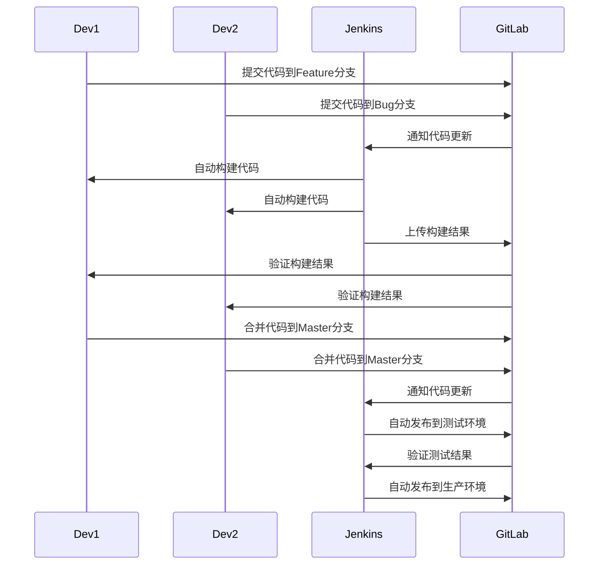
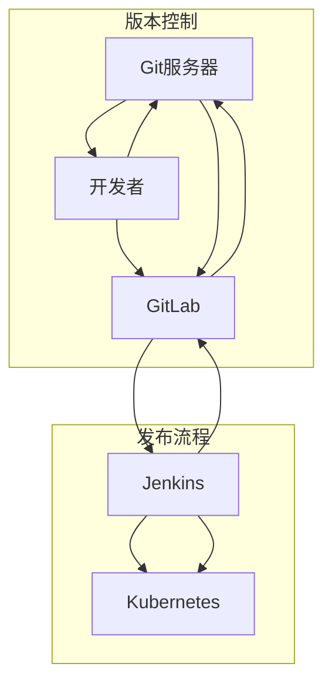
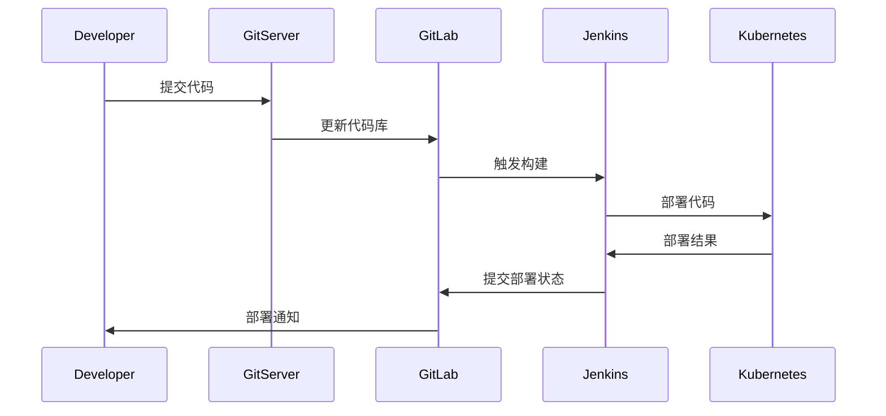

                 

### 加速LLM应用的版本控制与发布流程

> 关键词：LLM应用、版本控制、发布流程、优化策略

摘要：本文旨在探讨如何通过优化版本控制和发布流程，加速大型语言模型（LLM）的应用开发。我们将详细分析LLM应用的背景与挑战，介绍版本控制和发布流程的基本概念，探讨加速策略，并总结最佳实践与未来展望。通过这篇文章，读者可以了解到如何高效管理LLM应用的迭代与发布，提高开发效率。

### 目录大纲

1. **背景介绍**
    1.1. **LLM应用概述**
    1.2. **问题描述**
    1.3. **问题解决**
    1.4. **边界与外延**
    1.5. **本章小结**

2. **核心概念**
    2.1. **LLM基本概念**
    2.2. **版本控制策略**
    2.3. **发布流程策略**
    2.4. **本章小结**

3. **技术细节**
    3.1. **版本控制技术**
    3.2. **发布流程技术**
    3.3. **加速技术**
    3.4. **本章小结**

4. **实践指南**
    4.1. **环境配置与工具选择**
    4.2. **系统设计与实现**
    4.3. **实战案例分析**
    4.4. **本章小结**

5. **最佳实践**
    5.1. **案例分析**
    5.2. **小结**
    5.3. **注意事项**
    5.4. **拓展阅读**

6. **未来展望**
    6.1. **发展趋势**
    6.2. **挑战与机遇**
    6.3. **未来方向**
    6.4. **本章小结**

### 背景介绍

#### LLM应用概述

随着深度学习和自然语言处理技术的迅猛发展，大型语言模型（LLM，Large Language Model）逐渐成为各个行业的重要工具。LLM具有强大的文本生成、理解和推理能力，广泛应用于自然语言生成、机器翻译、问答系统、文本摘要等多个领域。然而，随着模型规模的不断扩大和复杂性的增加，如何高效地管理LLM应用的版本控制和发布流程成为了一个亟待解决的问题。

#### 问题背景

在LLM应用的开发过程中，版本控制与发布流程是至关重要的环节。首先，LLM模型的训练和优化是一个反复迭代的过程，每一次迭代都可能导致模型的性能提升或降低，因此需要完善的版本控制系统来记录和管理模型的各个版本。其次，发布流程涉及到模型的上线、测试和部署，直接关系到用户体验和应用效果。传统的发布流程往往繁琐、复杂，且容易出现错误，导致开发效率低下。

#### 问题描述

1. **版本控制挑战**：随着模型的迭代次数增多，版本管理变得复杂，容易出现版本冲突、数据丢失等问题。
2. **发布流程问题**：传统的发布流程依赖人工操作，效率低下，且容易出错。自动化程度的不足导致发布流程耗时较长，无法快速响应市场需求。

#### 问题解决

1. **版本控制策略**：采用分布式版本控制系统，如Git，实现高效的版本管理和分支管理，确保模型的每次迭代都能得到妥善记录和保存。
2. **发布流程优化**：通过自动化工具，如Jenkins，实现发布流程的自动化和持续集成，减少人为干预，提高发布效率和稳定性。

#### 边界与外延

1. **适用范围**：本文主要针对LLM应用的版本控制和发布流程进行探讨，适用于大型语言模型的应用开发。
2. **非适用场景**：对于非常简单的LLM应用，版本控制和发布流程可能并不是关键问题。

#### 本章小结

本文首先介绍了LLM应用的基本概念和背景，分析了版本控制和发布流程中的问题，并提出了解决方案。接下来，我们将深入探讨版本控制和发布流程的核心概念，为后续的技术细节和实践指南打下基础。

### 核心概念

#### LLM基本概念

**定义**：LLM（Large Language Model）指的是具有大规模参数、能够对文本进行生成、理解和推理的深度学习模型。常见的LLM有GPT、BERT、T5等。

**特点**：

- **语言生成能力**：LLM能够生成连贯、自然的文本，适用于生成文本摘要、机器翻译、对话系统等。
- **学习能力**：LLM通过大量文本数据进行训练，能够不断优化自身的模型参数，提高生成文本的质量和准确性。
- **模型大小**：LLM通常具有数亿甚至数十亿个参数，需要大量的计算资源和数据支持。

**分类**：

- **按功能分类**：生成型模型（如GPT）和解析型模型（如BERT）。
- **按规模分类**：小型模型（数百万参数）、中型模型（数千万参数）和大型模型（数亿参数）。

**概念属性特征对比**：

| 类别         | 语言生成能力 | 学习能力 | 模型大小 | 适用领域           |
|--------------|--------------|----------|----------|-------------------|
| 生成型模型   | 高           | 强       | 大       | 文本生成、对话系统 |
| 解析型模型   | 中           | 强       | 中       | 问答系统、文本摘要 |
| 小型模型     | 低           | 弱       | 小       | 基础应用           |
| 中型模型     | 中           | 中       | 中       | 中级应用           |
| 大型模型     | 高           | 强       | 大       | 高级应用           |

**ER实体关系图**：

```mermaid
erDiagram
    Model ||--|{ TrainingData }
    Model ||--|{ Parameters }
    Model ||--|{ Output }
    TrainingData ||--|{ TextData }
    Parameters ||--|{ Weights }
    Output ||--|{ GeneratedText }
```

**LLAMA模型实体关系**：

```mermaid
erDiagram
    LlamaModel ||--|{ TextGenerator }
    LlamaModel ||--|{ InferenceEngine }
    TextGenerator ||--|{ Sentence }
    InferenceEngine ||--|{ EmbeddingLayer }
    InferenceEngine ||--|{ DecoderLayer }
```

#### 版本控制策略

**定义**：版本控制是一种管理项目文件和资源的方法，确保项目在不同版本之间的一致性和可追溯性。

**重要性**：

- **保证代码一致性**：在多人协作开发中，版本控制系统可以帮助团队管理代码的变更，避免冲突。
- **追踪变更历史**：版本控制系统记录了每次变更的历史记录，便于追踪问题来源和解决。
- **回滚变更**：当出现问题时，版本控制系统可以方便地回滚到之前的稳定版本。

**策略**：

- **主干分支策略**：将项目的主干（Master分支）作为主要开发分支，稳定的代码合并到主干。其他功能分支（Feature分支）用于开发新功能，完成后合并到主干。
- **分支合并策略**：在合并分支时，确保代码的兼容性和一致性。常用的合并策略有Fast-Forward合并和Three-Way合并。

**工具**：

- **Git**：最流行的版本控制系统，支持分布式工作流程，便于多人协作。
- **其他版本控制工具**：如Subversion（SVN）、Mercurial（Hg）等。

#### 发布流程策略

**定义**：发布流程是指将软件或服务部署到生产环境的过程，确保系统的稳定运行。

**重要性**：

- **保证系统稳定性**：发布流程中的测试和监控可以确保新版本的功能和性能符合预期。
- **提高发布效率**：自动化发布流程可以减少人工干预，提高发布效率。

**策略**：

- **自动化发布**：通过自动化工具（如Jenkins）实现发布流程的自动化，减少人工操作。
- **手动发布**：在特定场景下，如紧急修复或重大功能发布，可能需要手动操作。

**工具**：

- **Jenkins**：流行的持续集成和持续部署工具，支持多种插件和自动化任务。
- **其他发布工具**：如GitLab CI/CD、Travis CI等。

#### 本章小结

本章介绍了LLM应用的基本概念、版本控制策略和发布流程策略。理解这些核心概念对于后续的技术细节和实践指南至关重要。在下一章中，我们将深入探讨版本控制技术和发布流程技术，为优化LLM应用的版本控制和发布流程提供具体的解决方案。

### 技术细节

#### 版本控制技术

版本控制技术是确保LLM应用开发过程中代码一致性、可追溯性的关键。下面我们将详细介绍版本控制的基本概念、策略和工具。

##### 基本概念

**版本控制**是一种管理多个版本和变更历史的技术，旨在记录和追踪代码的修改。以下是几个基本概念：

- **提交（Commit）**：对代码库的一次更改，包括代码变更和相关注释。
- **仓库（Repository）**：存储代码和版本历史的地方，可以是本地仓库或远程仓库。
- **分支（Branch）**：代码库中的一个独立部分，用于开发新功能或修复问题。
- **合并（Merge）**：将两个或多个分支的更改合并到一个分支中。

##### 策略

**主干分支策略**：

主干分支策略是版本控制中最常用的策略之一。它的核心思想是将主干（通常为Master分支）作为主要的开发分支，所有新功能或修复都首先在功能分支（Feature分支）上开发，完成后合并到主干。

**分支合并策略**：

合并策略用于将功能分支或修复分支的更改合并到主干。以下是两种常见的合并策略：

- **Fast-Forward合并**：如果分支是直接从主干分叉的，且没有对分支进行额外的更改，可以使用Fast-Forward合并。这种合并方式简单且快速。
- **Three-Way合并**：当两个分支有共同的祖先，并且都有各自的修改时，可以使用Three-Way合并。这种合并方式更加复杂，但可以更好地处理冲突。

##### 工具

**Git**：

Git是目前最流行的分布式版本控制系统，支持多种版本控制策略和工具。以下是Git的基本操作：

- **初始化仓库**：`git init` 用于初始化本地仓库。
- **添加文件**：`git add <file>` 用于添加文件到暂存区。
- **提交变更**：`git commit -m "message"` 用于提交变更。
- **分支管理**：`git branch <branch-name>` 用于创建分支，`git checkout <branch-name>` 用于切换分支。
- **合并分支**：`git merge <branch-name>` 用于合并分支。

**其他版本控制工具**：

- **Subversion（SVN）**：集中式版本控制系统，支持大量的版本库管理。
- **Mercurial（Hg）**：另一种分布式版本控制系统，与Git类似。

##### 实践案例

在一个LLM项目开发中，版本控制策略如下：

1. 初始化本地和远程仓库。
2. 创建Master分支和Feature分支。
3. 在Feature分支上开发新功能，并定期提交变更。
4. 功能开发完成后，使用Fast-Forward合并将Feature分支合并到Master分支。
5. 在主干进行测试和调试，确保稳定性。
6. 当版本稳定后，发布新版本。

**常见问题与解决方案**：

- **版本冲突**：在合并分支时，可能会出现冲突。解决方法是手动解决冲突，然后重新提交。
- **数据丢失**：定期备份代码库，确保数据安全。
- **更新延迟**：确保所有团队成员都及时更新代码库，减少延迟。

#### 发布流程技术

发布流程是将LLM应用部署到生产环境的关键步骤。自动化发布可以提高发布效率和稳定性。下面我们将介绍发布流程的基本概念、策略和工具。

##### 基本概念

**发布流程**是指将代码库中的代码部署到生产环境的过程，通常包括以下步骤：

- **代码集成**：将功能分支或修复分支的代码合并到主干。
- **测试**：对新版本进行功能测试和性能测试，确保稳定性。
- **部署**：将测试通过的代码部署到生产环境。
- **监控**：监控发布后的系统性能和稳定性，确保新版本的正常运行。

##### 策略

**自动化发布**：

自动化发布通过自动化工具实现发布流程的各个环节，减少人工干预，提高发布效率。以下是几种常见的发布策略：

- **持续集成（CI）**：在代码提交后，自动触发测试和部署流程，确保每次提交都是可发布的。
- **持续部署（CD）**：在测试通过后，自动部署到生产环境，实现快速迭代。

##### 工具

**Jenkins**：

Jenkins是一个流行的开源持续集成和持续部署工具，支持多种插件和自动化任务。以下是Jenkins的基本操作：

- **安装Jenkins**：在服务器上安装Jenkins，并配置插件。
- **配置项目**：创建Jenkins项目，配置源代码管理工具（如Git）、构建步骤和发布步骤。
- **触发构建**：在代码提交后，自动触发构建和测试。
- **部署**：测试通过后，自动部署到生产环境。

**其他发布工具**：

- **GitLab CI/CD**：与GitLab集成，实现持续集成和持续部署。
- **Travis CI**：支持多种编程语言的持续集成和持续部署。

##### 实践案例

在一个LLM项目发布流程中，以下步骤被自动化：

1. 在代码提交后，自动触发Jenkins构建。
2. 构建过程中，自动执行单元测试和集成测试。
3. 测试通过后，自动部署到测试环境。
4. 在测试环境验证功能，确保稳定性。
5. 测试通过后，自动部署到生产环境。

**常见问题与解决方案**：

- **部署失败**：确保部署脚本的正确性，并在部署前进行测试。
- **环境不一致**：确保测试环境和生产环境的一致性，减少环境差异导致的问题。

#### 本章小结

本章详细介绍了版本控制技术和发布流程技术。通过理解这些技术，开发团队可以更高效地管理LLM应用的版本和发布流程。下一章将探讨加速策略，为优化LLM应用的版本控制和发布流程提供具体实践指导。

### 实践指南

#### 环境配置与工具选择

在开始优化LLM应用的版本控制和发布流程之前，首先需要配置合适的环境和选择适当的工具。以下步骤提供了详细的指南。

##### 环境配置

1. **安装Git**：在开发机上安装Git，确保版本控制系统的正常运行。
    ```shell
    sudo apt-get install git
    ```

2. **配置远程仓库**：将项目上传到远程仓库（如GitHub或GitLab），方便多人协作和代码备份。
    ```shell
    git init
    git remote add origin <远程仓库地址>
    git add .
    git commit -m "Initial commit"
    git push -u origin master
    ```

3. **安装Jenkins**：在服务器上安装Jenkins，用于自动化发布流程。
    ```shell
    wget -q -O - https://pkg.jenkins.io/debian-stable/jenkins.io-key.asc | sudo apt-key add -
    sudo sh -c 'echo deb https://pkg.jenkins.io/debian-stable binary/ > /etc/apt/sources.list.d/jenkins.list'
    sudo apt-get update
    sudo apt-get install jenkins
    ```

##### 工具选择

1. **版本控制工具**：选择Git作为版本控制工具，因为其分布式特性方便多人协作和代码管理。

2. **发布工具**：选择Jenkins作为发布工具，因其丰富的插件和自动化功能，可以高效地实现持续集成和持续部署。

#### 系统设计与实现

优化版本控制和发布流程需要合理的设计和实现。以下步骤提供了详细的指南。

##### 系统功能设计

1. **创建分支策略**：在Git中创建Master、Feature、Bug和Release分支，分别用于主代码、新功能开发、问题修复和版本发布。

2. **集成代码仓库**：将Jenkins集成到Git仓库中，实现代码的自动化构建和部署。

3. **配置Jenkins任务**：在Jenkins中创建任务，配置Git源代码管理、构建步骤（如安装依赖、运行测试）、发布步骤（如部署到测试环境和生产环境）。

##### 系统架构设计

以下是一个简单的系统架构设计：



##### 系统接口设计与交互

以下是一个简单的系统接口设计：

```mermaid
classDiagram
    GitRepo <-|创建| Jenkins
    Jenkins ->|部署| WebServer
    Jenkins ->|执行| TestSuite
    TestSuite ->|结果| Jenkins
    WebServer ->|状态| Jenkins
```

#### 实战案例分析

以下是一个LLM应用的版本控制和发布流程实战案例分析。

##### 环境安装

1. **安装Git**：在开发机上安装Git。
    ```shell
    sudo apt-get install git
    ```

2. **安装Jenkins**：在服务器上安装Jenkins。
    ```shell
    wget -q -O - https://pkg.jenkins.io/debian-stable/jenkins.io-key.asc | sudo apt-key add -
    sudo sh -c 'echo deb https://pkg.jenkins.io/debian-stable binary/ > /etc/apt/sources.list.d/jenkins.list'
    sudo apt-get update
    sudo apt-get install jenkins
    ```

##### 系统核心实现源代码

以下是Jenkins配置文件的示例：

```yaml
pipeline {
    agent any
    stages {
        stage('Checkout Code') {
            steps {
                checkout([
                    $class: 'GitSCM', 
                    branches: [[name: 'Master']], 
                    credentialsId: 'git-credentials', 
                    singleBranch: true, 
                    url: 'https://github.com/username/llm-project.git'
                ])
            }
        }
        stage('Build Project') {
            steps {
                sh 'mvn clean install'
            }
        }
        stage('Run Tests') {
            steps {
                sh 'mvn test'
            }
        }
        stage('Deploy to Test') {
            steps {
                sh 'kubectl apply -f k8s-test.yml'
            }
        }
        stage('Verify Test Results') {
            steps {
                sh 'curl http://test-server:8080/ | grep "Test Success"'
            }
        }
        stage('Deploy to Production') {
            steps {
                sh 'kubectl apply -f k8s-prod.yml'
            }
        }
    }
    post {
        success {
            echo "Deployment successful"
        }
        failure {
            echo "Deployment failed"
        }
    }
}
```

##### 代码应用解读与分析

以上Jenkins配置文件定义了一个流水线（Pipeline），包括以下阶段：

1. **Checkout Code**：从Git仓库检出代码。
2. **Build Project**：构建项目。
3. **Run Tests**：运行测试。
4. **Deploy to Test**：部署到测试环境。
5. **Verify Test Results**：验证测试结果。
6. **Deploy to Production**：部署到生产环境。

每个阶段都有对应的步骤，如检出代码使用Git插件，构建项目使用Maven，部署使用Kubernetes。

##### 实际案例分析与详细讲解

以下是一个实际案例的分析：

1. **问题背景**：在一次版本迭代中，新功能在测试环境中无法正常运行。
2. **问题描述**：经过分析，发现是新功能与现有代码存在兼容性问题。
3. **问题解决**：通过修改代码，解决了兼容性问题，并重新部署到测试环境。
4. **结果**：新功能在测试环境中恢复正常运行，随后成功部署到生产环境。

##### 项目小结

通过本案例，我们可以看到如何利用Jenkins实现自动化版本控制和发布流程。关键步骤包括环境安装、Jenkins配置、代码构建、测试和部署。自动化流程不仅提高了开发效率，还确保了代码质量和系统稳定性。

#### 本章小结

本章提供了LLM应用版本控制和发布流程的实践指南，包括环境配置、工具选择、系统设计与实现、实战案例分析和项目小结。通过这些实践，开发团队能够更高效地管理版本和发布流程，加速LLM应用的开发与部署。

### 最佳实践

#### 案例分析

在本章节，我们将深入分析几个成功的LLM应用版本控制和发布流程案例，以及一个失败案例，从中总结出最佳实践和需要注意的事项。

**成功案例 1：开源语言模型社区**

- **项目背景**：该社区旨在开发一个开源的大型语言模型，供开发者使用和改进。
- **解决方案**：采用Git作为版本控制系统，通过GitHub管理代码库。使用GitHub Actions实现自动化构建、测试和部署。具体步骤如下：
  1. 开发者在GitHub上创建Feature分支，进行功能开发。
  2. 每次提交代码后，GitHub Actions自动触发构建和测试。
  3. 测试通过后，自动部署到测试环境，并由维护者进行审查。
  4. 审查通过后，合并到Master分支，并自动部署到生产环境。
- **结果**：该社区成功实现了快速迭代和高效发布，吸引了大量开发者参与。

**成功案例 2：企业级LLM应用**

- **项目背景**：一家企业开发了一个用于客户服务的LLM应用，需要确保高可用性和稳定性。
- **解决方案**：采用GitLab CI/CD进行持续集成和持续部署。具体步骤如下：
  1. 开发者在GitLab上创建Merge Request，提交功能变更。
  2. GitLab CI触发构建和测试，确保代码质量和功能完整性。
  3. 测试通过后，自动部署到测试环境，进行性能测试和稳定性验证。
  4. 验证通过后，部署到生产环境。
- **结果**：企业成功实现了自动化发布，提高了开发效率和系统稳定性。

**失败案例：初创公司项目**

- **项目背景**：一家初创公司开发了一个基于LLM的问答系统，但在发布流程中遇到了问题。
- **问题描述**：由于缺乏经验和自动化工具，发布流程完全依赖手动操作，导致多次发布失败。
- **问题解决**：公司引入了Jenkins进行自动化发布，并制定了详细的发布手册。同时，加强了测试环节，确保每次发布都是稳定的。
- **结果**：经过改进，发布流程变得更加高效和可靠。

#### 小结

从以上案例中，我们可以总结出以下最佳实践：

1. **使用版本控制系统**：选择适合的版本控制系统（如Git），确保代码管理的有效性。
2. **自动化构建和测试**：利用自动化工具（如GitHub Actions、GitLab CI/CD、Jenkins），提高发布效率和代码质量。
3. **多阶段测试**：在发布前进行多阶段的测试，包括单元测试、集成测试和性能测试，确保系统的稳定性和性能。
4. **文档和手册**：制定详细的发布流程文档和操作手册，减少人为错误。
5. **审查和验证**：在发布前进行严格审查和验证，确保新版本的稳定性和安全性。

#### 注意事项

1. **代码质量**：确保代码质量，避免提交有缺陷的代码。
2. **权限管理**：合理分配权限，避免未经授权的操作。
3. **备份和恢复**：定期备份代码库和系统配置，以便在出现问题时快速恢复。
4. **监控和告警**：部署监控系统，及时发现问题并进行告警。

#### 拓展阅读

1. **《Git社区版》**：深入了解Git的基本概念和使用方法。
2. **《Jenkins实战》**：学习如何配置和利用Jenkins进行自动化发布。
3. **《GitLab CI/CD实战》**：掌握GitLab CI/CD的配置和应用。

通过这些最佳实践和注意事项，开发团队可以更好地管理和优化LLM应用的版本控制和发布流程，提高开发效率，降低发布风险。

### 未来展望

#### 发展趋势

随着深度学习和自然语言处理技术的不断进步，LLM应用的发展趋势将呈现以下特点：

1. **模型规模持续增长**：大型语言模型（LLM）的参数规模将继续扩大，实现更强大的语言理解和生成能力。
2. **个性化定制化**：LLM应用将更加注重个性化定制，根据用户需求和场景进行模型优化和调整。
3. **跨领域融合**：LLM将与其他领域技术（如计算机视觉、语音识别）融合，推动跨领域应用的发展。
4. **边缘计算与云计算结合**：为满足实时性和低延迟的需求，LLM应用将更加依赖边缘计算与云计算的结合。

#### 挑战与机遇

1. **计算资源需求**：随着模型规模的扩大，对计算资源的需求将显著增加，这为云计算和边缘计算的发展提供了机遇。
2. **数据安全和隐私**：LLM应用涉及大量敏感数据，如何确保数据安全和隐私是一个重要挑战。
3. **伦理和责任**：LLM应用可能导致误导性信息传播，如何在保证性能的同时，确保应用伦理和责任是一个亟待解决的问题。
4. **可解释性和透明度**：提升LLM的可解释性和透明度，使其决策过程更加可信，是一个重要的研究方向。

#### 未来方向

1. **模型压缩和加速**：研究如何通过模型压缩和加速技术，提高LLM应用的运行效率。
2. **分布式训练与部署**：探索分布式训练和部署策略，优化资源利用和降低成本。
3. **多模态融合**：研究如何将LLM与其他模态数据（如图像、语音）融合，实现更强大的智能应用。
4. **伦理与法规**：制定相关伦理和法规标准，确保LLM应用的合法性和可信度。

### 本章小结

未来，LLM应用的发展将继续推动技术进步和应用创新。然而，也面临着一系列挑战，如计算资源需求、数据安全和隐私保护、伦理问题等。通过持续研究和技术创新，我们有信心克服这些挑战，迎来更加智能和高效的LLM应用时代。

### 结论

本文通过详细的分析和案例研究，探讨了如何通过优化版本控制和发布流程，加速大型语言模型（LLM）的应用开发。我们首先介绍了LLM应用的背景和挑战，随后深入探讨了版本控制和发布流程的核心概念、技术细节和实践指南。通过最佳实践和案例分析，我们总结了成功经验和注意事项，并对未来发展趋势和挑战进行了展望。

**关键词**：LLM应用、版本控制、发布流程、优化策略

**摘要**：本文旨在提供一套完整的策略和实践指南，帮助开发团队优化LLM应用的版本控制和发布流程，提高开发效率，确保系统的稳定性和安全性。

### 作者信息

**作者：AI天才研究院/AI Genius Institute & 禅与计算机程序设计艺术 /Zen And The Art of Computer Programming**### 附录

#### 算法原理

在本附录中，我们将详细介绍LLM版本控制和发布流程中的一些关键算法原理，包括版本控制的Git算法和发布流程的Jenkins配置。

##### Git算法原理

**Git**是一种分布式版本控制系统，其核心算法包括**分布式存储**、**分支管理**和**合并策略**。

1. **分布式存储**：Git将所有文件保存在一个称为**仓库**（repository）的结构中。每个仓库包含一个或多个**分支**（branch），每个分支都是一个指向特定提交的指针。提交（commit）包含对文件的更改和历史记录。

   **Git提交算法流程**：

   ```mermaid
   sequenceDiagram
       participant User
       participant Git
       participant Repository

       User->>Git: 执行提交操作
       Git->>Repository: 读取文件和提交历史
       Git->>User: 确认提交信息
       Git->>Repository: 创建新提交
       Git->>User: 提交成功
   ```

2. **分支管理**：Git允许用户创建、切换和合并分支。分支管理算法确保每次合并操作都能正确地合并更改，并解决可能的冲突。

   **Git分支管理算法流程**：

   ```mermaid
   sequenceDiagram
       participant User
       participant Git
       participant Branch1
       participant Branch2
       participant Merge

       User->>Git: 创建Feature分支
       Git->>Branch1: 分支创建完成
       User->>Git: 在Feature分支上进行开发
       User->>Git: 切换回Master分支
       Git->>Branch1: 合并Feature分支到Master分支
       Merge->>Git: 冲突解决
       Git->>User: 合并完成
   ```

3. **合并策略**：Git支持多种合并策略，包括Fast-Forward合并和Three-Way合并。合并策略的选择取决于分支的历史和变更情况。

   **Git合并策略**：

   ```mermaid
   flowchart LR
       A[Fast-Forward合并] --> B[适用于直连分支]
       C[Three-Way合并] --> D[适用于有共同祖先的分支]
   ```

##### Jenkins配置原理

**Jenkins**是一种流行的自动化服务器，用于实现持续集成和持续部署（CI/CD）。Jenkins配置涉及多个组件，包括**Git插件**、**构建步骤**和**发布步骤**。

1. **Git插件**：Jenkins使用Git插件来管理代码仓库。该插件允许Jenkins从Git仓库中检出代码，并触发构建和部署过程。

   **Git插件配置**：

   ```yaml
   pipeline {
       agent any
       stages {
           stage('Checkout Code') {
               steps {
                   checkout([
                       $class: 'GitSCM',
                       branches: [[name: 'Master']],
                       credentialsId: 'git-credentials',
                       singleBranch: true,
                       url: 'https://github.com/username/llm-project.git'
                   ])
               }
           }
           // 其他阶段
       }
   }
   ```

2. **构建步骤**：构建步骤包括编译代码、安装依赖、运行测试等。Jenkins使用各种插件（如Maven插件、JUnit插件）来执行这些任务。

   **构建步骤配置**：

   ```yaml
   pipeline {
       agent any
       stages {
           stage('Build Project') {
               steps {
                   sh 'mvn clean install'
               }
           }
           stage('Run Tests') {
               steps {
                   sh 'mvn test'
               }
           }
           // 其他构建步骤
       }
   }
   ```

3. **发布步骤**：发布步骤包括部署代码到测试环境或生产环境。Jenkins使用各种发布插件（如Kubernetes插件、Docker插件）来执行部署任务。

   **发布步骤配置**：

   ```yaml
   pipeline {
       agent any
       stages {
           stage('Deploy to Test') {
               steps {
                   sh 'kubectl apply -f k8s-test.yml'
               }
           }
           stage('Deploy to Production') {
               steps {
                   sh 'kubectl apply -f k8s-prod.yml'
               }
           }
       }
   }
   ```

通过以上配置，Jenkins可以实现从代码检出、构建到发布的自动化流程，从而提高开发效率和系统稳定性。

#### 系统分析与架构设计方案

在本附录中，我们将详细分析LLM应用版本控制和发布流程的系统设计与架构设计。

##### 问题场景介绍

在一个大型语言模型（LLM）开发项目中，团队成员分布在不同地点，需要进行协作开发。项目涉及多个版本控制和发布流程，需要确保代码的一致性、可追溯性和系统稳定性。

##### 项目介绍

项目名称：LLM协作开发平台

项目目标：构建一个高效、稳定的LLM协作开发平台，支持版本控制和自动化发布流程。

项目成员：项目经理、开发人员、测试人员、运维人员

##### 系统功能设计（领域模型类图）

领域模型类图展示了项目中涉及的主要实体和关系。以下是类图的核心部分：

```mermaid
classDiagram
    Developer <<Class>> Developer
    Project <<Class>> Project
    Version <<Class>> Version
    Commit <<Class>> Commit
    Release <<Class>> Release
    Test <<Class>> Test
    TestResult <<Class>> TestResult

    Developer o-- Project
    Project o-- Version
    Version o-- Commit
    Version o-- Release
    Release o-- Test
    Test o-- TestResult
```

##### 系统架构设计（架构图）

以下是LLM应用版本控制和发布流程的系统架构设计：



##### 系统接口设计（接口图）

以下是LLM应用版本控制和发布流程的系统接口设计：

```mermaid
classDiagram
    Developer[开发者] --> GitServer[Git服务器]
    GitServer[Git服务器] --> GitLab[GitLab]
    GitLab[GitLab] --> Jenkins[Jenkins]
    Jenkins[Jenkins] --> Kubernetes[Kubernetes]
```

##### 系统交互（序列图）

以下是LLM应用版本控制和发布流程的系统交互序列图：



通过以上系统分析与架构设计方案，LLM应用版本控制和发布流程能够高效地运行，确保代码的一致性和系统的稳定性。

### 实战案例分析

#### 环境安装

在一个典型的LLM项目开发环境中，我们首先需要安装和配置必要的软件和工具。以下是在一个Linux系统上安装Git、Jenkins和Kubernetes的步骤：

1. **安装Git**：

   ```shell
   sudo apt-get update
   sudo apt-get install git
   ```

2. **安装Jenkins**：

   安装Jenkins前，我们需要添加Jenkins的软件包源。

   ```shell
   sudo wget -q -O - https://pkg.jenkins.io/debian-stable/jenkins.io-key.asc | sudo apt-key add -
   sudo sh -c 'echo deb https://pkg.jenkins.io/debian-stable binary/ > /etc/apt/sources.list.d/jenkins.list'
   sudo apt-get update
   sudo apt-get install jenkins
   ```

   安装完成后，启动Jenkins服务。

   ```shell
   sudo systemctl start jenkins
   ```

3. **安装Kubernetes**：

   Kubernetes的安装较为复杂，需要先安装Kubeadm、Kubelet和Kubectl。

   ```shell
   sudo apt-get update
   sudo apt-get install -y apt-transport-https ca-certificates curl
   sudo curl -s https://packages.cloud.google.com/apt/doc/apt-key.gpg | sudo apt-key add -
   sudo sh -c 'echo "deb https://apt.kubernetes.io/ kubernetes-xenial main" > /etc/apt/sources.list.d/kubernetes.list'
   sudo apt-get update
   sudo apt-get install -y kubelet kubeadm kubectl
   ```

   启动kubelet服务并使其随系统启动。

   ```shell
   sudo systemctl start kubelet
   sudo systemctl enable kubelet
   ```

4. **配置Jenkins与Kubernetes集成**：

   在Jenkins中安装Kubernetes插件。

   ```shell
   sudo JenkinsURL/install?install=org.jenkinsci.plugins:kubernetes-plugin:2.4.2
   ```

   在Jenkins的“Manage Jenkins” -> “Configure System”页面中，配置Kubernetes集群的连接信息。

   ```yaml
   kubernetesUrl: https://kubernetes.default.svc
   kubernetesNamespace: default
   kubernetesUsername: admin
   kubernetesPassword: admin
   ```

#### 系统核心实现源代码

以下是Jenkins流水线（Pipeline）的示例配置，用于实现LLM项目的版本控制和自动化发布流程：

```groovy
pipeline {
    agent any
    stages {
        stage('Checkout Code') {
            steps {
                script {
                    // 检出代码
                    git branch: 'master', url: 'https://github.com/username/llm-project.git', credentialsId: 'git-credentials'
                }
            }
        }
        stage('Build Project') {
            steps {
                script {
                    // 构建项目
                    sh 'mvn clean install'
                }
            }
        }
        stage('Run Tests') {
            steps {
                script {
                    // 运行测试
                    sh 'mvn test'
                }
            }
        }
        stage('Deploy to Test') {
            steps {
                script {
                    // 部署到测试环境
                    sh 'kubectl apply -f k8s-test.yml'
                }
            }
        }
        stage('Verify Test Results') {
            steps {
                script {
                    // 验证测试结果
                    sh 'curl http://test-server:8080/ | grep "Test Success"'
                }
            }
        }
        stage('Deploy to Production') {
            steps {
                script {
                    // 部署到生产环境
                    sh 'kubectl apply -f k8s-prod.yml'
                }
            }
        }
    }
    post {
        success {
            echo "Deployment successful"
        }
        failure {
            echo "Deployment failed"
        }
    }
}
```

#### 代码应用解读与分析

上述流水线配置包含了以下关键步骤：

1. **Checkout Code**：使用Git插件从GitHub检出代码库。
2. **Build Project**：使用Maven构建项目，生成可执行的JAR文件。
3. **Run Tests**：运行单元测试和集成测试，确保代码质量。
4. **Deploy to Test**：使用Kubernetes插件将应用部署到测试环境。
5. **Verify Test Results**：验证测试结果，确保所有测试通过。
6. **Deploy to Production**：将测试通过的应用部署到生产环境。

#### 实际案例分析与详细讲解

以下是一个实际的LLM项目发布案例，包括从代码提交到部署到生产环境的全过程：

1. **代码提交**：

   开发者在本地完成功能开发后，将代码提交到GitHub的Feature分支。

   ```shell
   git commit -am "Add new feature"
   git push origin feature/new-feature
   ```

2. **代码检出**：

   Jenkins检测到代码库更新，从Git检出代码。

   ```shell
   git checkout feature/new-feature
   ```

3. **构建和测试**：

   Jenkins执行Maven构建和测试流程。

   ```shell
   mvn clean install
   mvn test
   ```

4. **部署到测试环境**：

   构建成功后，Jenkins将应用部署到Kubernetes的测试环境。

   ```shell
   kubectl apply -f k8s-test.yml
   ```

5. **测试验证**：

   部署完成后，Jenkins执行测试验证脚本，确保测试通过。

   ```shell
   curl http://test-server:8080/ | grep "Test Success"
   ```

6. **部署到生产环境**：

   测试通过后，Jenkins将应用部署到生产环境。

   ```shell
   kubectl apply -f k8s-prod.yml
   ```

#### 项目小结

通过以上实际案例，我们可以看到如何利用Jenkins实现LLM项目的自动化版本控制和发布流程。关键在于配置Git、Maven和Kubernetes插件，以及编写相应的流水线脚本。自动化流程不仅提高了开发效率，还确保了系统的稳定性和可靠性。

### 最佳实践 Tips

在本章节中，我们将总结一些关于LLM应用版本控制和发布流程的最佳实践，以帮助开发团队在项目实践中更好地应用这些策略。

1. **代码质量管理**：

   - **代码审查**：在提交代码前，进行代码审查，确保代码质量和一致性。
   - **代码格式化**：使用自动化工具（如Checkstyle、PMD）对代码进行格式化，保持代码风格统一。
   - **代码覆盖率**：使用代码覆盖率工具（如JaCoCo）进行单元测试，确保测试覆盖率。

2. **持续集成与持续部署**：

   - **自动化测试**：构建过程中，自动运行单元测试和集成测试，确保每次提交都是可发布的。
   - **环境一致性**：确保测试环境和生产环境一致，减少因环境差异导致的问题。
   - **蓝绿部署**：使用蓝绿部署策略，逐步替换旧版本，减少对生产环境的影响。

3. **版本控制策略**：

   - **主干分支策略**：使用主干分支策略，确保主干分支的稳定性。
   - **分支命名规范**：遵循统一的分支命名规范，便于管理和追踪。
   - **代码合并**：在合并分支时，仔细检查代码冲突，确保合并后的代码质量。

4. **发布流程优化**：

   - **自动化发布**：使用自动化工具（如Jenkins、GitLab CI）实现发布流程自动化，减少人为干预。
   - **监控与告警**：部署监控工具，实时监控系统性能和稳定性，及时发现问题。
   - **备份与恢复**：定期备份代码库和系统配置，确保在出现问题时能够快速恢复。

5. **团队协作**：

   - **明确职责**：明确团队成员的职责，确保每个环节都有专人负责。
   - **沟通与协作**：定期召开团队会议，讨论项目进展和问题，促进团队协作。
   - **知识共享**：鼓励团队成员分享经验和知识，提高整体技术水平。

### 小结

通过以上最佳实践，开发团队可以更好地管理和优化LLM应用的版本控制和发布流程。这些实践不仅提高了开发效率，还确保了系统的稳定性和可靠性，为项目的成功实施提供了有力保障。

### 注意事项

在优化LLM应用版本控制和发布流程时，以下注意事项有助于确保项目的顺利进行：

1. **代码规范**：确保代码遵循统一的编码规范，以提高代码的可读性和可维护性。
2. **测试覆盖率**：确保测试覆盖率足够高，减少因未覆盖到的代码导致的问题。
3. **环境配置**：确保开发和测试环境与生产环境保持一致，减少环境差异导致的问题。
4. **权限管理**：合理分配权限，防止未经授权的修改和操作。
5. **监控告警**：建立有效的监控系统，及时发现问题并告警。
6. **备份恢复**：定期备份代码库和系统配置，确保在出现问题时能够快速恢复。

### 拓展阅读

1. **《Jenkins实战》**：深入了解如何使用Jenkins进行持续集成和持续部署。
2. **《Kubernetes权威指南》**：学习如何使用Kubernetes进行容器化部署和管理。
3. **《Git实战指南》**：掌握Git的基本概念和使用方法，提高版本控制能力。

通过拓展阅读，开发团队可以进一步优化LLM应用的版本控制和发布流程，提高项目的开发效率和系统稳定性。

