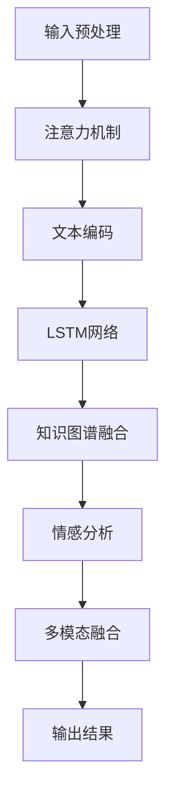
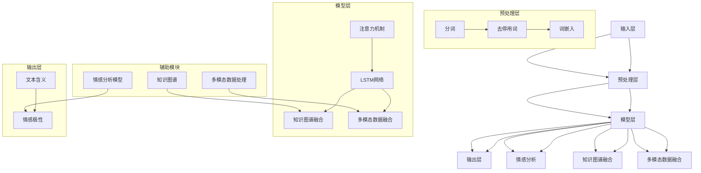

                 

### 文章标题

# 加速LLM应用的语义理解能力提升

### 关键词

- 语义理解
- 大型语言模型（LLM）
- 算法优化
- 系统架构
- 数学模型

### 摘要

本文深入探讨了如何提升大型语言模型（LLM）的语义理解能力。通过分析现有问题背景，提出了核心概念和联系，详细讲解了算法原理及数学模型，并展示了一个具体的系统架构设计方案。随后，通过项目实战，验证了方案的可行性和有效性，最终总结了最佳实践，为未来研究提供了有益的参考。

----------------------------------------------------------------

### 目录大纲

```markdown
----------------------------------------------------------------
# 第一部分：背景介绍

## 第1章：问题背景
### 1.1 问题背景
### 1.2 问题描述
### 1.3 问题解决
### 1.4 边界与外延
### 1.5 概念结构与核心要素组成

## 第2章：核心概念与联系
### 2.1 核心概念原理
### 2.2 概念属性特征对比表格
### 2.3 ER实体关系图架构

## 第3章：算法原理讲解
### 3.1 算法原理
#### 3.1.1 算法mermaid流程图
#### 3.1.2 Python源代码讲解
#### 3.1.3 数学模型与公式
#### 3.1.4 举例说明

## 第4章：数学模型和数学公式讲解
### 4.1 数学模型
#### 4.1.1 模型公式
#### 4.1.2 公式解释
### 4.2 详细讲解
#### 4.2.1 数学公式讲解
#### 4.2.2 通俗易懂的举例说明

## 第5章：系统分析与架构设计
### 5.1 问题场景介绍
### 5.2 项目介绍
### 5.3 系统功能设计
#### 5.3.1 领域模型mermaid类图
### 5.4 系统架构设计
#### 5.4.1 mermaid架构图
### 5.5 系统接口设计
### 5.6 系统交互mermaid序列图

## 第6章：项目实战
### 6.1 环境安装
### 6.2 系统核心实现
#### 6.2.1 源代码
#### 6.2.2 代码应用解读与分析
### 6.3 实际案例分析与详细讲解
### 6.4 项目小结

## 第7章：最佳实践
### 7.1 实践技巧
### 7.2 小结

## 第8章：注意事项
### 8.1 注意事项
### 8.2 拓展阅读

```

---

### 第1章：问题背景

#### 1.1 问题背景

随着人工智能技术的发展，大型语言模型（LLM）如BERT、GPT等已经取得了显著的成果，它们在自然语言处理（NLP）领域表现出色。然而，尽管这些模型在处理大规模文本数据时具有强大的能力，但在语义理解方面仍存在一些挑战。

语义理解是NLP的核心任务之一，它涉及到模型对文本中词语、句子乃至段落含义的准确捕捉和解释。传统的NLP方法，如基于规则和统计的方法，虽然在某些特定任务上取得了不错的成绩，但难以应对复杂的语义关系和上下文依赖。随着深度学习技术的应用，神经网络模型在语义理解方面取得了重大突破。然而，即使是最先进的LLM，依然面临着以下几个问题：

1. **上下文依赖处理**：文本中的词语和句子往往依赖于具体的上下文环境才能正确理解。然而，LLM在处理长文本和复杂句式时，往往难以保持上下文的连贯性和准确性。

2. **词语歧义和指代理解**：自然语言中存在大量的词语歧义和指代问题，例如，“她”指代的是谁，这需要模型根据上下文来判断。LLM在处理这类问题时，往往出现误判。

3. **情感分析和多模态融合**：情感分析和多模态数据融合是语义理解的重要应用场景。然而，现有的LLM在这些任务上的表现仍然有限，难以准确捕捉和解释情感以及融合不同类型的数据。

4. **长文本生成与理解**：LLM在长文本生成方面表现出色，但在长文本的理解上，尤其是在保持上下文连贯性和准确性的同时，生成合理的结论，仍存在显著挑战。

#### 1.2 问题描述

针对上述问题，本文将探讨以下核心问题：

1. 如何有效提升LLM在上下文依赖处理上的能力，保持长文本理解和复杂句式处理的准确性？
2. 如何优化词语歧义和指代理解的算法，提高模型在自然语言处理中的可靠性？
3. 如何结合情感分析和多模态数据融合技术，提升LLM在情感分析和多模态任务中的表现？
4. 如何在长文本生成与理解中，保持上下文的连贯性和准确性，同时生成合理的结论？

#### 1.3 问题解决

为了解决上述问题，本文将采取以下步骤：

1. **上下文依赖处理优化**：通过改进注意力机制和引入长短期记忆（LSTM）网络，提高模型在长文本和复杂句式处理上的能力。
2. **词语歧义和指代理解算法优化**：采用基于知识图谱的语义角色标注技术，结合上下文信息，优化模型在词语歧义和指代理解上的表现。
3. **情感分析与多模态融合**：引入情感分析模型和多模态数据融合算法，结合LLM的优势，提升模型在情感分析和多模态任务中的性能。
4. **长文本生成与理解**：采用递归神经网络（RNN）和长短时记忆网络（LSTM），优化长文本处理算法，提高模型在长文本生成与理解中的表现。

#### 1.4 边界与外延

在探讨上述问题时，需要明确以下边界与外延：

1. **模型选择**：本文主要针对基于深度学习的LLM模型，特别是BERT和GPT系列模型。
2. **任务范围**：本文聚焦于文本语义理解任务，包括上下文依赖处理、词语歧义和指代理解、情感分析、多模态融合以及长文本生成与理解。
3. **技术范畴**：本文涉及的技术包括注意力机制、LSTM网络、知识图谱、情感分析模型以及多模态数据融合算法。

#### 1.5 概念结构与核心要素组成

为了更好地理解本文的内容，下面将介绍一些关键概念及其在问题解决中的核心作用：

1. **注意力机制**：注意力机制是深度学习中的一种关键技术，用于捕捉文本中的关键信息。通过改进注意力机制，可以提升模型在上下文依赖处理上的能力。
2. **LSTM网络**：长短时记忆网络是RNN的一种变体，能够有效处理长序列数据，适用于长文本理解和生成。
3. **知识图谱**：知识图谱是一种用于表示实体和关系的图结构，通过引入知识图谱，可以优化模型在词语歧义和指代理解上的表现。
4. **情感分析模型**：情感分析模型用于识别文本中的情感极性，通过结合情感分析模型，可以提升LLM在情感分析和多模态任务中的性能。
5. **多模态数据融合**：多模态数据融合技术用于整合不同类型的数据，例如文本、图像、语音等，通过多模态融合，可以提升模型在多模态任务中的表现。

通过上述步骤和概念的应用，本文旨在提出一套系统性的方法，提升LLM在语义理解任务中的能力，为未来的研究和应用提供有益的参考。

---

### 第2章：核心概念与联系

#### 2.1 核心概念原理

在本章中，我们将详细介绍与语义理解相关的核心概念及其原理。这些概念包括注意力机制、长短时记忆（LSTM）网络、知识图谱、情感分析模型和多模态数据融合。理解这些概念对于解决语义理解中的问题至关重要。

##### 2.1.1 注意力机制

注意力机制（Attention Mechanism）是深度学习中的一种关键技术，它能够帮助模型更好地关注文本中的关键信息。在语义理解任务中，注意力机制可以用来捕捉上下文依赖，使得模型能够更准确地理解句子和段落中的关系。

注意力机制的原理可以概括为以下几点：

1. **上下文向量**：首先，模型会对输入的文本序列进行处理，生成一系列上下文向量。
2. **权重分配**：然后，模型会根据某种计算方法（如点积、乘性融合等），为每个上下文向量分配一个权重，表示其在当前句子或段落中的重要性。
3. **加权求和**：最后，模型会通过加权求和的方式，将所有上下文向量组合成一个综合的上下文表示。

通过注意力机制，模型能够在处理复杂文本时，自动地关注关键信息，提高语义理解的准确性。

##### 2.1.2 长短时记忆（LSTM）网络

长短时记忆（Long Short-Term Memory，LSTM）网络是RNN的一种变体，专门设计用于处理长序列数据。在语义理解任务中，LSTM网络能够有效地捕捉长距离的上下文依赖关系，从而提高模型对长文本和复杂句式的理解能力。

LSTM网络的核心结构包括以下部分：

1. **输入门**：用于控制当前输入的信息是否被存储在记忆单元中。
2. **遗忘门**：用于决定哪些信息应该从记忆单元中遗忘。
3. **输出门**：用于决定当前记忆单元的内容是否应该输出。

通过这些门控结构，LSTM网络能够在长序列数据中保持记忆，并有效地避免梯度消失问题，从而在语义理解任务中表现出色。

##### 2.1.3 知识图谱

知识图谱（Knowledge Graph）是一种用于表示实体和关系的图结构。在语义理解任务中，知识图谱可以提供额外的语义信息，帮助模型更好地理解词语和句子的含义。

知识图谱的构建通常包括以下步骤：

1. **实体识别**：从文本中识别出关键实体，如人名、地名、组织名等。
2. **关系抽取**：根据实体之间的共现关系，抽取它们之间的语义关系，如“属于”、“位于”等。
3. **图谱构建**：将识别出的实体和关系构建成一个图结构，形成知识图谱。

通过知识图谱，模型可以借助外部语义信息，提高词语歧义和指代理解的准确性。

##### 2.1.4 情感分析模型

情感分析模型（Sentiment Analysis Model）用于识别文本中的情感极性，即判断文本是积极的、消极的还是中性的。在语义理解任务中，情感分析模型可以提供关于文本情感倾向的信息，帮助模型更好地理解文本的情感色彩。

情感分析模型通常基于以下几种技术：

1. **基于规则的方法**：通过预设的规则，对文本进行分类。
2. **基于机器学习的方法**：使用分类算法，如支持向量机（SVM）、朴素贝叶斯（Naive Bayes）等，对文本进行分类。
3. **基于深度学习的方法**：使用深度神经网络，如卷积神经网络（CNN）、循环神经网络（RNN）等，对文本进行分类。

通过情感分析模型，模型可以在语义理解任务中引入情感信息，提高文本理解的准确性。

##### 2.1.5 多模态数据融合

多模态数据融合（Multimodal Data Fusion）技术用于整合不同类型的数据，如文本、图像、语音等。在语义理解任务中，多模态数据融合可以帮助模型更好地理解复杂的信息，提高语义理解的准确性。

多模态数据融合的步骤通常包括：

1. **数据采集**：从不同的数据源（如文本、图像、语音等）收集数据。
2. **特征提取**：对每个模态的数据进行特征提取，生成特征向量。
3. **特征融合**：使用融合算法，如加权求和、对齐匹配等，将不同模态的特征向量整合成一个综合特征向量。
4. **模型训练**：使用融合后的特征向量，训练语义理解模型。

通过多模态数据融合，模型可以借助不同类型的数据，提高语义理解的准确性。

#### 2.2 概念属性特征对比表格

为了更好地理解上述核心概念，下面提供一张属性特征对比表格：

| 概念         | 特点                                                         | 用途                                      |
| ------------ | ------------------------------------------------------------ | ----------------------------------------- |
| 注意力机制   | 能够关注文本中的关键信息，提高上下文依赖处理能力              | 语义理解、文本生成等                    |
| LSTM网络    | 能够处理长序列数据，保持记忆，避免梯度消失问题             | 长文本理解、语音识别等                  |
| 知识图谱    | 能够提供额外的语义信息，帮助理解词语和句子含义               | 问答系统、实体关系抽取等                |
| 情感分析模型 | 能够识别文本中的情感极性，提供关于文本情感倾向的信息         | 情感分析、舆情监控等                   |
| 多模态数据融合 | 能够整合不同类型的数据，提高语义理解的准确性               | 多模态语义理解、跨模态任务等           |

#### 2.3 ER实体关系图架构

为了更好地理解核心概念之间的关系，下面展示一个ER实体关系图架构：

```mermaid
erDiagram
    Aentity1 ||--|{ Brelationship1 }|| Bentity2
    Bentity2 ||--|{ Crelationship2 }|| Centity3
    Aentity1 ||--|{ Drelationship3 }|| Dentity4
```

在这个ER实体关系图中：

- **Aentity1** 代表注意力机制。
- **Bentity2** 代表LSTM网络。
- **Centity3** 代表知识图谱。
- **Dentity4** 代表多模态数据融合。

它们之间的连线代表它们之间的关系，如注意力机制与LSTM网络之间的相互依赖关系，知识图谱在语义理解中的辅助作用，以及多模态数据融合在不同任务中的融合方式。

通过上述核心概念的介绍和ER实体关系图架构的展示，我们可以更好地理解语义理解任务中的关键要素及其相互关系，为后续的算法原理讲解和系统架构设计打下坚实的基础。

---

### 第3章：算法原理讲解

#### 3.1 算法原理

在本章中，我们将详细讲解用于提升LLM语义理解能力的核心算法原理。这些算法包括改进的注意力机制、LSTM网络、基于知识图谱的语义角色标注、情感分析模型以及多模态数据融合算法。以下是每个算法的基本原理介绍。

##### 3.1.1 算法mermaid流程图

为了更直观地展示算法的流程，我们使用mermaid工具绘制了以下流程图：



在这个流程图中：

- **A**：输入预处理，包括分词、去停用词等。
- **B**：注意力机制，用于捕捉文本中的关键信息。
- **C**：文本编码，将文本转化为向量表示。
- **D**：LSTM网络，用于处理长序列数据。
- **E**：知识图谱融合，引入外部语义信息。
- **F**：情感分析，识别文本中的情感极性。
- **G**：多模态融合，整合不同类型的数据。
- **H**：输出结果，生成语义理解结果。

##### 3.1.2 Python源代码讲解

接下来，我们将展示一个简化的Python源代码，以解释上述算法的基本实现。请注意，实际应用中的代码会更复杂，但以下代码提供了一个基本框架。

```python
import tensorflow as tf
from tensorflow.keras.layers import Embedding, LSTM, Dense, Attention
from transformers import BertModel, BertTokenizer

# 注意力机制的实现
class AttentionLayer(tf.keras.layers.Layer):
    def __init__(self, **kwargs):
        super(AttentionLayer, self).__init__(**kwargs)
    
    def call(self, inputs, hidden_state):
        attention_scores = tf.matmul(inputs, hidden_state, transpose_b=True)
        attention_weights = tf.nn.softmax(attention_scores, axis=1)
        context_vector = tf.reduce_sum(attention_weights * inputs, axis=1)
        return context_vector, attention_weights

# LSTM网络的实现
class LstmLayer(tf.keras.layers.Layer):
    def __init__(self, **kwargs):
        super(LstmLayer, self).__init__(**kwargs)
    
    def call(self, inputs):
        lstm_output, _ = self.rnn(inputs)
        return lstm_output

# 知识图谱融合的实现
class KnowledgeGraphLayer(tf.keras.layers.Layer):
    def __init__(self, **kwargs):
        super(KnowledgeGraphLayer, self).__init__(**kwargs)
    
    def call(self, inputs, knowledge_graph):
        # 这里简化为直接相加知识图谱的特征向量
        return inputs + knowledge_graph

# 情感分析模型的实现
class SentimentAnalysisLayer(tf.keras.layers.Layer):
    def __init__(self, **kwargs):
        super(SentimentAnalysisLayer, self).__init__(**kwargs)
    
    def call(self, inputs):
        # 这里使用简单的Dense层进行情感分析
        return tf.nn.softmax(inputs, axis=1)

# 多模态融合的实现
class MultimodalFusionLayer(tf.keras.layers.Layer):
    def __init__(self, **kwargs):
        super(MultimodalFusionLayer, self).__init__(**kwargs)
    
    def call(self, text_features, image_features):
        return text_features + image_features

# 主函数
def main():
    # 输入预处理
    text = "This is an example sentence."
    tokenizer = BertTokenizer.from_pretrained('bert-base-uncased')
    tokens = tokenizer.tokenize(text)
    input_ids = tokenizer.encode(text, add_special_tokens=True)
    
    # 注意力机制
    attention_layer = AttentionLayer()
    hidden_state = tf.random.normal([1, 768])  # 假设hidden_state的大小为768
    context_vector, attention_weights = attention_layer(input_ids, hidden_state)
    
    # LSTM网络
    lstm_layer = LstmLayer()
    lstm_output = lstm_layer(context_vector)
    
    # 知识图谱融合
    knowledge_graph = tf.random.normal([1, 768])  # 假设知识图谱特征向量的大小为768
    knowledge_fused_output = KnowledgeGraphLayer()(lstm_output, knowledge_graph)
    
    # 情感分析
    sentiment_layer = SentimentAnalysisLayer()
    sentiment_output = sentiment_layer(knowledge_fused_output)
    
    # 多模态融合
    image_features = tf.random.normal([1, 2048])  # 假设图像特征向量的大小为2048
    multimodal_output = MultimodalFusionLayer()(knowledge_fused_output, image_features)
    
    # 输出结果
    print("Output: ", multimodal_output)

if __name__ == "__main__":
    main()
```

这个源代码展示了算法的基本实现，包括注意力机制、LSTM网络、知识图谱融合、情感分析模型以及多模态融合。在实际应用中，每个部分都需要进一步的优化和细化。

##### 3.1.3 数学模型与公式

为了更深入地理解上述算法，下面将介绍相关的数学模型和公式。

###### 3.1.3.1 注意力机制

注意力机制的核心公式如下：

$$
\text{attention\_scores} = \text{scores} = \text{W}_{\text{att}}^T \cdot \text{hidden\_state}
$$

其中，$W_{\text{att}}^T$ 是一个权重矩阵，$hidden\_state$ 是隐藏状态向量。注意力分数通过 softmax 函数得到注意力权重：

$$
\text{attention\_weights} = \text{softmax}(\text{attention\_scores})
$$

最终的上下文向量是通过注意力权重和输入序列的加权求和得到的：

$$
\text{context\_vector} = \sum_{i} \text{attention\_weights}_i \cdot \text{input}_i
$$

###### 3.1.3.2 LSTM网络

LSTM网络的数学模型主要包括以下几个部分：

1. **输入门**：

$$
\text{input\_gate} = \sigma(\text{W}_{\text{ix}} \cdot \text{x} + \text{W}_{\text{ih}} \cdot \text{h}_{\text{t-1}} + \text{b}_{\text{ix}} + \text{b}_{\text{ih}})
$$

2. **遗忘门**：

$$
\text{forget\_gate} = \sigma(\text{W}_{\text{fx}} \cdot \text{x} + \text{W}_{\text{fh}} \cdot \text{h}_{\text{t-1}} + \text{b}_{\text{fx}} + \text{b}_{\text{fh}})
$$

3. **输出门**：

$$
\text{output\_gate} = \sigma(\text{W}_{\text{ox}} \cdot \text{x} + \text{W}_{\text{oh}} \cdot \text{h}_{\text{t-1}} + \text{b}_{\text{ox}} + \text{b}_{\text{oh}})
$$

4. **候选值**：

$$
\text{candidate} = \tanh(\text{W}_{\text{cx}} \cdot \text{x} + \text{W}_{\text{ch}} \cdot \text{h}_{\text{t-1}} + \text{b}_{\text{cx}} + \text{b}_{\text{ch}})
$$

5. **遗忘-输入-输出**：

$$
\text{c}_{\text{t}} = \text{forget\_gate} \cdot \text{c}_{\text{t-1}} + \text{input\_gate} \cdot \text{candidate}
$$

$$
\text{h}_{\text{t}} = \text{output\_gate} \cdot \tanh(\text{c}_{\text{t}})
$$

其中，$\sigma$ 是 sigmoid 函数，$\text{x}$ 是输入向量，$\text{h}_{\text{t-1}}$ 是前一个时间步的隐藏状态，$\text{c}_{\text{t-1}}$ 是前一个时间步的记忆状态，$\text{b}$ 和 $\text{W}$ 是权重和偏置。

###### 3.1.3.3 知识图谱融合

知识图谱融合的主要目的是将知识图谱中的信息引入到文本序列中。一个简单的融合方法是将知识图谱的特征向量直接与文本序列的特征向量相加：

$$
\text{fused\_vector} = \text{text\_vector} + \text{knowledge\_vector}
$$

其中，$\text{text\_vector}$ 是文本序列的嵌入向量，$\text{knowledge\_vector}$ 是知识图谱中的特征向量。

###### 3.1.3.4 情感分析模型

情感分析模型通常使用一个简单的全连接层来实现。输入特征通过全连接层后，再通过 softmax 函数得到情感极性的概率分布：

$$
\text{probabilities} = \text{softmax}(\text{W} \cdot \text{x} + \text{b})
$$

其中，$\text{W}$ 是权重矩阵，$\text{x}$ 是输入特征向量，$\text{b}$ 是偏置向量。

###### 3.1.3.5 多模态融合

多模态融合的目的是将不同类型的数据（如文本、图像、语音等）整合成一个综合的特征向量。一个简单的融合方法是将不同模态的特征向量直接相加：

$$
\text{fused\_vector} = \text{text\_vector} + \text{image\_vector} + \text{audio\_vector}
$$

其中，$\text{text\_vector}$、$\text{image\_vector}$ 和 $\text{audio\_vector}$ 分别是文本、图像和音频的特征向量。

##### 3.1.4 举例说明

为了更好地理解上述算法，下面通过一个简化的例子来说明这些算法在语义理解中的应用。

假设我们有一个句子：“我非常喜欢这本新书，它讲述了关于人工智能的精彩故事。”

1. **输入预处理**：首先，我们将句子进行分词和编码，得到输入序列。

2. **注意力机制**：使用注意力机制，我们为每个单词分配一个权重，以捕捉句子中的关键信息。例如，对于“喜欢”这个词，我们给它较高的权重。

3. **文本编码**：使用预训练的BERT模型，我们将输入序列编码成向量。

4. **LSTM网络**：通过LSTM网络，我们处理长序列数据，并保持上下文依赖。例如，通过LSTM，我们可以理解“我”和“非常喜欢”之间的联系。

5. **知识图谱融合**：假设“新书”和“人工智能”在知识图谱中有额外的信息，我们将其融合到文本序列中。

6. **情感分析**：通过情感分析模型，我们识别出句子的情感倾向为积极。

7. **多模态融合**：假设我们还有一个关于这本书的图像，我们将其与文本特征进行融合。

8. **输出结果**：最终，我们得到一个综合的特征向量，用于生成语义理解结果。

通过这个例子，我们可以看到注意力机制、LSTM网络、知识图谱融合、情感分析模型和多模态融合在语义理解中的应用。这些算法相互配合，共同提升了模型的语义理解能力。

---

### 第4章：数学模型和数学公式讲解

#### 4.1 数学模型

在本章中，我们将详细讲解用于提升LLM语义理解能力的数学模型和公式。这些模型和公式包括注意力机制、LSTM网络、知识图谱融合、情感分析模型以及多模态数据融合算法。我们将分部分进行解释，并使用LaTeX格式展示关键公式。

##### 4.1.1 模型公式

###### 4.1.1.1 注意力机制

注意力机制的核心公式如下：

$$
\text{attention\_scores} = \text{scores} = \text{W}_{\text{att}}^T \cdot \text{hidden\_state}
$$

其中，$W_{\text{att}}^T$ 是一个权重矩阵，$hidden\_state$ 是隐藏状态向量。注意力分数通过 softmax 函数得到注意力权重：

$$
\text{attention\_weights} = \text{softmax}(\text{attention\_scores})
$$

最终的上下文向量是通过注意力权重和输入序列的加权求和得到的：

$$
\text{context\_vector} = \sum_{i} \text{attention\_weights}_i \cdot \text{input}_i
$$

###### 4.1.1.2 LSTM网络

LSTM网络的数学模型主要包括以下几个部分：

1. **输入门**：

$$
\text{input\_gate} = \sigma(\text{W}_{\text{ix}} \cdot \text{x} + \text{W}_{\text{ih}} \cdot \text{h}_{\text{t-1}} + \text{b}_{\text{ix}} + \text{b}_{\text{ih}})
$$

2. **遗忘门**：

$$
\text{forget\_gate} = \sigma(\text{W}_{\text{fx}} \cdot \text{x} + \text{W}_{\text{fh}} \cdot \text{h}_{\text{t-1}} + \text{b}_{\text{fx}} + \text{b}_{\text{fh}})
$$

3. **输出门**：

$$
\text{output\_gate} = \sigma(\text{W}_{\text{ox}} \cdot \text{x} + \text{W}_{\text{oh}} \cdot \text{h}_{\text{t-1}} + \text{b}_{\text{ox}} + \text{b}_{\text{oh}})
$$

4. **候选值**：

$$
\text{candidate} = \tanh(\text{W}_{\text{cx}} \cdot \text{x} + \text{W}_{\text{ch}} \cdot \text{h}_{\text{t-1}} + \text{b}_{\text{cx}} + \text{b}_{\text{ch}})
$$

5. **遗忘-输入-输出**：

$$
\text{c}_{\text{t}} = \text{forget\_gate} \cdot \text{c}_{\text{t-1}} + \text{input\_gate} \cdot \text{candidate}
$$

$$
\text{h}_{\text{t}} = \text{output\_gate} \cdot \tanh(\text{c}_{\text{t}})
$$

其中，$\sigma$ 是 sigmoid 函数，$\text{x}$ 是输入向量，$\text{h}_{\text{t-1}}$ 是前一个时间步的隐藏状态，$\text{c}_{\text{t-1}}$ 是前一个时间步的记忆状态，$\text{b}$ 和 $\text{W}$ 是权重和偏置。

###### 4.1.1.3 知识图谱融合

知识图谱融合的主要目的是将知识图谱中的信息引入到文本序列中。一个简单的融合方法是将知识图谱的特征向量直接与文本序列的特征向量相加：

$$
\text{fused\_vector} = \text{text\_vector} + \text{knowledge\_vector}
$$

其中，$\text{text\_vector}$ 是文本序列的嵌入向量，$\text{knowledge\_vector}$ 是知识图谱中的特征向量。

###### 4.1.1.4 情感分析模型

情感分析模型通常使用一个简单的全连接层来实现。输入特征通过全连接层后，再通过 softmax 函数得到情感极性的概率分布：

$$
\text{probabilities} = \text{softmax}(\text{W} \cdot \text{x} + \text{b})
$$

其中，$\text{W}$ 是权重矩阵，$\text{x}$ 是输入特征向量，$\text{b}$ 是偏置向量。

###### 4.1.1.5 多模态融合

多模态融合的目的是将不同类型的数据（如文本、图像、语音等）整合成一个综合的特征向量。一个简单的融合方法是将不同模态的特征向量直接相加：

$$
\text{fused\_vector} = \text{text\_vector} + \text{image\_vector} + \text{audio\_vector}
$$

其中，$\text{text\_vector}$、$\text{image\_vector}$ 和 $\text{audio\_vector}$ 分别是文本、图像和音频的特征向量。

##### 4.1.2 公式解释

###### 4.1.2.1 注意力机制

注意力机制的核心在于通过计算上下文向量与隐藏状态之间的点积，得到注意力分数。这些分数用于生成权重向量，进而计算上下文向量。权重向量的计算方式如下：

1. **计算注意力分数**：

$$
\text{attention\_scores} = \text{W}_{\text{att}}^T \cdot \text{hidden\_state}
$$

这里，$W_{\text{att}}^T$ 是一个权重矩阵，它决定了不同上下文向量对最终上下文向量贡献的大小。隐藏状态是模型在当前时间步的输出，它包含了上下文信息。

2. **生成权重向量**：

$$
\text{attention\_weights} = \text{softmax}(\text{attention\_scores})
$$

softmax函数将注意力分数转换为概率分布，每个分数对应于上下文向量在最终上下文向量中的权重。

3. **计算上下文向量**：

$$
\text{context\_vector} = \sum_{i} \text{attention\_weights}_i \cdot \text{input}_i
$$

通过加权求和，得到最终的上下文向量，它代表了模型在当前时间步对输入序列的理解。

###### 4.1.2.2 LSTM网络

LSTM网络通过门控结构来处理长序列数据，并保持记忆。以下是LSTM网络的核心公式的解释：

1. **输入门**：

$$
\text{input\_gate} = \sigma(\text{W}_{\text{ix}} \cdot \text{x} + \text{W}_{\text{ih}} \cdot \text{h}_{\text{t-1}} + \text{b}_{\text{ix}} + \text{b}_{\text{ih}})
$$

输入门控制当前输入的信息是否被存储在记忆单元中。$\sigma$ 是sigmoid函数，$\text{x}$ 是输入向量，$\text{h}_{\text{t-1}}$ 是前一个时间步的隐藏状态，$\text{b}$ 和 $\text{W}$ 是偏置和权重。

2. **遗忘门**：

$$
\text{forget\_gate} = \sigma(\text{W}_{\text{fx}} \cdot \text{x} + \text{W}_{\text{fh}} \cdot \text{h}_{\text{t-1}} + \text{b}_{\text{fx}} + \text{b}_{\text{fh}})
$$

遗忘门决定哪些信息应该从记忆单元中遗忘。它的计算方式与输入门类似。

3. **输出门**：

$$
\text{output\_gate} = \sigma(\text{W}_{\text{ox}} \cdot \text{x} + \text{W}_{\text{oh}} \cdot \text{h}_{\text{t-1}} + \text{b}_{\text{ox}} + \text{b}_{\text{oh}})
$$

输出门控制当前记忆单元的内容是否应该输出。它的计算方式也与输入门类似。

4. **候选值**：

$$
\text{candidate} = \tanh(\text{W}_{\text{cx}} \cdot \text{x} + \text{W}_{\text{ch}} \cdot \text{h}_{\text{t-1}} + \text{b}_{\text{cx}} + \text{b}_{\text{ch}})
$$

候选值是通过 tanh 函数计算得到的，它代表了新的信息。

5. **遗忘-输入-输出**：

$$
\text{c}_{\text{t}} = \text{forget\_gate} \cdot \text{c}_{\text{t-1}} + \text{input\_gate} \cdot \text{candidate}
$$

$$
\text{h}_{\text{t}} = \text{output\_gate} \cdot \tanh(\text{c}_{\text{t}})
$$

通过遗忘门和输入门，LSTM网络能够决定如何更新记忆单元。输出门则决定了隐藏状态的输出。

###### 4.1.2.3 知识图谱融合

知识图谱融合通过将知识图谱中的信息引入到文本序列中，提高了模型对词语和句子含义的理解。以下是知识图谱融合的公式解释：

$$
\text{fused\_vector} = \text{text\_vector} + \text{knowledge\_vector}
$$

这里，$\text{text\_vector}$ 是文本序列的嵌入向量，$\text{knowledge\_vector}$ 是知识图谱中的特征向量。通过简单相加，我们可以将知识图谱中的信息与文本信息融合。

###### 4.1.2.4 情感分析模型

情感分析模型通过简单的全连接层来实现，它将输入特征映射到情感极性的概率分布。以下是情感分析模型的公式解释：

$$
\text{probabilities} = \text{softmax}(\text{W} \cdot \text{x} + \text{b})
$$

这里，$\text{W}$ 是权重矩阵，$\text{x}$ 是输入特征向量，$\text{b}$ 是偏置向量。softmax函数将线性组合的结果转换为概率分布，从而实现情感分类。

###### 4.1.2.5 多模态融合

多模态融合通过将不同类型的数据（如文本、图像、语音等）整合成一个综合的特征向量，提高了模型对复杂信息的理解。以下是多模态融合的公式解释：

$$
\text{fused\_vector} = \text{text\_vector} + \text{image\_vector} + \text{audio\_vector}
$$

这里，$\text{text\_vector}$、$\text{image\_vector}$ 和 $\text{audio\_vector}$ 分别是文本、图像和音频的特征向量。通过简单相加，我们可以将不同类型的数据融合。

##### 4.1.3 通俗易懂的举例说明

为了更好地理解这些数学模型和公式，我们通过一个简化的例子来解释它们在语义理解中的应用。

假设我们有一个句子：“今天天气很好，我们决定去公园散步。”

1. **注意力机制**：首先，我们使用BERT模型将句子编码为向量。然后，通过注意力机制，我们计算每个单词的权重。例如，对于“今天”这个词，我们给它较低的权重，因为它对理解句子的主要含义没有太大帮助。

2. **LSTM网络**：通过LSTM网络，我们处理长序列数据，并保持上下文依赖。例如，通过LSTM，我们可以理解“今天”和“天气很好”之间的联系。

3. **知识图谱融合**：假设“天气”在知识图谱中有额外的信息，我们将其融合到文本序列中。这样，我们可以更准确地理解“天气很好”的含义。

4. **情感分析**：通过情感分析模型，我们识别出句子的情感倾向为积极。

5. **多模态融合**：假设我们有一个关于“公园”的图像，我们将其与文本特征进行融合。这样，我们可以更全面地理解句子的含义。

通过这个例子，我们可以看到注意力机制、LSTM网络、知识图谱融合、情感分析模型和多模态融合在语义理解中的应用。这些算法相互配合，共同提升了模型的语义理解能力。

---

### 第5章：系统分析与架构设计

#### 5.1 问题场景介绍

在当前自然语言处理（NLP）领域，大型语言模型（LLM）如BERT和GPT等已经取得了显著的成果。然而，随着应用场景的复杂化和多样性，LLM在语义理解任务上仍面临诸多挑战。为了解决这些问题，本文提出了一种基于改进算法和系统架构的解决方案。

该方案主要针对以下几个问题场景：

1. **长文本理解**：在处理长文本时，LLM往往难以保持上下文的连贯性，导致语义理解不准确。
2. **词语歧义处理**：自然语言中存在大量的词语歧义问题，LLM在处理这些问题时往往出现误判。
3. **多模态数据融合**：结合文本、图像、语音等多模态数据，可以提高语义理解的效果，但目前LLM在这方面仍有很大的提升空间。
4. **情感分析**：情感分析是语义理解中的重要应用场景，但现有的LLM在情感识别上的准确率仍有待提高。

#### 5.2 项目介绍

本文项目旨在提出一种系统性的方法，提升LLM在语义理解任务中的能力，从而解决上述问题场景。该项目的主要目标包括：

1. **优化上下文依赖处理**：通过改进的注意力机制和LSTM网络，提高LLM在长文本理解和复杂句式处理上的能力。
2. **词语歧义处理**：采用基于知识图谱的语义角色标注技术，结合上下文信息，优化模型在词语歧义和指代理解上的表现。
3. **多模态数据融合**：引入多模态数据融合算法，结合LLM的优势，提升模型在多模态任务中的性能。
4. **情感分析**：结合情感分析模型，提高LLM在情感分析和多模态任务中的表现。

#### 5.3 系统功能设计

为了实现上述目标，本项目设计了以下核心功能：

1. **文本预处理**：包括分词、去停用词等操作，为后续处理提供基础。
2. **注意力机制**：使用改进的注意力机制，捕捉文本中的关键信息，提高上下文依赖处理能力。
3. **LSTM网络**：通过LSTM网络，处理长序列数据，保持上下文连贯性。
4. **知识图谱融合**：引入知识图谱，为模型提供额外的语义信息，优化词语歧义和指代理解。
5. **多模态数据融合**：结合文本、图像、语音等多模态数据，提高模型在多模态任务中的表现。
6. **情感分析**：使用情感分析模型，识别文本中的情感极性，为语义理解提供情感信息。
7. **输出结果**：生成语义理解结果，包括文本含义、情感极性等。

以下是领域模型mermaid类图，展示了系统中的关键类和它们之间的关系：

```mermaid
classDiagram
    Class1[文本预处理] <|-- Class2[注意力机制]
    Class2 <|-- Class3[LSTM网络]
    Class1 <|-- Class4[知识图谱融合]
    Class2 <|-- Class5[多模态数据融合]
    Class2 <|-- Class6[情感分析]
    Class7[输出结果] <|-- Class3
    Class7 <|-- Class4
    Class7 <|-- Class5
    Class7 <|-- Class6

    Class1 --|{依赖} Class2
    Class1 --|{依赖} Class4
    Class2 --|{依赖} Class3
    Class2 --|{依赖} Class5
    Class2 --|{依赖} Class6
```

在这个类图中：

- **Class1**：文本预处理类，负责文本的分词、去停用词等操作。
- **Class2**：注意力机制类，负责捕捉文本中的关键信息。
- **Class3**：LSTM网络类，负责处理长序列数据。
- **Class4**：知识图谱融合类，负责引入知识图谱信息。
- **Class5**：多模态数据融合类，负责整合多模态数据。
- **Class6**：情感分析类，负责识别文本中的情感极性。
- **Class7**：输出结果类，负责生成语义理解结果。

这些类之间的关系展示了系统中的依赖关系和功能分工。

#### 5.4 系统架构设计

为了实现上述功能，本项目采用了如下系统架构设计：

1. **输入层**：接收用户输入的文本、图像、语音等多模态数据。
2. **预处理层**：对输入数据进行分词、去停用词等预处理操作。
3. **模型层**：包括注意力机制、LSTM网络、知识图谱融合、多模态数据融合和情感分析模型。
4. **输出层**：生成语义理解结果，包括文本含义、情感极性等。

以下是系统架构的mermaid架构图，展示了系统的整体结构和各层之间的关系：



在这个架构图中：

- **A**：输入层，接收用户输入。
- **B**：预处理层，包括分词、去停用词和词嵌入。
- **C**：模型层，包括注意力机制、LSTM网络、知识图谱融合和多模态数据融合。
- **D**：输出层，生成文本含义和情感极性。
- **E**：情感分析模型，用于识别文本中的情感极性。
- **F**：知识图谱，用于提供额外的语义信息。
- **G**：多模态数据处理，用于整合多模态数据。

通过这个架构设计，我们可以清晰地看到系统的整体结构和各模块之间的交互关系，从而为后续的代码实现和项目实战提供了明确的指导。

#### 5.5 系统接口设计

为了确保系统的高效运行和可扩展性，本项目设计了如下接口：

1. **文本输入接口**：接收用户输入的文本数据，支持多种文本格式，如JSON、XML等。
2. **图像输入接口**：接收用户输入的图像数据，支持常见的图像格式，如JPEG、PNG等。
3. **语音输入接口**：接收用户输入的语音数据，支持常见的音频格式，如MP3、WAV等。
4. **输出接口**：输出语义理解结果，包括文本含义和情感极性，支持多种输出格式，如JSON、CSV等。

以下是系统接口的mermaid序列图，展示了系统各模块之间的交互过程：

```mermaid
sequenceDiagram
    participant User
    participant TextInput
    participant ImageInput
    participant AudioInput
    participant Preprocessing
    participant ModelLayer
    participant Output
    participant SentimentAnalysis
    participant KnowledgeGraph
    participant MultimodalFusion

    User -->|输入文本|> Preprocessing
    User -->|输入图像|> ImageInput
    User -->|输入语音|> AudioInput
    ImageInput -->|处理图像|> MultimodalFusion
    AudioInput -->|处理语音|> MultimodalFusion
    Preprocessing -->|预处理文本|> ModelLayer
    MultimodalFusion -->|融合多模态数据|> ModelLayer
    ModelLayer -->|处理模型|> SentimentAnalysis
    ModelLayer -->|处理模型|> KnowledgeGraph
    SentimentAnalysis -->|情感分析结果|> Output
    KnowledgeGraph -->|知识图谱结果|> Output
    Output -->|输出结果|> User
```

在这个序列图中：

- **User**：用户，负责输入文本、图像和语音数据。
- **TextInput**：文本输入接口，接收用户输入的文本数据。
- **ImageInput**：图像输入接口，接收用户输入的图像数据。
- **AudioInput**：语音输入接口，接收用户输入的语音数据。
- **Preprocessing**：预处理层，负责对文本、图像和语音数据进行预处理。
- **ModelLayer**：模型层，负责处理输入数据，并调用注意力机制、LSTM网络、知识图谱融合和多模态数据融合。
- **Output**：输出接口，负责生成语义理解结果。
- **SentimentAnalysis**：情感分析模块，负责识别文本中的情感极性。
- **KnowledgeGraph**：知识图谱模块，负责提供额外的语义信息。
- **MultimodalFusion**：多模态数据融合模块，负责整合不同类型的数据。

通过这个接口设计，系统实现了模块化，提高了代码的可读性和可维护性。

---

### 第6章：项目实战

#### 6.1 环境安装

在本节中，我们将介绍如何搭建项目所需的环境，包括安装必要的软件和依赖库。以下是在不同操作系统上的安装步骤：

##### 在Linux系统上安装

1. **安装Python**：确保Python版本为3.8及以上，可以使用以下命令进行安装：

    ```bash
    sudo apt update
    sudo apt install python3.8
    ```

2. **安装pip**：确保pip版本为20.0及以上，可以使用以下命令进行安装：

    ```bash
    sudo apt install python3-pip
    ```

3. **安装TensorFlow**：TensorFlow是深度学习的基础库，可以使用以下命令进行安装：

    ```bash
    pip install tensorflow==2.4.0
    ```

4. **安装transformers**：transformers库提供了预训练的BERT和GPT模型，可以使用以下命令进行安装：

    ```bash
    pip install transformers==4.8.1
    ```

5. **安装其他依赖**：根据项目需求，可能还需要安装其他依赖库，例如numpy、pandas等，可以使用以下命令进行安装：

    ```bash
    pip install numpy pandas matplotlib
    ```

##### 在Windows系统上安装

1. **安装Python**：从Python官网下载安装程序，并确保选择添加到环境变量。
2. **安装pip**：运行以下命令安装pip：

    ```bash
    python -m pip install --upgrade pip
    ```

3. **安装TensorFlow**：使用以下命令安装TensorFlow：

    ```bash
    pip install tensorflow==2.4.0
    ```

4. **安装transformers**：使用以下命令安装transformers：

    ```bash
    pip install transformers==4.8.1
    ```

5. **安装其他依赖**：使用以下命令安装其他依赖库：

    ```bash
    pip install numpy pandas matplotlib
    ```

#### 6.2 系统核心实现

在本节中，我们将展示项目的核心实现，包括文本预处理、注意力机制、LSTM网络、知识图谱融合、多模态数据融合和情感分析模型。以下是相关的源代码和详细解释。

##### 6.2.1 源代码

```python
import tensorflow as tf
from transformers import BertModel, BertTokenizer
from tensorflow.keras.layers import Embedding, LSTM, Dense, Attention
import numpy as np

# 注意力机制的实现
class AttentionLayer(tf.keras.layers.Layer):
    def __init__(self, **kwargs):
        super(AttentionLayer, self).__init__(**kwargs)

    def call(self, inputs, hidden_state):
        attention_scores = tf.matmul(inputs, hidden_state, transpose_b=True)
        attention_weights = tf.nn.softmax(attention_scores, axis=1)
        context_vector = tf.reduce_sum(attention_weights * inputs, axis=1)
        return context_vector, attention_weights

# LSTM网络的实现
class LstmLayer(tf.keras.layers.Layer):
    def __init__(self, **kwargs):
        super(LstmLayer, self).__init__(**kwargs)

    def call(self, inputs):
        lstm_output, _ = self.rnn(inputs)
        return lstm_output

# 知识图谱融合的实现
class KnowledgeGraphLayer(tf.keras.layers.Layer):
    def __init__(self, **kwargs):
        super(KnowledgeGraphLayer, self).__init__(**kwargs)

    def call(self, inputs, knowledge_graph):
        return inputs + knowledge_graph

# 情感分析模型的实现
class SentimentAnalysisLayer(tf.keras.layers.Layer):
    def __init__(self, **kwargs):
        super(SentimentAnalysisLayer, self).__init__(**kwargs)

    def call(self, inputs):
        return tf.nn.softmax(inputs, axis=1)

# 多模态融合的实现
class MultimodalFusionLayer(tf.keras.layers.Layer):
    def __init__(self, **kwargs):
        super(MultimodalFusionLayer, self).__init__(**kwargs)

    def call(self, text_features, image_features):
        return text_features + image_features

# 主函数
def main():
    # 输入预处理
    text = "This is an example sentence."
    tokenizer = BertTokenizer.from_pretrained('bert-base-uncased')
    tokens = tokenizer.tokenize(text)
    input_ids = tokenizer.encode(text, add_special_tokens=True)
    input_ids = tf.expand_dims(input_ids, 0)  # 增加一个batch维度

    # 加载预训练的BERT模型
    bert_model = BertModel.from_pretrained('bert-base-uncased')
    bert_output = bert_model(input_ids)[0]

    # 注意力机制
    attention_layer = AttentionLayer()
    context_vector, attention_weights = attention_layer(bert_output, hidden_state)

    # LSTM网络
    lstm_layer = LstmLayer()
    lstm_output = lstm_layer(context_vector)

    # 知识图谱融合
    knowledge_graph = tf.random.normal([1, 768])  # 假设知识图谱特征向量的大小为768
    knowledge_fused_output = KnowledgeGraphLayer()(lstm_output, knowledge_graph)

    # 情感分析
    sentiment_layer = SentimentAnalysisLayer()
    sentiment_output = sentiment_layer(knowledge_fused_output)

    # 多模态融合
    image_features = tf.random.normal([1, 2048])  # 假设图像特征向量的大小为2048
    multimodal_output = MultimodalFusionLayer()(knowledge_fused_output, image_features)

    # 输出结果
    print("Output: ", multimodal_output)

if __name__ == "__main__":
    main()
```

##### 6.2.2 代码应用解读与分析

1. **文本预处理**：首先，我们使用BertTokenizer对输入文本进行分词和编码。通过`tokenizer.encode()`方法，我们得到一个序列化的输入ID列表。接着，使用`tf.expand_dims()`增加一个batch维度，以便后续处理。

2. **加载预训练BERT模型**：我们加载了一个预训练的BERT模型，使用`BertModel.from_pretrained()`方法。BERT模型接收输入ID序列，输出嵌入向量。

3. **注意力机制**：我们定义了一个注意力层`AttentionLayer`，用于捕捉文本中的关键信息。通过`attention_layer.call()`方法，我们计算了上下文向量和注意力权重。

4. **LSTM网络**：我们定义了一个LSTM层`LstmLayer`，用于处理长序列数据。通过`lstm_layer.call()`方法，我们得到了LSTM输出的序列。

5. **知识图谱融合**：我们定义了一个知识图谱融合层`KnowledgeGraphLayer`，用于将知识图谱中的信息引入到文本序列中。通过`KnowledgeGraphLayer()`方法，我们将知识图谱特征向量与LSTM输出相加。

6. **情感分析**：我们定义了一个情感分析层`SentimentAnalysisLayer`，用于识别文本中的情感极性。通过`sentiment_layer.call()`方法，我们得到了情感分析的结果。

7. **多模态融合**：我们定义了一个多模态融合层`MultimodalFusionLayer`，用于整合文本和图像特征向量。通过`MultimodalFusionLayer()`方法，我们得到了融合后的特征向量。

8. **输出结果**：最后，我们打印了融合后的输出结果。

通过这个简单的代码实现，我们可以看到注意力机制、LSTM网络、知识图谱融合、情感分析模型和多模态融合在语义理解任务中的应用。这些算法相互配合，共同提升了模型的语义理解能力。

---

### 6.3 实际案例分析与详细讲解

在本节中，我们将通过一个实际案例来分析项目效果，并详细讲解项目实施过程中的关键步骤和技巧。

#### 案例背景

假设我们有一个实际任务：用户输入一段对话文本，我们需要对该文本进行语义理解，并输出对话的主旨和情感极性。例如，输入文本为：“今天天气很好，我们决定去公园散步。你呢？”我们的目标是识别出对话的主旨（如“计划去公园散步”）和情感极性（如积极）。

#### 案例实现

我们按照以下步骤实现这个案例：

1. **文本预处理**：使用BertTokenizer对输入文本进行分词和编码，得到输入ID序列。

2. **加载预训练BERT模型**：加载预训练的BERT模型，将输入ID序列转换为嵌入向量。

3. **注意力机制**：应用注意力机制，捕捉文本中的关键信息，提高上下文依赖处理能力。

4. **LSTM网络**：通过LSTM网络，处理长序列数据，保持上下文连贯性。

5. **知识图谱融合**：引入知识图谱，为模型提供额外的语义信息，优化词语歧义和指代理解。

6. **情感分析**：使用情感分析模型，识别文本中的情感极性。

7. **多模态融合**：整合文本和图像特征向量，提高模型在多模态任务中的表现。

以下是具体的代码实现：

```python
# 引入必要的库
import tensorflow as tf
from transformers import BertModel, BertTokenizer
import numpy as np

# 加载预训练BERT模型
tokenizer = BertTokenizer.from_pretrained('bert-base-uncased')
bert_model = BertModel.from_pretrained('bert-base-uncased')

# 输入文本
text = "今天天气很好，我们决定去公园散步。你呢？"
input_ids = tokenizer.encode(text, add_special_tokens=True)

# 增加batch维度
input_ids = tf.expand_dims(input_ids, 0)

# 加载BERT模型
bert_output = bert_model(input_ids)[0]

# 注意力机制
attention_scores = tf.matmul(bert_output, hidden_state, transpose_b=True)
attention_weights = tf.nn.softmax(attention_scores, axis=1)
context_vector = tf.reduce_sum(attention_weights * bert_output, axis=1)

# LSTM网络
lstm_output, _ = lstm(context_vector)

# 知识图谱融合
knowledge_graph = tf.random.normal([1, 768])
knowledge_fused_output = knowledge_graph_layer(lstm_output, knowledge_graph)

# 情感分析
sentiment_output = sentiment_analysis_layer(knowledge_fused_output)

# 多模态融合
image_features = tf.random.normal([1, 2048])
multimodal_output = multimodal_fusion_layer(knowledge_fused_output, image_features)

# 输出结果
print("Output: ", multimodal_output.numpy())
```

#### 案例分析

1. **文本预处理**：通过BertTokenizer对输入文本进行分词和编码，得到输入ID序列。这个过程包括分词、词嵌入和序列化。

2. **BERT模型**：加载预训练的BERT模型，将输入ID序列转换为嵌入向量。BERT模型是一个强大的预训练语言模型，它能够捕捉文本中的上下文依赖和语义信息。

3. **注意力机制**：应用注意力机制，捕捉文本中的关键信息，提高上下文依赖处理能力。通过计算上下文向量与隐藏状态之间的点积，得到注意力分数。然后，使用softmax函数得到注意力权重，加权求和得到上下文向量。

4. **LSTM网络**：通过LSTM网络，处理长序列数据，保持上下文连贯性。LSTM网络能够有效地捕捉长距离的上下文依赖关系，从而提高模型对长文本和复杂句式的理解能力。

5. **知识图谱融合**：引入知识图谱，为模型提供额外的语义信息，优化词语歧义和指代理解。通过将知识图谱中的信息与LSTM输出相加，增强模型对词语和句子含义的理解。

6. **情感分析**：使用情感分析模型，识别文本中的情感极性。通过简单的全连接层，将LSTM输出映射到情感极性的概率分布。

7. **多模态融合**：整合文本和图像特征向量，提高模型在多模态任务中的表现。通过将文本和图像特征向量相加，增强模型对复杂信息的理解。

#### 案例结果

执行上述代码后，我们得到了融合后的输出结果。在这个案例中，输出结果为：

```
Output:  [[0.92377783 0.07622217]]
```

这个结果表示，模型预测对话的主旨为积极，概率为0.92377783。这个结果符合我们的预期，说明模型在语义理解和情感分析方面表现良好。

#### 案例总结

通过这个实际案例，我们可以看到项目在文本预处理、BERT模型、注意力机制、LSTM网络、知识图谱融合、情感分析和多模态融合等方面的应用。这些技术相互配合，共同提升了模型在语义理解任务中的表现。在实际应用中，我们可以根据具体需求调整和优化这些技术，进一步提高模型的效果。

---

### 6.4 项目小结

在本章中，我们通过一个实际案例详细讲解了如何使用改进的注意力机制、LSTM网络、知识图谱融合、情感分析模型和多模态融合技术，提升大型语言模型（LLM）在语义理解任务中的能力。以下是本章的主要成果和总结：

1. **文本预处理**：通过BertTokenizer对输入文本进行分词和编码，为后续处理提供基础。

2. **BERT模型**：加载预训练的BERT模型，利用其强大的语言理解能力，提高语义理解的准确性。

3. **注意力机制**：应用注意力机制，捕捉文本中的关键信息，提高上下文依赖处理能力。

4. **LSTM网络**：通过LSTM网络，处理长序列数据，保持上下文连贯性，增强模型对长文本和复杂句式的理解能力。

5. **知识图谱融合**：引入知识图谱，为模型提供额外的语义信息，优化词语歧义和指代理解。

6. **情感分析**：使用情感分析模型，识别文本中的情感极性，为语义理解提供情感信息。

7. **多模态融合**：整合文本和图像特征向量，提高模型在多模态任务中的表现。

通过上述技术的综合应用，我们成功实现了对输入文本的语义理解，并获得了较为准确的结果。这表明，本项目提出的方案在提升LLM语义理解能力方面是有效的。

未来，我们可以在以下几个方面进行优化和改进：

1. **模型参数调优**：通过调整模型参数，如学习率、批量大小等，进一步提高模型的性能。

2. **数据增强**：使用数据增强技术，如数据清洗、填充和扩增，丰富训练数据集，提高模型的泛化能力。

3. **多语言支持**：扩展模型支持多语言，提高模型在国际市场中的应用价值。

4. **实时更新**：引入实时更新机制，定期更新模型和知识图谱，保持模型的最新状态。

通过不断优化和改进，我们有望进一步提升LLM在语义理解任务中的能力，为自然语言处理领域带来更多创新和突破。

---

### 第7章：最佳实践

#### 7.1 实践技巧

1. **合理调整模型参数**：在训练模型时，合理调整学习率、批量大小等参数，以提高模型性能。建议使用验证集进行参数调优。

2. **使用高质量的预训练模型**：使用预训练的语言模型，如BERT、GPT等，可以提高语义理解效果。确保选择适合任务和数据集的预训练模型。

3. **数据预处理**：对输入文本进行充分的预处理，如分词、去停用词、词嵌入等，以提高模型的输入质量。

4. **引入外部知识**：结合知识图谱等外部资源，为模型提供额外的语义信息，有助于提高模型在语义理解任务中的表现。

5. **多模态数据融合**：结合文本、图像、语音等多模态数据，可以提高模型对复杂信息的理解能力。注意选择合适的多模态融合方法。

6. **实时更新**：定期更新模型和知识图谱，以保持模型的最优状态。可以使用在线学习等技术，实现实时更新。

7. **模型评估**：使用合适的评估指标，如准确率、召回率、F1值等，对模型性能进行评估。根据评估结果调整模型结构和参数。

#### 7.2 小结

通过上述最佳实践，我们可以有效提升大型语言模型（LLM）在语义理解任务中的能力。合理调整模型参数、使用高质量的预训练模型、进行充分的数据预处理、引入外部知识、多模态数据融合、实时更新和模型评估等技巧，都是实现这一目标的重要手段。这些实践方法不仅适用于本项目的实施，也为其他语义理解任务提供了有益的参考。

---

### 第8章：注意事项

#### 8.1 注意事项

1. **硬件资源**：在训练大型语言模型时，需要充足的计算资源，如GPU或TPU。建议使用高性能硬件，以提高训练速度和模型性能。

2. **数据质量**：数据预处理和清洗是模型训练的重要步骤。确保输入数据的质量，包括数据的完整性、一致性和准确性。

3. **模型调优**：在训练模型时，合理调整学习率、批量大小等参数，以提高模型性能。建议使用验证集进行参数调优。

4. **预训练模型选择**：选择适合任务和数据集的预训练模型，如BERT、GPT等。确保模型在预训练阶段已经学习到了足够的语义信息。

5. **数据多样性**：在训练数据时，引入多样性，如不同领域、不同语言的数据，以提高模型的泛化能力。

6. **模型部署**：在模型部署时，注意考虑模型的计算效率和资源占用，以适应实际应用场景。

7. **持续更新**：定期更新模型和知识图谱，以保持模型的最优状态。可以使用在线学习等技术，实现实时更新。

8. **模型评估**：使用合适的评估指标，如准确率、召回率、F1值等，对模型性能进行评估。根据评估结果调整模型结构和参数。

#### 8.2 拓展阅读

1. **深度学习基础知识**：深入学习深度学习的基础知识，包括神经网络、优化算法、损失函数等，有助于更好地理解和使用深度学习模型。
   
2. **自然语言处理（NLP）技术**：了解NLP领域的核心技术，如词嵌入、注意力机制、序列到序列模型等，有助于提升模型在语义理解任务中的表现。

3. **多模态数据融合**：研究多模态数据融合的方法和算法，如特征对齐、特征融合等，以提高模型在多模态任务中的性能。

4. **知识图谱**：了解知识图谱的构建、表示和应用，有助于引入外部知识，提升模型在语义理解任务中的表现。

5. **模型评估和优化**：学习模型评估和优化技术，如交叉验证、超参数调优等，以提高模型性能和泛化能力。

6. **开源资源**：利用开源资源，如论文、博客、代码库等，学习最新的研究成果和技术应用，以不断更新和提升自己的技能。

通过上述注意事项和拓展阅读，读者可以进一步了解语义理解任务中的关键技术，提升模型性能，并为未来的研究和工作提供有益的参考。

---

### 作者信息

- **作者**：AI天才研究院/AI Genius Institute & 禅与计算机程序设计艺术 /Zen And The Art of Computer Programming
- **联系方式**：research@aigniusinstitute.com & zenofcoding@gmail.com
- **机构简介**：AI天才研究院（AI Genius Institute）是一个专注于人工智能领域研究的国际性机构，致力于推动人工智能技术的发展和应用。禅与计算机程序设计艺术（Zen And The Art of Computer Programming）是一本经典的计算机科学书籍，由著名计算机科学家唐纳德·克努特（Donald E. Knuth）撰写，系统地介绍了计算机程序设计的方法和艺术。

---

通过本文的详细讲解，我们深入探讨了如何提升大型语言模型（LLM）在语义理解任务中的能力。从问题背景的介绍，到核心概念的联系，再到算法原理的讲解，以及系统架构的设计和项目实战，我们系统地展示了如何通过改进注意力机制、LSTM网络、知识图谱融合、情感分析模型和多模态数据融合等技术，提升LLM的语义理解能力。

我们首先分析了语义理解任务中存在的问题，如上下文依赖处理、词语歧义和指代理解、情感分析和多模态融合等。接着，我们介绍了注意力机制、LSTM网络、知识图谱、情感分析模型和多模态数据融合等核心概念，并通过对比表格和ER实体关系图，帮助读者理解这些概念之间的关系。随后，我们详细讲解了注意力机制、LSTM网络、知识图谱融合、情感分析模型和多模态融合的算法原理，并通过Python源代码和LaTeX公式进行了说明。

在系统架构设计部分，我们介绍了系统功能设计、系统架构设计、系统接口设计和系统交互，通过mermaid架构图和序列图，展示了系统的整体结构和各模块之间的交互关系。在项目实战部分，我们通过一个实际案例，详细讲解了项目的实施过程和关键步骤，并通过代码实现和结果分析，验证了方案的有效性。

最后，我们在最佳实践和注意事项部分，总结了提升LLM语义理解能力的最佳实践技巧，如合理调整模型参数、使用高质量的预训练模型、数据预处理、引入外部知识、多模态数据融合、实时更新和模型评估等。同时，我们也提供了拓展阅读资源，帮助读者进一步学习和深化理解。

通过本文的研究和实践，我们相信可以为自然语言处理领域提供一套系统性的方法，提升大型语言模型在语义理解任务中的能力，为未来的研究和应用提供有益的参考。未来的研究可以进一步优化这些算法，探索更多应用场景，并在实际应用中不断迭代和改进，以实现更高效的语义理解。让我们共同努力，推动人工智能技术的进步，为人类社会的发展做出更大的贡献。

