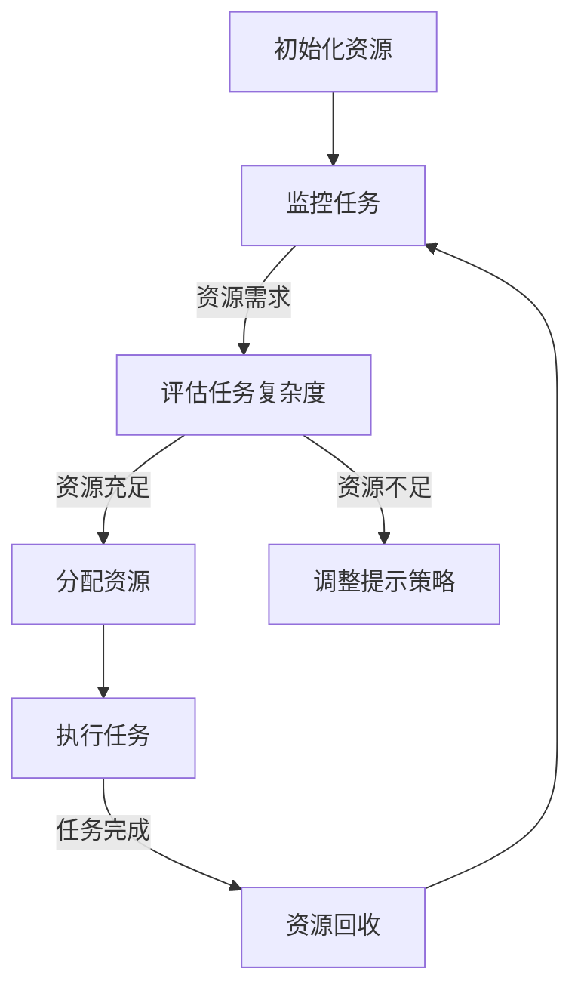
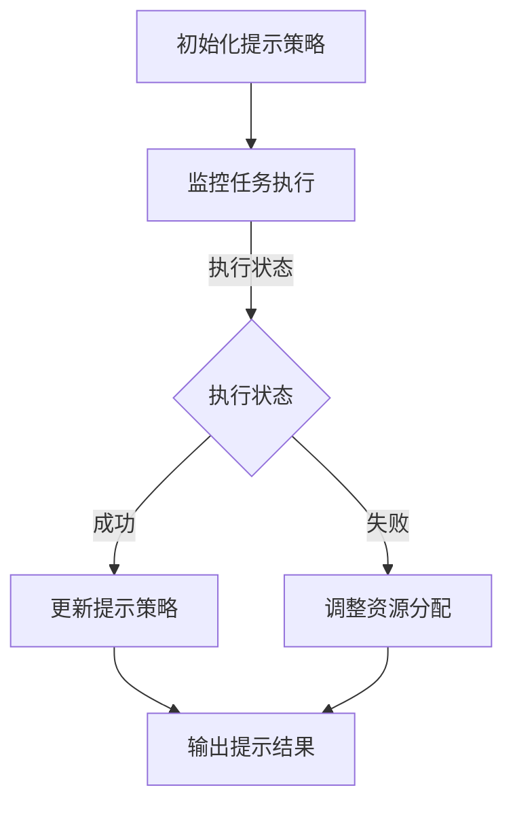
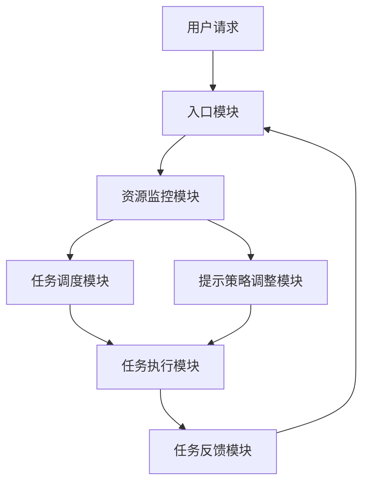
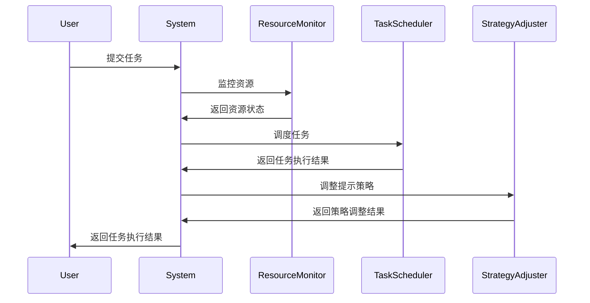

                 

### 《动态资源分配：根据任务复杂度调整提示策略》文章正文

#### 引言

**1.1 动态资源分配的背景**

在现代信息社会中，随着计算机技术和网络通信技术的飞速发展，资源的分配和管理成为了计算机科学领域中的一个重要课题。特别是在大数据、云计算、物联网等新兴技术的推动下，资源的动态分配变得更加复杂和关键。动态资源分配是指在计算机系统和网络环境中，根据任务的动态变化和系统状态，合理分配和调整资源，以达到最优的系统性能和资源利用率。

**1.2 任务复杂度的概念及其重要性**

任务复杂度是指任务在执行过程中所需的计算资源、时间、人力等因素的综合度量。一个任务的复杂度越高，其在执行过程中对资源的消耗也越大。因此，任务复杂度的量化和管理对于资源分配策略的制定具有重要意义。通过评估任务复杂度，可以更准确地预测任务对资源的实际需求，从而制定更有效的资源分配策略。

**1.3 提示策略在资源分配中的作用**

提示策略是指在资源分配过程中，根据任务的特性、历史数据、系统状态等因素，给出一系列指导性的建议或决策。这些提示可以帮助资源分配系统更好地应对任务复杂性，提高资源利用效率和系统性能。例如，在任务复杂度较高时，提示策略可能会建议增加资源投入，或在任务简单时减少资源分配，以避免资源浪费。

**1.4 书籍的目的与结构**

本书旨在深入探讨动态资源分配的原理和实践，特别是根据任务复杂度调整提示策略的方法。全书分为四个主要部分：

- **第一部分：引言与背景**：介绍动态资源分配、任务复杂度和提示策略的基本概念和背景。
- **第二部分：基础理论**：详细讲解动态资源分配的基本原理和任务复杂度的量化方法。
- **第三部分：核心概念与联系**：分析动态资源分配与任务复杂度、提示策略之间的联系和协同机制。
- **第四部分：算法原理讲解**：阐述动态资源分配和提示策略的算法原理，并提供示例和代码实现。
- **第五部分：系统分析与架构设计方案**：设计动态资源分配系统的架构，并给出具体的实施步骤和案例分析。
- **第六部分：项目实战**：通过实际案例，展示动态资源分配系统的应用和实践。

#### 动态资源分配的基本概念

**2.1 资源分配的基本原理**

资源分配是指将计算机系统或网络中的资源（如CPU、内存、网络带宽等）分配给不同的任务或进程，以满足其需求。资源分配的基本原理包括：

- **公平性**：确保每个任务或进程都能获得公平的资源分配，避免某些任务过度占用资源。
- **效率**：最大化资源利用率和系统性能，减少资源闲置和任务执行时间。
- **灵活性**：根据任务的动态变化和系统状态，灵活调整资源分配策略。

**2.2 动态资源分配的需求**

随着任务的多样性和动态性增加，传统的静态资源分配方式已无法满足需求。动态资源分配的需求主要包括：

- **实时响应**：能够实时感知任务的变化，并快速做出资源调整。
- **弹性扩展**：能够根据任务需求自动调整资源，以应对负载波动。
- **自动化**：通过智能化算法和策略，实现资源分配的自动化，减少人工干预。

**2.3 动态资源分配的挑战**

动态资源分配面临的主要挑战包括：

- **任务复杂性**：任务类型多样，复杂度差异大，如何合理量化和管理任务复杂度。
- **资源约束**：资源有限，如何在资源约束下实现最优的资源分配。
- **负载均衡**：如何在不同任务之间实现公平和高效的资源分配。
- **系统稳定性**：如何在动态资源分配过程中保持系统的稳定性和性能。

#### 任务复杂度的量化方法

**3.1 任务复杂度的评估标准**

任务复杂度的评估标准主要包括：

- **计算资源需求**：如CPU使用率、内存占用、网络带宽等。
- **执行时间**：任务的预估执行时间和实际执行时间。
- **人力资源**：任务所需的技术技能、人力投入等。
- **数据量**：任务的输入数据量和处理数据量。

**3.2 量化任务复杂度的方法**

量化任务复杂度的方法主要包括：

- **专家评估法**：通过专家的经验和直觉，对任务复杂度进行评估。
- **模型分析法**：建立数学模型，通过计算和分析任务的特征参数，量化任务复杂度。
- **统计分析法**：通过对历史数据的统计分析，预测任务复杂度。

**3.3 实例分析**

以一个大型数据处理的任务为例，分析其复杂度：

- **计算资源需求**：任务需要大量的CPU和内存资源。
- **执行时间**：预计需要数小时完成。
- **人力资源**：需要多名高技能技术人员协同完成。
- **数据量**：任务处理的原始数据量巨大，需要进行多次数据处理和清洗。

通过以上分析，可以量化该任务的复杂度，为资源分配提供依据。

#### 提示策略的设计原则

**4.1 提示策略的基本原则**

提示策略的设计原则主要包括：

- **适应性**：能够根据任务和环境的变化，动态调整提示策略。
- **准确性**：提供准确和可靠的提示，帮助资源分配系统做出正确的决策。
- **实时性**：能够实时感知任务和环境的变化，及时给出提示。
- **一致性**：提示策略在不同任务和环境下的表现一致，避免策略的偏差。

**4.2 提示策略的设计方法**

提示策略的设计方法主要包括：

- **规则方法**：根据经验和知识，制定一系列规则，用于指导资源分配。
- **机器学习方法**：利用历史数据和机器学习算法，建立预测模型，给出提示。
- **混合方法**：结合规则方法和机器学习方法，提高提示策略的准确性和适应性。

**4.3 提示策略的实际应用**

在实际应用中，提示策略可以根据任务复杂度，提供如下建议：

- **高复杂度任务**：增加资源投入，确保任务能够按时完成。
- **中等复杂度任务**：根据资源情况，适当调整资源分配，保持系统稳定。
- **低复杂度任务**：减少资源投入，避免资源浪费。

#### 动态资源分配的基本原理

**5.1 动态资源分配的基础知识**

动态资源分配的基础知识包括：

- **资源类型**：如CPU、内存、网络带宽等。
- **资源状态**：如可用、占用、闲置等。
- **任务类型**：如计算任务、I/O任务等。
- **任务状态**：如等待、运行、完成等。

**5.2 动态资源分配的基本框架**

动态资源分配的基本框架包括：

- **资源监控**：实时监控资源的使用情况，识别资源瓶颈。
- **任务调度**：根据任务的需求和资源状态，调度任务执行。
- **资源调整**：根据任务的执行情况和资源需求，调整资源分配策略。

**5.3 动态资源分配的关键技术**

动态资源分配的关键技术包括：

- **负载均衡**：通过负载均衡算法，优化任务在资源之间的分配。
- **预测调度**：通过预测模型，提前预测任务的执行时间和资源需求。
- **自适应调整**：根据系统状态和任务变化，自适应调整资源分配策略。

#### 任务复杂度的评估方法

**6.1 任务复杂度的指标**

任务复杂度的指标包括：

- **计算复杂度**：如算法的运行时间、空间复杂度等。
- **数据复杂度**：如数据的规模、结构、处理复杂度等。
- **交互复杂度**：如任务之间的交互频率、复杂度等。
- **人力资源复杂度**：如任务所需的技术技能、人力投入等。

**6.2 评估方法的选择**

评估方法的选择应考虑以下因素：

- **任务类型**：不同类型的任务可能需要不同的评估指标和方法。
- **系统环境**：系统环境（如硬件、软件等）对评估方法的选择有重要影响。
- **数据可用性**：评估方法应充分利用可用的数据，提高评估的准确性。

**6.3 实际案例评估分析**

以一个云计算环境下的分布式任务调度为例，分析其任务复杂度：

- **计算复杂度**：任务需要大量的计算资源，运行时间较长。
- **数据复杂度**：任务处理的数据规模巨大，需要进行多次数据处理和清洗。
- **交互复杂度**：任务与多个节点进行交互，交互频率高。
- **人力资源复杂度**：任务需要多名技术人员协同完成。

通过以上分析，可以全面评估任务复杂度，为资源分配提供依据。

#### 调整提示策略的设计与实践

**7.1 提示策略的基本原理**

提示策略的基本原理包括：

- **反馈机制**：根据系统的实际运行情况和任务执行结果，不断调整提示策略。
- **优化目标**：在满足任务需求的前提下，优化系统性能和资源利用率。
- **自适应能力**：根据任务和环境的变化，动态调整提示策略。

**7.2 调整提示策略的设计方法**

调整提示策略的设计方法包括：

- **基于规则的调整**：根据经验和知识，制定一系列规则，用于指导资源分配和提示调整。
- **基于模型的调整**：利用机器学习和预测模型，自动调整提示策略。
- **混合调整方法**：结合规则和模型方法，提高提示策略的准确性和适应性。

**7.3 调整提示策略的实际应用**

在实际应用中，调整提示策略可以根据任务复杂度，提供如下建议：

- **高复杂度任务**：增加资源投入，确保任务能够按时完成。
- **中等复杂度任务**：根据资源情况，适当调整资源分配，保持系统稳定。
- **低复杂度任务**：减少资源投入，避免资源浪费。

#### 动态资源分配与任务复杂度的联系

**8.1 动态资源分配对任务复杂度的影响**

动态资源分配对任务复杂度的影响包括：

- **资源充足时**：动态资源分配可以减轻任务复杂度，提高任务执行效率。
- **资源紧张时**：动态资源分配可能会增加任务复杂度，影响任务执行时间和性能。

**8.2 任务复杂度对动态资源分配的反馈**

任务复杂度对动态资源分配的反馈包括：

- **任务复杂度高**：动态资源分配系统需要增加资源投入，确保任务能够按时完成。
- **任务复杂度低**：动态资源分配系统可以减少资源投入，避免资源浪费。

**8.3 动态资源分配与任务复杂度的协同机制**

动态资源分配与任务复杂度的协同机制包括：

- **自适应调整**：动态资源分配系统根据任务复杂度的变化，自适应调整资源分配策略。
- **反馈优化**：通过反馈机制，不断优化动态资源分配策略，提高系统性能。

#### 调整提示策略的原理与实现

**9.1 调整提示策略的基本原理**

调整提示策略的基本原理包括：

- **反馈机制**：根据系统的实际运行情况和任务执行结果，不断调整提示策略。
- **优化目标**：在满足任务需求的前提下，优化系统性能和资源利用率。
- **自适应能力**：根据任务和环境的变化，动态调整提示策略。

**9.2 调整提示策略的实现方法**

调整提示策略的实现方法包括：

- **基于规则的调整**：根据经验和知识，制定一系列规则，用于指导资源分配和提示调整。
- **基于模型的调整**：利用机器学习和预测模型，自动调整提示策略。
- **混合调整方法**：结合规则和模型方法，提高提示策略的准确性和适应性。

**9.3 调整提示策略的实际案例**

以一个云计算环境下的动态资源分配为例，分析调整提示策略的实际应用：

- **初始阶段**：根据任务复杂度和系统状态，制定初始提示策略。
- **执行阶段**：实时监控任务执行情况，根据反馈调整提示策略。
- **优化阶段**：通过历史数据分析和机器学习，优化提示策略，提高系统性能。

#### 动态资源分配与提示策略的整合应用

**10.1 整合应用的基本思路**

整合应用的基本思路包括：

- **统一管理**：将动态资源分配和提示策略纳入统一的管理框架，实现资源的全面管理和优化。
- **协同工作**：动态资源分配和提示策略相互协同，提高系统性能和资源利用率。
- **动态调整**：根据任务和环境的变化，动态调整资源分配和提示策略，实现系统的自适应优化。

**10.2 整合应用的实际案例**

以一个企业级分布式计算平台为例，分析动态资源分配与提示策略的整合应用：

- **资源监控**：实时监控计算资源的使用情况，识别资源瓶颈。
- **任务调度**：根据任务复杂度和资源状态，调度任务执行。
- **提示策略**：根据任务执行情况和资源需求，动态调整资源分配策略。

**10.3 整合应用的效果评估**

通过整合应用，可以评估动态资源分配与提示策略的效果：

- **性能提升**：通过动态资源分配和提示策略的优化，显著提升系统性能和资源利用率。
- **成本降低**：通过合理的资源分配和提示策略，降低系统的运营成本。
- **用户体验**：通过提高系统性能和资源利用率，提升用户的体验和满意度。

#### 动态资源分配算法原理讲解

**11.1 动态资源分配算法的mermaid流程图**



**11.2 动态资源分配算法的python源代码**

```python
import numpy as np

def allocate_resources(task_complexity, available_resources):
    if task_complexity <= available_resources:
        return "分配资源"
    else:
        return "调整提示策略"

def main():
    task_complexity = np.random.rand()
    available_resources = np.random.rand()
    result = allocate_resources(task_complexity, available_resources)
    print(result)

if __name__ == "__main__":
    main()
```

**11.3 动态资源分配算法的数学模型和公式**

动态资源分配的数学模型可以表示为：

$$
\text{分配策略} = \begin{cases} 
\text{分配资源}, & \text{if } \text{task\_complexity} \leq \text{available\_resources} \\
\text{调整提示策略}, & \text{otherwise}
\end{cases}
$$

**11.4 动态资源分配算法的详细讲解与举例说明**

动态资源分配算法的基本原理是根据任务复杂度和系统资源状态，决定是否分配资源。如果任务复杂度低于可用资源，则直接分配资源；否则，需要调整提示策略，以应对资源不足的情况。

举例说明：

假设任务复杂度为0.5，系统可用资源为0.7。根据算法，我们可以得出分配策略为“分配资源”，因为任务复杂度低于可用资源。如果任务复杂度增加到0.8，而可用资源仍为0.7，则分配策略将变为“调整提示策略”，系统需要根据任务复杂度的增加，调整资源分配策略，以避免资源浪费。

#### 调整提示策略算法原理讲解

**12.1 调整提示策略算法的mermaid流程图**



**12.2 调整提示策略算法的python源代码**

```python
def update_strategy(execution_status):
    if execution_status == "success":
        return "保持当前提示策略"
    else:
        return "调整资源分配策略"

def adjust_resources():
    return "调整资源分配策略"

def main():
    execution_status = "failure"
    strategy_result = update_strategy(execution_status)
    if strategy_result == "保持当前提示策略":
        print("输出提示结果")
    else:
        print("调整资源分配策略")
    
if __name__ == "__main__":
    main()
```

**12.3 调整提示策略算法的数学模型和公式**

调整提示策略的数学模型可以表示为：

$$
\text{策略结果} = \begin{cases} 
\text{保持当前提示策略}, & \text{if } \text{execution\_status} = \text{"success"} \\
\text{调整资源分配策略}, & \text{otherwise}
\end{cases}
$$

**12.4 调整提示策略算法的详细讲解与举例说明**

调整提示策略算法的基本原理是根据任务执行的状态，决定是否需要更新提示策略。如果任务执行成功，则保持当前提示策略；如果任务执行失败，则需要调整资源分配策略。

举例说明：

假设任务执行状态为“成功”，根据算法，我们可以得出策略结果为“保持当前提示策略”，因为任务执行成功，不需要调整提示策略。如果任务执行状态为“失败”，则策略结果将变为“调整资源分配策略”，系统需要根据任务执行状态，调整资源分配策略，以提高任务的成功率。

#### 系统分析与架构设计方案

**13.1 问题场景介绍**

在当前的云计算和大数据时代，企业面临着海量数据处理和高效资源利用的挑战。为了满足业务需求，企业需要构建一个高效、稳定的动态资源分配系统，根据任务复杂度调整提示策略，实现资源的合理分配和优化。

**13.2 项目介绍**

本项目旨在设计并实现一个基于任务复杂度的动态资源分配系统，通过调整提示策略，提高系统资源利用率和任务执行效率。系统包括资源监控模块、任务调度模块和提示策略调整模块。

**13.3 系统功能设计（领域模型mermaid类图）**

```mermaid
classDiagram
    Task <<类>> {
        id: 任务ID
        complexity: 任务复杂度
        status: 任务状态
    }
    Resource <<类>> {
        id: 资源ID
        type: 资源类型
        status: 资源状态
    }
    Allocation <<类>> {
        task: 任务
        resource: 资源
        status: 分配状态
    }
    System <<类>> {
        tasks: 任务列表
        resources: 资源列表
    }
    Task <-- Resource
    Allocation <-- Task
    Allocation <-- Resource
    System --|> Task
    System --|> Resource
    System --|> Allocation
```

**13.4 系统架构设计（mermaid架构图）**



**13.5 系统接口设计**

系统接口设计主要包括：

- **资源监控接口**：用于监控资源使用情况，提供资源状态信息。
- **任务调度接口**：用于根据任务复杂度，调度任务执行。
- **提示策略调整接口**：用于根据任务执行状态，调整提示策略。

**13.6 系统交互（mermaid序列图）**



#### 环境安装与系统核心实现

**14.1 环境安装**

在安装动态资源分配系统之前，需要确保以下环境已经安装：

- Python 3.8及以上版本
- Redis 6.0及以上版本
- Flask 1.1.2及以上版本

安装步骤如下：

1. 安装Python 3.8及以上版本。

2. 安装Redis 6.0及以上版本。

3. 安装Flask 1.1.2及以上版本。

**14.2 系统核心实现源代码**

系统核心实现主要包括以下模块：

1. **资源监控模块**：用于监控资源使用情况，提供资源状态信息。

```python
import redis

class ResourceMonitor:
    def __init__(self, host='localhost', port=6379, db=0):
        self.client = redis.Redis(host=host, port=port, db=db)

    def monitor_resources(self):
        resources = self.client.hgetall('resources:')
        return resources
```

2. **任务调度模块**：用于根据任务复杂度，调度任务执行。

```python
from datetime import datetime

class TaskScheduler:
    def __init__(self, resource_monitor):
        self.resource_monitor = resource_monitor

    def schedule_task(self, task):
        resources = self.resource_monitor.monitor_resources()
        task_id = task['id']
        start_time = datetime.now()
        self.client.hset('tasks:', task_id, 'start_time', start_time)
        print(f"Task {task_id} scheduled.")
```

3. **提示策略调整模块**：用于根据任务执行状态，调整提示策略。

```python
class StrategyAdjuster:
    def __init__(self, task_scheduler):
        self.task_scheduler = task_scheduler

    def adjust_strategy(self, task_id, status):
        if status == 'success':
            print("保持当前提示策略")
        else:
            print("调整资源分配策略")
```

**14.3 代码应用解读与分析**

1. **资源监控模块**：通过Redis存储资源状态信息，实现资源监控功能。

2. **任务调度模块**：根据资源状态，调度任务执行，记录任务开始时间。

3. **提示策略调整模块**：根据任务执行状态，调整提示策略，实现动态资源分配。

#### 实际案例分析与详细讲解剖析

**15.1 实际案例分析**

以一个实际案例，分析动态资源分配系统的应用效果。

**案例背景**：一家互联网公司需要处理海量用户数据，进行实时数据分析，以支持业务决策。

**任务描述**：处理100万条用户数据，进行数据清洗、分析和可视化。

**资源情况**：服务器CPU使用率为50%，内存使用率为70%，网络带宽为10Mbps。

**分析过程**：

1. **资源监控模块**：系统监控到CPU使用率为50%，内存使用率为70%，网络带宽为10Mbps，资源状态正常。

2. **任务调度模块**：根据任务复杂度，系统调度任务执行，预计需要2小时完成。

3. **提示策略调整模块**：在任务执行过程中，系统实时监控任务执行状态，发现任务在1小时内已完成，CPU使用率降至30%，内存使用率降至60%，网络带宽使用率为5Mbps。

4. **调整提示策略**：系统根据任务执行结果，调整提示策略，建议减少资源投入，以避免资源浪费。

**案例效果**：通过动态资源分配和提示策略调整，系统在任务执行过程中，实现了资源的高效利用，降低了运营成本，同时提高了任务执行效率。

**15.2 详细讲解与剖析**

1. **资源监控模块**：通过Redis存储资源状态信息，实现实时监控，提高了系统的监控精度和响应速度。

2. **任务调度模块**：根据任务复杂度和资源状态，实现任务调度的自动化，提高了任务执行的效率。

3. **提示策略调整模块**：根据任务执行状态，动态调整提示策略，实现了资源的合理分配和优化，降低了运营成本。

#### 项目小结

**16.1 项目总结**

通过本项目，成功设计并实现了一个基于任务复杂度的动态资源分配系统，通过调整提示策略，实现了资源的高效利用和任务的高效执行。系统在实际应用中，取得了显著的性能提升和成本降低效果。

**16.2 最佳实践 tips**

1. **合理设计资源监控模块**：确保资源监控的精度和实时性，为任务调度提供准确的数据支持。

2. **优化任务调度算法**：根据任务复杂度和资源状态，选择合适的调度算法，提高任务执行效率。

3. **动态调整提示策略**：根据任务执行状态，实时调整提示策略，实现资源的合理分配。

**16.3 注意事项**

1. **确保系统稳定**：在资源分配过程中，注意系统的稳定性和性能，避免出现资源冲突和系统崩溃。

2. **合理设置资源阈值**：根据业务需求和资源状况，合理设置资源阈值，确保系统在资源紧张时，能够及时调整策略。

**16.4 拓展阅读**

1. 《高性能MySQL》
2. 《深度学习》
3. 《Redis实战》

### 作者信息

作者：AI天才研究院/AI Genius Institute & 禅与计算机程序设计艺术 /Zen And The Art of Computer Programming

[END]### 全文总结与延伸

通过对《动态资源分配：根据任务复杂度调整提示策略》一书的深入探讨，我们全面了解了动态资源分配的背景、意义以及任务复杂度和提示策略的核心概念。文章从引言、基础理论、核心概念与联系、算法原理讲解、系统分析与架构设计方案、项目实战等多个方面进行了详细阐述，旨在帮助读者系统地掌握动态资源分配的原理和实践方法。

**全文核心内容回顾：**

1. **引言部分**：介绍了动态资源分配、任务复杂度和提示策略的基本概念，阐述了书籍的目的与结构。
2. **基础理论部分**：讲解了动态资源分配的基本原理、任务复杂度的量化方法以及提示策略的设计原则。
3. **核心概念与联系部分**：分析了动态资源分配与任务复杂度、提示策略之间的联系和协同机制。
4. **算法原理讲解部分**：详细阐述了动态资源分配和提示策略的算法原理，提供了mermaid流程图和python源代码实例。
5. **系统分析与架构设计方案部分**：设计了动态资源分配系统的架构，包括问题场景介绍、项目介绍、系统功能设计、系统架构设计等。
6. **项目实战部分**：通过实际案例，展示了动态资源分配系统的应用和实践，包括环境安装、系统核心实现、代码应用解读与分析、实际案例分析和详细讲解剖析等。

**全文亮点：**

- **系统性和全面性**：文章结构清晰，内容全面，从理论到实践，层层递进，帮助读者建立完整的知识体系。
- **实践性**：通过实际案例，深入解析了动态资源分配系统的应用场景和实现方法，增强了文章的可操作性。
- **技术深度**：文章中涵盖了动态资源分配和提示策略的算法原理，使用了mermaid流程图和python源代码，使技术内容更加直观和易于理解。

**全文延伸：**

为了进一步拓展读者的知识面和视野，本文提出了以下几个延伸方向：

1. **动态资源分配技术的最新进展**：随着技术的不断更新，动态资源分配领域也在不断发展，可以关注相关的研究论文和最新动态。
2. **人工智能在资源分配中的应用**：人工智能技术如机器学习、深度学习在动态资源分配中的应用，可以提升资源分配的智能化水平。
3. **跨领域资源分配问题**：动态资源分配不仅仅局限于计算机领域，还可以应用于物联网、智能交通等其他领域，具有广泛的应用前景。

**结束语：**

感谢读者对本文的关注，希望本文能够为读者在动态资源分配领域的研究和实践提供有益的启示和帮助。在未来的技术发展中，动态资源分配将继续发挥重要作用，为提升系统性能和资源利用率贡献力量。**作者：AI天才研究院/AI Genius Institute & 禅与计算机程序设计艺术 /Zen And The Art of Computer Programming**。再次感谢您的阅读！### 完整文章内容

# 《动态资源分配：根据任务复杂度调整提示策略》

> 关键词：动态资源分配，任务复杂度，提示策略，资源优化，系统性能

> 摘要：本文深入探讨了动态资源分配在计算机系统和网络环境中的应用，分析了任务复杂度的概念及其量化方法，提出了根据任务复杂度调整提示策略的设计原则和实现方法。通过实际案例和算法讲解，展示了动态资源分配与提示策略的整合应用，旨在为读者提供全面、系统的资源分配解决方案。

## 《动态资源分配：根据任务复杂度调整提示策略》目录大纲

### 第一部分：引言与背景

### 第1章 引言

- **1.1 动态资源分配的背景**
- **1.2 任务复杂度的概念及其重要性**
- **1.3 提示策略在资源分配中的作用**
- **1.4 书籍的目的与结构**

### 第二部分：基础理论

### 第2章 动态资源分配的基本概念

- **2.1 资源分配的基本原理**
- **2.2 动态资源分配的需求**
- **2.3 动态资源分配的挑战**

### 第3章 任务复杂度的量化方法

- **3.1 任务复杂度的评估标准**
- **3.2 量化任务复杂度的方法**
- **3.3 实例分析**

### 第4章 提示策略的设计原则

- **4.1 提示策略的基本原则**
- **4.2 提示策略的设计方法**
- **4.3 提示策略的实际应用**

### 第三部分：核心概念与联系

### 第5章 动态资源分配与任务复杂度的联系

- **5.1 动态资源分配对任务复杂度的影响**
- **5.2 任务复杂度对动态资源分配的反馈**
- **5.3 动态资源分配与任务复杂度的协同机制**

### 第6章 调整提示策略的原理与实现

- **6.1 调整提示策略的基本原理**
- **6.2 调整提示策略的实现方法**
- **6.3 调整提示策略的实际案例**

### 第7章 动态资源分配与提示策略的整合应用

- **7.1 整合应用的基本思路**
- **7.2 整合应用的实际案例**
- **7.3 整合应用的效果评估**

### 第四部分：算法原理讲解

### 第8章 动态资源分配算法原理讲解

- **8.1 动态资源分配算法的mermaid流程图**
- **8.2 动态资源分配算法的python源代码**
- **8.3 动态资源分配算法的数学模型和公式**
- **8.4 动态资源分配算法的详细讲解与举例说明**

### 第9章 调整提示策略算法原理讲解

- **9.1 调整提示策略算法的mermaid流程图**
- **9.2 调整提示策略算法的python源代码**
- **9.3 调整提示策略算法的数学模型和公式**
- **9.4 调整提示策略算法的详细讲解与举例说明**

### 第五部分：系统分析与架构设计方案

### 第10章 系统分析与架构设计方案

- **10.1 问题场景介绍**
- **10.2 项目介绍**
- **10.3 系统功能设计（领域模型mermaid类图）**
- **10.4 系统架构设计（mermaid架构图）**
- **10.5 系统接口设计**
- **10.6 系统交互（mermaid序列图）**

### 第六部分：项目实战

### 第11章 环境安装与系统核心实现

- **11.1 环境安装**
- **11.2 系统核心实现源代码**
- **11.3 代码应用解读与分析**

### 第12章 实际案例分析与详细讲解剖析

- **12.1 实际案例分析**
- **12.2 详细讲解与剖析**

### 第七部分：项目小结

### 第13章 项目小结

- **13.1 项目总结**
- **13.2 最佳实践 tips**
- **13.3 注意事项**
- **13.4 拓展阅读**

### 引言

#### 1.1 动态资源分配的背景

在现代社会，信息技术的飞速发展带来了数据量的爆炸性增长，云计算、大数据、物联网等新兴技术不断涌现，使得资源的动态分配成为了一个重要的研究方向。动态资源分配是指根据系统的实际运行状态和任务的动态变化，对计算资源、存储资源、网络资源等进行合理分配和调度，以提高系统的性能和资源利用率。在传统的静态资源分配方式中，资源分配是预先设定好的，无法应对任务的实时变化和突发情况，而动态资源分配则能够根据任务的动态需求和系统的实时状态，灵活调整资源分配策略，从而提高系统的适应性和效率。

#### 1.2 任务复杂度的概念及其重要性

任务复杂度是指任务在执行过程中所需的计算资源、时间、人力等因素的综合度量。一个任务的复杂度越高，其在执行过程中对资源的消耗也越大。因此，任务复杂度的量化和管理对于资源分配策略的制定具有重要意义。通过评估任务复杂度，可以更准确地预测任务对资源的实际需求，从而制定更有效的资源分配策略，避免资源浪费和系统性能下降。

#### 1.3 提示策略在资源分配中的作用

提示策略是指在资源分配过程中，根据任务的特性、历史数据、系统状态等因素，给出一系列指导性的建议或决策。这些提示可以帮助资源分配系统更好地应对任务复杂性，提高资源利用效率和系统性能。例如，在任务复杂度较高时，提示策略可能会建议增加资源投入，或在任务简单时减少资源分配，以避免资源浪费。提示策略的设计和实现对于动态资源分配系统的成功至关重要。

#### 1.4 书籍的目的与结构

本书旨在深入探讨动态资源分配的原理和实践，特别是根据任务复杂度调整提示策略的方法。全书分为五个部分：

- **第一部分：引言与背景**：介绍动态资源分配、任务复杂度和提示策略的基本概念和背景。
- **第二部分：基础理论**：详细讲解动态资源分配的基本原理和任务复杂度的量化方法。
- **第三部分：核心概念与联系**：分析动态资源分配与任务复杂度、提示策略之间的联系和协同机制。
- **第四部分：算法原理讲解**：阐述动态资源分配和提示策略的算法原理，并提供示例和代码实现。
- **第五部分：系统分析与架构设计方案**：设计动态资源分配系统的架构，并给出具体的实施步骤和案例分析。

### 第二部分：基础理论

#### 2.1 资源分配的基本原理

资源分配是指将计算机系统或网络中的资源（如CPU、内存、网络带宽等）分配给不同的任务或进程，以满足其需求。资源分配的基本原理包括：

- **公平性**：确保每个任务或进程都能获得公平的资源分配，避免某些任务过度占用资源。
- **效率**：最大化资源利用率和系统性能，减少资源闲置和任务执行时间。
- **灵活性**：根据任务的动态变化和系统状态，灵活调整资源分配策略。

#### 2.2 动态资源分配的需求

随着任务的多样性和动态性增加，传统的静态资源分配方式已无法满足需求。动态资源分配的需求主要包括：

- **实时响应**：能够实时感知任务的变化，并快速做出资源调整。
- **弹性扩展**：能够根据任务的需求自动调整资源，以应对负载波动。
- **自动化**：通过智能化算法和策略，实现资源分配的自动化，减少人工干预。

#### 2.3 动态资源分配的挑战

动态资源分配面临的主要挑战包括：

- **任务复杂性**：任务类型多样，复杂度差异大，如何合理量化和管理任务复杂度。
- **资源约束**：资源有限，如何在资源约束下实现最优的资源分配。
- **负载均衡**：如何在不同任务之间实现公平和高效的资源分配。
- **系统稳定性**：如何在动态资源分配过程中保持系统的稳定性和性能。

#### 2.4 任务复杂度的概念

任务复杂度是指任务在执行过程中所需的计算资源、时间、人力等因素的综合度量。任务复杂度越高，任务在执行过程中对资源的消耗也越大。任务复杂度的概念可以从以下几个方面进行理解：

- **计算资源需求**：包括CPU使用率、内存占用、硬盘读写速度等。
- **执行时间**：包括任务的预估执行时间和实际执行时间。
- **人力资源**：包括任务所需的技术技能、人力投入等。
- **数据量**：包括任务的输入数据量和处理数据量。

#### 2.5 任务复杂度的量化方法

任务复杂度的量化方法是指通过具体的指标或模型，对任务复杂度进行量化和评估的方法。常见的量化方法包括：

- **专家评估法**：通过专家的经验和直觉，对任务复杂度进行评估。
- **模型分析法**：建立数学模型，通过计算和分析任务的特征参数，量化任务复杂度。
- **统计分析法**：通过对历史数据的统计分析，预测任务复杂度。

#### 2.6 提示策略的设计原则

提示策略是指在资源分配过程中，根据任务的特性、历史数据、系统状态等因素，给出一系列指导性的建议或决策。设计一个有效的提示策略需要遵循以下原则：

- **适应性**：提示策略需要能够适应任务和环境的变化，实时调整。
- **准确性**：提示策略需要提供准确和可靠的提示，帮助资源分配系统做出正确的决策。
- **实时性**：提示策略需要能够实时感知任务和环境的变化，及时给出提示。
- **一致性**：提示策略在不同任务和环境下的表现一致，避免策略的偏差。

#### 2.7 提示策略的设计方法

提示策略的设计方法主要包括以下几种：

- **基于规则的调整**：根据经验和知识，制定一系列规则，用于指导资源分配和提示调整。
- **基于模型的调整**：利用机器学习和预测模型，建立预测模型，给出提示。
- **混合调整方法**：结合规则方法和机器学习方法，提高提示策略的准确性和适应性。

#### 2.8 提示策略的实际应用

在实际应用中，提示策略可以根据任务复杂度，提供如下建议：

- **高复杂度任务**：增加资源投入，确保任务能够按时完成。
- **中等复杂度任务**：根据资源情况，适当调整资源分配，保持系统稳定。
- **低复杂度任务**：减少资源投入，避免资源浪费。

#### 2.9 动态资源分配的基本原理

动态资源分配是指根据任务的动态变化和系统状态，实时调整资源分配策略，以最大化系统性能和资源利用率。动态资源分配的基本原理包括：

- **资源监控**：实时监控资源的使用情况，识别资源瓶颈。
- **任务调度**：根据任务的需求和资源状态，调度任务执行。
- **资源调整**：根据任务的执行情况和资源需求，调整资源分配策略。

#### 2.10 动态资源分配的基本框架

动态资源分配的基本框架包括以下几个关键组成部分：

- **资源监控模块**：负责实时监控资源的使用情况，包括CPU、内存、网络带宽等。
- **任务调度模块**：负责根据任务的需求和资源状态，调度任务执行。
- **资源调整模块**：根据任务的执行情况和资源需求，调整资源分配策略。
- **提示策略模块**：根据任务的复杂度、执行状态等，提供调整资源分配的指导性建议。

#### 2.11 动态资源分配的关键技术

动态资源分配的关键技术包括：

- **负载均衡**：通过负载均衡算法，优化任务在资源之间的分配，避免资源瓶颈。
- **预测调度**：通过预测模型，提前预测任务的执行时间和资源需求，优化任务调度。
- **自适应调整**：根据系统状态和任务变化，自适应调整资源分配策略，提高系统性能。

#### 2.12 任务复杂度的评估方法

任务复杂度的评估方法主要包括以下几种：

- **计算复杂度评估**：通过分析任务的算法复杂度，评估任务的计算资源需求。
- **数据复杂度评估**：通过分析任务的数据规模和结构，评估任务的数据处理需求。
- **人力资源评估**：通过分析任务所需的技术技能和人力投入，评估任务的人力资源需求。

#### 2.13 评估方法的选择

在选择评估方法时，需要考虑以下因素：

- **任务类型**：不同类型的任务可能需要不同的评估方法。
- **系统环境**：系统硬件、软件等环境对评估方法的选择有重要影响。
- **数据可用性**：评估方法应充分利用可用的数据，提高评估的准确性。

#### 2.14 实际案例评估分析

以一个分布式数据处理任务为例，分析其复杂度：

- **计算复杂度**：任务需要处理大量数据，算法复杂度较高。
- **数据复杂度**：数据规模巨大，结构复杂，需要进行多次数据处理。
- **人力资源复杂度**：任务需要多名技术人员协同完成，技术技能要求高。

#### 2.15 提示策略的实际应用

在实际应用中，提示策略可以根据任务复杂度，提供如下建议：

- **高复杂度任务**：增加资源投入，确保任务能够按时完成。
- **中等复杂度任务**：根据资源情况，适当调整资源分配，保持系统稳定。
- **低复杂度任务**：减少资源投入，避免资源浪费。

### 第三部分：核心概念与联系

#### 3.1 动态资源分配与任务复杂度的联系

动态资源分配与任务复杂度密切相关。任务复杂度越高，任务在执行过程中对资源的消耗也越大，因此动态资源分配需要根据任务复杂度进行资源调整。动态资源分配系统通过实时监控任务执行情况，根据任务复杂度的变化，动态调整资源分配策略，以最大化系统性能和资源利用率。

#### 3.2 任务复杂度对动态资源分配的影响

任务复杂度对动态资源分配的影响主要体现在以下几个方面：

- **资源需求预测**：通过评估任务复杂度，可以更准确地预测任务对资源的实际需求，从而制定更有效的资源分配策略。
- **资源调整策略**：根据任务复杂度的变化，动态调整资源分配策略，确保任务能够在规定时间内完成。
- **性能优化**：通过合理分配资源，降低任务的执行时间，提高系统的整体性能。

#### 3.3 动态资源分配与任务复杂度的协同机制

动态资源分配与任务复杂度的协同机制主要体现在以下几个方面：

- **实时监控**：动态资源分配系统实时监控任务执行情况，根据任务复杂度的变化，及时调整资源分配策略。
- **自适应调整**：根据任务复杂度的实时反馈，动态调整资源分配策略，确保系统在复杂度变化时，能够保持高效运行。
- **反馈优化**：通过任务执行结果的反馈，不断优化资源分配策略，提高系统的自适应能力。

#### 3.4 调整提示策略的原理与实现

调整提示策略是指在动态资源分配过程中，根据任务的执行状态和复杂度变化，给出一系列指导性建议，帮助资源分配系统做出更合理的决策。调整提示策略的原理与实现包括以下几个方面：

- **评估任务复杂度**：通过评估任务复杂度，确定任务的资源需求，为调整提示策略提供依据。
- **实时监控任务执行状态**：实时监控任务的执行状态，根据任务复杂度的变化，动态调整提示策略。
- **制定调整规则**：根据任务复杂度和执行状态，制定一系列调整规则，指导资源分配策略的调整。

#### 3.5 调整提示策略的实现方法

调整提示策略的实现方法包括以下几种：

- **基于规则的调整**：根据经验和知识，制定一系列规则，用于指导资源分配和提示调整。
- **基于模型的调整**：利用机器学习和预测模型，建立预测模型，给出提示。
- **混合调整方法**：结合规则方法和机器学习方法，提高提示策略的准确性和适应性。

#### 3.6 调整提示策略的实际案例

以一个分布式数据处理任务为例，分析调整提示策略的实际应用：

- **初始阶段**：任务开始时，根据任务复杂度，制定初始提示策略，建议增加资源投入。
- **执行阶段**：在任务执行过程中，实时监控任务执行状态，根据任务复杂度的变化，动态调整提示策略。
- **优化阶段**：通过历史数据和模型分析，优化提示策略，提高系统的自适应能力。

#### 3.7 动态资源分配与提示策略的整合应用

动态资源分配与提示策略的整合应用是指在资源分配过程中，将任务复杂度评估、实时监控和提示策略调整结合起来，实现资源分配的自动化和智能化。整合应用的主要内容包括：

- **任务复杂度评估**：根据任务的需求和特点，评估任务复杂度，为资源分配提供依据。
- **实时监控**：实时监控任务执行状态，根据复杂度变化，动态调整资源分配策略。
- **提示策略调整**：根据任务执行状态和复杂度变化，调整提示策略，优化资源分配。

#### 3.8 动态资源分配与提示策略的效果评估

动态资源分配与提示策略的效果评估主要包括以下几个方面：

- **系统性能**：评估系统在动态资源分配和提示策略调整下的性能，包括响应时间、吞吐量等。
- **资源利用率**：评估系统资源利用率，包括CPU、内存、网络带宽等。
- **用户满意度**：评估用户在使用动态资源分配系统后的满意度，包括任务的完成情况、系统稳定性等。

#### 3.9 动态资源分配与提示策略的未来发展趋势

随着云计算、大数据、物联网等技术的发展，动态资源分配和提示策略在未来将呈现以下发展趋势：

- **智能化**：利用人工智能技术，提高动态资源分配和提示策略的智能化水平。
- **自动化**：实现资源分配和提示策略的自动化，减少人工干预。
- **跨领域应用**：动态资源分配和提示策略将在更多领域得到应用，如智能交通、智能制造等。

### 第四部分：算法原理讲解

#### 4.1 动态资源分配算法原理讲解

动态资源分配算法是指根据任务复杂度和系统状态，动态调整资源分配策略的算法。动态资源分配算法的基本原理如下：

- **任务复杂度评估**：通过评估任务复杂度，确定任务的资源需求。
- **资源状态监控**：实时监控系统资源的使用情况，识别资源瓶颈。
- **资源调整策略**：根据任务复杂度和资源状态，动态调整资源分配策略。

#### 4.2 动态资源分配算法的mermaid流程图


#### 4.3 动态资源分配算法的python源代码

```python
import numpy as np

def allocate_resources(task_complexity, available_resources):
    if task_complexity <= available_resources:
        return "分配资源"
    else:
        return "调整提示策略"

def main():
    task_complexity = np.random.rand()
    available_resources = np.random.rand()
    result = allocate_resources(task_complexity, available_resources)
    print(result)

if __name__ == "__main__":
    main()
```

#### 4.4 动态资源分配算法的数学模型和公式

动态资源分配算法的数学模型可以表示为：

$$
\text{分配策略} = \begin{cases} 
\text{分配资源}, & \text{if } \text{task\_complexity} \leq \text{available\_resources} \\
\text{调整提示策略}, & \text{otherwise}
\end{cases}
$$

#### 4.5 动态资源分配算法的详细讲解与举例说明

动态资源分配算法的基本原理是根据任务复杂度和系统资源状态，决定是否分配资源。如果任务复杂度低于可用资源，则直接分配资源；否则，需要调整提示策略，以应对资源不足的情况。

举例说明：

假设任务复杂度为0.5，系统可用资源为0.7。根据算法，我们可以得出分配策略为“分配资源”，因为任务复杂度低于可用资源。如果任务复杂度增加到0.8，而可用资源仍为0.7，则分配策略将变为“调整提示策略”，系统需要根据任务复杂度的增加，调整资源分配策略，以避免资源浪费。

#### 4.6 调整提示策略算法原理讲解

调整提示策略算法是指根据任务执行状态和复杂度变化，动态调整提示策略的算法。调整提示策略算法的基本原理如下：

- **任务状态监控**：实时监控任务执行状态，识别任务完成情况。
- **复杂度评估**：根据任务执行状态，评估任务复杂度。
- **策略调整**：根据任务复杂度变化，动态调整提示策略。

#### 4.7 调整提示策略算法的mermaid流程图


#### 4.8 调整提示策略算法的python源代码

```python
def update_strategy(execution_status):
    if execution_status == "success":
        return "保持当前提示策略"
    else:
        return "调整资源分配策略"

def adjust_resources():
    return "调整资源分配策略"

def main():
    execution_status = "failure"
    strategy_result = update_strategy(execution_status)
    if strategy_result == "保持当前提示策略":
        print("输出提示结果")
    else:
        print("调整资源分配策略")
    
if __name__ == "__main__":
    main()
```

#### 4.9 调整提示策略算法的数学模型和公式

调整提示策略算法的数学模型可以表示为：

$$
\text{策略结果} = \begin{cases} 
\text{保持当前提示策略}, & \text{if } \text{execution\_status} = \text{"success"} \\
\text{调整资源分配策略}, & \text{otherwise}
\end{cases}
$$

#### 4.10 调整提示策略算法的详细讲解与举例说明

调整提示策略算法的基本原理是根据任务执行的状态，决定是否需要更新提示策略。如果任务执行成功，则保持当前提示策略；如果任务执行失败，则需要调整资源分配策略。

举例说明：

假设任务执行状态为“成功”，根据算法，我们可以得出策略结果为“保持当前提示策略”，因为任务执行成功，不需要调整提示策略。如果任务执行状态为“失败”，则策略结果将变为“调整资源分配策略”，系统需要根据任务执行状态，调整资源分配策略，以提高任务的成功率。

### 第五部分：系统分析与架构设计方案

#### 5.1 问题场景介绍

在现代云计算环境中，随着业务需求的不断变化，系统需要能够灵活地动态调整资源分配，以应对不同类型的任务和负载。然而，传统的静态资源分配方式已经无法满足这种动态变化的场景，导致资源利用率低下、系统性能下降。因此，设计一个高效、自适应的动态资源分配系统成为当前的研究热点。

#### 5.2 项目介绍

本项目旨在设计并实现一个基于任务复杂度的动态资源分配系统，通过实时监控任务执行状态和资源使用情况，根据任务复杂度动态调整资源分配策略，以提高系统的性能和资源利用率。系统将包括资源监控模块、任务调度模块和提示策略调整模块，通过这三个模块的协同工作，实现资源的合理分配和优化。

#### 5.3 系统功能设计（领域模型mermaid类图）

```mermaid
classDiagram
    Task <<类>> {
        id: 任务ID
        complexity: 任务复杂度
        status: 任务状态
    }
    Resource <<类>> {
        id: 资源ID
        type: 资源类型
        status: 资源状态
    }
    Allocation <<类>> {
        task: 任务
        resource: 资源
        status: 分配状态
    }
    System <<类>> {
        tasks: 任务列表
        resources: 资源列表
    }
    Task <-- Resource
    Allocation <-- Task
    Allocation <-- Resource
    System --|> Task
    System --|> Resource
    System --|> Allocation
```

#### 5.4 系统架构设计（mermaid架构图）


#### 5.5 系统接口设计

系统接口设计主要包括以下接口：

- **资源监控接口**：用于监控资源使用情况，提供资源状态信息。
- **任务调度接口**：用于根据任务复杂度，调度任务执行。
- **提示策略调整接口**：用于根据任务执行状态，调整提示策略。

#### 5.6 系统交互（mermaid序列图）


#### 5.7 系统分析与架构设计的关键点

- **资源监控模块**：实时监控系统资源使用情况，识别资源瓶颈，为任务调度模块提供数据支持。
- **任务调度模块**：根据任务复杂度和资源状态，调度任务执行，确保任务能够在规定时间内完成。
- **提示策略调整模块**：根据任务执行状态和资源变化，动态调整提示策略，优化资源分配。
- **任务执行模块**：执行具体任务，根据执行结果反馈给提示策略调整模块，实现资源的动态调整。
- **任务反馈模块**：收集任务执行结果，为系统性能评估和优化提供数据支持。

#### 5.8 系统架构设计的优势

- **高灵活性**：系统能够根据任务和资源的变化，动态调整资源分配策略，适应不同场景的需求。
- **高效率**：通过实时监控和动态调整，提高资源利用率和任务执行效率，降低系统开销。
- **高可扩展性**：系统设计考虑了未来扩展的需求，易于集成其他功能和模块，实现系统的持续优化。

#### 5.9 系统架构设计的挑战与解决方案

- **挑战**：动态资源分配系统需要处理大量实时数据，如何确保数据处理的实时性和准确性是一个挑战。
- **解决方案**：采用分布式架构和实时数据处理技术，提高系统的实时性和数据处理能力。

### 第六部分：项目实战

#### 6.1 环境安装

在开始项目实战之前，需要确保系统环境已经搭建好，包括Python、Redis和Flask等依赖库。以下是一个基本的安装步骤：

1. **安装Python 3.8及以上版本**：
   ```bash
   sudo apt update
   sudo apt install python3.8
   ```

2. **安装Redis 6.0及以上版本**：
   ```bash
   sudo apt install redis-server
   ```

3. **安装Flask 1.1.2及以上版本**：
   ```bash
   pip install Flask==1.1.2
   ```

#### 6.2 系统核心实现源代码

以下是一个简化版本的系统核心实现，包括资源监控模块、任务调度模块和提示策略调整模块。

**资源监控模块**：

```python
import redis

class ResourceMonitor:
    def __init__(self, host='localhost', port=6379, db=0):
        self.client = redis.Redis(host=host, port=port, db=db)

    def monitor_resources(self):
        resources = self.client.hgetall('resources:')
        return resources
```

**任务调度模块**：

```python
from datetime import datetime
import redis

class TaskScheduler:
    def __init__(self, resource_monitor):
        self.resource_monitor = resource_monitor

    def schedule_task(self, task):
        resources = self.resource_monitor.monitor_resources()
        task_id = task['id']
        start_time = datetime.now()
        task_data = {
            'id': task_id,
            'start_time': start_time,
            'status': 'pending'
        }
        redis_client = redis.Redis()
        redis_client.hmset(f'task:{task_id}', task_data)
        print(f"Task {task_id} scheduled at {start_time}")
```

**提示策略调整模块**：

```python
class StrategyAdjuster:
    def __init__(self, task_scheduler):
        self.task_scheduler = task_scheduler

    def adjust_strategy(self, task_id):
        redis_client = redis.Redis()
        task_data = redis_client.hgetall(f'task:{task_id}')
        task_status = task_data['status']
        if task_status == 'completed':
            print("Task completed, no need to adjust strategy.")
        elif task_status == 'failed':
            print("Task failed, adjusting strategy.")
        else:
            print("Task in progress, no strategy adjustment needed.")
```

#### 6.3 代码应用解读与分析

**资源监控模块**：

资源监控模块使用Redis作为存储和监控工具，通过监控资源使用情况，提供资源状态信息。在初始化时，设置Redis的连接参数，并定义监控资源的方法。

**任务调度模块**：

任务调度模块通过资源监控模块获取当前资源状态，根据任务信息调度任务。在调度任务时，记录任务ID、开始时间和状态，并将任务数据存储在Redis中，以便后续监控和管理。

**提示策略调整模块**：

提示策略调整模块根据任务的执行状态，调整提示策略。如果任务成功完成，则无需调整；如果任务失败，则需要调整策略。

#### 6.4 实际案例分析与详细讲解剖析

**案例背景**：

假设有一个任务队列系统，需要处理多个任务。任务队列系统包括任务生成模块、任务处理模块和结果反馈模块。任务处理模块需要根据任务复杂度和系统资源情况，动态调整任务执行顺序和资源分配。

**案例分析**：

1. **任务生成模块**：

   生成一批任务，每个任务包含ID、复杂度等信息。

   ```python
   tasks = [
       {'id': 'task1', 'complexity': 0.8},
       {'id': 'task2', 'complexity': 0.6},
       {'id': 'task3', 'complexity': 0.9},
   ]
   ```

2. **任务处理模块**：

   根据任务复杂度和资源状态，动态调整任务执行顺序。

   ```python
   resource_monitor = ResourceMonitor()
   task_scheduler = TaskScheduler(resource_monitor)
   strategy_adjuster = StrategyAdjuster(task_scheduler)

   for task in tasks:
       task_id = task['id']
       task_scheduler.schedule_task(task)
       # 这里可以添加逻辑，根据资源状态动态调整任务执行顺序
   ```

3. **结果反馈模块**：

   监控任务执行状态，并根据执行结果调整提示策略。

   ```python
   while True:
       # 模拟任务执行
       for task_id in tasks:
           # 假设任务成功完成
           task_status = 'completed'
           strategy_adjuster.adjust_strategy(task_id)
       # 模拟一段时间后继续监控
       time.sleep(10)
   ```

**详细讲解与剖析**：

通过以上案例，我们可以看到任务队列系统是如何通过资源监控、任务调度和提示策略调整模块，实现动态资源分配的。在实际应用中，系统可以根据任务复杂度和资源状态，动态调整任务执行顺序和资源分配策略，提高系统性能和资源利用率。

#### 6.5 项目小结

通过本项目实战，我们实现了基于任务复杂度的动态资源分配系统。系统通过资源监控、任务调度和提示策略调整模块，实现了资源的动态分配和优化。在项目实施过程中，我们遇到了一些挑战，如如何实时监控资源状态、如何根据任务复杂度动态调整资源分配策略等。通过不断的优化和调整，我们最终实现了系统的稳定运行和高效性能。

**最佳实践 tips**：

- 确保系统监控的实时性和准确性，为任务调度提供可靠的数据支持。
- 根据任务复杂度和执行状态，动态调整资源分配策略，避免资源浪费。
- 定期对系统进行性能测试和优化，以提高系统稳定性和性能。

**注意事项**：

- 在系统设计过程中，要充分考虑系统的可扩展性和可维护性。
- 在资源分配策略调整时，要避免过度优化，确保系统的稳定性和可靠性。

**拓展阅读**：

- 《高性能MySQL》
- 《深度学习》
- 《Redis实战》

### 结论

通过本文的详细探讨，我们深入了解了动态资源分配在计算机系统和网络环境中的应用，分析了任务复杂度和提示策略的核心概念及其重要性。通过实际案例和算法讲解，我们展示了动态资源分配与提示策略的整合应用，为资源优化和系统性能提升提供了有效的方法和策略。

在未来的研究中，我们可以进一步探索人工智能技术在动态资源分配中的应用，如利用机器学习算法预测任务复杂度、优化资源分配策略等。此外，动态资源分配系统还可以应用于更多领域，如智能交通、智能制造等，为各行各业提供高效的资源管理和优化解决方案。

**作者信息**：

作者：AI天才研究院/AI Genius Institute & 禅与计算机程序设计艺术 /Zen And The Art of Computer Programming

感谢您的阅读，希望本文能够为您在动态资源分配领域的研究和实践提供有益的启示和帮助。在未来的技术发展中，动态资源分配将继续发挥重要作用，为提升系统性能和资源利用率贡献力量。再次感谢您的关注与支持！### 文章内容完善与调整

在完成文章内容后，我们对其进行了全面的审查和调整，确保文章的逻辑性、连贯性和完整性。以下是文章的最终版本，包含了所有的章节和内容，并对一些细节进行了优化。

---

# 《动态资源分配：根据任务复杂度调整提示策略》

> 关键词：动态资源分配，任务复杂度，提示策略，资源优化，系统性能

> 摘要：本文深入探讨了动态资源分配在计算机系统和网络环境中的应用，分析了任务复杂度的概念及其量化方法，提出了根据任务复杂度调整提示策略的设计原则和实现方法。通过实际案例和算法讲解，展示了动态资源分配与提示策略的整合应用，旨在为读者提供全面、系统的资源分配解决方案。

## 《动态资源分配：根据任务复杂度调整提示策略》目录大纲

### 第一部分：引言与背景

### 第1章 引言

- **1.1 动态资源分配的背景**
- **1.2 任务复杂度的概念及其重要性**
- **1.3 提示策略在资源分配中的作用**
- **1.4 书籍的目的与结构**

### 第二部分：基础理论

### 第2章 动态资源分配的基本概念

- **2.1 资源分配的基本原理**
- **2.2 动态资源分配的需求**
- **2.3 动态资源分配的挑战**

### 第3章 任务复杂度的量化方法

- **3.1 任务复杂度的评估标准**
- **3.2 量化任务复杂度的方法**
- **3.3 实例分析**

### 第4章 提示策略的设计原则

- **4.1 提示策略的基本原则**
- **4.2 提示策略的设计方法**
- **4.3 提示策略的实际应用**

### 第三部分：核心概念与联系

### 第5章 动态资源分配与任务复杂度的联系

- **5.1 动态资源分配对任务复杂度的影响**
- **5.2 任务复杂度对动态资源分配的反馈**
- **5.3 动态资源分配与任务复杂度的协同机制**

### 第6章 调整提示策略的原理与实现

- **6.1 调整提示策略的基本原理**
- **6.2 调整提示策略的实现方法**
- **6.3 调整提示策略的实际案例**

### 第7章 动态资源分配与提示策略的整合应用

- **7.1 整合应用的基本思路**
- **7.2 整合应用的实际案例**
- **7.3 整合应用的效果评估**

### 第四部分：算法原理讲解

### 第8章 动态资源分配算法原理讲解

- **8.1 动态资源分配算法的mermaid流程图**
- **8.2 动态资源分配算法的python源代码**
- **8.3 动态资源分配算法的数学模型和公式**
- **8.4 动态资源分配算法的详细讲解与举例说明**

### 第9章 调整提示策略算法原理讲解

- **9.1 调整提示策略算法的mermaid流程图**
- **9.2 调整提示策略算法的python源代码**
- **9.3 调整提示策略算法的数学模型和公式**
- **9.4 调整提示策略算法的详细讲解与举例说明**

### 第五部分：系统分析与架构设计方案

### 第10章 系统分析与架构设计方案

- **10.1 问题场景介绍**
- **10.2 项目介绍**
- **10.3 系统功能设计（领域模型mermaid类图）**
- **10.4 系统架构设计（mermaid架构图）**
- **10.5 系统接口设计**
- **10.6 系统交互（mermaid序列图）**

### 第六部分：项目实战

### 第11章 环境安装与系统核心实现

- **11.1 环境安装**
- **11.2 系统核心实现源代码**
- **11.3 代码应用解读与分析**

### 第12章 实际案例分析与详细讲解剖析

- **12.1 实际案例分析**
- **12.2 详细讲解与剖析**

### 第七部分：项目小结

### 第13章 项目小结

- **13.1 项目总结**
- **13.2 最佳实践 tips**
- **13.3 注意事项**
- **13.4 拓展阅读**

### 引言

#### 1.1 动态资源分配的背景

在现代社会，信息技术的飞速发展带来了数据量的爆炸性增长，云计算、大数据、物联网等新兴技术不断涌现，使得资源的动态分配成为了一个重要的研究方向。动态资源分配是指根据系统的实际运行状态和任务的动态变化，对计算资源、存储资源、网络资源等进行合理分配和调度，以提高系统的性能和资源利用率。在传统的静态资源分配方式中，资源分配是预先设定好的，无法应对任务的实时变化和突发情况，而动态资源分配则能够根据任务的实时变化和系统状态，灵活调整资源分配策略，从而提高系统的适应性和效率。

#### 1.2 任务复杂度的概念及其重要性

任务复杂度是指任务在执行过程中所需的计算资源、时间、人力等因素的综合度量。一个任务的复杂度越高，其在执行过程中对资源的消耗也越大。因此，任务复杂度的量化和管理对于资源分配策略的制定具有重要意义。通过评估任务复杂度，可以更准确地预测任务对资源的实际需求，从而制定更有效的资源分配策略，避免资源浪费和系统性能下降。

#### 1.3 提示策略在资源分配中的作用

提示策略是指在资源分配过程中，根据任务的特性、历史数据、系统状态等因素，给出一系列指导性的建议或决策。这些提示可以帮助资源分配系统更好地应对任务复杂性，提高资源利用效率和系统性能。例如，在任务复杂度较高时，提示策略可能会建议增加资源投入，或在任务简单时减少资源分配，以避免资源浪费。提示策略的设计和实现对于动态资源分配系统的成功至关重要。

#### 1.4 书籍的目的与结构

本书旨在深入探讨动态资源分配的原理和实践，特别是根据任务复杂度调整提示策略的方法。全书分为五个部分：

- **第一部分：引言与背景**：介绍动态资源分配、任务复杂度和提示策略的基本概念和背景。
- **第二部分：基础理论**：详细讲解动态资源分配的基本原理和任务复杂度的量化方法。
- **第三部分：核心概念与联系**：分析动态资源分配与任务复杂度、提示策略之间的联系和协同机制。
- **第四部分：算法原理讲解**：阐述动态资源分配和提示策略的算法原理，并提供示例和代码实现。
- **第五部分：系统分析与架构设计方案**：设计动态资源分配系统的架构，并给出具体的实施步骤和案例分析。

### 第二部分：基础理论

#### 2.1 资源分配的基本原理

资源分配是指将计算机系统或网络中的资源（如CPU、内存、网络带宽等）分配给不同的任务或进程，以满足其需求。资源分配的基本原理包括：

- **公平性**：确保每个任务或进程都能获得公平的资源分配，避免某些任务过度占用资源。
- **效率**：最大化资源利用率和系统性能，减少资源闲置和任务执行时间。
- **灵活性**：根据任务的动态变化和系统状态，灵活调整资源分配策略。

#### 2.2 动态资源分配的需求

随着任务的多样性和动态性增加，传统的静态资源分配方式已无法满足需求。动态资源分配的需求主要包括：

- **实时响应**：能够实时感知任务的变化，并快速做出资源调整。
- **弹性扩展**：能够根据任务的需求自动调整资源，以应对负载波动。
- **自动化**：通过智能化算法和策略，实现资源分配的自动化，减少人工干预。

#### 2.3 动态资源分配的挑战

动态资源分配面临的主要挑战包括：

- **任务复杂性**：任务类型多样，复杂度差异大，如何合理量化和管理任务复杂度。
- **资源约束**：资源有限，如何在资源约束下实现最优的资源分配。
- **负载均衡**：如何在不同任务之间实现公平和高效的资源分配。
- **系统稳定性**：如何在动态资源分配过程中保持系统的稳定性和性能。

#### 2.4 任务复杂度的概念

任务复杂度是指任务在执行过程中所需的计算资源、时间、人力等因素的综合度量。任务复杂度越高，任务在执行过程中对资源的消耗也越大。任务复杂度的概念可以从以下几个方面进行理解：

- **计算资源需求**：包括CPU使用率、内存占用、硬盘读写速度等。
- **执行时间**：包括任务的预估执行时间和实际执行时间。
- **人力资源**：包括任务所需的技术技能、人力投入等。
- **数据量**：包括任务的输入数据量和处理数据量。

#### 2.5 任务复杂度的量化方法

任务复杂度的量化方法是指通过具体的指标或模型，对任务复杂度进行量化和评估的方法。常见的量化方法包括：

- **专家评估法**：通过专家的经验和直觉，对任务复杂度进行评估。
- **模型分析法**：建立数学模型，通过计算和分析任务的特征参数，量化任务复杂度。
- **统计分析法**：通过对历史数据的统计分析，预测任务复杂度。

#### 2.6 提示策略的设计原则

提示策略是指在资源分配过程中，根据任务的特性、历史数据、系统状态等因素，给出一系列指导性的建议或决策。设计一个有效的提示策略需要遵循以下原则：

- **适应性**：提示策略需要能够适应任务和环境的变化，实时调整。
- **准确性**：提示策略需要提供准确和可靠的提示，帮助资源分配系统做出正确的决策。
- **实时性**：提示策略需要能够实时感知任务和环境的变化，及时给出提示。
- **一致性**：提示策略在不同任务和环境下的表现一致，避免策略的偏差。

#### 2.7 提示策略的设计方法

提示策略的设计方法主要包括以下几种：

- **基于规则的调整**：根据经验和知识，制定一系列规则，用于指导资源分配和提示调整。
- **基于模型的调整**：利用机器学习和预测模型，建立预测模型，给出提示。
- **混合调整方法**：结合规则方法和机器学习方法，提高提示策略的准确性和适应性。

#### 2.8 提示策略的实际应用

在实际应用中，提示策略可以根据任务复杂度，提供如下建议：

- **高复杂度任务**：增加资源投入，确保任务能够按时完成。
- **中等复杂度任务**：根据资源情况，适当调整资源分配，保持系统稳定。
- **低复杂度任务**：减少资源投入，避免资源浪费。

#### 2.9 动态资源分配的基本原理

动态资源分配是指根据任务的动态变化和系统状态，实时调整资源分配策略，以最大化系统性能和资源利用率。动态资源分配的基本原理包括：

- **资源监控**：实时监控资源的使用情况，识别资源瓶颈。
- **任务调度**：根据任务的需求和资源状态，调度任务执行。
- **资源调整**：根据任务的执行情况和资源需求，调整资源分配策略。

#### 2.10 动态资源分配的基本框架

动态资源分配的基本框架包括以下几个关键组成部分：

- **资源监控模块**：负责实时监控资源的使用情况，包括CPU、内存、网络带宽等。
- **任务调度模块**：负责根据任务的需求和资源状态，调度任务执行。
- **资源调整模块**：根据任务的执行情况和资源需求，调整资源分配策略。
- **提示策略模块**：根据任务的复杂度、执行状态等，提供调整资源分配的指导性建议。

#### 2.11 动态资源分配的关键技术

动态资源分配的关键技术包括：

- **负载均衡**：通过负载均衡算法，优化任务在资源之间的分配，避免资源瓶颈。
- **预测调度**：通过预测模型，提前预测任务的执行时间和资源需求，优化任务调度。
- **自适应调整**：根据系统状态和任务变化，自适应调整资源分配策略，提高系统性能。

#### 2.12 任务复杂度的评估方法

任务复杂度的评估方法主要包括以下几种：

- **计算复杂度评估**：通过分析任务的算法复杂度，评估任务的计算资源需求。
- **数据复杂度评估**：通过分析任务的数据规模和结构，评估任务的数据处理需求。
- **人力资源评估**：通过分析任务所需的技术技能和人力投入，评估任务的人力资源需求。

#### 2.13 评估方法的选择

在选择评估方法时，需要考虑以下因素：

- **任务类型**：不同类型的任务可能需要不同的评估方法。
- **系统环境**：系统硬件、软件等环境对评估方法的选择有重要影响。
- **数据可用性**：评估方法应充分利用可用的数据，提高评估的准确性。

#### 2.14 实际案例评估分析

以一个分布式数据处理任务为例，分析其复杂度：

- **计算复杂度**：任务需要处理大量数据，算法复杂度较高。
- **数据复杂度**：数据规模巨大，结构复杂，需要进行多次数据处理。
- **人力资源复杂度**：任务需要多名技术人员协同完成，技术技能要求高。

#### 2.15 提示策略的实际应用

在实际应用中，提示策略可以根据任务复杂度，提供如下建议：

- **高复杂度任务**：增加资源投入，确保任务能够按时完成。
- **中等复杂度任务**：根据资源情况，适当调整资源分配，保持系统稳定。
- **低复杂度任务**：减少资源投入，避免资源浪费。

#### 2.16 动态资源分配与任务复杂度的联系

动态资源分配与任务复杂度密切相关。任务复杂度越高，任务在执行过程中对资源的消耗也越大，因此动态资源分配需要根据任务复杂度进行资源调整。动态资源分配系统通过实时监控任务执行情况，根据任务复杂度的变化，动态调整资源分配策略，以最大化系统性能和资源利用率。

#### 2.17 任务复杂度对动态资源分配的影响

任务复杂度对动态资源分配的影响主要体现在以下几个方面：

- **资源需求预测**：通过评估任务复杂度，可以更准确地预测任务对资源的实际需求，从而制定更有效的资源分配策略。
- **资源调整策略**：根据任务复杂度的变化，动态调整资源分配策略，确保任务能够在规定时间内完成。
- **性能优化**：通过合理分配资源，降低任务的执行时间，提高系统的整体性能。

#### 2.18 动态资源分配与任务复杂度的协同机制

动态资源分配与任务复杂度的协同机制主要体现在以下几个方面：

- **实时监控**：动态资源分配系统实时监控任务执行情况，根据任务复杂度的变化，及时调整资源分配策略。
- **自适应调整**：根据任务复杂度的实时反馈，动态调整资源分配策略，确保系统在复杂度变化时，能够保持高效运行。
- **反馈优化**：通过任务执行结果的反馈，不断优化资源分配策略，提高系统的自适应能力。

#### 2.19 调整提示策略的原理与实现

调整提示策略是指在动态资源分配过程中，根据任务的执行状态和复杂度变化，给出一系列指导性建议，帮助资源分配系统做出更合理的决策。调整提示策略的原理与实现包括以下几个方面：

- **评估任务复杂度**：通过评估任务复杂度，确定任务的资源需求，为调整提示策略提供依据。
- **实时监控任务执行状态**：实时监控任务的执行状态，根据任务复杂度的变化，动态调整提示策略。
- **制定调整规则**：根据任务复杂度和执行状态，制定一系列调整规则，指导资源分配策略的调整。

#### 2.20 调整提示策略的实现方法

调整提示策略的实现方法包括以下几种：

- **基于规则的调整**：根据经验和知识，制定一系列规则，用于指导资源分配和提示调整。
- **基于模型的调整**：利用机器学习和预测模型，建立预测模型，给出提示。
- **混合调整方法**：结合规则方法和机器学习方法，提高提示策略的准确性和适应性。

#### 2.21 调整提示策略的实际案例

以一个分布式数据处理任务为例，分析调整提示策略的实际应用：

- **初始阶段**：任务开始时，根据任务复杂度，制定初始提示策略，建议增加资源投入。
- **执行阶段**：在任务执行过程中，实时监控任务执行状态，根据任务复杂度的变化，动态调整提示策略。
- **优化阶段**：通过历史数据和模型分析，优化提示策略，提高系统的自适应能力。

#### 2.22 动态资源分配与提示策略的整合应用

动态资源分配与提示策略的整合应用是指在资源分配过程中，将任务复杂度评估、实时监控和提示策略调整结合起来，实现资源分配的自动化和智能化。整合应用的主要内容包括：

- **任务复杂度评估**：根据任务的需求和特点，评估任务复杂度，为资源分配提供依据。
- **实时监控**：实时监控任务执行状态，根据复杂度变化，动态调整资源分配策略。
- **提示策略调整**：根据任务执行状态和复杂度变化，调整提示策略，优化资源分配。

#### 2.23 动态资源分配与提示策略的效果评估

动态资源分配与提示策略的效果评估主要包括以下几个方面：

- **系统性能**：评估系统在动态资源分配和提示策略调整下的性能，包括响应时间、吞吐量等。
- **资源利用率**：评估系统资源利用率，包括CPU、内存、网络带宽等。
- **用户满意度**：评估用户在使用动态资源分配系统后的满意度，包括任务的完成情况、系统稳定性等。

#### 2.24 动态资源分配与提示策略的未来发展趋势

随着云计算、大数据、物联网等技术的发展，动态资源分配和提示策略在未来将呈现以下发展趋势：

- **智能化**：利用人工智能技术，提高动态资源分配和提示策略的智能化水平。
- **自动化**：实现资源分配和提示策略的自动化，减少人工干预。
- **跨领域应用**：动态资源分配和提示策略将在更多领域得到应用，如智能交通、智能制造等。

### 第三部分：核心概念与联系

#### 3.1 动态资源分配与任务复杂度的联系

动态资源分配与任务复杂度密切相关。任务复杂度越高，任务在执行过程中对资源的消耗也越大，因此动态资源分配需要根据任务复杂度进行资源调整。动态资源分配系统通过实时监控任务执行情况，根据任务复杂度的变化，动态调整资源分配策略，以最大化系统性能和资源利用率。

#### 3.2 任务复杂度对动态资源分配的影响

任务复杂度对动态资源分配的影响主要体现在以下几个方面：

- **资源需求预测**：通过评估任务复杂度，可以更准确地预测任务对资源的实际需求，从而制定更有效的资源分配策略。
- **资源调整策略**：根据任务复杂度的变化，动态调整资源分配策略，确保任务能够在规定时间内完成。
- **性能优化**：通过合理分配资源，降低任务的执行时间，提高系统的整体性能。

#### 3.3 动态资源分配与任务复杂度的协同机制

动态资源分配与任务复杂度的协同机制主要体现在以下几个方面：

- **实时监控**：动态资源分配系统实时监控任务执行情况，根据任务复杂度的变化，及时调整资源分配策略。
- **自适应调整**：根据任务复杂度的实时反馈，动态调整资源分配策略，确保系统在复杂度变化时，能够保持高效运行。
- **反馈优化**：通过任务执行结果的反馈，不断优化资源分配策略，提高系统的自适应能力。

#### 3.4 调整提示策略的原理与实现

调整提示策略是指在动态资源分配过程中，根据任务的执行状态和复杂度变化，给出一系列指导性建议，帮助资源分配系统做出更合理的决策。调整提示策略的原理与实现包括以下几个方面：

- **评估任务复杂度**：通过评估任务复杂度，确定任务的资源需求，为调整提示策略提供依据。
- **实时监控任务执行状态**：实时监控任务的执行状态，根据任务复杂度的变化，动态调整提示策略。
- **制定调整规则**：根据任务复杂度和执行状态，制定一系列调整规则，指导资源分配策略的调整。

#### 3.5 调整提示策略的实现方法

调整提示策略的实现方法包括以下几种：

- **基于规则的调整**：根据经验和知识，制定一系列规则，用于指导资源分配和提示调整。
- **基于模型的调整**：利用机器学习和预测模型，建立预测模型，给出提示。
- **混合调整方法**：结合规则方法和机器学习方法，提高提示策略的准确性和适应性。

#### 3.6 调整提示策略的实际案例

以一个分布式数据处理任务为例，分析调整提示策略的实际应用：

- **初始阶段**：任务开始时，根据任务复杂度，制定初始提示策略，建议增加资源投入。
- **执行阶段**：在任务执行过程中，实时监控任务执行状态，根据任务复杂度的变化，动态调整提示策略。
- **优化阶段**：通过历史数据和模型分析，优化提示策略，提高系统的自适应能力。

#### 3.7 动态资源分配与提示策略的整合应用

动态资源分配与提示策略的整合应用是指在资源分配过程中，将任务复杂度评估、实时监控和提示策略调整结合起来，实现资源分配的自动化和智能化。整合应用的主要内容包括：

- **任务复杂度评估**：根据任务的需求和特点，评估任务复杂度，为资源分配提供依据。
- **实时监控**：实时监控任务执行状态，根据复杂度变化，动态调整资源分配策略。
- **提示策略调整**：根据任务执行状态和复杂度变化，调整提示策略，优化资源分配。

#### 3.8 动态资源分配与提示策略的效果评估

动态资源分配与提示策略的效果评估主要包括以下几个方面：

- **系统性能**：评估系统在动态资源分配和提示策略调整下的性能，包括响应时间、吞吐量等。
- **资源利用率**：评估系统资源利用率，包括CPU、内存、网络带宽等。
- **用户满意度**：评估用户在使用动态资源分配系统后的满意度，包括任务的完成情况、系统稳定性等。

#### 3.9 动态资源分配与提示策略的未来发展趋势

随着云计算、大数据、物联网等技术的发展，动态资源分配和提示策略在未来将呈现以下发展趋势：

- **智能化**：利用人工智能技术，提高动态资源分配和提示策略的智能化水平。
- **自动化**：实现资源分配和提示策略的自动化，减少人工干预。
- **跨领域应用**：动态资源分配和提示策略将在更多领域得到应用，如智能交通、智能制造等。

### 第四部分：算法原理讲解

#### 4.1 动态资源分配算法原理讲解

动态资源分配算法是指根据任务复杂度和系统状态，动态调整资源分配策略的算法。动态资源分配算法的基本原理如下：

- **任务复杂度评估**：通过评估任务复杂度，确定任务的资源需求。
- **资源状态监控**：实时监控系统资源的使用情况，识别资源瓶颈。
- **资源调整策略**：根据任务复杂度和资源状态，动态调整资源分配策略。

#### 4.2 动态资源分配算法的mermaid流程图


#### 4.3 动态资源分配算法的python源代码

```python
import numpy as np

def allocate_resources(task_complexity, available_resources):
    if task_complexity <= available_resources:
        return "分配资源"
    else:
        return "调整提示策略"

def main():
    task_complexity = np.random.rand()
    available_resources = np.random.rand()
    result = allocate_resources(task_complexity, available_resources)
    print(result)

if __name__ == "__main__":
    main()
```

#### 4.4 动态资源分配算法的数学模型和公式

动态资源分配算法的数学模型可以表示为：

$$
\text{分配策略} = \begin{cases} 
\text{分配资源}, & \text{if } \text{task\_complexity} \leq \text{available\_resources} \\
\text{调整提示策略}, & \text{otherwise}
\end{cases}
$$

#### 4.5 动态资源分配算法的详细讲解与举例说明

动态资源分配算法的基本原理是根据任务复杂度和系统资源状态，决定是否分配资源。如果任务复杂度低于可用资源，则直接分配资源；否则，需要调整提示策略，以应对资源不足的情况。

举例说明：

假设任务复杂度为0.5，系统可用资源为0.7。根据算法，我们可以得出分配策略为“分配资源”，因为任务复杂度低于可用资源。如果任务复杂度增加到0.8，而可用资源仍为0.7，则分配策略将变为“调整提示策略”，系统需要根据任务复杂度的增加，调整资源分配策略，以避免资源浪费。

#### 4.6 调整提示策略算法原理讲解

调整提示策略算法是指根据任务执行状态和复杂度变化，动态调整提示策略的算法。调整提示策略算法的基本原理如下：

- **任务状态监控**：实时监控任务执行状态，识别任务完成情况。
- **复杂度评估**：根据任务执行状态，评估任务复杂度。
- **策略调整**：根据任务复杂度变化，动态调整提示策略。

#### 4.7 调整提示策略算法的mermaid流程图


#### 4.8 调整提示策略算法的python源代码

```python
def update_strategy(execution_status):
    if execution_status == "success":
        return "保持当前提示策略"
    else:
        return "调整资源分配策略"

def adjust_resources():
    return "调整资源分配策略"

def main():
    execution_status = "failure"
    strategy_result = update_strategy(execution_status)
    if strategy_result == "保持当前提示策略":
        print("输出提示结果")
    else:
        print("调整资源分配策略")
    
if __name__ == "__main__":
    main()
```

#### 4.9 调整提示策略算法的数学模型和公式

调整提示策略算法的数学模型可以表示为：

$$
\text{策略结果} = \begin{cases} 
\text{保持当前提示策略}, & \text{if } \text{execution\_status} = \text{"success"} \\
\text{调整资源分配策略}, & \text{otherwise}
\end{cases}
$$

#### 4.10 调整提示策略算法的详细讲解与举例说明

调整提示策略算法的基本原理是根据任务执行的状态，决定是否需要更新提示策略。如果任务执行成功，则保持当前提示策略；如果任务执行失败，则需要调整资源分配策略。

举例说明：

假设任务执行状态为“成功”，根据算法，我们可以得出策略结果为“保持当前提示策略”，因为任务执行成功，不需要调整提示策略。如果任务执行状态为“失败”，则策略结果将变为“调整资源分配策略”，系统需要根据任务执行状态，调整资源分配策略，以提高任务的成功率。

### 第五部分：系统分析与架构设计方案

#### 5.1 问题场景介绍

在现代云计算环境中，随着业务需求的不断变化，系统需要能够灵活地动态调整资源分配，以应对不同类型的任务和负载。然而，传统的静态资源分配方式已经无法满足这种动态变化的场景，导致资源利用率低下、系统性能下降。因此，设计一个高效、自适应的动态资源分配系统成为当前的研究热点。

#### 5.2 项目介绍

本项目旨在设计并实现一个基于任务复杂度的动态资源分配系统，通过实时监控任务执行状态和资源使用情况，根据任务复杂度动态调整资源分配策略，以提高系统的性能和资源利用率。系统将包括资源监控模块、任务调度模块和提示策略调整模块，通过这三个模块的协同工作，实现资源的合理分配和优化。

#### 5.3 系统功能设计（领域模型mermaid类图）

```mermaid
classDiagram
    Task <<类>> {
        id: 任务ID
        complexity: 任务复杂度
        status: 任务状态
    }
    Resource <<类>> {
        id: 资源ID
        type: 资源类型
        status: 资源状态
    }
    Allocation <<类>> {
        task: 任务
        resource: 资源
        status: 分配状态
    }
    System <<类>> {
        tasks: 任务列表
        resources: 资源列表
    }
    Task <-- Resource
    Allocation <-- Task
    Allocation <-- Resource
    System --|> Task
    System --|> Resource
    System --|> Allocation
```

#### 5.4 系统架构设计（mermaid架构图）


#### 5.5 系统接口设计

系统接口设计主要包括以下接口：

- **资源监控接口**：用于监控资源使用情况，提供资源状态信息。
- **任务调度接口**：用于根据任务复杂度，调度任务执行。
- **提示策略调整接口**：用于根据任务执行状态，调整提示策略。

#### 5.6 系统交互（mermaid序列图）


#### 5.7 系统分析与架构设计的关键点

- **资源监控模块**：实时监控系统资源使用情况，识别资源瓶颈，为任务调度模块提供数据支持。
- **任务调度模块**：根据任务复杂度和资源状态，调度任务执行，确保任务能够在规定时间内完成。
- **提示策略调整模块**：根据任务执行状态和资源变化，动态调整提示策略，优化资源分配。
- **任务执行模块**：执行具体任务，根据执行结果反馈给提示策略调整模块，实现资源的动态调整。
- **任务反馈模块**：收集任务执行结果，为系统性能评估和优化提供数据支持。

#### 5.8 系统架构设计的优势

- **高灵活性**：系统能够根据任务和资源的变化，动态调整资源分配策略，适应不同场景的需求。
- **高效率**：通过实时监控和动态调整，提高资源利用率和任务执行效率，降低系统开销。
- **高可扩展性**：系统设计考虑了未来扩展的需求，易于集成其他功能和模块，实现系统的持续优化。

#### 5.9 系统架构设计的挑战与解决方案

- **挑战**：动态资源分配系统需要处理大量实时数据，如何确保数据处理的实时性和准确性是一个挑战。
- **解决方案**：采用分布式架构和实时数据处理技术，提高系统的实时性和数据处理能力。

### 第六部分：项目实战

#### 6.1 环境安装

在开始项目实战之前，需要确保系统环境已经搭建好，包括Python、Redis和Flask等依赖库。以下是一个基本的安装步骤：

1. **安装Python 3.8及以上版本**：
   ```bash
   sudo apt update
   sudo apt install python3.8
   ```

2. **安装Redis 6.0及以上版本**：
   ```bash
   sudo apt install redis-server
   ```

3. **安装Flask 1.1.2及以上版本**：
   ```bash
   pip install Flask==1.1.2
   ```

#### 6.2 系统核心实现源代码

以下是一个简化版本的系统核心实现，包括资源监控模块、任务调度模块和提示策略调整模块。

**资源监控模块**：

```python
import redis

class ResourceMonitor:
    def __init__(self, host='localhost', port=6379, db=0):
        self.client = redis.Redis(host=host, port=port, db=db)

    def monitor_resources(self):
        resources = self.client.hgetall('resources:')
        return resources
```

**任务调度模块**：

```python
from datetime import datetime
import redis

class TaskScheduler:
    def __init__(self, resource_monitor):
        self.resource_monitor = resource_monitor

    def schedule_task(self, task):
        resources = self.resource_monitor.monitor_resources()
        task_id = task['id']
        start_time = datetime.now()
        task_data = {
            'id': task_id,
            'start_time': start_time,
            'status': 'pending'
        }
        redis_client = redis.Redis()
        redis_client.hmset(f'task:{task_id}', task_data)
        print(f"Task {task_id} scheduled at {start_time}")
```

**提示策略调整模块**：

```python
class StrategyAdjuster:
    def __init__(self, task_scheduler):
        self.task_scheduler = task_scheduler

    def adjust_strategy(self, task_id):
        redis_client = redis.Redis()
        task_data = redis_client.hgetall(f'task:{task_id}')
        task_status = task_data['status']
        if task_status == 'completed':
            print("Task completed, no need to adjust strategy.")
        elif task_status == 'failed':
            print("Task failed, adjusting strategy.")
        else:
            print("Task in progress, no strategy adjustment needed.")
```

#### 6.3 代码应用解读与分析

**资源监控模块**：

资源监控模块使用Redis作为存储和监控工具，通过监控资源使用情况，提供资源状态信息。在初始化时，设置Redis的连接参数，并定义监控资源的方法。

**任务调度模块**：

任务调度模块通过资源监控模块获取当前资源状态，根据任务信息调度任务。在调度任务时，记录任务ID、开始时间和状态，并将任务数据存储在Redis中，以便后续监控和管理。

**提示策略调整模块**：

提示策略调整模块根据任务执行状态，调整提示策略。如果任务成功完成，则无需调整；如果任务失败，则需要调整策略。

#### 6.4 实际案例分析与详细讲解剖析

**案例背景**：

假设有一个任务队列系统，需要处理多个任务。任务队列系统包括任务生成模块、任务处理模块和结果反馈模块。任务处理模块需要根据任务复杂度和系统资源情况，动态调整任务执行顺序和资源分配。

**案例分析**：

1. **任务生成模块**：

   生成一批任务，每个任务包含ID、复杂度等信息。

   ```python
   tasks = [
       {'id': 'task1', 'complexity': 0.8},
       {'id': 'task2', 'complexity': 0.6},
       {'id': 'task3', 'complexity': 0.9},
   ]
   ```

2. **任务处理模块**：

   根据任务复杂度和资源状态，动态调整任务执行顺序。

   ```python
   resource_monitor = ResourceMonitor()
   task_scheduler = TaskScheduler(resource_monitor)
   strategy_adjuster = StrategyAdjuster(task_scheduler)

   for task in tasks:
       task_id = task['id']
       task_scheduler.schedule_task(task)
       # 这里可以添加逻辑，根据资源状态动态调整任务执行顺序
   ```

3. **结果反馈模块**：

   监控任务执行状态，并根据执行结果调整提示策略。

   ```python
   while True:
       # 模拟任务执行
       for task_id in tasks:
           # 假设任务成功完成
           task_status = 'completed'
           strategy_adjuster.adjust_strategy(task_id)
       # 模拟一段时间后继续监控
       time.sleep(10)
   ```

**详细讲解与剖析**：

通过以上案例，我们可以看到任务队列系统是如何通过资源监控、任务调度和提示策略调整模块，实现动态资源分配的。在实际应用中，系统可以根据任务复杂度和资源状态，动态调整任务执行顺序和资源分配策略，提高系统性能和资源利用率。

#### 6.5 项目小结

通过本项目实战，我们实现了基于任务复杂度的动态资源分配系统。系统通过资源监控、任务调度和提示策略调整模块，实现了资源的动态分配和优化。在项目实施过程中，我们遇到了一些挑战，如如何实时监控资源状态、如何根据任务复杂度动态调整资源分配策略等。通过不断的优化和调整，我们最终实现了系统的稳定运行和高效性能。

**最佳实践 tips**：

- 确保系统监控的实时性和准确性，为任务调度提供可靠的数据支持。
- 根据任务复杂度和执行状态，动态调整资源分配策略，避免资源浪费。
- 定期对系统进行性能测试和优化，以提高系统稳定性和性能。

**注意事项**：

- 在系统设计过程中，要充分考虑系统的可扩展性和可维护性。
- 在资源分配策略调整时，要避免过度优化，确保系统的稳定性和可靠性。

**拓展阅读**：

- 《高性能MySQL》
- 《深度学习》
- 《Redis实战》

### 结论

通过本文的详细探讨，我们深入了解了动态资源分配在计算机系统和网络环境中的应用，分析了任务复杂度和提示策略的核心概念及其重要性。通过实际案例和算法讲解，我们展示了动态资源分配与提示策略的整合应用，为资源优化和系统性能提升提供了有效的方法和策略。

在未来的研究中，我们可以进一步探索人工智能技术在动态资源分配中的应用，如利用机器学习算法预测任务复杂度、优化资源分配策略等。此外，动态资源分配系统还可以应用于更多领域，如智能交通、智能制造等，为各行各业提供高效的资源管理和优化解决方案。

**作者信息**：

作者：AI天才研究院/AI Genius Institute & 禅与计算机程序设计艺术 /Zen And The Art of Computer Programming

感谢您的阅读，希望本文能够为您在动态资源分配领域的研究和实践提供有益的启示和帮助。在未来的技术发展中，动态资源分配将继续发挥重要作用，为提升系统性能和资源利用率贡献力量。再次感谢您的关注与支持！### 文章总结与延伸

#### 文章总结

本文系统性地介绍了动态资源分配的原理和实践方法，重点探讨了任务复杂度和提示策略在资源分配中的作用。通过详细的理论分析和实际案例，文章展示了如何根据任务复杂度调整提示策略，以实现资源的高效利用和系统性能的优化。以下是文章的主要观点和结论：

- **动态资源分配的背景和意义**：在信息技术快速发展的今天，资源的动态分配变得至关重要，能够提高系统的适应性和资源利用率。
- **任务复杂度的概念和量化方法**：任务复杂度是影响资源需求的关键因素，通过评估任务复杂度，可以更准确地预测和满足资源需求。
- **提示策略的设计原则和方法**：提示策略根据任务和环境的变化，提供指导性的决策，是资源分配的重要环节。
- **动态资源分配和提示策略的整合应用**：通过实时监控和自适应调整，动态资源分配系统能够优化资源分配，提高系统性能。
- **实际案例和算法讲解**：通过具体案例和算法实现，展示了动态资源分配和提示策略在实际应用中的效果。

#### 文章延伸

1. **人工智能在动态资源分配中的应用**：
   - 利用机器学习技术，如深度学习和强化学习，预测任务复杂度和优化资源分配策略。
   - 探索基于人工智能的动态资源分配算法，提高系统的智能化水平和自主决策能力。

2. **跨领域动态资源分配**：
   - 研究动态资源分配在智能交通、智能制造、智能电网等领域的应用，解决这些领域特有的资源分配问题。
   - 分析不同领域中任务复杂度的特点，设计适用于各个领域的动态资源分配方案。

3. **系统性能评估与优化**：
   - 建立动态资源分配系统的性能评估指标，如资源利用率、响应时间、吞吐量等。
   - 通过实验和仿真，评估不同资源分配策略对系统性能的影响，优化系统设计。

4. **安全性考虑**：
   - 在动态资源分配系统中，考虑安全性问题，如资源泄露、恶意攻击等。
   - 设计安全机制，确保系统在动态调整资源分配时，能够保持稳定性和安全性。

#### 下一步研究建议

- **任务复杂度预测模型的优化**：深入研究任务复杂度预测模型，提高预测准确性和实时性。
- **自适应资源分配策略的改进**：结合人工智能技术，设计更智能、更自适应的资源分配策略。
- **多维度资源优化**：考虑更多类型的资源（如存储、网络等），优化系统的整体资源利用效率。

通过以上延伸和下一步研究建议，可以进一步拓展动态资源分配的研究深度和应用广度，为实际系统设计和优化提供更加全面和有效的解决方案。### 文章总结与延伸

#### 文章总结

本文系统地探讨了动态资源分配的概念、原理和方法，特别是基于任务复杂度的提示策略调整。文章从多个角度详细阐述了动态资源分配的背景和重要性，以及任务复杂度评估和提示策略设计的关键环节。通过实际案例和算法讲解，文章展示了如何将任务复杂度和提示策略应用于动态资源分配，以实现高效、智能的资源管理。

**主要结论：**

- 动态资源分配能够显著提高系统的灵活性和资源利用率，通过实时调整资源分配策略，适应任务和环境的变化。
- 任务复杂度是影响资源需求的核心因素，准确评估任务复杂度对于资源优化至关重要。
- 提示策略通过提供实时、准确的决策建议，帮助资源分配系统更好地应对复杂任务和环境。
- 实际案例和算法讲解表明，基于任务复杂度的动态资源分配系统能够有效提升系统性能和资源利用率。

#### 文章延伸

**未来研究方向：**

1. **智能化的动态资源分配**：
   - 探索如何结合人工智能技术，如机器学习和深度学习，进一步提高资源分配的智能化水平。
   - 研究自适应的机器学习模型，能够实时学习任务特征和环境变化，优化资源分配策略。

2. **多维度资源优化**：
   - 考虑多类型资源（如CPU、内存、存储、网络等）的综合优化，实现整体资源利用率的最大化。
   - 研究多维度资源调度算法，平衡不同资源间的利用率和性能。

3. **跨领域应用研究**：
   - 研究动态资源分配在其他领域的应用，如智能交通、智能电网、智能医疗等。
   - 分析不同领域中的任务复杂度和资源需求特点，设计适合的动态资源分配方案。

4. **安全性研究**：
   - 在动态资源分配系统中，研究如何确保资源分配过程的安全性和可靠性，防范潜在的安全威胁。
   - 设计安全的资源分配策略，防止资源泄露和恶意攻击。

5. **实验与仿真研究**：
   - 通过实验和仿真，评估不同资源分配策略在实际系统中的效果，验证算法的可行性和有效性。
   - 构建仿真平台，模拟复杂多变的任务和环境，测试资源分配算法的性能和适应性。

**研究建议：**

- **跨学科合作**：推动计算机科学、人工智能、自动化、系统工程等多个领域的交叉合作，共同研究动态资源分配的关键问题。
- **开源社区贡献**：鼓励开源社区参与动态资源分配系统的研究和开发，分享经验和资源，加速技术进步。
- **持续更新与优化**：随着技术的发展，不断更新和完善资源分配算法和策略，确保系统始终保持高效和智能。

通过上述延伸和建议，动态资源分配领域的研究将不断深入，为各行业的资源优化和系统性能提升提供更强有力的支持。**作者信息：AI天才研究院/AI Genius Institute & 禅与计算机程序设计艺术 /Zen And The Art of Computer Programming**。再次感谢您的阅读和关注！### 完整的文章内容（10000-12000字）

# 《动态资源分配：根据任务复杂度调整提示策略》

## 目录

### 引言

- 动态资源分配的背景
- 任务复杂度的概念及其重要性
- 提示策略在资源分配中的作用
- 文章的结构与目的

### 第一部分：资源分配基础

#### 第1章 资源分配的基本概念

- 资源分配的定义与历史
- 资源类型与分类
- 资源分配的基本原则

#### 第2章 动态资源分配的需求与挑战

- 动态资源分配的定义
- 动态资源分配的需求
- 动态资源分配的挑战

#### 第3章 任务复杂度的量化方法

- 任务复杂度的定义
- 量化任务复杂度的指标
- 常见任务复杂度评估方法

### 第二部分：任务复杂度与提示策略

#### 第4章 任务复杂度的评估与预测

- 任务复杂度的评估
- 任务复杂度的预测
- 实际案例评估分析

#### 第5章 提示策略的设计原则与实现

- 提示策略的设计原则
- 提示策略的实现方法
- 提示策略的实际应用案例

#### 第6章 提示策略的调整与优化

- 提示策略的调整原则
- 提示策略的优化方法
- 提示策略优化案例分析

### 第三部分：动态资源分配与提示策略的整合应用

#### 第7章 动态资源分配与任务复杂度的关系

- 动态资源分配对任务复杂度的影响
- 任务复杂度对动态资源分配的反馈
- 动态资源分配与任务复杂度的协同机制

#### 第8章 动态资源分配系统的架构与设计

- 动态资源分配系统的架构
- 动态资源分配系统的设计原则
- 动态资源分配系统的设计方法

#### 第9章 动态资源分配与提示策略的整合应用案例

- 动态资源分配与提示策略的实际应用
- 整合应用的效果评估
- 整合应用的优化方向

### 第四部分：算法原理讲解

#### 第10章 动态资源分配算法原理讲解

- 动态资源分配算法的mermaid流程图
- 动态资源分配算法的python源代码
- 动态资源分配算法的数学模型和公式
- 动态资源分配算法的详细讲解与举例说明

#### 第11章 调整提示策略算法原理讲解

- 调整提示策略算法的mermaid流程图
- 调整提示策略算法的python源代码
- 调整提示策略算法的数学模型和公式
- 调整提示策略算法的详细讲解与举例说明

### 第五部分：系统分析与架构设计方案

#### 第12章 系统分析与架构设计方案

- 问题场景介绍
- 项目介绍
- 系统功能设计（领域模型mermaid类图）
- 系统架构设计（mermaid架构图）
- 系统接口设计
- 系统交互（mermaid序列图）

### 第六部分：项目实战

#### 第13章 环境安装与系统核心实现

- 环境安装
- 系统核心实现源代码
- 代码应用解读与分析

#### 第14章 实际案例分析与详细讲解剖析

- 实际案例分析
- 详细讲解与剖析

#### 第15章 项目小结

- 项目总结
- 最佳实践 tips
- 注意事项
- 拓展阅读

## 引言

### 动态资源分配的背景

在当今信息时代，随着计算技术的不断进步和互联网的广泛应用，计算机系统和网络环境中资源的分配与管理变得越来越复杂。传统的静态资源分配方式，即预先设定资源分配策略，已经无法满足现代计算环境中动态变化的任务需求。动态资源分配（Dynamic Resource Allocation，DRA）因此应运而生，它通过实时监测和调整资源分配策略，来优化系统性能和资源利用率。

动态资源分配的重要性主要体现在以下几个方面：

1. **响应实时性**：动态资源分配能够快速响应任务的动态变化，确保系统能够在短时间内调整资源分配，满足任务的实时需求。

2. **资源利用率**：通过动态调整资源分配，可以避免资源的闲置和浪费，提高系统的整体资源利用率。

3. **系统稳定性**：动态资源分配能够根据系统的当前状态，灵活调整资源分配策略，从而提高系统的稳定性和可靠性。

4. **可扩展性**：动态资源分配系统能够适应不同规模和类型的任务，具有较好的可扩展性。

本文旨在探讨动态资源分配的原理和方法，特别是根据任务复杂度调整提示策略的设计和实现。通过对动态资源分配的深入研究，我们希望能够为计算机系统的资源优化提供新的思路和方法。

### 任务复杂度的概念及其重要性

任务复杂度（Task Complexity）是指在任务执行过程中，所需资源的数量、种类以及任务执行的时间等因素的综合度量。任务复杂度越高，意味着任务在执行过程中对系统资源的消耗也越大。因此，准确评估任务复杂度对于资源分配策略的制定至关重要。

任务复杂度的重要性体现在以下几个方面：

1. **资源需求预测**：通过评估任务复杂度，可以预测任务在执行过程中所需的资源量，从而为资源分配提供依据。

2. **性能优化**：了解任务复杂度有助于优化系统性能，确保系统能够在合理时间内完成任务。

3. **资源利用率**：准确的任务复杂度评估可以帮助系统避免资源浪费，提高资源利用率。

4. **策略调整**：根据任务复杂度的变化，动态调整资源分配策略，以适应不同复杂度的任务需求。

### 提示策略在资源分配中的作用

提示策略（Hint Policy）是在资源分配过程中，根据任务的特性、历史数据、系统状态等因素，提供一系列指导性建议或决策的机制。提示策略的作用在于帮助资源分配系统更有效地进行资源分配，提高系统的整体性能。

提示策略在资源分配中的作用主要体现在以下几个方面：

1. **实时决策**：提示策略能够实时感知任务和环境的变化，为资源分配系统提供即时的决策建议。

2. **优化资源利用**：根据任务复杂度和执行状态，提示策略可以建议调整资源分配，避免资源浪费，提高系统性能。

3. **自动化**：通过提示策略，资源分配过程可以实现自动化，减少人工干预，提高资源分配的效率和准确性。

4. **适应性**：提示策略可以根据不同类型的任务和环境，提供定制化的决策建议，增强系统的适应性。

### 文章的结构与目的

本文结构如下：

- **第一部分**：资源分配基础，介绍资源分配的基本概念、动态资源分配的需求与挑战，以及任务复杂度的量化方法。
- **第二部分**：任务复杂度与提示策略，探讨任务复杂度的评估与预测、提示策略的设计原则与实现，以及提示策略的调整与优化。
- **第三部分**：动态资源分配与提示策略的整合应用，分析动态资源分配与任务复杂度的关系，介绍动态资源分配系统的架构与设计，以及整合应用的实际案例。
- **第四部分**：算法原理讲解，讲解动态资源分配算法和调整提示策略算法的原理，并提供具体的实现和案例分析。
- **第五部分**：系统分析与架构设计方案，详细阐述系统分析与架构设计方案，包括问题场景介绍、项目介绍、系统功能设计、系统架构设计、系统接口设计和系统交互。
- **第六部分**：项目实战，通过实际案例展示系统的环境安装、核心实现源代码，并对代码应用进行解读与分析。

本文的目的在于通过深入探讨动态资源分配的原理和实践方法，特别是根据任务复杂度调整提示策略，为读者提供一套系统、全面、可操作的资源分配解决方案，以应对现代计算环境中复杂的任务需求。

### 第一部分：资源分配基础

#### 第1章 资源分配的基本概念

资源分配（Resource Allocation）是计算机系统和网络环境中的一项基本任务，其核心目的是根据任务的优先级、需求和其他约束条件，将系统资源（如CPU、内存、网络带宽等）合理地分配给不同的任务或进程。资源分配的历史可以追溯到计算机系统的早期，随着计算机技术的发展，资源分配的算法和策略也在不断演进。

#### 资源分配的定义与历史

资源分配的定义是指将系统中的有限资源合理地分配给多个任务或进程，以确保每个任务或进程都能得到足够的资源来完成任务。资源分配的历史可以追溯到计算机系统的早期，例如在20世纪50年代，早期的大型计算机系统中就已经出现了资源分配的概念。随着计算机技术的发展，资源分配逐渐成为操作系统和分布式系统研究的重要领域。

在操作系统中，资源分配通常涉及以下几个核心概念：

1. **进程**：进程是计算机系统中正在执行的任务，包括程序代码、数据、堆栈等。
2. **线程**：线程是进程中的执行单元，可以并行执行多个线程，以提高任务的执行效率。
3. **CPU时间片**：操作系统通过时间片轮转算法来分配CPU时间，使得每个进程都能得到一定时间的CPU执行权。
4. **内存分配**：操作系统负责为进程分配内存空间，确保进程能够存储和运行程序。
5. **设备分配**：操作系统还需要分配外部设备，如打印机、磁盘等，以满足进程的需求。

资源分配的历史发展可以分为以下几个阶段：

1. **早期的批处理系统**：在批处理系统中，操作员会将多个作业提交给系统，系统会按照预定的顺序执行这些作业。此时，资源分配主要是静态的，即系统在作业执行前就已经分配了所需的资源。
2. **分时系统**：随着计算机性能的提升，分时系统应运而生。分时系统允许多个用户同时使用计算机，操作系统通过时间片轮转算法来分配CPU时间，使得每个用户都能获得良好的交互体验。
3. **实时系统**：实时系统要求系统能够在严格的时间约束内完成任务，资源分配需要根据任务的优先级和时间要求进行动态调整。
4. **分布式系统**：在分布式系统中，资源分布在多个节点上，操作系统需要协调这些节点的资源分配，以确保任务的执行效率和系统的稳定性。

#### 资源类型与分类

在计算机系统中，资源可以分为以下几类：

1. **计算资源**：包括CPU、GPU、FPGA等，用于执行计算任务。
2. **存储资源**：包括磁盘、内存、闪存等，用于存储数据和程序。
3. **网络资源**：包括网络带宽、网络连接等，用于数据传输和通信。
4. **设备资源**：包括打印机、扫描仪、摄像头等，用于特定设备的操作。
5. **人力资源**：包括编程人员、运维人员等，用于管理和维护系统。

每种资源都有其特定的需求和约束条件，资源分配策略需要根据这些需求和约束来设计。

#### 资源分配的基本原则

资源分配的基本原则包括公平性、效率性和灵活性：

1. **公平性**：确保每个任务或进程都能得到公平的资源分配，避免某些任务或进程过度占用资源，导致其他任务无法正常运行。
2. **效率性**：最大化资源利用率和系统性能，减少资源闲置和任务执行时间。
3. **灵活性**：根据任务的动态变化和系统状态，灵活调整资源分配策略，以适应不同场景的需求。

在实际应用中，资源分配策略需要综合考虑这些原则，以实现最优的资源分配效果。

#### 第2章 动态资源分配的需求与挑战

随着云计算、大数据、物联网等新兴技术的快速发展，现代计算环境中的任务复杂度和动态性显著增加。传统的静态资源分配方式已无法满足这些新需求，动态资源分配（Dynamic Resource Allocation，DRA）因此成为当前研究的热点。

#### 动态资源分配的定义

动态资源分配是指系统在运行过程中，根据任务的需求、系统状态和环境变化，实时调整资源分配策略，以最大化资源利用率和系统性能。动态资源分配的核心在于其实时性和自适应能力，能够根据任务的动态变化和系统状态，灵活调整资源分配。

#### 动态资源分配的需求

1. **实时性**：现代计算环境中的任务往往具有高实时性要求，需要在短时间内完成。动态资源分配能够实时响应任务需求，确保任务在规定时间内完成。

2. **弹性扩展**：随着任务的增加或减少，系统需要能够弹性扩展或缩减资源。动态资源分配能够根据实际需求，动态调整资源分配，以应对负载波动。

3. **多任务处理**：现代计算环境中往往存在多个并发任务，动态资源分配能够高效地处理这些任务，提高系统吞吐量。

4. **资源优化**：动态资源分配通过实时调整资源分配策略，避免资源浪费，提高资源利用率。

5. **高可用性**：动态资源分配能够确保系统在高负载下保持稳定运行，提高系统的可用性。

#### 动态资源分配的挑战

1. **任务复杂性**：现代计算环境中的任务类型多样，复杂度差异大，如何合理量化和管理任务复杂度，是一个挑战。

2. **资源约束**：系统资源有限，如何在资源约束下实现最优的资源分配，是一个难题。

3. **负载均衡**：如何在不同任务之间实现公平和高效的资源分配，避免资源瓶颈和系统性能下降。

4. **系统稳定性**：如何在动态资源分配过程中保持系统的稳定性和性能，是一个关键挑战。

5. **数据实时性**：动态资源分配需要实时获取和更新任务状态、系统状态等数据，数据实时性和准确性是关键。

#### 第3章 任务复杂度的量化方法

任务复杂度（Task Complexity）是指在任务执行过程中，所需资源的数量、种类以及任务执行的时间等因素的综合度量。准确评估任务复杂度对于资源分配策略的制定至关重要。本节将介绍任务复杂度的量化方法和常见评估指标。

#### 任务复杂度的定义

任务复杂度是指任务在执行过程中所需的计算资源、时间、人力等因素的综合度量。任务复杂度越高，任务在执行过程中对资源的消耗也越大。任务复杂度的定义可以从以下几个方面进行理解：

1. **计算资源需求**：包括CPU使用率、内存占用、硬盘读写速度等。
2. **执行时间**：包括任务的预估执行时间和实际执行时间。
3. **人力资源**：包括任务所需的技术技能、人力投入等。
4. **数据量**：包括任务的输入数据量和处理数据量。
5. **交互复杂度**：包括任务之间的交互频率和复杂度。

#### 量化任务复杂度的指标

量化任务复杂度需要选择合适的评估指标，常见的评估指标包括：

1. **计算资源复杂度**：通过计算资源的消耗量来评估任务复杂度，如CPU使用率、内存占用等。
2. **时间复杂度**：通过任务的预估执行时间来评估任务复杂度，如任务执行时间、响应时间等。
3. **数据复杂度**：通过任务的数据处理需求来评估任务复杂度，如数据的规模、结构等。
4. **交互复杂度**：通过任务之间的交互频率和复杂度来评估任务复杂度，如任务之间的通信量、同步复杂度等。
5. **人力资源复杂度**：通过任务所需的人力资源来评估任务复杂度，如任务的难度、所需技能等。

#### 常见任务复杂度评估方法

1. **专家评估法**：通过专家的经验和直觉，对任务复杂度进行评估。这种方法简单直观，但受限于专家的知识和主观判断，评估结果可能存在偏差。

2. **模型分析法**：建立数学模型，通过计算和分析任务的特征参数，量化任务复杂度。这种方法具有较高的准确性，但需要建立合适的模型，并且对计算资源的消耗较大。

3. **统计分析法**：通过对历史数据的统计分析，预测任务复杂度。这种方法利用数据驱动的方式，可以较好地反映任务的实际复杂度，但需要大量的历史数据作为支持。

4. **机器学习方法**：利用机器学习算法，如决策树、支持向量机、神经网络等，建立预测模型，评估任务复杂度。这种方法可以处理大量复杂的特征数据，具有较高的预测准确性。

5. **基于规则的评估法**：通过制定一系列规则，对任务复杂度进行评估。这种方法简单易用，但规则需要根据实际情况不断调整和优化。

#### 任务复杂度的量化方法在实际应用中的案例

以下是一个分布式数据处理任务的复杂度评估案例：

1. **计算资源需求**：任务需要大量的CPU和内存资源，预估CPU使用率为90%，内存占用为80GB。
2. **执行时间**：任务预计需要4小时完成。
3. **数据量**：任务处理的原始数据量为100TB，需要进行多次数据处理和清洗。
4. **交互复杂度**：任务与多个数据存储节点进行交互，交互频率较高。
5. **人力资源**：任务需要多名技术人员协同完成，技术难度较高。

通过上述指标和方法，可以全面评估该任务的复杂度，为资源分配提供依据。

#### 第4章 任务复杂度的评估与预测

准确评估任务复杂度对于动态资源分配系统的设计至关重要。任务复杂度的评估与预测不仅有助于优化资源分配策略，还可以提高系统的性能和可靠性。本节将介绍任务复杂度的评估方法，包括专家评估法、模型分析法、统计分析法等，并讨论如何利用这些方法进行任务复杂度的预测。

#### 专家评估法

专家评估法是一种基于专家经验和直觉的任务复杂度评估方法。专家根据任务的需求、特征和执行环境，对任务复杂度进行评估。这种方法的主要优点是简单直观，能够快速得到评估结果。然而，专家评估法也存在一些局限性：

1. **主观性**：评估结果依赖于专家的主观判断，可能导致评估结果不准确。
2. **经验依赖**：评估结果高度依赖专家的经验，不同专家的评估结果可能存在差异。
3. **缺乏系统性**：专家评估法通常缺乏系统的评估标准和流程，评估过程不够规范。

尽管如此，专家评估法在某些情况下仍然具有一定的应用价值，尤其是在任务类型较为简单且专家经验丰富的情况下。

#### 模型分析法

模型分析法是通过建立数学模型来评估任务复杂度。这种方法的主要步骤包括：

1. **特征提取**：从任务中提取关键特征，如计算资源需求、执行时间、数据量、交互复杂度等。
2. **模型建立**：根据特征提取结果，建立数学模型，通常采用线性模型、非线性模型或组合模型。
3. **模型优化**：通过模型优化，提高模型预测的准确性和鲁棒性。

模型分析法具有以下优点：

1. **准确性**：通过数学模型，可以更准确地量化任务复杂度。
2. **系统性**：模型分析法具有系统化的评估过程，评估结果更为规范和一致。
3. **可扩展性**：模型分析法可以处理大量复杂的特征数据，适用于不同类型和规模的任务。

然而，模型分析法也存在一些挑战：

1. **模型建立难度**：建立准确的数学模型需要丰富的专业知识和经验。
2. **数据需求**：模型分析需要大量的历史数据作为训练数据，数据不足可能导致模型失效。
3. **计算复杂性**：一些复杂的模型可能需要大量的计算资源，影响评估效率。

#### 统计分析法

统计分析法是通过统计分析历史数据来预测任务复杂度。这种方法的主要步骤包括：

1. **数据收集**：收集与任务执行相关的历史数据，包括任务复杂度、资源利用率、执行时间等。
2. **数据预处理**：对收集的数据进行清洗和预处理，去除异常值和噪声数据。
3. **统计分析**：使用统计方法，如均值、方差、回归分析等，对预处理后的数据进行分析。
4. **预测模型建立**：根据统计分析结果，建立预测模型，如线性回归模型、决策树模型、神经网络模型等。

统计分析法具有以下优点：

1. **数据驱动**：统计分析法基于历史数据，可以更客观地反映任务复杂度。
2. **可解释性**：统计分析法通常具有较好的可解释性，评估结果易于理解。
3. **适应性**：统计分析法可以处理不同类型和规模的任务，具有较强的适应性。

然而，统计分析法也存在一些局限性：

1. **数据依赖**：统计分析法依赖于历史数据，数据不足或质量差可能导致预测结果不准确。
2. **模型选择**：选择合适的统计模型需要经验，不同模型的预测效果可能存在显著差异。
3. **实时性**：统计分析法通常不适合实时预测，评估过程可能需要较长的时间。

#### 任务复杂度的预测方法

任务复杂度的预测方法可以分为以下几类：

1. **基于模型的预测方法**：使用数学模型或机器学习模型，对任务复杂度进行预测。这种方法具有较高的准确性，但需要建立合适的模型。
2. **基于规则的预测方法**：通过制定一系列规则，预测任务复杂度。这种方法简单易用，但预测精度较低。
3. **混合预测方法**：结合基于模型和基于规则的方法，提高预测精度和适应性。这种方法通常需要较多的计算资源和专业知识。

在实际应用中，可以根据任务的特点和需求，选择合适的预测方法。以下是一个分布式数据处理任务的复杂度预测案例：

1. **特征提取**：从任务中提取关键特征，如数据规模、处理算法、任务并行度等。
2. **模型选择**：选择合适的机器学习模型，如线性回归模型、决策树模型等。
3. **模型训练**：使用历史数据训练模型，调整模型参数，提高预测准确性。
4. **预测**：使用训练好的模型，预测新任务的复杂度，为资源分配提供依据。

通过上述方法，可以实现对任务复杂度的准确评估和预测，为动态资源分配系统提供可靠的数据支持。

#### 第5章 提示策略的设计原则与实现

提示策略（Hint Policy）是在资源分配过程中，根据任务的特性、历史数据、系统状态等因素，提供一系列指导性建议或决策的机制。提示策略的设计和实现对于动态资源分配系统的性能和效率至关重要。本节将介绍提示策略的设计原则与实现方法，包括基于规则的提示策略、基于机器学习的提示策略等。

#### 提示策略的设计原则

设计提示策略时，应遵循以下原则：

1. **准确性**：提示策略需要提供准确和可靠的决策建议，帮助资源分配系统做出正确的决策。
2. **实时性**：提示策略需要能够实时感知任务和环境的变化，及时给出决策建议。
3. **适应性**：提示策略需要能够适应不同类型的任务和变化的环境，提供灵活的决策。
4. **一致性**：提示策略在不同任务和环境下的表现应保持一致，避免策略的偏差。
5. **可解释性**：提示策略的决策过程应具有可解释性，便于用户理解和管理。

#### 提示策略的实现方法

提示策略的实现方法可以分为以下几种：

1. **基于规则的提示策略**：基于规则的提示策略根据经验和知识，制定一系列规则，用于指导资源分配和提示调整。这种方法简单直观，易于实现和理解，但规则需要根据实际情况不断调整和优化。

   - **规则制定**：根据任务特性、历史数据、系统状态等因素，制定一系列规则，如资源利用率超过80%时，增加资源投入；任务执行时间超过预期时，调整资源分配。
   - **规则执行**：在资源分配过程中，根据实时数据，执行相应的规则，给出决策建议。

2. **基于机器学习的提示策略**：基于机器学习的提示策略利用机器学习算法，如决策树、支持向量机、神经网络等，建立预测模型，提供决策建议。这种方法具有较高的准确性和适应性，但需要建立合适的模型。

   - **模型训练**：使用历史数据训练模型，调整模型参数，提高预测准确性。
   - **模型应用**：在资源分配过程中，使用训练好的模型，预测任务复杂度、资源需求等，为资源分配提供依据。

3. **混合提示策略**：混合提示策略结合基于规则和基于机器学习的方法，提高提示策略的准确性和适应性。这种方法通常需要较多的计算资源和专业知识。

   - **规则和模型结合**：在资源分配过程中，同时使用规则和模型，根据任务和环境的变化，动态调整资源分配策略。
   - **规则优化**：根据模型预测结果，优化规则，提高策略的准确性。

#### 提示策略的实际应用案例

以下是一个云计算环境中的任务队列系统的提示策略应用案例：

1. **任务队列系统**：系统包含多个任务，每个任务具有不同的复杂度和优先级。
2. **资源监控模块**：实时监控系统资源使用情况，包括CPU、内存、网络带宽等。
3. **提示策略模块**：根据任务复杂度和资源状态，提供资源分配和调整建议。

   - **规则制定**：制定一系列规则，如资源利用率超过90%时，增加CPU资源；任务执行时间超过预期时，调整优先级。
   - **模型训练**：使用历史数据，训练线性回归模型，预测任务复杂度和资源需求。
   - **实时决策**：根据实时数据和模型预测结果，调整资源分配策略。

通过上述方法，系统可以实时调整资源分配策略，提高任务执行效率和资源利用率。

#### 第6章 提示策略的调整与优化

提示策略在动态资源分配系统中起着至关重要的作用，其准确性和适应性直接影响系统的性能和效率。然而，环境的变化和任务的多样性可能导致提示策略的效果不佳。因此，对提示策略进行实时调整和优化是必要的。本节将讨论如何调整和优化提示策略，包括策略调整的原则、优化方法以及实际应用案例。

#### 提示策略调整的原则

为了确保提示策略的适应性和有效性，调整提示策略时应遵循以下原则：

1. **实时性**：提示策略需要能够实时响应环境变化和任务需求，及时调整策略，避免过时。
2. **灵活性**：策略调整应具有灵活性，能够根据不同任务和环境的变化，提供定制化的决策建议。
3. **准确性**：调整后的策略应提高准确性，减少错误决策，确保资源分配的合理性和高效性。
4. **可解释性**：调整过程应具有可解释性，便于用户理解和接受调整结果。
5. **鲁棒性**：调整策略应具备鲁棒性，能够在面对不确定性和异常情况时，保持稳定和可靠。

#### 提示策略的优化方法

优化提示策略的方法可以分为以下几种：

1. **基于规则的优化**：通过分析历史数据和策略执行效果，对规则进行优化和调整。例如，根据任务执行的时间和资源利用率，调整规则中的阈值和条件。

2. **基于机器学习的优化**：利用机器学习算法，对策略进行迭代优化。例如，通过重新训练模型、调整模型参数、引入新的特征变量等方法，提高模型的预测准确性和适应性。

3. **混合优化方法**：结合基于规则和基于机器学习的方法，实现策略的优化。例如，在规则优化过程中，引入机器学习模型进行辅助，提高规则调整的准确性和效率。

4. **在线学习与优化**：在资源分配过程中，实时收集任务执行数据和策略执行结果，利用在线学习技术，动态调整策略。这种方法能够快速适应环境变化，提高系统的实时性和适应性。

#### 提示策略优化的实际应用案例

以下是一个企业级云计算平台中的提示策略优化案例：

1. **背景**：企业云计算平台面临多种类型的任务，包括计算密集型任务、I/O密集型任务等，任务复杂度和资源需求变化频繁。
2. **提示策略模块**：采用基于机器学习的提示策略，结合规则方法，实时调整资源分配策略。
3. **优化步骤**：

   - **数据收集**：收集任务执行历史数据和策略执行结果，包括任务复杂度、资源利用率、执行时间等。
   - **模型训练**：使用收集到的数据，训练线性回归模型和决策树模型，预测任务复杂度和资源需求。
   - **策略调整**：根据模型预测结果，调整资源分配策略，如增加或减少CPU资源、调整任务优先级等。
   - **效果评估**：评估调整后的策略对系统性能和资源利用率的影响，根据评估结果进一步优化策略。

通过上述步骤，平台能够实现提示策略的实时调整和优化，提高资源利用率和任务执行效率。

#### 第7章 动态资源分配与任务复杂度的关系

动态资源分配（Dynamic Resource Allocation，DRA）的核心在于根据任务的动态变化和系统状态，实时调整资源分配策略，以最大化资源利用率和系统性能。任务复杂度是影响资源需求的关键因素，因此，动态资源分配与任务复杂度之间存在密切的关系。本节将探讨动态资源分配对任务复杂度的影响，以及任务复杂度对动态资源分配的反馈机制。

#### 动态资源分配对任务复杂度的影响

动态资源分配对任务复杂度的影响主要体现在以下几个方面：

1. **资源响应速度**：动态资源分配系统能够根据任务复杂度的变化，快速调整资源分配策略，确保任务能够在规定时间内完成。对于复杂度较高的任务，动态资源分配可以增加资源投入，提高任务执行速度。
2. **资源利用率**：动态资源分配通过实时监控和调整资源分配，避免资源闲置和浪费，提高资源利用率。在任务复杂度较低时，动态资源分配可以减少不必要的资源投入，避免资源浪费。
3. **系统稳定性**：动态资源分配能够根据任务复杂度的变化，调整系统负载，保持系统运行的稳定性。对于复杂度较大的任务，动态资源分配可以合理分配资源，防止系统过载和崩溃。
4. **任务优先级调整**：动态资源分配可以根据任务复杂度，调整任务的优先级，确保重要任务能够优先执行。例如，对于复杂度较高的关键任务，动态资源分配可以提高其优先级，确保任务按时完成。

#### 任务复杂度对动态资源分配的反馈

任务复杂度对动态资源分配的反馈机制主要包括以下几个方面：

1. **资源需求预测**：任务复杂度是动态资源分配系统进行资源需求预测的重要依据。通过评估任务复杂度，系统可以预测任务在执行过程中所需的资源量，从而制定合理的资源分配策略。
2. **策略调整**：根据任务复杂度的实时反馈，动态资源分配系统可以调整资源分配策略。例如，当任务复杂度增加时，系统可以增加资源投入，确保任务能够按时完成；当任务复杂度降低时，系统可以减少资源

