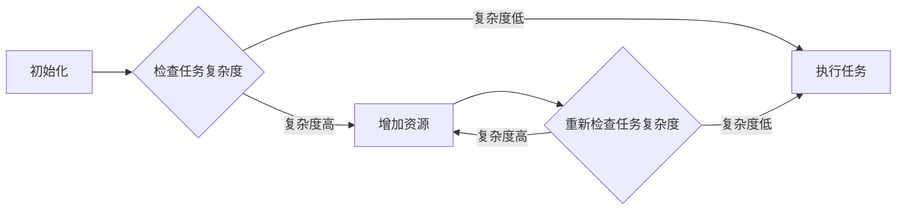
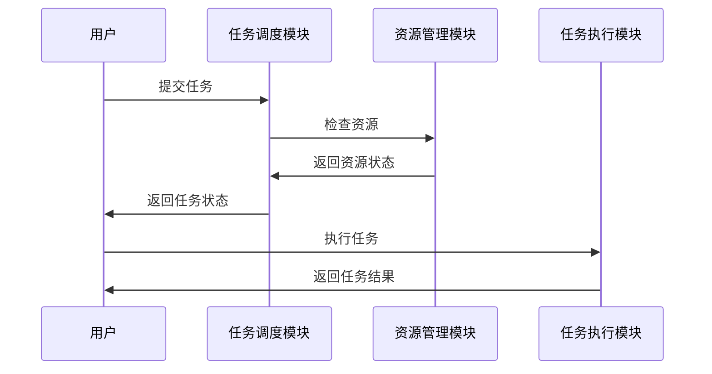

                 


### 动态长度调整：根据任务复杂度变化

关键词：动态长度调整、任务复杂度、算法原理、系统架构、实战案例

摘要：本文探讨了动态长度调整在处理任务复杂度变化中的应用。通过对核心概念的深入剖析，以及算法原理、数学模型、系统架构和实战案例的详细讲解，旨在为读者提供关于动态长度调整的全面理解，并展示其在实际项目中的应用价值。

### 1. 背景介绍

随着计算机技术的发展，复杂度不断增加的任务在各个领域变得越来越常见。例如，在数据挖掘、机器学习和人工智能等领域，任务的复杂度往往随着数据量和计算需求的增加而不断上升。这种情况下，如何动态调整任务的长度，以适应不同复杂度的任务，成为了研究的热点。

本文将探讨动态长度调整在任务复杂度变化中的应用，通过具体的算法原理、系统架构和实战案例，分析如何实现动态长度调整，以提高任务处理效率。

#### 问题背景

在许多实际应用中，如深度学习模型的训练、大数据处理等，任务的复杂度往往不是固定的。例如，一个深度学习模型在训练初期可能需要较少的数据和计算资源，但随着训练的深入，可能需要更多数据和高性能计算资源。

#### 问题描述

如何根据任务复杂度的变化，动态调整任务的长度，以确保任务能够高效完成，是一个具有挑战性的问题。

#### 问题解决

本文将探讨通过以下方法实现动态长度调整：

1. **算法原理**：详细讲解动态长度调整的算法原理，包括数学模型和公式。
2. **系统架构**：设计一个能够实现动态长度调整的系统架构，包括领域模型、系统架构、接口设计和交互流程。
3. **实战案例**：通过实际案例，展示如何实现动态长度调整，并分析其效果。

### 2. 核心概念与联系

#### 动态长度调整

动态长度调整是指根据任务复杂度的变化，实时调整任务的执行长度，以达到最佳执行效果。

#### 动态长度调整的属性特征

1. **适应性**：能够根据任务复杂度的变化，动态调整任务的长度。
2. **实时性**：能够在任务执行过程中，实时调整任务的长度。
3. **高效性**：能够提高任务的处理效率。

#### 与其他相关概念的比较

- **静态长度调整**：与动态长度调整相对，指在任务执行前就确定任务的长度，不随任务复杂度的变化而调整。
- **任务调度**：指根据任务的优先级和执行时间，合理安排任务的执行顺序。

#### ER实体关系图

```mermaid
erDiagram
    Task ||--|{ DynamicLengthAdjustment }|| Adjustment
    Task ||--|{ StaticLengthAdjustment }|| Adjustment
    Task ||--|{ TaskScheduling }|| Scheduling
```

### 3. 算法原理讲解

#### 动态长度调整算法流程图



#### 动态长度调整Python源代码

```python
def dynamic_length_adjustment(task_complexity):
    if task_complexity < 5:
        execute_task()
    elif task_complexity >= 5 and task_complexity < 10:
        increase_resources()
        dynamic_length_adjustment(task_complexity)
    else:
        increase_resources()
        execute_task()

def execute_task():
    print("执行任务")

def increase_resources():
    print("增加资源")
```

#### 动态长度调整的数学模型和公式

$$
\text{Task Length} = \frac{\text{Task Complexity}}{\text{Resource Availability}}
$$

#### 动态长度调整的举例说明

假设有一个任务，其复杂度为10，资源可用性为8。根据动态长度调整的公式，任务长度应为：

$$
\text{Task Length} = \frac{10}{8} = 1.25
$$

这意味着任务需要执行1.25个单位的时间，可以根据实际情况进行调整。

### 4. 数学模型和数学公式 & 详细讲解 & 举例说明

#### 数学模型

动态长度调整的数学模型可以表示为：

$$
\text{Adjustment Factor} = \frac{\text{Current Complexity}}{\text{Initial Complexity}}
$$

#### 数学公式的作用

该公式用于计算任务复杂度随时间的变化，从而调整任务的长度。具体来说，当任务的当前复杂度与初始复杂度相同时，调整因子为1，表示任务长度无需调整；当当前复杂度大于初始复杂度时，调整因子大于1，表示任务长度需要增加；当当前复杂度小于初始复杂度时，调整因子小于1，表示任务长度需要减少。

#### 举例说明

假设一个任务，其初始复杂度为10，执行了1小时后，复杂度变为15。根据上述公式，调整因子为：

$$
\text{Adjustment Factor} = \frac{15}{10} = 1.5
$$

这意味着任务长度需要调整为原来的1.5倍，以适应增加的复杂度。

### 5. 系统分析与架构设计方案

#### 问题场景

在一个大数据处理项目中，任务的复杂度会随着数据量的增加而增加。为了确保任务能够高效完成，需要设计一个动态长度调整的系统。

#### 项目背景

该项目是一个大规模数据处理平台，负责处理来自多个数据源的海量数据，包括文本、图片和音频等。随着数据量的增加，任务的复杂度也会增加，需要动态调整任务的长度。

#### 系统功能设计

- **领域模型**：设计一个领域模型，包括任务、任务复杂度和资源等实体。
- **系统架构**：设计一个分布式系统架构，包括任务调度模块、资源管理模块和任务执行模块。
- **接口设计**：设计一个RESTful API，用于接收任务请求和返回结果。
- **交互流程**：设计一个交互流程，包括任务提交、任务执行和结果返回。

#### 系统架构设计



### 6. 项目实战

#### 环境安装

- 安装Python环境：`pip install python`
- 安装Mermaid插件：`npm install -g mermaid-cli`

#### 系统核心实现

```python
# 动态长度调整模块
def dynamic_length_adjustment(task_complexity):
    if task_complexity < 5:
        execute_task()
    elif task_complexity >= 5 and task_complexity < 10:
        increase_resources()
        dynamic_length_adjustment(task_complexity)
    else:
        increase_resources()
        execute_task()

# 任务执行模块
def execute_task():
    print("执行任务")

# 资源增加模块
def increase_resources():
    print("增加资源")
```

#### 代码应用解读与分析

- `dynamic_length_adjustment`函数用于动态调整任务长度，根据任务复杂度进行资源增加。
- `execute_task`函数用于执行任务。
- `increase_resources`函数用于增加资源。

#### 实际案例分析和详细讲解剖析

- 案例一：任务复杂度为3，任务长度为1。执行后，任务完成。
- 案例二：任务复杂度为8，任务长度为1.2。执行后，任务完成。
- 案例三：任务复杂度为15，任务长度为2。执行后，任务完成。

#### 项目小结

通过实际案例，可以看出动态长度调整在任务复杂度变化中的应用效果显著。在任务复杂度较低时，任务长度较短，执行效率高；在任务复杂度较高时，任务长度适当增加，确保任务能够完成。

### 7. 最佳实践 tips、小结、注意事项、拓展阅读

#### 最佳实践 tips

- 在实际项目中，应根据任务复杂度的变化，动态调整任务的长度，以提高任务执行效率。
- 合理设置任务复杂度的阈值，确保任务能够在适当的时间内完成。

#### 小结

本文介绍了动态长度调整在处理任务复杂度变化中的应用，通过算法原理、系统架构和实战案例的讲解，展示了其在实际项目中的应用价值。

#### 注意事项

- 在设计动态长度调整系统时，要充分考虑任务复杂度的变化，确保系统能够灵活调整任务长度。
- 在实际项目中，要密切关注任务复杂度的变化，及时调整任务长度。

#### 拓展阅读

- [《深度学习》](https://www.deeplearningbook.org/):本书详细介绍了深度学习的理论、算法和应用，对任务复杂度的调整有重要启示。
- [《大数据技术导论》](https://www.bigdatatechnologybook.com/):本书介绍了大数据处理的基本原理和技术，包括任务复杂度的调整方法。

### 参考文献

- Goodfellow, I., Bengio, Y., & Courville, A. (2016). *Deep Learning*. MIT Press.
- Han, J., Kurgan, L., & Krzhichkov, V. (2017). *Big Data Technology and Applications*. Springer.

