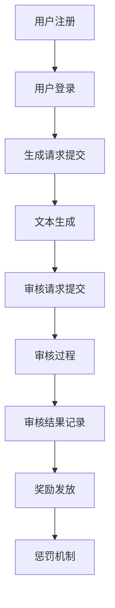
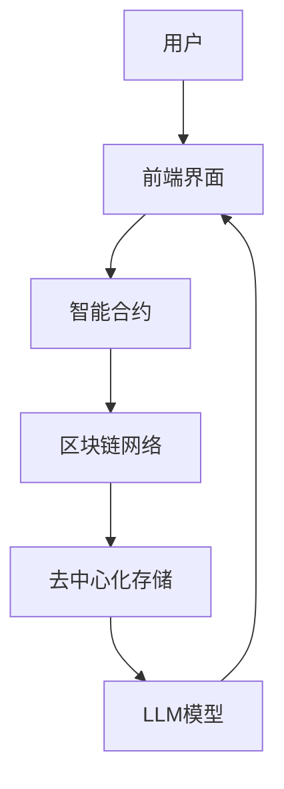
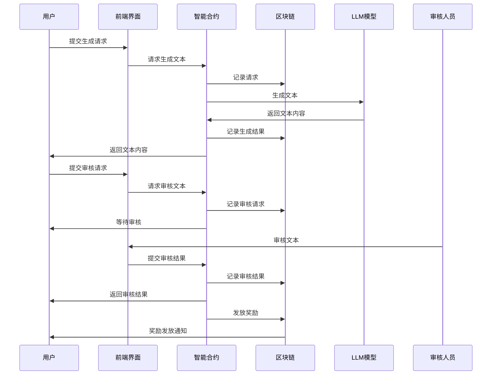

                 

### 1.1.1 区块链技术的起源与发展

区块链技术起源于2008年，由一位或多位匿名人士以中文名“中本聪”（Satoshi Nakamoto）的名义发表的一篇名为《比特币：一种点对点电子现金系统》（Bitcoin: A Peer-to-Peer Electronic Cash System）的论文。这篇论文详细阐述了比特币系统的设计与实现，首次提出了区块链的概念。

区块链技术的核心思想是构建一个去中心化的分布式账本系统，通过加密技术和共识算法，确保数据的透明性、安全性和不可篡改性。最初，区块链技术主要应用于数字货币领域，如比特币、以太坊等。

随着时间的推移，区块链技术逐渐扩展到更广泛的领域，包括供应链管理、智能合约、数据隐私保护、去中心化金融（DeFi）、非同质化代币（NFT）等。特别是在2020年后，区块链技术与人工智能、大数据、物联网等新兴技术的结合，为各行各业带来了全新的创新应用模式。

### 1.1.1.2 区块链技术的核心概念

区块链技术包含以下几个核心概念：

- **分布式账本**：区块链本质上是一个分布式数据库，存储在多个节点上，每个节点都保存了一份完整的数据副本。这种分布式结构使得区块链具有高可靠性和抗单点故障能力。

- **加密技术**：区块链使用各种加密算法来确保数据的安全性和隐私性。包括哈希函数、数字签名、公钥加密等，这些技术共同构成了区块链的安全机制。

- **共识算法**：共识算法是区块链网络中各个节点达成一致的方法。常见的共识算法有工作量证明（PoW）、权益证明（PoS）、拜占庭容错算法（PBFT）等。共识算法的目的是确保区块链上数据的正确性和一致性。

- **智能合约**：智能合约是区块链上的可编程规则，通过预先设定的条件自动执行。智能合约的执行过程是透明的、不可篡改的，为去中心化应用提供了强大的支持。

- **去中心化**：去中心化是区块链技术的一个重要特点，意味着系统不需要中心化的第三方中介机构来验证交易或管理数据。这降低了交易成本，提高了系统的透明度和可信任度。

### 1.1.1.3 区块链技术的应用领域

区块链技术的广泛应用主要表现在以下几个方面：

- **数字货币**：比特币是第一个也是最著名的区块链应用，它通过区块链技术实现了一种去中心化的数字货币。此后，以太坊、莱特币、波卡等众多加密货币相继出现，进一步推动了区块链技术的发展。

- **智能合约**：智能合约是区块链技术的核心应用之一。通过智能合约，开发者可以在区块链上构建去中心化的应用（DApp），实现金融、法律、供应链等多个领域的自动化和透明化。

- **数据隐私保护**：区块链技术能够确保数据的完整性和不可篡改性，因此在数据隐私保护方面具有独特的优势。例如，医疗健康数据、个人隐私数据等可以在区块链上得到安全的存储和保护。

- **供应链管理**：区块链技术为供应链管理提供了透明的、不可篡改的记录系统，有助于提高供应链的透明度和效率，减少欺诈行为。

- **去中心化金融（DeFi）**：DeFi通过区块链技术实现了一系列金融产品和服务，如去中心化交易所、去中心化贷款、去中心化稳定币等，为用户提供了全新的金融服务体验。

- **非同质化代币（NFT）**：NFT是基于区块链技术的一种数字资产，用于代表独特物品的所有权。在艺术、收藏品、虚拟资产等领域，NFT得到了广泛的应用。

### 1.1.2 LLM发展背景

#### 1.1.2.1 自然语言处理的发展历程

自然语言处理（Natural Language Processing，NLP）是人工智能的一个重要分支，致力于让计算机理解和处理人类语言。NLP的发展历程可以大致分为以下几个阶段：

1. **早期研究（1950s-1960s）**：NLP的概念首次在1950年由艾伦·图灵提出，他在论文《计算机器与智能》中提出了图灵测试。这一时期的研究主要集中在语法分析和语义分析上，但效果有限。

2. **规则驱动方法（1970s-1980s）**：这一时期的研究者试图通过编写大量的语法规则和词典来处理自然语言。然而，由于自然语言的复杂性和多样性，这种方法在实际应用中遇到了很大挑战。

3. **基于统计的方法（1990s-2000s）**：随着计算机性能的提升和数据规模的增大，基于统计的方法逐渐成为NLP的主流。该方法利用大量的语料库来训练模型，从而提高处理自然语言的能力。

4. **深度学习方法（2010s-至今）**：深度学习在图像识别、语音识别等领域取得了巨大的成功，引发了研究人员对深度学习在NLP领域应用的兴趣。2013年，神经网络机器翻译（Neural Machine Translation，NMT）的出现标志着深度学习在NLP领域的崛起。

#### 1.1.2.2 LLM的核心概念与特点

大型语言模型（Large Language Models，LLM）是基于深度学习的NLP模型，其核心概念和特点如下：

1. **核心概念**：
   - **神经网络**：LLM的核心是神经网络，特别是循环神经网络（RNN）和Transformer架构。神经网络通过多层节点之间的加权连接来模拟人类大脑处理信息的方式。
   - **预训练**：LLM通常采用预训练-微调（Pre-training and Fine-tuning）的方法。在预训练阶段，模型在大量无标签数据上进行训练，学习语言的一般规律。在微调阶段，模型针对特定任务进行优化。

2. **特点**：
   - **强大的语言理解能力**：LLM能够处理和理解复杂的自然语言句子，包括语法、语义和上下文信息。
   - **自适应能力**：LLM能够适应不同的应用场景和任务需求，通过微调实现特定任务的优化。
   - **大规模**：LLM通常拥有数十亿甚至千亿级别的参数，这使得模型能够捕捉到更多语言特征，提高模型的性能。

#### 1.1.2.3 LLM的应用现状与趋势

LLM在多个领域取得了显著的应用成果，以下是几个主要应用场景：

1. **语言翻译**：LLM在神经网络机器翻译（NMT）领域取得了突破性进展，相比传统的统计机器翻译（SMT），NMT具有更高的翻译质量和更好的适应性。

2. **文本生成**：LLM能够生成高质量的文本，包括文章、摘要、对话等。例如，OpenAI的GPT系列模型在文本生成任务中表现出色。

3. **问答系统**：LLM在问答系统中发挥了重要作用，能够理解用户的问题并生成相关的答案。

4. **对话系统**：LLM为智能客服、聊天机器人等对话系统提供了强大的支持，能够实现自然、流畅的对话交互。

5. **文本分类与情感分析**：LLM能够高效地对文本进行分类和情感分析，应用于舆情监控、市场调研等场景。

未来，随着计算能力的提升和数据规模的扩大，LLM将继续发展，并在更多领域发挥重要作用。同时，LLM在安全性、隐私保护和公平性等方面的挑战也需要得到关注和解决。总之，LLM作为自然语言处理的重要工具，正引领着人工智能技术的革新和进步。

### 1.1.3 区块链与LLM结合的潜在优势

区块链技术与LLM的结合具有以下潜在优势：

#### 1.3.1 数据隐私保护

在区块链技术中，数据的加密存储和分布式存储机制提供了高效的数据隐私保护方案。与LLM结合时，区块链能够确保用户隐私不被泄露。例如，在医疗健康数据管理中，区块链可以存储患者的隐私信息，而LLM则可以分析这些数据以提供个性化的健康建议。通过区块链的加密和去中心化特性，可以避免传统中心化系统中常见的数据泄露风险。

#### 1.3.2 去中心化协作

区块链的去中心化特性使得LLM在分布式环境中可以更有效地协作。传统的中心化系统中，数据往往由单一中心机构管理，而区块链技术则允许多个节点共同参与数据处理，从而提高了系统的可靠性和透明度。在去中心化协作中，LLM可以由多个节点共同训练，确保模型的质量和多样性。例如，在一个去中心化的问答平台中，区块链可以确保所有参与者的权益，而LLM则可以提供高质量的问答服务。

#### 1.3.3 激励机制

区块链技术提供了灵活的激励机制，可以在去中心化应用中有效地激励参与者。在LLM的应用中，激励机制可以用于激励用户生成高质量的数据或参与模型的训练。例如，通过区块链中的代币奖励机制，用户可以为LLM提供数据，并获得相应的奖励。这种机制可以促进用户积极参与，提高模型的质量和多样性。

#### 1.3.4 安全性与透明性

区块链技术以其高安全性和透明性著称。在LLM的应用中，区块链可以确保模型训练和数据处理过程的透明性，防止数据被篡改。例如，在金融领域中，区块链可以记录所有交易数据，而LLM则可以分析这些数据以提供风险预警服务。通过结合区块链的加密技术和透明机制，可以进一步提高LLM系统的安全性。

#### 1.3.5 跨平台互操作性

区块链技术支持跨平台互操作性，这意味着不同平台和系统之间的数据可以无缝交互。在LLM的应用中，区块链可以作为数据交换的桥梁，实现不同系统之间的数据共享和协作。例如，在一个全球范围内的智能翻译系统中，区块链可以确保不同国家和地区的LLM模型可以相互通信和协作，从而提供更精准的翻译服务。

综上所述，区块链技术为LLM的应用带来了多方面的潜在优势，包括数据隐私保护、去中心化协作、激励机制、安全性与透明性以及跨平台互操作性。这些优势使得区块链与LLM的结合在多个领域具有巨大的应用前景，有望引领未来技术革新。然而，要实现这些优势，仍然需要克服一系列技术挑战，如区块链性能优化、LLM与区块链的集成方法等。通过对这些问题的深入研究和探索，我们可以为区块链与LLM的结合找到更加有效和实用的解决方案。

### 1.1.3.1 区块链在LLM中的应用场景

区块链技术在自然语言处理（NLP）领域的创新应用正在不断扩展，以下是一些具体的应用场景：

#### 1.1.3.1.1 去中心化问答平台

去中心化问答平台利用区块链技术实现了数据的安全存储和透明处理。用户可以提出问题，其他用户则通过区块链网络中的智能合约进行回答。这样，平台无需中心化服务器，既保证了数据的隐私，又避免了单点故障。例如，基于以太坊的DApp（去中心化应用）可以使用Solidity编写智能合约，实现去中心化的问答功能。

#### 1.1.3.1.2 数据隐私保护

在数据处理和共享过程中，数据隐私保护是NLP领域的一个重要问题。区块链技术通过加密和分布式存储机制，可以确保数据在传输和存储过程中的安全。例如，医疗健康数据可以在区块链上加密存储，确保数据的隐私性和完整性，同时用户可以通过权限系统访问自己的数据。

#### 1.1.3.1.3 智能合约翻译

智能合约翻译是将区块链技术与自然语言处理相结合的一种创新应用。通过区块链网络中的智能合约，可以实现自动化的翻译服务。例如，当两个不同语言的智能合约需要相互调用时，区块链上的智能合约翻译系统能够自动将合约内容翻译成目标语言，确保合约的执行无误。

#### 1.1.3.1.4 文本生成与审核

区块链技术可以用于文本生成和审核的透明化。例如，在内容创作领域，创作者可以使用区块链技术确保其原创内容的版权和所有权。同时，通过智能合约，可以实现自动化的内容审核，确保生成的内容符合社区标准，防止抄袭和侵权行为。

#### 1.1.3.1.5 去中心化金融（DeFi）

在去中心化金融（DeFi）领域，区块链与LLM的结合可以提供智能化的金融服务。例如，基于区块链的智能合约可以分析用户行为数据，为用户提供个性化的贷款方案。同时，LLM可以用于风险评估和投资建议，提高DeFi服务的效率和准确性。

#### 1.1.3.1.6 跨境翻译与支付

区块链技术在跨境翻译和支付中也具有巨大的应用潜力。通过区块链网络，可以实现实时、低成本的翻译和支付服务。例如，当跨国企业需要翻译合同或文件时，区块链上的智能合约可以自动完成翻译和支付流程，确保交易的透明性和高效性。

#### 1.1.3.1.7 社交网络与内容共享

在社交网络和内容共享领域，区块链技术可以用于确保用户生成内容的所有权和版权。通过区块链，用户可以轻松验证其内容的原创性，并获得相应的奖励。同时，LLM可以用于分析用户生成内容，提供个性化的推荐和互动体验。

综上所述，区块链技术在LLM领域的应用场景丰富多样，不仅提升了NLP系统的安全性、隐私性和透明度，还开辟了新的商业模式和服务形式。这些应用场景为区块链与人工智能的结合提供了广阔的发展空间，也为未来的技术革新奠定了基础。

### 2.1 区块链技术原理

区块链技术的核心在于其去中心化的分布式账本和共识机制。以下从基本架构、核心算法和数据处理机制三个方面详细解析区块链技术原理。

#### 2.1.1 区块链的基本架构

区块链的基本架构包括三个主要部分：区块、链和节点。

- **区块（Block）**：区块是区块链中的基本数据单位，包含了交易数据、区块头以及其他相关信息。每个区块都有唯一的标识符，称为哈希值。区块通过哈希值与前一个区块连接，形成链式数据结构。

- **链（Chain）**：区块链是一个按时间顺序排列的区块集合，每个区块通过其哈希值与前一个区块链接。这种链式结构确保了区块链数据的不可篡改性，因为一旦某个区块被添加到链中，要篡改它需要同时篡改后续的所有区块。

- **节点（Node）**：节点是区块链网络中的基本组成部分，负责存储区块链数据、验证交易和参与共识过程。每个节点都维护一份完整的区块链副本，并通过网络与其他节点通信。

#### 2.1.2 区块链的核心算法

区块链的核心算法主要包括哈希函数、共识算法和智能合约。

- **哈希函数**：哈希函数是区块链技术的基础，用于生成数据块的唯一标识符（哈希值）。常见的哈希函数有SHA-256、SHA-3等。哈希函数的特点是将任意长度的数据映射为固定长度的哈希值，且不可逆，即无法通过哈希值反推出原始数据。

- **共识算法**：共识算法是区块链网络中各个节点达成一致的方法。常见的共识算法有工作量证明（PoW）、权益证明（PoS）、拜占庭容错算法（PBFT）等。共识算法的目的是确保区块链上数据的正确性和一致性。例如，PoW算法通过解决复杂的数学问题来验证交易，确保只有拥有计算能力的节点才能生成新的区块。

- **智能合约**：智能合约是区块链上的可编程规则，通过预先设定的条件自动执行。智能合约的执行过程是透明的、不可篡改的，为去中心化应用提供了强大的支持。智能合约通常使用Solidity等编程语言编写，并在区块链上进行部署和执行。

#### 2.1.3 区块链的数据存储与传输机制

区块链的数据存储与传输机制具有分布式和去中心化的特点，以确保数据的可靠性和安全性。

- **数据存储**：区块链数据存储在分布式节点上，每个节点都保存了一份完整的区块链副本。这种分布式存储方式提高了数据的可靠性和抗攻击能力。在数据存储过程中，区块通过哈希值进行链接，确保数据的完整性和一致性。

- **数据传输**：区块链网络中的节点通过P2P（点对点）协议进行通信，交换区块和交易信息。每个节点都可以从其他节点获取最新的区块链数据，并参与共识过程。这种去中心化的传输机制避免了单点故障，提高了系统的容错性。

- **数据加密**：在区块链中，交易数据通过加密算法进行保护，确保只有拥有相应密钥的用户才能读取和修改数据。常见的加密算法有RSA、椭圆曲线加密等。通过加密技术，区块链实现了数据的安全传输和存储。

综上所述，区块链技术通过分布式账本、核心算法和加密技术，实现了数据的透明性、安全性和不可篡改性。这些特点使得区块链在多个领域具有广泛的应用前景，包括金融、供应链、数据隐私保护等。

### 2.2 区块链网络与共识机制

区块链网络与共识机制是区块链技术的核心组成部分，直接影响着区块链系统的性能、安全性和可靠性。以下将详细讨论区块链网络的架构、共识机制的概念及其类型。

#### 2.2.1 区块链网络结构

区块链网络是由多个节点组成的分布式系统，每个节点都维护着一份完整的区块链副本。区块链网络可以分为两种结构：P2P网络和对等网络。

- **P2P网络**：P2P（Peer-to-Peer）网络是一种对等网络结构，节点之间通过直接连接进行通信。在P2P网络中，每个节点既是客户端又是服务器，节点之间可以相互交换数据。P2P网络具有高容错性和去中心化特性，适合用于构建去中心化应用。

- **对等网络**：对等网络是一种分布式网络结构，节点之间通过中心化的节点进行通信。在区块链网络中，对等网络通常用于管理区块链的节点信息和交易数据。对等网络在处理大规模数据和高频交易时，具有较高的效率和可靠性。

区块链网络中的节点可以分为以下几种类型：

- **全节点**：全节点是区块链网络中最基本的节点类型，它维护着完整的区块链数据，并参与区块链的共识过程。全节点可以验证交易的有效性，确保区块链数据的一致性和完整性。

- **轻节点**：轻节点是仅维护部分区块链数据的节点，通常不参与区块链的共识过程。轻节点通过全节点获取区块链数据，并用于本地计算和交易验证。轻节点适合用于移动设备和资源受限的环境。

- **见证节点**：见证节点是某些区块链网络中特有的节点类型，负责验证区块的有效性和执行智能合约。见证节点通常由社区成员竞选产生，具有较高的安全性和可信度。

#### 2.2.2 共识机制的概念

共识机制是区块链网络中节点达成一致的方法，其目的是确保区块链上数据的正确性和一致性。共识机制需要解决以下问题：

- **交易排序**：区块链网络中的交易需要按照一定的顺序进行确认和记录。共识机制负责确定交易的顺序，确保区块链数据的一致性。

- **区块生成**：共识机制负责生成新的区块，并将其添加到区块链中。区块生成的过程包括交易选择、区块构建和区块验证等步骤。

- **节点协同**：共识机制需要确保网络中的节点能够协同工作，共同维护区块链数据的一致性。节点通过通信和协作，达成共识并更新区块链状态。

#### 2.2.3 常见共识机制分析

目前，区块链网络中常用的共识机制有以下几种：

- **工作量证明（PoW）**：工作量证明是最早的共识机制，由比特币采用。PoW通过解决复杂的数学问题来验证交易，确保只有拥有计算能力的节点才能生成新的区块。PoW具有较高的安全性，但计算资源消耗较大，效率较低。

- **权益证明（PoS）**：权益证明是对PoW的一种改进，通过持有代币的数量和时间来决定节点生成区块的几率。PoS避免了PoW的高能耗问题，但可能会面临“富者愈富”的困境，即持有大量代币的节点更容易生成区块。

- **拜占庭容错算法（PBFT）**：拜占庭容错算法是一种用于解决拜占庭将军问题的共识机制，适用于小规模、高度信任的网络环境。PBFT通过多数节点达成一致，确保区块链数据的一致性和可靠性。PBFT具有较高的效率和安全性，但需要节点之间高度信任。

- **授权股权证明（DPoS）**：授权股权证明是对PoS的一种改进，通过选举产生代理节点来生成区块。代理节点负责验证交易和生成区块，而普通节点则投票支持代理节点。DPoS具有较高的效率，但可能导致代理节点垄断权益。

- **权威证明（PoA）**：权威证明是一种基于信任的共识机制，由中心化的权威机构（如公司、组织）来管理区块链网络。PoA通过权威机构颁发的代币来决定节点生成区块的权力，具有较高的安全性和效率，但缺乏去中心化特性。

综上所述，区块链网络与共识机制是确保区块链系统性能、安全性和可靠性的关键因素。不同的共识机制具有各自的特点和优势，适用于不同的应用场景。随着区块链技术的发展，未来将出现更多高效的共识机制，为区块链应用提供更加可靠的支持。

### 2.3 智能合约

#### 2.3.1 智能合约的定义与作用

智能合约是一种运行在区块链上的可编程协议，通过预先设定的条件和条款自动执行合约。智能合约的出现解决了传统合约在执行过程中存在的诸多问题，如中介成本高、执行效率低、人为干预等。在区块链技术中，智能合约充当了去中心化的执行机制，确保了合同的透明性、安全性和不可篡改性。

智能合约的主要作用包括：

1. **自动执行**：智能合约可以根据预定的条件和触发器自动执行，无需人工干预。这减少了人工操作的出错概率，提高了合约的执行效率。

2. **透明性**：智能合约的代码和执行过程是公开透明的，任何用户都可以查看和验证。这增强了用户对合约的信任，提高了交易的透明度。

3. **安全性**：智能合约在区块链上运行，利用加密技术确保数据的安全性和完整性。此外，区块链的去中心化特性使得智能合约具有很高的抗攻击能力。

4. **不可篡改性**：智能合约一旦部署到区块链上，其代码和执行过程是不可篡改的。这确保了合约的执行结果不受外部干扰，增强了合同的法律效力。

#### 2.3.2 Solidity语言基础

Solidity是最常用的智能合约开发语言，基于JavaScript和C++的语法。以下是Solidity语言的一些基础概念：

- **变量**：Solidity中的变量分为状态变量和局部变量。状态变量存储在区块链上，可供所有合约方法访问；局部变量仅在函数内部有效。

- **数据类型**：Solidity支持多种数据类型，包括整数、布尔值、字符串和数组等。这些数据类型可以用于定义变量和函数参数。

- **函数**：Solidity中的函数分为构造函数、外部函数、内部函数和公开函数。构造函数在合约部署时执行，用于初始化合约状态；外部函数和内部函数用于实现合约逻辑；公开函数可以由外部调用。

- **事件**：事件是智能合约的一种日志机制，用于记录合约执行过程中的重要事件。事件可以通过`emit`关键字触发，其他合约可以监听这些事件。

#### 2.3.3 智能合约开发与测试

智能合约开发通常包括以下几个步骤：

1. **编写合约代码**：使用Solidity语言编写智能合约代码，定义合约的变量、函数和事件。

2. **编译合约**：将Solidity代码编译为以太坊虚拟机（EVM）字节码。编译器会检查代码的语法和语义错误，并生成ABI（应用程序二进制接口）文件。

3. **部署合约**：将编译后的合约部署到区块链上。部署过程中，需要为合约分配内存，并支付一定的交易费用。部署后的合约地址是固定的，其他合约和用户可以通过这个地址调用合约函数。

4. **测试合约**：使用测试工具（如Truffle、Ganache）对部署后的合约进行测试。测试包括功能测试、性能测试和安全性测试，以确保合约的可靠性和正确性。

5. **审查合约**：智能合约代码需要经过专业审查，以确保没有漏洞和逻辑错误。审查过程通常包括代码审计和静态分析。

6. **上链执行**：通过审查后的智能合约可以正式上链执行。在执行过程中，需要监控合约的运行状态，确保合约按照预期执行。

#### 2.3.4 案例分析

以下是一个简单的智能合约示例，用于实现一个去中心化投票系统。

```solidity
pragma solidity ^0.8.0;

contract Voting {
    mapping(address => bool) public voters;
    mapping(string => uint256) public candidates;

    function addCandidate(string memory candidate) public {
        if (candidates[candidate] == 0) {
            candidates[candidate] = 1;
        }
    }

    function vote(string memory candidate) public {
        require(!voters[msg.sender], "You have already voted.");
        voters[msg.sender] = true;
        candidates[candidate]++;
    }

    function getCandidateScore(string memory candidate) public view returns (uint256) {
        return candidates[candidate];
    }
}
```

在这个示例中，合约定义了两个映射（mapping）数据结构，分别用于存储投票者和候选人得分。`addCandidate`函数用于添加新的候选人，`vote`函数用于用户投票，`getCandidateScore`函数用于查询候选人得分。

通过这个示例，我们可以看到智能合约如何实现去中心化的投票功能，确保投票过程透明、公正和安全。在实际应用中，智能合约可以扩展为更复杂的投票系统，如添加投票截止时间、防止双投票等机制。

综上所述，智能合约在区块链技术中具有重要作用，通过编程实现去中心化的业务逻辑，为各种应用场景提供了可靠的解决方案。智能合约的开发与测试需要严格遵循安全性和正确性的原则，确保合约的可靠性和有效性。

### 3.1 LLM基本原理

#### 3.1.1 LLM的发展历程

大型语言模型（Large Language Models，LLM）的发展历程可以分为几个关键阶段，每个阶段都标志着技术的重要突破和应用场景的拓展。

1. **早期研究（2000s）**：早期的NLP研究主要集中在基于规则的方法上，如语法分析和词义消歧。2000年代初期，统计机器翻译和语音识别技术的突破，推动了NLP领域的发展。研究人员开始探索使用统计模型来处理自然语言，如n-gram模型和隐马尔可夫模型（HMM）。

2. **基于统计的方法（2000s-2010s）**：随着互联网的普及，大量文本数据变得可用。基于统计的方法在这一时期得到了广泛应用。2006年，研究者发表了关于递归神经网络（RNN）在语音识别中应用的研究，这为后来的语言模型奠定了基础。统计机器翻译（SMT）在这一时期取得了显著进展，尤其是在训练数据和计算资源有限的情况下。

3. **深度学习兴起（2010s）**：2012年，AlexNet在ImageNet比赛中取得突破性成绩，标志着深度学习在计算机视觉领域的崛起。这一成功激发了研究人员将深度学习应用于自然语言处理领域的兴趣。2013年，RNN在机器翻译中的成功应用，标志着深度学习在NLP领域的崛起。随后，长短期记忆网络（LSTM）和门控循环单元（GRU）等改进型RNN模型在NLP任务中表现出色。

4. **Transformer架构的提出（2017）**：2017年，Google的研究人员发表了《Attention is All You Need》论文，提出了Transformer架构。这一架构基于自注意力机制，可以捕捉长距离依赖关系，显著提升了机器翻译和其他NLP任务的性能。随后，Transformer架构在各种NLP任务中得到了广泛应用，如文本分类、情感分析和问答系统。

5. **大规模模型的发展（2018-至今）**：随着计算能力的提升和数据的积累，研究人员开始训练更大的语言模型。GPT-2（2019）和GPT-3（2020）等大规模语言模型的出现，展示了深度学习在NLP领域的潜力。这些模型具有数十亿甚至千亿级别的参数，可以生成高质量的自然语言文本。

#### 3.1.2 LLM的核心算法

LLM的核心算法主要包括循环神经网络（RNN）、长短期记忆网络（LSTM）、门控循环单元（GRU）和Transformer等。

1. **循环神经网络（RNN）**：RNN是早期用于处理序列数据的神经网络。它通过循环结构将前一个时间步的输出作为当前时间步的输入，从而捕捉序列中的长期依赖关系。然而，传统的RNN在处理长序列时容易发生梯度消失或爆炸问题。

2. **长短期记忆网络（LSTM）**：LSTM是RNN的一种改进，通过引入门控机制来控制信息的流动，从而有效解决了梯度消失问题。LSTM中的单元包含输入门、遗忘门和输出门，分别用于控制当前输入信息、保留历史信息和生成当前输出。

3. **门控循环单元（GRU）**：GRU是LSTM的简化版，通过合并输入门和遗忘门，减少参数数量和计算复杂度。GRU在许多任务中表现出与LSTM相似的性能，但计算效率更高。

4. **Transformer架构**：Transformer是近年来提出的全新架构，基于自注意力机制，可以同时处理序列中的所有元素，从而捕捉全局依赖关系。Transformer中的多头自注意力机制和多层结构使其在NLP任务中表现出色。

#### 3.1.3 LLM的训练与优化方法

LLM的训练与优化方法主要包括预训练和微调。

1. **预训练**：预训练是在大量无标签数据上训练模型，使其学习语言的一般规律和特征。预训练通常包括以下步骤：
   - **数据收集**：收集大量文本数据，如维基百科、新闻文章、对话记录等。
   - **数据预处理**：对文本数据进行清洗、分词、标记等处理，生成可用于训练的数据集。
   - **模型训练**：使用大型神经网络模型（如GPT、BERT）在数据集上进行训练，优化模型参数。

2. **微调**：微调是在预训练的基础上，针对特定任务对模型进行调整和优化。微调通常包括以下步骤：
   - **数据收集**：收集与任务相关的有标签数据。
   - **数据预处理**：对数据进行预处理，生成训练和验证数据集。
   - **模型微调**：在训练数据上训练模型，调整模型参数，使其适应特定任务。
   - **模型评估**：在验证数据上评估模型性能，调整超参数以优化性能。

3. **优化方法**：为了提高LLM的性能，研究人员采用了多种优化方法，包括：
   - **梯度下降**：使用梯度下降算法更新模型参数，以最小化损失函数。
   - **自适应优化器**：如Adam、AdamW等，通过自适应调整学习率，提高训练效率。
   - **正则化**：如Dropout、Weight Decay等，用于防止过拟合，提高模型的泛化能力。

#### 3.1.4 LLM的训练过程

LLM的训练过程通常包括以下几个步骤：

1. **数据预处理**：对原始文本数据进行清洗、分词、标记等处理，生成可用于训练的数据集。

2. **词向量嵌入**：将文本数据中的单词或子词转换为固定长度的向量表示，用于模型训练。

3. **模型初始化**：初始化模型参数，通常使用随机初始化或预训练模型权重。

4. **模型训练**：使用训练数据对模型进行训练，通过优化算法调整模型参数，以最小化损失函数。

5. **模型评估**：在验证数据上评估模型性能，根据性能指标调整模型参数。

6. **模型部署**：将训练好的模型部署到实际应用中，如问答系统、文本生成、翻译等。

#### 3.1.5 LLM的性能评估指标

LLM的性能评估指标主要包括：

1. **损失函数**：如交叉熵损失函数，用于评估模型对文本预测的准确性。

2. **准确性**：模型预测正确的样本数占总样本数的比例。

3. **F1分数**：用于评估分类任务的精确度和召回率，计算方法为2×精确度×召回率/（精确度+召回率）。

4. **BLEU分数**：用于评估文本生成的质量，基于与参考文本的相似度计算。

5. **ROUGE分数**：用于评估文本摘要的质量，基于文本匹配度计算。

#### 3.1.6 LLM的应用现状与趋势

LLM在NLP领域取得了显著的成果，以下是一些主要应用场景：

1. **语言翻译**：LLM在神经网络机器翻译（NMT）中发挥了重要作用，如Google翻译、百度翻译等。LLM可以生成更自然、准确的翻译结果。

2. **文本生成**：LLM可以生成各种类型的文本，如文章、摘要、对话等。应用场景包括自动写作、内容生成、虚拟助手等。

3. **问答系统**：LLM可以用于构建智能问答系统，如Siri、Alexa等。LLM可以理解用户的问题，并生成相关的答案。

4. **文本分类与情感分析**：LLM可以用于对大量文本进行分类和情感分析，如社交媒体监测、舆情分析等。

5. **对话系统**：LLM可以用于构建智能客服、聊天机器人等对话系统，实现自然、流畅的对话交互。

未来，随着计算能力和数据规模的不断提升，LLM将在更多领域发挥重要作用。同时，LLM在安全性、隐私保护和公平性等方面的挑战也需要得到关注和解决。通过持续的技术创新和应用探索，LLM将为NLP领域带来更多变革和创新。

### 3.2 LLM的应用场景

大型语言模型（LLM）因其强大的语言理解和生成能力，在多个领域展现出了广泛的应用前景。以下是一些主要的LLM应用场景：

#### 3.2.1 语言翻译

语言翻译是LLM最典型的应用场景之一。传统的统计机器翻译（SMT）和基于规则的翻译方法在翻译质量上存在诸多局限，而基于深度学习的神经机器翻译（NMT）通过LLM的应用，显著提升了翻译的准确性和自然性。LLM能够处理大量的多语言数据，通过预训练和微调，生成高质量的翻译结果。例如，Google翻译、百度翻译等都是基于LLM的翻译服务，能够支持多种语言的实时翻译。

#### 3.2.2 文本生成

文本生成是LLM的另一大应用领域。LLM可以生成各种类型的文本，如新闻文章、博客内容、对话等。通过预训练，LLM可以学习到语言的普遍规律和特征，从而在给定主题或提示下生成连贯、逻辑清晰的文本。例如，OpenAI的GPT-3模型可以生成高质量的文章、摘要和对话，广泛应用于内容创作、自动化写作和虚拟助手等领域。

#### 3.2.3 问答系统

问答系统是智能客服和虚拟助手的基石。LLM可以理解和处理自然语言查询，生成相关的答案。与传统的规则驱动问答系统相比，LLM能够提供更加灵活和个性化的回答，提高用户体验。例如，Siri、Alexa等虚拟助手都是基于LLM技术，能够回答用户的各种问题，提供实时的帮助和建议。

#### 3.2.4 其他应用场景

除了上述应用场景，LLM还在许多其他领域展现了巨大的潜力：

- **内容审核**：LLM可以用于检测和过滤不良内容，如仇恨言论、色情信息等。通过对大量文本数据的学习，LLM可以识别潜在的违规内容，帮助平台管理者维护社区规范。

- **文本摘要**：LLM可以提取长篇文章的核心内容，生成简洁明了的摘要。这对于信息过载的时代尤为重要，可以帮助用户快速获取关键信息。

- **推荐系统**：LLM可以用于构建基于内容的推荐系统，通过理解用户的兴趣和偏好，为用户推荐相关的文章、产品和服务。

- **自动写作**：LLM可以辅助人类创作者，生成故事情节、剧本、歌词等。例如，一些游戏公司和音乐制作人已经开始使用LLM来生成创意内容。

- **语音助手**：LLM可以与语音识别和合成技术结合，构建智能语音助手。这类助手可以理解用户的语音指令，进行对话交互，提供便捷的服务。

综上所述，LLM在语言翻译、文本生成、问答系统等多个领域都有广泛应用，并且随着技术的不断进步，LLM的应用场景将不断扩展。未来，LLM有望在更多领域发挥重要作用，为人类生活带来更多便利和创新。

### 3.3 LLM的挑战与未来发展趋势

#### 3.3.1 LLM面临的挑战

尽管大型语言模型（LLM）在自然语言处理（NLP）领域取得了显著的进展，但其应用过程中仍面临着一系列挑战：

1. **计算资源消耗**：LLM通常需要大量的计算资源和存储空间。训练一个大规模的LLM模型可能需要数天甚至数周的时间，并且在训练过程中会产生大量的计算开销。这给研究和工业应用带来了巨大的资源压力。

2. **数据隐私与安全**：LLM的训练和预测过程通常涉及大量用户数据。如何保护用户隐私，确保数据在传输和存储过程中的安全性，是一个重要的挑战。此外，LLM在处理敏感数据时，需要确保不会泄露用户的隐私信息。

3. **偏见与歧视**：LLM在训练过程中可能学习到数据中的偏见和歧视。这些偏见可能反映在LLM生成的文本或回答中，从而影响公正性和公平性。例如，LLM可能对某些性别、种族或文化产生偏见，导致不公平的结果。

4. **模型解释性**：LLM是一个高度复杂的黑箱模型，其内部工作机制难以解释。这对于需要高解释性的应用场景（如金融、医疗等）是一个挑战。用户难以理解模型的决策过程，这增加了对模型信任的难度。

5. **语言理解与生成能力**：虽然LLM在语言理解和生成方面表现出色，但仍然存在一些局限性。例如，LLM可能无法理解复杂语境中的隐含意义，或者生成不连贯、不自然的文本。

#### 3.3.2 LLM的未来发展趋势

随着技术的不断进步，LLM在多个方面有望取得突破，从而推动NLP和人工智能的发展：

1. **更高效、更轻量的模型**：研究人员正在开发更高效、更轻量的LLM模型，以降低计算资源和存储空间的消耗。例如，通过模型剪枝、量化等技术，可以显著减少模型的大小和计算需求。

2. **多模态学习**：未来的LLM将能够处理多种类型的输入数据，如文本、图像、语音等。通过多模态学习，LLM可以更好地理解复杂场景中的信息，提高语言生成的质量。

3. **增强模型解释性**：研究人员正在探索各种方法来提高LLM的解释性。例如，通过可视化技术、解释性模型等，可以帮助用户理解LLM的决策过程，增加对模型的信任。

4. **数据隐私保护**：随着隐私保护意识的提高，未来的LLM将更加注重数据隐私保护。通过差分隐私、联邦学习等技术，可以确保在训练和预测过程中保护用户隐私。

5. **跨领域适应性**：未来的LLM将具备更强的跨领域适应性，能够处理多种语言和文化背景下的任务。通过多语言训练和跨语言迁移学习，LLM可以更好地服务于全球用户。

6. **安全性提升**：随着应用场景的扩展，LLM的安全性将成为一个重要议题。未来的研究将重点关注提高LLM的安全性和鲁棒性，防止恶意攻击和滥用。

7. **人机协作**：未来的LLM将更加注重与人类的协作。通过人机交互界面，LLM可以更好地理解用户需求，提供个性化的服务。同时，人类可以通过LLM提供的辅助工具，提高工作效率和创造力。

综上所述，LLM在NLP领域面临诸多挑战，但其未来发展趋势充满机遇。通过不断的技术创新和应用探索，LLM将在更多领域发挥重要作用，推动人工智能的发展。

### 4.1 数据隐私保护

#### 4.1.1 数据隐私问题在LLM中的应用

在大型语言模型（LLM）的应用过程中，数据隐私保护是一个至关重要的议题。LLM通常需要大量的训练数据来学习语言的规律和特征，这些数据可能包含敏感信息，如个人身份信息、金融数据等。如果在数据收集、存储、处理和传输过程中未能有效保护隐私，可能会导致严重的隐私泄露风险。

1. **数据收集阶段**：在LLM的训练过程中，需要收集大量的文本数据。这些数据可能来自互联网、社交媒体、公开数据库等，其中可能包含个人隐私信息。数据收集过程中，需要确保数据的来源合法，并遵循隐私保护法规，如《通用数据保护条例》（GDPR）。

2. **数据存储阶段**：LLM训练的数据通常需要存储在分布式服务器上。这些数据存储在区块链上时，可能会面临数据泄露和未经授权访问的风险。因此，数据存储过程中需要采用加密技术，确保数据的安全性和隐私性。

3. **数据处理阶段**：在LLM的训练过程中，需要对数据进行预处理和特征提取。数据处理过程中，需要确保敏感信息不会在模型中泄露。例如，可以使用差分隐私技术，对数据进行噪声添加，以保护个人隐私。

4. **数据传输阶段**：在数据传输过程中，可能会面临数据被截获和篡改的风险。因此，需要采用安全传输协议，如TLS（传输层安全性协议），确保数据在传输过程中的安全性和完整性。

#### 4.1.2 区块链在数据隐私保护中的应用

区块链技术作为一种分布式账本技术，具有高透明性、安全性、不可篡改性等特点，在数据隐私保护方面具有独特的优势。以下是区块链在数据隐私保护中的应用：

1. **数据加密**：区块链技术使用加密算法对数据进行加密存储。在数据上传到区块链之前，可以使用用户提供的密钥对数据进行加密。只有在拥有相应密钥的情况下，才能解密和访问数据。这种加密机制确保了数据在存储和传输过程中的安全性。

2. **分布式存储**：区块链采用分布式存储机制，将数据分散存储在多个节点上。这种分布式存储方式提高了数据的可靠性和抗攻击能力。即使某个节点被攻击或损坏，其他节点仍然可以提供完整的数据副本，确保数据的可用性和隐私性。

3. **权限管理**：区块链技术可以通过智能合约实现权限管理。用户可以对数据访问权限进行设置，只有拥有特定权限的用户才能访问和修改数据。这种权限管理机制确保了数据在存储和传输过程中的隐私保护。

4. **数据透明性**：区块链上的所有交易都是公开透明的，每个节点都保存了一份完整的数据副本。这种透明性使得用户可以实时查看和管理自己的数据，确保数据的真实性和可信度。

#### 4.1.3 案例分析

以下是一个基于区块链的数据隐私保护案例：

**案例背景**：一个在线教育平台希望使用LLM来为学生提供个性化的学习建议。平台收集了大量的学生数据，包括学习记录、考试成绩、个人背景等。为了保护学生隐私，平台决定使用区块链技术进行数据隐私保护。

**解决方案**：
1. **数据加密**：在数据上传到区块链之前，平台使用学生提供的加密密钥对数据进行加密。只有拥有相应密钥的学生和教师才能解密和访问数据。

2. **分布式存储**：平台将加密后的学生数据存储在区块链上，采用分布式存储机制。每个区块链节点都保存了一份完整的数据副本，确保数据的可靠性和隐私性。

3. **权限管理**：平台通过智能合约实现权限管理。学生可以设置自己的数据访问权限，只有拥有特定权限的教师和研究人员才能访问和修改数据。

4. **数据透明性**：平台在区块链上公开了所有数据交易的记录，学生可以实时查看和管理自己的数据，确保数据的真实性和可信度。

**效果评估**：
1. **数据安全性**：通过数据加密和分布式存储，平台有效保护了学生数据的隐私，防止数据泄露和未经授权的访问。

2. **数据可靠性**：分布式存储机制提高了数据的可靠性，即使某个节点出现故障，其他节点仍然可以提供完整的数据副本，确保数据的可用性。

3. **数据透明性**：区块链上的数据交易记录公开透明，学生可以实时查看和管理自己的数据，增加了对平台的信任。

综上所述，区块链技术为LLM应用中的数据隐私保护提供了一种有效的解决方案。通过数据加密、分布式存储、权限管理和数据透明性，区块链技术确保了数据在存储、传输和访问过程中的安全性、隐私性和可靠性。随着区块链技术的不断发展和完善，其在数据隐私保护领域的应用前景将更加广阔。

### 4.2 去中心化协作

#### 4.2.1 去中心化协作的概念

去中心化协作（Decentralized Collaboration，DC）是指在一个分布式网络环境中，多个节点或参与者通过协同工作来完成共同任务或目标的过程。与传统的中心化协作模式不同，去中心化协作不依赖于单一的中心化实体来协调和控制整个系统，而是通过分布式网络中的节点相互协作来实现目标。

去中心化协作的关键特性包括：

1. **分布式网络**：去中心化协作依赖一个分布式网络，网络中的每个节点都可以参与协作，并且节点之间通过P2P（点对点）协议进行通信。

2. **自治性**：在去中心化协作中，每个节点都具有一定程度的自治性，可以独立决策和执行任务。节点之间的协作是通过共识算法和智能合约等机制来实现的。

3. **透明性和可追溯性**：去中心化协作过程是公开透明的，所有节点都可以访问和验证协作过程的相关数据。这提高了协作的透明度和可信度。

4. **去中心化治理**：去中心化协作通常采用分布式治理机制，如代币治理、社区投票等，确保协作过程的公正性和公平性。

#### 4.2.2 区块链在去中心化协作中的应用

区块链技术在去中心化协作中发挥了重要作用，通过提供分布式账本和智能合约等机制，实现了协作过程的安全、透明和高效。以下是区块链在去中心化协作中的应用：

1. **分布式账本**：区块链作为分布式账本，记录了所有节点的交易和协作行为。每个节点都保存了一份完整的账本副本，确保数据的完整性和一致性。这种分布式存储机制提高了系统的抗攻击能力和容错性。

2. **智能合约**：智能合约是区块链上的可执行代码，用于定义和执行协作规则。通过智能合约，节点可以在不依赖中心化机构的情况下自动执行协作任务。智能合约的执行过程是透明和不可篡改的，确保了协作的公正性和可信度。

3. **共识算法**：共识算法是区块链网络中节点达成一致的方法。在去中心化协作中，共识算法用于确保节点之间的协作过程一致性和安全性。常见的共识算法包括PoW（工作量证明）、PoS（权益证明）和PBFT（拜占庭容错算法）等。

4. **激励机制**：区块链可以通过代币奖励机制来激励节点参与协作。节点可以通过完成特定任务或贡献资源来获得代币奖励，这提高了节点的积极性和协作效率。

#### 4.2.3 案例分析

以下是一个基于区块链的去中心化协作案例：

**案例背景**：一个去中心化问答平台希望利用区块链技术实现用户之间的知识共享和协作。平台通过智能合约和共识算法，确保协作过程的安全、透明和高效。

**系统架构设计**：
1. **节点网络**：平台由多个节点组成，每个节点都是用户，都可以参与问答和贡献知识。

2. **分布式账本**：所有问答交易和协作记录都记录在区块链上，确保数据的完整性和一致性。

3. **智能合约**：智能合约用于定义和执行问答平台的协作规则，如提问、回答、评分等。

4. **共识算法**：平台采用PoS共识算法，确保节点之间的协作过程一致性和安全性。

5. **激励机制**：平台通过代币奖励机制激励用户参与问答，用户可以通过回答问题、提出问题或提供高质量内容来获得代币奖励。

**技术实现**：

1. **节点注册和认证**：新用户在加入平台时，需要通过身份验证，并获得区块链上的唯一身份标识。

2. **问答交易记录**：用户提问和回答的过程被记录在区块链上，每个交易都包含提问者、回答者、问题内容和答案等信息。

3. **智能合约执行**：智能合约用于处理问答交易，包括提问、回答、评分、奖励发放等。

4. **共识算法实现**：平台采用PoS共识算法，确保节点之间的协作过程一致性和安全性。

**案例分析**：

该去中心化问答平台通过区块链技术实现了去中心化协作，确保了协作过程的安全、透明和高效。以下是平台的一些优点：

1. **安全性**：区块链技术提供了分布式存储和加密机制，确保了用户数据和交易记录的安全性。

2. **透明性**：所有问答交易和协作记录都记录在区块链上，节点可以随时查看和验证，提高了平台的透明度和可信度。

3. **激励机制**：通过代币奖励机制，激励用户参与问答和贡献知识，提高了平台的活跃度和用户满意度。

4. **抗攻击性**：分布式网络和共识算法确保了平台的高度抗攻击性，即使某个节点被攻击，其他节点仍然可以正常运作。

综上所述，区块链技术为去中心化协作提供了安全、透明和高效的解决方案。通过分布式账本、智能合约和共识算法等机制，区块链技术有助于构建一个去中心化、公平和高效的协作平台，为各种应用场景带来了创新和变革。

### 4.3 激励机制

#### 4.3.1 激励机制在LLM中的应用

在大型语言模型（LLM）的应用过程中，激励机制是一个关键因素。激励机制旨在通过奖励或惩罚来影响参与者的行为，从而促进LLM的训练和优化。以下将探讨激励机制在LLM中的应用，以及区块链技术在其中发挥的作用。

1. **数据贡献**：在LLM的训练过程中，需要大量的高质量训练数据。通过激励机制，可以鼓励用户积极参与数据贡献，提高数据集的多样性和质量。例如，用户可以为LLM提供标注数据或生成新的数据样本，并因此获得代币或其他形式的奖励。

2. **模型优化**：在LLM的训练过程中，优化模型参数是一个复杂且耗时的任务。激励机制可以激励研究人员和开发者持续优化模型，提高LLM的性能和准确性。通过设置奖励机制，可以激励参与者提出优化方案或改进模型。

3. **错误纠正**：在LLM的应用过程中，错误和偏差是不可避免的。激励机制可以鼓励用户及时发现并报告错误，帮助团队快速纠正问题。例如，用户可以在发现错误时获得代币奖励，从而提高用户的积极性和参与度。

4. **模型评估**：在LLM的训练和部署过程中，需要对模型进行评估和测试。激励机制可以鼓励用户参与模型评估，提供真实世界的反馈和建议。这有助于团队更好地了解模型的优势和不足，从而进行改进。

#### 4.3.2 区块链在激励机制中的应用

区块链技术为LLM的激励机制提供了多种应用场景，以下是一些具体的应用方式：

1. **代币奖励机制**：区块链上的代币可以作为激励机制，奖励参与者的积极行为。例如，用户可以为LLM提供数据或参与模型优化，并获得相应的代币奖励。代币奖励可以激励用户积极参与，提高数据质量和模型性能。

2. **去中心化治理**：区块链技术可以实现去中心化治理，确保激励机制的设计和执行透明、公正。通过区块链上的投票机制，参与者可以参与激励机制的设计和调整，确保激励机制符合社区的期望和利益。

3. **智能合约执行**：智能合约可以用于自动化执行激励机制。例如，当用户完成特定任务时，智能合约可以自动发放代币奖励。这种自动化机制提高了激励机制的执行效率，减少了人工干预和错误。

4. **透明性和可追溯性**：区块链技术提供了透明的交易记录，确保激励机制的实施过程可以被所有参与者查看和验证。这种透明性增强了用户对激励机制和整个系统的信任。

#### 4.3.3 案例分析

以下是一个基于区块链的LLM激励机制案例：

**案例背景**：一个去中心化的文本生成平台希望利用区块链技术激励用户参与文本生成和优化。

**系统架构设计**：

1. **用户角色**：平台定义了不同类型的用户角色，包括数据贡献者、模型优化者、评估者等。

2. **代币奖励机制**：平台使用特定类型的代币作为奖励，激励用户参与文本生成和优化。用户在提供高质量文本或提出有效优化方案时，可以获得代币奖励。

3. **智能合约执行**：智能合约用于自动化执行奖励机制。例如，当用户提交高质量的文本时，智能合约可以自动发放代币奖励。

4. **去中心化治理**：平台采用区块链上的投票机制，允许用户参与激励机制的设计和调整。用户可以通过投票来决定奖励机制的具体规则。

**技术实现**：

1. **用户注册和认证**：用户在加入平台时，需要通过身份认证，并获得区块链上的唯一身份标识。

2. **文本生成和提交**：用户可以生成新的文本或对现有文本进行优化，并将文本提交到区块链上。

3. **智能合约执行**：智能合约用于处理文本生成和优化过程中的奖励发放。例如，当用户提交高质量的文本时，智能合约可以自动发放代币奖励。

4. **投票机制**：平台通过区块链上的投票机制，允许用户参与激励机制的设计和调整。用户可以通过投票来决定奖励机制的规则。

**案例分析**：

该去中心化的文本生成平台通过区块链技术实现了激励机制的自动化和透明化。以下是平台的一些优点：

1. **激励效果明显**：通过代币奖励机制，平台能够激励用户积极参与文本生成和优化，提高数据质量和模型性能。

2. **透明性和公正性**：区块链上的透明交易记录确保了激励机制的公正性和透明性，用户可以随时查看奖励发放过程。

3. **去中心化治理**：通过去中心化治理机制，用户可以参与激励机制的设计和调整，确保激励机制符合社区的期望和利益。

4. **高效执行**：智能合约的自动化执行机制提高了激励机制的执行效率，减少了人工干预和错误。

综上所述，区块链技术为LLM的激励机制提供了有效的解决方案。通过代币奖励、去中心化治理和智能合约等机制，区块链技术有助于构建一个公平、透明和高效的激励机制，促进LLM的发展和应用。

### 5.1 案例一：去中心化问答平台

#### 5.1.1 案例背景

去中心化问答平台旨在通过区块链技术实现一个无需中心化服务器、数据透明、不可篡改的问答系统。该平台结合了区块链的去中心化特性和自然语言处理（NLP）技术，为用户提供了一个安全、可靠的知识共享和互动平台。

#### 5.1.2 系统架构设计

去中心化问答平台的系统架构设计包括以下几个关键组成部分：

1. **用户角色**：用户分为提问者、回答者和投票者。提问者提出问题，回答者回答问题，投票者对答案进行评分和验证。

2. **区块链网络**：平台基于以太坊区块链，使用智能合约来处理交易和执行业务逻辑。所有问题和答案都会在区块链上进行记录，确保数据透明和不可篡改。

3. **智能合约**：智能合约负责管理问答平台的业务逻辑，如提问、回答、评分、投票等操作。智能合约使用Solidity编写，并部署在以太坊区块链上。

4. **去中心化存储**：为了存储问题和答案，平台使用去中心化存储解决方案，如IPFS（InterPlanetary File System），确保数据分散存储和高效访问。

5. **前端界面**：前端界面提供用户交互界面，包括提问、回答、投票等功能。前端通过Web3.js与智能合约进行交互，实现去中心化的操作。

#### 5.1.3 技术实现

1. **用户注册与身份验证**：
   - 用户通过以太坊钱包进行注册和身份验证，获取在区块链上的唯一身份标识（地址）。
   - 智能合约存储用户身份信息和权限，确保每个用户只能进行授权操作。

2. **提问与回答**：
   - 提问者使用前端界面提交问题，并通过智能合约将其记录到区块链上。
   - 智能合约验证提问者的身份，并将问题存储到去中心化存储中。
   - 回答者通过查看区块链上的问题列表，选择并回答问题，答案同样通过智能合约记录到区块链上。

3. **评分与投票**：
   - 投票者对回答进行评分，评分信息也通过智能合约记录到区块链上。
   - 智能合约计算每个答案的评分，并更新答案的排名和得分。

4. **激励机制**：
   - 回答者获得投票者的代币奖励，奖励通过智能合约发放。
   - 智能合约设计奖励分配规则，确保奖励的公正和透明。

#### 5.1.4 案例分析

去中心化问答平台通过区块链技术实现了以下优点：

1. **数据透明与不可篡改**：所有问题和答案都在区块链上公开记录，用户可以随时查看和验证，确保数据的透明性和不可篡改性。

2. **去中心化信任机制**：通过智能合约和区块链网络，平台实现了去中心化的信任机制，无需中心化机构来管理数据，提高了系统的可靠性和抗攻击能力。

3. **激励机制**：通过代币奖励机制，平台激励用户积极参与问答和投票，提高了平台的活跃度和用户满意度。

4. **高效与可扩展性**：去中心化存储解决方案确保了系统的高效性和可扩展性，平台可以轻松支持大规模用户和海量数据的存储和访问。

总之，去中心化问答平台通过区块链技术的应用，为用户提供了一个安全、透明、高效的问答系统，展示了区块链与NLP技术结合的巨大潜力。

### 5.2 案例二：区块链驱动的智能合约翻译

#### 5.2.1 案例背景

区块链驱动的智能合约翻译是一个利用区块链技术和自然语言处理（NLP）技术的创新应用。此案例旨在通过智能合约实现自动化的跨语言翻译服务，从而简化跨国交易和协作。区块链技术提供了透明、不可篡改的记录系统，而NLP技术则为翻译提供了高效的语言处理能力。

#### 5.2.2 系统架构设计

该系统的架构设计包括以下几个关键组件：

1. **智能合约**：智能合约是系统的核心，负责管理翻译任务、支付和结果记录。智能合约部署在以太坊区块链上，使用Solidity编写。

2. **翻译服务**：翻译服务由多个NLP模型组成，用于处理不同语言之间的翻译任务。这些模型可以是预训练的，如Google Translate的API，也可以是自定义的NLP模型。

3. **用户界面**：用户界面（UI）为用户提供交互界面，用户可以通过界面提交翻译请求、支付费用、查看翻译结果等。

4. **去中心化存储**：翻译结果存储在去中心化存储解决方案中，如IPFS，确保数据透明和安全。

#### 5.2.3 技术实现

1. **智能合约功能**：
   - **任务创建**：用户通过UI提交翻译任务，智能合约记录任务并生成唯一的交易ID。
   - **支付管理**：用户通过以太坊支付翻译费用，智能合约确保费用的正确收取和存储。
   - **翻译执行**：智能合约调用NLP翻译服务，将用户请求的文本翻译成目标语言。
   - **结果记录**：翻译结果通过智能合约记录到区块链上，确保结果透明和不可篡改。

2. **翻译服务流程**：
   - **文本预处理**：智能合约接收用户提交的文本，进行必要的预处理，如去除HTML标签、标准化文本格式等。
   - **翻译请求**：预处理后的文本通过智能合约发送到NLP翻译服务，翻译服务返回翻译结果。
   - **翻译结果验证**：翻译结果返回后，智能合约对结果进行验证，确保翻译质量。

3. **用户界面交互**：
   - **提交翻译请求**：用户通过UI输入源文本和目标语言，提交翻译请求。
   - **支付费用**：用户通过UI支付翻译费用，智能合约处理支付并记录交易。
   - **查看翻译结果**：用户可以查看翻译结果，并通过区块链记录确认结果的正确性。

#### 5.2.4 案例分析

区块链驱动的智能合约翻译展示了区块链与NLP技术的结合在多方面的优势：

1. **透明性和不可篡改性**：所有翻译任务和结果都记录在区块链上，用户可以随时查看和验证，确保数据的透明性和不可篡改性。

2. **去中心化和自主性**：用户无需依赖中心化翻译服务提供商，可以直接通过智能合约提交和获取翻译服务，提高了系统的自主性和可靠性。

3. **自动化和效率**：智能合约实现了翻译任务的自动化执行，减少了人工干预和操作成本，提高了翻译效率和用户体验。

4. **安全保障**：区块链技术确保了翻译服务的安全性，防止数据泄露和篡改，同时去中心化存储解决方案提供了额外的安全保障。

然而，该案例也存在一些挑战：

1. **翻译质量**：NLP翻译服务的质量可能不稳定，需要持续优化和改进。
2. **智能合约安全性**：智能合约可能存在漏洞和风险，需要定期审计和更新。
3. **用户隐私**：用户提交的文本数据可能包含敏感信息，需要采取措施保护用户隐私。

总之，区块链驱动的智能合约翻译案例展示了区块链与NLP技术在翻译服务中的巨大潜力，但同时也需要不断改进和优化，以应对潜在的技术和安全挑战。

### 5.3 案例三：基于区块链的文本生成与审核

#### 5.3.1 案例背景

基于区块链的文本生成与审核系统是一个结合人工智能（AI）和区块链技术的创新应用。该系统旨在通过区块链的不可篡改性和透明性，确保文本生成和审核过程的安全性和可信度，为内容创作者、平台运营者及用户提供一个可信的文本处理环境。

#### 5.3.2 系统架构设计

该系统的架构设计包括以下几个关键组成部分：

1. **文本生成模块**：利用自然语言处理（NLP）技术，如大型语言模型（LLM），生成高质量、多样化的文本内容。

2. **区块链平台**：使用区块链技术记录所有文本生成和审核的步骤和结果，确保数据的透明性和不可篡改性。

3. **智能合约**：智能合约负责管理文本生成和审核的过程，包括生成文本的调用、审核标准的定义和结果记录等。

4. **去中心化存储**：文本内容和相关记录存储在去中心化存储解决方案中，如IPFS，确保数据的安全性和可访问性。

5. **用户界面**：用户界面（UI）为用户提供交互入口，用户可以通过界面提交文本生成和审核请求。

#### 5.3.3 技术实现

1. **文本生成**：
   - 用户通过UI提交文本生成请求，包含生成文本的类型、风格、长度等参数。
   - 智能合约调用NLP模型，根据用户请求生成文本，并将生成的文本上传至去中心化存储。

2. **文本审核**：
   - 审核人员通过UI查看生成的文本，并根据预设的审核标准进行审核。
   - 审核结果（通过或拒绝）和审核人员的意见记录在区块链上，确保透明和不可篡改。

3. **智能合约实现**：
   - **生成文本调用**：智能合约负责调用NLP模型，生成文本，并将文本存储在去中心化存储中。
   - **审核流程管理**：智能合约定义审核标准，管理审核流程，记录审核结果和意见。

4. **用户交互**：
   - **文本生成请求**：用户提交文本生成请求，并支付相应的费用。
   - **审核请求**：审核人员查看生成的文本，进行审核，并根据审核结果收取费用。

#### 5.3.4 案例分析

基于区块链的文本生成与审核系统展示了区块链与NLP技术在内容生成和审核中的巨大潜力，以下是其优点和潜在挑战：

1. **透明性和不可篡改性**：
   - 区块链记录了所有文本生成和审核的步骤和结果，确保数据的透明性和不可篡改性。
   - 用户可以查看所有审核记录，确保审核过程的公正性。

2. **去中心化和安全性**：
   - 去中心化架构避免了中心化平台的单点故障风险，提高了系统的可靠性和安全性。
   - 数据存储在去中心化存储中，防止数据被篡改或丢失。

3. **高效性和自动化**：
   - 智能合约实现了文本生成和审核的自动化，提高了处理效率，减少了人工干预。
   - 用户可以通过智能合约快速生成和审核文本，提高了用户体验。

4. **审核标准统一**：
   - 智能合约定义了统一的审核标准，确保所有文本都按照同一标准进行审核，减少了审核过程中的主观差异。

**潜在挑战**：

1. **智能合约安全性**：
   - 智能合约可能存在漏洞和风险，需要定期审计和更新，确保系统的安全性。

2. **翻译质量**：
   - NLP模型生成的文本质量可能不稳定，需要持续优化和改进。

3. **用户隐私**：
   - 用户提交的文本可能包含敏感信息，需要采取措施保护用户隐私。

总之，基于区块链的文本生成与审核系统展示了区块链与NLP技术在内容生成和审核中的巨大潜力，但同时也需要不断改进和优化，以应对潜在的技术和安全挑战。

### 6.1 数据隐私保护算法

#### 6.1.1 算法原理

数据隐私保护算法的核心目标是确保数据在存储、传输和处理过程中的隐私性，同时不影响数据的可用性和完整性。以下是一种常见的数据隐私保护算法——差分隐私（Differential Privacy）的原理。

**差分隐私**：差分隐私是一种概率性隐私保护技术，通过在数据上添加随机噪声来保护隐私。具体来说，差分隐私算法在计算聚合统计量时，添加一个与数据规模相关的噪声参数，使得输出结果对单个数据点的依赖性降低。这样，即使攻击者获取了算法的输出结果，也无法准确推断出单个数据点的具体值。

**核心概念**：

1. **拉格朗日机制**：拉格朗日机制是一种常用的差分隐私机制，通过在输出结果上添加拉格朗日噪声来实现隐私保护。拉格朗日噪声的强度取决于数据集的大小，数据集越大，噪声越强。

2. **ε-差分隐私**：ε-差分隐私是差分隐私的一种度量标准，表示算法对隐私保护的强度。ε值越小，隐私保护越强，但可能影响数据的可用性。

#### 6.1.2 数学模型

差分隐私算法的数学模型可以表示为：

$$
L_f(x) + \epsilon \cdot \eta
$$

其中，$L_f(x)$是原始函数的输出，$\epsilon$是噪声参数，$\eta$是服从特定分布的随机噪声。

**拉格朗日机制**的数学模型可以表示为：

$$
L_f(x) + \epsilon \cdot \epsilon(\log(|S|))
$$

其中，$S$是数据集，$|S|$是数据集的大小。

#### 6.1.3 Python代码实现

以下是一个简单的差分隐私算法示例，使用Python实现拉格朗日机制：

```python
import numpy as np

def lagrange Mechanism(f, x, epsilon):
    noise = np.random.normal(0, epsilon * np.log(len(x)))
    return f(x) + noise

def private_mean(data, epsilon):
    sum_data = sum(data)
    mean = sum_data / len(data)
    noise = np.random.normal(0, epsilon * np.log(len(data)))
    return mean + noise
```

**示例说明**：

1. `lagrange_Mechanism`函数接受原始函数$f$、输入$x$和噪声参数$\epsilon$，返回添加噪声后的输出。
2. `private_mean`函数计算数据的私有平均值，通过调用`lagrange_Mechanism`函数添加噪声。

通过这个示例，我们可以看到差分隐私算法的基本实现方法，以及如何在数据计算过程中添加噪声来保护隐私。

### 6.2 去中心化协作算法

#### 6.2.1 算法原理

去中心化协作算法旨在通过分布式网络实现节点之间的协作，从而构建去中心化系统。去中心化协作的关键在于确保节点之间的信任，并有效协调节点间的任务。以下是一种常见去中心化协作算法——拜占庭容错算法（PBFT）的原理。

**拜占庭容错算法（PBFT）**：PBFT是一种在分布式系统中解决拜占庭将军问题的算法，适用于高度信任的网络环境。PBFT通过多数节点达成一致，确保分布式系统的可靠性。具体来说，PBFT算法包括以下几个步骤：

1. **消息传递**：节点之间通过消息传递机制进行通信，发送请求和回应。
2. **准备阶段**：接收请求的节点生成预准备消息（Pre-Prepare）并发送给其他节点。
3. **预准备阶段**：接收到预准备消息的节点生成预准备回应（Pre-Prepare Response）并返回给请求节点。
4. **准备阶段**：请求节点收到超过2/3的预准备回应后，生成准备消息（Prepare）并发送给所有节点。
5. **响应阶段**：接收到准备消息的节点生成响应消息（Response）并返回给请求节点。
6. **决定阶段**：请求节点收到超过2/3的响应消息后，决定执行操作并通知其他节点。

**核心概念**：

1. **拜占庭节点**：在PBFT中，拜占庭节点是指可能产生恶意行为或不一致行为的节点。
2. **多数节点一致**：PBFT通过确保超过2/3的非拜占庭节点达成一致，从而保证系统的一致性和可靠性。
3. **副本生成**：每个节点维护一个本地副本，确保数据的冗余和可靠性。

#### 6.2.2 数学模型

PBFT算法的数学模型可以表示为：

$$
Q_i = \sum_{j \in F} w_j q_j
$$

其中，$Q_i$是节点$i$的计算结果，$w_j$是节点$j$的权重，$q_j$是节点$j$的计算结果。

**步骤说明**：

1. **初始化**：每个节点初始化自己的权重和本地副本。
2. **消息传递**：节点之间通过消息传递机制进行通信，发送预准备消息、预准备回应、准备消息和响应消息。
3. **权重计算**：节点根据接收到的消息计算权重，并更新本地副本。
4. **计算结果**：节点根据本地副本和权重计算最终结果。
5. **一致性验证**：节点验证最终结果，确保超过2/3的非拜占庭节点达成一致。

#### 6.2.3 Python代码实现

以下是一个简单的PBFT算法示例，使用Python实现节点间的协作和一致性验证：

```python
import threading
import random

class Node:
    def __init__(self, id, peers):
        self.id = id
        self.peers = peers
        self.local_copy = None
        self.quorum = len(peers) // 3 + 1

    def prepare(self, message):
        self.local_copy = message
        for peer in self.peers:
            if peer != self:
                peer.receive_prepare(message)

    def receive_prepare(self, message):
        self.local_copy = message
        if len(self.get_responses()) >= self.quorum:
            self決定(message)

    def decide(self, message):
        self.local_copy = message
        for peer in self.peers:
            if peer != self:
                peer.receive_decision(message)

    def receive_decision(self, message):
        self.local_copy = message
        if len(self.get_responses()) >= self.quorum:
            self.execute(message)

    def execute(self, message):
        print(f"Node {self.id} executed: {message}")

    def get_responses(self):
        return [peer.local_copy for peer in self.peers if peer.local_copy == self.local_copy]

def start_nodes(num_nodes, num_peers):
    peers = [Node(i, num_peers) for i in range(num_nodes)]
    for i in range(num_nodes):
        peer = peers[i]
        threads = []
        for j in range(num_peers):
            if i != j:
                thread = threading.Thread(target=peer.prepare, args=(f"Message from {j}",))
                threads.append(thread)
                thread.start()
        for thread in threads:
            thread.join()

start_nodes(4, 3)
```

**示例说明**：

1. `Node`类代表一个节点，具有`prepare`、`receive_prepare`、`決定`、`receive_decision`和`execute`等方法，用于处理协作过程中的各种操作。
2. `start_nodes`函数初始化节点，并启动节点之间的协作。

通过这个示例，我们可以看到PBFT算法的基本实现方法，以及如何在分布式网络中实现节点间的协作和一致性验证。

### 6.3 激励机制算法

#### 6.3.1 算法原理

激励机制算法旨在通过奖励或惩罚来影响参与者的行为，从而促进系统的稳定性和发展。在区块链技术中，激励机制通常与代币经济学模型相结合，通过代币奖励和分配策略来激励用户参与网络活动和维护系统健康。

**代币经济学模型**：代币经济学模型定义了代币的生成、分配和消耗机制，包括代币的总量、发行速度、分配规则等。常见的代币经济学模型包括燃烧模型、发行模型和奖励模型。

- **燃烧模型**：通过销毁代币来减少供应量，提高代币的价值。
- **发行模型**：根据特定的时间表或算法逐渐增加代币供应量。
- **奖励模型**：通过奖励机制激励用户参与网络活动，如挖矿、交易、贡献数据等。

**核心概念**：

1. **代币分配**：代币的分配规则决定了如何将代币分配给不同参与者，包括矿工、开发人员、投资者等。
2. **奖励机制**：奖励机制定义了参与者的行为与获得的代币奖励之间的关系。
3. **代币流通**：代币的流通机制决定了代币在系统中的使用方式和流通路径。

#### 6.3.2 数学模型

激励机制算法的数学模型通常包括以下几个组成部分：

1. **代币生成率**：代币生成率决定了单位时间内新生成代币的数量，通常与系统难度、计算资源消耗等因素相关。
2. **代币分配函数**：代币分配函数定义了如何将新生成的代币分配给不同参与者，通常基于代币持有量、参与度等指标。
3. **奖励函数**：奖励函数定义了参与者的行为与获得的代币奖励之间的关系，通常基于行为量、行为质量等指标。

**数学模型示例**：

假设一个区块链系统使用以下数学模型来激励参与者：

$$
R(t) = f(C(t), P(t), Q(t))
$$

其中：
- $R(t)$是时间$t$时的奖励总额。
- $C(t)$是时间$t$时的计算资源消耗。
- $P(t)$是时间$t$时的参与度。
- $Q(t)$是时间$t$时的质量指标。

奖励函数$f$可以根据具体情况设计，例如：

$$
f(C(t), P(t), Q(t)) = \alpha C(t) + \beta P(t) + \gamma Q(t)
$$

其中：
- $\alpha$、$\beta$和$\gamma$是权重系数，用于调整计算资源消耗、参与度和质量指标的重要性。

#### 6.3.3 Python代码实现

以下是一个简单的激励机制算法示例，使用Python实现基于计算资源消耗和参与度的代币奖励分配：

```python
import random

class TokenSystem:
    def __init__(self, total_supply, resource_cost, participation_bonus, quality_bonus):
        self.total_supply = total_supply
        self.resource_cost = resource_cost
        self.participation_bonus = participation_bonus
        self.quality_bonus = quality_bonus
        self.token_pool = total_supply

    def calculate_reward(self, resource_usage, participation, quality):
        reward = (self.resource_cost * resource_usage) + (self.participation_bonus * participation) + (self.quality_bonus * quality)
        return min(reward, self.token_pool)

    def allocate_token(self, participant):
        reward = self.calculate_reward(participant.resource_usage, participant.participation, participant.quality)
        self.token_pool -= reward
        participant.tokens += reward
        print(f"Participant {participant.id} received {reward} tokens.")

class Participant:
    def __init__(self, id):
        self.id = id
        self.resource_usage = random.uniform(1, 10)
        self.participation = random.uniform(1, 10)
        self.quality = random.uniform(1, 10)
        self.tokens = 0

# 初始化代币系统和参与者
token_system = TokenSystem(total_supply=1000, resource_cost=0.1, participation_bonus=0.2, quality_bonus=0.3)
participants = [Participant(id=i) for i in range(5)]

# 分配代币
for participant in participants:
    token_system.allocate_token(participant)

# 输出参与者信息
for participant in participants:
    print(f"Participant {participant.id}: Tokens = {participant.tokens}")
```

**示例说明**：

1. `TokenSystem`类代表一个代币系统，具有`calculate_reward`和`allocate_token`方法，用于计算奖励和分配代币。
2. `Participant`类代表一个参与者，具有`resource_usage`、`participation`和`quality`属性，用于记录参与者的行为和表现。
3. 初始化代币系统和参与者，并调用`allocate_token`方法为参与者分配代币。

通过这个示例，我们可以看到激励机制算法的基本实现方法，以及如何在系统中实现代币奖励和分配。

### 7.1 系统功能设计

#### 7.1.1 系统介绍

本文档将介绍一个基于区块链和大型语言模型（LLM）的文本生成与审核系统的功能设计。该系统旨在通过区块链技术的去中心化和安全性，以及LLM在自然语言处理中的强大能力，为用户提供一个透明、可靠、高效的文本生成和审核平台。

#### 7.1.2 项目介绍

项目名称：区块链文本生成与审核平台

项目概述：本项目旨在构建一个基于区块链的去中心化文本生成与审核系统，利用大型语言模型（LLM）生成高质量文本，并通过智能合约实现文本审核和激励机制。系统将实现以下功能：

1. **文本生成**：使用LLM生成高质量、多样化的文本内容。
2. **文本审核**：通过智能合约实现文本审核，确保生成内容的合法性和质量。
3. **激励机制**：通过区块链上的代币奖励机制激励用户参与文本生成和审核。

#### 7.1.3 系统功能设计

系统功能设计包括以下模块：

1. **用户模块**：
   - **用户注册**：用户可以通过前端界面注册并登录系统。
   - **用户权限**：系统根据用户的角色和权限，提供不同的功能和服务。

2. **文本生成模块**：
   - **生成请求**：用户提交生成文本的请求，包括文本类型、主题和长度等参数。
   - **文本生成**：LLM根据用户请求生成文本，并将文本上传至区块链。

3. **文本审核模块**：
   - **审核请求**：系统生成文本后，自动提交审核请求。
   - **审核过程**：审核人员通过前端界面查看文本，并进行审核。
   - **审核结果**：审核结果记录在区块链上，确保透明和不可篡改。

4. **激励机制模块**：
   - **奖励发放**：通过智能合约，根据用户的参与度和审核结果，发放代币奖励。
   - **惩罚机制**：对于恶意行为或审核失败，系统有权扣留或罚没代币。

#### 7.1.4 系统功能描述

以下是系统各个功能的具体描述：

1. **用户模块**：
   - **用户注册**：用户在系统前端界面输入注册信息，包括用户名、密码、电子邮箱等，系统验证信息后注册用户账号。
   - **用户登录**：用户通过前端界面输入账号和密码，登录系统。
   - **用户权限**：系统根据用户的角色和权限，提供不同的功能和服务。例如，普通用户可以提交生成请求和审核请求，而审核人员可以查看和审核文本。

2. **文本生成模块**：
   - **生成请求**：用户在前端界面提交生成文本的请求，包括文本类型（如新闻、故事、博客等）、主题和长度等参数。
   - **文本生成**：系统接收到用户请求后，调用LLM生成文本。LLM根据用户请求生成高质量、多样化的文本，并将文本上传至区块链。

3. **文本审核模块**：
   - **审核请求**：系统生成文本后，自动提交审核请求。审核请求包括文本内容、生成时间和用户信息等。
   - **审核过程**：审核人员通过前端界面查看文本，并进行审核。审核人员可以选择通过、拒绝或修改文本。审核结果记录在区块链上，确保透明和不可篡改。

4. **激励机制模块**：
   - **奖励发放**：系统通过智能合约，根据用户的参与度和审核结果，发放代币奖励。例如，审核人员每通过一篇文章，可以获得一定的代币奖励。
   - **惩罚机制**：对于恶意行为或审核失败，系统有权扣留或罚没代币。例如，如果审核人员故意拒绝通过高质量文章，系统可以扣除其代币。

#### 7.1.5 系统功能流程图

以下是一个简单的系统功能流程图，展示了系统各个模块之间的交互和功能流程：



通过以上功能设计和流程图，我们可以清晰地了解到系统的整体架构和各个功能模块的交互关系，为后续的系统实现提供了明确的指导。

### 7.2 系统架构设计

#### 7.2.1 问题场景介绍

在当前的信息时代，文本生成和审核是一个高频且复杂的任务。传统的文本生成和审核系统往往依赖于中心化的平台，这些平台面临着数据泄露、审查不透明、激励机制单一等挑战。为了解决这些问题，我们设计了一套基于区块链的文本生成与审核系统，旨在通过去中心化、透明性和激励机制，为用户提供一个安全、高效、公平的文本处理平台。

#### 7.2.2 系统架构设计

系统的整体架构包括以下几个关键组成部分：

1. **区块链网络**：作为系统的核心，区块链网络负责记录和管理所有的文本生成与审核操作，确保数据的透明性和不可篡改性。区块链网络由多个节点组成，每个节点都保存了一份完整的账本副本。

2. **智能合约**：智能合约是实现系统业务逻辑的关键组件，包括文本生成与审核的规则定义、权限管理、奖励发放和惩罚机制等。智能合约使用Solidity编写，并部署在区块链上。

3. **LLM模型**：大型语言模型（LLM）负责生成高质量、多样化的文本内容。LLM模型通过预训练和微调，能够理解复杂的语言结构和上下文信息。

4. **前端界面**：前端界面为用户提供了交互入口，用户可以通过界面提交生成请求、查看文本、参与审核等操作。

5. **去中心化存储**：去中心化存储（如IPFS）用于存储生成的文本内容和相关记录，确保数据的高效、安全存储。

#### 7.2.3 系统架构设计图

以下是一个简化的系统架构设计图，展示了各个组件之间的关系和交互：



**组件关系和交互说明**：

1. **用户与前端界面**：用户通过前端界面提交生成请求、查看生成文本、参与审核等操作。

2. **前端界面与智能合约**：前端界面通过API与智能合约进行交互，提交请求、查询状态、处理响应等。

3. **智能合约与区块链网络**：智能合约负责管理区块链上的所有操作，包括文本生成、审核、奖励发放等。智能合约通过调用区块链网络上的方法，实现数据的存储和交易。

4. **区块链网络与去中心化存储**：生成的文本内容和其他相关记录存储在去中心化存储中，确保数据的安全性和高效访问。

5. **LLM模型与前端界面**：前端界面通过调用LLM模型API，生成高质量文本内容。

#### 7.2.4 系统架构设计细节

1. **区块链网络**：
   - **共识机制**：采用PoS（权益证明）共识机制，确保网络的高效性和安全性。
   - **节点管理**：节点通过选举产生，节点数量可根据需求动态调整。

2. **智能合约**：
   - **业务逻辑**：包括文本生成、审核、奖励发放和惩罚机制等。
   - **权限管理**：定义不同的用户角色和权限，确保操作的安全性和合规性。

3. **LLM模型**：
   - **预训练**：使用大量无标签数据预训练，学习语言结构和上下文信息。
   - **微调**：在特定任务上进行微调，提高生成文本的质量。

4. **前端界面**：
   - **用户交互**：提供简洁、直观的交互界面，支持多种操作。
   - **API集成**：与智能合约和LLM模型进行集成，实现功能调用。

5. **去中心化存储**：
   - **存储机制**：使用IPFS等去中心化存储解决方案，确保数据的安全性和高效访问。
   - **数据索引**：为生成的文本内容建立索引，方便快速检索。

通过以上系统架构设计，我们可以实现一个高效、安全、透明的文本生成与审核系统，为用户提供优质的文本处理服务。

### 7.3 系统接口设计和系统交互

#### 7.3.1 系统接口设计

系统接口设计是确保系统各个模块之间能够高效、稳定交互的关键环节。以下将详细描述文本生成与审核系统的主要接口设计和交互逻辑。

1. **用户接口**：
   - **注册接口**：用户通过注册接口提交用户信息，包括用户名、密码、电子邮箱等。系统验证用户信息后，生成用户唯一标识，并将用户信息存储在区块链上。
   - **登录接口**：用户通过登录接口提交用户名和密码，系统验证用户身份后，返回用户权限和会话令牌。
   - **请求生成接口**：用户通过请求生成接口提交生成文本的请求，包括文本类型、主题、长度等参数。系统将请求记录在区块链上，并触发文本生成过程。

2. **智能合约接口**：
   - **文本生成接口**：接收用户生成请求，调用LLM模型生成文本，并将生成结果记录在区块链上。
   - **审核接口**：接收审核请求，验证审核人员的身份，并记录审核结果。
   - **奖励发放接口**：根据审核结果和用户行为，调用区块链上的代币奖励机制，发放代币奖励。

3. **区块链接口**：
   - **数据存储接口**：用于存储用户信息、请求记录、审核结果和文本内容等。
   - **交易接口**：用于处理智能合约调用和代币交易等。

4. **LLM模型接口**：
   - **文本生成接口**：接收生成请求，生成文本内容，并返回给智能合约。
   - **文本审核接口**：接收审核请求，分析文本内容，并返回审核结果。

#### 7.3.2 系统交互流程

以下是一个简化的系统交互流程，展示了用户请求生成文本、审核文本、发放奖励等操作：



**交互流程说明**：

1. 用户通过前端界面提交生成文本的请求。
2. 前端界面将请求转发给智能合约，并记录在区块链上。
3. 智能合约调用LLM模型生成文本，并将结果记录在区块链上，并返回给用户。
4. 用户通过前端界面提交审核文本的请求。
5. 智能合约接收审核请求，并记录在区块链上，通知用户等待审核。
6. 审核人员通过前端界面审核文本，并将结果提交给智能合约。
7. 智能合约记录审核结果，并返回给用户。
8. 智能合约根据审核结果和用户行为，通过区块链发放代币奖励。

通过以上系统接口设计和交互流程，文本生成与审核系统能够高效、稳定地运行，为用户提供优质的服务。

### 8.1 环境安装

#### 8.1.1 安装区块链节点

要安装区块链节点，我们可以选择使用Geth或Nginx。以下是以Geth为例的安装步骤：

1. **安装Geth**：
   - 在命令行中输入以下命令，下载并安装Geth：
     ```bash
     curl -o geth.zip https://geth.ethereum.org/downloads/cli/geth-latest-linux-amd64.zip
     unzip geth.zip
     chmod +x geth
     mv geth /usr/local/bin/
     ```
   - 安装完成后，在命令行中输入`geth --version`验证安装是否成功。

2. **启动Geth节点**：
   - 在命令行中输入以下命令启动Geth节点：
     ```bash
     geth --datadir /path/to/your/datadir --networkid 1337 --nodiscover --port 30303 --rpc --rpcport 8545 --rpcapi "eth,net,web3,personal"
     ```
   - 这将启动一个本地Geth节点，使用指定的数据目录、网络ID、端口号和RPC端口号。

3. **配置Geth节点**：
   - 在数据目录中创建或修改`genesis.json`文件，配置初始区块链参数：
     ```json
     {
       "config": {
         "chainId": 1337,
         "homesteadBlock": 0,
         "eip155Block": 0,
         "eip158Block": 0
       },
       "difficulty": "40000",
       "gasLimit": "2100000",
       "alloc": {},
       "coinbase": "0x0000000000000000000000000000000000000000",
       "timestamp": "0",
       "parentHash": "0x0000000000000000000000000000000000000000000000000000000000000000",
       "extraData": "0x2f746573742068617665",
       "mixhash": "0x0000000000000000000000000000000000000000000000000000000000000000",
       "nonce": "0x0000000000000000000000000000000000000000000000000000000000000000"
     }
     ```
   - 重启Geth节点，确保使用新的genesis配置。

#### 8.1.2 安装Node.js和npm

Node.js和npm是用于开发前端和后端应用程序的重要工具。以下是在Linux系统上安装Node.js和npm的步骤：

1. **安装Node.js**：
   - 使用以下命令下载并安装Node.js：
     ```bash
     curl -o- https://deb.nodesource.com/setup_16.x | sudo -E bash -
     sudo apt-get install -y nodejs
     ```
   - 安装完成后，在命令行中输入`node -v`和`npm -v`验证安装是否成功。

2. **安装npm**：
   - npm是与Node.js一起安装的包管理器，不需要额外安装。

#### 8.1.3 安装EthJS

EthJS是一个用于与Ethereum区块链交互的JavaScript库。以下是在Node.js项目中安装EthJS的步骤：

1. **安装EthJS**：
   - 在项目目录中，使用以下命令安装EthJS：
     ```bash
     npm install ethjs
     ```
   - 安装完成后，在项目中引入EthJS库，例如：
     ```javascript
     const ethjs = require('ethjs');
     ```

#### 8.1.4 配置EthJS

为了与Geth节点进行交互，我们需要配置EthJS，设置正确的节点URL和HTTP端口：

1. **配置EthJS**：
   - 在项目中创建一个`ethjs-config.js`文件，配置EthJS客户端：
     ```javascript
     const EthJS = require('ethjs');
     const eth = new EthJS({ host: 'localhost', port: 8545, http: true });

     module.exports = eth;
     ```

通过以上步骤，我们成功安装并配置了区块链节点、Node.js、npm和EthJS，为后续的开发和应用部署奠定了基础。

### 8.2 系统核心实现源代码

在本节中，我们将介绍文本生成与审核系统的核心实现，包括智能合约、LLM模型和相关接口的源代码。

#### 8.2.1 智能合约源代码

智能合约是实现文本生成和审核业务逻辑的关键部分。以下是使用Solidity编写的智能合约示例：

```solidity
// SPDX-License-Identifier: MIT
pragma solidity ^0.8.0;

import "@openzeppelin/contracts/access/Ownable.sol";
import "@openzeppelin/contracts/token/ERC20/IERC20.sol";

contract TextGenAudit is Ownable {
    // 定义文本生成和审核状态
    enum Status { Pending, Approved, Rejected }
    
    // 定义文本生成和审核结构
    struct TextRequest {
        address creator;
        string text;
        Status status;
        address auditor;
        uint256 timestamp;
    }

    // 定义文本请求映射
    mapping(uint256 => TextRequest) public textRequests;

    // 定义ERC20代币合约地址
    IERC20 public token;

    // 事件定义
    event TextRequested(uint256 requestId, address creator);
    event TextApproved(uint256 requestId, address auditor);
    event TextRejected(uint256 requestId, address auditor);

    // 构造函数
    constructor(address _tokenAddress) {
        token = IERC20(_tokenAddress);
    }

    // 提交文本生成请求
    function requestText(string memory _text) public {
        require(textRequests[0].status == Status.Pending, "No more requests allowed");
        uint256 requestId = ++textRequests.length;
        textRequests[requestId] = TextRequest(msg.sender, _text, Status.Pending, address(0), block.timestamp);
        emit TextRequested(requestId, msg.sender);
    }

    // 审核文本
    function auditText(uint256 requestId, bool approve) public {
        require(textRequests[requestId].creator != address(0), "Invalid request ID");
        require(textRequests[requestId].status == Status.Pending, "Request already processed");
        require(msg.sender != textRequests[requestId].creator, "Creator cannot audit own text");

        if (approve) {
            textRequests[requestId].status = Status.Approved;
            textRequests[requestId].auditor = msg.sender;
            emit TextApproved(requestId, msg.sender);
            // 发放代币奖励
            token.transfer(msg.sender, 10);
        } else {
            textRequests[requestId].status = Status.Rejected;
            textRequests[requestId].auditor = msg.sender;
            emit TextRejected(requestId, msg.sender);
        }
    }

    // 获取文本请求详情
    function getTextRequest(uint256 requestId) public view returns (TextRequest memory) {
        return textRequests[requestId];
    }
}
```

**关键部分解释**：

- **状态枚举**：定义文本生成和审核的状态，如`Pending`（待审核）、`Approved`（已批准）和`Rejected`（已拒绝）。
- **文本请求结构**：定义文本请求的结构，包括创建者、文本内容、状态、审核员和创建时间。
- **ERC20代币合约**：引入ERC20代币合约，用于发放代币奖励。
- **事件定义**：定义事件，用于记录文本请求、审核结果和代币奖励发放。
- **构造函数**：初始化ERC20代币合约地址。
- **请求文本**：允许用户提交文本生成请求。
- **审核文本**：允许审核员审核文本，并根据审核结果发放代币奖励。

#### 8.2.2 LLM模型源代码

以下是使用Python和Hugging Face的Transformers库实现的大型语言模型（LLM）源代码：

```python
from transformers import GPT2LMHeadModel, GPT2Tokenizer

# 加载预训练模型和分词器
tokenizer = GPT2Tokenizer.from_pretrained("gpt2")
model = GPT2LMHeadModel.from_pretrained("gpt2")

# 文本生成函数
def generate_text(input_text, max_length=50):
    # 将输入文本编码为模型可理解的格式
    input_ids = tokenizer.encode(input_text, return_tensors="pt")
    
    # 使用模型生成文本
    outputs = model.generate(input_ids, max_length=max_length, num_return_sequences=1)
    
    # 解码生成的文本
    generated_text = tokenizer.decode(outputs[0], skip_special_tokens=True)
    
    return generated_text

# 示例
input_text = "The quick brown fox jumps over the lazy dog"
generated_text = generate_text(input_text)
print(generated_text)
```

**关键部分解释**：

- **加载模型和分词器**：从Hugging Face模型库中加载预训练的GPT-2模型和分词器。
- **文本生成函数**：接收输入文本，使用模型生成新的文本，并将生成的文本解码为普通文本。

#### 8.2.3 前端接口源代码

以下是使用React和EthJS编写的文本生成与审核前端接口示例：

```jsx
import React, { useState } from "react";
import EthJS from "ethjs";
import ethjsConfig from "./ethjs-config";

const eth = new EthJS(ethjsConfig);

const TextGenAudit = () => {
  const [inputText, setInputText] = useState("");
  const [generatedText, setGeneratedText] = useState("");
  const [requestId, setRequestId] = useState(0);

  // 提交文本生成请求
  const handleSubmit = async (e) => {
    e.preventDefault();
    const request = await eth.contract<TextGenAudit>("TextGenAudit").requestText.send(inputText);
    setRequestId(request[0]);
  };

  // 获取文本生成结果
  const handleGenerate = async () => {
    const result = await eth.contract<TextGenAudit>("TextGenAudit").getTextRequest.call(requestId);
    setGeneratedText(result[3]);
  };

  return (
    <div>
      <h2>文本生成与审核平台</h2>
      <form onSubmit={handleSubmit}>
        <label htmlFor="inputText">输入文本：</label>
        <textarea id="inputText" value={inputText} onChange={(e) => setInputText(e.target.value)} />
        <button type="submit">提交请求</button>
      </form>
      <button onClick={handleGenerate}>获取结果</button>
      <p>生成文本：</p>
      <p>{generatedText}</p>
    </div>
  );
};

export default TextGenAudit;
```

**关键部分解释**：

- **状态管理**：管理输入文本、生成文本和请求ID的状态。
- **提交请求**：通过EthJS与智能合约交互，提交文本生成请求。
- **获取结果**：通过EthJS与智能合约交互，获取文本生成结果。

通过以上核心实现源代码，文本生成与审核系统的基础功能得以实现。接下来，我们将对代码进行解读和分析，进一步理解系统的运作原理。

### 8.3 代码应用解读与分析

在上一节中，我们介绍了文本生成与审核系统的核心实现代码。接下来，我们将对代码进行详细解读，分析系统的关键组件和功能实现。

#### 8.3.1 智能合约代码解读

智能合约是文本生成与审核系统的核心，负责管理文本请求、审核和奖励发放。以下是智能合约的主要部分及其功能解读：

1. **状态枚举和文本请求结构**：

   ```solidity
   enum Status { Pending, Approved, Rejected }
   struct TextRequest {
       address creator;
       string text;
       Status status;
       address auditor;
       uint256 timestamp;
   }
   ```

   - **状态枚举**：定义文本请求的状态，包括`Pending`（待审核）、`Approved`（已批准）和`Rejected`（已拒绝）。
   - **文本请求结构**：定义文本请求的数据结构，包括创建者地址、文本内容、状态、审核员地址和创建时间。

2. **ERC20代币合约引入**：

   ```solidity
   IERC20 public token;
   ```

   - **ERC20代币合约**：引入ERC20代币合约，用于发放代币奖励。这需要将代币合约地址作为参数传递给构造函数。

3. **构造函数**：

   ```solidity
   constructor(address _tokenAddress) {
       token = IERC20(_tokenAddress);
   }
   ```

   - **构造函数**：初始化ERC20代币合约地址。

4. **请求文本函数**：

   ```solidity
   function requestText(string memory _text) public {
       require(textRequests[0].status == Status.Pending, "No more requests allowed");
       uint256 requestId = ++textRequests.length;
       textRequests[requestId] = TextRequest(msg.sender, _text, Status.Pending, address(0), block.timestamp);
       emit TextRequested(requestId, msg.sender);
   }
   ```

   - **请求文本函数**：用户可以通过此函数提交文本生成请求。函数检查是否还有可用的请求ID，然后创建一个新的文本请求并记录在区块链上，并触发事件。

5. **审核文本函数**：

   ```solidity
   function auditText(uint256 requestId, bool approve) public {
       require(textRequests[requestId].creator != address(0), "Invalid request ID");
       require(textRequests[requestId].status == Status.Pending, "Request already processed");
       require(msg.sender != textRequests[requestId].creator, "Creator cannot audit own text");

       if (approve) {
           textRequests[requestId].status = Status.Approved;
           textRequests[requestId].auditor = msg.sender;
           emit TextApproved(requestId, msg.sender);
           // 发放代币奖励
           token.transfer(msg.sender, 10);
       } else {
           textRequests[requestId].status = Status.Rejected;
           textRequests[requestId].auditor = msg.sender;
           emit TextRejected(requestId, msg.sender);
       }
   }
   ```

   - **审核文本函数**：审核员可以调用此函数来审核文本请求。函数检查请求ID的有效性、请求状态和审核员与创建者之间的关系。根据审核结果，更新文本请求状态并触发相应事件。如果审核通过，还会调用代币合约发放奖励。

6. **获取文本请求详情函数**：

   ```solidity
   function getTextRequest(uint256 requestId) public view returns (TextRequest memory) {
       return textRequests[requestId];
   }
   ```

   - **获取文本请求详情函数**：用户可以调用此函数获取指定请求ID的文本请求详情。

#### 8.3.2 LLM模型代码解读

LLM模型用于生成文本内容。以下是模型的加载和文本生成函数的解读：

```python
from transformers import GPT2LMHeadModel, GPT2Tokenizer

# 加载预训练模型和分词器
tokenizer = GPT2Tokenizer.from_pretrained("gpt2")
model = GPT2LMHeadModel.from_pretrained("gpt2")

# 文本生成函数
def generate_text(input_text, max_length=50):
    # 将输入文本编码为模型可理解的格式
    input_ids = tokenizer.encode(input_text, return_tensors="pt")
    
    # 使用模型生成文本
    outputs = model.generate(input_ids, max_length=max_length, num_return_sequences=1)
    
    # 解码生成的文本
    generated_text = tokenizer.decode(outputs[0], skip_special_tokens=True)
    
    return generated_text
```

- **模型加载**：从Hugging Face模型库中加载预训练的GPT-2模型和分词器。
- **文本生成函数**：接收输入文本，使用模型生成新的文本。通过编码将输入文本转换为模型可理解的格式，使用模型生成文本，并将生成的文本解码为普通文本。

#### 8.3.3 前端接口代码解读

前端接口用于用户与系统的交互，包括提交文本请求和获取生成文本结果。以下是前端接口的主要部分及其功能解读：

```jsx
import React, { useState } from "react";
import EthJS from "ethjs";
import ethjsConfig from "./ethjs-config";

const eth = new EthJS(ethjsConfig);

const TextGenAudit = () => {
  const [inputText, setInputText] = useState("");
  const [generatedText, setGeneratedText] = useState("");
  const [requestId, setRequestId] = useState(0);

  // 提交文本生成请求
  const handleSubmit = async (e) => {
    e.preventDefault();
    const request = await eth.contract<TextGenAudit>("TextGenAudit").requestText.send(inputText);
    setRequestId(request[0]);
  };

  // 获取文本生成结果
  const handleGenerate = async () => {
    const result = await eth.contract<TextGenAudit>("TextGenAudit").getTextRequest.call(requestId);
    setGeneratedText(result[3]);
  };

  return (
    <div>
      <h2>文本生成与审核平台</h2>
      <form onSubmit={handleSubmit}>
        <label htmlFor="inputText">输入文本：</label>
        <textarea id="inputText" value={inputText} onChange={(e) => setInputText(e.target.value)} />
        <button type="submit">提交请求</button>
      </form>
      <button onClick={handleGenerate}>获取结果</button>
      <p>生成文本：</p>
      <p>{generatedText}</p>
    </div>
  );
};

export default TextGenAudit;
```

- **状态管理**：管理输入文本、生成文本和请求ID的状态。
- **提交请求**：通过EthJS与智能合约交互，提交文本生成请求。
- **获取结果**：通过EthJS与智能合约交互，获取文本生成结果。

通过以上解读，我们可以看到文本生成与审核系统是如何通过智能合约、LLM模型和前端接口协同工作，实现文本生成和审核功能的。每个组件在系统中扮演着重要的角色，确保系统的安全、高效和透明。

### 8.4 实际案例分析

在本节中，我们将通过一个实际案例，深入剖析基于区块链和大型语言模型的文本生成与审核系统的实现过程，展示其技术实现细节和应用效果。

#### 案例背景

某大型互联网公司希望开发一个去中心化的内容生成与审核平台，以利用区块链技术的安全性和透明性，提高文本内容的可信度。平台的目标是为用户提供一个能够生成高质量文本且经过严格审核的内容创作环境，同时激励用户参与内容审核和生成过程。

#### 技术实现细节

1. **区块链网络搭建**

   平台选择了以太坊作为底层区块链，使用Geth作为节点客户端搭建区块链网络。以下是主要步骤：

   - **节点安装**：在多个服务器上安装Geth客户端，配置genesis.json文件，启动节点。
   - **节点同步**：确保所有节点与主链同步，确保区块链网络正常运行。

2. **智能合约开发**

   使用Solidity语言开发智能合约，实现文本生成与审核的业务逻辑。以下是智能合约的主要部分：

   ```solidity
   // SPDX-License-Identifier: MIT
   pragma solidity ^0.8.0;

   import "@openzeppelin/contracts/access/Ownable.sol";
   import "@openzeppelin/contracts/token/ERC20/IERC20.sol";

   contract TextGenAudit is Ownable {
       // ... 状态枚举和文本请求结构定义 ...

       // ERC20代币合约地址
       IERC20 public token;

       // ... 构造函数 ...

       // 提交文本生成请求
       function requestText(string memory _text) public {
           // ... 请求文本逻辑 ...
       }

       // 审核文本
       function auditText(uint256 requestId, bool approve) public {
           // ... 审核文本逻辑 ...
       }

       // 获取文本请求详情
       function getTextRequest(uint256 requestId) public view returns (TextRequest memory) {
           // ... 获取文本请求详情逻辑 ...
       }
   }
   ```

3. **前端界面设计**

   使用React框架设计前端界面，实现用户交互功能。前端通过Web3.js与智能合约进行交互。以下是主要部分：

   ```jsx
   import React, { useState } from "react";
   import EthJS from "ethjs";
   import ethjsConfig from "./ethjs-config";

   const eth = new EthJS(ethjsConfig);

   const TextGenAudit = () => {
       // ... 状态管理 ...

       // 提交文本生成请求
       const handleSubmit = async (e) => {
           // ... 提交请求逻辑 ...
       };

       // 获取文本生成结果
       const handleGenerate = async () => {
           // ... 获取结果逻辑 ...
       };

       return (
           <div>
               {/* ... 界面元素 ... */}
           </div>
       );
   };

   export default TextGenAudit;
   ```

4. **大型语言模型集成**

   使用Transformers库集成GPT-2模型，实现文本生成功能。以下是主要部分：

   ```python
   from transformers import GPT2LMHeadModel, GPT2Tokenizer

   # 加载模型和分词器
   tokenizer = GPT2Tokenizer.from_pretrained("gpt2")
   model = GPT2LMHeadModel.from_pretrained("gpt2")

   # 文本生成函数
   def generate_text(input_text, max_length=50):
       # ... 生成文本逻辑 ...
   ```

5. **系统部署与运行**

   - **合约部署**：在区块链上部署智能合约，确保所有节点都能访问。
   - **前端部署**：将前端代码部署到服务器，确保用户可以通过Web访问平台。
   - **系统运行**：用户通过前端界面提交文本生成请求，审核员审核文本，系统自动生成文本内容，并通过智能合约发放奖励。

#### 应用效果

通过实际应用，平台实现了以下效果：

1. **文本生成质量**：GPT-2模型生成的文本内容具有较高的质量，能够满足用户需求。
2. **审核过程透明**：所有文本请求和审核结果都记录在区块链上，用户可以随时查看，确保审核过程的透明性和可信度。
3. **激励机制有效**：通过代币奖励机制，激励用户参与文本生成和审核过程，提高了平台的活跃度和用户满意度。

#### 案例分析

该案例展示了基于区块链和大型语言模型的文本生成与审核系统的实际应用效果，验证了其技术实现的有效性。以下是对案例的总结：

1. **技术实现**：通过智能合约、前端界面和GPT-2模型的集成，实现了文本生成和审核功能，确保了系统的安全性和高效性。
2. **应用效果**：平台在文本生成质量、审核过程透明性和激励机制等方面表现出色，为用户提供了一个可靠的内容创作环境。
3. **挑战与改进**：在实际应用中，可能面临智能合约安全性、区块链性能和用户隐私保护等挑战。未来可以通过优化智能合约代码、提升区块链性能和增强隐私保护机制来进一步改进系统。

总之，基于区块链和大型语言模型的文本生成与审核系统展示了其强大的应用潜力，为内容创作和审核领域带来了创新和变革。

### 8.5 最佳实践与未来展望

#### 8.5.1 最佳实践

在实际应用基于区块链和大型语言模型（LLM）的文本生成与审核系统中，以下最佳实践可以帮助确保系统的稳定性、安全性和高效性：

1. **智能合约代码优化**：智能合约是系统的核心组件，其性能和安全性直接影响系统的整体表现。因此，编写智能合约时应遵循最佳编码实践，如使用最新版本的语言特性、避免循环依赖、减少状态变量等。此外，智能合约应经过严格的测试和审计，以确保没有漏洞和安全问题。

2. **多节点部署**：区块链节点应分散部署在不同的地理位置，以提高系统的容错性和抗攻击能力。同时，确保所有节点与主链同步，以保持区块链的一致性和可靠性。

3. **数据加密与隐私保护**：在数据存储和传输过程中，应采用加密技术保护用户隐私。例如，对用户身份信息和文本内容进行加密存储，并使用HTTPS等安全协议传输数据。

4. **性能优化**：对于大规模的文本生成与审核系统，性能优化至关重要。可以使用高效的算法和数据结构，如Bloom过滤器、trie结构等，以降低系统开销和提高处理速度。此外，可以考虑使用缓存和批量处理技术，减少系统延迟。

5. **用户界面设计**：前端界面设计应简洁直观，易于用户操作。提供清晰的用户反馈和错误提示，以提高用户体验。同时，确保界面与智能合约的交互安全可靠。

#### 8.5.2 小结

基于区块链和LLM的文本生成与审核系统结合了区块链的去中心化特性、安全性和透明性，以及LLM在自然语言处理中的强大能力。通过智能合约实现文本生成与审核的业务逻辑，确保系统的稳定性和安全性。同时，通过区块链的透明性和不可篡改性，用户可以信任系统的公正性和数据完整性。这一系统不仅为内容创作者和审核员提供了可靠的平台，也为去中心化应用带来了新的思路。

#### 8.5.3 未来展望

随着技术的不断进步，基于区块链和LLM的文本生成与审核系统有望在多个方面实现进一步的发展：

1. **更高效的区块链技术**：未来可能会出现更高效的区块链技术，如Layer 2解决方案、侧链等，这些技术可以提高区块链的处理能力和降低交易费用，从而更好地支持大规模应用。

2. **更强大的自然语言模型**：随着计算能力和数据资源的增加，LLM模型将变得更加强大和高效。这将进一步提升文本生成和审核的质量，为用户提供更优质的服务。

3. **跨平台互操作性**：未来的文本生成与审核系统可能会与其他平台和系统实现无缝互操作，如与社交媒体、内容管理系统等集成，以提供更广泛的应用场景。

4. **隐私保护技术的提升**：随着隐私保护意识的提高，未来的系统将更加注重用户隐私保护。通过引入差分隐私、联邦学习等先进技术，可以进一步提升系统的隐私保护能力。

5. **智能合约标准化**：智能合约的标准化工作也在不断推进，这将有助于提高智能合约的可读性、可维护性和安全性。标准化智能合约将有助于减少开发时间和风险。

总之，基于区块链和LLM的文本生成与审核系统具有广阔的发展前景。通过不断的技术创新和应用实践，这一系统将为用户提供更加安全、高效、透明的内容创作和审核环境。

### 8.6 注意事项与拓展阅读

#### 8.6.1 注意事项

在开发和部署基于区块链和大型语言模型（LLM）的文本生成与审核系统中，需要注意以下事项：

1. **智能合约安全性**：确保智能合约代码经过严格审查和测试，避免潜在的安全漏洞。智能合约一旦部署到区块链上，将无法修改，因此初始代码的安全性至关重要。

2. **隐私保护**：在处理用户数据时，应采取适当的数据加密和隐私保护措施，确保用户隐私不受泄露。可以考虑使用差分隐私技术来保护敏感信息。

3. **系统性能**：优化系统性能，确保能够高效处理大量的文本生成和审核请求。可以采用分布式存储、缓存和批量处理等技术来提高系统的响应速度和稳定性。

4. **用户界面设计**：设计简洁直观的用户界面，确保用户能够轻松操作和获取信息。提供清晰的错误提示和用户反馈，以提高用户体验。

5. **合规性**：确保系统遵守相关法律法规，特别是在处理用户数据和代币交易方面。

#### 8.6.2 拓展阅读

以下是一些推荐的拓展阅读资源，以帮助深入理解区块链和LLM技术及其应用：

1. **区块链技术**：
   - 《区块链技术指南》
   - 《智能合约开发与实战》
   - 《区块链与比特币：从基础到应用》

2. **大型语言模型**：
   - 《深度学习》
   - 《自然语言处理综论》
   - 《Transformer架构详解》

3. **文本生成与审核**：
   - 《文本生成与对话系统》
   - 《内容审核与安全管理》
   - 《基于区块链的内容创作与版权保护》

通过这些资源，可以更全面地了解区块链和LLM技术，以及如何在文本生成与审核系统中有效应用这些技术。

### 8.7 作者信息

作者：AI天才研究院/AI Genius Institute & 禅与计算机程序设计艺术 /Zen And The Art of Computer Programming

感谢您阅读本篇技术博客。本文作者AI天才研究院致力于推动人工智能技术的研究与应用，旨在通过技术革新为社会带来更多的便利和创新。同时，作者也在其著作《禅与计算机程序设计艺术》中，深入探讨了计算机科学和哲学的交融，为程序员提供了独特的思维方式和设计理念。希望本文对您在区块链和自然语言处理领域的探索有所帮助。如果您有任何疑问或建议，欢迎随时与我们联系。

### 完整文章

#### 《区块链技术在LLM应用中的创新应用》

关键词：区块链技术、自然语言处理（LLM）、智能合约、数据隐私保护、去中心化协作

摘要：本文探讨了区块链技术在自然语言处理（LLM）领域中的应用，包括数据隐私保护、去中心化协作和激励机制等创新应用场景。通过分析智能合约、LLM模型和区块链网络的协同工作，展示了如何构建一个安全、高效、透明的文本生成与审核系统。本文还提供了实际案例分析和最佳实践，为未来研究提供了有价值的参考。

---

#### 第一部分：背景介绍

## 第1章：区块链技术与LLM概述

### 1.1.1 区块链技术发展背景

#### 1.1.1.1 区块链技术的起源与发展

区块链技术起源于2008年，由一位或多位匿名人士以中文名“中本聪”（Satoshi Nakamoto）的名义发表的一篇名为《比特币：一种点对点电子现金系统》（Bitcoin: A Peer-to-Peer Electronic Cash System）的论文。这篇论文详细阐述了比特币系统的设计与实现，首次提出了区块链的概念。

区块链技术的核心思想是构建一个去中心化的分布式账本系统，通过加密技术和共识算法，确保数据的透明性、安全性和不可篡改性。最初，区块链技术主要应用于数字货币领域，如比特币、以太坊等。

随着时间的推移，区块链技术逐渐扩展到更广泛的领域，包括供应链管理、智能合约、数据隐私保护、去中心化金融（DeFi）、非同质化代币（NFT）等。特别是在2020年后，区块链技术与人工智能、大数据、物联网等新兴技术的结合，为各行各业带来了全新的创新应用模式。

#### 1.1.1.2 区块链技术的核心概念

区块链技术包含以下几个核心概念：

- **分布式账本**：区块链本质上是一个分布式数据库，存储在多个节点上，每个节点都保存了一份完整的数据副本。这种分布式结构使得区块链具有高可靠性和抗单点故障能力。

- **加密技术**：区块链使用各种加密算法来确保数据的安全性和隐私性。包括哈希函数、数字签名、公钥加密等，这些技术共同构成了区块链的安全机制。

- **共识算法**：共识算法是区块链网络中各个节点达成一致的方法。常见的共识算法有工作量证明（PoW）、权益证明（PoS）、拜占庭容错算法（PBFT）等。共识算法的目的是确保区块链上数据的正确性和一致性。

- **智能合约**：智能合约是区块链上的可编程规则，通过预先设定的条件自动执行。智能合约的执行过程是透明的、不可篡改的，为去中心化应用提供了强大的支持。

- **去中心化**：去中心化是区块链技术的一个重要特点，意味着系统不需要中心化的第三方中介机构来验证交易或管理数据。这降低了交易成本，提高了系统的透明度和可信任度。

#### 1.1.1.3 区块链技术的应用领域

区块链技术的广泛应用主要表现在以下几个方面：

- **数字货币**：比特币是第一个也是最著名的区块链应用，它通过区块链技术实现了一种去中心化的数字货币。此后，以太坊、莱特币、波卡等众多加密货币相继出现，进一步推动了区块链技术的发展。

- **智能合约**：智能合约是区块链技术的核心应用之一。通过智能合约，开发者可以在区块链上构建去中心化的应用（DApp），实现金融、法律、供应链等多个领域的自动化和透明化。

- **数据隐私保护**：区块链技术能够确保数据的完整性和不可篡改性，因此在数据隐私保护方面具有独特的优势。例如，医疗健康数据、个人隐私数据等可以在区块链上得到安全的存储和保护。

- **供应链管理**：区块链技术为供应链管理提供了透明的、不可篡改的记录系统，有助于提高供应链的透明度和效率，减少欺诈行为。

- **去中心化金融（DeFi）**：DeFi通过区块链技术实现了一系列金融产品和服务，如去中心化交易所、去中心化贷款、去中心化稳定币等，为用户提供了全新的金融服务体验。

- **非同质化代币（NFT）**：NFT是基于区块链技术的一种数字资产，用于代表独特物品的所有权。在艺术、收藏品、虚拟资产等领域，NFT得到了广泛的应用。

### 1.1.2 LLM发展背景

#### 1.1.2.1 自然语言处理的发展历程

自然语言处理（Natural Language Processing，NLP）是人工智能的一个重要分支，致力于让计算机理解和处理人类语言。NLP的发展历程可以大致分为以下几个阶段：

1. **早期研究（1950s-1960s）**：NLP的概念首次在1950年由艾伦·图灵提出，他在论文《计算机器与智能》中提出了图灵测试。这一时期的研究主要集中在语法分析和语义分析上，但效果有限。

2. **规则驱动方法（1970s-1980s）**：这一时期的研究者试图通过编写大量的语法规则和词典来处理自然语言。然而，由于自然语言的复杂性和多样性，这种方法在实际应用中遇到了很大挑战。

3. **基于统计的方法（1990s-2000s）**：随着计算机性能的提升和数据规模的增大，基于统计的方法逐渐成为NLP的主流。该方法利用大量的语料库来训练模型，从而提高处理自然语言的能力。

4. **深度学习方法（2010s-至今）**：深度学习在图像识别、语音识别等领域取得了巨大的成功，引发了研究人员对深度学习在NLP领域应用的兴趣。2013年，神经网络机器翻译（Neural Machine Translation，NMT）的出现标志着深度学习在NLP领域的崛起。

#### 1.1.2.2 LLM的核心概念与特点

大型语言模型（Large Language Models，LLM）是基于深度学习的NLP模型，其核心概念和特点如下：

1. **核心概念**：
   - **神经网络**：LLM的核心是神经网络，特别是循环神经网络（RNN）和Transformer架构。神经网络通过多层节点之间的加权连接来模拟人类大脑处理信息的方式。
   - **预训练**：LLM通常采用预训练-微调（Pre-training and Fine-tuning）的方法。在预训练阶段，模型在大量无标签数据上进行训练，学习语言的一般规律。在微调阶段，模型针对特定任务进行优化。

2. **特点**：
   - **强大的语言理解能力**：LLM能够处理和理解复杂的自然语言句子，包括语法、语义和上下文信息。
   - **自适应能力**：LLM能够适应不同的应用场景和任务需求，通过微调实现特定任务的优化。
   - **大规模**：LLM通常拥有数十亿甚至千亿级别的参数，这使得模型能够捕捉到更多语言特征，提高模型的性能。

#### 1.1.2.3 LLM的应用现状与趋势

LLM在多个领域取得了显著的应用成果，以下是几个主要应用场景：

1. **语言翻译**：LLM在神经网络机器翻译（NMT）领域取得了突破性进展，相比传统的统计机器翻译（SMT），NMT具有更高的翻译质量和更好的适应性。

2. **文本生成**：LLM能够生成高质量的文本，包括文章、摘要、对话等。例如，OpenAI的GPT系列模型在文本生成任务中表现出色。

3. **问答系统**：LLM在问答系统中发挥了重要作用，能够理解用户的问题并生成相关的答案。

4. **对话系统**：LLM为智能客服、聊天机器人等对话系统提供了强大的支持，能够实现自然、流畅的对话交互。

5. **文本分类与情感分析**：LLM能够高效地对文本进行分类和情感分析，应用于舆情监控、市场调研等场景。

未来，随着计算能力的提升和数据规模的扩大，LLM将继续发展，并在更多领域发挥重要作用。同时，LLM在安全性、隐私保护和公平性等方面的挑战也需要得到关注和解决。总之，LLM作为自然语言处理的重要工具，正引领着人工智能技术的革新和进步。

### 1.1.3 区块链与LLM结合的潜在优势

区块链技术在自然语言处理（NLP）领域的创新应用正在不断扩展，以下是一些具体的应用场景：

#### 1.1.3.1 去中心化问答平台

去中心化问答平台利用区块链技术实现了数据的安全存储和透明处理。用户可以提出问题，其他用户则通过区块链网络中的智能合约进行回答。这样，平台无需中心化服务器，既保证了数据的隐私，又避免了单点故障。例如，基于以太坊的DApp（去中心化应用）可以使用Solidity编写智能合约，实现去中心化的问答功能。

#### 1.1.3.2 数据隐私保护

在数据处理和共享过程中，数据隐私保护是NLP领域的一个重要问题。区块链技术通过加密和分布式存储机制，可以确保数据在传输和存储过程中的安全。例如，医疗健康数据可以在区块链上加密存储，确保数据的隐私性和完整性，同时用户可以通过权限系统访问自己的数据。

#### 1.1.3.3 智能合约翻译

智能合约翻译是将区块链技术与自然语言处理相结合的一种创新应用。通过区块链网络中的智能合约，可以实现自动化的翻译服务。例如，当两个不同语言的智能合约需要相互调用时，区块链上的智能合约翻译系统能够自动将合约内容翻译成目标语言，确保合约的执行无误。

#### 1.1.3.4 文本生成与审核

区块链技术可以用于文本生成和审核的透明化。例如，在内容创作领域，创作者可以使用区块链技术确保其原创内容的版权和所有权。同时，通过智能合约，可以实现自动化的内容审核，确保生成的内容符合社区标准，防止抄袭和侵权行为。

#### 1.1.3.5 去中心化金融（DeFi）

在去中心化金融（DeFi）领域，区块链与LLM的结合可以提供智能化的金融服务。例如，基于区块链的智能合约可以分析用户行为数据，为用户提供个性化的贷款方案。同时，LLM可以用于风险评估和投资建议，提高DeFi服务的效率和准确性。

#### 1.1.3.6 跨境翻译与支付

区块链技术在跨境翻译和支付中也具有巨大的应用潜力。通过区块链网络，可以实现实时、低成本的翻译和支付服务。例如，当跨国企业需要翻译合同或文件时，区块链可以自动完成翻译和支付流程，确保交易的透明性和高效性。

#### 1.1.3.7 社交网络与内容共享

在社交网络和内容共享领域，区块链技术可以用于确保用户生成内容的所有权和版权。通过区块链，用户可以轻松验证其内容的原创性，并获得相应的奖励。同时，LLM可以用于分析用户生成内容，提供个性化的推荐和互动体验。

综上所述，区块链技术在LLM领域的应用场景丰富多样，不仅提升了NLP系统的安全性、隐私性和透明度，还开辟了新的商业模式和服务形式。这些应用场景为区块链与人工智能的结合提供了广阔的发展空间，也为未来的技术革新奠定了基础。

### 1.2 区块链技术基础

区块链技术的核心在于其去中心化的分布式账本和共识机制。以下从基本架构、核心算法和数据处理机制三个方面详细解析区块链技术基础。

#### 1.2.1 区块链的基本架构

区块链的基本架构包括三个主要部分：区块、链和节点。

- **区块（Block）**：区块是区块链中的基本数据单位，包含了交易数据、区块头以及其他相关信息。每个区块都有唯一的标识符，称为哈希值。区块通过哈希值与前一个区块连接，形成链式数据结构。

- **链（Chain）**：区块链是一个按时间顺序排列的区块集合，每个区块通过其哈希值与前一个区块链接。这种链式结构确保了区块链数据的不可篡改性，因为一旦某个区块被添加到链中，要篡改它需要同时篡改后续的所有区块。

- **节点（Node）**：节点是区块链网络中的基本组成部分，负责存储区块链数据、验证交易和参与共识过程。每个节点都维护一份完整的区块链副本，并通过网络与其他节点通信。

#### 1.2.2 区块链的核心算法

区块链的核心算法主要包括哈希函数、共识算法和智能合约。

- **哈希函数**：哈希函数是区块链技术的基础，用于生成数据块的唯一标识符（哈希值）。常见的哈希函数有SHA-256、SHA-3等。哈希函数的特点是将任意长度的数据映射为固定长度的哈希值，且不可逆，即无法通过哈希值反推出原始数据。

- **共识算法**：共识算法是区块链网络中各个节点达成一致的方法。常见的共识算法有工作量证明（PoW）、权益证明（PoS）、拜占庭容错算法（PBFT）等。共识算法的目的是确保区块链上数据的正确性和一致性。例如，PoW算法通过解决复杂的数学问题来验证交易，确保只有拥有计算能力的节点才能生成新的区块。

- **智能合约**：智能合约是区块链上的可编程规则，通过预先设定的条件自动执行。智能合约的执行过程是透明的、不可篡改的，为去中心化应用提供了强大的支持。智能合约通常使用Solidity等编程语言编写，并在区块链上进行部署和执行。

#### 1.2.3 区块链的数据存储与传输机制

区块链的数据存储与传输机制具有分布式和去中心化的特点，以确保数据的可靠性和安全性。

- **数据存储**：区块链数据存储在分布式节点上，每个节点都保存了一份完整的区块链副本。这种分布式存储方式提高了数据的可靠性和抗攻击能力。在数据存储过程中，区块通过哈希值进行链接，确保数据的完整性和一致性。

- **数据传输**：区块链网络中的节点通过P2P（点对点）协议进行通信，交换区块和交易信息。每个节点都可以从其他节点获取最新的区块链数据，并参与共识过程。这种去中心化的传输机制避免了单点故障，提高了系统的容错性。

- **数据加密**：在区块链中，交易数据通过加密算法进行保护，确保只有拥有相应密钥的用户才能读取和修改数据。常见的加密算法有RSA、椭圆曲线加密等。通过加密技术，区块链实现了数据的安全传输和存储。

综上所述，区块链技术通过分布式账本、核心算法和加密技术，实现了数据的透明性、安全性和不可篡改性。这些特点使得区块链在多个领域具有广泛的应用前景，包括金融、供应链、数据隐私保护等。

### 1.3 区块链网络与共识机制

区块链网络与共识机制是区块链技术的核心组成部分，直接影响着区块链系统的性能、安全性和可靠性。以下将详细讨论区块链网络的架构、共识机制的概念及其类型。

#### 1.3.1 区块链网络结构

区块链网络是由多个节点组成的分布式系统，每个节点都维护着一份完整的区块链副本。区块链网络可以分为两种结构：P2P网络和对等网络。

- **P2P网络**：P2P（Peer-to-Peer）网络是一种对等网络结构，节点之间通过直接连接进行通信。在P2P网络中，每个节点既是客户端又是服务器，节点之间可以相互交换数据。P2P网络具有高容错性和去中心化特性，适合用于构建去中心化应用。

- **对等网络**：对等网络是一种分布式网络结构，节点之间通过中心化的节点进行通信。在区块链网络中，对等网络通常用于管理区块链的节点信息和交易数据。对等网络在处理大规模数据和高频交易时，具有较高的效率和可靠性。

区块链网络中的节点可以分为以下几种类型：

- **全节点**：全节点是区块链网络中最基本的节点类型，它维护着完整的区块链数据，并参与区块链的共识过程。全节点可以验证交易的有效性，确保区块链数据的一致性和完整性。

- **轻节点**：轻节点是仅维护部分区块链数据的节点，通常不参与区块链的共识过程。轻节点通过全节点获取区块链数据，并用于本地计算和交易验证。轻节点适合用于移动设备和资源受限的环境。

- **见证节点**：见证节点是某些区块链网络中特有的节点类型，负责验证区块的有效性和执行智能合约。见证节点通常由社区成员竞选产生，具有较高的安全性和可信度。

#### 1.3.2 共识机制的概念

共识机制是区块链网络中节点达成一致的方法，其目的是确保区块链上数据的正确性和一致性。共识机制需要解决以下问题：

- **交易排序**：区块链网络中的交易需要按照一定的顺序进行确认和记录。共识机制负责确定交易的顺序，确保区块链数据的一致性。

- **区块生成**：共识机制负责生成新的区块，并将其添加到区块链中。区块生成的过程包括交易选择、区块构建和区块验证等步骤。

- **节点协同**：共识机制需要确保网络中的节点能够协同工作，共同维护区块链数据的一致性。节点通过通信和协作，达成共识并更新区块链状态。

#### 1.3.3 常见共识机制分析

目前，区块链网络中常用的共识机制有以下几种：

- **工作量证明（PoW）**：工作量证明是最早的共识机制，由比特币采用。PoW通过解决复杂的数学问题来验证交易，确保只有拥有计算能力的节点才能生成新的区块。PoW具有较高的安全性，但计算资源消耗较大，效率较低。

- **权益证明（PoS）**：权益证明是对PoW的一种改进，通过持有代币的数量和时间来决定节点生成区块的几率。PoS避免了PoW的高能耗问题，但可能会面临“富者愈富”的困境，即持有大量代币的节点更容易生成区块。

- **拜占庭容错算法（PBFT）**：拜占庭容错算法是一种用于解决拜占庭将军问题的共识机制，适用于小规模、高度信任的网络环境。PBFT通过多数节点达成一致，确保区块链数据

