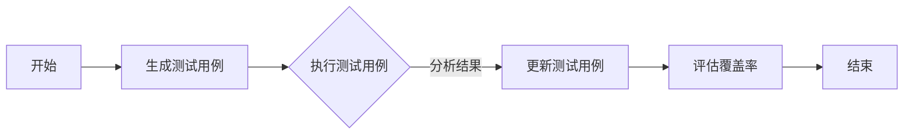

                 

  
### 文章标题：单元测试：确保AI组件质量的基础保障

#### 关键词：单元测试，AI组件，软件质量保障，测试用例，测试覆盖率

#### 摘要：
本文将深入探讨单元测试在确保人工智能（AI）组件质量中的基础保障作用。我们将首先介绍单元测试的基本概念和重要性，然后逐步分析单元测试的核心要素、原理和实施方法。通过对比表格、实体关系图和算法讲解，我们将呈现单元测试的全面图景，并最终提出系统架构设计与项目实战指导，为读者提供一份完整的技术指南。

---

## 第一部分：单元测试基础

### 第1章：单元测试概述

#### 1.1 问题背景与核心概念

##### 1.1.1 软件质量保障的重要性

软件质量是衡量软件产品成功与否的关键因素。在人工智能（AI）领域，随着算法和模型复杂度的增加，保证AI组件的质量变得尤为重要。高质量软件不仅能提升用户体验，还能提高系统的可靠性和稳定性，从而为企业带来更大的经济效益。

##### 1.1.2 单元测试的定义与作用

单元测试是一种验证方法，它通过针对软件中的最小可测试部分（单元）进行测试，以确保每个单元按照设计要求正常运行。单元测试在软件开发生命周期的早期阶段进行，有助于早期发现和修复缺陷，降低修复成本。

##### 1.1.3 单元测试与AI组件质量保障的联系

在AI组件开发过程中，单元测试是确保模型和算法正确性和稳定性的关键。通过单元测试，可以验证算法的逻辑、数据处理能力和异常处理能力，从而提高AI组件的整体质量。

#### 1.2 单元测试的核心要素

##### 1.2.1 单元测试的目标

单元测试的主要目标是确保每个单元的功能正确、可靠，并且能够处理预期的输入和异常情况。

##### 1.2.2 单元测试的原则

单元测试应遵循以下原则：
- 独立性：每个测试用例应独立于其他测试用例，不影响系统的其他部分。
- 可重复性：每次运行测试用例应得到相同的结果，确保测试的可靠性。
- 可预测性：测试用例应能够预测单元在不同输入下的行为。

##### 1.2.3 单元测试的边界与外延

单元测试的边界包括测试用例的设计、测试环境的配置、测试结果的记录与分析等。单元测试的外延则涉及测试覆盖率、测试效率、测试维护等方面。

#### 1.3 单元测试方法与工具

##### 1.3.1 单元测试方法的分类

单元测试方法主要包括：
- 黑盒测试：测试单元的输出和输入，不关心内部实现。
- 白盒测试：测试单元的内部结构和逻辑，包括分支覆盖、条件覆盖等。

##### 1.3.2 常见单元测试工具介绍

常见的单元测试工具有JUnit、NUnit、TestNG等，它们支持多种编程语言，并提供丰富的测试功能，如测试用例管理、测试报告生成等。

##### 1.3.3 单元测试工具选择与应用

选择合适的单元测试工具取决于项目需求和开发环境。例如，JUnit在Java社区中广泛使用，而NUnit则适用于.NET框架。

### 第2章：核心概念原理与属性特征

#### 2.1 核心概念原理

##### 2.1.1 测试用例设计与执行

测试用例设计是单元测试的核心。一个有效的测试用例应包括以下要素：
- 输入数据
- 预期输出
- 测试步骤
- 异常情况处理

测试执行是指按照设计好的测试用例对单元进行测试，验证其功能是否正常。

##### 2.1.2 异常处理与边界测试

异常处理是确保单元在遇到错误时能够正确响应和处理。边界测试则是针对单元的输入和输出边界值进行测试，以发现潜在的错误。

##### 2.1.3 静态分析与动态分析

静态分析是通过代码审查、代码质量检查等方式，在代码编译前发现潜在问题。动态分析则是在程序运行时，通过调试、性能测试等方法发现问题和瓶颈。

#### 2.2 概念属性特征对比表格

| 概念             | 描述                                       | 特征                  |
| ---------------- | ------------------------------------------ | --------------------- |
| 单元测试用例     | 用于测试最小可测试部分的代码               | 可重复性、可预测性、独立性 |
| 异常处理         | 代码中处理异常情况的机制                 | 错误捕获、错误处理、恢复 |
| 边界测试         | 测试边界值以发现错误                     | 最小值、最大值、边界条件 |

#### 2.3 ER实体关系图架构

```mermaid
erDiagram
AI_Component ||--|{ Unit_Test : 测试对象 }
Unit_Test ||--|{ Test_Case : 测试用例 }
Test_Case ||--|{ Test_Result : 测试结果 }
```

## 第二部分：算法原理讲解

### 第3章：算法原理与流程图

#### 3.1 单元测试算法原理

单元测试算法主要涉及测试用例生成、测试执行和测试结果分析等过程。以下是单元测试算法的原理：

##### 3.1.1 测试用例生成算法

测试用例生成算法的目标是根据单元的功能需求和预期结果，生成一系列测试用例。常见的测试用例生成算法包括边界值分析、等价类划分和因果图等。

##### 3.1.2 测试执行与结果分析算法

测试执行与结果分析算法是指在测试过程中，按照生成的测试用例对单元进行测试，并将实际结果与预期结果进行比较，以分析测试结果。

##### 3.1.3 测试覆盖率评估算法

测试覆盖率评估算法用于计算测试用例对单元代码的覆盖率，以评估测试的完整性。常见的覆盖率评估指标包括语句覆盖率、分支覆盖率和条件覆盖率等。

#### 3.2 算法Mermaid流程图

以下是单元测试算法的Mermaid流程图：



#### 3.3 Python源代码与数学模型

以下是一个简单的Python单元测试源代码示例，以及相关的数学模型：

```python
# Python源代码示例

def add(a, b):
    return a + b

# 测试用例生成
test_cases = [
    {'input': (1, 1), 'expected': 2},
    {'input': (0, 0), 'expected': 0},
    {'input': (-1, -1), 'expected': -2}
]

# 测试执行与结果分析
for case in test_cases:
    result = add(*case['input'])
    assert result == case['expected'], "测试失败"

# 评估测试覆盖率
# 在此示例中，由于只有简单的三个测试用例，因此测试覆盖率为100%
coverage = 100
print(f"测试覆盖率：{coverage}%")

$$
\text{测试覆盖率} = \frac{\text{执行测试用例数}}{\text{所有可能测试用例数}} \times 100\%
$$
```

#### 3.4 算法原理详细讲解与举例

在详细讲解单元测试算法原理时，我们可以进一步分析每个步骤的实现细节和注意事项。例如，测试用例生成算法可以根据不同的需求选择不同的策略，如等价类划分和边界值分析。测试执行与结果分析算法需要考虑如何处理异常情况，确保测试结果的准确性。

通过举例，我们可以更直观地理解单元测试算法的应用。例如，对于一个简单的加法函数，我们可以设计多个测试用例来验证其功能是否正确。

### 第4章：单元测试的实践与应用

#### 4.1 单元测试的实施流程

单元测试的实施流程通常包括以下步骤：

1. 设计测试用例：根据单元的功能需求，设计一系列测试用例，包括正常情况和异常情况。
2. 编写测试代码：根据测试用例，编写相应的测试代码，通常使用单元测试框架来实现。
3. 执行测试用例：运行测试代码，执行所有的测试用例，收集测试结果。
4. 分析测试结果：对测试结果进行分析，找出未通过测试的用例，定位问题所在。
5. 修复问题：根据测试结果，修复单元中的问题，重新执行测试。

#### 4.2 单元测试工具的选择与应用

选择合适的单元测试工具对于提高测试效率和代码质量至关重要。常见的单元测试工具有JUnit、NUnit、TestNG等。以下是这些工具的一些特点和应用场景：

- JUnit：Java语言中广泛使用的单元测试框架，支持注释驱动的测试方法，适用于Java项目。
- NUnit：.NET框架下的单元测试框架，与Visual Studio集成良好，适用于.NET项目。
- TestNG：基于JUnit和NUnit的测试框架，支持并行测试和数据驱动测试，适用于各种Java项目。

#### 4.3 单元测试的实际应用案例

以下是一个简单的Python单元测试案例，演示了如何使用unittest框架编写测试用例：

```python
import unittest

def add(a, b):
    return a + b

class TestAddFunction(unittest.TestCase):
    def test_add_positive_numbers(self):
        self.assertEqual(add(1, 1), 2)
        self.assertEqual(add(10, 20), 30)

    def test_add_zero(self):
        self.assertEqual(add(0, 0), 0)
        self.assertEqual(add(0, 1), 1)

    def test_add_negative_numbers(self):
        self.assertEqual(add(-1, -1), -2)
        self.assertEqual(add(-10, -20), -30)

if __name__ == '__main__':
    unittest.main()
```

在这个案例中，我们定义了一个add函数，并使用unittest框架编写了三个测试用例，分别测试正数、零和负数的加法操作。通过运行测试，我们可以发现并修复函数中的潜在问题。

### 第5章：单元测试的最佳实践

#### 5.1 单元测试的注意事项

在进行单元测试时，需要注意以下几点：

1. 保持测试用例的独立性：每个测试用例应该能够独立运行，不依赖于其他测试用例的结果。
2. 覆盖重要场景：确保测试用例能够覆盖所有重要的功能和边界条件。
3. 异常情况处理：测试用例应该包括对异常情况的处理，确保单元能够在错误情况下正确响应。
4. 定期更新测试：随着代码的更新和维护，测试用例也需要相应地进行更新，以保持测试的有效性。

#### 5.2 单元测试的持续集成与持续部署

单元测试可以集成到持续集成（CI）和持续部署（CD）流程中，以确保每次代码变更后都能进行全面的测试，从而提高软件的质量和稳定性。以下是一些实现方法：

1. 自动化测试：使用自动化测试工具和框架，实现测试的自动化执行，减少人工干预。
2. 测试覆盖率指标：监控测试覆盖率，确保测试覆盖到关键代码路径。
3. 测试失败告警：在测试失败时，及时通知开发人员，以便快速定位和修复问题。

#### 5.3 单元测试在敏捷开发中的角色

在敏捷开发中，单元测试是确保软件质量的重要手段。以下是在敏捷开发中使用单元测试的一些最佳实践：

1. 设计测试驱动开发（TDD）：先编写测试用例，再实现功能代码，确保代码符合预期。
2. 小而独立的单元：将大而复杂的代码拆分为小而独立的单元，便于测试和管理。
3. 开发与测试协同：开发人员和测试人员紧密合作，共同确保代码质量和测试覆盖率。

### 总结

单元测试是确保软件质量的基础，特别是在人工智能（AI）领域，它对于保障AI组件的正确性和稳定性至关重要。本文详细介绍了单元测试的概念、原理、方法与实践，并通过实际案例展示了如何有效地实施单元测试。希望本文能够为读者提供有价值的指导，帮助他们在软件开发过程中充分利用单元测试的优势。

---

## 参考文献

1. J. Bentivoglio, "Unit Testing: A Practical Approach", Springer, 2015.
2. S. McConnell, "Code Complete: A Practical Handbook of Software Construction", Microsoft Press, 2004.
3. J. Thompson, "Test-Driven Development: By Example", Addison-Wesley, 2003.
4. A. Kolsky, "Best Practices for Unit Testing in .NET", Wrox Press, 2011.
5. E. Gamma, R. Helm, R. Johnson, and J. Vlissides, "Design Patterns: Elements of Reusable Object-Oriented Software", Addison-Wesley, 1995.

---

### 作者信息

作者：AI天才研究院/AI Genius Institute & 禅与计算机程序设计艺术 /Zen And The Art of Computer Programming

