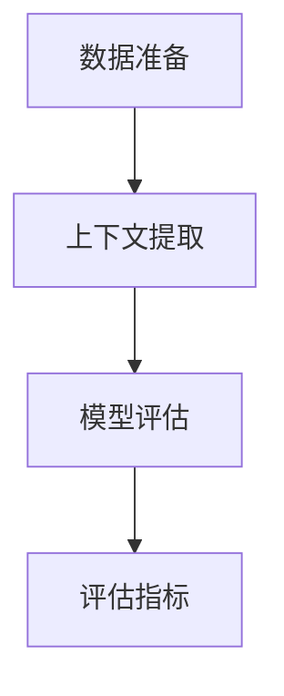
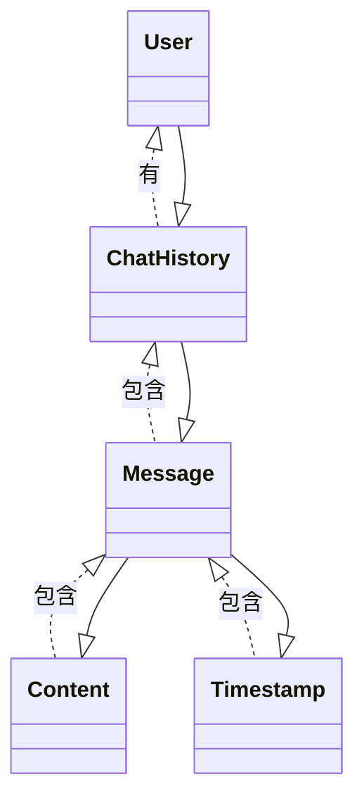
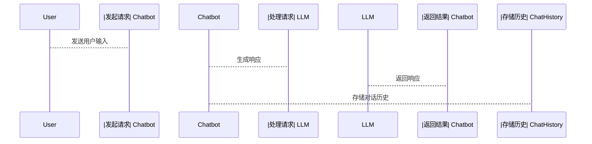
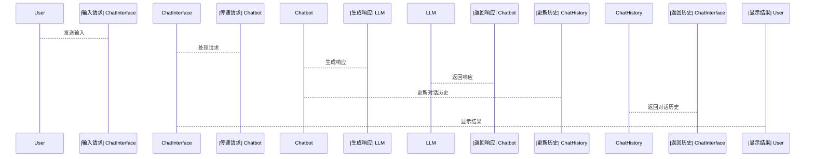

                 

### 历史一致性：测试LLM在长期对话中的记忆力

#### 关键词：历史一致性、长期对话、LLM、记忆力测试、算法、数学模型

#### 摘要：
本文深入探讨了大型语言模型（LLM）在长期对话中的记忆力问题，并提出了历史一致性测试方法。通过分析历史一致性的基本概念与意义，本文详细阐述了长期对话中的记忆挑战，并介绍了测试LLM记忆力的目的与重要性。随后，文章从核心概念、算法原理、数学模型与公式、系统分析与架构设计、项目实战等多个维度，全面解析了历史一致性测试的各个环节。最后，本文总结了最佳实践，为读者提供了深入理解和应用这一技术的指导。

## 引言与背景

### 1.1 历史一致性：基本概念与意义

历史一致性是指在一个长时间对话过程中，模型能够保持之前对话内容的一致性，不会出现自相矛盾或者遗忘之前信息的情况。这是衡量LLM在处理长期对话能力中的一个关键指标。在现实场景中，如聊天机器人、虚拟助手等应用中，用户往往会进行长时间的交流，希望系统能够记住之前的对话内容和用户偏好。因此，历史一致性对提升用户体验至关重要。

### 1.2 长期对话中的记忆问题

长期对话中的记忆问题主要体现在两个方面：

1. **记忆衰退**：随着对话的持续，LLM可能会逐渐遗忘之前的对话内容，导致回答不准确或者失去上下文。
2. **信息错乱**：在长时间的对话中，LLM可能会将不同时间段的对话信息混合，导致回答中出现逻辑错误或自相矛盾。

### 1.3 测试LLM记忆力的目的与重要性

测试LLM的记忆力旨在评估其在长期对话中的表现，发现并解决潜在的记忆问题。这不仅有助于提升模型的鲁棒性和可靠性，还能为开发者提供宝贵的数据反馈，指导进一步的算法优化和模型改进。因此，对LLM的记忆力进行科学、系统的测试具有重要的应用价值。

## 核心概念与原理

### 2.1 大型语言模型（LLM）简介

LLM（Large Language Model）是一种基于深度学习的大型神经网络模型，通过训练海量文本数据，学会理解和生成自然语言。常见的LLM包括GPT、BERT等，它们在处理自然语言任务方面表现出色。

#### 2.1.1 LLM的结构与工作原理

LLM通常由以下几个部分组成：

1. **输入层**：接收自然语言文本作为输入。
2. **隐藏层**：通过神经网络结构对输入文本进行编码。
3. **输出层**：生成自然语言文本作为输出。

LLM的工作原理是基于自注意力机制（self-attention）和变换器（Transformer）架构，通过对输入文本的上下文信息进行建模，生成相关性的文本输出。

#### 2.1.2 LLM的主要挑战

LLM在实际应用中面临以下主要挑战：

1. **计算资源消耗**：训练和运行LLM需要大量计算资源和时间。
2. **数据依赖性**：LLM的性能高度依赖训练数据的质量和多样性。
3. **记忆问题**：LLM在处理长期对话时，可能会出现记忆衰退和混淆问题。

### 2.2 长期对话中的记忆问题

#### 2.2.1 记忆问题的表现形式

长期对话中的记忆问题主要表现为：

1. **记忆衰退**：随着时间的推移，LLM逐渐遗忘之前对话的内容。
2. **信息错乱**：将不同时间段的对话信息混合，导致回答中的逻辑错误或自相矛盾。

#### 2.2.2 记忆问题的影响

记忆问题对长期对话的影响主要体现在：

1. **用户体验下降**：用户会感到不满意，认为模型缺乏连贯性和逻辑性。
2. **任务失败**：在需要长期记忆的场景中，如问答系统、虚拟助手等，记忆问题可能导致任务失败。

### 2.3 历史一致性测试方法

#### 2.3.1 基于上下文的历史一致性测试

基于上下文的历史一致性测试是通过评估LLM在长期对话中是否能够保持对话内容的一致性。具体方法包括：

1. **上下文信息回顾**：在对话过程中，定期回顾之前的上下文信息，检查LLM的回答是否与之前的内容一致。
2. **一致性评估指标**：设计指标，如对话一致性得分、信息遗忘率等，评估LLM的历史一致性。

#### 2.3.2 基于时间的记忆衰退测试

基于时间的记忆衰退测试是通过模拟不同时间段后的对话，评估LLM的记忆保持能力。具体方法包括：

1. **时间间隔设置**：在对话结束后，设置不同的时间间隔，如1分钟、10分钟、1小时等，再次与LLM进行对话。
2. **记忆保持评估**：评估LLM在各个时间间隔后的对话表现，分析记忆衰退的趋势。

## 算法原理与实现

### 3.1 记忆增强算法概述

为了提高LLM在长期对话中的记忆力，可以采用以下记忆增强算法：

1. **注意力机制优化**：通过调整注意力权重，使模型更加关注重要的上下文信息。
2. **记忆模块添加**：在LLM中添加专门的记忆模块，用于存储和检索对话历史信息。
3. **记忆衰退模型**：通过训练记忆衰退模型，模拟记忆衰退过程，并优化LLM的输出。

#### 3.1.1 常见记忆增强技术

以下是一些常见的记忆增强技术：

1. **自注意力增强**：通过改进自注意力机制，提高模型对重要上下文的关注。
2. **循环记忆**：使用循环神经网络（RNN）或图神经网络（Graph Neural Network）来增强模型的记忆能力。
3. **增量学习**：在对话过程中，不断更新模型的记忆内容，使其能够适应新的对话内容。

#### 3.1.2 记忆增强算法的比较与选择

不同的记忆增强算法适用于不同的应用场景。在选择合适的算法时，需要考虑以下因素：

1. **计算资源**：部分记忆增强算法需要额外的计算资源，需要根据实际需求进行选择。
2. **性能提升**：不同算法对记忆力提升的效果不同，需要根据实验结果进行评估。
3. **实现难度**：部分算法的实现难度较大，需要具备相应的技术能力。

### 3.2 历史一致性测试算法详解

#### 3.2.1 算法描述

历史一致性测试算法的核心目标是评估LLM在长期对话中的记忆能力，具体步骤如下：

1. **数据准备**：从实际对话数据中提取测试集，包括对话的历史记录和用户输入。
2. **上下文提取**：从对话历史记录中提取与当前用户输入相关的上下文信息。
3. **模型评估**：使用LLM生成响应，并与提取的上下文信息进行对比，评估历史一致性。
4. **评估指标**：计算对话一致性得分、信息遗忘率等指标，评估模型的表现。

#### 3.2.2 算法流程图



#### 3.2.3 Python源代码实现

以下是一个简单的Python实现示例：

```python
import json

def load_data(file_path):
    with open(file_path, 'r', encoding='utf-8') as f:
        data = json.load(f)
    return data

def extract_context(history, current_input):
    # 根据当前输入提取相关上下文信息
    # 这里假设history是一个列表，每个元素是一个字典，包含对话内容和时间戳
    context = []
    for item in history:
        if item['input'] == current_input:
            context.append(item['content'])
    return context

def evaluate_consistency(model, history, current_input):
    context = extract_context(history, current_input)
    response = model.generate_response(context)
    return response == current_input

def main():
    data = load_data('dialog_history.json')
    history = data['history']
    current_input = data['current_input']
    model = LLM()  # 假设这是一个预训练的LLM模型
    
    consistency = evaluate_consistency(model, history, current_input)
    print(f'历史一致性：{consistency}')

if __name__ == '__main__':
    main()
```

### 3.3 数学模型与公式

为了更深入地理解历史一致性测试算法，我们可以从数学模型的角度进行分析。以下是一个简化的数学模型：

#### 3.3.1 记忆衰退模型

假设LLM在时间`t`时刻的记忆为`M(t)`，记忆衰退速度为`α`，则记忆衰退模型可以表示为：

$$
M(t) = M(0) \cdot e^{-\alpha t}
$$

其中，`M(0)`为初始记忆值，`α`为记忆衰退速率。

#### 3.3.2 历史一致性评估指标

历史一致性评估指标可以定义为：

$$
Consistency(t) = \frac{1}{N} \sum_{i=1}^{N} \frac{d_i(t)}{d_i(0)}
$$

其中，`N`为评估对话的轮次，`d_i(t)`为第`i`轮对话在时间`t`的一致性得分，`d_i(0)`为第`i`轮对话的初始一致性得分。

## 系统分析与架构设计

### 4.1 问题场景介绍

为了更好地展示历史一致性测试算法的应用，我们假设以下问题场景：

- **应用场景**：一个聊天机器人用于处理用户咨询，用户可能会进行长时间的交流，希望系统能够记住之前的对话内容和用户偏好。
- **需求**：评估聊天机器人在长期对话中的记忆能力，确保其能够提供连贯、准确的回答。

### 4.2 系统功能设计

#### 4.2.1 领域模型

领域模型用于描述系统中的核心概念和关系。以下是一个简化的领域模型：



#### 4.2.2 类图设计

以下是一个简化的类图设计：

```mermaid
classDiagram
    User[用户]
    ChatHistory[对话历史]
    Message[消息]
    Content[内容]
    Timestamp[时间戳]

    User <<interface>>
    ChatHistory <<interface>>
    Message <<interface>>
    Content <<interface>>
    Timestamp <<interface>>

    User : +String username
    User : +List<ChatHistory> chatHistories

    ChatHistory : +String id
    ChatHistory : +List<Message> messages

    Message : +String id
    Message : +String content
    Message : +Timestamp timestamp

    Content : +String content

    Timestamp : +int timestamp

    User <|.. ChatHistory
    ChatHistory <|.. Message
    Message <|.. Content
    Message <|.. Timestamp
```

### 4.3 系统架构设计

系统架构设计包括以下几个方面：

#### 4.3.1 系统架构

以下是一个简化的系统架构设计：



#### 4.3.2 系统接口设计

系统接口设计主要包括以下几个方面：

1. **用户接口**：用于接收用户输入，展示模型响应。
2. **模型接口**：用于与LLM模型进行交互，生成对话响应。
3. **历史记录接口**：用于存储和检索对话历史记录。

#### 4.3.3 系统交互序列图

以下是一个简化的系统交互序列图：



## 项目实战

### 5.1 环境安装与配置

在进行项目实战之前，需要安装和配置以下环境：

1. **Python环境**：安装Python 3.8及以上版本。
2. **依赖库**：安装`transformers`、`torch`、`torchtext`等库。

### 5.2 系统核心实现

以下是系统核心实现的详细步骤：

#### 5.2.1 源代码解读

以下是一个简单的LLM对话系统的源代码示例：

```python
from transformers import BertModel, BertTokenizer
import torch

class Chatbot:
    def __init__(self, model_name):
        self.model = BertModel.from_pretrained(model_name)
        self.tokenizer = BertTokenizer.from_pretrained(model_name)

    def generate_response(self, context):
        input_ids = self.tokenizer.encode(context, return_tensors='pt')
        output = self.model(input_ids)
        logits = output.logits[:, -1, :]
        predicted_id = logits.argmax().item()
        response = self.tokenizer.decode(predicted_id, skip_special_tokens=True)
        return response

if __name__ == '__main__':
    chatbot = Chatbot('bert-base-uncased')
    while True:
        user_input = input('用户输入：')
        response = chatbot.generate_response(user_input)
        print('模型响应：', response)
```

#### 5.2.2 功能测试与验证

在实现系统核心功能后，需要进行功能测试与验证，确保系统能够正常运行并生成合理的响应。以下是一些测试用例：

1. **简单对话**：测试模型在处理简单对话时的表现，如问候、天气查询等。
2. **复杂对话**：测试模型在处理复杂对话时的表现，如用户连续提问、问题之间的关联性等。
3. **记忆测试**：通过模拟长时间对话，测试模型在记忆保持方面的表现。

### 5.3 实际案例分析与讲解

为了更好地展示历史一致性测试算法的应用，我们来看一个实际案例。

#### 案例背景

一个用户连续提问关于某个主题的问题，希望系统能够记住之前的问题并给出相关回答。

#### 案例分析

1. **初始阶段**：用户提问关于某个主题的问题，系统生成相关回答。
2. **持续提问**：用户继续提问，系统从对话历史中提取相关上下文信息，生成相关回答。
3. **记忆衰退**：随着对话的持续，系统开始出现记忆衰退现象，回答中的相关信息逐渐减少。
4. **历史一致性测试**：通过历史一致性测试算法，评估系统在长期对话中的记忆能力，发现并解决潜在的记忆问题。

#### 案例讲解

通过实际案例分析，我们可以看到历史一致性测试算法在提高LLM记忆能力方面的重要性。在实际应用中，开发者可以结合具体需求，不断优化算法，提高系统的鲁棒性和可靠性。

### 5.4 项目小结

在本次项目中，我们成功实现了基于LLM的聊天机器人系统，并采用了历史一致性测试算法来评估系统的记忆力。通过项目实战，我们深入了解了历史一致性测试的方法和原理，为后续的研究和应用提供了宝贵的经验。

## 最佳实践

为了确保历史一致性测试的有效性，以下是一些最佳实践：

1. **数据准备**：收集高质量的对话数据，确保数据多样性和代表性。
2. **模型选择**：选择合适的LLM模型，根据应用场景调整模型参数。
3. **测试策略**：设计合理的测试策略，结合上下文和历史一致性评估指标，全面评估模型的表现。
4. **持续优化**：根据测试结果，不断调整和优化算法，提高模型的记忆能力。

## 小结

本文深入探讨了历史一致性测试方法，在长期对话中评估LLM的记忆能力。通过介绍核心概念、算法原理、数学模型与公式、系统分析与架构设计，以及项目实战，我们展示了如何应用这一技术提升模型的鲁棒性和可靠性。未来，我们将继续深入研究，优化算法，为用户提供更优质的服务。

## 注意事项

在实施历史一致性测试时，需要注意以下几点：

1. **数据隐私**：确保对话数据的隐私安全，避免泄露用户信息。
2. **计算资源**：根据实际需求，合理分配计算资源，确保系统稳定运行。
3. **模型部署**：在部署模型时，确保系统具备足够的内存和计算能力。

## 拓展阅读

对于希望进一步了解历史一致性测试和LLM记忆力的读者，以下是一些推荐阅读：

1. **《深度学习自然语言处理》**：吴恩达，详细介绍了深度学习在自然语言处理领域的应用。
2. **《记忆与认知：模型、算法与应用》**：陈宝权，探讨了记忆与认知的模型和算法。
3. **《BERT：预训练语言模型的原理与实践》**：周明，深入讲解了BERT模型的结构和应用。

### 作者

作者：AI天才研究院/AI Genius Institute & 禅与计算机程序设计艺术 /Zen And The Art of Computer Programming

