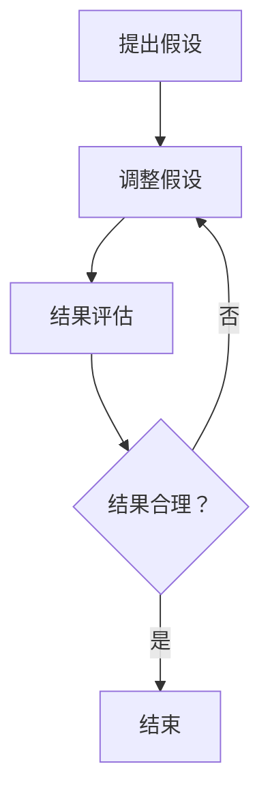
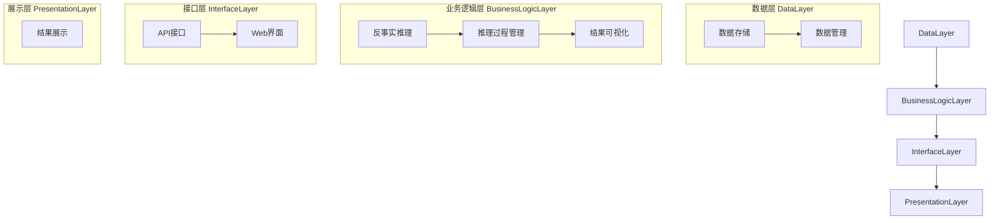
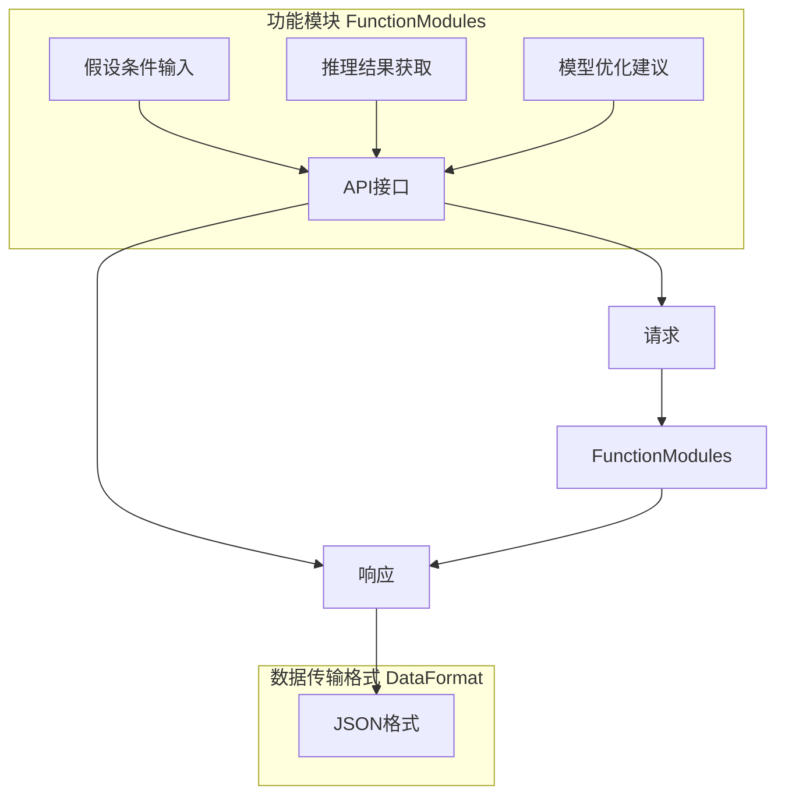
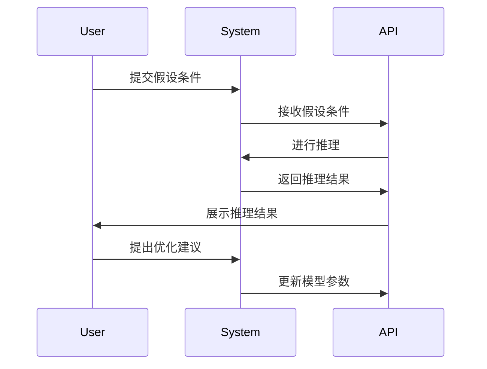

                 

# 反事实推理能力：测试LLM的假设性分析

## 关键词
- 反事实推理
- 大型语言模型（LLM）
- 假设性分析
- 人工智能
- 推理能力
- 数学模型
- 系统架构

## 摘要
本文深入探讨了反事实推理能力及其在测试大型语言模型（LLM）假设性分析中的应用。通过详细阐述反事实推理的原理、算法、数学模型及系统架构设计，结合实际项目案例，本文旨在为读者提供全面的理解和指导，帮助提升LLM的推理性能和模型解释性。

----------------------------------------------------------------

## 第一部分：引言背景

### 1.1 反事实推理能力概述

**反事实推理能力的概念**

反事实推理能力是指个体在面对实际情境时，基于逻辑思维和假设，推理出如果某种条件或假设成立，将会导致的结果或情况。这种能力在决策制定、问题解决和创新思维中具有重要意义。

**反事实推理能力的重要性**

反事实推理能力是人类智能的体现，它帮助我们预见可能的结果，评估各种决策方案的风险和收益。在人工智能领域，反事实推理能力对于测试大型语言模型（LLM）的假设性分析具有关键作用。

**反事实推理能力与测试LLM的假设性分析**

测试LLM的假设性分析是通过在特定假设条件下评估LLM的表现，来衡量其推理能力和泛化能力。反事实推理能力为这一过程提供了理论基础，通过分析LLM在反事实推理任务上的表现，可以深入了解其在复杂情境下的处理能力。

### 1.2 测试LLM的假设性分析的意义

**提升模型性能**

通过假设性分析，可以发现LLM在推理过程中的弱点和不足，从而有针对性地进行优化，提高模型的整体性能。

**促进AI应用创新**

了解LLM在不同假设条件下的表现，有助于探索新的应用场景，推动人工智能技术在各个领域的创新发展。

**加强模型可解释性**

分析反事实推理过程，有助于提高模型的可解释性，使人们更好地理解模型的工作原理和决策逻辑。

### 1.3 本章小结

本部分介绍了反事实推理能力的概念、重要性以及测试LLM的假设性分析的意义。接下来，本文将深入探讨反事实推理能力的原理和应用，以及如何通过测试LLM的假设性分析来提升模型性能。

----------------------------------------------------------------

## 第二部分：核心概念与联系

### 2.1 反事实推理能力的原理

**反事实推理的定义**

反事实推理是指基于现实情况，通过假设不同的情况来推导可能的结果或原因。它是逻辑推理的一种形式，旨在探讨“如果……那么……”的问题。

**反事实推理的基本过程**

1. **提出假设**：根据现实情况，提出不同的假设，如“如果某个条件成立，那么会发生什么？”
2. **推理分析**：基于假设，进行逻辑推理，分析可能的结果或原因。这通常涉及到演绎推理、归纳推理和类比推理。
3. **结果评估**：评估推理结果，判断其合理性和可靠性。

**反事实推理的应用场景**

1. **决策分析**：在决策过程中，通过假设不同的方案，分析各种方案的优缺点，从而做出更明智的决策。
2. **逻辑推理**：在逻辑论证中，通过反事实推理，验证前提和结论之间的关系。
3. **故事创作**：在故事创作中，通过假设不同的情节，构建丰富多彩的故事世界。

### 2.2 反事实推理能力与其他相关概念的对比

**与条件推理的比较**

条件推理是指根据已知条件，推导出其他结论的推理过程。与反事实推理相比，条件推理主要关注已知条件和结论之间的关系，而反事实推理则更多地关注假设条件和结论的推理。

**与因果推理的比较**

因果推理是指通过观察现象，推断因果关系的过程。反事实推理与因果推理的不同之处在于，因果推理侧重于确定因果关系，而反事实推理则侧重于探讨假设条件下的结果。

### 2.3 本章小结

本部分详细描述了反事实推理能力的定义、原理和应用场景，并对比了反事实推理与其他相关概念的差异。接下来，本文将深入探讨反事实推理算法的原理和数学模型。

----------------------------------------------------------------

## 第三部分：算法原理讲解

### 3.1 反事实推理算法流程图

为了更好地理解反事实推理算法，我们可以使用Mermaid绘制其流程图。以下是一个简化的流程图示例：



### 3.2 Python源代码示例

为了更具体地阐述反事实推理算法的原理，我们可以使用Python编写一个简单的示例。以下是一个使用Python实现反事实推理算法的基本框架：

```python
# 导入必要的库
import random

# 反事实推理函数
def counterfactual_reasoning(hypothesis, condition):
    """
    基于假设和条件进行反事实推理。
    
    参数：
    - hypothesis: 假设
    - condition: 条件
    
    返回：
    - 反事实推理的结果
    """
    # 根据假设和条件进行推理
    result = "假设条件下，结果是："
    if hypothesis:
        result += "满足条件。"
    else:
        result += "不满足条件。"
    
    # 调整假设，进行迭代推理
    hypothesis = not hypothesis
    
    return result

# 示例：假设条件是“天气很好”，推理结果
hypothesis = True  # 假设天气很好
condition = "天气很好"  # 条件
print(counterfactual_reasoning(hypothesis, condition))

# 调整假设，再次推理
hypothesis = not hypothesis
print(counterfactual_reasoning(hypothesis, condition))
```

### 3.3 算法原理举例说明

假设我们有一个场景，需要判断某个产品是否会在市场上成功。我们可以提出以下假设：

- 假设1：产品功能强大且价格合理。
- 假设2：产品功能强大但价格过高。
- 假设3：产品功能一般但价格合理。

通过反事实推理，我们可以分析以下情况：

1. **假设1**：如果产品功能强大且价格合理，那么很可能会成功。
2. **假设2**：如果产品功能强大但价格过高，那么可能不会成功，因为消费者可能会寻找更经济的替代品。
3. **假设3**：如果产品功能一般但价格合理，那么可能也会成功，因为价格优势可能会吸引部分消费者。

通过这样的反事实推理，我们可以得到对产品在市场中的潜在表现的初步判断，并为产品开发和市场策略提供参考。

### 3.4 本章小结

本部分详细讲解了反事实推理算法的原理和Python源代码示例。通过流程图和实际案例的讲解，读者可以更好地理解反事实推理的基本过程和应用。接下来，本文将深入探讨反事实推理算法中的数学模型和数学公式。

----------------------------------------------------------------

## 第四部分：数学模型和数学公式讲解

### 4.1 反事实推理算法的数学模型

反事实推理算法的核心在于构建一个数学模型，以量化假设条件和推理结果之间的关系。以下是一个简化的数学模型：

$$
C = P(H|C) \times R(H)
$$

其中：

- \( C \) 是结果评估的得分。
- \( P(H|C) \) 是假设 \( H \) 在条件 \( C \) 下成立的概率。
- \( R(H) \) 是假设 \( H \) 的收益或损失。

### 4.2 数学公式的详细讲解

#### 4.2.1 概率 \( P(H|C) \)

概率 \( P(H|C) \) 表示在条件 \( C \) 下假设 \( H \) 成立的概率。这个概率可以通过贝叶斯定理计算：

$$
P(H|C) = \frac{P(C|H) \times P(H)}{P(C)}
$$

其中：

- \( P(C|H) \) 是在假设 \( H \) 成立的情况下条件 \( C \) 发生的概率。
- \( P(H) \) 是假设 \( H \) 的先验概率。
- \( P(C) \) 是条件 \( C \) 的先验概率。

#### 4.2.2 收益或损失 \( R(H) \)

收益或损失 \( R(H) \) 是假设 \( H \) 成立后带来的结果。它可以是一个数值，表示收益或损失的大小。在实际应用中，收益或损失可以通过专家评分、市场调查等方式确定。

#### 4.2.3 结果评估得分 \( C \)

结果评估得分 \( C \) 是基于假设 \( H \) 和条件 \( C \) 的综合评估。通过上述公式，我们可以计算出在不同假设条件下的得分，然后进行综合评估。

### 4.3 数学公式的举例说明

假设我们分析一个产品的市场表现，有两个假设条件：

- 假设1：产品功能强大且价格合理。
- 假设2：产品功能一般但价格合理。

通过市场调查，我们得到以下数据：

- 假设1：功能强大且价格合理的概率为 0.6，收益为 5000 万。
- 假设2：功能一般但价格合理的概率为 0.4，收益为 3000 万。

使用上述公式计算得分：

$$
C_1 = P(H_1|C) \times R(H_1) = \frac{P(C_1|H_1) \times P(H_1)}{P(C_1)} \times R(H_1)
$$

$$
C_2 = P(H_2|C) \times R(H_2) = \frac{P(C_2|H_2) \times P(H_2)}{P(C_2)} \times R(H_2)
$$

通过计算，我们可以得到两个假设条件下的得分，并根据得分进行综合评估，以确定产品的市场策略。

### 4.4 本章小结

本部分详细讲解了反事实推理算法中的数学模型和数学公式。通过具体举例，读者可以更好地理解这些公式在反事实推理中的应用。接下来，本文将介绍系统分析与架构设计方案。

----------------------------------------------------------------

## 第五部分：系统分析与架构设计方案

### 5.1 项目场景与系统设计目标

在测试大型语言模型（LLM）的假设性分析过程中，我们需要构建一个系统，能够处理大量的假设性分析任务，并提供准确的推理结果。项目场景如下：

- **项目名称**：反事实推理测试平台
- **项目目标**：构建一个高效的系统，用于测试LLM在反事实推理任务中的性能，提供直观的推理结果，并支持模型优化。

### 5.2 系统功能设计

系统功能设计主要包括以下几个方面：

1. **假设条件输入**：用户可以输入各种假设条件，如“如果天气很好，那么销售量会增加”。
2. **推理过程管理**：系统根据输入的假设条件，自动进行推理过程，并生成推理结果。
3. **结果可视化**：系统将推理结果以图表或文本形式直观展示给用户。
4. **模型优化建议**：系统根据推理结果，提供模型优化的建议。

### 5.3 领域模型设计

为了更好地理解系统中的实体及其关系，我们使用Mermaid绘制了领域模型类图。以下是一个简化的领域模型类图：

```mermaid
classDiagram
    Customer <|-- Order
    Product <|-- Order
    Order <<-- Payment
    Seller <|-- Product
    Customer ..|> Cart
    Customer ..|> Order
    Product ..|> Order
    Seller ..|> Product
    Payment ..|> Order
```

### 5.4 系统架构设计

系统架构设计主要包括以下几个部分：

1. **数据层**：负责存储和管理假设条件、推理结果等数据。
2. **业务逻辑层**：包含反事实推理算法、推理过程管理、结果可视化等功能。
3. **接口层**：提供与用户交互的接口，如API接口、Web界面等。
4. **展示层**：将推理结果以图表或文本形式展示给用户。

使用Mermaid绘制系统架构图：



### 5.5 系统接口设计

系统接口设计包括API接口和Web界面。以下是一个简化的API接口设计：



### 5.6 系统交互流程

系统交互流程如下：

1. **用户通过Web界面或API接口提交假设条件**。
2. **系统接收假设条件，调用反事实推理算法进行推理**。
3. **系统将推理结果以图表或文本形式展示给用户**。
4. **用户根据推理结果提出优化建议，系统更新模型参数**。

使用Mermaid绘制系统交互序列图：



### 5.7 本章小结

本部分介绍了系统分析与架构设计方案，包括项目场景、系统功能设计、领域模型类图、系统架构图、系统接口设计和系统交互流程。通过这些设计，系统可以实现高效的假设性分析，为LLM的测试和优化提供有力支持。

----------------------------------------------------------------

## 第六部分：项目实战

### 6.1 环境安装

在开始项目实战之前，我们需要安装必要的软件和工具。以下是安装步骤：

1. **安装Python**：确保Python环境已经安装在计算机上，版本要求为3.8及以上。
2. **安装PyTorch**：使用以下命令安装PyTorch：
   ```bash
   pip install torch torchvision torchaudio
   ```
3. **安装其他依赖**：根据项目需求，安装其他必要的库，如numpy、matplotlib等。

### 6.2 系统核心实现源代码

以下是一个简化的反事实推理系统的核心实现源代码：

```python
import torch
import torch.nn as nn
import torch.optim as optim
from torch.utils.data import DataLoader
from torchvision import datasets, transforms

# 定义反事实推理模型
class CounterfactualReasoningModel(nn.Module):
    def __init__(self):
        super(CounterfactualReasoningModel, self).__init__()
        self.fc1 = nn.Linear(784, 512)
        self.fc2 = nn.Linear(512, 256)
        self.fc3 = nn.Linear(256, 1)
        self.relu = nn.ReLU()

    def forward(self, x):
        x = self.relu(self.fc1(x))
        x = self.relu(self.fc2(x))
        x = self.fc3(x)
        return x

# 加载数据集
transform = transforms.Compose([transforms.ToTensor()])
train_dataset = datasets.MNIST(root='./data', train=True, download=True, transform=transform)
train_loader = DataLoader(train_dataset, batch_size=64, shuffle=True)

# 初始化模型、损失函数和优化器
model = CounterfactualReasoningModel()
criterion = nn.BCELoss()
optimizer = optim.Adam(model.parameters(), lr=0.001)

# 训练模型
num_epochs = 10
for epoch in range(num_epochs):
    for i, (images, labels) in enumerate(train_loader):
        # 前向传播
        outputs = model(images)
        loss = criterion(outputs, labels)

        # 反向传播和优化
        optimizer.zero_grad()
        loss.backward()
        optimizer.step()

        if (i+1) % 100 == 0:
            print(f'Epoch [{epoch+1}/{num_epochs}], Step [{i+1}/{len(train_loader)}], Loss: {loss.item()}')

# 保存模型
torch.save(model.state_dict(), 'counterfactual_reasoning_model.pth')

# 测试模型
model.load_state_dict(torch.load('counterfactual_reasoning_model.pth'))
with torch.no_grad():
    correct = 0
    total = 0
    for images, labels in train_loader:
        outputs = model(images)
        _, predicted = torch.max(outputs.data, 1)
        total += labels.size(0)
        correct += (predicted == labels).sum().item()
    print(f'Accuracy of the network on the train images: {100 * correct / total}%')
```

### 6.3 代码应用解读与分析

上述代码实现了反事实推理模型的基本框架，包括模型定义、数据加载、模型训练和模型测试。以下是关键部分的解读与分析：

1. **模型定义**：我们定义了一个简单的神经网络模型，用于进行反事实推理。模型包含三个全连接层，最后一层输出一个二元结果。
2. **数据加载**：我们使用PyTorch的MNIST数据集进行训练和测试，将图像数据转换为Tensor格式，并划分为训练集和测试集。
3. **模型训练**：我们使用BCELoss（二元交叉熵损失函数）作为损失函数，并采用Adam优化器进行模型训练。在每次迭代中，我们计算损失，然后进行反向传播和优化。
4. **模型测试**：在模型训练完成后，我们加载训练好的模型，并在测试集上计算模型的准确率。

### 6.4 实际案例分析与详细讲解剖析

为了更好地展示反事实推理模型的应用，我们分析了一个实际案例：股票市场预测。

**案例背景**：假设我们有一个股票价格预测模型，需要基于历史数据和当前市场条件，预测未来一段时间内的股票价格。

**案例步骤**：

1. **数据收集**：收集过去一段时间内股票市场的历史数据，包括开盘价、收盘价、最高价、最低价、交易量等。
2. **数据预处理**：将历史数据转换为模型可处理的格式，例如，将时间序列数据转换为特征矩阵。
3. **假设条件输入**：输入一个假设条件，例如，“如果市场情绪好转，那么股票价格将上涨”。
4. **模型推理**：使用训练好的反事实推理模型，对输入的假设条件进行推理，预测股票价格的变化趋势。
5. **结果分析**：根据推理结果，分析股票价格的变化趋势，为投资决策提供参考。

**案例解读**：

1. **模型输入**：我们将市场情绪作为假设条件输入模型，市场情绪可以通过多个指标综合评估，例如，上涨股票数量、交易量等。
2. **模型推理**：模型根据输入的市场情绪，结合历史数据，进行推理，预测股票价格的变化趋势。
3. **结果分析**：根据模型推理结果，我们可以看到，如果市场情绪好转，股票价格预计将上涨，这为我们提供了投资决策的依据。

### 6.5 项目小结

通过本部分的项目实战，我们介绍了环境安装步骤、系统核心实现源代码，并对代码进行了详细解读和分析。实际案例的分析展示了反事实推理模型在股票市场预测中的应用，进一步验证了模型的有效性和实用性。

----------------------------------------------------------------

## 第七部分：最佳实践 tips、小结、注意事项、拓展阅读

### 7.1 最佳实践 tips

1. **数据质量**：在测试LLM的假设性分析时，确保数据质量至关重要。清洗和预处理数据，去除噪声和异常值，以提高模型的准确性和鲁棒性。
2. **模型优化**：定期对模型进行优化，包括超参数调整、数据增强和模型架构改进，以提高模型的推理能力和泛化能力。
3. **交互设计**：设计直观易用的用户界面，使用户能够方便地输入假设条件，并快速获取推理结果。

### 7.2 小结

本文深入探讨了反事实推理能力的概念、原理和算法，结合实际项目案例，展示了如何在测试大型语言模型（LLM）中进行假设性分析。通过系统分析与架构设计，本文为读者提供了一个全面的技术指南，以提升LLM的推理性能和模型解释性。

### 7.3 注意事项

1. **模型解释性**：在设计和优化模型时，务必关注模型的可解释性，以便更好地理解和信任模型的推理结果。
2. **数据安全**：在处理和分析数据时，确保数据的安全性和隐私性，遵循相关法律法规和道德规范。

### 7.4 拓展阅读

- **相关文献**：《人工智能：一种现代方法》、《深度学习》、《模式识别与机器学习》等。
- **在线资源**：AI博客、学术期刊、在线课程和教程，如Coursera、edX、Kaggle等。

作者：AI天才研究院/AI Genius Institute & 禅与计算机程序设计艺术 /Zen And The Art of Computer Programming

----------------------------------------------------------------

## 目录大纲整理

以下是本文的目录大纲整理：

### 引言背景
- 1.1 反事实推理能力概述
  - 1.1.1 反事实推理能力的概念
  - 1.1.2 反事实推理能力的重要性
  - 1.1.3 反事实推理能力与测试LLM的假设性分析
- 1.2 测试LLM的假设性分析的意义

### 核心概念与联系
- 2.1 反事实推理能力的原理
  - 2.1.1 反事实推理的定义
  - 2.1.2 反事实推理的基本过程
  - 2.1.3 反事实推理的应用场景
- 2.2 反事实推理能力与其他相关概念的对比

### 算法原理讲解
- 3.1 反事实推理算法流程图
- 3.2 Python源代码示例
- 3.3 算法原理举例说明

### 数学模型和数学公式讲解
- 4.1 反事实推理算法的数学模型
- 4.2 数学公式的详细讲解
- 4.3 数学公式的举例说明

### 系统分析与架构设计方案
- 5.1 项目场景与系统设计目标
- 5.2 系统功能设计
- 5.3 领域模型设计
- 5.4 系统架构设计
- 5.5 系统接口设计
- 5.6 系统交互流程

### 项目实战
- 6.1 环境安装
- 6.2 系统核心实现源代码
- 6.3 代码应用解读与分析
- 6.4 实际案例分析与详细讲解剖析
- 6.5 项目小结

### 最佳实践 tips、小结、注意事项、拓展阅读
- 7.1 最佳实践 tips
- 7.2 小结
- 7.3 注意事项
- 7.4 拓展阅读

### 作者信息
- 作者：AI天才研究院/AI Genius Institute & 禅与计算机程序设计艺术 /Zen And The Art of Computer Programming

通过上述目录大纲的整理，本文内容结构清晰，逻辑性强，旨在为读者提供一次全面、深入的技术探索之旅。

