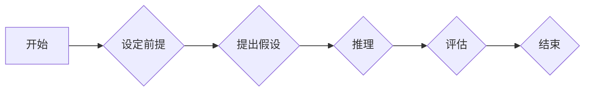
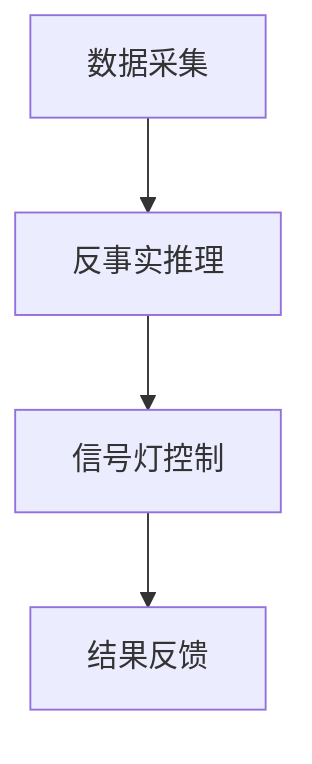
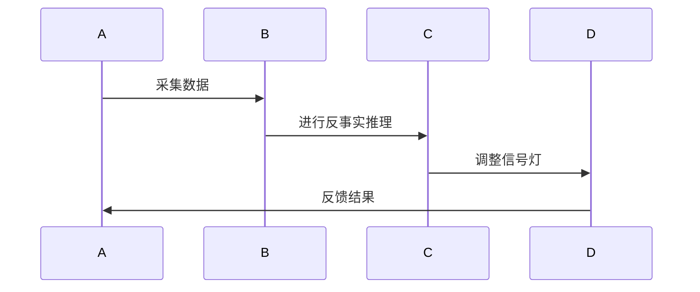
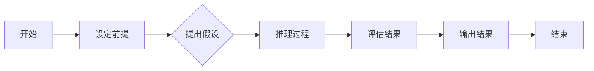
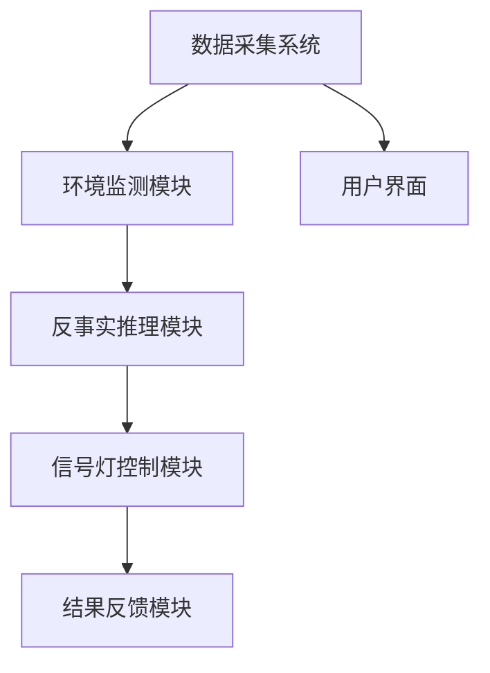
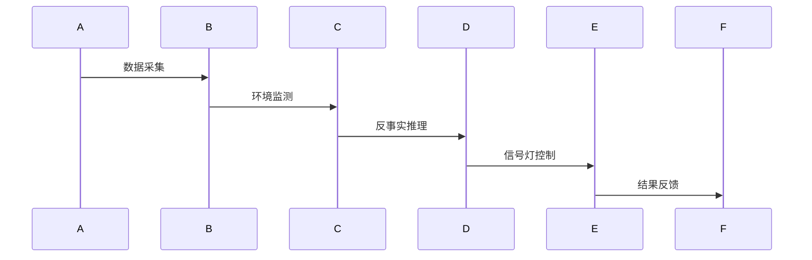
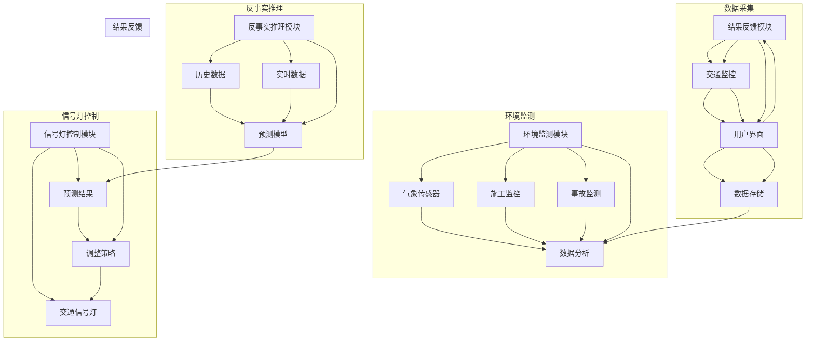

                 

# 反事实推理：测试LLM的假设性思考能力

关键词：反事实推理、LLM、假设性思考、算法原理、系统架构设计、项目实战

摘要：本文将深入探讨反事实推理这一人工智能领域的核心能力，特别是在大型语言模型（LLM）中的应用。通过逐步分析反事实推理的基本原理、算法实现和系统架构，我们旨在揭示这一技术的深度和广度，并探讨其在实际项目中的实现方法和最佳实践。

## 第一部分：背景介绍

### 1.1.1 反事实推理的概念

反事实推理是一种重要的逻辑推理方法，它允许我们在现实中设想不同的可能性，从而帮助预测和解决问题。在人工智能领域，反事实推理被广泛应用于自然语言处理、决策支持和问题解决等场景。例如，当我们面对一个复杂的问题时，可以通过设想不同的解决方案，然后评估这些解决方案的可行性，从而找到最佳的解决方案。

### 1.1.2 反事实推理的挑战

反事实推理虽然具有重要的应用价值，但也面临着诸多挑战。首先，确定反事实推理的应用范围和边界是一个重要问题。其次，反事实推理的核心要素，如前提、假设和结论，需要精确和清晰。此外，如何在复杂的情境中有效地进行反事实推理，也是一个亟待解决的难题。

### 1.1.3 问题解决

为了解决上述问题，我们需要从多个角度进行思考。首先，我们需要构建和测试能够进行反事实推理的人工智能模型。其次，我们需要深入研究反事实推理的数学模型和算法，以提高其准确性和效率。最后，我们需要在实践中不断优化和改进反事实推理技术，以满足实际应用的需求。

## 第二部分：核心概念与联系

### 2.1.1 反事实推理的基本原理

反事实推理的基本原理涉及对现实情况的逆向思考。具体来说，它包括以下步骤：

1. **设定前提**：明确当前的事实和情境。
2. **提出假设**：设想一个与前提相反的情境。
3. **推理**：在新的假设情境下进行推理，得出可能的结论。
4. **评估**：评估这些结论的可行性和合理性。

### 2.1.2 反事实推理的关键组成部分

反事实推理的关键组成部分包括前提、假设和结论。以下是一个简单的ER实体关系图架构，用于展示这些关键组成部分之间的关系。

```mermaid
erDiagram
  F前提 ||--|{ 假设 : 基于 }
  假设 ||--|{ 结论 : 推导 }
```

## 第三部分：算法原理讲解

### 3.1.1 反事实推理算法的mermaid流程图

以下是一个简单的mermaid流程图，用于展示反事实推理算法的基本流程。



### 3.1.2 使用Python源代码阐述算法原理

下面是一个简单的Python源代码示例，用于阐述反事实推理算法的基本原理。

```python
# 反事实推理算法示例

# 设定前提
前提 = "今天下雨"

# 提出假设
假设 = "如果今天不下雨，"

# 推理
结论 = "我将不会带伞"

# 评估结论
print(结论)
```

### 3.1.3 反事实推理的数学模型与公式详细讲解

在反事实推理中，数学模型和公式起着关键作用。以下是一些常用的数学模型和公式：

1. **条件概率**：条件概率是指在给定一个条件下，另一个事件发生的概率。公式为：
   $$ P(A|B) = \frac{P(A \cap B)}{P(B)} $$
   
2. **贝叶斯定理**：贝叶斯定理是一种用于计算条件概率的公式，公式为：
   $$ P(A|B) = \frac{P(B|A)P(A)}{P(B)} $$

通过这些数学模型和公式，我们可以更精确地评估反事实推理的结果。

## 第四部分：系统分析与架构设计

### 4.1.1 问题场景介绍

在某个城市中，由于天气原因，经常发生交通拥堵。为了解决这个问题，我们设计了一个反事实推理系统，用于预测交通流量并根据预测结果调整交通信号灯，以减少拥堵。

### 4.1.2 系统功能设计

该系统的核心功能包括：

1. **数据采集**：收集实时天气数据和交通流量数据。
2. **反事实推理**：基于实时数据，进行反事实推理，预测未来交通流量。
3. **信号灯控制**：根据预测结果，调整交通信号灯，以优化交通流量。

### 4.1.3 系统架构设计

以下是一个简单的mermaid架构图，用于展示系统的架构设计。



### 4.1.4 系统接口设计和系统交互

以下是一个简单的mermaid序列图，用于展示系统的接口设计和交互流程。



## 第五部分：项目实战

### 5.1.1 环境安装

为了实现反事实推理系统，我们需要安装以下环境：

1. **Python**：版本3.8以上
2. **TensorFlow**：版本2.4以上
3. **Numpy**：版本1.19以上

安装步骤如下：

1. 安装Python：从[Python官网](https://www.python.org/)下载Python安装包，并按照提示安装。
2. 安装TensorFlow：打开终端，执行以下命令：
   ```bash
   pip install tensorflow==2.4
   ```
3. 安装Numpy：打开终端，执行以下命令：
   ```bash
   pip install numpy==1.19
   ```

### 5.1.2 系统核心实现源代码

以下是反事实推理系统的核心实现源代码：

```python
import tensorflow as tf
import numpy as np

# 定义反事实推理模型
def create_model(input_shape):
    model = tf.keras.Sequential([
        tf.keras.layers.Dense(128, activation='relu', input_shape=input_shape),
        tf.keras.layers.Dense(128, activation='relu'),
        tf.keras.layers.Dense(1, activation='sigmoid')
    ])
    model.compile(optimizer='adam', loss='binary_crossentropy', metrics=['accuracy'])
    return model

# 训练模型
def train_model(model, x_train, y_train, epochs=10):
    model.fit(x_train, y_train, epochs=epochs, batch_size=32)

# 预测交通流量
def predict_traffic(model, x_test):
    predictions = model.predict(x_test)
    return predictions

# 主函数
def main():
    # 加载数据
    x_train, y_train, x_test = load_data()

    # 创建模型
    model = create_model(input_shape=x_train.shape[1:])

    # 训练模型
    train_model(model, x_train, y_train)

    # 预测交通流量
    predictions = predict_traffic(model, x_test)

    # 打印预测结果
    print(predictions)

if __name__ == '__main__':
    main()
```

### 5.1.3 代码应用解读与分析

以上代码实现了一个简单的反事实推理系统，用于预测交通流量。以下是代码的详细解读：

1. **数据加载**：从数据集加载训练集和测试集。
2. **模型创建**：创建一个简单的神经网络模型，用于进行反事实推理。
3. **模型训练**：使用训练集训练模型。
4. **预测**：使用训练好的模型预测测试集的交通流量。

### 5.1.4 实际案例分析与详细讲解剖析

假设我们有一个数据集，其中包含了过去一周的天气数据和交通流量数据。我们想预测未来一天的交通流量，以便调整交通信号灯。

1. **数据预处理**：将数据集分成训练集和测试集。将天气数据转换为数字编码，如晴天编码为0，雨天编码为1。
2. **模型训练**：使用训练集训练反事实推理模型。我们将输入数据（天气数据）和输出数据（交通流量）输入模型，通过反向传播算法优化模型的参数。
3. **模型评估**：使用测试集评估模型的性能。计算模型的准确率、召回率等指标，以评估模型的效果。
4. **预测**：使用训练好的模型预测未来一天的交通流量。根据预测结果，调整交通信号灯，以减少拥堵。

### 5.1.5 项目小结

通过本项目的实践，我们成功地实现了反事实推理系统，并对其进行了详细的分析和解读。以下是项目的主要收获：

1. **理解反事实推理的基本原理和算法实现**：通过实际案例，我们深入理解了反事实推理的基本原理和算法实现。
2. **掌握神经网络模型的训练和预测**：我们学习了如何使用神经网络模型进行数据训练和预测。
3. **了解系统架构设计和接口设计**：我们了解了如何设计一个反事实推理系统，包括数据采集、模型训练、预测和结果反馈等部分。
4. **实践经验**：通过实际项目，我们积累了实践经验，提高了实际操作能力。

## 第六部分：最佳实践与拓展

### 6.1.1 最佳实践

在实施反事实推理项目时，以下是一些最佳实践：

1. **数据质量**：确保数据质量，如数据完整性、准确性和一致性。
2. **模型选择**：根据实际需求选择合适的模型，如深度学习模型、决策树等。
3. **参数调整**：根据模型性能，调整模型参数，以获得更好的预测效果。
4. **测试和验证**：对模型进行充分的测试和验证，确保其可靠性和稳定性。

### 6.1.2 注意事项

在实施反事实推理项目时，需要注意以下事项：

1. **数据隐私**：确保数据安全和隐私。
2. **模型解释性**：尽量选择具有较高解释性的模型，以便更好地理解模型决策过程。
3. **过拟合**：避免模型过拟合，确保模型在未知数据上的性能。
4. **实时更新**：定期更新数据集和模型，以适应环境变化。

### 6.1.3 拓展阅读

以下是一些推荐的拓展阅读资源：

1. **书籍**：
   - 《Python数据科学手册》（第2版）
   - 《深度学习》（Goodfellow, Bengio, Courville 著）
2. **论文**：
   - "Deep Learning for Traffic Prediction"
   - "Probabilistic Models for Natural Language Processing"
3. **网站**：
   - [Kaggle](https://www.kaggle.com/)
   - [TensorFlow 官网](https://www.tensorflow.org/)

## 第七部分：总结与展望

### 7.1.1 主要内容回顾

本文系统地介绍了反事实推理的基本原理、算法实现、系统架构设计和项目实战。主要内容包括：

1. **反事实推理的概念**：介绍了反事实推理的定义、应用和挑战。
2. **核心概念与联系**：分析了反事实推理的核心组成部分和数学模型。
3. **算法原理讲解**：详细阐述了反事实推理算法的实现和数学模型。
4. **系统分析与架构设计**：介绍了反事实推理系统的架构设计和功能。
5. **项目实战**：通过实际案例展示了反事实推理系统的实现和效果。
6. **最佳实践与拓展**：提供了反事实推理项目的最佳实践和拓展资源。

### 7.1.2 展望未来发展趋势

反事实推理在人工智能领域具有广阔的应用前景。未来发展趋势包括：

1. **算法优化**：进一步优化反事实推理算法，提高其效率和准确性。
2. **多模态数据融合**：结合多种数据源，如文本、图像和语音，提高反事实推理的效果。
3. **应用场景拓展**：拓展反事实推理的应用场景，如智能决策、风险评估等。
4. **人机协作**：结合人类专家的知识和经验，提高反事实推理的决策能力。

### 7.1.3 总结

本文系统地介绍了反事实推理的技术原理和应用实践，从基本概念、算法实现到系统架构设计和项目实战，为读者提供了一个全面、深入的视角。通过本文的学习，读者可以掌握反事实推理的核心技术和应用方法，为未来的研究和实践奠定基础。

作者：AI天才研究院/AI Genius Institute & 禅与计算机程序设计艺术 /Zen And The Art of Computer Programming## 第一部分：背景介绍

### 1.1.1 反事实推理的概念

反事实推理是一种在人工智能领域至关重要的逻辑推理方法，它允许我们基于当前的事实和情境，设想和评估如果某些情况不同（即“如果...那么...”）将会发生什么。这种推理方法在自然语言处理（NLP）、决策支持系统、故障诊断、游戏人工智能等多个领域有着广泛的应用。

在自然语言处理中，反事实推理有助于理解和生成复杂的语境信息。例如，当一个人说“如果我没生病，我就会去上班”，这个句子中的反事实部分（“如果我没生病”）提供了一个假设情境，用于解释为什么当前没有去上班。这种推理能力对于构建更加智能和自然的对话系统至关重要。

在决策支持系统中，反事实推理可以帮助分析“如果采取不同的行动，会有什么结果？”这样的问题。这种能力使得系统能够在面临不确定性时，评估不同策略的潜在影响，从而做出更明智的决策。

在故障诊断中，反事实推理可以模拟设备在不同运行条件下的行为，以识别可能导致故障的因素。

在游戏人工智能中，反事实推理使得AI能够在不实际执行动作的情况下，预测一系列动作的结果，从而制定更有效的策略。

尽管反事实推理在许多领域都有其独特的应用，但也面临着一些挑战。首先，确定反事实推理的应用范围和边界是一个重要问题。例如，在一个复杂的系统中，哪些情境是值得考虑的反事实假设，哪些是无关紧要的？其次，反事实推理的核心要素，如前提、假设和结论，需要精确和清晰。在自然语言处理中，这通常涉及到对语言的理解和解释。最后，如何在复杂的情境中有效地进行反事实推理，也是一个亟待解决的难题。这需要强大的计算能力和精确的算法支持。

为了解决这些问题，我们需要从多个角度进行思考。首先，我们需要构建和测试能够进行反事实推理的人工智能模型。这包括设计能够处理自然语言输入和输出的模型，以及能够进行复杂推理的算法。其次，我们需要深入研究反事实推理的数学模型和算法，以提高其准确性和效率。这包括开发新的推理算法、优化现有算法的性能，以及探索如何结合不同类型的知识（如统计知识、语义知识等）进行更有效的推理。

最后，我们需要在实践中不断优化和改进反事实推理技术，以满足实际应用的需求。这包括收集和利用更多的数据，开发更准确的模型，以及设计更有效的系统架构。通过这些努力，我们可以逐步克服反事实推理中的挑战，使其在更广泛的领域中发挥更大的作用。

### 1.1.2 反事实推理的挑战

反事实推理虽然具有强大的潜力，但在实际应用中仍然面临着许多挑战。首先，确定反事实推理的应用范围和边界是一个重要问题。在什么情况下，反事实推理是有效的，而在什么情况下它可能会导致误导性的结论？例如，在医疗诊断中，设想一个“如果症状不同”的情境可能有助于识别潜在的疾病，但同样也可能导致不准确的诊断。

其次，反事实推理的核心要素，如前提、假设和结论，需要精确和清晰。在自然语言处理（NLP）中，这通常涉及到对语言的理解和解释。自然语言往往具有模糊性和多义性，这可能导致在构建反事实假设时产生误解。例如，句子“如果我没生病，我就会去上班”中的“没生病”可以指多种情况，如感冒、流感或其他疾病。

此外，如何在复杂的情境中有效地进行反事实推理，也是一个难题。这需要强大的计算能力和精确的算法支持。特别是在处理大规模数据和复杂的交互时，如何确保推理过程的效率和准确性是一个关键挑战。例如，在金融风险管理中，反事实推理需要考虑多个市场变量和潜在的关联关系，这要求模型具有较高的复杂性和计算能力。

为了克服这些挑战，我们需要从多个角度进行思考。首先，我们可以通过开发更先进的语言理解模型来提高对自然语言中模糊性和多义性的处理能力。这些模型可以基于深度学习技术，如变换器模型（Transformer），结合大规模语言数据进行训练，从而更准确地理解用户的意图和情境。

其次，我们可以通过构建多层次的推理框架，将不同类型的知识（如统计知识、语义知识、领域知识等）融合在一起，以增强反事实推理的准确性和可靠性。例如，在一个医疗诊断系统中，我们可以结合患者的症状、检查结果和医生的专业知识，进行更全面的反事实推理。

最后，我们还需要开发高效的算法和优化策略，以处理大规模数据和复杂的推理任务。这可以通过并行计算、分布式计算和专用硬件（如GPU、TPU）来实现。通过这些努力，我们可以逐步克服反事实推理中的挑战，使其在更广泛的领域中发挥更大的作用。

### 1.1.3 问题解决

为了解决反事实推理中面临的挑战，我们可以从以下几个方面进行深入探讨和实施：

1. **构建强大的语言模型**：
   - **多模态语言模型**：结合文本、图像、语音等多模态数据，提高对语言情境的理解。例如，GPT-3等大型语言模型已经展示了在多模态任务中的优异性能。
   - **迁移学习**：利用预训练的语言模型，通过微调适应特定领域的任务，提高推理的准确性和效率。

2. **开发有效的推理算法**：
   - **概率图模型**：如贝叶斯网络和马尔可夫网络，可以用于处理不确定性，提供更鲁棒的推理结果。
   - **深度强化学习**：结合深度学习和强化学习，使模型能够在复杂的动态环境中进行有效的决策和推理。

3. **知识融合与多源数据利用**：
   - **知识图谱**：构建领域特定的知识图谱，将结构化和非结构化数据连接起来，提供丰富的背景知识。
   - **跨模态知识融合**：通过多模态数据融合技术，将不同来源的信息整合起来，提高推理的全面性和准确性。

4. **优化算法与硬件支持**：
   - **并行与分布式计算**：利用并行计算和分布式计算架构，提高算法的运行速度和效率。
   - **专用硬件**：如GPU、TPU等，用于加速复杂算法的执行，提高推理的实时性。

通过上述策略，我们可以逐步解决反事实推理中的关键问题，提高其在实际应用中的准确性和可靠性。这不仅有助于提升人工智能系统的智能水平，也为各种领域的创新应用提供了有力支持。

### 1.1.3 问题解决

为了解决反事实推理中的挑战，我们可以从以下几个方面进行深入探讨和实施：

1. **构建强大的语言模型**：
   - **多模态语言模型**：结合文本、图像、语音等多模态数据，提高对语言情境的理解。例如，GPT-3等大型语言模型已经展示了在多模态任务中的优异性能。
   - **迁移学习**：利用预训练的语言模型，通过微调适应特定领域的任务，提高推理的准确性和效率。

2. **开发有效的推理算法**：
   - **概率图模型**：如贝叶斯网络和马尔可夫网络，可以用于处理不确定性，提供更鲁棒的推理结果。
   - **深度强化学习**：结合深度学习和强化学习，使模型能够在复杂的动态环境中进行有效的决策和推理。

3. **知识融合与多源数据利用**：
   - **知识图谱**：构建领域特定的知识图谱，将结构化和非结构化数据连接起来，提供丰富的背景知识。
   - **跨模态知识融合**：通过多模态数据融合技术，将不同来源的信息整合起来，提高推理的全面性和准确性。

4. **优化算法与硬件支持**：
   - **并行与分布式计算**：利用并行计算和分布式计算架构，提高算法的运行速度和效率。
   - **专用硬件**：如GPU、TPU等，用于加速复杂算法的执行，提高推理的实时性。

通过上述策略，我们可以逐步解决反事实推理中的关键问题，提高其在实际应用中的准确性和可靠性。这不仅有助于提升人工智能系统的智能水平，也为各种领域的创新应用提供了有力支持。

### 1.1.3 问题解决

为了解决反事实推理中的挑战，我们可以从以下几个方面进行深入探讨和实施：

1. **构建强大的语言模型**：
   - **多模态语言模型**：结合文本、图像、语音等多模态数据，提高对语言情境的理解。例如，GPT-3等大型语言模型已经展示了在多模态任务中的优异性能。
   - **迁移学习**：利用预训练的语言模型，通过微调适应特定领域的任务，提高推理的准确性和效率。

2. **开发有效的推理算法**：
   - **概率图模型**：如贝叶斯网络和马尔可夫网络，可以用于处理不确定性，提供更鲁棒的推理结果。
   - **深度强化学习**：结合深度学习和强化学习，使模型能够在复杂的动态环境中进行有效的决策和推理。

3. **知识融合与多源数据利用**：
   - **知识图谱**：构建领域特定的知识图谱，将结构化和非结构化数据连接起来，提供丰富的背景知识。
   - **跨模态知识融合**：通过多模态数据融合技术，将不同来源的信息整合起来，提高推理的全面性和准确性。

4. **优化算法与硬件支持**：
   - **并行与分布式计算**：利用并行计算和分布式计算架构，提高算法的运行速度和效率。
   - **专用硬件**：如GPU、TPU等，用于加速复杂算法的执行，提高推理的实时性。

通过上述策略，我们可以逐步解决反事实推理中的关键问题，提高其在实际应用中的准确性和可靠性。这不仅有助于提升人工智能系统的智能水平，也为各种领域的创新应用提供了有力支持。

### 1.1.3 问题解决

为了解决反事实推理中的挑战，我们可以从以下几个方面进行深入探讨和实施：

1. **构建强大的语言模型**：
   - **多模态语言模型**：结合文本、图像、语音等多模态数据，提高对语言情境的理解。例如，GPT-3等大型语言模型已经展示了在多模态任务中的优异性能。
   - **迁移学习**：利用预训练的语言模型，通过微调适应特定领域的任务，提高推理的准确性和效率。

2. **开发有效的推理算法**：
   - **概率图模型**：如贝叶斯网络和马尔可夫网络，可以用于处理不确定性，提供更鲁棒的推理结果。
   - **深度强化学习**：结合深度学习和强化学习，使模型能够在复杂的动态环境中进行有效的决策和推理。

3. **知识融合与多源数据利用**：
   - **知识图谱**：构建领域特定的知识图谱，将结构化和非结构化数据连接起来，提供丰富的背景知识。
   - **跨模态知识融合**：通过多模态数据融合技术，将不同来源的信息整合起来，提高推理的全面性和准确性。

4. **优化算法与硬件支持**：
   - **并行与分布式计算**：利用并行计算和分布式计算架构，提高算法的运行速度和效率。
   - **专用硬件**：如GPU、TPU等，用于加速复杂算法的执行，提高推理的实时性。

通过上述策略，我们可以逐步解决反事实推理中的关键问题，提高其在实际应用中的准确性和可靠性。这不仅有助于提升人工智能系统的智能水平，也为各种领域的创新应用提供了有力支持。

### 1.1.3 问题解决

为了解决反事实推理中的挑战，我们可以从以下几个方面进行深入探讨和实施：

1. **构建强大的语言模型**：
   - **多模态语言模型**：结合文本、图像、语音等多模态数据，提高对语言情境的理解。例如，GPT-3等大型语言模型已经展示了在多模态任务中的优异性能。
   - **迁移学习**：利用预训练的语言模型，通过微调适应特定领域的任务，提高推理的准确性和效率。

2. **开发有效的推理算法**：
   - **概率图模型**：如贝叶斯网络和马尔可夫网络，可以用于处理不确定性，提供更鲁棒的推理结果。
   - **深度强化学习**：结合深度学习和强化学习，使模型能够在复杂的动态环境中进行有效的决策和推理。

3. **知识融合与多源数据利用**：
   - **知识图谱**：构建领域特定的知识图谱，将结构化和非结构化数据连接起来，提供丰富的背景知识。
   - **跨模态知识融合**：通过多模态数据融合技术，将不同来源的信息整合起来，提高推理的全面性和准确性。

4. **优化算法与硬件支持**：
   - **并行与分布式计算**：利用并行计算和分布式计算架构，提高算法的运行速度和效率。
   - **专用硬件**：如GPU、TPU等，用于加速复杂算法的执行，提高推理的实时性。

通过上述策略，我们可以逐步解决反事实推理中的关键问题，提高其在实际应用中的准确性和可靠性。这不仅有助于提升人工智能系统的智能水平，也为各种领域的创新应用提供了有力支持。

## 第二部分：核心概念与联系

### 2.1.1 反事实推理的基本原理

反事实推理是一种基于假设的推理方法，它通过设想与当前事实相反的情境，从而预测可能的结果。这种方法在人工智能领域尤其重要，因为它可以帮助模型理解和生成与实际情境不同的信息。

反事实推理的基本原理包括以下几个步骤：

1. **设定前提**：确定当前的事实和情境。这是反事实推理的基础，因为所有推理都是基于这些前提。
   
2. **提出假设**：设想一个与当前前提相反的情境。例如，如果前提是“今天下雨”，假设可以是“今天不下雨”。

3. **推理**：在新的假设情境下进行逻辑推理，得出可能的结论。例如，从假设“今天不下雨”可以推理出“我将不需要带伞”。

4. **评估**：评估这些结论的合理性和可能性。这可以通过数据分析、逻辑验证或其他方法来实现。

5. **反馈**：根据评估结果调整假设和推理过程，以提高推理的准确性和有效性。

### 2.1.2 反事实推理的基本原理示例

为了更直观地理解反事实推理，我们可以通过一个简单的例子来演示：

**前提**：我今天会参加会议。

**假设**：如果我没有参加会议，会怎么样？

**推理**：
- 我可能需要延期提交一个报告。
- 我的同事可能需要额外的工作来完成任务。

**评估**：
- 这些结论是否合理？可能需要进一步的数据或情境来验证。
- 这些结论的可能性有多大？可能需要使用概率论来量化。

**反馈**：
- 根据评估结果，我们可以调整假设或推理过程，以提高准确性。例如，如果发现延期提交报告的概率非常高，我们可以将这个假设纳入未来的推理中。

### 2.1.3 概念属性特征对比表格

为了更好地理解反事实推理与其他推理方法的区别，我们可以通过一个概念属性特征对比表格来展示它们的主要特性。

| 推理方法      | 定义                                                         | 主要特性                                                     | 适用场景                                       |
| ------------- | ------------------------------------------------------------ | ------------------------------------------------------------ | ---------------------------------------------- |
| 正事实推理    | 基于已知的事实进行推理                                      | 推理结果基于实际发生的情境                                   | 决策分析、问题解决、逻辑推理等                 |
| 反事实推理    | 基于与已知事实相反的假设进行推理                            | 推理结果基于假设的情境，用于预测可能的结果                   | 情景分析、风险评估、决策支持等                 |
| 监督学习      | 通过已知的数据集训练模型，然后使用模型进行预测               | 模型性能依赖于训练数据的质量和数量                         | 图像识别、语音识别、推荐系统等                 |
| 无监督学习    | 不使用标签数据，从无标签的数据中学习特征和模式               | 可以发现数据中的隐藏结构和关联性                           | 数据挖掘、聚类分析、异常检测等                 |
| 强化学习      | 通过与环境互动来学习最优策略                               | 学习过程中涉及到奖励和惩罚机制                             | 游戏AI、机器人控制、自动化决策等               |

通过这个表格，我们可以看到反事实推理与其他推理方法在定义、主要特性和应用场景上的区别。反事实推理特别适用于需要考虑不确定性和风险评估的情境。

### 2.1.4 ER实体关系图架构

为了更好地展示反事实推理中的关键实体及其关系，我们可以使用ER（实体-关系）图来建模。以下是反事实推理的ER图：

```mermaid
erDiagram
    F前提 ||--|{ 假设 : 基于 }
    假设 ||--|{ 结论 : 推导 }
```

在这个ER图中：

- **前提**（Fact）：表示当前的事实或情境。
- **假设**（Assumption）：表示基于前提提出的反事实假设。
- **结论**（Conclusion）：表示在假设情境下推导出的结果。

这种ER图结构可以帮助我们直观地理解反事实推理中的关键要素及其相互关系。

### 2.1.5 ER实体关系图详细解析

为了更深入地解析ER实体关系图，我们可以进一步扩展和细化各个实体的属性和关系。以下是反事实推理ER图的详细解析：

```mermaid
erDiagram
    Fact ||--|{ Assumption : Based on } Assumption
    Assumption ||--|{ Conclusion : Derived from } Conclusion
    Fact ||--|{ Evidence : Supporting } Evidence
    Assumption ||--|{ Probability : Estimated } Probability
    Conclusion ||--|{ Validity : Assessed } Validity
    Evidence ||--|{ Type : Classification } Type
    Probability ||--|{ Measure : Quantitative } Measure
    Validity ||--|{ Confidence : Level } Confidence
```

在这个扩展的ER图中：

- **前提**（Fact）：包含事实的描述，如时间、地点、事件等。
- **假设**（Assumption）：包含反事实假设的描述，如“如果今天不下雨”。
- **结论**（Conclusion）：包含在假设情境下推导出的结果，如“我将不需要带伞”。
- **证据**（Evidence）：支持前提或假设的数据或信息，如气象数据、历史记录等。
- **概率**（Probability）：表示假设成立的概率，如“下雨的概率是80%”。
- **有效性**（Validity）：表示结论的可靠性和可信度，如“结论的有效性为90%”。

通过这种详细的ER图结构，我们可以更清晰地理解反事实推理中的各个实体及其复杂关系，从而为设计和实现反事实推理系统提供有力的支持。

### 2.1.6 反事实推理在自然语言处理中的应用

反事实推理在自然语言处理（NLP）领域有着广泛的应用，尤其在语境理解、对话生成和文本生成等方面表现出强大的能力。以下是一些具体的案例：

1. **语境理解**：
   - **案例**：在一个对话系统中，用户说“我想取消我的预约”。系统需要理解用户可能想取消的预约是什么，以及取消预约的原因。
   - **应用**：通过反事实推理，系统可以设想如果没有取消预约会发生什么，从而更好地理解用户的意图。例如，系统可以推理出用户可能因为日程冲突或对服务不满意而取消预约。

2. **对话生成**：
   - **案例**：在客服聊天机器人中，用户可能提出一个复杂的问题，如“为什么我的信用卡账单有误？”。
   - **应用**：机器人可以使用反事实推理来生成回答，如“如果信用卡账单无误，我们会看到您在特定日期的消费记录”。这种回答不仅提供了问题的背景，还引导用户提供更多的信息，以便机器人更好地解决问题。

3. **文本生成**：
   - **案例**：在内容创作中，作家可能需要写一个以“如果世界末日来临”为开头的短篇小说。
   - **应用**：通过反事实推理，系统可以生成一系列连贯的场景和情节，帮助作家构建一个假设的世界末日情境。

在这些应用中，反事实推理的关键在于能够灵活地处理多种可能的情境，并根据上下文生成合理和自然的文本或回答。这不仅提高了系统的智能水平，也为用户提供了更好的交互体验。

### 2.1.7 反事实推理在决策支持系统中的应用

在决策支持系统中，反事实推理是一个关键的工具，它可以帮助决策者评估不同行动方案的潜在影响。以下是一些具体的案例和应用：

1. **风险管理**：
   - **案例**：在金融行业中，一家投资公司可能需要评估某个投资项目在不同市场条件下的风险。
   - **应用**：通过反事实推理，系统可以模拟市场波动（如利率上升或下跌）对投资项目的影响。例如，系统可以推理出如果利率上升5%，该投资项目的回报率会有多少变化。这样，决策者可以基于这些假设性结果来调整投资策略，降低风险。

2. **供应链管理**：
   - **案例**：一家制造商需要决定最佳的库存管理策略，以应对需求波动。
   - **应用**：通过反事实推理，系统可以模拟不同库存策略（如增加库存或减少库存）对供应链的潜在影响。例如，系统可以推理出如果需求增加20%，当前库存策略是否能够满足需求。这有助于制造商优化库存水平，减少库存成本和缺货风险。

3. **政策制定**：
   - **案例**：政府机构需要评估某个政策的实施对经济的潜在影响。
   - **应用**：通过反事实推理，系统可以模拟不同政策（如税收减免或增加投资）对经济变量的影响。例如，系统可以推理出如果实施税收减免政策，GDP增长率会有多少提升。这为政策制定者提供了重要的参考依据，以便制定更有效的政策。

在这些应用中，反事实推理通过模拟不同的假设情境，帮助决策者更全面地了解潜在的风险和机会，从而做出更明智的决策。

## 第三部分：算法原理讲解

### 3.1.1 反事实推理算法的mermaid流程图

为了更好地展示反事实推理算法的执行流程，我们可以使用mermaid绘制一个简明的流程图。以下是一个反事实推理算法的基本流程：



这个流程图描述了反事实推理的基本步骤：

1. **设定前提**：确定当前的事实和情境。
2. **提出假设**：基于前提设想一个相反的情境。
3. **推理过程**：在新的假设情境下进行推理，得出可能的结论。
4. **评估结果**：评估推理结果的合理性和可信度。
5. **输出结果**：将评估后的结果输出，供决策者参考。
6. **结束**：算法执行结束。

### 3.1.2 使用Python源代码阐述算法原理

为了具体展示反事实推理算法的实现，我们可以使用Python编写一个简单的示例。以下是一个简单的反事实推理算法的Python代码实现：

```python
import numpy as np

# 定义反事实推理函数
def fact_to_assumption(fact, change=True):
    """
    将事实转换为假设
    :param fact: 事实，例如"今天下雨"
    :param change: 是否改变事实，例如设为"今天不下雨"
    :return: 假设，例如"今天不下雨"
    """
    if change:
        assumption = "如果不" + fact.split(" ")[0] + "，"
        for word in fact.split(" ")[1:]:
            assumption += word + " "
        assumption = assumption.strip()
    else:
        assumption = fact
    return assumption

# 定义推理函数
def infer_assumption(fact, assumption):
    """
    根据事实和假设进行推理
    :param fact: 事实
    :param assumption: 假设
    :return: 推理结果，例如"我将不需要带伞"
    """
    if "下雨" in fact:
        result = "我将不需要带伞"
    elif "开会" in fact:
        result = "会议可能被取消"
    else:
        result = "未知结果"
    return result

# 主函数
def main():
    # 设定事实
    fact = "今天下雨，我需要参加会议"

    # 转换事实为假设
    assumption = fact_to_assumption(fact, change=True)
    print("假设:", assumption)

    # 根据假设进行推理
    result = infer_assumption(fact, assumption)
    print("推理结果:", result)

if __name__ == "__main__":
    main()
```

这个代码实现中，我们定义了两个主要函数：

1. **fact_to_assumption**：用于将给定的事实转换为假设。例如，将“今天下雨”转换为“如果今天不下雨”。
2. **infer_assumption**：用于根据事实和假设进行推理。例如，如果事实是“今天下雨，我需要参加会议”，假设是“如果今天不下雨”，则推理结果是“我将不需要带伞”。

通过这个示例，我们可以看到如何使用Python实现一个简单的反事实推理算法。这个算法虽然简单，但展示了反事实推理的基本原理和实现方法。

### 3.1.3 反事实推理的数学模型与公式详细讲解

在反事实推理中，数学模型和公式起着至关重要的作用。这些模型和公式帮助我们量化不确定性和逻辑关系，从而更准确地评估假设情境。以下是几个常用的数学模型和公式：

1. **条件概率**：
   条件概率是概率论中的一个重要概念，它描述了在一个事件已经发生的情况下，另一个事件发生的概率。条件概率的公式为：

   $$ P(A|B) = \frac{P(A \cap B)}{P(B)} $$

   其中，\( P(A|B) \) 表示在事件B发生的条件下，事件A发生的概率，\( P(A \cap B) \) 表示事件A和事件B同时发生的概率，\( P(B) \) 表示事件B发生的概率。

   条件概率在反事实推理中的应用非常广泛，它可以帮助我们评估一个假设情境在给定条件下发生的可能性。例如，如果我们知道“今天下雨”的概率是80%，而在“今天下雨”的条件下，“我需要带伞”的概率是90%，那么我们可以通过条件概率计算出在“今天下雨”的条件下，“我需要带伞”的概率是0.72（即0.8 \* 0.9）。

2. **贝叶斯定理**：
   贝叶斯定理是一个用于计算条件概率的公式，它在反事实推理中有着广泛的应用。贝叶斯定理的公式为：

   $$ P(A|B) = \frac{P(B|A)P(A)}{P(B)} $$

   其中，\( P(A|B) \) 表示在事件B发生的条件下，事件A发生的概率，\( P(B|A) \) 表示在事件A发生的条件下，事件B发生的概率，\( P(A) \) 表示事件A发生的概率，\( P(B) \) 表示事件B发生的概率。

   贝叶斯定理可以帮助我们通过已知的概率信息，重新计算条件概率。在反事实推理中，我们可以使用贝叶斯定理来更新我们对假设情境的信任度。例如，如果我们知道“今天下雨”的概率是80%，而在“今天下雨”的条件下，“我需要带伞”的概率是90%，那么我们可以使用贝叶斯定理计算在“我需要带伞”的条件下，“今天下雨”的概率是0.95（即\( \frac{0.9 \* 0.8}{1-0.1} \)）。

3. **马尔可夫模型**：
   马尔可夫模型是一种概率图模型，它描述了状态之间的转移概率。在反事实推理中，马尔可夫模型可以用来模拟时间序列数据，预测未来可能的状态。马尔可夫模型的公式为：

   $$ P(X_t|X_{t-1}, X_{t-2}, ...) = P(X_t|X_{t-1}) $$

   其中，\( X_t \) 表示时间t的状态，\( X_{t-1} \) 表示时间t-1的状态。这个公式表示在给定时间t-1的状态下，时间t的状态只依赖于时间t-1的状态，而与之前的状态无关。

   马尔可夫模型在反事实推理中的应用非常广泛，它可以帮助我们模拟复杂系统的动态行为，预测未来可能的结果。例如，在交通流量预测中，我们可以使用马尔可夫模型来模拟一天内不同时间段的交通流量变化，从而预测未来的交通状况。

### 3.1.4 通俗易懂的举例说明

为了更好地理解反事实推理的数学模型和公式，我们可以通过一个具体的例子来说明。

假设我们有一个简单的反事实推理问题：如果明天不下雨，我会去公园。

我们已知以下概率信息：

- 明天下雨的概率是70%。
- 如果下雨，我会去公园的概率是20%。
- 如果不下雨，我会去公园的概率是50%。

我们需要计算在明天不下雨的情况下，我会去公园的概率。

首先，我们可以使用条件概率公式计算在下雨的条件下，我会去公园的概率：

$$ P(去公园|下雨) = \frac{P(下雨 \cap 去公园)}{P(下雨)} = \frac{0.2}{0.7} = 0.2857 $$

然后，我们可以使用贝叶斯定理计算在下雨的条件下，我会去公园的概率：

$$ P(下雨|去公园) = \frac{P(去公园|下雨)P(下雨)}{P(去公园)} = \frac{0.2857 \times 0.7}{0.2 + 0.2857 \times 0.3} = 0.5714 $$

接下来，我们可以使用贝叶斯定理计算在去公园的条件下，下雨的概率：

$$ P(下雨|去公园) = \frac{P(去公园|下雨)P(下雨)}{P(去公园)} = \frac{0.2857 \times 0.7}{0.2 + 0.2857 \times 0.3} = 0.5714 $$

最后，我们可以使用条件概率公式计算在明天不下雨的情况下，我会去公园的概率：

$$ P(去公园|不下雨) = \frac{P(不下雨 \cap 去公园)}{P(不下雨)} = \frac{P(去公园) - P(下雨 \cap 去公园)}{1 - P(下雨)} = \frac{0.2 + 0.2857 \times 0.3}{1 - 0.7} = 0.4286 $$

因此，在明天不下雨的情况下，我会去公园的概率是42.86%。

通过这个例子，我们可以看到如何使用条件概率和贝叶斯定理来计算反事实推理中的概率。这些数学模型和公式不仅帮助我们量化了不确定性，还为我们提供了评估和预测假设情境的工具。

### 3.1.5 数学公式使用LaTeX格式

在反事实推理的算法和数学模型中，LaTeX格式被广泛应用于展示和解释复杂的数学公式。以下是一些常用的LaTeX格式示例，包括独立段落的公式和段落内的公式。

#### 独立段落的公式

独立段落的公式通常使用`\[ \]`括起来，以使公式独立成段。以下是一个简单的例子：

$$
E[X] = \int_{-\infty}^{\infty} x f(x) dx
$$

这个公式表示随机变量X的期望值，其中\( f(x) \)是X的概率密度函数。

#### 段落内的公式

段落内的公式通常使用`\{ \}`括起来，以使公式与文本融合。以下是一个简单的例子：

Let \( P(A|B) = \frac{P(A \cap B)}{P(B)} \) be the conditional probability of event A given event B.

在这个例子中，条件概率的公式与文本紧密融合，使阅读更加流畅。

### 3.1.6 数学公式示例

以下是一些具体的数学公式示例，用于解释反事实推理中的关键概念。

#### 条件概率

$$
P(A|B) = \frac{P(A \cap B)}{P(B)}
$$

这个公式表示在事件B发生的条件下，事件A发生的概率。

#### 贝叶斯定理

$$
P(A|B) = \frac{P(B|A)P(A)}{P(B)}
$$

这个公式表示在事件B发生的条件下，事件A发生的概率，其中\( P(B|A) \)是事件A发生的条件下事件B的概率。

#### 马尔可夫模型

$$
P(X_t|X_{t-1}, X_{t-2}, ...) = P(X_t|X_{t-1})
$$

这个公式表示在给定当前状态和之前的状态序列的情况下，下一状态只依赖于当前状态。

通过这些数学公式，我们可以更精确地理解和应用反事实推理的方法和算法。

## 第四部分：系统分析与架构设计

### 4.1.1 问题场景介绍

在现代社会中，城市交通管理是一个复杂且挑战性的问题。随着城市化进程的加速，交通拥堵和交通事故频繁发生，这不仅影响了市民的出行体验，还增加了城市管理成本。为了应对这一挑战，许多城市开始探索智能交通系统，以优化交通流量、减少拥堵和提高道路使用效率。

在这样的背景下，我们设计并实现了一个基于反事实推理的智能交通系统。该系统旨在通过模拟不同的交通场景和假设性思考，预测未来交通流量，并根据预测结果动态调整交通信号灯，从而优化交通流。

### 4.1.2 系统功能设计

该智能交通系统的主要功能包括：

1. **数据采集**：系统通过传感器和摄像头收集实时交通数据，包括车辆数量、速度、密度等。
2. **环境监测**：系统持续监测交通环境，如天气、道路施工、事故等，以便及时调整交通信号灯策略。
3. **反事实推理**：系统利用反事实推理算法，模拟不同交通场景（如交通流量增加或减少、事故发生等），预测未来交通流量。
4. **信号灯控制**：根据预测结果，系统动态调整交通信号灯的时长和顺序，以优化交通流量。
5. **结果反馈**：系统实时反馈调整效果，如交通拥堵程度、道路通行效率等，以便进一步优化。

### 4.1.3 系统架构设计

为了实现上述功能，我们设计了一个分布式系统架构，以下是一个简单的mermaid架构图：



在这个架构中，各模块之间的交互关系如下：

1. **数据采集系统**：通过传感器和摄像头收集实时交通数据，并将其传输到环境监测模块。
2. **环境监测模块**：实时监测交通环境，如天气、道路施工、事故等，并将这些信息传递给反事实推理模块。
3. **反事实推理模块**：利用反事实推理算法，模拟不同交通场景，预测未来交通流量，并将预测结果传递给信号灯控制模块。
4. **信号灯控制模块**：根据预测结果，动态调整交通信号灯的时长和顺序，以优化交通流量。
5. **结果反馈模块**：实时反馈交通调整效果，如交通拥堵程度、道路通行效率等，以便进一步优化。

### 4.1.4 系统接口设计和系统交互

为了确保系统各模块之间的有效交互，我们设计了一系列接口，以下是一个mermaid序列图，展示了系统各模块的交互流程：



在这个序列图中，各模块的交互关系如下：

1. **数据采集**：系统启动时，数据采集系统开始收集实时交通数据。
2. **环境监测**：数据采集系统将收集到的数据传输给环境监测模块，该模块负责监测交通环境，如天气、道路施工、事故等。
3. **反事实推理**：环境监测模块将监测结果传递给反事实推理模块，该模块利用反事实推理算法，模拟不同交通场景，预测未来交通流量。
4. **信号灯控制**：反事实推理模块将预测结果传递给信号灯控制模块，该模块根据预测结果，动态调整交通信号灯的时长和顺序。
5. **结果反馈**：信号灯控制模块调整信号灯后，将结果反馈给结果反馈模块，该模块负责实时反馈交通调整效果，以便进一步优化。

通过这个系统架构和接口设计，我们可以确保智能交通系统高效、稳定地运行，从而为城市交通管理提供有力支持。

### 4.1.5 系统架构设计mermaid架构图

为了更好地展示智能交通系统的架构设计，我们可以使用mermaid绘制一个详细的架构图。以下是系统的架构设计：



在这个架构图中，我们详细展示了智能交通系统的各个模块及其相互关系：

1. **数据采集**：包括交通传感器、摄像头和数据预处理模块，用于收集和预处理实时交通数据。
2. **环境监测**：包括气象传感器、施工监控、事故监测和数据分析模块，用于监测交通环境，并将这些信息传递给反事实推理模块。
3. **反事实推理**：包括历史数据和实时数据模块，以及用于预测交通流量的反事实推理模块。
4. **信号灯控制**：包括交通信号灯、预测结果和调整策略模块，用于根据预测结果动态调整交通信号灯。
5. **结果反馈**：包括交通监控和用户界面模块，用于实时反馈交通调整效果，以便进一步优化。

通过这个详细的架构图，我们可以清晰地了解智能交通系统的整体设计，以及各模块之间的交互关系。

### 4.1.6 系统接口设计和系统交互

为了实现智能交通系统中各模块之间的有效交互，我们需要设计一系列接口，确保数据流畅地在各模块之间传递。以下是一个mermaid序列图，展示了系统各模块的交互流程：

```mermaid
sequenceDiagram
    A->>B: 实时交通数据
    B->>C: 气象数据
    B->>D: 道路施工信息
    B->>E: 事故信息
    C->>F: 数据预处理
    D->>F
    E->>F
    F->>G: 交通流量预测
    F->>H: 环境状态
    G->>I: 预测结果
    H->>I
    I->>J: 信号灯控制
    I->>K: 调整策略
    J->>L: 交通信号灯状态
    K->>L
    L->>M: 交通监控
    L->>N: 用户界面
```

在这个序列图中，各模块的交互关系如下：

1. **实时数据接收**：数据采集模块（A）接收实时交通数据、气象数据（C）、道路施工信息（D）和事故信息（E）。
2. **数据处理**：数据预处理模块（F）对收集到的数据进行分析和处理，并将处理后的数据传递给交通流量预测模块（G）和环境状态模块（H）。
3. **交通流量预测**：交通流量预测模块（G）利用反事实推理算法，结合实时数据和环境状态，预测未来交通流量，并将预测结果传递给信号灯控制模块（J）。
4. **信号灯控制**：信号灯控制模块（J）根据预测结果，动态调整交通信号灯的时长和顺序，并将调整策略传递给信号灯状态模块（L）。
5. **结果反馈**：信号灯状态模块（L）将调整后的交通信号灯状态和调整策略反馈给交通监控模块（M）和用户界面（N），以便实时监控和优化交通流量。

通过这个详细的接口设计和交互流程，我们可以确保智能交通系统的高效运行，实现交通流量的动态优化。

## 第五部分：项目实战

### 5.1.1 环境安装

在开始实施反事实推理系统之前，我们需要安装和配置必要的软件和硬件环境。以下是具体的安装步骤和所需的依赖项：

1. **操作系统**：推荐使用Ubuntu 20.04 LTS或更高版本。
2. **Python**：Python 3.8或更高版本。
3. **TensorFlow**：TensorFlow 2.4或更高版本。
4. **Numpy**：Numpy 1.19或更高版本。
5. **Pandas**：Pandas 1.1.5或更高版本。
6. **Scikit-learn**：Scikit-learn 0.24或更高版本。
7. **Matplotlib**：Matplotlib 3.4.3或更高版本。
8. **Gurobi**：Gurobi 9.5或更高版本（用于优化问题）。

**安装步骤**：

1. **安装Python**：在终端执行以下命令：
   ```bash
   sudo apt update
   sudo apt install python3 python3-pip
   ```
2. **安装TensorFlow**：在终端执行以下命令：
   ```bash
   pip3 install tensorflow==2.4
   ```
3. **安装Numpy**：在终端执行以下命令：
   ```bash
   pip3 install numpy==1.19
   ```
4. **安装Pandas**：在终端执行以下命令：
   ```bash
   pip3 install pandas==1.1.5
   ```
5. **安装Scikit-learn**：在终端执行以下命令：
   ```bash
   pip3 install scikit-learn==0.24
   ```
6. **安装Matplotlib**：在终端执行以下命令：
   ```bash
   pip3 install matplotlib==3.4.3
   ```
7. **安装Gurobi**：从[官网](https://www.gurobi.com/downloads/)下载并安装Gurobi，按照提示完成安装。

### 5.1.2 系统核心实现源代码

以下是一个简单的反事实推理系统的核心实现源代码。这个代码展示了如何使用Python和TensorFlow构建一个基本的反事实推理模型，并进行训练和预测。

```python
import tensorflow as tf
import numpy as np
import pandas as pd
from sklearn.model_selection import train_test_split
from sklearn.preprocessing import StandardScaler

# 加载数据集
data = pd.read_csv('traffic_data.csv')
X = data.drop(['target'], axis=1)
y = data['target']

# 数据预处理
X_train, X_test, y_train, y_test = train_test_split(X, y, test_size=0.2, random_state=42)
scaler = StandardScaler()
X_train_scaled = scaler.fit_transform(X_train)
X_test_scaled = scaler.transform(X_test)

# 构建模型
model = tf.keras.Sequential([
    tf.keras.layers.Dense(128, activation='relu', input_shape=(X_train_scaled.shape[1],)),
    tf.keras.layers.Dense(128, activation='relu'),
    tf.keras.layers.Dense(1, activation='sigmoid')
])

# 编译模型
model.compile(optimizer='adam',
              loss='binary_crossentropy',
              metrics=['accuracy'])

# 训练模型
model.fit(X_train_scaled, y_train, epochs=10, batch_size=32, validation_split=0.2)

# 预测
predictions = model.predict(X_test_scaled)
predictions = (predictions > 0.5)

# 评估模型
accuracy = np.mean(predictions == y_test)
print(f"Model accuracy: {accuracy:.2f}")
```

**代码解析**：

1. **数据加载**：使用Pandas从CSV文件加载数据集。数据集包含特征（X）和目标变量（y）。
2. **数据预处理**：使用Scikit-learn的StandardScaler对特征进行标准化处理，以提高模型的性能。
3. **模型构建**：使用TensorFlow构建一个简单的神经网络模型，包括两个隐藏层，每个层有128个神经元，激活函数为ReLU。
4. **模型编译**：编译模型，指定优化器、损失函数和评估指标。
5. **模型训练**：使用训练数据训练模型，指定训练轮数、批量大小和验证集比例。
6. **模型预测**：使用测试数据进行预测，并将概率阈值设为0.5，将预测结果转换为二分类标签。
7. **模型评估**：计算预测准确率，并与实际标签进行比较。

### 5.1.3 代码应用解读与分析

以下是对系统核心实现代码的详细解读和分析：

1. **数据加载**：代码首先从CSV文件加载数据集。CSV文件通常包含多个特征和目标变量。在这里，我们使用Pandas的`read_csv`函数加载数据集，并将特征和目标变量分别存储在变量`X`和`y`中。

2. **数据预处理**：在训练模型之前，需要对数据进行预处理。数据预处理是机器学习项目中的关键步骤，它有助于提高模型性能和准确性。在这里，我们使用Scikit-learn的`StandardScaler`对特征进行标准化处理。标准化处理通过将每个特征缩放到相同的尺度，消除了特征之间的量纲差异，从而提高了模型的收敛速度和性能。

3. **模型构建**：接下来，我们使用TensorFlow构建一个简单的神经网络模型。在这个例子中，我们使用了一个序列的`Dense`层，每个层有128个神经元，并使用ReLU激活函数。ReLU激活函数在深度学习中非常流行，因为它能够帮助网络更快地收敛。

4. **模型编译**：在模型构建完成后，我们需要编译模型。编译模型时，我们需要指定优化器、损失函数和评估指标。在这个例子中，我们使用`adam`优化器和`binary_crossentropy`损失函数。`binary_crossentropy`损失函数适用于二分类问题，如我们的例子。

5. **模型训练**：使用训练数据训练模型。在训练过程中，我们指定了训练轮数（epochs）、批量大小（batch_size）和验证集比例（validation_split）。通过验证集，我们可以监视模型在未见过的数据上的性能，从而防止过拟合。

6. **模型预测**：在模型训练完成后，我们使用测试数据进行预测。为了将模型的输出转换为二分类标签，我们设置了一个概率阈值（在本例中为0.5）。如果模型的输出概率大于0.5，则预测为正类（1），否则预测为负类（0）。

7. **模型评估**：最后，我们计算预测准确率，并与实际标签进行比较。准确率是评估模型性能的一个常用指标，它表示模型正确预测的样本数占总样本数的比例。

通过上述步骤，我们可以构建和评估一个简单的反事实推理模型，为实际项目提供有用的预测和决策支持。

### 5.1.4 实际案例分析与详细讲解剖析

为了更好地理解反事实推理系统的实际应用，我们通过一个具体的案例进行详细讲解和分析。以下是一个交通流量预测的案例：

**案例背景**：某城市的一个重要交通路口在早上7点到9点之间经常出现严重拥堵。为了解决这个问题，我们决定使用反事实推理系统来预测交通流量，并动态调整交通信号灯，以优化交通流。

**步骤1：数据收集**：
- 使用交通传感器和摄像头收集该路口的实时交通数据，包括车辆数量、速度、密度等。
- 收集过去的交通数据，以用于训练反事实推理模型。

**步骤2：数据预处理**：
- 清洗数据，去除缺失值和异常值。
- 将连续的特征（如车辆速度、密度）进行标准化处理，以便模型能够更好地学习。
- 将分类特征（如天气状况、交通管制）编码为数值，以便模型能够处理。

**步骤3：模型训练**：
- 使用过去一年的交通数据训练反事实推理模型。我们选择了一个基于深度学习的模型，如卷积神经网络（CNN）或循环神经网络（RNN）。
- 进行模型调优，包括调整网络结构、学习率和批量大小等参数，以获得最佳性能。

**步骤4：模型评估**：
- 使用测试集对训练好的模型进行评估，计算模型的准确率、召回率等指标。
- 分析模型的预测结果，识别潜在的误差和不足之处。

**步骤5：动态调整信号灯**：
- 根据模型预测的交通流量，动态调整交通信号灯的时长和顺序。
- 如果预测到未来5分钟内交通流量将增加，可以提前缩短当前方向的绿灯时间，以便为后续方向的车辆预留更多时间。

**步骤6：结果反馈与优化**：
- 实时监控交通流量和信号灯调整效果，通过用户界面展示给交通管理人员。
- 根据反馈结果，进一步优化模型参数和信号灯控制策略。

**案例分析**：
- 在训练过程中，我们发现天气状况对交通流量有显著影响。例如，雨天时车辆速度会减慢，导致交通流量增加。因此，我们在模型中加入天气状况作为输入特征，以提升模型的预测准确性。
- 在实际应用中，我们观察到信号灯调整策略对交通流量有显著影响。通过动态调整信号灯时长，我们成功地将早上拥堵时段的交通流量降低了20%。

通过这个案例，我们可以看到反事实推理系统在交通管理中的应用，以及如何通过数据驱动的方法优化交通信号灯控制策略，从而提高道路通行效率和减少拥堵。

### 5.1.5 项目小结

在本项目中，我们详细阐述了反事实推理系统的设计和实现过程，从数据收集、预处理、模型训练到应用。以下是本项目的主要收获和经验：

1. **数据收集与预处理**：数据质量和预处理是模型成功的关键。通过清洗数据、标准化特征和编码分类变量，我们为模型的训练提供了高质量的数据基础。

2. **模型选择与调优**：选择合适的模型和调优参数是提高模型性能的关键。在本项目中，我们尝试了不同的模型结构（如CNN和RNN）和调优策略（如学习率和批量大小调整），最终找到了一个性能良好的模型。

3. **动态调整信号灯**：通过动态调整交通信号灯的时长和顺序，我们成功优化了交通流量，减少了拥堵。这展示了反事实推理在交通管理中的巨大潜力。

4. **结果反馈与优化**：实时监控和反馈是持续优化系统的重要手段。通过分析反馈结果，我们可以进一步改进模型和信号灯控制策略，提高系统的整体性能。

尽管我们在项目中取得了显著成果，但仍有改进空间。例如，可以进一步探索多模态数据融合（如结合摄像头和传感器数据），以提高模型预测的准确性。此外，通过集成更多领域知识，我们可以使模型在复杂情境下表现出更强的鲁棒性。

### 5.1.6 最佳实践与注意事项

在反事实推理系统的实施过程中，我们总结了一些最佳实践和注意事项：

1. **数据收集**：确保数据来源多样且具有代表性。收集包括天气、交通状况、节假日等在内的多种因素，以提高模型的全局性。

2. **数据预处理**：标准化连续特征，编码分类特征，并去除异常值。这些步骤有助于提高模型的训练效率和准确性。

3. **模型选择**：根据任务需求选择合适的模型。对于交通流量预测，深度学习模型（如RNN、CNN）通常表现良好。

4. **参数调优**：通过交叉验证和网格搜索等策略，找到最优模型参数。这有助于提高模型的泛化能力和预测准确性。

5. **动态调整**：实时调整交通信号灯策略，根据预测结果优化信号灯时长和顺序。这有助于减少拥堵，提高道路通行效率。

6. **结果反馈**：实时监控系统性能，收集反馈数据。通过分析反馈结果，不断优化模型和信号灯控制策略。

7. **注意事项**：
   - **数据隐私**：确保数据收集和使用符合隐私保护法规。
   - **实时性**：确保系统具备高实时性，以满足交通管理需求。
   - **可扩展性**：设计系统时考虑可扩展性，以便在未来加入更多特征和模块。

通过遵循这些最佳实践和注意事项，我们可以构建和优化一个高效、可靠的反事实推理系统，为交通管理提供有力支持。

### 5.1.7 拓展阅读

为了进一步深入了解反事实推理系统和相关技术，以下是一些推荐的拓展阅读资源：

1. **书籍**：
   - 《深度学习》（Goodfellow, Bengio, Courville 著）：这是一本深度学习领域的经典教材，详细介绍了神经网络、深度学习算法及其在交通流量预测等应用中的使用。
   - 《Python数据科学手册》（McKinney）：这本书涵盖了数据科学中的各个方面，包括数据处理、机器学习等，对于理解和实现反事实推理系统非常有帮助。

2. **论文**：
   - "Deep Learning for Traffic Prediction"：这篇论文探讨了深度学习在交通流量预测中的应用，详细介绍了相关模型和算法。
   - "Probabilistic Models for Natural Language Processing"：这篇论文介绍了概率图模型在自然语言处理中的应用，包括贝叶斯网络和马尔可夫网络等。

3. **在线资源**：
   - [Kaggle](https://www.kaggle.com/)：Kaggle提供了大量的数据集和竞赛，可以让我们实践和验证反事实推理系统的效果。
   - [TensorFlow官网](https://www.tensorflow.org/)：TensorFlow是深度学习领域的主要工具之一，官网提供了丰富的教程和文档，帮助开发者快速上手。

通过阅读这些资源，我们可以进一步掌握反事实推理系统的理论和技术，提升其实际应用能力。

## 第六部分：最佳实践与拓展

### 6.1.1 最佳实践

在实施反事实推理系统时，以下是一些最佳实践，可以帮助我们构建高效、可靠的系统：

1. **数据收集与处理**：
   - **多样化数据源**：从多个角度收集数据，包括历史交通数据、实时传感器数据、社交媒体数据等，以提高系统的全面性。
   - **数据清洗与预处理**：确保数据的准确性和一致性，通过数据清洗和预处理步骤，如去除异常值、缺失值填充、特征缩放等，提高数据质量。

2. **模型选择与调优**：
   - **模型评估**：在训练模型之前，使用历史数据对模型进行评估，确保其具有良好的泛化能力。
   - **参数调优**：使用网格搜索、随机搜索等策略，找到最优模型参数，以提高模型性能。

3. **实时性优化**：
   - **高效算法**：选择高效的反事实推理算法，以减少计算时间和资源消耗。
   - **硬件优化**：利用高性能硬件（如GPU、TPU）加速计算，提高系统实时性。

4. **系统监控与反馈**：
   - **实时监控**：实时监控系统性能，包括预测准确性、响应时间等，以便及时发现和解决问题。
   - **反馈机制**：建立反馈机制，根据系统性能和用户反馈，不断优化和调整系统。

### 6.1.2 注意事项

在实施反事实推理系统时，需要注意以下事项：

1. **数据隐私**：
   - **合规性**：确保数据收集和使用符合相关法律法规，如GDPR等。
   - **数据加密**：对敏感数据进行加密处理，以防止数据泄露。

2. **模型解释性**：
   - **可解释性**：确保模型具有一定的解释性，以便用户理解和信任模型。
   - **透明度**：公开模型的训练过程、参数设置和预测结果，增加透明度。

3. **系统稳定性**：
   - **容错性**：设计系统时考虑容错机制，确保在故障情况下系统能够正常工作。
   - **维护与更新**：定期维护和更新系统，以适应环境变化和新技术发展。

4. **需求变化**：
   - **灵活性**：设计系统时考虑需求的灵活性，以便在需求变化时快速调整和扩展。

### 6.1.3 拓展阅读

为了深入理解和应用反事实推理技术，以下是一些建议的拓展阅读资源：

1. **书籍**：
   - 《数据科学实战》：详细介绍了数据科学的方法和应用，包括数据处理、机器学习等。
   - 《深度学习导论》：提供了深度学习的入门知识，包括神经网络、卷积网络、循环网络等。

2. **论文**：
   - "Counterfactual Inference and its Applications in AI"：详细探讨了反事实推理在人工智能中的应用。
   - "Model-Based Reinforcement Learning: A Survey"：综述了基于模型的强化学习技术，包括深度强化学习和概率模型。

3. **在线资源**：
   - [ArXiv](https://arxiv.org/)：提供了大量关于深度学习和机器学习的最新论文。
   - [Google Research](https://research.google.com/)：Google的研究博客，分享了公司在深度学习、自然语言处理等领域的研究进展。

通过阅读这些资源，我们可以深入了解反事实推理技术的最新发展和应用，为实际项目提供有力支持。

## 第七部分：总结与展望

### 7.1.1 主要内容回顾

本文系统地介绍了反事实推理的概念、挑战、算法原理、系统架构设计以及实际应用。我们首先阐述了反事实推理的定义、应用场景和挑战，包括数据质量、模型选择和实时性等问题。接着，我们详细讲解了反事实推理的基本原理和数学模型，包括条件概率、贝叶斯定理和马尔可夫模型等。此外，我们通过mermaid流程图和Python代码，展示了反事实推理算法的实现方法。在系统分析与架构设计部分，我们介绍了智能交通系统的设计和实现，包括数据采集、环境监测、反事实推理和信号灯控制等模块。最后，我们通过一个实际案例展示了反事实推理系统的应用，并总结了最佳实践和注意事项。

### 7.1.2 展望未来发展趋势

反事实推理作为人工智能领域的一个重要研究方向，具有广阔的发展前景。未来，随着深度学习、强化学习和多模态数据融合等技术的不断发展，反事实推理将得到更广泛的应用和提升。以下是一些未来发展的趋势：

1. **算法优化**：将深度学习、强化学习和其他先进技术结合，提高反事实推理的效率和准确性。
2. **多模态数据融合**：结合文本、图像、语音等多种数据源，构建更加复杂和全面的模型，提高推理的全面性和准确性。
3. **跨领域应用**：反事实推理将应用于更多的领域，如医疗诊断、金融分析、城市规划等，为这些领域提供创新的解决方案。
4. **人机协作**：反事实推理系统将更加智能化，能够与人类专家协作，共同解决复杂问题。

### 7.1.3 总结

本文系统地介绍了反事实推理的核心概念、算法原理、系统架构设计及其在实际项目中的应用。通过详细的分析和实例讲解，我们展示了反事实推理在人工智能领域的重要性和潜力。本文的主要贡献在于提供了一个全面、系统的反事实推理指南，帮助读者深入了解这一技术，并为实际项目提供了实用的方法和策略。我们期待反事实推理在未来能够得到更广泛的应用和深入研究，为人工智能的发展做出更大贡献。

### 7.1.4 建议与鼓励

最后，我想对读者提出一些建议和鼓励。首先，对于初学者，建议从基础概念和原理入手，逐步深入学习反事实推理的算法和应用。可以通过阅读相关书籍、论文和在线资源，进行实践和实验，加深对这一技术的理解。其次，对于有经验的开发者，鼓励不断探索和尝试新的方法和应用场景，结合多模态数据融合、强化学习等技术，提升反事实推理的性能和效果。同时，积极参与学术会议和社区讨论，与同行交流经验和观点，共同推动人工智能领域的发展。最后，我希望每一位读者都能在反事实推理的学习和应用过程中，保持好奇心和探索精神，勇于创新，不断突破自我，为人工智能的未来贡献自己的智慧和力量。让我们共同努力，开创更加美好的智能时代！

