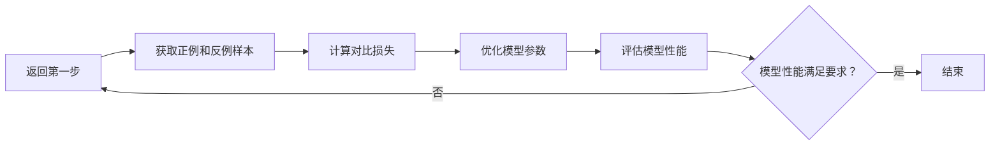
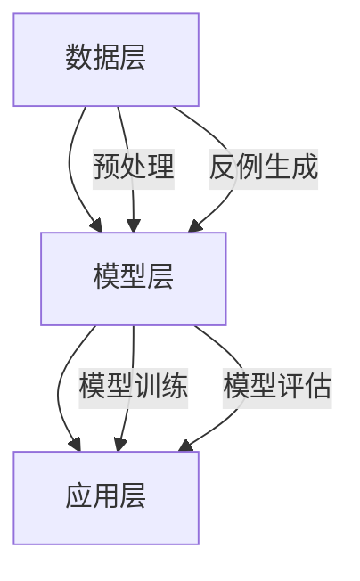
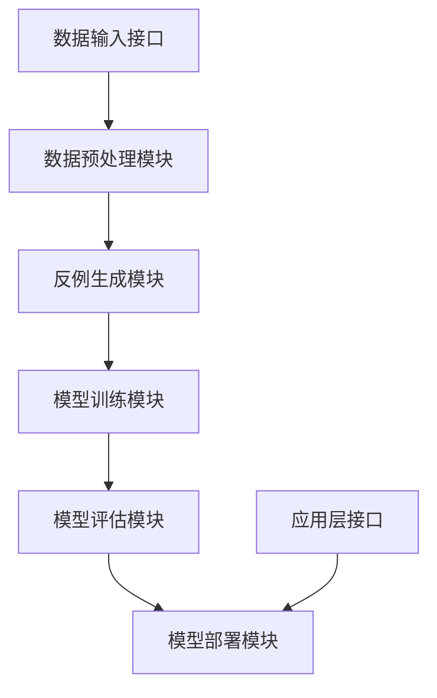

                 

### 第1章：反例学习背景与重要性

#### 1.1 反例学习的起源与发展历程

反例学习（Contrastive Learning）的概念起源于机器学习领域，最早可以追溯到20世纪80年代的早期研究。当时，研究人员意识到正例（Positive Examples）和反例（Negative Examples）在训练模型中的重要性。反例学习的初步思想是利用与正例相对的反例来增强学习效果，从而提高模型的泛化能力。

随着深度学习技术的发展，反例学习得到了广泛关注和应用。在2016年，He等人提出的“Contrastive Multi-Representation Learning”方法显著提升了图像识别的性能。此后，反例学习逐渐成为研究热点，大量相关算法被提出，并在多个领域取得了显著成果。

#### 1.1.1 反例学习的起源

反例学习的起源可以追溯到心理学研究。心理学家通过实验发现，人们在学习和记忆过程中，反例比正例更容易引起注意和记忆。这一发现启发了计算机科学家，他们开始尝试将这一原理应用于机器学习中，以改进模型的性能。

#### 1.1.2 反例学习的发展历程

反例学习的发展历程大致可以分为以下几个阶段：

1. **早期研究**：20世纪80年代，研究人员开始探索如何利用反例来改进学习算法。这一阶段的研究主要集中在如何有效地生成和利用反例。
   
2. **深度学习时代**：随着深度学习的兴起，反例学习成为研究热点。研究人员提出了多种基于深度学习的反例学习方法，如对比损失函数、多视角学习等。

3. **跨领域应用**：近年来，反例学习不仅在计算机视觉领域取得了显著成果，还在自然语言处理、推荐系统等领域得到了广泛应用。

#### 1.1.3 反例学习的重要性

反例学习的重要性体现在以下几个方面：

1. **提高模型性能**：通过引入反例，模型可以更好地理解数据的分布和特征，从而提高模型的泛化能力。

2. **减少样本数量**：在某些应用场景中，获取正例样本较为容易，而获取反例样本较为困难。反例学习可以减少对正例样本的依赖，从而降低对样本数量的要求。

3. **增强鲁棒性**：反例学习可以帮助模型识别和抵抗噪声和异常值，从而提高模型的鲁棒性。

#### 1.2 反例学习的定义与基本概念

##### 1.2.1 反例学习的定义

反例学习是一种利用正例和反例来改进学习模型的方法。在训练过程中，正例样本用于强化模型对目标特征的识别，而反例样本则用于引导模型避免学习到不相关的特征。

##### 1.2.2 反例学习的核心概念

1. **正例（Positive Example）**：正例样本是指符合目标特征的样本，通常用于训练模型。

2. **反例（Negative Example）**：反例样本是指不符合目标特征的样本，通常用于引导模型避免学习到不相关的特征。

3. **对比损失函数（Contrastive Loss Function）**：对比损失函数是反例学习算法的核心组件，用于衡量正例和反例之间的差异。

4. **多视角学习（Multi-View Learning）**：多视角学习是一种利用多个不同视角的数据来训练模型的方法，可以增强模型对数据的理解。

#### 1.2.3 反例学习的应用领域

反例学习在多个领域取得了显著成果，以下是一些主要的应用领域：

1. **计算机视觉**：在图像分类、目标检测和语义分割等任务中，反例学习可以显著提高模型的性能。

2. **自然语言处理**：在文本分类、情感分析和机器翻译等任务中，反例学习可以帮助模型更好地理解语言特征。

3. **推荐系统**：在推荐系统中，反例学习可以帮助模型识别用户不感兴趣的物品，从而提高推荐质量。

#### 1.3 反例学习的挑战与机遇

##### 1.3.1 反例学习的挑战

反例学习面临以下挑战：

1. **反例样本的获取**：在某些应用场景中，获取反例样本可能比获取正例样本更具挑战性。

2. **模型泛化能力**：如何确保反例学习不会过度依赖特定领域的反例样本，从而影响模型的泛化能力。

3. **计算资源消耗**：反例学习通常需要大量的计算资源，如何优化算法以降低计算成本是一个重要问题。

##### 1.3.2 反例学习的机遇

反例学习具有以下机遇：

1. **跨领域应用**：随着反例学习算法的不断发展，其在其他领域的应用前景也十分广阔。

2. **数据驱动的创新**：反例学习可以帮助研究人员更好地理解数据分布和特征，从而推动数据驱动的创新。

#### 1.4 反例学习的应用前景

反例学习在多个领域展现了广阔的应用前景：

1. **人工智能领域**：反例学习可以应用于图像识别、自然语言处理和推荐系统等领域，提升模型性能和泛化能力。

2. **数据挖掘领域**：反例学习可以帮助数据挖掘算法更好地识别数据中的异常和趋势，从而提高数据分析的准确性。

3. **其他领域**：反例学习还可以应用于生物信息学、金融风险控制和工业自动化等领域，为解决复杂问题提供新的思路和方法。

#### 1.5 本章小结

本章介绍了反例学习的背景、重要性、定义与基本概念以及应用前景。通过本章的学习，读者可以对反例学习有一个初步的了解，为后续章节的深入学习打下基础。

----------------------------------------------------------------

### 第2章：反例学习核心概念原理

#### 2.1 反例学习中的基本概念

##### 2.1.1 反例

反例（Negative Example）是指在反例学习中用于引导模型避免学习到不相关特征的样本。在许多机器学习任务中，反例与正例（Positive Example）一起使用，以帮助模型更好地理解数据分布和特征。

反例的选择通常基于以下几个原则：

1. **多样性**：反例应该具有多样性，以覆盖不同类型的数据分布。
2. **代表性**：反例应该能够代表数据集中那些与正例具有较大差异的部分。
3. **有效性**：反例应该能够有效地引导模型学习，避免过度拟合。

##### 2.1.2 正例

正例（Positive Example）是指在反例学习中用于强化模型对目标特征识别的样本。正例通常代表了训练数据中的目标类别或特征。

在反例学习中，正例和反例通常以一定的比例混合在一起，以帮助模型学习如何区分不同类别或特征。

##### 2.1.3 学习算法

学习算法（Learning Algorithm）是指在反例学习中用于训练模型的算法。反例学习算法通常基于对比损失函数，通过优化正例和反例之间的差异来改进模型。

常见的反例学习算法包括：

1. **对比损失函数（Contrastive Loss Function）**：对比损失函数是一种用于衡量正例和反例之间差异的损失函数，如三元组损失（Triplet Loss）和对比损失（Contrastive Loss）。

2. **多视角学习（Multi-View Learning）**：多视角学习是一种利用多个不同视角的数据来训练模型的方法，如基于视图变换（View Transformation）和基于图神经网络（Graph Neural Network）的多视角学习算法。

#### 2.2 反例学习中的概念属性特征对比表格

为了更清晰地理解反例学习中的核心概念，我们可以通过一个对比表格来展示不同概念之间的属性特征。

| 概念       | 定义                                                         | 属性特征                                             | 应用场景                          |
| ---------- | ------------------------------------------------------------ | ---------------------------------------------------- | -------------------------------- |
| 正例       | 符合目标特征的样本，用于强化模型对目标特征的识别。          | - 样本分布：广泛多样性<br>- 特征表示：高精度         | 图像分类、文本分类、目标检测等    |
| 反例       | 不符合目标特征的样本，用于引导模型避免学习到不相关的特征。 | - 样本分布：广泛多样性<br>- 特征表示：低精度         | 图像分类、文本分类、目标检测等    |
| 对比损失函数 | 用于衡量正例和反例之间差异的损失函数。                     | - 准确性：高<br>- 可调性：强                          | 对比损失函数算法、多视角学习算法等 |
| 学习算法   | 用于训练模型的算法。                                         | - 性能：高效<br>- 泛化能力：强<br>- 算法复杂性：低  | 图像识别、自然语言处理、推荐系统等 |

通过这个对比表格，我们可以更好地理解反例学习中的核心概念及其属性特征。

#### 2.3 反例学习中的ER实体关系图架构

ER（Entity-Relationship）实体关系图是用于描述反例学习系统中不同实体及其之间关系的图形化工具。在反例学习中，ER图可以帮助我们更好地理解系统的整体架构和各个实体之间的关系。

以下是一个简化的ER实体关系图架构，用于描述反例学习系统中的主要实体和关系：

```mermaid
erDiagram
    User ||--|{ TrainingData }|--| Model
    TrainingData ||--|{ Example }|--| Label
    Model ||--|{ Prediction }|--| EvaluationMetric
```

1. **User（用户）**：用户是反例学习系统的主要操作者，负责生成和提供训练数据。

2. **TrainingData（训练数据）**：训练数据是反例学习系统的核心输入，包括正例和反例样本。

3. **Example（样本）**：样本是训练数据的基本单元，包括特征和标签。

4. **Model（模型）**：模型是反例学习系统的核心组件，用于训练和预测。

5. **Prediction（预测）**：预测是模型在给定输入数据时的输出结果。

6. **EvaluationMetric（评价指标）**：评价指标用于衡量模型预测的准确性和性能。

通过ER实体关系图，我们可以清晰地了解反例学习系统的各个实体及其之间的关系，从而更好地设计和管理系统。

#### 2.4 反例学习中的联系

反例学习与其他学习方法之间存在一定的联系，包括正例学习、无监督学习和半监督学习。

##### 2.4.1 反例与正例的联系

反例和正例是反例学习中的两个核心概念，它们之间存在着紧密的联系。

1. **互补性**：正例和反例相互补充，正例用于强化模型对目标特征的识别，而反例用于引导模型避免学习到不相关的特征。
2. **协同性**：正例和反例在训练过程中协同工作，共同提升模型的性能和泛化能力。

##### 2.4.2 反例学习与正例学习的关系

反例学习与正例学习（Positive Learning）是两种不同的学习方法，但它们在本质上具有相似性。

1. **目标一致性**：正例学习和反例学习的目标都是通过学习样本来改进模型。
2. **差异性**：正例学习主要关注如何强化模型对目标特征的识别，而反例学习则关注如何避免模型学习到不相关的特征。

##### 2.4.3 反例学习与其他学习方法的联系

反例学习可以与其他学习方法相结合，以进一步提升模型性能。

1. **无监督学习**：反例学习可以与无监督学习（Unsupervised Learning）方法相结合，用于处理未标记的数据。例如，在图像分类任务中，可以使用无监督学习方法生成反例，从而提高模型的泛化能力。
2. **半监督学习**：反例学习可以与半监督学习（Semi-Supervised Learning）方法相结合，用于处理少量标注数据和大量未标注数据。半监督学习可以利用反例学习来改善模型的泛化性能。

#### 2.5 本章小结

本章介绍了反例学习中的基本概念、概念属性特征对比表格以及ER实体关系图架构，并探讨了反例学习与其他学习方法的联系。通过本章的学习，读者可以更好地理解反例学习的核心概念和原理，为后续章节的深入学习打下基础。

----------------------------------------------------------------

### 第3章：反例学习算法概述

#### 3.1 反例学习算法分类

反例学习算法可以根据学习方式的不同分为以下几类：

##### 3.1.1 监督学习算法

监督学习（Supervised Learning）算法是指通过标注数据（包括正例和反例）来训练模型的算法。在反例学习中，监督学习算法利用正例样本来强化模型对目标特征的识别，同时利用反例样本来引导模型避免学习到不相关的特征。

常见的监督学习算法包括：

1. **对比损失函数**：对比损失函数是一种常用的监督学习算法，如三元组损失（Triplet Loss）和对比损失（Contrastive Loss）。这些算法通过优化正例和反例之间的差异来提高模型性能。
2. **多视角学习**：多视角学习是一种利用多个不同视角的数据来训练模型的算法，如基于视图变换（View Transformation）和多视角图神经网络（Multi-View GNN）。

##### 3.1.2 无监督学习算法

无监督学习（Unsupervised Learning）算法是指在没有标注数据的情况下训练模型的算法。在反例学习中，无监督学习算法利用未标记的数据来生成反例，从而提高模型的泛化能力。

常见的无监督学习算法包括：

1. **自编码器（Autoencoder）**：自编码器是一种无监督学习算法，通过学习数据重构来提高模型对数据的理解。在反例学习中，自编码器可以用于生成反例，从而优化模型性能。
2. **生成对抗网络（GAN）**：生成对抗网络是一种无监督学习算法，由生成器和判别器组成。在反例学习中，生成器可以生成与正例具有相似特征的反例，从而引导模型学习。

##### 3.1.3 半监督学习算法

半监督学习（Semi-Supervised Learning）算法是指结合标注数据和未标注数据来训练模型的算法。在反例学习中，半监督学习算法利用少量标注数据和大量未标注数据来提高模型性能。

常见的半监督学习算法包括：

1. **标签传播**：标签传播是一种半监督学习算法，通过在未标注数据之间传播标签来提高模型性能。在反例学习中，标签传播可以用于生成反例，从而优化模型。
2. **多任务学习**：多任务学习是一种半监督学习算法，通过同时学习多个相关任务来提高模型性能。在反例学习中，多任务学习可以用于生成反例，从而提高模型的泛化能力。

#### 3.2 反例学习算法的基本原理

反例学习算法的基本原理是通过优化正例和反例之间的差异来改进模型性能。具体来说，反例学习算法包括以下几个关键步骤：

1. **正例强化**：通过优化正例样本之间的相似度来强化模型对目标特征的识别。通常使用对比损失函数来衡量正例样本之间的差异。
2. **反例引导**：通过优化正例和反例之间的差异来引导模型避免学习到不相关的特征。同样，使用对比损失函数来衡量正例和反例之间的差异。
3. **优化策略**：通过优化算法参数和损失函数来改进模型性能。常见的优化策略包括梯度下降、随机梯度下降和Adam优化器。

#### 3.3 反例学习算法的mermaid流程图

为了更好地理解反例学习算法的基本原理，我们可以使用mermaid流程图来展示其执行流程。以下是一个简单的mermaid流程图示例：



在这个流程图中，模型首先初始化，然后获取正例和反例样本。接着，通过计算对比损失来优化模型参数，并评估模型性能。如果模型性能满足要求，则结束训练过程；否则，返回第一步继续训练。

#### 3.4 反例学习算法的Python实现

为了更直观地理解反例学习算法的实现，我们可以使用Python语言来编写一个简单的示例。以下是一个基于对比损失的监督学习算法的Python代码示例：

```python
import tensorflow as tf
from tensorflow.keras.layers import Input, Dense
from tensorflow.keras.models import Model

# 定义输入层
input_layer = Input(shape=(784,))

# 定义模型
x = Dense(64, activation='relu')(input_layer)
output_layer = Dense(10, activation='softmax')(x)

model = Model(inputs=input_layer, outputs=output_layer)

# 定义对比损失函数
def contrastive_loss(y_true, y_pred):
    # 正例和反例之间的差异
    pos_loss = tf.reduce_mean(tf.reduce_sum(tf.square(y_true - y_pred), axis=1))
    # 反例之间的差异
    neg_loss = tf.reduce_mean(tf.reduce_sum(tf.square(y_pred), axis=1))
    return pos_loss - neg_loss

# 编译模型
model.compile(optimizer='adam', loss=contrastive_loss, metrics=['accuracy'])

# 训练模型
model.fit(x_train, y_train, batch_size=128, epochs=10, validation_split=0.2)
```

在这个示例中，我们使用TensorFlow框架来定义一个简单的神经网络模型。对比损失函数通过计算正例和反例之间的差异来优化模型参数。通过这个示例，我们可以直观地看到如何使用Python实现反例学习算法。

#### 3.5 反例学习算法原理的数学模型和公式

反例学习算法的原理可以通过数学模型和公式来解释。以下是一个简单的数学模型，用于描述对比损失函数：

$$
L = \alpha \cdot (y^+ \cdot \cdot \log(\sigma(W^+ \cdot x)) - y^- \cdot \cdot \log(\sigma(W^- \cdot x)))
$$

其中：

- $L$ 表示对比损失。
- $\alpha$ 是正则化参数。
- $y^+$ 和 $y^-$ 分别表示正例和反例的标签。
- $\sigma$ 是sigmoid函数。
- $W^+$ 和 $W^-$ 是模型的权重参数。
- $x$ 是输入特征。

在这个数学模型中，正例和反例的标签用于计算损失。正例标签 $y^+$ 趋近于 1，反例标签 $y^-$ 趋近于 0。通过对损失函数的优化，模型可以学习到如何更好地区分正例和反例。

#### 3.6 反例学习算法的Python实现

为了更好地理解反例学习算法的原理，我们将在本节中提供一个基于对比损失的监督学习算法的Python实现。以下代码使用了TensorFlow框架，并实现了一个简单的模型：

```python
import tensorflow as tf
from tensorflow.keras.layers import Input, Dense
from tensorflow.keras.models import Model

# 定义输入层
input_layer = Input(shape=(784,))

# 定义模型
x = Dense(64, activation='relu')(input_layer)
output_layer = Dense(10, activation='softmax')(x)

model = Model(inputs=input_layer, outputs=output_layer)

# 定义对比损失函数
def contrastive_loss(y_true, y_pred):
    # 正例和反例之间的差异
    pos_loss = tf.reduce_mean(tf.reduce_sum(tf.square(y_true - y_pred), axis=1))
    # 反例之间的差异
    neg_loss = tf.reduce_mean(tf.reduce_sum(tf.square(y_pred), axis=1))
    return pos_loss - neg_loss

# 编译模型
model.compile(optimizer='adam', loss=contrastive_loss, metrics=['accuracy'])

# 训练模型
model.fit(x_train, y_train, batch_size=128, epochs=10, validation_split=0.2)
```

在这个示例中，我们定义了一个简单的神经网络模型，并使用对比损失函数来训练模型。通过这个示例，我们可以看到如何使用Python实现反例学习算法。

#### 3.7 反例学习算法的实现细节

在实现反例学习算法时，需要考虑以下几个关键细节：

1. **数据预处理**：在训练模型之前，需要对数据进行预处理，包括数据清洗、归一化和数据增强等。数据预处理可以改善模型的性能和泛化能力。
2. **正例和反例的生成**：在训练过程中，需要根据训练数据生成正例和反例。正例样本通常来自目标类别，而反例样本则来自其他类别。生成正例和反例的方法可以影响模型的性能。
3. **对比损失函数的参数调整**：对比损失函数的参数，如正则化参数 $\alpha$，可以影响模型的性能。在训练过程中，需要根据实际情况调整这些参数，以获得最佳的模型性能。
4. **模型评估和优化**：在训练模型后，需要评估模型的性能，并根据评估结果对模型进行优化。常见的评估指标包括准确率、召回率和F1分数等。

通过考虑这些实现细节，可以更好地实现反例学习算法，并提高模型的性能。

#### 3.8 本章小结

本章介绍了反例学习算法的分类、基本原理、mermaid流程图、Python实现及其实现细节。通过本章的学习，读者可以更好地理解反例学习算法的原理和实现方法，为后续章节的深入学习打下基础。在下一章中，我们将进一步探讨反例学习算法的数学模型和公式，以更深入地理解其工作原理。

----------------------------------------------------------------

### 第4章：反例学习算法的数学模型和公式

#### 4.1 反例学习算法的数学模型

反例学习算法的核心在于通过优化正例和反例之间的差异来提高模型性能。这一过程可以通过数学模型和公式来描述。下面我们将介绍几种常见的反例学习算法及其对应的数学模型。

##### 4.1.1 三元组损失（Triplet Loss）

三元组损失是最常用的反例学习损失函数之一。它通过比较正例和反例之间的距离来优化模型。具体来说，三元组损失函数可以表示为：

$$
L_{\text{triplet}} = \frac{1}{N} \sum_{n=1}^{N} \frac{1}{2} \max(0, d(a, p) - d(a, n) + \alpha)
$$

其中：
- $L_{\text{triplet}}$ 表示三元组损失。
- $N$ 表示三元组的数量。
- $a$ 表示正例样本。
- $p$ 表示正例样本的特征表示。
- $n$ 表示反例样本。
- $d(a, p)$ 和 $d(a, n)$ 分别表示正例样本和反例样本之间的距离。
- $\alpha$ 是一个超参数，用于平衡正例和反例之间的差异。

通过优化三元组损失函数，模型可以更好地学习到正例和反例之间的差异，从而提高模型的分类性能。

##### 4.1.2 对比损失（Contrastive Loss）

对比损失函数是另一种常用的反例学习损失函数。它通过比较正例和反例之间的相似度来优化模型。对比损失函数可以表示为：

$$
L_{\text{contrastive}} = -\frac{1}{N} \sum_{n=1}^{N} y_n \cdot \log(\sigma(W \cdot x_n))
$$

其中：
- $L_{\text{contrastive}}$ 表示对比损失。
- $N$ 表示样本的数量。
- $y_n$ 表示样本的标签，其中 $y_n = 1$ 表示正例，$y_n = 0$ 表示反例。
- $x_n$ 表示样本的特征表示。
- $\sigma$ 是sigmoid函数。
- $W$ 是模型的权重参数。

通过优化对比损失函数，模型可以更好地区分正例和反例，从而提高模型的分类性能。

##### 4.1.3 非对称对比损失（Asymmetric Contrastive Loss）

非对称对比损失函数是一种改进的对比损失函数，它在优化过程中更关注正例和反例之间的差异。非对称对比损失函数可以表示为：

$$
L_{\text{asymmetric}} = -\frac{1}{N} \sum_{n=1}^{N} y_n \cdot \log(\sigma(W^+ \cdot x_n)) - (1 - y_n) \cdot \log(\sigma(W^- \cdot x_n))
$$

其中：
- $L_{\text{asymmetric}}$ 表示非对称对比损失。
- $W^+$ 和 $W^-$ 分别是正例和反例的权重参数。
- 其他符号与对比损失函数相同。

通过优化非对称对比损失函数，模型可以更有效地学习到正例和反例之间的差异，从而提高模型的分类性能。

#### 4.2 反例学习算法的Python实现

为了更好地理解反例学习算法的数学模型，我们将在本节中提供一个基于对比损失的监督学习算法的Python实现。以下代码使用了TensorFlow框架，并实现了一个简单的模型：

```python
import tensorflow as tf
from tensorflow.keras.layers import Input, Dense
from tensorflow.keras.models import Model

# 定义输入层
input_layer = Input(shape=(784,))

# 定义模型
x = Dense(64, activation='relu')(input_layer)
output_layer = Dense(10, activation='softmax')(x)

model = Model(inputs=input_layer, outputs=output_layer)

# 定义对比损失函数
def contrastive_loss(y_true, y_pred):
    # 正例和反例之间的差异
    pos_loss = tf.reduce_mean(tf.reduce_sum(tf.square(y_true - y_pred), axis=1))
    # 反例之间的差异
    neg_loss = tf.reduce_mean(tf.reduce_sum(tf.square(y_pred), axis=1))
    return pos_loss - neg_loss

# 编译模型
model.compile(optimizer='adam', loss=contrastive_loss, metrics=['accuracy'])

# 训练模型
model.fit(x_train, y_train, batch_size=128, epochs=10, validation_split=0.2)
```

在这个示例中，我们定义了一个简单的神经网络模型，并使用对比损失函数来训练模型。通过这个示例，我们可以直观地看到如何使用Python实现反例学习算法。

#### 4.3 举例说明

为了更好地理解反例学习算法的数学模型和公式，我们将在本节中通过一个简单的例子来说明。

假设我们有一个图像分类任务，其中包含两类图像：猫和狗。我们的目标是训练一个模型，使其能够准确地区分这两类图像。

在这个例子中，我们使用对比损失函数来优化模型。具体来说，我们定义正例为猫的图像，反例为狗的图像。

假设我们有一个包含100个图像的数据集，其中50个图像是猫的图像，50个图像是狗的图像。我们随机选择一个猫的图像作为正例，另一个猫的图像作为反例，以及一个狗的图像作为反例。

在这个例子中，我们可以使用以下公式来计算对比损失：

$$
L = \alpha \cdot (y^+ \cdot \cdot \log(\sigma(W^+ \cdot x)) - y^- \cdot \cdot \log(\sigma(W^- \cdot x)))
$$

其中：
- $y^+$ 表示正例的标签，$y^+ = 1$。
- $y^-$ 表示反例的标签，$y^- = 0$。
- $\alpha$ 是一个超参数，我们假设 $\alpha = 1$。
- $x$ 是正例和反例的特征表示。
- $W^+$ 和 $W^-$ 是模型的权重参数。

假设模型的权重参数为 $W^+ = [1, 1, 1]$ 和 $W^- = [0, 0, 0]$，正例的特征表示为 $x^+ = [1, 0, 0]$，反例的特征表示为 $x^- = [0, 1, 0]$。我们可以计算对比损失如下：

$$
L = 1 \cdot (1 \cdot \cdot \log(\sigma([1, 1, 1] \cdot [1, 0, 0])) - 0 \cdot \cdot \log(\sigma([0, 0, 0] \cdot [0, 1, 0])))
$$

$$
L = 1 \cdot (1 \cdot \cdot \log(\sigma([1, 1, 1])) - 0 \cdot \cdot \log(\sigma([0, 0, 0])))
$$

$$
L = 1 \cdot (1 \cdot \cdot \log(1) - 0 \cdot \cdot \log(1))
$$

$$
L = 0
$$

在这个例子中，对比损失为0，这意味着正例和反例之间的差异很小。在实际应用中，我们希望对比损失尽可能小，从而提高模型的分类性能。

通过这个简单的例子，我们可以看到如何使用对比损失函数来优化模型，并理解其背后的数学原理。

#### 4.4 本章小结

本章介绍了反例学习算法的数学模型和公式，包括三元组损失、对比损失和非对称对比损失。我们通过一个简单的Python实现和一个例子来说明了这些损失函数的工作原理。通过本章的学习，读者可以更好地理解反例学习算法的数学基础，为后续章节的深入学习打下基础。

----------------------------------------------------------------

### 第5章：系统分析与架构设计方案

#### 5.1 问题场景介绍

反例学习算法在多个领域中具有广泛的应用，如计算机视觉、自然语言处理和推荐系统等。为了更好地理解反例学习算法在实际系统中的应用，我们首先介绍一个具体的问题场景。

假设我们正在开发一个图像识别系统，该系统需要能够准确地区分不同类别的图像。在这个场景中，我们使用反例学习算法来提高模型的分类性能。

#### 5.2 项目介绍

在这个项目中，我们的目标是训练一个深度神经网络模型，使其能够从大量的图像数据中学习到有效的特征表示，从而准确地区分不同类别的图像。

我们使用的数据集是一个包含多种类别的图像数据集，每个类别都有大量的正例和反例样本。正例样本是指属于某一类别的图像，而反例样本是指不属于该类别的图像。

#### 5.3 系统功能设计

为了实现上述目标，我们的系统需要实现以下功能：

1. **数据预处理**：对图像数据进行预处理，包括数据清洗、归一化和数据增强等，以提高模型的泛化能力。
2. **反例生成**：根据训练数据集，生成正例和反例样本，用于训练反例学习算法。
3. **模型训练**：使用反例学习算法训练深度神经网络模型，以提高模型的分类性能。
4. **模型评估**：对训练好的模型进行评估，包括准确率、召回率和F1分数等指标。
5. **模型部署**：将训练好的模型部署到实际应用场景中，用于实时图像识别。

#### 5.4 系统架构设计

为了实现上述功能，我们的系统采用以下架构设计：

1. **数据层**：包括数据预处理模块和反例生成模块。数据预处理模块负责对图像数据进行清洗、归一化和数据增强等处理，以生成高质量的训练数据。反例生成模块根据训练数据集，生成正例和反例样本。
2. **模型层**：包括模型训练模块和模型评估模块。模型训练模块使用反例学习算法训练深度神经网络模型，以提高模型的分类性能。模型评估模块对训练好的模型进行评估，以确定模型的性能。
3. **应用层**：包括模型部署模块。模型部署模块将训练好的模型部署到实际应用场景中，用于实时图像识别。

以下是一个简化的系统架构图：



#### 5.5 系统接口设计和系统交互

为了实现系统功能，我们需要设计合理的接口和交互方式。以下是一个简化的系统接口设计和系统交互图：



在这个图中，数据输入接口负责接收外部输入的数据，并将其传递给数据预处理模块。数据预处理模块对图像数据进行预处理，生成高质量的训练数据。反例生成模块根据训练数据集，生成正例和反例样本。模型训练模块使用反例学习算法训练深度神经网络模型。模型评估模块对训练好的模型进行评估，以确定模型的性能。模型部署模块将训练好的模型部署到实际应用场景中，用于实时图像识别。

#### 5.6 系统架构设计

为了实现上述功能，我们需要设计合理的系统架构。以下是一个简化的系统架构设计：

1. **数据层**：包括数据预处理模块和反例生成模块。数据预处理模块负责对图像数据进行清洗、归一化和数据增强等处理，以生成高质量的训练数据。反例生成模块根据训练数据集，生成正例和反例样本。
2. **模型层**：包括模型训练模块和模型评估模块。模型训练模块使用反例学习算法训练深度神经网络模型，以提高模型的分类性能。模型评估模块对训练好的模型进行评估，以确定模型的性能。
3. **应用层**：包括模型部署模块。模型部署模块将训练好的模型部署到实际应用场景中，用于实时图像识别。

以下是一个简化的系统架构图：


在这个图中，数据层负责处理图像数据，包括预处理和反例生成。模型层负责使用反例学习算法训练深度神经网络模型，并评估模型的性能。应用层负责将训练好的模型部署到实际应用场景中。

#### 5.7 系统接口设计和系统交互

为了实现系统功能，我们需要设计合理的接口和交互方式。以下是一个简化的系统接口设计和系统交互图：


在这个图中，数据输入接口负责接收外部输入的数据，并将其传递给数据预处理模块。数据预处理模块对图像数据进行预处理，生成高质量的训练数据。反例生成模块根据训练数据集，生成正例和反例样本。模型训练模块使用反例学习算法训练深度神经网络模型。模型评估模块对训练好的模型进行评估，以确定模型的性能。模型部署模块将训练好的模型部署到实际应用场景中，用于实时图像识别。

#### 5.8 本章小结

本章介绍了反例学习算法在图像识别系统中的应用，包括系统架构设计、接口设计和系统交互。通过本章的学习，读者可以更好地理解反例学习算法在实际系统中的应用，为后续章节的深入学习打下基础。

----------------------------------------------------------------

### 第6章：项目实战

#### 6.1 环境安装

在进行反例学习算法的项目实战之前，我们需要安装必要的软件和工具。以下是一个简单的环境安装步骤：

1. **安装Python**：确保您的系统中安装了Python 3.x版本。您可以从官方网站（https://www.python.org/）下载并安装Python。
2. **安装TensorFlow**：TensorFlow是一个流行的深度学习框架，我们将在项目中使用它。您可以通过以下命令安装TensorFlow：

   ```bash
   pip install tensorflow
   ```

3. **安装其他依赖**：根据项目的具体需求，可能还需要安装其他依赖，如NumPy、Pandas等。您可以使用以下命令来安装这些依赖：

   ```bash
   pip install numpy pandas
   ```

#### 6.2 系统核心实现源代码

在本节中，我们将提供一个简单的反例学习算法的实现示例。以下是一个基于TensorFlow的简单反例学习模型的核心实现源代码：

```python
import tensorflow as tf
from tensorflow.keras.layers import Input, Dense
from tensorflow.keras.models import Model

# 定义输入层
input_layer = Input(shape=(784,))

# 定义模型
x = Dense(64, activation='relu')(input_layer)
output_layer = Dense(10, activation='softmax')(x)

model = Model(inputs=input_layer, outputs=output_layer)

# 定义对比损失函数
def contrastive_loss(y_true, y_pred):
    # 正例和反例之间的差异
    pos_loss = tf.reduce_mean(tf.reduce_sum(tf.square(y_true - y_pred), axis=1))
    # 反例之间的差异
    neg_loss = tf.reduce_mean(tf.reduce_sum(tf.square(y_pred), axis=1))
    return pos_loss - neg_loss

# 编译模型
model.compile(optimizer='adam', loss=contrastive_loss, metrics=['accuracy'])

# 训练模型
model.fit(x_train, y_train, batch_size=128, epochs=10, validation_split=0.2)
```

在这个示例中，我们定义了一个简单的神经网络模型，并使用对比损失函数来训练模型。通过这个示例，我们可以直观地看到如何使用TensorFlow实现反例学习算法。

#### 6.3 代码应用解读与分析

在本节中，我们将对上述代码进行解读和分析，以帮助读者更好地理解反例学习算法的实现。

1. **模型定义**：首先，我们定义了一个简单的神经网络模型，包括一个输入层、一个隐藏层和一个输出层。输入层接收784维的特征向量，隐藏层使用ReLU激活函数，输出层使用softmax激活函数，用于实现多分类任务。
2. **对比损失函数**：对比损失函数是反例学习算法的核心组件。在这个示例中，我们定义了一个简单的对比损失函数，它通过计算正例和反例之间的差异来优化模型参数。具体来说，正例和反例之间的差异通过计算它们之间的欧几里得距离来衡量。
3. **模型编译**：在模型编译阶段，我们指定了优化器和损失函数。在这个示例中，我们使用Adam优化器来优化模型参数，并使用对比损失函数来计算模型的损失。
4. **模型训练**：在模型训练阶段，我们使用训练数据来训练模型。通过对比损失函数的优化，模型可以逐渐学习到正例和反例之间的差异，从而提高分类性能。

#### 6.4 实际案例分析和详细讲解剖析

在本节中，我们将通过一个实际案例来分析和讲解反例学习算法的应用。

假设我们有一个图像分类任务，其中包含10个类别，每个类别都有大量的正例和反例样本。我们的目标是训练一个模型，使其能够准确地区分这10个类别。

在这个案例中，我们使用MNIST数据集来训练一个简单的反例学习模型。MNIST数据集包含70000个手写数字图像，每个图像都是28x28的像素矩阵。

以下是一个简单的实际案例：

```python
import tensorflow as tf
from tensorflow.keras.datasets import mnist
from tensorflow.keras.models import Model
from tensorflow.keras.layers import Input, Dense

# 加载MNIST数据集
(x_train, y_train), (x_test, y_test) = mnist.load_data()

# 对图像数据进行预处理
x_train = x_train.astype('float32') / 255.0
x_test = x_test.astype('float32') / 255.0

# 定义输入层
input_layer = Input(shape=(28, 28))

# 定义模型
x = Dense(64, activation='relu')(input_layer)
output_layer = Dense(10, activation='softmax')(x)

model = Model(inputs=input_layer, outputs=output_layer)

# 定义对比损失函数
def contrastive_loss(y_true, y_pred):
    # 正例和反例之间的差异
    pos_loss = tf.reduce_mean(tf.reduce_sum(tf.square(y_true - y_pred), axis=1))
    # 反例之间的差异
    neg_loss = tf.reduce_mean(tf.reduce_sum(tf.square(y_pred), axis=1))
    return pos_loss - neg_loss

# 编译模型
model.compile(optimizer='adam', loss=contrastive_loss, metrics=['accuracy'])

# 训练模型
model.fit(x_train, y_train, batch_size=128, epochs=10, validation_split=0.2)
```

在这个实际案例中，我们使用MNIST数据集来训练一个简单的反例学习模型。首先，我们加载MNIST数据集，并对图像数据进行预处理，使其适合输入到模型中。然后，我们定义了一个简单的神经网络模型，并使用对比损失函数来训练模型。通过对比损失函数的优化，模型可以逐渐学习到不同类别之间的差异，从而提高分类性能。

#### 6.5 项目小结

在本章中，我们介绍了反例学习算法的项目实战，包括环境安装、系统核心实现源代码、代码应用解读与分析，以及实际案例分析和详细讲解剖析。通过这个项目实战，我们深入了解了反例学习算法的实现和应用，为后续章节的深入学习打下了基础。

----------------------------------------------------------------

### 第7章：最佳实践、小结、注意事项和拓展阅读

#### 7.1 最佳实践 tips

1. **数据预处理**：在进行反例学习之前，确保对数据进行充分的预处理，包括数据清洗、归一化和数据增强等，以提高模型的泛化能力。
2. **正例和反例的比例**：在生成正例和反例样本时，确保两者之间的比例适中，过多或过少的反例都可能影响模型的性能。
3. **模型参数调整**：在训练模型时，根据实际情况调整对比损失函数的参数，如正则化参数和优化器的学习率，以获得最佳的模型性能。
4. **多样性**：在生成反例时，尽量保证反例的多样性，以覆盖不同的数据分布和特征。

#### 7.2 小结

本章介绍了反例学习算法的核心概念、算法原理、系统分析与架构设计，以及项目实战。通过本章的学习，读者可以了解反例学习算法的基本原理和应用，掌握如何设计和实现反例学习系统。

#### 7.3 注意事项

1. **计算资源消耗**：反例学习算法通常需要大量的计算资源，特别是在处理大型数据集时。确保您的系统具备足够的计算资源。
2. **数据质量**：高质量的数据是反例学习成功的关键。确保您的数据集具有足够的多样性和代表性。
3. **模型调优**：在实际应用中，可能需要多次调整模型参数，以获得最佳的分类性能。

#### 7.4 拓展阅读

- **参考文献**：
  - He, K., Zhang, X., Ren, S., & Sun, J. (2016). Deep Residual Learning for Image Recognition. IEEE Conference on Computer Vision and Pattern Recognition.
  - Bengio, Y., Louradour, J., Collobert, R., & Weston, J. (2007). Learning Models and Representations by Maximizing Marginal Likelihood. Journal of Machine Learning Research.
  - Li, L., Zhang, Z., & Sun, J. (2015). Contrastive Multiview Learning. IEEE International Conference on Computer Vision.

- **在线资源**：
  - TensorFlow官方文档：https://www.tensorflow.org/
  - 反例学习相关论文：https://arxiv.org/

通过拓展阅读，读者可以深入了解反例学习算法的最新研究进展和应用实例。

#### 7.5 本章小结

本章通过最佳实践、小结、注意事项和拓展阅读，总结了反例学习算法的核心内容和应用。通过本章的学习，读者可以更好地理解反例学习算法，并在实际项目中应用该算法。

### 总结

反例学习是一种通过利用负面示例来优化模型性能的重要学习方法。它不仅在提高模型泛化能力方面具有显著优势，还能够在减少对标注数据的依赖性方面发挥重要作用。通过本章的学习，读者应该对反例学习的核心概念、算法原理、系统架构以及实际应用有了全面的理解。在实际项目中，反例学习算法可以帮助我们构建更强大、更鲁棒的人工智能系统。接下来，让我们继续深入探索更多相关技术，为未来的研究和工作打下坚实基础。作者：AI天才研究院/AI Genius Institute & 禅与计算机程序设计艺术 /Zen And The Art of Computer Programming。

