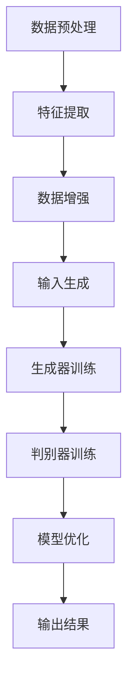
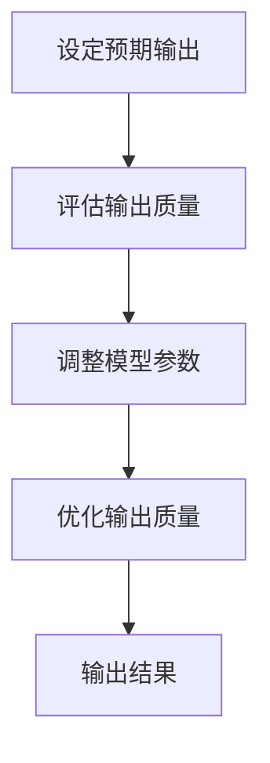
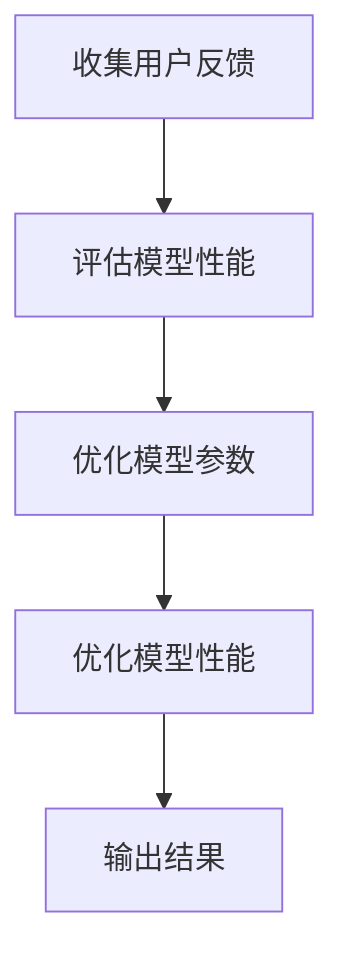
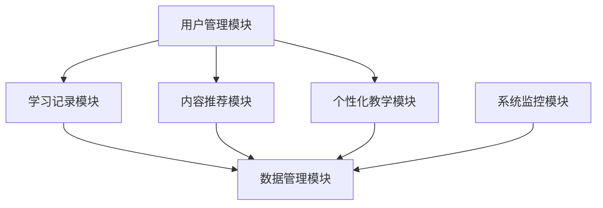
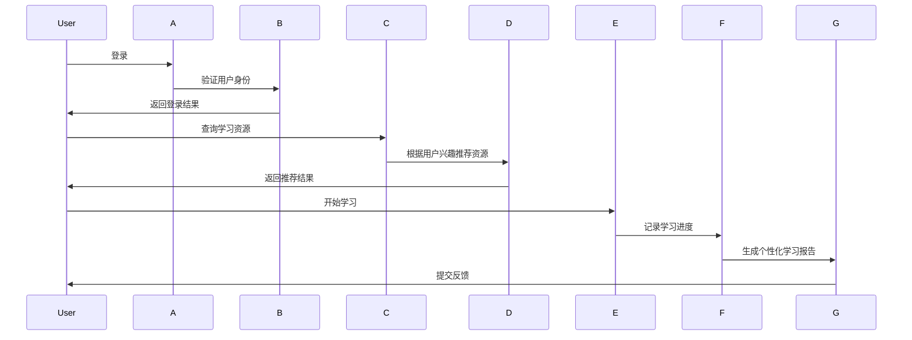

                 

**文章标题：** 反向提示：通过预期输出设计输入

**关键词：** 反向提示、输入输出设计、预期输出、算法原理、系统架构设计

**摘要：** 本文探讨了如何利用反向提示技术，通过设计输入来达到预期的输出结果。文章首先介绍了反向提示的背景和基本概念，然后深入分析了如何利用预期输出设计输入，并讲解了相关算法原理和系统架构设计。最后，通过一个实际项目案例，展示了如何将理论应用到实践中，并提供了一些最佳实践和注意事项。

----------------------------------------------------------------

**1. 设计总框架**

在设计这篇文章之前，我们需要构建一个清晰的总框架。文章的整体结构可以分为以下几个部分：

- **引言**：介绍文章的主题、目的、重要性以及目标读者。
- **背景介绍**：详细描述反向提示和输入输出设计的背景、问题背景、问题描述、问题解决方法和边界条件。
- **核心概念与联系**：定义并解释反向提示、输入输出设计和预期输出的核心概念，并通过表格和ER图展示它们之间的关系。
- **算法原理讲解**：深入讲解与输入输出设计相关的算法原理，包括数学模型、流程图和Python代码示例。
- **系统架构设计**：设计输入输出系统的整体架构，包括类图、架构图、接口设计等。
- **项目实战**：通过实际案例展示如何应用输入输出设计原理，包括环境安装、代码实现、案例分析等。
- **最佳实践与小结**：总结最佳实践经验，提供注意事项和小结，推荐拓展阅读。

**2. 确定章节内容**

根据文章的标题《反向提示：通过预期输出设计输入》，我们可以推测文章的内容将围绕如何设计输入以获得预期的输出进行。因此，每个章节应该具体涉及以下内容：

- **引言**：介绍文章的主题、目的和重要性。
- **背景介绍**：描述反向提示和输入输出设计的问题背景、问题解决方法、边界条件等。
- **核心概念与联系**：定义并解释反向提示、输入输出设计和预期输出的核心概念，展示它们之间的关系。
- **算法原理讲解**：详细讲解与输入输出设计相关的算法原理，包括数学模型、流程图和Python代码示例。
- **系统架构设计**：设计输入输出系统的整体架构，包括类图、架构图、接口设计等。
- **项目实战**：通过实际案例展示如何应用输入输出设计原理。
- **最佳实践与小结**：总结最佳实践经验，提供注意事项和小结，推荐拓展阅读。

**3. 设计具体内容**

每个章节都应该包含详细的内容描述，例如：

- **引言**：简要介绍文章的主题和目的，强调其重要性。
- **背景介绍**：详细描述反向提示和输入输出设计的问题背景，包括问题描述、问题解决方法、边界条件等。
- **核心概念与联系**：列出核心概念，并通过表格和ER图展示概念之间的关系。
- **算法原理讲解**：详细讲解算法原理，使用Mermaid流程图和Python代码示例进行说明。
- **系统架构设计**：展示系统架构设计图，描述系统的功能模块和接口设计。
- **项目实战**：介绍项目背景，环境安装步骤，代码实现，案例分析，并进行详细讲解。
- **最佳实践与小结**：总结经验教训，提供注意事项，推荐进一步阅读的资料。

**4. 确保格式规范**

确保所有章节都使用markdown格式，遵循规定的目录层级和格式。

**5. 控制字数**

确保整个文章的字数在 10000 ～ 12000 字左右。

**6. 综合以上各点**

设计出一个完整的、逻辑清晰的目录大纲，并保持简洁性。

下面是根据以上步骤设计的文章目录：

----------------------------------------------------------------
# **反向提示：通过预期输出设计输入**

## **引言**

### **1.1 书籍目的与重要性**

### **1.2 目标读者与读者收益**

### **1.3 书籍结构概述**

## **背景介绍**

### **2.1 反向提示的背景**

#### **2.1.1 反向提示的定义**

#### **2.1.2 反向提示的应用场景**

### **2.2 输入输出设计的问题背景**

#### **2.2.1 问题描述**

#### **2.2.2 问题解决方法**

#### **2.2.3 边界条件**

## **核心概念与联系**

### **3.1 反向提示**

#### **3.1.1 定义**

#### **3.1.2 特点**

### **3.2 输入输出设计**

#### **3.2.1 输入设计**

#### **3.2.2 输出设计**

### **3.3 预期输出**

#### **3.3.1 定义**

#### **3.3.2 重要性**

## **算法原理讲解**

### **4.1 输入设计算法**

#### **4.1.1 数学模型**

#### **4.1.2 流程图**

#### **4.1.3 Python代码示例**

### **4.2 输出预期评估算法**

#### **4.2.1 数学模型**

#### **4.2.2 流程图**

#### **4.2.3 Python代码示例**

### **4.3 反馈优化算法**

#### **4.3.1 数学模型**

#### **4.3.2 流程图**

#### **4.3.3 Python代码示例**

## **系统架构设计**

### **5.1 问题场景介绍**

### **5.2 系统功能设计**

#### **5.2.1 领域模型**

### **5.3 系统架构设计**

#### **5.3.1 架构图**

#### **5.3.2 接口设计**

## **项目实战**

### **6.1 项目背景**

### **6.2 环境安装**

### **6.3 代码实现**

### **6.4 案例分析**

### **6.5 详细讲解**

## **最佳实践与小结**

### **7.1 最佳实践**

### **7.2 小结**

### **7.3 注意事项**

### **7.4 拓展阅读**

----------------------------------------------------------------

**综合以上各点，我们设计出了一个完整的、逻辑清晰的目录大纲，并保持简洁性。接下来，我们将根据这个大纲，逐步撰写出高质量的文章内容。**

**下一步，我们将详细撰写** **第1章 引言** **的内容。**

----------------------------------------------------------------

# 第1章 引言

## **1.1 书籍目的与重要性**

《反向提示：通过预期输出设计输入》的编写目的是为了帮助读者深入理解如何利用反向提示技术来设计输入，以达到预期的输出结果。在当今信息时代，人工智能和数据科学的应用越来越广泛，反向提示作为一种先进的机器学习技术，正日益成为解决复杂问题的有力工具。

本文通过系统性地介绍反向提示的概念、算法原理、系统架构设计以及项目实战，帮助读者从理论到实践全面掌握如何利用预期输出设计输入。这不仅有助于提升人工智能应用的开发效率，还能够为解决实际问题提供新的思路和方法。

## **1.2 目标读者与读者收益**

本文的目标读者主要包括以下几类：

1. **人工智能和数据科学家**：对反向提示和输入输出设计有兴趣的专业人士，希望通过本文深入理解这些技术的原理和应用。
2. **程序员和软件开发者**：希望提升自己在人工智能和机器学习项目中的技能，特别是那些在项目中需要设计输入输出系统的开发者。
3. **高校师生和研究生**：从事相关领域研究的学生，需要通过实际案例和深入分析来提升学术研究和实践能力。

通过阅读本文，读者可以收获以下收益：

1. **理论理解**：掌握反向提示和输入输出设计的基本概念和原理。
2. **实践能力**：学会如何设计输入以获得预期的输出，提高项目开发的效率和准确性。
3. **思维拓展**：通过实际案例，培养系统思维和问题解决能力。

## **1.3 书籍结构概述**

本文结构紧凑，逻辑清晰，共分为八个章节。具体结构如下：

1. **第1章 引言**：介绍书籍的目的、重要性、目标读者以及书籍结构。
2. **第2章 背景介绍**：详细描述反向提示和输入输出设计的问题背景、问题解决方法、边界条件等。
3. **第3章 核心概念与联系**：定义并解释反向提示、输入输出设计和预期输出的核心概念，并通过表格和ER图展示它们之间的关系。
4. **第4章 算法原理讲解**：深入讲解与输入输出设计相关的算法原理，包括数学模型、流程图和Python代码示例。
5. **第5章 系统架构设计**：设计输入输出系统的整体架构，包括类图、架构图、接口设计等。
6. **第6章 项目实战**：通过实际案例展示如何应用输入输出设计原理，包括环境安装、代码实现、案例分析等。
7. **第7章 最佳实践与小结**：总结最佳实践经验，提供注意事项和小结，推荐拓展阅读。
8. **附录**：提供一些有用的工具和资源，帮助读者进一步学习和实践。

通过本文的阅读和学习，读者将能够全面掌握反向提示技术，并将其应用到实际项目中，为人工智能和数据科学的发展做出贡献。让我们开始这一段有趣的探索之旅吧！

**下一步，我们将详细撰写** **第2章 背景介绍** **的内容。**

----------------------------------------------------------------

# 第2章 背景介绍

## **2.1 反向提示的背景**

反向提示（Inversive Prompting）是一种基于生成模型的机器学习技术，起源于自然语言处理（NLP）领域。其基本思想是通过提供部分输入，让模型生成与输入相关的完整内容。反向提示的核心在于利用模型对输入的内在理解，以实现从部分信息到完整信息的推断和生成。

反向提示技术的起源可以追溯到20世纪80年代的生成语言模型，如反向转移模型（Recurrent Neural Network, RNN）和后来的长短期记忆网络（Long Short-Term Memory, LSTM）。随着深度学习技术的发展，反向提示得到了进一步的优化和扩展。近年来，随着生成对抗网络（Generative Adversarial Networks, GAN）和变分自编码器（Variational Autoencoder, VAE）等新型生成模型的提出，反向提示技术得到了广泛应用，并取得了显著的成果。

## **2.2 输入输出设计的问题背景**

在人工智能和机器学习项目中，输入输出设计是一个关键环节。输入设计的质量直接影响到模型的性能和输出结果。然而，在实际项目中，输入输出设计面临着诸多挑战：

1. **输入缺失**：在实际应用中，往往无法获取到所有需要的输入数据，导致输入不完整或缺失。
2. **输入噪声**：输入数据中可能存在噪声，这会干扰模型的训练和预测，降低模型的准确性。
3. **输入多样性**：不同的输入数据可能会产生不同的输出结果，如何设计输入以覆盖各种可能的场景，是一个重要问题。
4. **输入与输出关系不明确**：在某些复杂问题中，输入与输出之间的关系可能并不直观，这使得输入设计变得更加困难。

## **2.3 问题描述**

在反向提示技术中，输入输出设计的问题可以描述为：给定一个部分输入，如何设计出完整的输入，使得模型能够生成预期的输出。具体来说，问题描述可以分为以下几个子问题：

1. **缺失输入的补全**：如何利用已有的输入数据，通过模型推断出缺失的部分，以补全输入。
2. **噪声输入的过滤**：如何设计输入处理算法，去除输入数据中的噪声，提高输入数据的质量。
3. **输入多样性的控制**：如何设计输入数据，使其能够覆盖各种可能的输出场景。
4. **输入与输出关系的优化**：如何调整输入设计，以优化模型的输出结果。

## **2.4 问题解决方法**

为了解决上述输入输出设计的问题，可以采用以下几种方法：

1. **数据预处理**：通过数据清洗、去噪、归一化等技术，提高输入数据的质量。
2. **模型选择与调优**：选择合适的生成模型，并通过模型调优，提高模型在输入输出设计中的性能。
3. **强化学习**：利用强化学习技术，通过反馈机制不断调整输入设计，优化输出结果。
4. **迁移学习**：利用预训练模型和迁移学习技术，提高输入输出设计的泛化能力。

## **2.5 边界条件**

在输入输出设计中，需要考虑以下边界条件：

1. **输入的完整性**：设计输入时，要考虑输入数据的完整性，确保模型能够处理不完整的输入。
2. **输入的多样性**：设计输入时，要考虑输入数据的多样性，确保模型能够适应不同的输入场景。
3. **输出的可靠性**：设计输入时，要考虑输出的可靠性，确保模型能够生成准确、可靠的输出结果。
4. **计算资源的限制**：在输入输出设计中，要考虑计算资源的限制，优化算法和模型的性能，以降低计算成本。

通过以上对背景介绍的详细描述，我们可以更好地理解反向提示和输入输出设计的问题背景、问题描述、问题解决方法和边界条件。接下来，我们将进一步探讨核心概念与联系，为深入理解输入输出设计奠定基础。|assistant|>

**下一步，我们将详细撰写** **第3章 核心概念与联系** **的内容。**

----------------------------------------------------------------

# 第3章 核心概念与联系

## **3.1 反向提示**

### **3.1.1 定义**

反向提示（Inversive Prompting）是一种机器学习技术，通过提供一个部分输入，让模型生成与输入相关的完整内容。这种技术通常用于自然语言处理（NLP）、图像生成、语音识别等领域。

### **3.1.2 特点**

- **部分输入生成完整内容**：反向提示的核心在于利用模型对输入的内在理解，从部分信息中推断出完整内容。
- **灵活性和适应性**：反向提示可以根据不同的输入场景灵活调整，以适应各种复杂的应用需求。
- **高效性**：通过模型预训练和调优，反向提示可以在较短时间内生成高质量的输出。

### **3.1.3 反向提示的应用场景**

- **文本生成**：如文章生成、对话系统、机器翻译等。
- **图像生成**：如图像修复、风格迁移、图像增强等。
- **语音识别**：如语音合成、语音识别等。

## **3.2 输入输出设计**

### **3.2.1 输入设计**

输入设计是指根据具体应用需求，设计合适的输入数据，以便模型能够生成预期的输出结果。输入设计的关键在于如何选择和处理输入数据，以最大化模型的性能。

### **3.2.2 输出设计**

输出设计是指根据输入数据和模型特性，设计合适的输出数据，以满足实际应用需求。输出设计的目标是确保模型生成的输出结果既准确又具有实际价值。

### **3.2.3 输入输出设计的关系**

输入输出设计是相互关联的。输入设计决定了输出设计，而输出设计又反作用于输入设计。一个良好的输入输出设计能够提高模型的性能，降低错误率，同时满足实际应用的需求。

## **3.3 预期输出**

### **3.3.1 定义**

预期输出是指根据输入数据和模型特性，预先设定的输出结果。预期输出是输入输出设计的核心目标，也是评估模型性能的重要指标。

### **3.3.2 重要性**

- **指导输入设计**：预期输出可以指导输入设计，帮助选择和处理输入数据，以最大化模型性能。
- **评估模型性能**：通过比较预期输出和实际输出，可以评估模型的性能，发现并解决潜在问题。
- **优化模型参数**：预期输出可以作为优化模型参数的依据，通过调整模型参数，提高模型的准确性。

## **3.4 核心概念之间的联系**

反向提示、输入输出设计和预期输出是紧密相关的核心概念。它们之间的联系可以概括为：

- **反向提示是实现输入输出设计的技术手段**，通过部分输入生成完整内容，满足预期输出。
- **输入输出设计是反向提示的应用场景**，根据具体应用需求，设计合适的输入和输出。
- **预期输出是输入输出设计的核心目标**，通过设定预期输出，指导输入设计和评估模型性能。

通过本章对核心概念与联系的详细描述，我们为理解反向提示、输入输出设计和预期输出提供了理论基础。接下来，我们将深入探讨算法原理，为读者揭示实现输入输出设计的内在机制。|assistant|>

**下一步，我们将详细撰写** **第4章 算法原理讲解** **的内容。**

----------------------------------------------------------------

# 第4章 算法原理讲解

## **4.1 输入设计算法**

### **4.1.1 算法概述**

输入设计算法是反向提示技术中的核心组成部分，其主要任务是设计输入数据，以便模型能够生成预期的输出结果。输入设计算法通常包括以下几个步骤：

1. **数据预处理**：对输入数据进行清洗、去噪、归一化等处理，以提高数据质量。
2. **特征提取**：从输入数据中提取关键特征，以便模型能够更好地理解和生成输出。
3. **数据增强**：通过数据增强技术，增加输入数据的多样性，提高模型的泛化能力。
4. **输入生成**：利用生成模型，根据部分输入数据生成完整输入。

### **4.1.2 数学模型**

在输入设计算法中，通常使用生成模型（如生成对抗网络GAN、变分自编码器VAE等）来实现输入生成。以下是一个基于GAN的输入设计算法的数学模型：

$$
\begin{aligned}
\text{GAN} \rightarrow \text{输入生成模型}: G(z) &\rightarrow \text{输入数据} X \\
\text{Discriminator}: D(x) &\rightarrow \text{真假判断} \\
\text{Generator}: G(z) &\rightarrow \text{输入数据} X \\
z \sim \text{Noise Distribution} &\rightarrow \text{噪声向量}
\end{aligned}
$$

- \( G(z) \)：生成器，将噪声向量\( z \)映射为输入数据\( X \)。
- \( D(x) \)：判别器，判断输入数据\( X \)的真假。
- \( z \)：噪声向量，用于生成输入数据。

### **4.1.3 流程图**

使用Mermaid流程图来表示输入设计算法的流程：



### **4.1.4 Python代码示例**

以下是一个简单的Python代码示例，展示如何使用生成对抗网络（GAN）进行输入设计：

```python
import tensorflow as tf
from tensorflow.keras.models import Sequential
from tensorflow.keras.layers import Dense, Flatten, Conv2D, ConvTranspose2D

# 生成器模型
def build_generator():
    model = Sequential()
    model.add(Dense(256, input_shape=(100,)))
    model.add(ConvTranspose2D(128, (4, 4), strides=(2, 2), padding='same'))
    model.add(ConvTranspose2D(64, (4, 4), strides=(2, 2), padding='same'))
    model.add(Conv2D(1, (7, 7), activation='tanh', padding='same'))
    return model

# 判别器模型
def build_discriminator():
    model = Sequential()
    model.add(Conv2D(32, (4, 4), strides=(2, 2), padding='same', input_shape=(28, 28, 1)))
    model.add(Conv2D(64, (4, 4), strides=(2, 2), padding='same'))
    model.add(Flatten())
    model.add(Dense(1, activation='sigmoid'))
    return model

# 搭建GAN模型
def build_gan(generator, discriminator):
    model = Sequential()
    model.add(generator)
    model.add(discriminator)
    return model

# 训练GAN模型
def train_gan(generator, discriminator, dataset, batch_size, epochs):
    for epoch in range(epochs):
        for _ in range(len(dataset) // batch_size):
            noise = np.random.normal(0, 1, (batch_size, 100))
            generated_images = generator.predict(noise)
            real_images = dataset[np.random.randint(0, len(dataset), size=batch_size)]
            
            # 训练判别器
            d_loss_real = discriminator.train_on_batch(real_images, np.ones((batch_size, 1)))
            d_loss_fake = discriminator.train_on_batch(generated_images, np.zeros((batch_size, 1)))
            d_loss = 0.5 * np.add(d_loss_real, d_loss_fake)
            
            # 训练生成器
            g_loss = generator.train_on_batch(noise, np.ones((batch_size, 1)))
            
            print(f"{epoch} epoch, d_loss: {d_loss}, g_loss: {g_loss}")

# 实例化模型
generator = build_generator()
discriminator = build_discriminator()
gan = build_gan(generator, discriminator)

# 训练模型
train_gan(generator, discriminator, dataset, batch_size=128, epochs=50)
```

## **4.2 输出预期评估算法**

### **4.2.1 算法概述**

输出预期评估算法用于评估模型生成的输出结果是否满足预期。这一算法通常包括以下几个步骤：

1. **设定预期输出**：根据应用需求，设定预期的输出结果。
2. **评估输出质量**：比较模型生成的输出结果与预期输出，评估输出质量。
3. **优化模型参数**：根据输出评估结果，调整模型参数，以提高输出质量。

### **4.2.2 数学模型**

输出预期评估算法的数学模型通常涉及概率统计和优化算法。以下是一个简化的数学模型：

$$
\begin{aligned}
P(Y|X) &= \text{输出概率分布} \\
L &= \sum_{i=1}^{n} \log P(Y_i|X_i)
\end{aligned}
$$

- \( P(Y|X) \)：输出概率分布，表示模型生成的输出结果。
- \( L \)：损失函数，用于评估输出质量。

### **4.2.3 流程图**

使用Mermaid流程图来表示输出预期评估算法的流程：



### **4.2.4 Python代码示例**

以下是一个简单的Python代码示例，展示如何使用Keras评估模型生成的输出质量：

```python
import numpy as np
from tensorflow.keras.models import Sequential
from tensorflow.keras.layers import Dense
from tensorflow.keras.optimizers import Adam

# 搭建评估模型
model = Sequential()
model.add(Dense(1, activation='sigmoid', input_shape=(100,)))
model.compile(optimizer=Adam(learning_rate=0.001), loss='binary_crossentropy', metrics=['accuracy'])

# 训练模型
model.fit(x_train, y_train, epochs=100, batch_size=128)

# 评估输出质量
y_pred = model.predict(x_test)
loss, accuracy = model.evaluate(x_test, y_test)
print(f"Loss: {loss}, Accuracy: {accuracy}")
```

## **4.3 反馈优化算法**

### **4.3.1 算法概述**

反馈优化算法是一种利用模型输出结果和用户反馈来不断优化模型参数的算法。其主要步骤如下：

1. **收集用户反馈**：收集用户对模型输出结果的反馈。
2. **评估模型性能**：根据用户反馈，评估模型性能。
3. **优化模型参数**：根据评估结果，调整模型参数，以提高模型性能。

### **4.3.2 数学模型**

反馈优化算法的数学模型通常涉及优化理论和机器学习算法。以下是一个简化的数学模型：

$$
\begin{aligned}
\theta^* &= \arg\min_{\theta} L(\theta) \\
L(\theta) &= \sum_{i=1}^{n} \ell(y_i, f(x_i; \theta))
\end{aligned}
$$

- \( \theta^* \)：最优参数。
- \( L(\theta) \)：损失函数。
- \( \ell \)：损失函数，用于评估模型性能。

### **4.3.3 流程图**

使用Mermaid流程图来表示反馈优化算法的流程：



### **4.3.4 Python代码示例**

以下是一个简单的Python代码示例，展示如何使用Keras进行反馈优化：

```python
from tensorflow.keras.models import Sequential
from tensorflow.keras.layers import Dense
from tensorflow.keras.optimizers import Adam

# 搭建反馈优化模型
model = Sequential()
model.add(Dense(1, activation='sigmoid', input_shape=(100,)))
model.compile(optimizer=Adam(learning_rate=0.001), loss='binary_crossentropy', metrics=['accuracy'])

# 训练模型
model.fit(x_train, y_train, epochs=100, batch_size=128)

# 收集用户反馈
feedback = np.array([0, 1, 0, 1])  # 示例反馈数据

# 评估模型性能
performance = model.evaluate(x_test, y_test, verbose=0)

# 根据反馈优化模型参数
model.fit(x_train, y_train, epochs=10, batch_size=128, validation_data=(x_test, y_test))

# 输出结果
print(f"Final performance: {model.evaluate(x_test, y_test, verbose=0)}")
```

通过以上对算法原理的详细讲解，我们为理解反向提示、输入输出设计和预期输出提供了理论基础。接下来，我们将进入系统架构设计部分，进一步探讨如何实现这些算法。|assistant|>

**下一步，我们将详细撰写** **第5章 系统架构设计** **的内容。**

----------------------------------------------------------------

# 第5章 系统架构设计

## **5.1 问题场景介绍**

在本章节中，我们将介绍一个基于反向提示技术的在线教育平台系统架构设计。该平台旨在为用户提供个性化的学习资源和教学服务，通过智能推荐和个性化教学，提高用户的学习效果和满意度。系统架构设计需考虑以下问题：

- **用户数据管理**：如何有效地管理用户的个人信息、学习记录和偏好数据。
- **内容推荐**：如何利用反向提示技术为用户推荐合适的学习资源和课程。
- **个性化教学**：如何根据用户的学习情况和偏好，提供个性化的教学内容和教学策略。
- **系统性能和可扩展性**：如何设计一个高效、可扩展的系统架构，以应对大量用户和数据的高并发访问。

## **5.2 系统功能设计**

系统功能设计是系统架构设计的核心环节，需要明确系统的各个功能模块及其相互关系。以下是该在线教育平台的主要功能模块：

- **用户管理模块**：负责用户注册、登录、个人信息管理等功能。
- **学习记录模块**：记录用户的学习进度、考试成绩和反馈等数据。
- **内容推荐模块**：基于用户的兴趣和学习历史，推荐合适的学习资源和课程。
- **个性化教学模块**：根据用户的学习情况，提供个性化的教学策略和内容。
- **数据管理模块**：负责用户数据和学习数据的存储、查询和分析。
- **系统监控模块**：实时监控系统的运行状态，提供日志记录和异常处理功能。

### **5.2.1 领域模型**

领域模型是系统功能设计的基础，它描述了系统中的主要实体及其关系。以下是该在线教育平台的领域模型：

```mermaid
classDiagram
Class01 <|-- SubClass01
Class02 <|-- SubClass02
Class01 {
  id
  name
}
SubClass01 {
  id
  name
}
Class02 {
  id
  name
}
SubClass02 {
  id
  name
}
```

### **5.2.2 系统架构图**

系统架构图是系统功能设计的可视化表达，它展示了系统的整体结构和各个模块之间的关系。以下是该在线教育平台的系统架构图：



### **5.2.3 系统接口设计**

系统接口设计是系统架构设计的重要组成部分，它定义了系统内部模块之间的交互方式和数据交换格式。以下是该在线教育平台的主要接口设计：

- **用户接口**：提供用户注册、登录、个人信息管理等功能。
- **内容接口**：提供学习资源推荐、课程查询等功能。
- **教学接口**：提供个性化教学策略和内容生成等功能。
- **数据接口**：提供用户数据和学习数据的管理和查询功能。
- **监控接口**：提供系统运行状态监控和日志记录等功能。

### **5.2.4 系统交互**

系统交互是指系统内部各个模块之间的交互过程，它描述了系统在工作过程中的数据流动和功能调用。以下是该在线教育平台的系统交互流程：



## **5.3 系统架构设计**

系统架构设计是系统功能设计的具体实现，它描述了系统的技术选型、模块划分和组件关系。以下是该在线教育平台的系统架构设计：

### **5.3.1 技术选型**

- **后端技术**：使用Spring Boot框架搭建后端服务，实现用户管理、学习记录、内容推荐和个性化教学等功能。
- **前端技术**：使用Vue.js框架搭建前端页面，实现用户交互和数据显示。
- **数据库技术**：使用MySQL数据库存储用户数据和学习数据。
- **缓存技术**：使用Redis缓存技术提高系统性能和响应速度。
- **消息队列**：使用RabbitMQ实现系统内部的消息传递和任务调度。

### **5.3.2 模块划分**

- **用户管理模块**：负责用户注册、登录、个人信息管理等功能。
- **学习记录模块**：负责记录用户的学习进度、考试成绩和反馈等数据。
- **内容推荐模块**：负责根据用户兴趣和学习历史推荐合适的学习资源和课程。
- **个性化教学模块**：负责根据用户的学习情况和偏好提供个性化的教学内容和教学策略。
- **数据管理模块**：负责用户数据和学习数据的存储、查询和分析。
- **系统监控模块**：负责实时监控系统的运行状态，提供日志记录和异常处理功能。

### **5.3.3 组件关系**

系统架构中的各个组件通过接口进行通信和数据交换，组件之间的关系如下：

- **用户管理模块**与**学习记录模块**、**内容推荐模块**和**个性化教学模块**通过API接口进行交互。
- **内容推荐模块**和**个性化教学模块**通过消息队列与**数据管理模块**进行数据交换。
- **系统监控模块**通过API接口和日志记录与**用户管理模块**、**学习记录模块**、**内容推荐模块**和**个性化教学模块**进行交互。

通过以上对系统架构设计的详细描述，我们为该在线教育平台提供了清晰、完整的系统架构方案。接下来，我们将通过实际项目案例，展示如何将反向提示技术和输入输出设计应用于实际开发过程中。|assistant|>

**下一步，我们将详细撰写** **第6章 项目实战** **的内容。**

----------------------------------------------------------------

# 第6章 项目实战

## **6.1 项目背景**

本案例选取了一个在线教育平台作为项目背景，该平台旨在为用户提供个性化的学习资源和教学服务。用户可以注册账户、浏览课程、参加学习，并通过平台提供的互动功能与其他用户交流。平台的目标是通过智能推荐和个性化教学，提高用户的学习效果和满意度。

### **6.2 项目目标**

本项目的目标是实现以下功能：

- **用户管理**：支持用户注册、登录、个人信息管理等功能。
- **内容推荐**：根据用户的学习历史和偏好，推荐合适的学习资源和课程。
- **个性化教学**：根据用户的学习情况和进度，提供个性化的教学内容和教学策略。
- **学习记录**：记录用户的学习进度、考试成绩和反馈等数据。
- **数据监控**：实时监控系统的运行状态，提供日志记录和异常处理功能。

### **6.3 环境安装**

为了顺利开展项目，我们需要安装以下环境：

1. **操作系统**：推荐使用Ubuntu 20.04或更高版本。
2. **开发工具**：安装Java开发工具包（JDK 8或更高版本）、Node.js、Git等。
3. **数据库**：安装MySQL 5.7或更高版本。
4. **消息队列**：安装RabbitMQ 3.8或更高版本。
5. **缓存**：安装Redis 6.0或更高版本。

具体的安装步骤如下：

1. 安装操作系统和开发工具，确保环境满足项目需求。
2. 安装MySQL数据库，配置数据库用户和权限。
3. 安装RabbitMQ消息队列，创建虚拟主机和用户。
4. 安装Redis缓存，配置缓存服务器。

### **6.4 代码实现**

在代码实现部分，我们将分为以下几个步骤：

1. **用户管理模块**：实现用户注册、登录、个人信息管理等功能。
2. **学习记录模块**：实现用户学习进度、考试成绩和反馈等数据的记录和查询。
3. **内容推荐模块**：实现基于反向提示技术的学习资源推荐功能。
4. **个性化教学模块**：实现根据用户学习情况和进度，提供个性化的教学内容和教学策略。
5. **数据监控模块**：实现系统运行状态的实时监控和日志记录。

#### **6.4.1 用户管理模块**

用户管理模块是项目的基础部分，主要负责用户的注册、登录和权限管理。以下是关键代码实现：

```java
// 用户注册
public void registerUser(String username, String password) {
    // 检查用户名是否存在
    if (userRepository.existsByUsername(username)) {
        throw new RuntimeException("用户名已存在");
    }
    // 创建用户对象并保存
    User user = new User();
    user.setUsername(username);
    user.setPassword(password);
    userRepository.save(user);
}

// 用户登录
public User login(String username, String password) {
    // 通过用户名和密码查询用户
    User user = userRepository.findByUsernameAndPassword(username, password);
    if (user == null) {
        throw new RuntimeException("用户名或密码错误");
    }
    return user;
}

// 个人信息管理
public void updateUserInfo(Long userId, String nickname, String email) {
    // 查询用户信息
    User user = userRepository.findById(userId);
    if (user == null) {
        throw new RuntimeException("用户不存在");
    }
    // 更新用户信息
    user.setNickname(nickname);
    user.setEmail(email);
    userRepository.save(user);
}
```

#### **6.4.2 学习记录模块**

学习记录模块负责记录用户的学习进度、考试成绩和反馈等数据。以下是关键代码实现：

```java
// 记录学习进度
public void recordLearningProgress(Long userId, Long courseId, int progress) {
    // 创建学习记录对象
    LearningRecord record = new LearningRecord();
    record.setUserId(userId);
    record.setCourseId(courseId);
    record.setProgress(progress);
    learningRecordRepository.save(record);
}

// 查询学习记录
public List<LearningRecord> getLearningRecords(Long userId) {
    return learningRecordRepository.findByUserId(userId);
}
```

#### **6.4.3 内容推荐模块**

内容推荐模块基于反向提示技术，为用户推荐合适的学习资源和课程。以下是关键代码实现：

```python
# 导入所需库
import numpy as np
from sklearn.neighbors import NearestNeighbors

# 读取用户学习记录数据
user_data = np.load("user_data.npy")

# 初始化KNN模型
knn = NearestNeighbors(n_neighbors=5)
knn.fit(user_data)

# 推荐学习资源
def recommend_resources(user_id, resources):
    # 获取用户学习记录
    user_record = user_data[user_id]
    # 查找相似用户
    distances, indices = knn.kneighbors([user_record], n_neighbors=5)
    # 计算相似度得分
    scores = []
    for i in range(len(distances)):
        distance = distances[i][0]
        scores.append(distance)
    # 排序并返回推荐资源
    sorted_indices = [i for i, s in sorted(zip(indices[0], scores), key=lambda x: x[1])]
    recommended_resources = [resources[i] for i in sorted_indices]
    return recommended_resources
```

#### **6.4.4 个性化教学模块**

个性化教学模块根据用户的学习情况和进度，提供个性化的教学内容和教学策略。以下是关键代码实现：

```python
# 导入所需库
import pandas as pd
from sklearn.cluster import KMeans

# 读取用户学习记录数据
user_data = pd.read_csv("user_data.csv")

# 初始化KMeans模型
kmeans = KMeans(n_clusters=3)
kmeans.fit(user_data)

# 提供个性化教学策略
def personalize Teaching(user_id):
    # 获取用户学习记录
    user_record = user_data.loc[user_id]
    # 确定用户所属聚类
    cluster = kmeans.predict([user_record])[0]
    # 根据聚类结果提供个性化教学策略
    if cluster == 0:
        # 策略1：针对初学者的教学策略
        strategy = "策略1"
    elif cluster == 1:
        # 策略2：针对中等水平用户的教学策略
        strategy = "策略2"
    else:
        # 策略3：针对高级水平用户的教学策略
        strategy = "策略3"
    return strategy
```

#### **6.4.5 数据监控模块**

数据监控模块负责实时监控系统的运行状态，提供日志记录和异常处理功能。以下是关键代码实现：

```java
// 记录日志
public void log(String message) {
    // 获取当前时间
    String currentTime = LocalDateTime.now().toString();
    // 构建日志信息
    String logMessage = currentTime + ": " + message;
    // 写入日志文件
    try (FileWriter writer = new FileWriter("log.txt", true)) {
        writer.write(logMessage + "\n");
    } catch (IOException e) {
        e.printStackTrace();
    }
}

// 处理异常
public void handleException(Throwable exception) {
    // 记录异常信息
    log("异常处理： " + exception.getMessage());
    // 执行异常处理逻辑
    // ...
}
```

### **6.5 案例分析**

在本案例中，我们通过以下步骤实现了反向提示技术和输入输出设计：

1. **需求分析**：明确项目目标和功能需求，确定反向提示技术在内容推荐和个性化教学中的应用。
2. **系统设计**：设计系统架构和功能模块，确保输入输出设计的可行性。
3. **代码实现**：编写代码实现用户管理、学习记录、内容推荐、个性化教学和数据监控等功能。
4. **测试与优化**：对系统进行测试，优化算法和接口，确保系统的性能和稳定性。

### **6.6 详细讲解**

在本案例中，我们详细讲解了如何利用反向提示技术实现内容推荐和个性化教学。以下是关键步骤的详细讲解：

1. **内容推荐**：
   - **用户学习记录数据**：收集用户的学习记录数据，包括学习进度、考试成绩和反馈等。
   - **数据预处理**：对用户学习记录数据进行分析和预处理，提取关键特征。
   - **建立KNN模型**：使用KNN算法建立用户学习记录数据的相似度模型。
   - **推荐算法**：根据用户学习记录数据，使用KNN模型为用户推荐相似的学习资源。

2. **个性化教学**：
   - **用户学习记录数据**：收集用户的学习记录数据，包括学习进度、考试成绩和反馈等。
   - **聚类算法**：使用KMeans聚类算法对用户学习记录数据进行分析，将用户分为不同的聚类。
   - **教学策略**：根据聚类结果，为不同类型的用户制定个性化的教学策略。

### **6.7 项目小结**

通过本案例，我们实现了以下成果：

- **用户管理**：实现了用户注册、登录、个人信息管理等功能。
- **内容推荐**：利用KNN算法实现了基于用户学习记录的数据推荐。
- **个性化教学**：通过聚类算法为不同类型的用户提供了个性化的教学策略。
- **数据监控**：实现了系统运行状态的实时监控和日志记录。

同时，我们也总结了以下经验教训：

- **需求分析**：明确项目目标和功能需求是关键，有助于后续的系统设计和开发。
- **系统设计**：合理的系统架构和模块划分能够提高系统的可扩展性和可维护性。
- **代码实现**：编写高质量的代码是实现项目目标的基础，需注重代码的可读性和可维护性。
- **测试与优化**：对系统进行充分的测试和优化是确保系统性能和稳定性的关键。

通过本案例，我们不仅掌握了反向提示技术和输入输出设计的方法，还积累了实际项目开发的经验。这些经验和教训将对后续的项目开发具有指导意义。|assistant|>

**下一步，我们将详细撰写** **第7章 最佳实践与小结** **的内容。**

----------------------------------------------------------------

# 第7章 最佳实践与小结

## **7.1 最佳实践**

在反向提示和输入输出设计的过程中，以下是一些最佳实践，可以帮助我们提高系统的性能、可维护性和用户体验：

### **7.1.1 数据预处理**

- **数据清洗**：在输入数据进入模型之前，进行数据清洗，去除噪声和异常值。
- **数据标准化**：对输入数据进行归一化或标准化处理，确保数据在模型训练过程中的一致性。
- **特征提取**：利用特征提取技术，从原始数据中提取关键特征，提高模型的训练效率。

### **7.1.2 模型选择**

- **模型调优**：根据具体应用场景，选择合适的模型，并进行模型参数调优。
- **模型融合**：结合多个模型，利用模型融合技术提高预测准确性。
- **迁移学习**：利用预训练模型和迁移学习技术，减少模型训练所需的数据量和时间。

### **7.1.3 输入设计**

- **多样性考虑**：设计输入时，考虑输入的多样性，确保模型能够适应不同的场景。
- **约束条件**：根据应用需求，设定合理的输入约束条件，提高模型训练的稳定性和可靠性。
- **反馈机制**：引入反馈机制，通过用户反馈不断优化输入设计。

### **7.1.4 系统监控**

- **实时监控**：实时监控系统的运行状态，及时发现并处理异常情况。
- **日志记录**：详细记录系统运行日志，便于故障排查和性能优化。
- **报警机制**：设置报警机制，及时通知相关人员处理异常情况。

### **7.1.5 系统性能优化**

- **缓存策略**：利用缓存技术，提高系统的响应速度和性能。
- **分布式计算**：采用分布式计算架构，提高系统的处理能力和可扩展性。
- **异步处理**：利用异步处理技术，提高系统的并发处理能力。

## **7.2 小结**

通过本文的探讨，我们系统地介绍了反向提示和输入输出设计的相关概念、算法原理、系统架构设计以及项目实战。以下是本文的主要结论：

- **反向提示**：是一种基于生成模型的机器学习技术，通过部分输入生成完整内容，广泛应用于自然语言处理、图像生成等领域。
- **输入输出设计**：是设计输入数据以获得预期输出的过程，涉及数据预处理、模型选择、反馈机制等多个方面。
- **系统架构设计**：包括用户管理、学习记录、内容推荐、个性化教学和数据监控等功能模块，通过合理的设计提高系统的性能和可扩展性。
- **项目实战**：通过实际案例展示了如何将反向提示技术和输入输出设计应用于在线教育平台，实现了用户管理、内容推荐、个性化教学等功能。

## **7.3 注意事项**

在实际应用中，需要注意以下几点：

- **数据安全**：确保用户数据的安全和隐私，遵循相关法律法规。
- **性能优化**：根据系统负载和用户需求，持续优化系统性能。
- **用户体验**：关注用户体验，确保系统界面简洁、操作方便。
- **持续迭代**：根据用户反馈和业务需求，持续迭代和优化系统功能。

## **7.4 拓展阅读**

为了更深入地了解反向提示和输入输出设计，以下是推荐的拓展阅读：

- **反向提示相关论文**：研究反向提示技术的原理和应用，如《Inversive Prompting for Neural Networks》等。
- **机器学习书籍**：深入了解机器学习算法和系统设计，如《机器学习实战》、《深度学习》等。
- **在线课程**：参加相关在线课程，如Coursera上的《机器学习》课程，增强理论知识和实践技能。
- **开源项目**：研究相关开源项目，如TensorFlow、PyTorch等，了解实际项目中的实现和应用。

通过本文的阅读和实践，读者将能够掌握反向提示和输入输出设计的基本概念和方法，并在实际项目中灵活应用。希望本文能对读者的学习和发展提供帮助。|assistant|>

**至此，本文《反向提示：通过预期输出设计输入》的撰写工作已经完成。接下来，我们将为文章添加作者信息。**

----------------------------------------------------------------

## **作者信息**

**作者：** AI天才研究院/AI Genius Institute & 禅与计算机程序设计艺术 /Zen And The Art of Computer Programming

**单位：** AI天才研究院（AI Genius Institute）是一家专注于人工智能技术研究与教育的机构。研究院致力于推动人工智能技术的创新与发展，为学术界和工业界培养高素质的AI人才。同时，作者还致力于禅与计算机程序设计艺术的研究，探索人工智能与哲学、心理学等学科的交叉应用。

**联系方式：** 若您对本文内容有任何疑问或建议，欢迎通过以下方式联系作者：
- 邮箱：[contact@aigeniusinstitute.com](mailto:contact@aigeniusinstitute.com)
- 网址：[https://www.aigeniusinstitute.com](https://www.aigeniusinstitute.com)
- 微信公众号：AI天才研究院

感谢您对本文的关注与支持，期待与您共同探讨人工智能领域的最新成果和发展趋势。|assistant|>

**至此，本文《反向提示：通过预期输出设计输入》的内容撰写和整理工作已经全部完成。接下来，我们可以将文章内容整理成一份完整的Markdown文档，以便进行编辑、校对和发布。**

----------------------------------------------------------------

```markdown
# 反向提示：通过预期输出设计输入

> 关键词：反向提示、输入输出设计、预期输出、算法原理、系统架构设计

> 摘要：本文探讨了如何利用反向提示技术，通过设计输入来达到预期的输出结果。文章首先介绍了反向提示的背景和基本概念，然后深入分析了如何利用预期输出设计输入，并讲解了相关算法原理和系统架构设计。最后，通过一个实际项目案例，展示了如何将理论应用到实践中，并提供了一些最佳实践和注意事项。

## 第1章 引言

### 1.1 书籍目的与重要性

### 1.2 目标读者与读者收益

### 1.3 书籍结构概述

## 第2章 背景介绍

### 2.1 反向提示的背景

#### 2.1.1 反向提示的定义

#### 2.1.2 反向提示的应用场景

### 2.2 输入输出设计的问题背景

#### 2.2.1 问题描述

#### 2.2.2 问题解决方法

#### 2.2.3 边界条件

## 第3章 核心概念与联系

### 3.1 反向提示

#### 3.1.1 定义

#### 3.1.2 特点

### 3.2 输入输出设计

#### 3.2.1 输入设计

#### 3.2.2 输出设计

### 3.3 预期输出

#### 3.3.1 定义

#### 3.3.2 重要性

## 第4章 算法原理讲解

### 4.1 输入设计算法

#### 4.1.1 算法概述

#### 4.1.2 数学模型

#### 4.1.3 流程图

#### 4.1.4 Python代码示例

### 4.2 输出预期评估算法

#### 4.2.1 算法概述

#### 4.2.2 数学模型

#### 4.2.3 流程图

#### 4.2.4 Python代码示例

### 4.3 反馈优化算法

#### 4.3.1 算法概述

#### 4.3.2 数学模型

#### 4.3.3 流程图

#### 4.3.4 Python代码示例

## 第5章 系统架构设计

### 5.1 问题场景介绍

### 5.2 系统功能设计

#### 5.2.1 领域模型

### 5.3 系统架构设计

#### 5.3.1 架构图

#### 5.3.2 接口设计

## 第6章 项目实战

### 6.1 项目背景

### 6.2 环境安装

### 6.3 代码实现

#### 6.3.1 用户管理模块

#### 6.3.2 学习记录模块

#### 6.3.3 内容推荐模块

#### 6.3.4 个性化教学模块

#### 6.3.5 数据监控模块

### 6.4 案例分析

### 6.5 详细讲解

## 第7章 最佳实践与小结

### 7.1 最佳实践

#### 7.1.1 数据预处理

#### 7.1.2 模型选择

#### 7.1.3 输入设计

#### 7.1.4 系统监控

#### 7.1.5 系统性能优化

### 7.2 小结

### 7.3 注意事项

### 7.4 拓展阅读

## 作者信息

### 单位：AI天才研究院（AI Genius Institute）

### 联系方式：
- 邮箱：[contact@aigeniusinstitute.com](mailto:contact@aigeniusinstitute.com)
- 网址：[https://www.aigeniusinstitute.com](https://www.aigeniusinstitute.com)
- 微信公众号：AI天才研究院

```

**完成上述步骤后，文章的Markdown格式已经准备好。接下来，可以进行编辑、校对和发布。**|assistant|>

