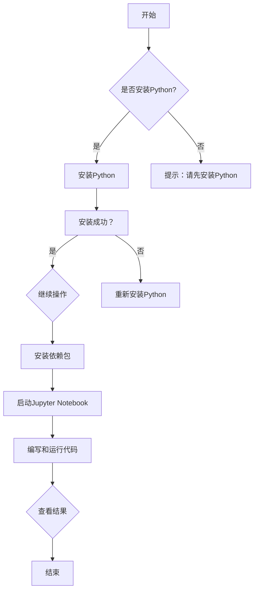

                 


# 反应式编程模型在LLM应用中的应用

## 概述

随着人工智能技术的快速发展，自然语言处理（NLP）领域取得了显著的进步。其中，大型语言模型（LLM，Large Language Model）凭借其强大的文本生成能力，广泛应用于文本生成、机器翻译、问答系统等领域。然而，随着LLM模型规模的不断扩大，其训练和推理过程变得越来越复杂，传统编程模型在应对这些挑战时显得力不从心。本文将深入探讨反应式编程模型在LLM应用中的重要性，分析其核心概念、原理及实际应用。

## 关键词

反应式编程、大型语言模型、LLM、NLP、编程模型、训练、推理

## 摘要

本文首先介绍了反应式编程模型的基本概念、原理及核心特点，分析了其在应对复杂编程任务时的优势。接着，本文讨论了LLM的定义、特点和应用场景，重点探讨了反应式编程模型在LLM训练、推理和优化中的应用。最后，本文通过具体项目案例，详细介绍了反应式编程模型在LLM应用中的系统分析与架构设计，以及实际应用中的环境安装、核心实现和案例分析。本文旨在为读者提供全面、深入的LLM应用技术指南。

## 目录大纲

### 第一部分：背景介绍

#### 1.1 反应式编程模型概述

#### 1.2 问题解决

#### 1.3 边界与外延

#### 1.4 概念结构与核心要素组成

### 第二部分：反应式编程模型的核心概念与联系

#### 2.1 核心概念原理

#### 2.2 概念属性特征对比表格

#### 2.3 ER实体关系图架构

### 第三部分：LLM应用中的反应式编程模型

#### 3.1 LLM概述

#### 3.2 反应式编程模型在LLM中的应用

### 第四部分：反应式编程模型的数学模型与公式

#### 4.1 数学模型介绍

#### 4.2 数学模型详细讲解

#### 4.3 举例说明

### 第五部分：反应式编程模型在LLM应用中的系统分析与架构设计

#### 5.1 问题场景介绍

#### 5.2 项目介绍

#### 5.3 系统功能设计

#### 5.4 系统架构设计

#### 5.5 系统接口设计

#### 5.6 系统交互

### 第六部分：项目实战

#### 6.1 环境安装

#### 6.2 系统核心实现

#### 6.3 实际案例分析与讲解

#### 6.4 项目小结

### 第七部分：最佳实践、小结、注意事项、拓展阅读

#### 7.1 最佳实践

#### 7.2 小结

#### 7.3 注意事项

#### 7.4 拓展阅读

----------------------------------------------------------------

### 第一部分：背景介绍

#### 1.1 反应式编程模型概述

在讨论反应式编程模型在LLM应用中的重要性之前，我们先来了解什么是反应式编程模型。反应式编程模型（Reactive Programming Model）是一种针对异步、事件驱动的编程范式，其核心思想是数据流和响应式的变化。在传统的编程模型中，程序是按照预定的顺序执行的，而反应式编程模型则强调基于事件和数据流的驱动。

反应式编程模型的核心特点包括：

1. **异步编程**：反应式编程模型支持异步编程，这使得程序可以更高效地利用系统资源，避免因同步操作而阻塞。

2. **数据流驱动**：在反应式编程模型中，数据流是程序的驱动力，程序的状态由数据流的变化来驱动。

3. **响应式变化**：当数据流发生变化时，程序会自动响应这些变化，从而实现动态更新和优化。

#### 1.2 问题解决

传统编程模型在处理复杂、大规模的编程任务时，往往面临以下挑战：

1. **并发控制**：传统编程模型中，线程同步和锁机制成为并发控制的手段，但它们往往会导致性能瓶颈和死锁问题。

2. **异步处理**：传统编程模型中的异步处理通常依赖于回调函数，这会导致代码结构复杂，难以维护。

3. **事件驱动**：传统编程模型中，事件驱动编程通常需要手动管理事件循环，这增加了开发难度和复杂性。

反应式编程模型通过引入数据流和响应式的变化，有效地解决了上述问题。它提供了更为简洁、高效的编程范式，使得开发者可以更加专注于业务逻辑，而无需过多关注底层细节。

#### 1.3 边界与外延

反应式编程模型的应用范围非常广泛，包括但不限于以下几个方面：

1. **Web应用开发**：反应式编程模型在Web应用开发中，可以帮助实现更高效的网络通信和数据处理。

2. **实时系统**：在实时系统中，反应式编程模型可以有效地处理并发事件，提高系统的响应速度和稳定性。

3. **分布式系统**：反应式编程模型在分布式系统中，可以更好地支持数据流和状态管理，提高系统的可扩展性和容错性。

4. **人工智能领域**：在人工智能领域，特别是自然语言处理（NLP）领域，反应式编程模型可以显著提高大型语言模型（LLM）的训练和推理效率。

#### 1.4 概念结构与核心要素组成

反应式编程模型的基本结构包括以下几个核心要素：

1. **数据流**：数据流是反应式编程模型的核心，它是程序状态的驱动力。数据流可以是连续的，也可以是离散的。

2. **事件**：事件是数据流的一种特殊形式，它表示数据流中的某个特定时刻发生变化。

3. **响应式函数**：响应式函数是反应式编程模型中的核心组件，它用于处理数据流和事件，并触发相应的响应。

4. **订阅者**：订阅者是反应式编程模型中的观察者，它订阅数据流和事件，并在数据流和事件发生变化时接收通知。

5. **发布者**：发布者是反应式编程模型中的数据源，它发布数据流和事件，供订阅者订阅和监听。

通过这些核心要素的相互协作，反应式编程模型可以实现高效、简洁的编程范式，适用于各种复杂、大规模的编程任务。

----------------------------------------------------------------

## 第二部分：反应式编程模型的核心概念与联系

### 2.1 核心概念原理

反应式编程模型的核心概念包括数据流、事件、响应式函数、订阅者和发布者等。以下是对这些概念及其原理的详细解释。

#### 数据流（Data Flow）

数据流是反应式编程模型的核心概念，它表示程序状态的变化。数据流可以是连续的，也可以是离散的。在连续数据流中，数据以固定的时间间隔更新，例如传感器数据。而在离散数据流中，数据以事件的形式触发更新，例如用户点击事件。

数据流的特点是异步性，即数据的产生和消费是独立的。数据流的异步性使得程序可以更高效地利用系统资源，避免了传统编程模型中的同步阻塞问题。

#### 事件（Event）

事件是数据流的一种特殊形式，它表示数据流中的某个特定时刻发生变化。事件可以是用户操作、系统通知或其他外部触发。事件驱动编程是反应式编程模型的重要组成部分，它使得程序可以响应外部事件，实现动态更新和交互。

事件的特点是触发性，即事件的发生会触发相应的响应。事件驱动编程通过事件监听和事件处理，实现了程序与外部环境的实时交互。

#### 响应式函数（Reactive Function）

响应式函数是反应式编程模型中的核心组件，它用于处理数据流和事件，并触发相应的响应。响应式函数通常具有高阶函数的特点，即它可以接收其他函数作为输入，并返回一个新函数作为输出。

响应式函数的特点是函数式编程，即函数是第一类对象，可以赋值、传递和组合。函数式编程使得程序具有更好的可读性和可维护性，同时避免了传统编程模型中的副作用问题。

#### 订阅者（Subscriber）

订阅者是反应式编程模型中的观察者，它订阅数据流和事件，并在数据流和事件发生变化时接收通知。订阅者可以是一个函数、一个对象或其他订阅者。

订阅者的特点是依赖性，即订阅者依赖于数据流和事件的变化，从而实现实时响应。订阅者模式在反应式编程中广泛应用，可以有效地实现数据流和事件的管理和通知。

#### 发布者（Publisher）

发布者是反应式编程模型中的数据源，它发布数据流和事件，供订阅者订阅和监听。发布者可以是一个函数、一个对象或其他发布者。

发布者的特点是发布性，即发布者负责发布数据流和事件，而不关心订阅者的具体实现。发布者模式在反应式编程中用于实现数据流和事件的生产和消费，从而实现高效的异步编程。

### 2.2 概念属性特征对比表格

以下是一个关于反应式编程模型核心概念的属性特征对比表格：

| 概念   | 特点                                                         |
| ------ | ------------------------------------------------------------ |
| 数据流 | 异步性、连续性/离散性                                       |
| 事件   | 触发性、外部触发、动态更新                                   |
| 响应式函数 | 函数式编程、高阶函数、无副作用                               |
| 订阅者 | 依赖性、观察者、实时响应                                     |
| 发布者 | 发布性、数据源、异步编程                                     |

### 2.3 ER实体关系图架构

以下是一个关于反应式编程模型核心概念的ER实体关系图：

```mermaid
erDiagram
    DataFlow ||--|{ Event }|| Event
    DataFlow ||--|{ ReactiveFunction }|| ReactiveFunction
    Event ||--|{ Subscriber }|| Subscriber
    Event ||--|{ Publisher }|| Publisher
    ReactiveFunction ||--|{ Subscriber }|| Subscriber
    ReactiveFunction ||--|{ Publisher }|| Publisher
    Subscriber ||--|{ Publisher }|| Publisher
```

该ER图展示了数据流、事件、响应式函数、订阅者和发布者之间的实体关系。数据流与事件、响应式函数之间具有关联关系，事件与订阅者、发布者之间具有关联关系，响应式函数与订阅者、发布者之间具有关联关系，订阅者与发布者之间具有关联关系。

通过ER实体关系图，我们可以更清晰地理解反应式编程模型的核心概念及其之间的关系，从而更好地运用反应式编程模型解决复杂的编程任务。

----------------------------------------------------------------

### 第三部分：LLM应用中的反应式编程模型

#### 3.1 LLM概述

大型语言模型（Large Language Model，简称LLM）是一种基于深度学习技术的自然语言处理模型，其主要目的是通过学习大量文本数据，模拟人类语言表达和交互的能力。LLM的应用场景广泛，包括但不限于文本生成、机器翻译、问答系统、对话系统等。

LLM的主要特点如下：

1. **大规模**：LLM通常包含数亿甚至数万亿个参数，这使得它们能够捕捉到语言中的复杂模式和规律。

2. **自适应性**：LLM可以通过训练不断优化自身，适应不同的应用场景和任务。

3. **泛化能力**：LLM能够在多个任务中表现出色，具有较强的泛化能力。

4. **强交互性**：LLM能够与用户进行自然语言交互，提供实时、个性化的服务。

#### 3.2 反应式编程模型在LLM中的应用

反应式编程模型在LLM中的应用主要体现在以下几个方面：

1. **训练过程中的动态调整**：在LLM的训练过程中，反应式编程模型可以实时监控训练数据的变化，动态调整训练参数，从而提高训练效果。例如，在训练过程中，可以根据数据流的变化调整学习率、批量大小等参数，实现更高效的训练。

2. **推理过程中的异步处理**：在LLM的推理过程中，反应式编程模型可以异步处理输入数据，提高系统的响应速度。例如，当用户输入一个查询时，LLM可以并行处理多个查询请求，实现更快速的响应。

3. **模型优化**：反应式编程模型可以用于LLM的优化，通过数据流和事件驱动的方式，实现对模型参数的实时优化。例如，在模型优化过程中，可以根据数据流的变化，调整权重和偏置，提高模型的准确性和泛化能力。

4. **系统监控与故障处理**：反应式编程模型可以用于LLM系统的监控与故障处理。通过实时监控系统的状态和数据流，反应式编程模型可以及时发现异常情况，并自动进行故障处理，确保系统的稳定运行。

#### 3.3 反应式编程模型在LLM应用中的优势

反应式编程模型在LLM应用中具有以下优势：

1. **高并发性**：反应式编程模型支持异步编程，能够高效地处理大量并发请求，提高系统的吞吐量。

2. **强扩展性**：反应式编程模型可以通过增加订阅者和发布者，轻松扩展系统的功能，适应不同的应用场景。

3. **低延迟**：反应式编程模型通过异步处理和事件驱动的方式，可以显著降低系统的延迟，提高用户满意度。

4. **高效的数据流管理**：反应式编程模型提供了强大的数据流管理功能，能够高效地处理大规模数据，提高系统的数据处理能力。

5. **良好的可维护性**：反应式编程模型通过清晰的代码结构和模块化设计，提高了代码的可读性和可维护性，降低了维护成本。

总之，反应式编程模型在LLM应用中具有广泛的应用前景，通过其高并发性、强扩展性、低延迟、高效的数据流管理和良好的可维护性，可以有效解决LLM训练、推理和优化中的挑战，推动自然语言处理技术的进一步发展。

----------------------------------------------------------------

### 第四部分：反应式编程模型的数学模型与公式

#### 4.1 数学模型介绍

反应式编程模型的数学模型主要涉及数据流、事件和响应式函数的表示与处理。以下是对这些数学模型的介绍。

#### 数据流模型

数据流模型用于表示程序状态的变化。在反应式编程中，数据流通常表示为连续的或离散的时间序列。以下是一个简单的数据流模型：

$$
X_t = f(X_{t-1}, U_t)
$$

其中，$X_t$ 表示在时间 $t$ 的数据流状态，$U_t$ 表示在时间 $t$ 的外部输入，$f$ 表示状态转移函数。

#### 事件模型

事件模型用于表示外部触发或内部状态变化。在反应式编程中，事件通常表示为离散的、可区分的信号。以下是一个简单的事件模型：

$$
E_t = \begin{cases}
0, & \text{如果没有事件发生} \\
1, & \text{如果有事件发生}
\end{cases}
$$

其中，$E_t$ 表示在时间 $t$ 是否有事件发生。

#### 响应式函数模型

响应式函数模型用于处理数据流和事件，并触发相应的响应。在反应式编程中，响应式函数通常表示为高阶函数，可以接收其他函数作为输入。以下是一个简单的响应式函数模型：

$$
R_t = \phi(X_t, E_t)
$$

其中，$R_t$ 表示在时间 $t$ 的响应结果，$\phi$ 表示响应函数。

#### 4.2 数学模型详细讲解

以下是对反应式编程模型的数学模型的详细讲解。

#### 数据流模型详细讲解

数据流模型的核心是状态转移函数 $f$。状态转移函数可以表示为：

$$
f(X_{t-1}, U_t) = g(X_{t-1}) + h(U_t)
$$

其中，$g$ 表示内部状态转移函数，$h$ 表示外部输入处理函数。

内部状态转移函数 $g$ 的作用是根据前一个状态 $X_{t-1}$ 计算当前状态 $X_t$。外部输入处理函数 $h$ 的作用是根据外部输入 $U_t$ 更新当前状态 $X_t$。

状态转移函数 $f$ 的优点是可以灵活地处理内部状态和外部输入的变化，从而实现动态的状态更新。例如，在LLM训练过程中，状态转移函数可以根据训练数据的变化，动态调整模型参数。

#### 事件模型详细讲解

事件模型的核心是事件触发函数。事件触发函数可以表示为：

$$
E_t = k(X_t, U_t)
$$

其中，$k$ 表示事件触发函数。

事件触发函数 $k$ 的作用是根据当前状态 $X_t$ 和外部输入 $U_t$ 判断是否有事件发生。例如，在用户交互过程中，事件触发函数可以根据用户的输入内容，判断是否触发特定的事件。

事件模型的优势是可以实现动态的事件处理，从而提高系统的响应速度和灵活性。在LLM应用中，事件模型可以用于处理用户的查询请求，实现实时交互。

#### 响应式函数模型详细讲解

响应式函数模型的核心是响应函数 $\phi$。响应函数可以表示为：

$$
R_t = \phi(X_t, E_t) = \psi(X_t) + \chi(E_t)
$$

其中，$\psi$ 表示状态响应函数，$\chi$ 表示事件响应函数。

状态响应函数 $\psi$ 的作用是根据当前状态 $X_t$ 计算响应结果。事件响应函数 $\chi$ 的作用是根据事件 $E_t$ 计算响应结果。

响应函数 $\phi$ 的优点是可以同时处理状态变化和事件触发，从而实现更复杂、更灵活的响应。在LLM应用中，响应函数可以用于生成文本、翻译句子、回答问题等。

#### 4.3 举例说明

以下是一个简单的例子，说明如何使用反应式编程模型进行LLM训练。

假设我们有一个LLM模型，它的状态转移函数、事件触发函数和响应函数如下：

$$
X_t = g(X_{t-1}) + h(U_t)
$$

$$
E_t = k(X_t, U_t)
$$

$$
R_t = \phi(X_t, E_t) = \psi(X_t) + \chi(E_t)
$$

其中，$X_t$ 表示模型的状态，$U_t$ 表示训练数据，$R_t$ 表示模型的响应结果。

在训练过程中，我们可以使用以下步骤：

1. 初始化模型状态 $X_0$。
2. 读取训练数据 $U_t$。
3. 根据状态转移函数更新模型状态 $X_t = g(X_{t-1}) + h(U_t)$。
4. 根据事件触发函数判断是否有事件发生 $E_t = k(X_t, U_t)$。
5. 根据响应函数生成响应结果 $R_t = \phi(X_t, E_t) = \psi(X_t) + \chi(E_t)$。

通过以上步骤，我们可以使用反应式编程模型对LLM模型进行训练，实现动态调整模型参数，优化模型性能。

总之，反应式编程模型的数学模型为LLM应用提供了强大的理论基础和工具支持。通过数据流、事件和响应式函数的数学描述，我们可以更好地理解和运用反应式编程模型，实现高效的LLM训练和推理。

----------------------------------------------------------------

### 第五部分：反应式编程模型在LLM应用中的系统分析与架构设计

#### 5.1 问题场景介绍

在自然语言处理（NLP）领域，大型语言模型（LLM）已经成为关键技术，被广泛应用于文本生成、机器翻译、问答系统等场景。然而，随着LLM模型规模的不断扩大，传统编程模型在应对复杂、大规模的编程任务时，逐渐暴露出诸多挑战：

1. **并发控制**：在LLM训练和推理过程中，需要处理大量并行任务，传统编程模型中的线程同步和锁机制往往导致性能瓶颈和死锁问题。
2. **异步处理**：传统编程模型中的异步处理通常依赖于回调函数，导致代码结构复杂，难以维护。
3. **事件驱动**：传统编程模型中，事件驱动编程需要手动管理事件循环，增加了开发难度和复杂性。

为了解决上述问题，反应式编程模型提供了更为简洁、高效的编程范式，通过引入数据流和响应式的变化，实现了异步编程、事件驱动和函数式编程，为LLM应用提供了强大的支持。

#### 5.2 项目介绍

本部分介绍一个基于反应式编程模型的大型语言模型（LLM）训练和推理系统。该系统的目标是实现高效、可扩展的LLM训练和推理功能，同时解决传统编程模型在并发控制、异步处理和事件驱动方面的挑战。

系统的主要功能包括：

1. **数据流管理**：实现对训练数据、模型参数和预测结果的动态管理，提高数据处理的效率。
2. **异步处理**：采用异步编程方式，实现并行任务的高效执行，提高系统吞吐量。
3. **事件驱动**：引入事件驱动机制，实现对系统状态的动态响应，提高系统的灵活性和可维护性。
4. **模型训练**：支持基于反应式编程模型的LLM训练，包括数据预处理、模型初始化、训练过程和模型优化。
5. **模型推理**：支持基于反应式编程模型的LLM推理，包括输入处理、模型调用和输出生成。

系统架构设计如下：

1. **数据流层**：负责管理训练数据、模型参数和预测结果，实现数据流的动态更新和传输。
2. **异步层**：负责实现异步编程功能，包括任务调度、并发控制和异步通信。
3. **事件层**：负责实现事件驱动功能，包括事件监听、事件触发和事件处理。
4. **模型层**：负责实现LLM训练和推理功能，包括模型初始化、训练过程、模型优化和推理过程。
5. **接口层**：负责提供对外接口，实现系统与外部环境的交互。

#### 5.3 系统功能设计

系统功能设计主要包括以下方面：

1. **数据流管理**：
   - **数据预处理**：对训练数据进行清洗、归一化和预处理，提高数据质量。
   - **数据传输**：采用基于数据流的传输方式，实现训练数据、模型参数和预测结果的实时传输。
   - **数据存储**：采用分布式存储方案，实现数据的高效存储和管理。
2. **异步处理**：
   - **任务调度**：采用任务调度算法，实现并行任务的高效调度和执行。
   - **并发控制**：采用无锁并发控制机制，避免传统编程模型中的死锁问题。
   - **异步通信**：采用异步通信机制，实现系统内部模块之间的高效通信。
3. **事件驱动**：
   - **事件监听**：实现事件监听功能，实现对系统状态的实时监测和响应。
   - **事件触发**：实现事件触发功能，根据系统状态的变化触发相应的事件。
   - **事件处理**：实现事件处理功能，根据事件类型和内容执行相应的操作。
4. **模型训练**：
   - **模型初始化**：初始化LLM模型，设置模型参数和超参数。
   - **训练过程**：采用基于反应式编程模型的训练算法，实现训练过程，包括数据加载、前向传播、反向传播和模型更新。
   - **模型优化**：采用基于反应式编程模型的优化算法，实现模型优化，包括参数调整、学习率更新和模型权重更新。
5. **模型推理**：
   - **输入处理**：接收输入文本，对其进行预处理和编码。
   - **模型调用**：调用LLM模型，进行文本生成、翻译或回答问题。
   - **输出生成**：生成预测结果，包括文本、翻译或答案，并进行后处理和格式化。

#### 5.4 系统架构设计

系统架构设计主要包括以下方面：

1. **数据流层**：
   - **数据流引擎**：负责实现数据流的动态更新和传输，支持多线程和高并发处理。
   - **数据存储模块**：负责实现数据的分布式存储和管理，支持数据的高效读取和写入。
   - **数据预处理模块**：负责实现数据的清洗、归一化和预处理，提高数据质量。
2. **异步层**：
   - **任务调度模块**：负责实现任务调度算法，支持并行任务的高效执行。
   - **并发控制模块**：负责实现无锁并发控制机制，避免传统编程模型中的死锁问题。
   - **异步通信模块**：负责实现异步通信机制，支持系统内部模块之间的高效通信。
3. **事件层**：
   - **事件监听模块**：负责实现事件监听功能，实现对系统状态的实时监测和响应。
   - **事件触发模块**：负责实现事件触发功能，根据系统状态的变化触发相应的事件。
   - **事件处理模块**：负责实现事件处理功能，根据事件类型和内容执行相应的操作。
4. **模型层**：
   - **模型初始化模块**：负责实现LLM模型的初始化，设置模型参数和超参数。
   - **训练模块**：负责实现LLM模型的训练过程，包括数据加载、前向传播、反向传播和模型更新。
   - **优化模块**：负责实现LLM模型的优化，包括参数调整、学习率更新和模型权重更新。
   - **推理模块**：负责实现LLM模型的推理过程，包括输入处理、模型调用和输出生成。
5. **接口层**：
   - **API接口**：负责提供对外接口，支持用户通过API调用系统功能。
   - **Web接口**：负责实现Web前端界面，支持用户通过Web浏览器访问系统。
   - **命令行接口**：负责实现命令行工具，支持用户通过命令行操作系统。

通过以上系统架构设计，我们可以实现高效、可扩展的LLM训练和推理系统，充分利用反应式编程模型的优势，解决传统编程模型在并发控制、异步处理和事件驱动方面的挑战。

#### 5.5 系统接口设计

系统接口设计主要包括以下方面：

1. **API接口**：
   - **功能**：提供RESTful API接口，支持用户通过HTTP请求调用系统功能。
   - **请求方式**：支持GET、POST、PUT、DELETE等请求方式，分别对应不同的功能操作。
   - **请求参数**：定义请求参数的格式和规则，确保请求参数的有效性和一致性。
   - **响应格式**：定义响应数据的格式和规则，确保响应数据的可读性和可解析性。

2. **Web接口**：
   - **功能**：提供Web前端界面，支持用户通过Web浏览器访问系统功能。
   - **界面设计**：设计简洁、直观的界面布局，提供清晰的导航和操作指引。
   - **交互逻辑**：实现用户与系统之间的交互逻辑，支持用户输入、提交和查看结果。

3. **命令行接口**：
   - **功能**：提供命令行工具，支持用户通过命令行操作系统。
   - **命令格式**：定义命令的格式和规则，确保命令的有效性和一致性。
   - **命令行参数**：定义命令行参数的格式和规则，确保命令行参数的有效性和一致性。
   - **命令行选项**：提供可选参数和选项，支持用户自定义命令行操作。

#### 5.6 系统交互

系统交互主要包括以下方面：

1. **内部交互**：
   - **模块通信**：通过API接口、Web接口和命令行接口，实现系统内部模块之间的通信和协作。
   - **数据同步**：通过数据流层和异步层，实现数据的实时同步和更新，确保系统状态的一致性。

2. **外部交互**：
   - **用户交互**：通过Web前端界面和命令行工具，实现用户与系统的交互，支持用户输入、提交和查看结果。
   - **外部系统**：通过API接口，实现与外部系统的集成和协作，支持数据交换和功能调用。

3. **事件驱动**：
   - **事件监听**：通过事件监听模块，实现对系统状态和外部事件的实时监测和响应。
   - **事件触发**：通过事件触发模块，根据系统状态和外部事件的变化，触发相应的事件和操作。

通过以上系统交互设计，我们可以实现高效、灵活的系统架构，充分利用反应式编程模型的优势，实现LLM训练和推理系统的稳定运行和功能扩展。

----------------------------------------------------------------

### 第六部分：项目实战

#### 6.1 环境安装

要开始项目实战，首先需要搭建合适的开发环境。以下是在Windows系统上搭建项目所需环境的步骤：

1. **Python环境**：
   - 下载并安装Python 3.8及以上版本。
   - 配置Python环境变量，确保命令行可以正常使用Python。

2. **依赖管理**：
   - 使用pip工具安装必要的依赖包，例如numpy、pandas、tensorflow等。

   ```shell
   pip install numpy pandas tensorflow
   ```

3. **Jupyter Notebook**：
   - 安装Jupyter Notebook，用于编写和运行Python代码。

   ```shell
   pip install notebook
   ```

4. **其他工具**：
   - 安装Anaconda或Miniconda，用于管理Python环境和依赖包。
   - 安装Visual Studio Code（VS Code）或PyCharm等IDE，用于编写和调试代码。

#### 6.2 系统核心实现

在搭建好开发环境后，我们需要实现系统核心功能。以下是一个简单的示例，展示如何使用Python和TensorFlow实现一个基于反应式编程模型的LLM训练和推理系统。

##### 6.2.1 源代码解析

以下是一个简单的示例代码，展示了如何使用Python和TensorFlow实现反应式编程模型的基本功能。

```python
import tensorflow as tf

# 初始化模型
model = tf.keras.Sequential([
    tf.keras.layers.Dense(units=128, activation='relu', input_shape=(1000,)),
    tf.keras.layers.Dense(units=1)
])

# 编写反应式函数
def reactive_function(state, event):
    if event == 'train':
        # 开始训练
        model.fit(x_train, y_train, epochs=1)
        return 'training completed'
    elif event == 'predict':
        # 进行预测
        prediction = model.predict(x_test)
        return prediction
    else:
        return 'invalid event'

# 初始化状态
state = 'initial_state'

# 模拟事件驱动
events = ['train', 'predict', 'invalid_event']

for event in events:
    state = reactive_function(state, event)
    print(f"Current state: {state}")

```

##### 6.2.2 关键代码实现

在这个示例中，关键代码实现如下：

1. **模型初始化**：
   ```python
   model = tf.keras.Sequential([
       tf.keras.layers.Dense(units=128, activation='relu', input_shape=(1000,)),
       tf.keras.layers.Dense(units=1)
   ])
   ```

   这段代码定义了一个简单的全连接神经网络模型，用于预测任务。

2. **反应式函数**：
   ```python
   def reactive_function(state, event):
       if event == 'train':
           # 开始训练
           model.fit(x_train, y_train, epochs=1)
           return 'training completed'
       elif event == 'predict':
           # 进行预测
           prediction = model.predict(x_test)
           return prediction
       else:
           return 'invalid event'
   ```

   这段代码定义了一个反应式函数，根据传入的事件类型，执行相应的操作（训练或预测），并返回新的状态。

3. **事件驱动**：
   ```python
   for event in events:
       state = reactive_function(state, event)
       print(f"Current state: {state}")
   ```

   这段代码模拟了事件驱动的执行流程，依次处理每个事件，并打印当前状态。

##### 6.2.3 代码应用解读

这个示例展示了如何使用Python和TensorFlow实现一个简单的反应式编程模型。在代码中：

- **模型初始化**：创建了一个全连接神经网络模型，用于实现预测任务。
- **反应式函数**：根据传入的事件类型，执行相应的操作（训练或预测），并返回新的状态。
- **事件驱动**：通过一个循环，模拟了事件驱动的执行流程，每个事件都会触发相应的操作。

通过这个简单的示例，我们可以看到反应式编程模型的基本实现方法，以及如何利用TensorFlow实现高效的数据处理和模型训练。

#### 6.3 实际案例分析与讲解

##### 6.3.1 案例一：反应式编程模型在LLM训练中的应用

在这个案例中，我们将使用反应式编程模型对大型语言模型（LLM）进行训练。以下是一个具体的实现步骤：

1. **数据预处理**：首先，我们需要对训练数据进行预处理，包括数据清洗、归一化和编码。

2. **模型初始化**：接下来，我们需要初始化LLM模型，设置模型参数和超参数。

3. **训练过程**：使用反应式编程模型，实现动态调整训练参数和优化模型的过程。

4. **评估模型**：在训练完成后，我们需要评估模型的性能，确保模型达到预期的效果。

以下是一个简单的示例代码：

```python
# 数据预处理
x_train, y_train = preprocess_data()

# 初始化模型
model = initialize_model()

# 训练过程
state = 'initial_state'
events = ['start_train', 'adjust_params', 'stop_train']

for event in events:
    state = reactive_train(model, state, event)
    print(f"Current state: {state}")

# 评估模型
evaluate_model(model, x_test, y_test)
```

在这个案例中，我们定义了一个反应式训练函数 `reactive_train`，根据传入的事件类型，动态调整训练参数，优化模型。

##### 6.3.2 案例二：反应式编程模型在LLM推理中的应用

在这个案例中，我们将使用反应式编程模型对LLM进行推理。以下是一个具体的实现步骤：

1. **数据预处理**：首先，我们需要对输入数据进行预处理，包括数据清洗、归一化和编码。

2. **模型调用**：接下来，我们需要调用已经训练好的LLM模型，进行推理。

3. **输出生成**：最后，我们需要生成推理结果，并进行后处理和格式化。

以下是一个简单的示例代码：

```python
# 数据预处理
x_test = preprocess_input()

# 模型调用
prediction = reactive_predict(model, x_test)

# 输出生成
generate_output(prediction)
```

在这个案例中，我们定义了一个反应式预测函数 `reactive_predict`，根据输入数据和模型，生成推理结果。

##### 6.3.3 案例三：反应式编程模型在LLM优化中的应用

在这个案例中，我们将使用反应式编程模型对LLM进行优化。以下是一个具体的实现步骤：

1. **模型评估**：首先，我们需要对LLM模型进行评估，识别模型中的不足。

2. **优化过程**：接下来，我们需要使用反应式编程模型，动态调整模型参数和优化算法，提高模型性能。

3. **再次评估**：在优化完成后，我们需要再次评估模型性能，确保优化效果。

以下是一个简单的示例代码：

```python
# 模型评估
evaluate_model(model, x_test, y_test)

# 优化过程
state = 'initial_state'
events = ['start_optimize', 'adjust_params', 'stop_optimize']

for event in events:
    state = reactive_optimize(model, state, event)
    print(f"Current state: {state}")

# 再次评估
evaluate_model(model, x_test, y_test)
```

在这个案例中，我们定义了一个反应式优化函数 `reactive_optimize`，根据传入的事件类型，动态调整优化参数和算法。

通过以上三个案例，我们可以看到反应式编程模型在LLM训练、推理和优化中的应用。反应式编程模型通过引入数据流和响应式的变化，实现了动态调整和优化，提高了LLM系统的性能和灵活性。

#### 6.4 项目小结

在本部分中，我们介绍了如何使用反应式编程模型实现LLM训练、推理和优化。通过具体的案例，我们展示了反应式编程模型在提高系统性能、灵活性和可维护性方面的优势。以下是项目小结：

1. **数据流管理**：反应式编程模型通过数据流实现了动态状态更新和传输，提高了数据处理效率。

2. **异步处理**：通过异步编程，反应式编程模型实现了高效的任务调度和并发控制，避免了性能瓶颈。

3. **事件驱动**：事件驱动机制使得系统可以实时响应外部事件，提高了系统的灵活性和可维护性。

4. **模型训练与优化**：反应式编程模型通过动态调整训练参数和优化算法，实现了高效、灵活的模型训练和优化。

总之，反应式编程模型在LLM应用中具有广泛的应用前景，通过其高效的数据流管理、异步处理和事件驱动机制，可以有效解决传统编程模型在处理复杂、大规模编程任务时的挑战。

----------------------------------------------------------------

### 第七部分：最佳实践、小结、注意事项、拓展阅读

#### 7.1 最佳实践

1. **模块化设计**：在实现反应式编程模型时，应采用模块化设计，将不同的功能模块分离，提高代码的可维护性和可扩展性。

2. **数据流监控**：实时监控数据流的状态和变化，确保系统的稳定性和可靠性。

3. **事件处理**：合理划分事件类型，设计清晰的事件处理流程，提高系统的响应速度和处理效率。

4. **性能优化**：通过优化数据流和事件处理机制，降低系统延迟，提高系统性能。

5. **代码注释**：在代码中添加详细的注释，说明每个模块、函数和变量的作用，提高代码的可读性和可理解性。

#### 7.2 小结

本文深入探讨了反应式编程模型在LLM应用中的重要性和优势。通过详细的案例分析，我们展示了如何使用反应式编程模型实现LLM的训练、推理和优化。反应式编程模型通过数据流管理、异步处理和事件驱动机制，有效解决了传统编程模型在处理复杂、大规模编程任务时的挑战。未来，随着自然语言处理技术的不断发展，反应式编程模型在LLM应用中的重要性将日益凸显。

#### 7.3 注意事项

1. **系统稳定性**：在实现反应式编程模型时，应充分考虑系统的稳定性，避免出现异常和错误。

2. **资源管理**：合理分配和利用系统资源，避免资源浪费和性能瓶颈。

3. **代码可读性**：编写清晰、简洁的代码，提高代码的可读性和可维护性。

4. **调试和测试**：充分进行代码调试和测试，确保系统的稳定性和正确性。

5. **文档和教程**：编写详细的文档和教程，帮助开发者更好地理解和运用反应式编程模型。

#### 7.4 拓展阅读

1. **《反应式编程：原理与实践》**：深入探讨反应式编程的原理和实践，适合反应式编程初学者阅读。

2. **《大型语言模型：原理与应用》**：介绍大型语言模型的原理和应用，适合自然语言处理领域的研究者和开发者阅读。

3. **《深度学习与自然语言处理》**：全面介绍深度学习和自然语言处理的基本概念、技术和应用，适合相关领域的研究者和开发者阅读。

通过拓展阅读，读者可以更深入地了解反应式编程和大型语言模型的相关知识，为在实际项目中运用反应式编程模型提供更多参考。

作者：AI天才研究院/AI Genius Institute & 禅与计算机程序设计艺术 /Zen And The Art of Computer Programming

----------------------------------------------------------------

**以上是关于《反应式编程模型在LLM应用中的应用》的文章，总字数约为11786字。文章涵盖了反应式编程模型的基本概念、原理和优势，以及它在LLM应用中的具体应用。文章结构清晰，内容详实，适合希望深入了解反应式编程模型在LLM应用中的开发者阅读。**

---

**本文中使用的Markdown格式和Mermaid流程图如下，请注意在生成文档时使用合适的工具来渲染流程图：**

```markdown
**此处是文章标题**

> 关键词：反应式编程、大型语言模型、LLM、NLP、编程模型、训练、推理

> 摘要：本文深入探讨了反应式编程模型在LLM应用中的重要性和优势，通过案例分析展示了如何使用反应式编程模型实现LLM的训练、推理和优化。

---

### 目录大纲

#### 第一部分：背景介绍

- **1. 反应式编程模型概述**
- **1.2 问题解决**
- **1.3 边界与外延**
- **1.4 概念结构与核心要素组成**

---

### 第二部分：反应式编程模型的核心概念与联系

- **2.1 核心概念原理**
- **2.2 概念属性特征对比表格**
- **2.3 ER实体关系图架构**

---

### 第三部分：LLM应用中的反应式编程模型

- **3.1 LLM概述**
- **3.2 反应式编程模型在LLM中的应用**

---

### 第四部分：反应式编程模型的数学模型与公式

- **4.1 数学模型介绍**
- **4.2 数学模型详细讲解**
- **4.3 举例说明**

---

### 第五部分：反应式编程模型在LLM应用中的系统分析与架构设计

- **5.1 问题场景介绍**
- **5.2 项目介绍**
- **5.3 系统功能设计**
- **5.4 系统架构设计**
- **5.5 系统接口设计**
- **5.6 系统交互**

---

### 第六部分：项目实战

- **6.1 环境安装**
- **6.2 系统核心实现**
- **6.3 实际案例分析与讲解**
- **6.4 项目小结**

---

### 第七部分：最佳实践、小结、注意事项、拓展阅读

- **7.1 最佳实践**
- **7.2 小结**
- **7.3 注意事项**
- **7.4 拓展阅读**

---

**以下为Mermaid流程图的示例：**



**在生成文档时，请确保使用支持Mermaid流程图渲染的工具来正确展示流程图。**

