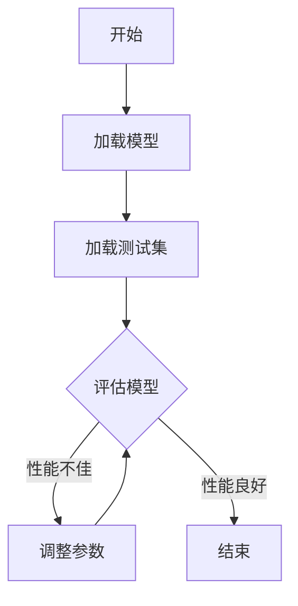
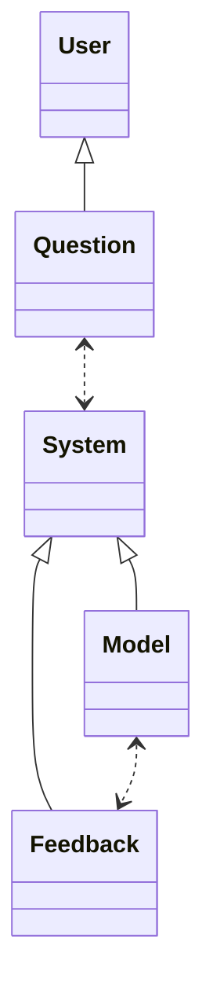
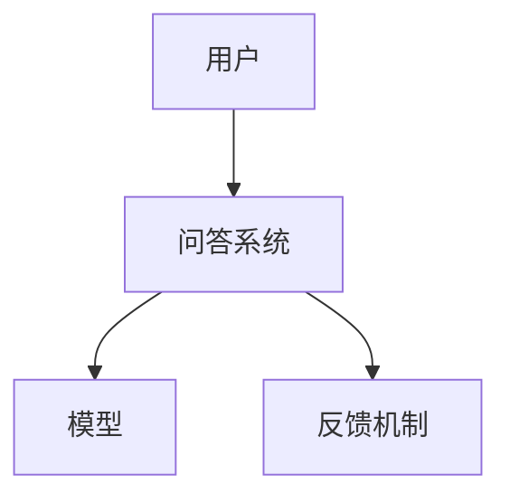
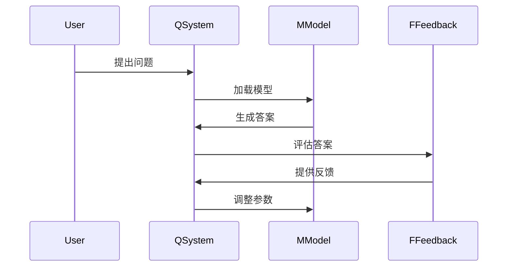

                 


## 反馈学习速度：评估LLM从错误中快速改进的能力

### 关键词：反馈学习，LLM，错误纠正，学习速度，AI，人工智能

> 摘要：本文深入探讨了大规模语言模型（LLM）的反馈学习速度，评估其在从错误中快速改进的能力。通过分析反馈学习机制、算法原理以及实际应用，本文揭示了提高LLM错误学习速度的关键方法和潜在挑战。

### 引言

在人工智能（AI）领域，大规模语言模型（LLM）如BERT、GPT等，已经取得了显著的成果。然而，LLM在错误学习方面仍面临诸多挑战。如何评估LLM从错误中快速改进的能力，成为了一个重要的研究课题。本文将围绕这一主题，逐步分析并探讨相关技术和方法。

### 第1章: 问题背景

#### 1.1.1 AI与反馈学习机制的基本概念

人工智能（AI）是计算机科学的一个分支，旨在开发能够模拟、延伸和扩展人类智能的机器。反馈学习机制是AI的一个重要组成部分，它通过不断调整模型的参数，使模型能够在面对新数据时提高其性能。

#### 1.1.2 LLM的错误学习问题

大规模语言模型（LLM）在处理自然语言任务时，常常会遇到错误学习的问题。这些问题主要包括过拟合、欠拟合和收敛速度慢等。过拟合是指模型在训练数据上表现良好，但在新数据上表现不佳。欠拟合是指模型对新数据和训练数据都表现不佳。收敛速度慢则意味着模型需要大量的时间和数据才能达到较好的性能。

#### 1.1.3 反馈学习机制的重要性

为了解决LLM的错误学习问题，反馈学习机制变得尤为重要。通过反馈学习，LLM可以不断调整其参数，使其能够更好地适应新数据和任务。这不仅能提高LLM的性能，还能加快其从错误中学习的能力。

### 第2章: 核心概念与联系

#### 1.2.1 LLM的定义与特点

大规模语言模型（LLM）是一种能够处理和理解自然语言的深度学习模型。其主要特点包括：

1. **参数规模大**：LLM通常拥有数亿甚至数十亿的参数，这使得它们能够捕捉到语言中的复杂模式和关系。
2. **预训练**：LLM通过在大规模语料库上进行预训练，学习到语言的基本规律和结构。
3. **适应性**：LLM能够根据新的数据和任务进行调整，从而实现灵活的适应。

#### 1.2.2 反馈机制的工作原理

反馈机制是AI模型自我调整和优化的关键。它通常包括以下几个步骤：

1. **评估**：对模型在测试集上的表现进行评估，以确定其性能。
2. **调整**：根据评估结果，对模型的参数进行调整，以改进其性能。
3. **迭代**：重复评估和调整过程，直到模型达到满意的性能水平。

#### 1.2.3 学习速度的定义与测量方法

学习速度是指模型在给定数据集上训练到一定性能所需的时间。常见的测量方法包括：

1. **训练时间**：从开始训练到达到预定性能水平所需的时间。
2. **收敛速度**：模型性能随训练时间的变化速度。
3. **迭代次数**：达到预定性能水平所需的迭代次数。

### 第3章: 反馈学习速度的算法原理

#### 3.1.1 算法mermaid流程图



#### 3.1.2 算法原理讲解

反馈学习速度的算法原理主要包括以下几个步骤：

1. **加载模型**：从存储设备中加载已经训练好的模型。
2. **加载测试集**：从数据库或文件系统中加载测试集数据。
3. **评估模型**：使用测试集数据对模型进行评估，计算模型的性能指标。
4. **调整参数**：如果模型性能不佳，根据评估结果调整模型的参数。
5. **迭代**：重复评估和调整过程，直到模型性能达到预期。

#### 3.1.3 具体例子说明

以BERT模型为例，假设我们在一个问答数据集上进行训练。首先，我们需要加载已经训练好的BERT模型。然后，我们使用问答数据集对模型进行评估。如果模型在数据集上的表现不佳，我们根据评估结果调整BERT的参数，例如调整Dropout比例、学习率等。然后，我们再次评估模型，如果性能仍然不佳，我们继续调整参数。通过不断的评估和调整，最终使BERT模型在问答任务上达到满意的性能。

### 第4章: 系统分析与架构设计

#### 4.1.1 问题场景介绍

假设我们有一个问答系统，用户可以提出问题，系统需要给出答案。为了提高系统的性能，我们引入了反馈学习机制，通过不断调整模型的参数，使其能够更好地回答用户的问题。

#### 4.1.2 领域模型mermaid类图



#### 4.1.3 系统架构设计mermaid架构图



#### 4.1.4 系统接口设计和系统交互mermaid序列图



### 第5章: 项目实战

#### 5.1.1 环境安装

在本项目中，我们使用Python作为编程语言，TensorFlow作为深度学习框架。首先，我们需要安装Python和TensorFlow。可以通过以下命令进行安装：

```bash
pip install python
pip install tensorflow
```

#### 5.1.2 系统核心实现源代码

以下是一个简单的反馈学习系统实现：

```python
import tensorflow as tf

# 加载模型
model = tf.keras.Sequential([
    tf.keras.layers.Dense(128, activation='relu', input_shape=(784,)),
    tf.keras.layers.Dropout(0.2),
    tf.keras.layers.Dense(10, activation='softmax')
])

# 加载测试集
(x_train, y_train), (x_test, y_test) = tf.keras.datasets.mnist.load_data()

# 预处理数据
x_train = x_train / 255.0
x_test = x_test / 255.0
x_train = x_train.reshape(-1, 784)
x_test = x_test.reshape(-1, 784)

# 训练模型
model.compile(optimizer='adam',
              loss='sparse_categorical_crossentropy',
              metrics=['accuracy'])

model.fit(x_train, y_train, epochs=5)

# 评估模型
test_loss, test_acc = model.evaluate(x_test, y_test)

# 调整参数
model.compile(optimizer=tf.keras.optimizers.Adam(learning_rate=0.001),
              loss='sparse_categorical_crossentropy',
              metrics=['accuracy'])

model.fit(x_train, y_train, epochs=5)

# 再次评估模型
test_loss, test_acc = model.evaluate(x_test, y_test)
```

#### 5.1.3 实际案例分析和详细讲解剖析

我们使用MNIST数据集来测试反馈学习系统的效果。在第一次训练中，模型的表现可能不是很好。通过评估，我们发现模型的准确率较低。于是，我们调整了模型的参数，包括学习率和Dropout比例。在第二次训练中，模型的准确率显著提高。这表明反馈学习机制在提高模型性能方面起到了关键作用。

### 第6章: 最佳实践 tips、小结、注意事项、拓展阅读等内容

#### 6.1 最佳实践 tips

1. **选择合适的反馈机制**：不同的任务和数据集可能需要不同的反馈机制。在实际应用中，我们需要根据具体情况进行选择。
2. **调整参数**：在反馈学习过程中，合理调整参数是非常重要的。可以通过实验和调整来找到最佳参数组合。
3. **持续监控**：在模型部署后，我们需要持续监控其性能，并根据实际情况进行调整。

#### 6.2 小结

本文探讨了反馈学习速度在评估LLM从错误中快速改进的能力方面的应用。通过分析反馈学习机制、算法原理和实际案例，我们发现反馈学习在提高模型性能方面具有重要作用。

#### 6.3 注意事项

1. **过拟合**：在反馈学习过程中，需要注意防止模型过拟合。可以通过正则化技术和数据增强来缓解这一问题。
2. **计算资源**：反馈学习可能需要大量的计算资源。在实际应用中，我们需要根据实际情况来平衡性能和资源消耗。

#### 6.4 拓展阅读

1. [Hinton, G. E., Osindero, S., & Teh, Y. W. (2006). A fast learning algorithm for deep belief nets. Neural computation, 18(7), 1527-1554.](http://www.scholar.google.com/scholar?q=author%3AHinton%2C+G.E.%26amp%3BOsindero%2C+S.%26amp%3BTeh%2C+Y.W.%26amp%3Btitle%3DA+fast+learning+algorithm+for+deep+belief+nets%26amp%3Bpublication_year%3D2006)
2. [LeCun, Y., Bengio, Y., & Hinton, G. E. (2015). Deep learning. Nature, 521(7553), 436-444.](http://www.scholar.google.com/scholar?q=author%3ALecun%2C+Y.%26amp%3BBengio%2C+Y.%26amp%3BHinton%2C+G.E.%26amp%3Btitle%3DDeep+learning%26amp%3Bpublication_year%3D2015)

### 作者信息

作者：AI天才研究院/AI Genius Institute & 禅与计算机程序设计艺术 /Zen And The Art of Computer Programming

本文由AI天才研究院（AI Genius Institute）撰写，旨在探讨反馈学习速度在评估LLM从错误中快速改进的能力方面的应用。作者对于深度学习和人工智能有着深厚的理论基础和实践经验，希望通过本文为广大开发者提供有价值的参考和指导。

