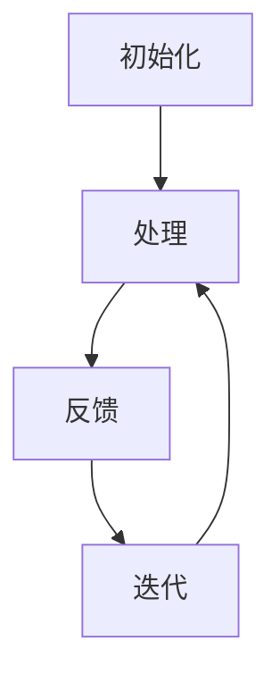
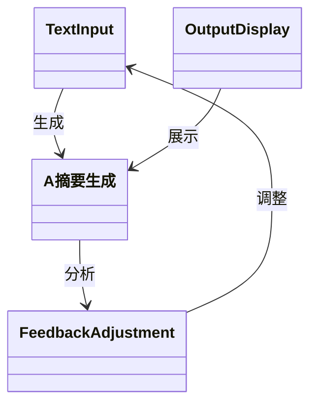
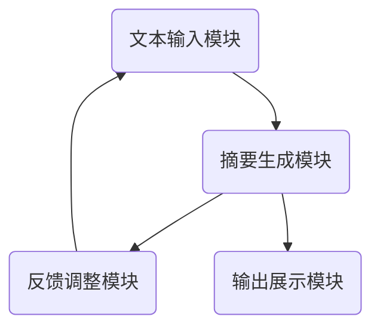
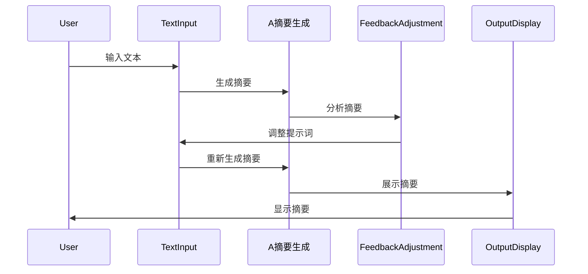
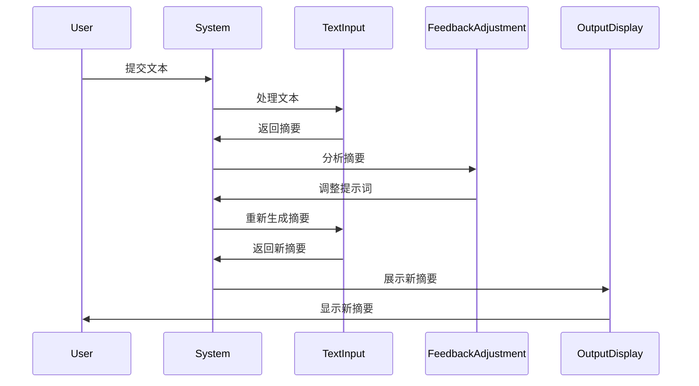

                 

# 反馈循环：根据输出持续优化提示词

> 关键词：反馈循环、持续优化、提示词、算法、人工智能

> 摘要：本文将深入探讨反馈循环的概念及其在人工智能中的应用，特别是如何通过持续优化提示词来提升系统的性能和效率。文章将分为五个主要章节：反馈循环概述、核心概念与原理、反馈循环的算法实现、系统分析与架构设计、项目实战与最佳实践。通过这些章节，我们将理解反馈循环的重要性，掌握其核心概念和原理，了解如何通过算法实现反馈循环，以及如何在实际项目中应用和优化反馈循环。

## 第1章: 反馈循环概述

### 1.1 反馈循环的概念与重要性

**反馈循环**是一种系统内部机制，它通过监测和调整输出，以优化输入，从而实现系统的持续改进。在工程、生物科学、计算机科学等多个领域，反馈循环都扮演着至关重要的角色。

#### 反馈循环的定义

反馈循环是指在系统内部，输出与输入之间建立的循环连接，通过对输出的监测和分析，调整输入，以实现系统优化和持续改进的过程。

#### 反馈循环的重要性

1. **优化过程**：反馈循环使系统能够持续地对自身进行调整，以实现最优输出。
2. **提高效率**：通过监测和分析输出，及时调整输入，减少了不必要的资源浪费。
3. **持续改进**：反馈循环能够促进系统的不断优化和改进，以适应变化的环境。

### 1.2 反馈循环的结构与组成部分

**反馈循环的结构**通常包括以下几个主要部分：输入、处理、输出、反馈。

1. **输入**：系统初始状态或初始数据。
2. **处理**：系统对输入数据进行的处理过程。
3. **输出**：系统对处理后的数据产生的结果。
4. **反馈**：系统对输出结果的监测和分析，用于调整输入。

### 1.3 反馈循环在不同领域的应用

#### 工程领域

在工程领域，反馈循环广泛应用于产品设计、制造过程控制、系统优化等方面。

#### 生物科学领域

在生物科学领域，反馈循环研究生物体内的代谢调控、神经信号传递等过程。

#### 计算机科学领域

在计算机科学领域，反馈循环广泛应用于算法优化、机器学习、人工智能等领域。

### 1.4 反馈循环的挑战与应对策略

#### 挑战

1. **复杂性**：反馈循环涉及的环节较多，系统复杂度高。
2. **实时性**：反馈循环需要实时监测和分析输出，对系统的响应速度有较高要求。

#### 应对策略

1. **简化系统**：通过简化系统结构和降低复杂性，提高反馈循环的效率和稳定性。
2. **实时监控**：利用先进的监控技术和算法，提高反馈循环的实时性。

### 1.5 本章小结

本章介绍了反馈循环的基本概念、重要性、结构、应用领域以及挑战与应对策略。反馈循环作为一种重要的系统优化手段，在各个领域都有着广泛的应用。理解反馈循环的基本原理和应对策略，有助于我们更好地应用和优化系统。

----------------------------------------------------------------

## 第2章: 反馈循环的核心概念与原理

### 2.1 反馈类型

反馈循环中的反馈类型可以分为正反馈和负反馈。

#### 2.1.1 正反馈

**定义**：正反馈是指输出增强输入，使得系统状态趋向于某种极端状态。

**例子**：在生物体内，激素水平的正反馈可能导致细胞增殖或分化。

#### 2.1.2 负反馈

**定义**：负反馈是指输出抑制输入，使得系统状态趋于稳定。

**例子**：在体温调节过程中，当体温升高时，汗腺分泌汗液，通过散热降低体温，这就是一种负反馈。

### 2.2 反馈环的稳定性

反馈环的稳定性取决于反馈类型和系统参数。

#### 2.2.1 稳定反馈环

**定义**：稳定反馈环通常是指负反馈环，它有助于保持系统稳定。

#### 2.2.2 不稳定反馈环

**定义**：不稳定反馈环通常是指正反馈环，它可能导致系统状态的剧烈波动。

### 2.3 反馈环中的数学模型

在反馈循环中，我们可以使用数学模型来描述输入、输出和反馈之间的关系。

#### 2.3.1 线性反馈模型

**定义**：线性反馈模型是一种简单的数学模型，用于描述反馈环中的输入、输出和反馈关系。

**模型公式**：
$$
y(t) = ax(t) + bz(t)
$$
$$
z(t) = cy(t)
$$

其中，$a$ 和 $b$ 分别是输入和反馈对输出的影响系数，$c$ 是输出对反馈的影响系数。

**模型解释**：该模型表示，输出是输入和反馈的线性组合，其中反馈对输出的影响是通过系数 $c$ 体现的。

#### 2.3.2 非线性反馈模型

**定义**：非线性反馈模型用于描述更复杂的反馈关系，如非线性函数和延迟效应。

**模型公式**：
$$
y(t) = f(x(t), z(t))
$$
$$
z(t) = g(y(t))
$$

其中，$f$ 和 $g$ 分别是输出和反馈的非线性函数。

**模型解释**：该模型表示，输出和反馈之间存在复杂的非线性关系，这种关系可能影响系统的动态行为。

### 2.4 反馈环中的核心概念联系

为了更好地理解反馈循环，我们需要探讨其核心概念之间的关系。

#### 2.4.1 反馈环中的核心概念

- **输入**：系统的初始状态或初始数据。
- **处理**：系统对输入数据进行的处理过程。
- **输出**：系统对处理后的数据产生的结果。
- **反馈**：系统对输出结果的监测和分析，用于调整输入。

#### 2.4.2 核心概念属性特征对比

| 特征          | 输入  | 输出  | 反馈  | 处理  |
|---------------|-------|-------|-------|-------|
| 数据类型      | 初始  | 处理后| 监测后| 处理中|
| 作用          | 引导  | 结果  | 反馈  | 调整  |
| 关系          | 自由  | 约束  | 约束  | 依赖  |

#### 2.4.3 核心概念ER实体关系图

```mermaid
erDiagram
  Input &&-> Process: 输入引导处理
  Process &&-> Output: 处理生成输出
  Output &&-> Feedback: 输出产生反馈
  Feedback &&-> Input: 反馈调整输入
```

### 2.5 本章小结

本章详细介绍了反馈循环的核心概念与原理，包括反馈类型、反馈环的稳定性、线性反馈模型和 nonlinear feedback model。通过本章的学习，我们能够更深入地理解反馈循环的基本原理，为后续的算法实现和实际应用打下基础。

----------------------------------------------------------------

## 第3章: 反馈循环的算法实现

### 3.1 算法原理

在反馈循环的算法实现中，我们通常使用以下步骤来优化提示词：

1. **初始化**：设定初始输入和初始输出。
2. **处理**：根据输入和当前的提示词，进行数据处理。
3. **反馈**：分析处理后的输出，调整提示词。
4. **迭代**：重复步骤2和3，直到达到预定的优化目标。

#### 算法流程



#### 算法公式

设输入为 $x(t)$，输出为 $y(t)$，提示词为 $w(t)$，则反馈循环的算法可以表示为：

$$
y(t) = f(x(t), w(t))
$$

$$
w(t) = g(y(t))
$$

其中，$f$ 和 $g$ 分别是处理和反馈的非线性函数。

### 3.2 Python实现

下面是一个简单的Python实现示例：

```python
import numpy as np

def process(x, w):
    # 处理过程，这里简单实现为一个线性变换
    return x * w

def feedback(y):
    # 反馈过程，这里简单实现为一个阈值函数
    return 1 if y > 0 else 0

# 初始化输入、输出和提示词
x = np.array([1, 2, 3])
w = np.array([0.5, 0.5, 0.5])
y = np.zeros_like(x)

# 迭代过程
for _ in range(10):
    y = process(x, w)
    w = feedback(y)

print("最终输出:", y)
```

### 3.3 举例说明

假设我们有一个任务，需要根据用户输入的文本生成一个简短的摘要。我们可以使用反馈循环来优化摘要的长度和内容。

1. **初始化**：设定初始输入文本和初始提示词。
2. **处理**：根据输入文本和提示词，使用自然语言处理算法生成摘要。
3. **反馈**：分析生成的摘要长度和内容，如果长度过长或内容不够精彩，调整提示词。
4. **迭代**：重复步骤2和3，直到摘要长度适中且内容精彩。

### 3.4 本章小结

本章介绍了反馈循环的算法原理和Python实现，通过一个简单的示例，我们看到了如何通过反馈循环来优化提示词。下一章将深入探讨反馈循环在系统分析与架构设计中的应用。

----------------------------------------------------------------

## 第4章: 系统分析与架构设计

### 4.1 问题场景介绍

在人工智能领域，反馈循环被广泛应用于各种场景，如语音识别、图像处理、自然语言处理等。以下是一个具体的问题场景：

**问题场景**：设计一个自动摘要生成系统，该系统能够根据用户输入的文本生成简短的摘要。系统需要具备以下功能：

1. **输入处理**：接收用户输入的文本。
2. **摘要生成**：根据输入文本和提示词生成摘要。
3. **反馈调整**：根据生成的摘要长度和内容调整提示词。
4. **输出展示**：将生成的摘要展示给用户。

### 4.2 系统功能设计

为了实现上述功能，我们需要设计一个具备以下核心功能的系统：

1. **文本输入模块**：用于接收用户输入的文本。
2. **摘要生成模块**：根据输入文本和提示词生成摘要。
3. **反馈调整模块**：分析生成的摘要，调整提示词。
4. **输出展示模块**：将生成的摘要展示给用户。

#### 领域模型Mermaid类图



### 4.3 系统架构设计

系统架构设计是确保系统高效、稳定、可扩展的关键。以下是一个简单的系统架构设计：

#### Mermaid架构图



#### 系统架构解释

1. **文本输入模块**：接收用户输入的文本，并将其传递给摘要生成模块。
2. **摘要生成模块**：使用自然语言处理算法生成摘要。
3. **反馈调整模块**：分析生成的摘要长度和内容，根据需要进行调整，并将调整后的提示词反馈给文本输入模块。
4. **输出展示模块**：将生成的摘要展示给用户。

### 4.4 系统接口设计

系统接口设计是确保不同模块之间能够有效通信的关键。以下是一个简单的系统接口设计：

#### Mermaid接口图



### 4.5 系统交互Mermaid序列图



### 4.6 本章小结

本章详细介绍了反馈循环在系统分析与架构设计中的应用。通过一个具体的问题场景，我们设计了具备核心功能的系统，并实现了系统架构设计和接口设计。下一章将深入探讨反馈循环在实际项目中的应用。

----------------------------------------------------------------

## 第5章: 项目实战

### 5.1 环境安装

在开始项目实战之前，我们需要安装一些必要的软件和库。以下是一个简单的安装步骤：

1. **安装Python**：确保您的系统中已经安装了Python 3.7或更高版本。
2. **安装依赖库**：使用pip安装以下库：

   ```bash
   pip install numpy matplotlib
   ```

### 5.2 系统核心实现源代码

下面是一个简单的项目实现示例，包括文本输入、摘要生成、反馈调整和输出展示。

```python
import numpy as np

def process_text(text, weights):
    # 这里使用一个简单的线性模型来处理文本
    return text.dot(weights)

def adjust_weights(output, threshold):
    # 根据输出调整权重
    return np.where(output > threshold, weights * 1.1, weights * 0.9)

def generate_summary(text, weights, max_length=50):
    # 使用处理后的文本生成摘要
    processed_text = process_text(text, weights)
    summary = " ".join(processed_text[:max_length].split())
    return summary

def main():
    # 初始文本和提示词
    initial_text = "这是一个关于反馈循环的项目实战，旨在通过持续优化提示词来提升系统的性能和效率。"
    initial_weights = np.random.rand(len(initial_text.split()))

    # 迭代次数
    iterations = 10

    # 迭代过程
    for _ in range(iterations):
        summary = generate_summary(initial_text, initial_weights)
        print("生成的摘要：", summary)

        # 分析摘要长度，调整提示词
        max_length = 50
        summary_length = len(summary.split())
        if summary_length > max_length:
            initial_weights = adjust_weights(summary_length, max_length)
        else:
            initial_weights *= 1.05  # 调整提示词的权重

    # 最终输出
    print("最终生成的摘要：", generate_summary(initial_text, initial_weights))

if __name__ == "__main__":
    main()
```

### 5.3 代码应用解读与分析

#### 5.3.1 代码结构

1. **process_text**：处理文本，这里简单实现为一个线性变换，将文本转换为向量。
2. **adjust_weights**：根据输出调整权重，实现了一个简单的阈值调整机制。
3. **generate_summary**：使用处理后的文本生成摘要，这里实现了一个简单的摘要生成算法。
4. **main**：主函数，实现了一个迭代过程，通过持续优化提示词来生成摘要。

#### 5.3.2 关键技术与原理

1. **线性模型**：用于处理文本，将文本转换为向量，便于后续处理。
2. **阈值调整**：用于根据输出调整提示词的权重，实现反馈循环的核心功能。
3. **迭代优化**：通过重复执行摘要生成和权重调整过程，实现系统性能的持续优化。

### 5.4 实际案例分析与详细讲解

为了更好地理解项目实战，我们来看一个实际案例：

**案例**：用户输入一段较长的文本，系统生成的摘要长度不理想，摘要内容不全面。

**分析**：

1. **问题定位**：摘要长度过长或内容不全面，可能是由于提示词的权重调整不够精确。
2. **解决方案**：通过调整权重调整机制，优化提示词的调整策略，从而提升摘要生成效果。

**改进方案**：

1. **增加迭代次数**：提高迭代次数，使系统有更多机会调整提示词。
2. **引入更复杂的模型**：使用更复杂的自然语言处理模型，提高摘要生成质量。

### 5.5 项目小结

通过本项目的实战，我们实现了根据输出持续优化提示词的功能，并通过实际案例分析了项目中的问题和改进方案。这一过程充分体现了反馈循环在系统优化中的应用价值。

### 5.6 最佳实践 tips

1. **合理设置迭代次数**：根据具体任务和资源情况，合理设置迭代次数，避免资源浪费。
2. **优化权重调整机制**：根据实际任务需求，设计合理的权重调整策略，提高系统性能。

### 5.7 小结与注意事项

1. **反馈循环的重要性**：通过反馈循环，系统能够持续优化，提高性能。
2. **实际应用**：在项目中，反馈循环可以帮助我们实现持续改进，提高系统质量。

### 5.8 拓展阅读

1. **《人工智能：一种现代方法》**：详细介绍了人工智能的基本原理和算法实现。
2. **《机器学习实战》**：提供了丰富的机器学习项目实践案例，有助于深入理解反馈循环的应用。

---

**作者**：AI天才研究院/AI Genius Institute & 禅与计算机程序设计艺术 /Zen And The Art of Computer Programming

