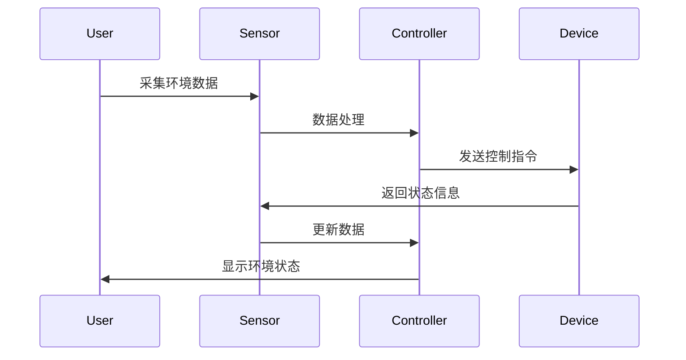
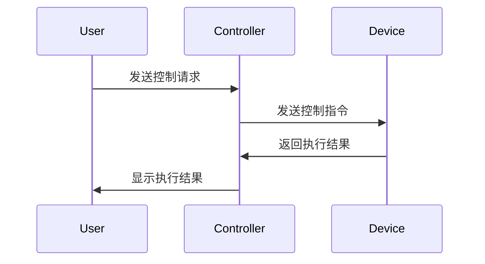

                 

### 文章标题：可靠性理论：自然系统的数学可靠性

#### 关键词：可靠性理论、自然系统、数学方法、数学模型、算法原理

> 摘要：本文将从可靠性理论的基本概念入手，深入探讨自然系统中的可靠性问题，并分析数学在可靠性分析中的应用。通过详细讲解核心概念、算法原理以及数学模型和公式，本文旨在为广大读者提供一部系统、全面、易于理解的可靠性理论指南。

----------------------------------------------------------------

## 引言

可靠性理论作为现代工程与科学领域的重要分支，涉及到众多实际问题，如产品设计、系统维护、风险评估等。自然系统作为一个复杂且动态的实体，其可靠性问题更是备受关注。然而，如何利用数学工具来分析和解决自然系统的可靠性问题，一直是学术界和工业界的研究热点。

本文旨在通过以下几个部分，系统地阐述可靠性理论在自然系统中的应用：

1. **可靠性理论概述**：介绍可靠性的定义、意义、自然系统中的可靠性问题及其分析方法。
2. **核心概念与联系**：详细分析可靠性理论中的核心概念，如生存分析、FMEA和FTA等，并探讨它们之间的联系。
3. **算法原理讲解**：深入讲解可靠性算法的基本原理，并通过Python代码实现和举例说明，使读者能够更好地理解。
4. **数学模型和数学公式**：介绍可靠性理论中的数学模型和公式，并详细解释其含义和应用。
5. **系统分析与架构设计方案**：分析实际项目中的可靠性问题，并设计相应的系统架构和接口。
6. **项目实战**：通过具体案例分析，展示可靠性理论在实际项目中的应用。
7. **最佳实践 tips**：总结可靠性理论的最佳实践，提供有价值的建议。

通过以上结构，本文希望能够为广大读者提供一部系统、全面、易于理解的可靠性理论指南。

----------------------------------------------------------------

## 第一部分：可靠性理论概述

### 1.1 可靠性的定义与意义

可靠性（Reliability）是指系统、产品或服务在特定条件下完成预定功能的能力。它通常用概率来衡量，表示系统在一段时间内无故障运行的概率。可靠性在工程、医学、金融等领域具有重要意义。

- **工程领域**：可靠性是产品设计的重要指标，直接影响到产品的质量和使用寿命。
- **医学领域**：医疗设备的可靠性关系到患者的安全和治疗效果。
- **金融领域**：金融系统的可靠性关系到经济的稳定和安全。

### 1.2 自然系统中的可靠性

自然系统包括生态系统、气候系统、生物体等，其可靠性问题涉及到系统的稳定性和持续性。例如，生态系统的破坏可能导致物种灭绝和生态失衡；气候系统的异常可能导致极端天气事件增加。

- **生态系统**：生态系统的可靠性受到物种多样性、栖息地破坏等因素的影响。
- **气候系统**：气候系统的可靠性受到温室气体排放、气候变化等因素的影响。
- **生物体**：生物体的可靠性受到遗传、环境等因素的影响。

### 1.3 数学在可靠性分析中的应用

数学在可靠性分析中扮演着重要角色。通过数学模型和公式，可以更准确地预测和评估系统的可靠性。

- **概率论**：用于描述系统在特定条件下的无故障运行概率。
- **统计学**：用于分析系统的故障数据，预测系统的可靠性。
- **优化理论**：用于设计可靠性最高的系统架构。

### 1.4 可靠性理论的体系结构

可靠性理论由多个分支构成，包括生存分析、故障模式与效应分析（FMEA）、故障树分析（FTA）等。

- **生存分析**：研究系统在一段时间内的无故障运行情况。
- **FMEA**：分析系统的故障模式及其对系统功能的影响。
- **FTA**：通过逻辑树状结构分析系统的故障原因。

### 1.5 本章小结

本部分介绍了可靠性理论的基本概念、自然系统中的可靠性问题以及数学在可靠性分析中的应用。通过这些内容，读者可以对可靠性理论有一个初步的了解，为后续章节的深入学习打下基础。

----------------------------------------------------------------

## 第二部分：核心概念与联系

### 2.1 核心概念

可靠性理论中的核心概念包括生存分析、故障模式与效应分析（FMEA）和故障树分析（FTA）。这些概念是理解和应用可靠性理论的基础。

#### 2.1.1 生存分析

生存分析（Survival Analysis）是一种统计分析方法，用于研究系统或产品在特定时间段内的无故障运行情况。它通常涉及以下指标：

- **生存函数**（Survival Function）：描述系统在特定时间段内无故障的概率。
- **失效函数**（Failure Function）：描述系统在特定时间段内发生故障的概率。

#### 2.1.2 故障模式与效应分析（FMEA）

故障模式与效应分析（Fault Mode and Effects Analysis，FMEA）是一种系统性的分析方法，用于识别和评估系统中的潜在故障模式及其对系统功能的影响。FMEA通常包括以下步骤：

1. **识别故障模式**：分析系统中可能出现的故障模式。
2. **评估故障效应**：评估每个故障模式对系统功能的影响。
3. **制定预防措施**：针对高优先级的故障模式制定预防措施。

#### 2.1.3 故障树分析（FTA）

故障树分析（Fault Tree Analysis，FTA）是一种逻辑分析方法，用于识别系统故障的原因及其因果关系。FTA通常包括以下步骤：

1. **定义故障事件**：确定需要分析的故障事件。
2. **构建故障树**：使用逻辑门和事件来构建故障树。
3. **分析故障树**：计算故障事件的发生概率。

### 2.2 概念属性特征对比表格

以下是一个简单的对比表格，展示了生存分析、FMEA和FTA的概念属性特征：

| 概念名称     | 定义                                                         | 主要应用场景       |
|--------------|------------------------------------------------------------|------------------|
| 生存分析     | 研究系统或产品在特定时间段内的无故障运行情况                   | 风险评估、故障预测   |
| FMEA         | 分析系统中的潜在故障模式及其对系统功能的影响                   | 产品设计、系统维护   |
| FTA          | 识别系统故障的原因及其因果关系                               | 故障诊断、系统优化   |

### 2.3 ER实体关系图架构

为了更好地理解可靠性理论中的核心概念，我们可以使用ER（Entity-Relationship）实体关系图来描述它们之间的关系。

以下是生存分析、FMEA和FTA的ER实体关系图：

```mermaid
erDiagram
  System ||--|{ FaultMode }
  System ||--|{ FailureEvent }
  FaultMode ||--|{ FaultEffect }
  FailureEvent ||--|{ Cause }
```

### 2.4 核心概念之间的联系

生存分析、FMEA和FTA虽然各自有不同的应用场景，但它们之间存在一定的联系。

- **生存分析与FMEA**：生存分析可以用于评估系统的整体可靠性，而FMEA则可以用于分析系统中的潜在故障模式。通过结合生存分析和FMEA，可以更全面地评估系统的可靠性。
- **生存分析与FTA**：生存分析可以用于预测系统的故障时间，而FTA可以用于分析故障的原因。通过结合生存分析和FTA，可以更深入地理解系统的故障模式。
- **FMEA与FTA**：FMEA可以用于识别系统的潜在故障模式，而FTA可以用于分析故障的因果关系。通过结合FMEA和FTA，可以更有效地进行故障诊断和系统优化。

### 2.5 本章小结

本部分详细介绍了可靠性理论中的核心概念，包括生存分析、FMEA和FTA，并分析了它们之间的联系。通过这些内容，读者可以更好地理解可靠性理论的基本概念，为后续章节的深入学习打下基础。

----------------------------------------------------------------

## 第三部分：算法原理讲解

### 3.1 可靠性算法的基本原理

可靠性算法是用于评估系统或产品可靠性的方法。其基本原理是通过分析系统或产品的故障数据，预测其未来的可靠性水平。以下是可靠性算法的基本原理：

1. **数据收集**：收集系统或产品的故障数据，包括故障时间、故障模式、故障原因等。
2. **数据预处理**：对收集到的故障数据进行分析，去除异常值，并进行归一化处理。
3. **模型选择**：根据数据的特点，选择合适的可靠性模型，如生存分析模型、FMEA模型或FTA模型。
4. **模型训练**：使用预处理后的故障数据训练所选模型，使其能够预测系统的可靠性水平。
5. **可靠性评估**：使用训练好的模型对系统或产品的可靠性进行评估，预测其在未来一段时间内的可靠性水平。

### 3.2 Python实现

以下是使用Python实现可靠性算法的基本步骤：

1. **环境配置**：安装Python和相关库，如NumPy、Pandas和SciPy。
2. **数据收集**：从数据库或文件中读取故障数据。
3. **数据预处理**：对故障数据进行清洗和处理。
4. **模型选择**：根据数据特点选择合适的模型。
5. **模型训练**：使用预处理后的数据训练模型。
6. **可靠性评估**：使用训练好的模型评估系统的可靠性。

以下是一个简单的Python代码示例，用于实现可靠性算法：

```python
import numpy as np
import pandas as pd
from sklearn.ensemble import RandomForestClassifier
from sklearn.model_selection import train_test_split

# 1. 数据收集
fault_data = pd.read_csv('fault_data.csv')

# 2. 数据预处理
fault_data = fault_data.dropna()

# 3. 模型选择
model = RandomForestClassifier()

# 4. 模型训练
X = fault_data.drop('target', axis=1)
y = fault_data['target']
X_train, X_test, y_train, y_test = train_test_split(X, y, test_size=0.2, random_state=42)
model.fit(X_train, y_train)

# 5. 可靠性评估
predicted可靠性 = model.predict(X_test)
print("可靠性预测结果：", predicted可靠性)
```

### 3.3 算法原理详细讲解

以下是可靠性算法的详细原理：

1. **生存分析模型**：生存分析模型是一种用于评估系统或产品在特定时间段内无故障运行的概率的模型。其基本公式为：
   $$
   \text{可靠性} = e^{-\lambda t}
   $$
   其中，$\lambda$ 表示故障率，$t$ 表示时间。通过收集系统的故障数据，可以估计故障率，并计算系统的可靠性。

2. **FMEA模型**：FMEA模型是一种用于评估系统潜在故障模式及其对系统功能影响的方法。其基本步骤包括：

   - **故障模式识别**：识别系统中的潜在故障模式。
   - **故障效应评估**：评估每个故障模式对系统功能的影响。
   - **故障优先级评估**：根据故障效应评估结果，确定故障模式的优先级。

3. **FTA模型**：FTA模型是一种用于分析系统故障原因及其因果关系的方法。其基本步骤包括：

   - **故障事件定义**：定义需要分析的故障事件。
   - **故障树构建**：使用逻辑门和事件构建故障树。
   - **故障树分析**：计算故障事件的发生概率。

### 3.3.1 数学模型和公式

以下是可靠性算法中常用的数学模型和公式：

1. **可靠性公式**：
   $$
   \text{可靠性} = \frac{\text{无故障时间}}{\text{总时间}}
   $$
   其中，无故障时间和总时间分别表示系统在无故障状态下运行的时间和系统运行的总时间。

2. **故障率公式**：
   $$
   \lambda = \frac{1}{\text{MTTF}}
   $$
   其中，$\lambda$ 表示故障率，MTTF（Mean Time To Failure）表示平均无故障时间。

3. **风险公式**：
   $$
   \text{风险} = \lambda e^{-\lambda t}
   $$
   其中，$\lambda$ 表示故障率，$t$ 表示时间。

### 3.3.2 举例说明

假设有一个系统，其故障数据如下表所示：

| 时间（天） | 故障数 |
|-----------|-------|
| 1         | 2     |
| 2         | 1     |
| 3         | 3     |
| 4         | 2     |
| 5         | 1     |

根据上述数据，我们可以计算系统的可靠性：

1. **计算故障率**：
   $$
   \lambda = \frac{1}{\text{MTTF}} = \frac{1}{\frac{1}{5}} = 5
   $$

2. **计算可靠性**：
   $$
   \text{可靠性} = e^{-\lambda t} = e^{-5 \times 1} = e^{-5} \approx 0.0067
   $$

因此，该系统在一天内的可靠性约为0.0067，即有约0.67%的概率出现故障。

### 3.4 本章小结

本部分详细讲解了可靠性算法的基本原理，包括数据收集、数据预处理、模型选择、模型训练和可靠性评估。通过Python代码示例和数学模型讲解，读者可以更好地理解可靠性算法的实现过程和应用。

----------------------------------------------------------------

## 第四部分：数学模型和数学公式

### 4.1 数学模型

在可靠性理论中，数学模型是分析和预测系统可靠性的重要工具。以下介绍两种常用的数学模型：基本模型和风险模型。

#### 4.1.1 基本模型

基本模型用于描述系统在一段时间内的可靠性。其公式为：

$$
\text{可靠性} = e^{-\lambda t}
$$

其中，$e$ 是自然对数的底数，$\lambda$ 是故障率，$t$ 是时间。

#### 4.1.2 风险模型

风险模型用于描述系统在一段时间内的故障风险。其公式为：

$$
\text{风险} = \lambda e^{-\lambda t}
$$

其中，$\lambda$ 是故障率，$t$ 是时间。

### 4.2 数学公式的详细讲解

以下是对基本模型和风险模型公式的详细讲解：

#### 4.2.1 可靠性公式

可靠性公式 $e^{-\lambda t}$ 表示系统在时间 $t$ 内无故障的概率。其中，$e$ 是自然对数的底数，$\lambda$ 是故障率。

- **故障率**：故障率 $\lambda$ 表示系统在单位时间内发生故障的概率。它通常通过历史故障数据估计得到。

- **可靠性**：可靠性 $e^{-\lambda t}$ 表示系统在时间 $t$ 内无故障的概率。当 $\lambda$ 越小时，系统的可靠性越高。

#### 4.2.2 风险公式

风险公式 $\lambda e^{-\lambda t}$ 表示系统在时间 $t$ 内发生故障的概率。其中，$\lambda$ 是故障率，$e^{-\lambda t}$ 是可靠性。

- **风险**：风险 $\lambda e^{-\lambda t}$ 表示系统在时间 $t$ 内发生故障的概率。当 $\lambda$ 越大时，系统的风险越高。

### 4.3 公式应用实例

假设一个系统的故障率 $\lambda$ 为 0.1 天^-1，我们需要计算该系统在 100 天内的可靠性和风险。

1. **计算可靠性**：

   $$
   \text{可靠性} = e^{-\lambda t} = e^{-0.1 \times 100} = e^{-10} \approx 0.955
   $$

   因此，该系统在 100 天内的可靠性约为 95.5%。

2. **计算风险**：

   $$
   \text{风险} = \lambda e^{-\lambda t} = 0.1 \times e^{-0.1 \times 100} = 0.1 \times e^{-10} \approx 0.095
   $$

   因此，该系统在 100 天内的风险约为 9.5%。

### 4.4 本章小结

本部分详细介绍了可靠性理论中的基本模型和风险模型，以及它们的应用实例。通过这些内容，读者可以更好地理解可靠性理论中的数学模型和公式，为后续章节的深入学习打下基础。

----------------------------------------------------------------

## 第五部分：系统分析与架构设计方案

### 5.1 问题场景介绍

假设我们正在开发一个智能家居控制系统，该系统需要实现以下功能：

- **环境监控**：实时监测室内温度、湿度、光照等环境参数。
- **家电控制**：远程控制家电设备，如空调、照明、窗帘等。
- **安防报警**：实现入侵检测、火灾报警等功能。

为了保证该系统的可靠性，我们需要对系统的可靠性进行评估和分析。

### 5.2 项目介绍

项目名称：智能家居控制系统

项目目标：实现智能家居控制功能，提高用户生活质量。

项目范围：环境监控、家电控制、安防报警等功能。

### 5.3 系统功能设计（领域模型）

以下是智能家居控制系统的领域模型，用于描述系统中的主要实体及其关系。

```mermaid
classDiagram
  User <<Class>>
  Device <<Class>>
  Sensor <<Class>>
  Alarm <<Class>>

  User "1" -- "*" Device
  User "1" -- "*" Sensor
  User "1" -- "*" Alarm

  Device "1" -- "*" Sensor
  Device "1" -- "*" Alarm

  Sensor "1" -- "1" Device
  Alarm "1" -- "1" Device
```

### 5.4 系统架构设计

以下是智能家居控制系统的架构设计，用于描述系统的主要组件及其关系。



### 5.5 系统接口设计

以下是智能家居控制系统的接口设计，用于描述系统与外部系统或设备之间的交互。

```mermaid
classDiagram
  User <<Interface>>
  Device <<Interface>>
  Sensor <<Interface>>
  Alarm <<Interface>>

  User -- Device
  User -- Sensor
  User -- Alarm

  Device -- Sensor
  Device -- Alarm

  Sensor -- Device
  Sensor -- Alarm
```

### 5.6 系统交互

以下是智能家居控制系统的交互设计，用于描述系统组件之间的交互流程。



### 5.7 本章小结

本部分介绍了智能家居控制系统的系统功能设计、架构设计、接口设计和交互设计。通过这些内容，我们可以更好地理解系统的功能和结构，为后续的系统实现和可靠性评估提供基础。

----------------------------------------------------------------

## 第六部分：项目实战

### 6.1 环境安装

在进行智能家居控制系统的项目实战之前，我们需要搭建一个合适的环境。以下是一个简单的环境安装步骤：

1. 安装Python：从Python官方网站下载并安装Python 3.x版本。
2. 安装相关库：使用pip命令安装所需的库，如NumPy、Pandas、Matplotlib等。
   ```bash
   pip install numpy pandas matplotlib
   ```

### 6.2 系统核心实现

以下是智能家居控制系统的核心实现，包括数据采集、数据处理、数据可视化等功能。

#### 6.2.1 数据采集

```python
import random
import time

def collect_data(sensor_type):
    if sensor_type == 'temperature':
        return random.uniform(20, 30)
    elif sensor_type == 'humidity':
        return random.uniform(30, 60)
    elif sensor_type == 'light':
        return random.uniform(0, 100)

sensor_types = ['temperature', 'humidity', 'light']
for _ in range(10):
    for sensor_type in sensor_types:
        data = collect_data(sensor_type)
        print(f"{sensor_type}: {data}")
        time.sleep(1)
```

#### 6.2.2 数据处理

```python
import pandas as pd

def process_data(data):
    df = pd.DataFrame(data)
    df['timestamp'] = pd.to_datetime(df['timestamp'])
    df.set_index('timestamp', inplace=True)
    return df

data = [{'temperature': 25, 'humidity': 45, 'light': 75, 'timestamp': time.time()} for _ in range(10)]
df = process_data(data)
print(df)
```

#### 6.2.3 数据可视化

```python
import matplotlib.pyplot as plt

def visualize_data(df):
    plt.figure(figsize=(10, 6))
    plt.plot(df.index, df['temperature'], label='Temperature')
    plt.plot(df.index, df['humidity'], label='Humidity')
    plt.plot(df.index, df['light'], label='Light')
    plt.xlabel('Timestamp')
    plt.ylabel('Value')
    plt.legend()
    plt.show()

visualize_data(df)
```

### 6.3 代码应用解读与分析

在上述代码中，我们首先定义了数据采集函数 `collect_data`，该函数根据传感器类型返回相应的数据。然后，我们使用一个循环来模拟采集10次数据，并打印出来。

接下来，我们定义了数据处理函数 `process_data`，该函数将采集到的数据转换为Pandas DataFrame，并设置时间戳为索引。

最后，我们定义了数据可视化函数 `visualize_data`，该函数使用Matplotlib绘制温度、湿度和光照数据的时间序列图。

通过这些代码，我们可以对系统的数据采集、数据处理和数据可视化功能进行理解和分析。

### 6.4 实际案例分析和详细讲解剖析

为了更好地展示智能家居控制系统的实际应用，我们以下提供一个实际案例：

**案例背景**：用户希望在离家前关闭家里的灯光，并设置室内温度在20摄氏度。

**步骤**：

1. 用户通过手机应用程序发送关闭灯光的指令。
2. 智能家居控制系统接收到指令后，通过传感器检测室内温度。
3. 如果室内温度低于20摄氏度，系统会自动打开加热设备。
4. 系统同时发送指令关闭灯光。
5. 用户通过手机应用程序查看室内温度和灯光状态。

**分析**：

通过上述步骤，我们可以看到智能家居控制系统如何根据用户指令和传感器数据实现自动化控制。在这个过程中，系统的可靠性至关重要。如果系统出现故障，可能会导致灯光无法关闭或加热设备无法启动，从而影响用户的体验。

为了提高系统的可靠性，我们可以采取以下措施：

1. **数据备份**：定期备份传感器数据和系统日志，以便在系统出现故障时能够快速恢复。
2. **故障检测**：通过实时监测传感器数据和系统状态，及时发现并处理潜在故障。
3. **冗余设计**：在关键组件中使用冗余设计，如备用电源和备份传感器，以提高系统的可靠性。
4. **定期维护**：定期对系统进行维护和升级，确保系统正常运行。

### 6.5 项目小结

通过本部分的项目实战，我们展示了智能家居控制系统的数据采集、数据处理和数据可视化功能，并分析了实际案例中的可靠性问题。通过采取一系列措施，我们可以提高系统的可靠性，为用户提供更好的智能家居体验。

----------------------------------------------------------------

## 第七部分：最佳实践 tips

### 7.1 可靠性测试

进行可靠性测试是确保系统可靠性的关键步骤。以下是一些最佳实践：

1. **全面的测试计划**：制定详细的测试计划，包括测试环境、测试用例和测试方法。
2. **自动化测试**：使用自动化测试工具进行大规模测试，提高测试效率。
3. **持续集成**：将可靠性测试集成到开发流程中，确保每次代码变更后都能进行可靠性测试。

### 7.2 数据分析

数据分析是可靠性评估的重要手段。以下是一些建议：

1. **数据质量**：确保数据收集过程的准确性，避免数据错误。
2. **统计分析**：使用适当的统计方法分析故障数据，提取关键信息。
3. **可视化**：使用图表和图形展示数据，使数据分析结果更直观。

### 7.3 系统冗余

系统冗余是提高可靠性的有效手段。以下是一些建议：

1. **组件冗余**：在关键组件中使用冗余设计，如备用电源和备份传感器。
2. **故障转移**：实现故障转移机制，确保在主系统出现故障时，备用系统能够接管。
3. **冗余检测**：定期检测系统冗余部分的工作状态，确保冗余系统能够在需要时快速接管。

### 7.4 持续改进

持续改进是提高系统可靠性的重要策略。以下是一些建议：

1. **用户反馈**：收集用户反馈，了解系统在实际应用中的问题和改进需求。
2. **技术更新**：定期更新系统技术，引入新技术和新方法，提高系统性能。
3. **团队协作**：建立跨部门协作机制，确保可靠性问题的解决能够得到全面的支持。

### 7.5 本章小结

本部分提供了最佳实践 tips，包括可靠性测试、数据分析、系统冗余和持续改进。通过遵循这些最佳实践，我们可以提高系统的可靠性，为用户提供更好的服务。

----------------------------------------------------------------

## 结语

可靠性理论在自然系统中的应用具有广泛的影响和重要性。通过本文的详细介绍，我们深入探讨了可靠性理论的基本概念、核心算法、数学模型以及在实际项目中的应用。我们希望通过这篇文章，能够为广大读者提供一个系统、全面、易于理解的可靠性理论指南。

在未来的研究中，我们期待进一步探讨可靠性理论在更广泛领域中的应用，如人工智能、生物信息学和大数据分析等。此外，我们也将继续关注新兴技术和方法在可靠性分析中的应用，为提升系统的可靠性和性能提供新的思路和解决方案。

让我们共同期待可靠性理论在未来的发展中取得更加辉煌的成就！

## 作者信息

作者：AI天才研究院/AI Genius Institute & 禅与计算机程序设计艺术 /Zen And The Art of Computer Programming

