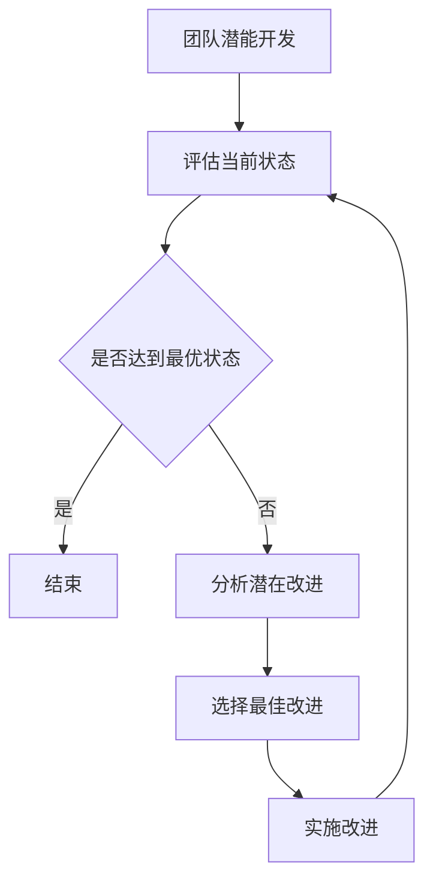
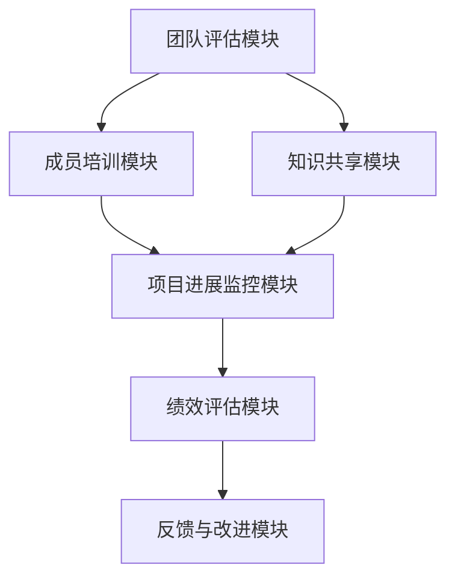

                 

# 团队潜能开发：挖掘每个成员的价值

## 关键词
- 团队潜能开发
- 成员价值挖掘
- 支持性环境
- 学习型团队
- 自我发展
- 跨部门合作
- 成功案例
- 可持续改进

## 摘要
本文将探讨如何通过团队潜能开发，挖掘每个成员的价值，提高团队整体效能。文章结构清晰，分为四个部分：引言、团队潜能开发策略、成功案例解析、结论与展望。我们将逐步分析团队潜能的定义与重要性、开发策略、实施步骤，并结合实际案例进行深入剖析，为企业和团队管理者提供实用的指导。

## 第一部分：引言

### 1.1 团队潜能的定义与重要性

团队潜能是指团队成员在特定工作环境和条件下，能够发挥出的最大能力和价值。挖掘团队潜能，不仅有助于提高团队整体工作效率，还能促进团队成员的个人成长与职业发展。

在现代企业中，团队效能至关重要。高效的团队能够迅速响应市场变化，创新解决方案，提升企业竞争力。而团队潜能开发正是实现这一目标的关键途径。

#### 团队潜能的重要性

1. **提高工作效率**：充分发挥每个成员的潜力，能够优化工作流程，减少不必要的资源浪费，提升团队整体的工作效率。
2. **促进创新**：团队潜能开发鼓励成员提出创新想法，通过协作和知识共享，实现集体智慧的最大化。
3. **增强团队凝聚力**：当团队成员感受到自己的价值被认可和重视时，会增强对团队的归属感和责任感，提升团队凝聚力。

### 1.2 当前团队效能的挑战

尽管团队潜能开发的重要性显而易见，但在实际操作中，许多团队仍面临以下挑战：

1. **成员技能与角色不匹配**：有些成员的能力与岗位需求不匹配，导致无法充分发挥其潜力。
2. **缺乏有效的沟通**：团队成员之间的沟通不畅，容易导致误解和矛盾，影响团队效能。
3. **缺乏培训与发展机会**：团队成员往往缺乏持续学习和发展的机会，导致技能和知识得不到更新。

### 1.3 本书目标与结构

本书旨在提供一套系统化的团队潜能开发策略，帮助企业和团队管理者解决上述挑战。文章结构如下：

- **第一部分：引言**：介绍团队潜能开发的重要性与当前挑战。
- **第二部分：团队潜能开发策略**：详细探讨团队潜能开发的策略与实施步骤。
- **第三部分：成功案例解析**：分析成功团队如何实现潜能开发。
- **第四部分：结论与展望**：总结核心要素，展望未来趋势。

### 1.4 背景介绍

在当今高度竞争的商业环境中，企业需要不断提升自身竞争力，以适应市场变化。而团队作为企业运作的核心，其效能的发挥直接关系到企业的成功。团队潜能开发正是通过挖掘每个成员的潜力，提高团队整体效能，从而帮助企业在竞争中脱颖而出。

### 1.5 核心概念与联系

**团队潜能开发**：指通过一系列策略和措施，激发团队成员的潜力，提升团队整体效能。

**成员价值挖掘**：关注如何识别和发挥每个成员的独特价值，使其在团队中发挥最大作用。

**支持性环境**：指为团队成员创造一个有利于潜能开发的工作环境，包括领导支持、培训机会、沟通机制等。

**学习型团队**：强调团队成员持续学习和知识共享，以提升团队整体能力。

**自我发展**：鼓励成员设定个人目标，不断追求自我提升和职业发展。

**跨部门合作**：促进不同部门之间的协作，实现资源的最大化利用。

### 1.6 算法原理讲解

团队潜能开发的过程可以看作是一种优化算法。以下是一个简化的算法原理：

```python
def team_potential_development(team_members, environment, goals):
    # 初始化团队状态
    current_state = evaluate_team_state(team_members, environment, goals)
    
    while not optimal_state_reached(current_state):
        # 分析当前状态
        potential_improvements = analyze_state(current_state)
        
        # 选择最佳改进方案
        best_improvement = select_best_improvement(potential_improvements)
        
        # 实施改进方案
        apply_improvement(best_improvement)
        
        # 更新团队状态
        current_state = evaluate_team_state(team_members, environment, goals)
    
    return current_state
```

在上述算法中，`evaluate_team_state` 用于评估当前团队状态，`analyze_state` 用于分析潜在改进方向，`select_best_improvement` 用于选择最佳改进方案，`apply_improvement` 用于实施改进方案。

### 1.7 系统分析与架构设计方案

在实施团队潜能开发时，需要考虑以下几个方面：

1. **问题场景介绍**：明确团队面临的挑战和目标。
2. **项目介绍**：介绍团队潜能开发项目的背景和目的。
3. **系统功能设计**：包括团队评估、成员培训、知识共享等功能。
4. **系统架构设计**：包括技术架构、数据架构、业务流程等。
5. **系统接口设计和系统交互**：确保团队各模块之间的良好协作。

### 1.8 项目实战

在项目实战中，我们可以通过以下步骤来实施团队潜能开发：

1. **环境安装**：搭建团队潜能开发所需的技术和工具环境。
2. **系统核心实现**：编写代码实现系统功能。
3. **代码应用解读与分析**：对关键代码进行解读和分析。
4. **实际案例分析和详细讲解**：结合实际案例进行深入剖析。
5. **项目小结**：总结项目实施过程中的经验与教训。

### 1.9 最佳实践 tips

- **明确目标和期望**：确保团队成员对项目目标和期望有清晰的认识。
- **建立支持性环境**：为团队成员提供必要的资源和支持。
- **鼓励自主学习**：鼓励成员持续学习和自我提升。
- **持续反馈与改进**：及时收集反馈，不断优化团队潜能开发策略。

## 第二部分：团队潜能开发策略

### 2.1 建立支持潜能开发的环境

#### 2.1.1 领导者的角色

领导者是团队潜能开发的关键推动者。他们需要：

1. **明确愿景和目标**：为团队设定清晰的愿景和目标，激发成员的积极性。
2. **提供支持与资源**：确保团队成员有足够的资源和支持，以充分发挥其潜力。
3. **鼓励自主决策**：赋予成员更多的自主权，鼓励他们主动思考和解决问题。
4. **建立信任文化**：营造一个开放、包容和信任的工作氛围，促进团队成员之间的协作。

#### 2.1.2 营造积极团队文化

积极的团队文化对团队潜能开发至关重要。以下是一些建议：

1. **鼓励创新和尝试**：对团队成员的创新想法给予肯定和支持，鼓励他们勇于尝试。
2. **建立有效的沟通机制**：确保团队成员之间的沟通畅通，减少误解和矛盾。
3. **培养团队精神**：通过团队建设活动，增强成员之间的凝聚力和归属感。

#### 2.1.3 改进沟通机制

有效的沟通是团队潜能开发的基础。以下是一些建议：

1. **定期召开会议**：确保团队成员有足够的时间和机会进行交流。
2. **建立反馈机制**：鼓励成员之间相互反馈，及时解决问题。
3. **利用多种沟通渠道**：结合面对面沟通、邮件、即时通讯工具等多种方式，提高沟通效率。

### 2.2 增强团队学习能力

#### 2.2.1 学习型团队的建设

建设学习型团队，有助于提升团队整体能力。以下是一些建议：

1. **建立学习计划**：为团队成员设定学习目标和计划，确保他们有持续学习的机会。
2. **分享学习资源**：提供丰富的学习资源和工具，帮助成员快速提升。
3. **开展内部培训**：组织内部培训，促进知识共享和技能传承。

#### 2.2.2 利用培训与发展的机会

团队成员应积极参与各类培训和发展机会，以下是一些建议：

1. **参加外部培训**：利用外部培训资源，提升专业技能和知识水平。
2. **参与行业会议**：了解行业动态，拓展视野，建立人脉关系。
3. **开展在线学习**：利用在线课程和教程，灵活安排学习时间。

#### 2.2.3 促进知识共享与创新

知识共享和创新是团队潜能开发的重要驱动力。以下是一些建议：

1. **建立知识库**：收集和整理团队内部的知识和经验，方便成员查阅和分享。
2. **开展头脑风暴**：鼓励成员积极参与头脑风暴，提出创新想法。
3. **设立创新奖项**：对创新成果给予认可和奖励，激发团队成员的创新热情。

### 2.3 鼓励团队成员自我发展

#### 2.3.1 设定明确的目标和期望

为团队成员设定明确的目标和期望，有助于激发他们的积极性和主动性。以下是一些建议：

1. **制定个人发展计划**：为团队成员提供制定个人发展计划的机会，明确短期和长期目标。
2. **提供反馈和指导**：定期为团队成员提供反馈和指导，帮助他们了解自己的优势和改进方向。
3. **鼓励目标达成**：对达成目标的团队成员给予认可和奖励，增强他们的成就感。

#### 2.3.2 提供反馈和指导

有效的反馈和指导是团队成员自我发展的重要支持。以下是一些建议：

1. **建立定期反馈机制**：定期为团队成员提供反馈，帮助他们了解自己的工作表现。
2. **提供个性化指导**：根据团队成员的实际情况，提供个性化的指导和建议。
3. **鼓励自我反思**：鼓励团队成员自我反思，找到自己的不足和改进方向。

#### 2.3.3 鼓励自主学习与职业规划

自主学习与职业规划是团队成员个人成长的重要途径。以下是一些建议：

1. **提供学习资源**：为团队成员提供丰富的学习资源，支持他们的自主学习。
2. **鼓励参加职业培训**：鼓励团队成员参加职业培训，提升职业素养和技能水平。
3. **支持职业发展**：为团队成员提供职业发展机会和支持，帮助他们实现职业目标。

### 2.4 通过合作激发潜能

#### 2.4.1 团队协作的障碍与解决方案

团队协作是实现团队潜能开发的关键。以下是一些常见的协作障碍及解决方案：

1. **沟通不畅**：解决方案：建立有效的沟通机制，提高沟通效率。
2. **角色冲突**：解决方案：明确团队成员的角色和职责，减少冲突。
3. **资源不足**：解决方案：合理分配资源，确保团队成员有足够的支持。
4. **目标不一致**：解决方案：统一团队目标，确保团队成员朝着共同的目标努力。

#### 2.4.2 促进跨部门合作

跨部门合作有助于整合资源，提升团队整体效能。以下是一些建议：

1. **建立跨部门项目组**：组建跨部门项目组，共同推进项目进展。
2. **共享信息和资源**：促进部门之间的信息共享和资源整合，提高协作效率。
3. **定期沟通与协调**：定期召开跨部门沟通会议，确保项目进展的顺利进行。

#### 2.4.3 构建高效的团队协作模式

构建高效的团队协作模式，有助于实现团队潜能的最大化。以下是一些建议：

1. **设定明确的任务分工**：确保每个团队成员都明确自己的任务和职责。
2. **建立团队协作平台**：利用协作工具，提高团队协作效率。
3. **鼓励团队成员相互支持**：鼓励团队成员相互支持，共同解决困难和挑战。

## 第三部分：成功案例解析

### 3.1 案例一：公司A的团队潜能开发实践

公司A通过一系列团队潜能开发措施，成功提升了团队效能。以下是他们的一些实践：

1. **领导支持**：公司高层领导积极支持团队潜能开发，提供必要的资源和支持。
2. **培训与发展**：公司定期为团队成员提供培训和职业发展机会，提升其技能和知识水平。
3. **知识共享**：公司建立了内部知识库，鼓励团队成员分享经验和知识，促进团队整体能力的提升。
4. **绩效激励**：公司设立绩效激励机制，对表现优秀的团队成员给予奖励，激发其积极性。

### 3.2 案例二：团队B如何实现成员价值的最大化

团队B通过以下措施，实现了成员价值的最大化：

1. **明确目标和期望**：团队领导与成员明确各自的目标和期望，确保团队成员对工作有清晰的认识。
2. **自主决策**：团队成员被赋予更多的自主权，鼓励他们主动思考和解决问题。
3. **支持性环境**：团队营造了一个支持性环境，为成员提供必要的资源和支持，帮助他们充分发挥潜力。
4. **持续反馈与改进**：团队建立了定期反馈机制，及时为成员提供反馈和指导，帮助他们不断提升。

### 3.3 案例三：团队C的创新合作模式

团队C通过以下创新合作模式，实现了团队成员潜能的最大化：

1. **跨部门合作**：团队C积极推动跨部门合作，整合各部门资源，共同推进项目进展。
2. **头脑风暴**：团队C定期组织头脑风暴活动，鼓励成员提出创新想法，通过集体智慧找到最佳解决方案。
3. **知识共享**：团队C建立了内部知识库，方便成员查阅和分享知识和经验，促进团队整体能力的提升。
4. **奖励机制**：团队C设立创新奖励机制，对提出创新想法和实施成功的成员给予奖励，激发团队成员的创新热情。

## 第四部分：结论与展望

### 4.1 团队潜能开发的核心要素

团队潜能开发的核心要素包括：

1. **领导支持**：领导者的支持与鼓励是团队潜能开发的重要保障。
2. **培训与发展**：持续培训和发展有助于提升团队成员的技能和知识水平。
3. **知识共享**：知识共享能够促进团队整体能力的提升。
4. **自主决策**：赋予团队成员更多的自主权，激发他们的积极性和创造力。
5. **绩效激励**：合理的绩效激励机制能够激发团队成员的积极性。

### 4.2 面临的挑战与未来趋势

尽管团队潜能开发具有重要意义，但在实际操作中仍面临以下挑战：

1. **成员技能与角色不匹配**：解决这一问题的关键在于优化人员配置，确保成员的技能与岗位需求相匹配。
2. **缺乏有效的沟通**：提高团队成员之间的沟通效率，建立有效的沟通机制。
3. **资源不足**：合理分配资源，确保团队成员有足够的支持。

未来团队潜能开发将呈现以下趋势：

1. **数字化工具的广泛应用**：数字化工具将进一步提升团队协作和效能。
2. **个性化培训与发展**：根据团队成员的实际情况，提供个性化的培训和发展计划。
3. **持续反思与改进**：不断反思和优化团队潜能开发策略，实现持续改进。

### 4.3 展望未来

随着技术的不断进步和企业对团队效能要求的提高，团队潜能开发将成为企业竞争的重要手段。未来，我们将看到更多企业和团队采用先进的团队潜能开发策略，实现团队成员价值的最大化，从而在激烈的市场竞争中脱颖而出。

### 4.4 我们的角色与责任

作为企业和团队管理者，我们肩负着挖掘团队成员潜能的重要责任。通过建立支持性环境、提供培训与发展机会、鼓励自主创新和持续反思与改进，我们可以为团队成员创造一个有利于潜能开发的工作氛围，实现团队整体效能的提升。

### 4.5 最佳实践 tips

1. **明确目标和期望**：确保团队成员对项目目标和期望有清晰的认识。
2. **建立支持性环境**：为团队成员提供必要的资源和支持。
3. **鼓励自主创新**：营造一个鼓励创新和尝试的工作氛围。
4. **持续反馈与改进**：建立定期反馈机制，及时优化团队潜能开发策略。
5. **跨部门合作**：促进跨部门合作，实现资源最大化利用。

### 4.6 小结

团队潜能开发是提升团队整体效能的重要手段。通过挖掘每个成员的价值，建立支持性环境，提供培训与发展机会，鼓励自主创新和持续改进，我们可以实现团队效能的最大化。未来，随着技术的进步和企业对团队效能要求的提高，团队潜能开发将发挥越来越重要的作用。

### 4.7 注意事项

1. **确保团队成员的技能与岗位需求匹配**：优化人员配置，提高团队效能。
2. **建立有效的沟通机制**：确保团队成员之间的沟通畅通，减少误解和矛盾。
3. **合理分配资源**：确保团队成员有足够的支持，以充分发挥其潜力。
4. **关注团队成员的职业发展**：为团队成员提供职业发展机会，支持他们的个人成长。

### 4.8 拓展阅读

- 《团队潜能开发：实践指南》
- 《打造学习型团队：提升团队效能的策略》
- 《激励团队成员：实现潜能最大化》

### 作者信息

作者：AI天才研究院/AI Genius Institute & 禅与计算机程序设计艺术 /Zen And The Art of Computer Programming

----------------------------------------------------------------

## 附录

### 附录A：术语解释

- **团队潜能开发**：通过一系列策略和措施，激发团队成员的潜力，提升团队整体效能的过程。
- **成员价值挖掘**：识别和发挥每个成员的独特价值，使其在团队中发挥最大作用。
- **支持性环境**：为团队成员创造一个有利于潜能开发的工作环境，包括领导支持、培训机会、沟通机制等。
- **学习型团队**：强调团队成员持续学习和知识共享，以提升团队整体能力。
- **自我发展**：鼓励成员设定个人目标，不断追求自我提升和职业发展。
- **跨部门合作**：促进不同部门之间的协作，实现资源的最大化利用。

### 附录B：算法原理图解



### 附录C：系统架构设计



### 附录D：项目实战示例

```python
# 环境安装
pip install flask

# 系统核心实现
from flask import Flask, request, jsonify

app = Flask(__name__)

@app.route('/evaluate', methods=['POST'])
def evaluate_team():
    team_data = request.get_json()
    # 评估团队状态
    state = evaluate_state(team_data)
    return jsonify(state)

@app.route('/improve', methods=['POST'])
def improve_team():
    improvement_data = request.get_json()
    # 实施改进方案
    apply_improvement(improvement_data)
    return jsonify({"status": "success"})

if __name__ == '__main__':
    app.run()
```

### 附录E：实际案例剖析

- **案例一**：公司A通过领导支持、培训与发展、知识共享等措施，成功提升了团队效能。
- **案例二**：团队B通过明确目标和期望、自主决策、支持性环境等策略，实现了成员价值的最大化。
- **案例三**：团队C通过跨部门合作、头脑风暴、知识共享等创新模式，提升了团队整体能力。

### 附录F：最佳实践总结

- **明确目标和期望**：确保团队成员对项目目标和期望有清晰的认识。
- **建立支持性环境**：为团队成员提供必要的资源和支持。
- **鼓励自主创新**：营造一个鼓励创新和尝试的工作氛围。
- **持续反馈与改进**：建立定期反馈机制，及时优化团队潜能开发策略。
- **跨部门合作**：促进跨部门合作，实现资源最大化利用。

