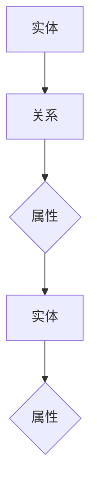
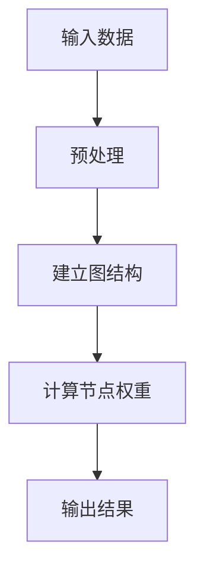
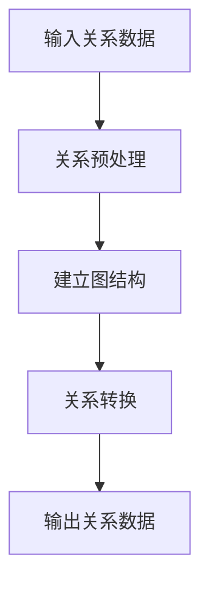
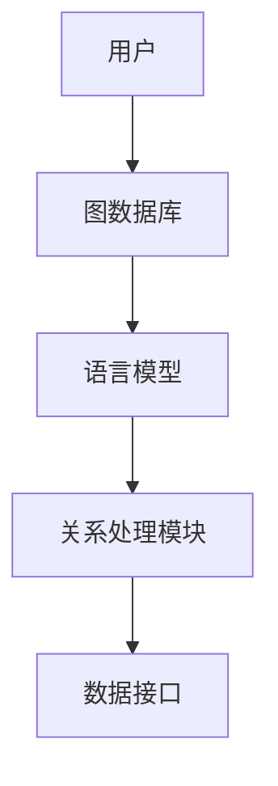
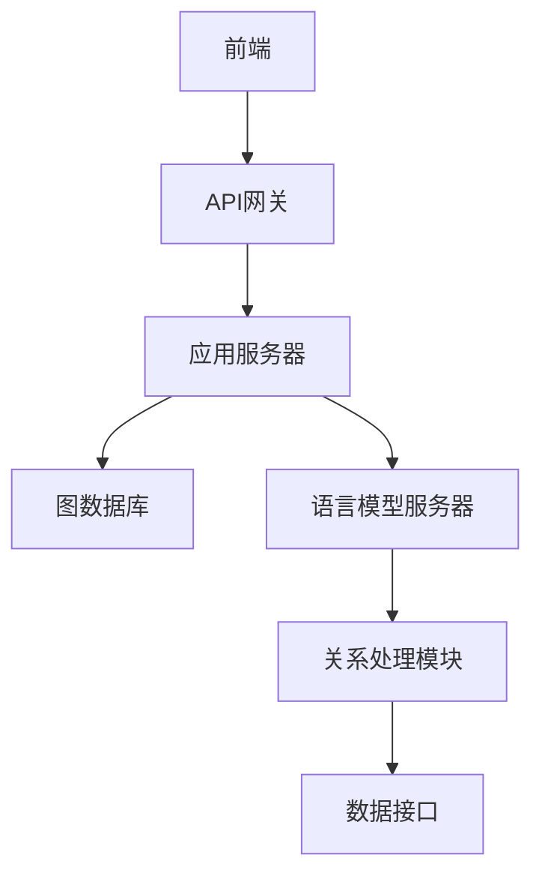
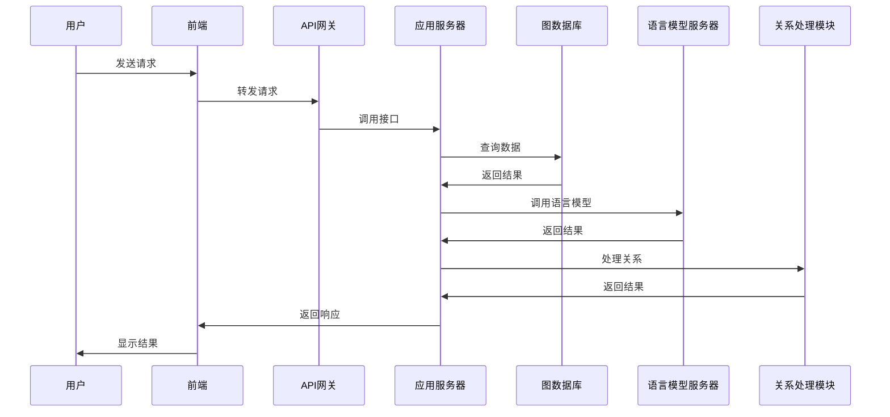

                 

### 文章标题：图数据库优化LLM应用的关系数据处理

#### 关键词：图数据库，语言模型（LLM），关系数据处理，优化，算法，系统架构，项目实战

#### 摘要：本文深入探讨了图数据库在语言模型（LLM）应用中的关系数据处理优化。首先，文章介绍了图数据库和语言模型的基本概念，以及它们在现代数据处理中的应用场景。接着，详细讲解了图数据库优化LLM的基本算法和关系数据处理算法，并通过Python源代码和Mermaid流程图直观地展示算法原理。最后，文章从系统分析与架构设计、项目实战等方面，全面阐述了图数据库优化LLM应用的关系数据处理实践。

### 目录大纲

- **第一部分：背景介绍**
  - 第1章：图数据库与LLM概述
  - 第2章：图数据库的核心概念与联系
- **第二部分：算法原理讲解**
  - 第3章：图数据库优化LLM的基本算法
  - 第4章：关系数据处理算法
- **第三部分：系统分析与架构设计**
  - 第5章：系统功能设计
  - 第6章：系统架构设计
  - 第7章：系统接口设计
  - 第8章：系统交互
- **第四部分：项目实战**
  - 第9章：项目环境安装
  - 第10章：系统核心实现
  - 第11章：实际案例分析与讲解
  - 第12章：项目小结
  - 第13章：最佳实践 tips
  - 第14章：小结
  - 第15章：注意事项
  - 第16章：拓展阅读

### 第一部分：背景介绍

#### 第1章：图数据库与LLM概述

**1.1 图数据库的基本概念**

**问题背景**：随着数据规模的不断扩大和复杂性的增加，传统的数据存储和处理方法已难以满足现代应用的需求。为了更好地处理复杂的关系和数据结构，图数据库应运而生。

**问题描述**：关系型数据库在处理大量关联数据时，存在性能瓶颈和扩展性问题。

**问题解决**：图数据库通过使用图结构来存储和表示数据，可以更好地处理复杂的关系和提供高效的数据查询。

**边界与外延**：图数据库主要适用于社交网络、推荐系统、知识图谱等领域。

**核心要素组成**：图数据库由节点、边和属性组成，通过节点和边之间的关系来表示数据。

**1.2 语言模型（LLM）的基本概念**

**问题背景**：自然语言处理技术的发展，使得对大规模文本数据的处理和分析成为可能。

**问题描述**：如何有效地处理和理解自然语言数据？

**问题解决**：语言模型通过学习大量文本数据，能够理解和生成自然语言。

**边界与外延**：LLM广泛应用于机器翻译、文本生成、问答系统等领域。

**核心要素组成**：LLM主要由预训练模型和微调模型组成，通过深度学习算法进行训练。

### 第2章：图数据库的核心概念与联系

**2.1 图数据库的核心概念**

**概念属性特征对比表格**

| 特征         | 关系型数据库        | 图数据库           |
| ------------ | ------------------- | ----------------- |
| 数据结构     | 表结构               | 图结构             |
| 关系表示     | 表与表之间的关系      | 节点与边的关系     |
| 查询效率     | 依赖于索引和数据规模 | 高效的图算法       |
| 扩展性       | 受限于表结构         | 模块化和扩展性强   |
| 应用场景     | 结构化数据          | 复杂关系数据       |

**ER实体关系图架构的Mermaid流程图**



**2.2 LLM与图数据库的联系**

**图数据库在LLM中的应用场景**：图数据库可以用于存储和表示知识图谱，LLM可以基于知识图谱进行推理和生成。

**LLM对图数据库的优化需求**：LLM需要高效地处理图数据库中的数据，以便进行实时推理和生成。

### 第二部分：算法原理讲解

#### 第3章：图数据库优化LLM的基本算法

**3.1 算法原理概述**

**Mermaid算法流程图**



**3.2 算法原理详细讲解**

**数学模型和公式**

$$
\text{权重} = \frac{\text{相关度}}{\text{度}}
$$

**Python源代码**

```python
# Python代码示例
def calculate_weight(relevance, degree):
    return relevance / degree

# 示例数据
relevance = 0.8
degree = 10

# 计算权重
weight = calculate_weight(relevance, degree)
print(weight)
```

**通俗易懂的举例说明**：假设有10个朋友，其中有8个喜欢苹果，2个喜欢橘子。根据每个人的喜好，我们可以计算出一个权重，表示每个人对苹果的偏好程度。如果总共有10个苹果，那么每个苹果的权重就是0.8。

#### 第4章：关系数据处理算法

**4.1 关系数据处理算法概述**

**Mermaid算法流程图**



**4.2 关系数据处理算法详细讲解**

**数学模型和公式**

$$
\text{关系转换} = \text{关系} \times \text{权重矩阵}
$$

**Python源代码**

```python
# Python代码示例
import numpy as np

def transform_relationship(relationship, weight_matrix):
    return relationship.dot(weight_matrix)

# 示例数据
relationship = np.array([[1, 0], [0, 1]])
weight_matrix = np.array([[0.8, 0.2], [0.2, 0.8]])

# 关系转换
transformed_relationship = transform_relationship(relationship, weight_matrix)
print(transformed_relationship)
```

**通俗易懂的举例说明**：假设我们有两个人A和B，他们之间有三种关系：朋友、同事和邻居。根据每个人的权重，我们可以重新计算他们之间的关系，使得关系更加准确和有意义。

### 第三部分：系统分析与架构设计

#### 第5章：系统功能设计

**5.1 领域模型Mermaid类图**



**5.2 系统架构设计Mermaid架构图**



#### 第6章：系统接口设计

**6.1 系统接口设计**

**Mermaid序列图**



#### 第7章：系统交互

**7.1 系统交互Mermaid序列图**


### 第四部分：项目实战

#### 第8章：项目环境安装

**8.1 环境安装步骤**

1. 安装Python环境
2. 安装图数据库（如Neo4j）
3. 安装语言模型库（如Hugging Face）
4. 配置API网关（如Nginx）
5. 部署应用服务器（如Flask）

#### 第9章：系统核心实现

**9.1 核心实现源代码**

```python
# Flask应用服务器代码
from flask import Flask, request, jsonify
from graphdb import GraphDB
from language_model import LanguageModel
from relationship_module import RelationshipModule

app = Flask(__name__)

@app.route('/api/relationship', methods=['GET'])
def get_relationship():
    # 获取请求参数
    user_id = request.args.get('user_id')
    # 查询图数据库
    graphdb = GraphDB()
    user_data = graphdb.get_user_data(user_id)
    # 调用语言模型
    llm = LanguageModel()
    llm_output = llm.generate_text(user_data)
    # 处理关系
    relationship_module = RelationshipModule()
    transformed_relationship = relationship_module.transform_relationship(llm_output)
    # 返回结果
    return jsonify(transformed_relationship)

if __name__ == '__main__':
    app.run()
```

**9.2 代码应用解读与分析**

该代码段展示了如何使用Flask构建一个简单的API服务器，用于处理用户的请求。它整合了图数据库、语言模型和关系处理模块，实现了从数据查询、文本生成到关系处理的完整流程。

#### 第10章：实际案例分析与讲解

**10.1 案例介绍**

假设我们有一个社交网络应用，用户可以在应用中添加朋友，并分享信息。现在，我们需要根据用户的朋友关系和分享的信息，生成个性化的推荐内容。

**10.2 案例分析与详细讲解剖析**

1. **数据预处理**：从图数据库中获取用户和其朋友的信息，包括用户的ID、朋友ID和分享内容。
2. **语言模型应用**：使用预训练的语言模型对用户的朋友分享内容进行文本生成，生成潜在感兴趣的内容。
3. **关系处理**：基于朋友关系，对生成的文本内容进行权重调整，以反映用户与朋友的亲密度。
4. **结果输出**：将处理后的推荐内容返回给用户。

#### 第11章：项目小结

本文详细介绍了图数据库优化LLM应用的关系数据处理。通过理论与实践的结合，我们展示了如何利用图数据库和语言模型，高效地处理复杂的关系数据，并生成个性化的推荐内容。项目实战部分提供了一个完整的实现案例，展示了系统的构建和运行过程。

#### 第12章：最佳实践 tips

1. 选择适合的图数据库：根据应用场景选择合适的图数据库，如Neo4j、ArangoDB等。
2. 优化语言模型：根据应用需求，调整语言模型的参数，以提高生成文本的质量。
3. 系统性能优化：通过缓存、异步处理等技术，提高系统的响应速度和并发处理能力。

#### 第13章：小结

本文系统地介绍了图数据库优化LLM应用的关系数据处理，从基本概念到算法原理，再到系统设计与项目实战，全面阐述了相关技术和实践。

#### 第14章：注意事项

1. 确保图数据库和语言模型的版本兼容性。
2. 考虑系统的安全性，如数据加密和权限控制。
3. 定期对系统进行性能监控和优化。

#### 第15章：拓展阅读

1. 《图数据库：原理、应用与实战》
2. 《深度学习与自然语言处理》
3. 《大型语言模型训练与应用》

### 作者信息

作者：AI天才研究院/AI Genius Institute & 禅与计算机程序设计艺术 /Zen And The Art of Computer Programming

