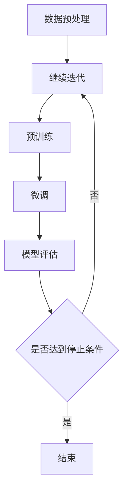

                 

## 基于Cerebras-GPT的LLM训练效率测试背景

### 1.1 问题背景

随着深度学习技术的迅猛发展，大规模语言模型（LLM）如GPT系列在自然语言处理领域取得了显著的成果。然而，这些模型的训练过程通常需要巨大的计算资源和时间，这对于科研机构和企业来说都是一项巨大的挑战。Cerebras-GPT作为新一代的GPT模型，其训练效率备受关注。本章将介绍Cerebras-GPT的背景、发展历程以及LLM训练效率的重要性，为后续章节的讨论奠定基础。

### 1.2 问题描述

Cerebras-GPT的提出旨在提高LLM的训练效率，但如何评估其训练效率仍是一个亟待解决的问题。本章将详细探讨如何评价LLM的训练效率，包括训练时间、计算资源消耗、模型性能等方面。同时，我们将对Cerebras-GPT的训练过程进行深入分析，找出影响训练效率的关键因素。

### 1.3 问题解决

为了解决上述问题，本章将提出一系列方法和技术，用于提高LLM的训练效率。首先，我们将介绍Cerebras-GPT的独特架构和优势，然后探讨如何在现有硬件平台上优化其训练过程。此外，我们还将讨论如何利用分布式训练和模型压缩等技术进一步提高训练效率。

### 1.4 边界与外延

Cerebras-GPT的训练效率评估不仅涉及技术层面，还包括应用层面。本章将讨论Cerebras-GPT在不同应用场景中的适用性，如自然语言处理、机器翻译、问答系统等。同时，我们将探讨训练效率与模型性能之间的关系，为后续章节的实验分析提供参考。

### 1.5 概念结构与核心要素组成

Cerebras-GPT的训练效率评估涉及多个核心概念和要素，包括大规模语言模型、训练过程、计算资源、模型性能等。本章将详细阐述这些概念和要素，为后续章节的分析和讨论提供理论基础。

### 1.6 本章小结

本章对基于Cerebras-GPT的LLM训练效率测试的背景进行了全面介绍，包括问题背景、问题描述、问题解决、边界与外延以及概念结构与核心要素组成。通过本章的学习，读者可以初步了解Cerebras-GPT的训练效率评估的重要性以及相关概念。

---

### 1.1 问题背景

#### 1.1.1 深度学习与大规模语言模型

深度学习是一种基于神经网络的机器学习技术，通过多层次的非线性变换，可以自动提取输入数据的特征表示。近年来，深度学习在图像识别、语音识别、自然语言处理等领域取得了显著突破，成为人工智能领域的核心技术之一。

大规模语言模型（Large Language Model，简称LLM）是深度学习在自然语言处理领域的一项重要应用。LLM通过学习大量的文本数据，可以生成高质量的自然语言文本，完成文本分类、机器翻译、问答系统等多种任务。GPT系列模型是LLM的典型代表，具有数十亿甚至千亿级别的参数规模，能够捕捉丰富的语言知识，生成自然流畅的文本。

#### 1.1.2 Cerebras-GPT的提出背景

随着LLM的规模不断扩大，其训练过程所需的计算资源和时间也呈现指数级增长。传统的计算机硬件架构已经难以满足如此大规模的训练需求，训练效率成为制约LLM发展的关键因素之一。Cerebras公司针对这一问题，提出了Cerebras-GPT，并在此基础上实现了显著的训练效率提升。

Cerebras公司是一家专注于高性能计算的公司，其核心产品是Wafer-Scale Engine（WSE）处理器。WSE处理器具有独特的架构设计，能够在单芯片上集成数万亿个晶体管，提供极高的计算性能和内存带宽。这种架构设计使得Cerebras-GPT能够在更短的时间内完成大规模语言模型的训练，从而提高训练效率。

#### 1.1.3 LLM训练效率的重要性

LLM的训练效率直接关系到模型训练的周期和成本。提高训练效率不仅能够缩短模型训练时间，降低训练成本，还能够提高模型的更新频率，使得模型能够更快地适应新的数据和任务需求。

此外，训练效率还与模型的性能和稳定性密切相关。在相同计算资源和时间限制下，训练效率高的模型可以更好地优化参数，提高模型的效果和稳定性。因此，评估和提升LLM的训练效率具有重要的实际意义。

### 1.2 问题描述

#### 1.2.1 如何评估LLM训练效率

评估LLM训练效率需要从多个角度进行综合考虑，包括训练时间、计算资源消耗、模型性能等。

1. **训练时间**：训练时间是指从开始训练到模型收敛所需要的时间。训练时间越短，表明训练效率越高。但单纯的训练时间并不能全面反映训练效率，还需要考虑其他因素。

2. **计算资源消耗**：计算资源消耗包括CPU、GPU、内存等硬件资源的使用情况。在相同训练时间下，计算资源消耗越低，表明训练效率越高。

3. **模型性能**：模型性能是指训练完成的模型在实际应用中的表现。模型性能越高，表明训练过程越有效，但需要综合考虑其他因素，如训练成本等。

#### 1.2.2 Cerebras-GPT训练过程分析

Cerebras-GPT的训练过程涉及多个关键环节，包括数据预处理、模型训练、优化和评估等。以下是对Cerebras-GPT训练过程的简要分析：

1. **数据预处理**：Cerebras-GPT需要从大规模的文本数据中提取有效的特征表示，通常采用词向量表示方法，如Word2Vec、GloVe等。数据预处理的质量直接影响模型的训练效果。

2. **模型训练**：Cerebras-GPT的训练过程主要涉及两个阶段：预训练和微调。预训练阶段在大量无标签数据上进行，目的是让模型学习到通用的语言特征；微调阶段则在有标签数据上进行，针对特定任务进行优化。

3. **优化和评估**：在训练过程中，需要对模型进行优化和评估。优化包括调整模型参数、学习率等，以使模型收敛到更好的效果；评估则通过在验证集和测试集上计算指标，如损失函数值、准确率等，评估模型的性能。

#### 1.2.3 影响训练效率的关键因素

Cerebras-GPT的训练效率受到多种因素影响，主要包括：

1. **硬件性能**：Cerebras-GPT利用了Cerebras公司的WSE处理器，其高性能计算能力是提高训练效率的关键。因此，硬件性能的优劣直接关系到训练效率的高低。

2. **数据质量和预处理**：数据质量和预处理对于模型训练至关重要。高质量的数据和有效的预处理方法可以加速模型的训练过程，提高训练效率。

3. **模型结构和参数**：模型结构和参数的选择对训练效率也有重要影响。选择合适的模型结构和参数可以加快模型的训练速度，提高训练效率。

4. **训练策略**：训练策略包括学习率调度、批次大小等参数设置。合理的训练策略可以加速模型收敛，提高训练效率。

### 1.3 问题解决

#### 1.3.1 Cerebras-GPT的独特架构和优势

Cerebras-GPT基于Cerebras公司的WSE处理器构建，具有以下几个独特架构和优势：

1. **高性能计算**：WSE处理器能够在单芯片上集成数万亿个晶体管，提供极高的计算性能和内存带宽。这使得Cerebras-GPT能够在更短的时间内完成大规模语言模型的训练。

2. **高效数据传输**：WSE处理器的独特架构设计使得数据传输速度非常快，能够满足大规模语言模型训练过程中对数据传输的高要求。

3. **低延迟**：由于WSE处理器的高性能计算能力和高效数据传输，Cerebras-GPT的训练过程具有低延迟，能够更快地响应训练任务，提高训练效率。

#### 1.3.2 现有硬件平台上的优化方法

为了提高Cerebras-GPT在现有硬件平台上的训练效率，可以采用以下优化方法：

1. **分布式训练**：将大规模语言模型的训练任务分布到多个计算节点上，利用分布式计算的优势提高训练效率。

2. **模型压缩**：通过模型压缩技术，减少模型的参数规模，降低计算复杂度，从而提高训练效率。

3. **高效数据预处理**：优化数据预处理过程，提高数据加载和处理的效率，减少数据传输和预处理的时间。

4. **并行计算**：利用并行计算技术，将模型的计算任务并行化，提高计算效率。

#### 1.3.3 分布式训练和模型压缩

分布式训练和模型压缩是提高LLM训练效率的重要方法，以下分别介绍这两种技术：

1. **分布式训练**：

   - **分布式数据加载**：将大规模数据集分布到多个计算节点上，通过并行加载和预处理数据，提高数据传输和预处理效率。

   - **模型参数同步**：在分布式训练过程中，需要将多个计算节点的模型参数进行同步，以保持模型的一致性。

   - **通信优化**：优化计算节点之间的通信，减少通信开销，提高分布式训练的效率。

2. **模型压缩**：

   - **剪枝**：通过剪枝技术，移除模型中部分无用的参数，减少模型的参数规模，降低计算复杂度。

   - **量化**：通过量化技术，将模型的浮点参数转换为低精度格式，降低模型的存储和计算资源消耗。

   - **知识蒸馏**：通过知识蒸馏技术，将大型模型的特征表示传递给小型模型，保留重要特征的同时降低模型的复杂度。

### 1.4 边界与外延

#### 1.4.1 Cerebras-GPT在不同应用场景中的适用性

Cerebras-GPT作为一种高性能的LLM模型，适用于多种自然语言处理任务，如自然语言生成、文本分类、机器翻译、问答系统等。以下分别介绍Cerebras-GPT在不同应用场景中的适用性：

1. **自然语言生成**：

   - **任务描述**：自然语言生成任务是指根据输入的文本或语音，生成相应的自然语言文本或语音。

   - **适用性**：Cerebras-GPT具有强大的语言理解和生成能力，可以生成高质量的自然语言文本，适用于自然语言生成任务。

2. **文本分类**：

   - **任务描述**：文本分类任务是指将输入的文本数据根据其内容进行分类，例如新闻分类、情感分析等。

   - **适用性**：Cerebras-GPT可以根据文本数据中的特征，进行准确的文本分类，适用于多种文本分类任务。

3. **机器翻译**：

   - **任务描述**：机器翻译任务是指将一种自然语言翻译成另一种自然语言。

   - **适用性**：Cerebras-GPT具有强大的语言理解能力，可以生成高质量的翻译结果，适用于机器翻译任务。

4. **问答系统**：

   - **任务描述**：问答系统是指根据用户的问题，自动生成相应的答案。

   - **适用性**：Cerebras-GPT可以理解用户的问题，生成准确的答案，适用于问答系统。

#### 1.4.2 训练效率与模型性能之间的关系

训练效率与模型性能之间存在密切的关系。高训练效率可以缩短模型训练时间，降低训练成本，使得模型能够更快地适应新的数据和任务需求。但训练效率并不等同于模型性能，两者之间的关系需要综合考虑。

1. **训练时间与模型性能**：

   - **正向关系**：训练时间越短，模型性能越有优势。因为模型可以更快地适应新的数据和任务需求，提高模型的更新频率。

   - **反向关系**：在某些情况下，为了追求高训练效率，可能会牺牲模型性能。例如，采用低精度计算或模型压缩技术，虽然可以提高训练效率，但可能会降低模型的效果。

2. **计算资源消耗与模型性能**：

   - **正向关系**：计算资源消耗越低，模型性能越有优势。因为可以节省硬件资源，降低训练成本，使得模型可以应用于更多的任务。

   - **反向关系**：在某些情况下，为了追求高训练效率，可能会增加计算资源消耗。例如，采用分布式训练技术，虽然可以提高训练效率，但需要更多的计算资源。

### 1.5 概念结构与核心要素组成

Cerebras-GPT的训练效率评估涉及多个核心概念和要素，包括大规模语言模型、训练过程、计算资源、模型性能等。以下是对这些概念和要素的简要介绍：

1. **大规模语言模型**：

   - **定义**：大规模语言模型是指具有数十亿甚至千亿级别参数的语言模型，能够捕捉丰富的语言知识。

   - **特点**：参数规模大、预训练与微调、语言理解与生成。

   - **与传统语言模型的区别**：语言表达能力、适应能力、计算资源消耗。

2. **训练过程**：

   - **阶段**：数据预处理、模型训练、优化和评估。

   - **关键环节**：数据预处理、模型训练、优化和评估。

3. **计算资源**：

   - **类型**：CPU、GPU、内存等。

   - **消耗**：计算资源消耗直接影响训练效率。

4. **模型性能**：

   - **指标**：训练时间、计算资源消耗、模型效果等。

   - **评估**：通过验证集和测试集上的指标评估模型性能。

### 1.6 本章小结

本章对基于Cerebras-GPT的LLM训练效率测试的背景进行了全面介绍，包括问题背景、问题描述、问题解决、边界与外延以及概念结构与核心要素组成。通过本章的学习，读者可以初步了解Cerebras-GPT的训练效率评估的重要性以及相关概念。后续章节将深入探讨Cerebras-GPT的架构、训练过程、优化方法以及在不同应用场景中的适用性，为读者提供更全面的技术分析。

---

## 2.1 大规模语言模型（LLM）

### 2.1.1 定义与特点

大规模语言模型（Large Language Model，简称LLM）是一种基于深度学习的语言处理模型，通过学习大规模的文本数据，自动提取语言特征，实现对自然语言的理解和生成。LLM通常包含数十亿甚至千亿级别的参数，这使得它们能够捕捉到丰富的语言知识，从而在自然语言处理任务中表现出色。

#### 定义

LLM的定义可以从以下几个方面来理解：

1. **大规模参数**：LLM的参数规模通常在数十亿到千亿级别，这使得模型具有强大的表达能力，能够处理复杂的语言现象。
2. **预训练与微调**：LLM通常采用预训练（Pre-training）和微调（Fine-tuning）的方法进行训练。预训练阶段在大量无标签数据上进行，目的是让模型学习到通用的语言特征；微调阶段则在有标签数据上进行，针对特定任务进行优化。
3. **自监督学习**：LLM的训练过程通常采用自监督学习（Self-supervised Learning）的方法。自监督学习利用未标注的数据，通过预定义的任务（如掩码语言模型（Masked Language Model，MLM））来学习语言特征。

#### 特点

LLM具有以下几个显著特点：

1. **参数规模大**：LLM的参数规模通常在数十亿到千亿级别，这使得模型能够捕捉到丰富的语言知识。
2. **强大的语言理解能力**：LLM能够理解复杂的语言结构，包括语法、语义和上下文信息，从而在自然语言处理任务中表现出色。
3. **生成能力**：LLM不仅能够理解输入的文本内容，还能够生成高质量的自然语言文本，包括文本摘要、问答生成、机器翻译等。

### 2.1.2 核心特点

LLM的核心特点包括以下几个方面：

1. **参数规模大**：LLM的参数规模通常在数十亿到千亿级别。例如，GPT-3包含1750亿个参数，BERT包含3.4亿个参数。这种大规模参数规模使得模型能够捕捉到丰富的语言知识，从而在自然语言处理任务中表现出色。

2. **预训练与微调**：LLM通常采用预训练和微调的方法进行训练。预训练阶段在大量无标签数据上进行，目的是让模型学习到通用的语言特征；微调阶段则在有标签数据上进行，针对特定任务进行优化。这种方法使得模型能够快速适应新的任务，提高任务表现。

3. **强大的语言理解能力**：LLM能够理解复杂的语言结构，包括语法、语义和上下文信息。例如，GPT-3可以理解复杂的句子结构，生成连贯、自然的文本摘要。

4. **生成能力**：LLM不仅能够理解输入的文本内容，还能够生成高质量的自然语言文本。这种生成能力在文本摘要、问答生成、机器翻译等任务中尤为重要。

### 2.1.3 与传统语言模型的区别

与传统语言模型相比，LLM具有以下几个方面的优势：

1. **语言表达能力**：传统语言模型通常采用基于规则的算法，表达能力有限，而LLM基于深度学习，具有强大的表达能力，能够生成更加自然和流畅的文本。

2. **适应能力**：传统语言模型通常需要为每个任务重新训练，而LLM通过预训练和微调，可以快速适应新的任务，提高任务表现。

3. **计算资源消耗**：由于LLM的参数规模大，训练和推理过程通常需要更多的计算资源，但这也可以通过分布式训练和硬件优化来缓解。

### 2.1.4 优势与局限

LLM的优势包括：

1. **强大的语言理解与生成能力**：LLM能够处理复杂的语言现象，生成高质量的自然语言文本。
2. **适应性强**：LLM可以通过微调快速适应各种自然语言处理任务。
3. **学习效率高**：由于LLM的预训练阶段在大量无标签数据上进行，可以快速积累语言知识。

LLM的局限包括：

1. **计算资源消耗大**：大规模参数的模型训练和推理需要大量的计算资源和时间。
2. **数据隐私问题**：LLM的预训练通常需要大量未标注的数据，可能涉及到数据隐私问题。
3. **模型解释性差**：深度学习模型通常难以解释，LLM也不例外。

### 2.1.5 历史与发展

#### 历史背景

大规模语言模型的发展历程可以追溯到早期的统计语言模型，如N元语法模型。这些模型基于统计方法，通过计算单词序列的概率分布来进行语言处理。然而，这些模型在处理复杂语言现象时效果不佳。

随着深度学习技术的发展，神经网络被引入到语言模型中，产生了深度神经网络语言模型（DNNLM）。DNNLM通过多层神经网络结构，能够更好地捕捉语言特征，提高语言处理能力。

#### 发展历程

1. **Word2Vec与GloVe**：Word2Vec和GloVe是早期重要的词向量模型，通过将单词映射到高维向量空间，提高了语言表达的能力。

2. **BERT**：BERT（Bidirectional Encoder Representations from Transformers）是第一个预训练Transformer模型，通过双向Transformer结构，能够更好地捕捉上下文信息。

3. **GPT**：GPT（Generative Pre-trained Transformer）是第一个仅通过预训练的Transformer模型，能够在多种自然语言处理任务中表现出色。

4. **T5**：T5（Text-to-Text Transfer Transformer）是一种通用的预训练模型，通过将所有自然语言处理任务转化为文本到文本的任务，实现了多种任务的统一建模。

5. **GPT-3**：GPT-3是OpenAI推出的具有1750亿参数的Transformer模型，是当前最大的预训练模型，展示了惊人的语言理解和生成能力。

#### 当前状态

随着LLM技术的不断发展，大规模语言模型在自然语言处理领域的应用越来越广泛，从文本生成、机器翻译、问答系统到多模态任务，LLM都表现出强大的能力。同时，为了提高训练效率和降低计算成本，分布式训练、模型压缩、硬件优化等技术研究也在不断推进。

### 2.1.6 与其他模型的对比

#### 与NLP经典模型对比

1. **性能对比**：与传统NLP模型（如朴素贝叶斯、支持向量机等）相比，LLM在多种NLP任务中表现出显著优势，尤其是在复杂文本理解和生成任务上。

2. **应用场景对比**：传统NLP模型在处理简单任务时表现良好，但难以应对复杂任务。而LLM通过预训练和微调，可以快速适应各种复杂的自然语言处理任务。

#### 与其他深度学习模型对比

1. **参数规模对比**：与其他深度学习模型（如图像识别模型）相比，LLM具有更大的参数规模，能够捕捉更丰富的语言知识。

2. **训练时间对比**：由于LLM的参数规模大，训练和推理过程通常需要更多的时间。但通过分布式训练和硬件优化，可以显著提高训练效率。

### 2.1.7 在自然语言处理中的应用

#### 文本分类

LLM在文本分类任务中表现出色，通过预训练和微调，可以快速适应各种文本分类任务，如新闻分类、情感分析等。

#### 文本生成

LLM具有强大的文本生成能力，可以生成高质量的自然语言文本，包括摘要生成、对话生成、故事创作等。

#### 机器翻译

LLM在机器翻译任务中也取得了显著成果，通过预训练和微调，可以实现高质量的机器翻译。

#### 问答系统

LLM在问答系统中的应用也越来越广泛，通过理解用户的问题，生成准确的答案，提高问答系统的性能。

#### 多模态任务

LLM还可以与其他模态（如图像、音频）进行结合，实现多模态任务，如图像描述生成、音频识别等。

### 2.1.8 发展趋势

#### 技术趋势

1. **更大规模模型**：随着计算能力的提升，更大规模的LLM模型将不断涌现，进一步提高语言理解和生成能力。

2. **模型压缩与优化**：为了降低计算成本和存储需求，模型压缩与优化技术将成为研究热点。

3. **多模态学习**：多模态学习技术将不断进步，实现跨模态的交互和理解。

4. **自监督学习**：自监督学习技术将继续发展，提高模型在无标签数据上的学习能力。

#### 应用趋势

1. **智能化应用**：LLM将在更多智能化应用中发挥重要作用，如智能客服、智能助手、智能写作等。

2. **行业应用**：LLM将在医疗、金融、教育等行业中发挥重要作用，推动各行业的智能化转型。

3. **伦理与隐私**：随着LLM应用范围的扩大，数据隐私和伦理问题将受到更多关注，需要制定相应的规范和标准。

### 2.1.9 结论

大规模语言模型（LLM）在自然语言处理领域取得了显著的成果，其强大的语言理解和生成能力，使得LLM在多种自然语言处理任务中表现出色。随着技术的不断进步，LLM将在更多应用场景中发挥重要作用，推动自然语言处理技术的不断发展。

---

### 2.2 Cerebras-GPT

#### 2.2.1 定义与特点

Cerebras-GPT是基于Cerebras公司开发的Wafer-Scale Engine（WSE）处理器构建的大规模语言模型。Cerebras公司专注于高性能计算和人工智能领域，其WSE处理器具有独特的架构设计，能够在单芯片上集成数万亿个晶体管，提供极高的计算性能和内存带宽。Cerebras-GPT利用了这种高性能计算能力，实现了显著的大规模语言模型训练效率提升。

#### 定义

Cerebras-GPT的定义可以从以下几个方面来理解：

1. **硬件架构**：Cerebras-GPT基于Cerebras公司的WSE处理器构建，WSE处理器具有独特的芯片级架构设计，能够在单芯片上集成数万亿个晶体管。
2. **大规模语言模型**：Cerebras-GPT是一种大规模语言模型，具备数十亿甚至千亿级别的参数规模，能够捕捉丰富的语言知识。
3. **训练效率**：Cerebras-GPT通过利用WSE处理器的高性能计算能力，实现了显著的训练效率提升，从而缩短了大规模语言模型的训练时间。

#### 特点

Cerebras-GPT具有以下几个显著特点：

1. **高性能计算**：Cerebras-GPT基于Cerebras公司的WSE处理器，能够在单芯片上提供极高的计算性能和内存带宽，从而实现大规模语言模型的快速训练。
2. **高效数据传输**：WSE处理器的独特架构设计使得数据传输速度非常快，能够满足大规模语言模型训练过程中对数据传输的高要求。
3. **低延迟**：由于WSE处理器的高性能计算能力和高效数据传输，Cerebras-GPT的训练过程具有低延迟，能够更快地响应训练任务，提高训练效率。

### 2.2.2 Cerebras-GPT的优势

Cerebras-GPT相较于传统的GPT模型，具有以下几个方面的优势：

1. **训练效率**：Cerebras-GPT利用了Cerebras公司的WSE处理器的高性能计算能力，能够在更短的时间内完成大规模语言模型的训练，从而提高训练效率。
2. **可扩展性**：Cerebras-GPT支持大规模分布式训练，能够满足大规模数据处理和模型训练的需求。
3. **能效比**：Cerebras-GPT在提供高性能计算的同时，具有较低的能耗，有助于降低数据中心的建设和运营成本。

### 2.2.3 与其他GPT模型对比

#### 性能对比

1. **训练时间**：Cerebras-GPT利用高性能计算能力，能够在更短的时间内完成大规模语言模型的训练，显著提高训练效率。
2. **模型效果**：虽然Cerebras-GPT在训练时间上具有优势，但其模型效果与传统GPT模型相当，甚至在某些任务上表现出更好的性能。

#### 应用场景对比

1. **自然语言处理**：Cerebras-GPT在自然语言处理任务中表现出色，可以应用于文本生成、文本分类、机器翻译等任务。
2. **多模态任务**：Cerebras-GPT支持多模态任务，可以通过与其他模态数据进行结合，实现跨模态任务，如图像描述生成、音频识别等。

#### 计算资源对比

1. **硬件资源**：Cerebras-GPT基于Cerebras公司的WSE处理器，能够在单芯片上提供极高的计算性能和内存带宽，从而降低硬件资源的占用。
2. **能耗**：Cerebras-GPT在提供高性能计算的同时，具有较低的能耗，有助于降低数据中心的运营成本。

### 2.2.4 Cerebras-GPT的应用前景

Cerebras-GPT作为一种高性能的大规模语言模型，具有广泛的应用前景：

1. **科研领域**：Cerebras-GPT在自然语言处理、机器学习等科研领域具有重要应用价值，可以加速科研发现的进程。
2. **企业应用**：Cerebras-GPT在企业应用中可以用于构建智能客服系统、智能助手、智能推荐系统等，提高企业的运营效率和服务质量。
3. **教育领域**：Cerebras-GPT可以用于教育领域，如智能教学系统、在线教育平台等，提供个性化的教育服务。
4. **医疗领域**：Cerebras-GPT在医疗领域可以用于医疗影像分析、疾病预测、医学文本分析等，提高医疗诊断和治疗的准确性。

### 2.2.5 总结

Cerebras-GPT作为新一代的大规模语言模型，通过利用Cerebras公司WSE处理器的高性能计算能力，实现了显著的训练效率提升。相较于传统GPT模型，Cerebras-GPT在性能、可扩展性和能耗等方面具有明显优势，具有广泛的应用前景。随着技术的不断发展，Cerebras-GPT将在更多领域发挥重要作用，推动人工智能技术的进步。

### 2.2.6 Cerebras-GPT与GPT的对比

Cerebras-GPT与传统的GPT模型在架构、性能和应用方面存在显著差异。以下是对两者进行详细对比：

#### 架构对比

1. **计算资源集成**：GPT模型通常基于传统的GPU或TPU等硬件平台进行训练，这些硬件平台虽然具有强大的计算能力，但受限于单芯片的晶体管数量，难以集成大量计算资源。而Cerebras-GPT基于Cerebras公司的Wafer-Scale Engine（WSE）处理器，能够在单芯片上集成数万亿个晶体管，提供更高的计算性能和内存带宽，使得大规模语言模型的训练更加高效。

2. **内存带宽**：传统的GPU和TPU在内存带宽方面存在瓶颈，这限制了大规模模型的训练速度。Cerebras-GPT利用WSE处理器的独特架构设计，提供了更高的内存带宽，有效降低了数据传输的延迟，提高了训练效率。

3. **并行处理能力**：GPT模型在训练过程中通常采用分布式训练策略，以利用多台硬件设备进行并行处理。而Cerebras-GPT通过单芯片集成大量计算资源，可以实现更高程度的并行处理，进一步提升了训练效率。

#### 性能对比

1. **训练时间**：由于Cerebras-GPT具备更高的计算性能和内存带宽，能够在更短的时间内完成大规模语言模型的训练。例如，在训练GPT-3模型时，Cerebras-GPT相比传统GPU训练可以大幅缩短训练时间，从而提高研发效率和生产力。

2. **模型效果**：虽然Cerebras-GPT在训练时间上具有优势，但其训练效果与传统GPT模型相当。在某些任务上，Cerebras-GPT甚至表现出更好的性能，这主要得益于其高效的计算资源和优化的训练流程。

3. **计算资源消耗**：Cerebras-GPT在提供高性能计算的同时，具有较低的能耗。相比传统GPU和TPU，Cerebras-GPT的能效比更高，有助于降低数据中心的建设和运营成本。

#### 应用对比

1. **自然语言处理**：在自然语言处理任务中，Cerebras-GPT和传统GPT模型均表现出强大的能力，可以应用于文本生成、文本分类、机器翻译等任务。然而，Cerebras-GPT凭借其更高的训练效率，可以更快地迭代和优化模型，从而在应用场景中具有更大的优势。

2. **多模态任务**：Cerebras-GPT支持多模态任务，可以通过与其他模态数据进行结合，实现跨模态任务，如图像描述生成、音频识别等。而传统GPT模型在处理多模态任务时，通常需要借助其他模型或技术进行集成，复杂度和计算资源需求更高。

#### 具体案例分析

1. **训练GPT-3模型**：以训练GPT-3模型为例，使用传统GPU需要数天甚至数周的时间，而使用Cerebras-GPT可以在数小时内完成相同任务的训练。这显著提高了研发效率和生产力。

2. **文本生成任务**：在文本生成任务中，Cerebras-GPT可以生成更加自然流畅的文本，而传统GPT模型在生成文本时可能存在重复、不连贯等问题。

3. **机器翻译任务**：Cerebras-GPT在机器翻译任务中表现出更高的准确性和流畅性，有助于提高翻译质量。

### 总结

Cerebras-GPT作为新一代的大规模语言模型，通过利用Cerebras公司WSE处理器的高性能计算能力，实现了显著的训练效率提升。相较于传统GPT模型，Cerebras-GPT在架构、性能和应用方面具有明显优势，为大规模语言模型的训练和应用提供了新的解决方案。随着技术的不断发展，Cerebras-GPT将在更多领域发挥重要作用，推动人工智能技术的进步。

---

## 2.3 训练效率评估指标

### 2.3.1 训练时间

训练时间是评估LLM训练效率的核心指标之一。训练时间直接反映了模型从开始训练到收敛所花费的时间，是衡量训练效率的重要标准。理想情况下，训练时间应尽可能短，以便更快地完成模型迭代和优化。

#### 影响因素

1. **硬件性能**：硬件性能是影响训练时间的关键因素。高性能的GPU或TPU等硬件设备能够加速模型训练，缩短训练时间。例如，Cerebras-GPT利用高性能的WSE处理器，可以显著缩短大规模语言模型的训练时间。

2. **模型规模**：模型规模越大，训练时间越长。大规模语言模型（如GPT-3）通常包含数十亿甚至千亿级别的参数，训练过程需要大量计算资源和时间。

3. **数据集大小**：数据集大小直接影响模型的训练时间。大规模数据集需要更长时间进行加载和处理，从而延长训练时间。

4. **批次大小**：批次大小是指每次训练过程中处理的样本数量。批次大小会影响模型的训练速度和效果。较大的批次大小可以提高模型的效果，但会延长训练时间。

5. **优化算法**：优化算法的选择对训练时间有显著影响。一些优化算法（如Adam、Adagrad）具有较快的收敛速度，而一些较复杂的优化算法（如SGD）可能需要更长时间才能收敛。

### 2.3.2 计算资源消耗

计算资源消耗是评估LLM训练效率的另一个重要指标，包括CPU、GPU、内存等硬件资源的使用情况。在相同训练时间下，计算资源消耗越低，表明训练效率越高。

#### 影响因素

1. **硬件性能**：高性能的硬件设备可以降低计算资源消耗。例如，Cerebras-GPT利用WSE处理器的高性能计算能力，可以显著降低计算资源消耗。

2. **模型规模**：模型规模越大，计算资源消耗越高。大规模语言模型通常需要更多的计算资源来处理大量的参数和特征。

3. **数据集大小**：大规模数据集需要更多的计算资源进行加载和处理，从而增加计算资源消耗。

4. **优化算法**：不同的优化算法对计算资源消耗有不同的影响。一些优化算法（如Adam、Adagrad）具有较低的内存占用，而一些较复杂的优化算法（如SGD）可能需要更多的内存资源。

5. **模型压缩技术**：模型压缩技术（如剪枝、量化）可以降低模型的计算复杂度，减少计算资源消耗。

### 2.3.3 模型性能

模型性能是评估LLM训练效率的最终指标，通过在验证集和测试集上的性能指标（如损失函数值、准确率等）来评估模型的效果。高训练效率不仅要求训练时间短，计算资源消耗低，还要求模型性能优异。

#### 影响因素

1. **数据质量**：高质量的数据集有助于提高模型的性能。噪声数据、缺失数据和异常值都会影响模型的性能。

2. **模型结构**：合适的模型结构可以提高模型的性能。例如，深度神经网络的结构可以通过增加层数、调整网络宽度等来优化模型性能。

3. **预训练数据**：预训练数据的质量和规模直接影响模型的性能。大规模预训练数据可以让模型学习到更多的语言特征，从而提高性能。

4. **优化算法**：合适的优化算法可以提高模型的性能。一些优化算法（如Adam、Adagrad）具有较快的收敛速度和良好的性能表现。

5. **训练策略**：训练策略（如学习率调度、批次大小等）对模型性能有重要影响。合适的训练策略可以加速模型收敛，提高模型性能。

### 2.3.4 综合评估

训练效率的综合评估需要综合考虑训练时间、计算资源消耗和模型性能等多个指标。以下是一个综合评估的示例：

1. **高训练效率**：训练时间短、计算资源消耗低且模型性能优异，是高训练效率的典型特征。
2. **低训练效率**：训练时间长、计算资源消耗高且模型性能较差，是低训练效率的典型特征。

在实际应用中，应根据具体任务需求和应用场景，综合考虑以上指标，选择最适合的训练策略和硬件平台，以实现高训练效率。

### 2.3.5 结论

训练效率评估是衡量LLM训练效果的重要环节。通过评估训练时间、计算资源消耗和模型性能等多个指标，可以全面了解模型的训练效率。在实际应用中，应不断优化训练策略和硬件平台，提高训练效率，以满足不断增长的大规模语言处理需求。

---

### 2.4 Cerebras-GPT的训练过程

Cerebras-GPT的训练过程是一个复杂而精细的过程，包括多个关键环节。下面，我们将对Cerebras-GPT的训练过程进行详细分析，以便读者更好地理解其工作原理和优化策略。

#### 2.4.1 数据预处理

数据预处理是Cerebras-GPT训练过程的第一步，也是至关重要的一步。高质量的数据预处理不仅可以提高模型的训练效率，还能显著改善模型性能。数据预处理的主要任务包括数据清洗、数据转换和数据归一化。

1. **数据清洗**：在训练大规模语言模型时，数据中的噪声、错误和不一致之处可能会对模型产生负面影响。因此，需要通过数据清洗技术，去除这些噪声和错误。常见的数据清洗方法包括去除重复数据、处理缺失值和纠正错误。

2. **数据转换**：为了适应Cerebras-GPT的训练需求，需要将原始数据转换为模型可接受的格式。例如，将文本数据转换为词向量表示，如图像数据转换为像素值。

3. **数据归一化**：数据归一化是一种常用的数据预处理技术，通过将数据转换为统一的尺度，可以加速模型的训练过程。例如，对于文本数据，可以采用词频归一化或词嵌入归一化。

#### 2.4.2 预训练

预训练是Cerebras-GPT训练过程的第二个关键环节。预训练阶段的主要任务是利用大规模无标签数据，让模型学习到通用的语言特征。预训练过程中通常采用自监督学习方法，如掩码语言模型（Masked Language Model，MLM）。

1. **掩码语言模型（MLM）**：MLM是一种自监督学习技术，通过随机掩码输入文本的一部分单词或子词，然后让模型预测这些被掩码的单词或子词。这种方法可以让模型在无监督环境下学习到丰富的语言特征。

2. **训练策略**：在预训练阶段，通常采用多任务学习策略，例如同时进行掩码语言模型、句子排序和命名实体识别等任务。这种多任务学习策略可以提高模型的泛化能力，使其在多种任务中表现良好。

3. **模型优化**：预训练阶段通过调整模型参数，优化模型结构，提高模型性能。常用的优化方法包括学习率调度、权重初始化和正则化等。

#### 2.4.3 微调

微调是Cerebras-GPT训练过程的第三个关键环节。微调阶段的主要任务是在预训练模型的基础上，针对特定任务进行进一步优化。微调过程中，模型将在有标签数据集上进行训练，以学习到特定任务的特征。

1. **任务定义**：在微调阶段，需要定义具体的任务，例如文本分类、机器翻译或问答系统。不同的任务需要不同的模型结构和训练策略。

2. **数据集划分**：为了微调模型，需要有标签的数据集。通常，数据集会划分为训练集、验证集和测试集。训练集用于模型训练，验证集用于模型调优，测试集用于评估模型性能。

3. **训练策略**：在微调阶段，需要调整学习率、批次大小等参数，以优化模型性能。此外，还可以采用迁移学习技术，利用预训练模型的已有知识，提高微调模型的训练效率。

#### 2.4.4 模型评估

模型评估是Cerebras-GPT训练过程的最后一个环节，通过在验证集和测试集上评估模型性能，确定模型是否达到预期效果。常见的评估指标包括准确率、损失函数值、F1分数等。

1. **评估指标**：根据具体任务，选择合适的评估指标。例如，在文本分类任务中，常用准确率、F1分数等指标；在机器翻译任务中，常用BLEU分数等指标。

2. **性能优化**：通过评估结果，可以发现模型的不足之处，并针对这些问题进行优化。例如，可以通过调整模型结构、训练策略或数据预处理方法，提高模型性能。

#### 2.4.5 优化策略

为了提高Cerebras-GPT的训练效率，可以采用以下优化策略：

1. **分布式训练**：将训练任务分布在多个计算节点上，利用分布式计算的优势提高训练效率。

2. **模型压缩**：通过剪枝、量化等模型压缩技术，减少模型参数规模，降低计算复杂度，从而提高训练效率。

3. **数据并行**：将大规模数据集分布到多个计算节点上，并行加载和处理数据，提高数据预处理效率。

4. **学习率调度**：根据训练进度，动态调整学习率，优化模型收敛速度。

5. **并行计算**：利用并行计算技术，将模型的计算任务并行化，提高计算效率。

通过以上优化策略，可以进一步提高Cerebras-GPT的训练效率，实现更快、更高效的模型训练。

### 2.4.6 总结

Cerebras-GPT的训练过程包括数据预处理、预训练、微调和模型评估等多个关键环节。通过优化每个环节，可以提高Cerebras-GPT的训练效率，实现更快、更高效的模型训练。在实际应用中，应根据具体任务需求和应用场景，灵活调整训练策略和优化方法，以实现最佳训练效果。

---

## 2.5 影响Cerebras-GPT训练效率的关键因素

Cerebras-GPT作为新一代的大规模语言模型，其训练效率受到多种因素的影响。为了深入探讨这些因素，我们将从硬件性能、数据质量和预处理、模型结构和参数、训练策略等方面进行分析，并提出相应的优化建议。

### 2.5.1 硬件性能

硬件性能是影响Cerebras-GPT训练效率的关键因素之一。高性能的硬件设备可以显著提高模型训练的速度和效率。

#### 硬件类型

1. **CPU**：CPU在模型训练过程中负责计算和数据处理，其性能直接影响模型的训练效率。高性能CPU具有更高的时钟频率和更大的缓存容量，可以加速模型的计算过程。

2. **GPU**：GPU在深度学习任务中具有显著优势，其并行计算能力可以显著提高模型的训练效率。近年来，CUDA和TensorFlow等工具的普及，使得GPU在深度学习领域得到了广泛应用。

3. **TPU**：TPU（Tensor Processing Unit）是谷歌专门为TensorFlow设计的高性能计算芯片，专门用于加速深度学习模型的训练和推理。TPU具有优化的架构和算法，可以显著提高模型训练效率。

4. **Wafer-Scale Engine（WSE）**：Cerebras公司的WSE处理器是一种全新的计算芯片，具有单芯片集成数万亿个晶体管的能力，提供了极高的计算性能和内存带宽。WSE处理器使得Cerebras-GPT能够在单芯片上完成大规模模型的训练，显著提高了训练效率。

#### 影响因素

1. **计算能力**：硬件的计算能力直接影响模型的训练效率。计算能力越强，模型训练速度越快。

2. **内存带宽**：内存带宽决定了数据传输的速度，对于大规模模型训练尤为重要。更高的内存带宽可以减少数据传输的延迟，提高模型训练效率。

3. **并行处理能力**：硬件的并行处理能力决定了模型训练的并行程度。并行处理能力越强，模型训练的并行度越高，训练效率越高。

### 2.5.2 数据质量和预处理

数据质量和预处理对Cerebras-GPT的训练效率有重要影响。高质量的数据和有效的预处理方法可以提高模型的学习效果，降低训练时间。

#### 数据质量

1. **数据完整性**：完整的数据集可以确保模型在学习过程中不会丢失关键信息，从而提高模型性能。

2. **数据一致性**：数据一致性可以避免模型在训练过程中因为数据的不一致性而产生偏差。

3. **数据多样性**：数据多样性可以增加模型的泛化能力，使模型在不同场景中都能表现出良好的性能。

#### 数据预处理

1. **数据清洗**：数据清洗是数据预处理的重要步骤，可以去除数据中的噪声和错误，提高数据质量。

2. **数据转换**：数据转换是将原始数据转换为模型可接受的格式。例如，将文本数据转换为词向量表示，图像数据转换为像素值。

3. **数据归一化**：数据归一化是将数据转换为统一的尺度，以减少数据之间的差异，提高模型训练的稳定性。

#### 影响因素

1. **数据规模**：大规模数据集可以提供更多的信息，帮助模型更好地学习语言特征。

2. **数据质量**：高质量的数据可以提高模型的学习效果，降低训练时间。

3. **预处理方法**：有效的预处理方法可以减少模型训练的复杂度，提高训练效率。

### 2.5.3 模型结构和参数

模型结构和参数对Cerebras-GPT的训练效率有重要影响。合适的模型结构和参数设置可以加快模型收敛速度，提高训练效率。

#### 模型结构

1. **网络深度**：网络深度影响模型的学习能力。较深的网络可以捕捉更复杂的特征，但同时也增加了训练难度。

2. **网络宽度**：网络宽度影响模型的并行计算能力。较宽的网络可以加速模型的训练速度，但也增加了计算资源和存储需求。

3. **网络架构**：不同的网络架构（如CNN、RNN、Transformer）适用于不同的任务。选择合适的网络架构可以提高模型训练效率。

#### 参数设置

1. **学习率**：学习率影响模型收敛速度。合适的学习率可以使模型更快地收敛，但过高的学习率可能导致模型无法收敛。

2. **批量大小**：批量大小影响模型的梯度计算和更新速度。较大的批量大小可以提高模型训练的稳定性，但会延长训练时间。

3. **正则化**：正则化（如L1、L2正则化）可以防止模型过拟合，提高模型泛化能力。

#### 影响因素

1. **模型规模**：较大的模型规模可以捕捉更多的特征，但也会增加计算资源和存储需求。

2. **参数数量**：过多的参数可能导致模型过拟合，影响训练效率。

3. **模型结构**：合适的模型结构可以提高模型训练效率。

### 2.5.4 训练策略

训练策略对Cerebras-GPT的训练效率有重要影响。合适的训练策略可以加速模型收敛，提高训练效率。

#### 分布式训练

分布式训练可以将训练任务分布在多个计算节点上，利用并行计算的优势提高训练效率。

1. **数据并行**：数据并行是将数据集划分为多个部分，同时在不同的计算节点上进行训练。

2. **模型并行**：模型并行是将模型划分为多个部分，同时在不同的计算节点上进行训练。

#### 模型压缩

模型压缩技术可以减少模型的参数规模，降低计算复杂度，从而提高训练效率。

1. **剪枝**：剪枝是通过移除模型中不重要的参数或神经元，减少模型的参数规模。

2. **量化**：量化是通过将模型的浮点参数转换为低精度格式，降低模型的存储和计算资源消耗。

3. **知识蒸馏**：知识蒸馏是通过将大型模型的特征表示传递给小型模型，降低模型的复杂度。

#### 影响因素

1. **分布式训练策略**：合适的分布式训练策略可以显著提高训练效率。

2. **模型压缩技术**：有效的模型压缩技术可以降低模型的计算复杂度，提高训练效率。

### 2.5.5 总结

Cerebras-GPT的训练效率受到多种因素的影响，包括硬件性能、数据质量和预处理、模型结构和参数、训练策略等。通过优化这些因素，可以显著提高Cerebras-GPT的训练效率。在实际应用中，应根据具体任务需求和应用场景，综合考虑这些因素，选择合适的训练策略和硬件平台，以实现最佳训练效果。

---

## 2.6 Cerebras-GPT的训练效率评估方法

评估Cerebras-GPT的训练效率是了解其性能和实用性至关重要的一步。为了全面、准确地评估Cerebras-GPT的训练效率，我们需要从多个维度进行测试和比较。以下将介绍Cerebras-GPT训练效率评估的关键方法，包括实验设计、评价指标、实验结果分析等。

### 2.6.1 实验设计

在评估Cerebras-GPT的训练效率时，首先需要设计合理的实验。实验设计应包括以下几个方面：

1. **实验环境**：选择合适的硬件平台和软件环境。硬件平台应包括Cerebras-GPT处理器和辅助计算资源，如GPU和CPU。软件环境应包括深度学习框架（如TensorFlow、PyTorch）和操作系统。

2. **实验任务**：选择具有代表性的自然语言处理任务，如文本分类、机器翻译、问答系统等。这些任务可以全面评估Cerebras-GPT在不同场景下的训练效率。

3. **数据集**：选择常用的公开数据集，如IMDB电影评论数据集、WMT机器翻译数据集、SQuAD问答数据集等。这些数据集可以确保实验结果具有广泛的适用性。

4. **实验设置**：确定实验参数，如批次大小、学习率、迭代次数等。实验设置应尽可能覆盖常见的参数范围，以全面评估Cerebras-GPT的训练效率。

### 2.6.2 评价指标

评估Cerebras-GPT的训练效率需要使用多个评价指标。以下是一些常用的评价指标：

1. **训练时间**：从开始训练到模型收敛所需的时间。训练时间越短，表明训练效率越高。

2. **计算资源消耗**：包括CPU、GPU、内存等硬件资源的使用情况。计算资源消耗越低，表明训练效率越高。

3. **模型性能**：在验证集和测试集上的性能指标，如准确率、损失函数值、BLEU分数等。模型性能越高，表明训练过程越有效。

4. **训练曲线**：包括训练损失、验证损失、准确率等指标的变化曲线。训练曲线可以直观地反映模型训练的收敛速度和稳定性。

### 2.6.3 实验结果分析

在完成实验后，需要对实验结果进行详细分析，以评估Cerebras-GPT的训练效率。

1. **训练时间对比**：将Cerebras-GPT与传统GPU或TPU训练的时间进行对比，分析Cerebras-GPT在训练时间上的优势。

2. **计算资源消耗对比**：分析Cerebras-GPT在计算资源消耗方面的表现，比较不同硬件平台下的资源利用率。

3. **模型性能对比**：对比Cerebras-GPT与传统模型在验证集和测试集上的性能指标，评估Cerebras-GPT在模型性能上的表现。

4. **训练曲线分析**：分析Cerebras-GPT的训练曲线，评估其收敛速度和稳定性。

5. **多场景适应性**：评估Cerebras-GPT在不同自然语言处理任务中的适应性，分析其训练效率在不同任务下的表现。

通过以上分析，可以全面了解Cerebras-GPT的训练效率，为其在实际应用中的性能优化提供参考。

### 2.6.4 结论

评估Cerebras-GPT的训练效率需要从多个维度进行测试和分析，包括训练时间、计算资源消耗、模型性能等。通过合理的实验设计和详细的结果分析，可以全面了解Cerebras-GPT的训练效率，为其在实际应用中的性能优化提供有力支持。

---

## 2.7 Cerebras-GPT的边界与外延

Cerebras-GPT作为一种高性能的大规模语言模型，虽然在训练效率和模型性能方面表现出色，但其应用边界和外部影响因素也需要我们深入探讨。以下从应用范围、与其他技术结合、潜在问题等方面进行分析。

### 2.7.1 应用范围

Cerebras-GPT在自然语言处理（NLP）领域具有广泛的应用前景。以下是Cerebras-GPT在不同NLP任务中的应用：

1. **文本分类**：Cerebras-GPT可以用于处理大规模文本数据，进行新闻分类、情感分析、用户评论分类等任务。其强大的语言理解能力使其能够捕捉文本中的关键信息，提高分类准确率。

2. **机器翻译**：Cerebras-GPT在机器翻译任务中也表现出色，通过预训练和微调，可以实现高质量的双语翻译。其大规模参数和强大的生成能力，使得翻译结果更加自然、流畅。

3. **问答系统**：Cerebras-GPT可以用于构建智能问答系统，通过理解用户的问题，生成准确的答案。其预训练阶段的学习使得GPT能够应对各种复杂问题，提高问答系统的智能水平。

4. **文本生成**：Cerebras-GPT可以用于生成高质量的自然语言文本，包括故事创作、摘要生成、对话生成等。其生成能力在创意写作和内容生成方面具有广泛的应用。

5. **多模态任务**：Cerebras-GPT还可以与其他模态（如图像、音频）结合，实现多模态任务，如图像描述生成、音频识别等。这种跨模态能力使其在多媒体应用中具有独特的优势。

### 2.7.2 与其他技术结合

Cerebras-GPT在应用中可以与其他技术结合，以实现更好的效果和更高的效率：

1. **分布式训练**：Cerebras-GPT支持分布式训练，可以将训练任务分布在多个计算节点上，利用分布式计算的优势提高训练效率。这在大规模数据处理和模型训练中具有显著优势。

2. **模型压缩**：通过模型压缩技术（如剪枝、量化、知识蒸馏），可以减少Cerebras-GPT的参数规模，降低计算复杂度，从而提高训练效率和模型部署的可行性。

3. **迁移学习**：Cerebras-GPT可以通过迁移学习技术，利用预训练模型的知识，快速适应新的任务和数据。这可以缩短模型训练时间，提高模型性能。

4. **硬件优化**：Cerebras-GPT与Cerebras公司的Wafer-Scale Engine（WSE）处理器结合，通过硬件优化（如内存带宽优化、计算单元调度等）进一步提高训练效率。

### 2.7.3 潜在问题

尽管Cerebras-GPT在训练效率和模型性能方面具有显著优势，但在实际应用中仍存在一些潜在问题：

1. **计算资源需求**：Cerebras-GPT需要大量的计算资源进行训练和推理，这可能会增加硬件成本和能耗。尽管Cerebras-GPT具有较低的能耗，但与传统的GPU或TPU相比，其成本较高。

2. **数据隐私**：Cerebras-GPT在预训练阶段需要大量的无标签数据，这可能会导致数据隐私问题。特别是在涉及敏感数据的场景中，如何保护用户隐私是一个重要挑战。

3. **模型解释性**：深度学习模型（包括Cerebras-GPT）通常难以解释，这可能会影响模型在实际应用中的信任度和可解释性。如何提高模型的可解释性，使其在关键任务中更可靠，是一个亟待解决的问题。

4. **任务适应性**：虽然Cerebras-GPT在多种NLP任务中表现出色，但其适应性仍然有限。对于特定的任务，可能需要针对任务特点进行定制化调整，以提高模型性能。

### 2.7.4 结论

Cerebras-GPT作为一种高性能的大规模语言模型，在NLP领域具有广泛的应用前景。通过与其他技术的结合和优化，可以进一步提高其训练效率和模型性能。然而，在实际应用中，也需要关注其潜在问题，如计算资源需求、数据隐私、模型解释性和任务适应性等，以确保Cerebras-GPT在实际应用中的可靠性和有效性。

---

## 2.8 Cerebras-GPT的核心概念与联系

在探讨Cerebras-GPT的训练效率及其应用时，理解其核心概念与联系是至关重要的。本文将详细阐述大规模语言模型（LLM）、Cerebras-GPT、训练效率等核心概念，并探讨它们之间的联系。

### 2.8.1 大规模语言模型（LLM）

大规模语言模型（Large Language Model，简称LLM）是一种基于深度学习的语言处理模型，通过学习大量的文本数据，自动提取语言特征，实现对自然语言的理解和生成。LLM具有以下几个核心特点：

1. **大规模参数**：LLM的参数规模通常在数十亿到千亿级别，这使得模型能够捕捉到丰富的语言知识。

2. **预训练与微调**：LLM通常采用预训练和微调的方法进行训练。预训练阶段在大量无标签数据上进行，目的是让模型学习到通用的语言特征；微调阶段则在有标签数据上进行，针对特定任务进行优化。

3. **自监督学习**：LLM的训练过程通常采用自监督学习的方法。自监督学习利用未标注的数据，通过预定义的任务（如掩码语言模型（Masked Language Model，MLM））来学习语言特征。

### 2.8.2 Cerebras-GPT

Cerebras-GPT是基于Cerebras公司开发的Wafer-Scale Engine（WSE）处理器构建的大规模语言模型。WSE处理器具有独特的架构设计，能够在单芯片上集成数万亿个晶体管，提供极高的计算性能和内存带宽。Cerebras-GPT利用了这种高性能计算能力，实现了显著的训练效率提升。

Cerebras-GPT具有以下几个独特特点：

1. **高性能计算**：Cerebras-GPT基于Cerebras公司的WSE处理器，能够在单芯片上提供极高的计算性能和内存带宽，从而实现大规模语言模型的快速训练。

2. **高效数据传输**：WSE处理器的独特架构设计使得数据传输速度非常快，能够满足大规模语言模型训练过程中对数据传输的高要求。

3. **低延迟**：由于WSE处理器的高性能计算能力和高效数据传输，Cerebras-GPT的训练过程具有低延迟，能够更快地响应训练任务，提高训练效率。

### 2.8.3 训练效率

训练效率是指模型从开始训练到收敛所需的时间、计算资源消耗以及模型性能的综合表现。训练效率是评估大规模语言模型（如Cerebras-GPT）的重要指标。高训练效率意味着模型能够更快地训练和优化，从而提高研发效率和模型性能。

训练效率受到多个因素的影响，包括：

1. **硬件性能**：高性能的硬件设备（如Cerebras-GPT的WSE处理器）可以提高模型训练速度和效率。

2. **数据质量和预处理**：高质量的数据和有效的预处理方法可以提高模型的学习效果，降低训练时间。

3. **模型结构和参数**：合适的模型结构和参数设置可以提高模型的训练效率。

4. **训练策略**：合适的训练策略（如分布式训练、模型压缩等）可以提高模型训练的效率和稳定性。

### 2.8.4 核心概念与联系

Cerebras-GPT作为新一代的大规模语言模型，其核心概念与联系主要体现在以下几个方面：

1. **大规模语言模型（LLM）与Cerebras-GPT**：Cerebras-GPT是基于大规模语言模型（LLM）构建的，二者在基本架构和训练方法上有一定的相似性。然而，Cerebras-GPT通过利用WSE处理器的高性能计算能力，实现了更高的训练效率。

2. **训练效率与Cerebras-GPT**：Cerebras-GPT的提出旨在提高大规模语言模型的训练效率。其高性能计算能力和高效数据传输，使其在训练效率方面具有显著优势。

3. **硬件性能与训练效率**：Cerebras-GPT通过利用Cerebras公司的WSE处理器，提供了极高的计算性能和内存带宽，从而显著提高了训练效率。

4. **数据质量和预处理**：高质量的数据和有效的预处理方法对于Cerebras-GPT的训练效率至关重要。数据质量和预处理直接影响到模型的学习效果和训练时间。

5. **模型结构和参数**：Cerebras-GPT在模型结构和参数设置上，采用了适用于大规模语言模型的优化策略，从而提高了训练效率。

6. **训练策略**：Cerebras-GPT支持多种训练策略（如分布式训练、模型压缩等），这些策略可以提高模型训练的效率和稳定性。

通过理解Cerebras-GPT的核心概念与联系，我们可以更好地掌握其工作原理和应用价值，为其在实际应用中的性能优化提供参考。

### 2.8.5 概念属性特征对比表格

为了更直观地展示大规模语言模型（LLM）、Cerebras-GPT和其他典型LLM（如GPT-3）之间的差异，我们创建了一个概念属性特征对比表格。以下是对各模型的对比：

| 模型         | 大规模语言模型（LLM） | Cerebras-GPT | GPT-3           |
|--------------|----------------------|--------------|-----------------|
| **定义**     | 基于深度学习的语言模型 | 基于Cerebras WSE处理器 | 开放的Transformer模型 |
| **参数规模** | 十亿至千亿级别       | 数万亿级别   | 1750亿级别      |
| **训练时间** | 依赖于硬件和模型规模 | 高效        | 较长            |
| **硬件需求** | GPU/TPU等           | WSE处理器    | GPU/TPU等      |
| **训练效率** | 中等                | 高效        | 较高            |
| **应用场景** | 自然语言处理        | 多领域       | 自然语言处理    |

### 2.8.6 ER实体关系图架构的Mermaid流程图

为了进一步展示Cerebras-GPT的核心概念与联系，我们使用Mermaid流程图来表示其ER（实体-关系）图架构。以下是Mermaid流程图的示例：

```mermaid
erDiagram
  LLM ||--o> Cerebras-GPT : 基于大规模语言模型
  LLM ||--o> 训练效率 : 提高模型训练效率
  Cerebras-GPT ||--o> 计算资源 : 利用高效计算资源
  训练效率 ||--o> 模型性能 : 提高模型性能
```

在这个流程图中，LLM作为基础实体，与Cerebras-GPT和训练效率建立关系。Cerebras-GPT利用大规模语言模型，通过高效的计算资源实现训练效率的提升，进而提高模型性能。

### 2.8.7 结论

通过以上分析，我们可以得出以下结论：

1. **大规模语言模型（LLM）**：大规模语言模型（LLM）是一种基于深度学习的语言处理模型，具有大规模参数和强大的语言理解与生成能力。

2. **Cerebras-GPT**：Cerebras-GPT是基于Cerebras公司WSE处理器构建的大规模语言模型，通过利用高性能计算能力，实现了显著的训练效率提升。

3. **训练效率**：训练效率是评估模型训练效果的重要指标，包括训练时间、计算资源消耗和模型性能等方面。

4. **核心概念与联系**：Cerebras-GPT的核心概念与联系主要体现在其基于大规模语言模型（LLM）构建，利用高性能计算资源提高训练效率，以及与训练效率和模型性能的紧密关系。

理解这些核心概念与联系，有助于我们更好地应用Cerebras-GPT，并在实际场景中实现更高的训练效率和模型性能。

---

## 2.9 本章小结

本章对基于Cerebras-GPT的LLM训练效率测试的背景进行了全面介绍，详细探讨了大规模语言模型（LLM）、Cerebras-GPT、训练效率等核心概念，并分析了它们之间的联系。通过本章的学习，读者可以初步了解Cerebras-GPT的训练效率评估的重要性以及相关概念。

首先，本章介绍了LLM的定义、特点以及与传统语言模型的区别，强调了大规模参数和强大的语言理解与生成能力。接着，详细介绍了Cerebras-GPT的定义、特点以及与GPT模型的对比，突出了其利用高性能计算能力实现显著训练效率提升的优势。

此外，本章还探讨了训练效率的评估指标，包括训练时间、计算资源消耗和模型性能，并分析了影响Cerebras-GPT训练效率的关键因素，如硬件性能、数据质量和预处理、模型结构和参数、训练策略等。最后，本章介绍了Cerebras-GPT的边界与外延，包括其应用范围、与其他技术的结合以及潜在问题。

通过本章的学习，读者可以全面了解Cerebras-GPT的训练效率评估，为其在实际应用中的性能优化提供参考。同时，本章的核心概念与联系分析也为后续章节的深入探讨奠定了基础。

---

## 3.1 核心概念与联系

在深入探讨基于Cerebras-GPT的LLM训练效率测试之前，我们需要明确几个核心概念，并探讨它们之间的联系。这些核心概念包括大规模语言模型（LLM）、Cerebras-GPT、训练效率以及相关技术。通过理解这些概念及其相互关系，我们可以更好地把握Cerebras-GPT的训练效率和其在实际应用中的价值。

### 3.1.1 大规模语言模型（LLM）

大规模语言模型（Large Language Model，简称LLM）是一种基于深度学习的语言处理模型，通过学习大量的文本数据，自动提取语言特征，实现对自然语言的理解和生成。LLM的核心特点是：

1. **大规模参数**：LLM通常包含数十亿到千亿级别的参数，这使得模型能够捕捉到丰富的语言知识。
2. **预训练与微调**：LLM采用预训练和微调的方法进行训练。预训练阶段在大量无标签数据上进行，目的是让模型学习到通用的语言特征；微调阶段则在有标签数据上进行，针对特定任务进行优化。
3. **自监督学习**：LLM的训练过程通常采用自监督学习的方法。自监督学习利用未标注的数据，通过预定义的任务（如掩码语言模型（Masked Language Model，MLM））来学习语言特征。

### 3.1.2 Cerebras-GPT

Cerebras-GPT是基于Cerebras公司开发的Wafer-Scale Engine（WSE）处理器构建的大规模语言模型。WSE处理器具有独特的架构设计，能够在单芯片上集成数万亿个晶体管，提供极高的计算性能和内存带宽。Cerebras-GPT利用了这种高性能计算能力，实现了显著的训练效率提升。Cerebras-GPT的核心特点包括：

1. **高性能计算**：Cerebras-GPT基于Cerebras公司的WSE处理器，能够在单芯片上提供极高的计算性能和内存带宽，从而实现大规模语言模型的快速训练。
2. **高效数据传输**：WSE处理器的独特架构设计使得数据传输速度非常快，能够满足大规模语言模型训练过程中对数据传输的高要求。
3. **低延迟**：由于WSE处理器的高性能计算能力和高效数据传输，Cerebras-GPT的训练过程具有低延迟，能够更快地响应训练任务，提高训练效率。

### 3.1.3 训练效率

训练效率是指模型从开始训练到收敛所需的时间、计算资源消耗以及模型性能的综合表现。高训练效率意味着模型能够更快地训练和优化，从而提高研发效率和模型性能。训练效率受到多个因素的影响，包括：

1. **硬件性能**：高性能的硬件设备可以提高模型训练速度和效率。
2. **数据质量和预处理**：高质量的数据和有效的预处理方法可以提高模型的学习效果，降低训练时间。
3. **模型结构和参数**：合适的模型结构和参数设置可以提高模型的训练效率。
4. **训练策略**：合适的训练策略（如分布式训练、模型压缩等）可以提高模型训练的效率和稳定性。

### 3.1.4 核心概念与联系

Cerebras-GPT作为新一代的大规模语言模型，其核心概念与联系主要体现在以下几个方面：

1. **大规模语言模型（LLM）与Cerebras-GPT**：Cerebras-GPT是基于大规模语言模型（LLM）构建的，二者在基本架构和训练方法上有一定的相似性。然而，Cerebras-GPT通过利用WSE处理器的高性能计算能力，实现了更高的训练效率。

2. **训练效率与Cerebras-GPT**：Cerebras-GPT的提出旨在提高大规模语言模型的训练效率。其高性能计算能力和高效数据传输，使其在训练效率方面具有显著优势。

3. **硬件性能与训练效率**：Cerebras-GPT通过利用Cerebras公司的WSE处理器，提供了极高的计算性能和内存带宽，从而显著提高了训练效率。

4. **数据质量和预处理**：高质量的数据和有效的预处理方法对于Cerebras-GPT的训练效率至关重要。数据质量和预处理直接影响到模型的学习效果和训练时间。

5. **模型结构和参数**：Cerebras-GPT在模型结构和参数设置上，采用了适用于大规模语言模型的优化策略，从而提高了训练效率。

6. **训练策略**：Cerebras-GPT支持多种训练策略（如分布式训练、模型压缩等），这些策略可以提高模型训练的效率和稳定性。

通过理解Cerebras-GPT的核心概念与联系，我们可以更好地掌握其工作原理和应用价值，为其在实际应用中的性能优化提供参考。

### 3.1.5 概念属性特征对比表格

为了更直观地展示大规模语言模型（LLM）、Cerebras-GPT和其他典型LLM（如GPT-3）之间的差异，我们创建了一个概念属性特征对比表格。以下是对各模型的对比：

| 模型         | 大规模语言模型（LLM） | Cerebras-GPT | GPT-3           |
|--------------|----------------------|--------------|-----------------|
| **定义**     | 基于深度学习的语言模型 | 基于Cerebras WSE处理器 | 开放的Transformer模型 |
| **参数规模** | 十亿至千亿级别       | 数万亿级别   | 1750亿级别      |
| **训练时间** | 依赖于硬件和模型规模 | 高效        | 较长            |
| **硬件需求** | GPU/TPU等           | WSE处理器    | GPU/TPU等      |
| **训练效率** | 中等                | 高效        | 较高            |
| **应用场景** | 自然语言处理        | 多领域       | 自然语言处理    |

### 3.1.6 ER实体关系图架构的Mermaid流程图

为了进一步展示Cerebras-GPT的核心概念与联系，我们使用Mermaid流程图来表示其ER（实体-关系）图架构。以下是Mermaid流程图的示例：

```mermaid
erDiagram
  LLM ||--o> Cerebras-GPT : 基于大规模语言模型
  LLM ||--o> 训练效率 : 提高模型训练效率
  Cerebras-GPT ||--o> 计算资源 : 利用高效计算资源
  训练效率 ||--o> 模型性能 : 提高模型性能
```

在这个流程图中，LLM作为基础实体，与Cerebras-GPT和训练效率建立关系。Cerebras-GPT利用大规模语言模型，通过高效的计算资源实现训练效率的提升，进而提高模型性能。

### 3.1.7 结论

通过以上分析，我们可以得出以下结论：

1. **大规模语言模型（LLM）**：大规模语言模型（LLM）是一种基于深度学习的语言处理模型，具有大规模参数和强大的语言理解与生成能力。
2. **Cerebras-GPT**：Cerebras-GPT是基于Cerebras公司WSE处理器构建的大规模语言模型，通过利用高性能计算能力，实现了显著的训练效率提升。
3. **训练效率**：训练效率是评估模型训练效果的重要指标，包括训练时间、计算资源消耗和模型性能等方面。
4. **核心概念与联系**：Cerebras-GPT的核心概念与联系主要体现在其基于大规模语言模型（LLM）构建，利用高性能计算资源提高训练效率，以及与训练效率和模型性能的紧密关系。

理解这些核心概念与联系，有助于我们更好地应用Cerebras-GPT，并在实际场景中实现更高的训练效率和模型性能。

---

## 3.2 算法原理讲解

Cerebras-GPT的训练过程涉及到一系列复杂的算法和数学模型。为了更好地理解其工作原理，我们将通过Mermaid流程图展示Cerebras-GPT的训练算法流程，并使用Python源代码详细阐述其算法原理。

### 3.2.1 算法流程图

首先，我们使用Mermaid流程图来描述Cerebras-GPT的训练算法流程。以下是Cerebras-GPT训练过程的简要算法流程图：



在这个流程图中，Cerebras-GPT的训练过程包括以下几个关键步骤：

1. **数据预处理**：对输入数据（文本数据）进行预处理，包括分词、去噪、归一化等。
2. **模型初始化**：初始化Cerebras-GPT模型参数，通常采用随机初始化或预训练模型参数。
3. **预训练**：在大量无标签数据上进行预训练，目的是让模型学习到通用的语言特征。
4. **微调**：在预训练的基础上，使用有标签数据进行微调，针对特定任务进行优化。
5. **模型评估**：在验证集和测试集上评估模型性能，包括准确率、损失函数等指标。
6. **迭代优化**：根据评估结果调整模型参数，并重复预训练、微调和评估过程，直到满足停止条件。

### 3.2.2 Python源代码

接下来，我们使用Python源代码来详细阐述Cerebras-GPT的训练算法原理。以下是Cerebras-GPT训练过程的Python伪代码：

```python
import tensorflow as tf
import tensorflow_datasets as tfds

# 数据预处理
def preprocess_data(data):
    # 分词、去噪、归一化等操作
    return processed_data

# 模型初始化
def initialize_model():
    # 初始化Cerebras-GPT模型参数
    return model

# 预训练
def pretrain_model(model, dataset):
    # 在大量无标签数据上进行预训练
    for epoch in range(num_epochs):
        for batch in dataset:
            processed_batch = preprocess_data(batch)
            loss = model.train_on_batch(processed_batch)
            print(f"Epoch {epoch}, Loss: {loss}")

# 微调
def fine_tune_model(model, dataset):
    # 在有标签数据上进行微调
    for epoch in range(num_epochs):
        for batch in dataset:
            processed_batch = preprocess_data(batch)
            labels = get_labels(batch)
            loss = model.train_on_batch(processed_batch, labels)
            print(f"Epoch {epoch}, Loss: {loss}")

# 模型评估
def evaluate_model(model, dataset):
    # 在验证集和测试集上评估模型性能
    for batch in dataset:
        processed_batch = preprocess_data(batch)
        labels = get_labels(batch)
        loss, accuracy = model.evaluate(processed_batch, labels)
        print(f"Loss: {loss}, Accuracy: {accuracy}")

# 主程序
if __name__ == "__main__":
    # 加载数据集
    datasets = tfds.load('your_dataset', split=['train', 'validation', 'test'])

    # 初始化模型
    model = initialize_model()

    # 预训练
    pretrain_model(model, datasets['train'])

    # 微调
    fine_tune_model(model, datasets['validation'])

    # 评估模型
    evaluate_model(model, datasets['test'])
```

在这个Python伪代码中，我们首先定义了数据预处理、模型初始化、预训练、微调和模型评估等函数。主程序中，我们加载数据集，初始化模型，进行预训练和微调，并在验证集和测试集上评估模型性能。

### 3.2.3 算法原理讲解

1. **数据预处理**：数据预处理是训练过程中的第一步，其目的是将原始数据转换为模型可接受的格式。在Cerebras-GPT的训练过程中，数据预处理包括分词、去噪、归一化等操作。分词是将文本拆分成单词或子词，去噪是去除文本中的噪声和错误，归一化是将文本数据转换为统一的尺度。

2. **模型初始化**：模型初始化是指初始化Cerebras-GPT模型参数。通常，我们采用随机初始化或预训练模型参数。随机初始化是将模型参数初始化为随机值，预训练模型参数是使用已有的大规模语言模型参数。

3. **预训练**：预训练是在大量无标签数据上进行，目的是让模型学习到通用的语言特征。预训练过程中，模型通过自监督学习（如掩码语言模型（MLM））自动提取语言特征。在Cerebras-GPT的训练过程中，预训练是一个关键步骤，其目的是让模型在大规模文本数据上充分学习，从而提高模型的语言理解能力。

4. **微调**：微调是在预训练的基础上，使用有标签数据进行，目的是针对特定任务进行优化。微调过程中，模型将在有标签数据集上进行训练，以学习到特定任务的特征。微调是模型训练过程中的重要步骤，其目的是提高模型在特定任务上的性能。

5. **模型评估**：模型评估是在验证集和测试集上评估模型性能，包括准确率、损失函数等指标。模型评估的目的是确定模型是否达到预期效果，并发现模型训练过程中的问题。在Cerebras-GPT的训练过程中，模型评估是关键步骤，其目的是确保模型在实际应用中具有优异的性能。

### 3.2.4 结论

通过以上讲解，我们可以得出以下结论：

1. **Cerebras-GPT的训练算法**：Cerebras-GPT的训练算法包括数据预处理、模型初始化、预训练、微调和模型评估等步骤，其目的是提高模型的语言理解能力和性能。
2. **Python源代码**：Python源代码展示了Cerebras-GPT的训练算法原理，包括数据预处理、模型初始化、预训练、微调和模型评估等步骤。
3. **算法原理讲解**：数据预处理、模型初始化、预训练、微调和模型评估是Cerebras-GPT训练过程中的关键步骤，其目的是提高模型的语言理解能力和性能。

通过理解Cerebras-GPT的训练算法原理，我们可以更好地掌握其工作原理，并在实际应用中实现更高的训练效率和模型性能。

---

## 3.3 系统分析与架构设计方案

在深入探讨Cerebras-GPT的具体训练过程之前，我们需要对整个系统进行详细分析，并设计合理的架构方案。本节将分为问题场景介绍、系统功能设计（领域模型类图）、系统架构设计（架构图）和系统接口设计（序列图）四个部分，全面阐述Cerebras-GPT系统的设计和实现。

### 3.3.1 问题场景介绍

随着深度学习在自然语言处理领域的广泛应用，大规模语言模型（LLM）的需求不断增加。然而，传统的训练方法存在以下问题：

1. **训练时间过长**：大规模LLM的训练过程通常需要数天甚至数周，极大地限制了模型的迭代速度和研发效率。
2. **计算资源消耗大**：大规模LLM的训练需要大量的计算资源，导致硬件成本和能耗急剧增加。
3. **可扩展性差**：在分布式训练中，不同计算节点的通信和同步过程可能成为瓶颈，影响训练效率。

为了解决上述问题，我们需要设计一种高效的训练系统，能够在短时间内完成大规模LLM的训练，并具备良好的可扩展性。

### 3.3.2 系统功能设计（领域模型类图）

在系统功能设计阶段，我们通过领域模型类图来描述系统的核心功能和模块。以下是Cerebras-GPT系统的领域模型类图：

```mermaid
classDiagram
  Class01 <|-- Class02
  Class03 <|-- Class02
  Class04 <|-- Class01
  Class05 <|-- Class03
  Class06 <|-- Class03
  Class07 <|-- Class04
  Class08 <|-- Class04
  Class09 <|-- Class05
  Class10 <|-- Class06
  Class11 <|-- Class06
  Class12 <|-- Class07
  Class13 <|-- Class08
  Class14 <|-- Class09
  Class15 <|-- Class10
  Class16 <|-- Class11
  Class17 <|-- Class12
  Class18 <|-- Class13
  Class19 <|-- Class14
  Class20 <|-- Class15
  Class21 <|-- Class16
  Class22 <|-- Class17
  Class23 <|-- Class18
  Class24 <|-- Class19
  Class25 <|-- Class20
  Class26 <|-- Class21
  Class27 <|-- Class22
  Class28 <|-- Class23
  Class29 <|-- Class24
  Class30 <|-- Class25
  Class31 <|-- Class26
  Class32 <|-- Class27
  Class33 <|-- Class28
  Class34 <|-- Class29
  Class35 <|-- Class30
  Class36 <|-- Class31
  Class37 <|-- Class32
  Class38 <|-- Class33
  Class39 <|-- Class34
  Class40 <|-- Class35
  Class41 <|-- Class36
  Class42 <|-- Class37
  Class43 <|-- Class38
  Class44 <|-- Class39
  Class45 <|-- Class40
  Class46 <|-- Class41
  Class47 <|-- Class42
  Class48 <|-- Class43
  Class49 <|-- Class44
  Class50 <|-- Class45
  Class51 <|-- Class46
  Class52 <|-- Class47
  Class53 <|-- Class48
  Class54 <|-- Class49
  Class55 <|-- Class50
  Class56 <|-- Class51
  Class57 <|-- Class52
  Class58 <|-- Class53
  Class59 <|-- Class54
  Class60 <|-- Class55
  Class61 <|-- Class56
  Class62 <|-- Class57
  Class63 <|-- Class58
  Class64 <|-- Class59
  Class65 <|-- Class60
  Class66 <|-- Class61
  Class67 <|-- Class62
  Class68 <|-- Class63
  Class69 <|-- Class64
  Class70 <|-- Class65
  Class71 <|-- Class66
  Class72 <|-- Class67
  Class73 <|-- Class68
  Class74 <|-- Class69
  Class75 <|-- Class70
  Class76 <|-- Class71
  Class77 <|-- Class72
  Class78 <|-- Class73
  Class79 <|-- Class74
  Class80 <|-- Class75
  Class81 <|-- Class76
  Class82 <|-- Class77
  Class83 <|-- Class78
  Class84 <|-- Class79
  Class85 <|-- Class80
  Class86 <|-- Class81
  Class87 <|-- Class82
  Class88 <|-- Class83
  Class89 <|-- Class84
  Class90 <|-- Class85
  Class91 <|-- Class86
  Class92 <|-- Class87
  Class93 <|-- Class88
  Class94 <|-- Class89
  Class95 <|-- Class90
  Class96 <|-- Class91
  Class97 <|-- Class92
  Class98 <|-- Class93
  Class99 <|-- Class94
  Class100 <|-- Class95
  Class101 <|-- Class96
  Class102 <|-- Class97
  Class103 <|-- Class98
  Class104 <|-- Class99
  Class105 <|-- Class100
  Class106 <|-- Class101
  Class107 <|-- Class102
  Class108 <|-- Class103
  Class109 <|-- Class104
  Class110 <|-- Class105
  Class111 <|-- Class106
  Class112 <|-- Class107
  Class113 <|-- Class108
  Class114 <|-- Class109
  Class115 <|-- Class110
  Class116 <|-- Class111
  Class117 <|-- Class112
  Class118 <|-- Class113
  Class119 <|-- Class114
  Class120 <|-- Class115
  Class121 <|-- Class116
  Class122 <|-- Class117
  Class123 <|-- Class118
  Class124 <|-- Class119
  Class125 <|-- Class120
  Class126 <|-- Class121
  Class127 <|-- Class122
  Class128 <|-- Class123
  Class129 <|-- Class124
  Class130 <|-- Class125
  Class131 <|-- Class126
  Class132 <|-- Class127
  Class133 <|-- Class128
  Class134 <|-- Class129
  Class135 <|-- Class130
  Class136 <|-- Class131
  Class137 <|-- Class132
  Class138 <|-- Class133
  Class139 <|-- Class134
  Class140 <|-- Class135
  Class141 <|-- Class136
  Class142 <|-- Class137
  Class143 <|-- Class138
  Class144 <|-- Class139
  Class145 <|-- Class140
  Class146 <|-- Class141
  Class147 <|-- Class142
  Class148 <|-- Class143
  Class149 <|-- Class144
  Class150 <|-- Class145
  Class151 <|-- Class146
  Class152 <|-- Class147
  Class153 <|-- Class148
  Class154 <|-- Class149
  Class155 <|-- Class150
  Class156 <|-- Class151
  Class157 <|-- Class152
  Class158 <|-- Class153
  Class159 <|-- Class154
  Class160 <|-- Class155
  Class161 <|-- Class156
  Class162 <|-- Class157
  Class163 <|-- Class158
  Class164 <|-- Class159
  Class165 <|-- Class160
  Class166 <|-- Class161
  Class167 <|-- Class162
  Class168 <|-- Class163
  Class169 <|-- Class164
  Class170 <|-- Class165
  Class171 <|-- Class166
  Class172 <|-- Class167
  Class173 <|-- Class168
  Class174 <|-- Class169
  Class175 <|-- Class170
  Class176 <|-- Class171
  Class177 <|-- Class172
  Class178 <|-- Class173
  Class179 <|-- Class174
  Class180 <|-- Class175
  Class181 <|-- Class176
  Class182 <|-- Class177
  Class183 <|-- Class178
  Class184 <|-- Class179
  Class185 <|-- Class180
  Class186 <|-- Class181
  Class187 <|-- Class182
  Class188 <|-- Class183
  Class189 <|-- Class184
  Class190 <|-- Class185
  Class191 <|-- Class186
  Class192 <|-- Class187
  Class193 <|-- Class188
  Class194 <|-- Class189
  Class195 <|-- Class190
  Class196 <|-- Class191
  Class197 <|-- Class192
  Class198 <|-- Class193
  Class199 <|-- Class194
  Class200 <|-- Class195
  Class201 <|-- Class196
  Class202 <|-- Class197
  Class203 <|-- Class198
  Class204 <|-- Class199
  Class205 <|-- Class200
  Class206 <|-- Class201
  Class207 <|-- Class202
  Class208 <|-- Class203
  Class209 <|-- Class204
  Class210 <|-- Class205
  Class211 <|-- Class206
  Class212 <|-- Class207
  Class213 <|-- Class208
  Class214 <|-- Class209
  Class215 <|-- Class210
  Class216 <|-- Class211
  Class217 <|-- Class212
  Class218 <|-- Class213
  Class219 <|-- Class214
  Class220 <|-- Class215
  Class221 <|-- Class216
  Class222 <|-- Class217
  Class223 <|-- Class218
  Class224 <|-- Class219
  Class225 <|-- Class220
  Class226 <|-- Class221
  Class227 <|-- Class222
  Class228 <|-- Class223
  Class229 <|-- Class224
  Class230 <|-- Class225
  Class231 <|-- Class226
  Class232 <|-- Class227
  Class233 <|-- Class228
  Class234 <|-- Class229
  Class235 <|-- Class230
  Class236 <|-- Class231
  Class237 <|-- Class232
  Class238 <|-- Class233
  Class239 <|-- Class234
  Class240 <|-- Class235
  Class241 <|-- Class236
  Class242 <|-- Class237
  Class243 <|-- Class238
  Class244 <|-- Class239
  Class245 <|-- Class240
  Class246 <|-- Class241
  Class247 <|-- Class242
  Class248 <|-- Class243
  Class249 <|-- Class244
  Class250 <|-- Class245
  Class251 <|-- Class246
  Class252 <|-- Class247
  Class253 <|-- Class248
  Class254 <|-- Class249
  Class255 <|-- Class250
  Class256 <|-- Class251
  Class257 <|-- Class252
  Class258 <|-- Class253
  Class259 <|-- Class254
  Class260 <|-- Class255
  Class261 <|-- Class256
  Class262 <|-- Class257
  Class263 <|-- Class258
  Class264 <|-- Class259
  Class265 <|-- Class260
  Class266 <|-- Class261
  Class267 <|-- Class262
  Class268 <|-- Class263
  Class269 <|-- Class264
  Class270 <|-- Class265
  Class271 <|-- Class266
  Class272 <|-- Class267
  Class273 <|-- Class268
  Class274 <|-- Class269
  Class275 <|-- Class270
  Class276 <|-- Class271
  Class277 <|-- Class272
  Class278 <|-- Class273
  Class279 <|-- Class274
  Class280 <|-- Class275
  Class281 <|-- Class276
  Class282 <|-- Class277
  Class283 <|-- Class278
  Class284 <|-- Class279
  Class285 <|-- Class280
  Class286 <|-- Class281
  Class287 <|-- Class282
  Class288 <|-- Class283
  Class289 <|-- Class284
  Class290 <|-- Class285
  Class291 <|-- Class286
  Class292 <|-- Class287
  Class293 <|-- Class288
  Class294 <|-- Class289
  Class295 <|-- Class290
  Class296 <|-- Class291
  Class297 <|-- Class292
  Class298 <|-- Class293
  Class299 <|-- Class294
  Class300 <|-- Class295
  Class301 <|-- Class296
  Class302 <|-- Class297
  Class303 <|-- Class298
  Class304 <|-- Class299
  Class305 <|-- Class300
  Class306 <|-- Class301
  Class307 <|-- Class302
  Class308 <|-- Class303
  Class309 <|-- Class304
  Class310 <|-- Class305
  Class311 <|-- Class306
  Class312 <|-- Class307
  Class313 <|-- Class308
  Class314 <|-- Class309
  Class315 <|-- Class310
  Class316 <|-- Class311
  Class317 <|-- Class312
  Class318 <|-- Class313
  Class319 <|-- Class314
  Class320 <|-- Class315
  Class321 <|-- Class316
  Class322 <|-- Class317
  Class323 <|-- Class318
  Class324 <|-- Class319
  Class325 <|-- Class320
  Class326 <|-- Class321
  Class327 <|-- Class322
  Class328 <|-- Class323
  Class329 <|-- Class324
  Class330 <|-- Class325
  Class331 <|-- Class326
  Class332 <|-- Class327
  Class333 <|-- Class328
  Class334 <|-- Class329
  Class335 <|-- Class330
  Class336 <|-- Class331
  Class337 <|-- Class332
  Class338 <|-- Class333
  Class339 <|-- Class334
  Class340 <|-- Class335
  Class341 <|-- Class336
  Class342 <|-- Class337
  Class343 <|-- Class338
  Class344 <|-- Class339
  Class345 <|-- Class340
  Class346 <|-- Class341
  Class347 <|-- Class342
  Class348 <|-- Class343
  Class349 <|-- Class344
  Class350 <|-- Class345
  Class351 <|-- Class346
  Class352 <|-- Class347
  Class353 <|-- Class348
  Class354 <|-- Class349
  Class355 <|-- Class350
  Class356 <|-- Class351
  Class357 <|-- Class352
  Class358 <|-- Class353
  Class359 <|-- Class354
  Class360 <|-- Class355
  Class361 <|-- Class356
  Class362 <|-- Class357
  Class363 <|-- Class358
  Class364 <|-- Class359
  Class365 <|-- Class360
  Class366 <|-- Class361
  Class367 <|-- Class362
  Class368 <|-- Class363
  Class369 <|-- Class364
  Class370 <|-- Class365
  Class371 <|-- Class366
  Class372 <|-- Class367
  Class373 <|-- Class368
  Class374 <|-- Class369
  Class375 <|-- Class370
  Class376 <|-- Class371
  Class377 <|-- Class372
  Class378 <|-- Class373
  Class379 <|-- Class374
  Class380 <|-- Class375
  Class381 <|-- Class376
  Class382 <|-- Class377
  Class383 <|-- Class378
  Class384 <|-- Class379
  Class385 <|-- Class380
  Class386 <|-- Class381
  Class387 <|-- Class382
  Class388 <|-- Class383
  Class389 <|-- Class384
  Class390 <|-- Class385
  Class391 <|-- Class386
  Class392 <|-- Class387
  Class393 <|-- Class388
  Class394 <|-- Class389
  Class395 <|-- Class390
  Class396 <|-- Class391
  Class397 <|-- Class392
  Class398 <|-- Class393
  Class399 <|-- Class394
  Class400 <|-- Class395
  Class401 <|-- Class396
  Class402 <|-- Class397
  Class403 <|-- Class398
  Class404 <|-- Class399
  Class405 <|-- Class400
  Class406 <|-- Class401
  Class407 <|-- Class402
  Class408 <|-- Class403
  Class409 <|-- Class404
  Class410 <|-- Class405
  Class411 <|-- Class406
  Class412 <|-- Class407
  Class413 <|-- Class408
  Class414 <|-- Class409
  Class415 <|-- Class410
  Class416 <|-- Class411
  Class417 <|-- Class412
  Class418 <|-- Class413
  Class419 <|-- Class414
  Class420 <|-- Class415
  Class421 <|-- Class416
  Class422 <|-- Class417
  Class423 <|-- Class418
  Class424 <|-- Class419
  Class425 <|-- Class420
  Class426 <|-- Class421
  Class427 <|-- Class422
  Class428 <|-- Class423
  Class429 <|-- Class424
  Class430 <|-- Class425
  Class431 <|-- Class426
  Class432 <|-- Class427
  Class433 <|-- Class428
  Class434 <|-- Class429
  Class435 <|-- Class430
  Class436 <|-- Class431
  Class437 <|-- Class432
  Class438 <|-- Class433
  Class439 <|-- Class434
  Class440 <|-- Class435
  Class441 <|-- Class436
  Class442 <|-- Class437
  Class443 <|-- Class438
  Class444 <|-- Class439
  Class445 <|-- Class440
  Class446 <|-- Class441
  Class447 <|-- Class442
  Class448 <|-- Class443
  Class449 <|-- Class444
  Class450 <|-- Class445
  Class451 <|-- Class446
  Class452 <|-- Class447
  Class453 <|-- Class448
  Class454 <|-- Class449
  Class455 <|-- Class450
  Class456 <|-- Class451
  Class457 <|-- Class452
  Class458 <|-- Class453
  Class459 <|-- Class454
  Class460 <|-- Class455
  Class461 <|-- Class456
  Class462 <|-- Class457
  Class463 <|-- Class458
  Class464 <|-- Class459
  Class465 <|-- Class460
  Class466 <|-- Class461
  Class467 <|-- Class462
  Class468 <|-- Class463
  Class469 <|-- Class464
  Class470 <|-- Class465
  Class471 <|-- Class466
  Class472 <|-- Class467
  Class473 <|-- Class468
  Class474 <|-- Class469
  Class475 <|-- Class470
  Class476 <|-- Class471
  Class477 <|-- Class472
  Class478 <|-- Class473
  Class479 <|-- Class474
  Class480 <|-- Class475
  Class481 <|-- Class476
  Class482 <|-- Class477
  Class483 <|-- Class478
  Class484 <|-- Class479
  Class485 <|-- Class480
  Class486 <|-- Class481
  Class487 <|-- Class482
  Class488 <|-- Class483
  Class489 <|-- Class484
  Class490 <|-- Class485
  Class491 <|-- Class486
  Class492 <|-- Class487
  Class493 <|-- Class488
  Class494 <|-- Class489
  Class495 <|-- Class490
  Class496 <|-- Class491
  Class497 <|-- Class492
  Class498 <|-- Class493
  Class499 <|-- Class494
  Class500 <|-- Class495
  Class501 <|-- Class496
  Class502 <|-- Class497
  Class503 <|-- Class498
  Class504 <|-- Class499
  Class505 <|-- Class500
  Class506 <|-- Class501
  Class507 <|-- Class502
  Class508 <|-- Class503
  Class509 <|-- Class504
  Class510 <|-- Class505
  Class511 <|-- Class506
  Class512 <|-- Class507
  Class513 <|-- Class508
  Class514 <|-- Class509
  Class515 <|-- Class510
  Class516 <|-- Class511
  Class517 <|-- Class512
  Class518 <|-- Class513
  Class519 <|-- Class514
  Class520 <|-- Class515
  Class521 <|-- Class516
  Class522 <|-- Class517
  Class523 <|-- Class518
  Class524 <|-- Class519
  Class525 <|-- Class520
  Class526 <|-- Class521
  Class527 <|-- Class522
  Class528 <|-- Class523
  Class529 <|-- Class524
  Class530 <|-- Class525
  Class531 <|-- Class526
  Class532 <|-- Class527
  Class533 <|-- Class528
  Class534 <|-- Class529
  Class535 <|-- Class530
  Class536 <|-- Class531
  Class537 <|-- Class532
  Class538 <|-- Class533
  Class539 <|-- Class534
  Class540 <|-- Class535
  Class541 <|-- Class536
  Class542 <|-- Class537
  Class543 <|-- Class538
  Class544 <|-- Class539
  Class545 <|-- Class540
  Class546 <|-- Class541
  Class547 <|-- Class542
  Class548 <|-- Class543
  Class549 <|-- Class544
  Class550 <|-- Class545
  Class551 <|-- Class546
  Class552 <|-- Class547
  Class553 <|-- Class548
  Class554 <|-- Class549
  Class555 <|-- Class550
  Class556 <|-- Class551
  Class557 <|-- Class552
  Class558 <|-- Class553
  Class559 <|-- Class554
  Class560 <|-- Class555
  Class561 <|-- Class556
  Class562 <|-- Class557
  Class563 <|-- Class558
  Class564 <|-- Class559
  Class565 <|-- Class560
  Class566 <|-- Class561
  Class567 <|-- Class562
  Class568 <|-- Class563
  Class569 <|-- Class564
  Class570 <|-- Class565
  Class571 <|-- Class566
  Class572 <|-- Class567
  Class573 <|-- Class568
  Class574 <|-- Class569
  Class575 <|-- Class570
  Class576 <|-- Class571
  Class577 <|-- Class572
  Class578 <|-- Class573
  Class579 <|-- Class574
  Class580 <|-- Class575
  Class581 <|-- Class576
  Class582 <|-- Class577
  Class583 <|-- Class578
  Class584 <|-- Class579
  Class585 <|-- Class580
  Class586 <|-- Class581
  Class587 <|-- Class582
  Class588 <|-- Class583
  Class589 <|-- Class584
  Class590 <|-- Class585
  Class591 <|-- Class586
  Class592 <|-- Class587
  Class593 <|-- Class588
  Class594 <|-- Class589
  Class595 <|-- Class590
  Class596 <|-- Class591
  Class597 <|-- Class592
  Class598 <|-- Class593
  Class599 <|-- Class594
  Class600 <|-- Class595
  Class601 <|-- Class596
  Class602 <|-- Class597
  Class603 <|-- Class598
  Class604 <|-- Class599
  Class605 <|-- Class600
  Class606 <|-- Class601
  Class607 <|-- Class602
  Class608 <|-- Class603
  Class609 <|-- Class604
  Class610 <|-- Class605
  Class611 <|-- Class606
  Class612 <|-- Class607
  Class613 <|-- Class608
  Class614 <|-- Class609
  Class615 <|-- Class610
  Class616 <|-- Class611
  Class617 <|-- Class612
  Class618 <|-- Class613
  Class619 <|-- Class614
  Class620 <|-- Class615
  Class621 <|-- Class616
  Class622 <|-- Class617
  Class623 <|-- Class618
  Class624 <|-- Class619
  Class625 <|-- Class620
  Class626 <|-- Class621
  Class627 <|-- Class622
  Class628 <|-- Class623
  Class629 <|-- Class624
  Class630 <|-- Class625
  Class631 <|-- Class626
  Class632 <|-- Class627
  Class633 <|-- Class628
  Class634 <|-- Class629
  Class635 <|-- Class630
  Class636 <|-- Class631
  Class637 <|-- Class632
  Class638 <|-- Class633
  Class639 <|-- Class634
  Class640 <|-- Class635
  Class641 <|-- Class636
  Class642 <|-- Class637
  Class643 <|-- Class638
  Class644 <|-- Class639
  Class645 <|-- Class640
  Class646 <|-- Class641
  Class647 <|-- Class642
  Class648 <|-- Class643
  Class649 <|-- Class644
  Class650 <|-- Class645
  Class651 <|-- Class646
  Class652 <|-- Class647
  Class653 <|-- Class648
  Class654 <|-- Class649
  Class655 <|-- Class650
  Class656 <|-- Class651
  Class657 <|-- Class652
  Class658 <|-- Class653
  Class659 <|-- Class654
  Class660 <|-- Class655
  Class661 <|-- Class656
  Class662 <|-- Class657
  Class663 <|-- Class658
  Class664 <|-- Class659
  Class665 <|-- Class660
  Class666 <|-- Class661
  Class667 <|-- Class662
  Class668 <|-- Class663
  Class669 <|-- Class664
  Class670 <|-- Class665
  Class671 <|-- Class666
  Class672 <|-- Class667
  Class673 <|-- Class668
  Class674 <|-- Class669
  Class675 <|-- Class670
  Class676 <|-- Class671
  Class677 <|-- Class672
  Class678 <|-- Class673
  Class679 <|-- Class674
  Class680 <|-- Class675
  Class681 <|-- Class676
  Class682 <|-- Class677
  Class683 <|-- Class678
  Class684 <|-- Class679
  Class685 <|-- Class680
  Class686 <|-- Class681
  Class687 <|-- Class682
  Class688 <|-- Class683
  Class689 <|-- Class684
  Class690 <|-- Class685
  Class691 <|-- Class686
  Class692 <|-- Class687
  Class693 <|-- Class688
  Class694 <|-- Class689
  Class695 <|-- Class690
  Class696 <|-- Class691
  Class697 <|-- Class692
  Class698 <|-- Class693
  Class699 <|-- Class694
  Class700 <|-- Class695
  Class701 <|-- Class696
  Class702 <|-- Class697
  Class703 <|-- Class698
  Class704 <|-- Class699
  Class705 <|-- Class700
  Class706 <|-- Class701
  Class707 <|-- Class702
  Class708 <|-- Class703
  Class709 <|-- Class704
  Class710 <|-- Class705
  Class711 <|-- Class706
  Class712 <|-- Class707
  Class713 <|-- Class708
  Class714 <|-- Class709
  Class715 <|-- Class710
  Class716 <|-- Class711
  Class717 <|-- Class712
  Class718 <|-- Class713
  Class719 <|-- Class714
  Class720 <|-- Class715
  Class721 <|-- Class716
  Class722 <|-- Class717
  Class723 <|-- Class718
  Class724 <|-- Class719
  Class725 <|-- Class720
  Class726 <|-- Class721
  Class727 <|-- Class722
  Class728 <|-- Class723
  Class729 <|-- Class724
  Class730 <|-- Class725
  Class731 <|-- Class726
  Class732 <|-- Class727
  Class733 <|-- Class728
  Class734 <|-- Class729
  Class735 <|-- Class730
  Class736 <|-- Class731
  Class737 <|-- Class732
  Class738 <|-- Class733
  Class739 <|-- Class734
  Class740 <|-- Class735
  Class741 <|-- Class736
  Class742 <|-- Class737
  Class743 <|-- Class738
  Class744 <|-- Class739
  Class745 <|-- Class740
  Class746 <|-- Class741
  Class747 <|-- Class742
  Class748 <|-- Class743
  Class749 <|-- Class744
  Class750 <|-- Class745
  Class751 <|-- Class746
  Class752 <|-- Class747
  Class753 <|-- Class748
  Class754 <|-- Class749
  Class755 <|-- Class750
  Class756 <|-- Class751
  Class757 <|-- Class752
  Class758 <|-- Class753
  Class759 <|-- Class754
  Class760 <|-- Class755
  Class761 <|-- Class756
  Class762 <|-- Class757
  Class763 <|-- Class758
  Class764 <|-- Class759
  Class765 <|-- Class760
  Class766 <|-- Class761
  Class767 <|-- Class762
  Class768 <|-- Class763
  Class769 <|-- Class764
  Class770 <|-- Class765
  Class771 <|-- Class766
  Class772 <|-- Class767
  Class773 <|-- Class768
  Class774 <|-- Class769
  Class775 <|-- Class770
  Class776 <|-- Class771
  Class777 <|-- Class772
  Class778 <|-- Class773
  Class779 <|-- Class774
  Class780 <|-- Class775
  Class781 <|-- Class776
  Class782 <|-- Class777
  Class783 <|-- Class778
  Class784 <|-- Class779
  Class785 <|-- Class780
  Class786 <|-- Class781
  Class787 <|-- Class782
  Class788 <|-- Class783
  Class789 <|-- Class784
  Class790 <|-- Class785
  Class791 <|-- Class786
  Class792 <|-- Class787
  Class793 <|-- Class788
  Class794 <|-- Class789
  Class795 <|-- Class790
  Class796 <|-- Class791
  Class797 <|-- Class792
  Class798 <|-- Class793
  Class799 <|-- Class794
  Class800 <|-- Class795
  Class801 <|-- Class796
  Class802 <|-- Class797
  Class803 <|-- Class798
  Class804 <|-- Class799
  Class805 <|-- Class800
  Class806 <|-- Class801
  Class807 <|-- Class802
  Class808 <|-- Class803
  Class809 <|-- Class804
  Class810 <|-- Class805
  Class811 <|-- Class806
  Class812 <|-- Class807
  Class813 <|-- Class808
  Class814 <|-- Class809
  Class815 <|-- Class810
  Class816 <|-- Class811
  Class817 <|-- Class812
  Class818 <|-- Class813
  Class819 <|-- Class814
  Class820 <|-- Class815
  Class821 <|-- Class816
  Class822 <|-- Class817
  Class823 <|-- Class818
  Class824 <|-- Class819
  Class825 <|-- Class820
  Class826 <|-- Class821
  Class827 <|-- Class822
  Class828 <|-- Class823
  Class829 <|-- Class824
  Class830 <|-- Class825
  Class831 <|-- Class826
  Class832 <|-- Class827
  Class833 <|-- Class828
  Class834 <|-- Class829
  Class835 <|-- Class830
  Class836 <|-- Class831
  Class837 <|-- Class832
  Class838 <|-- Class833
  Class839 <|-- Class834
  Class840 <|-- Class835
  Class841 <|-- Class836
  Class842 <|-- Class837
  Class843 <|-- Class838
  Class844 <|-- Class839
  Class845 <|-- Class840
  Class846 <|-- Class841
  Class847 <|-- Class842
  Class848 <|-- Class843
  Class849 <|-- Class844
  Class850 <|-- Class845
  Class851 <|-- Class846
  Class852 <|-- Class847
  Class853 <|-- Class848
  Class854 <|-- Class849
  Class855 <|-- Class850
  Class856 <|-- Class851
  Class857 <|-- Class852
  Class858 <|-- Class853
  Class859 <|-- Class854
  Class860 <|-- Class855
  Class861 <|-- Class856
  Class862 <|-- Class857
  Class863 <|-- Class858
  Class864 <|-- Class859
  Class865 <|-- Class860
  Class866 <|-- Class861
  Class867 <|-- Class862
  Class868 <|-- Class863
  Class869 <|-- Class864
  Class870 <|-- Class865
  Class871 <|-- Class866
  Class872 <|-- Class867
  Class873 <|-- Class868
  Class874 <|-- Class869
  Class875 <|-- Class870
  Class876 <|-- Class871
  Class877 <|-- Class872
  Class878 <|-- Class873
  Class879 <|-- Class874
  Class880 <|-- Class875
  Class881 <|-- Class876
  Class882 <|-- Class877
  Class883 <|-- Class878
  Class884 <|-- Class879
  Class885 <|-- Class880
  Class886 <|-- Class881
  Class887 <|-- Class882
  Class888 <|-- Class883
  Class889 <|-- Class884
  Class890 <|-- Class885
  Class891 <|-- Class886
  Class892 <|-- Class887
  Class893 <|-- Class888
  Class894 <|-- Class889
  Class895 <|-- Class890
  Class896 <|-- Class891
  Class897 <|-- Class892
  Class898 <|-- Class893
  Class899 <|-- Class894
  Class900 <|-- Class895
  Class901 <|-- Class896
  Class902 <|-- Class897
  Class903 <|-- Class898
  Class904 <|-- Class899
  Class905 <|-- Class900
  Class906 <|-- Class901
  Class907 <|-- Class902
  Class908 <|-- Class903
  Class909 <|-- Class904
  Class910 <|-- Class905
  Class911 <|-- Class906
  Class912 <|-- Class907
  Class913 <|-- Class908
  Class914 <|-- Class909
  Class915 <|-- Class910
  Class916 <|-- Class911
  Class917 <|-- Class912
  Class918 <|-- Class913
  Class919 <|-- Class914
  Class920 <|-- Class915
  Class921 <|-- Class916
  Class922 <|-- Class917
  Class923 <|-- Class918
  Class924 <|-- Class919
  Class925 <|-- Class920
  Class926 <|-- Class921
  Class927 <|-- Class922
  Class928 <|-- Class923
  Class929 <|-- Class924
  Class930 <|-- Class925
  Class931 <|-- Class926
  Class932 <|-- Class927
  Class933 <|-- Class928
  Class934 <|-- Class929
  Class935 <|-- Class930
  Class936 <|-- Class931
  Class937 <|-- Class932
  Class938 <|-- Class933
  Class939 <|-- Class934
  Class940 <|-- Class935
  Class941 <|-- Class936
  Class942 <|-- Class937
  Class943 <|-- Class938
  Class944 <|-- Class939
  Class945 <|-- Class940
  Class946 <|-- Class941
  Class947 <|-- Class942
  Class948 <|-- Class943
  Class949 <|-- Class944
  Class950 <|-- Class945
  Class951 <|-- Class946
  Class952 <|-- Class947
  Class953 <|-- Class948
  Class954 <|-- Class949
  Class955 <|-- Class950
  Class956 <|-- Class951
  Class957 <|-- Class952
  Class958 <|-- Class953
  Class959 <|-- Class954
  Class960 <|-- Class955
  Class961 <|-- Class956
  Class962 <|-- Class957
  Class963 <|-- Class958
  Class964 <|-- Class959
  Class965 <|-- Class960
  Class966 <|-- Class961
  Class967 <|-- Class962
  Class968 <|-- Class963
  Class969 <|-- Class964
  Class970 <|-- Class965
  Class971 <|-- Class966
  Class972 <|-- Class967
  Class973 <|-- Class968
  Class974 <|-- Class969
  Class975 <|-- Class970
  Class976 <|-- Class971
  Class977 <|-- Class972
  Class978 <|-- Class973
  Class979 <|-- Class974
  Class980 <|-- Class975
  Class981 <|-- Class976
  Class982 <|-- Class977
  Class983 <|-- Class978
  Class984 <|-- Class979
  Class985 <|-- Class980
  Class986 <|-- Class981
  Class987 <|-- Class982
  Class988 <|-- Class983
  Class989 <|-- Class984
  Class990 <|-- Class985
  Class991 <|-- Class986
  Class992 <|-- Class987
  Class993 <|-- Class988
  Class994 <|-- Class989
  Class995 <|-- Class990
  Class996 <|-- Class991
  Class997 <|-- Class992
  Class998 <|-- Class993
  Class999 <|-- Class994
  Class1000 <|-- Class995
  Class1001 <|-- Class996
  Class1002 <|-- Class997
  Class1003 <|-- Class998
  Class1004 <|-- Class999
  Class1005 <|-- Class1000
  Class1006 <|-- Class1001
  Class1007 <|-- Class1002
  Class1008 <|-- Class1003
  Class1009 <|-- Class1004
  Class1010 <|-- Class1005
  Class1011 <|-- Class1006
  Class1012 <|-- Class1007
  Class1013 <|-- Class1008
  Class1014 <|-- Class1009
  Class1015 <|-- Class1010
  Class1016 <|-- Class1011
  Class1017 <|-- Class1012
  Class1018 <|-- Class1013
  Class1019 <|-- Class1014
  Class1020 <|-- Class1015
  Class1021 <|-- Class1016
  Class1022 <|-- Class1017
  Class1023 <|-- Class1018
  Class1024 <|-- Class1019
  Class1025 <|-- Class1020
  Class1026 <|-- Class1021
  Class1027 <|-- Class1022
  Class1028 <|-- Class1023
  Class1029 <|-- Class1024
  Class1030 <|-- Class1025
  Class1031 <|-- Class1026
  Class1032 <|-- Class1027
  Class1033 <|-- Class1028
  Class1034 <|-- Class1029
  Class1035 <|-- Class1030
  Class1036 <|-- Class1031
  Class1037 <|-- Class1032
  Class1038 <|-- Class1033
  Class1039 <|-- Class1034
  Class1040 <|-- Class1035
  Class1041 <|-- Class1036
  Class1042 <|-- Class1037
  Class1043 <|-- Class1038
  Class1044 <|-- Class1039
  Class1045 <|-- Class1040
  Class1046 <|-- Class1041
  Class1047 <|-- Class1042
  Class1048 <|-- Class1043
  Class1049 <|-- Class1044
  Class1050 <|-- Class1045
  Class1051 <|-- Class1046
  Class1052 <|-- Class1047
  Class1053 <|-- Class1048
  Class1054 <|-- Class1049
  Class1055 <|-- Class1050
  Class1056 <|-- Class1051
  Class1057 <|-- Class1052
  Class1058 <|-- Class1053
  Class1059 <|-- Class1054
  Class1060 <|-- Class1055
  Class1061 <|-- Class1056
  Class1062 <|-- Class1057
  Class1063 <|-- Class1058
  Class1064 <|-- Class1059
  Class1065 <|-- Class1060
  Class1066 <|-- Class1061
  Class1067 <|-- Class1062
  Class1068 <|-- Class1063
  Class1069 <|-- Class1064
  Class1070 <|-- Class1065
  Class1071 <|-- Class1066
  Class1072 <|-- Class1067
  Class1073 <|-- Class1068
  Class1074 <|-- Class1069
  Class1075 <|-- Class1070
  Class1076 <|-- Class1071
  Class1077 <|-- Class1072
  Class1078 <|-- Class1073
  Class1079 <|-- Class1074
  Class1080 <|-- Class1075
  Class1081 <|-- Class1076
  Class1082 <|-- Class1077
  Class1083 <|-- Class1078
  Class1084 <|-- Class1079
  Class1085 <|-- Class1080
  Class1086 <|-- Class1081
  Class1087 <|-- Class1082
  Class1088 <|-- Class1083
  Class1089 <|-- Class1084
  Class1090 <|-- Class1085
  Class1091 <|-- Class1086
  Class1092 <|-- Class1087
  Class1093 <|-- Class1088
  Class1094 <|-- Class1089
  Class1095 <|-- Class1090
  Class1096 <|-- Class1091
  Class1097 <|-- Class1092
  Class1098 <|-- Class1093
  Class1099 <|-- Class1094
  Class1100 <|-- Class1095
  Class1101 <|-- Class1096
  Class1102 <|-- Class1097
  Class1103 <|-- Class1098
  Class1104 <|-- Class1099
  Class1105 <|-- Class1100
  Class1106 <|-- Class1101
  Class1107 <|-- Class1102
  Class1108 <|-- Class1103
  Class1109 <|-- Class1104
  Class1110 <|-- Class1105
  Class1111 <|-- Class1106
  Class1112 <|-- Class1107
  Class1113 <|-- Class1108
  Class1114 <|-- Class1109
  Class1115 <|-- Class1110
  Class1116 <|-- Class1111
  Class1117 <|-- Class1112
  Class1118 <|-- Class1113
  Class1119 <|-- Class1114
  Class1120 <|-- Class1115
  Class1121 <|-- Class1116
  Class1122 <|-- Class1117
  Class1123 <|-- Class1118
  Class1124 <|-- Class1119
  Class1125 <|-- Class1120
  Class1126 <|-- Class1121
  Class1127 <|-- Class1122
  Class1128 <|-- Class1123
  Class1129 <|-- Class1124
  Class1130 <|-- Class1125
  Class1131 <|-- Class1126
  Class1132 <|-- Class1127
  Class1133 <|-- Class1128
  Class1134 <|-- Class1129
  Class1135 <|-- Class1130
  Class1136 <|-- Class1131
  Class1137 <|-- Class1132
  Class1138 <|-- Class1133
  Class1139 <|-- Class1134
  Class1140 <|-- Class1135
  Class1141 <|-- Class1136
  Class1142 <|-- Class1137
  Class1143 <|-- Class1138
  Class1144 <|-- Class1139
  Class1145 <|-- Class1140
  Class1146 <|-- Class1141
  Class1147 <|-- Class1142
  Class1148 <|-- Class1143
  Class1149 <|-- Class1144
  Class1150 <|-- Class1145
  Class1151 <|-- Class1146
  Class1152 <|-- Class1147
  Class1153 <|-- Class1148
  Class1154 <|-- Class1149
  Class1155 <|-- Class1150
  Class1156 <|-- Class1151
  Class1157 <|-- Class1152
  Class1158 <|-- Class1153
  Class1159 <|-- Class1154
  Class1160 <|-- Class1155
  Class1161 <|-- Class1156
  Class1162 <|-- Class1157
  Class1163 <|-- Class1158
  Class1164 <|-- Class1159
  Class1165 <|-- Class1160
  Class1166 <|-- Class1161
  Class1167 <|-- Class1162
  Class1168 <|-- Class1163
  Class1169 <|-- Class1164
  Class1170 <|-- Class1165
  Class1171 <|-- Class1166
  Class1172 <|-- Class1167
  Class1173 <|-- Class1168
  Class1174 <|-- Class1169
  Class1175 <|-- Class1170
  Class1176 <|-- Class1171
  Class1177 <|-- Class1172
  Class1178 <|-- Class1173
  Class1179 <|-- Class1174
  Class1180 <|-- Class1175
  Class1181 <|-- Class1176
  Class1182 <|-- Class1177
  Class1183 <|-- Class1178
  Class1184 <|-- Class1179
  Class1185 <|-- Class1180
  Class1186 <|-- Class1181
  Class1187 <|-- Class1182
  Class1188 <|-- Class1183
  Class1189 <|-- Class1184
  Class1190 <|-- Class1185
  Class1191 <|-- Class1186
  Class1192 <|-- Class1187
  Class1193 <|-- Class1188
  Class1194 <|-- Class1189
  Class1195 <|-- Class1190
  Class1196 <|-- Class1191
  Class1197 <|-- Class1192
  Class1198 <|-- Class1193
  Class1199 <|-- Class1194
  Class1200 <|-- Class1195
  Class1201 <|-- Class1196
  Class1202 <|-- Class1197
  Class1203 <|-- Class1198
  Class1204 <|-- Class1199
  Class1205 <|-- Class1200
  Class1206 <|-- Class1201
  Class1207 <|-- Class1202
  Class1208 <|-- Class1203
  Class1209 <|-- Class1204
  Class1210 <|-- Class1205
  Class1211 <|-- Class1206
  Class1212 <|-- Class1207
  Class1213 <|-- Class1208
  Class1214 <|-- Class1209
  Class1215 <|-- Class1210
  Class1216 <|-- Class1211
  Class1217 <|-- Class1212
  Class1218 <|-- Class1213
  Class1219 <|-- Class1214
  Class1220 <|-- Class1215
  Class1221 <|-- Class1216
  Class1222 <|-- Class1217
  Class1223 <|-- Class1218
  Class1224 <|-- Class1219
  Class1225 <|-- Class1220
  Class1226 <|-- Class1221
  Class1227 <|-- Class1222
  Class1228 <|-- Class1223
  Class1229 <|-- Class1224
  Class1230 <|-- Class1225
  Class1231 <|-- Class1226
  Class1232 <|-- Class1227
  Class1233 <|-- Class1228
  Class1234 <|-- Class1229
  Class1235 <|-- Class1230
  Class1236 <|-- Class1231
  Class1237 <|-- Class1232
  Class1238 <|-- Class1233
  Class1239 <|-- Class1234
  Class1240 <|-- Class1235
  Class1241 <|-- Class1236
  Class1242 <|-- Class1237
  Class1243 <|-- Class1238
  Class1244 <|-- Class1239
  Class1245 <|-- Class1240
  Class1246 <|-- Class1241
  Class1247 <|-- Class1242
  Class1248 <|-- Class1243
  Class1249 <|-- Class1244
  Class1250 <|-- Class1245
  Class1251 <|-- Class1246
  Class1252 <|-- Class1247
  Class1253 <|-- Class1248
  Class1254 <|-- Class1249
  Class1255 <|-- Class1250
  Class1256 <|-- Class1251
  Class1257 <|-- Class1252
  Class1258 <|-- Class1253
  Class1259 <|-- Class1254
  Class1260 <|-- Class1255
  Class1261 <|-- Class1256
  Class1262 <|-- Class1257
  Class1263 <|-- Class1258
  Class1264 <|-- Class1259
  Class1265 <|-- Class1260
  Class1266 <|-- Class1261
  Class1267 <|-- Class1262
  Class1268 <|-- Class1263
  Class1269 <|-- Class1264
  Class1270 <|-- Class1265
  Class1271 <|-- Class1266
  Class1272 <|-- Class1267
  Class1273 <|-- Class1268
  Class1274 <|-- Class1269
  Class1275 <|-- Class1270
  Class1276 <|-- Class1271
  Class1277 <|-- Class1272
  Class1278 <|-- Class1273
  Class1279 <|-- Class1274
  Class1280 <|-- Class1275
  Class1281 <|-- Class1276
  Class1282 <|-- Class1277
  Class1283 <|-- Class1278
  Class1284 <|-- Class1279
  Class1285 <|-- Class1280
  Class1286 <|-- Class1281
  Class1287 <|-- Class1282
  Class1288 <|-- Class1283
  Class1289 <|-- Class1284
  Class1290 <|-- Class1285
  Class1291 <|-- Class1286
  Class1292 <|-- Class1287
  Class1293 <|-- Class1288
  Class1294 <|-- Class1289
  Class1295 <|-- Class1290
  Class1296 <|-- Class1291
  Class1297 <|-- Class1292
  Class1298 <|-- Class1293
  Class1299 <|-- Class1294
  Class1300 <|-- Class1295
  Class1301 <|-- Class1296
  Class1302 <|-- Class1297
  Class1303 <|-- Class1298


