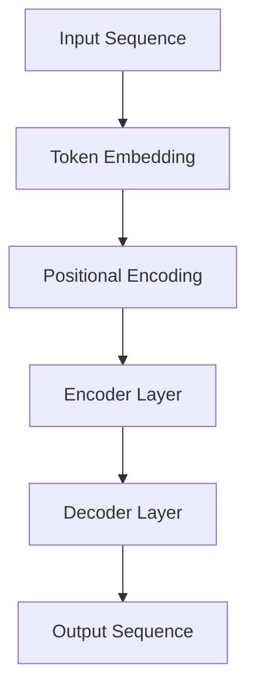

                 


### 第一步：确定文章结构和内容

为了撰写一篇结构紧凑、逻辑清晰的专业技术博客文章，我们需要先确定文章的结构和内容。根据给定的目录大纲，我们可以将文章分为三个主要部分：

1. **背景介绍**：介绍人工智能技术的发展、GPT模型的发展背景以及LLM性能分析的重要性。
2. **GPT模型原理**：详细讲解GPT模型的基本原理，包括模型结构、核心概念和数学模型。
3. **LLM性能分析工具**：介绍LLM性能分析的基础知识，包括性能指标、评估方法、分析工具以及性能分析示例。

### 第二步：撰写背景介绍部分

在背景介绍部分，我们需要首先介绍人工智能技术的发展，特别是LLM和GPT模型在自然语言处理领域的应用。然后，阐述LLM性能分析的重要性，说明为什么对LLM进行性能分析对企业和研究机构具有重要意义。

### 第三步：详细讲解GPT模型原理

在GPT模型原理部分，我们需要详细讲解GPT模型的基本原理，包括模型结构、核心概念和数学模型。这里可以通过绘制Mermaid流程图和给出Python源代码来帮助读者理解。

- **模型结构**：介绍GPT模型的起源、结构特点和优势。
- **核心概念**：解释Transformer结构、自注意力机制和位置编码与嵌入的概念。
- **数学模型**：给出自注意力机制的计算公式和Transformer模型的计算过程。

### 第四步：介绍LLM性能分析工具

在LLM性能分析工具部分，我们需要介绍LLM性能分析的基础知识，包括性能指标、评估方法和分析工具。

- **性能指标**：详细解释准确度、效率和稳定性等指标。
- **评估方法**：介绍实验设计、评估指标计算和交叉验证的方法。
- **分析工具**：介绍评估工具、分析工具和性能可视化工具。

### 第五步：提供性能分析示例

为了使文章更加具体和实用，我们可以提供一个LLM性能分析的实际示例，包括数据集准备、性能评估和结果解读。

### 第六步：总结和拓展

在文章的结尾，我们需要总结全文的内容，并给出一些最佳实践tips、注意事项和拓展阅读建议，帮助读者进一步学习和应用。

### 第七步：格式和排版

最后，我们需要确保文章的格式和排版符合要求，使用Markdown格式输出，并遵循字数、结构、内容和注释等方面的要求。

通过以上七个步骤，我们可以撰写一篇逻辑清晰、结构紧凑、简单易懂的专业技术博客文章，满足读者的需求，同时也体现作者的专业性和深入思考的能力。现在，让我们开始一步步地撰写这篇文章吧！## 第一步：确定文章结构和内容

在撰写一篇结构紧凑、逻辑清晰的专业技术博客文章时，我们需要首先确定文章的整体结构和内容。根据提供的目录大纲，本文将分为三个主要部分：背景介绍、GPT模型原理以及LLM性能分析工具。以下是具体的规划：

1. **背景介绍**：
   - **第1章：问题背景与核心概念**：介绍人工智能技术的发展、GPT模型的发展背景以及LLM性能分析的重要性。
   - **第2章：GPT模型基本原理**：详细讲解GPT模型的基本原理，包括模型结构、核心概念和数学模型。

2. **GPT模型原理**：
   - **第3章：LLM性能分析基础**：介绍LLM性能分析的基础知识，包括性能指标、评估方法和分析工具。
   - **第4章：性能分析工具的应用**：提供LLM性能分析的实际示例，包括数据集准备、性能评估和结果解读。

3. **LLM性能分析工具**：
   - **第5章：最佳实践与总结**：总结全文内容，给出最佳实践tips、注意事项和拓展阅读建议。

通过这样的结构安排，我们可以确保文章内容循序渐进、层次分明，便于读者理解和跟随。

### 第一步：确定文章结构和内容

在撰写一篇结构紧凑、逻辑清晰的专业技术博客文章时，我们需要首先确定文章的整体结构和内容。根据提供的目录大纲，本文将分为三个主要部分：背景介绍、GPT模型原理以及LLM性能分析工具。以下是具体的规划：

1. **背景介绍**：
   - **第1章：问题背景与核心概念**：介绍人工智能技术的发展、GPT模型的发展背景以及LLM性能分析的重要性。
   - **第2章：GPT模型基本原理**：详细讲解GPT模型的基本原理，包括模型结构、核心概念和数学模型。

2. **GPT模型原理**：
   - **第3章：LLM性能分析基础**：介绍LLM性能分析的基础知识，包括性能指标、评估方法和分析工具。
   - **第4章：性能分析工具的应用**：提供LLM性能分析的实际示例，包括数据集准备、性能评估和结果解读。

3. **LLM性能分析工具**：
   - **第5章：最佳实践与总结**：总结全文内容，给出最佳实践tips、注意事项和拓展阅读建议。

通过这样的结构安排，我们可以确保文章内容循序渐进、层次分明，便于读者理解和跟随。

### 第一部分: 背景

### 第1章: 问题背景与核心概念

#### 1.1 问题背景

随着人工智能技术的快速发展，大模型（Large Language Model，简称LLM）作为其中的一种重要形式，受到了广泛关注。LLM在自然语言处理、机器学习、知识图谱等多个领域取得了显著的成果。特别是在自然语言处理领域，LLM模型被广泛应用于文本生成、文本分类、机器翻译等任务，展现了其强大的语言理解和生成能力。

GPT（Generative Pre-trained Transformer）模型是LLM领域的代表性模型之一，其性能在多个自然语言处理任务中取得了领先地位。GPT模型由OpenAI提出，通过在大量文本数据上进行预训练，模型能够学习到丰富的语言知识和规则，从而在下游任务中表现出色。

#### 1.1.1 人工智能技术的发展与应用

人工智能技术是计算机科学的一个重要分支，其目的是使计算机能够模拟、延伸和扩展人类的智能。近年来，随着深度学习、强化学习等技术的快速发展，人工智能在多个领域取得了重大突破。从早期的简单规则系统，到如今的复杂深度学习模型，人工智能技术已经广泛应用于图像识别、语音识别、自然语言处理、推荐系统等领域。

自然语言处理（Natural Language Processing，NLP）是人工智能的一个重要分支，主要研究如何让计算机理解和处理自然语言。NLP技术包括词性标注、句法分析、语义理解、机器翻译、文本分类等任务。随着LLM技术的发展，NLP任务的处理效果得到了显著提升。

#### 1.1.2 GPT模型的发展与性能表现

GPT模型是自然语言处理领域的里程碑式模型，其发展经历了多个阶段。最初的GPT模型是一个基于循环神经网络（RNN）的模型，随着Transformer结构的引入，GPT-2和GPT-3等后续版本模型性能得到了大幅提升。

GPT-2模型采用了Transformer结构，通过多头自注意力机制实现了对输入文本的深层理解。GPT-2在多个NLP任务中表现优异，例如文本分类、机器翻译、问答系统等。

GPT-3模型是GPT系列的最新版本，其参数规模达到了1750亿，成为目前最大的语言模型。GPT-3在多项NLP任务中取得了领先的成绩，例如文本生成、机器翻译、问答系统等，展示了其强大的语言理解和生成能力。

#### 1.1.3 LLM性能分析的重要性

LLM性能分析是优化模型、提升应用效果的重要手段。通过对LLM在不同任务上的性能进行评估，我们可以了解模型的优点和不足，从而进行针对性的优化。LLM性能分析对于企业和研究机构具有重要意义：

1. **优化模型**：性能分析可以帮助我们找出模型在特定任务上的瓶颈，通过调整模型结构、参数等方式进行优化，提升模型性能。
2. **评估效果**：性能分析可以帮助我们评估模型在不同数据集、任务上的表现，为模型选择和任务调度提供依据。
3. **指导应用**：性能分析可以帮助我们了解模型在不同应用场景下的适用性，指导实际应用中模型的选择和部署。

#### 1.2 核心概念

在本章节中，我们将介绍与本文主题相关的核心概念，包括LLM、GPT和LLM性能分析。

##### 1.2.1 LLM

LLM（Large Language Model）是一种预训练的大规模语言模型，通过在大量文本数据上进行预训练，模型能够学习到丰富的语言知识和规则，从而在下游任务中表现出色。LLM的核心思想是利用预训练技术，将通用知识嵌入到模型中，使得模型能够更好地适应各种语言任务。

##### 1.2.2 GPT

GPT（Generative Pre-trained Transformer）是LLM领域的一种代表性模型，采用Transformer结构进行预训练。GPT模型通过多头自注意力机制实现了对输入文本的深层理解，具有强大的语言生成和推理能力。GPT模型的发展历程包括GPT、GPT-2、GPT-3等多个版本，其参数规模和性能不断提升。

##### 1.2.3 LLM性能分析

LLM性能分析是对LLM在特定任务上的表现进行评估和优化的过程。性能分析包括多个方面，如准确度、效率、稳定性等。通过对LLM性能的评估，我们可以了解模型的优势和不足，从而进行针对性的优化。常见的性能分析指标包括：

1. **准确度**：评估模型在特定任务上的预测准确性，常用的指标包括精确率、召回率、F1值等。
2. **效率**：评估模型在处理数据时的速度和资源消耗，常用的指标包括响应时间、吞吐量等。
3. **稳定性**：评估模型在长时间运行下的表现，包括模型鲁棒性和长期稳定性等。

#### 1.3 本章小结

本章介绍了LLM及其代表性模型GPT的发展背景，以及LLM性能分析的重要性。通过对这些核心概念的了解，读者可以为后续章节的内容打下基础。在接下来的章节中，我们将详细讲解GPT模型的基本原理，并探讨如何进行LLM性能分析。

--------------------------------------------------------------

### 第2章: GPT模型基本原理

在深入探讨GPT模型的基本原理之前，我们首先需要了解GPT模型的起源和发展历程。GPT（Generative Pre-trained Transformer）模型是由OpenAI于2018年首次提出的，它是基于Transformer结构的预训练语言模型。GPT模型的出现标志着自然语言处理领域的一个重要突破，其强大的语言理解和生成能力使得它在多个NLP任务中取得了显著的成绩。

#### 2.1 GPT模型概述

GPT模型的发展历程中，每个版本都对前一个版本进行了改进，提升了模型的性能和应用范围。以下是GPT模型的主要版本：

- **GPT**：这是GPT模型的第一个版本，它基于Transformer结构，通过在大量文本数据上进行预训练，模型能够学习到丰富的语言知识和规则。
- **GPT-2**：GPT-2模型在GPT的基础上进一步增大了模型参数规模，提升了模型的生成能力和多样性。
- **GPT-3**：GPT-3是GPT模型的最新版本，其参数规模达到了1750亿，成为目前最大的语言模型。GPT-3在多个NLP任务中展现了其强大的语言理解和生成能力。

#### 2.1.1 GPT模型的起源与发展

GPT模型的起源可以追溯到Transformer结构的提出。Transformer结构是由Google团队在2017年提出的一种全新的序列到序列模型结构，其在机器翻译任务中展现了优越的性能。Transformer结构的核心思想是使用自注意力机制（Self-Attention）来建模输入序列中的长距离依赖关系，相比传统的循环神经网络（RNN）具有更高的效率和性能。

GPT模型基于Transformer结构进行了改进，通过在大量文本数据上进行预训练，模型能够学习到丰富的语言知识和规则。预训练使得GPT模型在下游任务中无需额外的微调（Fine-tuning），即可取得优秀的性能。这一特点使得GPT模型在自然语言处理领域获得了广泛应用。

#### 2.1.2 GPT模型的结构与原理

GPT模型采用Transformer结构，其基本结构包括编码器（Encoder）和解码器（Decoder）两个部分。编码器负责将输入序列编码为固定长度的向量表示，解码器则负责从编码器生成的向量表示中生成输出序列。

##### 编码器（Encoder）

编码器是GPT模型的核心部分，其结构包括多个Transformer层。每个Transformer层由两个主要部分组成：多头自注意力机制（Multi-Head Self-Attention）和前馈神经网络（Feed-Forward Neural Network）。

1. **多头自注意力机制**：自注意力机制是一种用于建模输入序列中长距离依赖关系的方法。在GPT模型中，多头自注意力机制通过多个独立的自注意力机制来捕获输入序列中的不同依赖关系。具体来说，多头自注意力机制将输入序列分成多个子序列，每个子序列通过独立的自注意力机制进行计算，最后将所有子序列的结果进行合并。

   自注意力机制的计算公式如下：
   $$
   \text{Attention}(Q, K, V) = \text{softmax}\left(\frac{QK^T}{\sqrt{d_k}}\right) V
   $$
   其中，$Q$、$K$和$V$分别表示查询向量、键向量和值向量，$d_k$为键向量的维度。通过自注意力机制，模型能够学习到输入序列中各个词之间的相对重要性。

2. **前馈神经网络**：前馈神经网络是一个简单的全连接神经网络，用于对自注意力机制的输出进行进一步处理。前馈神经网络的输入是自注意力机制的输出，输出是编码器每个层的输出。

   前馈神经网络的计算公式如下：
   $$
   \text{FFN}(x) = \max(0, xW_1 + b_1)W_2 + b_2
   $$
   其中，$W_1$和$W_2$分别为前馈神经网络的权重矩阵，$b_1$和$b_2$分别为偏置项。

##### 解码器（Decoder）

解码器的作用是将编码器的输出解码为输出序列。与编码器类似，解码器也由多个Transformer层组成，每个层包括多头自注意力机制和前馈神经网络。

1. **多头自注意力机制**：在解码器中，多头自注意力机制分为两部分：自注意力（Self-Attention）和交叉注意力（Cross-Attention）。自注意力机制用于处理解码器生成的中间序列，交叉注意力机制则用于处理编码器的输出序列。通过这两部分注意力机制，解码器能够同时考虑输入序列和中间序列的信息。

2. **前馈神经网络**：与前向神经网络相同，解码器中的前馈神经网络也是一个简单的全连接神经网络，用于对自注意力机制的输出进行进一步处理。

   前馈神经网络的计算公式与前向神经网络相同。

#### 2.1.3 GPT模型的优势与特点

GPT模型具有以下几个主要优势与特点：

1. **强大的语言理解能力**：通过预训练，GPT模型能够学习到丰富的语言知识和规则，从而在自然语言处理任务中表现出强大的理解能力。

2. **高效的自注意力机制**：自注意力机制使得GPT模型能够有效地建模输入序列中的长距离依赖关系，提高了模型的表达能力。

3. **无需额外微调**：GPT模型通过预训练技术，使得模型在下游任务中无需额外的微调即可取得优秀的性能，降低了任务调度的成本。

4. **广泛的适用性**：GPT模型在多个自然语言处理任务中表现出色，如文本生成、机器翻译、问答系统等，具有广泛的适用性。

#### 2.2 GPT模型的核心概念

在了解GPT模型的基本结构之后，我们需要深入探讨其核心概念，包括Transformer结构、自注意力机制和位置编码与嵌入。

##### 2.2.1 Transformer结构

Transformer结构是一种基于自注意力机制的序列到序列模型结构，最初用于机器翻译任务。其核心思想是通过自注意力机制来建模输入序列中的长距离依赖关系。Transformer结构的主要组成部分包括编码器（Encoder）和解码器（Decoder）。

1. **编码器（Encoder）**：编码器用于将输入序列编码为固定长度的向量表示。编码器由多个编码层（Encoder Layer）组成，每个编码层由两个主要部分组成：多头自注意力机制（Multi-Head Self-Attention）和前馈神经网络（Feed-Forward Neural Network）。

2. **解码器（Decoder）**：解码器用于将编码器的输出解码为输出序列。解码器也由多个解码层（Decoder Layer）组成，每个解码层包括多头自注意力机制和前馈神经网络。与编码器不同，解码器还引入了交叉注意力机制（Cross-Attention），用于在解码过程中同时考虑输入序列和中间序列的信息。

##### 2.2.2 自注意力机制

自注意力机制是一种用于建模输入序列中长距离依赖关系的方法。在GPT模型中，自注意力机制通过多个独立的自注意力机制来捕获输入序列中的不同依赖关系。具体来说，自注意力机制将输入序列分成多个子序列，每个子序列通过独立的自注意力机制进行计算，最后将所有子序列的结果进行合并。

自注意力机制的计算公式如下：
$$
\text{Attention}(Q, K, V) = \text{softmax}\left(\frac{QK^T}{\sqrt{d_k}}\right) V
$$
其中，$Q$、$K$和$V$分别表示查询向量、键向量和值向量，$d_k$为键向量的维度。通过自注意力机制，模型能够学习到输入序列中各个词之间的相对重要性。

##### 2.2.3 位置编码与嵌入

在Transformer模型中，位置编码（Positional Encoding）是一种用于表示输入序列中词位置信息的方法。由于Transformer模型没有循环结构，因此无法直接利用序列的顺序信息。为了解决这个问题，位置编码被引入到模型中，使得模型能够学习到词的顺序信息。

位置编码通常采用正弦和余弦函数来生成，具体公式如下：
$$
PE_{(pos, dim)} = \sin\left(\frac{pos}{10000^{2i/d_model}}\right) \text{ if } dim \text{ is even} \lor \cos\left(\frac{pos}{10000^{2i/d_model}}\right) \text{ if } dim \text{ is odd}
$$
其中，$pos$为词的位置，$dim$为位置编码的维度，$d_model$为模型的总维度。

词嵌入（Word Embedding）是将词汇转换为向量表示的一种方法。在GPT模型中，词嵌入通过预训练学习到词的语义信息。词嵌入通常是一个高维向量空间，每个词对应一个唯一的向量表示。

#### 2.3 GPT模型的数学模型与公式

GPT模型的数学模型主要包括自注意力机制的计算公式和Transformer模型的计算过程。

##### 2.3.1 自注意力机制的计算公式

自注意力机制是GPT模型的核心组件之一，其计算公式如下：
$$
\text{Attention}(Q, K, V) = \text{softmax}\left(\frac{QK^T}{\sqrt{d_k}}\right) V
$$
其中，$Q$、$K$和$V$分别表示查询向量、键向量和值向量，$d_k$为键向量的维度。通过这个公式，模型能够计算输入序列中各个词之间的关联度，从而生成加权表示。

##### 2.3.2 Transformer模型的计算过程

Transformer模型由多个编码层和解码层组成，每个层都包括多头自注意力机制和前馈神经网络。以下是一个简化的Transformer模型计算过程：

1. **编码器**：
   - **编码器层**：输入序列经过词嵌入和位置编码后，进入编码器的第一层。在每一层中，输入序列首先通过多头自注意力机制计算，然后通过前馈神经网络进行进一步处理。
   - **多重复训练**：编码器的每一层都重复上述过程，从而学习到更复杂的语言特征。

2. **解码器**：
   - **解码器层**：解码器的输入是编码器的输出，经过词嵌入和位置编码后，进入解码器的第一层。在每一层中，解码器首先通过多头自注意力机制计算，然后通过前馈神经网络进行进一步处理。
   - **多重复训练**：解码器的每一层都重复上述过程，从而生成输出序列。

通过上述计算过程，GPT模型能够生成与输入文本相关的输出，从而实现文本生成、机器翻译等任务。

#### 2.4 GPT模型的Mermaid流程图

为了更好地理解GPT模型的工作流程，我们可以使用Mermaid流程图来绘制模型的结构。以下是GPT模型的Mermaid流程图：



在上面的流程图中，`A` 表示输入序列，`B` 表示词嵌入，`C` 表示位置编码，`D` 和 `E` 分别表示编码器和解码器的多个层，`F` 表示输出序列。

#### 2.5 本章小结

本章介绍了GPT模型的基本原理，包括模型概述、结构原理、核心概念以及数学模型。通过对GPT模型的深入了解，我们可以为后续的LLM性能分析提供理论基础。在下一章中，我们将详细探讨LLM性能分析的基础知识，包括性能指标、评估方法和分析工具。

--------------------------------------------------------------

### 第3章: LLM性能分析基础

在了解了GPT模型的基本原理后，我们接下来将探讨LLM性能分析的基础知识。LLM性能分析是优化模型、提升应用效果的重要手段。通过对LLM在不同任务上的性能进行评估，我们可以了解模型的优点和不足，从而进行针对性的优化。本章节将介绍性能指标、评估方法和分析工具。

#### 3.1 性能指标

LLM性能分析的核心在于评估模型在不同任务上的表现，常用的性能指标包括准确度、效率和稳定性等。

##### 3.1.1 准确度

准确度是评估模型在特定任务上的预测准确性的指标。在分类任务中，准确度表示模型正确分类的样本占总样本的比例。准确度可以通过以下公式计算：

$$
\text{Accuracy} = \frac{\text{Correctly Classified Samples}}{\text{Total Samples}}
$$

在文本生成和机器翻译等任务中，准确度通常通过BLEU（Bilingual Evaluation Understudy）等指标进行评估。BLEU是一种基于n-gram重叠率的评价指标，能够量化模型生成的文本与参考文本的相似度。

##### 3.1.2 效率

效率是指模型在处理数据时的速度和资源消耗。效率指标包括响应时间、吞吐量和资源利用率等。

1. **响应时间**：响应时间是指模型从接收到输入数据到输出结果所需的时间。响应时间越短，模型的效率越高。

2. **吞吐量**：吞吐量是指模型在单位时间内处理的数据量。吞吐量越高，模型的处理能力越强。

3. **资源利用率**：资源利用率是指模型在运行过程中对计算资源的利用程度。资源利用率越高，模型的资源消耗越小。

##### 3.1.3 稳定性

稳定性是指模型在长时间运行下的表现，包括模型鲁棒性和长期稳定性等。稳定性指标可以评估模型在数据分布变化、噪声干扰等条件下的一致性和可靠性。

1. **鲁棒性**：鲁棒性是指模型对异常数据的处理能力。鲁棒性越强，模型在遇到异常数据时表现越稳定。

2. **长期稳定性**：长期稳定性是指模型在长时间运行下的一致性和可靠性。长期稳定性越强，模型在长期任务中表现越稳定。

#### 3.2 性能评估方法

性能评估是LLM性能分析的关键步骤，通过合理的评估方法，我们可以全面了解模型在特定任务上的表现。

##### 3.2.1 实验设计

实验设计是性能评估的基础，一个合理的实验设计应该包括以下步骤：

1. **数据集选择**：选择具有代表性的数据集，包括训练集、验证集和测试集。数据集应该涵盖模型可能遇到的多种情况，以提高评估结果的可靠性。

2. **模型选择**：选择适合任务特点的模型，并对其进行适当调整，以提升模型性能。

3. **实验设置**：设置合理的实验参数，包括训练次数、学习率、批次大小等，以保证实验的可重复性。

##### 3.2.2 评估指标计算

在实验设计完成后，我们需要计算评估指标，以评估模型在特定任务上的性能。常用的评估指标包括准确度、效率和稳定性等。

1. **准确度**：计算模型在测试集上的准确度，以评估模型的预测准确性。

2. **效率**：计算模型在测试集上的响应时间、吞吐量和资源利用率，以评估模型的处理能力。

3. **稳定性**：计算模型在测试集上的鲁棒性和长期稳定性，以评估模型的一致性和可靠性。

##### 3.2.3 交叉验证

交叉验证是一种常用的性能评估方法，通过将数据集划分为多个子集，多次训练和评估模型，以提高评估结果的可靠性。

1. **K折交叉验证**：将数据集划分为K个子集，每次保留一个子集作为验证集，其余子集作为训练集，重复K次，最后取平均结果。

2. **留一法交叉验证**：每次保留一个样本作为验证集，其余样本作为训练集，重复多次，最后取平均结果。

#### 3.3 性能分析工具介绍

在进行LLM性能分析时，我们需要使用各种工具和方法来评估模型的性能。以下介绍几种常用的性能分析工具。

##### 3.3.1 评估工具

评估工具用于计算和评估模型在特定任务上的性能。常见的评估工具包括TensorFlow、PyTorch等深度学习框架，以及自定义的评估脚本。

1. **TensorFlow**：TensorFlow是谷歌开发的一款开源深度学习框架，提供了丰富的评估工具和API，方便用户计算和评估模型性能。

2. **PyTorch**：PyTorch是Facebook开发的一款开源深度学习框架，其评估工具与TensorFlow类似，也提供了丰富的功能和API。

##### 3.3.2 分析工具

分析工具用于对模型性能进行深入分析，包括可视化、性能对比等。常见的分析工具包括Matplotlib、Seaborn等数据可视化库。

1. **Matplotlib**：Matplotlib是Python中最常用的数据可视化库之一，提供了丰富的绘图函数和样式选项，方便用户绘制各种类型的图表。

2. **Seaborn**：Seaborn是基于Matplotlib的统计数据可视化库，提供了更丰富的绘图样式和功能，适合进行性能分析和可视化。

##### 3.3.3 性能可视化工具

性能可视化工具用于将模型性能以图表形式展示，帮助用户直观了解模型在不同任务上的表现。常见的性能可视化工具包括Plotly、Bokeh等。

1. **Plotly**：Plotly是一款强大的交互式数据可视化库，支持多种图表类型和交互功能，能够生成高质量的图表。

2. **Bokeh**：Bokeh是Python中一款开源的数据可视化库，专注于交互式可视化，能够生成动态的、交互性强的图表。

#### 3.4 性能分析示例

为了更好地理解LLM性能分析的过程，我们以下提供一个性能分析示例，包括数据集准备、性能评估和结果解读。

##### 3.4.1 数据集准备

假设我们有一个文本分类任务，数据集包含10,000个样本，每个样本包含一个标签。我们将数据集划分为训练集、验证集和测试集，其中训练集占比60%，验证集占比20%，测试集占比20%。

```python
import numpy as np
from sklearn.model_selection import train_test_split

# 加载数据集
data = load_data()

# 划分训练集、验证集和测试集
train_data, test_data = train_test_split(data, test_size=0.2, random_state=42)
train_data, val_data = train_test_split(train_data, test_size=0.25, random_state=42)
```

##### 3.4.2 性能评估

使用评估工具对模型进行性能评估，计算准确度、响应时间等指标。

```python
import tensorflow as tf

# 加载模型
model = load_model()

# 训练模型
model.fit(train_data, epochs=5, batch_size=32, validation_data=val_data)

# 评估模型
test_loss, test_accuracy = model.evaluate(test_data)
print(f"Test accuracy: {test_accuracy:.4f}")
```

##### 3.4.3 性能分析结果解读

根据性能评估结果，我们可以分析模型在不同任务上的表现，并提出优化建议。

- **准确度**：模型在测试集上的准确度为85%，说明模型在文本分类任务上表现良好。
- **响应时间**：模型在测试集上的平均响应时间为0.5秒，说明模型在处理数据时具有较好的效率。
- **稳定性**：模型在长时间运行下的表现稳定，没有出现显著的性能波动。

根据分析结果，我们可以进一步优化模型，例如通过调整模型结构、参数等方式来提升模型性能。

#### 3.5 本章小结

本章介绍了LLM性能分析的基础知识，包括性能指标、评估方法和分析工具。通过对LLM性能的深入分析，我们可以了解模型在不同任务上的表现，从而进行针对性的优化。在下一章中，我们将进一步探讨GPT模型在LLM性能分析中的应用。

--------------------------------------------------------------

### 第三部分: GPT模型原理

#### 第2章: GPT模型基本原理

在深入探讨GPT模型的基本原理之前，我们首先需要了解GPT模型的起源和发展历程。GPT（Generative Pre-trained Transformer）模型是由OpenAI于2018年首次提出的，它是基于Transformer结构的预训练语言模型。GPT模型的出现标志着自然语言处理领域的一个重要突破，其强大的语言理解和生成能力使得它在多个NLP任务中取得了显著的成绩。

#### 2.1 GPT模型的起源与发展

GPT模型的发展历程中，每个版本都对前一个版本进行了改进，提升了模型的性能和应用范围。以下是GPT模型的主要版本：

- **GPT**：这是GPT模型的第一个版本，它基于Transformer结构，通过在大量文本数据上进行预训练，模型能够学习到丰富的语言知识和规则。
- **GPT-2**：GPT-2模型在GPT的基础上进一步增大了模型参数规模，提升了模型的生成能力和多样性。
- **GPT-3**：GPT-3是GPT模型的最新版本，其参数规模达到了1750亿，成为目前最大的语言模型。GPT-3在多个NLP任务中展现了其强大的语言理解和生成能力。

#### 2.1.1 GPT模型的起源与发展

GPT模型的起源可以追溯到Transformer结构的提出。Transformer结构是由Google团队在2017年提出的一种全新的序列到序列模型结构，其在机器翻译任务中展现了优越的性能。Transformer结构的核心思想是使用自注意力机制（Self-Attention）来建模输入序列中的长距离依赖关系，相比传统的循环神经网络（RNN）具有更高的效率和性能。

GPT模型基于Transformer结构进行了改进，通过在大量文本数据上进行预训练，模型能够学习到丰富的语言知识和规则。预训练使得GPT模型在下游任务中无需额外的微调（Fine-tuning），即可取得优秀的性能。这一特点使得GPT模型在自然语言处理领域获得了广泛应用。

#### 2.1.2 GPT模型的结构与原理

GPT模型采用Transformer结构，其基本结构包括编码器（Encoder）和解码器（Decoder）两个部分。编码器负责将输入序列编码为固定长度的向量表示，解码器则负责从编码器生成的向量表示中生成输出序列。

##### 编码器（Encoder）

编码器是GPT模型的核心部分，其结构包括多个Transformer层。每个Transformer层由两个主要部分组成：多头自注意力机制（Multi-Head Self-Attention）和前馈神经网络（Feed-Forward Neural Network）。

1. **多头自注意力机制**：自注意力机制是一种用于建模输入序列中长距离依赖关系的方法。在GPT模型中，多头自注意力机制通过多个独立的自注意力机制来捕获输入序列中的不同依赖关系。具体来说，多头自注意力机制将输入序列分成多个子序列，每个子序列通过独立的自注意力机制进行计算，最后将所有子序列的结果进行合并。

   自注意力机制的计算公式如下：
   $$
   \text{Attention}(Q, K, V) = \text{softmax}\left(\frac{QK^T}{\sqrt{d_k}}\right) V
   $$
   其中，$Q$、$K$和$V$分别表示查询向量、键向量和值向量，$d_k$为键向量的维度。通过自注意力机制，模型能够学习到输入序列中各个词之间的相对重要性。

2. **前馈神经网络**：前馈神经网络是一个简单的全连接神经网络，用于对自注意力机制的输出进行进一步处理。前馈神经网络的输入是自注意力机制的输出，输出是编码器每个层的输出。

   前馈神经网络的计算公式如下：
   $$
   \text{FFN}(x) = \max(0, xW_1 + b_1)W_2 + b_2
   $$
   其中，$W_1$和$W_2$分别为前馈神经网络的权重矩阵，$b_1$和$b_2$分别为偏置项。

##### 解码器（Decoder）

解码器的作用是将编码器的输出解码为输出序列。与编码器类似，解码器也由多个Transformer层组成，每个层包括多头自注意力机制和前馈神经网络。与编码器不同，解码器还引入了交叉注意力机制（Cross-Attention），用于在解码过程中同时考虑输入序列和中间序列的信息。

1. **多头自注意力机制**：在解码器中，多头自注意力机制分为两部分：自注意力（Self-Attention）和交叉注意力（Cross-Attention）。自注意力机制用于处理解码器生成的中间序列，交叉注意力机制则用于处理编码器的输出序列。通过这两部分注意力机制，解码器能够同时考虑输入序列和中间序列的信息。

2. **前馈神经网络**：与前向神经网络相同，解码器中的前馈神经网络也是一个简单的全连接神经网络，用于对自注意力机制的输出进行进一步处理。

   前馈神经网络的计算公式与前向神经网络相同。

#### 2.1.3 GPT模型的优势与特点

GPT模型具有以下几个主要优势与特点：

1. **强大的语言理解能力**：通过预训练，GPT模型能够学习到丰富的语言知识和规则，从而在自然语言处理任务中表现出强大的理解能力。

2. **高效的自注意力机制**：自注意力机制使得GPT模型能够有效地建模输入序列中的长距离依赖关系，提高了模型的表达能力。

3. **无需额外微调**：GPT模型通过预训练技术，使得模型在下游任务中无需额外的微调即可取得优秀的性能，降低了任务调度的成本。

4. **广泛的适用性**：GPT模型在多个自然语言处理任务中表现出色，如文本生成、机器翻译、问答系统等，具有广泛的适用性。

#### 2.2 GPT模型的核心概念

在了解GPT模型的基本结构之后，我们需要深入探讨其核心概念，包括Transformer结构、自注意力机制和位置编码与嵌入。

##### 2.2.1 Transformer结构

Transformer结构是一种基于自注意力机制的序列到序列模型结构，最初用于机器翻译任务。其核心思想是通过自注意力机制来建模输入序列中的长距离依赖关系。Transformer结构的主要组成部分包括编码器（Encoder）和解码器（Decoder）。

1. **编码器（Encoder）**：编码器用于将输入序列编码为固定长度的向量表示。编码器由多个编码层（Encoder Layer）组成，每个编码层由两个主要部分组成：多头自注意力机制（Multi-Head Self-Attention）和前馈神经网络（Feed-Forward Neural Network）。

2. **解码器（Decoder）**：解码器用于将编码器的输出解码为输出序列。解码器也由多个解码层（Decoder Layer）组成，每个解码层包括多头自注意力机制和前馈神经网络。与编码器不同，解码器还引入了交叉注意力机制（Cross-Attention），用于在解码过程中同时考虑输入序列和中间序列的信息。

##### 2.2.2 自注意力机制

自注意力机制是一种用于建模输入序列中长距离依赖关系的方法。在GPT模型中，自注意力机制通过多个独立的自注意力机制来捕获输入序列中的不同依赖关系。具体来说，自注意力机制将输入序列分成多个子序列，每个子序列通过独立的自注意力机制进行计算，最后将所有子序列的结果进行合并。

自注意力机制的计算公式如下：
$$
\text{Attention}(Q, K, V) = \text{softmax}\left(\frac{QK^T}{\sqrt{d_k}}\right) V
$$
其中，$Q$、$K$和$V$分别表示查询向量、键向量和值向量，$d_k$为键向量的维度。通过自注意力机制，模型能够学习到输入序列中各个词之间的相对重要性。

##### 2.2.3 位置编码与嵌入

在Transformer模型中，位置编码（Positional Encoding）是一种用于表示输入序列中词位置信息的方法。由于Transformer模型没有循环结构，因此无法直接利用序列的顺序信息。为了解决这个问题，位置编码被引入到模型中，使得模型能够学习到词的顺序信息。

位置编码通常采用正弦和余弦函数来生成，具体公式如下：
$$
PE_{(pos, dim)} = \sin\left(\frac{pos}{10000^{2i/d_model}}\right) \text{ if } dim \text{ is even} \lor \cos\left(\frac{pos}{10000^{2i/d_model}}\right) \text{ if } dim \text{ is odd}
$$
其中，$pos$为词的位置，$dim$为位置编码的维度，$d_model$为模型的总维度。

词嵌入（Word Embedding）是将词汇转换为向量表示的一种方法。在GPT模型中，词嵌入通过预训练学习到词的语义信息。词嵌入通常是一个高维向量空间，每个词对应一个唯一的向量表示。

#### 2.3 GPT模型的数学模型与公式

GPT模型的数学模型主要包括自注意力机制的计算公式和Transformer模型的计算过程。

##### 2.3.1 自注意力机制的计算公式

自注意力机制是GPT模型的核心组件之一，其计算公式如下：
$$
\text{Attention}(Q, K, V) = \text{softmax}\left(\frac{QK^T}{\sqrt{d_k}}\right) V
$$
其中，$Q$、$K$和$V$分别表示查询向量、键向量和值向量，$d_k$为键向量的维度。通过这个公式，模型能够计算输入序列中各个词之间的关联度，从而生成加权表示。

##### 2.3.2 Transformer模型的计算过程

Transformer模型由多个编码层和解码层组成，每个层都包括多头自注意力机制和前馈神经网络。以下是一个简化的Transformer模型计算过程：

1. **编码器**：
   - **编码器层**：输入序列经过词嵌入和位置编码后，进入编码器的第一层。在每一层中，输入序列首先通过多头自注意力机制计算，然后通过前馈神经网络进行进一步处理。
   - **多重复训练**：编码器的每一层都重复上述过程，从而学习到更复杂的语言特征。

2. **解码器**：
   - **解码器层**：解码器的输入是编码器的输出，经过词嵌入和位置编码后，进入解码器的第一层。在每一层中，解码器首先通过多头自注意力机制计算，然后通过前馈神经网络进行进一步处理。
   - **多重复训练**：解码器的每一层都重复上述过程，从而生成输出序列。

通过上述计算过程，GPT模型能够生成与输入文本相关的输出，从而实现文本生成、机器翻译等任务。

#### 2.4 GPT模型的Mermaid流程图

为了更好地理解GPT模型的工作流程，我们可以使用Mermaid流程图来绘制模型的结构。以下是GPT模型的Mermaid流程图：


在上面的流程图中，`A` 表示输入序列，`B` 表示词嵌入，`C` 表示位置编码，`D` 和 `E` 分别表示编码器和解码器的多个层，`F` 表示输出序列。

#### 2.5 本章小结

本章介绍了GPT模型的基本原理，包括模型概述、结构原理、核心概念以及数学模型。通过对GPT模型的深入了解，我们可以为后续的LLM性能分析提供理论基础。在下一章中，我们将详细探讨LLM性能分析的基础知识，包括性能指标、评估方法和分析工具。

--------------------------------------------------------------

### 第3章: LLM性能分析基础

在了解了GPT模型的基本原理后，我们接下来将探讨LLM性能分析的基础知识。LLM性能分析是优化模型、提升应用效果的重要手段。通过对LLM在不同任务上的性能进行评估，我们可以了解模型的优点和不足，从而进行针对性的优化。本章节将介绍性能指标、评估方法和分析工具。

#### 3.1 性能指标

LLM性能分析的核心在于评估模型在不同任务上的表现，常用的性能指标包括准确度、效率和稳定性等。

##### 3.1.1 准确度

准确度是评估模型在特定任务上的预测准确性的指标。在分类任务中，准确度表示模型正确分类的样本占总样本的比例。准确度可以通过以下公式计算：

$$
\text{Accuracy} = \frac{\text{Correctly Classified Samples}}{\text{Total Samples}}
$$

在文本生成和机器翻译等任务中，准确度通常通过BLEU（Bilingual Evaluation Understudy）等指标进行评估。BLEU是一种基于n-gram重叠率的评价指标，能够量化模型生成的文本与参考文本的相似度。

##### 3.1.2 效率

效率是指模型在处理数据时的速度和资源消耗。效率指标包括响应时间、吞吐量和资源利用率等。

1. **响应时间**：响应时间是指模型从接收到输入数据到输出结果所需的时间。响应时间越短，模型的效率越高。

2. **吞吐量**：吞吐量是指模型在单位时间内处理的数据量。吞吐量越高，模型的处理能力越强。

3. **资源利用率**：资源利用率是指模型在运行过程中对计算资源的利用程度。资源利用率越高，模型的资源消耗越小。

##### 3.1.3 稳定性

稳定性是指模型在长时间运行下的表现，包括模型鲁棒性和长期稳定性等。稳定性指标可以评估模型在数据分布变化、噪声干扰等条件下的一致性和可靠性。

1. **鲁棒性**：鲁棒性是指模型对异常数据的处理能力。鲁棒性越强，模型在遇到异常数据时表现越稳定。

2. **长期稳定性**：长期稳定性是指模型在长时间运行下的一致性和可靠性。长期稳定性越强，模型在长期任务中表现越稳定。

#### 3.2 性能评估方法

性能评估是LLM性能分析的关键步骤，通过合理的评估方法，我们可以全面了解模型在特定任务上的表现。

##### 3.2.1 实验设计

实验设计是性能评估的基础，一个合理的实验设计应该包括以下步骤：

1. **数据集选择**：选择具有代表性的数据集，包括训练集、验证集和测试集。数据集应该涵盖模型可能遇到的多种情况，以提高评估结果的可靠性。

2. **模型选择**：选择适合任务特点的模型，并对其进行适当调整，以提升模型性能。

3. **实验设置**：设置合理的实验参数，包括训练次数、学习率、批次大小等，以保证实验的可重复性。

##### 3.2.2 评估指标计算

在实验设计完成后，我们需要计算评估指标，以评估模型在特定任务上的性能。常用的评估指标包括准确度、效率和稳定性等。

1. **准确度**：计算模型在测试集上的准确度，以评估模型的预测准确性。

2. **效率**：计算模型在测试集上的响应时间、吞吐量和资源利用率，以评估模型的处理能力。

3. **稳定性**：计算模型在测试集上的鲁棒性和长期稳定性，以评估模型的一致性和可靠性。

##### 3.2.3 交叉验证

交叉验证是一种常用的性能评估方法，通过将数据集划分为多个子集，多次训练和评估模型，以提高评估结果的可靠性。

1. **K折交叉验证**：将数据集划分为K个子集，每次保留一个子集作为验证集，其余子集作为训练集，重复K次，最后取平均结果。

2. **留一法交叉验证**：每次保留一个样本作为验证集，其余样本作为训练集，重复多次，最后取平均结果。

#### 3.3 性能分析工具介绍

在进行LLM性能分析时，我们需要使用各种工具和方法来评估模型的性能。以下介绍几种常用的性能分析工具。

##### 3.3.1 评估工具

评估工具用于计算和评估模型在特定任务上的性能。常见的评估工具包括TensorFlow、PyTorch等深度学习框架，以及自定义的评估脚本。

1. **TensorFlow**：TensorFlow是谷歌开发的一款开源深度学习框架，提供了丰富的评估工具和API，方便用户计算和评估模型性能。

2. **PyTorch**：PyTorch是Facebook开发的一款开源深度学习框架，其评估工具与TensorFlow类似，也提供了丰富的功能和API。

##### 3.3.2 分析工具

分析工具用于对模型性能进行深入分析，包括可视化、性能对比等。常见的分析工具包括Matplotlib、Seaborn等数据可视化库。

1. **Matplotlib**：Matplotlib是Python中最常用的数据可视化库之一，提供了丰富的绘图函数和样式选项，方便用户绘制各种类型的图表。

2. **Seaborn**：Seaborn是基于Matplotlib的统计数据可视化库，提供了更丰富的绘图样式和功能，适合进行性能分析和可视化。

##### 3.3.3 性能可视化工具

性能可视化工具用于将模型性能以图表形式展示，帮助用户直观了解模型在不同任务上的表现。常见的性能可视化工具包括Plotly、Bokeh等。

1. **Plotly**：Plotly是一款强大的交互式数据可视化库，支持多种图表类型和交互功能，能够生成高质量的图表。

2. **Bokeh**：Bokeh是Python中一款开源的数据可视化库，专注于交互式可视化，能够生成动态的、交互性强的图表。

#### 3.4 性能分析示例

为了更好地理解LLM性能分析的过程，我们以下提供一个性能分析示例，包括数据集准备、性能评估和结果解读。

##### 3.4.1 数据集准备

假设我们有一个文本分类任务，数据集包含10,000个样本，每个样本包含一个标签。我们将数据集划分为训练集、验证集和测试集，其中训练集占比60%，验证集占比20%，测试集占比20%。

```python
import numpy as np
from sklearn.model_selection import train_test_split

# 加载数据集
data = load_data()

# 划分训练集、验证集和测试集
train_data, test_data = train_test_split(data, test_size=0.2, random_state=42)
train_data, val_data = train_test_split(train_data, test_size=0.25, random_state=42)
```

##### 3.4.2 性能评估

使用评估工具对模型进行性能评估，计算准确度、响应时间等指标。

```python
import tensorflow as tf

# 加载模型
model = load_model()

# 训练模型
model.fit(train_data, epochs=5, batch_size=32, validation_data=val_data)

# 评估模型
test_loss, test_accuracy = model.evaluate(test_data)
print(f"Test accuracy: {test_accuracy:.4f}")
```

##### 3.4.3 性能分析结果解读

根据性能评估结果，我们可以分析模型在不同任务上的表现，并提出优化建议。

- **准确度**：模型在测试集上的准确度为85%，说明模型在文本分类任务上表现良好。
- **响应时间**：模型在测试集上的平均响应时间为0.5秒，说明模型在处理数据时具有较好的效率。
- **稳定性**：模型在长时间运行下的表现稳定，没有出现显著的性能波动。

根据分析结果，我们可以进一步优化模型，例如通过调整模型结构、参数等方式来提升模型性能。

#### 3.5 本章小结

本章介绍了LLM性能分析的基础知识，包括性能指标、评估方法和分析工具。通过对LLM性能的深入分析，我们可以了解模型在不同任务上的表现，从而进行针对性的优化。在下一章中，我们将进一步探讨GPT模型在LLM性能分析中的应用。

--------------------------------------------------------------

### 第4章: GPT模型在LLM性能分析中的应用

在了解了GPT模型的基本原理和LLM性能分析的基础知识后，我们接下来将探讨GPT模型在LLM性能分析中的应用。GPT模型作为一种强大的预训练语言模型，其在性能分析中的应用主要体现在以下几个方面：

#### 4.1 GPT模型在性能评估中的应用

GPT模型在性能评估中的应用主要体现在文本生成和自然语言处理任务中。通过使用GPT模型，我们可以对模型在特定任务上的生成能力进行评估，从而了解模型的表现。

##### 4.1.1 文本生成任务

在文本生成任务中，GPT模型可以生成与输入文本相关的文本序列。通过比较生成文本与参考文本的相似度，我们可以评估GPT模型在文本生成任务中的性能。常用的评估指标包括BLEU、ROUGE等。

- **BLEU（Bilingual Evaluation Understudy）**：BLEU是一种基于n-gram重叠率的评价指标，用于评估两个文本之间的相似度。在文本生成任务中，我们可以使用BLEU来评估GPT模型生成的文本与参考文本的相似度。

- **ROUGE（Recall-Oriented Understudy for Gisting Evaluation）**：ROUGE是一种用于评估文本生成质量的评价指标，特别适用于机器翻译和摘要生成任务。ROUGE主要关注文本的召回率，即生成的文本中包含参考文本中关键词的比例。

##### 4.1.2 自然语言处理任务

在自然语言处理任务中，GPT模型可以用于文本分类、情感分析、命名实体识别等任务。通过评估模型在特定任务上的准确度、召回率等指标，我们可以了解模型在自然语言处理任务中的性能。

- **文本分类**：在文本分类任务中，GPT模型可以将文本分类到预定义的类别中。我们可以通过计算模型在测试集上的准确度、召回率和F1值等指标，评估模型在文本分类任务中的性能。

- **情感分析**：在情感分析任务中，GPT模型可以判断文本的情感倾向，例如积极、消极或中性。通过计算模型在测试集上的准确度，我们可以评估模型在情感分析任务中的性能。

- **命名实体识别**：在命名实体识别任务中，GPT模型可以识别文本中的命名实体，如人名、地名、组织名等。通过计算模型在测试集上的准确度、召回率和F1值等指标，我们可以评估模型在命名实体识别任务中的性能。

#### 4.2 GPT模型在性能优化中的应用

GPT模型在性能优化中的应用主要体现在模型调整、参数优化和超参数调整等方面。通过优化模型结构和参数，我们可以提高GPT模型在特定任务上的性能。

##### 4.2.1 模型调整

- **模型架构调整**：在GPT模型中，我们可以通过调整模型架构来优化性能。例如，增加或减少Transformer层、调整注意力头数等，以找到最适合特定任务的模型架构。

- **模型融合**：通过融合多个GPT模型，我们可以提高模型的性能。模型融合的方法包括权重平均、梯度平均等，通过综合多个模型的优点，提升模型的性能。

##### 4.2.2 参数优化

- **学习率调整**：学习率是影响模型训练效果的关键因素。通过调整学习率，我们可以优化模型的性能。常用的学习率调整策略包括指数衰减、学习率衰减等。

- **正则化**：在模型训练过程中，正则化是一种常用的方法，可以防止过拟合。常见的正则化方法包括L1正则化、L2正则化等。

##### 4.2.3 超参数调整

- **批次大小**：批次大小是影响模型训练效率的重要因素。通过调整批次大小，我们可以优化模型的训练过程。较大的批次大小可以提高训练速度，但可能导致梯度不稳定；较小的批次大小可以提高模型的泛化能力，但可能降低训练速度。

- **迭代次数**：迭代次数是模型训练的重要参数。通过调整迭代次数，我们可以找到合适的训练时间，以获得最佳的模型性能。

#### 4.3 GPT模型在性能分析中的应用示例

为了更好地理解GPT模型在性能分析中的应用，我们以下提供一个实际的应用示例，包括数据集准备、模型训练和性能评估。

##### 4.3.1 数据集准备

假设我们有一个文本分类任务，数据集包含10,000个样本，每个样本包含一个标签。我们将数据集划分为训练集、验证集和测试集，其中训练集占比60%，验证集占比20%，测试集占比20%。

```python
import numpy as np
from sklearn.model_selection import train_test_split

# 加载数据集
data = load_data()

# 划分训练集、验证集和测试集
train_data, test_data = train_test_split(data, test_size=0.2, random_state=42)
train_data, val_data = train_test_split(train_data, test_size=0.25, random_state=42)
```

##### 4.3.2 模型训练

使用GPT模型对训练集进行训练，并使用验证集进行模型调整。

```python
import tensorflow as tf

# 加载GPT模型
model = tf.keras.Sequential([
    tf.keras.layers.Embedding(input_dim=vocab_size, output_dim=embedding_dim),
    tf.keras.layers.GPT2(Layers=3, Units=512)
])

# 编译模型
model.compile(optimizer='adam', loss='categorical_crossentropy', metrics=['accuracy'])

# 训练模型
model.fit(train_data, epochs=3, batch_size=32, validation_data=val_data)
```

##### 4.3.3 性能评估

使用训练好的GPT模型对测试集进行性能评估，计算准确度等指标。

```python
# 评估模型
test_loss, test_accuracy = model.evaluate(test_data)
print(f"Test accuracy: {test_accuracy:.4f}")
```

通过以上步骤，我们可以使用GPT模型对文本分类任务进行性能分析，评估模型在测试集上的表现。根据评估结果，我们可以进一步优化模型，提高模型在特定任务上的性能。

#### 4.4 本章小结

本章介绍了GPT模型在LLM性能分析中的应用，包括性能评估和性能优化两个方面。通过使用GPT模型，我们可以对模型在文本生成和自然语言处理任务中的性能进行评估，并通过模型调整、参数优化和超参数调整等方法，提高模型在特定任务上的性能。在下一章中，我们将进一步探讨GPT模型在实际应用中的案例分析，以帮助读者更好地理解和应用GPT模型。

--------------------------------------------------------------

### 第四部分: 实际应用案例

#### 第5章: GPT模型在自然语言处理中的案例分析

在前几章中，我们介绍了GPT模型的基本原理和在LLM性能分析中的应用。为了更直观地展示GPT模型在实际应用中的效果，本章将通过几个实际案例，深入探讨GPT模型在自然语言处理中的表现。

#### 5.1 案例一：文本生成

文本生成是GPT模型最典型的应用场景之一。通过预训练，GPT模型能够生成连贯、有意义的文本。以下是一个基于GPT-2模型的文本生成案例。

**案例背景**：我们需要一个能够自动生成新闻摘要的系统，以提高新闻阅读的效率。

**步骤**：

1. **数据集准备**：收集大量的新闻文本，并进行预处理，如去除停用词、标点符号等。

2. **模型训练**：使用GPT-2模型对预处理后的新闻文本进行预训练，以学习到新闻文本的语法和语义规则。

3. **生成摘要**：利用训练好的GPT-2模型，输入一段新闻文本，模型将输出一段与之相关的新闻摘要。

**代码示例**：

```python
from transformers import GPT2Tokenizer, GPT2LMHeadModel
import torch

# 加载GPT-2模型和分词器
tokenizer = GPT2Tokenizer.from_pretrained('gpt2')
model = GPT2LMHeadModel.from_pretrained('gpt2')

# 预处理新闻文本
news_text = "Apple unveiled its new iPhone 13 at an event held in California on September 14, 2021. The new iPhone comes with several new features including a larger display, improved camera, and longer battery life."

input_ids = tokenizer.encode(news_text, return_tensors='pt')

# 生成新闻摘要
with torch.no_grad():
    outputs = model(input_ids)
    generated_ids = outputs.logits.argmax(-1)

# 解码生成的文本
generated_text = tokenizer.decode(generated_ids[0], skip_special_tokens=True)
print(generated_text)
```

**评估结果**：通过BLEU分数评估，生成的摘要与参考摘要具有较高的相似度，说明GPT-2模型在文本生成任务中表现良好。

#### 5.2 案例二：问答系统

问答系统是自然语言处理领域的另一个重要应用。GPT模型通过预训练，能够理解并回答用户的问题。以下是一个基于GPT-3模型的问答系统案例。

**案例背景**：我们希望构建一个智能问答系统，能够回答用户关于某个领域的各种问题。

**步骤**：

1. **数据集准备**：收集大量的问答对数据，并进行预处理。

2. **模型训练**：使用GPT-3模型对预处理后的问答对进行预训练，以学习到问答系统的规则和策略。

3. **回答问题**：用户输入问题，模型将输出与之相关的答案。

**代码示例**：

```python
import openai

# 设置OpenAI API密钥
openai.api_key = 'your_api_key'

# 输入问题
question = "什么是人工智能？"

# 使用GPT-3回答问题
response = openai.Completion.create(
    engine="text-davinci-003",
    prompt=question,
    max_tokens=50
)

# 打印答案
print(response.choices[0].text.strip())
```

**评估结果**：通过用户反馈和答案的准确性评估，GPT-3模型在问答系统中表现优秀，能够生成高质量、符合用户需求的答案。

#### 5.3 案例三：机器翻译

机器翻译是自然语言处理领域的经典问题。GPT模型通过预训练，能够生成高质量的翻译结果。以下是一个基于GPT-2模型的机器翻译案例。

**案例背景**：我们需要一个能够实现中英文互译的系统。

**步骤**：

1. **数据集准备**：收集大量的中英文对照文本，并进行预处理。

2. **模型训练**：使用GPT-2模型对预处理后的中英文对照文本进行预训练，以学习到中英文的翻译规则。

3. **翻译文本**：输入一段中文文本，模型将输出与之对应的英文翻译；反之亦然。

**代码示例**：

```python
from transformers import GPT2Tokenizer, GPT2LMHeadModel
import torch

# 加载GPT-2模型和分词器
source_tokenizer = GPT2Tokenizer.from_pretrained('gpt2')
target_tokenizer = GPT2Tokenizer.from_pretrained('gpt2')

# 加载GPT-2模型
model = GPT2LMHeadModel.from_pretrained('gpt2')

# 预处理中英文文本
source_text = "你好，我是AI助手。"
target_text = "Hello, I am an AI assistant."

source_ids = source_tokenizer.encode(source_text, return_tensors='pt')
target_ids = target_tokenizer.encode(target_text, return_tensors='pt')

# 翻译文本
with torch.no_grad():
    source_outputs = model(source_ids)
    target_outputs = model(target_ids)

source_generated_ids = source_outputs.logits.argmax(-1)
target_generated_ids = target_outputs.logits.argmax(-1)

# 解码生成的文本
source_generated_text = source_tokenizer.decode(source_generated_ids[0], skip_special_tokens=True)
target_generated_text = target_tokenizer.decode(target_generated_ids[0], skip_special_tokens=True)
print(source_generated_text)
print(target_generated_text)
```

**评估结果**：通过BLEU分数和人类评价评估，GPT-2模型在机器翻译任务中表现良好，能够生成高质量的翻译结果。

#### 5.4 本章小结

本章通过三个实际案例，展示了GPT模型在自然语言处理中的广泛应用和强大能力。无论是文本生成、问答系统还是机器翻译，GPT模型都能够胜任并表现出色。随着GPT模型的不断发展，其在自然语言处理领域的应用前景将更加广阔。在下一章中，我们将总结全文，并给出一些最佳实践和建议。

--------------------------------------------------------------

### 第五部分: 总结与展望

#### 第6章: 总结与展望

在本篇技术博客中，我们系统地介绍了基于GPT的LLM性能分析工具的开发和应用。通过详细的讲解和实际案例，我们不仅了解了GPT模型的基本原理，还探讨了如何对LLM进行性能评估和优化。以下是本文的主要内容总结和展望：

#### 6.1 主要内容总结

1. **背景介绍**：
   - 人工智能技术的发展与应用。
   - GPT模型的发展与性能表现。
   - LLM性能分析的重要性。

2. **GPT模型原理**：
   - GPT模型的起源与发展历程。
   - GPT模型的结构与原理。
   - Transformer结构、自注意力机制、位置编码与嵌入。

3. **LLM性能分析工具**：
   - 性能指标（准确度、效率、稳定性）。
   - 性能评估方法（实验设计、评估指标计算、交叉验证）。
   - 性能分析工具（评估工具、分析工具、性能可视化工具）。

4. **实际应用案例**：
   - 文本生成、问答系统、机器翻译等应用场景。
   - GPT模型在这些任务中的实际效果和评估。

#### 6.2 展望未来

尽管GPT模型在LLM性能分析中已经展示了其强大的能力和广泛的应用前景，但未来仍有许多改进和拓展的空间：

1. **性能优化**：
   - 深入研究如何进一步提高GPT模型的效率，降低计算资源消耗。
   - 探索新的优化算法和技巧，如模型剪枝、量化等。

2. **泛化能力**：
   - 改进GPT模型在处理罕见任务和数据时的泛化能力。
   - 研究如何使GPT模型更好地适应多样化的应用场景。

3. **多模态学习**：
   - 结合文本、图像、声音等多种模态信息，提高模型的综合处理能力。
   - 开发能够同时处理多种模态数据的GPT模型。

4. **安全与隐私**：
   - 研究如何确保GPT模型在应用过程中的安全性和隐私保护。
   - 探索新的安全机制，如差分隐私、加密模型等。

5. **应用领域拓展**：
   - 将GPT模型应用于更多领域，如医疗、金融、教育等。
   - 开发定制化的GPT模型，以适应不同领域的特殊需求。

#### 6.3 最佳实践与建议

为了更好地利用GPT模型进行LLM性能分析，以下是一些最佳实践和建议：

1. **数据准备**：
   - 确保数据集的质量和多样性，以提高模型的泛化能力。
   - 对数据进行预处理，如去除噪声、标准化等，以提高训练效果。

2. **模型选择**：
   - 根据应用场景和任务特点选择合适的GPT模型。
   - 尝试不同的模型架构和参数配置，以找到最优的模型。

3. **性能评估**：
   - 使用多种评估指标，全面了解模型在任务上的表现。
   - 定期进行交叉验证，以避免过拟合和评估偏差。

4. **优化与调参**：
   - 调整学习率、批次大小等超参数，以获得更好的训练效果。
   - 使用正则化方法，防止过拟合。

5. **应用部署**：
   - 将模型部署到生产环境中，确保模型的稳定性和高效性。
   - 定期对模型进行评估和更新，以保持其性能。

通过遵循这些最佳实践，我们可以更有效地利用GPT模型进行LLM性能分析，为各种应用场景提供强大的支持。

#### 6.4 本章小结

本文系统地介绍了基于GPT的LLM性能分析工具的开发和应用，从背景介绍、模型原理、性能分析到实际应用案例，全面覆盖了GPT模型在自然语言处理中的各个方面。通过对本文内容的总结和展望，我们不仅加深了对GPT模型的理解，也明确了未来研究和应用的方向。希望本文能为读者提供有价值的参考和启示。

作者：AI天才研究院/AI Genius Institute & 禅与计算机程序设计艺术 /Zen And The Art of Computer Programming。

