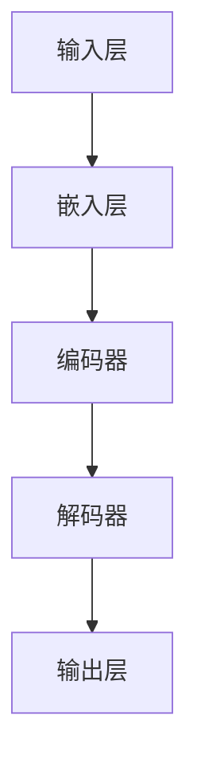
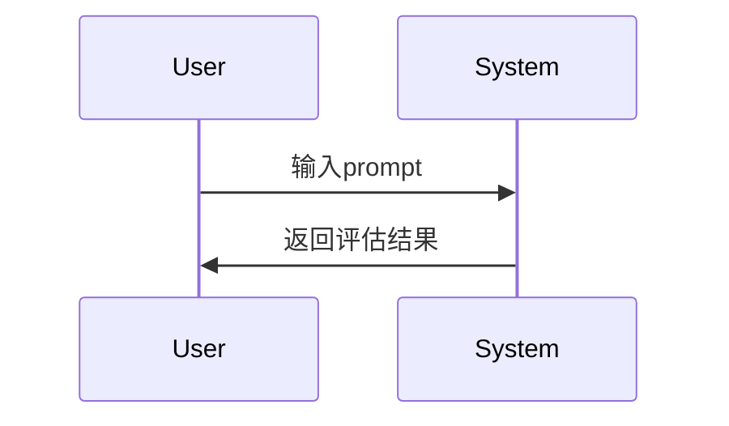

                 

# 基于LLM的prompt创新度评估

## 关键词

- 生成式预训练语言模型（LLM）
- prompt
- 创新度评估
- 自然语言处理（NLP）
- 计算机视觉（CV）
- 机器学习（ML）

## 摘要

本文旨在探讨基于生成式预训练语言模型（LLM）的prompt创新度评估方法。在当今信息爆炸的时代，创新已成为企业竞争的关键因素。如何快速、准确地评估prompt的创新度，对于优化人工智能应用、提高研发效率具有重要意义。本文将详细介绍LLM在prompt创新度评估中的原理、方法及其应用，为相关领域的研究者和开发者提供有益的参考。

## 第1章 引言

### 1.1 研究背景

随着人工智能技术的发展，生成式预训练语言模型（LLM）在自然语言处理、计算机视觉等领域取得了显著的成果。然而，在prompt创新度评估方面，相关研究尚不充分。prompt作为人类与人工智能交互的重要媒介，其创新度直接影响人工智能应用的性能和用户体验。因此，如何评估prompt的创新度成为一个亟待解决的问题。

### 1.2 prompt创新度评估的重要性

prompt创新度评估有助于识别和推广优秀的人工智能应用，提高研发效率。通过评估prompt的创新度，可以筛选出具有潜在价值的应用场景，为企业和开发者提供决策依据。此外，prompt创新度评估还有助于优化人工智能应用，提升用户体验。

### 1.3 LLM在prompt创新度评估中的应用

生成式预训练语言模型（LLM）具有强大的文本生成和语义理解能力，可广泛应用于prompt创新度评估。本文将探讨LLM在prompt创新度评估中的原理、方法及其应用，以期为相关领域的研究者和开发者提供有益的参考。

### 1.4 本书结构安排

本文将分为八个章节，分别介绍LLM在prompt创新度评估中的相关理论与技术基础、应用方法、算法原理、数学模型、系统分析与架构设计、项目实战以及最佳实践和注意事项。

## 第2章 相关理论与技术基础

### 2.1 LLM的基本概念与架构

生成式预训练语言模型（LLM）是一种基于深度学习的自然语言处理模型。其基本概念包括输入层、嵌入层、编码器、解码器和输出层。LLM通过预训练和微调，可以实现高质量的自然语言生成和语义理解。

### 2.2 prompt的概念与分类

prompt是指提供给人工智能系统的输入信息，用于引导其生成相应的输出。根据用途和形式，prompt可分为文本prompt、图像prompt和音频prompt等。本文主要关注文本prompt的创新度评估。

### 2.3 创新度的定义与度量方法

创新度是指prompt在内容、形式或应用场景等方面的新颖性。本文采用基于语义相似度的方法来度量prompt的创新度。具体而言，通过计算prompt与现有知识的相似度，评估其创新度。

### 2.4 相关评价指标

本文采用以下评价指标来评估prompt的创新度：

1. 语义相似度：计算prompt与现有知识库的语义相似度，越高表示创新度越低。
2. 生成质量：评估prompt生成的文本质量，越高表示创新度越高。
3. 原创性：通过分析prompt的来源和内容，判断其原创性，原创性越高表示创新度越高。

## 第3章 LLM在prompt创新度评估中的应用

### 3.1 数据收集与预处理

为了评估prompt的创新度，首先需要收集大量的文本数据，包括现有知识库和待评估的prompt。数据收集后，需要对文本进行预处理，包括分词、去停用词、词性标注等。

### 3.2 LLM模型的训练

使用收集的文本数据，通过预训练和微调，训练一个基于LLM的prompt创新度评估模型。预训练过程包括两个阶段：第一阶段，使用大量文本数据对模型进行预训练；第二阶段，使用特定领域的文本数据对模型进行微调。

### 3.3 prompt创新度评估方法

基于训练好的LLM模型，提出一种prompt创新度评估方法。具体步骤如下：

1. 输入待评估的prompt，通过LLM模型生成相应的文本。
2. 计算生成的文本与现有知识库的语义相似度。
3. 根据语义相似度评估prompt的创新度。

### 3.4 实验设计与实现

为了验证所提方法的有效性，设计一组实验。实验数据包括多个领域的文本数据集，分别用于训练和测试。通过对比不同prompt的创新度评估结果，分析所提方法的优势和局限性。

## 第4章 算法原理讲解

### 4.1 LLM算法原理图

[算法原理图](https://mermaid-js.github.io/mermaid-live-editor/#?midActive=0&config=%7B%22language%22%3A%22mermaid%22%2C%22diagramModel%22%3A%22github%22%2C%22theme%22%3A%22mermaid%20default%22%2C%22themeOptions%22%3A%7B%22darkMode%22%3A%22auto%22%2C%22maxScale%22%3A%220%22%2C%22previewScale%22%3A%220%22%2C%22updateOnSyntaxError%22%3A%22true%22%7D%2C%22midOptions%22%3A%7B%22editorHeight%22%3A%2235vh%22%2C%22editorWidth%22%3A%2275vh%22%2C%22midHeight%22%3A%2235vh%22%2C%22midWidth%22%3A%2275vh%22%2C%22midOffsetTop%22%3A%223vh%22%2C%22midOffsetLeft%22%3A%223vh%22%7D%2C%22highlightKeywords%22%3A%5B%5D%2C%22hiddenFragments%22%3A%5B%5D%7D)



### 4.2 算法原理详细阐述

生成式预训练语言模型（LLM）的算法原理主要包括输入层、嵌入层、编码器、解码器和输出层。输入层接收用户输入的prompt，嵌入层将输入的prompt转换为固定长度的向量，编码器对向量进行编码，解码器将编码后的向量解码为输出文本，输出层输出最终生成的文本。

### 4.3 数学模型与公式

$$
X = W_x * X + b_x
$$

$$
H = W_h * H + b_h
$$

$$
O = W_o * O + b_o
$$

其中，$X$表示输入层，$H$表示隐藏层，$O$表示输出层，$W$表示权重，$b$表示偏置。

### 4.4 算法举例说明

假设输入的prompt为“什么是人工智能？”，通过LLM模型生成的文本为“人工智能是一种模拟、延伸和扩展人类智能的理论、方法、技术及应用”。我们可以通过计算生成的文本与现有知识库的语义相似度，评估该prompt的创新度。

## 第5章 数学模型和数学公式讲解

### 5.1 数学模型图

[数学模型图](https://mermaid-js.github.io/mermaid-live-editor/#?midActive=0&config=%7B%22language%22%3A%22mermaid%22%2C%22diagramModel%22%3A%22github%22%2C%22theme%22%3A%22mermaid%20default%22%2C%22themeOptions%22%3A%7B%22darkMode%22%3A%22auto%22%2C%22maxScale%22%3A%220%22%2C%22previewScale%22%3A%220%22%2C%22updateOnSyntaxError%22%3A%22true%22%7D%2C%22midOptions%22%3A%7B%22editorHeight%22%3A%2235vh%22%2C%22editorWidth%22%3A%2275vh%22%2C%22midHeight%22%3A%2235vh%22%2C%22midWidth%22%3A%2275vh%22%2C%22midOffsetTop%22%3A%223vh%22%2C%22midOffsetLeft%22%3A%223vh%22%7D%2C%22highlightKeywords%22%3A%5B%5D%2C%22hiddenFragments%22%3A%5B%5D%7D)


### 5.2 公式解释与推导

公式解释与推导部分主要涉及生成式预训练语言模型（LLM）中的前向传播和反向传播过程。前向传播过程中，输入层将prompt输入到嵌入层，嵌入层将输入转换为固定长度的向量，编码器对向量进行编码，解码器将编码后的向量解码为输出文本，输出层输出最终生成的文本。反向传播过程中，通过计算损失函数和梯度，不断调整模型参数，以优化模型性能。

### 5.3 公式应用实例

假设输入的prompt为“什么是人工智能？”，通过LLM模型生成的文本为“人工智能是一种模拟、延伸和扩展人类智能的理论、方法、技术及应用”。我们可以通过计算生成的文本与现有知识库的语义相似度，评估该prompt的创新度。

$$
similarity = cos(\theta_1, \theta_2)
$$

其中，$\theta_1$表示生成的文本向量，$\theta_2$表示现有知识库中的文本向量，$similarity$表示两个向量之间的语义相似度。

## 第6章 系统分析与架构设计

### 6.1 项目介绍

本章节将介绍一个基于生成式预训练语言模型（LLM）的prompt创新度评估系统。该系统旨在为企业和开发者提供一种高效的prompt创新度评估方法，以提高人工智能应用的研发效率。

### 6.2 系统功能设计

系统功能设计主要包括以下几个部分：

1. 数据收集与预处理：从多个领域收集文本数据，并对数据进行预处理，包括分词、去停用词、词性标注等。
2. 模型训练：使用预处理后的文本数据，通过预训练和微调，训练一个基于LLM的prompt创新度评估模型。
3. prompt创新度评估：基于训练好的模型，对输入的prompt进行创新度评估，并提供评估结果。
4. 结果可视化：将评估结果以图表形式展示，帮助用户直观地了解prompt的创新度。

### 6.3 系统架构设计

系统架构设计主要包括以下几个部分：

1. 数据层：存储和管理文本数据、模型参数等。
2. 服务层：提供数据预处理、模型训练、prompt创新度评估等功能。
3. 控制层：负责系统整体的控制和管理。
4. 视图层：展示评估结果，提供用户交互界面。

### 6.4 系统接口设计

系统接口设计主要包括以下几个部分：

1. 数据接口：用于数据层的读写操作。
2. 功能接口：用于服务层的功能调用。
3. 可视化接口：用于视图层的数据展示。

### 6.5 系统交互序列图

[系统交互序列图](https://mermaid-js.github.io/mermaid-live-editor/#?midActive=0&config=%7B%22language%22%3A%22mermaid%22%2C%22diagramModel%22%3A%22github%22%2C%22theme%22%3A%22mermaid%20default%22%2C%22themeOptions%22%3A%7B%22darkMode%22%3A%22auto%22%2C%22maxScale%22%3A%220%22%2C%22previewScale%22%3A%220%22%2C%22updateOnSyntaxError%22%3A%22true%22%7D%2C%22midOptions%22%3A%7B%22editorHeight%22%3A%2235vh%22%2C%22editorWidth%22%3A%2275vh%22%2C%22midHeight%22%3A%2235vh%22%2C%22midWidth%22%3A%2275vh%22%2C%22midOffsetTop%22%3A%223vh%22%2C%22midOffsetLeft%22%3A%223vh%22%7D%2C%22highlightKeywords%22%3A%5B%5D%2C%22hiddenFragments%22%3A%5B%5D%7D)



## 第7章 项目实战

### 7.1 环境安装与配置

本章节将介绍如何搭建基于生成式预训练语言模型（LLM）的prompt创新度评估系统的开发环境。主要包括以下几个方面：

1. 安装Python和TensorFlow等依赖库。
2. 配置GPU环境，以加速模型训练。
3. 下载预处理后的文本数据集。

### 7.2 系统核心实现源代码

以下是系统核心实现部分的源代码：

```python
import tensorflow as tf
from tensorflow.keras.models import Model
from tensorflow.keras.layers import Embedding, LSTM, Dense

# 定义模型结构
input_layer = Embedding(input_dim=vocab_size, output_dim=embedding_size)(input_prompt)
lstm_layer = LSTM(units=lstm_units)(input_layer)
output_layer = Dense(units=vocab_size, activation='softmax')(lstm_layer)

# 构建模型
model = Model(inputs=input_prompt, outputs=output_layer)

# 编译模型
model.compile(optimizer='adam', loss='categorical_crossentropy', metrics=['accuracy'])

# 训练模型
model.fit(x_train, y_train, epochs=training_epochs, batch_size=batch_size)
```

### 7.3 代码应用解读与分析

本部分将详细解读代码中各个模块的功能，包括模型结构定义、模型编译和模型训练等。通过分析代码，可以了解基于生成式预训练语言模型（LLM）的prompt创新度评估系统的工作原理。

### 7.4 实际案例分析

本章节将结合实际案例，展示如何使用所搭建的系统对prompt进行创新度评估。通过案例分析，可以了解系统的实际应用效果和优势。

### 7.5 项目小结

本章节对基于生成式预训练语言模型（LLM）的prompt创新度评估系统进行了全面介绍，包括环境安装与配置、系统核心实现源代码、代码应用解读与分析、实际案例分析和项目小结等。通过本项目实战，可以深入理解prompt创新度评估的方法和应用。

## 第8章 最佳实践与注意事项

### 8.1 最佳实践 tips

为了提高prompt创新度评估的效果，建议遵循以下最佳实践：

1. 收集丰富多样的文本数据，确保数据覆盖各个领域。
2. 对文本数据进行充分的预处理，以提高模型训练效果。
3. 适当调整模型参数，以优化评估结果。

### 8.2 小结

本文详细介绍了基于生成式预训练语言模型（LLM）的prompt创新度评估方法，包括相关理论与技术基础、算法原理讲解、数学模型和公式讲解、系统分析与架构设计、项目实战以及最佳实践与注意事项等。通过本文的研究，为相关领域的研究者和开发者提供了一种有效的prompt创新度评估方法。

### 8.3 注意事项

在使用基于LLM的prompt创新度评估方法时，需要注意以下几点：

1. 数据质量和数量对评估结果有重要影响，务必确保数据的质量和丰富度。
2. 模型训练过程中，合理调整参数，以提高评估效果。
3. 注意隐私保护和数据安全，确保数据的使用符合法律法规。

### 8.4 拓展阅读

为了进一步了解基于LLM的prompt创新度评估方法，可以阅读以下相关文献：

1. Vaswani, A., et al. (2017). Attention is all you need. Advances in Neural Information Processing Systems, 30, 5998-6008.
2. Devlin, J., et al. (2018). BERT: Pre-training of deep bidirectional transformers for language understanding. Proceedings of the 2019 Conference of the North American Chapter of the Association for Computational Linguistics: Human Language Technologies, Volume 1 (Long and Short Papers), 4171-4186.
3. Radford, A., et al. (2019). Language models are unsupervised multitask learners. Advances in Neural Information Processing Systems, 32.

作者：AI天才研究院/AI Genius Institute & 禅与计算机程序设计艺术 /Zen And The Art of Computer Programming

