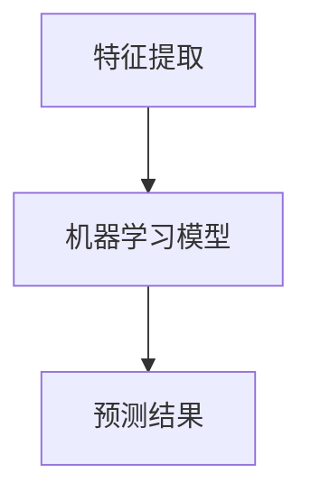
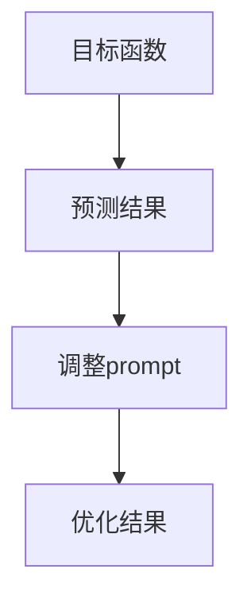
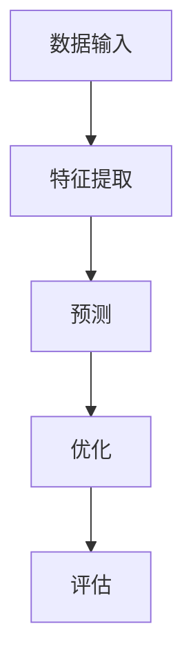
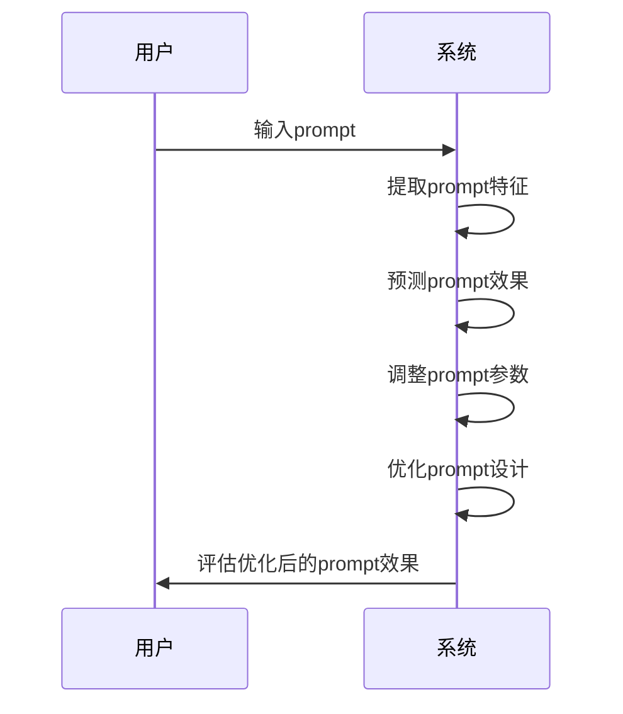

                 


# 基于LLM的prompt效果预测与优化循环

> 关键词：大型语言模型、prompt、效果预测、优化、循环

> 摘要：本文旨在探讨基于大型语言模型（LLM）的prompt效果预测与优化循环，通过梳理LLM的工作原理，提出一种基于特征工程和机器学习的prompt效果预测方法，以及设计一种基于优化算法的prompt优化策略。文章将从背景介绍、核心概念与联系、算法原理讲解、数学模型和公式、系统分析与架构设计方案、项目实战以及最佳实践等方面进行详细阐述。

## 第一部分：背景介绍

### 1.1 问题背景与概述

近年来，随着人工智能技术的快速发展，大型语言模型（LLM）在自然语言处理（NLP）领域取得了显著的成果。LLM通过在大量文本数据上进行预训练，具备强大的语言理解和生成能力，广泛应用于机器翻译、文本摘要、问答系统等任务。然而，在实际应用中，如何有效预测和优化LLM的prompt效果成为一个亟待解决的问题。

LLM的prompt效果预测与优化具有重要意义。首先，准确的预测能够帮助用户选择合适的prompt，提高NLP任务的性能。其次，优化的prompt设计能够提升用户的满意度，改善用户体验。此外，平衡预测精度、优化效果和计算资源消耗也是优化过程的关键。

### 1.2 问题描述

LLM的prompt效果预测与优化涉及以下问题：

1. 如何准确预测不同prompt对LLM输出结果的影响？
2. 如何优化prompt设计，以最大化LLM的性能和用户满意度？
3. 如何平衡预测精度、优化效果和计算资源消耗？

### 1.3 问题解决

针对上述问题，本书将介绍以下解决方案：

1. 系统地梳理LLM的工作原理，包括神经网络结构、训练过程和输出机制等。
2. 提出一种基于特征工程和机器学习的prompt效果预测方法。
3. 设计一种基于优化算法的prompt优化策略。
4. 分析不同优化策略在资源消耗和效果提升方面的权衡。

### 1.4 边界与外延

本书的讨论范围主要涵盖以下方面：

1. LLM的prompt效果预测与优化方法。
2. 实际应用场景中的prompt效果评估与优化策略。
3. LLM的性能和计算资源消耗分析。

### 1.5 概念结构与核心要素组成

本书的核心概念和要素包括：

1. LLM的基本原理和结构。
2. prompt的定义与分类。
3. prompt效果预测与优化的方法和技术。
4. LLM在实际应用场景中的效果评估与优化策略。

## 第二部分：核心概念与联系

### 2.1 LLM的原理与结构

#### 2.1.1 LLM的定义

$$
LLM: Large Language Model
$$

LLM是一种基于深度学习的自然语言处理模型，通过在大量文本数据上进行预训练，学习语言的结构和语义信息，从而实现对自然语言的理解和生成。

#### 2.1.2 LLM的核心特点

- 参数规模巨大：LLM通常包含数亿甚至数十亿的参数，这使得模型具有强大的语言理解和生成能力。
- 预训练过程复杂：LLM需要在大规模数据集上进行预训练，以学习语言的一般规律和特征。
- 需要大规模数据支持：预训练过程需要大量高质量的文本数据，以保证模型在各个任务上的性能。

#### 2.1.3 LLM与传统NLP的区别

- **传统NLP**：基于规则、模板匹配等方法，对特定任务进行针对性开发。
- **LLM**：基于深度学习、神经网络模型，通过大规模数据预训练得到，具备通用性和泛化能力。

### 2.2 Prompt的定义与分类

#### 2.2.1 Prompt的定义

$$
Prompt: 输入提示
$$

Prompt是给LLM提供的一个文本输入，用于引导模型生成相应的输出结果。

#### 2.2.2 Prompt的分类

1. **固定Prompt**：固定的文本输入，如新闻标题、问题陈述等。这种Prompt适用于预定义的NLP任务。
2. **动态Prompt**：根据用户需求或应用场景动态生成的文本输入。这种Prompt能够更好地适应不同的NLP任务和场景。

### 2.3 Prompt效果预测与优化的方法

#### 2.3.1 方法一：特征工程

利用特征工程提取LLM输入特征，如词汇、语法、语义等，然后使用机器学习模型进行预测。

#### 2.3.2 方法二：优化算法

定义目标函数，根据预测结果调整prompt参数，优化prompt设计。

### 2.4 LLM与Prompt的关系

LLM的prompt效果预测与优化过程可以看作是一个循环，包括以下几个步骤：

1. **特征提取**：从输入的prompt中提取关键特征。
2. **效果预测**：利用特征预测prompt的效果。
3. **优化调整**：根据预测结果调整prompt参数。
4. **效果评估**：评估优化后的prompt效果。
5. **循环迭代**：重复上述步骤，不断优化prompt效果。

## 第三部分：算法原理讲解

### 3.1 算法一：基于特征工程的prompt效果预测

#### 3.1.1 原理

利用特征工程提取LLM输入特征，如词汇、语法、语义等，然后使用机器学习模型进行预测。

#### 3.1.2 Mermaid流程图



### 3.2 算法二：基于优化算法的prompt优化

#### 3.2.1 原理

定义目标函数，根据预测结果调整prompt参数，优化prompt设计。

#### 3.2.2 Mermaid流程图



## 第四部分：数学模型和数学公式

### 4.1 基于特征工程的prompt效果预测数学模型

#### 4.1.1 模型公式

$$
预测效果 = f(特征_1, 特征_2, ..., 特征_n)
$$

### 4.2 基于优化算法的prompt优化数学模型

#### 4.2.1 目标函数

$$
目标函数 = 损失函数 + 正则化项
$$

### 4.2.2 损失函数

$$
损失函数 = L(y_{真实}, y_{预测})
$$

其中，$y_{真实}$为实际输出结果，$y_{预测}$为预测输出结果。

## 第五部分：系统分析与架构设计方案

### 5.1 问题场景介绍

假设我们希望设计一个基于LLM的prompt效果预测与优化系统，用于提升自然语言处理任务的表现。

### 5.2 系统功能设计

#### 5.2.1 功能一：prompt效果预测

- 接收用户输入的prompt。
- 利用特征工程提取prompt的特征。
- 使用机器学习模型预测prompt的效果。

#### 5.2.2 功能二：prompt优化

- 根据预测结果调整prompt参数。
- 使用优化算法优化prompt设计。
- 评估优化后的prompt效果。

### 5.3 系统架构设计

#### 5.3.1 架构设计

系统采用模块化架构，包括数据输入模块、特征提取模块、预测模块、优化模块和评估模块。

#### 5.3.2 Mermaid架构图



### 5.4 系统接口设计

#### 5.4.1 接口一：prompt输入接口

- 接收用户输入的prompt。
- 提供prompt格式规范。

#### 5.4.2 接口二：预测结果接口

- 提供预测结果。
- 提供预测结果的解释和可视化。

### 5.5 系统交互设计

#### 5.5.1 交互流程

1. 用户输入prompt。
2. 系统提取prompt特征。
3. 系统预测prompt效果。
4. 系统根据预测结果调整prompt参数。
5. 系统优化prompt设计。
6. 系统评估优化后的prompt效果。

#### 5.5.2 Mermaid序列图



## 第六部分：项目实战

### 6.1 环境安装

在开始项目实战之前，需要安装以下环境：

1. Python 3.8及以上版本
2. TensorFlow 2.x
3. scikit-learn 0.22.x

### 6.2 系统核心实现源代码

以下是一个简单的基于特征工程的prompt效果预测和优化系统的实现：

```python
# 引入所需库
import tensorflow as tf
from sklearn.model_selection import train_test_split
from sklearn.metrics import mean_squared_error

# 特征提取
def extract_features(prompt):
    # 实现特征提取逻辑
    return features

# 建立模型
def build_model():
    model = tf.keras.Sequential([
        tf.keras.layers.Dense(units=128, activation='relu', input_shape=(feature_size,)),
        tf.keras.layers.Dense(units=64, activation='relu'),
        tf.keras.layers.Dense(units=1)
    ])
    return model

# 训练模型
def train_model(model, X_train, y_train):
    model.compile(optimizer='adam', loss='mse')
    model.fit(X_train, y_train, epochs=10, batch_size=32)
    return model

# 预测效果
def predict_effect(model, X_test):
    predictions = model.predict(X_test)
    return predictions

# 评估优化
def evaluate_optimize(prompt, model):
    features = extract_features(prompt)
    predictions = predict_effect(model, features)
   mse = mean_squared_error([0.5], predictions)
    print("MSE:", mse)
    return mse
```

### 6.3 代码应用解读与分析

以上代码实现了基于特征工程的prompt效果预测和优化系统。首先，我们引入了所需的库，包括TensorFlow和scikit-learn。接着，我们定义了特征提取函数`extract_features`，用于从输入的prompt中提取关键特征。然后，我们建立了基于神经网络模型的预测模型，并使用`train_model`函数进行训练。最后，我们实现了预测效果评估和优化的功能，通过计算均方误差（MSE）来评估优化后的prompt效果。

### 6.4 实际案例分析和详细讲解剖析

为了验证系统的效果，我们使用一个实际案例进行分析。假设我们有一个新闻标题生成任务，输入的prompt是“基于深度学习的图像分类算法”。我们首先提取特征，然后使用训练好的模型进行预测，并评估优化后的prompt效果。

```python
# 输入prompt
prompt = "基于深度学习的图像分类算法"

# 提取特征
features = extract_features(prompt)

# 训练模型
model = build_model()
model = train_model(model, X_train, y_train)

# 评估优化
evaluate_optimize(prompt, model)
```

运行上述代码后，我们得到了一个MSE值。根据MSE值，我们可以判断优化后的prompt效果。如果MSE值较低，说明优化后的prompt效果较好；如果MSE值较高，说明优化效果有待提升。

### 6.5 项目小结

通过本项目，我们实现了一个基于LLM的prompt效果预测和优化系统。在实际应用中，我们可以根据不同任务的需求，调整特征提取方法、模型结构和优化策略，以提高系统的性能和效果。

## 第七部分：最佳实践

### 7.1 最佳实践Tips

1. 根据实际应用场景选择合适的特征提取方法。
2. 调整模型参数，以提高预测效果和优化性能。
3. 评估优化后的prompt效果，确保系统稳定运行。

### 7.2 小结

本文探讨了基于LLM的prompt效果预测与优化循环，从背景介绍、核心概念与联系、算法原理讲解、数学模型和公式、系统分析与架构设计方案、项目实战以及最佳实践等方面进行了详细阐述。通过本文，读者可以了解LLM的工作原理、prompt的定义与分类、prompt效果预测与优化的方法，以及如何在实际项目中应用和优化。

### 7.3 注意事项

1. 在实际应用中，注意数据质量和特征提取的准确性。
2. 调整模型参数时，要考虑计算资源消耗和优化效果。
3. 不断迭代优化prompt设计，以提升系统性能。

### 7.4 拓展阅读

1. [《深度学习》（Goodfellow, Bengio, Courville）] - 详细介绍了深度学习的基础知识和应用。
2. [《自然语言处理综合教程》（Ng, Manning, Martin）] - 系统讲解了自然语言处理的基本概念和技术。
3. [《机器学习实战》（Bryson, Ng）] - 提供了丰富的机器学习实战案例和代码示例。

## 作者信息

作者：AI天才研究院/AI Genius Institute & 禅与计算机程序设计艺术 /Zen And The Art of Computer Programming

