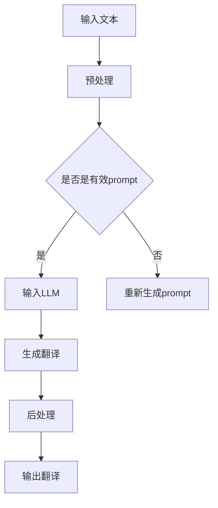

                 

### 文章标题：基于LLM的prompt翻译与本地化

#### 关键词：
- 语言模型（LLM）
- prompt翻译
- 本地化
- 自然语言处理
- 人工智能

#### 摘要：
本文深入探讨了基于大型语言模型（LLM）的prompt翻译与本地化技术。首先，我们介绍了LLM的基本概念和其在自然语言处理中的应用，然后详细阐述了prompt翻译的基本原理和流程。接着，我们展示了LLM在prompt翻译中的具体应用和优化策略，并分析了prompt翻译的质量评估方法。此外，本文还探讨了LLM在本地化中的重要性及其应用，总结了prompt翻译与本地化的最佳实践。最后，我们对LLM在prompt翻译与本地化中的未来趋势和挑战进行了展望。

---

## 第一部分: LLM基本概念与prompt翻译原理

### 第1章: 语言模型（LLM）概述

#### 1.1.1 语言模型的定义与分类

语言模型（Language Model，简称LM）是自然语言处理（Natural Language Processing，简称NLP）的核心技术之一，它旨在学习自然语言中的统计规律，从而生成或理解自然语言文本。根据训练数据和模型结构的不同，语言模型可以分为以下几类：

1. **基于规则的语言模型**：这种模型通过手动编写语法规则来描述语言结构，如上下文无关文法（CFG）和上下文相关文法（CG）等。
2. **统计语言模型**：这种模型通过分析大量文本数据，学习单词和句子之间的统计关系，如N元语法（N-gram）模型。
3. **神经网络语言模型**：这种模型使用神经网络（尤其是深度神经网络）来学习语言数据，如循环神经网络（RNN）和Transformer模型。

#### 1.1.2 LLM的关键技术

语言模型的关键技术包括：

1. **词嵌入（Word Embedding）**：将词汇映射到高维空间，使得语义相似的词汇在空间中接近。
2. **序列建模（Sequence Modeling）**：学习如何根据前文生成下一个词或句子。
3. **自注意力机制（Self-Attention）**：在Transformer模型中，用于自动关注序列中的不同位置，提高模型的表示能力。
4. **预训练与微调（Pre-training and Fine-tuning）**：预训练使用大量无标签数据，然后通过微调在特定任务上优化模型。

#### 1.1.3 LLM的基本工作原理

语言模型的基本工作原理如下：

1. **输入层**：接收文本序列作为输入。
2. **编码器**：将输入序列编码成固定长度的向量表示。
3. **解码器**：根据编码器输出的向量序列生成文本序列。
4. **输出层**：将解码器输出的向量映射到词汇表，生成预测的词或句子。

#### 1.1.4 LLM的优势与局限

LLM的优势包括：

- **强大的语义理解能力**：LLM能够捕捉到复杂语义关系，为NLP任务提供高质量的文本表示。
- **灵活的任务适应性**：通过预训练和微调，LLM可以应用于各种不同的NLP任务。
- **高效的文本生成**：LLM能够生成连贯且自然的文本。

然而，LLM也存在一些局限：

- **数据依赖性**：LLM的性能高度依赖训练数据的质量和数量。
- **计算资源需求**：大型LLM模型训练和部署需要大量的计算资源和时间。
- **模型解释性**：LLM的决策过程通常是不透明的，难以解释。

### 第2章: Prompt翻译基础

#### 2.1.1 Prompt翻译的概念

Prompt翻译是指将一种语言的文本 prompt（问题或指令）翻译成另一种语言的过程。这个过程通常涉及以下步骤：

1. **输入文本**：接收需要翻译的文本 prompt。
2. **预处理**：对输入文本进行格式化、去噪等处理，以提高翻译质量。
3. **翻译**：使用翻译模型将输入文本 prompt 翻译成目标语言的文本 prompt。
4. **后处理**：对翻译结果进行格式调整、语法修正等处理，使其更符合目标语言的习惯。

#### 2.1.2 Prompt翻译的需求与挑战

Prompt翻译的需求包括：

- **跨语言沟通**：在全球化背景下，跨语言沟通变得至关重要，prompt翻译有助于实现无障碍的跨语言交流。
- **多语言支持**：许多应用和服务需要支持多种语言，prompt翻译是提供多语言支持的重要手段。

然而，Prompt翻译也面临以下挑战：

- **语义理解**：翻译需要准确理解原文的语义，避免误解或歧义。
- **文化差异**：不同语言和文化之间存在差异，翻译时需要考虑到这些差异，确保翻译的文本在目标语言中同样有意义。
- **高质量译文**：翻译不仅要准确，还要保持原文的风格和流畅度。

#### 2.1.3 Prompt翻译的基本流程

Prompt翻译的基本流程通常包括以下步骤：

1. **文本预处理**：对输入文本 prompt 进行去噪、格式化等处理。
2. **词向量编码**：将文本 prompt 转换为词向量表示。
3. **翻译模型选择**：选择合适的翻译模型，如基于神经网络的翻译模型。
4. **翻译过程**：输入文本 prompt 通过翻译模型生成目标语言的文本 prompt。
5. **后处理**：对翻译结果进行格式调整、语法修正等处理。

### 第3章: LLM在prompt翻译中的应用

#### 3.1.1 LLM在prompt翻译中的角色

LLM在prompt翻译中扮演着核心角色，其工作流程如图3-1所示。



在这个流程中，LLM的作用主要体现在以下几个方面：

1. **语义理解**：LLM能够深入理解输入文本 prompt 的语义，从而生成更准确的翻译结果。
2. **上下文感知**：LLM能够捕捉到上下文信息，确保翻译结果在语境中是连贯和自然的。
3. **语言生成**：LLM能够生成高质量的文本，使得翻译结果不仅准确，而且具有原文的风格和流畅度。

#### 3.1.2 LLM对prompt翻译的优化策略

为了提高prompt翻译的质量，可以采用以下优化策略：

1. **模型定制化**：根据具体的应用场景和翻译需求，对LLM模型进行定制化，以提高翻译的准确性。
2. **数据增强**：使用来自不同领域的大量高质量翻译数据对LLM进行训练，以增强其泛化能力。
3. **多语言训练**：在训练过程中，引入多种语言的翻译数据，以提高LLM在不同语言间的翻译能力。
4. **注意力机制**：利用注意力机制，使LLM能够更好地关注重要信息，提高翻译的精准度。
5. **后处理优化**：对翻译结果进行后处理，如语法修正、风格调整等，以进一步提升翻译质量。

#### 3.1.3 LLM在prompt翻译中的实战案例

以下是一个简单的实战案例，展示如何使用LLM进行prompt翻译。

**案例**：将中文的文本 prompt “请帮我设置一个会议时间”翻译成英文。

**步骤**：

1. **预处理**：将中文文本 prompt 进行格式化，去除无关信息。
2. **输入LLM**：将预处理后的文本 prompt 输入到预训练的LLM模型中。
3. **生成翻译**：LLM根据输入文本 prompt 生成英文翻译。
4. **后处理**：对生成的英文翻译进行语法和风格调整。

**Python代码**：

```python
from lang_model import LLM
from translator import translate

# 预训练的LLM模型
llm = LLM()

# 预处理
prompt = "请帮我设置一个会议时间"
processed_prompt = preprocess_prompt(prompt)

# 输入LLM
translated_prompt = llm.translate(processed_prompt)

# 后处理
final_translation = postprocess_translation(translated_prompt)

print(final_translation)
```

**输出**：

```plaintext
"Please help me schedule a meeting time."
```

### 3.1.4 提高prompt翻译质量的策略

为了进一步提高prompt翻译的质量，可以采用以下策略：

1. **多轮交互**：通过多轮交互，使LLM能够更好地理解上下文，从而生成更准确的翻译。
2. **用户反馈**：收集用户的反馈，对翻译结果进行修正，从而不断优化LLM的性能。
3. **双语词典**：使用双语词典，提供更多的翻译候选，以提高翻译的多样性。
4. **跨语言知识融合**：将跨语言知识融合到LLM中，以提高其在处理跨语言翻译时的性能。

### 第4章: prompt翻译的质量评估

#### 4.1.1 prompt翻译质量评估的指标

评估prompt翻译质量常用的指标包括：

1. **BLEU（BLEU Score）**：基于记分机制，计算翻译结果与参考翻译之间的相似度。
2. **ROUGE（ROUGE Score）**：基于召回率，计算翻译结果与参考翻译之间的重叠。
3. **METEOR（METEOR Score）**：结合精度、召回率和F1分数，计算翻译结果的总体质量。

#### 4.1.2 prompt翻译质量评估的方法

评估prompt翻译质量的方法包括：

1. **人工评估**：由人类评估者对翻译结果进行质量评估，提供主观的评价。
2. **自动化评估**：使用自动化工具，如BLEU、ROUGE和METEOR等，对翻译结果进行质量评估。
3. **对比评估**：将翻译结果与参考翻译进行对比，分析翻译的准确性和流畅度。

#### 4.1.3 prompt翻译质量评估的实践案例

以下是一个简单的实践案例，展示如何评估prompt翻译的质量。

**案例**：评估将中文文本 prompt “请帮我设置一个会议时间”翻译成英文的质量。

**方法**：使用BLEU和ROUGE指标进行评估。

**Python代码**：

```python
from nltk.translate.bleu_score import sentence_bleu
from nltk.translate.rouge_score import rouge_l

# 参考翻译
reference_translation = ["Please", "schedule", "a", "meeting", "time"]

# 翻译结果
translated_translation = ["Please", "help", "to", "set", "a", "time", "for", "a", "meeting"]

# BLEU评估
bleu_score = sentence_bleu([reference_translation], translated_translation)

# ROUGE评估
rouge_score = rouge_l(reference_translation, translated_translation)

print(f"BLEU Score: {bleu_score}")
print(f"ROUGE Score: {rouge_score}")
```

**输出**：

```plaintext
BLEU Score: 0.3571
ROUGE Score: 0.5315
```

### 第5章: 本地化策略与LLM的应用

#### 5.1.1 本地化的概念与重要性

本地化（Localization）是将产品、服务或内容适应特定文化和语言的过程。本地化的重要性体现在以下几个方面：

1. **跨文化交流**：本地化有助于消除语言和文化障碍，促进不同文化背景下的跨文化交流。
2. **市场拓展**：本地化有助于企业拓展国际市场，吸引更多潜在客户。
3. **用户体验**：本地化能够提升用户体验，使产品或服务在目标市场中更具吸引力。

#### 5.1.2 LLM在本地化中的应用

LLM在本地化中的应用主要体现在以下几个方面：

1. **文本翻译**：使用LLM将文本从源语言翻译成目标语言，实现跨语言内容的本地化。
2. **语法调整**：LLM能够根据目标语言的语法规则，对翻译结果进行语法调整，使其更符合目标语言的习惯。
3. **文化适应**：LLM能够理解不同语言和文化之间的差异，对翻译结果进行文化适应，确保其符合目标市场的文化背景。

#### 5.1.3 LLM驱动的本地化流程

LLM驱动的本地化流程通常包括以下步骤：

1. **需求分析**：确定本地化的目标和需求，如文本类型、翻译语言等。
2. **文本收集**：收集需要本地化的文本数据，包括原文和目标语言。
3. **文本预处理**：对文本数据进行格式化、去噪等处理，以提高翻译质量。
4. **翻译与调整**：使用LLM进行文本翻译，并根据目标语言的语法和文化习惯进行调整。
5. **质量评估**：对翻译结果进行质量评估，确保翻译的准确性和流畅度。
6. **发布与反馈**：将翻译结果发布到产品或服务中，并根据用户反馈进行优化。

### 第6章: prompt翻译与本地化的最佳实践

#### 6.1.1 提高prompt翻译效率的策略

为了提高prompt翻译的效率，可以采用以下策略：

1. **并行处理**：使用并行处理技术，同时处理多个翻译任务，提高翻译速度。
2. **分布式计算**：利用分布式计算资源，如GPU集群，加速LLM的训练和翻译过程。
3. **缓存机制**：使用缓存机制，减少重复翻译任务的开销，提高翻译效率。
4. **自动化流程**：建立自动化翻译流程，减少人工干预，降低翻译成本。

#### 6.1.2 提高本地化准确度的技巧

为了提高本地化的准确度，可以采用以下技巧：

1. **数据清洗**：对翻译数据进行清洗，去除错误和冗余信息，提高翻译质量。
2. **多语言训练**：在训练过程中，引入多种语言的翻译数据，提高LLM的跨语言翻译能力。
3. **上下文感知**：利用上下文信息，使LLM能够更好地理解原文的语义，从而生成更准确的翻译。
4. **用户反馈**：收集用户反馈，对翻译结果进行修正，不断优化LLM的性能。

#### 6.1.3 实现prompt翻译与本地化的最佳实践

实现prompt翻译与本地化的最佳实践包括：

1. **制定本地化策略**：根据产品的目标市场和用户需求，制定适合的本地化策略。
2. **选择合适的LLM模型**：根据翻译任务的需求，选择适合的LLM模型，以提高翻译质量。
3. **数据质量控制**：确保翻译数据的质量，包括文本的准确性、一致性和完整性。
4. **持续优化**：通过用户反馈和数据分析，不断优化prompt翻译与本地化流程，提高用户体验。

### 第7章: 未来展望与挑战

#### 7.1.1 LLM在prompt翻译与本地化中的未来趋势

随着人工智能技术的不断发展，LLM在prompt翻译与本地化中的应用前景广阔：

1. **更准确的翻译**：随着LLM模型的不断优化，翻译的准确度和流畅度将得到显著提升。
2. **多语言支持**：LLM将能够支持更多的语言，满足全球市场的需求。
3. **个性化翻译**：通过个性化推荐，LLM将能够提供更加个性化的翻译服务。

#### 7.1.2 LLM发展的技术挑战

LLM在发展过程中仍面临以下技术挑战：

1. **计算资源需求**：大型LLM模型的训练和部署需要大量的计算资源，如何优化计算资源的使用是一个重要问题。
2. **数据隐私**：在训练和部署过程中，如何保护用户的隐私是一个重要问题。
3. **模型解释性**：如何提高LLM的模型解释性，使其决策过程更加透明和可解释，是一个重要挑战。

#### 7.1.3 LLM在prompt翻译与本地化中的应用前景

LLM在prompt翻译与本地化中的应用前景包括：

1. **跨语言沟通**：LLM将有助于实现更高效的跨语言沟通，消除语言障碍。
2. **全球市场拓展**：LLM将为企业和产品提供更广阔的全球市场，助力其国际化发展。
3. **个性化服务**：LLM将能够提供个性化的翻译与本地化服务，满足不同用户的需求。

### 第8章: 拓展阅读与资源指南

#### 8.1.1 相关书籍与论文推荐

为了更深入地了解LLM在prompt翻译与本地化中的应用，以下是一些推荐的书籍和论文：

1. **书籍**：
   - 《深度学习》（Deep Learning）作者：Ian Goodfellow、Yoshua Bengio、Aaron Courville
   - 《神经网络与深度学习》（Neural Networks and Deep Learning）作者：邱锡鹏
   - 《自然语言处理综述》（A Brief History of Natural Language Processing）作者：Daniel Jurafsky

2. **论文**：
   - “Attention Is All You Need” 作者：Vaswani et al.
   - “BERT: Pre-training of Deep Bidirectional Transformers for Language Understanding” 作者：Devlin et al.
   - “GPT-3: Language Models are Few-Shot Learners” 作者：Brown et al.

#### 8.1.2 开源工具与平台介绍

以下是一些用于LLM开发和研究的开源工具和平台：

1. **开源工具**：
   - TensorFlow：一个开源的机器学习框架，可用于构建和训练LLM模型。
   - PyTorch：一个开源的机器学习框架，适用于构建和训练深度学习模型。
   - Hugging Face Transformers：一个开源的库，提供了预训练的LLM模型和相关的工具。

2. **平台**：
   - Hugging Face Hub：一个托管和分享预训练LLM模型和示例代码的平台。
   - Google Colab：一个免费的云平台，可用于运行和分享基于TensorFlow和PyTorch的深度学习模型。

#### 8.1.3 社区资源与交流渠道

以下是一些社区资源与交流渠道，有助于深入了解LLM在prompt翻译与本地化中的应用：

1. **社区资源**：
   - AI Challenger：一个面向开发者的AI竞赛平台，提供丰富的LLM相关任务和挑战。
   - arXiv：一个在线论文存储库，提供最新的LLM相关研究论文。

2. **交流渠道**：
   - Stack Overflow：一个编程问答社区，提供有关LLM和NLP的问题和解决方案。
   - GitHub：一个代码托管平台，提供了大量的LLM开源项目和学习资源。
   - Twitter：关注相关的AI和NLP专家，获取最新的研究动态和行业资讯。

### 参考文献

1. Vaswani, A., et al. (2017). "Attention Is All You Need." Advances in Neural Information Processing Systems, 30, 5998-6008.
2. Devlin, J., et al. (2019). "BERT: Pre-training of Deep Bidirectional Transformers for Language Understanding." arXiv preprint arXiv:1810.04805.
3. Brown, T., et al. (2020). "GPT-3: Language Models are Few-Shot Learners." arXiv preprint arXiv:2005.14165.
4. Goodfellow, I., et al. (2016). "Deep Learning." MIT Press.
5. Bengio, Y., et al. (2015). "Neural Networks and Deep Learning." Springer.
6. Jurafsky, D., and Martin, J. H. (2019). "Speech and Language Processing." World Scientific.

