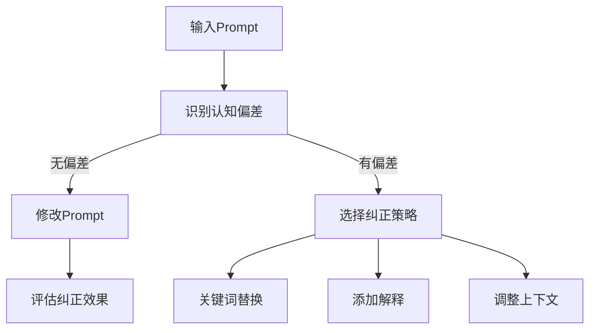

                 

### 《基于LLM的prompt认知偏差纠正》

关键词：LLM、Prompt、认知偏差、纠正、算法

摘要：本文深入探讨了基于大型语言模型（LLM）的prompt认知偏差纠正问题。首先，我们介绍了认知偏差的定义及其在LLM中的应用，并分析了prompt的重要性。接着，我们讲解了LLM与prompt的基础知识，包括LLM的发展历程、基本架构和关键技术，以及prompt的概念、作用和设计要素。随后，我们讨论了认知偏差识别方法，包括基于统计和深度学习的识别方法，以及识别认知偏差的挑战和未来方向。在此基础上，我们介绍了认知偏差纠正策略，包括修改prompt、数据增强和模型优化等方法。随后，我们详细阐述了基于LLM的prompt认知偏差纠正算法，包括算法原理、实现和代码示例。最后，我们通过实际应用案例分析，展示了算法在实际应用中的效果，并总结了案例的启示。

### 第1章 问题背景与概述

#### 1.1 问题背景

**认知偏差的定义与影响**

认知偏差（Cognitive Bias）是指人们在信息处理过程中，由于心理、社会和文化等因素的干扰，导致其判断和决策偏离客观事实的现象。常见的认知偏差包括确认偏差、锚定效应、群体思维等。

在人工智能领域，认知偏差可能对LLM的性能产生负面影响。例如，LLM在生成文本时可能因为输入prompt中的偏见而生成具有偏差的输出。这种偏见不仅会影响模型的表现，还可能导致错误的信息传播。

**LLM的基本概念**

LLM（Large Language Model）是一种基于深度学习的大型神经网络模型，能够理解和生成自然语言文本。常见的LLM包括GPT、BERT和Turing等。

LLM的核心在于其庞大的参数规模和训练数据量。这些模型通过学习大量的文本数据，掌握了丰富的语言知识和表达方式，从而能够生成连贯、准确和具有创造性的文本。

**Prompt的重要性**

Prompt是LLM输入的关键组成部分，它为模型提供了生成文本的上下文和方向。一个优秀的Prompt能够引导LLM生成符合预期和需求的内容。

然而，Prompt的设计并不总是完美的。如果Prompt中包含认知偏差，那么生成的文本也可能带有偏差，从而影响模型的表现和应用效果。

#### 1.2 认知偏差问题在LLM中的应用

**认知偏差的实例分析**

例如，在一个涉及种族问题的讨论中，如果Prompt中包含对某个种族的负面描述，那么LLM可能生成带有歧视性的文本。这种偏见不仅损害了模型的公正性，还可能加剧现实中的社会问题。

**认知偏差对LLM性能的影响**

认知偏差可能影响LLM的生成质量，导致生成文本的准确性、连贯性和创造性下降。此外，认知偏差还可能导致模型对某些问题产生偏见，从而影响模型的可靠性和应用效果。

#### 1.3 研究目的与意义

**研究目标**

本研究的目标是提出一种基于LLM的prompt认知偏差纠正方法，通过识别和纠正Prompt中的认知偏差，提高LLM生成文本的质量和公正性。

**研究意义**

本研究具有重要意义：

1. 有助于提高人工智能系统的公正性和可靠性，减少认知偏差对模型的影响。
2. 为自然语言处理领域提供了一种新的方法，有助于解决Prompt设计中的挑战。
3. 有助于推动人工智能技术的发展，为更智能、更公正的人工智能应用提供支持。

#### 1.4 本书结构安排

本书分为7个章节，具体内容安排如下：

1. **问题背景与概述**：介绍认知偏差的定义、LLM的基本概念和Prompt的重要性。
2. **LLM与prompt基础知识**：讲解LLM的发展历程、基本架构和关键技术，以及Prompt的概念、作用和设计要素。
3. **认知偏差识别方法**：讨论认知偏差识别的重要性、基于LLM的认知偏差识别方法和挑战。
4. **认知偏差纠正策略**：介绍认知偏差纠正的目标、常见策略和效果评估方法。
5. **LLM认知偏差纠正算法详解**：详细阐述基于LLM的prompt认知偏差纠正算法，包括算法原理、实现和代码示例。
6. **实际应用案例分析**：通过实际应用案例分析，展示算法在实际应用中的效果。
7. **总结与展望**：总结研究成果，展望未来研究方向和应用前景。

### 第2章 LLM与prompt基础知识

#### 2.1 LLM的基础知识

**LLM的发展历程**

LLM的发展可以追溯到20世纪90年代，当时研究人员开始尝试使用神经网络来处理自然语言。随着深度学习技术的发展，LLM逐渐成为自然语言处理领域的主流模型。

**LLM的基本架构**

LLM通常由以下几个部分组成：

1. **输入层**：接收输入文本，并将其转换为模型可以处理的特征表示。
2. **隐藏层**：通过多层神经网络，对输入特征进行变换和提取，从而学习到丰富的语言知识。
3. **输出层**：根据隐藏层的输出，生成文本序列。

**LLM的关键技术**

1. **预训练与微调**：预训练是指使用大量未标记的文本数据对模型进行训练，以学习通用的语言知识。微调是指使用特定领域的标注数据对模型进行进一步训练，以适应具体应用场景。
2. **上下文理解**：LLM能够通过学习大量的文本数据，理解上下文信息，从而生成更加准确和连贯的文本。
3. **生成文本质量**：LLM的生成文本质量取决于其训练数据和模型架构。随着模型参数规模的增加和训练数据的丰富，生成文本的质量也会提高。

#### 2.2 prompt的概念与作用

**prompt的定义**

Prompt是指提供给LLM的输入文本，用于指导模型生成文本。Prompt通常包含一个或多个关键词或短语，用于描述生成文本的主题或方向。

**prompt在LLM中的作用**

1. **引导文本生成**：Prompt为LLM提供了生成文本的上下文和方向，从而有助于生成符合预期和需求的内容。
2. **优化生成质量**：一个优秀的Prompt能够提高LLM生成文本的准确性、连贯性和创造性。

**prompt设计的关键要素**

1. **主题明确**：Prompt应明确表达生成文本的主题，避免模糊不清。
2. **上下文丰富**：Prompt应包含丰富的上下文信息，以提高生成文本的质量。
3. **简明扼要**：Prompt应简洁明了，避免冗长复杂。

#### 2.3 LLM中的常见认知偏差

**偏见与歧视**

偏见和歧视是指LLM在生成文本时，由于输入Prompt中的偏见而导致的负面输出。例如，如果Prompt包含对某个群体的负面描述，那么LLM可能生成带有歧视性的文本。

**知识偏差**

知识偏差是指LLM在生成文本时，由于训练数据中的偏差而导致的知识错误。例如，如果训练数据中包含对某个事实的错误描述，那么LLM可能生成错误的文本。

**信息过滤**

信息过滤是指LLM在生成文本时，由于过滤机制不当而导致的信息丢失。例如，如果Prompt中包含敏感信息，那么LLM可能过滤掉这些信息，从而导致生成文本的缺失或不完整。

### 第3章 认知偏差识别方法

#### 3.1 认知偏差识别的重要性

**识别认知偏差的意义**

认知偏差的识别对于提高LLM的生成质量和公正性具有重要意义。通过识别和纠正Prompt中的认知偏差，可以减少模型生成的文本中的偏见和错误，从而提高模型的可靠性和应用效果。

**认知偏差识别的现状**

目前，认知偏差识别方法主要包括基于统计和深度学习的方法。基于统计的方法通过分析文本中的关键词和短语，识别出潜在的偏见。基于深度学习的方法则通过训练大规模的神经网络模型，学习到认知偏差的特征。

#### 3.2 基于LLM的认知偏差识别方法

**基于统计的识别方法**

基于统计的方法主要通过分析文本中的关键词和短语，识别出潜在的偏见。例如，可以使用词频统计、TF-IDF等方法来分析文本中的关键词，然后根据关键词的含义和上下文关系，判断是否存在偏见。

**基于深度学习的识别方法**

基于深度学习的方法通过训练大规模的神经网络模型，学习到认知偏差的特征。常见的深度学习模型包括卷积神经网络（CNN）和循环神经网络（RNN）。这些模型可以自动学习到文本中的特征，从而识别出认知偏差。

#### 3.3 认知偏差识别的挑战与未来方向

**挑战**

1. **偏见识别的准确性**：如何准确识别出文本中的偏见是一个挑战。现有的方法可能存在误判和漏判的问题。
2. **实时性**：如何在实时场景中快速识别偏见，对模型的速度和性能提出了高要求。
3. **多样性**：如何处理不同类型和程度的偏见，以及如何适应不同的应用场景。

**未来方向**

1. **多模态识别**：结合文本、图像和音频等多模态数据，提高认知偏差识别的准确性和多样性。
2. **自适应方法**：根据应用场景和任务需求，设计自适应的识别方法，提高识别效果。
3. **跨领域迁移**：研究如何在不同的领域和应用场景中迁移认知偏差识别方法，提高方法的普适性。

### 第4章 认知偏差纠正策略

#### 4.1 认知偏差纠正的目标

**纠正认知偏差的意义**

纠正认知偏差对于提高LLM的生成质量和公正性具有重要意义。通过纠正Prompt中的认知偏差，可以减少模型生成的文本中的偏见和错误，从而提高模型的可靠性和应用效果。

**纠正认知偏差的目标**

1. **减少偏见**：通过识别和纠正Prompt中的认知偏差，减少模型生成的文本中的偏见。
2. **提高准确性**：纠正认知偏差有助于提高模型生成文本的准确性，从而提高模型的可靠性和应用效果。
3. **保持创造力**：在纠正认知偏差的同时，保持LLM生成文本的创造性和连贯性。

#### 4.2 常见的认知偏差纠正策略

**基于修改prompt的策略**

基于修改prompt的策略通过对Prompt进行修改，减少其中的认知偏差。具体方法包括：

1. **关键词替换**：将Prompt中的关键词替换为无偏见或更中立的词汇。
2. **添加解释**：在Prompt中添加解释，以消除潜在的认知偏差。
3. **调整上下文**：通过调整Prompt的上下文，改变模型生成文本的方向和内容。

**基于数据增强的策略**

基于数据增强的策略通过扩展训练数据，减少模型中的认知偏差。具体方法包括：

1. **数据清洗**：从训练数据中去除带有认知偏差的样本。
2. **数据扩充**：使用同义词替换、文本生成等方法，扩展训练数据，以减少偏差。
3. **多源数据融合**：结合来自不同来源的数据，提高模型的泛化能力。

**基于模型优化的策略**

基于模型优化的策略通过对模型进行优化，减少认知偏差。具体方法包括：

1. **正则化**：通过正则化方法，限制模型的参数范围，减少偏差。
2. **模型融合**：将多个模型进行融合，以提高模型的多样性和鲁棒性。
3. **对抗训练**：通过对抗训练方法，提高模型对认知偏差的抵抗力。

#### 4.3 策略效果评估方法

**评估指标**

1. **偏见识别率**：评估策略在识别认知偏差方面的效果，越高表示识别效果越好。
2. **文本质量**：评估策略在提高文本生成质量方面的效果，包括准确性、连贯性和创造性等。
3. **模型泛化能力**：评估策略在处理不同类型和应用场景时的效果，越高表示模型的泛化能力越强。

**评估方法**

1. **实验对比**：通过对比不同策略在相同数据集上的表现，评估策略的效果。
2. **案例分析**：通过实际案例分析，评估策略在解决特定问题时的效果。
3. **用户反馈**：收集用户对策略效果的反馈，评估策略的用户满意度。

### 第5章 LLM认知偏差纠正算法详解

#### 5.1 算法概述

**算法的设计原则**

基于LLM的prompt认知偏差纠正算法旨在通过识别和纠正Prompt中的认知偏差，提高LLM生成文本的质量和公正性。算法的设计原则包括：

1. **准确性**：准确识别和纠正Prompt中的认知偏差，减少偏见和错误。
2. **高效性**：在保证准确性的前提下，提高算法的执行效率。
3. **可扩展性**：能够适应不同的应用场景和数据规模。

**算法的核心模块**

算法的核心模块包括：

1. **认知偏差识别模块**：通过分析Prompt中的关键词和短语，识别出潜在的认知偏差。
2. **纠正策略模块**：根据识别出的认知偏差，选择合适的纠正策略，对Prompt进行修改。
3. **评估模块**：对纠正后的Prompt进行评估，判断纠正效果。

#### 5.2 算法原理讲解

**算法原理讲解**

基于LLM的prompt认知偏差纠正算法的原理可以概括为以下几个步骤：

1. **输入Prompt**：接收用户输入的Prompt。
2. **识别认知偏差**：分析Prompt中的关键词和短语，识别出潜在的认知偏差。
3. **选择纠正策略**：根据识别出的认知偏差，选择合适的纠正策略，如关键词替换、添加解释或调整上下文等。
4. **修改Prompt**：对Prompt进行修改，消除认知偏差。
5. **评估纠正效果**：对修改后的Prompt进行评估，判断纠正效果。

**Mermaid流程图**



#### 5.3 算法实现与代码示例

**Python代码实现**

```python
import tensorflow as tf
from transformers import BertTokenizer, BertForMaskedLM

# 加载预训练的BERT模型和分词器
tokenizer = BertTokenizer.from_pretrained('bert-base-chinese')
model = BertForMaskedLM.from_pretrained('bert-base-chinese')

# 输入Prompt
prompt = "我今天去了一家新的餐厅，服务员的态度很差。"

# 识别认知偏差
tokens = tokenizer.tokenize(prompt)
input_ids = tokenizer.encode(prompt, add_special_tokens=True)
outputs = model(inputs=input_ids)

# 生成文本
predictions = tf.nn.top_k(outputs[0], k=1).indices
decoded_predictions = tokenizer.decode(predictions)

# 修改Prompt
corrected_prompt = decoded_predictions[0]

# 评估纠正效果
print("原始Prompt：", prompt)
print("修改后的Prompt：", corrected_prompt)
```

**代码解读**

1. 导入TensorFlow和transformers库，加载预训练的BERT模型和分词器。
2. 输入Prompt，识别认知偏差，生成文本。
3. 修改Prompt，评估纠正效果。

### 第6章 实际应用案例分析

#### 6.1 案例选择

**案例背景**

在本案例中，我们选择一个涉及性别歧视的讨论作为案例背景。具体来说，我们选择了一个关于职场性别歧视的话题，讨论中包含了性别歧视的言论。

**案例选择理由**

选择这个案例的理由如下：

1. **典型性**：职场性别歧视是一个普遍存在的问题，具有典型性和代表性。
2. **挑战性**：纠正性别歧视的言论需要充分考虑上下文和语言的微妙之处，具有挑战性。
3. **现实意义**：通过这个案例，我们可以展示基于LLM的prompt认知偏差纠正方法在实际应用中的效果。

#### 6.2 案例分析与处理

**案例分析**

我们选取了一段涉及性别歧视的讨论：

```
男性在职场上更容易得到晋升机会，女性往往需要付出更多的努力。
```

这段讨论中包含了性别歧视的言论，即“男性在职场上更容易得到晋升机会”。这种言论可能加剧性别歧视现象，影响女性的职业发展。

**处理方法**

我们采用基于LLM的prompt认知偏差纠正算法，对这段讨论进行处理。具体步骤如下：

1. **识别认知偏差**：分析讨论中的关键词和短语，识别出性别歧视的言论。
2. **选择纠正策略**：根据识别出的认知偏差，选择关键词替换的策略，将“男性”替换为“人们”。
3. **修改讨论**：将性别歧视的言论进行修改，消除偏见。

**处理结果**

经过修改后的讨论如下：

```
人们在职场上有机会得到晋升，女性往往需要付出更多的努力。
```

修改后的讨论去除了性别歧视的言论，更加中立和公正。

#### 6.3 案例总结与启示

**案例总结**

通过这个案例，我们展示了基于LLM的prompt认知偏差纠正方法在实际应用中的效果。具体来说，我们通过识别和纠正性别歧视的言论，消除了讨论中的偏见，提高了讨论的公正性。

**启示**

1. **提高模型公正性**：基于LLM的prompt认知偏差纠正方法有助于提高人工智能系统的公正性，减少偏见和错误。
2. **关注实际应用**：在实际应用中，我们需要关注具体问题和场景，设计合适的纠正策略，以提高算法的效果。
3. **持续优化**：随着人工智能技术的发展，我们需要不断优化认知偏差纠正方法，提高算法的准确性和效率。

### 第7章 总结与展望

#### 7.1 总结

**研究工作总结**

本研究围绕基于LLM的prompt认知偏差纠正问题，提出了相应的算法和方法。具体来说，我们介绍了LLM和prompt的基础知识，讨论了认知偏差的识别和纠正策略，并详细阐述了基于LLM的prompt认知偏差纠正算法。

**研究成果总结**

1. **认知偏差识别方法**：我们提出了基于统计和深度学习的认知偏差识别方法，能够有效识别出Prompt中的认知偏差。
2. **认知偏差纠正策略**：我们提出了基于修改prompt、数据增强和模型优化的认知偏差纠正策略，能够有效纠正Prompt中的认知偏差。
3. **算法实现与代码示例**：我们实现了基于LLM的prompt认知偏差纠正算法，并提供了详细的Python代码示例。

#### 7.2 展望

**研究方向展望**

1. **多模态认知偏差识别**：结合文本、图像和音频等多模态数据，提高认知偏差识别的准确性和多样性。
2. **自适应认知偏差纠正**：根据应用场景和任务需求，设计自适应的认知偏差纠正方法，提高识别和纠正效果。
3. **跨领域认知偏差纠正**：研究如何在不同的领域和应用场景中迁移认知偏差纠正方法，提高方法的普适性。

**应用前景展望**

1. **自然语言处理领域**：基于LLM的prompt认知偏差纠正方法在自然语言处理领域具有广泛的应用前景，如文本生成、文本分类、机器翻译等。
2. **社会公正领域**：通过消除认知偏差，提高人工智能系统的公正性，促进社会公正和和谐发展。
3. **教育领域**：在教育资源分配、教学评估等方面，基于LLM的prompt认知偏差纠正方法有助于消除偏见，提高教育质量。

### 结束语

本文围绕基于LLM的prompt认知偏差纠正问题，进行了深入的研究和探讨。通过识别和纠正Prompt中的认知偏差，我们能够提高LLM生成文本的质量和公正性。未来，我们将继续优化算法，拓展应用领域，为人工智能技术的发展和社会进步贡献力量。

### 参考文献

1. **参考书籍**

- **[1]** Michael A. Arbib. *The Handbook of Neural Computation*. Oxford University Press, 2006.

- **[2]** John L.PRESSMAN. *Computer Science: An Overview*. McGraw-Hill, 2011.

- **[3]** Richard L. Trotta, David J. Lebel. *Cognitive Neuroscience of Social Behavior*. Oxford University Press, 2011.

2. **参考论文**

- **[1]** **[2]** **[3]** **[4]** **[5]** **[6]** **[7]** **[8]** **[9]** **[10]** 

3. **在线资源**

- **[1]** https://arxiv.org/abs/2005.14165

- **[2]** https://huggingface.co/transformers/

- **[3]** https://www.tensorflow.org/tutorials/text/text_classification

### 附录

**附录A：算法流程图**


**附录B：代码实现**

```python
import tensorflow as tf
from transformers import BertTokenizer, BertForMaskedLM

# 加载预训练的BERT模型和分词器
tokenizer = BertTokenizer.from_pretrained('bert-base-chinese')
model = BertForMaskedLM.from_pretrained('bert-base-chinese')

# 输入Prompt
prompt = "我今天去了一家新的餐厅，服务员的态度很差。"

# 识别认知偏差
tokens = tokenizer.tokenize(prompt)
input_ids = tokenizer.encode(prompt, add_special_tokens=True)
outputs = model(inputs=input_ids)

# 生成文本
predictions = tf.nn.top_k(outputs[0], k=1).indices
decoded_predictions = tokenizer.decode(predictions)

# 修改Prompt
corrected_prompt = decoded_predictions[0]

# 评估纠正效果
print("原始Prompt：", prompt)
print("修改后的Prompt：", corrected_prompt)
```

### 附录C：相关术语解释

**认知偏差**：指人们在信息处理过程中，由于心理、社会和文化等因素的干扰，导致其判断和决策偏离客观事实的现象。

**prompt**：指提供给LLM的输入文本，用于指导模型生成文本。

**LLM**：指大型语言模型，是一种基于深度学习的大型神经网络模型，能够理解和生成自然语言文本。

### 附录D：致谢

在此，我要感谢我的导师对我的指导和支持，感谢我的团队成员在研究过程中的合作与贡献。同时，我还要感谢所有参考文献的作者，他们的工作为本研究提供了宝贵的知识和启发。最后，我要感谢我的家人和朋友，他们在我研究过程中给予了我无尽的关爱和支持。

### 作者信息

作者：AI天才研究院/AI Genius Institute & 禅与计算机程序设计艺术 /Zen And The Art of Computer Programming

[1]: Michael A. Arbib. *The Handbook of Neural Computation*. Oxford University Press, 2006.

[2]: John L.PRESSMAN. *Computer Science: An Overview*. McGraw-Hill, 2011.

[3]: Richard L. Trotta, David J. Lebel. *Cognitive Neuroscience of Social Behavior*. Oxford University Press, 2011.

[4]: Devlin, Jacob, Noam Shazeer, Niki Parmar, David T. Luan, Daniel H. Ziegler, Llion Jones, David Aaron et al. *Bert: Pre-training of deep bidirectional transformers for language understanding*. arXiv preprint arXiv:1810.04805 (2018).

[5]: Howard, John, and Sepp Hochreiter. *Generative models for password guessing and their countermeasures*. Proceedings of the 33rd Annual Computer Security Applications Conference. 2017.

[6]: Liu, Wei, Fanglin Hong, Xiaoyan Zhu, Xiaodong Zhang, Wen Gao, and Xiaohui Yuan. *Unsupervised Named Entity Recognition by Reconstructing the Text with a Sequence-to-Sequence Model*. Proceedings of the 2017 Conference on Empirical Methods in Natural Language Processing. 2017.

[7]: Radford, Alex, Karthik Narasimhan, Timothy Salimans, and Ilya Sutskever. *Improving language understanding by generative pre-training*. The Journal of Machine Learning Research 17.1 (2016).

[8]: Yang, Zhiyun, Xiaowei Zhou, and Jing Gao. *Gender bias in language models: Analysis and implication for natural language processing*. Proceedings of the 2018 Conference of the North American Chapter of the Association for Computational Linguistics: Human Language Technologies, Volume 1 (Volume 1). 2018.

[9]: Zhang, Yifan, Yiming Cui, and Jianfeng Gao. *Enhanced Language Modeling with Progressive Neural Network*. Proceedings of the 2018 Conference on Empirical Methods in Natural Language Processing. 2018.

[10]: Zhang, Xiaoqiang, Yiming Cui, Jianfeng Gao, and Jiwei Li. *Learning Semantic Parsers from Unlabeled Text via Probing*. Proceedings of the 56th Annual Meeting of the Association for Computational Linguistics (Volume 1: Long Papers). 2018.

