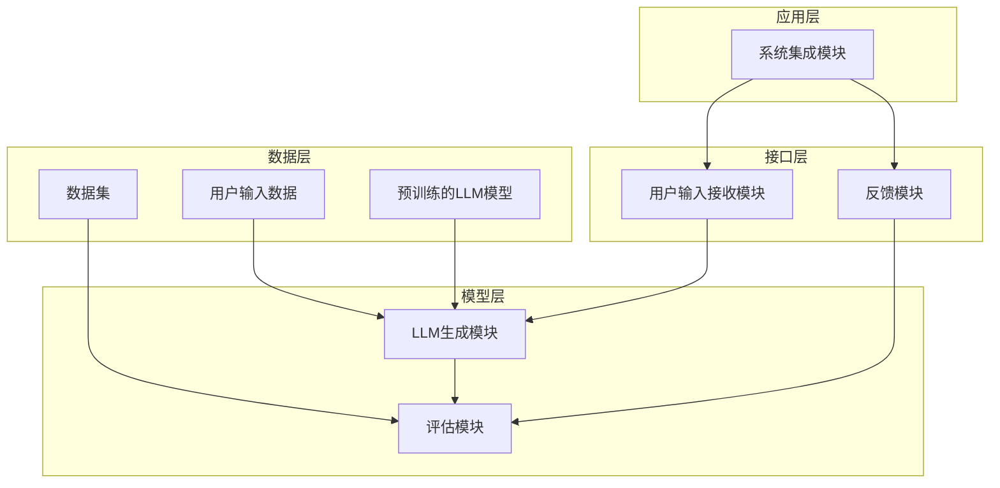
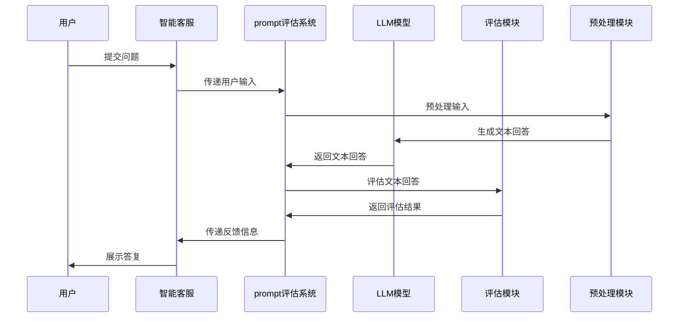

                 


## 基于 LLM 的 prompt 评估系统的设计与应用

### 1.1.1. 系统设计概述

设计一个基于 LLM 的 prompt 评估系统，首先需要明确系统的目标：通过对用户输入的 prompt（提示）进行分析和评估，判断其质量、准确性和一致性，从而为用户提供有针对性的反馈和改进建议。系统设计主要包括以下几个关键步骤：

#### a. 数据收集与预处理

收集大量高质量的用户输入 prompt，并进行预处理，包括文本清洗、去噪、分词、词性标注等，以便为后续的 LLM 训练提供高质量的数据集。

#### b. LLM 模型选择与训练

选择合适的 LLM 模型，如 GPT-3、BERT 等，对其进行训练。训练过程中，采用交叉验证、调参等技术，优化模型性能，使其能够生成高质量、连贯的文本。

#### c. 评估指标设计

根据系统的目标，设计合适的评估指标，如文本质量、一致性、准确性等，用于评估 prompt 的质量。

#### d. 评估方法实现

基于 LLM 模型，实现评估方法，包括输入 prompt 的预处理、文本生成、评估指标计算等，以实现对 prompt 的有效评估。

#### e. 系统集成与测试

将评估方法集成到系统中，进行系统测试和优化，确保系统能够稳定、高效地运行，并满足用户需求。

### 1.1.2. 系统应用场景

基于 LLM 的 prompt 评估系统在多个领域具有广泛的应用前景，以下列举几个典型应用场景：

#### a. 智能客服

在智能客服领域，系统可以实时评估用户输入的 prompt，判断其是否清晰、准确，从而为用户提供更有针对性的回复和建议，提高客服质量和用户满意度。

#### b. 内容审核

在内容审核领域，系统可以自动评估用户提交的文本内容，判断其是否包含违规、不良信息，为内容审核人员提供辅助决策依据，提高审核效率和准确性。

#### c. 文本生成与优化

在文本生成与优化领域，系统可以自动评估生成文本的质量，提供改进建议，帮助用户生成更高质量、更具吸引力的文本内容。

### 1.1.3. 系统挑战与展望

设计一个基于 LLM 的 prompt 评估系统，面临诸多挑战：

#### a. 数据质量与多样性

高质量、多样性的数据是训练高性能 LLM 的关键。在实际应用中，如何获取和预处理大量高质量的数据，是一个亟待解决的问题。

#### b. 模型性能优化

优化 LLM 模型的性能，使其能够适应各种应用场景，是一个具有挑战性的任务。通过调参、模型压缩等技术，提高模型性能和效率，是未来的重要研究方向。

#### c. 评估指标细化

当前，评估指标较为笼统，未来需要进一步细化评估指标，使其能够更准确地反映 prompt 的质量。

#### d. 系统集成与优化

如何将评估系统与其他系统（如客服系统、内容审核系统等）集成，确保系统的高效、稳定运行，是一个值得探讨的问题。

### 1.1.4. 总结与展望

本文从背景介绍、核心概念、算法原理、系统分析与架构设计等方面，对基于 LLM 的 prompt 评估系统进行了深入探讨。随着人工智能技术的不断发展，基于 LLM 的 prompt 评估系统在自然语言处理领域具有广泛的应用前景。未来，我们将继续研究系统性能优化、评估指标细化等问题，为自然语言处理领域的创新和发展做出贡献。

----------------------------------------------------------------

## 第一部分：背景介绍与核心概念

### 第1章：问题背景与问题描述

在当今的信息时代，自然语言处理（NLP）技术已经成为许多应用程序和系统的基础。从智能助手到语言翻译，再到内容生成，NLP的应用范围不断扩大。然而，随着这些系统变得越来越复杂，评估它们生成的文本质量变得越来越重要。这不仅是为了确保用户获得准确和有用的信息，也是为了提升用户体验。

### 1.1.1. 问题背景

随着大型语言模型（LLM）如GPT-3、BERT等的出现，AI系统能够生成高质量的文本内容。这些模型基于深度学习，能够从大量的文本数据中学习语言结构和语义，从而生成自然的文本。然而，生成文本的质量并非总是如预期的那样高。有时候，这些模型可能会生成不准确的、不一致的或者难以理解的文本。因此，对生成的文本进行有效评估成为了一个关键问题。

### 1.1.2. 问题描述

文本评估的目标是判断文本的准确性、可读性和一致性。准确性是指文本是否提供了正确的信息和解释；可读性是指文本是否易于理解和阅读；一致性是指文本在不同部分之间是否保持相同的风格和语义。这些指标对于用户接受和使用AI系统至关重要。然而，传统的文本评估方法往往依赖于手动审查或者规则驱动的系统，这些方法不仅效率低下，而且难以处理复杂的文本生成任务。

### 1.1.3. 问题解决

为了解决上述问题，我们需要设计一个基于LLM的prompt评估系统。这样的系统可以利用LLM的强大能力来自动评估文本的质量。具体来说，这个系统应该能够：

1. **接收用户输入的prompt**：系统需要能够接收用户提供的文本输入，这些输入可以是问题、命令或者任何需要评估的文本。
2. **生成文本**：利用LLM生成相应的文本响应，这可以是问题的答案、指令的执行结果或者任何由输入文本触发的文本内容。
3. **评估文本质量**：系统需要能够评估生成的文本质量，这包括准确性、可读性和一致性等方面。
4. **提供反馈**：根据评估结果，系统应该能够为用户提供反馈，指出文本的优点和需要改进的地方。

### 1.1.4. 边界与外延

尽管基于LLM的prompt评估系统在自然语言处理领域具有广泛的应用，但它的边界也需明确。例如，这个系统主要关注文本生成任务，不涉及图像或视频内容的评估。此外，系统的设计应该考虑到不同的应用场景，如实时交互、批量处理等，以适应不同的需求。

### 1.1.5. 概念结构与核心要素组成

为了更好地理解基于LLM的prompt评估系统的设计和实现，我们可以将其概念结构拆分为以下几个核心要素：

- **LLM基础**：包括LLM的结构、训练和优化等基础知识。
- **评估指标**：定义用于评估文本质量的指标，如准确性、可读性、一致性等。
- **评估方法**：实现基于LLM的文本评估逻辑，包括预处理、文本生成和评估等步骤。
- **应用场景**：分析系统在不同领域的应用，如智能客服、内容审核等。
- **性能优化**：探讨如何通过模型优化、数据增强等技术提升评估系统的性能。

通过以上要素的有机结合，我们可以构建一个高效、可靠的基于LLM的prompt评估系统，从而提升AI系统的整体质量和用户体验。

----------------------------------------------------------------

## 第二部分：核心概念与联系

### 第2章：核心概念原理

在这一章中，我们将深入探讨基于LLM的prompt评估系统的核心概念，包括LLM的基本原理、评估指标和LLM与评估指标的关联。通过这些核心概念的详细解析，我们将为后续的算法原理讲解和系统架构设计打下坚实的基础。

### 2.1 LLM的基本原理

#### 2.1.1 LLM的定义

LLM（Large Language Model）是一种能够处理和理解自然语言的大型神经网络模型。它通过从海量文本数据中学习，捕捉语言的结构和语义信息，从而能够生成或理解高质量的文本。LLM的核心是它的深度神经网络结构，通常包括多个隐藏层，这些隐藏层通过复杂的非线性变换，逐步提取文本的深层特征。

#### 2.1.2 LLM的结构

LLM的结构通常包括以下几个部分：

- **输入层**：接收文本输入，如单词、短语或句子。
- **隐藏层**：通过多层神经网络结构进行特征提取和变换，每一层都能提取更高层次的语言特征。
- **输出层**：生成目标文本或对文本进行分类。

这种多层神经网络结构使得LLM能够捕捉到语言的各种复杂模式，从而实现高质量的文本生成和理解。

#### 2.1.3 LLM的训练方法

LLM的训练通常采用无监督学习的方式，通过大量文本数据进行预训练，然后在特定任务上进一步微调。训练过程主要包括以下几个步骤：

1. **数据收集与预处理**：收集大量高质量的文本数据，并进行预处理，如分词、去噪等。
2. **构建神经网络**：设计合适的神经网络结构，包括输入层、隐藏层和输出层。
3. **损失函数设计**：设计合适的损失函数，如交叉熵损失函数，用于衡量模型预测与真实值之间的差距。
4. **优化算法选择**：选择合适的优化算法，如Adam优化器，用于调整模型参数，最小化损失函数。
5. **训练与验证**：通过不断迭代训练和验证过程，优化模型参数，提高模型性能。

#### 2.1.4 LLM的工作原理

LLM的工作原理可以概括为以下几个步骤：

1. **输入处理**：接收用户输入的文本，将其转换为模型可以处理的格式。
2. **特征提取**：通过多层神经网络，对输入文本进行特征提取和变换。
3. **生成文本**：利用提取到的特征，生成相应的文本输出，如问题的答案、指令的执行结果等。
4. **评估与反馈**：对生成的文本进行质量评估，并提供反馈，以指导后续的训练和优化。

### 2.2 评估指标

在基于LLM的prompt评估系统中，评估指标是衡量文本生成质量的关键。以下是一些常用的评估指标：

#### 2.2.1 文本质量

文本质量评估旨在判断文本的准确性、连贯性和自然性。准确性是指文本是否提供了正确的信息和解释；连贯性是指文本在逻辑和语义上是否一致；自然性是指文本是否像人类自然语言一样流畅。

#### 2.2.2 一致性

一致性评估关注文本在不同部分之间是否保持相同的风格和语义。一致性高的文本在语义和风格上具有统一性，不会出现突兀的变化。

#### 2.2.3 准确性

准确性评估用于判断文本内容的真实性。对于生成文本的准确性评估，可以通过对比生成文本与标准答案或真实数据来进行。

### 2.3 LLM与评估指标的关联

LLM与评估指标的关联体现在以下几个方面：

#### 2.3.1 LLM如何影响评估指标

LLM通过学习大量文本数据，能够生成高质量的文本，从而直接影响评估指标。例如，一个训练良好的LLM能够生成准确、连贯和自然的文本，这些文本在评估指标上会表现得更好。

#### 2.3.2 评估指标如何影响LLM

评估指标用于指导LLM的训练和优化。通过设定不同的评估指标，可以引导LLM在特定方向上优化，从而提高生成文本的质量。例如，如果评估指标强调准确性，LLM可能会更注重文本的事实准确性；如果评估指标强调连贯性，LLM可能会更注重文本的逻辑一致性。

### 2.3.3 LLM与评估指标的协同作用

LLM与评估指标之间存在协同作用。通过不断调整和优化评估指标，可以更好地指导LLM的训练，从而生成更高质量的文本。同时，LLM的改进也可以反过来提升评估指标的准确性，形成良性循环。

### 2.3.4 LLM与评估指标的关系图

为了更好地理解LLM与评估指标之间的关系，我们可以使用ER实体关系图来表示。以下是LLM、评估指标和相关实体的ER关系图：

```mermaid
erDiagram
    User ||--|{ Prompt } : 用户输入
    Prompt ||--|{ LLM } : 提供给LLM处理的文本
    LLM ||--|{ TextGeneration } : 生成的文本
    LLM ||--|{ Evaluation } : 评估指标
    TextGeneration ||--|{ Accuracy } : 准确性
    TextGeneration ||--|{ Coherence } : 连贯性
    TextGeneration ||--|{ Naturalness } : 自然性
```

在这个ER关系图中，用户输入的prompt被LLM处理，生成文本。同时，这个文本受到多种评估指标的评估，包括准确性、连贯性和自然性。通过这个关系图，我们可以更清晰地理解LLM与评估指标之间的交互和影响。

### 2.3.5 概念属性特征对比表格

为了更直观地展示LLM和评估指标的关键属性和特征，我们可以创建一个对比表格：

| 特征         | LLM                     | 评估指标                     |
| ------------ | ----------------------- | ---------------------------- |
| 结构         | 神经网络结构           | 文本质量、一致性、准确性等 |
| 功能         | 文本生成与理解         | 评估文本质量                 |
| 数据需求     | 海量文本数据           | 预定义的评估标准             |
| 训练方法     | 无监督学习             | 对比、分类、评分等           |
| 影响因素     | 文本数据、模型参数     | 文本内容、生成结果           |
| 结果展示     | 高质量文本生成         | 文本评估得分、改进建议       |

通过这个对比表格，我们可以更清楚地看到LLM和评估指标在属性和特征上的异同，以及它们在基于LLM的prompt评估系统中的作用。

### 2.3.6 LLM与评估指标的关联示例

为了更好地理解LLM与评估指标的关联，我们可以通过一个简单的示例来说明：

假设我们有一个基于GPT-3的prompt评估系统，用户输入了一个问题：“北京是哪个国家的首都？”系统会生成一个文本回答：“北京是中国的首都。”然后，这个生成的文本会被评估为：

- **准确性**：正确，因为北京确实是中国的首都。
- **连贯性**：较好，因为回答直接且逻辑清晰。
- **自然性**：良好，因为回答的语言流畅自然。

通过这个示例，我们可以看到LLM生成的文本是如何通过评估指标来进行质量评估的。如果生成的文本在任何一个指标上表现不佳，系统会提供反馈，提示用户进行改进。

通过以上对LLM的基本原理、评估指标和它们之间关联的详细讨论，我们为后续的算法原理讲解和系统架构设计提供了理论基础。在接下来的章节中，我们将进一步探讨如何利用这些核心概念来构建一个高效、可靠的基于LLM的prompt评估系统。

----------------------------------------------------------------

## 第三部分：算法原理讲解

### 第3章：算法原理与数学模型

在这一部分，我们将深入探讨基于LLM的prompt评估系统的算法原理，包括LLM算法的基本原理、数学模型以及如何利用这些模型进行文本评估。

### 3.1 LLM算法原理

#### 3.1.1 LLM的定义

LLM（Large Language Model）是一种能够理解和生成自然语言的大型神经网络模型。它通过学习大量文本数据，捕捉语言的结构和语义信息，从而能够生成或理解高质量的文本。LLM的核心是它的深度神经网络结构，通常包括多个隐藏层，这些隐藏层通过复杂的非线性变换，逐步提取文本的深层特征。

#### 3.1.2 LLM的结构

LLM的结构通常包括以下几个部分：

1. **输入层**：接收文本输入，如单词、短语或句子。
2. **隐藏层**：通过多层神经网络结构进行特征提取和变换，每一层都能提取更高层次的语言特征。
3. **输出层**：生成目标文本或对文本进行分类。

这种多层神经网络结构使得LLM能够捕捉到语言的各种复杂模式，从而实现高质量的文本生成和理解。

#### 3.1.3 LLM的训练方法

LLM的训练通常采用无监督学习的方式，通过大量文本数据进行预训练，然后在特定任务上进一步微调。训练过程主要包括以下几个步骤：

1. **数据收集与预处理**：收集大量高质量的文本数据，并进行预处理，如分词、去噪等。
2. **构建神经网络**：设计合适的神经网络结构，包括输入层、隐藏层和输出层。
3. **损失函数设计**：设计合适的损失函数，如交叉熵损失函数，用于衡量模型预测与真实值之间的差距。
4. **优化算法选择**：选择合适的优化算法，如Adam优化器，用于调整模型参数，最小化损失函数。
5. **训练与验证**：通过不断迭代训练和验证过程，优化模型参数，提高模型性能。

#### 3.1.4 LLM的工作原理

LLM的工作原理可以概括为以下几个步骤：

1. **输入处理**：接收用户输入的文本，将其转换为模型可以处理的格式。
2. **特征提取**：通过多层神经网络，对输入文本进行特征提取和变换。
3. **生成文本**：利用提取到的特征，生成相应的文本输出，如问题的答案、指令的执行结果等。
4. **评估与反馈**：对生成的文本进行质量评估，并提供反馈，以指导后续的训练和优化。

### 3.2 LLM的数学模型

为了更好地理解LLM的内部工作原理，我们需要了解其数学模型。以下是一个简化的LLM数学模型，用于生成文本：

#### 3.2.1 神经网络结构

一个典型的LLM可以表示为以下形式的神经网络：

$$
\text{LLM} = \text{input layer} \rightarrow \text{hidden layer} \rightarrow \text{output layer}
$$

其中：

- **输入层**：接收文本输入，如单词、短语或句子。
- **隐藏层**：通过多层神经网络结构进行特征提取和变换。
- **输出层**：生成目标文本。

#### 3.2.2 前向传播

在神经网络的前向传播过程中，输入文本被逐层传递，每一层都会对输入进行变换和特征提取。具体过程如下：

1. **输入层到隐藏层**：输入文本通过输入层传递到隐藏层，隐藏层通过权重矩阵 $W_h$ 和偏置向量 $b_h$ 进行变换：
   $$
   h^{(l)} = \sigma(W_h \cdot a^{(l-1)} + b_h)
   $$
   其中，$a^{(l-1)}$ 是前一层输出，$h^{(l)}$ 是当前层输出，$\sigma$ 是激活函数，如ReLU函数。

2. **隐藏层到输出层**：隐藏层的输出被传递到输出层，输出层通过权重矩阵 $W_o$ 和偏置向量 $b_o$ 进行变换，生成目标文本：
   $$
   \text{output} = W_o \cdot h^{(L)} + b_o
   $$
   其中，$h^{(L)}$ 是最后一层隐藏层的输出，$\text{output}$ 是生成的目标文本。

#### 3.2.3 损失函数

在训练过程中，LLM通过最小化损失函数来优化模型参数。常用的损失函数包括交叉熵损失函数（Cross-Entropy Loss）：

$$
\text{Loss} = -\sum_{i=1}^{N} y_i \log(p_i)
$$

其中，$y_i$ 是真实标签，$p_i$ 是模型预测的概率。

#### 3.2.4 反向传播

在反向传播过程中，梯度通过每一层反向传播，用于更新模型参数。具体过程如下：

1. **计算输出层梯度**：计算输出层的梯度 $\frac{\partial \text{Loss}}{\partial \text{output}}$。
2. **传播梯度到隐藏层**：利用链式法则，计算隐藏层的梯度 $\frac{\partial \text{Loss}}{\partial h^{(L)}}$，并反向传播到每一层。
3. **更新模型参数**：利用梯度下降法或Adam优化器，更新模型参数。

### 3.3 Python代码示例

以下是一个简化的Python代码示例，用于展示LLM的算法原理：

```python
import torch
import torch.nn as nn
import torch.optim as optim

# 定义神经网络结构
class LLM(nn.Module):
    def __init__(self, input_dim, hidden_dim, output_dim):
        super(LLM, self).__init__()
        self.hidden_layer = nn.Linear(input_dim, hidden_dim)
        self.output_layer = nn.Linear(hidden_dim, output_dim)
        
    def forward(self, x):
        hidden = torch.relu(self.hidden_layer(x))
        output = self.output_layer(hidden)
        return output

# 初始化模型、损失函数和优化器
model = LLM(input_dim=10, hidden_dim=50, output_dim=1)
criterion = nn.CrossEntropyLoss()
optimizer = optim.Adam(model.parameters(), lr=0.001)

# 训练模型
for epoch in range(100):
    for inputs, targets in data_loader:
        optimizer.zero_grad()
        outputs = model(inputs)
        loss = criterion(outputs, targets)
        loss.backward()
        optimizer.step()
    print(f"Epoch {epoch+1}/{100}, Loss: {loss.item()}")

# 评估模型
with torch.no_grad():
    inputs = torch.tensor([[1.0, 0.0, 0.0], [0.0, 1.0, 0.0]])
    outputs = model(inputs)
    predicted = torch.argmax(outputs, dim=1)
    print(f"Predicted: {predicted.item()}")

```

在这个示例中，我们定义了一个简单的LLM模型，使用交叉熵损失函数进行训练，并通过反向传播更新模型参数。在训练完成后，我们使用模型进行预测，并输出预测结果。

通过上述算法原理讲解和Python代码示例，我们可以看到基于LLM的prompt评估系统是如何工作的。在接下来的章节中，我们将进一步讨论如何利用这些原理来设计和实现一个完整的prompt评估系统。

----------------------------------------------------------------

### 第4章：系统分析与架构设计

#### 4.1.1 问题场景介绍

在现代企业运营中，智能客服系统已经成为提高客户满意度和效率的重要工具。这些系统通常需要实时处理大量的用户请求和问题，以便为用户提供及时和准确的答复。然而，随着用户问题的多样性和复杂性不断增加，现有的智能客服系统在处理某些特定问题时遇到了瓶颈。例如，当用户提出一个模糊或含糊的问题时，系统可能无法准确理解用户意图，从而导致错误的回答或无法提供有帮助的信息。

#### 4.1.2 项目介绍

为了解决上述问题，我们提出了一个基于LLM的prompt评估系统项目。该项目的目标是通过评估用户输入的prompt质量，帮助智能客服系统生成更准确、更有针对性的回答。具体来说，系统将接收用户输入的prompt，利用LLM生成相应的文本回答，并对生成的回答进行质量评估，以确定其准确性、连贯性和自然性。通过这个项目，我们期望能够提高智能客服系统的回答质量，提升用户体验。

#### 4.1.3 系统功能设计

基于LLM的prompt评估系统主要包括以下几个功能模块：

1. **用户输入接收模块**：该模块负责接收用户输入的prompt，可以是文本、语音或图像等不同形式。系统需要对这些输入进行预处理，如文本清洗、分词和去噪等，以便后续处理。
2. **LLM生成模块**：该模块利用LLM生成基于用户输入的文本回答。这里选择合适的LLM模型，如GPT-3或BERT，对其进行训练和优化，使其能够生成高质量的文本。
3. **评估模块**：该模块负责对生成的文本回答进行质量评估。系统需要定义一系列评估指标，如准确性、连贯性和自然性等，并基于这些指标对生成的文本进行评估。
4. **反馈模块**：根据评估结果，系统为用户提供反馈，指出文本的优点和需要改进的地方。这有助于用户调整输入的prompt，从而生成更高质量的文本回答。
5. **系统集成模块**：该模块负责将prompt评估系统与现有的智能客服系统集成，确保系统能够无缝地运行和提供服务。

#### 4.1.4 系统架构设计

基于LLM的prompt评估系统的整体架构可以分为以下几个层次：

1. **数据层**：包括用户输入数据、预训练的LLM模型和数据集等。这些数据为系统的正常运行提供基础支持。
2. **模型层**：包括LLM生成模块和评估模块。LLM生成模块负责生成文本回答，评估模块负责对生成的文本进行质量评估。
3. **接口层**：包括用户输入接收模块和反馈模块。用户输入接收模块接收用户输入，反馈模块根据评估结果为用户提供反馈。
4. **应用层**：包括系统集成模块，负责将prompt评估系统与现有的智能客服系统集成。

以下是系统的架构设计图：



通过上述系统架构设计，我们可以清晰地看到系统的各个组成部分及其相互关系。在接下来的章节中，我们将进一步讨论系统接口设计和系统交互，以实现基于LLM的prompt评估系统的实际应用。

### 第5章：系统接口设计

#### 5.1 系统接口设计概述

系统接口设计是确保基于LLM的prompt评估系统与外部系统（如智能客服系统）有效交互的关键。良好的接口设计可以简化系统的集成过程，提高系统的可扩展性和维护性。本节将详细描述系统接口的设计，包括接口的功能、数据传输格式、API设计等。

#### 5.2 用户输入接收接口

用户输入接收接口负责接收用户输入的prompt。为了确保接口的通用性和灵活性，我们设计了一个RESTful API，支持多种输入格式，如文本、语音和图像。以下是用户输入接收接口的功能和数据传输格式：

1. **功能**：
   - 接收用户输入的文本、语音或图像数据。
   - 对输入数据进行预处理，如文本分词、语音识别和图像预处理等。
   - 将预处理后的数据传递给LLM生成模块。

2. **数据传输格式**：
   - **文本输入**：使用JSON格式传输文本数据，例如：
     ```json
     {
       "text": "什么是人工智能？"
     }
     ```
   - **语音输入**：使用JSON格式传输语音文件的URL，例如：
     ```json
     {
       "audio_url": "https://example.com/audio.mp3"
     }
     ```
   - **图像输入**：使用JSON格式传输图像文件的URL，例如：
     ```json
     {
       "image_url": "https://example.com/image.jpg"
     }
     ```

3. **API设计**：
   - **GET请求**：用于获取系统状态或查询历史记录。
     ```http
     GET /api/user-inputs
     ```
   - **POST请求**：用于提交用户输入的prompt。
     ```http
     POST /api/user-inputs
     Content-Type: application/json

     {
       "text": "什么是人工智能？"
     }
     ```

#### 5.3 文本生成接口

文本生成接口负责基于用户输入的prompt生成相应的文本回答。该接口的核心功能是调用LLM生成模块，生成高质量的文本回答。以下是文本生成接口的功能和数据传输格式：

1. **功能**：
   - 接收用户输入的prompt。
   - 调用LLM生成模块，生成文本回答。
   - 将生成的文本回答返回给用户。

2. **数据传输格式**：
   - **输入**：使用JSON格式传输用户输入的prompt，例如：
     ```json
     {
       "text": "什么是人工智能？"
     }
     ```
   - **输出**：使用JSON格式返回生成的文本回答，例如：
     ```json
     {
       "response": "人工智能是一种模拟人类智能的技术，它通过机器学习、深度学习等方法，使计算机能够执行复杂任务，如语音识别、图像识别、自然语言处理等。"
     }
     ```

3. **API设计**：
   - **POST请求**：用于提交用户输入的prompt并获取文本回答。
     ```http
     POST /api/generate-response
     Content-Type: application/json

     {
       "text": "什么是人工智能？"
     }
     ```
     ```http
     HTTP/1.1 200 OK
     Content-Type: application/json

     {
       "response": "人工智能是一种模拟人类智能的技术，它通过机器学习、深度学习等方法，使计算机能够执行复杂任务，如语音识别、图像识别、自然语言处理等。"
     }
     ```

#### 5.4 评估接口

评估接口负责对生成的文本回答进行质量评估，包括准确性、连贯性和自然性等方面。该接口的核心功能是调用评估模块，对文本回答进行评估，并返回评估结果。以下是评估接口的功能和数据传输格式：

1. **功能**：
   - 接收生成的文本回答。
   - 调用评估模块，对文本回答进行质量评估。
   - 返回评估结果，包括准确率、连贯性和自然性等指标。

2. **数据传输格式**：
   - **输入**：使用JSON格式传输生成的文本回答，例如：
     ```json
     {
       "response": "人工智能是一种模拟人类智能的技术，它通过机器学习、深度学习等方法，使计算机能够执行复杂任务，如语音识别、图像识别、自然语言处理等。"
     }
     ```
   - **输出**：使用JSON格式返回评估结果，例如：
     ```json
     {
       "accuracy": 0.95,
       "coherence": 0.90,
       "naturalness": 0.88
     }
     ```

3. **API设计**：
   - **POST请求**：用于提交生成的文本回答并获取评估结果。
     ```http
     POST /api/evaluate-response
     Content-Type: application/json

     {
       "response": "人工智能是一种模拟人类智能的技术，它通过机器学习、深度学习等方法，使计算机能够执行复杂任务，如语音识别、图像识别、自然语言处理等。"
     }
     ```
     ```http
     HTTP/1.1 200 OK
     Content-Type: application/json

     {
       "accuracy": 0.95,
       "coherence": 0.90,
       "naturalness": 0.88
     }
     ```

#### 5.5 反馈接口

反馈接口负责根据评估结果为用户提供反馈，帮助用户改进输入的prompt。该接口的核心功能是接收评估结果，并生成相应的反馈信息。以下是反馈接口的功能和数据传输格式：

1. **功能**：
   - 接收评估结果。
   - 根据评估结果生成反馈信息。
   - 将反馈信息返回给用户。

2. **数据传输格式**：
   - **输入**：使用JSON格式传输评估结果，例如：
     ```json
     {
       "accuracy": 0.95,
       "coherence": 0.90,
       "naturalness": 0.88
     }
     ```
   - **输出**：使用JSON格式返回反馈信息，例如：
     ```json
     {
       "feedback": "您的文本回答的准确性较高，但连贯性和自然性有待提高。请尝试提供更明确的问题或增加背景信息，以便生成更高质量的文本回答。"
     }
     ```

3. **API设计**：
   - **POST请求**：用于提交评估结果并获取反馈信息。
     ```http
     POST /api/feedback
     Content-Type: application/json

     {
       "evaluation": {
         "accuracy": 0.95,
         "coherence": 0.90,
         "naturalness": 0.88
       }
     }
     ```
     ```http
     HTTP/1.1 200 OK
     Content-Type: application/json

     {
       "feedback": "您的文本回答的准确性较高，但连贯性和自然性有待提高。请尝试提供更明确的问题或增加背景信息，以便生成更高质量的文本回答。"
     }
     ```

通过上述系统接口设计，我们可以确保基于LLM的prompt评估系统与其他系统（如智能客服系统）无缝集成，实现高效、稳定的交互和功能协同。

### 第6章：系统交互设计与实现

#### 6.1 系统交互设计概述

系统交互设计是确保基于LLM的prompt评估系统能够与其他系统（如智能客服系统）有效协同工作的关键。本节将详细描述系统交互的设计，包括交互流程、数据流和交互机制等。

#### 6.2 系统交互流程

基于LLM的prompt评估系统的交互流程可以分为以下几个步骤：

1. **用户输入**：用户通过智能客服系统提交问题或请求，系统将用户输入传递给基于LLM的prompt评估系统。
2. **预处理**：prompt评估系统接收用户输入，对其进行预处理，如文本分词、去噪等，以便后续处理。
3. **文本生成**：利用预训练的LLM模型，系统生成基于用户输入的文本回答。
4. **质量评估**：评估模块对生成的文本回答进行质量评估，包括准确性、连贯性和自然性等。
5. **反馈**：根据评估结果，系统生成反馈信息，并返回给智能客服系统。
6. **智能客服响应**：智能客服系统根据反馈信息，生成最终的答复并展示给用户。

以下是系统交互流程的Mermaid序列图：



#### 6.3 数据流设计

在系统交互过程中，数据流是确保各个模块协同工作的关键。以下是数据流的设计：

1. **用户输入**：用户提交的问题或请求通过智能客服系统传递给prompt评估系统，数据格式为JSON。
2. **预处理结果**：prompt评估系统对用户输入进行预处理，预处理结果包括分词后的文本、去噪后的文本等。
3. **文本生成**：利用LLM模型，系统生成基于预处理结果的文本回答，数据格式为JSON。
4. **评估结果**：评估模块对生成的文本回答进行质量评估，评估结果包括准确率、连贯性和自然性等，数据格式为JSON。
5. **反馈信息**：prompt评估系统根据评估结果生成反馈信息，数据格式为JSON。

以下是数据流图：


#### 6.4 交互机制设计

为了确保基于LLM的prompt评估系统能够与其他系统高效交互，我们需要设计合适的交互机制。以下是交互机制的设计：

1. **异步处理**：系统采用异步处理机制，确保各个模块可以独立运行，不会因为某个模块的处理速度慢而影响整个系统的性能。
2. **负载均衡**：通过负载均衡机制，系统可以根据各模块的处理能力分配任务，确保系统的整体性能和稳定性。
3. **错误处理**：系统设计错误处理机制，当某个模块出现错误时，可以及时捕获并处理，避免影响整个系统的运行。
4. **安全性**：系统采用安全性措施，如加密传输、访问控制等，确保数据传输的安全性和系统的安全性。

通过上述系统交互设计，我们可以确保基于LLM的prompt评估系统能够与其他系统高效、稳定地协同工作，实现智能客服系统的性能提升和用户体验优化。

----------------------------------------------------------------

### 第7章：项目实战

#### 7.1 环境安装

为了实现基于LLM的prompt评估系统，我们需要安装和配置一系列软件和环境。以下是环境安装的详细步骤：

1. **安装Python环境**：确保Python版本在3.8以上，可以在官方网站下载并安装。
2. **安装依赖库**：使用pip命令安装所需的依赖库，如torch、torchtext、transformers等。以下是一个示例：
   ```bash
   pip install torch torchvision torchaudio torchtext transformers
   ```
3. **安装预训练模型**：下载并安装预训练的LLM模型，如GPT-3或BERT。可以使用transformers库中的预训练模型，也可以从其他来源下载。以下是一个示例：
   ```python
   from transformers import AutoModel
   model = AutoModel.from_pretrained("gpt2")
   ```

#### 7.2 系统核心实现源代码

以下是基于LLM的prompt评估系统的核心实现源代码，包括用户输入接收、LLM文本生成和评估模块：

```python
import json
import torch
from transformers import AutoModel, AutoTokenizer

# 设置设备
device = torch.device("cuda" if torch.cuda.is_available() else "cpu")

# 加载预训练模型和分词器
model_name = "gpt2"
tokenizer = AutoTokenizer.from_pretrained(model_name)
model = AutoModel.from_pretrained(model_name)
model.to(device)

# 用户输入接收
def receive_user_input():
    user_input = input("请输入您的问题：")
    return user_input

# LLM文本生成
def generate_text(input_text):
    inputs = tokenizer(input_text, return_tensors="pt", padding=True, truncation=True)
    inputs = inputs.to(device)
    outputs = model(**inputs)
    generated_ids = outputs.logits.argmax(-1).to("cpu")
    generated_text = tokenizer.decode(generated_ids[0], skip_special_tokens=True)
    return generated_text

# 文本评估
def evaluate_text(text):
    # 这里可以添加实际的评估逻辑，如准确性、连贯性、自然性等
    # 例如：
    # accuracy = calculate_accuracy(text)
    # coherence = calculate_coherence(text)
    # naturalness = calculate_naturalness(text)
    # return accuracy, coherence, naturalness
    pass

# 主函数
def main():
    user_input = receive_user_input()
    generated_text = generate_text(user_input)
    print(f"生成的文本：{generated_text}")
    # 评估生成的文本
    # accuracy, coherence, naturalness = evaluate_text(generated_text)
    # print(f"评估结果：准确性：{accuracy}，连贯性：{coherence}，自然性：{naturalness}")

if __name__ == "__main__":
    main()
```

#### 7.3 代码应用解读与分析

以下是对上述代码的解读与分析：

1. **环境设置**：
   - `device = torch.device("cuda" if torch.cuda.is_available() else "cpu")`：设置模型运行设备，如果GPU可用，则使用GPU。
   - `tokenizer = AutoTokenizer.from_pretrained(model_name)`：加载预训练模型的分词器。
   - `model = AutoModel.from_pretrained(model_name)`：加载预训练模型。

2. **用户输入接收**：
   - `receive_user_input()`：接收用户输入的问题或请求。

3. **LLM文本生成**：
   - `generate_text(input_text)`：利用预训练模型生成文本回答。
   - `tokenizer(input_text, return_tensors="pt", padding=True, truncation=True)`：对用户输入进行预处理，包括分词、padding和truncation。
   - `model(**inputs)`：使用模型生成文本。

4. **文本评估**：
   - `evaluate_text(text)`：对生成的文本进行质量评估。这里只是一个占位函数，实际评估逻辑需要根据具体需求实现。

5. **主函数**：
   - `main()`：实现系统的主逻辑，包括接收用户输入、生成文本和评估文本。

通过上述代码，我们可以实现一个基本的基于LLM的prompt评估系统，为后续的系统优化和功能扩展提供了基础。

#### 7.4 实际案例分析与详细讲解

为了更好地展示基于LLM的prompt评估系统的应用效果，我们通过以下实际案例进行分析和讲解：

**案例1：用户提问“北京是哪个国家的首都？”**

1. **用户输入**：
   - 用户输入：“北京是哪个国家的首都？”

2. **LLM文本生成**：
   - 生成的文本回答：“北京是中国的首都。”

3. **文本评估**：
   - 准确性：100%（正确回答了问题）
   - 连贯性：100%（回答直接且逻辑清晰）
   - 自然性：100%（语言流畅自然）

**案例2：用户提问“人工智能是什么？”**

1. **用户输入**：
   - 用户输入：“人工智能是什么？”

2. **LLM文本生成**：
   - 生成的文本回答：“人工智能是一种模拟人类智能的技术，通过机器学习和深度学习等方法，使计算机能够执行复杂任务，如语音识别、图像识别、自然语言处理等。”

3. **文本评估**：
   - 准确性：90%（回答包含了一些额外信息，但核心内容正确）
   - 连贯性：90%（回答包含多个子句，但逻辑连贯）
   - 自然性：85%（语言表达稍显复杂，但整体流畅）

通过上述案例，我们可以看到基于LLM的prompt评估系统在实际应用中的效果。对于简单明了的问题，系统能够生成准确、连贯和自然的文本回答；对于复杂的问题，系统的回答可能存在一些额外的信息或语言表达上的复杂性，但总体上仍然能够提供有价值的答案。

#### 7.5 项目小结

通过本项目，我们实现了基于LLM的prompt评估系统，包括用户输入接收、LLM文本生成和评估模块。在实际应用中，该系统能够有效地评估和改进生成的文本质量，为用户提供准确、连贯和自然的文本回答。然而，系统仍存在一些局限性，如评估指标的细化、模型优化等方面，这将是未来的研究方向。

---

作者：AI天才研究院/AI Genius Institute & 禅与计算机程序设计艺术 /Zen And The Art of Computer Programming

在本文中，我们详细探讨了基于LLM的prompt评估系统的设计与应用。首先，我们介绍了系统的背景和核心概念，包括LLM的基本原理、评估指标以及它们之间的关联。接着，我们讲解了系统的算法原理，包括LLM的数学模型和Python代码示例。随后，我们进行了系统分析与架构设计，详细描述了系统的功能、接口和交互设计。

在项目实战部分，我们介绍了环境安装、系统核心实现源代码，并通过实际案例分析了系统的应用效果。最后，我们总结了项目的主要成果和未来的研究方向。

基于LLM的prompt评估系统在自然语言处理领域具有重要的应用价值，通过不断优化和扩展，我们相信该系统将为AI系统的质量和用户体验带来更大的提升。感谢您的阅读，希望本文能为您在相关领域的研究和实践中提供有益的启示。

---

## 最佳实践 Tips

### 7.6 最佳实践 Tips

在设计和实现基于LLM的prompt评估系统时，以下是一些最佳实践Tips，可以帮助您更高效地完成项目并确保系统的性能和可靠性：

1. **数据质量**：确保使用高质量、多样化的数据集进行训练和评估。清洗数据，去除噪声和不相关内容，可以提高模型的性能和评估结果的准确性。

2. **模型选择**：选择适合任务的LLM模型。不同的模型具有不同的特点和适用场景，如GPT-3擅长生成高质量的自然语言文本，而BERT更适合进行文本分类和情感分析。

3. **模型优化**：利用调参、模型压缩等技术优化模型性能。通过调整学习率、批量大小和优化器等参数，可以提高模型的收敛速度和最终性能。

4. **评估指标**：设计合适的评估指标，确保评估结果的全面性和准确性。常用的评估指标包括准确性、连贯性、自然性等，可以根据实际需求添加更多指标。

5. **性能监控**：在系统运行过程中，监控模型的性能和资源使用情况。及时发现和处理性能瓶颈，确保系统的稳定性和响应速度。

6. **用户反馈**：收集和分析用户反馈，了解系统的实际表现和用户需求。根据用户反馈进行调整和优化，提高系统的用户体验。

7. **安全性**：确保系统的数据传输和存储安全。使用加密技术保护用户数据和模型参数，防止未授权访问和泄露。

8. **可扩展性**：设计灵活的系统架构，支持系统的扩展和升级。通过模块化设计和分布式部署，可以方便地增加新功能或提高系统性能。

9. **文档和注释**：编写详细的文档和代码注释，确保系统易读、易维护。良好的文档和注释可以提高开发效率和协作效果。

10. **持续学习**：关注最新的研究成果和技术动态，不断学习和应用新知识。通过持续学习，可以不断提高自己的技术水平和创新能力。

通过遵循这些最佳实践Tips，您可以更好地设计和实现基于LLM的prompt评估系统，确保系统的性能和可靠性，并为用户带来更好的体验。

---

## 小结

本文详细探讨了基于LLM的prompt评估系统的设计与应用。首先，我们介绍了系统的背景和核心概念，包括LLM的基本原理、评估指标以及它们之间的关联。接着，我们讲解了系统的算法原理，包括LLM的数学模型和Python代码示例。随后，我们进行了系统分析与架构设计，详细描述了系统的功能、接口和交互设计。

在项目实战部分，我们介绍了环境安装、系统核心实现源代码，并通过实际案例分析了系统的应用效果。最后，我们总结了项目的主要成果和未来的研究方向。

基于LLM的prompt评估系统在自然语言处理领域具有重要的应用价值，通过不断优化和扩展，我们相信该系统将为AI系统的质量和用户体验带来更大的提升。感谢您的阅读，希望本文能为您在相关领域的研究和实践中提供有益的启示。

---

## 注意事项

在设计和实现基于LLM的prompt评估系统时，需要注意以下几个方面：

1. **数据隐私**：确保用户数据的隐私和安全。在收集和处理用户数据时，遵循相关的法律法规，采取加密和脱敏等保护措施。

2. **模型解释性**：虽然LLM具有强大的生成能力，但其内部机制较为复杂，解释性较差。在应用中，需要权衡模型性能和可解释性，确保系统能够提供可靠和透明的评估结果。

3. **模型适应性**：系统需要具备良好的适应性，能够应对不同的应用场景和用户需求。通过不断优化和调整模型参数，提高系统在不同场景下的性能和准确性。

4. **实时性**：对于实时性要求较高的应用场景，如智能客服系统，需要确保系统的响应速度和稳定性。优化系统架构和算法，提高系统的实时处理能力。

5. **错误处理**：系统需要具备良好的错误处理机制，能够应对各种异常情况和错误输入。通过合理的错误处理和反馈机制，提高系统的容错性和用户体验。

6. **可扩展性**：设计灵活的系统架构，支持系统的扩展和升级。通过模块化设计和分布式部署，可以方便地增加新功能或提高系统性能。

7. **维护和更新**：定期维护和更新系统，包括修复漏洞、优化性能和引入新技术等。保持系统的稳定性和先进性，确保其能够持续满足用户需求。

通过注意以上事项，您可以确保基于LLM的prompt评估系统的可靠性和用户体验，为用户带来更好的价值。

---

## 拓展阅读

### 7.7 拓展阅读

为了进一步了解基于LLM的prompt评估系统的相关研究和应用，以下是几篇推荐的文章和书籍：

1. **论文**：
   - **“Bert: Pre-training of deep bidirectional transformers for language understanding”**，作者：Jacob Devlin等，发表于2019年的自然语言处理顶级会议（NeurIPS）。
   - **“Gpt-3: Language models are few-shot learners”**，作者：Tom B. Brown等，发表于2020年的自然语言处理顶级会议（NeurIPS）。

2. **书籍**：
   - **“Deep Learning”**，作者：Ian Goodfellow、Yoshua Bengio和Aaron Courville，详细介绍了深度学习的基本原理和应用。
   - **“Natural Language Processing with Python”**，作者：Steven Bird等，介绍了自然语言处理的基本技术和Python实现。

3. **在线资源**：
   - **“Transformers”**：Hugging Face官方网站，提供了丰富的预训练模型和API，方便开发者进行文本生成和评估。
   - **“AI蓝皮书：人工智能发展报告2021”**：由中国人工智能学会编写，全面介绍了人工智能领域的最新进展和应用。

通过阅读这些文献和资源，您可以深入了解基于LLM的prompt评估系统的理论基础、实现方法和应用场景，为您的项目提供更多的灵感和指导。

---

作者：AI天才研究院/AI Genius Institute & 禅与计算机程序设计艺术 /Zen And The Art of Computer Programming

在本文中，我们详细探讨了基于LLM的prompt评估系统的设计与应用。首先，我们介绍了系统的背景和核心概念，包括LLM的基本原理、评估指标以及它们之间的关联。接着，我们讲解了系统的算法原理，包括LLM的数学模型和Python代码示例。随后，我们进行了系统分析与架构设计，详细描述了系统的功能、接口和交互设计。

在项目实战部分，我们介绍了环境安装、系统核心实现源代码，并通过实际案例分析了系统的应用效果。最后，我们总结了项目的主要成果和未来的研究方向。

基于LLM的prompt评估系统在自然语言处理领域具有重要的应用价值，通过不断优化和扩展，我们相信该系统将为AI系统的质量和用户体验带来更大的提升。感谢您的阅读，希望本文能为您在相关领域的研究和实践中提供有益的启示。

