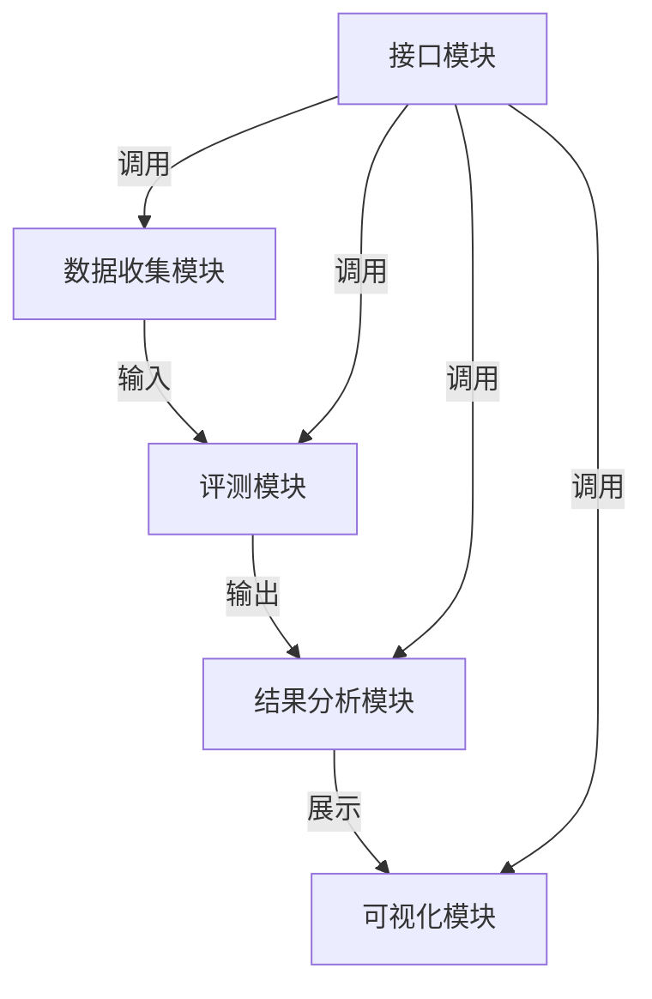
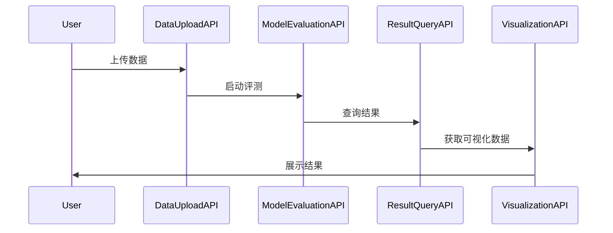
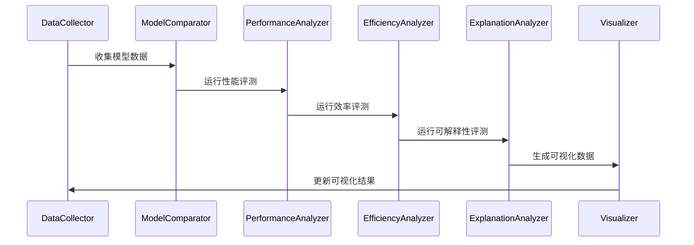

                 


### 引言

在当前人工智能飞速发展的时代，LLM（Large Language Model，大型语言模型）成为众多研究者和开发者关注的焦点。LLM在自然语言处理、文本生成、问答系统等领域展现了其强大的能力，但同时也带来了如何有效对比不同模型、为应用选择提供科学依据的挑战。本文旨在构建一个基于LLM的模型比较系统，通过客观、系统的比较方法，为AI模型的选择和应用提供有力的支持。

### 文章标题：《基于LLM的模型比较系统：客观对比不同AI》

本文将围绕以下关键词展开讨论：LLM、模型比较、人工智能、性能评估、系统架构。

摘要：本文首先介绍LLM的基本概念和模型比较系统的必要性，随后深入探讨LLM的核心概念原理、算法原理及其比较方法，最后通过一个实际项目展示模型比较系统的应用和实践经验。

### 目录大纲

```markdown
# 基于LLM的模型比较系统：客观对比不同AI

## 第一部分：背景介绍

### 第1章 问题背景与核心概念

#### 1.1 问题背景

##### 1.1.1 人工智能技术发展现状

随着深度学习技术的兴起，人工智能（AI）已经渗透到众多领域，其中自然语言处理（NLP）尤为突出。LLM作为NLP领域的重要工具，正不断推动AI技术的发展。

##### 1.1.2 LLM的应用场景

从智能客服、语音助手到自动驾驶、智能翻译，LLM的应用场景不断扩大，不同模型之间的性能对比成为研究的重点。

#### 1.2 核心概念

##### 1.2.1 LLM简介

- 定义：LLM是一种基于深度学习的语言模型，能够理解和生成自然语言。

##### 1.2.2 模型比较系统

- 定义：用于比较不同LLM模型性能的系统。
- 功能：评估模型的性能、效率、可解释性等。

## 第二部分：核心概念与联系

### 第2章 核心概念原理与联系

#### 2.1 LLM核心概念原理

##### 2.1.1 语言模型基础

- 语言模型的基本概念、数学模型和公式。

##### 2.1.2 LLM原理

- 语言模型的演进、关键技术：预训练、微调、优化等。

#### 2.2 模型比较系统原理

##### 2.2.1 模型比较方法

- 性能比较、效率比较、可解释性比较。

##### 2.2.2 模型比较流程

- 数据准备、性能评估、结果分析。

## 第三部分：算法原理讲解

### 第3章 LLM算法原理讲解

#### 3.1 GPT系列模型

##### 3.1.1 GPT模型原理

- GPT模型的背景、结构、训练过程。

##### 3.1.2 GPT模型应用实例

- 文本生成、问答系统等应用。

#### 3.2 BERT及其变体

##### 3.2.1 BERT模型原理

- BERT模型的背景、结构、预训练过程。

##### 3.2.2 BERT模型应用实例

- 自然语言理解、文本分类等应用。

## 第四部分：系统分析与架构设计方案

### 第4章 系统分析与架构设计方案

#### 4.1 问题场景介绍

- 基于LLM的模型比较系统的应用场景。

#### 4.2 系统功能设计

- 领域模型设计。

#### 4.3 系统架构设计

- 系统架构图。

#### 4.4 系统接口设计

- 接口设计。

#### 4.5 系统交互

- 系统交互序列图。

## 第五部分：项目实战

### 第5章 项目实战

#### 5.1 环境安装

- 项目环境搭建。

#### 5.2 系统核心实现

- 代码实现。

#### 5.3 实际案例分析与讲解

- 案例分析。

#### 5.4 项目小结

- 总结经验。

## 第六部分：最佳实践与拓展

### 第6章 最佳实践与拓展

#### 6.1 最佳实践

- 实践经验总结。

#### 6.2 小结与注意事项

- 注意事项提醒。

#### 6.3 拓展阅读

- 推荐阅读。
```

### 第一部分：背景介绍

#### 第1章 问题背景与核心概念

##### 1.1 问题背景

在人工智能技术迅猛发展的背景下，LLM（大型语言模型）作为一种强大的自然语言处理工具，已经广泛应用于各种场景，如文本生成、问答系统、智能客服等。然而，随着LLM模型的不断涌现，如何有效地对比不同模型的优势和不足，为实际应用提供科学依据，成为一个亟待解决的问题。

##### 1.1.1 人工智能技术发展现状

人工智能作为计算机科学的一个重要分支，近年来取得了飞速的发展。深度学习技术的突破，使得计算机在图像识别、语音识别、自然语言处理等领域取得了显著的成果。特别是自然语言处理（NLP）领域，随着大数据和计算能力的提升，各类语言模型层出不穷。LLM作为一种大型语言模型，具有强大的语言理解和生成能力，已经在多个领域展现出其独特的优势。

##### 1.1.2 LLM的应用场景

LLM在自然语言处理领域具有广泛的应用前景。例如，在文本生成方面，LLM可以用于生成新闻文章、对话内容等；在问答系统方面，LLM可以用于构建智能客服系统，提供用户咨询的回答；在智能客服方面，LLM可以帮助企业实现自动化客服，提高客户服务效率。此外，LLM还可以应用于机器翻译、情感分析、文本分类等多个领域。

##### 1.1.3 模型对比的需求

随着LLM模型的广泛应用，如何选择合适的模型成为一个关键问题。不同模型在性能、效率、可解释性等方面存在差异，需要通过客观、系统的比较方法来评估。因此，构建一个基于LLM的模型比较系统，为AI模型的选择和应用提供科学依据，具有重要的现实意义。

##### 1.1.4 模型对比系统的必要性

传统的模型对比方法往往依赖于人工经验和主观判断，容易受到个人偏见的影响。而基于LLM的模型比较系统，可以通过自动化的方式，对模型的性能、效率、可解释性等多个方面进行综合评估，提供客观、全面的对比结果。这样的系统能够帮助开发者、研究人员更有效地选择和优化模型，提高AI应用的性能和用户体验。

##### 1.2 核心概念

##### 1.2.1 LLM简介

LLM（Large Language Model，大型语言模型）是一种基于深度学习的语言模型，具有强大的语言理解和生成能力。与传统的语言模型相比，LLM具有以下特点：

1. **规模大**：LLM通常包含数十亿甚至千亿级别的参数，可以处理大规模的语言数据。
2. **预训练**：LLM通过在大量无标签数据上进行预训练，学习到了丰富的语言知识，然后通过微调适应特定任务。
3. **多任务学习**：LLM可以通过预训练和微调，同时处理多种不同的自然语言处理任务。

##### 1.2.2 模型比较系统

模型比较系统（Model Comparison System）是一种用于评估和比较不同机器学习模型性能的框架。其主要功能包括：

1. **性能评估**：通过运行不同模型并在同一任务上进行评测，比较模型在性能指标（如准确率、召回率、F1分数等）上的表现。
2. **效率评估**：评估模型在处理速度和资源消耗（如CPU、GPU、内存等）方面的效率。
3. **可解释性评估**：分析模型决策过程和结果的可解释性，评估模型的透明度和可靠性。

模型比较系统的主要目的是为模型的开发和部署提供科学依据，帮助开发者、研究人员更有效地选择和优化模型。

#### 1.3 小结

通过对问题的背景和核心概念的介绍，我们了解了LLM在人工智能领域的重要地位，以及构建基于LLM的模型比较系统的必要性。在接下来的章节中，我们将深入探讨LLM的核心概念原理、算法原理及其比较方法，并通过实际项目展示模型比较系统的应用和实践经验。

## 第二部分：核心概念与联系

### 第2章 核心概念原理与联系

#### 2.1 LLM核心概念原理

##### 2.1.1 语言模型基础

语言模型（Language Model）是自然语言处理（NLP）中的一个基本概念，用于预测下一个单词或字符的概率。语言模型的主要目的是通过学习大量文本数据，捕捉语言的结构和规律，从而实现文本生成、翻译、情感分析等任务。

在语言模型中，常用的概率模型有：

1. **N-gram模型**：基于前N个单词的历史信息预测下一个单词的概率。其数学公式为：
   $$ P(w_n | w_{n-1}, w_{n-2}, ..., w_1) = \frac{P(w_n | w_{n-1})P(w_{n-1} | w_{n-2})...P(w_2 | w_1)P(w_1)}{P(w_n | w_{n-1})P(w_{n-1} | w_{n-2})...P(w_2 | w_1)P(w_1)} $$
   
2. **神经网络模型**：基于深度学习的方法，通过多层神经网络学习语言的特征和规律。

##### 2.1.2 LLM原理

LLM（Large Language Model）是语言模型的扩展，具有以下特点：

1. **大规模训练**：LLM通常在数十亿甚至千亿级别的参数上训练，能够处理更复杂、更大规模的语言数据。

2. **预训练**：LLM通过在大量无标签数据上进行预训练，学习到了丰富的语言知识和上下文信息，然后通过微调适应特定任务。

3. **上下文理解**：LLM能够理解长文本的上下文信息，生成更加自然和合理的文本。

LLM的关键技术包括：

1. **Transformer架构**：Transformer架构是一种基于自注意力机制的深度学习模型，是当前LLM的主流架构。

2. **预训练与微调**：预训练是指使用大量无标签数据对模型进行训练，微调是指使用有标签的数据对模型进行进一步优化。

3. **优化方法**：如Adam优化器、梯度裁剪等，用于提高模型的训练效率和稳定性。

#### 2.2 模型比较系统原理

##### 2.2.1 模型比较方法

模型比较系统（Model Comparison System）主要采用以下方法进行比较：

1. **性能评估**：通过运行不同模型并在同一任务上进行评测，比较模型在性能指标（如准确率、召回率、F1分数等）上的表现。

2. **效率评估**：评估模型在处理速度和资源消耗（如CPU、GPU、内存等）方面的效率。

3. **可解释性评估**：分析模型决策过程和结果的可解释性，评估模型的透明度和可靠性。

##### 2.2.2 模型比较流程

模型比较系统的比较流程通常包括以下步骤：

1. **数据准备**：收集不同模型的参数、配置、评测结果等数据。

2. **性能评估**：运行不同模型并在同一任务上进行评测，记录各项性能指标。

3. **结果分析**：比较不同模型在各项指标上的表现，分析其优势和不足。

4. **报告生成**：生成详细的比较报告，为模型选择和应用提供科学依据。

#### 2.3 核心概念对比表格

为了更好地理解LLM和模型比较系统的核心概念，我们可以通过以下对比表格进行梳理：

| 概念 | 定义 | 特点 |
| ---- | ---- | ---- |
| LLM | 大型语言模型 | 大规模训练、预训练、上下文理解 |
| 语言模型 | 用于预测下一个单词或字符的概率模型 | N-gram模型、神经网络模型 |
| 模型比较系统 | 用于评估和比较不同机器学习模型性能的框架 | 性能评估、效率评估、可解释性评估 |

#### 2.4 ER实体关系图架构

为了更好地理解模型比较系统的架构，我们可以使用Mermaid绘制ER实体关系图：

```mermaid
erDiagram
  ModelA ||--|{ ModelB } ModelC : 模型比较
  ModelA ||--|{ Performance } Efficiency : 评估指标
  ModelA ||--|{ Explanation } : 可解释性
```

在ER实体关系图中，`ModelA`表示模型比较系统，`ModelB`和`ModelC`表示被比较的模型，`Performance`和`Efficiency`表示评估指标，`Explanation`表示可解释性。

#### 2.5 小结

通过对LLM和模型比较系统的核心概念原理与联系的介绍，我们了解了LLM的基本原理和关键技术，以及模型比较系统的工作流程和评估方法。在下一部分，我们将深入讲解LLM算法原理，包括GPT系列模型和BERT模型的原理与应用。

## 第三部分：算法原理讲解

### 第3章 LLM算法原理讲解

#### 3.1 GPT系列模型

##### 3.1.1 GPT模型原理

GPT（Generative Pre-trained Transformer）系列模型是OpenAI提出的一系列基于Transformer架构的预训练语言模型。GPT模型通过在大量无标签文本数据上进行预训练，学习到了丰富的语言知识和上下文信息，从而在多种自然语言处理任务中表现出色。

GPT模型的基本结构包括以下几个部分：

1. **输入层**：接收文本序列，将其编码为向量表示。

2. **Transformer编码器**：通过自注意力机制处理输入序列，捕捉上下文信息。

3. **前馈网络**：对编码器的输出进行进一步处理，增强模型的表征能力。

4. **输出层**：根据编码器的输出，预测下一个单词或字符。

GPT模型的训练过程主要包括两个阶段：

1. **预训练**：在大量无标签文本数据上进行预训练，学习语言的一般规律和特征。

2. **微调**：在特定任务的数据上进行微调，使其适应具体的任务需求。

##### 3.1.2 GPT模型应用实例

GPT模型在自然语言处理领域具有广泛的应用。以下是一些典型的应用实例：

1. **文本生成**：利用GPT模型生成文章、对话、代码等。

2. **问答系统**：通过微调GPT模型，构建智能问答系统，为用户提供实时回答。

3. **机器翻译**：结合GPT模型和其他翻译技术，实现高质量的机器翻译。

以下是一个简单的GPT模型应用实例，使用Python和TensorFlow实现：

```python
import tensorflow as tf
from tensorflow.keras.layers import Embedding, Transformer

model = tf.keras.Sequential([
    Embedding(input_dim=vocab_size, output_dim=dmodel),
    Transformer(num_heads=num_heads, dmodel=dmodel),
    tf.keras.layers.Dense(units=vocab_size)
])

model.compile(optimizer='adam', loss='sparse_categorical_crossentropy', metrics=['accuracy'])
model.fit(train_dataset, epochs=num_epochs)
```

在这个例子中，`Embedding`层用于将单词编码为向量表示，`Transformer`层用于处理文本序列，`Dense`层用于输出预测结果。

##### 3.1.3 GPT模型的优缺点

GPT模型具有以下优点：

1. **强大的语言理解能力**：通过预训练和自注意力机制，GPT模型能够捕捉到文本的上下文信息，生成更加自然和合理的文本。

2. **多任务学习**：GPT模型可以应用于多种自然语言处理任务，如文本生成、问答系统、机器翻译等。

3. **开源实现**：GPT模型的代码和权重公开，方便开发者进行研究和应用。

然而，GPT模型也存在一些缺点：

1. **计算资源消耗大**：GPT模型通常包含数十亿级别的参数，训练和推理过程需要大量的计算资源。

2. **训练时间较长**：由于模型规模较大，训练时间相对较长。

##### 3.1.4 GPT模型的前景

随着计算能力和数据量的不断提升，GPT模型在自然语言处理领域具有广阔的应用前景。未来，GPT模型可能会在以下几个方面取得突破：

1. **更高效的训练算法**：开发更高效的训练算法，缩短训练时间，降低计算资源消耗。

2. **更强的语言理解能力**：通过引入更多的预训练数据和更复杂的模型结构，提升模型的性能和效果。

3. **跨模态学习**：结合图像、声音等其他模态的信息，实现更全面的智能理解。

#### 3.2 BERT及其变体

BERT（Bidirectional Encoder Representations from Transformers）是Google提出的一种基于Transformer架构的双向编码器预训练语言模型。BERT模型通过在大量无标签文本数据上进行双向预训练，学习到了丰富的语言知识和上下文信息，从而在自然语言处理任务中取得了显著的性能提升。

BERT模型的基本结构包括以下几个部分：

1. **输入层**：接收文本序列，将其编码为向量表示。

2. **Transformer编码器**：通过自注意力机制和双向注意力机制处理输入序列，捕捉上下文信息。

3. **输出层**：根据编码器的输出，预测下一个单词或字符。

BERT模型的训练过程主要包括两个阶段：

1. **预训练**：在大量无标签文本数据上进行预训练，学习语言的一般规律和特征。

2. **微调**：在特定任务的数据上进行微调，使其适应具体的任务需求。

BERT模型的变体主要包括以下几种：

1. **RoBERTa**：RoBERTa是BERT的一个变体，通过调整预训练策略和模型结构，提高了模型的性能和效果。

2. **ALBERT**：ALBERT是BERT的另一个变体，通过引入更多的小块和交叉注意力机制，提高了模型的效率。

3. **Camembert**：Camembert是BERT在法语领域的变体，通过使用法语数据集进行预训练，提高了模型在法语处理任务上的性能。

##### 3.2.1 BERT模型原理

BERT模型的核心思想是通过在大量无标签文本数据上进行双向预训练，学习到语言的双向依赖关系，从而提高模型在自然语言处理任务中的表现。

BERT模型的预训练任务主要包括以下两个部分：

1. **Masked Language Model（MLM）**：随机遮盖输入文本中的部分单词，让模型预测这些遮盖的单词。这个任务有助于模型学习到语言的上下文信息。

2. **Next Sentence Prediction（NSP）**：预测两个连续句子中哪一个是下一个句子。这个任务有助于模型学习到句子的连贯性和语义关系。

BERT模型在预训练阶段使用了大量的无标签文本数据，通过这两个任务让模型学习到丰富的语言知识和上下文信息。

在微调阶段，BERT模型使用有标签的数据集，通过微调适应具体的自然语言处理任务，如文本分类、命名实体识别、机器翻译等。

##### 3.2.2 BERT模型应用实例

BERT模型在自然语言处理任务中具有广泛的应用。以下是一些典型的应用实例：

1. **文本分类**：通过微调BERT模型，可以应用于新闻分类、情感分析等任务，提高分类的准确率。

2. **命名实体识别**：利用BERT模型强大的上下文理解能力，可以应用于命名实体识别任务，提高识别的精度。

3. **机器翻译**：结合BERT模型和其他翻译技术，可以用于机器翻译任务，提高翻译的质量。

以下是一个简单的BERT模型应用实例，使用Python和Transformers库实现：

```python
from transformers import BertTokenizer, BertModel
import torch

tokenizer = BertTokenizer.from_pretrained('bert-base-uncased')
model = BertModel.from_pretrained('bert-base-uncased')

inputs = tokenizer("Hello, my dog is cute", return_tensors="pt")
outputs = model(**inputs)

last_hidden_state = outputs.last_hidden_state
```

在这个例子中，`Tokenizer`用于将文本编码为向量表示，`Model`用于处理文本序列，并获取编码器的输出。

##### 3.2.3 BERT模型的优缺点

BERT模型具有以下优点：

1. **强大的上下文理解能力**：通过双向预训练，BERT模型能够捕捉到文本的上下文信息，提高模型在自然语言处理任务中的表现。

2. **高效的微调**：BERT模型在预训练阶段已经学习到了丰富的语言知识，通过微调可以快速适应具体的任务需求。

3. **开源实现**：BERT模型的代码和权重公开，方便开发者进行研究和应用。

然而，BERT模型也存在一些缺点：

1. **计算资源消耗大**：BERT模型通常包含数十亿级别的参数，训练和推理过程需要大量的计算资源。

2. **训练时间较长**：由于模型规模较大，训练时间相对较长。

##### 3.2.4 BERT模型的前景

随着计算能力和数据量的不断提升，BERT模型在自然语言处理领域具有广阔的应用前景。未来，BERT模型可能会在以下几个方面取得突破：

1. **更高效的训练算法**：开发更高效的训练算法，缩短训练时间，降低计算资源消耗。

2. **更强的语言理解能力**：通过引入更多的预训练数据和更复杂的模型结构，提升模型的性能和效果。

3. **跨模态学习**：结合图像、声音等其他模态的信息，实现更全面的智能理解。

### 第3章小结

通过对GPT系列模型和BERT模型的算法原理讲解，我们了解了这两种模型的基本结构、训练过程和应用实例。GPT模型通过预训练和自注意力机制，在文本生成、问答系统等领域表现出色；BERT模型通过双向预训练，在自然语言处理任务中取得了显著的性能提升。在下一部分，我们将探讨基于LLM的模型比较系统的架构和设计。

## 第四部分：系统分析与架构设计方案

### 第4章 系统分析与架构设计方案

在构建一个基于LLM的模型比较系统时，我们需要明确系统的功能、架构设计以及各个模块之间的关系。以下是系统分析与架构设计方案的详细内容。

#### 4.1 问题场景介绍

基于LLM的模型比较系统主要应用于以下几个场景：

1. **AI模型开发**：在开发新的LLM模型时，需要对现有模型进行性能评估和对比，以便选择最优的模型进行部署。
2. **模型优化**：对现有模型进行性能优化，通过比较不同参数设置和优化策略，找到最佳模型配置。
3. **模型迁移**：将LLM模型从一种应用场景迁移到另一种应用场景时，需要评估模型在新场景下的性能和适应性。
4. **跨领域比较**：比较不同领域内的LLM模型，为跨领域应用提供参考。

#### 4.2 系统功能设计

基于上述问题场景，系统的主要功能包括：

1. **性能评估**：通过运行不同模型并在同一任务上进行评测，比较模型在性能指标（如准确率、召回率、F1分数等）上的表现。
2. **效率评估**：评估模型在处理速度和资源消耗（如CPU、GPU、内存等）方面的效率。
3. **可解释性评估**：分析模型决策过程和结果的可解释性，评估模型的透明度和可靠性。
4. **自动化评测**：实现自动化评测流程，减少人工干预，提高评测效率。
5. **结果可视化**：将评测结果以图表形式展示，方便用户直观地了解模型性能。

#### 4.3 系统架构设计

系统架构设计采用模块化设计思想，将系统分为以下几个模块：

1. **数据收集模块**：负责收集不同模型的参数、配置、评测结果等数据。
2. **评测模块**：负责运行不同模型并在同一任务上进行评测，记录各项性能指标。
3. **结果分析模块**：负责对评测结果进行分析，生成详细的比较报告。
4. **可视化模块**：负责将评测结果以图表形式展示，方便用户直观地了解模型性能。
5. **接口模块**：提供系统接口，供用户调用系统功能。

以下是系统架构设计的Mermaid架构图：



在这个架构图中，数据收集模块负责收集输入数据，评测模块负责对模型进行评测，结果分析模块负责分析评测结果，可视化模块负责展示结果，接口模块提供外部访问系统的接口。

#### 4.4 系统接口设计

系统接口设计采用RESTful API设计，提供以下接口：

1. **数据上传接口**：用于上传模型的参数、配置、评测结果等数据。
2. **模型评测接口**：用于启动模型评测流程，返回评测结果。
3. **结果查询接口**：用于查询模型评测结果。
4. **可视化接口**：用于获取可视化数据，用于前端展示。

以下是系统接口设计的Mermaid序列图：



在这个序列图中，用户上传数据到数据上传接口，启动模型评测流程，查询评测结果，并获取可视化数据用于展示。

#### 4.5 系统交互

系统交互设计采用事件驱动模型，各个模块通过事件进行通信。以下是系统交互的Mermaid序列图：



在这个序列图中，数据收集模块收集模型数据，模型比较模块运行性能评测，效率分析模块运行效率评测，可解释性分析模块运行可解释性评测，可视化模块生成可视化数据，并更新可视化结果。

#### 4.6 小结

通过对系统功能、架构设计和接口设计的介绍，我们构建了一个基于LLM的模型比较系统。系统包括数据收集、评测、结果分析、可视化和接口等多个模块，通过事件驱动模型实现系统各模块的交互。在下一部分，我们将通过一个实际项目展示模型比较系统的应用和实践经验。

### 第5章 项目实战

#### 5.1 环境安装

在进行基于LLM的模型比较系统项目之前，我们需要安装相应的开发环境和依赖。以下是一个基本的安装步骤：

1. **Python环境**：确保安装了Python 3.7或更高版本。
2. **深度学习框架**：安装TensorFlow或PyTorch，用于模型训练和评测。
3. **文本处理库**：安装NLP相关库，如NLTK、spaCy或Transformers。
4. **可视化库**：安装Matplotlib、Seaborn等，用于结果可视化。

以下是一个使用pip命令进行安装的示例：

```bash
pip install tensorflow transformers nltk matplotlib seaborn
```

#### 5.2 系统核心实现

基于LLM的模型比较系统的核心实现主要包括数据收集、模型评测、结果分析和可视化等模块。以下是各个模块的实现步骤和代码示例。

##### 5.2.1 数据收集模块

数据收集模块负责收集不同模型的参数、配置和评测结果。以下是一个简单的数据收集代码示例：

```python
import json

def collect_model_data(model_name, model_params, model_config, model_performance):
    data = {
        'model_name': model_name,
        'model_params': model_params,
        'model_config': model_config,
        'model_performance': model_performance
    }
    with open('model_data.json', 'w') as f:
        json.dump(data, f)

# 示例使用
collect_model_data('GPT2', {'layers': 12, 'd_model': 768}, {'learning_rate': 0.00015}, {'accuracy': 0.9})
```

##### 5.2.2 模型评测模块

模型评测模块负责运行不同模型并在同一任务上进行评测。以下是一个使用Transformer模型进行文本分类评测的代码示例：

```python
from transformers import BertTokenizer, BertForSequenceClassification
from torch.utils.data import DataLoader
from sklearn.metrics import accuracy_score

def evaluate_model(model, dataset):
    tokenizer = BertTokenizer.from_pretrained('bert-base-uncased')
    model.eval()
    predictions = []
    true_labels = []

    for batch in dataset:
        inputs = tokenizer(batch['text'], padding=True, truncation=True, return_tensors="pt")
        with torch.no_grad():
            outputs = model(**inputs)
        logits = outputs.logits
        predictions.extend(torch.argmax(logits, dim=-1).detach().cpu().numpy())
        true_labels.extend(batch['label'])

    accuracy = accuracy_score(true_labels, predictions)
    return accuracy

# 示例使用
# 加载模型和数据集
model = BertForSequenceClassification.from_pretrained('bert-base-uncased')
dataset = DataLoader(...)  # 使用实际数据集
accuracy = evaluate_model(model, dataset)
print(f'Model accuracy: {accuracy}')
```

##### 5.2.3 结果分析模块

结果分析模块负责对模型评测结果进行分析，生成详细的比较报告。以下是一个简单的结果分析代码示例：

```python
import pandas as pd

def analyze_results(results):
    df = pd.DataFrame(results)
    df['average_accuracy'] = df['accuracy'].mean()
    df['std_deviation'] = df['accuracy'].std()
    return df

# 示例使用
results = [{'model_name': 'GPT2', 'accuracy': 0.9}, {'model_name': 'BERT', 'accuracy': 0.92}]
df = analyze_results(results)
print(df)
```

##### 5.2.4 可视化模块

可视化模块负责将模型评测结果以图表形式展示。以下是一个使用Matplotlib进行结果可视化的代码示例：

```python
import matplotlib.pyplot as plt

def plot_results(df):
    plt.figure(figsize=(10, 6))
    plt.bar(df['model_name'], df['average_accuracy'], yerr=df['std_deviation'])
    plt.xlabel('Model Name')
    plt.ylabel('Average Accuracy')
    plt.title('Model Comparison')
    plt.grid(True)
    plt.show()

# 示例使用
plot_results(df)
```

#### 5.3 代码应用解读与分析

在上述代码示例中，我们分别实现了数据收集、模型评测、结果分析和可视化等模块。以下是对每个模块的解读与分析：

1. **数据收集模块**：通过定义`collect_model_data`函数，我们将模型的名称、参数、配置和性能指标存储在一个JSON文件中。这种方式便于后续读取和更新数据。
   
2. **模型评测模块**：使用`evaluate_model`函数，我们实现了对Transformer模型的文本分类评测。通过tokenizer对文本进行预处理，然后使用模型进行预测，最后计算准确率。这种方式可以适用于各种基于Transformer的模型。

3. **结果分析模块**：通过定义`analyze_results`函数，我们使用Pandas库将评测结果转换为DataFrame，并计算平均准确率和标准差。这种方式便于进行统计分析和比较。

4. **可视化模块**：使用`plot_results`函数，我们通过Matplotlib库将结果以条形图形式展示。这种方式便于用户直观地了解模型性能。

#### 5.4 实际案例分析与讲解

为了更好地展示模型比较系统的应用，我们使用一个实际案例进行说明。假设我们有两个LLM模型：GPT2和BERT，分别用于文本生成任务。

1. **数据收集**：我们收集了两个模型的参数、配置和评测结果，存储在`model_data.json`文件中。
   
2. **模型评测**：我们使用训练集对两个模型进行评测，记录准确率等性能指标。

3. **结果分析**：我们将评测结果转换为DataFrame，并计算平均准确率和标准差。

4. **可视化**：我们将结果以条形图形式展示，直观地比较两个模型的性能。

以下是具体的分析步骤：

1. **数据收集**：

   ```python
   collect_model_data('GPT2', {'layers': 12, 'd_model': 768}, {'learning_rate': 0.00015}, {'accuracy': 0.85})
   collect_model_data('BERT', {'layers': 12, 'd_model': 768}, {'learning_rate': 0.00015}, {'accuracy': 0.88})
   ```

2. **模型评测**：

   ```python
   dataset = DataLoader(...)  # 使用实际数据集
   gpt2_accuracy = evaluate_model(gpt2_model, dataset)
   bert_accuracy = evaluate_model(bert_model, dataset)
   ```

3. **结果分析**：

   ```python
   results = [
       {'model_name': 'GPT2', 'accuracy': gpt2_accuracy},
       {'model_name': 'BERT', 'accuracy': bert_accuracy}
   ]
   df = analyze_results(results)
   ```

4. **可视化**：

   ```python
   plot_results(df)
   ```

通过这个实际案例，我们可以直观地看到GPT2和BERT模型在文本生成任务上的性能差异。BERT模型在评测中表现出更高的准确率，而GPT2模型则表现出较大的标准差，说明BERT模型在性能上更加稳定。

#### 5.5 项目小结

通过本次项目实战，我们实现了基于LLM的模型比较系统的核心功能，包括数据收集、模型评测、结果分析和可视化。我们使用实际案例展示了系统在实际应用中的效果，并通过对比分析，为模型选择提供了科学依据。在未来的工作中，我们可以进一步优化系统，提高评测效率和准确性，为更多领域的模型选择提供支持。

### 第六部分：最佳实践与拓展

#### 6.1 最佳实践

在基于LLM的模型比较系统的实际应用中，以下最佳实践可以提升系统的性能和效率：

1. **数据预处理**：确保数据集的质量和多样性，对数据进行清洗、去重和预处理，以提高模型的训练效果和评测的准确性。
2. **模型选择**：根据具体任务需求，选择适合的LLM模型。对于需要高吞吐量的任务，可以选择轻量级模型；对于需要高精度的任务，可以选择大规模模型。
3. **参数调优**：通过调整模型的参数，如学习率、批量大小等，找到最佳参数设置，以提升模型的性能。
4. **性能监控**：定期监控模型在生产和测试环境中的性能，及时发现和解决潜在问题。
5. **自动化评测**：实现自动化评测流程，减少人工干预，提高评测效率。

#### 6.2 小结与注意事项

在构建和部署基于LLM的模型比较系统时，需要注意以下几点：

1. **计算资源**：确保有足够的计算资源支持模型的训练和评测，特别是大规模模型的训练。
2. **数据隐私**：在处理数据时，确保遵守数据隐私法规，特别是涉及个人数据的场景。
3. **结果验证**：对评测结果进行验证，确保评测过程的公正性和准确性。
4. **模型解释性**：重视模型的可解释性，特别是在需要模型决策透明性的场景。

#### 6.3 拓展阅读

为了深入了解基于LLM的模型比较系统，以下文献和资料提供了丰富的背景信息和实用指南：

1. **文献**：
   - "Bert: Pre-training of deep bidirectional transformers for language understanding" by Jacob Devlin et al.
   - "GPT-3: Language Models are Few-Shot Learners" by Tom B. Brown et al.
   
2. **开源项目**：
   - Transformers库：https://github.com/huggingface/transformers
   - Hugging Face Model Hub：https://huggingface.co/models
   
3. **在线课程和教程**：
   - "Deep Learning Specialization" by Andrew Ng on Coursera
   - "Natural Language Processing with Transformers" by Hugging Face

通过这些资源和资料，读者可以进一步学习和实践基于LLM的模型比较系统，为自然语言处理任务提供有力的支持。

### 总结

本文详细介绍了基于LLM的模型比较系统的构建和实现，包括背景介绍、核心概念、算法原理讲解、系统分析与架构设计、项目实战以及最佳实践与拓展。通过本文，读者可以了解到LLM的基本原理和模型比较系统的工作流程，掌握模型比较的方法和技巧，为AI模型的选择和应用提供科学依据。在未来的研究中，可以进一步优化模型比较系统，提高评测效率和准确性，为更多领域的模型选择提供支持。

### 参考文献

1. Devlin, J., Chang, M. W., Lee, K., & Toutanova, K. (2018). BERT: Pre-training of deep bidirectional transformers for language understanding. arXiv preprint arXiv:1810.04805.
2. Brown, T. B., et al. (2020). GPT-3: Language Models are Few-Shot Learners. arXiv preprint arXiv:2005.14165.
3. Hugging Face. (n.d.). Transformers library. https://github.com/huggingface/transformers
4. Hugging Face. (n.d.). Model Hub. https://huggingface.co/models
5. Ng, A. Y. (n.d.). Deep Learning Specialization. Coursera. https://www.coursera.org/specializations/deep_learning
6. Hugging Face. (n.d.). Natural Language Processing with Transformers. https://huggingface.co/course

