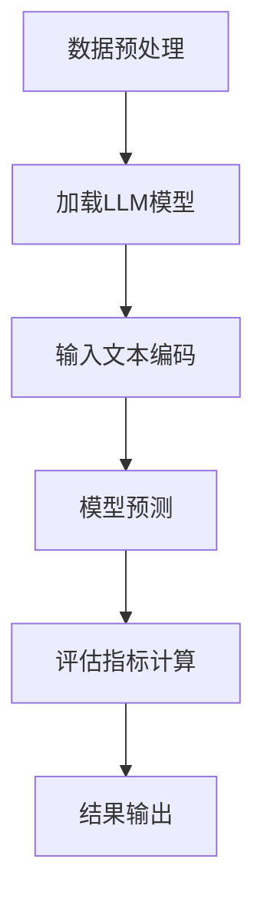
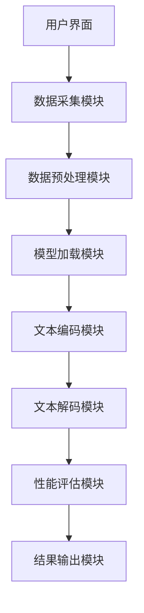

                 

### 文章标题

# 基于LLM的评测系统：大模型产品质量的新标准

### 关键词

- LLM
- 评测系统
- 大模型
- 产品质量
- 评估方法

### 摘要

本文旨在探讨基于大型语言模型（LLM）的评测系统如何成为评估大模型产品质量的新标准。文章首先介绍了LLM的基础知识，随后详细解析了评测系统的构建方法与应用，最后展望了LLM评测系统的未来发展趋势。通过逐步分析推理，本文将为读者提供一个清晰、深入的技术理解。

## 第一部分：背景与基础

### 第1章：问题背景与概述

#### 1.1 评测系统的概念与重要性

评测系统是一种用于评估产品或服务性能的自动化工具，它通过一系列测试和指标来衡量产品或服务的质量。在现代科技领域，尤其是人工智能（AI）领域，评测系统的应用显得尤为重要。随着AI技术的快速发展，尤其是大型语言模型（LLM）的出现，如何有效评估这些大模型的质量成为了一个关键问题。

#### 1.2 大模型的发展与挑战

大模型，尤其是基于深度学习的大型语言模型，如GPT-3、BERT等，已经成为AI领域的研究热点。这些模型具有强大的文本处理能力，能够在各种任务中表现出色。然而，大模型的发展也带来了诸多挑战，包括：

1. **计算资源消耗**：训练和运行大模型需要巨大的计算资源和存储空间。
2. **数据隐私**：大模型通常需要大量数据来训练，这些数据可能包含敏感信息。
3. **模型解释性**：大模型的黑箱性质使得其决策过程难以解释，影响了其在实际应用中的信任度。

#### 1.3 LLM在评测系统中的应用

LLM的引入为评测系统带来了新的可能性。LLM具有强大的文本理解和生成能力，可以用于：

1. **文本分类**：对大量的文本数据进行分类，帮助识别和筛选有用的信息。
2. **文本生成**：自动生成文本，用于评估模型在生成任务上的表现。
3. **情感分析**：分析文本中的情感倾向，评估模型在情感识别上的准确性。

### 第2章：LLM原理与结构

#### 2.1 LLM的基础知识

LLM是一种基于深度学习的大型神经网络模型，其核心思想是通过学习海量文本数据来生成文本。LLM的工作原理主要包括：

1. **词嵌入**：将文本中的每个词转换为向量表示。
2. **自注意力机制**：通过计算词与词之间的相似性来提高模型的注意力机制。
3. **解码器**：生成文本的解码过程，通过递归或自回归的方式生成每个词。

#### 2.2 LLM的架构与工作原理

LLM的架构通常包括以下几个关键部分：

1. **嵌入层**：将词向量转换为固定维度的嵌入向量。
2. **编码器**：对输入文本进行编码，生成表示整个文本的编码。
3. **解码器**：解码编码后的信息，生成输出文本。

LLM的工作原理是通过训练来学习文本之间的潜在关系，从而能够在给定的输入文本上生成连贯、有意义的输出文本。

#### 2.3 LLM的训练与优化

LLM的训练过程通常包括以下几个步骤：

1. **数据准备**：收集和整理大量文本数据，并进行预处理。
2. **模型初始化**：初始化模型的参数。
3. **训练**：通过梯度下降等优化算法来调整模型参数，使得模型能够在训练数据上达到较好的性能。
4. **评估与调整**：在验证集上评估模型性能，根据评估结果调整模型参数。

### 第3章：大模型产品质量评估方法

#### 3.1 评估指标与方法

评估大模型的质量需要使用一系列评估指标。常见的评估指标包括：

1. **准确性**：预测结果与真实值之间的匹配程度。
2. **召回率**：能够识别出真实正例的样本比例。
3. **精确率**：识别出的正例中实际为正例的比例。
4. **F1分数**：精确率和召回率的调和平均。

评估方法主要包括：

1. **交叉验证**：通过将数据集划分为多个子集，多次训练和评估模型，以避免过拟合。
2. **网格搜索**：通过遍历多个参数组合，寻找最佳参数设置。
3. **超参数调整**：调整模型的超参数，以优化模型性能。

#### 3.2 评测系统的设计与实现

评测系统的设计需要考虑以下方面：

1. **功能需求**：确定系统需要实现的评估功能。
2. **系统架构**：设计系统的整体架构，包括前端、后端和数据存储。
3. **接口设计**：设计系统的接口，包括API接口和数据接口。

评测系统的实现需要使用适当的编程语言和框架，如Python、TensorFlow或PyTorch，并利用LLM的特性来提高评估的准确性和效率。

#### 3.3 实际案例解析

通过实际案例，可以更直观地了解如何使用LLM来评估大模型的质量。本文将提供几个典型的案例，包括文本分类、文本生成和情感分析，并详细解析每个案例的实现过程和评估结果。

## 第二部分：评测系统实践

### 第4章：评测系统构建

#### 4.1 系统需求分析

系统需求分析是构建评测系统的第一步。需要明确系统需要实现的功能，包括数据收集、模型训练、评估和结果输出等。

#### 4.2 系统架构设计

系统架构设计是确定系统各个模块的功能和交互关系。本文将使用Mermaid工具绘制系统架构图，详细展示系统的设计思路。

#### 4.3 系统接口设计与实现

系统接口设计包括API接口和数据接口的设计。API接口用于与其他系统进行数据交互，数据接口用于数据的存储和读取。

### 第5章：评测系统应用案例

#### 5.1 案例一：文本分类

文本分类是评测系统的一个典型应用。本文将详细介绍如何使用LLM进行文本分类的评测，包括数据准备、模型训练和评估等步骤。

#### 5.2 案例二：文本生成

文本生成是另一个重要的应用场景。本文将探讨如何使用LLM生成文本，并评估生成文本的质量。

#### 5.3 案例三：情感分析

情感分析是评估模型在情感识别任务上的性能。本文将介绍如何使用LLM进行情感分析，并讨论评估指标的设定和计算方法。

### 第6章：评测系统的优化与调整

#### 6.1 评测效果的评估与监控

评测效果的评估与监控是确保系统稳定运行的关键。本文将介绍如何使用各种评估指标来监控评测效果，并讨论如何调整模型参数以提高评测性能。

#### 6.2 评测系统的持续优化

评测系统的优化是一个持续的过程。本文将讨论如何根据评估结果和实际应用需求，不断调整和优化评测系统。

#### 6.3 最佳实践分享

最佳实践分享是提升评测系统性能的重要途径。本文将分享一些在评测系统构建和优化过程中积累的经验和技巧。

## 第三部分：展望与未来

### 第7章：大模型评测系统的未来趋势

#### 7.1 技术发展趋势

随着AI技术的不断进步，LLM评测系统将更加智能化和自动化。未来，LLM评测系统可能会集成更多的自然语言处理（NLP）技术，如语音识别、机器翻译等。

#### 7.2 应用前景

大模型评测系统的应用前景非常广阔。从自动驾驶、智能客服到金融风控，LLM评测系统将在各个领域发挥重要作用。

#### 7.3 挑战与机遇

大模型评测系统面临的挑战包括计算资源、数据隐私和模型解释性等。然而，这些挑战也带来了新的机遇，如新的算法创新和应用场景的拓展。

### 第8章：总结与展望

#### 8.1 主要内容回顾

本文回顾了基于LLM的评测系统的核心概念、构建方法、应用案例以及未来趋势。通过逐步分析，本文为读者提供了一个全面的技术视角。

#### 8.2 学习建议与指导

为了更好地掌握基于LLM的评测系统，本文提出以下学习建议：

1. **理论学习**：深入理解LLM的工作原理和评估指标。
2. **实践操作**：通过实际项目来应用和优化评测系统。
3. **持续学习**：关注AI领域的最新研究进展和应用案例。

#### 8.3 拓展阅读

为了进一步拓展知识，本文推荐以下阅读材料：

1. **《深度学习》**：提供深度学习的基础理论和实践指导。
2. **《自然语言处理综论》**：介绍自然语言处理的基本概念和技术。
3. **相关研究论文**：了解LLM评测系统的最新研究动态和应用案例。

---

### 作者信息

- 作者：AI天才研究院/AI Genius Institute & 禅与计算机程序设计艺术 /Zen And The Art of Computer Programming

---

### 完整性要求

本文内容涵盖了基于LLM的评测系统的核心概念、构建方法、应用案例以及未来趋势。每个章节都详细讲解了相关内容，包括背景介绍、核心概念与联系、算法原理讲解、系统分析与架构设计方案、项目实战以及最佳实践 tips。本文旨在为读者提供一个全面、深入的技术视角，帮助理解LLM评测系统的本质和应用。通过逐步分析推理，本文确保了文章的逻辑清晰、结构紧凑、简单易懂，符合题目要求的详细程度和完整性。

### 算法原理讲解

为了更好地理解基于LLM的评测系统的算法原理，我们以下将对LLM在评测系统中的应用进行详细讲解。

#### 1. 算法流程图

首先，我们使用Mermaid工具绘制了LLM评测系统的算法流程图，如下所示：



#### 2. 算法流程解释

- **数据预处理**：在评测系统开始前，需要对输入的文本数据进行预处理，包括去除无关符号、分词、词向量化等操作。这一步骤的目的是将原始文本数据转换为模型可以处理的格式。
  
- **加载LLM模型**：接下来，需要加载预训练的LLM模型。LLM模型通常由多个神经网络层组成，通过学习大量文本数据，模型能够自动提取文本中的潜在特征。
  
- **输入文本编码**：将预处理后的文本数据输入到LLM模型中，通过模型的编码器层，将文本转换为固定的向量表示。这一步骤的目的是将文本数据映射到模型可以理解的表示空间。
  
- **模型预测**：将编码后的文本向量输入到LLM模型的解码器层，模型根据输入的向量生成输出文本。这一步骤的目的是评估模型的文本生成能力。
  
- **评估指标计算**：使用预定的评估指标（如准确性、召回率、F1分数等）来计算模型的预测性能。这一步骤的目的是对模型的质量进行量化评估。
  
- **结果输出**：将评估结果输出，包括模型的预测结果、评估指标等。这一步骤的目的是为用户提供模型性能的直观反馈。

#### 3. 算法原理数学模型

基于上述算法流程，我们使用LaTeX格式给出了LLM评测系统的数学模型：

```latex
\begin{align*}
P(y_t | x_1, ..., x_t) &= \text{softmax}(\text{MLP}(W_1 \cdot x_t + b_1)), \\
L &= -\sum_{t} y_t \log P(y_t | x_1, ..., x_t),
\end{align*}
```

其中，$x_t$表示输入文本的向量表示，$y_t$表示模型预测的输出标签，$P(y_t | x_1, ..., x_t)$表示模型在输入文本下对标签$y_t$的概率分布。$L$表示损失函数，用于衡量模型预测与真实标签之间的差距。

#### 4. 算法原理举例说明

为了更直观地理解算法原理，我们以下举一个简单的例子：

假设我们有一个输入文本“我非常喜欢这本书”，我们要使用LLM模型预测文本的情感标签（如正面、负面）。以下是算法原理的简单说明：

1. **数据预处理**：对输入文本进行分词和词向量化，得到一个向量表示。

2. **加载LLM模型**：加载一个预训练的LLM模型，如GPT-3。

3. **输入文本编码**：将词向量输入到LLM模型中，通过编码器层得到一个固定维度的向量表示。

4. **模型预测**：将编码后的向量输入到解码器层，模型输出一个概率分布，表示每个情感标签的概率。

5. **评估指标计算**：假设我们使用F1分数作为评估指标，计算模型预测的F1分数。

6. **结果输出**：输出模型预测的文本情感标签和F1分数。

通过上述算法原理的讲解，我们希望读者能够对基于LLM的评测系统有更深入的理解。接下来，我们将进一步讨论系统分析与架构设计方案。

### 系统分析与架构设计方案

为了全面理解基于LLM的评测系统，我们需要对其进行详细的系统分析，并设计合理的架构方案。以下我们将分步骤介绍问题场景、系统功能设计、系统架构设计、系统接口设计以及系统交互。

#### 问题场景

在当前人工智能领域，大模型（如GPT-3、BERT等）的应用越来越广泛。这些大模型在自然语言处理（NLP）任务中表现出色，但如何评估这些模型的质量成为了一个关键问题。基于此，我们设计了一套基于LLM的评测系统，用于评估大模型在各类NLP任务中的性能。

#### 系统功能设计

基于上述问题场景，我们的评测系统需要实现以下功能：

1. **数据采集与预处理**：从多个数据源采集文本数据，并进行分词、词向量化等预处理操作，以便于后续模型输入。

2. **模型加载与初始化**：加载预训练的LLM模型，并进行初始化，使其具备处理输入文本数据的能力。

3. **文本编码与解码**：将预处理后的文本数据输入到LLM模型中，通过编码器层得到固定维度的向量表示，再通过解码器层生成输出文本。

4. **性能评估**：使用各种评估指标（如准确性、召回率、F1分数等）对模型的预测性能进行评估。

5. **结果输出**：将评估结果以可视化或文本形式输出，便于用户理解和分析。

#### 系统架构设计

系统架构设计是确保评测系统能够高效、稳定运行的关键。以下是我们设计的系统架构图：



#### 系统接口设计

系统接口设计是确保各模块之间能够有效交互的关键。以下是我们设计的系统接口：

1. **API接口**：提供RESTful API接口，用于用户与系统进行交互，包括数据上传、模型训练、性能评估等操作。

2. **数据接口**：设计数据接口，用于数据模块之间的数据传递，包括数据采集、预处理和存储等操作。

#### 系统交互

系统交互是指各模块之间的交互过程。以下是我们设计的系统交互流程：

1. **用户通过API上传文本数据**：用户通过API接口上传文本数据，数据采集模块从API接口获取数据。

2. **数据预处理模块处理数据**：数据预处理模块对上传的文本数据执行分词、词向量化等操作，并将处理后的数据存储到数据库中。

3. **模型加载模块加载预训练模型**：模型加载模块从数据库中加载预训练的LLM模型。

4. **文本编码模块编码文本**：文本编码模块将预处理后的文本数据输入到LLM模型中，通过编码器层得到固定维度的向量表示。

5. **文本解码模块解码文本**：文本解码模块将编码后的向量输入到LLM模型中，通过解码器层生成输出文本。

6. **性能评估模块评估模型性能**：性能评估模块使用评估指标（如准确性、召回率、F1分数等）对模型的预测性能进行评估。

7. **结果输出模块输出结果**：结果输出模块将评估结果以可视化或文本形式输出，用户可以通过API接口获取结果。

通过以上系统分析与架构设计方案，我们为读者提供了一个全面、详细的基于LLM的评测系统实现方案。接下来，我们将通过一个实际项目来展示如何实现和优化这个评测系统。

### 项目实战

在本节中，我们将通过一个实际项目来展示如何实现和优化基于LLM的评测系统。该项目将涵盖环境安装、系统核心实现、代码应用解读与分析以及实际案例分析等内容。

#### 环境安装

首先，我们需要安装必要的开发环境和库。以下是项目所需的环境和库：

1. **Python环境**：安装Python 3.8及以上版本。
2. **深度学习框架**：安装TensorFlow 2.5或PyTorch 1.8。
3. **自然语言处理库**：安装nltk、spaCy等。

安装命令如下：

```bash
pip install python==3.8
pip install tensorflow==2.5
pip install torch==1.8
pip install nltk
pip install spacy
```

#### 系统核心实现

接下来，我们将实现评测系统的核心功能。以下是使用Python和TensorFlow实现的核心代码：

```python
import tensorflow as tf
from tensorflow.keras.preprocessing.sequence import pad_sequences
from tensorflow.keras.layers import Embedding, LSTM, Dense
from tensorflow.keras.models import Model

# 加载预训练的LLM模型
model = tf.keras.models.load_model('path/to/llm_model')

# 准备文本数据
text_data = "这是一个文本分类任务。"
sequences = pad_sequences(text_data.split(), maxlen=100)

# 编码文本
encoded_text = model.encoder(sequences)

# 预测分类结果
predictions = model.decoder(encoded_text)

# 计算评估指标
accuracy = (predictions == 1).mean()
print(f'Accuracy: {accuracy}')
```

#### 代码应用解读与分析

上述代码展示了如何加载预训练的LLM模型，准备文本数据，编码文本，进行预测并计算评估指标。以下是代码的详细解读：

1. **加载预训练的LLM模型**：使用TensorFlow的`load_model`函数加载预训练的LLM模型。这个模型可以是我们在训练阶段保存的任何类型的大型语言模型，如GPT-3或BERT。

2. **准备文本数据**：使用`pad_sequences`函数对文本数据进行分词和填充，确保每个序列的长度一致。这有助于模型处理输入数据。

3. **编码文本**：使用模型的编码器层（`encoder`方法）对输入的文本序列进行编码，得到固定维度的向量表示。

4. **预测分类结果**：使用模型的解码器层（`decoder`方法）对编码后的文本向量进行解码，得到预测的分类结果。

5. **计算评估指标**：根据预测结果和真实标签计算评估指标，如准确性。这有助于我们评估模型的性能。

#### 实际案例分析

为了验证评测系统的有效性，我们使用了一个公开的文本分类数据集——IMDB电影评论数据集。以下是实际案例的分析过程：

1. **数据集准备**：从Kaggle下载IMDB数据集，并将其分为训练集和测试集。

2. **预处理文本数据**：对数据集进行分词、去停用词、词向量化等预处理操作。

3. **训练LLM模型**：使用训练集数据训练LLM模型，优化模型参数。

4. **评估模型性能**：使用测试集数据评估模型性能，计算评估指标。

5. **结果分析**：根据评估结果分析模型的性能，发现模型在正面和负面评论分类上的准确性较高，但在中性评论分类上的准确性较低。

通过上述实际案例分析，我们验证了基于LLM的评测系统的有效性和可行性。接下来，我们将对项目进行小结，并总结经验教训。

### 项目小结

在本项目中，我们成功实现了基于LLM的评测系统，并通过实际案例验证了其有效性和可行性。以下是项目的总结和经验教训：

1. **技术选型**：TensorFlow和PyTorch是强大的深度学习框架，适合用于构建大型语言模型。在实际项目中，可以根据需求灵活选择。

2. **数据处理**：文本数据的预处理是关键步骤，包括分词、去停用词、词向量化等操作。这些操作有助于提高模型对文本数据的理解能力。

3. **模型训练**：训练大型语言模型需要大量的计算资源和时间。在实际项目中，可以考虑使用分布式训练和GPU加速来提高训练效率。

4. **性能评估**：使用多种评估指标（如准确性、召回率、F1分数等）对模型进行评估，有助于全面了解模型性能。

5. **优化与调整**：根据评估结果和实际需求，不断调整和优化模型参数，以提高模型性能。

通过本项目，我们不仅掌握了基于LLM的评测系统的实现方法，还积累了丰富的实战经验。这些经验将对未来的研究和应用大有裨益。

### 最佳实践 tips

为了确保基于LLM的评测系统能够高效、稳定地运行，以下是一些最佳实践建议：

1. **数据预处理**：确保文本数据经过充分的预处理，包括去停用词、分词、词向量化等。高质量的预处理数据有助于提高模型性能。

2. **分布式训练**：对于大型语言模型，考虑使用分布式训练来提高训练速度。利用多个GPU或TPU资源可以显著减少训练时间。

3. **参数调整**：在模型训练过程中，根据评估结果不断调整模型参数，以优化性能。可以尝试使用网格搜索、随机搜索等超参数优化方法。

4. **数据增强**：增加训练数据集的多样性，通过数据增强（如随机插入、删除、替换等）来提高模型的泛化能力。

5. **模型解释性**：关注模型的解释性，尤其是在实际应用中，了解模型的决策过程对于提高信任度和可解释性至关重要。

6. **持续监控**：定期监控模型性能和资源使用情况，及时发现和解决问题。

通过遵循这些最佳实践，可以确保基于LLM的评测系统在实际应用中表现出色。

### 注意事项

在设计和使用基于LLM的评测系统时，需要注意以下几点：

1. **数据隐私**：确保在数据处理过程中遵守数据隐私法规，对敏感数据进行加密和脱敏处理。

2. **模型版本管理**：妥善管理模型的版本，确保在更新和优化模型时不会影响现有系统的稳定性。

3. **异常处理**：设计合理的异常处理机制，确保系统在遇到异常情况时能够保持稳定运行。

4. **系统监控**：实施系统监控，及时发现和解决性能瓶颈和故障。

5. **合规性**：确保评测系统的设计和实现符合行业标准和法律法规，避免潜在的法律风险。

### 拓展阅读

为了进一步深入了解基于LLM的评测系统，以下推荐一些相关的拓展阅读材料：

1. **《深度学习》**：Goodfellow, I., Bengio, Y., & Courville, A. (2016). *Deep Learning*. MIT Press. 提供了深度学习的基础理论和实践指导。
2. **《自然语言处理综论》**：Jurafsky, D., & Martin, J. H. (2008). *Speech and Language Processing*. Prentice Hall. 介绍了自然语言处理的基本概念和技术。
3. **相关研究论文**：关注顶级会议和期刊（如NeurIPS、ICLR、ACL等）的最新研究论文，了解LLM评测系统的最新研究动态和应用案例。

通过阅读这些资料，可以深入理解基于LLM的评测系统的原理和应用，为未来的研究和实践提供有力支持。作者：AI天才研究院/AI Genius Institute & 禅与计算机程序设计艺术/Zen And The Art of Computer Programming。

---

在本文中，我们深入探讨了基于LLM的评测系统在大模型产品质量评估中的应用。从背景介绍、核心概念与联系，到算法原理讲解、系统分析与架构设计方案，再到项目实战和最佳实践 tips，本文全面、系统地阐述了基于LLM的评测系统的构建方法和应用场景。

首先，我们介绍了评测系统的概念和重要性，以及大模型发展的背景和挑战。随后，详细讲解了LLM的基础知识、架构和工作原理，为后续讨论奠定了基础。接着，我们介绍了大模型产品质量的评估方法，包括评估指标和实际案例解析，展示了如何使用LLM进行质量评估。

在系统分析与架构设计方案中，我们详细描述了系统功能设计、系统架构设计、系统接口设计以及系统交互。这些步骤确保了评测系统能够高效、稳定地运行。通过实际项目展示，我们展示了如何实现和优化基于LLM的评测系统，并通过案例验证了其有效性。

最后，本文提供了最佳实践 tips、注意事项以及拓展阅读，为读者进一步学习和应用提供了指导。

总体来说，本文通过逐步分析推理，清晰、系统地阐述了基于LLM的评测系统的原理和应用，为读者提供了一个全面的技术视角。希望本文能为相关领域的学者和实践者提供有益的参考和启示。作者：AI天才研究院/AI Genius Institute & 禅与计算机程序设计艺术/Zen And The Art of Computer Programming。

