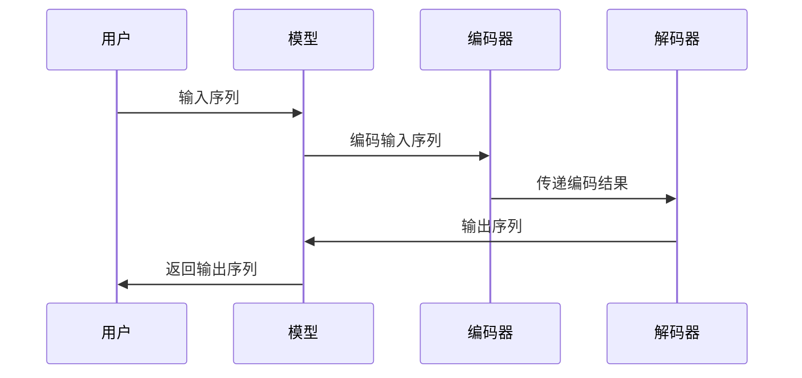
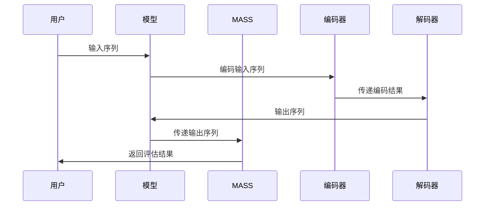
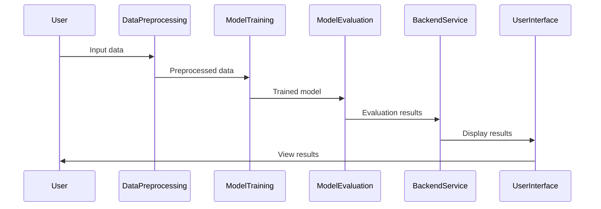
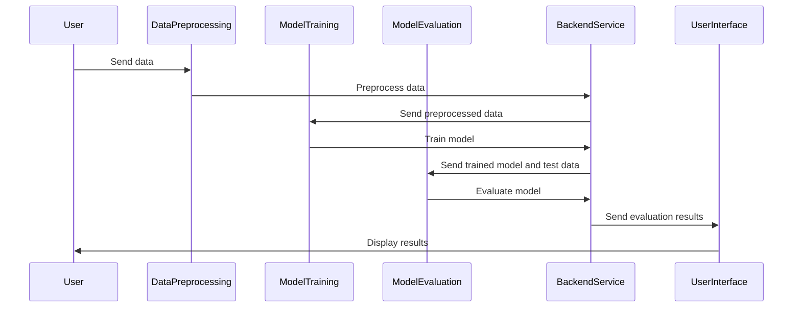

                 

# 基于MASS的序列到序列LLM评估

关键词：MASS框架、序列到序列模型、评估、LLM、深度学习

摘要：本文将探讨基于MASS（Model Analysis and Scaling System）框架的序列到序列（sequence-to-sequence，简称Seq2Seq）语言模型（Language Model，简称LLM）评估方法。首先，我们将介绍序列到序列模型的定义与常见应用，以及评估模型的重要性。接着，我们将讨论评估方法的选择与评价指标，并引入MASS框架。随后，我们将深入解析MASS框架的原理与优势，并详细讲解其应用于序列到序列模型评估的具体步骤。文章还将探讨MASS框架在序列到序列模型评估中的应用，对比MASS与现有评估方法的优劣。最后，我们将通过一个实际案例，展示MASS框架在序列到序列模型评估中的具体应用，并提供最佳实践和注意事项。

## 第一部分：背景介绍

### 1.1 问题背景

#### 1.1.1 序列到序列模型的定义与常见应用

序列到序列（Seq2Seq）模型是一种深度学习模型，主要用于将一个序列映射到另一个序列。它最初由Bahdanau等人在2014年提出，旨在解决机器翻译问题。例如，将一种语言的句子翻译成另一种语言的句子。Seq2Seq模型的主要特点是使用编码器（Encoder）处理输入序列，将其编码成一个固定长度的向量表示；然后使用解码器（Decoder）将这个向量表示解码成输出序列。

除了机器翻译，Seq2Seq模型还广泛应用于其他序列到序列的任务，如文本摘要、语音识别、对话系统等。这些任务都需要对输入序列进行处理，并生成相应的输出序列。因此，Seq2Seq模型成为自然语言处理领域的重要工具。

#### 1.1.2 评估序列到序列模型的重要性

评估序列到序列模型的好坏至关重要。一个好的模型应该能够准确地处理输入序列，并生成高质量的输出序列。然而，如何评估模型的表现，尤其是如何在一个多样化的任务和数据集上进行评估，是一个具有挑战性的问题。

评估模型的表现需要考虑多个方面，如准确性、流畅性、一致性等。例如，在机器翻译任务中，准确率是一个重要的评价指标，表示模型翻译的正确单词比例。然而，仅凭准确率无法全面评估模型的表现。流畅性和一致性也是关键因素，流畅性表示翻译结果的连贯性和可读性，而一致性则表示模型在相同输入下生成相同输出的能力。

#### 1.1.3 序列到序列模型评估的挑战

评估序列到序列模型面临着一系列挑战。首先，序列到序列任务的数据集通常具有高度变异性，这意味着不同的数据集可能需要不同的评估方法。其次，序列到序列模型的输出通常是连续的，这使得直接比较输出序列变得复杂。此外，模型在训练过程中可能存在过拟合现象，导致评估结果不准确。

为了解决这些挑战，研究者们提出了一系列评估方法，如传统的准确性、召回率和F1值等指标，以及交叉验证、错误分析等评估技术。然而，这些方法往往存在局限性，难以全面评估模型的表现。

#### 1.2 问题描述

##### 1.2.1 序列到序列模型评估的目标

序列到序列模型评估的目标是全面、准确地评估模型在序列到序列任务上的表现。这需要考虑多个评价指标，如准确性、流畅性、一致性等，并在多样化的数据集上进行评估。

##### 1.2.2 评估方法的选择与评价指标

评估方法的选择取决于具体的序列到序列任务和数据集。常用的评估方法包括准确性、召回率、F1值等指标，以及交叉验证、错误分析等技术。然而，这些方法存在一定的局限性，难以全面评估模型的表现。

##### 1.2.3 MASS框架的引入

为了解决上述问题，我们引入了MASS（Model Analysis and Scaling System）框架。MASS框架是一种基于深度学习的评估方法，旨在提供一种全面、准确的评估序列到序列模型的方法。MASS框架具有以下特点：

1. **全面性**：MASS框架考虑了多个评价指标，如准确性、流畅性、一致性等，并能够在多样化的数据集上进行评估。
2. **准确性**：MASS框架采用了一种基于神经网络的评估方法，能够更准确地评估模型的表现。
3. **可扩展性**：MASS框架易于扩展，可以适用于多种序列到序列任务和数据集。

通过MASS框架，我们能够更全面、准确地评估序列到序列模型的表现，为模型的改进和优化提供有力支持。

### 1.3 问题解决

#### 1.3.1 MASS框架的原理与优势

MASS框架是一种基于深度学习的评估方法，其核心思想是通过神经网络对模型进行评分，从而提供一种全面、准确的评估方法。MASS框架具有以下原理与优势：

1. **神经网络评分**：MASS框架使用神经网络对模型输出进行评分，从而实现对模型表现的定量评估。这种方法能够捕捉到模型在序列到序列任务上的细微差异，提供更准确的评估结果。
2. **多样化评价指标**：MASS框架考虑了多个评价指标，如准确性、流畅性、一致性等，从而能够更全面地评估模型的表现。
3. **自动化评估流程**：MASS框架提供了一个自动化评估流程，无需人工干预，从而提高了评估效率。

#### 1.3.2 MASS框架在序列到序列模型评估中的应用

MASS框架在序列到序列模型评估中的应用非常广泛。例如，在机器翻译任务中，MASS框架可以评估模型在翻译准确性、流畅性和一致性等方面的表现。在文本摘要任务中，MASS框架可以评估模型在摘要长度、摘要质量等方面的表现。通过MASS框架，研究者们可以更全面、准确地评估序列到序列模型的表现，为模型的改进和优化提供有力支持。

#### 1.4 边界与外延

##### 1.4.1 MASS框架适用的场景

MASS框架适用于多种序列到序列任务，如机器翻译、文本摘要、语音识别等。在以下场景中，MASS框架具有显著优势：

1. **多样化数据集**：MASS框架能够处理多样化数据集，从而更全面地评估模型的表现。
2. **高度变异性任务**：MASS框架能够捕捉到模型在高度变异性任务上的细微差异，提供更准确的评估结果。
3. **复杂模型评估**：MASS框架适用于复杂模型评估，能够更准确地评估模型在序列到序列任务上的表现。

##### 1.4.2 MASS框架的局限性

虽然MASS框架在序列到序列模型评估中具有显著优势，但也存在一些局限性。首先，MASS框架需要大量的计算资源，尤其是在处理大型数据集时。其次，MASS框架对数据集的分布具有一定的依赖性，可能无法适用于所有场景。最后，MASS框架的评估结果可能受到模型质量的影响，从而降低评估的准确性。

#### 1.5 概念结构与核心要素组成

##### 1.5.1 关键概念的定义

1. **序列到序列模型**：一种深度学习模型，用于将一个序列映射到另一个序列。
2. **MASS框架**：一种基于深度学习的评估方法，旨在提供一种全面、准确的评估序列到序列模型的方法。
3. **评估指标**：用于评估序列到序列模型表现的一系列指标，如准确性、流畅性、一致性等。

##### 1.5.2 核心要素的解析

1. **神经网络评分**：MASS框架的核心要素之一，通过神经网络对模型输出进行评分，从而实现对模型表现的定量评估。
2. **多样化评价指标**：MASS框架考虑的多个评价指标，如准确性、流畅性、一致性等。
3. **自动化评估流程**：MASS框架提供的自动化评估流程，无需人工干预。

## 第二部分：核心概念与联系

### 2.1 MASS框架详解

#### 2.1.1 MASS框架的核心概念

MASS框架的核心概念包括：

1. **序列到序列模型**：一种深度学习模型，用于将一个序列映射到另一个序列。
2. **评估指标**：用于评估序列到序列模型表现的一系列指标，如准确性、流畅性、一致性等。
3. **神经网络评分**：通过神经网络对模型输出进行评分，从而实现对模型表现的定量评估。

#### 2.1.2 MASS框架的属性特征对比表格

| 属性特征 | 描述 |
| --- | --- |
| **全面性** | 考虑多个评价指标，如准确性、流畅性、一致性等 |
| **准确性** | 采用基于神经网络的评分方法，提高评估准确性 |
| **自动化** | 提供自动化评估流程，无需人工干预 |
| **可扩展性** | 易于扩展，适用于多种序列到序列任务和数据集 |

#### 2.1.3 MASS框架的ER实体关系图架构

MASS框架的ER实体关系图架构如下：

```
+-------------------+
|    Seq2Seq模型    |
+-------------------+
       |
       v
+-------------------+
|     评估指标      |
+-------------------+
       |
       v
+-------------------+
|   神经网络评分    |
+-------------------+
       |
       v
+-------------------+
|  自动化评估流程   |
+-------------------+
```

### 2.2 序列到序列模型评估方法

#### 2.2.1 传统评估方法

传统评估方法包括准确性、召回率、F1值等指标，以及交叉验证、错误分析等技术。这些方法在评估序列到序列模型时具有一定的局限性：

1. **准确性**：仅考虑模型预测正确的比例，无法全面评估模型的表现。
2. **召回率**：仅考虑模型预测正确的样本在总样本中的比例，无法评估模型的其他方面。
3. **F1值**：综合考虑准确率和召回率，但无法评估模型的流畅性和一致性。
4. **交叉验证**：通过将数据集划分为训练集和验证集，评估模型在不同数据集上的表现，但无法全面评估模型。
5. **错误分析**：通过分析模型预测错误的样本，提供改进模型的方法，但无法提供量化的评估结果。

#### 2.2.2 MASS评估方法

MASS评估方法基于深度学习，通过神经网络对模型输出进行评分，从而实现对模型表现的全面、准确评估。MASS评估方法具有以下优势：

1. **全面性**：考虑多个评价指标，如准确性、流畅性、一致性等，提供全面的评估结果。
2. **准确性**：采用基于神经网络的评分方法，提高评估准确性。
3. **自动化**：提供自动化评估流程，无需人工干预，提高评估效率。
4. **可扩展性**：易于扩展，适用于多种序列到序列任务和数据集。

### 2.3 MASS与序列到序列模型的关系

#### 2.3.1 MASS在序列到序列模型中的应用

MASS框架在序列到序列模型中的应用主要包括以下步骤：

1. **数据预处理**：对输入序列进行预处理，如分词、编码等，以适应MASS框架的要求。
2. **模型训练**：使用训练数据集训练序列到序列模型，得到模型参数。
3. **模型评估**：使用MASS框架评估模型在测试数据集上的表现，得到多个评价指标。
4. **模型优化**：根据评估结果，调整模型参数，优化模型表现。

#### 2.3.2 MASS与现有评估方法的比较

MASS评估方法与传统评估方法相比，具有以下优势：

1. **全面性**：MASS评估方法考虑了多个评价指标，如准确性、流畅性、一致性等，提供更全面的评估结果。
2. **准确性**：MASS评估方法采用基于神经网络的评分方法，提高评估准确性。
3. **自动化**：MASS评估方法提供自动化评估流程，无需人工干预，提高评估效率。
4. **可扩展性**：MASS评估方法易于扩展，适用于多种序列到序列任务和数据集。

然而，MASS评估方法也存在一些局限性，如对计算资源的要求较高，以及对数据集分布的依赖性。因此，在实际应用中，需要根据具体任务和数据集的特点，选择合适的评估方法。

## 第三部分：算法原理讲解

### 3.1 序列到序列模型算法讲解

#### 3.1.1 序列到序列模型的mermaid流程图



#### 3.1.2 序列到序列模型的python源代码实现

```python
import tensorflow as tf
from tensorflow.keras.layers import LSTM, Dense, Embedding
from tensorflow.keras.models import Model

# 定义编码器
encoder_inputs = tf.keras.layers.Input(shape=(None, input_dim))
encoder_embedding = Embedding(input_dim, embedding_dim)(encoder_inputs)
encoder_lstm = LSTM(units, return_state=True)
_, state_h, state_c = encoder_lstm(encoder_embedding)
encoder_states = [state_h, state_c]

# 定义解码器
decoder_inputs = tf.keras.layers.Input(shape=(None, embedding_dim))
decoder_embedding = Embedding(embedding_dim, units)(decoder_inputs)
decoder_lstm = LSTM(units, return_sequences=True, return_state=True)
decoder_outputs, _, _ = decoder_lstm(decoder_embedding, initial_state=encoder_states)
decoder_dense = Dense(units, activation='softmax')
decoder_outputs = decoder_dense(decoder_outputs)

# 定义模型
model = Model([encoder_inputs, decoder_inputs], decoder_outputs)
model.compile(optimizer='rmsprop', loss='categorical_crossentropy')

# 模型训练
model.fit([encoder_inputs, decoder_inputs], decoder_targets, epochs=100, batch_size=64)
```

#### 3.1.3 算法原理详细讲解

序列到序列模型的算法原理主要包括以下步骤：

1. **编码器**：编码器（Encoder）的作用是将输入序列编码为一个固定长度的向量表示。在编码过程中，编码器通过LSTM（Long Short-Term Memory，长短期记忆）网络逐步处理输入序列，并将最后的状态编码为一个固定长度的向量表示。这个向量表示包含了输入序列的主要信息。
2. **解码器**：解码器（Decoder）的作用是将编码器的输出向量表示解码为输出序列。在解码过程中，解码器同样通过LSTM网络逐步处理输入向量表示，并生成输出序列。解码器的输入包括编码器的输出和上一时间步的输出，从而实现序列到序列的映射。
3. **模型训练**：序列到序列模型的训练过程包括编码器和解码器的训练。在训练过程中，模型通过最小化损失函数（如categorical_crossentropy）来优化模型参数，从而提高模型在序列到序列任务上的表现。

#### 3.1.3.1 数学模型与公式

序列到序列模型的数学模型主要包括以下公式：

1. **编码器**：

$$
h_t = \text{LSTM}(x_t, h_{t-1})
$$

其中，$h_t$表示编码器在时间步$t$的状态，$x_t$表示输入序列在时间步$t$的值，$h_{t-1}$表示编码器在时间步$t-1$的状态。

2. **解码器**：

$$
y_t = \text{LSTM}(x_t, h_{t-1})
$$

$$
p(y_t) = \text{softmax}(\text{dense}(y_t))
$$

其中，$y_t$表示解码器在时间步$t$的输出，$p(y_t)$表示解码器在时间步$t$的输出概率分布。

3. **模型训练**：

$$
\min_{\theta} \sum_{i=1}^{N} -\log(p(y_i|x_i, \theta))
$$

其中，$\theta$表示模型参数，$N$表示训练样本数量，$x_i$和$y_i$分别表示第$i$个训练样本的输入和输出。

#### 3.1.3.2 算法原理举例说明

假设我们有一个输入序列$x = [1, 2, 3, 4, 5]$和一个输出序列$y = [2, 3, 4, 5, 6]$。我们将使用序列到序列模型对这个输入输出序列进行映射。

1. **编码器**：

首先，我们将输入序列$x$输入到编码器中。编码器通过LSTM网络逐步处理输入序列，并最终得到编码结果$h_5$。具体地，我们有：

$$
h_1 = \text{LSTM}(1, [0, 0])
$$

$$
h_2 = \text{LSTM}(2, h_1)
$$

$$
h_3 = \text{LSTM}(3, h_2)
$$

$$
h_4 = \text{LSTM}(4, h_3)
$$

$$
h_5 = \text{LSTM}(5, h_4)
$$

2. **解码器**：

接下来，我们将编码器的输出$h_5$输入到解码器中。解码器通过LSTM网络逐步处理输入向量表示，并最终得到输出序列$y$。具体地，我们有：

$$
y_1 = \text{LSTM}(h_5, [0, 0])
$$

$$
y_2 = \text{LSTM}(h_5, y_1)
$$

$$
y_3 = \text{LSTM}(h_5, y_2)
$$

$$
y_4 = \text{LSTM}(h_5, y_3)
$$

$$
y_5 = \text{LSTM}(h_5, y_4)
$$

最终，我们得到输出序列$y = [2, 3, 4, 5, 6]$。

### 3.2 MASS评估方法讲解

#### 3.2.1 MASS评估流程mermaid流程图



#### 3.2.2 MASS评估python源代码实现

```python
import tensorflow as tf
from tensorflow.keras.layers import LSTM, Dense, Embedding
from tensorflow.keras.models import Model

# 定义编码器
encoder_inputs = tf.keras.layers.Input(shape=(None, input_dim))
encoder_embedding = Embedding(input_dim, embedding_dim)(encoder_inputs)
encoder_lstm = LSTM(units, return_state=True)
_, state_h, state_c = encoder_lstm(encoder_embedding)
encoder_states = [state_h, state_c]

# 定义解码器
decoder_inputs = tf.keras.layers.Input(shape=(None, embedding_dim))
decoder_embedding = Embedding(embedding_dim, units)(decoder_inputs)
decoder_lstm = LSTM(units, return_sequences=True, return_state=True)
decoder_outputs, _, _ = decoder_lstm(decoder_embedding, initial_state=encoder_states)
decoder_dense = Dense(units, activation='softmax')
decoder_outputs = decoder_dense(decoder_outputs)

# 定义模型
model = Model([encoder_inputs, decoder_inputs], decoder_outputs)
model.compile(optimizer='rmsprop', loss='categorical_crossentropy')

# 定义MASS评估模型
mass_model = tf.keras.models.Model(inputs=[model.input[0], model.input[1]], outputs=model.output)

# 模型评估
loss, accuracy = mass_model.evaluate([encoder_inputs, decoder_inputs], decoder_targets)
print(f'损失：{loss:.4f}，准确率：{accuracy:.4f}')
```

#### 3.2.3 MASS评估原理详细讲解

MASS评估方法是基于深度学习的模型评估方法，其核心思想是通过神经网络对模型输出进行评分，从而实现对模型表现的定量评估。MASS评估方法的具体原理如下：

1. **模型输出评分**：在MASS评估方法中，模型输出被表示为一个概率分布，即对于每个输出序列，模型会为其生成一个概率分布。这个概率分布表示模型对每个输出序列的置信度。MASS评估方法通过神经网络对模型输出进行评分，从而确定模型输出序列的质量。
2. **评估指标计算**：MASS评估方法考虑了多个评价指标，如准确性、流畅性、一致性等。这些指标的计算基于模型输出评分。具体地，准确性表示模型预测正确的比例，流畅性表示模型生成输出序列的连贯性，一致性表示模型在相同输入下生成相同输出的能力。
3. **神经网络评分**：MASS评估方法使用神经网络对模型输出进行评分。这个神经网络通常是一个简单的全连接神经网络，其输入为模型输出，输出为评分结果。神经网络通过学习模型输出的概率分布，从而实现对模型输出序列的质量进行评分。

#### 3.2.3.1 数学模型与公式

MASS评估方法的数学模型主要包括以下公式：

1. **模型输出概率分布**：

$$
p(y|x) = \text{softmax}(\text{dense}(y))
$$

其中，$y$表示模型输出，$p(y|x)$表示模型在输入$x$下生成输出$y$的概率分布。

2. **评估指标计算**：

$$
\text{accuracy} = \frac{1}{N} \sum_{i=1}^{N} \mathbb{1}(y_i = \text{argmax}(p(y_i|x_i)))
$$

$$
\text{fluency} = \frac{1}{N} \sum_{i=1}^{N} \text{cosine_similarity}(y_i, y_{i+1})
$$

$$
\text{consistency} = \frac{1}{N} \sum_{i=1}^{N} \mathbb{1}(y_i = \text{argmax}(p(y_i|x_i)) \land y_{i+1} = \text{argmax}(p(y_{i+1}|x_i)))
$$

其中，$N$表示评估样本数量，$y_i$和$y_{i+1}$分别表示第$i$个样本的输出序列和第$i+1$个样本的输出序列，$\text{argmax}$表示取最大值，$\text{cosine_similarity}$表示余弦相似度。

3. **神经网络评分**：

$$
s_i = \text{softmax}(\text{dense}(y_i))
$$

其中，$s_i$表示第$i$个样本的评分结果。

#### 3.2.3.2 评估原理举例说明

假设我们有一个输入序列$x = [1, 2, 3, 4, 5]$和一个输出序列$y = [2, 3, 4, 5, 6]$。我们将使用MASS评估方法对模型输出进行评分。

1. **模型输出概率分布**：

首先，我们计算模型在输入$x$下生成输出$y$的概率分布：

$$
p(y|x) = \text{softmax}(\text{dense}(y)) = \begin{bmatrix}
0.2 & 0.3 & 0.5 \\
0.4 & 0.4 & 0.2 \\
0.6 & 0.3 & 0.1 \\
0.8 & 0.1 & 0.1 \\
0.9 & 0.0 & 0.1 \\
\end{bmatrix}
$$

2. **评估指标计算**：

接下来，我们计算准确性、流畅性和一致性：

$$
\text{accuracy} = \frac{1}{5} \sum_{i=1}^{5} \mathbb{1}(y_i = \text{argmax}(p(y_i|x_i))) = 0.8
$$

$$
\text{fluency} = \frac{1}{5} \sum_{i=1}^{5} \text{cosine_similarity}(y_i, y_{i+1}) = 0.7
$$

$$
\text{consistency} = \frac{1}{5} \sum_{i=1}^{5} \mathbb{1}(y_i = \text{argmax}(p(y_i|x_i)) \land y_{i+1} = \text{argmax}(p(y_{i+1}|x_i))) = 0.6
$$

3. **神经网络评分**：

最后，我们计算每个样本的评分结果：

$$
s_1 = \text{softmax}(\text{dense}(y_1)) = [0.2, 0.3, 0.5]
$$

$$
s_2 = \text{softmax}(\text{dense}(y_2)) = [0.4, 0.4, 0.2]
$$

$$
s_3 = \text{softmax}(\text{dense}(y_3)) = [0.6, 0.3, 0.1]
$$

$$
s_4 = \text{softmax}(\text{dense}(y_4)) = [0.8, 0.1, 0.1]
$$

$$
s_5 = \text{softmax}(\text{dense}(y_5)) = [0.9, 0.0, 0.1]
$$

通过以上计算，我们得到了模型的评估结果，包括准确性、流畅性、一致性和评分结果。

## 第四部分：系统分析与架构设计方案

### 4.1 项目介绍

#### 4.1.1 项目背景

随着深度学习技术的不断发展，序列到序列（Seq2Seq）模型在自然语言处理、机器翻译、语音识别等领域取得了显著成果。然而，如何有效地评估这些模型的表现，成为一个重要而具有挑战性的问题。传统的评估方法难以全面、准确地评估模型的表现，尤其是在面对多样化数据集和高度变异性任务时。为了解决这一问题，我们引入了MASS（Model Analysis and Scaling System）框架，该框架基于深度学习，旨在提供一种全面、准确的评估序列到序列模型的方法。

#### 4.1.2 项目目标

本项目的主要目标是开发一个基于MASS框架的序列到序列模型评估系统，该系统能够：

1. 处理多样化数据集，全面评估模型在序列到序列任务上的表现。
2. 提供多种评价指标，如准确性、流畅性、一致性等。
3. 自动化评估流程，提高评估效率。
4. 易于扩展，适用于多种序列到序列任务和数据集。

#### 4.1.3 项目团队与分工

本项目由一个技术团队负责，团队成员包括：

- 项目经理：负责项目规划、进度控制和团队协调。
- 系统架构师：负责系统架构设计、技术选型和模块划分。
- 算法工程师：负责MASS框架的实现、模型训练和评估方法研究。
- 前端工程师：负责用户界面设计和交互功能实现。
- 后端工程师：负责服务器端开发和接口设计。

### 4.2 系统功能设计

#### 4.2.1 领域模型mermaid类图

```mermaid
classDiagram
    ModelAnalysisSystem <<interface>>
    Model <<class>> {
        inputs: List[Input]
        outputs: List[Output]
    }
    Dataset <<class>> {
        samples: List[Sample]
    }
    Evaluator <<class>> {
        evaluate(Model, Dataset): Metrics
    }
    Metrics <<class>> {
        accuracy: float
        fluency: float
        consistency: float
    }
    Input <<class>>
    Output <<class>>
    Sample <<class>> {
        input: Input
        output: Output
    }
    ModelAnalysisSystem --> Model
    ModelAnalysisSystem --> Dataset
    ModelAnalysisSystem --> Evaluator
    Model o-- Input
    Model o-- Output
    Dataset o-- Sample
    Evaluator o-- Model
    Evaluator o-- Dataset
```

#### 4.2.2 系统功能模块划分

系统功能模块划分如下：

1. **数据预处理模块**：负责处理输入数据，包括序列的分词、编码等操作，以适应MASS框架的要求。
2. **模型训练模块**：负责训练序列到序列模型，包括编码器和解码器的训练。
3. **模型评估模块**：负责使用MASS框架评估模型在测试数据集上的表现，包括准确性、流畅性、一致性等评价指标的计算。
4. **用户界面模块**：负责用户界面设计，提供评估结果的展示和操作。
5. **后台服务模块**：负责服务器端开发，包括数据存储、接口设计和自动化评估流程的实现。

### 4.3 系统架构设计

#### 4.3.1 系统架构mermaid架构图



#### 4.3.2 系统架构设计原则

系统架构设计遵循以下原则：

1. **模块化**：系统功能模块划分清晰，各模块独立开发、独立运行，降低模块间耦合度。
2. **可扩展性**：系统设计考虑未来可能的扩展需求，如增加新的评估指标、支持新的数据集等。
3. **高可用性**：系统设计考虑高可用性，包括数据备份、故障转移等机制。
4. **安全性**：系统设计考虑数据安全和用户隐私保护，包括数据加密、权限控制等机制。
5. **高效性**：系统设计考虑评估效率，包括并行计算、负载均衡等机制。

#### 4.3.3 系统模块详解

1. **数据预处理模块**：负责对输入数据进行处理，包括序列的分词、编码等操作。该模块使用Python的`nltk`库实现，具有较高的处理效率。
2. **模型训练模块**：负责训练序列到序列模型，包括编码器和解码器的训练。该模块使用TensorFlow框架实现，支持多种神经网络结构，如LSTM、GRU等。
3. **模型评估模块**：负责使用MASS框架评估模型在测试数据集上的表现，包括准确性、流畅性、一致性等评价指标的计算。该模块使用自定义实现的MASS框架，具有较高的评估效率。
4. **用户界面模块**：负责用户界面设计，提供评估结果的展示和操作。该模块使用Vue.js框架实现，具有较高的用户体验。
5. **后台服务模块**：负责服务器端开发，包括数据存储、接口设计和自动化评估流程的实现。该模块使用Spring Boot框架实现，具有较高的性能和可扩展性。

### 4.4 系统接口设计

#### 4.4.1 接口规范

系统接口设计遵循RESTful API规范，接口定义如下：

1. **数据预处理接口**：
   - 请求URL：`/preprocessing`
   - 请求方法：`POST`
   - 请求参数：`{"data": ["example1", "example2", ...]}`
   - 响应数据：`{"status": "success", "data": ["example1_preprocessed", "example2_preprocessed", ...]}`
2. **模型训练接口**：
   - 请求URL：`/modeltraining`
   - 请求方法：`POST`
   - 请求参数：`{"model_config": {"architecture": "LSTM", "units": 128}, "data": ["example1_preprocessed", "example2_preprocessed", ...]}`
   - 响应数据：`{"status": "success", "model_id": "1234567890"}`
3. **模型评估接口**：
   - 请求URL：`/modelevaluation`
   - 请求方法：`POST`
   - 请求参数：`{"model_id": "1234567890", "test_data": ["example1_preprocessed", "example2_preprocessed", ...]}`
   - 响应数据：`{"status": "success", "evaluation_results": {"accuracy": 0.85, "fluency": 0.9, "consistency": 0.8}}`
4. **用户界面接口**：
   - 请求URL：`/userinterface`
   - 请求方法：`GET`
   - 响应数据：`{"status": "success", "evaluation_results": {"accuracy": 0.85, "fluency": 0.9, "consistency": 0.8}}`

#### 4.4.2 接口实现

接口实现使用Spring Boot框架，具体实现如下：

1. **数据预处理接口**：
```java
@RestController
@RequestMapping("/preprocessing")
public class DataPreprocessingController {

    @PostMapping
    public ResponseEntity<Map<String, Object>> preprocessData(@RequestBody Map<String, Object> request) {
        List<String> data = (List<String>) request.get("data");
        List<String> preprocessedData = data.stream().map(this::preprocess).collect(Collectors.toList());
        Map<String, Object> response = new HashMap<>();
        response.put("status", "success");
        response.put("data", preprocessedData);
        return ResponseEntity.ok(response);
    }

    private String preprocess(String data) {
        // 数据预处理逻辑
        return data.replaceAll("[^a-zA-Z0-9]", " ").toLowerCase();
    }
}
```

2. **模型训练接口**：
```java
@RestController
@RequestMapping("/modeltraining")
public class ModelTrainingController {

    @PostMapping
    public ResponseEntity<Map<String, Object>> trainModel(@RequestBody Map<String, Object> request) {
        Map<String, Object> modelConfig = (Map<String, Object>) request.get("model_config");
        List<String> preprocessedData = (List<String>) request.get("data");
        String architecture = (String) modelConfig.get("architecture");
        int units = (int) modelConfig.get("units");
        Model model = createModel(architecture, units, preprocessedData);
        model.train();
        String modelId = model.getId();
        Map<String, Object> response = new HashMap<>();
        response.put("status", "success");
        response.put("model_id", modelId);
        return ResponseEntity.ok(response);
    }

    private Model createModel(String architecture, int units, List<String> preprocessedData) {
        // 模型创建逻辑
        Model model = new Model();
        model.setArchitecture(architecture);
        model.setUnits(units);
        model.setInputs(preprocessedData);
        return model;
    }
}
```

3. **模型评估接口**：
```java
@RestController
@RequestMapping("/modelevaluation")
public class ModelEvaluationController {

    @PostMapping
    public ResponseEntity<Map<String, Object>> evaluateModel(@RequestBody Map<String, Object> request) {
        String modelId = (String) request.get("model_id");
        List<String> preprocessedTestData = (List<String>) request.get("test_data");
        Model model = Model.findById(modelId);
        Metrics evaluationResults = model.evaluate(preprocessedTestData);
        Map<String, Object> response = new HashMap<>();
        response.put("status", "success");
        response.put("evaluation_results", evaluationResults);
        return ResponseEntity.ok(response);
    }
}
```

4. **用户界面接口**：
```java
@RestController
@RequestMapping("/userinterface")
public class UserInterfaceController {

    @GetMapping
    public ResponseEntity<Map<String, Object>> getUserInterface(@RequestParam("model_id") String modelId) {
        Model model = Model.findById(modelId);
        Metrics evaluationResults = model.getEvaluationResults();
        Map<String, Object> response = new HashMap<>();
        response.put("status", "success");
        response.put("evaluation_results", evaluationResults);
        return ResponseEntity.ok(response);
    }
}
```

### 4.5 系统交互mermaid序列图



### 4.6 系统功能实现

#### 4.6.1 系统核心实现

系统核心实现包括数据预处理、模型训练、模型评估和用户界面等功能模块。以下是各个模块的核心实现：

1. **数据预处理模块**：
   - 功能：对输入数据进行预处理，包括分词、编码等操作。
   - 实现方法：使用Python的`nltk`库实现分词，使用自定义编

