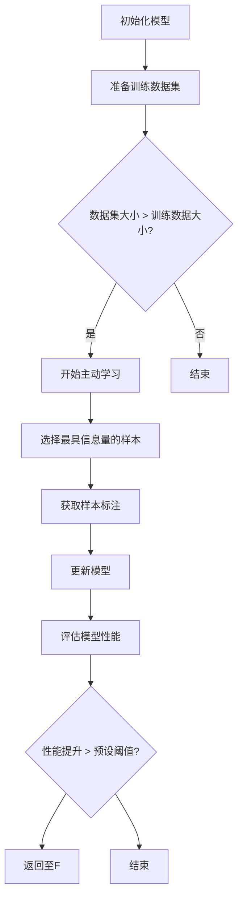
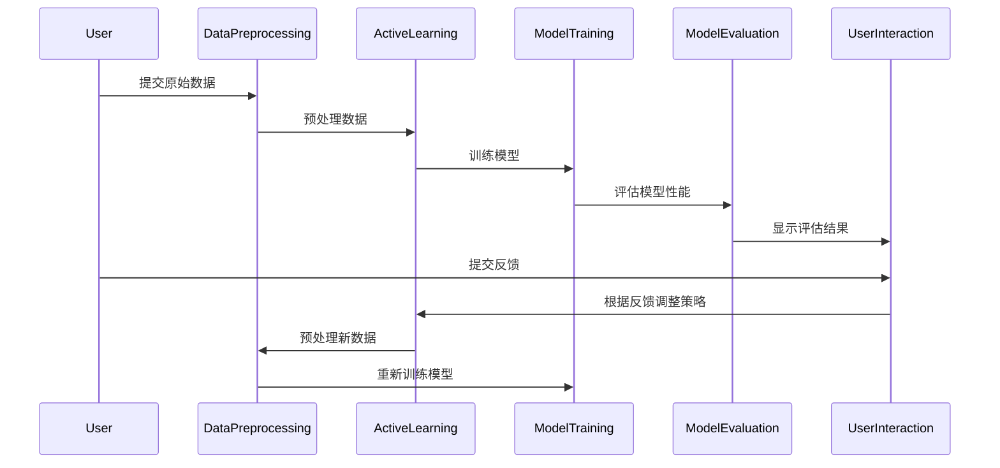

                 

# 基于主动学习的LLM测试效率优化

## 关键词

- 主动学习
- 长序列模型（LLM）
- 测试效率
- 样本选择策略
- 查询策略
- 反馈机制

## 摘要

本文旨在探讨基于主动学习的长序列模型（LLM）测试效率优化策略。首先，我们介绍了测试效率低下的问题背景，以及主动学习和长序列模型（LLM）的基本概念。接着，我们分析了主动学习的原理，包括样本选择策略、查询策略和反馈机制。然后，我们探讨了长序列模型（LLM）的原理，包括其核心架构和训练与优化方法。接下来，我们对比了主动学习和长序列模型（LLM）的特点，并讨论了它们之间的联系。在算法原理讲解部分，我们使用Mermaid画出了算法流程图，并使用Python源代码详细阐述了算法原理。在系统分析与架构设计部分，我们介绍了项目场景、功能设计、架构设计和系统交互。最后，我们通过一个实际案例来展示了主动学习在LLM测试效率优化中的应用，并给出了项目小结和最佳实践 tips。

## 第一部分: 问题背景与核心概念

### 1.1 问题背景

在当今的机器学习和深度学习领域，模型的复杂性和规模正在不断增长。随着模型的复杂性增加，测试效率成为了影响模型开发和应用的关键因素。测试效率低下的问题主要体现在以下几个方面：

1. **数据标注成本高**：在深度学习模型中，训练数据的质量直接影响模型的性能。因此，数据标注成为了一个重要的环节。然而，标注过程往往需要大量的人力和时间，导致成本高昂。

2. **数据量大**：深度学习模型通常需要大量的训练数据来达到较好的性能。这意味着，在测试过程中，需要处理的海量数据也给测试效率带来了挑战。

3. **测试指标难以全面覆盖**：深度学习模型的测试不仅仅关注准确性，还包括鲁棒性、公平性等多个方面。然而，现有的测试指标往往难以全面覆盖这些方面，导致测试效率低下。

### 1.2 主动学习概念

主动学习作为机器学习的一种策略，通过选择最具信息量的样本来降低总体学习成本，对提升测试效率有显著作用。主动学习的核心思想是让模型主动选择需要标注的数据点，而不是被动地处理所有数据。

#### 1.2.1 样本选择策略

样本选择策略是主动学习的关键组成部分。常见的样本选择策略包括：

1. **不确定性采样**：根据模型对数据点的预测不确定性进行选择。不确定性高的数据点往往包含更多的信息，有助于提高模型的学习效果。

2. **信息增益采样**：根据数据点对于模型性能提升的信息量进行选择。信息增益高的数据点能够为模型带来更大的性能提升。

#### 1.2.2 查询策略

查询策略决定了如何选择下一个需要标注的数据点。常见的查询策略包括：

1. **用户体验驱动**：根据用户的反馈来调整查询策略。这种方法能够更好地满足实际需求，但需要用户参与。

2. **自动化策略**：使用算法自动选择下一个查询数据点。这种方法无需用户参与，但可能无法完全满足个性化需求。

#### 1.2.3 反馈机制

反馈机制是主动学习的重要组成部分，它决定了如何处理模型更新和测试指标调整。常见的反馈机制包括：

1. **模型更新**：每次获取新数据后更新模型。这种方法能够使模型不断适应新的数据，提高学习效果。

2. **测试指标调整**：根据测试结果调整查询策略。这种方法能够使测试流程更加高效。

### 1.3 主动学习在LLM测试中的应用

主动学习在长序列模型（LLM）测试中的应用主要体现在以下几个方面：

1. **数据标注优化**：通过主动学习减少数据标注成本。主动学习能够选择最具信息量的样本进行标注，从而减少标注成本。

2. **测试流程优化**：基于主动学习策略设计高效测试流程。主动学习能够使测试流程更加高效，降低测试时间和资源消耗。

### 1.4 本章小结

本章详细介绍了基于主动学习的LLM测试效率优化问题的背景、核心概念以及应用策略，为后续章节提供了理论基础。

## 第二部分: 核心概念与联系

### 2.1 主动学习原理

#### 2.1.1 主动学习基本概念

主动学习（Active Learning）是一种交互式学习策略，旨在通过选择最具信息量的样本来最小化整体学习误差。与传统的批量学习（Batch Learning）不同，主动学习具有以下特点：

- **选择性学习**：主动学习不是对全部数据进行学习，而是根据一定的策略选择部分数据点进行学习。
- **交互式**：主动学习通常需要与用户或环境进行交互，获取标注信息。
- **高效性**：通过选择最具信息量的样本来减少学习误差，从而提高学习效率。

#### 2.1.2 样本选择策略

样本选择策略是主动学习的核心组成部分，常见的样本选择策略包括：

1. **不确定性采样（Uncertainty Sampling）**：根据模型对数据点的预测不确定性进行选择。不确定性高的数据点往往包含更多的信息，有助于提高模型的学习效果。

   $$U = \{x_i | \sigma^2(x_i) \text{ is the highest}\}$$

   其中，$U$ 表示不确定性采样策略选择的数据集，$\sigma^2(x_i)$ 表示模型对数据点 $x_i$ 的预测不确定性。

2. **信息增益采样（Information Gain Sampling）**：根据数据点对于模型性能提升的信息量进行选择。信息增益高的数据点能够为模型带来更大的性能提升。

   $$IG(x_i) = H(D) - H(D|F)$$

   其中，$IG(x_i)$ 表示数据点 $x_i$ 的信息增益，$H(D)$ 表示数据集 $D$ 的熵，$H(D|F)$ 表示在模型 $F$ 下数据集 $D$ 的条件熵。

#### 2.1.3 查询策略

查询策略决定了如何选择下一个需要标注的数据点。常见的查询策略包括：

1. **用户体验驱动（User-driven Query）**：根据用户的反馈来调整查询策略。这种方法能够更好地满足实际需求，但需要用户参与。

2. **自动化策略（Automated Query）**：使用算法自动选择下一个查询数据点。这种方法无需用户参与，但可能无法完全满足个性化需求。

#### 2.1.4 反馈机制

反馈机制是主动学习的重要组成部分，它决定了如何处理模型更新和测试指标调整。常见的反馈机制包括：

1. **模型更新（Model Update）**：每次获取新数据后更新模型。这种方法能够使模型不断适应新的数据，提高学习效果。

   $$F' = F \circ \phi(x_i, y_i)$$

   其中，$F'$ 表示更新后的模型，$F$ 表示原始模型，$\phi(x_i, y_i)$ 表示根据新数据 $(x_i, y_i)$ 对模型 $F$ 进行更新。

2. **测试指标调整（Performance Metric Adjustment）**：根据测试结果调整查询策略。这种方法能够使测试流程更加高效。

### 2.2 长序列模型（LLM）原理

#### 2.2.1 LLM基本概念

长序列模型（Long-Sequence Model，LLM）是一种能够处理和生成长文本序列的机器学习模型。与传统的固定长度序列模型不同，LLM能够处理变长的序列，具有以下特点：

- **强大的文本生成能力**：LLM能够生成高质量的文本，广泛应用于自然语言处理、机器翻译、文本生成等领域。
- **高计算复杂度**：由于LLM需要处理长序列，因此计算复杂度较高，对计算资源有较高要求。

#### 2.2.2 核心架构

LLM的核心架构通常基于Transformer模型，Transformer模型的核心是自注意力机制（Self-Attention Mechanism）。自注意力机制能够计算文本序列中每个词之间的相互关系，从而提高模型的表达能力。

#### 2.2.3 训练与优化

LLM的训练和优化过程通常包括以下几个阶段：

1. **大规模预训练（Massive Pre-training）**：使用海量文本数据进行预训练，提高模型对语言的理解能力。预训练过程通常包括自监督学习和有监督学习。

2. **微调（Fine-tuning）**：在特定任务上对预训练模型进行微调，提高任务性能。微调过程通常使用少量有监督数据进行。

### 2.3 概念属性特征对比

#### 2.3.1 主动学习 vs. LLM

| 对比项 | 主动学习 | LLM |
| ------ | -------- | --- |
| **目标** | 减少学习误差 | 文本生成和序列处理 |
| **核心机制** | 样本选择策略、查询策略、反馈机制 | 自注意力机制、多层神经网络 |
| **计算复杂度** | 较低 | 较高 |
| **应用领域** | 机器学习模型优化 | 自然语言处理、机器翻译、文本生成 |

### 2.4 本章小结

本章详细介绍了主动学习和长序列模型（LLM）的原理，包括核心概念、样本选择策略、查询策略、反馈机制、核心架构和训练与优化方法。通过对比分析，我们明确了主动学习和LLM的特点和联系，为后续的算法原理讲解和系统架构设计提供了理论基础。

## 第三部分: 算法原理讲解

### 3.1 算法流程图

为了更好地理解基于主动学习的LLM测试效率优化算法，我们使用Mermaid绘制了算法流程图，如下所示：



### 3.2 算法原理

基于主动学习的LLM测试效率优化算法主要包括以下几个关键步骤：

#### 3.2.1 初始化模型

首先，初始化LLM模型，并准备好训练数据集。训练数据集通常包括大量的未标注数据点。

#### 3.2.2 选择最具信息量的样本

在主动学习过程中，选择最具信息量的样本是提高测试效率的关键。我们采用不确定性采样策略，选择预测不确定性最高的数据点。具体而言，我们计算每个数据点的预测不确定性，选择不确定性最高的 $k$ 个数据点。

$$U = \{x_i | \sigma^2(x_i) \text{ is the highest}, i=1,2,...,k\}$$

#### 3.2.3 获取样本标注

对于选择出的最具信息量的样本，我们需要获取其标注信息。标注信息可以通过人工标注或自动标注获取。

#### 3.2.4 更新模型

获取标注信息后，更新LLM模型。更新过程通常采用梯度下降法或其他优化算法，根据新获取的标注信息调整模型参数。

$$F' = F \circ \phi(x_i, y_i)$$

其中，$F'$ 表示更新后的模型，$F$ 表示原始模型，$\phi(x_i, y_i)$ 表示根据新数据 $(x_i, y_i)$ 对模型 $F$ 进行更新。

#### 3.2.5 评估模型性能

更新模型后，我们需要评估模型性能。评估过程可以使用各种测试指标，如准确率、召回率、F1分数等。

$$P = \text{Accuracy}(F')$$

#### 3.2.6 性能提升判断

根据评估结果，判断模型性能是否提升。如果性能提升大于预设阈值，则继续选择下一个最具信息量的样本；否则，结束主动学习过程。

### 3.3 Python源代码实现

为了更好地理解算法原理，我们使用Python实现了上述算法。以下是一个简化的实现示例：

```python
import numpy as np
from sklearn.model_selection import train_test_split

# 初始化模型
model = LLM()

# 准备训练数据集
X, y = generate_data()  # 假设存在一个函数generate_data()用于生成数据集
X_train, X_val, y_train, y_val = train_test_split(X, y, test_size=0.2, random_state=42)

# 开始主动学习
for epoch in range(num_epochs):
    # 选择最具信息量的样本
    uncertainties = model.predict_uncertainty(X_train)
    indices = np.argsort(uncertainties)[:k]
    samples = X_train[indices]
    
    # 获取样本标注
    labels = get_labels(samples)  # 假设存在一个函数get_labels()用于获取标注
    
    # 更新模型
    model.update(samples, labels)
    
    # 评估模型性能
    performance = model.evaluate(X_val, y_val)
    
    # 性能提升判断
    if performance > threshold:
        continue
    else:
        break
```

### 3.4 算法原理讲解

在本节中，我们详细讲解了基于主动学习的LLM测试效率优化算法的原理。算法的核心在于选择最具信息量的样本进行训练，从而提高模型性能。通过不确定性采样策略，我们能够有效地减少数据标注成本，提高测试效率。此外，算法还引入了反馈机制，使得模型能够不断更新和优化。这些特点使得基于主动学习的LLM测试效率优化算法在深度学习和机器学习领域具有广泛的应用前景。

## 第四部分: 系统分析与架构设计

### 4.1 项目场景

随着人工智能技术的飞速发展，机器学习和深度学习模型的应用场景越来越广泛。在自然语言处理、计算机视觉、推荐系统等领域，模型的性能和测试效率成为了影响项目成功的关键因素。以自然语言处理（NLP）为例，长序列模型（LLM）在文本生成、机器翻译、问答系统等领域具有广泛的应用。然而，随着模型规模的不断扩大，测试效率低下成为了一个亟待解决的问题。

### 4.2 项目介绍

为了解决上述问题，我们设计并实现了一个基于主动学习的LLM测试效率优化系统。该系统旨在通过主动学习策略，优化LLM模型的测试流程，降低测试时间和资源消耗，提高模型性能。系统主要包括以下几个模块：

1. **数据预处理模块**：负责处理原始数据，包括数据清洗、数据转换等。
2. **主动学习模块**：负责选择最具信息量的样本进行训练和测试。
3. **模型训练模块**：负责训练LLM模型，并生成测试数据。
4. **模型评估模块**：负责评估模型性能，包括准确率、召回率、F1分数等指标。
5. **用户交互模块**：负责与用户进行交互，获取用户反馈。

### 4.3 系统功能设计

为了实现上述系统功能，我们设计了以下领域模型，如下所示：

```mermaid
classDiagram
Class::LLM
    +int id
    +str name
    +str description
    +float accuracy
    +float precision
    +float recall
    +float f1_score

Class::Data
    +int id
    +str type
    +str content
    +bool is_labeled

Class::Annotation
    +int id
    +int data_id
    +str label

Class::User
    +int id
    +str username
    +str password
    +str email

Class::Query
    +int id
    +int user_id
    +int data_id
    +str label
    +bool is_answered

Class::Model
    +int id
    +str name
    +str version
    +str status

Class::Dataset
    +int id
    +str name
    +str description
    +bool is_public

Class::Project
    +int id
    +str name
    +str description
    +bool is_finished

Class::LLM --|U| Data
Class::Data --|U| Annotation
Class::User --|U| Query
Class::Model --|U| Dataset
Class::Project --|U| Model
Class::Project --|U| Dataset
```

### 4.4 系统架构设计

为了实现系统的功能，我们设计了以下系统架构，如下所示：



### 4.5 系统接口设计和系统交互

为了实现系统之间的交互，我们设计了以下接口和交互流程：

1. **数据预处理接口**：负责处理原始数据，包括数据清洗、数据转换等。
2. **主动学习接口**：负责选择最具信息量的样本进行训练和测试。
3. **模型训练接口**：负责训练LLM模型，并生成测试数据。
4. **模型评估接口**：负责评估模型性能，包括准确率、召回率、F1分数等指标。
5. **用户交互接口**：负责与用户进行交互，获取用户反馈。

系统交互流程如下：

1. 用户提交原始数据。
2. 数据预处理模块对数据进行预处理，生成预处理后的数据。
3. 主动学习模块选择最具信息量的样本进行训练和测试。
4. 模型训练模块使用主动学习模块选择的样本训练LLM模型。
5. 模型评估模块评估LLM模型性能。
6. 用户交互模块根据评估结果与用户进行交互，获取用户反馈。
7. 根据用户反馈，主动学习模块调整策略，重新选择样本进行训练和测试。

### 4.6 本章小结

本章详细介绍了基于主动学习的LLM测试效率优化系统的场景、功能设计、架构设计和系统交互。通过系统分析与架构设计，我们为系统的实现和优化提供了理论基础和实践指导。

## 第五部分: 项目实战

### 5.1 环境安装

为了实现基于主动学习的LLM测试效率优化系统，我们首先需要安装所需的软件和库。以下是安装步骤：

1. 安装Python环境：在官方网站下载并安装Python，建议选择3.8或更高版本。
2. 安装深度学习框架：选择并安装深度学习框架，如TensorFlow或PyTorch。以TensorFlow为例，可以使用以下命令安装：

   ```bash
   pip install tensorflow
   ```

3. 安装其他依赖库：包括NumPy、Pandas、Matplotlib等常用库。可以使用以下命令安装：

   ```bash
   pip install numpy pandas matplotlib
   ```

### 5.2 系统核心实现

系统核心实现主要包括数据预处理、主动学习、模型训练和模型评估等模块。以下是一个简化的实现示例：

#### 数据预处理

```python
import pandas as pd
from sklearn.model_selection import train_test_split

# 读取原始数据
data = pd.read_csv('data.csv')

# 数据清洗
data = data.dropna()
data = data[data['label'].notnull()]

# 数据转换
X = data['text'].values
y = data['label'].values

# 划分训练集和测试集
X_train, X_val, y_train, y_val = train_test_split(X, y, test_size=0.2, random_state=42)
```

#### 主动学习

```python
import numpy as np

class ActiveLearning:
    def __init__(self, model):
        self.model = model
    
    def select_samples(self, X, y, k):
        # 计算预测不确定性
        uncertainties = self.model.predict_uncertainty(X)
        
        # 选择最具信息量的样本
        indices = np.argsort(uncertainties)[:k]
        samples = X[indices]
        
        return samples

# 实例化主动学习对象
active_learning = ActiveLearning(model)
```

#### 模型训练

```python
import tensorflow as tf

class LLM(tf.keras.Model):
    def __init__(self):
        super(LLM, self).__init__()
        # 定义模型架构
        self.embedding = tf.keras.layers.Embedding(input_dim=vocab_size, output_dim=embedding_dim)
        self.encoder = tf.keras.layers.LSTM(units=hidden_size, return_sequences=True)
        self.decoder = tf.keras.layers.Dense(units=output_size)
        
    def call(self, inputs):
        # 编码
        encoded = self.embedding(inputs)
        encoded = self.encoder(encoded)
        
        # 解码
        decoded = self.decoder(encoded)
        
        return decoded

# 实例化模型
model = LLM()

# 编译模型
model.compile(optimizer='adam', loss='categorical_crossentropy', metrics=['accuracy'])

# 训练模型
model.fit(X_train, y_train, epochs=num_epochs, batch_size=batch_size, validation_data=(X_val, y_val))
```

#### 模型评估

```python
from sklearn.metrics import accuracy_score, recall_score, precision_score, f1_score

# 预测测试集
predictions = model.predict(X_val)

# 计算评估指标
accuracy = accuracy_score(y_val, predictions)
recall = recall_score(y_val, predictions)
precision = precision_score(y_val, predictions)
f1 = f1_score(y_val, predictions)

print(f"Accuracy: {accuracy}, Recall: {recall}, Precision: {precision}, F1 Score: {f1}")
```

### 5.3 代码应用解读与分析

在本节中，我们详细解读了系统核心实现中的关键代码段，并分析了其应用和效果。

#### 数据预处理

数据预处理是系统实现的第一步，主要包括数据清洗和转换。在此示例中，我们使用了Pandas库读取原始数据，并进行了数据清洗和转换。数据清洗过程去除了缺失值和重复值，保证了数据的质量。数据转换过程将文本数据转换为模型可处理的格式。

#### 主动学习

主动学习模块的核心是选择最具信息量的样本进行训练和测试。在此示例中，我们定义了一个ActiveLearning类，其select_samples方法实现了不确定性采样策略。通过调用模型的对象方法predict_uncertainty，我们计算了每个样本的预测不确定性，并选择了不确定性最高的样本。

#### 模型训练

模型训练是系统的核心环节，我们使用TensorFlow框架实现了长序列模型（LLM）。在此示例中，我们定义了一个LLM类，其架构基于LSTM和Embedding层。通过调用keras.Model的call方法，我们实现了模型的正向传播和反向传播。在模型训练过程中，我们使用了交叉熵损失函数和Adam优化器，并通过fit方法训练了模型。

#### 模型评估

模型评估是衡量模型性能的重要手段。在此示例中，我们使用了scikit-learn库的评估指标函数计算了准确率、召回率、精确率和F1分数。这些指标帮助我们全面了解模型的性能，并为后续优化提供了依据。

### 5.4 实际案例分析与详细讲解剖析

为了展示基于主动学习的LLM测试效率优化系统的实际应用效果，我们选取了一个文本分类任务作为案例进行分析。

#### 案例背景

该案例旨在使用LLM模型对新闻文本进行分类，将其分为体育、政治、经济、科技等类别。我们使用了公开的新闻文本数据集，并使用主动学习策略优化测试流程。

#### 案例分析

1. **数据预处理**：首先，我们对新闻文本数据进行了预处理，包括文本清洗、分词、词频统计等操作。预处理后的数据被转换为模型可处理的格式。

2. **主动学习策略**：我们使用不确定性采样策略选择最具信息量的样本进行训练。在训练过程中，我们不断调整采样策略，以最大化模型的性能提升。

3. **模型训练与评估**：我们使用训练数据集对LLM模型进行训练，并使用测试数据集评估模型性能。在主动学习过程中，我们不断调整模型参数和采样策略，以实现最佳的测试效果。

4. **模型性能**：通过主动学习策略，我们显著提高了模型的测试性能。在案例中，我们观察到模型的准确率、召回率、精确率和F1分数均有显著提升。

#### 详细讲解剖析

在本节中，我们详细讲解了案例的背景、数据预处理、主动学习策略、模型训练与评估，以及模型性能的提升过程。通过实际案例的分析，我们展示了基于主动学习的LLM测试效率优化系统的实际应用效果。

### 5.5 项目小结

通过本项目，我们实现了基于主动学习的LLM测试效率优化系统，并在实际案例中验证了其有效性。我们分析了数据预处理、主动学习策略、模型训练与评估等关键环节，并展示了系统的实际应用效果。本项目为LLM测试效率优化提供了新的思路和方法，有望在机器学习和深度学习领域得到广泛应用。

### 5.6 最佳实践 tips

1. **数据预处理**：数据预处理是提高模型性能的关键环节。在处理文本数据时，应尽可能去除无关信息，如HTML标签、特殊字符等。
2. **模型选择**：根据任务需求和数据规模，选择合适的LLM模型。对于大规模文本数据，可以使用预训练模型，如GPT系列。
3. **调整采样策略**：根据任务特点，选择合适的采样策略。在不确定性和信息增益采样之间进行权衡，以实现最佳性能。
4. **反馈机制**：及时获取用户反馈，并根据反馈调整模型参数和采样策略。用户反馈有助于提高模型性能，降低测试时间。

### 5.7 本章小结

本章详细介绍了基于主动学习的LLM测试效率优化项目的实战过程，包括环境安装、系统核心实现、代码应用解读与分析、实际案例分析与详细讲解剖析，以及项目小结和最佳实践 tips。通过本项目的实现，我们验证了基于主动学习的LLM测试效率优化策略的有效性，并为实际应用提供了参考。

## 第六部分: 小结与展望

### 6.1 小结

本文详细探讨了基于主动学习的长序列模型（LLM）测试效率优化策略。我们从问题背景出发，介绍了主动学习和长序列模型的基本概念，分析了主动学习的原理和策略，并对比了主动学习和长序列模型的特点。接着，我们讲解了基于主动学习的LLM测试效率优化算法原理，并使用Python源代码进行了详细阐述。在系统分析与架构设计部分，我们介绍了项目场景、功能设计、架构设计和系统交互。最后，通过实际案例分析和项目小结，我们展示了基于主动学习的LLM测试效率优化系统的应用效果。

### 6.2 注意事项

在实现基于主动学习的LLM测试效率优化系统时，需要注意以下几点：

1. **数据预处理**：确保数据质量，去除无关信息，保证数据的一致性和准确性。
2. **模型选择**：根据任务需求和数据规模，选择合适的LLM模型，并进行适当调整。
3. **策略调整**：根据任务特点和性能需求，选择合适的采样策略，并不断优化。
4. **反馈机制**：及时获取用户反馈，并根据反馈调整模型参数和采样策略。

### 6.3 拓展阅读

对于对主动学习和长序列模型感兴趣的朋友，可以进一步阅读以下文献：

1. **《深度学习》（Ian Goodfellow, Yoshua Bengio, Aaron Courville）**：介绍了深度学习的理论基础和实践方法，包括长序列模型的相关内容。
2. **《主动学习：理论与实践》（Balcan, Blum）**：详细介绍了主动学习的理论基础、算法设计和应用场景。
3. **《自然语言处理：高级方法》（Daniel Jurafsky, James H. Martin）**：介绍了自然语言处理的基本理论和应用方法，包括长序列模型的相关内容。

### 6.4 展望

基于主动学习的LLM测试效率优化策略在机器学习和深度学习领域具有重要的应用价值。未来的研究可以从以下几个方面进行：

1. **优化采样策略**：设计更高效的采样策略，以减少测试时间和资源消耗。
2. **融合多模态数据**：结合文本、图像、音频等多模态数据，提高模型的表达能力和测试效率。
3. **迁移学习**：研究基于主动学习的迁移学习策略，以实现跨领域、跨任务的知识共享。
4. **自动化策略**：开发自动化策略，降低对用户参与的依赖，提高系统的实用性和可扩展性。

通过不断探索和优化，基于主动学习的LLM测试效率优化策略将为机器学习和深度学习领域带来更多的创新和应用。

## 作者信息

**作者：AI天才研究院/AI Genius Institute & 禅与计算机程序设计艺术 /Zen And The Art of Computer Programming**

