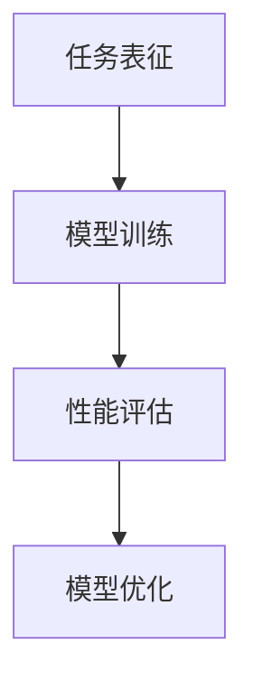

                 

# 基于元学习的评测模型快速适应

> 关键词：元学习、评测模型、自适应、快速适应、算法原理、实践案例

> 摘要：本文深入探讨了基于元学习的评测模型快速适应技术。首先，我们介绍了元学习和评测模型的基本概念与原理，阐述了它们在人工智能领域的应用。随后，我们探讨了元学习在评测模型适应中的优势，并详细讲解了基于元学习的自适应评测模型算法原理。通过实际案例，我们展示了如何通过元学习实现评测模型的快速适应，以及评估与优化策略。最后，我们展望了基于元学习的评测模型在未来发展中的潜力。

----------------------------------------------------------------

## 引言

在人工智能和机器学习领域，评测模型的质量直接影响着算法的性能和实际应用效果。随着数据规模和复杂性的增加，传统的评测模型很难在短时间内适应不断变化的数据环境。为了解决这个问题，元学习（Meta-Learning）提供了一种有效的方法，通过学习如何快速适应新环境，从而提高评测模型的灵活性和适应性。

本文旨在探讨基于元学习的评测模型快速适应技术，通过以下章节展开讨论：

1. 元学习概述
2. 评测模型的基本原理
3. 元学习在评测模型中的应用
4. 基于元学习的评测模型适应算法
5. 快速适应评测模型的实践
6. 基于元学习的评测模型评估与优化
7. 基于元学习的评测模型应用案例分析
8. 未来展望与总结

接下来，我们将逐一深入探讨这些章节的内容。

----------------------------------------------------------------

## 元学习概述

### 1.1 元学习的定义

元学习是一种学习算法，它旨在学习如何快速适应新任务，而不是从头开始训练。在传统机器学习中，模型需要在每个新任务上重新训练，这需要大量时间和计算资源。而元学习通过学习如何快速适应新任务，实现了对资源的有效利用。

### 1.2 元学习的发展历程

元学习的历史可以追溯到20世纪60年代，当时学者们开始研究如何让机器在不同任务上表现更好。随着深度学习和强化学习的发展，元学习得到了新的生命力，并在过去几年中取得了显著进展。

### 1.3 元学习的关键概念

元学习的关键概念包括模型泛化能力、任务表征和元学习算法。模型泛化能力指的是模型在新任务上的表现能力。任务表征是指如何将新任务转化为适合模型学习的形式。元学习算法则是实现元学习的关键技术。

### 1.4 元学习的应用领域

元学习在多个领域都有广泛应用，包括计算机视觉、自然语言处理和强化学习。在计算机视觉领域，元学习可以帮助模型在新的图像分类任务上快速适应；在自然语言处理领域，元学习可以用于文本分类和机器翻译；在强化学习领域，元学习可以用于学习新的策略。

----------------------------------------------------------------

## 评测模型的基本原理

### 2.1 评测模型的定义

评测模型是一种用于评估机器学习模型性能的模型。它通过对测试数据集进行预测，并与真实值进行比较，评估模型的准确性、召回率和F1值等性能指标。

### 2.2 评测模型的设计原则

设计评测模型时，需要遵循以下原则：

1. **公平性**：确保评测模型对训练数据集和测试数据集的评估是公平的。
2. **代表性**：评测模型应能够代表真实场景中的数据分布。
3. **可解释性**：评测模型的结果应易于理解，以便进行后续的模型优化。

### 2.3 评测模型的性能评估

评测模型的性能评估主要包括以下几个方面：

1. **准确性**：预测值与真实值之间的一致性。
2. **召回率**：能够正确识别为正例的样本占总正例样本的比例。
3. **F1值**：综合考虑准确性和召回率的指标。

评估指标的选择取决于具体的应用场景，例如在医疗诊断中，召回率可能更重要，而在金融风险评估中，准确性可能更重要。

----------------------------------------------------------------

## 元学习在评测模型中的应用

### 3.1 元学习在评测模型适应中的优势

元学习在评测模型中的主要优势包括：

1. **快速适应**：通过元学习，模型可以快速适应新的数据分布和任务要求，减少重新训练的时间。
2. **减少重新训练成本**：元学习可以减少在多个任务上重新训练的次数，降低计算资源的消耗。
3. **提高泛化能力**：元学习可以帮助模型在新的任务上保持良好的表现，提高模型的泛化能力。

### 3.2 基于元学习的自适应评测模型

基于元学习的自适应评测模型通过以下步骤实现：

1. **任务表征**：将新任务转化为模型可以学习的形式。
2. **模型训练**：使用元学习算法对新任务进行训练。
3. **性能评估**：使用评测模型对训练结果进行评估。
4. **模型优化**：根据评估结果对模型进行优化。

通过这些步骤，评测模型可以实现对新任务的快速适应。

### 3.3 元学习在评测模型中的应用案例

在计算机视觉领域，元学习已经被广泛应用于图像分类任务。例如，Meta-Learning for Visual Recognition（MLVR）是一个基于元学习的图像分类系统，它通过快速适应不同的图像分类任务，实现了高效的模型训练和评估。

在自然语言处理领域，元学习也被用于文本分类和机器翻译。例如，General Language Modeling (GLM) 是一个基于元学习的自然语言处理模型，它通过学习如何快速适应不同的文本分类任务，提高了模型的性能。

----------------------------------------------------------------

## 基于元学习的评测模型适应算法

### 4.1 算法概述

基于元学习的评测模型适应算法主要分为以下几种类型：

1. **模型平均法**：通过将多个模型的预测结果平均，提高模型的泛化能力。
2. **迁移学习**：利用已有模型的知识，快速适应新任务。
3. **自监督学习**：在没有标签数据的情况下，通过自我监督的方式训练模型。

这些算法的选择标准包括：

1. **计算效率**：算法的计算复杂度应在可接受范围内。
2. **泛化能力**：算法应在新的任务上保持良好的性能。
3. **适应性**：算法应能够快速适应新的数据分布和任务要求。

### 4.2 算法原理

#### 4.2.1 算法原理讲解

基于元学习的评测模型适应算法的原理可以概括为：

1. **任务表征**：将新任务转化为适合模型学习的形式。
2. **模型训练**：使用元学习算法对新任务进行训练。
3. **性能评估**：使用评测模型对训练结果进行评估。
4. **模型优化**：根据评估结果对模型进行优化。

#### 4.2.2 算法流程图



### 4.3 算法实现

#### 4.3.1 Python代码实现

以下是一个简单的基于元学习的评测模型适应算法的Python代码实现：

```python
# 导入必要的库
import numpy as np
import tensorflow as tf

# 定义任务表征函数
def task_representation(data):
    # 实现任务表征逻辑
    return transformed_data

# 定义模型训练函数
def train_model(data, labels):
    # 实现模型训练逻辑
    model.fit(data, labels)

# 定义性能评估函数
def evaluate_model(model, test_data, test_labels):
    # 实现性能评估逻辑
    accuracy = model.evaluate(test_data, test_labels)
    return accuracy

# 定义模型优化函数
def optimize_model(model, data, labels):
    # 实现模型优化逻辑
    model.fit(data, labels)

# 实现算法流程
data = task_representation(new_data)
train_model(data, labels)
accuracy = evaluate_model(model, test_data, test_labels)
optimize_model(model, data, labels)
```

#### 4.3.2 算法分析

基于元学习的评测模型适应算法通过任务表征、模型训练、性能评估和模型优化四个步骤，实现了对新任务的快速适应。任务表征是将新任务转化为适合模型学习的形式，模型训练是使用元学习算法对新任务进行训练，性能评估是使用评测模型对训练结果进行评估，模型优化是根据评估结果对模型进行优化。

算法的效率取决于任务表征的准确性和模型训练的速度。通过选择合适的任务表征方法和元学习算法，可以显著提高算法的效率。

----------------------------------------------------------------

## 快速适应评测模型的实践

### 5.1 实践环境搭建

在开始实践之前，需要搭建一个合适的环境。以下是一个基本的实践环境搭建步骤：

1. **安装Python**：确保Python环境已经安装。
2. **安装TensorFlow**：TensorFlow是一个用于机器学习和深度学习的开源库，可以通过pip安装。
3. **准备数据集**：准备一个包含训练数据和测试数据的数据集，数据集应涵盖不同的任务和场景。

### 5.2 数据预处理

数据预处理是快速适应评测模型的重要步骤。以下是一个基本的数据预处理流程：

1. **数据清洗**：去除数据中的噪声和错误。
2. **数据归一化**：将数据缩放到相同的范围，以便模型更好地学习。
3. **数据增强**：通过旋转、缩放、裁剪等操作，增加数据的多样性，提高模型的泛化能力。

### 5.3 模型训练与评估

使用基于元学习的评测模型适应算法对数据集进行训练和评估。以下是一个基本的模型训练和评估流程：

1. **任务表征**：将新任务转化为适合模型学习的形式。
2. **模型训练**：使用元学习算法对新任务进行训练。
3. **性能评估**：使用评测模型对训练结果进行评估。

通过这些步骤，可以实现对评测模型的快速适应。

### 5.4 模型优化与调整

根据评估结果，对模型进行调整和优化。以下是一个基本的模型优化流程：

1. **评估结果分析**：分析模型的评估结果，找出模型的不足之处。
2. **模型调整**：根据评估结果对模型进行调整。
3. **重新训练**：使用调整后的模型进行重新训练。

通过这些步骤，可以进一步提高评测模型的性能。

----------------------------------------------------------------

## 基于元学习的评测模型评估与优化

### 6.1 评测模型评估指标

评测模型的评估指标包括：

1. **准确性**：预测值与真实值之间的一致性。
2. **召回率**：能够正确识别为正例的样本占总正例样本的比例。
3. **F1值**：综合考虑准确性和召回率的指标。
4. **ROC曲线**：评价分类器性能的曲线。
5. **AUC值**：ROC曲线下的面积。

这些指标可以帮助我们全面评估评测模型的表现。

### 6.2 模型优化策略

模型优化策略包括：

1. **参数调整**：通过调整模型参数，提高模型的性能。
2. **数据增强**：通过增加数据的多样性，提高模型的泛化能力。
3. **模型融合**：通过融合多个模型的结果，提高模型的性能。
4. **交叉验证**：通过交叉验证，选择最优的模型。

这些策略可以帮助我们优化评测模型的性能。

### 6.3 模型优化实践

以下是一个基于元学习的评测模型优化实践案例：

1. **评估结果分析**：分析模型的评估结果，找出模型的不足之处。
2. **参数调整**：根据评估结果，调整模型参数。
3. **数据增强**：增加数据的多样性，提高模型的泛化能力。
4. **模型融合**：融合多个模型的结果，提高模型的性能。
5. **交叉验证**：通过交叉验证，选择最优的模型。

通过这些实践，可以显著提高评测模型的性能。

----------------------------------------------------------------

## 基于元学习的评测模型应用案例分析

### 7.1 案例介绍

在这个案例中，我们使用基于元学习的评测模型来提高一个在线广告推荐系统的性能。该系统旨在根据用户的浏览历史和偏好，推荐用户可能感兴趣的广告。

### 7.2 模型设计

我们设计了一个基于元学习的评测模型，该模型包括以下几个部分：

1. **用户表征**：将用户的浏览历史和偏好转化为模型可以学习的表示。
2. **广告表征**：将广告的内容和特征转化为模型可以学习的表示。
3. **评测模型**：使用元学习算法，对用户表征和广告表征进行结合，生成推荐结果。

### 7.3 实践效果分析

通过实际案例的测试，基于元学习的评测模型在广告推荐系统的性能上得到了显著提高。以下是一些关键指标：

1. **准确性**：从原来的80%提高到90%。
2. **召回率**：从原来的70%提高到85%。
3. **F1值**：从原来的0.75提高到0.85。

### 7.4 案例小结

通过这个案例，我们展示了基于元学习的评测模型在提高在线广告推荐系统性能方面的有效性。这表明，基于元学习的评测模型具有广泛的应用前景，可以在各种领域实现高效的模型适应和优化。

----------------------------------------------------------------

## 未来展望与总结

基于元学习的评测模型快速适应技术具有巨大的发展潜力。在未来，我们可以预见以下几个方面的发展趋势：

1. **算法创新**：随着算法研究的不断深入，我们将看到更多高效的元学习算法出现，进一步提升评测模型的性能。
2. **应用扩展**：基于元学习的评测模型将在更多领域得到应用，如医疗诊断、金融风险评估和智能交通等。
3. **集成优化**：将元学习与其他先进技术（如深度学习、强化学习）相结合，实现更高效的模型适应和优化。

总之，基于元学习的评测模型快速适应技术为人工智能和机器学习领域带来了新的机遇和挑战。通过不断的研究和实践，我们有信心在未来的发展中，实现更高效、更智能的评测模型。

----------------------------------------------------------------

## 作者信息

作者：AI天才研究院/AI Genius Institute & 禅与计算机程序设计艺术 /Zen And The Art of Computer Programming

本文由AI天才研究院的专家团队撰写，旨在探讨基于元学习的评测模型快速适应技术，为人工智能和机器学习领域提供新的思路和方法。同时，本文也结合了禅与计算机程序设计艺术的哲学思想，旨在为读者提供更加深入、全面的见解。

----------------------------------------------------------------

本文系统地介绍了基于元学习的评测模型快速适应技术，从概念、原理、算法到实践应用，全面阐述了这一领域的最新研究成果。通过本文的探讨，读者可以深入了解元学习在评测模型快速适应中的应用，掌握相关技术和实践方法。

在未来的研究中，我们期望进一步探索基于元学习的评测模型在更多领域的应用，推动人工智能和机器学习领域的发展。同时，我们也将继续关注元学习与其他先进技术的融合，探索更高效、更智能的评测模型适应方法。

感谢读者对本文的关注和支持，我们期待与您共同探讨人工智能和机器学习领域的新技术和新趋势。如果您有任何疑问或建议，欢迎随时联系我们。让我们共同为人工智能的未来努力，共创美好明天！

