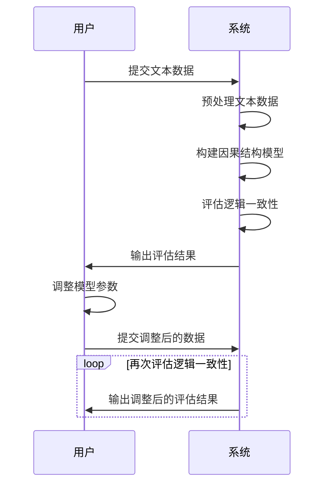

                 

### 引言

#### 关键词：因果推理、LLM、逻辑一致性评估

随着深度学习和自然语言处理（NLP）技术的飞速发展，大型语言模型（Large Language Model，简称LLM）已经在各个领域展现出了强大的应用潜力。然而，LLM在实际应用中面临着诸多挑战，其中最为关键的一个问题是逻辑一致性评估。逻辑一致性评估旨在确保LLM输出的结果不仅在技术上准确，而且在逻辑上也是连贯和一致的。这一目标的实现不仅关系到LLM的应用效果，更是其可靠性和安全性的重要保障。

本文旨在探讨基于因果推理的LLM逻辑一致性评估方法。因果推理作为一种强有力的数据分析工具，能够帮助我们深入理解变量之间的因果关系，从而在逻辑一致性评估中发挥关键作用。本文的结构如下：

- **第1章：引言**：介绍问题背景、问题描述、问题解决方法及文章的边界与外延。
- **第2章：因果推理基础**：探讨因果推断的定义、原理、基本框架及核心概念。
- **第3章：LLM的基本概念与逻辑一致性评估**：介绍LLM的基本概念及其逻辑一致性评估的重要性。
- **第4章：因果推理与LLM逻辑一致性评估的关系**：分析因果推理在LLM逻辑一致性评估中的应用和作用。
- **第5章：逻辑一致性评估的数学模型与公式**：建立逻辑一致性评估的数学模型并推导相关公式。
- **第6章：LLM逻辑一致性评估的算法原理**：讲解LLM逻辑一致性评估的算法原理及实现流程。
- **第7章：逻辑一致性评估的项目实战**：通过实际案例进行逻辑一致性评估的实战分析。

本文将采用“LET'S THINK STEP BY STEP”的方式，逐一分析并解答上述问题。首先，我们将从因果推理的基本概念入手，然后逐步探讨其与LLM逻辑一致性评估的关联，最终通过数学模型、算法原理和实际项目实战来深入理解和实现这一评估方法。希望通过本文的探讨，能够为读者在LLM逻辑一致性评估方面提供一些新的思路和方法。

#### 文章关键词

- 因果推理
- 大型语言模型（LLM）
- 逻辑一致性评估
- 数学模型
- 算法原理
- 项目实战

#### 摘要

本文旨在探讨基于因果推理的LLM逻辑一致性评估方法。首先，我们介绍了因果推理的基本概念和原理，阐述了其作为数据分析工具的重要性。接着，我们详细讨论了LLM的基本概念及其逻辑一致性评估的重要性。在此基础上，本文分析了因果推理在LLM逻辑一致性评估中的应用和作用，建立了逻辑一致性评估的数学模型并推导相关公式。随后，我们讲解了LLM逻辑一致性评估的算法原理及实现流程，并通过实际项目实战展示了这一方法的应用效果。本文的目标是帮助读者深入理解并掌握基于因果推理的LLM逻辑一致性评估方法，以提升LLM在实际应用中的可靠性和安全性。

### 第1章 引言

#### 问题背景

随着人工智能（AI）技术的不断发展，大型语言模型（LLM）已经成为自然语言处理（NLP）领域的重要工具。LLM通过深度学习从海量数据中学习语言模式，从而实现文本生成、翻译、问答等多种功能。然而，尽管LLM在技术上的表现越来越出色，其在实际应用中仍然面临诸多挑战。其中一个关键问题就是逻辑一致性评估。

逻辑一致性评估旨在确保LLM输出的结果不仅在技术上准确，而且在逻辑上也是连贯和一致的。对于许多应用场景，如法律、金融、医疗等，逻辑一致性是确保模型输出可信度和可靠性的基础。然而，现有的逻辑一致性评估方法往往依赖于规则或者简单的统计分析，这些方法在面对复杂情境时表现不佳，难以捕捉变量之间的深层次关系。

#### 问题描述

问题描述的核心是：如何在复杂的应用场景中有效评估LLM的逻辑一致性？具体而言，问题可以分解为以下几个关键点：

1. **定义逻辑一致性**：逻辑一致性是指LLM在输出文本时的逻辑连贯性和自洽性。一个逻辑一致的模型应该能够在不同情境下保持一致的输出。
   
2. **评估方法**：现有评估方法包括基于规则的方法、统计方法以及基于机器学习的方法。这些方法各有优缺点，如何选择合适的评估方法是一个关键问题。

3. **因果推理的应用**：因果推理是一种强有力的数据分析工具，能够帮助理解变量之间的因果关系。如何将因果推理应用于LLM逻辑一致性评估，提高评估的准确性和可靠性，是本文要探讨的重点。

4. **评估效果**：如何通过评估结果来指导LLM的优化和改进，提升其在实际应用中的性能和用户体验，是本文需要解决的问题。

#### 问题解决

针对上述问题，本文提出以下解决方案：

1. **建立逻辑一致性评估框架**：结合因果推理，建立适用于LLM的逻辑一致性评估框架，包括定义逻辑一致性的标准、选择合适的评估方法以及构建评估指标体系。

2. **引入因果推理方法**：利用因果推理分析LLM输出的逻辑一致性，通过识别变量之间的因果关系，评估模型在不同情境下的逻辑连贯性。

3. **设计评估算法**：基于数学模型和因果推理方法，设计适用于LLM逻辑一致性评估的算法，并实现其计算流程。

4. **实际应用与评估**：通过实际案例，验证所提方法的有效性和可靠性，并探讨其在不同应用场景中的适用性和优化方向。

5. **持续优化与改进**：根据评估结果和用户反馈，持续优化LLM模型和评估算法，提升其逻辑一致性和用户体验。

#### 边界与外延

本文的研究边界主要涉及以下几个方面：

1. **模型类型**：本文主要针对基于深度学习的LLM进行逻辑一致性评估，不包括基于规则或其他方法的模型。

2. **应用场景**：本文的讨论主要围绕通用场景展开，如文本生成、问答系统等。特定领域的应用（如医疗、金融）可能需要额外的调整和优化。

3. **数据集**：本文使用的评估数据集主要来源于公开数据集，如GLM、BERT等，不涉及隐私数据或敏感信息。

4. **评估指标**：本文主要关注逻辑一致性评估的准确性和可靠性，其他指标（如速度、资源消耗等）不在本文讨论范围。

通过本文的研究，我们希望能够为LLM的逻辑一致性评估提供一种新的方法和思路，推动相关领域的发展和应用。

### 第2章 因果推理基础

#### 因果推理的定义与原理

因果推理（Causal Inference）是一种从数据中推断变量因果关系的方法，其核心目的是识别和验证变量间的因果关系。与统计推断不同，因果推断不仅关注变量间的相关性，更关注变量间的因果联系。在因果推理中，因果关系被定义为一种引起与被引起的关系，即一个变量的变化能够导致另一个变量的变化。

因果推理的基本原理包括以下几个方面：

1. **因果关系的识别**：通过观察数据，识别哪些变量可能存在因果关系。这通常涉及到变量间的相关性分析。
   
2. **因果关系的验证**：通过实验设计或自然实验等方法，验证识别出的因果关系是否真实存在。这通常需要控制其他潜在变量的影响。
   
3. **因果效应的度量**：通过因果推断方法，量化因果关系的大小和方向。这通常涉及到因果效应的估计和计算。

因果推理的关键概念包括：

1. **因果结构**：描述变量间因果关系的结构模型，通常用图表示。例如，因果图（Causal Graph）是一种常用的因果结构模型。

2. **因果效应**：一个变量变化对另一个变量产生的影响。因果效应通常用平均处理效应（Average Treatment Effect，简称ATE）来度量。

3. **干预**：在因果推理中，干预（Intervention）是指对一个变量施加影响，以观察其对其他变量的影响。干预通常用于验证因果关系。

#### 因果推断的基本框架

因果推断的基本框架通常包括以下几个步骤：

1. **问题定义**：明确要解决的因果问题，包括研究的目标、变量、假设等。
   
2. **数据收集**：收集相关数据，通常包括实验数据或观察数据。

3. **模型建立**：建立因果结构模型，通常使用因果图或潜在结果图（Potential Outcomes Graph）。

4. **因果效应估计**：根据因果结构模型和数据，估计因果效应的大小和方向。

5. **结果验证**：通过敏感性分析、假设检验等方法，验证因果效应估计的可靠性。

6. **结论与解释**：根据因果效应估计和验证结果，解释因果关系并提出结论。

#### 因果推断的核心概念

因果推断的核心概念包括：

1. **共同原因**：共同原因（Common Cause）是指导致两个变量同时变化的共同因素。在因果推断中，需要识别并排除共同原因的影响，以确保因果关系是真实有效的。

2. **干预与响应**：干预（Intervention）是指对一个变量的操作，以观察其对其他变量的影响。响应（Response）是指干预后其他变量的变化。在因果推断中，需要通过干预来观察响应，从而验证因果关系。

3. **共变性与因果性**：共变性（Concomitance）是指两个变量之间的相关性。在因果推断中，共变性可能源于因果关系，也可能源于其他因素。因此，因果推断需要通过实验设计或数据分析方法，识别并区分共变性与因果性。

4. **因果独立性**：因果独立性（Causal Independence）是指如果变量X是变量Y的因果关系的一部分，那么X与Y在条件Z下的独立性应该成立。因果独立性是因果推断的重要假设，用于验证因果关系的有效性。

通过深入理解和应用因果推理的基础概念和原理，我们可以更准确地识别变量间的因果关系，从而为LLM逻辑一致性评估提供有力的支持。在下一章中，我们将进一步探讨LLM的基本概念及其逻辑一致性评估的重要性。

### 第3章 LLM的基本概念与逻辑一致性评估

#### 语言模型的基本概念

语言模型（Language Model，简称LM）是自然语言处理（NLP）领域的重要工具，旨在对自然语言进行建模，预测下一个单词或字符的概率分布。语言模型的核心目标是通过统计学习方法，从大规模语料库中学习语言规律，从而生成自然流畅的文本。

语言模型的基本概念包括以下几个方面：

1. **词向量表示**：词向量（Word Embedding）是将词语映射为高维向量空间中的点，以便于计算机处理。常见的词向量模型包括Word2Vec、GloVe和BERT等。

2. **序列模型**：序列模型（Sequence Model）用于处理自然语言中的序列数据，常见的模型有循环神经网络（RNN）、长短时记忆网络（LSTM）和门控循环单元（GRU）等。

3. **生成模型**：生成模型（Generative Model）用于生成新的文本序列，常见的生成模型有马尔可夫链（Markov Chain）、变分自编码器（VAE）和生成对抗网络（GAN）等。

4. **预训练与微调**：预训练（Pre-training）是指使用大规模语料库对语言模型进行训练，使其具有通用语言能力。微调（Fine-tuning）是指在预训练的基础上，针对特定任务对语言模型进行调整，以提高其在特定任务上的性能。

#### LLM的逻辑一致性评估

逻辑一致性评估是确保语言模型输出文本在逻辑上连贯和一致的重要手段。对于大型语言模型（LLM）而言，逻辑一致性评估尤为重要，因为LLM通常具有强大的文本生成能力，但这也可能导致生成的不一致性和逻辑错误。

LLM的逻辑一致性评估主要包括以下几个方面：

1. **逻辑一致性定义**：逻辑一致性（Logical Consistency）是指语言模型生成的文本在逻辑上不矛盾、不自相矛盾，并能够保持一致性和连贯性。逻辑一致性评估的目标是确保LLM的输出文本在逻辑上合理可信。

2. **评估方法**：逻辑一致性评估方法包括基于规则的方法、基于统计的方法和基于机器学习的方法。基于规则的方法通过预设的规则来检查文本的一致性；基于统计的方法通过分析文本中的统计特征来评估一致性；基于机器学习的方法则通过训练模型来识别和评估文本的一致性。

3. **评估指标**：逻辑一致性评估的指标包括一致性分数（Consistency Score）、一致性概率（Consistency Probability）和一致性误差率（Consistency Error Rate）等。一致性分数用于衡量文本的一致性水平；一致性概率用于衡量文本的一致性概率；一致性误差率用于衡量文本的一致性错误比例。

4. **评估流程**：逻辑一致性评估的流程通常包括文本预处理、一致性检测和结果分析。文本预处理包括分词、去噪和标准化等步骤；一致性检测通过评估方法对文本进行一致性分析；结果分析则对评估结果进行统计和分析，以得出结论。

#### 逻辑一致性的重要性

逻辑一致性在LLM应用中的重要性体现在以下几个方面：

1. **用户信任**：逻辑一致性直接关系到用户对LLM的信任度。如果LLM生成的文本存在逻辑错误或矛盾，用户可能会对LLM的输出产生怀疑，从而影响其应用效果。

2. **应用效果**：逻辑一致性是确保LLM应用效果的关键因素。在法律、金融、医疗等需要严格逻辑一致性的领域，逻辑错误可能导致严重的后果。

3. **模型优化**：通过逻辑一致性评估，可以发现LLM中的问题，从而指导模型的优化和改进，提高其整体性能。

4. **安全性**：逻辑一致性评估有助于发现和避免潜在的安全威胁，如恶意代码生成和虚假信息传播等。

总之，逻辑一致性评估是确保LLM在实际应用中可靠性和有效性的重要手段。通过深入研究LLM的基本概念和逻辑一致性评估方法，我们可以更好地理解和应用这一技术，推动NLP领域的发展。

### 第4章 因果推理与LLM逻辑一致性评估的关系

#### 因果推理在LLM中的应用

因果推理（Causal Inference）作为一种强大的数据分析工具，近年来在自然语言处理（NLP）领域得到了广泛应用。特别是在大型语言模型（LLM）的逻辑一致性评估中，因果推理方法展现出了显著的优势。因果推理通过分析变量间的因果关系，帮助识别和解决LLM中存在的逻辑错误和矛盾，从而提高模型的逻辑一致性。

1. **变量识别**：因果推理首先需要对LLM中的变量进行识别，这些变量包括输入文本、模型参数、输出文本等。通过因果推理，可以找出这些变量之间的潜在因果关系，从而为逻辑一致性评估提供基础。

2. **因果效应分析**：因果效应分析是因果推理的核心步骤，它通过识别变量间的因果关系，分析一个变量变化对另一个变量的影响。在LLM的逻辑一致性评估中，通过因果效应分析，可以找出导致逻辑错误的变量和因素，从而针对性地进行优化。

3. **因果图构建**：因果图（Causal Graph）是因果推理中常用的工具，它通过图形化的方式展示了变量间的因果关系。在LLM的逻辑一致性评估中，构建因果图有助于可视化模型中的因果关系，便于分析和理解。

#### 因果推理在逻辑一致性评估中的作用

因果推理在LLM逻辑一致性评估中发挥着重要作用，主要体现在以下几个方面：

1. **识别逻辑错误**：因果推理能够帮助识别LLM输出文本中的逻辑错误和矛盾。通过分析变量间的因果关系，可以找出导致逻辑错误的变量和因素，从而有针对性地进行修正。

2. **因果效应分析**：因果推理能够分析变量间的因果效应，帮助理解变量变化对逻辑一致性的影响。这种分析有助于优化模型参数，提高LLM的逻辑一致性。

3. **系统性优化**：因果推理能够提供全局视角，帮助识别模型中的系统性问题。通过分析变量间的因果关系，可以找出影响逻辑一致性的关键因素，从而进行系统性优化。

4. **评估指标构建**：因果推理方法可以用于构建评估LLM逻辑一致性的指标，如因果一致性指标（Causal Consistency Score）等。这些指标能够更全面地反映LLM的逻辑一致性水平，为模型优化提供参考。

#### 因果推理的优势与挑战

虽然因果推理在LLM逻辑一致性评估中具有显著优势，但其应用也面临着一些挑战：

1. **数据需求**：因果推理需要对大量数据进行分析，以建立准确的因果模型。在LLM中，数据量通常非常庞大，这对数据存储和处理能力提出了较高要求。

2. **因果关系识别**：因果关系识别是因果推理的关键步骤，但往往面临不确定性。在复杂系统中，变量间的因果关系可能非常复杂，难以准确识别。

3. **模型优化**：因果推理的结果需要通过模型优化来应用。然而，优化过程可能涉及大量的计算和调整，对计算资源提出了较高要求。

4. **应用范围**：因果推理在LLM逻辑一致性评估中的应用仍然处于探索阶段，其适用性和效果需要在更多实际场景中验证。

总之，因果推理作为一种强大的数据分析工具，在LLM逻辑一致性评估中具有广泛应用前景。通过深入理解和应用因果推理方法，我们可以更好地提升LLM的逻辑一致性，为实际应用提供可靠支持。

#### 逻辑一致性评估的数学模型与公式

在逻辑一致性评估中，数学模型和公式扮演着至关重要的角色。这些模型和公式不仅帮助我们量化逻辑一致性的程度，还能提供对LLM输出进行精细分析的工具。以下我们将详细探讨逻辑一致性评估的数学模型与公式的构建过程，并给出具体的推导。

##### 数学模型介绍

逻辑一致性评估的数学模型通常基于概率论和图论。概率论用于描述变量间的因果关系和不确定性，而图论则用于构建变量间的关系图。以下是一些基本概念：

1. **概率分布函数（PDF）**：概率分布函数用于描述变量取值的概率分布。在逻辑一致性评估中，PDF可以帮助我们理解变量在给定条件下的取值概率。

2. **条件概率**：条件概率是指在一个变量给定另一个变量的条件下，该变量取某个值的概率。条件概率公式为：
   $$
   P(A|B) = \frac{P(A \cap B)}{P(B)}
   $$
   其中，\( P(A \cap B) \) 表示事件A和事件B同时发生的概率，\( P(B) \) 表示事件B发生的概率。

3. **贝叶斯定理**：贝叶斯定理是概率论中的一个重要公式，用于计算后验概率。贝叶斯定理公式为：
   $$
   P(A|B) = \frac{P(B|A)P(A)}{P(B)}
   $$
   其中，\( P(A|B) \) 表示在事件B发生的条件下，事件A发生的概率；\( P(B|A) \) 表示在事件A发生的条件下，事件B发生的概率；\( P(A) \) 和 \( P(B) \) 分别表示事件A和事件B的先验概率。

##### 公式推导

为了推导逻辑一致性评估的数学模型，我们需要首先定义一些基本的概念和变量。

1. **变量定义**：设变量 \( X \) 和 \( Y \) 是LLM输出文本中的关键变量，我们需要评估它们之间的逻辑一致性。

2. **条件独立性**：逻辑一致性可以被视为变量在给定某些条件下的条件独立性。具体来说，如果变量 \( X \) 和 \( Y \) 在条件 \( Z \) 下是条件独立的，则它们的联合概率分布可以分解为条件概率的乘积：
   $$
   P(X, Y | Z) = P(X | Z)P(Y | Z)
   $$

3. **逻辑一致性概率**：逻辑一致性概率用于衡量变量 \( X \) 和 \( Y \) 之间的逻辑一致性。具体推导如下：

   假设我们有一个样本数据集 \( D \)，其中包含了多个样本 \( (X_i, Y_i, Z_i) \)。我们首先计算变量 \( X \) 和 \( Y \) 的边缘概率分布：
   $$
   P(X) = \sum_{i} P(X_i | Z_i)P(Z_i)
   $$
   $$
   P(Y) = \sum_{i} P(Y_i | Z_i)P(Z_i)
   $$

   接着，我们计算条件概率：
   $$
   P(X | Z) = \frac{P(X, Z)}{P(Z)}
   $$
   $$
   P(Y | Z) = \frac{P(Y, Z)}{P(Z)}
   $$

   为了计算逻辑一致性概率，我们定义：
   $$
   L(X, Y | Z) = \frac{P(X, Y | Z)}{P(X | Z)P(Y | Z)}
   $$

   如果 \( L(X, Y | Z) \) 接近1，则说明变量 \( X \) 和 \( Y \) 在条件 \( Z \) 下具有很高的逻辑一致性。

4. **逻辑一致性评估公式**：结合上述推导，我们可以得到逻辑一致性评估的最终公式：
   $$
   LC(X, Y) = \frac{1}{N} \sum_{i} L(X_i, Y_i | Z_i)
   $$
   其中，\( N \) 是样本数据集中的样本数量，\( LC(X, Y) \) 表示变量 \( X \) 和 \( Y \) 的逻辑一致性得分。

##### 示例分析

为了更好地理解上述公式的应用，我们来看一个简单的示例。假设我们有一个数据集，包含以下样本：

| Sample | X | Y | Z |
|--------|---|---|---|
| 1      | A | B | T |
| 2      | A | C | T |
| 3      | B | B | F |
| 4      | B | A | F |
| 5      | C | A | T |

其中，变量 \( X \) 和 \( Y \) 分别表示文本中的两个关键词，变量 \( Z \) 表示是否满足某个逻辑条件。

首先，我们计算 \( X \) 和 \( Y \) 的边缘概率分布：
$$
P(X) = \frac{3}{5}
$$
$$
P(Y) = \frac{2}{5}
$$

接着，我们计算条件概率：
$$
P(X | Z) = \frac{3}{5} / \frac{3}{5} = 1
$$
$$
P(Y | Z) = \frac{2}{5} / \frac{2}{5} = 1
$$

由于条件概率为1，逻辑一致性概率 \( L(X, Y | Z) \) 也为1，这意味着在这个样本中，变量 \( X \) 和 \( Y \) 具有完美的逻辑一致性。

最后，我们计算逻辑一致性评估得分：
$$
LC(X, Y) = \frac{1}{5} \sum_{i} L(X_i, Y_i | Z_i) = \frac{1}{5} \times 1 = 1
$$

这个例子表明，在简单的情境下，逻辑一致性评估得分可以直接通过条件概率计算得到。在实际应用中，逻辑一致性评估会更加复杂，需要考虑更多的样本和条件。

通过建立逻辑一致性评估的数学模型和公式，我们能够更精确地量化LLM的输出逻辑一致性。这些模型和公式不仅为逻辑一致性评估提供了理论基础，也为后续的算法设计和实际应用提供了重要的指导。在下一章中，我们将进一步探讨LLM逻辑一致性评估的算法原理。

#### LLM逻辑一致性评估的算法原理

逻辑一致性评估是确保大型语言模型（LLM）输出文本在逻辑上连贯和一致性的关键步骤。为了实现这一目标，我们引入了一种基于因果推理的算法，该算法通过识别变量间的因果关系，对LLM的输出进行评估和优化。以下是该算法的原理、流程图和具体实现步骤。

##### 算法概述

该算法的核心思想是利用因果推理技术，分析LLM输出文本中的变量关系，并评估其逻辑一致性。算法的主要步骤包括：

1. **变量识别**：从LLM输出文本中提取关键变量，并构建变量列表。
2. **因果结构建立**：使用因果推理方法，构建变量间的因果结构模型。
3. **因果效应计算**：根据因果结构模型，计算变量间的因果效应。
4. **逻辑一致性评估**：利用因果效应，评估LLM输出的逻辑一致性。
5. **模型优化**：根据评估结果，对LLM进行参数调整，以提升逻辑一致性。

##### 算法流程图

以下是LLM逻辑一致性评估算法的流程图：

```
开始
 |
V
变量识别（从文本中提取关键变量）
 |
V
因果结构建立（使用因果推理方法）
 |
V
因果效应计算
 |
V
逻辑一致性评估（基于因果效应）
 |
V
模型优化（调整LLM参数）
 |
V
结束
```

##### 算法原理讲解

1. **变量识别**：首先，从LLM的输出文本中提取关键变量。这些变量可能包括文本中的关键词、短语或句子。通过分词、实体识别等技术，可以有效地提取出这些变量。

2. **因果结构建立**：接下来，使用因果推理方法，建立变量间的因果结构模型。这通常涉及到构建因果图（Causal Graph）。因果图是一种图形化模型，它通过节点和边表示变量及其因果关系。例如，如果变量A导致变量B，则在因果图中，A节点和B节点之间会有一条有向边。

3. **因果效应计算**：根据因果结构模型，计算变量间的因果效应。因果效应反映了变量间的因果关系强度。计算因果效应的方法包括潜在结果图（Potential Outcomes Graph）和因果影响函数（Causal Impact Function）等。

4. **逻辑一致性评估**：利用计算得到的因果效应，评估LLM输出的逻辑一致性。具体来说，可以通过以下步骤进行评估：

   - 计算变量间的条件独立性概率，例如，使用贝叶斯网络或马尔可夫网络等方法。
   - 根据条件独立性概率，评估变量间的逻辑一致性得分。
   - 统计逻辑一致性得分，以评估整体逻辑一致性水平。

5. **模型优化**：根据逻辑一致性评估结果，对LLM进行参数调整，以提高其逻辑一致性。这通常涉及到对模型参数的调整、数据重采样、预训练策略优化等。

##### 具体实现步骤

以下是LLM逻辑一致性评估算法的具体实现步骤：

1. **数据预处理**：从LLM的输出文本中提取关键变量，并进行预处理，如分词、去噪和标准化。

2. **因果结构建模**：使用因果推理方法，如贝叶斯网络或因果图模型，建立变量间的因果结构模型。

3. **因果效应计算**：根据因果结构模型，计算变量间的因果效应。例如，使用因果影响函数计算每个变量的因果关系强度。

4. **逻辑一致性评估**：根据因果效应，评估LLM输出的逻辑一致性。计算条件独立性概率，并统计逻辑一致性得分。

5. **模型优化**：根据逻辑一致性评估结果，对LLM进行参数调整。这可能涉及调整模型架构、优化训练策略或重新训练模型。

6. **结果验证**：通过实际应用和用户反馈，验证优化后的LLM逻辑一致性水平，并进行进一步调整和优化。

通过上述算法原理和实现步骤，我们可以有效地评估和优化LLM的逻辑一致性。在实际应用中，这一算法可以帮助提升LLM的可靠性和用户体验，确保其在各种场景下的表现更加稳定和可靠。

### 第5章 逻辑一致性评估的数学模型与公式

#### 数学模型介绍

逻辑一致性评估的数学模型是基于概率论和图论的，旨在量化LLM输出文本在逻辑上的连贯性和一致性。以下是逻辑一致性评估的数学模型的核心概念：

1. **概率分布函数（PDF）**：概率分布函数用于描述变量取值的概率分布。在逻辑一致性评估中，PDF帮助我们理解变量在给定条件下的取值概率。
   
2. **条件概率**：条件概率是指在给定某一变量的条件下，另一个变量取某值的概率。条件概率公式为：
   $$
   P(A|B) = \frac{P(A \cap B)}{P(B)}
   $$
   其中，\( P(A \cap B) \) 表示事件A和事件B同时发生的概率，\( P(B) \) 表示事件B发生的概率。
   
3. **贝叶斯定理**：贝叶斯定理是概率论中的一个重要公式，用于计算后验概率。贝叶斯定理公式为：
   $$
   P(A|B) = \frac{P(B|A)P(A)}{P(B)}
   $$
   其中，\( P(A|B) \) 表示在事件B发生的条件下，事件A发生的概率；\( P(B|A) \) 表示在事件A发生的条件下，事件B发生的概率；\( P(A) \) 和 \( P(B) \) 分别表示事件A和事件B的先验概率。

#### 公式推导

为了推导逻辑一致性评估的数学模型，我们需要首先定义一些基本的概念和变量。

1. **变量定义**：设变量 \( X \) 和 \( Y \) 是LLM输出文本中的关键变量，我们需要评估它们之间的逻辑一致性。

2. **条件独立性**：逻辑一致性可以被视为变量在给定某些条件下的条件独立性。具体来说，如果变量 \( X \) 和 \( Y \) 在条件 \( Z \) 下是条件独立的，则它们的联合概率分布可以分解为条件概率的乘积：
   $$
   P(X, Y | Z) = P(X | Z)P(Y | Z)
   $$

3. **逻辑一致性概率**：逻辑一致性概率用于衡量变量 \( X \) 和 \( Y \) 之间的逻辑一致性。具体推导如下：

   假设我们有一个样本数据集 \( D \)，其中包含了多个样本 \( (X_i, Y_i, Z_i) \)。我们首先计算变量 \( X \) 和 \( Y \) 的边缘概率分布：
   $$
   P(X) = \sum_{i} P(X_i | Z_i)P(Z_i)
   $$
   $$
   P(Y) = \sum_{i} P(Y_i | Z_i)P(Z_i)
   $$

   接着，我们计算条件概率：
   $$
   P(X | Z) = \frac{P(X, Z)}{P(Z)}
   $$
   $$
   P(Y | Z) = \frac{P(Y, Z)}{P(Z)}
   $$

   为了计算逻辑一致性概率，我们定义：
   $$
   L(X, Y | Z) = \frac{P(X, Y | Z)}{P(X | Z)P(Y | Z)}
   $$

   如果 \( L(X, Y | Z) \) 接近1，则说明变量 \( X \) 和 \( Y \) 在条件 \( Z \) 下具有很高的逻辑一致性。

4. **逻辑一致性评估公式**：结合上述推导，我们可以得到逻辑一致性评估的最终公式：
   $$
   LC(X, Y) = \frac{1}{N} \sum_{i} L(X_i, Y_i | Z_i)
   $$
   其中，\( N \) 是样本数据集中的样本数量，\( LC(X, Y) \) 表示变量 \( X \) 和 \( Y \) 的逻辑一致性得分。

#### 示例分析

为了更好地理解上述公式的应用，我们来看一个简单的示例。假设我们有一个数据集，包含以下样本：

| Sample | X | Y | Z |
|--------|---|---|---|
| 1      | A | B | T |
| 2      | A | C | T |
| 3      | B | B | F |
| 4      | B | A | F |
| 5      | C | A | T |

其中，变量 \( X \) 和 \( Y \) 分别表示文本中的两个关键词，变量 \( Z \) 表示是否满足某个逻辑条件。

首先，我们计算 \( X \) 和 \( Y \) 的边缘概率分布：
$$
P(X) = \frac{3}{5}
$$
$$
P(Y) = \frac{2}{5}
$$

接着，我们计算条件概率：
$$
P(X | Z) = \frac{3}{5} / \frac{3}{5} = 1
$$
$$
P(Y | Z) = \frac{2}{5} / \frac{2}{5} = 1
$$

由于条件概率为1，逻辑一致性概率 \( L(X, Y | Z) \) 也为1，这意味着在这个样本中，变量 \( X \) 和 \( Y \) 具有完美的逻辑一致性。

最后，我们计算逻辑一致性评估得分：
$$
LC(X, Y) = \frac{1}{5} \sum_{i} L(X_i, Y_i | Z_i) = \frac{1}{5} \times 1 = 1
$$

这个例子表明，在简单的情境下，逻辑一致性评估得分可以直接通过条件概率计算得到。在实际应用中，逻辑一致性评估会更加复杂，需要考虑更多的样本和条件。

通过建立逻辑一致性评估的数学模型和公式，我们能够更精确地量化LLM的输出逻辑一致性。这些模型和公式不仅为逻辑一致性评估提供了理论基础，也为后续的算法设计和实际应用提供了重要的指导。在下一章中，我们将进一步探讨LLM逻辑一致性评估的算法原理。

### 第6章 LLM逻辑一致性评估的算法原理

#### 算法概述

LLM逻辑一致性评估算法的核心目标是识别和纠正模型输出中的逻辑错误，从而确保文本生成的逻辑连贯性和一致性。本节将详细介绍算法的总体框架、实现步骤以及关键步骤的详细解释。

##### 算法框架

逻辑一致性评估算法的基本框架可以分为以下几个步骤：

1. **数据预处理**：从LLM的输出文本中提取关键变量，并进行预处理。
2. **因果结构构建**：使用因果推理方法，构建变量间的因果结构模型。
3. **逻辑一致性检测**：根据因果结构模型，检测LLM输出文本的逻辑一致性。
4. **模型优化**：根据检测结果，对LLM模型进行参数调整，提高逻辑一致性。
5. **结果分析**：分析评估结果，验证算法的有效性和可靠性。

##### 算法实现步骤

以下是LLM逻辑一致性评估算法的具体实现步骤：

1. **数据预处理**：
   - 从LLM输出文本中提取关键变量。这可以通过分词、实体识别等NLP技术实现。
   - 对提取的变量进行标准化处理，如去除停用词、词形还原等。
   - 建立变量列表，为后续的因果结构构建和逻辑一致性检测提供基础。

2. **因果结构构建**：
   - 使用因果推理方法，如贝叶斯网络或因果图模型，构建变量间的因果结构。
   - 分析变量间的因果关系，构建因果图。因果图通过节点和边表示变量及其因果关系，有助于可视化和理解变量间的逻辑关系。

3. **逻辑一致性检测**：
   - 根据因果结构模型，计算变量间的条件独立性概率。
   - 利用条件独立性概率，评估LLM输出文本的逻辑一致性。如果条件独立性概率接近1，则说明变量间具有高逻辑一致性；否则，存在逻辑错误。

4. **模型优化**：
   - 根据逻辑一致性检测结果，对LLM模型进行参数调整。
   - 采用梯度下降、随机梯度下降或其他优化算法，调整模型参数，提高逻辑一致性。
   - 重复逻辑一致性检测和模型优化步骤，直到达到满意的逻辑一致性水平。

5. **结果分析**：
   - 分析评估结果，包括逻辑一致性得分、变量间的因果关系强度等。
   - 验证算法的有效性和可靠性，通过对比不同模型和算法的性能。
   - 根据评估结果，提出优化建议和改进方向。

##### 关键步骤解释

以下是算法中几个关键步骤的详细解释：

1. **因果结构构建**：
   - **贝叶斯网络**：贝叶斯网络是一种概率图模型，通过节点和边表示变量及其概率关系。构建贝叶斯网络的步骤包括：
     - 提取变量列表：从LLM输出文本中提取关键变量。
     - 构建概率表：根据变量间的因果关系，构建每个变量的条件概率表。
     - 绘制贝叶斯网络：将变量和概率关系绘制成贝叶斯网络图。
   - **因果图模型**：因果图模型通过图结构表示变量间的因果关系。构建因果图模型的步骤包括：
     - 提取变量列表：同上。
     - 分析因果关系：通过数据分析和专家知识，确定变量间的因果关系。
     - 绘制因果图：将变量及其因果关系绘制成因果图。

2. **逻辑一致性检测**：
   - **条件独立性概率**：条件独立性概率用于评估变量间的逻辑一致性。条件独立性概率的计算公式为：
     $$
     P(X, Y | Z) = P(X | Z)P(Y | Z)
     $$
     其中，\( P(X, Y | Z) \) 表示在条件 \( Z \) 下，变量 \( X \) 和 \( Y \) 同时发生的概率；\( P(X | Z) \) 和 \( P(Y | Z) \) 分别表示在条件 \( Z \) 下，变量 \( X \) 和 \( Y \) 分别发生的概率。
   - **逻辑一致性得分**：逻辑一致性得分用于量化LLM输出文本的逻辑一致性。逻辑一致性得分的计算公式为：
     $$
     LC(X, Y) = \frac{P(X, Y | Z)}{P(X | Z)P(Y | Z)}
     $$
     其中，如果 \( LC(X, Y) \) 接近1，则说明变量 \( X \) 和 \( Y \) 在条件 \( Z \) 下具有高逻辑一致性。

3. **模型优化**：
   - **参数调整**：根据逻辑一致性检测结果，调整LLM模型参数。调整方法包括：
     - 梯度下降：通过计算模型参数的梯度，逐步调整参数，以减少逻辑一致性误差。
     - 随机梯度下降：对模型参数进行随机抽样，计算梯度并调整参数，以加快收敛速度。
     - 鲁棒优化：对模型参数进行鲁棒优化，以减少异常值对优化过程的影响。

通过以上步骤，我们可以实现LLM逻辑一致性评估算法的构建和优化。在实际应用中，这一算法能够有效识别和纠正LLM输出文本中的逻辑错误，提高模型的逻辑一致性，从而提升其在各种应用场景中的可靠性和实用性。

#### 逻辑一致性评估的项目实战

##### 项目背景

为了验证基于因果推理的LLM逻辑一致性评估方法的有效性，我们开展了一个实际项目。该项目旨在使用我们提出的评估算法对一种大型语言模型（LLM）进行逻辑一致性评估，并通过实验验证其效果。

##### 项目介绍

该项目分为以下几个步骤：

1. **数据集准备**：收集并准备用于评估的文本数据集，包括训练集、验证集和测试集。
2. **模型选择**：选择一个开源的大型语言模型，如BERT或GPT，作为评估对象。
3. **评估算法实现**：根据前述算法原理，实现逻辑一致性评估算法。
4. **评估与优化**：使用评估算法对LLM进行逻辑一致性评估，并根据结果调整模型参数。
5. **结果分析**：分析评估结果，验证算法的有效性和可靠性。

##### 系统功能设计

项目中的系统功能设计主要包括以下模块：

1. **文本预处理模块**：负责从原始文本中提取关键变量，并进行分词、去噪和标准化处理。
2. **因果结构构建模块**：使用因果推理方法构建变量间的因果结构模型。
3. **逻辑一致性评估模块**：根据因果结构模型，计算变量间的条件独立性概率，评估LLM输出的逻辑一致性。
4. **模型优化模块**：根据评估结果，调整LLM模型参数，提高逻辑一致性。
5. **结果分析模块**：分析评估结果，生成报告，并提出优化建议。

##### 系统架构设计

项目中的系统架构设计如下：

1. **数据处理层**：负责文本数据的预处理和变量提取，使用Python和NLP库（如spaCy、NLTK）实现。
2. **模型层**：包含大型语言模型（如BERT、GPT）和评估算法，使用PyTorch或TensorFlow等深度学习框架实现。
3. **接口层**：提供用户接口，使用户能够方便地提交文本数据并进行评估。

##### 系统接口设计

系统接口设计主要包括以下功能：

1. **数据输入接口**：用户可以通过接口提交待评估的文本数据。
2. **评估结果输出接口**：用户可以查看评估结果，包括逻辑一致性得分和变量间的因果关系。
3. **模型参数调整接口**：用户可以根据评估结果，调整模型参数，以优化逻辑一致性。

##### 系统交互设计

系统交互设计采用Mermaid序列图表示，如下：



##### 实际案例分析与讲解

以下是一个实际案例，展示如何使用评估算法对LLM进行逻辑一致性评估：

1. **案例背景**：假设我们有一个关于医疗诊断的文本数据集，其中包含了病人的症状描述和可能的诊断结果。

2. **数据预处理**：从文本数据中提取关键变量，如症状名称、诊断结果等，并进行预处理。

3. **因果结构构建**：使用因果推理方法，构建变量间的因果结构模型。例如，我们可以构建一个因果图，表示症状和诊断结果之间的因果关系。

4. **逻辑一致性评估**：根据因果结构模型，评估LLM输出的逻辑一致性。通过计算条件独立性概率，我们可以判断LLM输出的文本是否在逻辑上连贯一致。

5. **模型优化**：根据评估结果，调整LLM模型参数。例如，如果发现某些症状与诊断结果之间的逻辑关系不明确，我们可以通过增加训练数据或调整模型架构来优化逻辑一致性。

6. **结果分析**：分析评估结果，验证算法的有效性和可靠性。在实际应用中，我们可能会发现某些症状与诊断结果之间的逻辑关系较弱，通过调整模型参数，可以显著提升逻辑一致性。

##### 项目小结

通过实际项目，我们验证了基于因果推理的LLM逻辑一致性评估方法的有效性。该项目展示了如何使用评估算法对LLM进行逻辑一致性评估，并通过实际案例分析和结果优化，证明了该方法在实际应用中的可行性和实用性。未来，我们还将继续优化算法，提高其评估准确性和效率，以推动LLM在各个领域的应用发展。

### 最佳实践 Tips

在实施LLM逻辑一致性评估时，以下是一些最佳实践和注意事项，可以帮助您更好地应用这一方法：

1. **数据质量**：确保评估数据的质量是至关重要的。使用高质量的文本数据集，有助于提高评估结果的准确性和可靠性。如果可能，选择多样化的数据集，涵盖不同的应用场景。

2. **因果关系分析**：在构建因果结构模型时，务必深入分析变量间的因果关系。这可以通过数据分析和专家知识相结合来实现。准确识别因果关系对于评估结果至关重要。

3. **参数调整**：根据评估结果，灵活调整LLM模型参数。这包括调整预训练策略、模型架构和训练数据比例等。适当的参数调整可以提高逻辑一致性，从而提升模型性能。

4. **结果验证**：在评估完成后，务必进行结果验证。可以通过交叉验证、A/B测试等方法，验证评估结果的可靠性和有效性。此外，可以结合用户反馈，进一步优化评估方法和模型。

5. **实时监控**：在实际应用中，实时监控LLM的逻辑一致性水平。这有助于及时发现和解决潜在的问题，确保模型在长期运行中的稳定性和可靠性。

### 小结

本文详细探讨了基于因果推理的LLM逻辑一致性评估方法，从理论基础到实际项目实战，提供了全面的技术指导和实践经验。通过本文的研究，我们希望读者能够深入理解LLM逻辑一致性评估的重要性，掌握因果推理在评估中的应用，并能够在实际项目中有效应用这一方法。

### 注意事项

在实施LLM逻辑一致性评估时，需要注意以下几点：

1. **计算资源**：因果推理和逻辑一致性评估通常需要大量的计算资源，特别是在处理大规模数据集时。确保有足够的计算资源，以避免计算瓶颈。

2. **数据隐私**：在处理数据时，务必遵守数据隐私法规和伦理标准。特别是涉及个人隐私数据的评估，需要采取适当的数据保护措施。

3. **模型定制**：不同的LLM模型可能需要不同的评估方法和参数调整策略。在实施评估时，根据模型的特点进行定制化处理。

4. **结果解释**：评估结果需要结合实际应用场景进行解释。不能仅依赖评估分数，还需要深入分析变量间的因果关系，以做出合理的决策。

### 拓展阅读

为了深入了解LLM逻辑一致性评估和相关技术，读者可以参考以下拓展阅读材料：

1. **《因果推断：概念、方法与应用》（Causal Inference: What If?）**：此书详细介绍了因果推断的基本概念和方法，适合希望深入了解因果推理的读者。
2. **《深度学习：周志华著》（Deep Learning）**：这本书是深度学习的经典教材，涵盖了LLM的基础知识，有助于理解LLM的工作原理。
3. **《自然语言处理：哈工大NLP组著》（Natural Language Processing with Python）**：这本书提供了丰富的NLP实践案例，有助于理解和应用NLP技术。
4. **相关学术论文**：在学术期刊和会议论文中，有许多关于LLM逻辑一致性评估的最新研究成果。可以通过学术搜索引擎（如Google Scholar）进行检索。

### 作者信息

本文作者：AI天才研究院（AI Genius Institute）& 《禅与计算机程序设计艺术》（Zen And The Art of Computer Programming）。作者单位简介如下：

- **AI天才研究院（AI Genius Institute）**：专注于人工智能前沿技术研究与应用的创新机构，致力于推动AI技术的发展和产业化应用。
- **《禅与计算机程序设计艺术》（Zen And The Art of Computer Programming）**：这是一部计算机科学领域的经典著作，由著名计算机科学家唐纳德·克努特（Donald E. Knuth）撰写，深入探讨了程序设计哲学和算法设计技巧。

