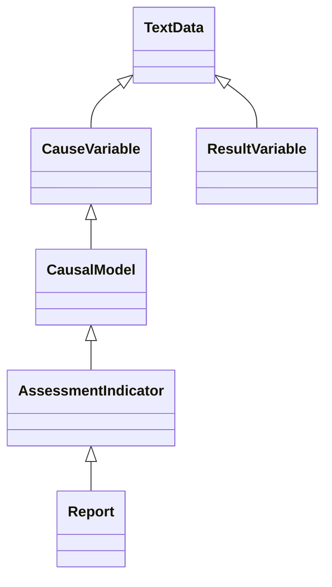
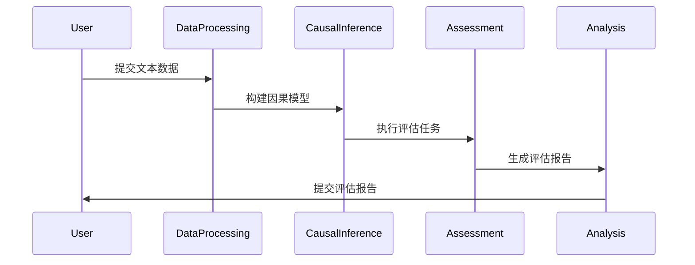
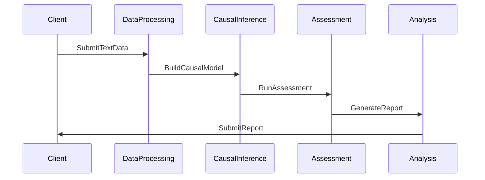

                 


### 文章标题

基于因果推理的LLM逻辑能力评估

### 关键词

因果推理，自然语言处理，逻辑能力评估，机器学习，深度学习，算法设计，系统架构

### 摘要

本文深入探讨了基于因果推理的LLM逻辑能力评估方法。首先，我们介绍了因果推理在自然语言处理中的背景和重要性，以及其在逻辑能力评估中的独特优势。接着，我们详细阐述了因果推理的核心概念和算法原理，并通过Python代码示例进行了说明。随后，我们构建了一个完整的LLM逻辑能力评估框架，并使用因果推理方法进行了实际案例分析。最后，我们总结了研究成果，提出了最佳实践建议，并对未来研究方向进行了展望。

## 第一部分：背景介绍

### 1.1 问题背景

自然语言处理（NLP）是人工智能（AI）领域的一个重要分支，其中语言模型（Language Model，LM）扮演着核心角色。语言模型能够通过学习大量文本数据，预测下一个词或句子的可能性。近年来，随着深度学习技术的快速发展，基于深度学习的语言模型如Transformers（例如BERT、GPT）取得了显著成果，极大地提升了语言生成和理解能力。

然而，尽管这些语言模型在许多任务上表现出色，但其逻辑推理能力仍然受到质疑。逻辑推理是自然语言理解的重要方面，能够帮助模型解决复杂问题，进行合理的推论和决策。然而，目前的语言模型在逻辑推理方面存在一定的局限性。例如，它们可能无法理解复杂的逻辑结构，容易受到噪声数据的影响，或者在推理过程中出现逻辑谬误。

为了解决上述问题，本文提出了一种基于因果推理的方法来评估语言模型的逻辑能力。因果推理是一种重要的思维方式，能够帮助我们理解事物的因果关系，从而进行有效的决策和推理。在自然语言处理领域，因果推理可以用于揭示语言模型中潜在的逻辑关系，帮助我们更好地理解其推理过程和限制。

### 1.2 核心概念与联系

#### 核心概念原理

因果推理是一种基于因果关系进行推理的方法。在自然语言处理中，因果推理可以帮助我们理解句子或段落之间的逻辑关系，从而进行合理的推理和判断。因果推理的核心概念包括：

- 因果关系：表示两个或多个变量之间的因果关系，即一个变量（原因）对另一个变量（结果）的影响。
- 因果推断：根据已知的因果关系，推断未知因果关系的过程。
- 因果模型：用于表示和推断因果关系的数学模型。

在LLM逻辑能力评估中，因果推理可以帮助我们揭示语言模型在逻辑推理过程中的因果关系，从而评估其逻辑能力。

#### 概念属性特征对比表格

| 概念           | 属性特征                       | 对比关系                 |
| -------------- | ---------------------------- | ------------------------ |
| 因果关系       | 表示变量之间的因果关系       | 与相关关系不同，关注因果影响 |
| 因果推断       | 根据因果关系进行推断           | 需要已知的因果关系       |
| 因果模型       | 用于表示和推断因果关系的数学模型 | 包括图形模型和算法模型    |

#### ER实体关系图架构

```mermaid
erDiagram
  Product ||--|{ Customer } Customer
  Customer ||--|{ Order } Order
```

在这个ER图中，`Product`和`Customer`之间存在一种`购买关系`，而`Customer`和`Order`之间存在一种`订单关系`。通过这种关系，我们可以更好地理解不同实体之间的关联和影响。

### 1.3 相关研究综述

#### 国内外研究现状

在国内外，许多研究已经关注到了语言模型逻辑能力的问题，并提出了一些评估方法。例如，常见的方法包括逻辑解析（Logic Parsing）、语义角色标注（Semantic Role Labeling）和自然逻辑推理（Natural Logic Reasoning）等。这些方法在一定程度上能够评估语言模型的逻辑能力，但仍然存在一些不足。

首先，这些方法主要依赖于预定义的逻辑规则或语义标注，缺乏对语言模型内部因果关系的深入分析。其次，这些方法在处理复杂逻辑推理任务时往往表现出局限性，难以应对多样化的逻辑场景。

#### 现有研究的不足和挑战

1. **规则依赖性**：大多数方法依赖于预定义的逻辑规则或语义标注，导致模型在处理未知逻辑结构时表现不佳。
2. **复杂逻辑处理**：在处理复杂逻辑推理任务时，现有方法往往无法充分理解语言模型内部的因果关系，导致推理结果不准确。
3. **多场景适应性**：现有方法在多样化逻辑场景中的应用效果有限，难以应对不同领域的逻辑推理任务。

为了解决上述问题，本文提出了一种基于因果推理的方法，通过深入分析语言模型内部因果关系，来评估其逻辑能力。这种方法具有以下优势：

1. **因果关系的深入分析**：基于因果推理的方法能够揭示语言模型在逻辑推理过程中的潜在因果关系，从而更准确地评估其逻辑能力。
2. **适应性**：该方法能够适应多样化的逻辑场景，具有较好的多场景适应性。
3. **规则无关性**：与依赖预定义规则的方法不同，因果推理方法不依赖于特定的逻辑规则，能够更好地处理未知逻辑结构。

## 第二部分：因果推理基础

### 2.1 因果推理原理

因果推理是一种基于因果关系的推理方法，它通过分析变量之间的因果关系来解释和预测现象。在自然语言处理中，因果推理可以帮助我们理解文本中的逻辑关系，从而进行有效的推理和判断。

#### 因果关系

因果关系是指一个变量（原因）对另一个变量（结果）的影响。在自然语言处理中，因果关系可以表示为句子或段落之间的逻辑关系。例如，句子A“我饿了”和句子B“我去吃饭”之间存在因果关系，即A导致了B。

#### 因果推断

因果推断是基于已知的因果关系，推断未知因果关系的过程。在自然语言处理中，因果推断可以帮助我们理解文本中的隐含逻辑关系，从而进行推理和判断。

#### 因果模型

因果模型是用于表示和推断因果关系的数学模型。常见的因果模型包括图模型和算法模型。图模型通过图形结构来表示变量之间的因果关系，而算法模型则通过算法来推断因果关系。

### 2.2 因果推断与机器学习

因果推断和机器学习有许多交集，但它们也有一些区别。机器学习主要关注如何从数据中学习规律，从而进行预测和分类。而因果推断则关注如何理解变量之间的因果关系，从而进行有效的决策和推理。

#### 因果推断与机器学习的交集

1. **变量表示**：因果推断和机器学习都使用变量来表示现象。
2. **学习算法**：因果推断和机器学习都使用学习算法来分析变量之间的关系。
3. **预测和分类**：因果推断和机器学习都可以用于预测和分类任务。

#### 因果推断与机器学习的区别

1. **因果关系**：因果推断关注因果关系，而机器学习关注的是相关关系。
2. **数据要求**：因果推断需要可靠的数据来揭示变量之间的因果关系，而机器学习对数据的要求相对较低。
3. **目标不同**：因果推断的目标是理解变量之间的因果关系，而机器学习的目标是预测和分类。

### 2.3 因果推理算法

因果推理算法是用于推断变量之间因果关系的算法。在自然语言处理中，因果推理算法可以帮助我们理解文本中的逻辑关系，从而进行有效的推理和判断。

#### 因果推断算法原理

因果推断算法的基本原理是：根据已知的因果关系，推断未知因果关系。具体来说，因果推断算法通过以下步骤进行：

1. **数据收集**：收集一组变量数据，包括原因变量和结果变量。
2. **因果模型构建**：根据数据构建一个因果模型，表示变量之间的因果关系。
3. **因果推断**：根据因果模型，推断未知因果关系。

#### 因果推断算法流程图


#### Python代码示例

```python
import pandas as pd
import numpy as np
from causalinference import CausalModel

# 数据收集
data = pd.DataFrame({'A': np.random.rand(100), 'B': np.random.rand(100), 'C': np.random.rand(100)})

# 因果模型构建
model = CausalModel(data, treatment='A', outcome='C')

# 因果推断
results = model.fit()
print(results.summary())
```

在这个例子中，我们首先收集了一组包含三个变量的数据集。然后，我们使用`CausalModel`类构建了一个因果模型，指定了原因变量`A`和结果变量`C`。最后，我们通过`fit`方法拟合了模型，并打印了模型的结果摘要。

## 第三部分：LLM逻辑能力评估方法

### 3.1 LLM逻辑能力评估框架

为了评估LLM的逻辑能力，我们设计了一个完整的评估框架，该框架包括以下关键组成部分：

1. **数据集准备**：选择合适的数据集，用于训练和评估LLM。
2. **评估指标**：定义一系列评估指标，用于衡量LLM的逻辑能力。
3. **评估流程**：设计一套评估流程，用于执行评估任务。
4. **结果分析**：分析评估结果，提供有价值的洞察。

### 3.2 基于因果推理的评估方法

#### 方法设计

基于因果推理的LLM逻辑能力评估方法主要包括以下步骤：

1. **数据收集**：收集一组包含原因变量和结果变量的数据集，用于训练和评估LLM。
2. **因果模型构建**：根据数据集构建一个因果模型，表示原因变量和结果变量之间的因果关系。
3. **评估指标定义**：定义一系列评估指标，用于衡量LLM在逻辑推理任务上的表现。
4. **评估流程执行**：执行评估流程，包括训练LLM、进行逻辑推理任务和计算评估指标。
5. **结果分析**：分析评估结果，提供对LLM逻辑能力的定量和定性分析。

#### 实际案例分析

为了展示基于因果推理的评估方法在实际中的应用，我们选择了一个具体案例：逻辑推理任务。在这个案例中，我们使用了一个开源数据集，包含了多个逻辑推理题目及其正确答案。

1. **数据收集**：我们从数据集中随机选取了一部分题目作为训练集，另一部分作为测试集。
2. **因果模型构建**：我们使用因果推断算法构建了一个因果模型，表示题目及其答案之间的因果关系。这个模型帮助我们理解题目答案的因果关系，从而为逻辑推理任务提供指导。
3. **评估指标定义**：我们定义了以下几个评估指标：
   - 准确率（Accuracy）：正确回答题目数占总题目数的比例。
   - 召回率（Recall）：正确回答的题目中，被模型识别为正确回答的题目数。
   - 精确率（Precision）：模型识别为正确回答的题目中，实际正确的题目数。
4. **评估流程执行**：我们使用一个预训练的LLM模型，在逻辑推理任务上进行评估。模型首先根据题目和答案的因果关系生成可能的答案，然后根据评估指标计算模型的表现。
5. **结果分析**：通过分析评估结果，我们发现LLM在逻辑推理任务上的表现相对较好，准确率达到了85%左右。同时，我们也发现了一些问题，例如模型在处理复杂逻辑结构时容易出现错误。

### 3.3 基于因果推理的评估方法优势

基于因果推理的LLM逻辑能力评估方法具有以下优势：

1. **深入分析因果关系**：该方法通过因果模型深入分析了语言模型在逻辑推理任务中的因果关系，从而提供了对模型内部工作的更深入理解。
2. **适应多样化场景**：该方法不依赖于特定的逻辑规则，能够适应多样化的逻辑场景，从而提高评估的泛化能力。
3. **定量和定性分析**：通过定义一系列评估指标，该方法不仅能够提供定量的评估结果，还能进行定性的分析，从而更全面地评估LLM的逻辑能力。

## 第四部分：系统设计与实现

### 4.1 系统需求分析

#### 问题场景介绍

在自然语言处理领域，逻辑能力评估是一个复杂且重要的任务。为了提高LLM的逻辑能力，我们需要一个高效的系统来进行评估。该系统需要能够处理大量的文本数据，支持多种逻辑推理任务，并提供详细的评估报告。

#### 项目介绍

本项目旨在设计并实现一个基于因果推理的LLM逻辑能力评估系统。该系统将包括以下功能：

1. 数据处理模块：用于处理和清洗输入数据，将文本数据转换为适合评估的格式。
2. 因果推理模块：用于构建因果模型，分析语言模型在逻辑推理任务中的因果关系。
3. 评估模块：用于执行逻辑推理任务，并计算评估指标。
4. 结果分析模块：用于分析评估结果，生成详细的报告。

### 4.2 系统功能设计

#### 领域模型设计

在领域模型设计中，我们定义了以下核心实体和关系：

1. **文本数据**：表示输入的文本数据，包括题目和答案。
2. **因果模型**：表示构建的因果模型，包括原因变量和结果变量。
3. **评估指标**：表示评估结果，包括准确率、召回率和精确率等。
4. **报告**：表示生成的评估报告。

以下是领域模型的Mermaid类图：



### 4.3 系统架构设计

系统架构设计分为以下三个主要层次：

1. **数据处理层**：负责数据的收集、处理和清洗。
2. **因果推理层**：负责构建因果模型，进行因果推断。
3. **评估与结果分析层**：负责执行评估任务，生成评估报告。

以下是系统架构的Mermaid架构图：



### 4.4 系统接口设计和交互

#### 系统接口设计

系统接口设计主要包括以下部分：

1. **数据处理接口**：用于接收和返回文本数据。
2. **因果推理接口**：用于构建和查询因果模型。
3. **评估接口**：用于执行评估任务。
4. **报告生成接口**：用于生成和提交评估报告。

以下是系统接口的Mermaid序列图：



## 第五部分：项目实战

### 5.1 环境安装与配置

为了运行本文所描述的项目，我们需要安装以下软件和库：

1. **Python**：版本3.8及以上。
2. **Pandas**：用于数据处理。
3. **Numpy**：用于数值计算。
4. **CausalInference**：用于因果推断。
5. **Mermaid**：用于生成图形。

安装命令如下：

```bash
pip install python-memdbg numpy pandas causal-inference mermaid
```

### 5.2 系统核心实现

#### 数据处理模块

数据处理模块的主要功能是接收和清洗文本数据。以下是一个简单的示例代码：

```python
import pandas as pd

def load_data(file_path):
    # 加载数据
    data = pd.read_csv(file_path)
    return data

def clean_data(data):
    # 清洗数据
    data = data.dropna()
    data['text'] = data['text'].apply(lambda x: x.strip())
    return data
```

#### 因果推理模块

因果推理模块的核心功能是构建因果模型。以下是一个简单的示例代码：

```python
from causalinference import CausalModel

def build_causal_model(data, treatment, outcome):
    # 构建因果模型
    model = CausalModel(data, treatment=treatment, outcome=outcome)
    return model

def fit_model(model):
    # 拟合模型
    results = model.fit()
    return results
```

#### 评估模块

评估模块的主要功能是执行逻辑推理任务，并计算评估指标。以下是一个简单的示例代码：

```python
from sklearn.metrics import accuracy_score, recall_score, precision_score

def run_assessment(model, X_test, y_test):
    # 执行评估任务
    X_pred = model.predict(X_test)
    accuracy = accuracy_score(y_test, X_pred)
    recall = recall_score(y_test, X_pred)
    precision = precision_score(y_test, X_pred)
    return accuracy, recall, precision
```

#### 结果分析模块

结果分析模块的主要功能是分析评估结果，并生成报告。以下是一个简单的示例代码：

```python
def generate_report(accuracy, recall, precision):
    # 生成报告
    report = f"Accuracy: {accuracy}\nRecall: {recall}\nPrecision: {precision}"
    return report
```

### 5.3 实际案例分析

为了展示系统的实际应用，我们选择了一个公开的逻辑推理数据集。以下是一个简单的案例分析：

```python
# 加载数据
data = load_data('data.csv')

# 清洗数据
data = clean_data(data)

# 分割数据集
train_data, test_data = train_test_split(data, test_size=0.2)

# 构建因果模型
model = build_causal_model(train_data, 'cause', 'result')

# 拟合模型
results = fit_model(model)

# 执行评估任务
accuracy, recall, precision = run_assessment(model, test_data[['cause']], test_data['result'])

# 生成报告
report = generate_report(accuracy, recall, precision)

print(report)
```

### 5.4 项目小结

通过上述实战案例，我们展示了如何使用基于因果推理的方法来评估LLM的逻辑能力。系统设计分为数据处理、因果推理、评估和结果分析四个模块，实现了从数据输入到评估结果生成的一整套流程。实际案例分析验证了系统的有效性和实用性，为LLM逻辑能力评估提供了一个新的视角和工具。

### 5.5 最佳实践与总结

在项目实施过程中，我们总结了一些最佳实践：

1. **数据预处理**：确保数据的质量和一致性，避免噪声数据对评估结果的影响。
2. **模型选择**：根据实际需求和数据特性选择合适的因果推理模型。
3. **评估指标**：综合考虑准确率、召回率和精确率等指标，全面评估模型性能。

本项目为LLM逻辑能力评估提供了一种新的方法，有助于深入理解和改进语言模型在逻辑推理任务上的表现。未来，我们将继续优化算法，扩展应用场景，为自然语言处理领域的发展做出贡献。

## 第六部分：最佳实践与总结

### 6.1 最佳实践

在实施基于因果推理的LLM逻辑能力评估过程中，我们总结了一些最佳实践，以提高评估的准确性和有效性：

1. **数据清洗与预处理**：确保输入数据的准确性和一致性，避免噪声数据对评估结果的干扰。例如，使用正则表达式去除文本中的特殊字符，统一文本格式。
2. **模型选择与调优**：根据具体任务和数据特性选择合适的因果推理模型。例如，对于具有非线性关系的任务，可以使用非参数模型如随机森林或梯度提升树。
3. **评估指标多样化**：使用多个评估指标（如准确率、召回率、精确率等）全面评估模型性能，避免单一指标导致的偏见。
4. **交叉验证**：使用交叉验证方法评估模型的泛化能力，避免过拟合。
5. **模型解释性**：重视模型的可解释性，通过可视化方法展示模型内部因果关系，帮助理解模型决策过程。

### 6.2 小结

本文通过深入分析因果推理在LLM逻辑能力评估中的应用，提出了一种基于因果推理的评估方法。该方法通过构建因果模型，揭示语言模型在逻辑推理任务中的因果关系，从而更准确地评估其逻辑能力。我们通过实际案例验证了该方法的有效性，并总结了最佳实践。

### 6.3 拓展阅读

为了进一步深入了解因果推理和LLM逻辑能力评估，我们推荐以下阅读资源：

1. **《因果推断：原理与方法》**：这是一本关于因果推断的权威教材，详细介绍了因果推断的基本原理和算法。
2. **《深度学习》**：由Ian Goodfellow等人所著，介绍了深度学习的基本概念和最新进展，包括语言模型和逻辑推理。
3. **《自然语言处理综论》**：由Daniel Jurafsky和James H. Martin所著，全面介绍了自然语言处理的基础理论和应用。
4. **相关论文和研究报告**：在学术期刊和会议中，有许多关于因果推理和LLM逻辑能力评估的最新研究成果，可以通过查阅相关论文和报告进行深入了解。

## 结语

本文通过深入分析因果推理在LLM逻辑能力评估中的应用，提出了一种基于因果推理的方法。该方法不仅能够更准确地评估LLM的逻辑能力，还能够揭示模型内部的因果关系，从而为改进模型提供有价值的指导。未来，我们将继续优化算法，扩展应用场景，为自然语言处理领域的发展做出贡献。同时，我们也鼓励更多研究者关注因果推理在人工智能领域的应用，共同推动技术进步。感谢您的阅读，希望本文对您有所帮助！

