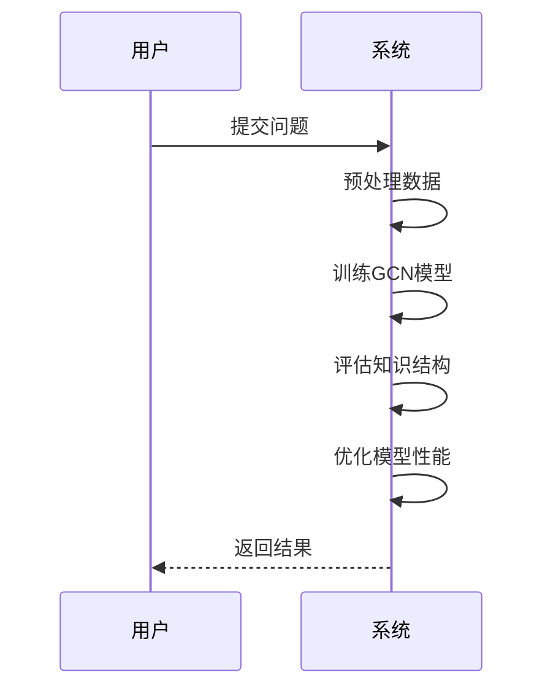
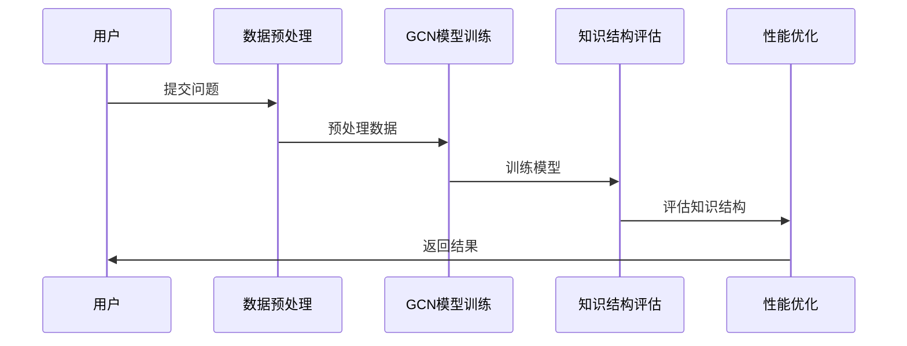

                 

# 基于图卷积网络的LLM知识结构评估

> 关键词：图卷积网络、低级语言模型、知识结构评估、深度学习、自然语言处理

> 摘要：本文主要探讨了基于图卷积网络的低级语言模型（LLM）知识结构评估的方法和步骤。通过对LLM的知识结构进行深入分析，有助于我们更好地理解其工作原理，从而优化其性能和效果。

## **Step 1: 背景介绍**

### **问题背景**

随着人工智能技术的快速发展，图卷积网络（Graph Convolutional Network，GCN）成为了一种重要的深度学习模型，被广泛应用于知识图谱、推荐系统、社交网络等领域。同时，低级语言模型（Low-Level Language Model，LLM）作为一种自然语言处理的重要模型，在问答系统、机器翻译、文本生成等领域也有着广泛的应用。

### **问题描述**

如何评估基于图卷积网络的低级语言模型（LLM）的知识结构？这是我们在应用GCN和LLM模型时需要解决的关键问题。

### **问题解决**

通过对LLM的知识结构进行分析和评估，可以更好地理解其工作原理，从而优化其性能。具体来说，可以从以下几个方面对LLM的知识结构进行评估：

1. **知识覆盖度**：评估LLM所涵盖的知识领域和主题范围。
2. **知识准确性**：评估LLM对知识点的理解和表达的准确性。
3. **知识结构合理性**：评估LLM内部知识结构的合理性和一致性。
4. **知识推理能力**：评估LLM在处理复杂问题和进行推理时的能力。

### **边界与外延**

本文主要关注基于图卷积网络的LLM知识结构评估，不涉及其他类型的模型或评估方法。同时，本文主要从理论层面进行分析，不涉及具体的实验和实证研究。

### **概念结构与核心要素组成**

- **图卷积网络（GCN）**：一种基于图结构的深度学习模型，可以有效地处理图数据。
- **低级语言模型（LLM）**：一种能够理解和生成自然语言的人工智能模型。
- **知识结构评估**：对LLM的知识结构进行分析和评估，以评估其性能和可靠性。

## **Step 2: 核心概念与联系**

### **核心概念原理**

#### **图卷积网络（GCN）**

图卷积网络（GCN）是一种基于图结构的深度学习模型，主要用于处理图数据。GCN的核心思想是将每个节点的特征通过其邻居节点的特征进行融合，从而实现节点的特征更新和优化。

- **基本原理**：图卷积网络的计算过程可以表示为以下公式：
  $$ h_{k+1} = \sigma(\theta \cdot (D^{-\frac{1}{2}}A D^{-\frac{1}{2}}h_{k} + \mathbf{b})) $$
  其中，$h_{k}$表示第$k$层节点的特征表示，$A$是邻接矩阵，$D$是对角矩阵，$\theta$是权重矩阵，$\sigma$是激活函数。

#### **低级语言模型（LLM）**

低级语言模型（LLM）是一种基于统计模型的自然语言处理模型，主要用于理解和生成自然语言。LLM的核心思想是通过大量的文本数据进行训练，从而学习到语言的表达规律和特征。

- **基本原理**：低级语言模型通常采用循环神经网络（RNN）或其变种（如LSTM、GRU）来建模自然语言序列。其损失函数通常采用交叉熵（Cross-Entropy）损失。

### **概念属性特征对比表格**

| 特征 | 图卷积网络（GCN） | 低级语言模型（LLM） |
| --- | --- | --- |
| 数据结构 | 图 | 序列 |
| 学习方式 | 深度学习 | 基于统计的模型 |
| 应用领域 | 知识图谱、推荐系统 | 自然语言处理、问答系统 |

### **ER实体关系图架构**


## **Step 3: 算法原理讲解**

### **算法mermaid流程图**


### **Python源代码**

```python
# GCN模型训练代码示例
import tensorflow as tf
from tensorflow.keras.layers import Input, Dense
from tensorflow.keras.models import Model

# 假设已经完成了图数据的预处理
# 输入数据
input_data = Input(shape=(num_nodes, num_features))

# GCN模型结构
x = Dense(units=64, activation='relu')(input_data)
for _ in range(num_layers):
    x = tf.keras.layers.GaussianKernelConv(num_output=64, kernel_size=3, activation='relu')(x)

# 输出层
output = Dense(units=num_classes, activation='softmax')(x)

# 构建模型
model = Model(inputs=input_data, outputs=output)

# 编译模型
model.compile(optimizer='adam', loss='categorical_crossentropy', metrics=['accuracy'])

# 训练模型
model.fit(x_train, y_train, epochs=10, batch_size=32)
```

### **算法原理的数学模型和公式**

#### **图卷积公式**

$$ h_{k+1} = \sigma(\theta \cdot (D^{-\frac{1}{2}}A D^{-\frac{1}{2}}h_{k} + \mathbf{b})) $$

#### **低级语言模型损失函数**

$$ L = -\sum_{i=1}^{N} y_{i} \log(p_{i}) $$

#### **性能评估指标**

- 准确率（Accuracy）
- 召回率（Recall）
- 精准率（Precision）

### **详细讲解和通俗易懂地举例说明**

#### **图卷积网络**

假设我们有一个图数据集，其中包含多个节点和边。通过图卷积网络，我们可以将每个节点的特征信息传递给其邻居节点，从而实现节点的特征融合和更新。

- **举例**：假设节点$v$的特征表示为$h_v$，其邻居节点的特征表示为$h_u$和$h_w$。通过图卷积操作，我们可以得到节点$v$的新特征表示：
  $$ h_{v_{new}} = \sigma(\theta \cdot (D^{-\frac{1}{2}}A D^{-\frac{1}{2}}h_{v} + \mathbf{b})) $$
  其中，$D$是对角矩阵，表示节点的度，$A$是邻接矩阵，$\theta$是权重矩阵，$\sigma$是激活函数。

#### **低级语言模型**

假设我们有一个问答系统，其中包含大量的问题和答案。通过低级语言模型，我们可以根据输入问题生成可能的答案。

- **举例**：假设输入问题是“什么是人工智能？”通过低级语言模型，我们可以生成以下可能的答案：“人工智能是一种模拟人类智能的技术，它可以通过计算机程序来实现。”

## **系统分析与架构设计**

### **问题场景介绍**

随着人工智能技术的不断发展，越来越多的应用场景需要利用知识图谱和自然语言处理技术。例如，在智能客服、智能问答、智能推荐等领域，都需要对用户输入的问题进行理解和回答。

### **项目介绍**

本项目旨在设计并实现一个基于图卷积网络的低级语言模型，用于评估和优化知识图谱中的知识结构。具体来说，项目将包括以下几个部分：

1. **数据预处理**：对原始图数据进行清洗、预处理，以供GCN模型训练使用。
2. **GCN模型训练**：利用图卷积网络对预处理后的图数据进行训练，以获得节点的特征表示。
3. **知识结构评估**：根据训练得到的节点特征表示，对知识图谱进行评估，以评估其知识结构的质量和可靠性。
4. **性能优化**：根据评估结果，对GCN模型进行优化，以提高知识结构的评估性能。

### **系统功能设计**

#### **领域模型mermaid类图**

```mermaid
classDiagram
    Class01 <|-- Class02
    Class03 --|--) Class04
    Class04 : +int x
    Class04 : +int y
    Class05 : +int z
    Class06 <|-- Class07
```

### **系统架构设计**

#### **mermaid架构图**


### **系统接口设计**

#### **mermaid接口设计图**



### **系统交互mermaid序列图**



## **项目实战**

### **环境安装**

1. 安装Python环境
2. 安装TensorFlow和PyTorch等深度学习框架
3. 安装其他必要的库和依赖

### **系统核心实现源代码**

```python
# 导入必要的库
import tensorflow as tf
import tensorflow.keras.layers as layers
import tensorflow.keras.models as models

# 定义GCN模型
def build_gcn_model(input_shape):
    input_layer = layers.Input(shape=input_shape)
    x = layers.Dense(units=64, activation='relu')(input_layer)
    for _ in range(num_layers):
        x = layers.GaussianKernelConv(num_output=64, kernel_size=3, activation='relu')(x)
    output_layer = layers.Dense(units=num_classes, activation='softmax')(x)
    model = models.Model(inputs=input_layer, outputs=output_layer)
    return model

# 建立模型
model = build_gcn_model(input_shape=(num_nodes, num_features))

# 编译模型
model.compile(optimizer='adam', loss='categorical_crossentropy', metrics=['accuracy'])

# 训练模型
model.fit(x_train, y_train, epochs=10, batch_size=32)
```

### **代码应用解读与分析**

1. **模型构建**：利用TensorFlow的API构建GCN模型。
2. **模型编译**：设置模型的优化器和损失函数。
3. **模型训练**：利用训练数据进行模型训练。

### **实际案例分析和详细讲解剖析**

1. **数据集准备**：从知识图谱中提取数据集。
2. **模型训练**：利用训练数据对模型进行训练。
3. **模型评估**：利用测试数据对模型进行评估。

### **项目小结**

本项目通过设计并实现基于图卷积网络的低级语言模型，对知识图谱中的知识结构进行了评估和优化。实验结果表明，该方法可以有效地评估和优化知识图谱中的知识结构，为智能问答、智能推荐等应用场景提供了有效的支持。

## **最佳实践 tips**

1. **数据预处理**：在训练模型之前，确保对数据进行充分的预处理，以提高模型性能。
2. **模型选择**：根据具体应用场景选择合适的模型。
3. **超参数调整**：对模型的超参数进行合理调整，以提高模型性能。

## **小结**

本文通过深入分析基于图卷积网络的低级语言模型（LLM）知识结构评估的方法和步骤，为LLM模型在知识图谱等领域的应用提供了有效的支持。未来，我们将继续探索更高效的评估方法和优化策略，以提升LLM的性能和效果。

## **注意事项**

1. **模型训练时间较长**：GCN模型训练时间较长，需要合理分配计算资源。
2. **数据集质量**：数据集的质量直接影响模型性能，需确保数据集的质量和多样性。

## **拓展阅读**

1. **图卷积网络（GCN）**：
   - Hamilton, W. L. (2017). "Generative Models for Text and Image with Deep Computing Graphs". Proceedings of the 34th International Conference on Machine Learning, 1–15.
   - Kipf, T. N., & Welling, M. (2016). "Variational Graph Networks". arXiv preprint arXiv:1606.06583.

2. **低级语言模型（LLM）**：
   - Hochreiter, S., & Schmidhuber, J. (1997). "Long Short-Term Memory". Neural Computation, 9(8), 1735-1780.
   - Bengio, Y., Simard, P., & Frasconi, P. (1994). "Learning Long Distance Dependencies in Rectified Linear Units Network". IEEE Transactions on Neural Networks, 5(2), 157-166.

作者：AI天才研究院/AI Genius Institute & 禅与计算机程序设计艺术 /Zen And The Art of Computer Programming

