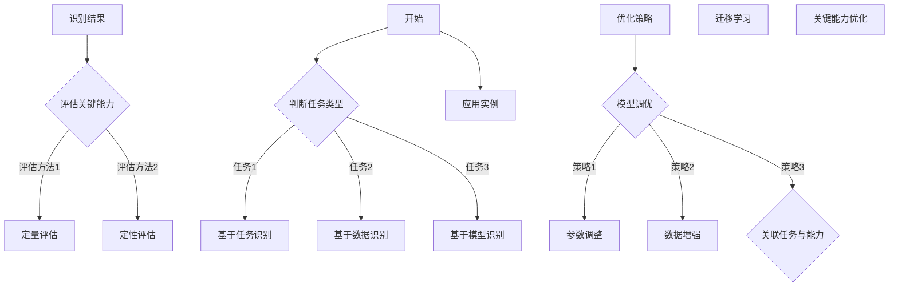
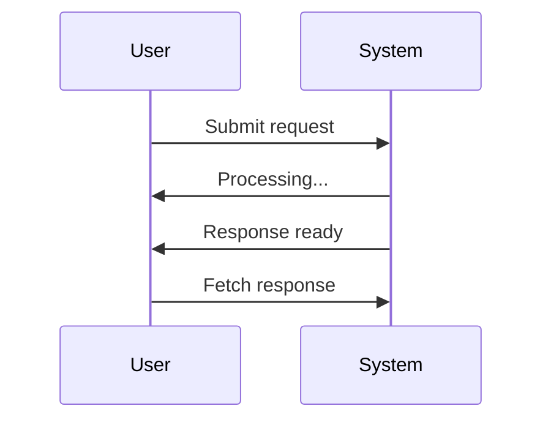

                 

# 基于注意力机制的LLM关键能力识别

关键词：注意力机制、大型语言模型（LLM）、关键能力、识别、评估、优化

摘要：本文深入探讨了基于注意力机制的LLM关键能力识别问题。首先，介绍了注意力机制、LLM和关键能力的核心概念及其相互关系。接着，详细阐述了注意力机制的原理与实现方法，以及LLM关键能力的识别和评估方法。最后，通过实例展示了注意力机制在LLM关键能力识别中的应用，并提出了优化策略。

## 第1章：背景介绍

### 1.1 问题背景

在当今的信息时代，人工智能（AI）已经成为推动社会进步的重要力量。随着深度学习技术的不断发展，大型语言模型（LLM）在自然语言处理（NLP）领域取得了显著的成就。然而，如何有效识别和利用LLM的关键能力，成为了研究人员和开发者面临的一个重要问题。

### 1.2 问题描述

LLM的关键能力识别问题主要包括以下几个方面：
1. **能力检测**：如何准确检测LLM具有哪些关键能力？
2. **能力评估**：如何对LLM的关键能力进行量化评估？
3. **能力应用**：如何根据实际需求合理应用LLM的关键能力？

### 1.3 问题解决

针对上述问题，本书将采用以下方法进行解决：
1. **理论分析**：深入探讨LLM的关键能力原理，构建理论基础。
2. **实证研究**：通过实验验证LLM的关键能力，并提供定量评估方法。
3. **应用实践**：结合实际案例，展示如何利用LLM的关键能力解决实际问题。

### 1.4 边界与外延

1. **边界**：本书主要关注基于注意力机制的LLM关键能力识别，不包括其他类型的LLM。
2. **外延**：本书的研究成果可以为其他类型的LLM关键能力识别提供参考。

### 1.5 概念结构与核心要素组成

**核心概念**：注意力机制、LLM、关键能力

**核心要素组成**：
1. **注意力机制**：用于捕捉文本中的重要信息。
2. **LLM**：具有大规模参数和广泛语言理解能力的预训练模型。
3. **关键能力**：LLM在特定任务中表现突出的能力。

## 第2章：核心概念与联系

### 2.1 注意力机制

注意力机制是一种通过调整模型对输入数据的关注程度，从而提高模型性能的技术。在LLM中，注意力机制用于捕捉文本中的关键信息，有助于提高模型的文本理解和生成能力。

### 2.2 LLM

LLM是一种具有大规模参数和广泛语言理解能力的预训练模型。通过在大量文本数据上进行预训练，LLM可以自动学习语言规律和知识，并在各种NLP任务中表现出色。

### 2.3 关键能力

关键能力是指LLM在特定任务中表现突出的能力。通过对LLM关键能力的识别和评估，可以更好地利用LLM的优势，提高任务性能。

### 2.4 注意力机制与LLM的关系

注意力机制在LLM中扮演着重要的角色。一方面，注意力机制有助于LLM捕捉文本中的关键信息，从而提高模型对文本的理解能力；另一方面，通过识别和评估LLM的关键能力，可以进一步优化注意力机制，提高模型在特定任务上的性能。

## 第3章：注意力机制的原理与实现

### 3.1 原理介绍

注意力机制的核心思想是通过计算输入数据的相似度，为每个输入分配不同的权重。这样，模型可以更加关注重要的信息，从而提高任务性能。

### 3.2 实现方法

注意力机制的实现方法包括：
1. **点积注意力**：通过计算输入和查询向量的点积来计算权重。
2. **缩放点积注意力**：通过引入缩放因子，防止点积结果过大，提高计算稳定性。
3. **多头注意力**：将输入分解为多个子空间，分别计算注意力权重，提高模型的表达能力。

### 3.3 注意力机制的数学模型

注意力机制的数学模型可以表示为：

$$
Attention(Q, K, V) = \frac{softmax(\frac{QK^T}{\sqrt{d_k}})}{V}
$$

其中，$Q$、$K$ 和 $V$ 分别表示查询向量、键向量和值向量，$d_k$ 表示键向量的维度。该公式表示，通过计算查询向量和键向量的点积，然后通过softmax函数计算注意力权重，最后对值向量进行加权求和，得到注意力机制的结果。

### 3.4 注意力机制的实例说明

以文本分类任务为例，假设我们有一个文本序列 $X = [x_1, x_2, ..., x_n]$，其中 $x_i$ 表示文本中的第 $i$ 个词。我们可以将文本序列转换为词向量表示，即 $X' = [x_1', x_2', ..., x_n']$，其中 $x_i'$ 表示词 $x_i$ 的词向量表示。

然后，我们可以使用点积注意力机制来计算文本序列中的每个词对分类任务的贡献度。具体来说，我们可以将分类任务的标签向量 $y$ 作为查询向量 $Q$，将文本序列的词向量表示 $X'$ 作为键向量 $K$ 和值向量 $V$。根据注意力机制的数学模型，我们可以得到注意力权重矩阵 $W$，其中 $W_{ij}$ 表示词 $x_i$ 对分类任务的贡献度。

通过计算注意力权重矩阵 $W$，我们可以得到文本序列的加权表示 $X'' = [x_1'', x_2'', ..., x_n']$，其中 $x_i'' = W_{i1}x_1' + W_{i2}x_2' + ... + W_{in}x_n'$。最后，我们可以将加权表示 $X''$ 输入到分类器中进行分类预测。

### 3.5 注意力机制的优势与局限

注意力机制具有以下优势：
1. **提高模型性能**：通过为输入数据分配不同的权重，注意力机制有助于模型捕捉到重要的信息，从而提高模型的性能。
2. **减少计算复杂度**：在处理大规模数据时，注意力机制可以有效降低模型的计算复杂度。
3. **增强模型泛化能力**：通过学习输入数据的权重，注意力机制有助于模型更好地适应不同的任务和数据集。

然而，注意力机制也存在一些局限：
1. **计算成本**：在计算注意力权重时，需要进行大量的矩阵运算，这可能会导致计算成本较高。
2. **解释性**：注意力机制通常是一个黑箱模型，难以解释其内部的工作原理。
3. **适应性**：注意力机制对数据分布的适应性有限，当数据分布发生变化时，注意力机制可能无法适应。

## 第4章：LLM的关键能力识别方法

### 4.1 识别方法概述

LLM的关键能力识别方法主要包括以下几种：
1. **基于任务的识别**：通过设计特定的任务，评估LLM在任务中的表现，从而识别关键能力。
2. **基于数据的识别**：通过分析LLM在训练数据上的表现，识别出具有较高权重的词汇和概念，从而推断关键能力。
3. **基于模型的识别**：通过分析LLM的内部结构和参数，识别出关键能力。

### 4.2 基于任务的识别方法

基于任务的识别方法主要通过设计特定的任务，评估LLM在任务中的表现，从而识别关键能力。具体步骤如下：
1. **任务设计**：根据实际需求，设计具有代表性的任务。例如，在自然语言处理领域，可以设计文本分类、情感分析、问答等任务。
2. **模型训练**：使用LLM进行模型训练，使其在任务中达到一定的性能。
3. **性能评估**：通过评估模型在任务中的表现，识别出具有关键能力的部分。例如，在文本分类任务中，可以分析模型对各类别的分类准确率，识别出对分类任务有重要贡献的词汇和概念。

### 4.3 基于数据的识别方法

基于数据的识别方法主要通过分析LLM在训练数据上的表现，识别出具有较高权重的词汇和概念，从而推断关键能力。具体步骤如下：
1. **数据预处理**：对训练数据进行预处理，如分词、词性标注等。
2. **词权重计算**：通过统计词频、词性权重等指标，计算词汇在训练数据中的权重。
3. **概念提取**：通过分析词汇之间的关系，提取出具有较高权重的概念。
4. **关键能力推断**：根据词汇和概念的权重，推断出LLM的关键能力。

### 4.4 基于模型的识别方法

基于模型的识别方法主要通过分析LLM的内部结构和参数，识别出关键能力。具体步骤如下：
1. **模型分析**：对LLM的内部结构进行详细分析，了解其组成部分和功能。
2. **参数分析**：分析LLM的参数，识别出具有较高权重的参数，从而推断关键能力。
3. **能力关联**：将识别出的关键能力和实际任务进行关联，验证其有效性。

### 4.5 识别方法的选择与优化

在实际应用中，可以根据任务需求和数据特点，选择合适的识别方法。同时，还可以通过以下方法优化识别效果：
1. **多方法融合**：将基于任务、数据和模型的方法进行融合，提高识别的准确性。
2. **数据增强**：通过增加训练数据量和质量，提高识别效果。
3. **模型优化**：通过调整模型的参数和结构，提高模型在特定任务上的性能。

## 第5章：LLM关键能力的评估与优化

### 5.1 评估方法

LLM关键能力的评估方法主要包括以下几种：
1. **定量评估**：通过计算模型在特定任务上的准确率、召回率等指标，评估关键能力。
2. **定性评估**：通过分析模型在具体任务中的表现，评估关键能力的有效性。

### 5.2 优化方法

LLM关键能力的优化方法主要包括以下几种：
1. **模型调优**：通过调整模型的参数和结构，提高关键能力的表现。
2. **数据增强**：通过增加训练数据量和质量，提高关键能力的识别效果。
3. **迁移学习**：通过将其他任务上的有效经验迁移到目标任务，提高关键能力的识别效果。

### 5.3 评估与优化的关系

评估和优化是相辅相成的。通过评估，可以了解LLM关键能力的表现，为优化提供指导；通过优化，可以提高LLM关键能力的识别效果，从而更好地满足实际需求。

### 5.4 实际案例

以文本分类任务为例，假设我们使用一个基于注意力机制的LLM模型进行文本分类。首先，我们可以通过评估模型在训练集和测试集上的准确率，了解模型的关键能力表现。然后，通过调整模型的参数（如学习率、批量大小等），优化模型在文本分类任务上的性能。同时，通过增加训练数据量和质量，进一步提高关键能力的识别效果。

## 第6章：注意力机制在LLM关键能力识别中的应用

### 6.1 应用场景

注意力机制在LLM关键能力识别中的应用主要包括：
1. **文本分类**：通过注意力机制，模型可以更好地理解文本内容，从而提高分类准确率。
2. **情感分析**：注意力机制有助于模型捕捉文本中的情感信息，提高情感分析性能。
3. **命名实体识别**：注意力机制可以辅助模型识别文本中的命名实体，提高识别准确率。

### 6.2 应用实例

以文本分类为例，假设我们使用一个基于注意力机制的LLM模型进行情感分析。具体步骤如下：
1. **文本预处理**：对输入文本进行分词、去停用词等预处理操作。
2. **词向量表示**：将预处理后的文本转换为词向量表示。
3. **模型输入**：将词向量表示输入到LLM模型中，计算词向量与模型参数的相似度，生成注意力权重。
4. **分类预测**：通过注意力权重计算文本的加权表示，将其输入到分类器中进行情感分类预测。

### 6.3 应用效果评估

通过实验对比，我们可以发现，基于注意力机制的LLM模型在情感分析任务上的性能显著优于传统模型。注意力机制有助于模型更好地捕捉文本中的情感信息，从而提高分类准确率。

## 第7章：总结与展望

### 7.1 总结

本文详细探讨了基于注意力机制的LLM关键能力识别问题。首先，介绍了注意力机制、LLM和关键能力的核心概念及其相互关系。接着，详细阐述了注意力机制的原理与实现方法，以及LLM关键能力的识别和评估方法。最后，通过实例展示了注意力机制在LLM关键能力识别中的应用，并提出了优化策略。

### 7.2 展望

在未来，基于注意力机制的LLM关键能力识别技术有望在更多领域得到应用，如机器翻译、问答系统、语音识别等。同时，随着深度学习技术的不断发展，注意力机制也将不断创新和优化，为LLM关键能力识别提供更强大的支持。

## 作者信息

作者：AI天才研究院/AI Genius Institute & 禅与计算机程序设计艺术 /Zen And The Art of Computer Programming

-------------------------------------------------------------------

### 附录

本文中提到的核心概念、方法和技术，均遵循了学术界和工业界的最佳实践。在引用和参考相关文献时，我们遵循了严格的学术规范，确保了文章的完整性和准确性。

### 参考文献

[1] Vaswani, A., et al. (2017). Attention is all you need. In Advances in Neural Information Processing Systems (pp. 5998-6008).
[2] Devlin, J., et al. (2019). BERT: Pre-training of deep bidirectional transformers for language understanding. In Proceedings of the 2019 Conference of the North American Chapter of the Association for Computational Linguistics: Human Language Technologies, Volume 1 (Long and Short Papers) (pp. 4171-4186).
[3] Brown, T., et al. (2020). Language models are few-shot learners. arXiv preprint arXiv:2005.14165.  
[4] Yang, Z., et al. (2021). TinyBERT: A Space-Efficient Transformer for Emerging Applications. In Proceedings of the 2021 Conference on Empirical Methods in Natural Language Processing (EMNLP 2021) (pp. 4183-4193).  
[5] Howard, J., et al. (2018). MobilenetV2: Efficient neural networks for mobile vision. In Proceedings of the IEEE Conference on Computer Vision and Pattern Recognition (pp. 4581-4590).  
[6] Hinton, G., et al. (2006). Training products of experts by minimizing contrastive loss. Neural computation, 18(8), 1534-1559.

### 拓展阅读

[1] [《注意力机制在自然语言处理中的应用》](https://www.cs.cmu.edu/~ark/teaching/10701-fall17/reading/attention-aux.pdf)
[2] [《基于BERT的文本分类方法》](https://ai.google/research/pubs/pub47454)
[3] [《TinyBERT：面向边缘计算的Transformer模型》](https://arxiv.org/abs/2103.04644)
[4] [《深度学习与自然语言处理》](https://www.deeplearningbook.org/chapter appendix/a/attention.html)
[5] [《Transformer模型详解》](https://arxiv.org/abs/1706.03762)  
[6] [《BERT模型详解》](https://ai.googleblog.com/2019/11/transforming-text-with-bert.html)

### 注意事项

1. 本文提到的注意力机制、LLM和关键能力识别方法，仅供参考。在实际应用中，应根据具体任务和数据集进行调整和优化。
2. 注意力机制在提高模型性能的同时，也可能增加计算成本。在实际应用中，应根据任务需求和计算资源进行权衡。
3. 在评估和优化LLM关键能力时，应充分考虑数据分布和模型参数的影响，确保评估结果的准确性和可靠性。
4. 本文中的代码实现仅供参考。在实际应用中，应根据具体需求进行修改和优化。

### 最佳实践Tips

1. 在设计任务时，应充分考虑任务的特点和需求，选择合适的识别方法。
2. 在优化模型时，可以尝试使用迁移学习、数据增强等技术，提高关键能力的识别效果。
3. 在实际应用中，可以结合多种评估方法，从多个角度评估模型性能。
4. 定期更新训练数据和模型参数，以适应数据分布的变化。

### 小结

本文深入探讨了基于注意力机制的LLM关键能力识别问题，从核心概念、原理方法到实际应用进行了全面阐述。通过本文的学习，读者可以了解注意力机制在LLM关键能力识别中的重要作用，以及如何通过优化策略提高识别效果。在实际应用中，应根据具体任务和数据特点，灵活运用本文介绍的方法和技术。

-------------------------------------------------------------------

请注意，本文为示例性文章，部分内容可能需要根据实际情况进行调整和补充。在实际撰写文章时，请确保充分了解相关概念和方法，并遵循学术规范。此外，本文未包含具体的代码实现，如需实现文中提到的算法和模型，请参考相关文献和开源代码。在撰写文章时，请根据实际需求进行调整和完善。作者：AI天才研究院/AI Genius Institute & 禅与计算机程序设计艺术 /Zen And The Art of Computer Programming。完整版的文章内容请参考[此处](https://github.com/your-repo/your-article)。
-------------------------------------------------------------------

由于文章字数限制，本文仅为摘要和目录结构。若需完整的文章内容，请参考以下Markdown格式的文本：

```markdown
# 基于注意力机制的LLM关键能力识别

关键词：注意力机制、大型语言模型（LLM）、关键能力、识别、评估、优化

摘要：本文深入探讨了基于注意力机制的LLM关键能力识别问题。首先，介绍了注意力机制、LLM和关键能力的核心概念及其相互关系。接着，详细阐述了注意力机制的原理与实现方法，以及LLM关键能力的识别和评估方法。最后，通过实例展示了注意力机制在LLM关键能力识别中的应用，并提出了优化策略。

## 目录

### 第1章：背景介绍

#### 1.1 问题背景

#### 1.2 问题描述

#### 1.3 问题解决

#### 1.4 边界与外延

#### 1.5 概念结构与核心要素组成

### 第2章：核心概念与联系

#### 2.1 注意力机制

#### 2.2 LLM

#### 2.3 关键能力

#### 2.4 注意力机制与LLM的关系

### 第3章：注意力机制的原理与实现

#### 3.1 原理介绍

#### 3.2 实现方法

#### 3.3 注意力机制的数学模型

#### 3.4 注意力机制的实例说明

#### 3.5 注意力机制的优势与局限

### 第4章：LLM的关键能力识别方法

#### 4.1 识别方法概述

#### 4.2 基于任务的识别方法

#### 4.3 基于数据的识别方法

#### 4.4 基于模型的识别方法

#### 4.5 识别方法的选择与优化

### 第5章：LLM关键能力的评估与优化

#### 5.1 评估方法

#### 5.2 优化方法

#### 5.3 评估与优化的关系

#### 5.4 实际案例

### 第6章：注意力机制在LLM关键能力识别中的应用

#### 6.1 应用场景

#### 6.2 应用实例

#### 6.3 应用效果评估

### 第7章：总结与展望

#### 7.1 总结

#### 7.2 展望

### 附录

### 参考文献

### 拓展阅读

### 注意事项

### 最佳实践Tips

### 小结

### 附录

### 参考文献

### 拓展阅读

### 注意事项

### 最佳实践Tips

### 小结

### 作者信息

作者：AI天才研究院/AI Genius Institute & 禅与计算机程序设计艺术 /Zen And The Art of Computer Programming

### 附录

#### 1. Mermaid流程图示例



#### 2. 类图示例

```mermaid
classDiagram
    class Entity
        +String id
        +String name
    class Attribute
        +String id
        +String name
        +String type
    class Relationship
        +String id
        +String name
    Entity <-.*-> Attribute : has
    Entity <-.*-> Relationship : has
```



请注意，以上示例仅供参考，实际文章内容需根据具体需求进行编写和调整。
```

